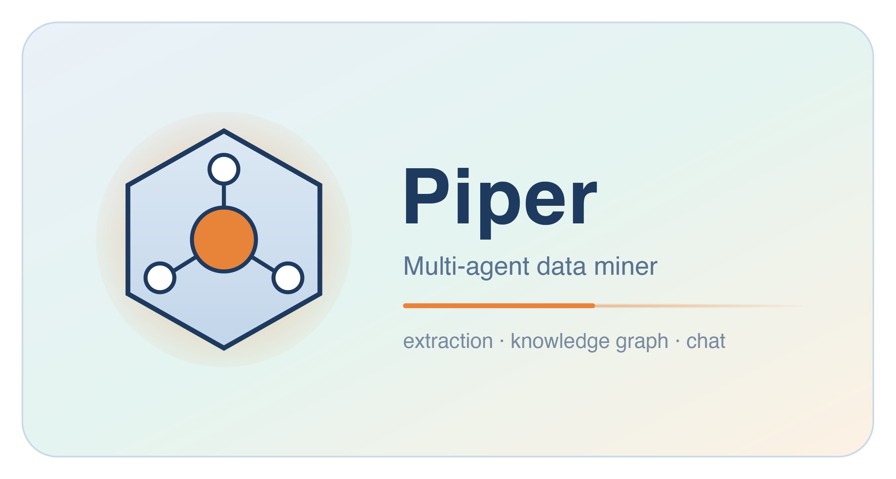

  

# Piper Multi-Agent

  

Piper is a multi-agent AI system for extracting structured chemistry data from scientific papers and querying it through a research assistant powered by fusion RAG.

  

---

  

## What it does

  

**Extraction** — Upload a chemistry PDF and Piper automatically extracts reaction conditions, SMILES, catalysts, solvents, yields using a group of specialized AI agents.

  

**Knowledge Graph** — Builds a graph of reactions and molecules across your paper collection for exploration and analysis.

  

**Fusion RAG Chat** — Ask questions about your literature in plain English and get answers grounded in the source papers.

  

---

  

## Setup

  

**Requirements:** Python 3.10+, an [OpenRouter](https://openrouter.ai) API key

  

```bash

git  clone  https://github.com/lebertbill/Piper.git

cd  Piper

  

python  -m  venv  venv

source  venv/bin/activate

  

pip  install  -r  requirements.txt

```

  

Add your API key to a `.env` file:

```

OPENROUTER_API_KEY=your_key_here

```

  

### First-run: create context.json

  

Piper reads all its runtime configuration from `context.json` in the project root. You must create it before starting the app for the first time.

  

Copy the template:

```bash

cp  context_template.json  context.json

```

  

Then run the app:

```bash

python -m streamlit run Piper_Extractor.py

```

  

Open the sidebar on the **Piper Extractor** page and fill in your settings (see [Configuration](#configuration) below), then click **Save Configuration**. This writes your choices back to `context.json` and makes them available to all pages.

  

>  `context.json` is required for the app to start

  

---

  

## Configuration

  

All settings are managed through the sidebar of the **Piper Extractor** page and saved to `context.json`. You can also edit `context.json` directly with a text editor.

  

### Models

  

| Setting | Key in context.json | Description |

|---|---|---|

| Embedding Model | `embedding.embedding_model` | Model used to embed paper chunks (and multimodal figures) for vector search. Default: `google/gemini-embedding-2-preview` (3072-dim, multimodal). Also editable from the Chat page sidebar — same key, either page. |

| Language Model (LLM) | `model.rag_model_name` | Default/fallback LLM. Also drives structural (SMILES) search, HippoRAG, hybrid search, and the Knowledge Graph Enrich step (see "RAG Model" below — same key, editable from either page). |

| Reaction Model | `model.agents.reaction_model` | Extracts reaction SMILES and conditions from scheme images. |

| Text Reaction Model | `model.agents.text_reaction_model` | Extracts reactions described in prose (no image). |

| R-Group Model | `model.agents.r_group_model` | Resolves R-group substitution tables. |

| Molecular Model | `model.agents.molecular_model` | Interprets individual molecule structures. |

| Structure Parser Model | `model.agents.structure_parser_model` | Parses the overall document structure (tables, schemes, figures). Multimodal — use a vision model. Also drives table-text extraction, which shares this key. |

| Advanced Structure Model | `model.agents.advanced_structure_model` | Parses detailed structure (tables/schemes/figures/product registries with column-level mappings), visually cross-checking figures. Multimodal. |

| Classifier Model | `model.agents.classifier_model` | Classifies the whole article once (Experimental / Review / Theoretical) — determines whether extraction proceeds at all. |

| Reaction Table Detector Model | `model.agents.reaction_table_detector_model` | Classifies each extracted image as a reaction table, scheme, or junk (logo/icon) before per-figure extraction. |

| Fixed Condition Extractor Model | `model.agents.fixed_condition_extractor_model` | Resolves fixed conditions and per-entry footnote overrides from the surrounding article prose. |

| Label Resolver Model | `model.agents.label_resolver_model` | Resolves compound labels (e.g. "4b", "PC1") to SMILES via a 7-tier cascade. Multimodal — use a vision model. |

| SMILES Repair Model | `model.agents.smiles_repair_model` | Repairs invalid/malformed SMILES strings to be RDKit-compatible, in the final sanitization pass. |

| SMILES Extractor Model *(inactive)* | `model.agents.smiles_extractor_model` | Still shown in the sidebar for now, but currently has no effect — kept for a future extraction path. |

  

All model values are OpenRouter model IDs (e.g. `openai/gpt-4o`, `google/gemini-3-flash-preview`).

  

### Extraction Flags

  

| Setting | Key in context.json | Default | Description |

|---|---|---|---|

| Enable Visualheist Fallback | `enable_visualheist_fallback` | `true` | When Docling can't parse a hybrid image+text table or it produces a low res image, VisualHeist re-crops the full table directly from the PDF at high DPI. Requires an isolated virtualenv on first use. |

| Force Visualheist for Label Resolution | `force_enable_visualheist_fallback` | `false` | Always use the VisualHeist-cropped image for label resolution. Only effective when Visualheist Fallback is also enabled. |

| Process Substrate Scope Tables (Under development) | `enable_scope_table_processing` | `true` | When ON, scope tables (each row = different substrate, fixed conditions) are extracted alongside optimization tables. Turn OFF to process only condition optimization tables.  |

| Build Global Label Registry | `build_global_labels` | `false` | When OFF (default), only resolves compound labels from figures explicitly referenced by the table's columns (`label_map_source_id`). When ON, resolves every labelled figure in the document — useful when condition text references labels in unlinked figures, but slower and more expensive. |

  

### Processing Parameters

  

| Setting | Key in context.json | Default | Description |

|---|---|---|---|

| Chunk Size | `chunking.chunk_words` | `600` | Number of words per text chunk for RAG indexing. |

| Chunk Overlap | `chunking.chunk_overlap_words` | `120` | Word overlap between consecutive chunks to preserve context across boundaries. |

| Max Summary Words | `chunking.max_summary_words` | `250` | Maximum length of the per-chunk summary generated during ingestion. |

| Top-K General | `retrieval.top_k_general` | `8` | Number of chunks retrieved for open-ended general queries. |

| Top-K Filtered | `retrieval.top_k_filtered` | `6` | Number of chunks retrieved when the query targets a specific paper, author, or year. |

| Top-K Structured | `retrieval.top_k_structured` | `20` | Number of chunks retrieved for structured/list queries (e.g. "list all catalysts"). |

  

### API & Other Services

  

| Setting | Key in context.json | Description |

|---|---|---|

| CrossRef Email | `crossref.email` | Email address for CrossRef's polite API pool. Used to fetch DOI metadata for papers. |

  

---

  

## Knowledge Graph & RAG Settings (Chat page)

  

These settings are controlled from the sidebar of the **Chat** page and are not saved to `context.json` — they apply per session.

  

### Knowledge Graph

  

| Setting | Description |

|---|---|

| Data Root | Path to the folder containing extracted paper subfolders (`extracted_data/`). |

| Tanimoto threshold | Molecular similarity cutoff (0.5–1.0, default 0.7) for drawing `SIMILAR_TO` edges between compound nodes. Two compounds are linked if their Morgan fingerprint Tanimoto similarity exceeds this value. Lower = more edges, more connections across papers; higher = only near-identical structures are linked. |

| Reaction similarity threshold | Tanimoto cutoff (0.6–1.0, default 0.85) for `SIMILAR_REACTION` edges. Compares reaction fingerprints (reactant+product set). Higher means only near-identical reactions are linked. |

| Max nodes in graph viz | Upper limit on nodes rendered in the interactive graph view (default 200). Does not affect the underlying graph — only the visualization. |

| Preferred run (global) | When a paper was processed multiple times, select which extraction run to use for building the KG. Can be overridden per paper. |

  

### RAG Index

  

| Setting | Description |

|---|---|

| Extracted Data Folder | Path to `extracted_data/` used for FAISS index building. |

| Preferred run (RAG) | Which extraction run to use per paper when building the RAG index. |

| Force Re-ingest | Wipes the existing FAISS index and re-embeds all chunks from scratch. |

  

### RAG Models (saved to context.json)

  

| Setting | Key | Description |

|---|---|---|

| Embedding Model | `embedding.embedding_model` | Same setting as the Piper Extractor sidebar — editable from either page. |

| Query Classification | `model.query_classification_model` | Classifies the user's query into one of: general, filtered, list, recommendation. Determines the retrieval strategy and RRF weights. |

| Entity Extraction | `model.entity_extraction_model` | Extracts named entities (author, year, catalyst, reaction type) from the query to enable filtered retrieval. |

| Chunk Summarization | `model.chunk_summarization_model` | Summarizes each retrieved chunk in parallel before synthesis. This is the highest-cost step — use an efficient model. |

| Final Answer Synthesis | `model.hybrid_synthesis_model` | Synthesizes all chunk summaries and KG context into the final answer. Multimodal — receives figure images at synthesis time. |

| RAG Model | `model.rag_model_name` | Used by structural (SMARTS/SMILES) search, HippoRAG, hybrid search, and the Enrich KG step — separate from Chunk Summarization above. |

  

---

  

## context.json reference

  

Full structure with all supported keys:

  

```json

{

"question": " ",

"folder_path": "/path/to/your/papers",

"model": {

"mode": "remote",

"rag_model_name": "openai/gpt-4o",

"chunk_summarization_model": "openai/gpt-4o",

"model_name": "openai/gpt-4o",

"base_url": "https://openrouter.ai/api/v1",

"openrouter_url": "https://openrouter.ai/api/v1",

"max_summary_words": 500,

"extraction_model": "openai/gpt-4o",

"hybrid_synthesis_model": "google/gemini-2.5-flash",

"query_classification_model": "openai/gpt-4o",

"entity_extraction_model": "openai/gpt-4o",

"agents": {

"article_context_model": "google/gemini-3-flash-preview",

"reaction_model": "openai/gpt-4o",

"text_reaction_model": "openai/gpt-4o",

"r_group_model": "openai/gpt-4o",

"molecular_model": "openai/gpt-4o",

"structure_parser_model": "google/gemini-3-flash-preview",

"classifier_model": "openai/gpt-4o",

"smiles_extractor_model": "openai/gpt-4o",

"summarizer_model": "openai/gpt-4o",

"image_grabber_model": "openai/gpt-4o",

"label_resolver_model": "google/gemini-3-flash-preview",

"advanced_structure_model": "google/gemini-3-flash-preview",

"reaction_table_detector_model": "openai/gpt-4o",

"fixed_condition_extractor_model": "openai/gpt-4o",

"smiles_repair_model": "openai/gpt-4o"

}

},

"embedding": {

"provider": "gemini",

"gemini_model": "google/gemini-embedding-2-preview",

"faiss_index_path": "papers_faiss",

"embedding_model": "google/gemini-embedding-2-preview"

},

"chunking": {

"chunk_words": 600,

"chunk_overlap_words": 120,

"max_summary_words": 250

},

"retrieval": {

"top_k_general": 8,

"top_k_filtered": 6,

"top_k_structured": 20

},

"crossref": {

"email": "your@email.com"

},

"debug_mode": false,

"query_responder": true,

"chunk_by_document": false,

"enable_visualheist_fallback": true,

"force_reingest": false,

"build_global_labels": false,

"enable_scope_table_processing": true,

"force_enable_visualheist_fallback": false,

"extracted_data_root": "extracted_data"

}

```

  

---

  

## Citation

  

> Publication details will be added upon release.

  

## License

  

MIT License — see [LICENSE](LICENSE) for details.