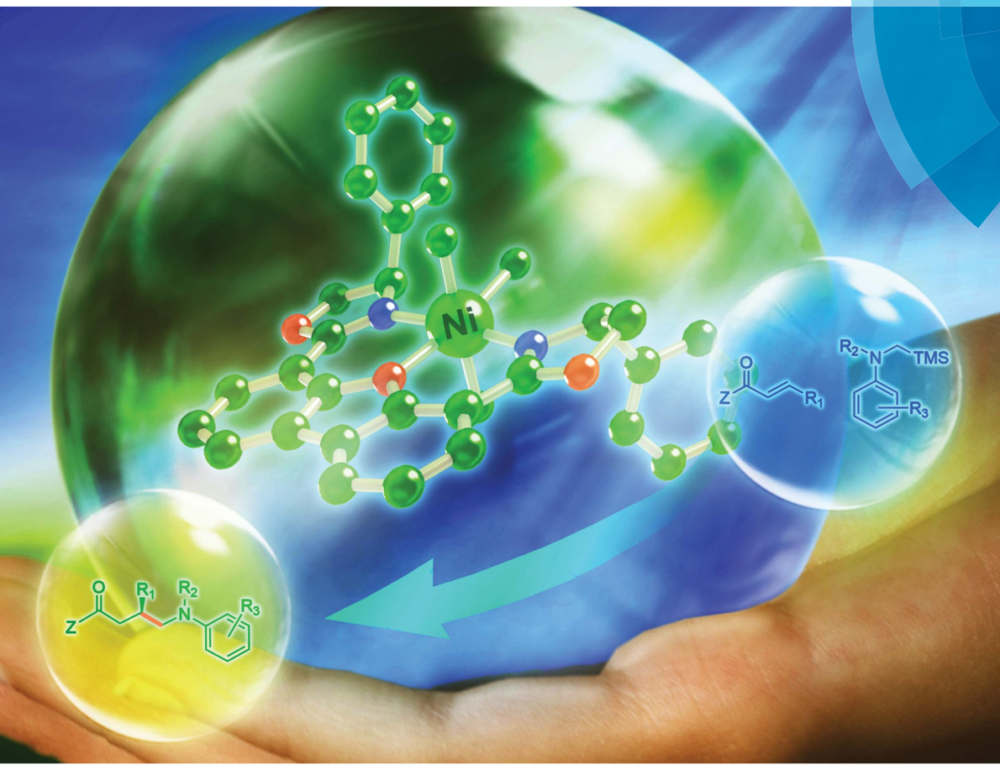
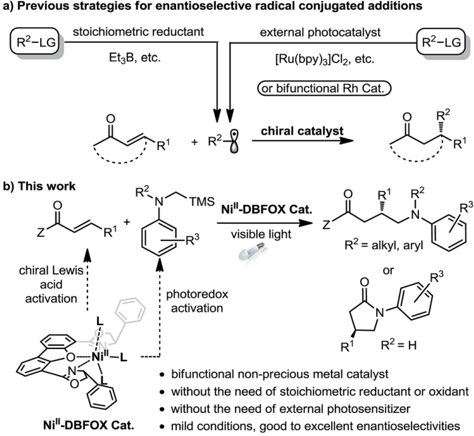
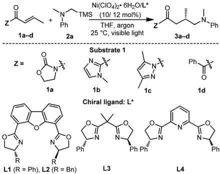
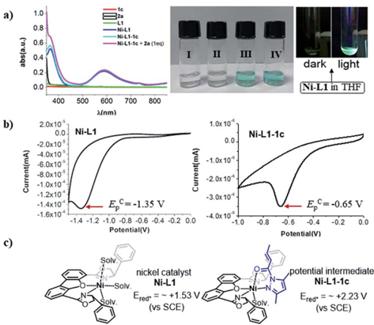
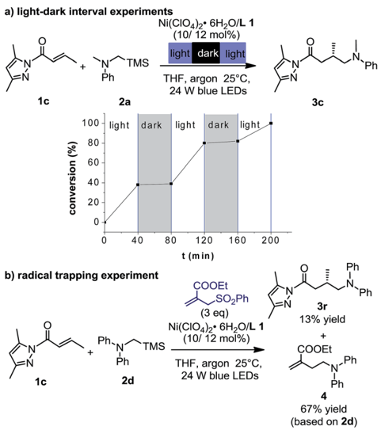
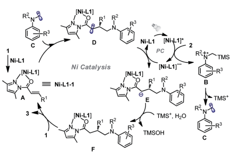
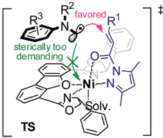
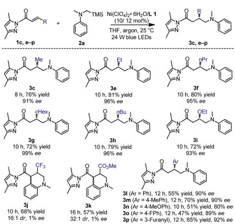
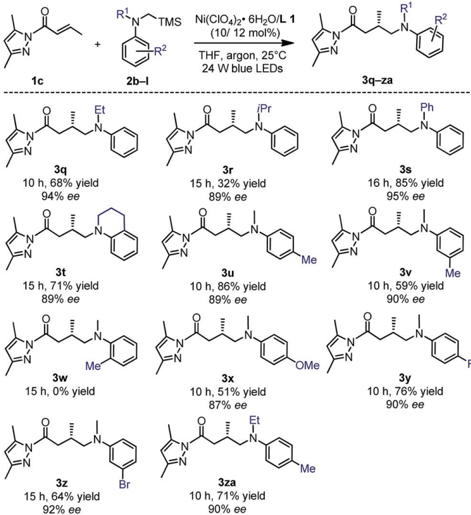
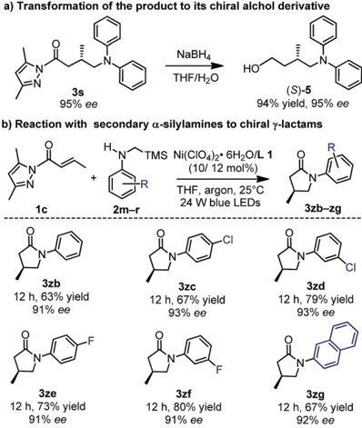

sc cnemmcal-scence

## Chemical Science

rsc.li/chemical-science

Ni

ISSN 2041-6539

EDGE ARTICLE Lei Gong et al. A chiral nickel DBFOX complex as a bifunctional catalyst for visible-light-promoted asymmetric photoredox reactions

Open Access /

*

a) Previous strategies for enantioselective radical conjugated additions

R2-LG

(oc) BY-NO

stoichiometric reductant

external photocatalyst

[Ru(bpy)3]Cl2, etc.

(or bifunctional Rh Cat.)

+ R°8

chiral catalyst

R'

## EDGE ARTICLE

Ri+

N

visible light

3 R°

photoredox

Cite this: Chem. Sci. , 2018, 9 , 4562

—Ni"'-L

R2-LG

R2

i R'

R3

N

## A chiral nickel DBFOX complex as a bifunctional catalyst for visible-light-promoted asymmetric photoredox reactions †

Xiang Shen, Yanjun Li, Zhaorui Wen, Shi Cao, Xinyi Hou and Lei Gong

· without the need of external photosensitizer

Ni"-DBFOX Cat.

Received 15th March 2018 Accepted 26th April 2018

DOI: 10.1039/c8sc01219a

rsc.li/chemical-science

The enantioselective photoredox reaction of a , b -unsaturated carbonyl compounds and tertiary/secondary a -silylamines was enabled by a readily available single Ni II -DBFOX catalyst (DBFOX ¼ 4,6-bis(( R )-4-phenyl4,5-dihydrooxazol-2-yl)dibenzo[ b , d ]furan) under visible light conditions. The non-precious chiral catalyst is involved in the photochemical process to initiate single electron transfer and at the same time provides a well-organized chiral environment for the subsequent radical transformations. Good to excellent enantioselectivities (80 -99% ee) were obtained for the formation of chiral g -amino carboxylic acid derivatives and g -lactams.

## Introduction

Visible light photoredox catalysis has emerged as a powerful strategy for organic synthesis. 1 However, the development of catalytic asymmetric photoredox reactions is still highly desirable and remains a formidable challenge owing to the di ffi culties in controlling the stereochemistry of highly reactive intermediates such as radicals and radical ions. 2,3 Pioneering work by Sibi, Porter, and others has demonstrated that transition-metal-based chiral Lewis acids are capable of governing the enantioselective conjugate addition of radicals produced by stoichiometric reduction of organic halides (Fig. 1a, le  ). 4 These studies inspired chemists to develop cooperative chiral Lewis acid/photoredox catalytic systems for light-induced stereoselective radical transformations, providing a high level of asymmetric induction at mild and convenient reaction conditions (Fig. 1a, right). 5 -11 For instance, Yoon's group reported the  rst highly enantioselective intermolecular conjugate addition of a -aminoalkyl radicals to a , b -unsaturated carbonyl compounds by utilizing the combination of a chiral Sc III Lewis acid and Ru II tris-bipridine photocatalyst. 6 Meggers et al. developed several chiral-at-metal rhodium complexes as chiral Lewis acids together with additional photocatalysts for highly enantioselective conjugate radical additions. 7,8 The Kang group utilized a chiral-at-rhodium complex as a single catalyst for a catalytic asymmetric conjugate radical addition. 9

Despite the impressive advances, typically two catalysts are required for this type of transformation: one photocatalyst for

Department of Chemistry, Key Laboratory of Chemical Biology of Fujian Province, iChEM, College of Chemistry and Chemical Engineering, Xiamen University, Xiamen, 361005, China. E-mail: gongl@xmu.edu.cn

† Electronic supplementary information (ESI) available. See DOI: 10.1039/c8sc01219a

|

the radical generation and an additional chiral Lewis acid for controlling the stereoselective radical addition. Furthermore, the photocatalyst and the chiral Lewis acid o  en contain a precious metal. 11,12 Using earth-abundant,  rst-row transition metal complexes instead as bifunctional single catalysts for asymmetric photoredox reactions opens a new avenue for cheap and green synthesis of chiral molecules, but this has been investigated much less. 13 As the only established example, Fu's group demonstrated that a chiral copper complex can catalyze light-induced enantioselective C -N cross-couplings, not only as the asymmetric catalyst but also as the precursor of the

Fig. 1 Previous strategies for enantioselective radical conjugate additions and that developed in this study.

acid

View Article Online View Journal  | View Issue

Open Access /

Z

(oc) BY-NO

Open Access Article. Published on 27 April 2018. Downloaded on 6/420 9:0745 AM.

1a-d

N

2a

Ni(CIO4)2· 6H20/L*

THF, argon

25 °C, visible light

Зa-d photocatalyst. 14 Although they are inexpensive and wellcompatible in photochemical reactions, 15 nickel complexes themselves have only been reported as potential photoredox catalysts very recently. 16,17 Herein, we wish to reveal our discovery on using a readily available Ni II -DBFOX complex as a bifunctional catalyst for visible-light-promoted enantioselective reactions between a , b -unsaturated carbonyl compounds and a -silylamines (Fig. 1b).

Z

Ph Ph

## Results and discussion

Chiral Ni II -DBFOX complexes have been used extensively in catalytic asymmetric nucleophilic additions, halogenation, cycloadditions and other transformations. 18 Interestingly, we

Table 1 Initial experiments a

Ph

Ph observed that one member of this class of complexes, Ni -L1 , generated in situ by mixing Ni(ClO4)2 $ 6H2O and chiral DBFOX ligand L1 in a 1 : 1 ratio, exhibited obvious blue-green luminescence in THF (Fig. S5 in the ESI † ). In combination with its highly organized chiral environment and redox-active metal center, we envisioned that such a complex might be a potential candidate for asymmetric/photoredox bifunctional catalysis. 19 With these considerations in mind, we commenced our study with a , b -unsaturated crotonyl oxazolidinone 1a and tertiary a -silylamine 2a as the model substrates. We here chose tertiary a -silylalkylamines as the target substrate because they have low oxidation potentials (for example, E ox ( 2a c + / 2a ) ¼ +0.60 in CH3CN, Fig. S6 in the ESI † ) and are well-established to undergo single-electron oxidation followed by rapid desilylation to

| Entry   | Substrate   | Ligand   | Light source   | Additives   |   t (h) | Product   | Conv. b (%)   | ee c (%)   |
|---------|-------------|----------|----------------|-------------|---------|-----------|---------------|------------|
| 1       | 1a          | L1       | White CFL      | None        |      12 | 3a        | 0             | n.a.       |
| 2       | 1b          | L1       | White CFL      | None        |      12 | 3b        | 22            | 78         |
| 3       | 1c          | L1       | White CFL      | None        |       6 | 3c        | 95            | 91         |
| 4       | 1d          | L1       | White CFL      | None        |      12 | 3d        | 0             | n.a.       |
| 5       | 1c          | L2       | White CFL      | None        |      12 | 3c        | 23            | 0          |
| 6       | 1c          | L3       | White CFL      | None        |      12 | 3c        | 21            | n.d.       |
| 7       | 1c          | L4       | White CFL      | None        |      12 | 3c        | 0             | n.a.       |
| 8       | 1c          | L1       | Blue LEDs      | None        |       3 | 3c        | 95            | 91         |
| 9       | 1c          | L1       | Red LEDs       | None        |      12 | 3c        | <5            | n.d.       |
| 10      | 1c          | L1       | Yellow LEDs    | None        |      12 | 3c        | 0             | n.a.       |
| 11      | 1c          | L1       | UV (365 nm)    | None        |       6 | 3c        | 90            | 91         |
| 12 d    | 1c          | L1       | Blue LEDs      | None        |      12 | 3c        | 0             | n.a.       |
| 13 e    | 1c          | L1       | Blue LEDs      | None        |      12 | 3c        | 0             | n.a.       |
| 14 f    | 1c          | L1       | Blue LEDs      | None        |      12 | 3c        | 0             | n.a.       |
| 15      | 1c          | None     | Blue LEDs      | None        |      12 | 3c        | 0             | n.a.       |
| 16      | 1c          | L1       | None           | None        |      12 | 3c        | <5            | n.a.       |
| 17 g    | 1c          | L1       | Blue LEDs      | None        |      12 | 3c        | 0             | n.a.       |
| 18      | 1c          | L1       | Blue LEDs      | 1 eq. TEMPO |      12 | 3c        | 0             | n.a.       |
| 19      | 1c          | L1       | Blue LEDs      | 3 eq. BHT   |      12 | 3c        | 0             | n.a.       |

Open Access /

a)

abs(a.u.)

(oc) BY-NO

1.0

a) light-dark interval experiments

0.8

0.6

0.4

0.2

0.0

1c

1c

1c

L1

'TMS

Ni(CIO4)2· 6H2O/L 1

(10/ 12 mol%)

I

IV

light dark light generate nucleophilic a -aminoalkyl radicals. 6,9 However, under irradiation with a 23 W white CFL lamp at 25  C in the presence of premixed 10 mol% Ni(ClO4)2 $ 6H2O and 12 mol% L1 in THF, no desired product 3a was observed (Table 1, entry 1). Next, we screened a , b -unsaturated carbonyl compounds 1b -d bearing di ff erent moieties adjacent to the carbonyl group (entries 2 -4). To our delight, the reaction of a , b -unsaturated imidazole 1b led to the formation of 3b in 22% conversion and with 78% ee (entry 2). Most interestingly, a , b -unsaturated N -acyl pyrazole 1c provided signi  cantly improved catalytic outcomes. Adduct 3c was a ff orded in 95% conversion and with 91% ee within only 6 h (entry 3). Other bisoxazoline ligands, L2 -4 , were also tested in the reaction, which, however, resulted in a much worse reaction rate and enantioselectivity (entries 5 -7). The reaction was further improved by using a 24 W blue LED lamp, providing 3c in 95% conversion and with 91% ee in only 3 h (entry 8). Notably, when we replaced the blue LEDs with 30 W red or yellow LEDs, we failed to obtain the product (entries 9 and 10), while irradiation with a 15 W UV lamp (365 nm) still resulted in the production of 3c in good conversion and with high enantioselectivity (entry 11). These results indicate that the appropriate wavelength range of the light source is very critical for the transformation.

To obtain a better understanding of the system, several control experiments were conducted. As revealed by entries 12 -16, the nickel salt, DBFOX ligand L1 , and visible light are all essential for the product formation. For example, a  er

Fig. 2 (a) Left: UV-Vis absorption spectra recorded on a Shimadzu UV-2550 in a 10.0 mm quartz cuvette. Middle: I. Substrate 1c in THF (0.030 M). II. Substrate 2a in THF (0.030 M). III. Ni -L1 in THF (0.030 M). IV. Ni -L1 -1c in THF (0.030 M). Right: A THF solution of nickel catalyst Ni -L1 (0.030 M) in the dark and in the light. (b) Cyclic voltammogram of nickel catalyst Ni -L1 (0.030 M) and potential intermediate complex Ni -L1 -1c (0.030 M) in TBAPF6 (0.10 M) in CH3CN. Sweep rate: 20 mV s  1 . A Pt electrode was used as the working electrode, a SCE as the reference electrode, and Pt wire as the auxiliary electrode. E p A is the anodic peak potential. E C p is the cathodic peak potential. (c) Calculated reductive potentials of nickel catalyst Ni -L1 and potential intermediate complex Ni -L1 -1c in the excited states.

|

removing Ni(ClO4)2 $ 6H2O (entry 12) or replacing Ni(ClO4)2-$ 6H2O with Mg(OTf)2 (entry 13), the reaction did not produce any desired product. Interestingly, the replacement of Ni II by Ni 0 such as when using Ni(COD)2 as the metal source also led to failure in obtaining 3c , which indicates the possibility of nickel being involved in the redox process (entry 14). Moreover, air (entry 17), radical quencher TEMPO (entry 18) and BHT (entry 19) completely inhibited the transformation of 1c + 2a / 3c . These observations are consistent with a radical pathway.

Next, UV-Vis spectra were recorded to evaluate the light absorptions of the reaction components. The individual substrates 1c and 2a and the chiral ligand L1 do not feature any absorption in the visible light region, while a 1 : 1 mixture of [Ni(ClO4) $ 6H2O + L1 ] and 1 : 1 : 1 mixture of [Ni(ClO4) $ 6H2O + L1 + 1c ], leading to the in situ generation of the chiral nickel catalyst Ni -L1 and potential intermediate Ni -L1 -1c respectively, exhibit signi  cant absorption enhancement in the range of 400 -450 nm (Fig. 2a). The broad peak at  600 nm is probably attributed to the nickel center. The spectroscopic analysis indicates that both Ni -L1 and Ni -L1 -1c could be the potential photocatalysts. This conjecture was further strengthened by luminescence quenching experiments and Stern -Volmer quenching plots, which revealed obvious intermolecular interactions between Ni -L1 (or Ni -L1 -1c ) and 2a (Fig. S12 -S15 in the ESI † ).

The cyclic voltammogram of a -silylamine 2a exhibited an irreversible oxidation at +0.60 V ( E ox ( 2a c + / 2a )) in CH3CN (Fig. S6 in the ESI † ), while those of Ni -L1 and Ni -L1 -1c showed reductive peaks at  1.35 V and  0.65 V respectively (Fig. 2b),

Fig. 3 Mechanistic investigation. (a) Intervals of irradiation and dark periods for the nickel-catalyzed reaction 1c + 2a / 3c . (b) Radical trapping experiment in the nickel-catalyzed reaction 1c + 2d / 3r .

Open Access /

R?

sterically too

TMS Ni(CIO4)2· 6H2O/L 1

[Ni-L1]

(10/ 12 mol%).

R'

R3

THF, argon, 25 °C

Ni-L1

most likely corresponding to the reduction of Ni II to Ni I . The excited-state potentials of the nickel complexes were further calculated by means of the Rehm -Weller formalism ( E (I * /I c  ) ¼ E (I/I c  ) + E 0,0 (I * /I)). 19,20 Accordingly, E * red ð½ Ni  L1 Š * = ½ Ni  L1 Š  Þ was estimated to be  +1.53 V, while E * red ð½ Ni  L1  1c Š * = ½ Ni  L1  1c Š  Þ was estimated to be  +2.23 V (Fig. 2c). Notably, the calculated reductive potential in the excited state of nickel catalyst Ni -L1 is comparable to that of a Ni II complex which was reported as a potential photoredox catalyst by Bach and Hess very recently. 17 b The electrochemical outcomes suggest that single electron transfer (SET) from the a -silylamine 2a to the excited Ni II complexes was thermodynamically favorable. 2a 3c, e-p 31 (Ar = Ph), 12 h, 55% yield, 90% ee D E

24 W blue LEDs

1c, e-p

[Ni-L1]*

Furthermore, the light -dark interval experiments revealed that continuous irradiation with visible light was essential for the reaction (Fig. 3a). The quantum yield ( F ) of the photochemical reaction was calculated to be 0.59, suggesting that radical chain propagation would not be the predominant mechanism (see more details in Section 5.11 of the ESI † ). 20 In addition, the reaction with the addition of 3 equiv. of ethyl 2((phenylsulfonyl)methyl)acrylate at the standard conditions led to the observation of product 3r in 13% yield and by-product 4 in 67% yield (Fig. 3b). Isolation of compound 4 further con  rms the involvement of an a -amino radical. The homolytic cleavage of a -silylamine 2a by light was excluded by the photostability test (Fig. S16 in the ESI † ).

On the basis of the initial experiments, mechanistic investigations and related literature, 6,10 we propose a plausible reaction mechanism as depicted in Fig. 4. Accordingly, N -acyl pyrazole substrate 1 undergoes fast ligand exchange with the chiral nickel catalyst and a ff ords the intermediate complex A (the above-mentioned potential intermediate Ni -L1 -1 ). On the other hand, the photon-absorbing nickel complex Ni -L1 or Ni -L1 -1 is activated by visible light, and then oxidizes a -silylamine 2 by a single electron transfer to generate silylamine cation radical B and the reduced [Ni -L1] c  (only Ni -L1 as the photocatalyst is shown in the  gure). Subsequent desilylation of B led to the formation of the nucleophilic a -aminoalkyl radical C , 21,22 which undergoes radical addition to the C ] C double bond of

Fig. 4 A proposed reaction mechanism for the nickel-catalyzed enantioselective photoredox reaction of a , b -unsaturated carbonyl compounds and a -silylamines.

(oc) BY-NO

complex A in an enantioselective fashion and transformation to radical species D . Reduction of D by strong reductant [Ni -L1] c  produces anion E , followed by protonation to a ff ord neutral complex F . Finally, substitution with 1 released chiral product 3 and regenerated intermediate A .

Considering the steric hindrance created by the tridentate and bidentate coordination, we assume that the nickel center does not interact directly with the free carbon radicals in the nickel catalysis cycle (Fig. 5). 15 The metal instead serves as a Lewis acid to activate the electrophilic N -acyl pyrazole through a bidentate coordination. 10,16 In the photocatalysis cycle, photon-absorbing nickel complex Ni -L1 or Ni -L1 -1 participates in the light-induced single electron transfer process. It has to be mentioned that a radical coupling pathway involving a nickel enolate radical cannot be completely excluded (see more details in Section 5.10 of the ESI † ). 7 c ,23 Concerning the stereochemistry, the proposed transition state is fully consistent with an observed S -con  guration in the product (Fig. 5).

With the optimal conditions and better understanding of the reaction mechanism, we next evaluated the substrate scope of the nickel-catalyzed enantioselective photoredox reaction of a , b -unsaturated carbonyl compounds and a -silylamines. As

Fig. 5 proposed transition state for radical addition.

Fig. 6 Substrate scope with respect to a , b -unsaturated N -acyl pyrazoles.

Open Access /

a) Transformation of the product to its chiral alchol derivative

'TMS

(oc) BY-NO

.N

Ni(CIO4)2· 6H2O/L 1

(10/ 12 mol%)

THF, argon, 25°C

24 W blue LEDs

NaBHA

95% ee

3q

94% ee

1c

3t

89% ee

3zb

91% ee

3w

3ze

3z

92% ee

Fig. 7 Substrate scope with respect to tertiary a -silylamines.

summarized in Fig. 6, a range of a , b -unsaturated N -acyl pyrazoles containing aliphatic (products 3c and e -h ), aromatic (products 3l -p ) or electron-donating (product 3i ) substituents at the b -position were well tolerated. The products were obtained in 47 -81% yields and with 80 -99% ee. However, a strong electron-withdrawing b -CF3 or b -CO2Me substituent led to the further cyclized product 3j or 3k . Although the yields and diastereoselectivities were good, the enantioselectivities were both

Fig. 8 Synthetic applications of the methodology.

1c

2b-l

3q-za

R2

close to zero, which is most likely attributed to uncatalyzed background radical additions.

The tertiary a -silylamines bearing more sterically demanding N -substituents (products 3q -t ), and electron donating ( 3u -v ) or withdrawing groups on the aniline moiety ( 3x -za ) were also compatible (Fig. 7) with respect to the yields (32 -86%) and enantioselectivities (87 -95% ee). However, a methyl substituent in the 2-position of the aniline ring failed to provide the desired product 3w , perhaps due to steric hindrance.

The N -acyl pyrazole moiety can be readily converted to a range of functional groups under mild conditions. 24 As an example, the reaction of 3s (95% ee) with sodium borohydride in a 1 : 1 mixture of THF and water a ff orded the corresponding alcohol ( S )-5 in a yield of 94% and with 95% ee (Fig. 8a). Accordingly, the absolute con  guration of 3s was assigned as S . 6 More interestingly, if the tertiary a -silylamines were replaced by secondary a -silylamines in the nickel-catalyzed enantioselective photoredox reaction, further lactamization occurred to a ff ord chiral g -lactams ( 3zb -zg , 63 -80% yield, 91 -93% ee), one class of important building blocks in synthetic chemistry (Fig. 8b). 25

## Conclusions

In summary, we have revealed that a conventional Ni II -DBFOX complex can e ff ectively catalyze the asymmetric photoredox reaction between a , b -unsaturated carbonyl compounds and tertiary/secondary a -silylamines. As a bifunctional catalyst, the chiral nickel complex is not only involved in a photo-induced single electron transfer process to initiate the formation of the radical species, but also activates the a , b -unsaturated carbonyl substrates as a Lewis acid and governs the radical transformation in an enantioselective fashion. Good to excellent yields and enantioselectivities were achieved for the chiral g -amino carboxylic acid derivatives and g -lactam products. In view of the non-precious, low-toxic metal salt, readily available chiral ligand, mild reaction conditions and high asymmetric induction, this strategy might provide new opportunities to develop cheap and green synthesis of chiral molecules. Further investigations of reaction mechanisms and applications of the catalytic system in asymmetric photoredox catalysis are ongoing in our laboratory.

## Confl icts of interest

There are no con  icts to declare.

## Acknowledgements

We gratefully acknowledge funding from the National Natural Science Foundation of China (grant no. 21572184 and 21472154), the Natural Science Foundation of Fujian Province of China (grant no. 2017J06006), and the Fundamental Research Funds for the Central Universities (grant no. 20720160027). We thank Dr Yan Liu and Mr Xu Yang of Xiamen University for their assistance in HRMS analysis.

## Notes and references

- 1 For selected reviews on visible-light photoredox catalysis, see: ( a ) J. M. R. Narayanam and C. R. J. Stephenson, Chem. Soc. Rev. , 2011, 40 , 102 -113; ( b ) J. Xuan and W.-J. Xiao, Angew. Chem., Int. Ed. , 2012, 51 , 6828 -6838; ( c ) L. Shi and W. Xia, Chem. Soc. Rev. , 2012, 41 , 7687 -7691; ( d ) C. K. Prier, D. A. Rankic and D. W. C. MacMillan, Chem. Rev. , 2013, 113 , 5322 -5363; ( e ) Y. Xi, H. Yi and A. Lei, Org. Biomol. Chem. , 2013, 11 , 2387 -2403; ( f ) J. Xuan, L.-Q. Lu, J.-R. Chen and W.-J. Xiao, Eur. J. Org. Chem. , 2013, 2013 , 6755 -6770; ( g ) M. Reckenthaeler and A. G. Griesbeck, Adv. Synth. Catal. , 2013, 355 , 2727 -2744; ( h ) D. A. Nicewicz and T. M. Nguyen, ACS Catal. , 2014, 4 , 355 -360; ( i ) S. Fukuzumi and K. Ohkubo, Org. Biomol. Chem. , 2014, 12 , 6059 -6071; ( j ) R. A. Angnes, Z. Li, C. R. D. Correia and G. B. Hammond, Org. Biomol. Chem. , 2015, 13 , 9152 -9167; ( k ) J.-R. Chen, X.-Q. Hu, L.-Q. Lu and W.-J. Xiao, Chem. Soc. Rev. , 2016, 45 , 2044 -2056; ( l ) J. Zhu, W.-C. Yang, X.-D. Wang and L. Wu, Adv. Synth. Catal. , 2018, 360 , 386 -400.
- 2 A. G. Amador and T. P. Yoon, Angew. Chem., Int. Ed. , 2016, 55 , 2304 -2306.
- 3 For recent reviews on asymmetric photoredox catalysis, see: ( a ) R. Brimioulle, D. Lenhart, M. M. Maturi and T. Bach, Angew. Chem., Int. Ed. , 2015, 54 , 3872 -3890; ( b ) E. Meggers, Chem. Commun. , 2015, 51 , 3290 -3301; ( c ) Z.-Y. Cao, W. D. G. Brittain, J. S. Fossey and F. Zhou, Catal. Sci. Technol. , 2015, 5 , 3441 -3451; ( d ) C. Wang and Z. Lu, Org. Chem. Front. , 2015, 2 , 179 -190; ( e ) H. Huo and E. Meggers, Chimia , 2016, 70 , 186 -191; ( f ) E. Meggers, Angew. Chem., Int. Ed. , 2017, 56 , 5668 -5675.
- 4 ( a ) J. H. Wu, G. R. Zhang and N. A. Porter, J. Am. Chem. Soc. , 1995, 117 , 11029 -11030; ( b ) M. P. Sibi and J. Ji, J. Am. Chem. Soc. , 1996, 118 , 9200 -9201; ( c ) J. H. Wu, G. R. Zhang and N. A. Porter, Tetrahedron Lett. , 1997, 38 , 2067 -2070; ( d ) N. A. Porter, H. Feng and I. K. Kavrakova, Tetrahedron Lett. , 1999, 40 , 6713 -6716; ( e ) M. P. Sibi, J. Ji, J. B. Sausker and C. P. Jasperse, J. Am. Chem. Soc. , 1999, 121 , 7517 -7526; ( f ) M. Murakata, H. Tsutsui and O. Hoshino, Org. Lett. , 2001, 3 , 299 -302; ( g ) M. P. Sibi and J. Chen, J. Am. Chem. Soc. , 2001, 123 , 9472 -9473; ( h ) M. P. Sibi and S. Manyem, Org. Lett. , 2002, 4 , 2929 -2932; ( i ) M. P. Sibi, J. Zimmerman and T. Rheault, Angew. Chem., Int. Ed. , 2003, 42 , 4521 -4523; ( j ) G. K. Friestad, Y. Shen and E. L. Ruggles, Angew. Chem., Int. Ed. , 2003, 42 , 5061 -5063; ( k ) M. P. Sibi, G. Petrovic and J. Zimmerman, J. Am. Chem. Soc. , 2005, 127 , 2390 -2391; ( l ) S. Lee, C. J. Lim, S. Kim, R. Subramaniam, J. Zimmerman and M. P. Sibi, Org. Lett. , 2006, 8 , 4311 -4313; ( m ) M. P. Sibi and J. Zimmermann, J. Am. Chem. Soc. , 2006, 128 , 13346 -13347; ( n ) M. P. Sibi, Y.-H. Yang and S. Lee, Org. Lett. , 2008, 10 , 5349 -5352; for an account, see: ( o ) M. P. Sibi and N. A. Porter, Acc. Chem. Res. , 1999, 32 , 163 -171.
- 5 For leading reviews on dual catalysis by combining photoredox with organo-, acid, and transition-metal catalysis, see: ( a ) M. N. Hopkinson, B. Sahoo, J.-L. Li and F. Glorius, Chem. -Eur. J. , 2014, 20 , 3874 -3886; ( b )
- T. P. Yoon, Acc. Chem. Res. , 2016, 49 , 2307 -2315; ( c ) K. L. Skubi, T. R. Blum and T. P. Yoon, Chem. Rev. , 2016, 116 , 10035 -10074.
- 6 L. R. Espelt, I. S. McPherson, E. M. Wiensch and T. P. Yoon, J. Am. Chem. Soc. , 2015, 137 , 2452 -2455.
- 7 ( a ) H. Huo, K. Harms and E. Meggers, J. Am. Chem. Soc. , 2016, 138 , 6936 -6939; ( b ) C. Y. Wang, K. Harms and E. Meggers, Angew. Chem., Int. Ed. , 2016, 55 , 13495 -13498; ( c ) J. Ma, X. Xie and E. Meggers, Chem. -Eur. J. , 2018, 24 , 259 -265.
- 8 For a recent account, see: L. Zhang and E. Meggers, Acc. Chem. Res. , 2017, 50 , 320 -330.
- 9 S.-X. Lin, G.-J. Sun and Q. Kang, Chem. Commun. , 2017, 53 , 7665 -7668.
- 10 J. Liu, W. Ding, Q.-Q. Zhou, D. Liu, L.-Q. Liu and W.-J. Xiao, Org. Lett. , 2018, 20 , 461 -464.
- 11 For a sophisticated bifunctional Lewis acid/photocatalyst, see: H. Huo, X. Shen, C. Wang, L. Zhang, P. R¨ ose, L.-A. Chen, K. Harms, M. Marsch, G. Hilt and E. Meggers, Nature , 2014, 515 , 100 -103.
- 12 For selected examples of merging photoredox catalysis with asymmetric organocatalysis, see: ( a ) D. A. Nicewicz and D. W. C. MacMillan, Science , 2008, 322 , 77 -80; ( b ) M. Neumann, S. F¨ uldner, B. K¨ onig and K. Zeitler, Angew. Chem., Int. Ed. , 2011, 50 , 951 -954; ( c ) K. Fidaly, C. Ceballos, A. Falgui` eres, M. S.-I. Veitia, A. Guy and C. Ferroud, Green Chem. , 2012, 14 , 1293 -1297; ( d ) D. A. DiRocco and T. Rovis, J. Am. Chem. Soc. , 2012, 134 , 8094 -8097; ( e ) L. J. Rono, H. G. Yayla, D. Y. Wang, M. F. Armstrong and R. R. Knowles, J. Am. Chem. Soc. , 2013, 135 , 17735 -17738; ( f ) Y. Zhu, L. Zhang and S.-Z. Luo, J. Am. Chem. Soc. , 2014, 136 , 14642 -14645; ( g ) P. Riente, A. M. Adams, J. Albero, E. Palomares and M. A. Perc` as, Angew. Chem., Int. Ed. , 2014, 53 , 9613 -9616; ( h ) G. Bergonzini, C. S. Schindler, C.-J. Wallentin, E. N. Jacobsen and C. R. J. Stephenson, Chem. Sci. , 2014, 5 , 112 -116; ( i ) G. Wei, C. Zhang, F. Bures, X. Ye, C.-H. Tan and Z. Jiang, ACS Catal. , 2016, 6 , 3708 -3712; ( j ) E. Larionov, M. M. Mastandrea and M. A. Peric` as, ACS Catal. , 2017, 7 , 7008 -7013.
- 13 A. Gualandi, M. Marchini, L. Mengozzi, M. Natali, M. Lucarini, P. Ceroni and P. G. Cozzi, ACS Catal. , 2015, 5 , 5927 -5931.
- 14 Q. M. Kainz, C. D. Matier, A. Bartoszewicz, S. L. Zultanski, J. C. Peters and G. C. Fu, Science , 2016, 351 , 681 -684.
- 15 For selected examples, see: ( a ) J. C. Tellis, D. N. Primer and G. A. Molander, Science , 2014, 345 , 433 -436; ( b ) C. P. Johnston, R. T. Smith, S. Almendinger and D. W. C. MacMillan, Nature , 2016, 536 , 322 -325; ( c ) D. R. Heitz, J. C. Tellis and G. A. Molander, J. Am. Chem. Soc. , 2016, 138 , 12715 -12718; ( d ) B. Shields and A. G. Doyle, J. Am. Chem. Soc. , 2016, 138 , 12719 -12722; ( e ) Z. Zuo, H. Cong, W. Li, J. Choi, G. C. Fu and D. W. C. MacMillan, J. Am. Chem. Soc. , 2016, 138 , 1832 -1835; ( f ) P. Zhang, C. C. Le and D. W. C. MacMillan, J. Am. Chem. Soc. , 2016, 138 , 8084 -8087; ( g ) S. Zheng, D. N. Primer and G. A. Molander, ACS Catal. , 2017, 7 , 7957 -7961; ( h ) C. Remeur, C. B. Kelly, N. R. Patel and

- G. A. Molander, ACS Catal. , 2017, 7 , 6065 -6069; ( i ) K. Lin, R. J. Wiles, C. B. Kelly, G. H. M. Davies and G. A. Molander, ACS Catal. , 2017, 7 , 5129 -5133; ( j ) X. Zhang and D. W. C. MacMillan, J. Am. Chem. Soc. , 2017, 139 , 11353 -11356; ( k ) H. Huang, X. Li, C. Yu, Y. Zhang, P. S. Mariano and W. Wang, Angew. Chem., Int. Ed. , 2017, 56 , 1500 -1505; ( l ) D. N. Primer and G. A. Molander, J. Am. Chem. Soc. , 2017, 139 , 9847 -9850.
2. 16 For a recent study on a nickel complex containing a visiblelight-responsive chiral ligand for metal-photocatalytic asymmetric aerobic oxidation reaction, see: W. Ding, L.-Q. Lu, Q.-Q. Zhou, Y. Wei, J.-R. Chen and W.-J. Xiao, J. Am. Chem. Soc. , 2017, 139 , 63 -66.
3. 17 For two very recent studies on establishing nickel(II) complexes as the potential visible-light photocatalyst, see: ( a ) B. J. Shields, B. Kudisch, G. D. Scholes and A. G. Doyle, J. Am. Chem. Soc. , 2018, 140 , 3035 -3039; ( b ) M. Gr¨ ubel, I. Bosque, P. J. Altmann, T. Bach and C. R. Hess, Chem. Sci. , 2018, 9 , 3313 -3317.
4. 18 For selected examples, see: ( a ) S. Kanemasa, Y. Oderaotoshi, S.-i. Sakaguchi, H. Yamamoto, J. Tanaka, E. Wada and D. P. Curran, J. Am. Chem. Soc. , 1998, 120 , 3074 -3088; ( b ) K. Itoh and S. Kanemasa, J. Am. Chem. Soc. , 2002, 124 , 13394 -13395; ( c ) N. Shibata, J. Kohno, K. Takai, T. Ishimaru, S. Nakamura, T. Toru and S. Kanemasa, Angew. Chem., Int. Ed. , 2005, 44 , 4204 -4207; ( d ) I. Kennosuke, H. Masayuki, T. Junji and K. Shuji, Org. Lett. , 2005, 7 , 979 -981; ( e ) J. Esquivias, R. G. Array´ as and J. C. Carretero, J. Am. Chem. Soc. , 2007, 129 , 1480 -1481; ( f ) T. Ishimaru, S. Ogawa, E. Tokunaga, S. Nakamura and N. Shibata, J. Fluorine Chem. , 2009, 130 , 1049 -1053; ( g )

|

- D. S. Reddy, N. Shibata, T. Horikawa, S. Suzuki, S. Nakamura, T. Toru and M. Shiro, Chem. -Asian J. , 2009,
2. 4 , 1411 -1415; ( h ) D. S. Reddy, N. Shibata, J. Nagai, S. Nakamura and T. Toru, Angew. Chem., Int. Ed. , 2009, 48 , 803 -806; ( i ) X. Yang, F. Cheng, Y.-D. Kou, S. Pang, Y.-C. Shen, Y.-Y. Huang and N. Shibata, Angew. Chem., Int. Ed. , 2017, 56 , 1510 -1514.
3. 19 T. C. Jenks, M. D. Bailey, J. L. Hovey, S. Fernando, G. Basnayake, M. E. Cross, W. Li and M. J. Allen, Chem. Sci. , 2018, 9 , 1273 -1278.
4. 20 ( a ) E. Arceo, I. D. Jurberg, A. ´ Alvarez-Fern´ andez and P. Melchiorre, Nat. Chem. , 2013, 5 , 750 -756; ( b ) M. Silvi, C. Verrier, Y. P. Rey, L. Buzzetti and P. Melchiorre, Nat. Chem. , 2017, 9 , 868 -873.
5. 21 For a recent account on synthetic utilization of a -aminoalkyl radicals in visible-light photoredox catalysis, see: K. Nakajima, Y. Miyake and Y. Nishibayashi, Acc. Chem. Res. , 2016, 49 , 1946 -1956.
6. 22 For a perspective concerning practicality and chemoselectivity of radical transformations, see: M. Yan, J. C. Lo, J. T. Edwards and P. S. Baran, J. Am. Chem. Soc. , 2016, 138 , 12692 -12714.
7. 23 M. P. DeMartino, K. Chen and P. S. Baran, J. Am. Chem. Soc. , 2008, 130 , 11546 -11560.
8. 24 L. Feng, X. Dai, E. Meggers and L. Gong, Chem. -Asian J. , 2017, 12 , 963 -967.
9. 25 For representative reviews, see: ( a ) C. N´ ajera and M. Yus, Tetrahedron: Asymmetry , 1999, 10 , 2245 -2303; ( b ) S. Hanessian and L. Auzzas, Acc. Chem. Res. , 2008, 41 , 1241 -1251; ( c ) A. Stefanucci, E. Novellino, R. Costante and A. Mollica, Heterocycles , 2014, 89 , 1801 -1825.