1234567890():,;

## ARTICLE

DOI: 10.1038/s41467-018-06019-1

OPEN

## A general deoxygenation approach for synthesis of ketones from aromatic carboxylic acids and alkenes

Muliang Zhang 1 , Jin Xie 1 &amp; Chengjian Zhu 1,2

The construction of an aryl ketone structural unit by means of catalytic carbon -carbon coupling reactions represents the state-of-the-art in organic chemistry. Herein we achieved the direct deoxygenative ketone synthesis in aqueous solution from readily available aromatic carboxylic acids and alkenes, affording structurally diverse ketones in moderate to good yields. Visible-light photoredox catalysis enables the direct deoxygenation of acids as acyl sources with triphenylphosphine and represents a distinct perspective on activation. The synthetic robustness is supported by the late-stage modification of several pharmaceutical compounds and complex molecules. This ketone synthetic strategy is further applied to the synthesis of the drug zolpidem in three steps with 50% total yield and a concise construction of cyclophane-braced 18 -20 membered macrocycloketones. It represents not only the advancement for the streamlined synthesis of aromatic ketones from feedstock chemicals, but also a photoredox radical activation mode beyond the redox potential of carboxylic acids.

1 State Key Laboratory of Coordination Chemistry, Jiangsu Key Laboratory of Advanced Organic Materials, School of Chemistry and Chemical Engineering, Nanjing University, Nanjing 210023, China. 2 State Key Laboratory of Organometallic Chemistry, Shanghai Institute of Organic Chemistry, Shanghai 200032, China. Correspondence and requests for materials should be addressed to J.X. (email: xie@nju.edu.cn) or to C.Z. (email: cjzhu@nju.edu.cn)

A romatic carboxylic acids are extremely promising feedstock chemicals, which can be used to rapidly populate libraries of complex small molecules 1,2 . To date, transition metal-catalyzed decarboxylative coupling enables aromatic carboxylic acids as an alternative source of aryl substructures 3,4 . Examination of thermodynamic data indicates that direct deoxygenative functionalization of aromatic carboxylic acid by activation of C -O bonds remains a serious challenge owing to the similar bond dissociation energies of C -C and C -Obonds (103 vs 102 kcal mol -1 ; Fig. 1a) 5,6 .

The concise forging of aryl ketone structural unit by means of carbon -carbon coupling represents the state of the art in synthetic chemistry as they are versatile building blocks for the construction of complex natural products and pharmaceuticals 7 . In order to streamline the synthesis of aryl ketones from aromatic carboxylic acids, certain activating steps are usually necessary to generate acid chlorides 8 -12 , esters 13 -15 , and amides 16 -20 for subsequent catalyzed or stoichiometric C -C bond formation with nucleophiles, such as organoborons and Grignard reagents (Fig. 1b). Especially, the recent efforts enabled the C -C coupling with mixed anhydride intermediates successful, which can be generated in situ from carboxylic acid and anhydrides 21 -23 . However, the requirement of cautious operations and the preformation of intermediates compromises the functional group tolerance and synthetic fl exibility together with the increasing demand of late-stage modi fi cation of complex target molecules in proteins or living cells under mild conditions. Therefore, the exploration of a practical and sustainable strategy for direct deoxygenative synthesis of ketones in aqueous solution from carboxylic acids is still very desirable but highly challenging.

Although an indirect deoxygenation coupling of acids with a few simple styrenes has been reported via the preformation of reactive anhydride intermediates, a large excess of moisturesensitive dimethyldicarbonates and (TMS)3SiH reagents were required to initiate the photoredox catalytic cycle 23 . To overcome the mechanistically intrinsic drawbacks, we realized that the diversi fi cation of deoxygenation means would potentially offer a conceptually distinct activation mode of carboxylic acids for reaction development. An insight into the classical Wittig reaction 24 inspires us to enquire if the strong P -O af fi nity between a Ph3P radical cation and a carboxylate anion could facilitate homolytic C -Obond cleavage of carboxylic acids. If feasible, such deoxygenative functionalization of aromatic acids would be independent of the oxidation potential of acids, and thus would signi fi cantly expand the synthetic applications. From our continuing efforts in photocatalysis 25 -28 , we report herein a visiblelight-mediated direct deoxygenation activation mechanism of carboxylic acids with cheap triphenylphosphine, which powers deoxygenative C -C coupling of aromatic carboxylic acids with a wide range of alkenes in aqueous solution in the absence of external anhydrides and hydrosilanes additives (Fig. 1c). It affords a general route to aromatic ketones from two easily accessible coupling partners without the involvement of air-sensitive reagents and harsh reaction conditions. This protocol allows practical and friendly reaction conditions which signi fi cantly broadens the substrate scope and emphasizes the synthetic application in complex molecules.

## Results

Reaction optimization . Initially, the direct deoxygenative C -C coupling of 4-methylbenzoic acid ( 1a ) and 2-vinylpyridine ( 2a ) was chosen as the model reaction that could be used to optimize the reaction conditions (Table 1 and also Supplementary Table 1). The optimized reaction conditions include 1 mol% of [Ir(dF(CF3) ppy)2(dtbbpy)]PF6 ( I ) as a photocatalyst, 20 mol% K2HPO4 as a base, and 1.2 equiv. Ph3P as an O-transfer reagent in dichloromethane (DCM)/H2O (4:1, v/v) (Table 1, entry 1). Under the standard conditions, the corresponding ketone ( 3a ) was obtained in 72% yield. When DCM was employed in place of DCM/H2O, the yield declined signi fi cantly, from 72 to 40% (Table 1, entry 2). It was interesting to fi nd that the O-transfer reagent triphenylphosphine was essential for a successful deoxygenative transformation (Table 1, entry 3). Other photocatalysts such as fac -Ir (ppy)3 ( II ), Ru(bpy)3(PF6)2 ( III ), eosin Y ( IV ), and Acr + -Mes ( V ) were proved ineffective for this transformation (Table 1, entries 4 -7). Control experiments also demonstrated that the reaction could not occur in the absence of either the photocatalyst or light (Table 1, entries 8 and 9).

Substrate scope of aromatic acids . With the optimized reaction conditions (Table 1, entry 1) in hand, we investigated the scope of the carboxylic acid substrates (Fig. 2). It was found that acyl radicals generated directly from carboxylic acids could siteselectively add to the β -position of the pyridyl ring with no detectable branched α -position selectivity. In general, aromatic carboxylic acids bearing both electron-donating (e.g., -Me, -Ph, and -BnO) and electron-withdrawing groups (e.g., -F and -Cl) at the para -position could react smoothly to produce linear ketones in good yields ( 3a -h ). It is noteworthy that 4-bromo ( 3g ) and 4iodo ( 3h ) benzoic acids tolerate the conditions well, and this provides an extremely important choice for downstream C -C coupling via palladium catalysis. The substituents on para -, meta -, and ortho -positions of aromatic rings had little in fl uence on the reaction ef fi ciency ( 3a -r ). Signi fi cantly, carboxylic acids bearing versatile functional groups, such as -NHBoc, -CHO, -COOMe, -OAc, -OH, alkynyl, alkenyl, and acetal are competent reaction partners ( 3j -l , 3n -t ). Terminal alkene and alkyne structural motifs are compatible with this radical transformation ( 3q and 3r ). Heteroaromatic acids, including furan-, thiophene-, quinoline-, and indole-based acids uniformly underwent deoxygenative C -C coupling, furnishing the desired ketones ( 3u -x ) in moderate

Fig. 1 Applications of aromatic carboxylic acids in organic synthesis. a The nature choice of aromatic carboxylic acid. b Known ketone synthesis from acids (indirect strategies). c This work: direct deoxygenative C -C coupling by visible light

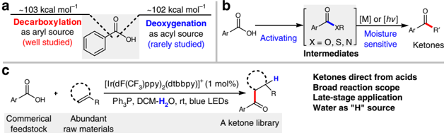

|   Entry | Variation of conditions          | Yield a   |
|---------|----------------------------------|-----------|
|       1 | None                             | 72%       |
|       2 | Without H 2 O                    | 40%       |
|       3 | No Ph 3 P                        | nd        |
|       4 | 1mol% cat- II instead of cat- I  | nd        |
|       5 | 2mol% cat- III instead of cat- I | nd        |
|       6 | 2mol% cat- IV instead of cat- I  | nd        |
|       7 | 2mol% cat- V instead of cat- I   | nd        |
|       8 | No photocatalyst                 | nd        |
|       9 | No light                         | nd        |

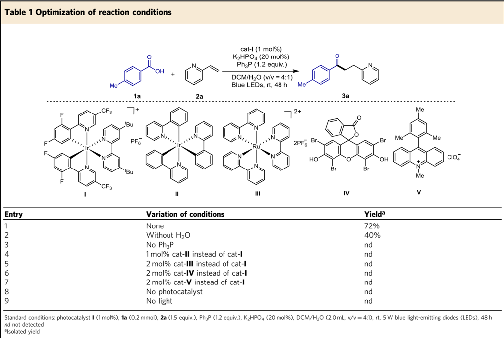

yields. Besides aromatic acids, other kinds of carboxylic acids, including aliphatic carboxylic acids and α , β -unsaturated carboxylic acids however failed in this reaction.

Substrate scope of alkenes . Subsequently, many alkenes were examined, giving the results shown in Fig. 3. In view of the prevalence of the pyridine moiety in natural products, pharmaceuticals, and chiral ligands 29,30 , a wide range of structurally diverse 2-vinylpyridines possessing different kinds of functional groups were subjected to this protocol. Both electron-rich and electron-poor substituents, including -Me, -Cl, -CHO, -COOEt, -CF3, -Br, and -OMe at different positions of the pyridyl ring were well tolerated ( 3a , 3y -3gg ). The benign compatibility of halogen substituents further emphasized the potential synthetic applications ( 3z , 3ee , and 3gg ). 4-Vinylpyridines could be converted into the corresponding linear pyridine-based ketones ( 3hh ) in 68% yields. Other heteroaromatic styrenes were also ef fi cient substrates ( 3ii -kk ). When a variety of 1,1-disubstituted vinylpyridines were employed, the desired products ( 3ll -rr ) were obtained in 43 -89% yields. Notably, the electron-rich indole and benzofuran could survive this radical process, indicative of good chemoselectivity ( 3pp and 3qq ). Beside terminal alkenes, α , β -disubstituted alkenylpyridines successfully delivered the products ( 3ss -uu) in practically useful yields and with moderate diastereoselectivity. A gram-scale experiment demonstrated that this protocol could be easily scaled up ( 3cc , 5 mmol scale).

To highlight the structural diversi fi cation of ketones, other kinds of styrenes were investigated and it was found that they could uniformly react with an aromatic carboxylic acid ( 1a ) to give the desired ketone products ( 3vv -jJ ) in moderate to good yields under the optimized conditions. Its synthetic potential is distinguished by excellent and important functional group compatibility as ketone, thioether, terminal ole fi n/alkyne, and ester are tolerated. Due to the ubiquity of 1,1-diarylalkane scaffolds in pharmaceuticals and natural products 31 , representative 1,1-diaryl ole fi ns were used and they were found to deliver 3,3-diaryl-propanones ( 3ll -rr and 3cC -jJ ) in 43 -89% yields.

The γ -carbonyl ester and γ -diketones are signi fi cant raw materials for the construction of fi ve-membered heterocycle frameworks but their ef fi cient and general accessibility in contemporary synthetic chemistry remains highly challenging 32,33 . As illustrated in Fig. 3 (lower part), the direct deoxygenative C -C bond formation of carboxylic acids ( 1a ) with varied electron-de fi cient alkenes allows for modular synthesis of a diverse array of important γ -carbonyl esters, γ -carbonyl aldehydes, and γ -diketones ( 3kK -vV ) in 51 -86% yields. Its success arguably could complement the classical Weinreb ketone syntheses from Weinreb amides and Grignard reagents 34 .

Examining functional group compatibility . After observation of the broad substrate scope, we turned our attention upon examining the functional group compatibility 35,36 with addition of a wide array of biomolecules, including natural amino acids, nucleic acids, and proteins into the reaction mixture. To avoid the use of inorganic bases, a neutral phosphate saline buffer (pH 7.4) was used. We found that the deoxygenative ketone synthesis occurred smoothly in neutral buffer-DCM solvent without any compromise of the synthetic ef fi ciency in the presence of stoichiometric amounts of unprotected biomolecules such as L -cysteine, L -tyrosine, L -methionine, guanosine, naringin, DNA, miRNA, and bovine serum albumin (Fig. 4). In comparison with our previous deoxygenative coupling using stoichiometric

Fig. 2 Aromatic carboxylic acid scope. Bn benzyl; Boc tert -butoxycarbonyl; Ts para -toluenesulfonyl

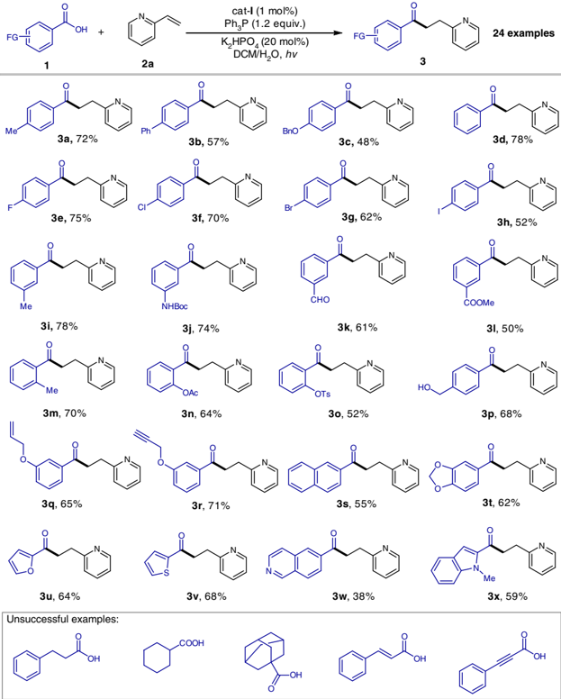

dimethyldicarbonates and (TMS)3SiH 23 , this clearly demonstrates that the deoxygenative ketone synthesis strategy has an excellent functional group compatibility. Signi fi cantly, the selective deoxygenation of only aromatic carboxylic acids in the presence of natural amino acids further underscores its synthetic advantages as amino acids are known 37 to tend to undergo photoredox decarboxylative coupling.

Synthetic application . The late-stage modi fi cation of complex molecules is a basis for the evaluation of a practical protocol. In this context, several biologically important natural products, pharmaceuticals, and agrochemicals were successfully used in this reaction and are shown in Fig. 5a. Three pharmaceuticals with an aromatic acid unit, telmisartan ( 4 ), hiestrone ( 5 ), and adapalene ( 6 ) readily underwent this deoxygenative ketone synthesis. Moreover, 11 complex alkene substrates bearing varying functional groups could be employed, affording the desired products ( 7 -17 ) in moderate yields in aqueous solution. Interestingly, when two competing electron-de fi cient alkenes were assembled into one molecule, site-speci fi c hydroacylation occurred at the less sterically hindered site ( 15 ). These examples clearly suggest that this strategy represents a promising late-stage application of both carboxylic acids and alkenes, and has the potential to rapidly convert two widely available starting materials into complex ketone molecules.

To underline its synthetic potential, we have applied this deoxygenative coupling protocol to synthesize the drug zolpidem, which ranks 28 in the 200 top-selling drugs (https://njardarson. lab.arizona.edu/sites/njardarson.lab.arizona.edu/ fi les/2016Top200 PharmaceuticalPrescriptionSalesPosterLowResV2.pdf). As illustrated in Fig. 5b, six steps are usually required for the synthesis of zolpidem 38 from air-sensitive 2-bromo-1-( p -tolyl)ethan-1-one with 19% total yield, but we achieved a concise three-step synthesis of zolpidem with 50% total yield. First, application of deoxygenative C -C coupling of para -methylbenzoic acid ( 1a ) with the electron-de fi cient alkene ( 18 ) successfully produced a γ -carbonyl amide ( 19 ) and a subsequent cyclization revealed a simple strategy for the synthesis of zolpidem from commercially abundant para -methylbenzoic acids.

Intramolecular macrocyclization . Macrocyclic ketones are used widely as fragrances, such as muskon and zibeton. To date, the macrocyclization remains a robust but highly challenging synthetic strategy, which usually calls for very low concentrations to avoid intermolecular polymerization 39 . To further demonstrate the practicality of our method, we adapted the visible-lightmediated direct deoxygenation C -C coupling to an elegant macrocyclization under optimized conditions in aqueous solution. As shown in Fig. 6, 18 -20 membered cyclophane-braced cycloketones ( 21a -c ) have been successfully constructed in

Fig. 3 Alkene scope

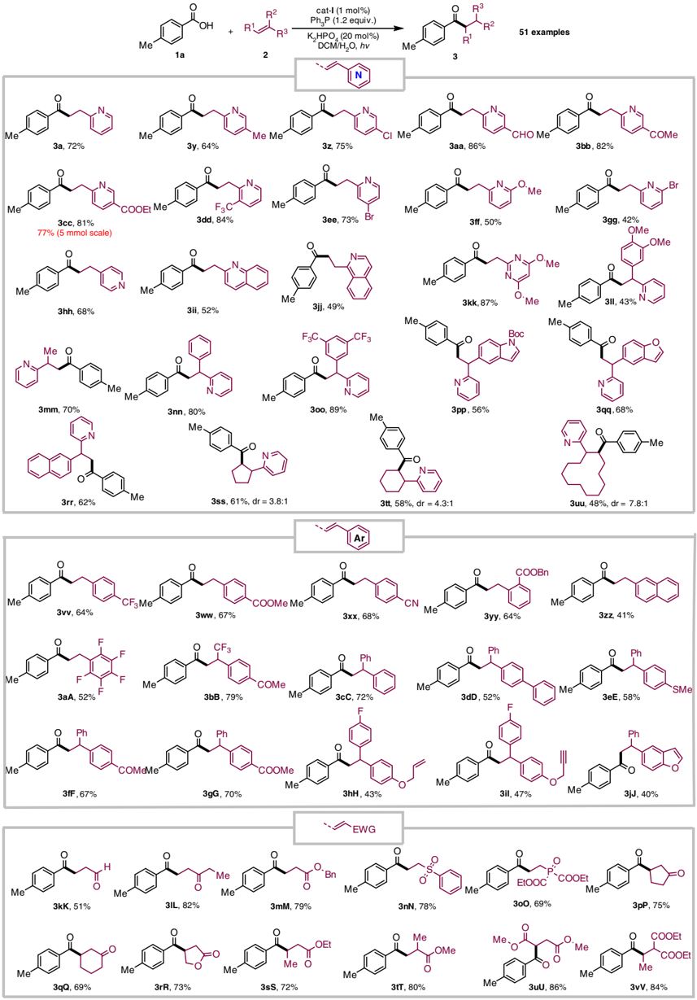

Fig. 4 Examining functional group compatibility. Reaction conditions: photocatalyst I (1 mol%), 1a (0.1 mmol, 1.0 equiv.), 2a (0.15 mmol, 1.5 equiv.), Ph3P (0.12 mmol, 1.2 equiv.), biomolecules, pH 7.4 PBS buffer/DCM (1:1, 2.0 mL), blue LEDs, 25 °C

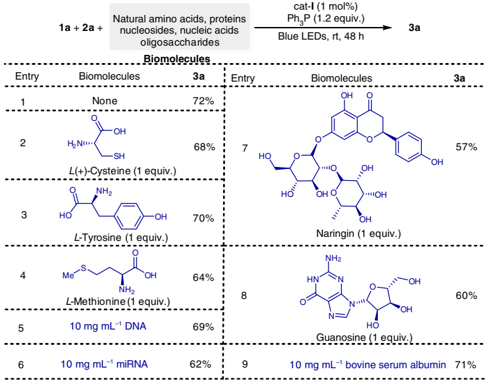

synthetically useful yields, clearly demonstrating the robustness of this synthetic protocol.

Downstream transformation . Heterocyclic scaffolds are prevalent motifs in bioactive compounds and natural products 40 . The ketones produced in this reaction were versatile building blocks for chemical bond formation 41,42 and could undergo a broad array of downstream organic transformations to construct structurally diverse nitrogen-containing heterocycles ( 22 , 24, 26 , and 28 , Fig. 7). Interestingly, with 5 mol% chiral phosphoric acid 27 as catalyst, treatment of 3ii with Hantzsch ester furnished a benzo-fused quinolizidine scaffold ( 28 ) with moderate enantioselectivity 43 .

Mechanistic studies . To gain mechanistic insight into this deoxygenative C -C coupling, radical inhibitors such as 2,2,6,6tetramethyl-1-piperidyloxy (TEMPO) and 2,6-ditert -butylp -cresol were added to the model reaction system and it was found that they completely inhibited the coupling reaction. Moreover, the corresponding acyl radical was trapped by TEMPO (Fig. 8a). This indicates that an acyl radical pathway could be possible 44 -47 . The intramolecular hydroacylation of 2-allylbenzoic acid ( 29 ) further exempli fi ed the intermediacy of the acyl radical species (Fig. 8b) and the deuterium-labeling experiments demonstrated water was the sole proton source for this deoxygenative hydroacylation of alkenes (Fig. 8c) 48 . The employment of 18 O-labeled water and aromatic acid ( 1a ′ ) strongly suggested that the oxygen atom of triphenylphosphine oxide would originate from carboxylic acids rather than from water (Fig. 8d). When potassium benzoate was employed in place of benzoic acid, 3d was obtained in moderate yield, which suggests that the triphenylphosphine radical cation reacts with an aromatic carboxylate anion (Fig. 8e). The corresponding Stern -Volmer studies further revealed that photoexcited *[Ir(dF(CF3)ppy)2(dtbbpy)]PF6 was quenched by triphenylphosphine (see Supplementary Information).

A possible mechanism is proposed in Fig. 8f. The photoexcited *Ir(dF(CF3)ppy)2(dtbbpy)]PF6 [ E 1/2 red (*Ir III /Ir II ) =+ 1.21 V vs SCE; τ = 2.3 μ s] 49 is able to undergo single-electron transfer (SET) oxidation with Ph3P ( E 1/2 red =+ 0.98 V vs SCE) 50 to form the triphenylphosphine radical cation ( 31 ), which could trigger the proposed radical deoxygenation 51 . The resulting radical cation ( 31 ) reacts with carboxylate anion to generate the phosphoryl radical ( 32 ). This is followed by β -selective C(acyl) -O bond cleavage with thermodynamic impetus for the formation of Ph3P = O. The acyl radical ( 33 ) generated in this way then selectively attacks the alkene to form the radical species ( 34 ), which is capable of undergoing an SET with reductive Ir II species to afford the corresponding ketone in the presence of water. Alternatively, the homocoupling of acyl radicals ( 33 ) can afford a little amount of 1,2-diketones as byproducts.

Three-component reductive coupling . Based on this reductive quenching mechanism, we extended this deoxygenative catalytic system to an attractive three-component reductive coupling reaction of carboxylic acids ( 1 ), primary amines ( 36 ), and aromatic aldehydes ( 37 ). To our delight, the resulting valuable α -amino ketone products ( 38 ) were obtained in moderate yields (Fig. 9).

## Discussion

In summary, a deoxygenative ketone synthesis from aromatic carboxylic acids and alkenes has been developed in aqueous solution enabled by visible-light photoredox catalysis with commercially cheap triphenylphosphine as an oxygen transfer reagent. This catalytic system enables direct deoxygenation of aromatic acids to generate acyl radical in the presence of a broad variety of biomolecules. This ketone synthesis strategy allows practical and friendly reaction conditions, which signi fi cantly broadens the substrate scope, improves the functional group compatibility, and emphasizes the synthetic application in complex molecules. Based on the direct deoxygenative mechanism, a reductive three-component coupling reaction of amines, aldehydes and acids has been achieved. It offers not only a strategy for the streamlined synthesis of structurally diverse ketones from abundant carboxylic acids, but also a photoredox radical activation mode beyond the redox potential of carboxylic acids.

## Methods

General methods . See Supplementary Methods for further details.

General procedure for the synthesis of 3 . To a 10 mL Schlenk tube equipped with a magnetic stir bar was added aromatic carboxylic acid 1 (0.2 mmol, 1.0 equiv.), photocatalyst Ir[dF(CF3)ppy]2(dtbbpy)PF6 (2.3 mg, 1 mol%), K2HPO4 (7.0 mg, 20 mol%), and Ph3P (62.9 mg, 0.24 mmol, 1.2 equiv.) and the tube was evacuated and back fi lled with argon for three times. The alkenes 2 (0.3 mmol, 1.5 equiv.) in DCM/H2O (2.0 mL, 4:1 v/v) were added by syringe under argon. The tube was then sealed and was placed at a distance (app. 5 cm) from 5 W blue lightemitting diode (LED) lamp, and the mixture was stirred for 36 -60 h at room temperature. After completion, the mixture was quenched with water and extracted with DCM (3 × 10 mL). The combined organic layer was dried over anhydrous Na2SO4, then the solvent was removed under vacuo. The residue was subjected to chromatography column on silica gel (eluent: petroleum ether/ethyl acetate) to give the corresponding ketone products 3 .

General procedure for the synthesis of 4 -8 . To a 10 mL Schlenk tube equipped with a magnetic stir bar was added aromatic carboxylic acid 1 (0.1 mmol, 1.0 equiv.), photocatalyst Ir[dF(CF3)ppy]2(dtbbpy)PF6 (2.3 mg, 2 mol%), K2HPO4 (3.5 mg, 20 mol%), and Ph3P (31.5 mg, 0.12 mmol, 1.2 equiv.) and the tube was evacuated and back fi lled with argon for three times. The alkenes 2 (0.15 mmol, 1.5 equiv.) in DCM/H2O (2.0 mL, 4:1 v/v) were added by syringe under argon. The tube was then sealed and was placed at a distance (app. 5 cm) from 5 W blue LED lamp, and the mixture was stirred for 48 h at room temperature. After completion, the mixture was quenched with water and extracted with DCM (3 × 10 mL). The combined organic layer was dried over anhydrous Na2SO4, then the solvent was removed under vacuo. The residue was puri fi ed with chromatography column on silica gel (eluent: petroleum ether/ethyl acetate) to give the corresponding ketone products 4 -8 .

General procedure for the synthesis of 9 -17 . To a 10 mL Schlenk tube equipped with a magnetic stir bar was added aromatic carboxylic acid 1 (0.15 mmol,

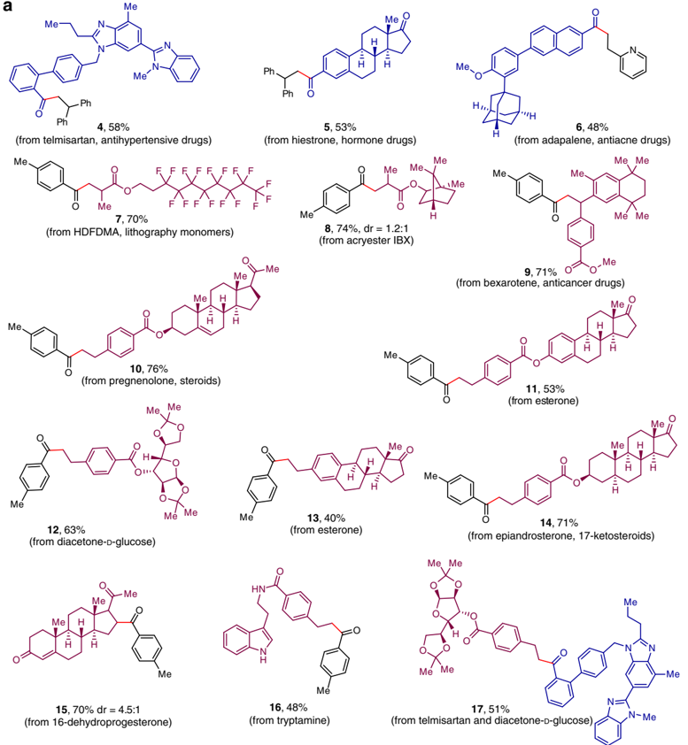

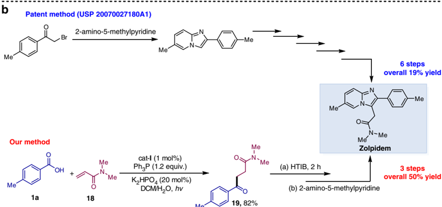

Me

Fig. 5 Synthetic application. a Late-stage application in the complex molecules. b Synthesis of zolpidem

1.5 equiv.), photocatalyst Ir[dF(CF3)ppy]2(dtbbpy)PF6 (2.3 mg, 2 mol%), K2HPO4 (7.0 mg, 40 mol%), and Ph3P (31.5 mg, 0.12 mmol, 1.2 equiv.) and the tube was evacuated and back fi lled with argon for three times. The alkenes (0.1 mmol, 1.0 equiv.) in DCM/H2O (2.0 mL, 4:1 v/v) were added by syringe under argon. The tube was then sealed and was placed at a distance (app. 5 cm) from 5 W blue LED lamp, and the mixture was stirred for 48 h at room temperature. After completion, the mixture was quenched with water and extracted with DCM (3 × 10 mL). The combined organic layer was dried over anhydrous Na2SO4, then the solvent was

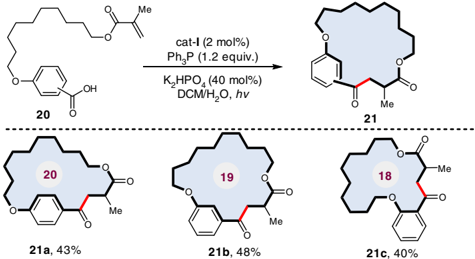

Fig. 6 Deoxygenative macrocyclization in the synthesis of cyclophanebraced cycloketones

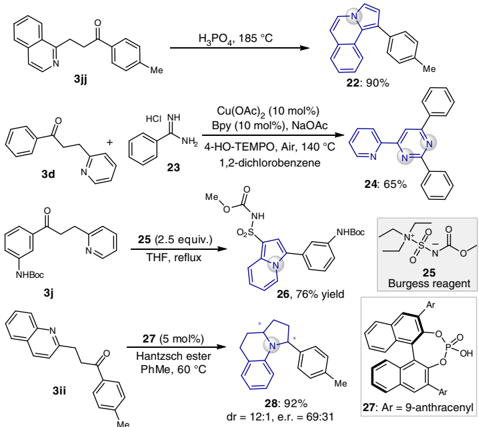

Me

Fig. 7 Downstream transformations

removed under vacuo. The residue was puri fi ed with chromatography column on silica gel (eluent: petroleum ether/ethyl acetate) to give the corresponding ketone products 9 -17 .

General procedure for the synthesis of 21 . To a 10 mL Schlenk tube equipped with a magnetic stir bar was added aromatic carboxylic acid (36.2 mg, 0.1 mmol, 1.0 equiv.), photocatalyst Ir[dF(CF3)ppy]2(dtbbpy)PF6 (2.3 mg, 2 mol%), K2HPO4 (7.0 mg, 40 mol%), and Ph3P (31.5 mg, 0.12 mmol, 1.2 equiv.) and the tube was evacuated and back fi lled with argon for three times. Then, DCM/H2O (2.0 mL, 4:1 v/v) were added by syringe under argon. The tube was then sealed and was placed at a distance (app. 5 cm) from 5 W blue LED lamp, and the mixture was stirred under room temperature for 48 h. After completion, the mixture was quenched with water and extracted with DCM (3 × 10 mL). The combined organic layer was dried over anhydrous Na2SO4, then the solvent was removed under vacuo. The residue was puri fi ed with chromatography column on silica gel (eluent: petroleum ether/ethyl acetate) to give the corresponding macrocyclic products 21 .

General procedure for the synthesis of 38 . To a 10 mL Schlenk tube equipped with a magnetic stir bar was added aromatic carboxylic acid 1 (0.15 mmol, 1.5 equiv.), photocatalyst Ir[dF(CF3)ppy]2(dtbbpy)PF6 (1.2 mg, 1 mol%), K2HPO4 (26.1 mg, 1.5 equiv.), and Ph3P (31.5 mg, 0.12 mmol, 1.2 equiv.) and the tube was evacuated and back fi lled with argon for three times. The amines 36 (0.1 mmol, 1.0 equiv.) and aldehydes 37 (0.15 mmol, 1.5 equiv.) in DCM (2.0 mL) were added by syringe under argon. The tube was then sealed and was placed at a distance (app. 5 cm) from 5 W blue LED lamp, and the mixture was stirred at room temperature for 48 h. After completion, the solvent was removed

Fig. 8 Mechanistic studies. a Control experiments with additives. b Radical cyclization experiment. c Deuterium-labeling experiments. d 18 O-labeling experiments. e Aromatic carboxylate anion as substrate. f Proposed mechanism

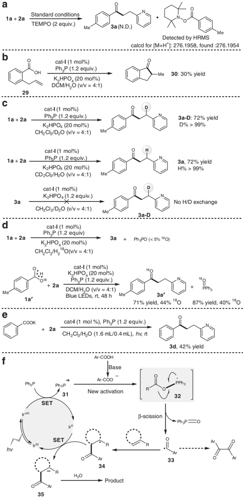

Fig. 9 A three-component reductive coupling reaction

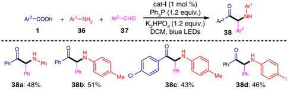

under vacuo. The resulting residue was subjected to chromatography column on silica gel (eluent: petroleum ether/ethyl acetate) to give the corresponding α -amino ketone products 38 .

## Data availability

The authors declare that all other data supporting the fi ndings of this study are available within the article and Supplementary Information fi les, and also are available from the corresponding author upon reasonable request.

Received: 10 May 2018 Accepted: 10 August 2018

## References

1. Gooßen, L. J., Deng, G. &amp; Levy, L. M. Synthesis of biaryls via catalytic decarboxylative coupling. Science 313 , 662 -664 (2006).
2. Gooßen Lukas, J. et al. New catalytic transformations of carboxylic acids. Pure Appl. Chem. 80 , 1725 -1733 (2008).
3. Rodriguez, N. &amp; Goossen, L. J. Decarboxylative coupling reactions: a modern strategy for C-C-bond formation. Chem. Soc. Rev. 40 , 5030 -5048 (2011).
4. Wei, Y., Hu, P., Zhang, M. &amp; Su, W. Metal-catalyzed decarboxylative C -H functionalization. Chem. Rev. 117 , 8864 -8907 (2017).
5. Pedley, J. B. Thermochemical Data and Structure of Organic Compounds , (Texas A &amp; M Univ., Texas, 1994).
6. Denisov, E. T. &amp; Denisova, T. G. Kinetics and thermodynamics of formation and degradation of α -hydroxyperoxyl radicals. Pet. Chem. 46 , 373 -383 (2006).
7. Brunet, J.-J. &amp; Chauvin, R. Synthesis of diarylketones through carbonylative coupling. Chem. Soc. Rev. 24 , 89 -95 (1995).
8. Olah, G. A. Friedel-Cra ſ ts Chemistry (Wiley-Interscience, New York, 1973).
9. Nahm, S. &amp; Weinreb, S. M. N-methoxy-N-methylamides as effective acylating agents. Tetrahedron Lett. 22 , 3815 -3818 (1981).
10. Shen, Z.-L. et al. Synthesis of water-tolerant indium homoenolate in aqueous media and its application in the synthesis of 1,4-dicarbonyl compounds via palladium-catalyzed coupling with acid chloride. J. Am. Chem. Soc. 132 , 15852 -15855 (2010).
11. Wu, F., Lu, W., Qian, Q., Ren, Q. &amp; Gong, H. Ketone formation via mild nickel-catalyzed reductive coupling of alkyl halides with aryl acid chlorides. Org. Lett. 14 , 3044 -3047 (2012).
12. Arockiam, P. B., Bruneau, C. &amp; Dixneuf, P. H. Ruthenium(II)-catalyzed C -H bond activation and functionalization. Chem. Rev. 112 , 5879 -5918 (2012).
13. Hie, L. et al. Nickel-catalyzed activation of acyl C -O Bonds of methyl esters. Angew. Chem. Int. Ed. 55 , 2810 -2814 (2016).
14. Ben Halima, T. et al. Palladium-catalyzed Suzuki -Miyaura coupling of aryl Esters. J. Am. Chem. Soc. 139 , 1311 -1318 (2017).
15. Sun, F. et al. Cleavage of the C(O) -S bond of thioesters by palladium/ norbornene/copper cooperative catalysis: an ef fi cient synthesis of 2-(Arylthio) aryl ketones. J. Am. Chem. Soc. 138 , 7456 -7459 (2016).
16. Bechara, W. S., Pelletier, G. &amp; Charette, A. B. Chemoselective synthesis of ketones and ketimines by addition of organometallic reagents to secondary amides. Nat. Chem. 4 , 228 (2012).
17. Hie, L. et al. Conversion of amides to esters by the nickel-catalysed activation of amide C-N bonds. Nature 524 , 79 -83 (2015).
18. Walker, J. A., Vickerman, K. L., Humke, J. N. &amp; Stanley, L. M. Ni-catalyzed alkene carboacylation via amide C -N bond activation. J. Am. Chem. Soc. 139 , 10228 -10231 (2017).
19. Takise, R., Muto, K. &amp; Yamaguchi, J. Cross-coupling of aromatic esters and amides. Chem. Soc. Rev. 46 , 5864 -5888 (2017).
20. Guo, L. &amp; Rueping, M. Decarbonylative cross-couplings: nickel catalyzed functional group interconversion strategies for the construction of complex organic molecules. Acc. Chem. Res. 51 , 1185 -1195 (2018).
21. Bergonzini, G., Cassani, C. &amp; Wallentin, C.-J. Acyl radicals from aromatic carboxylic acids by means of visible-light photoredox catalysis. Angew. Chem. Int. Ed. 54 , 14066 -14069 (2015).
22. Dong, Z., Wang, J., Ren, Z. &amp; Dong, G. Ortho C-H acylation of aryl iodides by palladium/norbornene catalysis. Angew. Chem. Int. Ed. 54 , 12664 -12668 (2015).
23. Zhang, M. et al. Photoredox-catalyzed hydroacylation of ole fi ns employing carboxylic acids and hydrosilanes. Org. Lett. 19 , 3430 -3433 (2017).
24. Maryanoff, B. E. &amp; Reitz, A. B. The Wittig ole fi nation reaction and modi fi cations involving phosphoryl-stabilized carbanions. Stereochemistry, mechanism, and selected synthetic aspects. Chem. Rev. 89 , 863 -927 (1989).
25. Zhou, N., Yuan, X. A., Zhao, Y., Xie, J. &amp; Zhu, C. Synergistic photoredox catalysis and organocatalysis for inverse hydroboration of imines. Angew. Chem. Int. Ed. 57 , 3990 -3994 (2018).
26. Li, W., Xu, W., Xie, J., Yu, S. &amp; Zhu, C. Distal radical migration strategy: an emerging synthetic means. Chem. Soc. Rev. 47 , 654 -667 (2018).
27. Xu, P., Li, W., Xie, J. &amp; Zhu, C. Exploration of C -H transformations of aldehyde hydrazones: radical strategies and beyond. Acc. Chem. Res. 51 , 484 -495 (2018).
28. Xu, P. et al. Visible-light photoredox-catalyzed C-H di fl uoroalkylation of hydrazones through an aminyl radical/polar mechanism. Angew. Chem. Int. Ed. 55 , 2939 -2943 (2016).
29. Guan, A.-Y., Liu, C.-L., Sun, X.-F., Xie, Y. &amp; Wang, M.-A. Discovery of pyridine-based agrochemicals by using intermediate derivatization methods. Bioorg. Med. Chem. 24 , 342 -353 (2016).
30. Chelucci, G. Metal-complexes of optically active amino- and imino-based pyridine ligands in asymmetric catalysis. Coord. Chem. Rev. 257 , 1887 -1932 (2013).
31. Vasilopoulos, A., Zultanski, S. L. &amp; Stahl, S. S. Feedstocks to pharmacophores: Cu-catalyzed oxidative arylation of inexpensive alkylarenes enabling direct access to diarylalkanes. J. Am. Chem. Soc. 139 , 7705 -7708 (2017).
32. Xie, J. &amp; Huang, Z.-Z. The cascade carbo-carbonylation of unactivated alkenes catalyzed by an organocatalyst and a transition metal catalyst: a facile approach to γ -diketones and γ -carbonyl aldehydes from arylalkenes under air. Chem. Commun. 46 , 1947 -1949 (2010).
33. Hashmi, A. S. K., Wang, T., Shi, S. &amp; Rudolph, M. Regioselectivity switch: gold (I)-catalyzed oxidative rearrangement of propargyl alcohols to 1,3-diketones. J. Org. Chem. 77 , 7761 -7767 (2012).
34. Balasubramaniam, S. &amp; Aiden, I. S. The growing synthetic utility of the Weinreb amide. Synthesis 2008 , 3707 -3738 (2008).
35. Collins, K. D. &amp; Glorius, F. A robustness screen for the rapid assessment of chemical reactions. Nat. Chem. 5 , 597 (2013).
36. Huang, H., Zhang, G., Gong, L., Zhang, S. &amp; Chen, Y. Visible-light-induced chemoselective deboronative alkynylation under biomolecule-compatible conditions. J. Am. Chem. Soc. 136 , 2280 -2283 (2014).
37. Xuan, J., Zhang, Z. G. &amp; Xiao, W. J. Visible-light-induced decarboxylative functionalization of carboxylic acids and their derivatives. Angew. Chem. Int. Ed. 54 , 15632 -15641 (2015).
38. Jasty, A. M. et al. Process for preparing zolpidem. USP 20070027180A1 (2007).
39. Martí-Centelles, V., Pandey, M. D., Burguete, M. I. &amp; Luis, S. V. Macrocyclization reactions: the importance of conformational, con fi gurational, and template-induced preorganization. Chem. Rev. 115 , 8736 -8834 (2015).
40. Wamhoff, H. Comprehensive Heterocyclic Chemistry (Academic Press, New York, 1984).
41. Chudasama, V., Fitzmaurice, R. J. &amp; Caddick, S. Hydroacylation of α , β -unsaturated esters via aerobic C -H activation. Nat. Chem. 2 , 592 (2010).
42. Wang, H., Dai, X.-J. &amp; Li, C.-J. Aldehydes as alkyl carbanion equivalents for additions to carbonyl compounds. Nat. Chem. 9 , 374 (2016).
43. Rueping, M. &amp; Hubener, L. Enantioselective synthesis of quinolizidines and indolizidines via a catalytic asymmetric hydrogenation cascade. Synlett 2011 , 1243 -1246 (2011).
44. Liu, J. et al. Visible-light-mediated decarboxylation/oxidative amidation of α -keto acids with amines under mild reaction conditions using O2. Angew. Chem. Int. Ed. 53 , 502 -506 (2014).
45. Mukherjee, S., Garza-Sanchez, R. A., Tlahuext-Aca, A. &amp; Glorius, F. Alkynylation of C (O) -H bonds enabled by photoredox -mediated hydrogen -atom transfer. Angew. Chem. Int. Ed. 56 , 14723 -14726 (2017).
46. Jia, K., Pan, Y. &amp; Chen, Y. Selective carbonyl -C(sp 3 ) bond cleavage to construct ynamides, ynoates, and ynones by photoredox catalysis. Angew. Chem. Int. Ed. 56 , 2478 -2481 (2017).
47. Zhang, X. &amp; MacMillan, D. W. C. Direct aldehyde C-H arylation and alkylation via the combination of nickel, hydrogen atom transfer, and photoredox catalysis. J. Am. Chem. Soc. 139 , 11353 -11356 (2017).
48. Spiegel, D. A., Wiberg, K. B., Schacherer, L. N., Medeiros, M. R. &amp; Wood, J. L. Deoxygenation of alcohols employing water as the hydrogen atom source. J. Am. Chem. Soc. 127 , 12513 -12515 (2005).
49. Prier, C. K., Rankic, D. A. &amp; MacMillan, D. W. C. Visible light photoredox catalysis with transition metal complexes: applications in organic synthesis. Chem. Rev. 113 , 5322 -5363 (2013).
50. Pandey, G., Pooranchand, D. &amp; Bhalerao, U. T. Photoinduced single electron transfer activation of organophosphines: Nucleophilic trapping of phosphine radical cation. Tetrahedron 47 , 1745 -1752 (1991).
51. Schiavon, G., Zecchin, S., Cogoni, G. &amp; Bontempelli, G. Anodic oxidation of triphenylphosphine at a platinum electrode in acetonitrile medium. J. Electroanal. Chem. Interfac. 48 , 425 -431 (1973).

## Acknowledgements

We gratefully acknowledge the National Natural Science Foundation of China (21702098, 21672099, and 21732003), ' 1000 Youth Talents Plan ' , and the Fundamental Research Funds for the Central Universities (No. 020514380158 and 020514380131).

M.Z. was supported by Nanjing University Innovation and Creative Program for Ph.D. candidate (No. CXCY17-19). Prof. Carl Johan Wallentin at Gothenburg University (Sweden) is kindly acknowledged for his helpful paper discussion.

## Author contributions

M.Z. performed and analyzed the experiments. M.Z., J.X. and C.Z. co-wrote and discussed the manuscript. J.X. conceived and directed the whole project. All authors commented on the fi nal manuscript and contributed to the analysis and interpretation of the results.

## Additional information

Supplementary Information accompanies this paper at https://doi.org/10.1038/s41467018-06019-1.

Competing interests: The authors declare no competing interests.

Reprints and permission information is available online at http://npg.nature.com/ reprintsandpermissions/

Publisher's note: Springer Nature remains neutral with regard to jurisdictional claims in published maps and institutional af fi liations.

Open Access This article is licensed under a Creative Commons Attribution 4.0 International License, which permits use, sharing, adaptation, distribution and reproduction in any medium or format, as long as you give appropriate credit to the original author(s) and the source, provide a link to the Creative Commons license, and indicate if changes were made. The images or other third party material in this article are included in the article ' s Creative Commons license, unless indicated otherwise in a credit line to the material. If material is not included in the article ' s Creative Commons license and your intended use is not permitted by statutory regulation or exceeds the permitted use, you will need to obtain permission directly from the copyright holder. To view a copy of this license, visit http://creativecommons.org/ licenses/by/4.0/.

© The Author(s) 2018