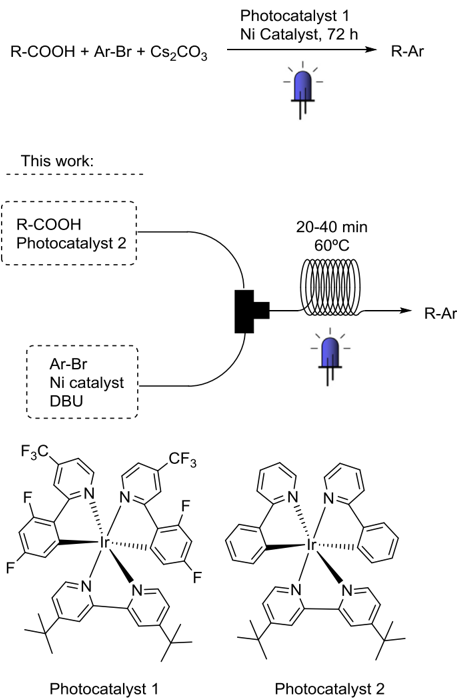
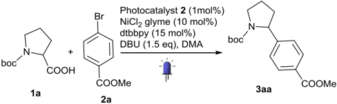
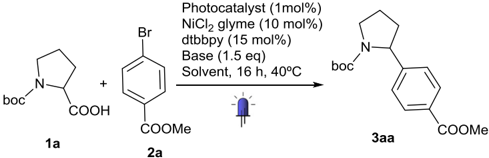
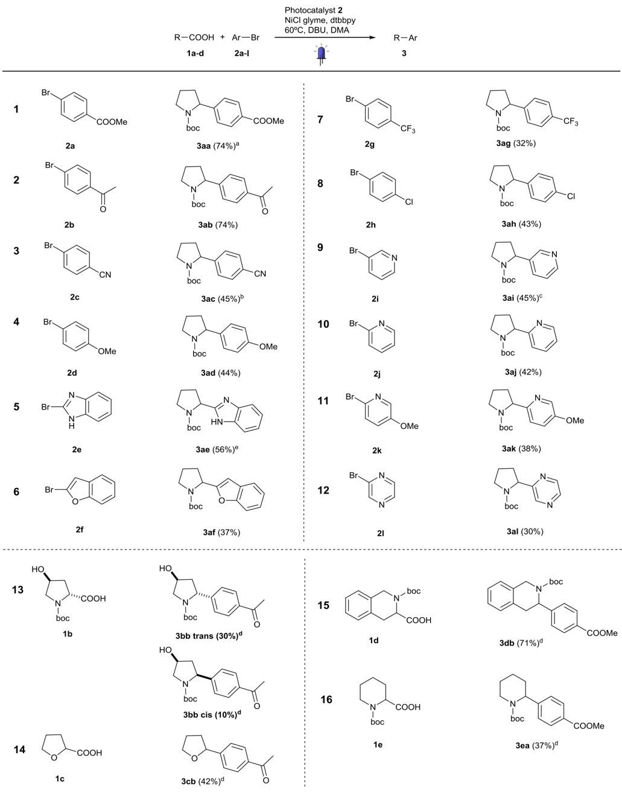
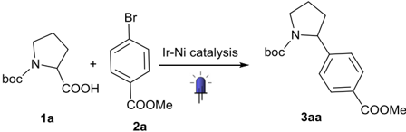

Contents lists available at ScienceDirect

## Bioorganic &amp; Medicinal Chemistry

j o u r n a l homepage: www.elsevier.com/locate/bmc

## Improving the throughput of batch photochemical reactions using flow: Dual photoredox and nickel catalysis in flow for C( sp 2 ) A C( sp 3 ) crosscoupling

Irini Abdiaj, Jesús Alcázar ⇑

Janssen Research and Development, Janssen-Cilag, S.A., C/Jarama 75, 45007 Toledo, Spain

## a r t i c l e i n f o

Article history: Received 16 November 2016 Revised 16 December 2016 Accepted 23 December 2016 Available online 27 December 2016

Keywords: Photoredox Dual catalysis Flow chemistry C( sp 2 ) A C( sp 3 ) cross-coupling Medicinal chemistry

## 1. Introduction

Light has long been recognized as a valuable tool for performing efficient organic reactions. It allows access to complex molecules using photon as a traceless reagent that adds energy to a chemical system without generating waste in the process. 1 In recent years, visible light photoredox catalysis has emerged as a powerful strategy for organic synthesis, since organic or organometallic photoredox catalyst are able to transfer light into chemical energy. 2

However, the scalability of photochemical processes is limited by the attenuation effect of photon transport (Bourguer-LambertBeer law). To overcome this issue, photoredox catalysis has been combined with continuous flow technology, in order to ensure a uniform irradiation of the narrow channels, where the reaction mixture is circulating within. 3 Additionally, the use of continuous flow reactors offers other advantages, such as very efficient heat transfer, good control of reaction temperature and enhanced mass transfer, 4 making procedures more reproducible and scalable. Furthermore, flow chemistry has been identified as a very interesting sustainable alternative in chemical research and production. 5

From a medicinal chemistry point of view, a very interesting reaction is the synergistic combination of photoredox and nickel catalysis to achieve C( sp 2 ) A C( sp 3 ) cross-coupling, not straightaway

⇑ Corresponding author. E-mail address:

[jalcazar@its.jnj.com (J. Alcázar).](mailto:jalcazar@its.jnj.com)

## a b s t r a c t

We report herein the transfer of dual photoredox and nickel catalysis for C( sp 2 ) A C( sp 3 ) cross coupling form batch to flow. This new procedure clearly improves the scalability of the previous batch reaction by the reactor's size and operating time reduction, and allows the preparation of interesting compounds for drug discovery in multigram amounts.

Ó 2017 The Authors. Published by Elsevier Ltd. This is an open access article under the CC BY-NC-ND license (http://creativecommons.org/licenses/by-nc-nd/4.0/).

possible by using either catalysis alone. 6 This approach will increase the prevalence of sp 3 carbons in drug discovery compounds allowing medicinal chemists to access new chemical space with improved phisicochemical properties. 7 Recently a first example of dual catalysis in flow has been reported by Ley and coworkers. 8 They reported a new activation mode for boronic esters to use these highly soluble reagents in flow avoiding the poor soluble trifluoroborate salts used in the corresponding batch protocols. 6d,6e Following this approach a series of benzyboronates were coupled with several bromoarenes.

Considering the interest of cyclic amines in medicinal chemistry 9 and the advantages of flow photochemistry, we consider that the transfer of the decarboxylative coupling of amino acids with aryl halides described by MacMillan and coworkers in batch 10 to flow would help to achieve a fast and scalable C( sp 2 ) A C( sp 3 ) coupling process and make this procedure more suitable for drug discovery as productivity per time unit would be clearly increased (Fig. 1).

## 2. Results and discussion

- 2.1. Exploration of suitable reagents for flow

Recently Stephenson and co-workers have reported the translation of a photoredox trifluomethylation from batch to flow in order to get kilogram amounts of the desired product. 11 In this example,

Fig. 1. Continuous flow process to obtain C(sp) 3 A C(sp) 2 cross-coupling.

direct transfer to flow was possible as all components are soluble in the reaction solvent used. However, this is not suitable with McMillan's dual catalysis, as the base used was not soluble in the solvent reported. For this reason, the first challenge to develop a flow protocol was to identify a suitable combination base-solvent that would avoid a potential blockage of the reactor (Table 1). In order to speed up the finding of such combination, a parallel batch screening was performed under non optimal conditions using a handmade photoreactor irradiated with a CFL bulb (9 W). In this way differences of performance among all possible combinations would be more sensitive and would help the identification of the most promising one. 12 Control reactions using the base and solvent described in batch were also included in the set to provide appropriate comparison (Table 1, entries 1 and 2).

To begin with, a set of different organic bases of was tried in DMF (Table 1, entries 3-9). Among all of them, 1,5-diazabiciclo [5.4.0]undec-5-ene (DBU) was found as the most promising one (Table 1, entry 4). Conversion to product with this base was comparable to the one obtained with cesium carbonate, but a different photocatalyst (photocatalyst 2) was required. Once the appropriate base and photocatalyst were identified, solvent screening was performed (Table 1, entries 10-12). THF, acetone, toluene and ethyl acetate were found to provide good conversion to product (Table 1, entries 11, 14, 15 and 17), but precipitation of insoluble material was observed, most probably the corresponding HBr salt of the base, preventing their potential use in flow, as blockage of the reactor may take place. DMA provided the best conversion keeping all the material in solution (Table 1, entry 12).

In order to prove that the reaction required the combination of both catalytic cycles, several blind experiments were performed (Table 2, entries 7-10). Running the reaction in the dark provided just low conversion (entry 7). Similar outcome was achieved when the photocatalyst was removed (entry 8). In both examples, a dirty reaction crude was observed. Only when the reaction was run in the absence of nickel catalyst, no conversion of starting materials were observed (entry 9). For this reason, it was decided to run the reaction in two separated lines, so that no transformations would take place in the initial solution before entering the photochemical reactor. Finally, the presence of di tert buthylbipyridine (dtbbpy) ligand was also key for the reaction outcome (entry 10).

## 2.2. Optimization of reaction conditions in flow

The parallel batch screening provided the best combination of base (DBU), solvent (DMA) and photocatalyst (2) to be transferred in flow. The following step was to optimize reaction conditions in flow for the present reaction (Table 2). To perform these studies, the commercially available UV-150 photoreactor from Vapourtec was used. 13 This system is ideally suited for exploratory studies as it can be operated at various temperatures via active heating or cooling.

As the reaction in batch proceeded in 72 h, the initial attempt was to perform the reaction at 40 ° C with a relatively long residence time for a flow reactor (Table 2, entry 1). The conversion achieved was a promising starting point as it was higher than the one observed in batch at the same temperature but after overnight reaction (Table 1, entry 12). Then, the temperature was increased to 60 ° C to see its influence in the conversion. Full conversion was observed but a dirty crude reaction mixture was found and only 40% of isolated product was obtained (Table 2, entry 2). To control overreaction products, different reaction times and temperatures were attempted to improve the outcome. The best isolated yield was achieved at 60 ° C and 20 min residence time (Table 2, entry 4).

## 2.3. Exploration of reaction scope

Substrate scope was then explored, focusing on aromatic substituents and heterocycles of potential interest for drug discovery (Table 3). The results shown in this table were the most optimal found after testing different conditions. In this way, it was observed that most of the compounds tried required 30 min to get products in good yields. Using these slightly modified conditions, a wide range of functionalized aryl bromides, with functional groups as diverse as ketones, esters, nitriles, trifluoromethyl groups, halides, and monocyclic or bicyclic heterocycles provided the desired products in good yields, demonstrating the value of the protocol for medicinal chemistry. It is important to highlight that p -exceeding heterocycles 2e and 2f also provided the target compounds 3ae and 3af , although in the latter example, 40 min of reaction time was required. For compounds 3ac and 3ai , best results were found using lower temperature.

Cyclic amines are important for medicinal chemistry and modulating their properties is a key element to finding good clinical candidates. 9 In this way, cyclic aminoacid 1b was selected to check how substitution may affect the reaction. Both conformers were isolated from the reaction, being the compound 3bb (trans) the mayor isomer. This result is interesting as stereochemistry can be modulated by such substitution. Not only aminoacids, but also oxycarboxylic acid 1c worked as coupling partners, producing alfa arylated ether 3cb in a single step.

Table 2

Optimization of the conditions in flow.

|   Entry |   Temperature ( ° C) |   Time (min) | Conversion a (%)   |
|---------|----------------------|--------------|--------------------|
|       1 |                   40 |           33 | 40                 |
|       2 |                   60 |           33 | 100 (40) b         |
|       3 |                   60 |           10 | 42                 |
|       4 |                   60 |           20 | 100 (74) b         |
|       5 |                   75 |           10 | 47                 |
|       6 |                   80 |            5 | 40                 |
|       7 |                   60 |           20 | 2 c                |
|       8 |                   60 |           20 | 4 d                |
|       9 |                   60 |           20 | 0 e                |
|      10 |                   60 |           20 | 4 f                |

- a Conversion of 2a by LC-MS.
- b Isolated yield.
- c Test reaction without light irradiation.
- d Test reaction without photocatalyst.
- e Test reaction without nickel catalyst.
- f Test reaction without 4,4 0 -ditert -butyl-2,2 0 -dipyridyl (dtbbpy).

Table 1

Screening suitable conditions in batch.

|   Entry | Base      | Solvent     |   Photocatalyst | Conv. a (%)   |
|---------|-----------|-------------|-----------------|---------------|
|       1 | Cs 2 CO 3 | DMF         |               1 | 8             |
|       2 | Cs 2 CO 3 | DMF         |               2 | 4             |
|       3 | DBU       | DMF         |               1 | Traces        |
|       4 | DBU       | DMF         |               2 | 6             |
|       5 | DMAP      | DMF         |               2 | 0             |
|       6 | MTBD      | DMF         |               2 | 3             |
|       7 | TEA       | DMF         |               2 | 0             |
|       8 | Lutidine  | DMF         |               2 | Traces        |
|       9 | BTPP      | DMF         |               2 | 0             |
|      10 | DBU       | DMSO        |               2 | Traces        |
|      11 | DBU       | THF         |               2 | 24 b          |
|      12 | DBU       | DMA         |               2 | 12            |
|      13 | DBU       | ACN         |               2 | 2 b           |
|      14 | DBU       | Acetone     |               2 | 12 b          |
|      15 | DBU       | Toluene     |               2 | 13 b          |
|      16 | DBU       | Isopropanol |               2 | 0             |
|      17 | DBU       | EtOAc       |               2 | 22 b          |
|      18 | DBU       | (MeO) 2 CO  |               2 | 0             |

- a % of product measured by LC-MS.

b Precipitation of side products.

## 2.4. Scale up and comparison with batch

With all this information in our hands, the next step was scaling up the reaction to investigate if the flow approach adds value over the batch one (Table 4). Thus, the flow protocol was allowed to run for 1 h in continuously in the machine and the outcome compared with the best result reported in batch 10 Even though the isolated yield in flow was confirmed and still lower than the one described in batch, 644 mg of 3aa as a white solid were isolated, enough material to support drug-discovery processes. The lower yield was balanced by the reduced time and increased concentration. These combined effects provided a 430 times better space-time yield 4d,14 than the reported batch method, clearly demonstrating the improved efficacy of the flow procedure.

## 3. Conclusion

Herein, a stepwise procedure to translate photochemical batch reactions with insoluble reagents in flow is described. This has allowed the development of a more sustainable flow protocol for challenging C( sp 2 ) A C( sp 3 ) cross-coupling by dual photoredox and nickel catalysis. The reaction has a broad scope that perfectly fits the requirements for drug discovery in terms of functionalized aryl groups and heterocycles as well as cyclic amines. The huge time reduction achieved in flow, from 3 days to 20-30 min allows its scalability to reach amounts of compound that could be difficult to achieve in batch and improve drastically the space-time yield, demonstrating at the same time its sustainability. Further applications of this protocol in drug discovery programs will be presented elsewhere.

Table 3 Scope of dual catalysis reaction in flow.

General conditions: Ar A X (0.2 mmol), R A COOH (1.5 eq.), DBU (1.5 eq.), Ir(ppy)2(dtbbpy) 3+ (1 mol%), NiCl2 (10 mol%), dtbbpy (15 mol%), tR = 30 min, T = 60 °

C LED = 450 nm. a tR = 20 min, T = 60 ° C.

b tR = 20 min, T = 40 ° C.

c tR = 30 min, T = 40 ° C.

d R A COOH (3 eq.), DBU (3 eq.).

e tR = 40 min, T = 60 ° C.

## 4. Experimental section

## 4.1. General information

GC measurements were performed using a 6890 Series Gas Chromatograph (Agilent Technologies) system comprising a 7683 Series injector and autosampler, J&amp;W HP-5MS column (20 m -0.18 mm, 0.18 l m) from Agilent Technologies coupled to a 5973N MSD Mass Selective Detector (single quadrupole, Agilent Technologies). The MS detector was configured with an electronic impact ionization source/chemical ionization source (EI/CI). EI lowresolution mass spectra were acquired by scanning from 50 to 550 at a rate of 5.5 scan/s. The source temperature was maintained at 230 ° C. Helium was used as the nebulizer gas. Data acquisition was performed with Chemstation-Open Action software. Thin layer chromatography (TLC) was carried out on silica gel 60 F254 plates (Merck) using reagent grade solvents. Unless otherwise specified, reagents were obtained from commercial sources and used without further purification. The reactions were carried out in a Vapourtec photoreactor UV-150 fixed on a E-series Vapourtec equipment. 1 H NMR spectra were recorded on Bruker DPX-400 or Bruker AV-500 spectrometers with standard pulse sequences, operating at 400 MHz and 500 MHz respectively. Chemical shifts ( d ) are reported in parts per million (ppm) downfield from tetramethylsilane (TMS), which was used as an internal standard.

## 4.2. Dual photoredox-nickel catalysis for decarboxylative arylation. General procedure A

Two different solutions for feeds A and B were separately prepared in 2 mL vial equipped with a Teflon septum and magnetic stir bar. Feed A: [Ir(dtbbpy)(ppy)2][PF6] (2.00 l mol, 0.01 equiv) and Boc-Pro-OH (0.3 mmol, 1.5 equiv) in 1 mL of DMA; Feed B: NiCl2 glyme (0.02 mmol, 0.1 equiv), 4,4 0 -ditert -butyl-2,2 0 -

Table 4 Comparison batch-flow.

bipyridyl (0.03 mmol, 0.15 equiv), the corresponding aromatic halides (0.20 mmol, 1.0 equiv), DBU (0.3 mmol, 1.5 equiv) in 1 mL of DMA. The two solutions were degassed by bubbling nitrogen stream for 20 min. Feeds A and B were injected simultaneously into the photoreactor, mixed in a T-mixer, and passed through a 10 mL residence time coil (0.8 mm inner diameter, 4 m length, fluoropolymer tube) irradiated with blue LED 450 nm and heated at the indicated temperature. The reaction mixture collected from the output was diluted with saturated aqueous NaHCO3 solution, extracted with Et2O (3 -10 mL). The combined organic extracts were washed with water and brine, dried over MgSO4 and concentrated in vacuo. Purification of the crude product by flash chromatography on silica gel using as eluent heptane/ethyl acetate afforded the desired product.

## 4.3. Dual photoredox-nickel catalysis for decarboxylative arylation. General procedure B

Two different solutions for feeds A and B were separately prepared in 2 mL vial equipped with a Teflon septum and magnetic stir bar. Feed A: [Ir(dtbbpy)(ppy)2][PF6] (2.00 l mol, 0.01 equiv) and the correspondent carboxylic acid (0.6 mmol, 3 equiv) in 1 mL of DMA; Feed B: NiCl2 glyme (0.02 mmol, 0.1 equiv), 4,4 0 -ditert -butyl-2,2 0 -bipyridyl (0.03 mmol, 0.15 equiv), the corresponding aromatic halides (0.20 mmol, 1.0 equiv), DBU (0.6 mmol, 3 equiv) in 1 mL of DMA. The two solutions were degassed by bubbling nitrogen stream for 20 min. Feeds A and B were injected simultaneously into the photoreactor, mixed in a T-mixer, and passed through a 10 mL residence time coil (0.8 mm inner diameter, 4 m length, fluoropolymer tube) irradiated with blue LED 450 nm and heated at the indicated temperature. The reaction mixture collected from the output was diluted with saturated aqueous NaHCO3 solution, extracted with Et2O (3 -10 mL). The combined organic extracts were washed with water and brine,

|                    | Flow         | Batch a      |
|--------------------|--------------|--------------|
| Yield              | 74%          | 90%          |
| Reaction time      | 20 min       | 72 h         |
| Product throughput | 644 mg/h     | 109 mg/72 h  |
| [ 2a ]             | 0.1M         | 0.02M        |
| Space-time yield b | 64.4 mg/h mL | 0.15 mg/h mL |

dried over MgSO4 and concentrated in vacuo. Purification of the crude product by flash chromatography on silica gel using as eluent heptane/ethyl acetate afforded the desired product.

## 4.3.1. tert-Butyl 2-(4-methoxycarbonylphenyl)pyrrolidine-1carboxylate ( 3aa )

According to general procedure A rT = 20 min, T = 60 ° C, 45 mg (74%); 1 H NMR (500 MHz, CDCl3) d ppm 7.90 (d, J = 10.0 Hz, 2 H), 7.29 (d, J = 5.0 Hz, 2 H), 4.67 and 5.06 (2brs, 1 H rotamer) 3.91 (s, 3 H), 3.51-3.70 (m, 2 H), 2.37-2.34 (m, 1 H), 1.77-1.96 (m, 3 H), 1.46 (s, 3 H), 1.17 (br s, 6 H); 13 C NMR (126 MHz, CDCl3) rotameric mixture, resonances for minor rotamer are enclosed in parenthesis (): d ppm 166.9, 154.3, 150.6 (149.5), (129.7) 129.6, 128.5, 125.4, 79.4, 61.2 (60.6),51.9, (47.4) 47.1, 35.91 (34.7), (28.4) 28.1, (23.6) 23.2; MS (ESI) m / z calcd. for C17H23NO4 305.1627, found 328.1531 [(M+Na) + ].

## 4.3.2. tert-Butyl 2-(4-acetylphenyl)pyrrolidine-1-carboxylate ( 3ab )

According to general procedure A rT = 30 min, T = 60 ° C, 43 mg (74%); 1 H NMR (400 MHz, CDCl3): d ppm 7.91 (br d, J = 8.09 Hz, 2 H), 7.21 (d, J = 8.09 Hz, 2 H), 4.82 and 5.06 (2 br s, 1 H rotamer), 3.65-3.52 (m, 2 H), 2.60-2.58 (m, 3 H), 2.36-2.32 (m, 1 H), 1.751.98 (m, 2 H), 1.40-1.52 (m, 3 H), 1.18 (br s, 6 H); 13 C NMR (101 MHz, CDCl3) rotameric mixture, resonances for minor rotamer are enclosed in parenthesis (): d ppm 197.8, 154.4, 150.8, 135.7, (128.6) 128.4, 125.6 (125.2), 79.5, 61.2 (60.7), (47.5) 47.2, 35.9, (28.4) 28.2, 26.6, (23.7) 23.3; MS (ESI) m / z calcd. for C17H23NO3 289.1677, found 312.1579 [(M+Na) + ].

## 4.3.3. tert-Butyl 2-(4-cyanophenyl)pyrrolidine-1-carboxylate ( 3ac )

According to general procedure A rT = 20 min, T = 40 ° C, 24.5 mg (45%), 1 H NMR (500 MHz, CDCl3) d ppm 7.60 (d, J = 8.09 Hz, 2 H), 7.28 (d, J = 8.38 Hz, 2 H), 4.72-5.09 (m, 1 H), 3.52-3.73 (m, 2 H), 2.36 (br d, J = 6.65 Hz, 1 H), 1.89 (br d, J = 6.07 Hz, 2 H), 1.78 (br dd, J = 11.70, 5.64 Hz, 1 H), 1.41-1.53 (m, 3 H), 1.18 (br s, 6 H); 13 C NMR (126 MHz, CDCl3) rotameric mixture, resonances for minor rotamer are enclosed in parenthesis (): d ppm 150.8, 134.3, 132.2, 126.2, 118.9, 110.5, 79.8, 61.2 (60.7), (47.5) 47.2, 35.9 (34.7), (28.5) 28.2, (23.7) 23.3; MS (ESI) m / z calcd. for C16H20N2O2 272.1524, found 295.1424 [(M+Na) + ].

4.3.4. tert-Butyl 2-(4-methoxyphenyl)pyrrolidine-1-carboxylate ( 3ad ) According to general procedure A rT = 30 min, T = 60 ° C, 49 mg (44%); 1 H NMR (500 MHz, CDCl3) d ppm 7.08 (d, J = 7.5 Hz, 2 H), 6.83 (d, J = 8.5 Hz, 2 H), 4.69 and 4.90 (2brs, 1 H rotamer), 3.79 (s, 3 H), 3.54-3.65 (m, 2 H), 2.28 (br, 1 H), 1.72-1.98 (m, 3 H), 1.46 (s, 3 H), 1.20 (br s, 6 H); 13 C NMR (126 MHz, CDCl3) rotameric mixture, resonances for minor rotamer are enclosed in parenthesis (): d ppm 158.2, 154.6, 137.3, 126.6, (113.8) 113.5, 79.1, 60.8, 55.3, (47.3) 47.0, 36.1 (34.9), (28.6) 28.2, (23.5) 23.5; MS (ESI) m / z calcd. for C17H23NO3 289.1677, found 312.1705 [(M+Na) + ].

## 4.3.5. tert-Butyl 2-(1H-benzimidazol-2-yl)pyrrolidine-1-carboxylate ( 3ae )

According to general procedure A rT = 40 min, T = 60 ° C, 21 mg (57%); 1 H NMR (400 MHz, CDCl3) d ppm 10.36-10.85 (m, 1 H), 7.60-7.87 (m, 1 H), 7.37-7.46 (m, 1 H), 7.19-7.25 (m, 2 H), 5.13 (br d, J = 5.78 Hz, 1 H), 3.41 (br s, 2 H), 3.08 (br s, 1 H) 2.20 (br s, 2 H), 2.01 (br s, 2 H), 1.51 (br s, 9 H); 13 C NMR (101 MHz, CDCl3) d ppm 156.6, (154.9), 133.9, 122.8 (121.8), 119.5, 110.9, 80.7, 54.7, 47.4, 28.1, 28.5 (31.9), 24.9; MS (ESI) m / z mass calcd. for C16H21N3O2 287.1633, found 288.1713 [(M+H) + ].

## 4.3.6. tert-Butyl 2-(benzofuran-2-yl)pyrrolidine-1-carboxylate ( 3af )

According to general procedure A rT = 30 min, T = 60 ° (36%), 1 H NMR (400 MHz, CDCl3) d

C, 21 mg ppm 7.45-7.53 (m, 1 H),7.41

(d, J = 7.63 Hz, 1 H),7.17-7.27 (m, 2 H) 6.41-6.53 (m, 1 H),4.97 (br s, 1 H),3.61 (br s, 1 H), 3.49 (br d, J = 5.55 Hz, 1 H), 2.09-2.28 (m, 2 H), 2.05 (br d, J = 6.01 Hz, 1 H),1.87-2.01 (m, 1 H), 1.511.62 (m, 1 H), 1.47 (br d, J = 6.94 Hz, 3 H), 1.32 (br s, 6 H); 13 C NMR (CDCl3, 126 MHz) rotameric mixture, resonances for minor rotamer are enclosed in parenthesis (): d ppm 154.4, 128.4, 123.7 (122.5), (120.6) 102.4, 79.7, 55.3 (54.9), (46.9) 46.2, 32.2 (31.2), 29.7, (28.6) 28.1, (24.1) 23.3; MS (ESI) m / z calcd. for C17H21NO3 287.1521, found 310.1420 [(M+Na) + ].

## 4.3.7. tert-Butyl 2-[4-(trifluoromethyl)phenyl]pyrrolidine-1carboxylate ( 3ag )

According to general procedure A rT = 30 min, T = 60 ° C, 21 mg (32%); 1 H NMR (CDCl3, 400 MHz): d ppm 7.56 (d, J = 8.1 Hz, 2H), 7.28 (d, J = 8.1 Hz, 2H), 4.81 (br s, 1H), 3.64 (br s, 2H), 2.34 (br s, 1H), 1.86-1.93 (m, 2H), 1.80 (br dd, J = 11.4, 5.4 Hz, 1H), 1.46 (br s, 3H), 1.18 ppm (br s, 6H); 13 C NMR (CDCl3, 126 MHz) rotameric mixture, resonances for minor rotamer are enclosed in parenthesis (): d ppm 149.3, 128.9, 125.8, (125.4), 125.1, 79.6, 61.1 (60.5), (47.5) 47.2, 36.0 (34.8), 28.6, 28.1, (23.6) 23.2; MS (ESI) m / z calcd. for C16H20F3NO2 315.3354, found 338.1324 [(M+Na) + ].

## 4.3.8. tert-Butyl 2-(4-chlorophenyl)pyrrolidine-1-carboxylate ( 3ah )

According to general procedure A rT = 30 min, T = 60 ° C, 24 mg (43%); 1 H NMR (CDCl3, 400 MHz): d ppm 7.24-7.27 (m, 2H), 7.10 (d, J = 8.3 Hz, 2H), 4.66 and 4.97 (2brs, 1H rotamer), 3.61 (br s, 2H), 2.18-2.38 (m, 1H), 1.82-1.94 (m, 2H), 1.70-1.81 (m, 1H), 1.45 (br s, 3H), 1.20 ppm (br s, 6H); 13 C NMR (CDCl3, 126 MHz) rotameric mixture, resonances for minor rotamer are enclosed in parenthesis (): d ppm 154.5, 143.8, 132.1, (128.5), 128.2, 126.9, 79.4, 60.8 (60.2), (47.4) 47.1, 36.0 (34.9), 29.7 (29.37), (28.5) 28.2, (23.6) 23.2 ppm; MS (ESI) m / z calcd. for C15H20ClNO2 281.1182, found 304.1081 [(M+Na) + ].

## 4.3.9. tert-Butyl 2-(3-pyridyl)pyrrolidine-1-carboxylate ( 3ai )

According to general procedure A rT = 30 min, T = 40 ° C, 24 mg (45%), 1 H NMR (CDCl3, 400 MHz): d ppm 8.47 (s, 2H), 7.49 (br d, J = 7.9 Hz, 1H), 7.23 (dd, J = 7.6, 5.1 Hz, 1H), 4.78 and 4.96 (2 br s, 1H rotamer), 3.63 (br s, 2H), 1.73-1.99 (m, 3H), 1.20 (br s, 6H); 13 C NMR (CDCl3, 126 MHz) rotameric mixture, resonances for minor rotamer are enclosed in parenthesis (): d ppm 154.3, 148.2 (147.7), 132.9 (133.1), 123.1, 100.1, 79.7, 59.0 (58.7), 47.2, 35.9 (34.5), (28.6) 28.3, (23.7) 23.3; MS (ESI) m / z calcd. for C14H20N2O2 248.1524, found 249.1607 [(M+H) + ].

## 4.3.10. tert-Butyl 2-(2-pyridyl)pyrrolidine-1-carboxylate ( 3aj )

According to general procedure A rT = 30 min, T = 60 ° C, 21 mg (42%); 1 H NMR (CDCl3, 400 MHz): d ppm 8.53 (br d, J = 4.4 Hz, 1H), 7.63 (br t, J = 7.6 Hz, 1H), 7.09-7.20 (m, 2H), 4.87 (br d, J = 3.5 Hz, 1H), 3.54-3.69 (m, 2H), 2.30-2.45 (m, 1H), 1.98-2.10 (m, 1H), 1.84-1.93 (m, 2H), 1.42-1.50 (m, 3H), 1.20 ppm (s, 6H); 13 C NMR (CDCl3, 126 MHz): d ppm 163.8, 154.5, (149.3) 149.0, (136.4) 136.2, 121.4, (120.1) 119.7, 79.3, 63.0 (62.2), (47.4) 47.1, 34.3 (33.0), (28.5) 28.2, (23.8) 23.2; MS (ESI) m / z calcd. for C14H20N2O2 248.1524, found 271.1432 [(M+Na) + ].

## 4.3.11. tert-Butyl 2-(5-methoxy-2-pyridyl)pyrrolidine-1-carboxylate ( 3ak )

According to general procedure A rT = 30 min, T = 60 ° C, 21 mg (38%); 1 H NMR (CDCl3, 400 MHz): d ppm 8.24 (s, 1H), 7.01-7.21 (m, 2H), 4.68-5.14 (m, 1H), 3.80-3.96 (m, 3H), 3.49-3.72 (m, 2H), 2.25-2.44 (m, 1H), 1.82-2.11 (m, 3H), 1.76 (br s, 1H), 1.391.56 (m, 3H), 1.15-1.31 ppm (m, 6H); 13 C NMR (CDCl3, 126 MHz) rotameric mixture, resonances for minor rotamer are enclosed in parenthesis (): d ppm 155.8, 154.7, 154.2, (136.9) 136.3, 121.0 (120.6), 120.0, 79.4, 62.0 (61.4), 55.6, (47.7) 47.0, 34.3 (33.0),

(28.7) 28.0, (24.0) 23.1 ppm; MS (ESI) m / z calcd. for C14H20N2O2 278.1630, found 301.1538 [(M+Na) + ].

## 4.3.12. tert-Butyl 2-pyrazin-2-ylpyrrolidine-1-carboxylate ( 3al )

According to general procedure A rT = 30 min, T = 40 ° C, 15 mg (30%); 1 H NMR (CDCl3, 400 MHz): d ppm 8.50 (br s, 2H), 8.44 (br s, 1H), 4.84 and 5.08 (2 br s, 1H rotamer), 3.65 (br d, J = 5.1 Hz, 2H), 2.29-2.49 (m, 1H), 1.98-2.11 (m, 2H), 1.93 (br d, J = 6.0 Hz, 1H), 1.45 (br s, 3H), 1.21 ppm (s, 6H); 13 C NMR (CDCl3, 126 MHz) rotameric mixture, resonances for minor rotamer are enclosed in parenthesis (): d ppm 158.9 (158.0), (154.7) 154.1, (144.0) 143.8, (142.9) 142.8, 79.8, 60.9 (60.3), (47.4) 47.1, 34.1 (32.8), (28.5) 28.2, (24.0) 23.5; MS (ESI) m / z calcd. for C13H19N3O2 249.1477, found 272.1378 [(M+Na) + ].

## 4.3.13. tert-Butyl 2-(4-acetylphenyl)-4-hydroxy-pyrrolidine-1carboxylate ( 3bb trans)

According to general procedure B rT = 30 min, T = 40 ° C, 18 mg (30%); 1 H NMR (CDCl3, 400 MHz): d = 7.91 (d, J = 8.3 Hz, 2H), 7.37 (d, J = 8.1 Hz, 2H), 4.80-5.18 (m, 1H), 4.42-4.59 (m, 1H), 3.88 (br s, 1H), 3.60 (dd, J = 11.8, 3.2 Hz, 1H), 2.59 (s, 3H), 1.98 (dt, J = 13.3, 4.1 Hz, 1H), 1.47 (br s, 3H), 1.19 ppm (br s, 6H); 13 C NMR (CDCl3, 101 MHz): d = 197.7, 154.7, 150.4, 135.9, (128.8) 128.6, 125.7 (125.5), 80.0, 69.6, 60.1, 55.9, 45.1, (28.4) 28.1, 26.6 ppm; MS (ESI) m / z calcd. for C14H20N2O2 305.1627, found 328.1527 [(M +Na) + ].

## 4.3.14. tert-Butyl 2-(4-acetylphenyl)-4-hydroxy-pyrrolidine-1carboxylate ( 3bb cis)

According to general procedure B rT = 30 min, T = 40 ° C, 6 mg (10%); 1 H NMR (CDCl3, 400 MHz): d = 7.91 (d, J = 8.3 Hz, 2H), 7.29 (d, J = 8.1 Hz, 3H), 4.86-5.25 (m, 1H), 4.51 (br s, 1H), 3.66-4.09 (m, 2H), 2.60 (s, 3H), 2.42 (br dd, J = 12.7, 6.7 Hz, 1H), 1.93 (ddd, J = 13.4, 8.8, 4.4 Hz, 1H), 1.84 (br s, 1H), 1.44 (br s, 2H), 1.14 ppm (br s, 6H); 13 C NMR (CDCl3, 101 MHz): d = 197.7, 154.7, 150.4, 135.9, (128.8) 128.6, 125.7 (125.5), 79.9, 69.7, 60.0, 55.9, 45.1, (28.43) 28.1, 26.6 ppm; MS (ESI) m / z calcd. for C14H20N2O2 305.1627, found 328.1527 [(M+Na) + ].

## 4.3.15. 1-(4-Tetrahydrofuran-2-ylphenyl)ethanone ( 3cb )

According to general procedure B rT = 30 min, T = 60 ° C, 13 mg (34%); 1 H NMR (CDCl3, 400 MHz): d ppm 7.93 (d, J = 8.3 Hz, 2H), 7.43 (s, 2H), 4.92-4.99 (m, 1H), 4.05-4.16 (m, 1H), 3.93-4.00 (m, 1H), 2.60 (s, 3H), 2.33-2.42 (m, 1H), 1.97-2.06 (m, 2H), 1.731.83 ppm (m, 1H); 13 C NMR (CDCl3, 126 MHz): d ppm 153.1, 150.3, 128.5, 128.3, 126.4, 125.6, 80.1, 69.5, 68.9, 37.5, 34.7, 26.9, 26.0, 25.0; MS (ESI) m / z calcd. for C12H14O2 190.0993, found 213.0965 [(M+Na) + ].

## 4.3.16. tert-Butyl 3-(4-methoxycarbonylphenyl)-3,4-dihydro-1Hisoquinoline-2-carboxylate ( 3da )

According to general procedure B rT = 30 min, T = 60 ° C, 59 mg (71%); 1 H NMR (CDCl3, 400 MHz): d ppm 8.60 (dd, J = 5.1, 0.7 Hz, 1H), 7.88 (d, J = 8.3 Hz, 2H), 7.17 (br d, J = 8.1 Hz, 4H), 7.13-7.20 (m, 1H), 7.09 (br d, J = 6.9 Hz, 1H), 4.81 (br d, J = 16.0 Hz, 1H), 4.41 (br s, 1H), 3.87 (s, 3H), 3.32 (br dd, J = 15.6, 5.4 Hz, 1H), 3.06 (br s, 1H), 1.29-1.48 ppm (m, 9H); 13 C NMR (CDCl3, 126 MHz): d ppm 183.9, 166.9, 155.1, 129.6, 128.7, (127.5) 126.7, 125.6, 100.0, 80.3, 52.0, 44.2, 28.4; MS (ESI) m / z calcd. for C14H20N2O2 367.1783, found 390.1679 [(M+Na) + ].

4.3.17. tert-Butyl 2-(4-methoxycarbonylphenyl)piperidine-1carboxylate ( 3ea )

According to general procedure B rT = 30 min, T = 60 ° C, 24 mg (37%); 1 H NMR (CHLOROFORMd , 400 MHz): d ppm 7.98-8.04 (m, 2H), 7.27-7.32 (m, 2H), 5.40-5.47 (m, 1H), 4.03-4.13 (m, 1H), 3.91 (s, 3H), 2.71-2.82 (m, 1H), 2.26-2.34 (m, 1H), 1.871.97 (m, 1H), 1.47-1.69 (m, 4H), 1.45 ppm (s, 9H); 13 C NMR (CHLOROFORMd , 101 MHz): d ppm 167.0, 155.6, 146.3, 129.9, 128.4, 126.5, 79.8, 53.5, 52.1, 40.3, 28.4, 28.3, 25.3 ppm; MS (ESI) m / z calcd. for C14H20N2O2 367.1783, found 390.1679 [(M+Na) + ].

## Acknowledgments

The authors thank Prof. Antonio de la Hoz and Prof. Ángel Díaz Ortiz for their assistance in the preparation of this manuscript and Dr. José Manuel Alonso for the NMR support. The project leading to this application has received funding from the European Union's Horizon 2020 research and innovation program under the Marie Sklodowska-Curie Grant Agreement No. 641861.

## A. Supplementary material

Supplementary data associated with this article can be found, in the online version, at http://dx.doi.org/10.1016/j.bmc.2016.12.041.

## References

1. [Albini A. Photochemistry: Past, Present and Future . Heidelberg: Springer-Verlag GmbH; 2016. 285-298.](http://refhub.elsevier.com/S0968-0896(16)31495-X/h0005)
2. (a) Prier CK, Rankic DA, MacMillan DWC. Chem Rev . 2013;113:53225363; (b) Romero NA, Nicewicz DA. Chem Rev . 2016;116:10075-10166.
3. (a) Knowles JP, Elliot LD, Brooker-Milburn KI. Beilstein J Org Chem . 2012;8:2025-2052; (b) Plutschack MB, Correia CA, Seeberger PH, Gilmore K. Organic Photoredox Chemistry in Flow . Heidelberg: Springer-Verlag GmbH; 2015; (c) Su Y, Straathof NJW, Hessel V, Noël T. Chem Eur J . 2014;20:10562-10589; (d) Cambié D, Bottecchia C, Straathof NJW, Hessel V, Noël T. Chem Rev .
4. [2016;116:10276-10341.](http://refhub.elsevier.com/S0968-0896(16)31495-X/h0035)
4. (a) Malet-Sanz L, Flavien S. J Med Chem . 2012;55:4062-4098; (b) Rasheed M, Wirth T. Angew Chem Int Ed . 2011;50:357-358; (c) Wegner J, Ceylan S, Kirschning A. Chem Commun . 2011;47:4583-4592; (d) Newman SG, Jensen KF. Green Chem . 2013;15:2.
5. (a) Wiles C, Watts P. Green Chem . 2012;14:38-54; (b) Ley SV. Chem. Rec. . 2012;12:378-390.
6. (a) Gui Y-Y, Sun L, Lu Z-P, Yu D-G. Org. Chem. Front. . 2016;3:522-526; (b) Skubi KL, Blum TR, Yoon TP. Chem Rev . 2016;116:10035-10074; (c) Hopkinson MN, Sahoo B, Li J-L, Glorious F. Chem Eur J . 2014;20:3874-3886; (d) Primer DN, Karakaya I, Tellis JC, Molander GA. J Am Chem Soc . 2015;137:2195-2198;
8. [(e) Karakaya I, Primer DN, Molander GA. Org Lett . 2015;17:3294-3297.](http://refhub.elsevier.com/S0968-0896(16)31495-X/h0090)
7. (a) Tsukamoto T. ACS Med Chem Lett . 2013;4:369-370; (b) Walters WP, Green J, Weiss JR, Murcko MAJ. J Med Chem . 2011;54:6405-6416.
8. [Lima F, Kabeshov MA, Tran DN, et al. Angew Chem Int Ed . 2016;55:14085-14089.](http://refhub.elsevier.com/S0968-0896(16)31495-X/h0105)
9. [Morgenthaler M, Schweizer E, Hoffmann-Röder A, et al. ChemMedChem . 2007;2:1100-1115.](http://refhub.elsevier.com/S0968-0896(16)31495-X/h0110)
10. [Zuo Z, Ahneman DT, Chu L, Terret JA, Doyle AG, MacMillan DWC. Science . 2014;345:437-440.](http://refhub.elsevier.com/S0968-0896(16)31495-X/h0115)
11. [Beatty JW, Douglas JJ, Miller R, McAtee RC, Cole KP, Stephenson CRJ. Chemistry . 2016;1:456-472.](http://refhub.elsevier.com/S0968-0896(16)31495-X/h0120)
12. [(a) Alcazar J, Diels G, Schoentjes B. QSAR Comb Sci . 2004;23:906-910;](http://refhub.elsevier.com/S0968-0896(16)31495-X/h0125)
15. [(b) Alcazar J. J Comb Chem . 2005;7:353-356.](http://refhub.elsevier.com/S0968-0896(16)31495-X/h0130)
13. For further information about instrument used visit the web: &lt;www.vapourtec.com&gt;.
14. [Löwe H, Hessel V, Löbe P, Hubbard S. Org Process Res Dev . 2006;10:1144-1152.](http://refhub.elsevier.com/S0968-0896(16)31495-X/h0135)