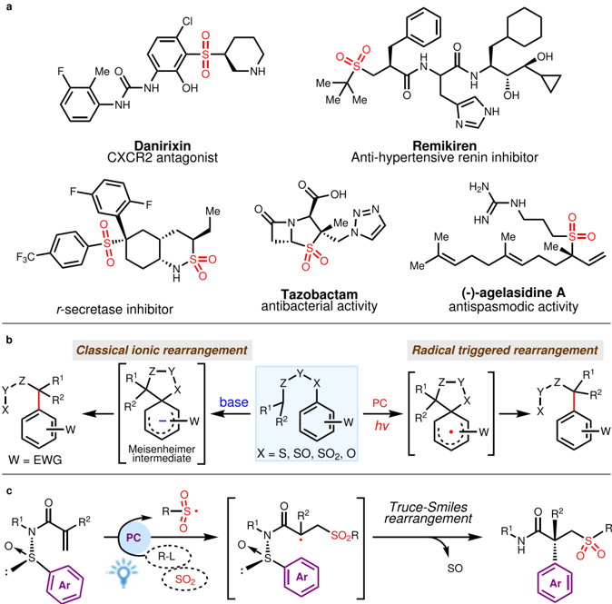
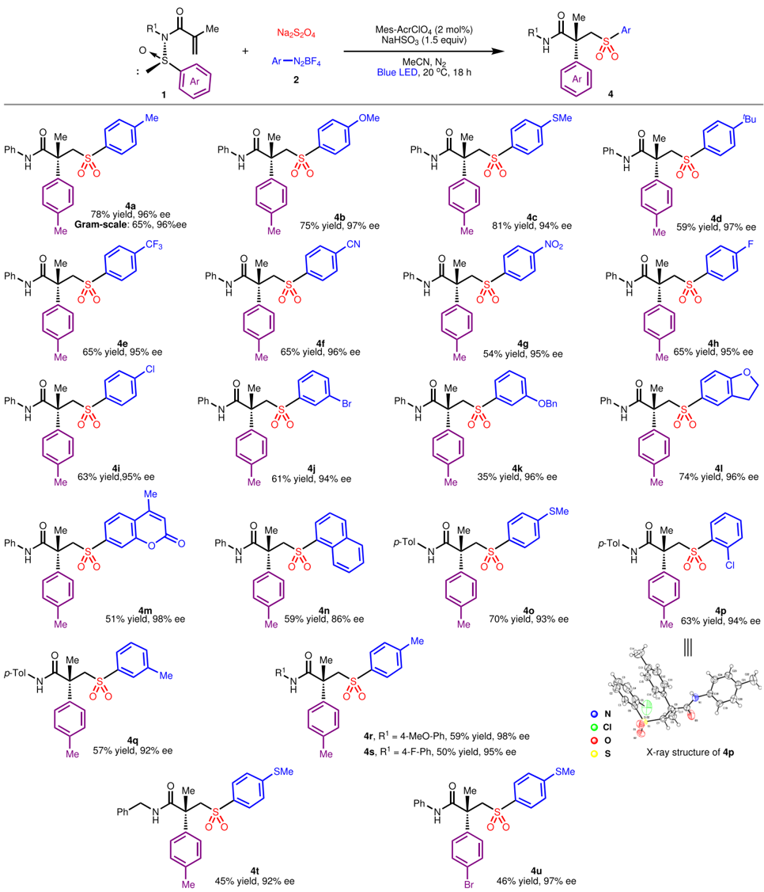
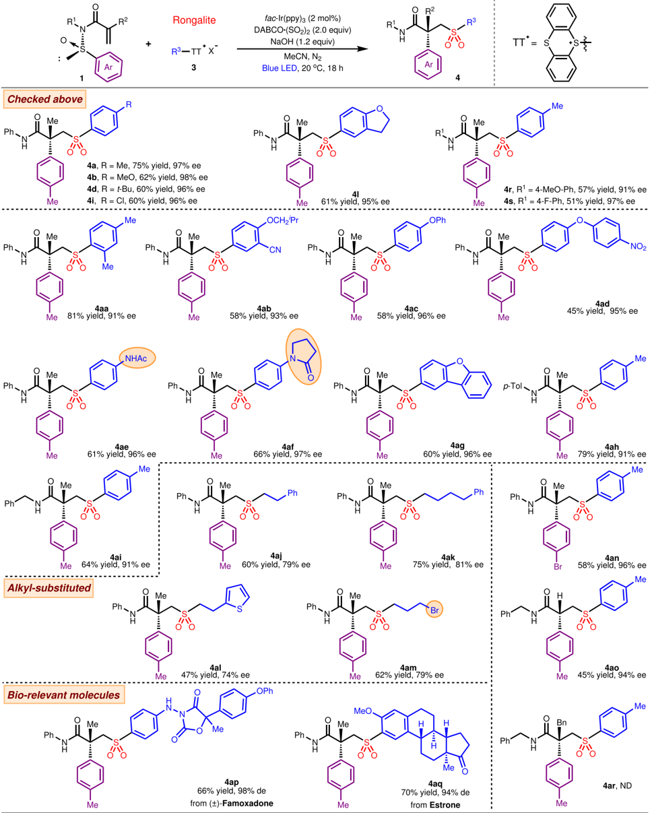
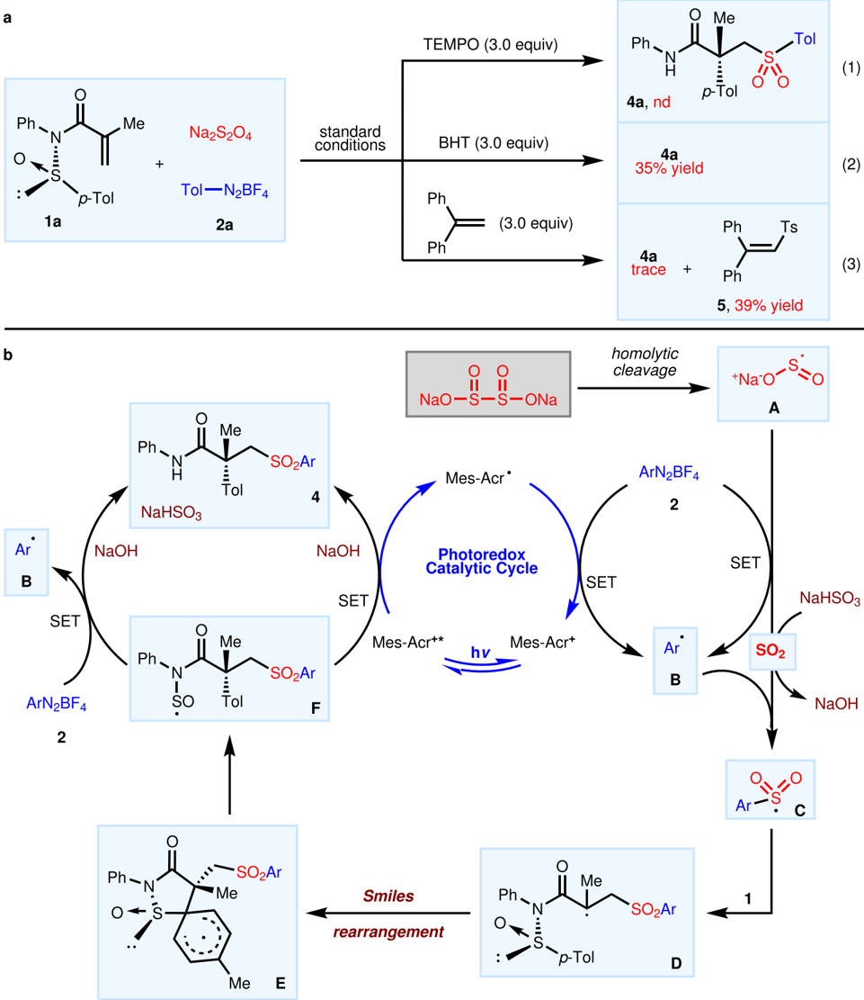

[1234567890():,;](http://crossmark.crossref.org/dialog/?doi=10.1038/s41467-022-34836-y&domain=pdf)

[1234567890():,;](http://crossmark.crossref.org/dialog/?doi=10.1038/s41467-022-34836-y&domain=pdf)

## Article

https://doi.org/10.1038/s41467-022-34836-y

## Accessing chiral sulfones bearing quaternary carbon stereocenters via photoinduced radical sulfur dioxide insertion and Truce -Smiles rearrangement

Received: 26 June 2022

Accepted: 9 November 2022

Check for updates

Jiapian Huang 1,5 , Fei Liu 1,5 , Ling-Hui Zeng 2 , Shaoyu Li 1 , Zhiyuan Chen 2 &amp; Jie Wu 1,3,4

From the viewpoint of synthetic accessibility and functional group compatibility, photoredox-catalyzed sulfur dioxide insertion strategy enables in situ generation of functionalized sulfonyl radicals from easily accessible starting materials under mild conditions, thereby conferring broader application potential. Here we present two complementary photoinduced sulfur dioxide insertion systems to trigger radical asymmetric Truce -Smiles rearrangements for preparing a variety of chiral sulfones that bear a quaternary carbon stereocenter. This protocol features broad substrate scope and excellent stereospeci fi city. Aside from scalability, the introduction of a quaternary carbon stereocenter at position β to bioactive molecule-derived sulfones further demonstrates the practicality and potential of this methodology.

As privileged structural units, chiral sulfones are pervasive in a variety of biologically active products and pharmaceutical molecules whose function could span from CXCR2 antagonist, antihypertensive renin inhibitor, r-secretase inhibitor to antibacterial and antispasmodic activities (Fig. 1a) 1 -7 . In synthetic development, these sulfone motifs permit versatile installation of other useful functionalities through directional derivatization such as alkylation, halogenation, nucleophilic substitution, oxidation, Julia ole fi nation and Ramberg -Bäcklund reaction 8 -11 . Owing to their established signi fi cance, the asymmetric synthesis of chiral sulfones has garnered considerable attentions from the synthetic chemistry community 12 -16 . The renewed recent interest in radical chemistry due to their high reactivity and chemoselectivity has yielded more ef fi cient radicalbased asymmetric transformations. This development reveals new possibilities to directly prepare chiral sulfones from sulfonyl radicals with asymmetric synthetic protocols. In this respect, Lin and Liu have independently described copper-catalyzed enantioselective sulfonyl radical-initiated difunctionalization of alkenes to obtain a series of chiral sulfone derivatives 17,18 . This approach bene fi ts further from the emergence of visible light photoredox catalysis, which has enabled generation of radicals under mild conditions via single-electron transfer from precursors 19 -21 or through radical insertion of sulfur dioxide 22 -36 . Using a photocatalytic system comprised of chiral biscyclometalated rhodium(III) complex, Meggers and Wu accomplished enantioselective conjugate addition of sulfonyl radicals to activated alkenes for the ef fi cient synthesis of chiral sulfones 19,20 . An elegant advance in photoinduced asymmetric sulfonylation was introduced by Gong and co-workers in 2021, which merges an inert C(sp 3 )-H functionalization with sulfur dioxide insertion mechanism to form the sulfonyl radicals 33 . Very recently, we developed a photoinduced, organocatalytic asymmetric radical approach to access sulfonyl-containing axially chiral styrenes through a threecomponent reaction of potassium alkyltri fl uoroborates, potassium metabisul fi te, and 1-(arylethynyl)naphthalen-2-ols, in which alkylsulfonyl radicals are formed in situ from a sulfur dioxide insertion process 36 . These advances notwithstanding, photoinduced radical

1 School of Pharmaceutical and Chemical Engineering &amp;Institute for Advanced Studies, Taizhou University, Taizhou 318000, China. 2 School of Medicine, Zhejiang University City College, Hangzhou 310015, China. 3 State Key Laboratory of Organometallic Chemistry, Shanghai Institute of Organic Chemistry, ChineseAcademyofSciences,Shanghai200032,China. 4 SchoolofChemistryandChemicalEngineering,HenanNormalUniversity,Xinxiang453007,China.

5 These authors contributed equally: Jiapian Huang, Fei Liu. e-mail: lisy@tzc.edu.cn; chenzy@zucc.edu.cn; jie\_wu@fudan.edu.cn

Fig. 1 | Valuable chiral sulfone-containing molecules and their construction. a Representative bioactive molecules containing chiral sulfone motif.

method that could assemble chiral sulfones with quaternary carbon stereocenters asymmetrically remains elusive and challenging.

Truce -Smiles rearrangement reactions which occur by predictable cleavage and reconstruction of chemical bonds in facilitating an aryl group migration has unmatched utility in furnishing quaternary carbon centers. Classical ionic rearrangements could exhibit high electronic and steric dependencies, requiring special substrates with electron withdrawing groups as well as forcing conditions including strong base and high temperature to effect an ef fi cient ipso nucleophilic substitution (Fig. 1b, left) 37,38 . As a complementaryreactionmode capable of compensating for the de fi ciencies associated with the ionic pathway, radical-triggered Truce -Smiles rearrangement (Fig. 1b, right) has come to the forefront since Speckamp ' s pioneering work 39 -42 . In parallel with the revival of photoredox chemistry, great strides were made in the radical paradigm of this reaction with substantial contributions from Stephenson, Studer, Sapi, Zhu, Nevado and others 43 -54 . However,thelowconversionenergyhasrestricted the development of the asymmetric versions of this radical rearrangement. Only recently haveNevadoandcolleaguesachievedthe fi rstasymmetric Truce-Smile rearrangement which generates a quaternary carbon stereocenter by designing a sulfoxide group as traceless chiral auxiliary on the substrates 54 . By using sulfonyl radicals generated from sulfonyl chlorides as initiators, this seminal protocol could be extended to construct chiral sulfones. Grounded in our long-term interest in sulfur dioxide insertion strategy 34 -36 , we were drawn to integrate this chemistry in a radical Truce -Smiles rearrangement which would constitute a strategic complement to this precedent. This motivation is particularly relevant considering the potentially tedious procurement of sulfonyl chlorides by chlorination of sulfonic acid or Sandmeyer reaction.

b Truce -Smiles rearrangement. c This work: radical sulfur dioxide insertion triggered asymmetric Truce -Smiles rearrangement.

Moreover, they could exhibit poor compatibility with amino and hydroxyl groups as well as other sensitive motifs.

Here, we show our efforts in developing asymmetric threecomponent Truce -Smiles rearrangement reaction of chiral acrylamides, carbon radical precursors and sulfur dioxide surrogates (Fig. 1c). Two complementary photoinduced sulfur dioxide insertion systems are established to trigger radical asymmetric Truce -Smiles rearrangements, enabling the installation of various functionalized sulfonyl groups to the β -position of all-carbon quaternary stereocenters.

## Results

## Reaction condition optimization

In view of its unique potential as single-electron reductant 55 , sodium dithionite was employed as the sulfur dioxide surrogate in combination with diazonium salts in our initial design to generate sulfonyl radicals for initiating the rearrangement. Using N -arylsul fi nyl acrylamide 1a and aryldiazonium salt 2a as model substrates, we commenced the search for suitable reaction conditions with the corresponding results outlined in Table 1. The desired product 4a could be afforded in 57% yield with 95% ee, by employing fac -Ir(ppy)3 as the photosensitizer and CH3CN as the solvent under the irradiation of 35 W blue LED at 20 °C for 18 h (entry 1). Further screening of photosensitizers revealed Mes-AcrClO4 with excellent oxidizing capability to be the optimal candidate (entries 2 -4). Other solvents including DMF, THF, DCE, and PhCF3 did not yield further enhancement of this outcome (entries 5 -8). By reasoning that a protonation should precede the product formation and Lewis basic acceptor would aid to intercept a departing SO cation, a series of additives capable of

Table 1 | Optimization of the reaction conditions a

|                                                                                                   | Ee (%) c    | 95             | 95                           | 95      | 96           | /            | 96           | 96           | 96           | 95           | 94           | 96           | 96           | 95           | 94           | 94           | 95      | 96           |
|---------------------------------------------------------------------------------------------------|-------------|----------------|------------------------------|---------|--------------|--------------|--------------|--------------|--------------|--------------|--------------|--------------|--------------|--------------|--------------|--------------|---------|--------------|
|                                                                                                   | Yield (%) b | 57             | 49                           | 51      | 62           | ND           | 42           | 31           | 10           | 40           | 34           | 68           | 82           | 40           | 69           | 31           | 50      | 40           |
| PC (2 mol%) additive (1.5 equiv) MeCN, N 2 Blue LED, 20 o C, 18 h N H O S p -Tol Me O O p -Tol 4a | Additive    | /              | /                            | /       | /            | /            | /            | /            | /            | H 2 O        | MeOH         | PhCO 2 H     | NaHSO 3      | NaHSO 3      | NaHSO 3      | NaHSO 3      | NaHSO 3 | NaHSO 3      |
| N S O Me p -Tol p -Tol N 2 BF 4 + Na 2 S 2 O 4 1a 2a                                              | Solvent     | CH 3 CN        | CH 3 CN                      | CH 3 CN | CH 3 CN      | DMF          | THF          | DCE          | PhCF 3       | CH 3 CN      | CH 3 CN      | CH 3 CN      | CH 3 CN      | CH 3 CN      | CH 3 CN      | CH 3 CN      | CH 3 CN | CH 3 CN      |
|                                                                                                   | PC          | fac -Ir(ppy) 3 | Ir[dF(CF 3 )ppy] 2 (bpy)PF 6 | 4CzIPN  | Mes-AcrClO 4 | Mes-AcrClO 4 | Mes-AcrClO 4 | Mes-AcrClO 4 | Mes-AcrClO 4 | Mes-AcrClO 4 | Mes-AcrClO 4 | Mes-AcrClO 4 | Mes-AcrClO 4 | Mes-AcrClO 4 | Mes-AcrClO 4 | Mes-AcrClO 4 | /       | Mes-AcrClO 4 |
|                                                                                                   | Entry       | 1              | 2                            | 3       | 4            | 5            | 6            | 7            | 8            | 9            | 10           | 11           | 12           | 13 d         | 14 e         | 15 f         | 16      | 17 g         |

PC: Photocatalyst. a Conditions: 1a (0.2 mmol), 2a (0.4 mmol), Na2S2O4 (0.4 mmol), photocatalyst (2 mol%), additive (1.5 equiv), solvent (3.0 mL), 35 W blue LED, under N2 at 20 °C for 18 h. b

Determined by 1H NMR analysis using 1,3,5-trimethoxybenzene as an internal standard. c Determined by HPLC analysis.

At 10 °C.

d

At 30 °C.

e

In the absence of Na2S2O4.

f

In the absence of visible light.

g

donating both proton and electron pair were introduced into the model reaction system. The addition of water, methanol and benzoic acid failed to bring about a notable positive effect in terms of product yield (entries 9 -11) while sodium bisul fi te signi fi cantly raised the product yield to 82% (entry 12). At this stage, the possibility of the latter to serve also as sulfur dioxide surrogate has yet to come to light. Performing the reaction at 20 °C was found to be most appropriate as a decreased or elevated reaction temperature led to notable erosion of yield to different extents (entries 13 and 14). Removal of Na2S2O4 resulted in a dramatic drop in yield, showing that both Na2S2O4 and NaHSO3 were necessary (entry 15). Similarly, a decreased yield was observed in the absence of either Mes-AcrClO4 or blue LED, suggesting that photosensitizer and visible light are crucial components for an ef fi cient transformation (entries 16 and 17).

## Substrate scope

Having established the optimal reaction parameters for the envisioned Truce -Smiles rearrangement, the general applicability of this set of conditions was then evaluated. As displayed in Fig. 2, various aryldiazonium salts were smoothly transformed into the desired chiral sulfones with high retention of optical purities and a broad tolerance of functional groups. For instance, substrates bearing electron-rich (alkyl, MeO, MeS) or electron-de fi cient (CF3, CN, NO2, halogen) para -substituent invariably participated smoothly to afford moderate-to-good product yields and excellent stereoselectivities, suggesting that the electronic characteristics and substitution patterns had limited effect on the rearrangement reaction ( 4a -4i ). Moreover, 3-bromosubstituted aryl sulfone 4j was smoothly produced in 61% yield and 94% ee, indicating opportunity to introduce other functionalities onto product scaffold through metal catalyzed cross-coupling reactions. By contrast, 3-benzyloxy-substituted substrate 2 underwent the rearrangement with lower ef fi ciency ( 4k ). It is worthy of note that structurally more varied diazonium salts derived from benzofuran, coumarin and naphthalene were compatible with the photoredox catalytic system as well ( 4l -4n ). The modulation of aryl ring within the N -arylsul fi nyl acrylamide component was also feasible, furnishing chrial sulfones 4o -4t in reasonable yields. The absolute con fi guration of compound 4p was determined as R by X-ray crystallographic analysis (CCDC: 2208406)andthoseofotherproductswereassignedbyanalogy.Itwas further demonstrated that the excellent retention of enantioselectivity and moderate yield could also be achieved when the migrating group was changed from p -tolyl to p -Br-phenyl group ( 4u ). On gram-scale, the synthesis of product 4a under the standard conditions proceeded in slightly deteriorated yield but with complete preservation of stereochemicalintegrity, demonstrating the potential utility in large-scale chemical synthesis.

Having demonstrated the ef fi cacy of sulfur dioxide insertion with diazonium salts to induce asymmetric Truce -Smiles rearrangement with step economy, we sought to extend the reach of this strategy beyond the imitation imposed by the choices of aryldiazonium salt. To this end, the thianthrenium salts that could be readily accessed through the thianthrenation of arenes or alkyl alcohols 56,57 were evaluated for their compatibility as free radical precursors in the sulfur dioxide insertion mechanism. Regrettably, the previous conditions could not be directly translated to this class of reactants, yielding no desired product. A switch of photosensitizer from Mes-AcrClO4 to fac -Ir(ppy)3 favorably delivered the expected product 4a in 43% yield. A more extensive examination of other reaction variables (see Supplementary Table 1) concluded the most optimal conditions used to survey reaction scope in Fig. 3: 1 (0.2 mmol), 3 (0.4 mmol), Rongalite (0.24 mmol), NaOH (0.24 mmol), fac -Ir(ppy)3 (2 mol%), DABCO·(SO2)2 (0.4 mmol), MeCN (3.0 mL), blue LED, under N2 at 20 °C for 18 h.

A variety of aryl thianthrenium salts could ef fi ciently support the asymmetric rearrangement with commendable stereochemical control ( 4 , 45 -81%, 74 -98% ee). Expectedly, several selected chiral sulfones derived with previous conditions were also readily furnished in this system with comparable yields and enantioselectivities ( 4a , 4b , 4d , 4i , 4j , 4r and 4s ). 2,4-Dimethylphenyl substrate participated in the reaction with slightly diminished ( 4aa ) enantioselectivity, perhaps due to steric congestion that hindered the stereochemical control during the arene transposition. Aryl thianthrenium salts bearing 3-cyano-4isobutoxy or 4-phenoxy substituent gave sulfones 4ab and 4ac , respectively, with good results but the yield declined to 45% ( 4ad ) when a 4-nitrophenoxy group was equipped in place of the alkoxy groups. Notably, amide functionalities were well tolerated in this reaction to furnish the corresponding products in excellent yields and enantioselectivities ( 4ae and 4af ). Heterocyclic dibenzofuran substrate was examined as well which provided product 4ag in 60% yield and 96% ee. When the N -phenyl group in sul fi nyl acrylamides was varied to N -Tol or N -Bn entity ( 4ah and 4ai ), the excellent reaction outcomes were largely unperturbed. As an intriguing complement to the diazonium salt system, the smooth participation of alkyl radical precursors including sensitive alkyl bromide notably expands the reaction scope despite the slightly lower enantioselectivity ( 4aj -4am ). While the substrate scope has been explored by using p -tolyl as the migrating group, a switch to 4-Br-phenyl ( 4an ) had no signi fi cant effect on yield and enantioselectivity of the Smiles rearrangement despite the change in electronics. By contrast, a more notable in fl uence on the reaction was exhibited in modulating the R 2 group tethered to alkene. The less sterically hindered H substituent gave the product 4ao in 45% yield and 94% ee, while the benzylic substrate could not be smoothly converted to 4ar . As a testament to the robustness and chemoselectivity of this system to operate in elaborated setting, we demonstrated that famoxadone and estrone could be derivatized into sulfones ( 4ap and 4aq ) with β -quaternary stereocenter through the developed sulfur dioxide insertion and subsequent Truce -Smiles rearrangement process. This portends the applicability of this method in medicinal chemistry setting.

## Controlled experiments and proposed reaction processes

To gain insights into mechanistic details, a series of control experimentswerecarried out, as displayed in Fig. 4a. The transformation was suppressed completely when the radical scavenger, 2,2,6,6-tetramethylpiperidineoxy (TEMPO) was added to the standard conditions. Butylated hydroxytoluene (BHT) hampered the product yield of 3a to 35% whereas the addition of 1,1-diphenylethylene gave rise to 4a in trace amounts alongside (2-tosylethene-1,1-diyl)dibenzene 5 in 39% yield under standard conditions. These results converge on a radical pathway that is operative in current transformation. Subsequent studies showed that neither sodium dithionite nor aryldiazonium salt could achieve fl uorescence quenching of photosensitizer MesAcrClO4. Another important indication came from the production of 4a in 50% yield when Mes-AcrClO4 was removed from the standard conditions, implying that current radical sulfonylation process could proceed spontaneously without photosensitizers, albeit with decreased ef fi ciency. Furthermore, a quantum yield of 3.28 determined for this reaction could elucidate the speculated spontaneity of this process.

These experimental data led to proposal of a plausible working mechanism for this photocatalytic asymmetric Smiles rearrangements based on diazonium salts, as shown in Fig. 4b. Initially, the homolytic cleavage of sodium dithionite generates two sulfur dioxide radical anions A , which could undergo single-electron transfer (SET) with aryldiazonium salt to release aryl radical B with simultaneous extrusion of SO2. It is reasoned that the decomposition of sodium bisul fi te could be an alternative source of SO2 in this system, as inferred from the improved conversion upon the inclusion of this additive. This is rapidly ensued by insertion of aryl radical B into sulfur dioxide to give sulfonyl radical species C that adds to the double bond to form new radical intermediate D . The radical

Fig. 2 | Generality of enantioselective Smiles rearrangement involving aryldiazonium tetra fl uoroborates. Reaction conditions: 1 (0.2 mmol), 2 (0.4 mmol),

Truce -Smiles rearrangement proceeds spontaneously to generate the SO-centered radical F 54 , traversing through a spirocyclic transition state E in an exothermic process 58 .The SO-centered radical F undergoes SET oxidation with aryldiazonium salt and further reacts with NaOH to convert into fi nal product 4 and NaHSO3. The regenerated NaHSO3 and aryl radicals would enter the reaction to complete the catalytic cycle. By introducing a photocatalytic system, the photoexcited Mes-Acr + * could accelerate the oxidation of

Na2S2O4 (0.4 mmol), Mes-AcrClO4 (2 mol%), NaHSO3 (0.3 mmol), MeCN (3.0 mL), 35W blue LED, under N2 at 10 °C for 18 h.

intermediate F to product 4 throughaSETprocesswhiletheMes-Acr· radical promotes the generation of aryl radical B fromdiazonium salt 2 , thereby improving the overall ef fi ciency of this reaction process. Based on quantum yield of 2.43 and Stern-Volmer quenching experiments (for the experimental details, see Supplementary Methods), an analogous photoredox catalytic mechanism for the Ir(III) catalytic system has also been proposed and included in the Supplementary Fig. 6.

Fig. 3 | Generality of enantioselective Smiles rearrangement involving thianthrenium salts. Reaction conditions: 1 (0.2 mmol), 3 (0.4 mmol), Rongalite

## Discussion

In summary, we have developed an effective enantioselective Truce -Smiles rearrangement strategy under photoredox catalysis, enabling simultaneous construction of a stereode fi ned a

(0.24 mmol), NaOH (0.24 mmol), fac -Ir(ppy)3 (2 mol%), DABCO·(SO2)2 (0.4 mmol), MeCN (3.0 mL), 35 W blue LED, under N2 at 10 °C for 18 h.

quaternary carbon center and the introduction of a sulfonyl group. The versatility of sulfur dioxide insertion strategy is exempli fi ed in the compatibility of diazonium and thianthrenium salts to generate diverse functionalized sulfonyl radical for initiating the

Fig. 4 | Control experiments and plausible mechanism. a Control experiments: (1) With TEMPO as a radical scavenger; (2) With BHT as a radical scavenger; (3) With

stereospeci fi c rearrangement process. The transfer of chirality from sulfur in sulfoxide to the quaternary carbon is achieved during aryl migration and carbon-carbon bond formation. By in situ generation of radicals, this three-component coupling chemistry exhibits good functional group compatibility and step economy. The application to late-stage functionalization of bioactive molecules further demonstrates the practicality and potential of this strategy.

1,1-diphenylethylene as a radical scavenger. b Proposed mechanism for photocatalytic asymmetric Smiles rearrangements based on diazonium salts.

## Methods

## General procedure for the synthesis of 4

Method A: in a glove box, a dry quartz vial equipped with a magnetic stir bar is charged sequentially with 1a (59.8 mg, 0.2 mmol), 2a (82.4 mg, 0.4 mmol), Na2S2O4 (69.6 mg, 0.4 mmol), NaHSO3 (31.2 mg, 0.3 mmol), Mes-AcrClO4 (1.6 mg, 2 mol%), and dry MeCN (3.0 mL). The reaction mixture is stirred for 18 h at 900 rpm in a thermostatic water bath at 20°C under a 35 W blue LED light. When the reaction is

completed (monitored by TLC), the mixture is puri fi ed by fl ash chromatography on silica gel eluted with PE/EA (5/1) to afford the corresponding products. Method B: in a glove box, a dry quartz vial equipped with a magnetic stir bar is charged sequentially with 1a (59.8 mg, 0.2 mmol), 3a (182.4 mg, 0.4 mmol), Rongalite (37.2 mg, 0.24 mmol), DABCO·(SO2)2 (96.1 mg, 0.4 mmol), NaOH (9.6 mg, 0.24 mmol), fac -Ir(ppy)3 (2.6 mg, 2 mol%) and dry MeCN (3.0 mL). The reaction mixture is stirred for 18 h at 900 rpm in a thermostatic water bath at 20 °C under a 35 W blue LED light. When the reaction is completed (monitored by TLC), the mixture is puri fi ed by fl ash chromatography on silica gel eluted with PE/EA (5/1) to afford the corresponding products.

## Data availability

Data relating to the materials and methods, optimization studies, experimental procedures, mechanistic studies, HPLC spectra, NMR spectra and mass spectrometry are available in the Supplementary information. The X-ray crystallographic coordinates for structures reported in this article have been deposited at the Cambridge Crystallographic Data Centre (CCDC), under deposition numbers CCDC 2208406. These data can be obtained free of charge from The Cambridge Crystallographic Data Centre via http://www.ccdc.cam.ac.uk/ data\_request/cif.

## References

1. Ghosh, A. K. et al. The development of cyclic sulfolanes as novel and high-af fi nity P2 ligands for HIV-1 protease inhibitors. J. Med. Chem. 37 , 1177 -1188 (1994).
2. Ghosh, A. K. &amp; Liu, W. Chiral auxiliary mediated conjugate reduction and asymmetric protonation: synthesis of high af fi nity ligands for HIV protease inhibitors. J. Org. Chem. 60 , 6198 -6201 (1995).
3. Kim, C. U. et al. New series of potent, orally bioavailable, nonpeptidic cyclic sulfones as HIV-1 protease inhibitors. J. Med. Chem. 39 , 3431 -3434 (1996).
4. Velázquez, F. et al. Cyclic sulfones as novel P3-caps for hepatitis C virus NS3/4A (HCV NS3/4A) protease inhibitors: synthesis and evaluation of inhibitors with improved potency and pharmacokinetic pro fi les. J. Med. Chem. 53 , 3075 -3085 (2010).
5. Fischli, W. et al. Ro 42-5892 is a potent orally active renin inhibitor in primates. Hypertension 18 , 22 -31 (1991).
6. Doswald, S. et al. Large scale preparation of chiral building blocks for the P3 site of renin inhibitors. Bioorg. Med. Chem. 2 , 403 -410 (1994).
7. Teall, M. et al. Aryl sulfones: a new class of γ -secretase inhibitors. Bioorg. Med. Chem. Lett. 15 , 2685 -2688 (2005).
8. Lehman de Gaeta, L. S., Czarniecki, M. &amp; Spaltenstein, A. Synthesis of highly functionalized trans -alkene isosteres of dipeptides. J. Org. Chem. 54 , 4004 -4005 (1989).
9. Blas, J., Carretero, J. C. &amp; Domínguez, E. Stereoselective approach to optically pure syn 2-amino alcohol derivatives. Tetrahedron Lett. 35 , 4603 -4606 (1994).
10. Knight, D. W. &amp; Sibley, A. W. A total synthesis of ( -)-slaframine from (+)-cis -(2R,3S)-3-hydroxyproline. Tetrahedron Lett. 34 , 6607 -6610 (1993).
11. Fustero, S., Soler, J. G., Bartolome, A. &amp; Rosello, M. S. Novel approach for asymmetric synthesis of fl uorinated β -amino sulfones and allylic amines. Org. Lett. 5 , 2707 -2710 (2003).
12. Desrosiers, J. &amp; Charette, A. B. Catalytic enantioselective reduction of β , β -disubstituted vinyl phenyl sulfones by using bisphosphine monoxide ligands. Angew. Chem. Int. Ed. 46 , 5955 -5957 (2007).
13. Peters, B. K. et al. An enantioselective approach to the preparation of chiral sulfones by Ir-catalyzed asymmetric hydrogenation. J. Am. Chem. Soc. 136 , 16557 -16562 (2014).
14. Long, J., Gao, W., Guan, Y., Lv, H. &amp; Zhang, X. Nickel-catalyzed highly enantioselective hydrogenation of β -acetylamino
15. vinylsulfones: access to chiral β -amido sulfones. Org. Lett. 20 , 5914 -5917 (2018).
15. Yan, Q. et al. Highly ef fi cient enantioselective synthesis of chiral sulfones by Rh-catalyzed asymmetric hydrogenation. J. Am. Chem. Soc. 141 , 1749 -1756 (2019).
16. Zhu, C., Cai, Y. &amp; Jiang, H. Recent advances for the synthesis of chiral sulfones with the sulfone moiety directly connected to the chiral center. Org. Chem. Front. 8 , 5574 -5589 (2021).
17. Fu, N. et al. New bisoxazoline ligands enable enantioselective electrocatalytic cyanofunctionalization of vinylarenes. J. Am. Chem. Soc. 141 , 14480 -14485 (2019).
18. Li, X.-T. et al. Diastereo- and enantioselective catalytic radical oxysulfonylation of alkenes in β , γ -unsaturated ketoximes. Chem 6 , 1692 -1706 (2020).
19. Huang,X.etal.Combiningthecatalyticenantioselectivereactionof visible-light-generated radicals with a by-product utilization system. Chem. Sci. 8 , 7126 -7131 (2017).
20. Kuang, Y. et al. Asymmetric synthesis of 1,4-dicarbonyl compounds from aldehydes by hydrogen atom transfer photocatalysis and chiral Lewis acid catalysis. Angew. Chem. Int. Ed. 58 , 16859 -16863 (2019).
21. Liang, D., Chen, J.-R., Tan, L.-P., He, Z.-W. &amp; Xiao, W.-J. Catalytic asymmetric construction of axially and centrally chiral heterobiaryls by Minisci reaction. J. Am. Chem. Soc. 144 , 6040 -6049 (2022).
22. Liu, G., Fan, C. &amp; Wu, J. Fixation of sulfur dioxide into small molecules. Org. Biomol. Chem. 13 , 1592 -1599 (2015).
23. Emmett, E. J. &amp; Willis, M. C. The development and application of sulfur dioxide surrogates in synthetic organic chemistry. Asian J. Org. Chem. 4 , 602 -611 (2015).
24. Qiu, G., Zhou, K., Gao, L. &amp; Wu, J. Insertion of sulfur dioxide via a radical process: an ef fi cient route to sulfonyl compounds. Org. Chem. Front. 5 , 691 -705 (2018).
25. Zheng, D. &amp; Wu, J. Sulfur Dioxide Insertion Reactions for Organic Synthesis (Nature Springer, Berlin, 2017).
26. Qiu, G., Zhou, K. &amp; Wu, J. Recent advances in the sulfonylation of C -Hbondswiththeinsertion of sulfur dioxide. Chem.Commun. 54 , 12561 -12569 (2018).
27. Ye, S., Qiu, G. &amp; Wu, J. Inorganic sul fi tes as the sulfur dioxide surrogates in sulfonylation reactions. Chem. Commun. 55 , 1013 -1019 (2019).
28. Ye, S., Yang, M. &amp; Wu, J. Recent advances in sulfonylation reactions using potassium/sodium metabisul fi te. Chem. Commun. 56 , 4145 -4155 (2020).
29. Huang, J., Ding, F., Chen, Z., Yang, G. &amp; Wu, J. A multi-component reaction of electron-rich arenes, potassium metabisul fi te, aldehydes and aryldiazonium tetra fl uoroborates. Org. Chem. Front. 8 , 1461 -1465 (2021).
30. Liu, F. et al. Merging [2+2] cycloaddition with radical 1,4-addition: metal-free access to functionalized cyclobuta[ a ]naphthalen-4-ols. Angew. Chem. Int. Ed. 56 , 15570 -15574 (2017).
31. Wang, H., Sun, S. &amp; Cheng, J. Copper-catalyzed arylsulfonylation and cyclizative carbonation of N -(arylsulfonyl)acrylamides involving desulfonative arrangement toward sulfonated oxindoles. Org. Lett. 19 , 5844 -5847 (2017).
32. Meng, Y., Wang, M. &amp; Jiang, X. Multicomponent reductive crosscoupling of an inorganic sulfur dioxide surrogate: straightforward construction of diversely functionalized sulfones. Angew. Chem. Int. Ed. 59 , 1346 -1353 (2020).
33. Cao, S., Hong, W., Ye, Z. &amp; Gong, L. Photocatalytic threecomponent asymmetric sulfonylation via direct C(sp 3 )-H functionalization. Nat. Commun. 12 , 2377 -2388 (2021).
34. Zheng, D., An, Y., Li, Z. &amp; Wu, J. Metal-free aminosulfonylation of aryldiazonium tetra fl uoroborates with DABCO ⋅ (SO2)2 and hydrazines. Angew. Chem. Int. Ed. 53 , 2451 -2454 (2014).

35. Zheng, D., Yu, J. &amp; Wu, J. Generation of sulfonyl radicals from aryldiazonium tetra fl uoroborates and sulfur dioxide: the synthesis of 3-sulfonated coumarins. Angew. Chem. Int. Ed. 55 , 11925 -11929 (2016).
36. Zhang, C. et al. Access to axially chiral styrenes via a photoinduced asymmetric radical reaction involving a sulfur dioxide insertion. Chem. Catal. 2 , 164 -177 (2022).
37. Holden, C. M. &amp; Greaney, M. F. Modern aspects of the Smiles rearrangement. Chem. Eur. J. 23 , 8992 -9008 (2017).
38. Snape, T. J. A truce on the Smiles rearrangement: revisiting an old reaction -the Truce -Smiles rearrangement. Chem. Soc. Rev. 37 , 2452 -2458 (2008).
39. Loven, R. &amp; Speckamp, W. N. A novel 1,4 arylradical rearrangement. Tetrahedron Lett. 13 , 1567 -1570 (1972).
40. Li, L. et al. Radical aryl migration enables diversity-oriented synthesis of structurally diverse medium/macro- or bridged-rings. Nat. Commun. 7 , 13852 (2016).
41. Li, L., Li, Z.-L., Gu, Q.-S., Wang, N. &amp; Liu, X.-Y. A remote C -C bond cleavage-enabled skeletal reorganization: access to medium-/ large-sized cyclic alkenes. Sci. Adv. 3 , e1701487/1 -e1701487/ 8 (2017).
42. Li, L. et al. 1,2-Difunctionalization-type (hetero)arylation of unactivated alkenes triggered by radical addition/remote (hetero)aryl migration. Chem. Commun. 53 , 4038 -4041 (2017).
43. Chen, Y., Chang, L. &amp; Zuo, Z. Visible-light photoredox-induced Smiles rearrangement. Acta Chim. Sin. 77 , 794 -802 (2019).
44. Wu,X., Ma, Z., Feng, T. &amp; Zhu, C. Radical-mediated rearrangements: past, present, and future. Chem. Soc. Rev. 50 , 11577 -11613 (2021).
45. Douglas, J. J., Albright, H., Sevrin, M. J., Cole, K. P. &amp; Stephenson, C. R. J. A visible-light-mediated radical Smiles rearrangement and its application to the synthesis of a di fl uoro-substituted spirocyclic ORL-1 antagonist. Angew. Chem. Int. Ed. 54 , 14898 -14902 (2015).
46. Alpers, D., Cole, K. P. &amp; Stephenson, C. R. J. Visible light mediated aryl migration by homolytic C -N cleavage of aryl amines. Angew. Chem. Int. Ed. 57 , 12167 -12170 (2018).
47. Monos, T. M., McAtee, R. C. &amp; Stephenson, C. R. J. Arylsulfonylacetamides as bifunctional reagents for alkene aminoarylation. Science 361 , 1369 -1373 (2018).
48. Wang, N. et al. Direct photocatalytic synthesis of medium-sized Lactams by C -C bond cleavage. Angew. Chem. Int. Ed. 57 , 14225 -14229 (2018).
49. Yu, J., Wu, Z. &amp; Zhu, C. Ef fi cient docking -migration strategy for selective radical di fl uoromethylation of alkenes. Angew. Chem. Int. Ed. 57 , 17156 -17160 (2018).
50. Pudlo, M., Allart-Simon, I., Tinant, B., Gérard, S. &amp; Sapi, J. First domino radical cyclisation/Smiles rearrangement combination. Chem. Commun. 48 , 2442 -2444 (2012).
51. Friese, F. W., Mück-Lichtenfeld, C. &amp; Studer, A. Remote C -H functionalization using radical translocating arylating groups. Nat. Commun. 9 , 2808 -2814 (2018).
52. Kong, W., Casimiro, M., Merino, E. &amp; Nevado, C. Copper-catalyzed one-pot tri fl uoromethylation/aryl migration/desulfonylation and C(sp 2 ) -Nbond formation of conjugated tosyl amides. J. Am. Chem. Soc. 135 , 14480 -14483 (2013).
53. Kong, W., Merino, E. &amp; Nevado, C. Arylphosphonylation and arylazidation of activated alkenes. Angew. Chem. Int. Ed. 53 , 5078 -5082 (2014).
54. Hervieu, C. et al. Asymmetric, visible light-mediated radical sul fi nylSmiles rearrangement to access all-carbon quaternary stereocentres. Nat. Chem. 13 , 327 -334 (2021).
55. Li, Y., Chen, S., Wang, M. &amp; Jiang, X. Sodium dithionite-mediated decarboxylative sulfonylation: facile access to tertiary sulfones. Angew. Chem. Int. Ed. 59 , 8907 -8911 (2020).
56. Berger, F. et al. Site-selective and versatile aromatic C -H functionalization by thianthrenation. Nature 567 , 223 -228 (2019).
57. Engl, P. S. et al. C -N Cross-couplings for site-selective late-stage diversi fi cation via aryl sulfonium salts. J. Am. Chem. Soc. 141 , 13346 -13351 (2019).
58. Sheng, R.-L., Okada, K. &amp; Sekiguchi, S. Aromatic nucleophilic substitution. 9. Kinetics of the formation and decomposition of anionic.sigma. complexes in the Smiles rearrangements of N-acetyl.beta.-aminoethyl 2-X-4-nitro-1-phenyl or N-acetyl-.beta.-aminoethyl 5-nitro-2-pyridyl ethers in aqueous dimethyl sulfoxide. J. Org. Chem. 43 , 441 -447 (1978).

## Acknowledgements

We are grateful for fi nancial support from National Natural Science Foundation of China (No. 22171206, J.W.), the Leading Innovative and Entrepreneur Team Introduction Program of Zhejiang (No. 2019R01005, J.W.), the Natural Science Foundation of Zhejiang Province (LY22B020003, S.L.), and the Open Research Fund of School of Chemistry and Chemical Engineering, Henan Normal University (2020ZD04, J.W.).

## Author contributions

J.W., S.L. and Z.C. conceived and directed the project. J.H. and F.L. designed and performed experiments and prepared the supplementary information. L.-H.Z. participated in the reaction mechanism discussion. S.L. wrote the paper. All authors commented on the manuscript.

## Competing interests

The authors declare no competing interests.

## Additional information

Supplementary information The online version contains supplementary material available at https://doi.org/10.1038/s41467-022-34836-y.

Correspondence and requests for materials should be addressed to Shaoyu Li, Zhiyuan Chen or Jie Wu.

Peer review information Nature Communications thanks Xin-Yuan Liu and the other, anonymous, reviewer(s) for their contribution to the peer review of this work. Peer reviewer reports are available.

Reprints and permissions information http://www.nature.com/reprints

Publisher ' s note Springer Nature remains neutral with regard to jurisdictional claims in published maps and institutional af fi liations.

Open Access This article is licensed under a Creative Commons Attribution 4.0 International License, which permits use, sharing, adaptation, distribution and reproduction in any medium or format, as long as you give appropriate credit to the original author(s) and the source, provide a link to the Creative Commons license, and indicate if changes were made. The images or other third party material in this article are included in the article ' s Creative Commons license, unless indicated otherwise in a credit line to the material. If material is not included in the article ' s Creative Commons license and your intended use is not permitted by statutory regulation or exceeds the permitted use, you will need to obtain permission directly from the copyright holder. To view a copy of this license, visit http://creativecommons.org/ licenses/by/4.0/.

- ©The Author(s) 2022

is available at