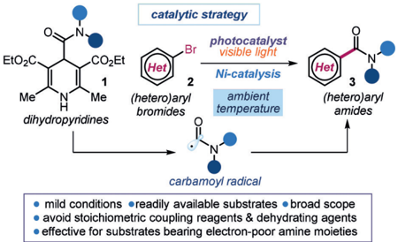
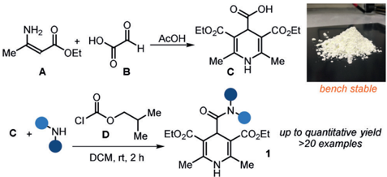
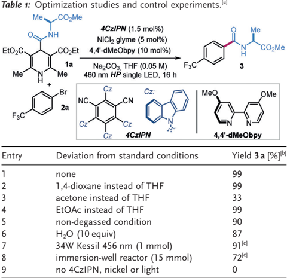
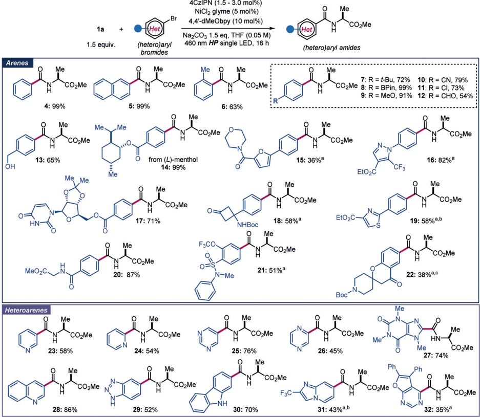
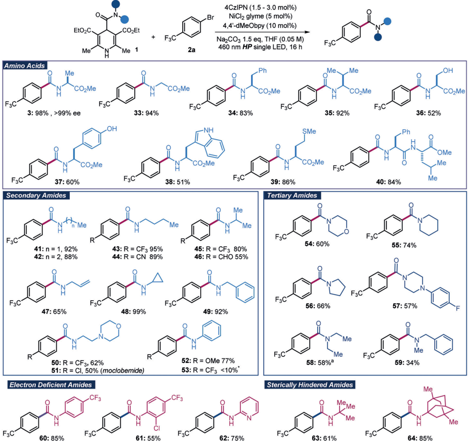
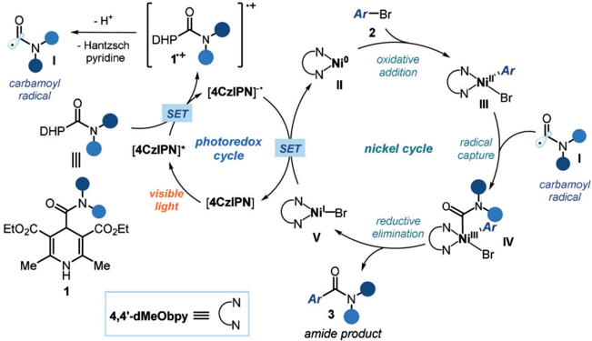

## Research Articles

German Edition:

DOI: 10.1002/ange.202000224

International Edition: DOI: 10.1002/anie.202000224

## Amide Synthesis by Nickel/Photoredox-Catalyzed Direct Carbamoylation of (Hetero)Aryl Bromides

Nurtalya Alandini, Luca Buzzetti, Gianfranco Favi, Tim Schulte, Lisa Candish, Karl D. Collins, and Paolo Melchiorre*

In memory of Giuseppe Bartoli

Abstract: Herein, we report a one-electron strategy for catalytic amide synthesis that enables the direct carbamoylation of (hetero)aryl bromides. This radical cross-coupling approach, which is based on the combination of nickel and photoredox catalysis, proceeds at ambient temperature and uses readily available dihydropyridines as precursors of carbamoyl radicals. The methods mild reaction conditions make it tolerant of sensitive-functional-group-containing substrates and allow the installation of an amide scaffold within biologically relevant heterocycles. In addition, we installed amide functionalities bearing electron-poor and sterically hindered amine moieties, which would be difficult to prepare with classical dehydrative condensation methods.

## Introduction

Amides are widespread structural units in nature, since the amide bond is the core linkage of natural proteins and peptides. [1] This moiety is also present in polymers, agrochemicals, and pharmaceutical molecules. [2] For example, 70% of the top 50 selling small molecule drugs of 2018 contain an amide bond linkage. [3] Despite the prevalence and importance of amides, improved methods for their synthesis

[*] Prof. Dr. P. Melchiorre ICREA

Passeig Lluís Companys 23, 08010 Barcelona (Spain)

N. Alandini, Dr. L. Buzzetti, Prof. Dr. P. Melchiorre

ICIQ - Institute of Chemical Research of Catalonia the Barcelona Institute of Science and Technology

Avenida Països Catalans 16, 43007 Tarragona (Spain)

E-mail: pmelchiorre@iciq.es

Homepage: http://www.iciq.org/research/research\_group/prof-pao- lo-melchiorre/

Prof. Dr. G. Favi Department of Biomolecular Sciences University of Urbino 'Carlo Bo' via I. Maggetti 24, 61029 Urbino (Italy)

T. Schulte, Dr. L. Candish, Dr. K. D. Collins Small Molecule Innovations, Bayer AG, Pharmaceuticals Aprather Weg 18a, 42113 Wuppertal (Germany)

Supporting information and the ORCID identification number(s) for the author(s) of this article can be found under https://doi.org/10. 1002/anie.202000224.

2020 The Authors. Published by Wiley-VCH Verlag GmbH &amp; Co. KGaA. This is an open access article under the terms of the Creative Commons Attribution Non-Commercial License, which permits use, distribution and reproduction in any medium, provided the original work is properly cited, and is not used for commercial purposes.

are still highly sought-after, [4] especially if they can offer high efficiency and reduced environmental impact. [5] This is because the most common methods for amide preparation-dehydrative condensation-typically use stoichiometric amounts of high molecular weight coupling reagents, which are often expensive, toxic, and/or potentially explosive. [6] While often tolerable on a small scale, this inefficiency has significant implications when it comes to the manufacture of bio-active molecules, such as drugs or agrochemicals, which may need to be synthesized on multi-ton scale. [7] This explains why the pharmaceutical industry has recently posed a great emphasis into methods for amide bond formation that avoid poor atom economy reagents. [8]

Catalytic methods for amide synthesis have the potential to minimize waste, improve the environmental burden, and lower costs of the process. [5] Some recent key advances include the use of group IV metal salts [9] or boron compounds [10] as catalysts and the development of Pd-catalyzed aminocarbonylation-the three-component coupling of an aryl halide with an amine and carbon monoxide. [11] However, the need for toxic gaseous CO and copious amounts of molecular sieves as drying agents complicates the use of these catalytic methods. In addition, most of the protocols require severe reaction conditions and elevated temperatures, which limit the tolerance for substrates with sensitive functional groups. Therefore, there is still a need for catalytic amide synthesis approaches that operate at room temperature, offer a broad substrate scope, and avoid the use of excess drying agents. [12]

Herein, we describe the ambient temperature catalytic conversion of aryl and heteroaryl bromides to their corresponding amides enabled by the combination of nickel and photoredox catalysis (Figure 1). [13] We used readily available, cheap and stable 4-carbamoyl-1,4-dihydropyridines 1 that, upon single-electron transfer (SET) oxidation, can generate carbamoyl radicals. [14] The ability of a nickel catalysts to undergo oxidative addition with aromatic bromides 2 while engaging in radical capture mechanisms secured the formation of the cross-coupled amide products 3 . [15]

The method requires mild reaction conditions and avoids the need for any dehydrating agents. It offers a wide scope allowing the straightforward preparation of secondary and tertiary amides and the direct installation of an amide scaffold within biologically relevant heterocycles. In addition, we installed amide functionalities bearing electron-poor amine moieties, which would be difficult to prepare with classical dehydrative condensation methods.

lable 1: Uptimization studies and control experiments.

Me.

catalytic strategy

NH2

CDCh

O.

-NH

Me*

EtO\_C.

EtO\_C

OEt

Me*

Me

4CzIPN (1.5 mol%)

Br photocatalyst

NiCl2 glyme (5 mol%)

COZEt

-COZEt

1a

OH

COLEt visible light

H

He

1

H

Me

N

+

Br

CI

dihydropyridines

C +

4,4'-dMeObpy (10 mol%)

Me®

B

2

Ni-catalysis

3

NazCO3, THF (0.05 M)

F3C

3

IZ

F3C

2a

NH

Figure 1. The presented radical cross-coupling approach to amide synthesis under photoredox-nickel dual catalysis.

## Results and Discussion

Developing this protocol required a suitable carbamoyl radical precursor. The choice of substrate 1 was motivated by the notion that 4-alkyl/acyl-1,4-dihydropyridines can generate alkyl [16] and acyl [17] radicals under oxidative conditions, respectively. We therefore surmised that dihydropyridines 1 , adorned with a carbamoyl moiety, would provide the target carbamoyl radical upon SET oxidation by a photoredox catalyst. We developed a straightforward synthesis of 1 from the dihydropyridine derivative C bearing a carboxyl moiety at the C4-position (Scheme 1). The bench-stable intermediate C [18] can be easily prepared in one step and on multigram scale from cheap and commercially available amino crotonate A and glyoxylic acid B . Subsequent condensation with amines in the presence of stoichiometric amounts of isobutylchloroformate D delivers the 4-carbamoyl-1,4-dihydropyridines 1 in excellent yields.

With the carbamoyl radical precursor in hand, we started our investigations (Table 1) by evaluating the cross-coupling reaction between the l -alanine-derived dihydropyridine 1a ( E ox ( 1a C + / 1a ) =+ 1.39 V vs. Ag/Ag + in acetonitrile, CH 3CN) and 4-bromobenzotrifluoride 2a . [19] The experiments were conducted at ambient temperature, using a single high-power (HP) blue LED emitting at 460 nm, a slight excess of 1 (1.5 equiv) and in the presence of NiCl 2 glyme (5 mol%), 4-4 ' -dimethoxy-2-2 ' -bipyridine (dMeObpy) as the ligand (10 mol%), and the organic photocatalyst 4CzIPN . [20] When performing the reaction in tetrahydrofuran (THF) or 1,4-

Scheme 1. Synthesis of the carbamoyl radical precursor 1 ; AcOH: acetic acid; DCM: dichloromethane.

Me

Het

Me

## Research Articles

|   Entry | Deviation from standard conditions   | Yield 3a [%] [b]   |
|---------|--------------------------------------|--------------------|
|       1 | none                                 | 99                 |
|       2 | 1,4-dioxane instead of THF           | 99                 |
|       3 | acetone instead of THF               | 33                 |
|       4 | EtOAc instead of THF                 | 99                 |
|       5 | non-degassed condition               | 90                 |
|       6 | H 2 O (10 equiv)                     | 87                 |
|       7 | 34W Kessil 456 nm (1 mmol)           | 91 [c]             |
|       8 | immersion-well reactor (15 mmol)     | 72 [c]             |
|       9 | no 4CzIPN, nickel or light           | 0                  |

[a] Reactions performed on a 0.1 mmol scale at ambient temperature for 16 h under illumination by a single high-power (HP) blue LED ( l max = 460 nm, irradiance = 100  3 mWcm  2 ) and using 1.5 equiv of 1a and Na 2 CO3. [b] Yield determined by 1 HNMR analysis of the crude mixture using trichloroethylene as the internal standard. [c] Yield of isolated 3a . LED = light-emitting diode; Na 2CO3 = sodium carbonate.

dioxane, the cross-coupling amide product 3 was obtained in quantitative yield (entries 1 and 2). The reaction also proceeds in 'industrially preferred' solvents [21] (acetone and ethyl acetate (EtOAc), entries 3 and 4 respectively), therefore offering a good versatility to avoid potential substrate solubility issues. As a proof of the methods robustness, the reaction could be performed without degassing the solvent (entry 5) [22] and in the presence of water (entry 6), which only marginally affected the efficiency of the process. This reaction was also amenable to scale-up with no significant difference in reactivity using a simple experimental set-up (1.0 mmol, entry 7). The use of an immersion-well reactor (experimental details in Section D3 of the Supporting Information) allowed us to perform the process on a relevant preparative scale and without the need of re-optimization (entry 8, 15 mmol scale), delivering product 3 in 72% yield ( &gt; 3 g). Control experiments confirmed that the reaction could not proceed in the absence of light, the photocatalyst, or nickel (entry 9). As a testament of the mild conditions of the system, we confirmed that, in all these experiments, no racemization of the enantiopure alanine scaffold occurred during the process.

Using the optimized conditions described in Table 1, entry 1, we tested the generality of the nickel/photoredoxcatalyzed carbamoylation process. We first evaluated the scope of the (hetero)aryl bromides (Figure 2). A wide range of aryl bromides, bearing both electron-rich and electronpoor substituents, underwent the carbamoylation with the l -alanine-derived dihydropyridine 1a in moderate to excellent yields (adducts 4 -13 ). High yields were achieved with bromobenzene ( 4 ) and bromonaphthalene ( 5 ). An ortho -substituent was well-tolerated ( 6 ), while an ortho -ortho ' -

CDCh

Arenes

H

4: 99%

H

13: 65%

HN

MeO\_C

Heteroarenes

23: 58%

1a

1.5 equiv.

4CzIPN (1.5 - 3.0 mol%)

## Research Articles

NazCO3 1.5 eq, THF (0.05 M)

(hetero)aryl amides

460 nm HP single LED, 16 h

Br

O

(hetero)aryl

Figure 2. Scope of (hetero)aryl bromides. Reactions performed on 0.1 mmol scale at ambient temperature for 16 h under illumination by a single blue LED ( l max = 460 nm) and using dihydropyridines (1.5 equiv), Na 2CO3 (1.5 equiv) in THF (0.05 m ). Yields of products refer to isolated material after purification (average of two runs per substrate). [a] Performed in 1,4-dioxane (0.05 m ) using 3 mol% of the photocatalyst. [b] 0.2 mmol scale. [c] 0.2 mmol scale in 1,4-dioxane (0.025 m ). Boc: tert -butyloxycarbonyl.

disubstituted aryl bromide remained unreactive, possibly because of steric hindrance (results not shown). The ability to tolerate aryl boronates (adduct 8 ) and chlorides ( 11 ) demonstrated that the protocol is orthogonal to classical metal-catalyzed cross-coupling reactions and allows further functionalization. We then evaluated the compatibility with unprotected polar functional groups, which is an important criterion for assessing a methods applicability to complex molecule synthesis and drug discovery. [23] Aryl bromides bearing sensitive functional groups, including aldehydes ( 12 ), unprotected alcohols ( 13 ), ketones and Boc-protected amines ( 18 and 22 ), amides ( 15 and 20 ), and sulfonamide moieties ( 21 ) underwent the reaction smoothly. Our approach displayed a good level of tolerance towards heterocyclic substituents containing oxygen ( 15 ), nitrogen ( 16 ), and sulfur atoms ( 19 ). Functionalized aryl bromides bearing l -menthol ( 14 ), 2 ' ,3 ' -O -isopropylideneuridine ( 17 ), and glycine ( 20 )

were tolerated, highlighting the methods potential for complex molecule synthesis. Given the prevalence of nitrogen-containing heterocycles in biologically active molecules, [24] we then evaluated the tendency of (hetero)aryl bromides to undergo the carbamoylation process. Pyridines ( 23 -24 ), pyrimidine ( 25 ), pyrazine ( 26 ), quinoline ( 28 ), unprotected benzotriazole ( 29 ), imidazo[1,2a ]pyridine ( 31 ), and furo[2,3d ]pyrimidine ( 32 ) could all be functionalized. The protocol also provides a direct approach to carbamoylated caffeine ( 27 ) and carbazole ( 30 ), which would be difficult to access through traditional amidation methods because the carboxylic acid precursors are not readily available.

We then focused on the scope of the carbamoyl radical precursors (Figure 3). We first evaluated aminoacidic residues other than alanine that could be coupled with 4-bromobenzotrifluoride 2a . [25] Glycine ( 33 ), phenylalanine ( 34 ), and valine bromides

+

CDCh

Amino Acids

H

F3C

3: 98%, &gt;99% ee

F3C

Secondary Amides

F3C

41: n = 1, 92%

42: n = 2, 88%

47: 65%

F3C

R

Electron Deficient Amides

F3C

+

F3C

## Research Articles

NazCO3 1.5 eq, THF (0.05 M)

F3C

60: 85%

Figure 3. Scope of carbamoyl radical precursors. Reactions performed on 0.1 mmol scale at ambient temperature for 16 h under illumination by a single blue LED ( l max = 460 nm) and using dihydropyridines (1.5 equiv), Na 2CO3 (1.5 equiv) in THF (0.05 m ). Yields of products refer to isolated material after purification (average of two runs per substrate). [a] Performed in 1,4-dioxane (0.05 m ).

( 35 ) could be installed in the amide products in excellent yields. There was good tolerance of the presence of free alcohols within serine ( 36 ) and tyrosine ( 37 ) and of an unprotected nitrogen in tryptophan ( 38 ). The reaction also proceeded efficiently when using the methionine-derived dihydropyridine, affording amide 39 bearing the S -methyl thioether group. Peptides are generally considered poor drug candidates because of their low oral bioavailability. [26] However, modifications, including N-terminal-capping, can improve their bioavailability and stability. [26b] Our method enabled the coupling of a dipeptide with 2a to provide the N -aroyl capped dipeptide 40 in high yield.

Further evaluation of the dihydropyridines amenable to this strategy revealed that a variety of N -alkyl carbamoyl groups could be tolerated, delivering secondary amides, including the drug molecule moclobemide 51 , in moderate to high yields. An aniline-containing carbamoyl group could also be installed, although an electron-rich aryl bromide was needed to secure high reactivity (adducts 52 and 53 ). Tertiary amides bearing morpholines ( 54 ), piperidines ( 55 ), pyrrolidines ( 56 ), and piperazines ( 57 ) were successfully obtained in good yields, while acyclic tertiary amides were achieved in moderate yields ( 58 -59 ). These results suggest that our protocol can complement amide formation strategies based on isocyanates, as they are limited to the synthesis of primary and secondary amides. [11f,27]

Finally, we evaluated the possibility of installing amide functionalities bearing either sterically hindered or electronpoor amine moieties, which would be difficult to prepare by classical dehydrative condensation methods. Amides bearing

460 nm HP single LED, 16 h

EtO\_CR

Me®

COLEt

Me 1

2a

Br

CDCh

- H+

- Hantzsch pyridine

carbamoy!

radical

DHP

EtO\_C

Me®

N

DHP

1+

\ [4CZIPNI:

SET

[4CzIPN)* photoredox cycle

visible light

[4CzIPN]

COZEt

Me

4,4'-dMeObpy

NI°

Ar-Br

2

oxidative addition

## Research Articles

Nill Ar

Figure 4. Proposed mechanism.

electron-poor anilines ( 60 and 61 ), pyridines ( 62 ), and hindered fragments ( 63 -64 ) could all be effectively prepared using this nickel/photoredox dual catalysis approach.

A possible mechanism for the nickel/photoredox-catalyzed carbamoylation process is proposed in Figure 4. Photoexcitation of the organic photocatalyst 4CzIPN ( E 1/2 ( 4CzIPN * / 4CzIPN C  ) =+ 1.43 V vs. SCE in CH 3 CN) [20] forms an oxidant strong enough to take an electron from the dihydropyridine radical precursor 1 ( E red ( 1a C + / 1a ) =+ 1.39 V vs. Ag/Ag + in CH 3 CN). This SETevent triggers the formation of the carbamoyl radical I . Simultaneously, the Ni 0 complex II undergoes oxidative addition with aromatic bromide 2 to afford the Ni II complex III . This intermediate intercepts the nucleophilic carbamoyl radical I to form the Ni III intermediate IV , which, after reductive elimination, forges the desired C(sp 2 )  C(sp 2 ) bond in the cross-coupled amide product 3 . Finally, the ensuing Ni I intermediate ( E red [Ni I /Ni 0 ] =  1.13 V vs. Ag + /AgNO3 in DMF) [28] undergoes SET reduction by the reduced form of the photoredox catalyst (E1/2 ( 4CzIPN / 4CzIPN C  ) =  1.24 V vs. SCE in CH3CN), completing the catalytic cycle while regenerating both active catalysts.

## Conclusion

In summary, we have reported a catalytic method for amide synthesis that occurs at ambient temperature. The chemistry exploits the ability of readily available 4-carbamoyl-1,4-dihydropyridines 1 to generate carbamoyl radicals upon SET oxidation by a visible-light-activated photoredox catalyst. This carbamoyl radical generation was used to develop a nickel cross coupling process to synthesize (hetero)aryl amides from readily available aryl bromides. This method tolerates unprotected polar functional groups and heterocycles, and it could be applied to the carbamoylation of complex molecules. We also demonstrated that the process is directly scalable without re-optimization. These findings, along with the experimental simplicity and the low cost and the stability of the substrates, suggest that this catalytic

·+

approach to amide synthesis can effectively complement conventional carbonylation chemistry and be useful in life science endeavours.

## Acknowledgements

Financial support was provided by MICIU (CTQ2016-75520P), the AGAUR (Grant 2017 SGR 981), and the European Research Council (ERC-2015-CoG 681840 - CATA-LUX). N.A. thanks H2020-MSCA-ITN-2016 (722591 - PHOTOTRAIN) for a predoctoral fellowship. L.B. thanks MINECO for a predoctoral fellowship (CTQ2013-45938-P).

## Conflict of interest

The authors declare no conflict of interest.

Keywords: amides · cross-coupling · nickel catalysis · photoredox catalysis · radical chemistry

How to cite: Angew. Chem. Int. Ed. 2020 , 59 , 5248-5253 Angew. Chem. 2020 , 132 , 5286-5291

- [1] A. Greenberg, C. M. Breneman, J. F. Liebman, The Amide Linkage: Structural Significance in Chemistry , Biochemistry and Materials Science , Wiley-VCH, Weinheim, 2003 .
- [2] a) S. D. Roughley, A. M. Jordan, J. Med. Chem. 2011 , 54 , 34513479; b) D. G. Brown, J. Bostrçm, J. Med. Chem. 2016 , 59 , 4443 4458.
- [3] For a freely accessible database, see: https://njardarson.lab. arizona.edu/content/top-pharmaceuticals-poster; N. A. McGrath, M. Brichacek, J. T. Njardarson, J. Chem. Educ. 2010 , 87 , 1348-1349.
- [4] a) V. R. Pattabiraman, J. W. Bode, Nature 2011 , 480 , 471-479; b) R. Marcia de Figueiredo, J.-S. Suppo, J.-M. Campagne, Chem. Rev. 2016 , 116 , 12029-12122; c) B. Shen, D. M. Makley, J. N. Johnston, Nature 2010 , 465 , 1027-1032.

## Research Articles

- [5] M. T. Sabatini, L. T. Boulton, H. F. Sneddon, T. D. Sheppard, Nat. Catal. 2019 , 2 , 10-17.
- [6] E. Valeur, M. Bradley, Chem. Soc. Rev. 2009 , 38 , 606-631.
- [7] J. R. Dunetz, J. Magano, G. A. Weisenburger, Org. Process Res. Dev. 2016 , 20 , 140-177.
- [8] D. J. C. Constable, et al., Green Chem. 2007 , 9 , 411-420.
- [9] For selected examples, see: a) R. M. Lanigan, T. D. Sheppard, Eur. J. Org. Chem. 2013 , 7453 - 7465; b) K. Ishihara, S. Ohara, H. Yamamoto, J. Org. Chem. 1996 , 61 , 4196-4197; c) R. K. Mylavarapu, G. C. M. Kondaiah, N. Kolla, R. Veeramalla, P. Koilkonda, A. Bhattacharya, R. Bandichhor, Org. Process Res. Dev. 2007 , 11 , 1065 - 1068; d) K. Ishihara, Y. Lu, Chem. Sci. 2016 , 7 , 1276-1280; e) M. T. Sabatini, L. T. Boulton, T. D. Sheppard, Sci. Adv. 2017 , 3 , e1701028.
- [10] For selected examples, see: a) H. Lundberg, F. Tinnis, H. Adolfsson, Chem. Eur. J. 2012 , 18 , 3822-3826; b) H. Lundberg, H. Adolfsson, ACS Catal. 2015 , 5 , 3271-3277.
- [11] a) A. Schoenberg, R. F. Heck, J. Org. Chem. 1974 , 39 , 33273331; b) A. Brennführer, H. Neumann, M. Beller, Angew. Chem. Int. Ed. 2009 , 48 , 4114-4133; Angew. Chem. 2009 , 121 , 41764196; c) S. Roy, G. W. Gribble, Tetrahedron 2012 , 68 , 9867 - 9923; d) J. R. Martinelli, T. P . Clark, D. A. Watson, R. H. Munday, S. L. Buchwald, Angew. Chem. Int. Ed. 2007 , 46 , 8460-8463; Angew. Chem. 2007 , 119 , 8612-8615; For a method requiring mild conditions, see: e) S. D. Friis, T. Skrydstrup, S. L. Buchwald, Org. Lett. 2014 , 16 , 4296 - 4299; For a review on the use of stable COsurrogates, see: f) E. Serrano, R. Martin, Eur. J. Org. Chem. 2018 , 3051-3064.
- [12] S. M. Mennen, et al., Org. Process Res. Dev. 2019 , 23 , 12131242.
- [13] J. A. Milligan, J. P . Phelan, S. O. Badir, G. A. Molander, Angew. Chem. Int. Ed. 2019 , 58 , 6152-6163; Angew. Chem. 2019 , 131 , 6212-6224.
- [14] For the use of carbamoyl radicals, generated under photoredox conditions, in the carbamoylation of heterocycles via a Minisci pathway, see: a) M. Jouffroy, J. Kong, Chem. Eur. J. 2019 , 25 , 2217-2221; b) A. H. Jatoi, G. G. Pawar, F. Robert, Y. Landais, Chem. Commun. 2019 , 55 , 466-469.
- [15] For a recent example of Pd-catalyzed cross coupling for amide synthesis based on the use of a photoredox catalyst to generate carbamoyl radicals, see: W.-M. Cheng, R. Shang, H.-Z. Yu, Y. Fu, Chem. Eur. J. 2015 , 21 , 13191-13195. This method, besides using more expensive catalysts, offers a narrower substrate scope.
- [16] For a review, see: a) P.-Z. Wang, J.-R. Chen, W.-J. Xiao, Org. Biomol. Chem. 2019 , 17 , 6936-6951; For selected examples: b) K. Nakajima, S. Nojima, K. Sakata, Y. Nishibayashi, ChemCatChem 2016 , 8 , 1028-1032; c) . GutiØrrez-Bonet, C. Remeur, J. K. Matsui, G. A. Molander, J. Am. Chem. Soc. 2017 , 139 ,
13. 12251-12258; d) L. Buzzetti, A. Prieto, S. R. Roy, P . Melchiorre, Angew. Chem. Int. Ed. 2017 , 56 , 15039-15043; Angew. Chem. 2017 , 129 , 15235-15239.
- [17] a) G. Goti, B. Bieszczad, A. Vega-PeÇaloza, P. Melchiorre, Angew. Chem. Int. Ed. 2019 , 58 , 1213 - 1217; Angew. Chem. 2019 , 131 , 1226-1230; b) B. Bieszczad, L. A. Perego, P. Melchiorre, Angew. Chem. Int. Ed. 2019 , 58 , 16878-16883; Angew. Chem. 2019 , 131 , 17034-17039.
- [18] G. Y. Dubur, Y. R. Uldrikis, Chem. Heterocycl. Compd. 1972 , 5 , 762-763.
- [19] We have optimized the reaction conditions (solvents and ligands) using a high-throughput experimentation (HTE) approach. See Section D1 in the Supporting Information for details.
- [20] a) J. Luo, J. Zhang, ACS Catal. 2016 , 6 , 873-877; b) E. Speckmeier, T. G. Fischer, K. Zeitler, J. Am. Chem. Soc. 2018 , 140 , 15353-15365.
- [21] D. Prat, A. Wells, J. Hayler, H. Sneddon, C. R. McElroy, S. Abou-Shehada, P. J. Dunn, Green Chem. 2016 , 18 , 288-229.
- [22] For a study discussing the compatibility of molecular oxygen in photoredox/Ni dual catalyzed cross-coupling reactions, see: M. S. Oderinde, A. Varela-Alvarez, B. Aquila, D. W. Robbins, J. W. Johannes, J. Org. Chem. 2015 , 80 , 7642-7651.
- [23] a) D. C. Blakemore, L. Castro, I. Churcher, D. C. Rees, A. W. Thomas, D. M. Wilson, A. Wood, Nat. Chem. 2018 , 10 , 383 - 394; b) W. R. Pitt, D. M. Parry, B. G. Perry, C. R. Groom, J. Med. Chem. 2009 , 52 , 2952-2963.
- [24] E. Vitaku, D. T. Smith, J. T. Njardarson, J. Med. Chem. 2014 , 57 , 10257-10274.
- [25] Aradical precursor bearing a free acidic moiety, prepared upon methyl ester hydrolysis of compound 1a , remained unreacted under the optimal nickel/photoredox-catalyzed carbamoylation conditions. See Section D4 of the Supporting Information for details.
- [26] a) P . Vlieghe, V. Lisowski, J. Martinez, M. Khrestchatisky, Drug Discovery Today 2010 , 15 , 40-56; b) H.-J. Zhou, et al., J. Med. Chem. 2009 , 52 , 3028-3038.
- [27] For selected examples: a) G. Schäfer, C. Matthey, J. W. Bode, Angew. Chem. Int. Ed. 2012 , 51 , 9173-9175; Angew. Chem. 2012 , 124 , 9307-9310; b) A. Correa, R. Martin, J. Am. Chem. Soc. 2014 , 136 , 7253-7256; c) S. Zheng, D. N. Primer, G. A. Molander, ACS Catal. 2017 , 7 , 7957-7961.
- [28] M. Bçrjesson, T. Moragas, R. Martin, J. Am. Chem. Soc. 2016 , 138 , 7504-7507.

Manuscript received: January 6, 2020 Accepted manuscript online: February 7, 2020 Version of record online: February 25, 2020