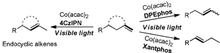
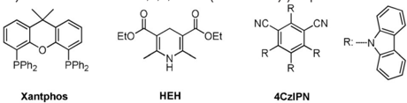
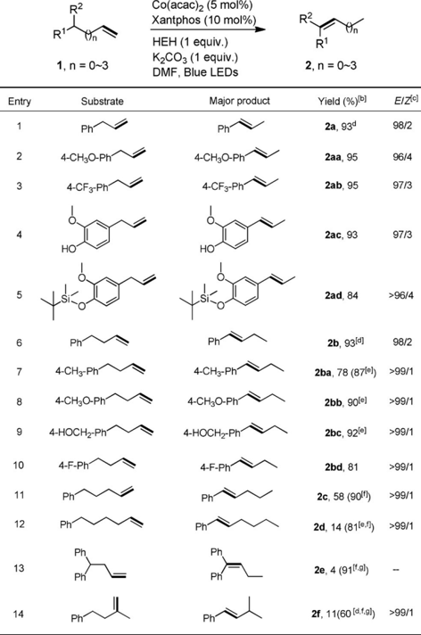
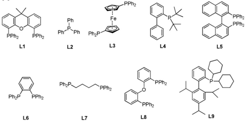
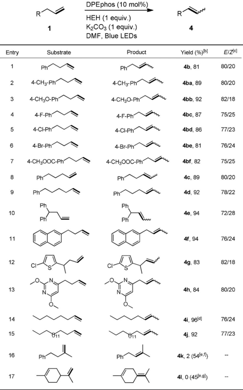
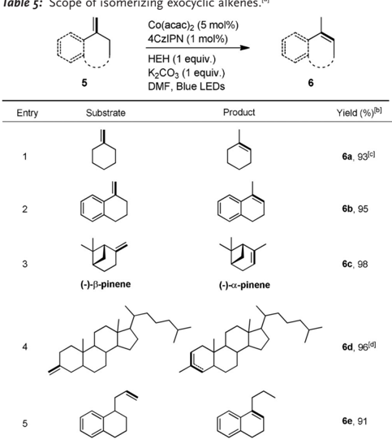
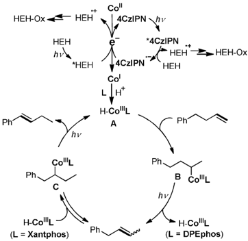

Check for updates

Previous works:

Wiley Online Library

(a) Metal complexes catalyzed isomerization of alkenes over one position

GDCh

Ru, Rh, Pd and Ir complexes

Fe, Co, Ni and Mo complexes

## Photosynthesis

RZ

Photosensitizer

## Controllable Isomerization of Alkenes by Dual Visible-Light-Cobalt Catalysis

Qing-Yuan Meng, Tobias E. Schirmer, Kousuke Katou, and Burkhard Kçnig*

This work:

(d) Controllable isomerization of alkenes by visible light catalysis

RI

Abstract: We report herein that thermodynamic and kinetic isomerization of alkenes can be accomplished by the combination of visible light with Co catalysis. Utilizing Xantphos as the ligand, the most stable isomers are obtained, while isomerizing terminal alkenes over one position can be selectively controlled by using DPEphos as the ligand. The presence of the donor-acceptor dye 4CzIPN accelerates the reaction further. Transformation of exocyclic alkenes into the corresponding endocyclic products could be efficiently realized by using 4CzIPN and Co(acac) 2 in the absence of any additional ligands. Spectroscopic and spectroelectrochemical investigations indicate Co I being involved in the generation of a Co hydride, which subsequently adds to alkenes initiating the isomerization.

I somerization of alkenes is a straightforward and atomeconomic approach to the synthesis of desired isomers, some of which are not easily accessible by conventional methods. [1] Over the past decade, tremendous efforts have been dedicated to the development of strategies based on noble metal complexes including Ru, [2] Rh, [3] Pd, [4] and Ir, [5] affording the isomerization of alkenes over one position. Comparatively, the use of non-noble metals, [6] especially Co in combination with appropriate ligands as catalysts, enables this transformation at lower cost. For example, Holland and Weix [6d] applied a b -diketiminate Co II complex to catalyze the isomerization of terminal alkenes to 2-alkenes with high Z stereochemistry and Shenvi [6e] achieved the isomerization of terminal alkenes as well as the subsequent cycloisomerization by using Co(Sal t Bu, t Bu)Cl as catalyst. Liu and Jiao [6h] reported a kinetically controlled regioselective olefin isomerization reaction catalyzed by a Co complex with a NNP-pincer

[*] Dr. Q.-Y. Meng, T. E. Schirmer, Prof. B. Kçnig

Institute of Organic Chemistry, Faculty of Chemistry and Pharmacy, University of Regensburg 93040 Regensburg (Germany) E-mail: burkhard.koenig@ur.de

## K. Katou

Institute of Transformative Bio-Molecules (WPI-ITbM) and Department of Molecular and Macromolecular Chemistry, Graduate School of Engineering, Nagoya University Nagoya 464-8601 (Japan)

Supporting information and the ORCID identification number(s) for the author(s) of this article can be found under: https://doi.org/10.1002/anie.201900849.

2019 The Authors. Published by Wiley-VCH Verlag GmbH &amp; Co. KGaA. This is an open access article under the terms of the Creative Commons Attribution-NonCommercial License, which permits use, distribution and reproduction in any medium, provided the original work is properly cited and is not used for commercial purposes.

## Communications

German Edition:

DOI: 10.1002/ange.201900849

International Edition: DOI: 10.1002/anie.201900849

Scheme 1. Isomerization of alkenes.

ligand. Recently, Schoenebeck and co-workers [6j] developed an additive-free system for the isomerization of alkenes using a [Ni( m -Cl)IPr] 2 dimer as an effective catalyst (Scheme 1a). Although significant advances have been achieved, a controllable and simple regio- and stereo-selective isomerization of alkenes is still challenging and appealing.

The renaissance of visible light photocatalysis over the last decade provides in many cases a milder approach to organic synthesis. A classic photocatalytic transformation is the E / Z isomerization of alkenes, which can be accomplished efficiently by photosensitized triplet energy transfer (Scheme 1b). [7] However, translocation of alkenes over one carbon or more by visible light photocatalysis is rarely reported. Lanterna and Scaiano disclosed the photochemical isomerization of alkenes over one carbon using Pd-decorated TiO2 as the photocatalyst, and very recently Shionoya established PdCl 2 centers on the inner surfaces of a metalmacrocycle framework (MMF) for photochemical alkene migration, but only benzyl-substituted alkenes were presented (Scheme 1c). [8] We report herein the combination of visible light catalysis with Co catalysis as a versatile protocol for the isomerization of alkenes. The activity of the generated Co hydride intermediates can be effectively controlled by ligands, thus allowing the isomerization of alkenes with high regio- and stereo-selectivity (Scheme 1d).

We commenced our study of allylbenzene isomerization by using Co(acac) 2 and Xantphos as catalyst and ligand, respectively, and 2,6-dimethyl(2H)pyridine diethyl dicarboxylate (Hantzsch ester, HEH) was chosen as the reductant. Gratifyingly, a 77% yield of E -b -methylstyrene accompanied

Table 1: Screening of ally benzene isomerization."

thylxanthene. 4CzIPN: 2,4,5,6-tetra (carbazol-9-yl) isophthalonitrile.

GDCh

Ph

1a

Co(acac)2 (5 mol%)

Xantphos (10 mol%)

EtO

HEH (1 equiv.)

K2CO3 (1 equiv.)

Solvent, Blue LEDs

PPhz

PPhz

Xantphos

Entry

CHOH

Toluene

CH,CI2

DME

THF

DMF

DMF

DMF

DMF

DMF

DMF

T0kl

17[d)

12[e]

1 3(f)

14[g]

PPhz

Xantphos

Ph

OEt

2a-E

R

Ph'

.CN

2a-Z

За

| Table 1: Screening of allylbenzene isomerization. [a]   | Table 1: Screening of allylbenzene isomerization. [a]   | Table 1: Screening of allylbenzene isomerization. [a]   | Table 1: Screening of allylbenzene isomerization. [a]   | Table 1: Screening of allylbenzene isomerization. [a]   | Table 1: Screening of allylbenzene isomerization. [a]   |
|---------------------------------------------------------|---------------------------------------------------------|---------------------------------------------------------|---------------------------------------------------------|---------------------------------------------------------|---------------------------------------------------------|
| Entry                                                   | Solvent                                                 | Conv. [%] [b]                                           | 2a - E [%] [b]                                          | 2a - Z [%] [b]                                          | 3a [%] [b]                                              |
| 1                                                       | CH 3 OH                                                 | 97                                                      | 77                                                      | 6                                                       | 5                                                       |
| 2                                                       | Toluene                                                 | 0                                                       | 0                                                       | 0                                                       | 0                                                       |
| 3                                                       | CH 2 Cl 2                                               | 0                                                       | 0                                                       | 0                                                       | 0                                                       |
| 4                                                       | DME                                                     | 26                                                      | 15                                                      | 6                                                       | 0                                                       |
| 5                                                       | THF                                                     | 0                                                       | 0                                                       | 0                                                       | 0                                                       |
| 6                                                       | DMSO                                                    | 12                                                      | 9                                                       | 1                                                       | 0                                                       |
| 7                                                       | DMF                                                     | 100                                                     | 93                                                      | 2                                                       | 0                                                       |
| 8                                                       | CH 3 CN                                                 | 0                                                       | 0                                                       | 0                                                       | 0                                                       |
| 9                                                       | 1,4-dioxane                                             | 0                                                       | 0                                                       | 0                                                       | 0                                                       |
| 10 [c]                                                  | DMF                                                     | 0                                                       | 0                                                       | 0                                                       | 0                                                       |
| 11 [d]                                                  | DMF                                                     | 0                                                       | 0                                                       | 0                                                       | 0                                                       |
| 12 [e]                                                  | DMF                                                     | 0                                                       | 0                                                       | 0                                                       | 0                                                       |
| 13 [f ]                                                 | DMF                                                     | 100                                                     | 89                                                      | 2                                                       | 5                                                       |
| 14 [g]                                                  | DMF                                                     | 46                                                      | 38                                                      | 2                                                       | 2                                                       |

Scope or isomerizing alkenes into thermodynamically stable lable 2:

isomers.a

## Communications

HEH (1 equiv.)

K2CO3 (1 equiv.)

Table 2: Scope of isomerizing alkenes into thermodynamically stable isomers. [a] Major product Yield (%) b E/Z(c]

Ph

4-CHзO-Ph

4-CF3-Ph

HO

Ph

4-CHз-Ph

4-CHзO-Ph

4-HOCH2-Ph'

[a] Unless otherwise noted, all the reactions were carried out with allylbenzene (0.2 mmol), Co(acac) 2 (0.01 mmol), Xantphos (0.02 mmol), HEH (0.2 mmol), and K 2CO3 (0.2 mmol) in the corresponding solvent (2 mL) under N 2 , irradiation with blue LEDs at 25 8 C for 16 hours. [b] Conversion (Conv.) and yield were determined by GC-FID, using 1,3,5-trimethoxybenzene as an internal standard. [c] Co(acac) 2 was not added. [d] HEH was not added. [e] The reaction was carried out in the dark. [f] Xantphos was replaced by 4CzIPN. [g] Xantphos was not added. HEH: Hantzsch ester. Xantphos: 4,5-bis(diphenylphosphino)-9,9-dimethylxanthene. 4CzIPN: 2,4,5,6-tetra(carbazol-9-yl)isophthalonitrile. 11

with small amounts of Z -b -methylstyrene and the hydrogenation product were obtained by irradiating the system with blue LEDs in CH 3 OH (Table 1, entry 1). Screening of solvents showed that the catalytic performance could be further improved in DMF, affording the desired isomer in 93% yield with high E / Z selectivity (Table 1, entries 2-9). Control experiments confirmed the essential role of the Co catalyst, the reductant HEH and irradiation (Table 1, entries 10-12). Interestingly, replacement of Xantphos with the donor-acceptor dye 2,4,5,6-tetra(carbazol-9-yl)isophthalonitrile (4CzIPN) also gave an excellent transformation (Table 1, entry 13).

Having established the optimized reaction conditions, the scope for isomerizing alkenes into thermodynamically stable isomers was examined. All the allylbenzene derivatives underwent isomerization with good functional tolerance, generating the more stable trans -isomer in high yields ranging from 84 to 95% (Table 2, entries 2-5). Increasing the length of the carbon chain by one compared to allylbenzene has virtually no impact on the yield and the stereoselectivity (Table 2, entries 6-10). However, further prolonging the carbon chain led to diminished reactivity and various isomers were obtained. We were pleased to find that isomerization of terminal alkenes proceeded efficiently when 4CzIPN was

4-F-Ph

Phi

Ph^

Phi

[a] Unless otherwise noted, all the reactions were carried out with alkenes (0.2 mmol), Co(acac) 2 (0.01 mmol), Xantphos (0.02 mmol), HEH (0.2 mmol), and K 2CO3 (0.2 mmol) in anhydrous DMF (2 mL), irradiation with blue LEDs at 25 8 C for 16 hours. [b] Yields of isolated products. [c] The ratio of E / Z was determined by 1 HNMR. [d] GC-FID yields using 1,3,5-trimethoxybenzene as an internal standard. [e] The reaction was carried out for 24 hours. [f] 4CzIPN (1 mol%) was added. [g] Xantphos was not used.

| Ph 4-CHзO-Ph        | 4-CF3-Ph 2a, 93d 2aa, 95 2ab, 95   | 98/2 96/4 97/3   |
|---------------------|------------------------------------|------------------|
|                     | 2ac, 93                            | 97/3             |
|                     | 2ad, 84                            | >96/4            |
| Phi                 | 2b, 93(d)                          | 98/2             |
| 4-СНз-Ph' 4-CHзO-Ph | 2ba, 78 (87(e)) >99/1 2bb, 90(e)   | >99/1            |
| 4-HOCH2-Ph"         | 2bc, 92(e]                         | >99/1            |
| 4-F-Ph'             | 2bd, 81                            | >99/1            |
| Phi                 | 2c, 58 (90(f)                      | >99/1            |
| Ph                  | 2d, 14 (8110.f)                    | >99/1            |
|                     | 2e, 4 (911f.9))                    |                  |
| Phi                 | 2f, 11(60 [d.f.,g))                | >99/1            |

added, giving rise to the desired products in good yields (Table 2, entries 11 and 12). Presence of a second phenyl group at the benzylic position decreased the yield sharply for the Co Xantphos system, which may be caused by an increased steric hindrance. Using 4CzIPN instead of Xantphos resulted in an excellent transformation (Table 2, entry 13). Particularly, the branched alkene can be also converted into the conjugated product by isomerizing it over two positions (Table 2, entry 14).

Wenext turned our interest to control the isomerization of alkenes over one position. 4-Ph-1-butene ( 1b ) was selected as the substrate and a variety of phosphine ligands were screened. To our delight, isomerization over one carbon can be controlled by employing triphenylphosphine (PPh 3 ) or 1,4bis-(diphenylphosphino)butane (dppb) as the ligand, albeit the yield and stereoselectivity are low (Table 3, entries 2 and

NC

+

R

Ri

Ph

RI

15213773, 2019, 17, Downloaded from https://onlinelibray.wiley.com/doi/10.1002/anie.201900849 by National Institute of Technology, Tiruchirapli, Wiley Online Libray on [15/08/2026]. See the Terms and Conditions (https://onlinelibray.wiley.com/terms-and-conditions) on Wiley Online Libray for rules of use; OA articles are governed by the aplicable Creative Comons License

lable 3: Screen of ligand tor the isomerization of 4-phenyl-I-butene.

lable 3:

Screen of ligand for the isomerization of 4-phenyl-I-butene."

GDCh

Ph

Ph

1b

1b

Entry

2

4

5

6

7

9

10(d]

11 (e)

PPha

Ph-

Co(acac)2 (5 mol%)

Co(acaс)2 (5 mol%)

Ligand (10 mol%)

Ligand (10 mol%)

HEH (1 equiv.)

HEH (1 equiv.)

K2СОз (1 equiv.)

Ph

Ph

2b-E

Ph

Ph

Ph

+

+

Ph

2b-E

2b-Z

2b-Z

+ ph

K2CO3 (1 equiv.)

Table 3: Screen of ligand for the isomerization of 4-phenyl-1-butene. [a]

Ligand

L1

L2

L3

L4

L5

L6

L7

L8

L9

L8

L8

+ ph

| Entry   | Ligand   |   Conv. [%] | 2b [%] [b] ( E / Z ) [c]   | 4b [%] [b] ( E / Z ) [c]   |
|---------|----------|-------------|----------------------------|----------------------------|
| 1       | L1       |         100 | 93 (98/2)                  | 4                          |
| 2       | L2       |          57 | 18 (98/2)                  | 36 (78/22)                 |
| 3       | L3       |           0 | 0                          | 0                          |
| 4       | L4       |           2 | 0                          | 0                          |
| 5       | L5       |          10 | 2                          | 4                          |
| 6       | L6       |           4 | 0                          | 0                          |
| 7       | L7       |          90 | 47 (99/1)                  | 37 (64/36)                 |
| 8       | L8       |          98 | 5                          | 90 (80/20)                 |
| 9       | L9       |          16 | 2                          | 3                          |
| 10 [d]  | L8       |          94 | 0                          | 89 (70/30)                 |
| 11 [e]  | L8       |          81 | 0                          | 78 (59/41)                 |

[a] Unless otherwise noted, all the reactions were carried out with 4phenyl-1-butene (0.2 mmol), Co(acac) 2 (0.01 mmol), ligand (0.02 mmol), HEH (0.2 mmol), and K 2CO3 (0.2 mmol) in DMF (2 mL) under N 2 , irradiation with blue LEDs at 25 8 C for 16 hours. [b] GC-FID yield using 1,3,5-trimethoxybenzene as an internal standard. [c] The ratio of E / Z was determined by 1 HNMR. [d] 0.1 mmol HEH was used. [e] 0.04 mmol HEH was used. 14

oPhz

Table 4: Scope of isomerizing alkenes over one carbon.

Co(acac) 2 (5 mol%)

## Communications

K2COз (1 equiv.)

DMF, Blue LEDs

Table 4: Scope of isomerizing alkenes over one carbon. [a]

Ph

4-СHз-Рh'

4-CHзO-Ph

4-F-Ph

4-CI-Ph

4-Br-Ph

4-CH300C-Ph

Ph

Ph^

CI

7). Amazingly, using bis[(2-diphenylphosphino)phenyl] ether (DPEphos) avoids further isomerization to the most stable conjugated isomer in an excellent way, affording the less stable isomer 1-Ph-2-butene ( 4b ) in 90% yield with good stereoselectivity ( E / Z = 80/20) (Table 3, entry 8). Other ligands provided much lower conversions (Table 3, entries 3-6 and 9). Apparently, the amount of HEH could be decreased, but at the expense of lower stereoselectivity (Table 3, entries 10 and 11).

Having identified DPEphos as the optimal ligand, we compared the isomerization of 1b with other known catalysts to demonstrate the advantage of our catalytic system for this alkene isomerization reaction (Supporting Information, Table S1). Then we explored the generality of this regioselective isomerization and monitored the kinetic of reactions of 1b (see discussion in Figure S1 in the Supporting Information). The developed protocol was compatible with a variety of functional groups including fluoro, chloro, bromo, and ester substituents, the product of which can be handled for further functionalization (Table 4, entries 2-7). Particularly, increasing the length of the carbon chain has only a minor influence on the outcome, giving rise to the corresponding products in

[a] Unless otherwise noted, all the reactions were carried out with alkenes (0.2 mmol), Co(acac) 2 (0.01 mmol), DPEphos (0.02 mmol), HEH (0.2 mmol), and K 2CO3 (0.2 mmol) in anhydrous DMF (2 mL), irradiation with blue LEDs at 25 8 C for 16 hours. [b] Yields of isolated products. [c] The ratio of E / Z was determined by 1 HNMR. [d] The reaction was carried out for 10 hours. [e] GC-FID yields using 1,3,5trimethoxybenzene as an internal standard. [f] DPEphos was replaced by 4CzIPN (0.002 mmol) and Xantphos (0.02 mmol), irradiating for 24 hours. [g] 0.005 mmol of Co(acac) 2 was used and DPEphos was replaced by 4CzIPN (0.002 mmol), irradiating for 24 hours.

|             | Ph 4-СHз-Ph 4-СHзО-Ph 4b, 81 4ba, 89 4bb, 92   | 80/20 80/20 82/18   |
|-------------|------------------------------------------------|---------------------|
| 4-F-Ph      | 4bc, 87                                        | 75/25               |
| 4-CI-Ph     | 4bd, 86                                        | 77/23               |
| 4-Br-Ph     | 4be, 81                                        | 76/24               |
| 4-CH3OOC-Ph | 4bf, 82                                        | 75/25               |
| Ph          | 4c, 89                                         | 80/20               |
| Phi         | 4d, 92                                         | 78/22               |
|             | 4e, 94                                         | 72/28               |
|             | 4f, 94                                         | 76/24               |
|             |                                                | 82/18               |
| CI-         | 4g, 83                                         |                     |
|             | 4h, 84                                         | 80/20               |
|             | 4i, 96(d) 4j, 92                               | 76/24 77/23         |
| phi         | 4k, 2 (54le. f)                                |                     |
|             | 4I, O (45(e.g))                                |                     |

good yields and stereoselectivity (Table 4, entries 8 and 9). Using 1,1-diphenyl derivatives as the starting materials, no over-isomerization into the conjugated position was observed (Table 4, entry 10). It is important that condensed arenes and electron-rich or -deficient heterocycles are tolerated by the reaction (Table 4, entries 11-13). Our catalytic protocol is also applicable to the isomerization of 1-octene and 1octadecene, both of which proceeded in high levels (Table 4, entries 14 and 15). Interestingly, 1,1-disubstituted alkenes exhibited moderate reactivity when DPEphos was substituted by Xantphos and 4CzIPN (Table 4, entry 16). Furthermore, when the flavoring agent DL-limonene was used as the

R

L6

15213773, 2019, 17, Downloaded from https://onlinelibray.wiley.com/doi/10.1002/anie.201900849 by National Institute of Technology, Tiruchirapli, Wiley Online Libray on [15/08/2026]. See the Terms and Conditions (https://onlinelibray.wiley.com/terms-and-conditions) on Wiley Online Libray for rules of use; OA articles are governed by the aplicable Creative Comons License

Table 5: Scope of isomerızing exocyclic alkenes.*

GDCh

Co'

· HEH

HEH

nra

Co(acaс)2 (5 mol%)

4CzIPN (1 mol%)

| 4CzIPN ￾

hv

HEH (1 equiv.)

*4CzIPN

K2СОз (1 equiv.)

starting material, no conversion was achieved. Again, replacement of DPEphos with 4CzIPN was found to be beneficial for the reaction, producing terpinolene in a preparative yield (Table 4, entry 17). 6a, 93(c)

The isomerization of exocyclic alkenes was also examined. We tried Xantphos and DPEphos in combination with the Co catalyst, giving almost no conversion. Delightfully, replacing of Xantphos and DPEphos by 4CzIPN enabled this kind of transformation to proceed very well (Table 5). One important constituent of pine resin (  )-b -pinene was converted into (  )-a -pinene in a quantitative yield (Table 5, entry 3).

Table 5: Scope of isomerizing exocyclic alkenes. [a]

[a] Unless otherwise noted, all the reactions were carried out with exocyclic alkenes (0.2 mmol), Co(acac) 2 (0.01 mmol), 4CzIPN (0.002 mmol), HEH (0.2 mmol), and K 2CO3 (0.2 mmol) in anhydrous DMF (2 mL), irradiation with blue LEDs at 25 8 C for 16 hours. [b] Yields of isolated products. [c] GC-FID yields using 1,3,5-trimethoxybenzene as an internal standard. [d] The ratio was determined to be 3:1 by 1 HNMR.

Furthermore, we applied this protocol to isomerize one cholesterol derivative and the reaction also proceeded smoothly to give 96% yield of the final product with a ratio of 3:1 (Table 5, entry 4). Finally, isomerization of the remote exocyclic C  C double bond was evaluated and the endocyclic alkene was obtained in a good yield (Table 5, entry 5). We compared our method with other catalysts known for the isomerization of (  )-b -pinene. Only the Co(Sal t Bu, t Bu)Cl system showed similar reactivity, while other cases gave no or much lower yield of (  )-a -pinene. Therefore, our method provides a valuable alternative to the Co(Sal t Bu, t Bu)Cl system by using visible light catalysis, whilst being ligand-free.

We employed spectroelectrochemistry and on-line irradiation to gain further insights into the reaction pathway. To

Entry

Ph

2

Ph

H-Co''L

avoid any effects by the insoluble base K 2 CO3, it was replaced by 1,8diazabicyclo[5.4.0]undec-7-ene (DBU) which also showed good performance in the reactions (Supporting Information, Scheme S1). Spectroelectrochemistry revealed a new absorption between 450 and 600 nm with decreasing potentials, which can be attributed to one-electron-reduced Co(acac) 2 species (Supporting Information, Figure S2a). [9] Introduction of DPEphos or Xantphos as ligand into the system enhanced the intensity of this absorption, indicating that Co I can coordinate to DPEphos or Xantphos, whereas Co II showed no interaction as no change of absorption was observed when Co(acac) 2 and DPEphos or Co(acac) 2 and Xantphos were mixed (Supporting Information, Figure S2b and S2c, Figure S3a and S3b). On-line irradiation experiments in the absence or presence of 4CzIPN showed a characteristic absorption in the same region by using HEH and DBU as the reductant and base, respectively. The observation supports the conclusion that Co I is involved in the catalytic system (Supporting Information, Figure S2d and S3c, Figure S3d and S3e). Radical inhibiting experiments excluded the possibility of carbon-centered radical species in our reaction (Supporting Information, Scheme S2). [10] Furthermore, Results from mercury poisoning experiments indicate the homogeneous nature of the reaction (Supporting Information, Scheme S3). [11]

Based on the above results, a plausible reaction pathway is proposed, shown in Scheme 2. Upon irradiation with visible light, photoexcited *4CzIPN accepts one electron from HEH to afford 4CzIPN ·  , which can reduce Co II to Co I . [12] At high concentrations HEH shows absorption in the visible light region. We can therefore not exclude a direct reduction of Co II to Co I by photoexcited HEH. [13] The so formed Co I coordinates to a phosphine ligand yielding the intermediate H  Co III L A after proton reduction. [9] Addition of A into a C  C double bond proceeds in Markovnikov orientation, giving rise to the alkyl Co III intermediate B . Considering that the reaction needs constant irradiation (Supporting Information, Figure S4) and catalytic amounts of HEH can accomplish the reaction (Table 3, entries 10 and 11), the following b -hydride elimination could be promoted by photo irradiation, [14] leading to the product isomerized over one position. This isomerization is selective, if DPEphos was used as the ligand,

Scheme 2. Plausible reaction mechanism.

15213773, 2019, 17, Downloaded from https://onlinelibrary.wiley.com/doi/10.1002/anie.201900849 by National Institute of Technology, Tiruchirappalli, Wiley Online Library on [15/08/2026]. See the Terms and Conditions (https://onlinelibrary.wiley.com/terms-and-conditions) on Wiley Online Library for rules of use; OA articles are governed by the applicable Creative Commons License

while Xantphos promoted the subsequent addition of the Co hydride to the isomerized product (Supporting Information, Figure S1d), which may be rationalized by its larger bite angle, [15] thus giving rise to higher reactivity of H  Co III L for the generation of the alkyl Co III intermediate C . Finally, b -hydride elimination proceeds smoothly again under irradiation, providing the stable conjugated product and regenerating A to finish the catalytic cycle.

In conclusion, we have developed a mild approach to isomerize terminal alkenes. The method tolerates many functional groups and combines visible light catalysis and Co catalysis. Regioselectivity and stereoselectivity of the isomerization can be controlled by using Xantphos or DPEphos as ligand. Using 4CzIPN additionally as photosensitizer accelerates both reactions. Exocyclic alkenes were converted into endocyclic products in high efficiencies in the presence of the photo- and the Co catalyst, but without the use of any ligand. We believe this visible light-mediated translocation of alkenes provides a useful approach for the synthesis of alkene isomers for subsequent functionalization.

## Acknowledgements

Financial support from the German Science Foundation (DFG) (GRK 1626, Chemical Photocatalysis and KO 1537/ 18-1) is acknowledged. This project has received funding from the European Research Council (ERC) under the European Unions Horizon 2020 research and innovation programme (grant agreement No. 741623). We thank Dr. Rudolf Vasold (University of Regensburg) for his assistance in GC-MS measurements, Regina Hoheisel (University of Regensburg) for her assistance in spectroelectrochemical absorption measurements.

## Conflict of interest

The authors declare no conflict of interest.

Keywords: alkene isomerization · cobalt · photosynthesis · visible light catalysis

How to cite: Angew. Chem. Int. Ed. 2019 , 58 , 5723-5728 Angew. Chem. 2019 , 131 , 5779-5784

- [1] a) T. J. Donohoe, T. J. C. ORiordan, C. P . Rosa, Angew. Chem. Int. Ed. 2009 , 48 , 1014-1017; Angew. Chem. 2009 , 121 , 10321035; b) E. Larionov, H. Li, C. Mazet, Chem. Commun. 2014 , 50 , 9816-9826; c) A. Vasseur, J. Bruffaerts, I. Marek, Nat. Chem. 2016 , 8 , 209 - 219.
- [2] a) M. Arisawa, Y. Terada, M. Nakagawa, A. Nishida, Angew. Chem. Int. Ed. 2002 , 41 , 4732-4734; Angew. Chem. 2002 , 114 , 4926-4928; b) S. Hanessian, S. Giroux, A. Larsson, Org. Lett. 2006 , 8 , 5481-5484; c) D. B. Grotjahn, C. R. Larsen, J. L. Gustafson, R. Nair, A. Sharma, J. Am. Chem. Soc. 2007 , 129 , 9592-9593; d) C. R. Larsen, D. B. Grotjahn, J. Am. Chem. Soc. 2012 , 134 , 10357-10360; e) C. R. Larsen, G. Erdogan, D. B. Grotjahn, J. Am. Chem. Soc. 2014 , 136 , 1226-1229; f) S. Perdriau, M.-C. Chang, E. Otten, H. J. Heeres, J. G. de Vries,
3. Chem. Eur. J. 2014 , 20 , 15434-15442; g) B. M. Trost, J. J. Cregg, N. Quach, J. Am. Chem. Soc. 2017 , 139 , 5133-5139.
- [3] L.-G. Zhuo, Z.-K. Yao, Z.-X. Yu, Org. Lett. 2013 , 15 , 4634 - 4637.
- [4] a) H. J. Lim, C. R. Smith, T. V. RajanBabu, J. Org. Chem. 2009 , 74 , 4565-4572; b) D. Gauthier, A. T. Lindhardt, E. P . K. Olsen, J. Overgaard, T. Skrydstrup, J. Am. Chem. Soc. 2010 , 132 , 79988009; c) P . Mamone, M. F. Grünberg, A. Fromm, B. A. Khan, L. J. Gooßen, Org. Lett. 2012 , 14 , 3716-3719; d) L. Lin, C. Romano, C. Mazet, J. Am. Chem. Soc. 2016 , 138 , 10344-10350.
- [5] a) A. R. Chianese, S. E. Shaner, J. A. Tendler, D. M. Pudalov, D. Y. Shopov, D. Kim, S. L. Rogers, A. Mo, Organometallics 2012 , 31 , 7359-7367; b) H. Li, C. Mazet, Org. Lett. 2013 , 15 , 6170-6173; c) Y. Wang, C. Qin, X. Jia, X. Leng, Z. Huang, Angew. Chem. Int. Ed. 2017 , 56 , 1614-1618; Angew. Chem. 2017 , 129 , 1636-1640.
- [6] a) T. Kobayashi, H. Yorimitsu, K. Oshima, Chem. Asian J. 2009 , 4 , 1078-1083; b) M. Mayer, A. Welther, A. Jacobi von Wangelin, ChemCatChem 2011 , 3 , 1567-1571; c) R. Jennerjahn, R. Jackstell, I. Piras, R. Franke, H. Jiao, M. Bauer, M. Beller, ChemSusChem 2012 , 5 , 734-739; d) C. Chen, T. R. Dugan, W. W. Brennessel, D. J. Weix, P. L. Holland, J. Am. Chem. Soc. 2014 , 136 , 945-955; e) S. W. M. Crossley, F. BarabØ, R. A. Shenvi, J. Am. Chem. Soc. 2014 , 136 , 16788-16791; f) A. Schmidt, A. R. Nçdling, G. Hilt, Angew. Chem. Int. Ed. 2015 , 54 , 801-804; Angew. Chem. 2015 , 127 , 814-818; g) R. CastroRodrigo, S. Chakraborty, L. Munjanja, W. W. Brennessel, W. D. Jones, Organometallics 2016 , 35 , 3124-3131; h) X. Liu, W. Zhang, Y. Wang, Z.-X. Zhang, L. Jiao, Q. Liu, J. Am. Chem. Soc. 2018 , 140 , 6873-6882; i) S. A. Green, S. W. M. Crossley, J. L. M. Matos, S. Vµsquez-CØspedes, S. L. Shevick, R. A. Shenvi, Acc. Chem. Res. 2018 , 51 , 2628-2640; j) A. Kapat, T. Sperger, S. Guven, F. Schoenebeck, Science 2019 , 363 , 391-396.
- [7] a) K. Singh, S. J. Staig, J. D. Weaver, J. Am. Chem. Soc. 2014 , 136 , 5275-5278; b) D. C. Fabry, M. A. Ronge, M. Rueping, Chem. Eur. J. 2015 , 21 , 5350-5354; c) J. B. Metternich, R. Gilmour, J. Am. Chem. Soc. 2015 , 137 , 11254 - 11257; d) J. B. Metternich, R. Gilmour, J. Am. Chem. Soc. 2016 , 138 , 1040-1045; e) C. M. Pearson, T. N. Snaddon, ACS Cent. Sci. 2017 , 3 , 922-924; f) J. J. Molloy, J. B. Metternich, C. G. Daniliuc, A. J. B. Watson, R. Gilmour, Angew. Chem. Int. Ed. 2018 , 57 , 3168-3172; Angew. Chem. 2018 , 130 , 3222-3226.
- [8] a) A. Elhage, A. E. Lanterna, J. C. Scaiano, ACS Catal. 2017 , 7 , 250-255; b) H. Yonezawa, S. Tashiro, T. Shiraogawa, M. Ehara, R. Shimada, T. Ozawa, M. Shionoya, J. Am. Chem. Soc. 2018 , 140 , 16610-16614.
- [9] a) T. Lazarides, T. McCormick, P. Du, G. Luo, B. Lindley, R. Eisenberg, J. Am. Chem. Soc. 2009 , 131 , 9192-9194; b) J.-J. Zhong, Q.-Y. Meng, B. Liu, X.-B. Li, X.-W. Gao, T. Lei, C.-J. Wu, Z.-J. Li, C.-H. Tung, L.-Z. Wu, Org. Lett. 2014 , 16 , 1988-1991.
- [10] Carbon-centered radical was proposed, see a) G. Li, A. Han, M. E. Pulling, D. P . Estes, J. R. Norton, J. Am. Chem. Soc. 2012 , 134 , 14662-14665; b) K. Iwasaki, K. K. Wan, A. Oppedisano, S. W. M. Crossley, R. A. Shenvi, J. Am. Chem. Soc. 2014 , 136 , 1300-1303; c) C. Obradors, R. M. Martinez, R. A. Shenvi, J. Am. Chem. Soc. 2016 , 138 , 4962-4971.
- [11] a) P . Foley, R. DiCosimo, G. M. Whitesides, J. Am. Chem. Soc. 1980 , 102 , 6713-6725; b) G. M. Whitesides, M. Hackett, R. L. Brainard, J. P . P . M. Lavalleye, A. F. Sowinski, A. N. Izumi, S. S. Moore, D. W. Brown, E. M. Staudt, Organometallics 1985 , 4 , 1819-1830.
- [12] a) K. E. Ruhl, T. Rovis, J. Am. Chem. Soc. 2016 , 138 , 1552715530; b) S. M. Thullen, T. Rovis, J. Am. Chem. Soc. 2017 , 139 , 15504-15508; c) B. D. Ravetz, K. E. Ruhl, T. Rovis, ACS Catal. 2018 , 8 , 5323-5327.
- [13] a) S. Fukuzumi, K. Hironaka, T. Tanaka, J. Am. Chem. Soc. 1983 , 105 , 4722-4727; b) J. Jung, J. Kim, G. Park, Y. You, E. J. Cho, Adv. Synth. Catal. 2016 , 358 , 74-80; c) M. A. Emmanuel, N. R.

15213773, 2019, 17, Downloaded from https://onlinelibrary.wiley.com/doi/10.1002/anie.201900849 by National Institute of Technology, Tiruchirappalli, Wiley Online Library on [15/08/2026]. See the Terms and Conditions (https://onlinelibrary.wiley.com/terms-and-conditions) on Wiley Online Library for rules of use; OA articles are governed by the applicable Creative Commons License

## Communications

Greenberg, D. G. Oblinsky, T. K. Hyster, Nature 2016 , 540 , 414; d) L. I. Panferova, A. V. Tsymbal, V. V. Levin, M. I. Struchkova, A. D. Dilman, Org. Lett. 2016 , 18 , 996 - 999; e) W. Chen, H. Tao, W. Huang, G. Wang, S. Li, X. Cheng, G. Li, Chem. Eur. J. 2016 , 22 , 9546-9550; f) L. Buzzetti, A. Prieto, S. R. Roy, P. Melchiorre, Angew. Chem. Int. Ed. 2017 , 56 , 15039-15043; Angew. Chem. 2017 , 129 , 15235-15239.

[14] X. Sun, J. Chen, T. Ritter, Nat. Chem. 2018 , 10 , 1229-1233.

[15] a) P . Dierkes, P. W. N. M. van Leeuwen, J. Chem. Soc. Dalton Trans. 1999 , 1519 - 1530; b) P . C. J. Kamer, P . W. N. M. van Leeuwen, J. N. H. Reek, Acc. Chem. Res. 2001 , 34 , 895-904.

Manuscript received: January 24, 2019

Revised manuscript received: March 5, 2019 Accepted manuscript online: March 5, 2019 Version of record online: March 26, 2019

15213773, 2019, 17, Downloaded from https://onlinelibrary.wiley.com/doi/10.1002/anie.201900849 by National Institute of Technology, Tiruchirappalli, Wiley Online Library on [15/08/2026]. See the Terms and Conditions (https://onlinelibrary.wiley.com/terms-and-conditions) on Wiley Online Library for rules of use; OA articles are governed by the applicable Creative Commons License