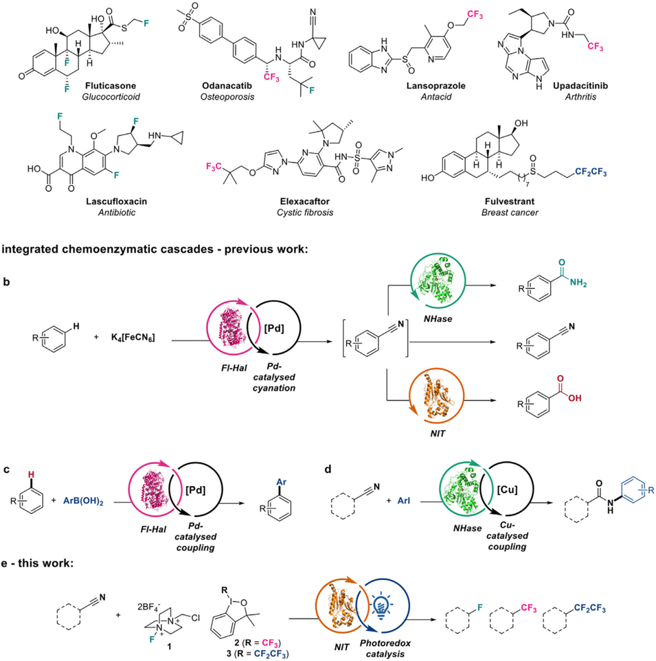
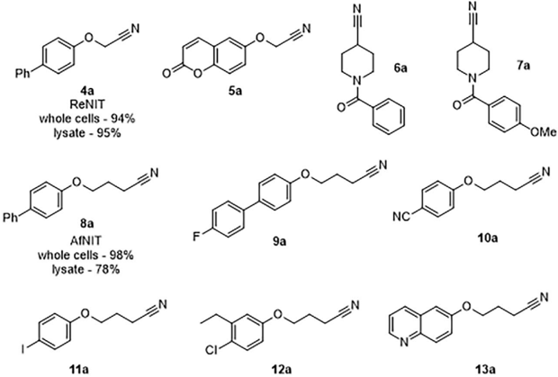
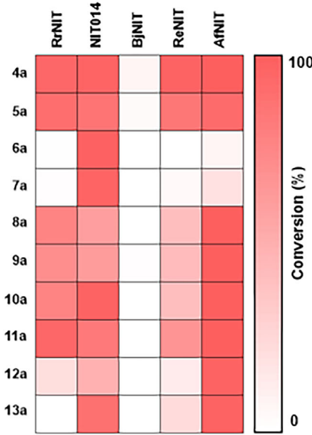
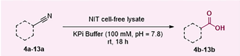
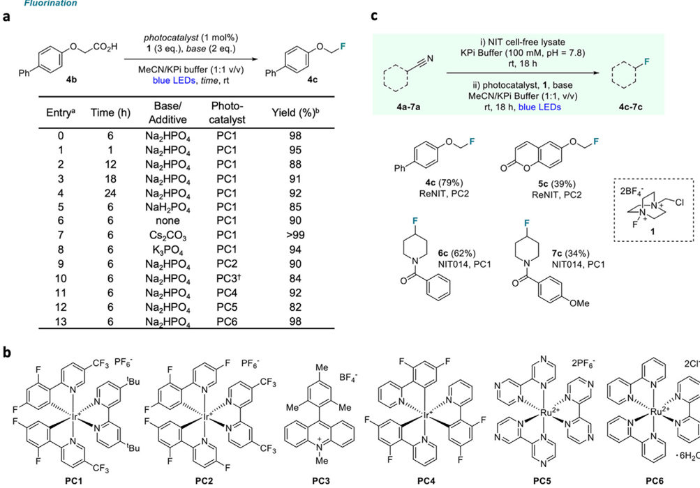
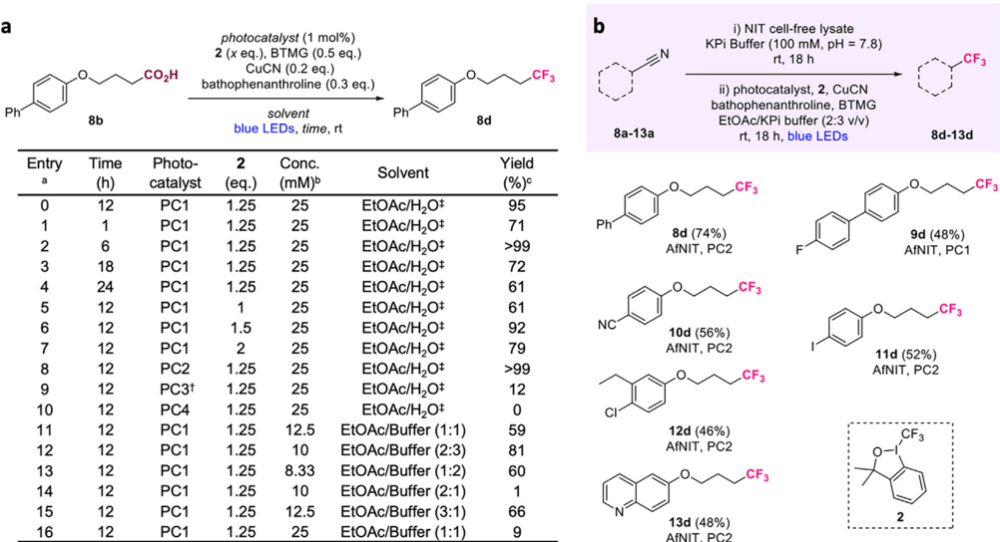
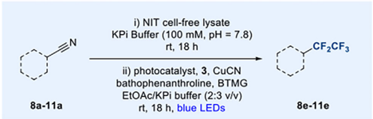
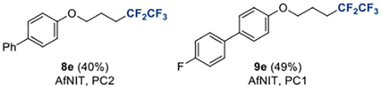
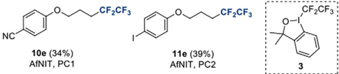

[www.chemcatchem.org](www.chemcatchem.org)

## IntegratingEnzymeswithPhotoredoxCatalysisforConversion ofNitriles into Fluorinated Products

Stuart Angiolini, [a] Isabelle Bruton, [a, b] Luis Bering, [a] Stanley Sowerby Thomas, [a] Joseph Thompson, [a, b] Sarah A. Shepherd, [a] and Jason Micklefield* [a, b]

Fluorinated molecules are widely used as pharmaceuticals, agrochemicals, and as various functional materials. Traditional synthetic methods for introducing fluorine substituents into organic molecules involve deleterious chemicals and lack selectivity. Enzymes have evolved in nature which can halogenate a diverse range of substrates with high selectivity under aqueous conditions, using benign inorganic halides as the halogen source. Although there are many halogenase enzymes that can chlorinate or brominate diverse substrates, only one fluorinase enzyme has been discovered to date that produces a single flu-

## 1. Introduction

Fluorine substituents can dramatically affect the physicochemical and biological properties of organic molecules. [1] The unusual, and sometimes unique properties, of organofluorine compounds have been exploited to develop many pharmaceuticals, agrochemicals, and other useful materials. Recent reports indicate that around 20% of approved drugs, including some of the best-selling pharmaceuticals, are organofluorine compounds (Figure 1a). [1-5] Given that fluorinated molecules are rare in nature, [6-8] organofluorine compounds are almost exclusively produced by chemical synthesis. Current fluorination methods are, however, largely reliant on harsh reaction conditions. New and improved methods to produce organofluorine compounds are therefore urgently required, with the provision of more sustainable fluorination methods widely recognized as a key goal for greener industry. [9,10]

[a] Dr. S. Angiolini, I. Bruton, Dr. L. Bering, Dr. S. S. Thomas, Dr. J. Thompson, Dr. S. A. Shepherd, Prof. J. Micklefield

Department of Chemistry and Manchester Institute of Biotechnology, The University of Manchester, Manchester M1 7DN, UK

E-mail: j.micklefield@imperial.ac.uk jason.micklefield@manchester.ac.uk

[b] I. Bruton, Dr. J. Thompson, Prof. J. Micklefield Department of Chemistry, Molecular Sciences Research Hub, Imperial College, London W12 0BZ, UK

Stuart Angiolini and Isabelle Bruton contributed equally to this work.

Supporting information for this article is available on the WWW under https://doi.org/10.1002/cctc.202500240

© 2025 The Author(s). ChemCatChem published by Wiley-VCH GmbH. This is an open access article under the terms of the Creative Commons Attribution License, which permits use, distribution and reproduction in any medium, provided the original work is properly cited.

orinated adenosine derivative in nature. Herein, we complement the lack of biocatalytic fluorination protocols and address the need for cleaner and more selective fluorination methods by merging chemo and biocatalysis to selectively fluorinate compounds in a single integrated reaction. Our approach relies on combining nitrilase enzymes with photoredox catalysis to transform cheap and abundant organonitrile compounds into highly sought-after fluorinated, trifluoromethylated, and perfluoroalkylated compounds.

Conventional methods for fluorination, using DAST or Selectfluor, and trifluoromethylation using Togni's or related reagents, do provide reliable routes to fluorinated compounds. [11-16] However, these standard methods [11-16] often require the presence of reactive molecular handles that necessitate prefunctionalization of substrates or protecting group manipulations, which are step and atom inefficient. Common fluorination chemistry requires the use of harmful organic solvents, and presents major safety concerns due to the toxic, corrosive and in some cases unstable (explosive) nature of the processes involved. More recent advances in transition metal catalysis and photoredox catalysis has led to milder, more efficient, and flexible fluorination strategies, [17-21] however, these newer improved chemocatalytic methods still require reactive functionalities or directing groups to be present. The lack of selectivity provided by chemical fluorination methods also presents a barrier to late-stage functionalization, which is particularly important for drug development where the regioselective fluorination of a lead scaffold would be highly desirable for diversification. [22-25]

Many halogenase enzymes exist in nature that can introduce chlorine or bromine substituents into organic molecules with high selectivity, under mild aqueous conditions, using benign inorganic halides. [26,27] However, only one fluorinase enzyme has been found in nature to date. [28,29] The high oxidation potential of fluoride prevents common halogenases being used for fluorination. [26] Furthermore, there are no known enzymes which can incorporate trifluoromethyl or perfluoroalkyl substituents into a substrate.

In this paper, we aimed to address the limitations of current chemical and biological fluorination methods by the merging of these two regimes in one pot, to develop new integrated catalytic systems for producing organofluoro compounds. In recent years, there has been increasing interest in combining enzymes with chemocatalysis in a single process, to telescope more sustainable synthetic routes to target molecules. [30-35] Such

a - Fluorine-containing pharmaceuticals

HO

S

·I

Fluticasone

-F

HO.

integrated chemoenzymatic cascades - previous work:

b

R.

+ ArB(OH)2

e - this work:

ČF3

Figure 1. (a) Aliphatic fluorine and fluoroalkyl-containing pharmaceuticals. (b) Halogenase and Suzuki-Miyaura cross coupling from Latham et al., [40] (c) halogenase and cyanation from Craven et al., [41] and (d) nitrile hydratase and Ullmann copper catalyzed coupling for amide synthesis by Bering et al. [39] (e) An integrated approach for fluorination of nitriles described in the current study.

integrated catalysis can enable highly selective transformations in benign aqueous media, overcoming unfavorable equilibria, minimizing loss of unstable intermediates, as well as obviating the need to isolate and purify intermediates. For example, there are notable reports where integrated catalysis has been developed to deliver powerful redox transformations. [36-38] In our lab, we have also demonstrated the major benefits of merging enzymes with chemocatalysis for amide bond synthesis, C ─ H arylation, alkenylation and cyanation, along with other late-stage C ─ H functionalizations (Figure 1b-d). [39-41] In this present study, we described how nitrilase (NIT) enzymes can be integrated with photoredox catalysis for the fluorination and fluoroalkylation of easily accessible nitrile containing substrates (Figure 1e).

## 2. Results and Discussion

## 2.1. NIT Enzyme Screening

Carboxylic acids are attractive starting materials for many syntheses as they are widely available, typically bench-stable, and

Odanacatib

HN

Lansoprazole

CF3

HN

CF3

Upadacitinib

Nitrilase Screening

Ph

4a

ReNIT

whole cells - 94%

lysate - 95%

whole cells - 98%

lysate - 78%

5a

100

Figure 2. Screening of nitrile substrates 4a-13a against a panel of nitrilases, including a comparison of cell-free lysate against whole cells ( 4a and 8a ). Conversion determined by HPLC peak area relative to starting material.

often crystalline solids. [42] However, due to their reactivity as Brønsted acids, they often require protection during a multistep synthesis. Esterification is commonly used to protect carboxylic acids, although this can be problematic for more complex or sterically hindered substrates and, in addition, esters can be susceptible to hydrolysis or attack by other nucleophilic species. [43] To address this, we sought to establish cascade reactions, coalescing enzymatic, and photoredox catalysis, to produce fluorinated products from nitrile starting materials in one pot. Nitriles provide an attractive alternative starting point to carboxylic acids, as they are also widely available and are generally unreactive unless exposed to specific forcing conditions, thus allowing for orthogonality in a longer synthetic route. We envisaged hydrolyzing nitriles under mild conditions using robust nitrilase (NIT) enzymes, liberating carboxylic acid intermediates that would be potentially good substrates for in situ decarboxylative fluorination or trifluoromethylation using photoredox catalysis. [44,45] To this end, we selected four NITs from bacterial species that were previously shown to possess potentially useful catalytic activity: Rhodococcus rhodochrous J1 (RrNIT), Rhodococcus erythropolis AJ270 (ReNIT), Acidovorax facilis (AfNIT), and Bradyrhizobium japonicum (BjNIT). [41,46,47] The selected bacterial NITs were overproduced in E. coli as described previously. [41] To avoid the use of purified enzymes, which are costly to produce, we tested these enzymes as cell-free lysates and as whole-cell biocatalysts with various aliphatic nitrile substrates (Figure 2). A fifth NIT (NIT014) from Prozomix was also tested as a cell- free lysate. In an analytical scale assay with lysates, nitriles 4a and 5a showed very high conversion ( &gt; 93%) with RrNIT, NIT014, or ReNIT, and near quantitative conversions with AfNIT (Supporting Figures S1-S10, and Tables S1 &amp; S2). For substrates with longer alkylnitrile substituents ( 8a -13a ), AfNIT was most successful, providing excellent, reliable conversion to acid products (98%-100%). NIT014 gave excellent conversion of piperidine substrates 6a and 7a (97%-99%), whereas BjNIT failed to accept almost all the selected nitrile substrates. A comparison of wholecells and cell-free lysate was carried out with nitriles 4a (ReNIT) and 8a (AfNIT), with little difference observed in yield for nitrile 4a , and a small reduction in yield for nitrile 8a in the cell-free lysate reaction. However, due to their improved ease of handling, cell-free lysates were taken forward for use in the integrated reactions. In summary, utilization of nitrile hydrolyzing enzymes as cell-free lysates proved to be an efficient strategy for the direct conversion of different nitriles to the desired carboxylic acid intermediates.

## 2.2. Integrated Fluorination Reactions

Next, we investigated the optimal conditions for the decarboxylative fluorination reactions of carboxylic acids derived from NIT (Figure 3a), using various photocatalysts and Selectfluor ( 1 ). We aimed to carry out initial NIT-catalyzed hydrolysis of nitriles in aqueous buffer, with subsequent addition of MeCN before

Ph

4а-13a rt, 18 h

4b-13b

5a

KPi Buffer (100 mM, pH = 7.8)

BiNIT

ReNIT

ANIT

a

b

Fluorination

Ph*

4b

Entrya photocatalyst (1 mol%)

1 (3 eq.), base (2 eq.)

MeCN/KPi buffer (1:1 v/v)

blue LEDs, time, rt

Ph

4c

| 24 6    | Na_HPO4 NaH,PO,   | PC1 PC1   | 92 85   |     |
|---------|-------------------|-----------|---------|-----|
| 6       | none              | PC1       | 90      |     |
| 6       | Cs,CO3            | PC1       | >99     |     |
| 6       | K3PO4             | PC1       | 94      |     |
| 6       | NazHPO4           | PC2       | 90      |     |
| 6       | Na,HPO,           | PC3t      | 84      |     |
| 6       | NazHPO4           | PC4       | 92      |     |
| 6       | Na,HPO4           | PC5       | 82      |     |
| 6       | Na,HPO4           | PC6       | 98      |     |
| CF3 PF6 | F                 | F PF6     |         |     |
| 'Bu     |                   |           | CF3     | BF4 |
|         |                   | N         | Me®     | Me  |

Figure 3. (a) Optimization of decarboxylative fluorination conditions. a Reactions performed with 0.1 mmol of acid 4b, 2 mL MeCN, and 2 mL 100 mM KPi buffer at pH = 7.8. b Yield determined by 19F NMR using fluorobenzene as internal standard. † 3 mol% catalyst used. (b) Structures of the photocatalysts used in this study. (c) Integrated fluorination reaction, carried out at a 0.1 mmol scale with 50 mg cell-free lysate.

the photochemical step. Previously a 1:1 mixture of MeCN and H2O was used for decarboxylative photochemical fluorination, [44] and so we envisaged that a MeCN/buffer mixture would also be compatible with this type of fluorination protocol. We proceeded to use carboxylic acid 4b as a model substrate to optimize the reaction conditions (Figure 3a). [44] We found that 6 h of irradiation gave the highest yield (entry 0 in Figure 3a), and that extending the reaction time resulted in a slight reduction in product conversion (entries 2-4). Adding Cs2CO3 as a base had a positive effect on yields of the fluorinated product 4c (entry 7), but use of alternative bases was detrimental (entries 5 and 8). As the buffer required for the NIT-mediated hydrolysis is at pH = 7.8, and deprotonation of the carboxylic acid is a key mechanistic step, we tested this reaction without any additional base and found that the reaction could still proceed in high but slightly reduced yield (entry 6). This contrasts with the control experiment carried out previously, [44] which showed that using a MeCN/H2O mixture with no added base results in a 0% product yield. Next, we explored the use of alternative photoredox catalysts (Figure 3b) and, although several produced high yields, none improved upon the Ir(III) photocatalyst PC1 (Figure 3a, entries 9-13).

With optimized conditions in hand for both the enzymatic nitrile hydrolysis and decarboxylative fluorination steps, we began to explore the integration of the NIT with photoredox catalysis in a single reaction (Figure 3c). To initiate chemoenzymatic cascades, the nitrile substrate was stirred in KPi buffer with the appropriate NIT for 18 h. The photoredox catalyst, reagents and solvent required for the subsequent decarboxylative step were then added directly to the reaction vial without any further manipulations, before irradiation (blue light). This contrasts strongly with other one-pot chemoenzymatic processes which rely on membranes or other complicated segregation techniques. [36,37,40,41] It was, however, apparent upon telescoping the reaction that the inclusion of cell-free lysate resulted in significant turbidity, which may introduce significant amounts of light scattering during the photochemical step. To address this issue, an extended irradiation time of 18 h was adopted for integrated fluorination reactions, which enabled the transformation of the nitrile substrates 4c and 5c into the fluoromethyl phenol derivatives 4c and 5c in 64% and 39% isolated yield, respectively. For the integrated reaction of these phenolic substrates, we observed that use of an alternative base (NaH2PO4) and photoredox catalyst ( PC2 ), together with ReNIT, gave us the best possible yields, and that use of Cs2CO3 gave us poor results. The

F

-CO\_H

~F

i) NIT cell-free lysate rt, 18 h

KPi Buffer (100 mM, pH = 7.8)

ii) photocatalyst, 1, base

Trifluoromethylation

a

Ph

## 8b

photocatalyst (1 mol%)

CuCN (0.2 eq.)

2 (x eq.), BTMG (0.5 eq.)

bathophenanthroline (0.3 eq.)

solvent

Ph

KPi Buffer (100 mM, pH = 7.8)

i) NIT cell-free lysate rt, 18 h

ii) photocatalyst, 2, CuCN

EtOAc/KPi buffer (2:3 v/v)

bathophenanthroline, BTMG

8d

Figure 4. (a) Optimization of decarboxylative trifluoromethylation conditions a Reaction performed with 0.1 mmol of acid 8b. b Concentration of acid 8b. c Yield determined by 19 F NMR using fluorobenzene as internal standard. † 3 mol% catalyst used. ‡ 30 eq. of H2O. Buffer refers to 100 mM potassium phosphate (KPi) buffer at pH = 7.8, solvent ratios refer to v/v measurements. (b) Integrated trifluoromethylation reaction, carried out at a 0.1 mmol scale with 50 mg cell-free lysate.

|   24 12 | PC1 PC1   |   1.25 1 |   25 25 | EtOAc/H,0‡ EtOAc/H_0‡ 61 61   |    |
|---------|-----------|----------|---------|-------------------------------|----|
|      12 | PC1       |      1.5 |      25 | EtOAc/H20+ 92                 | NC |
|      12 | PC1       |        2 |      25 | EtOAc/H,OF 79                 |    |
|      12 | PC2       |     1.25 |      25 | EtOAc/H,O+ >99                |    |
|      12 | PC3+      |     1.25 |      25 | EtOAc/H_O‡ 12                 |    |
|      12 | PC4       |     1.25 |      25 | EtOAc/H,0‡                    |    |
|      12 | PC1       |     1.25 |    12.5 | EtOAc/Buffer (1:1) 59         |    |
|      12 | PC1       |     1.25 |      10 | EtOAc/Buffer (2:3) 81         |    |
|      12 | PC1       |     1.25 |    8.33 | EtOAc/Buffer (1:2) 60         |    |
|      12 | PC1       |     1.25 |      10 | EtOAc/Buffer (2:1) 1          |    |
|      12 | PC1       |     1.25 |    12.5 | EtOAc/Buffer (3:1) 66         |    |
|      12 | P C1      |     1.25 |      25 | EtOAc/Buffer (1:1) 9          |    |

improved yield seen on switching photocatalyst is likely due to the differences in reduction potentials between PC1 and PC2 . The more strongly electron-withdrawing ligands present on PC2 point to this being a more oxidizing catalyst than PC1 and we speculate that, for certain substrates, this may accelerate single electron transfer (SET) from the carboxylate and assist in the formation of carboxyl radicals. Next, we explored the fluorination of piperidine nitrile substrates 6a and 7a . Here, we found that utilizing NIT014 in the chemoenzymatic cascade along with Na2HPO4 produced fluoromethyl piperidines 6c and 7c in 62% and 34% isolated yield, respectively.

## 2.3. Integrated Fluoroalkylation Reactions

Having established the chemoenzymatic fluorination methodology, we set out to establish enzyme-compatible conditions for the trifluoromethylation of a model carboxylic acid substrate 8b using photoredox catalysis and Togni's reagent ( 2, Figure 4a). As the reported conditions for trifluoromethylation of carboxylic acids use only a very small amount of water, [45] we first adapted the procedure to work with a far larger volume of aqueous buffer, which would be required for biocatalysis. We determined that, with a larger volume of buffer, 6 h of irradiation delivered the highest conversion ( &gt; 99%, entry 2 in Figure 4a) with a drop-off occurring at longer reaction times (entries 0, 3, and 4). Altering the loading of Togni's reagent ( 2 ) delivered a decrease in yield (entries 5-7) but switching photocatalyst to

PC2 gave an increase (entry 8). Here, we propose that the more oxidizing PC2 increases yields by facilitating SET from the initial, proposed Cu(II)-bound carboxylate intermediate. [45] We then moved on to investigate the effect of different solvent mixtures on the reaction (entries 11-16). As enzymes typically do not perform well in highly concentrated solutions, this necessitated a significant increase in the volume of aqueous media present for the one-pot chemoenzymatic reaction to proceed (compared with 30 molar equivalents of H2O used previously). We speculated that the larger volume of buffer may have resulted in unintended hydrolysis of the Togni's reagent and a drastic decrease in yield by depletion of the CF3 source but, to our satisfaction, this proved not to be the case. The reaction tolerated the addition of buffer well, with the optimal ratio of solvents determined to be 2:3 organic/aqueous (entry 12).

Next, we combined the NIT with the trifluoromethylation conditions to develop a set of conditions for integrated reactions. We applied a similar protocol as for the integrated fluorination, first carrying out the enzymatic hydrolysis of nitriles 8a -13a in aqueous buffer before subsequent addition of the chemical reagents and solvent directly to the reaction vessel without further manipulation before irradiation. Again, we utilized an extended 18 h irradiation time to overcome the light scattering caused by the turbid reaction mixture. Additionally, we noted that 1.5 equivalents of Togni's reagent ( 2 ) did give a slight increase in product yields when used in the integrated reaction, which could indicate that there is partial

Entry

a

11

12

13

14

15

1

6

.CF3

CF3

Pentafluoroethylation

8a-11a

Ph i) NIT cell-free lysate

KPi Buffer (100 mM, pH = 7.8)

rt, 18 h ii) photocatalyst, 3, CuCN

## bathophenanthroline, BTMG

EtOAc/KPi buffer (2:3 v/v)

10e (34%)

AFNIT, PC1

AFNIT, PC2

Figure 5. Substrate scope for the integrated pentafluoroethylation reaction, carried out at a 0.1 mmol scale with 50 mg cell-free lysate.

depletion of the Togni's reagent under the aqueous conditions. Using this general method, we were able to convert nitriles 8a -13a to the trifluoromethyl derivatives 8d-13d in 46%-74% isolated yield (Figure 4b). Notably the dinitrile 10a was transformed to 10d in 56% yield, exploiting the regioselectivity of the NIT for aliphatic nitriles and leaving the aromatic nitrile substituent intact for subsequent transformations. Iodophenol and chlorophenol derivatives ( 11d and 12d ) were also isolated, with their halogen substituents presenting useful functional handles for further derivatization. In addition, we were able to adapt this integrated method to produce pentafluoroethyl compounds, by switching from Togni's reagent ( 2 ) to the hypervalent iodine compound 3 . This allowed us to produce phenol derivatives 8e-11e in yields of 18%-48% (Figure 5). As far as we are aware, the use of this hypervalent iodine reagent to carry out photoredox-catalyzed decarboxylative functionalization has not been reported previously.

We attempted to expand the substrate scope of both our integrated fluorination and fluoroalkylation reactions with a wider range of nitrile substrates (beyond those shown in Figure 2), but this proved to be challenging for several reasons. Upon the workup of the reactions, we noted that complex mixtures of products were often formed which were difficult to resolve and analyze in the case of substrates with low UV absorbance. These factors meant that purifying products from reactions using flash chromatography was difficult. In several attempted integrated reactions, we observed that NITs were able to achieve complete or near-complete conversion of many nitriles tested (beyond those listed in Figure 2) to the corresponding carboxylic acid intermediate, however after carrying out the photochemical step, little or no fluorinated product could be observed. We speculated that the turbid reaction mixture produced after the enzymatic step may be responsible for inhibiting the photoredox catalysis, and so we explored the use

NC

\_CF\_CF3

of centrifugation to clarify the reaction solution before carrying out the photochemistry. However, this did not provide a positive effect on reaction yields. We theorize that the negative effect on yield may have arisen due to soluble endogenous compounds present in the E. coli derived cell-free lysate. These compounds may present alternative carboxylic acid substrates for decarboxylative functionalization - this could explain the complex product mixtures we observed after the integrated reactions were completed. Alternatively, these compounds may provide other reaction pathways which result in unwanted quenching of the excited photocatalyst or radical intermediates in the reaction. We also observed that structural changes in carboxylic acid intermediates can significantly affect the outcome of the subsequent photochemical fluorination or fluoroalkylation.

## 3. Conclusion

In summary, we have developed a chemoenzymatic cascade which can transform organic nitriles into fluorinated, trifluoromethylated, and pentafluoroethylated products. We identified and produced several bacterial NITs which were able to transform target nitriles into carboxylic acids as cell-free lysates. The selected NITs were then successfully integrated with various photoredox catalysts to facilitate the in situ decarboxylative fluorination of the carboxylic acid intermediates. Although our chemobio-catalytic cascades represent a novel platform for mild and selective fluorination of abundant nitrile substrates, in a onepot reaction, the scope is limited largely by the capabilities of the chemocatalysts deployed. We observe that the NIT enzymes can process many desirable nitrile substrates, with a preference for aromatic substrates, in line with earlier studies. [46] The NIT substrate panel described here (Figure 2) is only representative of substrates that proved successful in combination with photoredox catalysis. Examples of substrates that were hydrolyzed by NITs, but were not compatible with integrated reaction conditions are also provided in the supporting information (Figure S11). Further engineering of NIT enzymes could also afford a larger pool of useful precursors. In contrast, the scope of the photoredox catalysts currently available is narrower, with small changes in substrate structures often leading to diminished efficiency for decarboxylative fluorination. In light of this, we envisage that the discovery of more robust and efficient photoredox catalysts for the fluorination and fluoroalkylation of carboxylic acids is a key goal for future research and should enable expansion of our integrated approach to a wider range of nitrile precursors. Although there have been notable recent reports where organofluoride substrates have been successfully transformed enzymatically to useful products, [47-50] examples of enzymatic methods for direct fluorination remain rare. [51]

## Supporting Information

The authors have cited additional references within the Supporting Information.

## Author Contributions

L.B. and J.M. conceptualized the study. S.A., I.B. L.B., S.S.T, J.T. performed the experimental investigation. J.M. acquired funding. J.M. and S.S. provided project administration. J.M. and S.S. provided supervision. S.A. and J.M. wrote the paper.

## Acknowledgments

We thank the Michael Barber Center for Collaborative MS for access to MS instrumentation. This work was funded by the Engineering and Physical Sciences Research Council grant code EP/S023755/1 (J.M.), the Biotechnology and Biological Sciences Research Council grant codes BB/X002241/1 (J.M.) and BB/V008552/1 (J.M.) and the Deutsche Forschungsgemeinschaft (DFG, fellowship code BE7054/1-1;-/1-2 L.B.).

## Conflict of Interests

The authors declare no conflict of interest.

## Data Availability Statement

The data that support the findings of this study are available in the Supporting Information of this article.

Keywords: Biocatalysis · Fluorination · Integrated Catalysis · Photocatalysis · Sustainable chemistry

- [1] N. A. Meanwell, J. Med. Chem. 2018 , 61 , 5822-5880.
- [2] D. O'Hagan, J. Fluorine Chem. 2010 , 131 , 1071-1081.
- [3] C. Isanbor, D. O'Hagan, J. Fluorine Chem. 2006 , 127 , 303-319.
- [4] M. Inoue, Y. Sumii, N. Shibata, ACS Omega 2020 , 5 10633-10640.
- [5] S. Purser, P . R. Moore, S. Swallow, V. Gouverneur, Chem. Soc. Rev. 2008 , 37 , 320-330.
- [6] D. B. Harper, D. O'Hagan, Nat. Prod. Rep. 1994 , 11 , 123-133.
- [7] X.-H. Xu, G.-M. Yao, Y.-M. Li, J.-H. Lu, C.-J. Lin, X. Wang, C.-H. Kong, J. Nat. Prod. 2003 , 66 285-288.
- [8] H. Deng, D. O'Hagan, C. Schaffrath, Nat. Prod. Rep. 2004 , 21 , 773-784.
- [9] D. J. C. Constable, P . J. Dunn, J. D. Hayler, G. R. Humphrey, J. L. Leazer Jr, R. J. Linderman, K. Lorenz, J. Manley, B. A. Pearlman, A. Wells, A. Zaksh, T. Y. Zhang, Green Chem. 2007 , 9 , 411-420.
- [10] M. C. Bryan, P. J. Dunn, D. Entwistle, F. Gallou, S. G. Koenig, J. D. Hayler, M. R. Hickey, S. Hughes, M. E. Kopach, G. Moine, P . Richardson, F. Roschangar, A. Steven, F. J. Weiberth, Green Chem. 2018 , 20 , 5082-5103.
- [11] W. J. Middleton, J. Org. Chem. 1975 , 40 574-578.
- [12] G. S. Lal, G. P . Pez, R. J. Pesaresi, F. M. Prozonic, H. Cheng, J. Org. Chem. 1999 , 64 7048-7054.
- [13] P. T. Nyeffler, S. Gonzalez Durón, M. D. Burkart, S. P . Vincent, C.-H. Wong, Angew. Chem., Int. Ed. 2005 , 44 , 192-212.
- [14] P. Eisenberger, S. Gischig, A. Togni, Chem. - Eur. J. 2006 , 12 , 2579-2586.
- [15] J. Charpentier, N. Fruh, A. Togni, Chem. Rev. 2015 , 115 , 650-682.
- [16] G. K. S. Prakash, M. Mandal, J. Fluorine Chem. 2001 , 112 , 123-131.
- [17] T. Furuya, A. S. Kamlet, T. Ritter, Nat. 2011 , 473 , 470-477.
- [18] Q. Cheng, T. Ritter, Trends Chem. 2019 , 1 , 461-470.
- [19] M. G. Campbell, T. Ritter, Chem. Rev. 2015 , 115 , 612-633.
- [20] T. Liang, C. N. Neumann, T. Ritter, Angew. Chem., Int. Ed. 2013 , 52 , 82148264.
- [21] A. Lin, C. B. Huehls, J. Yang, Org. Chem. Front. 2014 , 1 , 434-438.
- [22] J. Wang, M. Sánchez-Roselló, J. L. Aceña, C. del Pozo, E. Alexander Sorochinskyt, S. Fustero, V. A. Soloshonok, H. Liu, Chem. Rev. 2014 , 114 , 2432-2506.
- [23] C. N. Neumann, T. Ritter, Angew. Chem., Int. Ed. 2015 , 54 , 3216-3221.
- [24] J. A. Wilkinson, Chem. Rev. 1992 , 92 , 505-519.
- [25] H.-P. Li, X.-H. He, C. Peng, J.-L. Li, B. Han, Nat. Prod. Rep. 2023 , 40 , 9881021.
- [26] J. Latham, E. Brandenburger, S. A. Shepherd, B. R. K. Menon, J. Micklefield, Chem. Rev. 2018 , 118 , 232.
- [27] C. Crowe, S. Molyneux, S. V. Sharma, Y. Zhang, D. S. Gkotsi, H. Connaris, R. J. M. Goss, Chem. Soc. Rev. 2021 , 50 , 9443-9481.
- [28] D. O'Hagan, C. Schaffrath, S. L. Cobb, J. T. Hamilton, C. D. Murphy, Nat. 2002 , 416 , 279.
- [29] D. O'Hagan, H. Deng, Chem. Rev. 2015 , 115 , 634-649.
- [30] X. Huang, M. Cao, H. Zhao, Curr. Opin. Chem. Biol. 2020 , 55 , 161-170.
- [31] H. Groger, F. Gallou, B. H. Lipshutz, Chem. Rev. 2023 , 123 , 5262-5296.
- [32] H. Groger, W. Hummel, Curr. Opin. Chem. Biol. 2014 , 19 , 171-179.
- [33] F. Rudroff, M. D. Mihovilovic, H. Groger, R. Snajdrova, H. Iding, U. T. Bornscheuer, Nat. Catal. 2018 , 1 , 12-22.
- [34] S. Martínez, L. Veth, B. Lainer, P . Dydio, ACS Catal. 2021 , 11 , 3891-3915.
- [35] M. Honig, P. Sondermann, N. J. Turner, E. M. Carreira, Angew. Chem., Int. Ed. 2017 , 56 , 8942-8973.
- [36] M. Cortes-Clerget, N. Akporji, J. Zhou, F. Gao, P . Guo, M. Parmentier, F. Gallou, J.-Y. Berthon, B. H. Lipshutz, Nat. Comm. 2019 , 10 , 2169.
- [37] H. Sato, W. Hummel, H. Groger, Angew. Chem., Int. Ed. 2015 , 54 , 44884492.
- [38] I. Schnapperelle, W. Hummel, H. Groger, Chem. - Eur. J. 2012 , 18 , 10731076.
- [39] L. Bering, E. J. Craven, S. A. Sowerby Thomas, S. A. Shepherd, J. Micklefield, Nat. Comm. 2022 , 13 , 380.
- [40] J. Latham, J.-M. Henry, H. H. Sharif, B. R. K. Menon, S. A. Shepherd, M. F. Greaney, J. Micklefield, Nat. Comm. 2016 , 7 , 11873.
- [41] E. J. Craven, J. Latham, S. A. Shepherd, I. Khan, A. Diaz-Rodriguez, M. F. Greaney, J. Micklefield, Nat. Catal. 2021 , 4 , 385-394.
- [42] L. Gooßen, N. Rodriguez, K. Gooßen, Angew. Chem., Int. Ed. 2008 , 47 , 3100-3120.
- [43] P. G. M. Wuts, T. W. Greene, In Greene's Protective Groups in Organic Synthesis (Eds: P. G. M. Wuts, T. W. Greene), John Wiley &amp; Sons, Hoboken, NJ 2006 .
- [44] S. Ventre, F. R. Petronijevic, D. W. C. MacMillan, J. Am. Chem. Soc. 2015 , 137 , 5654-5657.
- [45] J. A. Kautzky, T. Wang, R. W. Evans, D. W. C. MacMillan, J. Am. Chem. Soc. 2018 , 140 , 6522-6526.
- [46] D. Torri, L. Bering, L. R. L. Yates, S. M. Angiolini, G. Xu, S. CuestaHoyos, S. A. Shepherd, J. Micklefield, Angew. Chem., Int. Ed. 2025 , e202422185.
- [47] Y. Guo, Z. H. Tian, L. Zhang, Y. C. Han, B. B. Zhang, Q. Xing, T. Shao, Y. Liu, Z. Jiang, J. Am. Chem. Soc. 2024 , 146 , 31012-31020.
- [48] L. P . Zhao, B. K. Mai, L. Cheng, F. Gao, Y. Zhao, R. Guo, H. Wu, Y. Zhang, P. Liu, Y. Yang, Nat. Synth. 2024 , 3 , 967-975.
- [49] M. Li, et al. Science 2024 , 385 , 416-421.
- [50] Q. Zhao, Z. Chen, J. Soler, et al., Nat. Synth. 2024 , 3 , 958-966.
- [51] J. G. Zhang, A. J. Huls, P . M. Palacios, Y. Guo, X. Huang, J. Am. Chem. Soc. 2024 , 146 , 34878-34886.

Manuscript received: February 13, 2025 Revised manuscript received: February 19, 2025 Accepted manuscript online: February 19, 2025

Version of record online: ,

