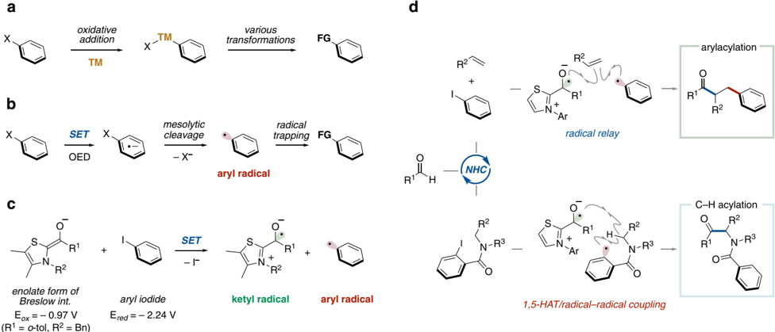
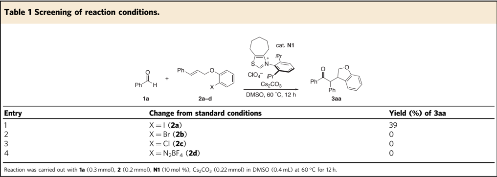
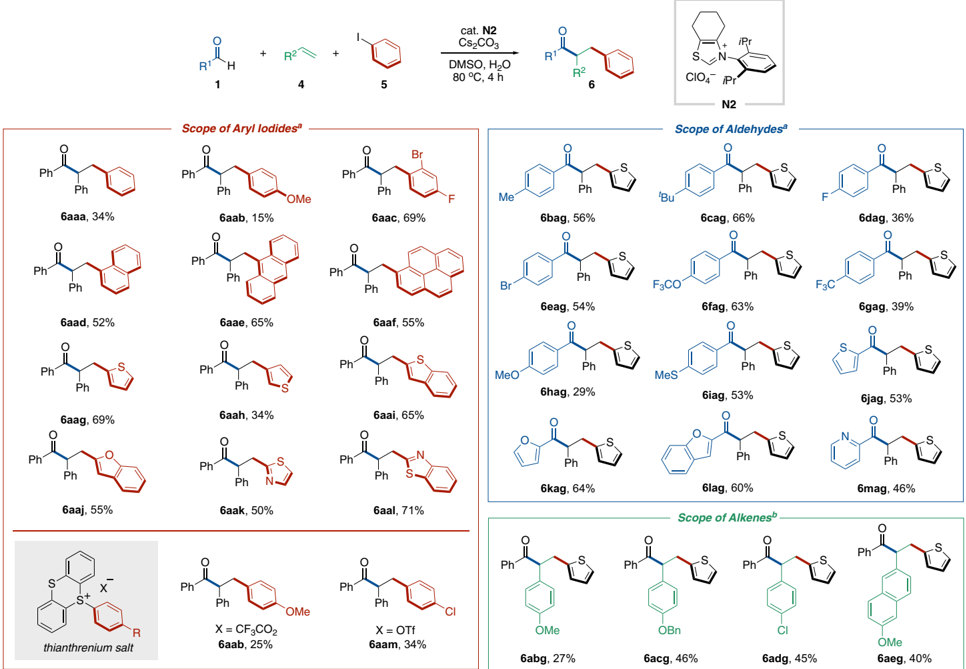
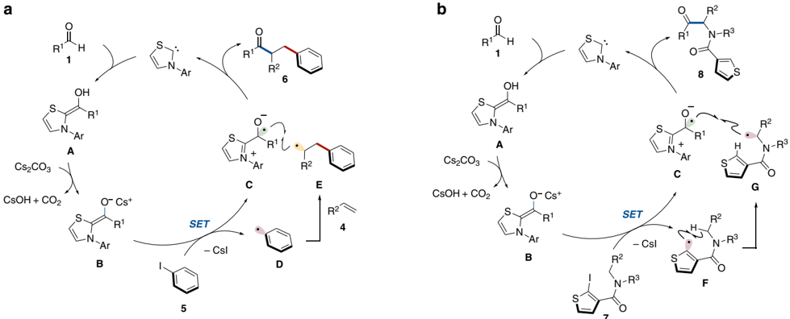
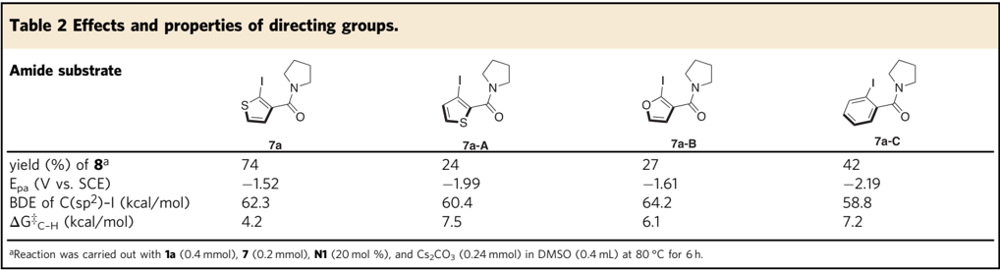
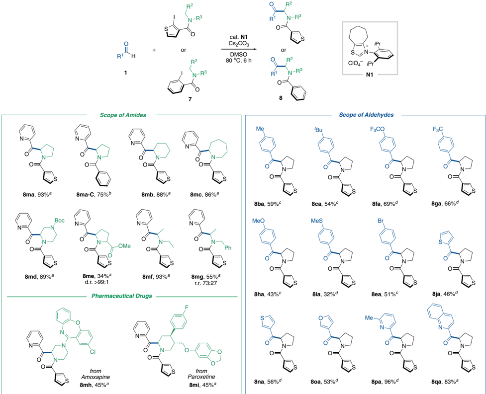

1234567890():,;

## ARTICLE

https://doi.org/10.1038/s41467-021-24144-2

OPEN

## Aryl radical-mediated N-heterocyclic carbene catalysis

Yuki Matsuki 1,3 , Nagisa Ohnishi 1,3 , Yuki Kakeno 1 , Shunsuke Takemoto 1 , Takuya Ishii 1 , Kazunori Nagao 1 ✉ &amp; Hirohisa Ohmiya 1,2 ✉

There have been significant advancements in radical reactions using organocatalysts in modern organic synthesis. Recently, NHC-catalyzed radical reactions initiated by single electron transfer processes have been actively studied. However, the reported examples have been limited to catalysis mediated by alkyl radicals. In this article, the NHC organocatalysis mediated by aryl radicals has been achieved. The enolate form of the Breslow intermediate derived from an aldehyde and thiazolium-type NHC in the presence of a base undergoes single electron transfer to an aryl iodide, providing an aryl radical. The catalytically generated aryl radical could be exploited as an arylating reagent for radical relay-type arylacylation of styrenes and as a hydrogen atom abstraction reagent for α -amino C(sp 3 ) -H acylation of secondary amides.

A ryl halides (Ar -X) have been broadly utilized as versatile reagents for chemical reactions due to their availability and bench stability. Speci fi cally, oxidative addition of the C(sp 2 ) -X bond in an aryl halide to a transition-metal complex enables the generation of an arylmetal species that induces various transformations (Fig. 1a) 1,2 . The generation of an aryl radical 3,4 through single electron reduction of an aryl halide followed by mesolytic cleavage of the C(sp 2 ) -X bond has emerged as an alternative approach for the utilization of aryl halides as chemical reagents (Fig. 1b). Due to the high reduction potential of aryl halides, metal sources such as samarium salts 5 , transitionmetal complexes 6 and metal-based visible light photoredox catalysts 7 have been mainly utilized as single electron donors. Recently, organic electron donors 8 -11 including visible light organic photoredox catalysts 12 -14 have taken the place of metals to provide simple and rapid access to aryl radicals via single electron transfer (SET). These approaches enable the generation of aryl radicals without using metal sources, but still require either a stoichiometric amount of the organic electron donor or light irradiation.

There has been signi fi cant advancement in the use of radical reactions catalyzed by N-heterocyclic carbenes (NHC) with SET from a Breslow intermediate, based on enzymatic pyruvate transformations 15 -18 . Recently, we developed NHC-catalyzed decarboxylative radical cross-coupling between aldehydes and aliphatic carboxylic acid derived-redox active esters 19,20 . The reaction involves SET from the enolate form of the Breslow intermediate derived from an aldehyde and NHC in the presence of a base to the redox active ester, followed by radical -radical coupling between the resultant Breslow intermediate-derived radical and alkyl radical. Thus, the enolate form of the Breslow intermediate can serve as a single electron donor and an acyl radical equivalent. Since this report, a series of NHC-catalyzed radical cross-coupling reactions have been developed by us and other groups 21 -33 . However, these reported examples have been limited to catalysis mediated by C(sp 3 )-centered radicals. To expand the scope of radical NHC catalysis, we questioned whether an aryl radical could be generated and utilized (Fig. 1c).

Considering the gap in redox potential between the enolate form of the Breslow intermediate ( E ox = -0.97 V vs. SCE) 34 and iodobenzene ( E red = -2.24 V vs. SCE) 35 , the corresponding electron transfer seems to be thermodynamically unfavored. However, two kinetic features, (1) a small reorganization energy of the enolate form of the Breslow intermediate 34 and (2) a fast mesolytic cleavage of the radical anion derived from aryl iodide 35 , encouraged us to pursue this research program.

Here, we report an aryl radical-mediated NHC organocatalysis method. The aryl radical that is generated catalytically through thermodynamically unfavored SET from the enolate form of the Breslow intermediate to an aryl iodide could be exploited as an arylating reagent for radical relay-type arylacylation of styrenes (Fig. 1d, top) and as a hydrogen atom abstraction reagent for α -amino C(sp 3 ) -H acylation of secondary amides (Fig. 1d, bottom). It should be noted that this protocol eliminates the requirement for metals, oxidants/reductants and light.

## Results and discussion

Development of the reaction and screening of conditions . To test the generation of an aryl radical by the radical NHC catalysis, we designed intramolecular arylacylation reactions with benzaldehyde ( 1a ) and aryl electrophiles 2a -d bearing a cinnamyl tether group that can trap the aryl radical immediately (Table 1) 36 . Based on our previous studies on the NHC-catalyzed decarboxylative radical cross-coupling between aldehydes and redox-active esters 19 , we used a thiazolium salt ( N1 ) 37 possessing a N-2,6diisopropylphenyl substituent and a seven-membered backbone structure as the NHC precursor and Cs2CO3 as the base. The reaction with aryl iodide 2a as a substrate proceeded to afford 3aa in 39% isolated yield with recovery of 2a (entry 1). The reactions with other azolium salts resulted in no product formation (data not shown). Neither bromide nor chloride leaving groups resulted in product formation (entries 2 and 3). The reaction using the corresponding aryldiazonium tetra fl uoroborate 2d did not afford the desired coupling product 3aa (entry 4). This might be due to the low reduction potential of the aryldiazonium salt

Fig. 1 Activation of aryl halides and aryl radical-mediated NHC catalysis. a Oxidative addition of aryl halide to transition metal. TM, transition metal. b Organic electron donor induced aryl radical generation (recent advance). SET, single electron transfer. OED, organic electron donor. c Generation of aryl radical through NHC catalysis (working hypothesis). d Arylacylation of alkene and C(sp 3 ) -H acylation through NHC catalysis (this work). 1,5-HAT, 1,5hydrogen atom transfer.

( E red = -0.2 V vs. SCE), which would cause a second electron transfer from the Breslow-derived radical intermediate 38 .

Radical relay-type arylacylation of styrenes . The successful example of an NHC-catalyzed reaction involving the generation of an aryl radical from aryl iodide and subsequent intramolecular radical addition to an alkene prompted us to explore intermolecular arylacylation using aryl iodides, alkenes, and aldehydes through a radical relay mechanism (see Table 1, entry 1). Though slight modi fi cations of the reaction conditions, e.g., addition of water, use of N -2,6-diisopropylphenyl-substituted six-membered ring fused thiazolium-type NHC catalyst and increase of the amount of NHC catalyst, were required, the desired intermolecular arylacylation was achieved (Supplementary Fig. 1). Speci fi cally, the reaction using aldehydes 1 , styrenes 4 and aryl iodides 5 occurred in the presence of a catalytic amount of thiazolium salt N2 as the NHC precursor and stoichiometric amounts of Cs2CO3 and water in DMSO solvent at 80 °C to afford the three-component coupling products, α , β -diarylated ketones 6 (Fig. 2). The crude materials consisted of the product 6 , unreacted substrates and trace amounts of unidenti fi ed compounds. Twocomponent coupling stemming from 1 and 5 was not observed. The NHC-catalyzed radical relay process would involve SET from the enolate form of the Breslow intermediate to aryl iodide 5 , radical addition of the resulting aryl radical to styrene 4 , and subsequent radical -radical coupling between the Breslow intermediate-derived ketyl radical and the secondary benzylic radical (Fig. 3a) 20 . The role of H2O is unclear. It might increase the solubility of Cs2CO3 and facilitate the formation of the Breslow intermediate from aldehyde by acceleration of proton transfer-involved step.

As described above, the product derived from the twocomponent coupling between the aryl radical and the Breslow intermediate-derived ketyl radical in this system was not observed. Even under the reaction conditions without alkenes, the two-component coupling product was not formed. The dominant of the radical addition to styrene might be due to the high reactivity of aryl radical. Additionally, competitive reaction processes, such as the C -H abstraction from formyl C -H bond of aldehyde and the radical addition to another arenes or an enolate form of Breslow intermediate would be much faster than the twocomponent coupling. These unproductive processes would induce the decomposition of the ketyl radical, which would explain the requirement of high catalyst loading on the reaction conditions.

With the optimal reaction conditions in hand, the scope of each reaction component was evaluated and the results are summarized in Fig. 2. Various aryl iodides served as the arylating reagent in the reaction using benzaldehyde ( 1a ) and styrene ( 4a ) (Table 2, left). The reaction with iodobenzene or p -iodoanisole resulted in the desired product formation albeit with low reaction ef fi ciency ( 6aaa and 6aab ). When an aryl substrate possessing fl uorine, bromine, and iodine substituents was subjected to the optimal reaction conditions, selective mesolytic cleavage of the C(sp 2 ) -I bond occurred to afford the multicomponent coupling product ( 6aac ). Notably, this reaction allowed the use of π -extended molecules, such as 1-iodonaphthalene, 9iodoanthracene and 1-iodopyrene ( 6aad -6aaf ). 2-Iodothiophene exhibited higher reactivity than 3-iodothiophene ( 6aag vs 6aah ). Benzothiophene and benzofuran were tolerated in this reaction ( 6aai and 6aaj ). Electron-de fi cient thiazole-derived iodoheteroarenes participated in this protocol ( 6aak and 6aal ). The heteroarene-based aryl iodides including pyridines and quinolines also worked as substrates to afford the desired products in low yields (data not shown). Recently, arylthianthrenium salts have been treated as aryl radical precursors by visible-light photoredox catalysis 39 . This NHC organocatalysis could also generate aryl radicals from the thianthrenium salts and undergo the arylacylation reaction ( 6aab and 6aam ).

A broad array of aromatic aldehydes was amenable to the reaction with 2-iodothiophene ( 5g ) and styrene ( 4a ) (Fig. 2, right). Alkyl and halogen substituents at the para position on the aromatic ring of the aldehydes did not inhibit the reaction ( 6bag -6eag ). Both electron-withdrawing and electron-donating functional groups on the aromatic aldehydes were tolerated ( 6fag -6iag ). Various heteroaromatic rings were incorporated into the acyl unit ( 6jag -6mag ). Aliphatic aldehydes did not participate in the reaction even though a thiazolilum catalyst 22 possessing an N -neopentyl group and a seven-membered backbone structure was used instead of N1 (data not shown). This might be due to the slower formation of Breslow intermediate of aliphatic aldehydes using a neopentyl-derived NHC than that of aromatic aldehydes using N1 22 . A C -H abstraction from the formyl C -H bond of aliphatic aldehyde would be also considered.

Next, the scope of alkenes was explored (Fig. 2, right). Though inferior to non-substituted styrene, p -methoxy-, ben zyloxy-, and chloro-substituted styrenes provided the corresponding ketone products in moderate yields ( 6abg -6adg ). A naphthalene-conjugated alkene was also a good substrate ( 6aeg ). On the other hand, when aliphatic alkenes were subjected to the reaction conditions, three-component coupling was not observed (data not shown).

Fig. 2 Substrate scope of radical relay-type arylacylation of styrenes. a Reaction was carried out with 1 (0.2 mmol), 4 (2 mmol), 5 (0.3 mmol), N2 (30 mol %), Cs2CO3 (0.24 mmol), and H2O (0.2 mmol) in DMSO (0.4 mL) at 80 °C for 4 h. b Reaction was carried out with 1 (0.1 mmol), 4 (1 mmol), 5 (0.15 mmol), N2 (30 mol %), Cs2CO3 (0.12 mmol), and H2O (0.1 mmol) in DMSO (0.2 mL) at 80 °C for 4 h.

Fig. 3 Possible pathways. a Catalytic cycle for arylacylation of alkene. b Catalytic cycle for C(sp 3 ) -H acylation.

C(sp 3 ) -H acylation of secondary amides . We turned our attention to exploiting the catalytically generated aryl radical as a hydrogen atom abstraction reagent 40,41 . During the survey of the scope of aryl iodides in the arylacylation of alkenes shown in

Fig. 2, 2-iodothiophene was found to have better reactivity than other aryl iodides. This result inspired us to incorporate the 2-iodothiophene moiety into the directing group that serves as the intramolecular hydrogen atom abstraction reagent for the

7

Fig. 4 Substrate scope of C(sp 3 ) -H acylation of secondary amides. a Reaction was carried out with 1 (0.4 mmol), 2 (0.2 mmol), N1 (10 mol %), and Cs2CO3 (0.22 mmol) in DMSO (0.4 mL) at 80 °C for 6 h. b Reaction was carried out with 1 (0.4 mmol), 2 (0.2 mmol), N1 (5 mol %), and Cs2CO3 (0.21 mmol) in DMSO (0.4 mL) at 80 °C for 6 h. c Reaction was carried out with 1 (0.6 mmol), 2 (0.2 mmol), N1 (20 mol %), and Cs2CO3 (0.24 mmol) in DMSO (0.4 mL) at 80 °C for 6 h. d Reaction was carried out with 1 (0.4 mmol), 2 (0.2 mmol), N1 (20 mol %), and Cs2CO3 (0.24 mmol) in DMSO (0.4 mL) at 80 °C for 6 h.

NHC-catalyzed C(sp 3 ) -H acylation using aldehydes. Speci fi cally, the reaction between 2-pyridine carboxaldehyde ( 1 m ) and secondary amide ( 7a ) having a 2-iodothiophene moiety occurred in the presence of a catalytic amount of the N -2,6-diisopropylphenyl-substituted seven-membered ring fused thiazolium salt N1 37

as the NHC precursor and Cs2CO3 in DMSO at 80 °C to afford the corresponding acylation product 8ma in 93% isolated yield (Fig. 4). In this NHC-catalyzed process, the resultant α -amino C (sp 3 )-centered radical, derived by SET from the enolate form of the Breslow intermediate to the 2-iodothiophene moiety in the

substrate and subsequent 1,5-hydrogen atom transfer, could participate in radical -radical coupling with the Breslow intermediate-derived ketyl radical (see Fig. 1d, bottom and Fig. 3b). N2 possessing a six-membered ring backbone exhibited comparable reactivity (Supplementary Fig. 2). The use of 2iodobenzene-based directing group also afforded the corresponding acylation product 8ma-C (vide infra for mechanistic considerations for C(sp 3 ) -H acylation of secondary amides). The directing group could be removed by Schwartz ' s reagent (Supplementary Fig. 9).

The scope of amides in this protocol was investigated with the use of 2-pyridine carboxaldehyde ( 1m ) as a coupling partner (Fig. 4, left). The reactions with cyclic amides derived from pyrrolidine, piperidine and azepane proceeded ef fi ciently to afford the desired α -acylated products in high yields ( 8ma -8mc ). Although a piperazine derivative was also a suitable substrate ( 8md ), a morpholine scaffold was not tolerated (data not shown). The acyl group could be incorporated into amino acids such as proline with high diastereoselectivity ( 8me ). In addition to cyclic amides, acyclic amides underwent this organocatalyzed acylation ( 8mf and 8mg ). To demonstrate the power and broad functional group tolerance of this protocol, the C(sp 3 ) -H acylation of pharmaceutical drugs was conducted. Secondary amine-based drugs such as Amoxapine and Paroxetine resulted in product formation without being disturbed by coexistent functional groups ( 8mh and 8mi ). In our previous report on the NHC-catalyzed decarboxylative alkylation 19 , α -aminoalkyl radical generated from α -amino acid-derived redox active ester can couple with a Breslow intermediate-derived radical to afford the α -aminoketone. Importantly, however, secondary amide substrates presented here would be more abundant and structurally diverse than α -amino acids. Thus, this protocol allowed to couple α -amino alkyl radicals derived from various amides such as cyclic amides, acyclic amides and pharmaceutical drugs.

Subsequently, we explored the scope of aldehydes with a pyrrolidine substrate 7a (Fig. 4, right). The reactions of p tolualdehyde or p -tertiary -butyl benzaldehyde gave the corresponding α -aminoketones in moderate yields ( 8ba and 8ca ). A variety of functional groups including tri fl uoromethoxy, trifl uoromethyl, methoxy, and thioether were tolerated well ( 8fa -8ia ). The aryl bromide group survived the reductive reaction conditions ( 8ea ). Ketones having electron-rich heteroaryl substituents such as thiophene or furan were also constructed ( 8ja , 8na , and 8oa ). Similar to 2-pyridinecarboxaldehyde, the reactions with 6-methyl-2-pyridinecarboxyaldehyde and 2quinolinecaboxaldehyde gave the corresponding products in exceptionally high yields ( 8pa and 8qa ).

Mechanistic considerations for C(sp 3 ) -H acylation of secondary amides . To understand how the 2-iodothiophene-based directing group imparted the high reactivity, we evaluated four different directing groups from two viewpoints, the ef fi ciencies of aryl radical generation and hydrogen abstraction (Table 2). Screening of directing groups such as 2-iodothiophene ( 7a ), 3iodothiophene ( 7a -A ), 2-iodofuran ( 7a -B ), and 2-iodobenzene ( 7a -C ) was conducted for the reaction of 7 with benzaldehyde ( 1a ) in the presence of N1 catalyst and Cs2CO3 in DMSO at 80 °C (Table 2, 1st line). As expected, 2-iodothiophene ( 7a ) was the most effective among those examined. Next, we examined the reduction potential of amide substrates and their C(sp 2 ) -I bond dissociation energies (BDEs). Cyclic voltammetry experiments revealed that 7a having a 2-iodothiophene moiety was the most reducible (Table 2, 2nd line and Supplementary Figs. 3 -6).

The BDE values obtained by DFT calculations indicated that these C(sp 2 ) -I bonds tended to be easily cleaved and that 7a -C would undergo more facile mesolytic cleavage of the C(sp 2 ) -I bond after single electron reduction compared with the other substrates (Table 2, 3rd line, and Supplementary Fig. 7). This provided a good explanation for the improved yield for the acylation reaction of 7a -C than 7a -A and 7a -B in spite of the higher reduction potential ( 7a -C : -2.19 V vs. 7a -A : -1.99 V and 7a -B : -1.61 V). Furthermore, DFT calculations of the activation energy of the α -amino C(sp 3 ) -H abstraction step were carried out (Table 2, 4th line and Supplementary Fig. 8). 2Iodothiophene derivative ( 7a ) showed the lowest activation energy for the C(sp 3 ) -H abstraction. Based on these results, we assumed that the 2-iodothiophene-based directing group might have an advantage in terms of the facile generation of the aryl radical by the thermodynamically less unfavored SET and the subsequent fast C(sp 3 ) -H abstraction.

To see whether or not the intermediacy of electron donoracceptor (EDA) complex facilitated the thermodynamically unfavored SET, we conducted UV/Vis absorption studies using known precursor of Breslow intermediate and iodobenzene (Supplementary Fig. 10). As a result, the signi fi cant shift of the absorption was not observed. Moreover, the reaction under light irradiation conditions to facilitate the SET process did not give the desired product at all (data not shown). These results didn ' t support the intermediacy of the EDA complex.

In summary, this achievement expanded the scope of radical NHC catalysis, enabling the generation and utilization of aryl radicals 42 . The enolate form of the Breslow intermediate derived from an aldehyde and a thiazolium-type NHC in the presence of a base undergoes SET to the aryl iodide, producing an aryl radical. Although the SET event is thermodynamically unfavored, the small reorganization energy of the enolate form of the Breslow intermediate and the fast mesolytic cleavage of the C(sp 2 ) -I bond makes the pathway kinetically feasible. The catalytically generated aryl radical could undergo addition to styrenes or intramolecular hydrogen atom abstraction to form a C(sp 3 )-centered radical, which engaged in the subsequent radical -radical coupling with the Breslow intermediatederived ketyl radical. The NHC catalysis presented here provides a strategy for an aryl radical-mediated organocatalytic reaction. Studies for expanding this strategy toward the synthesis of complex molecules are currently underway in our laboratory.

## Methods

The reaction to produce 6aag in Fig. 2 is representative . Thiazolium salt N2 (23.9 mg, 0.06 mmol) was placed in a Schlenk tube containing a magnetic stirring bar. The tube was sealed with a Te fl on ® -coated silicon rubber septum, and then evacuated and fi lled with nitrogen. Degassed DMSO (400 μ L) and H2O (3.6 μ L, 0.2 mmol) were added to the tube. Next, benzaldehyde ( 1a ) (20.3 μ L, 0.2 mmol), styrene ( 4a ) (229 μ L, 2.0 mmol) and 2-iodothiophene ( 5 g ) (38.2 μ L, 0.3 mmol) were added, followed by Cs2CO3 (78.2 mg, 0.24 mmol). After 4 h stirring at 80 °C, the reaction mixture was treated with saturated NH4Cl aqueous solution (400 μ L), then extracted with diethyl ether (four times) and dried over sodium sulfate. After fi ltration, the resulting solution was evaporated under reduced pressure. After the volatiles were removed under reduced pressure, fl ash column chromatography on silica gel (100:0 -90:10, hexane/EtOAc) gave 6aag (40.3 mg, 0.14 mmol) in 69% yield.

The reaction to produce 8ma in Fig. 4 is representative . Thiazolium salt N1 (8.3 mg, 0.02 mmol) and amide 7a (61.4 mg, 0.2 mmol) were placed in a Schlenk tube containing a magnetic stirring bar. The tube was sealed with a Te fl on ® -coated silicon rubber septum, and then evacuated and fi lled with nitrogen. Cs2CO3 (71.7 mg, 0.22 mmol), degassed DMSO (400 μ L) and 2-pyridinecarboxaldehyde ( 1m ) (42.8 mg, 0.4 mmol) were added to the vial. After 6 h stirring at 80 °C, the reaction mixture was treated with saturated NH4Cl aqueous solution (400 μ L), then extracted with diethyl ether (4 times) and dried over sodium sulfate.

After fi ltration through a short plug of aluminum oxide (1 g) with diethyl ether as an eluent, the resulting solution was evaporated under reduced pressure. After the volatiles were removed under reduced pressure, fl ash column chromatography on silica gel (100:0 -50:50, hexane/EtOAc) gave 8ma (53.0 mg, 0.19 mmol) in 93% yield.

## Data availability

The authors declare that the data supporting the fi ndings of this study are available within the paper or its Supplementary Information fi les and from the corresponding author upon reasonable request.

Received: 8 April 2021; Accepted: 2 June 2021;

## References

1. Stille, J. K. &amp; Lau, K. S. Y. Mechanisms of oxidative addition of organic halides to Group 8 transition-metal complexes. Acc. Chem. Res. 10 , 434 -442 (1977).
2. Miyaura, N. &amp; Suzuki, A. Palladium-catalyzed cross-coupling reactions of organoboron compounds. Chem. Rev. 95 , 2457 -2483 (1955).
3. Galli, C. Radical reactions of arenediazonium ions: an easy entry into the chemistry of the aryl radical. Chem. Rev. 88 , 765 -792 (1988).
4. Ghosh, I., Marzo, L., Das, A., Shaikh, R. &amp; Ko ̈ nig, B. Visible light mediated photoredox catalytic arylation reactions. Acc. Chem. Res. 49 , 1566 -1577 (2016).
5. Krief, A. &amp; Laval, A.-M. Coupling of organic halides with carbonyl compounds promoted by SmI2, the Kagan reagent. Chem. Rev. 99 , 745 -778 (1999).
6. Tsou, T. T. &amp; Kochi, J. K. Mechanism of oxidative addition. Reaction of nickel (0) complexes with aromatic halides. J. Am. Chem. Soc. 101 , 6319 -6332 (1979).
7. Nguyen, J. D., D ' Amato, E. M., Narayanam, J. M. R. &amp; Stephenson, C. R. J. Engaging unactivated alkyl, alkenyl and aryl iodides in visible-light-mediated free radical reactions. Nat. Chem. 4 , 854 -859 (2012).
8. Broggi, J., Terme, T. &amp; Vanelle, P. Organic electron donors as powerful single -electron reducing agents in organic synthesis. Angew. Chem., Int. Ed. 53 , 384 -413 (2014).
9. Smith, A. J., Poole, D. L. &amp; Murphy, J. A. The role of organic electron donors in the initiation of BHAS base-induced coupling reactions between haloarenes and arenes. Sci. China. Chem. 62 , 1425 -1438 (2019).
10. Li, M. et al. Transition-metal-free radical C(sp 3 ) -C(sp 2 ) and C(sp 3 ) -C(sp 3 ) coupling enabled by 2-Azaallyls as super-electron-donors and couplingpartners. J. Am. Chem. Soc. 139 , 16327 -16333 (2017).
11. Liu, B., Lim, C.-H. &amp; Miyake, G. M. Visible-light-promoted C -S crosscoupling via intermolecular charge transfer. J. Am. Chem. Soc. 139 , 13616 -13619 (2017).
12. Ghosh, I., Ghosh, T., Bardagi, J. I. &amp; König, B. Reduction of aryl halides by consecutive visible light-induced electron transfer processes. Science 346 , 725 -728 (2014).
13. Discekici, E. H. et al. Read de Alaniz, J. A highly reducing metal-free photoredox catalyst: design and application in radical dehalogenations. Chem. Commun. 51 , 11705 -11708 (2015).
14. Kim, H., Kim, H., Lambert, T. H. &amp; Lin, S. Reductive electrophotocatalysis: merging electricity and light to achieve extreme reduction potentials. J. Am. Chem. Soc. 142 , 2087 -2092 (2020).
15. Ishii, T., Nagao, K. &amp; Ohmiya, H. Recent advances in radical N-heterocyclic carbene catalysis. Chem. Sci. 11 , 5630 -5636 (2020).
16. Song, R. &amp; Chi, Y. R. N-heterocyclic carbene catalyzed radical coupling of aldehydes with redox-active esters. Angew. Chem., Int. Ed. 58 , 8628 -8630 (2019).
17. Ohmiya, H. N-Heterocyclic carbene-based catalysis enabling cross-coupling reactions. ACS Catal. 10 , 6862 -6869 (2020).
18. Guin, J., De Sarkar, S., Grimme, S. &amp; Studer, A. Biomimetic carbene-catalyzed oxidations of aldehydes using TEMPO. Angew. Chem., Int. Ed. 47 , 8727 -8730 (2008).
19. Ishii, T., Kakeno, Y., Nagao, K. &amp; Ohmiya, H. N-heterocyclic carbenecatalyzed decarboxylative alkylation of aldehydes. J. Am. Chem. Soc. 141 , 3854 -3858 (2019).
20. Ishii, T., Ota, K., Nagao, K. &amp; Ohmiya, H. N-Heterocyclic carbene-catalyzed radical relay enabling vicinal alkylacylation of alkenes. J. Am. Chem. Soc. 141 , 14073 -14077 (2019).
21. Ota, K., Nagao, K. &amp; Ohmiya, H. N-Heterocyclic carbene-catalyzed radical relay enabling synthesis of δ -ketocarbonyls. Org. Lett. 22 , 3922 -3925 (2020).
22. Kakeno, Y., Kusakabe, M., Nagao, K. &amp; Ohmiya, H. Direct synthesis of dialkyl ketones from aliphatic aldehydes through radical N-heterocyclic carbene catalysis. ACS Catal. 10 , 8524 -8529 (2020).
23. Li, J.-L. et al. Radical acyl fl uoroalkylation of ole fi ns through N -heterocyclic carbene organocatalysis. Angew. Chem., Int. Ed. 59 , 1863 -1870 (2020).
24. Kim, I., Im, H., Lee, H. &amp; Hong, S. N-Heterocyclic carbene-catalyzed deaminative cross-coupling of aldehydes with Katritzky pyridinium salts. Chem. Sci. 11 , 3192 -3197 (2020).
25. Dai, L., Xia, Z.-H., Gao, Y.-Y., Gao, Z.-H. &amp; Ye, S. Visible-light-driven nheterocyclic carbene catalyzed γ - and ε -alkylation with alkyl radicals. Angew. Chem., Int. Ed. 58 , 18124 -18130 (2019).
26. Mavroskou fi s, A. et al. N -Heterocyclic carbene catalyzed photoenolization/ diels -alder reaction of acid fl uorides. Angew. Chem., Int. Ed. 59 , 3190 -3194 (2020).
27. Davies, A. V., Fitzpatrick, K. P., Betori, R. C. &amp; Scheidt, K. A. Combined photoredox and carbene catalysis for the synthesis of ketones from carboxylic acids. Angew. Chem., Int. Ed. 59 , 9143 -9148 (2020).
28. Meng, Q. Y., Doben, N. &amp; Studer, A. Cooperative NHC and photoredox catalysis for the synthesis of β -tri fl uoromethylated alkyl aryl ketones. Angew. Chem., Int. Ed. 59 , 19956 -19960 (2020).
29. Liu, M.-S. &amp; Shu, W. Catalytic, metal-free amide synthesis from aldehydes and imines enabled by a dual-catalyzed umpolung strategy under redox-neutral conditions. ACS Catal. 10 , 12960 -12966 (2020).
30. Liu, K. &amp; Studer, A. Direct α -acylation of alkenes via n -heterocyclic carbene, sul fi nate, and photoredox cooperative triple catalysis. J. Am. Chem. Soc. 143 , 4903 -4909 (2021).
31. Ren, S.-C. et al. Carbene-catalyzed alkylation of carboxylic esters via direct photoexcitation of acyl azolium intermediates. ACS Catal. 11 , 2925 -2934 (2021).
32. Barik, S. &amp; Biju, A. T. N-Heterocyclic carbene (NHC) organocatalysis using aliphatic aldehydes. Chem. Commun. 56 , 15484 -15495 (2020).
33. Dai, L. &amp; Ye, S. Recent advances in N -heterocyclic carbene-catalyzed radical reactions. Chin. Chem. Lett. 32 , 660 -667 (2021).
34. Nakanishi, I., Itoh, S. &amp; Fukuzumi, S. Electron-transfer properties of active aldehydes of thiamin coenzyme models, and mechanism of formation of the reactive intermediates. Chem. Eur. J. 5 , 2810 -2818 (1999).
35. Pause, L., Robert, M. &amp; Savéant, J.-M. Can single-electron transfer break an aromatic carbon -heteroatom bond in one step? A novel example of transition between stepwise and concerted mechanisms in the reduction of aromatic iodides. J. Am. Chem. Soc. 121 , 7158 -7159 (1999).
36. Rueping, M., Leiendecker, M., Das, A., Poissona, T. &amp; Buia, L. Potassium tertbutoxide mediated Heck-type cyclization/isomerization -benzofurans from organocatalytic radical cross-coupling reactions. Chem. Commun. 47 , 10629 -10631 (2011).
37. Piel, I., Pawelczyk, M. D., Hirano, K., Fröhlich, R., Glorius, F. A Family of thiazolium salt derived N -heterocyclic carbenes (NHCs) for organocatalysis: synthesis, investigation and application in cross -benzoin condensation. Eur. J. Org. Chem . 5475 -5484 (2011).
38. LeStrat, F., Murphy, J. A. &amp; Hughes, M. Direct electroreductive preparation of indolines and indoles from diazonium salts. Org. Lett. 4 , 2735 -2738 (2002).
39. Berger, F. et al. Site-selective and versatile aromatic C -H functionalization by thianthrenation. Nature 567 , 223 -228 (2019).
40. Snieckus, V., Cuevas, J. C., Sloan, C. P., Liu, H. &amp; Curran, D. P. Intramolecular α -amidoyl to Aryl 1,5-hydrogen atom transfer reactions. Heteroannulation and α -nitrogen functionalization by radical translocation. J. Am. Chem. Soc. 112 , 896 -898 (1990).
41. Yoshikai, N., Mieczkowski, A., Matsumoto, A., Ilies, L. &amp; Nakamura, E. Ironcatalyzed C -C bond formation at α -position of aliphatic amines via C -H bond activation through 1,5-hydrogen transfer. J. Am. Chem. Soc. 132 , 5568 -5569 (2010).
42. Liu, W., et al. Mesoionic carbene-Breslow intermediates as super electron donors: application to the metal-free arylacylation of alkenes. Chem. Catal. 1 , https://doi.org/10.1016/j.checat.2021.03.004 (2021).

## Acknowledgements

This work was supported by JSPS KAKENHI Grant Number JP21H04681 to Scienti fi c Research (A), JSPS KAKENHI Grant Number JP17H06449 (Hybrid Catalysis), Kanazawa University SAKIGAKE project 2020 and JST, PRESTO Grant Number JPMJPR19T2 (to H.O.).

## Author contributions

Y.M. and N.O. contributed equally to this work. Y.M., N.O., Y.K., S.T., T.I., K.N. and H.O. designed, performed, and analyzed the experiments. K.N. and H.O. co-wrote the manuscript. All authors contributed to discussions.

## Competing interests

The authors declare no competing interests.

## Additional information

Supplementary information The online version contains supplementary material available at https://doi.org/10.1038/s41467-021-24144-2.

Correspondence and requests for materials should be addressed to K.N. or H.O.

Peer review information Nature Communications thanks Akkattu T Biju, Donghui Wei and the other, anonymous, reviewer for their contribution to the peer review of this work.

Reprints and permission information is available at http://www.nature.com/reprints

Publisher ' s note Springer Nature remains neutral with regard to jurisdictional claims in published maps and institutional af fi liations.

Open Access This article is licensed under a Creative Commons

Attribution 4.0 International License, which permits use, sharing, adaptation, distribution and reproduction in any medium or format, as long as you give appropriate credit to the original author(s) and the source, provide a link to the Creative Commons license, and indicate if changes were made. The images or other third party material in this article are included in the article ' s Creative Commons license, unless indicated otherwise in a credit line to the material. If material is not included in the article ' s Creative Commons license and your intended use is not permitted by statutory regulation or exceeds the permitted use, you will need to obtain permission directly from the copyright holder. To view a copy of this license, visit http://creativecommons.org/ licenses/by/4.0/.

© The Author(s) 2021