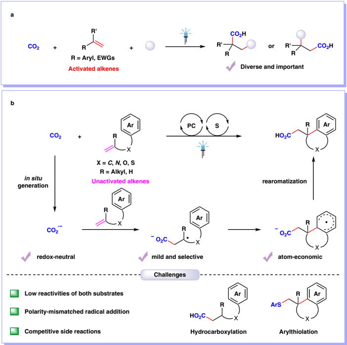
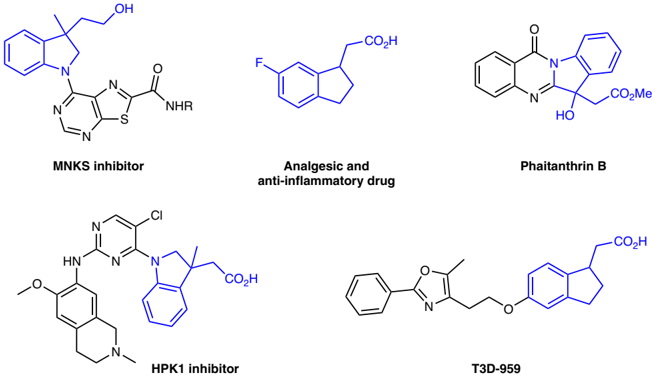
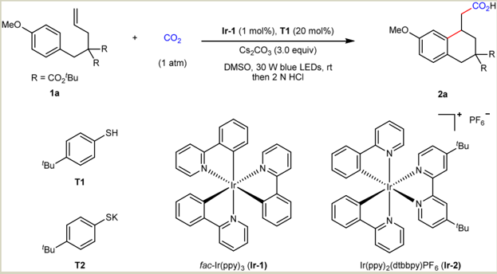
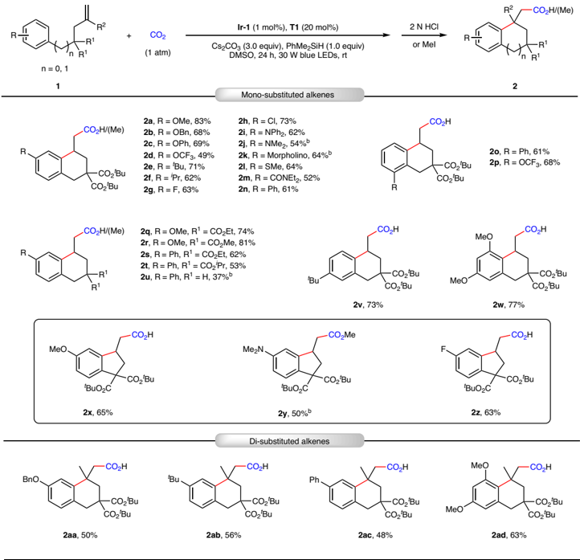
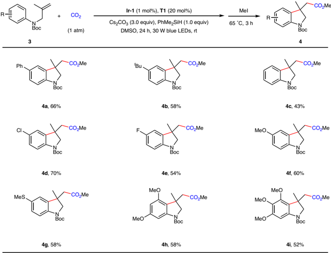
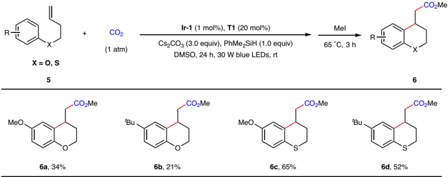
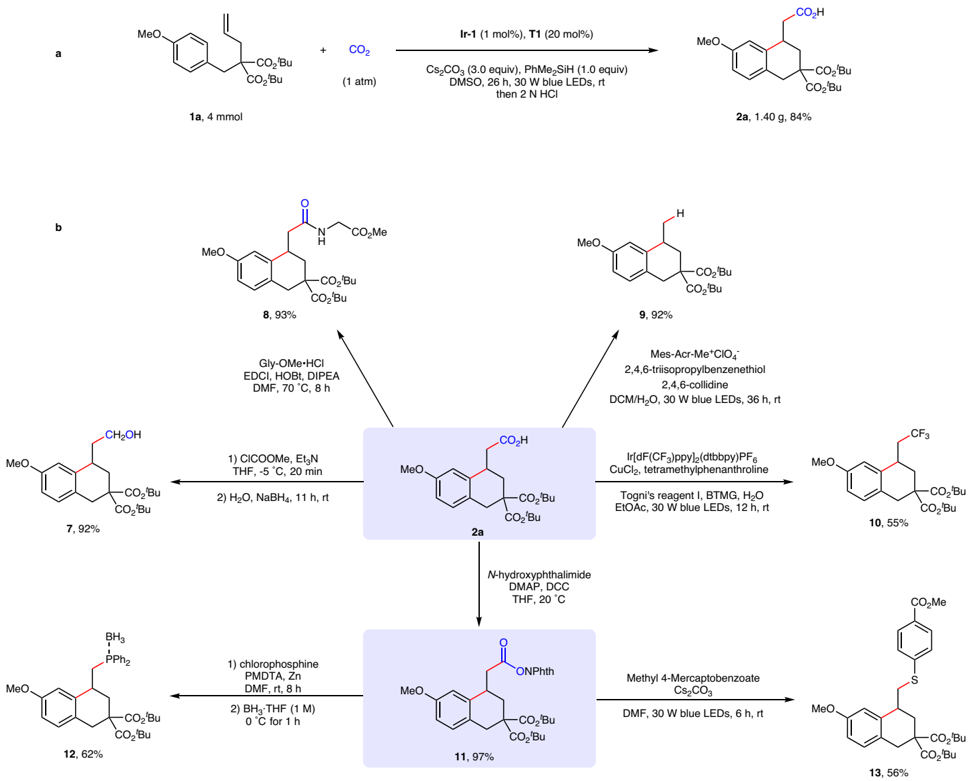
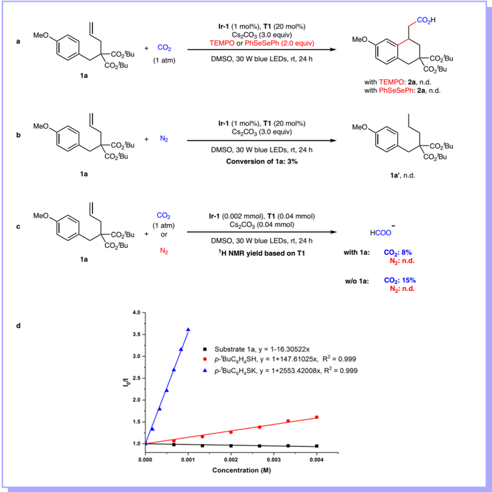
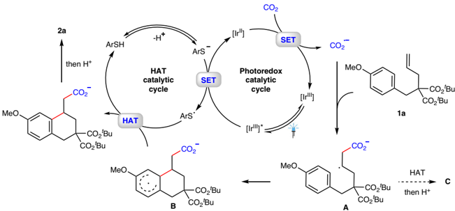

1234567890():,;

1234567890():,;

## Article

https://doi.org/10.1038/s41467-023-39240-8

## Arylcarboxylation of unactivated alkenes with CO2 via visible-light photoredox catalysis

Received: 23 January 2023

Accepted: 31 May 2023

Check for updates

Wei Zhang 1,2 , Zhen Chen 1 , Yuan-Xu Jiang 1 , Li-Li Liao 3 , Wei Wang 1 , Jian-Heng Ye 1 &amp; Da-Gang Yu 1,4

Photocatalytic carboxylation of alkenes with CO2 is a promising and sustainable strategy to synthesize high value-added carboxylic acids. However, it is challenging and rarely investigated for unactivated alkenes due to their low reactivities. Herein, we report a visible-light photoredox-catalyzed arylcarboxylation of unactivated alkenes with CO2, delivering a variety of tetrahydronaphthalen-1-ylacetic acids, indan-1-ylacetic acids, indolin-3-ylacetic acids, chroman-4-ylacetic acids and thiochroman-4-ylacetic acids in moderateto-good yields. This reaction features high chemo- and regio-selectivities, mild reaction conditions (1 atm, room temperature), broad substrate scope, good functional group compatibility, easy scalability and facile derivatization of products. Mechanistic studies indicate that in situ generation of carbon dioxide radical anion and following radical addition to unactivated alkenes might be involved in the process.

Carbon dioxide (CO2), which is inexpensive, non-toxic, and recyclable, has been regarded as an ideal one-carbon feedstock to engage in chemical transformations for the synthesis of high value-added chemicals 1 -4 . As carboxylic acids are a privileged functional group in biochemistry and polymer chemistry, it is highly important to develop direct and fl exible methods for carboxylation with CO2 5 -9 . In recent years, visible-light photocatalytic carboxylation with CO2 has attracted much attention as an ef fi cient, versatile, and sustainable strategy 10 -15 . As alkenes are common functional group in organic compounds and bulk chemicals in industry, visible-light photocatalytic carboxylation of alkenes with CO2 is of particular interest 16 -29 . Notably, visible-light photoredox-catalyzed difunctionalizing carboxylation of alkenes with CO2 has recently emerged as an important access to valuable carboxylic acids with diverse functionality and high step economy 22 -29 . Many groups, including Martin, Wu, Li, Xi, and our group, have reported visible-light photoredox-catalyzed 1,2-difunctionalizing carboxylation of alkenes with CO2 under mild conditions in high chemoand regio-selectivities (Fig. 1a) 22 -29 . However, these methods are mainly limited to activated alkenes, such as styrenes and acrylates. The photocatalytic 1,2-difunctionalizing carboxylation of unactivated alkenes with CO2 has not been disclosed yet.

As well known, unactivated alkenes are more abundant and easily available in nature and industry than activated alkenes. However, it is challenging for unactivated alkenes to undergo photocatalytic carboxylations with CO2 30 -33 , arising from high reductive potentials of both starting materials 34 -39 and sluggish radical addition onto unactivated alkenes to generate alkyl carbon radicals 40 -49 , which are less stable than those from activated alkenes. Inspired by our recent work on hydrocarboxylation of unactivated alkenes with CO2 33 , we further challenged us whether we could tune the chemoselectivity from C -H to C -Cbondsformation based on similar carbon radical intermediates (Fig. 1b). We hypothesized the in situ generation of CO2 radical anion (CO2 · -) and following radical addition to unactivated alkenes would result in unstabilized alkyl carbon radicals, which could be further trapped by arenes to generate the C -C bonds. Final rearomatization could give the desired arylcarboxylation products. If successful, it will

1 Key Laboratory of Green Chemistry &amp; Technology of Ministry of Education, College of Chemistry, Sichuan University, Chengdu 610064, China. 2 West China School of Public Health and West China Fourth Hospital, Sichuan University, Chengdu 610041, China. 3 School of Chemistry and Chemical Engineering,

Chongqing University, Chongqing 400030, P. R. China. 4 State Key Laboratory of Elemento-Organic Chemistry, Nankai University, Tianjin 300071, P. R. China.

e-mail: jhye@scu.edu.cn; dgyu@scu.edu.cn

Fig. 1 | Visible-light photocatalytic 1,2-difunctionalizing carboxylation of alkenes with CO2. a Visible-light photocatalytic 1,2-difunctionalizing carboxylation of activated alkenes with CO2. b Visible-light photocatalytic arylcarboxylation of unactivated alkenes with CO2. PC photocatalyst, EWGs electron-withdrawing groups.

Fig. 2 | Selected biologically active carboxylic acids and derivatives bearing polycyclic structures. Examples of biologically active compounds possessing polycyclic acids and derivatives motifs.

realize 1,2-difunctionalizing carboxylation of unactivated alkenes with CO2. Moreover, as it is redox-neutral and atom-economic based on the C -H functionalization, it will also provide a practical and sustainable strategy to access a wide range of polycyclic carboxylic acids, which are highly important but not easy to obtain via other methods (Fig. 2). Nevertheless, many challenges remain. For example, it is challenging for conversion of CO2 into CO2 · -due to the high reduction potential of CO2 [E1/2 (CO2/CO2 · -) = -2.21 V vs SCE] 50 . Moreover, the addition of

MeO

T1

T2

CO2H

·R

R

2a

7* PFò

fac-Ir(ppy)з (Ir-1)

| Entry   | Variations                    | Yield (%) b   |
|---------|-------------------------------|---------------|
| 1       | none                          | 66 (62)       |
| 2       | w/o Ir-1                      | n.d.          |
| 3       | w/o T1                        | n.d.          |
| 4       | w/o Cs 2 CO 3                 | n.d.          |
| 5       | w/o light                     | n.d.          |
| 6       | N 2 instead of CO 2           | n.d.          |
| 7       | T2 instead of T1              | 62            |
| 8       | PhMe 2 SiH as an additive     | 86 (83)       |
| 9 c     | Ir-2 instead of Ir-1          | 60            |
| 10 c    | 4CzIPN instead of Ir-1        | n.d.          |
| 11 c    | DMF instead of DMSO           | 55            |
| 12 c    | t BuSH instead of T1          | 74            |
| 13 c    | K 2 CO 3 instead of Cs 2 CO 3 | 68            |
| 14 c    | PMHS instead of PhMe 2 SiH    | 82            |

n.d. not detected, DMSO dimethyl sulfoxide, DMFN,N -dimethylformamide, ppy 2-phenylpyridine, dtbbpy 4,4 ' -ditert -butyl-2,2 ' -bipyridine, 4CzIPN 2,4,5,6-tetra(carbazol-9-yl)isophthalonitrile, PMHS poly(methylhydrosiloxane).

a Reaction conditions: 1a (0.2 mmol, 1.0 equiv), Ir -1 (1 mol%), T1 (20 mol%), Cs2CO3 (3.0 equiv.), DMSO (2 mL), irradiation by 30 W blue LEDs at room temperature (rt) under CO2

b Yield determined by 1 H NMR using 1,3,5-trimethoxybenzene as an internal standard. Isolated yields in parentheses.

c PhMe2SiH (1.0 equiv.) was used.

nucleophilic CO2 · -to electron-rich unactivated alkenes is a polaritymismatched process 51 . In addition, hydrocarboxylation, arylthiolation, and other competitive side reactions would also hamper the desired difunctionalizing carboxylation.

Herein, we report our success in realizing the visible-light photoredox-catalyzed arylcarboxylation of unactivated alkenes with CO2 (Fig. 1b). A variety of tetrahydronaphthalen-1-ylacetic acids, indan-1ylacetic acids, indolin-3-ylacetic acids, chroman-4-ylacetic acids and thiochroman-4-ylacetic acids are generated in high selectivities and moderate-to-good yields.

## Results

## Screening of reaction conditions

As carboxylic acids with polycyclic structures are widely found in natural products, drugs and bioactive compounds (Fig. 2) 52 -56 , we initiated our project with 1a as standard substrate to generate tetrahydronaphthalen-1-ylacetic acid 2a as the desired product (Table 1). In the presence of fac -Ir(ppy)3 ( Ir-1 ) as photocatalyst, 4tert -butylthiophenol ( T1 ) as hydrogen atom transfer (HAT) catalyst and Cs2CO3 as base (Please see the Supplementary Tables 1 -5 in Supplementary Information (SI) for more details), the desired

(1 atm) for 24 h.

R

Ir-1 (1 mol%), T1 (20 mol%)

Cs\_CO3 (3.0 equiv)

Table. 1 | Optimization of reaction conditions a

1a

'Bu

'Bu

.SH

SK

+

CO2

MeO.

arylcarboxylation product 2a was obtained in 66% yield with high selectivity (Entry 1). Control experiments revealed that photocatalyst, thiol catalyst, Cs2CO3, visible light, and CO2 all played essential roles in the reaction (Entries 2 -6). The use of p -t BuC6H4SK ( T2 ) instead of p -t BuC6H4SH ( T1 ) provided 2a in comparable yield (Entry 7). To our delight, PhMe2SiHturned to bea good additive thatenhanced the yield of 2a to 86%, probably owing to the promotion of the CO2 · -generation in the reaction (Entry 8) 57 . A variety of reaction conditions with other photocatalysts, solvents, HAT catalysts, bases, and silanes were also tested to give lower conversions and yields (Entries 9 -14).

## Substrate scope

Having established the optimized reaction conditions, we investigated the substrate scope (Fig. 3). A wide variety of electron-donating groups (EDGs) and EWGs were tolerant at the para -positions of the arene moiety, providing the desired products 2a -2n in moderate-to-good yields. Substrates containing various functional groups, such as trifl uoromethoxyl group ( 2d ), fl uoro ( 2g ), amines ( 2i -2k ), thioether ( 2l ) and amide ( 2m ), were smoothly converted to the corresponding products, thus allowing for downstream transformations. The ef fi ciency of this protocol was not hampered by the ortho substituents on

Fig. 3 | Arylcarboxylation of unactivated alkenes with CO2 to construct tetrahydronaphthalen-1-ylacetic acid and indan-1-ylacetic acid derivatives. a Standard reaction conditions (Table 1, Entry 8) with yields of isolated carboxylic acids or methyl esters. b Esteri fi cation by MeI (0.4 mmol, 2.0 equiv.), 65 °C, 3 h.

the phenyl ring, giving the corresponding arylcarboxylation products 2o -2p in moderate-to-good yields. Substrates with different substituents on the aliphatic chain were also suitable for such a transformation, furnishing products 2q -2t in 53 -81% yields. When no ester group was present in the substrate, the carboxylative cyclization product 2u could also be obtained. To our delight, substrate 1v with tert -butyl group at the meta -position of the phenyl ring was tested in this reaction to give product 2v in 73% yield and sole regioselectivity owing to the steric hindrance effect. The substrate 1w bearing di-methoxyl groups also underwent the reaction smoothly to afford the arylcarboxylation product 2w in 77% yield. We were delighted to fi nd that 5-exo cyclization process could also occur under such conditions, giving the indan-1-ylacetic acids 2x -2z in moderate-to-good yields. We next turned our attention to 1,1-disubstituted unactivated alkenes as CO2 coupling partners, which have rarely been used for photocatalytic cyclization reactions 58 . To our delight, this system also accomplished the 6-exo cyclizations to furnish carbocycles 2aa -2ad containing the quaternary carbon centers in 48 -63% yields.

As indoline derivatives are privileged structural motifs found in alkaloids 59 and clinical drugs 60 , seeking an ef fi cient and simple approach for the construction of indolines is of continuous interest. Encouraged by the above results, we further turned our attention to selective carboxylation of N -protected allylanilines 3 with CO2 to afford indolin-3-ylacetic acid derivatives 4 (Fig. 4). Mono-substituents on the aromatic ring had a negligible impact on these reactions, as the corresponding indoline derivatives 4a -4g were obtained in satisfactory yields. Further investigations of the substrate scope showed that dior tri-substituted N -protected allylanilines also delivered the corresponding indolin-3-ylacetic acid derivatives 4h and 4i in synthetically useful yields.

Inspired by above results, we wondered whether other kinds of valuable polycyclic carboxylic acids could be formed using this strategy. As chromanes and thiochromanes are widely distributed in nature and display a broad range of biological and pharmaceutical activities 61 -63 , we further tested phenoland thiophenol-derived alkenes 5 under standard reaction conditions. Fortunately, these substrates were also reactive to furnish the desired chroman-4-ylacetic acid and thiochroman-4-ylacetic acid derivatives 6a -6d in 21 -65% yields (Fig. 5).

## Synthetic applications

In order to demonstrate the utility of this method, a gram-scale reaction and product derivatizations were performed (Fig. 6). The product 2a was obtained in 84% yield and gram scale, demonstrating the facile scalability of this reaction (Fig. 6a). Then, we carried out the derivatization of 2a to illustrate potential synthetic applications (Fig. 6b). Selective reduction of product 2a by using NaBH4 produced the alcohol 7 in 92% yield 64 . Condensation between 2a and methyl glycinate hydro-chloride gave cyclic amide 8 in an excellent yield 65 . A practical decarboxylation of primary carboxylic acid 2a via synergistic photoredox andHATcatalysis was achieved in excellent yield 66 . And 2a could also participate in decarboxylative tri fl uoromethylation to give compound 10 in moderate yield 67 . Notably, compound 2a was easily transformed to the redox-active ester 11 68 , which underwent C -PandC -S bonds formation through decarboxylative phosphination 69 and arylthiolation 70 , respectively.

Fig. 4 | Arylcarboxylation of unactivated alkenes with CO2 to construct indolin-3-ylacetic acid derivatives. a Standard reaction conditions (Table 1, Entry 8) with yields of isolated methyl esters.

Fig. 5 | Arylcarboxylation of unactivated alkenes with CO2 to construct chroman-4-ylacetic acid and thiochromane-4-ylacetic acid derivatives. a Standard reaction conditions (Table 1, Entry 8) with yields of isolated methyl esters.

## Mechanistic investigations

To gain more insight into this reaction, a series of control experiments were conducted (Fig. 7). When the reaction was performed in the presence of various radical scavengers, such as 2,2,6,6-tetramethyl-1piperidiny-1-oxy (TEMPO) or diphenyldiselenide (PhSeSePh), the formationofproduct 2a wascompletelyinhibitedwithalmostfullrecovery of 1a , indicating that radical process might be involved (Fig. 7a). As the formation of reduction product 1a ' was not observed under nitrogen atmosphere,webelievedthatunactivatedalkenes could not be reduced in the reaction (Fig. 7b). The results of detecting of formate (HCO2 -) in the presence or absence of unactivated alkenes indicated that CO2 · -could be generated from single electron reduction of CO2 in the reaction (Fig. 7c). Moreover, Stern-Volmer fl uorescence quenching experimentsshowedthat the excited state of the photocatalyst was quenched by the thiolate rather than unactivated alkenes (Fig. 7d).

Based on the control experiments and previous studies 71 -73 , a possible mechanism for the overall transformation of 1a is proposed (Fig. 8). The irradiation of photocatalyst fac -Ir III (ppy)3 generates excited fac -*Ir III (ppy)3 (E1/2 *III/II =+0.31 V vs SCE), which can be reductively quenched by a catalytic thiolate to furnish fac -Ir II (ppy)3 and a thiyl radical.

Then, the Ir II species (E1/2 III/II = -2.19 V vs SCE) 72 may engage in reducing CO2 [E1/2 (CO2/CO2 · -) = -2.21 V vs SCE] 50 via SET event to deliver CO2 · -along with regeneration of fac -Ir III (ppy)3 to close the photoredox catalytic cycle. The in situ generated CO2 · -then undergoes radical addition to the C = C double bond of unactivated alkene of 1a to form an alkyl carbon radical A 30,33 , which is supposed to be quickly captured via cyclization to form the radical intermediate B . Finally, the carboxylate could be obtained via a HAT process of radical intermediate B with the thiyl radical, along with regeneration of the thiol catalyst 74 . The protonation during workup would afford the fi nal product 2a . Meanwhile, the intermediate B might also undergo intermolecular HAT to deliver antiMarkovnikov hydrocarboxylation byproduct C 33 . In addition, we reason that the silane can serve as an additive to promote the generation of CO2 · -from an alternative pathway (Please see Supplementary Fig. 18 in SI) 57 . At this stage, we could not exclude other alternative pathways (Please see SI for details) 75,76 .

## Discussion

In summary, we have developed the visible-light photoredox-catalyzed arylcarboxylation of unactivated alkenes with CO2. This protocol

Fig. 6 | Synthetic applications. a Gram-scale reaction. b Product derivatizations. Please see SI for experimental details. Gly-OMe·HCl glycine methyl ester hydrochloride. HOBt 1-hydroxybenzotriazole, EDCI 1-ethyl-3-(3-dimethylaminopropyl)

provides an ef fi cient and facile approach to an array of high-valued polycyclic carboxylic acids, such as tetrahydronaphthalen-1-ylacetic acids, indan-1-ylacetic acids, indolin-3-ylacetic acids, chroman-4ylacetic acids and thiochroman-4-ylacetic acids. This reaction features mild reaction conditions, broad substrate scope, and good functional group compatibility. Moreover, the derivatization of products could afford diverse valuable polycyclic compounds, which are dif fi cult to access via other protocols. Further applications of CO 2 · -and difunctionalizing carboxylation of unactivated alkenes are undergoing in our group.

## Methods

## Synthesis of 2a-2z

To an oven-dried Schlenk tube (25 mL) equipped with a magnetic stir bar was added the unactivated alkenes (0.2 mmol, 1.0 equiv. for solid substrates) and fac -Ir(ppy)3 (1 mol%). The tube was moved into the glovebox where was added the Cs2CO3 (0.6 mmol, 195.5 mg, 3.0 equiv.). The tube was sealed and removed from the glovebox, then evacuated and back- fi lled with CO2 atmosphere for three times. liquid alkenes were added under CO2 atmosphere followed by anhydrous DMSO (2mL), PhMe2SiH (0.2mmol, 27.3 mg, 31 μ L, 1.0 equiv.), 4tert -butylthiophenol (0.04 mol, 6.7 mg, 7.0 μ L, 20 mol%), and the tube was carbodiimide, NPhth phthalimidyl, BTMG 2tert -butyl-1,1,3,3-tetramethylguanidine, DMAP 4-dimethylaminopyridine. DCC Dicyclohexylcarbodiimide, PMDTA Pentamethyldiethylenetriamine.

sealed at atmospheric pressure of CO2 (1 atm). The reaction was stirred andirradiated with a 30 W blue LED lamp (1 cm away, with a cooling fan to keep the reaction temperature at 25 -30°Candkeepingthereaction region located in the center of LEDs lamp) for 24 h. Upon completion of the reaction, the reaction mixture was diluted with 3 mL ethyl ester (EA) and quenched by 3 mL 2 N HCl. After adding 10 mL of H2O, the mixture was extracted by EA for fi ve times and the combined organic phases were concentrated in vacuo. The residue was puri fi ed by silica gel fl ash column chromatography (Petroleum/EA/AcOH 10/1/ ~ 5/1 ~ /5/ 10.2%) to give the pure desired product.

## Synthesis of 2aa-2ad

To an oven-dried Schlenk tube (25 mL) equipped with a magnetic stir bar was added the unactivated alkenes (0.2 mmol, 1.0 equiv. for solid substrates) and fac -Ir(ppy)3 (1 mol%). The tube was moved into the glovebox where was added the Cs2CO3 (0.6 mmol, 195.5 mg, 3.0 equiv.). The tube was sealed and removed from the glovebox, then evacuated and back- fi lled with CO2 atmosphere for three times. liquid alkenes were added under CO2 atmosphere followed by anhydrous DMSO (2mL), PhMe2SiH (0.2mmol, 27.3 mg, 31 μ L, 1.0 equiv.), 4tert -butylthiophenol (0.04 mol, 6.7 mg, 7.0 μ L, 20 mol%), and the tube was sealed at atmospheric pressure of CO2 (1 atm). The reaction was stirred

4.0

3.5

3.0 -

2.5-

2.0 -

1.5 -

1.0

0.000

0.001

Substrate 1a, y = 1-16.30522x p-'BuC,H,SH, y = 1+147.61025x, R? = 0.999

p-'BuC,H\_SK, y = 1+2553.42008x, R? = 0.999

0.002

0.003

Concentration (M)

Fig. 7 | Mechanistic investigations. a Radical trapping experiments. b Reduction of unactivated alkene 1a . c Detection of formate. d Stern-Volmer fl uorescence quenching experiments.

Fig. 8 | Proposed mechanism. Proposed catalytic cycle for this synergistic catalyzed arylcarboxylation of unactivated alkenes with CO2.

andirradiated with a 30 W blue LED lamp (1 cm away, with a cooling fan to keep the reaction temperature at 25 -30°Candkeepingthereaction region located in the center of LEDs lamp) for 24 h. Upon completion of the reaction, the reaction mixture was diluted with 3 mL EA and quenched by 3 mL 2 N HCl. After adding 10 mL of H2O, the mixture was extracted by EA for fi ve times and the combined organic phases were concentrated in vacuo . The residue was puri fi ed by silica gel fl ash columnchromatography (Petroleum/EA/AcOH 10/1/ ~ 5/1 ~ /5/10.2%) to give the pure desired product.

## Synthesis of 4a-4i

To an oven-dried Schlenk tube (25 mL) equipped with a magnetic stir bar was added the unactivated alkenes (0.2 mmol, 1.0 equiv. for solid substrates) and fac -Ir(ppy)3 (1 mol%). The tube was moved into the glovebox where was added the Cs2CO3 (0.6 mmol, 195.5 mg, 3.0 equiv.). The tube was sealed and removed from the glovebox, then evacuated and back- fi lled with CO2 atmosphere for three times. liquid alkenes were added under CO2 atmosphere followed by anhydrous DMSO (2mL), PhMe2SiH (0.2mmol, 27.3 mg, 31 μ L, 1.0 equiv.), 4tert -

butylthiophenol (0.04 mol, 6.7 mg, 7.0 μ L, 20 mol%), and the tube was sealed at atmospheric pressure of CO2 (1 atm). The reaction was stirred andirradiated with a 30 W blue LED lamp (1 cm away, with a cooling fan to keep the reaction temperature at 25 -30°Candkeepingthereaction region located in the center of LEDs lamp) for 24 h. Upon completion of the reaction, MeI (0.4 mmol, 25 μ L, 2.0 equiv.) was added, the mixture was stirred at 65 o C for 3 h and then cooled to room temperature. The crude reaction mixture was diluted with 3 mL EA. After adding 10 mL of H2O, the mixture was extracted by EA for fi ve times and the combined organic phases were concentrated in vacuo . The residue was puri fi ed by silica gel fl ash column chromatography (Petroleum/EA 60/1/ ~ 20/1) to give the pure desired product.

## Synthesis of 6a -6d

To an oven-dried Schlenk tube (25 mL) equipped with a magnetic stir bar was added the unactivated alkenes (0.2 mmol, 1.0 equiv. for solid substrates) and fac -Ir(ppy)3 (1 mol%). The tube was moved into the glovebox where was added the Cs2CO3 (0.6 mmol, 195.5 mg, 3.0 equiv.). The tube was sealed and removed from the glovebox, then evacuated and back- fi lled with CO2 atmosphere for three times. liquid alkenes were added under CO2 atmosphere followed by anhydrous DMSO (2mL), PhMe2SiH (0.2mmol, 27.3 mg, 31 μ L, 1.0 equiv.), 4tert -butylthiophenol (0.04 mol, 6.7 mg, 7.0 μ L, 20 mol%), and the tube was sealed at atmospheric pressure of CO2 (1 atm). The reaction was stirred andirradiated with a 30 W blue LED lamp (1 cm away, with a cooling fan to keep the reaction temperature at 25 -30°Candkeepingthereaction region located in the center of LEDs lamp) for 24 h. Upon completion of the reaction, MeI (0.4 mmol, 25 μ L, 2.0 equiv.) was added, the mixture was stirred at 65 o C for 3 h and then cooled to room temperature. The crude reaction mixture was diluted with 3 mL EA. After adding 10 mL of H2O, the mixture was extracted by EA for fi ve times and the combined organic phases were concentrated in vacuo . The residue was fi rst puri fi ed by silica gel fl ash column chromatography (Petroleum/EA 150/1/ ~ 60/1) to give the mixture and the yields were determined with CH2Br2 as an internal standard. The desired arylcarboxylation products were further puri fi ed by preparative HPLC.

## Data availability

The authors declare that the data supporting the fi ndings of this study are available within the article and its Supplementary Information fi les. Extra data are available from the author upon request. The Cartesian coordinates for the calculated structures are available within the Supplementary Data 1.

## References

1. Aresta, M. Carbon dioxide as Chemical Feedstock . (Wiley-VCH, Weinheim, 2010).
2. Lu, X. B., Ren, W. M. &amp; Wu, G. P. CO2 copolymers from epoxides: catalyst activity, product selectivity, and stereochemistry control. Acc. Chem. Res. 45 , 1721 -1735 (2012).
3. Liu, Q., Wu, L., Jackstell, R. &amp; Beller, M. Using carbon dioxide as a building block in organic synthesis. Nat. Commun. 6 , 5933 (2015).
4. He, M., Sun, Y. &amp; Han, B. Green carbon science: ef fi cient carbon resource processing, utilization, and recycling towards carbon neutrality. Angew. Chem. Int. Ed. 61 , e202112835 (2022).
5. Maag, H. Prodrugs of Carboxylic Acids (Springer, New York, 2007).
6. Goo β en, L., Rodríguez, J. N. &amp; Goo β en, K. Carboxylic acids as substrates in homogeneous catalysis. Angew. Chem. Int. Ed. 47 , 3100 -3120 (2008).
7. Hong, J., Li, M., Zhang, J., Sun, B. &amp; Mo, F. C -H bond carboxylation with carbon dioxide. ChemSusChem 12 , 6 -39 (2019).
8. Zhang,L., Li, Z., Takimoto, M. &amp; Hou, Z. Carboxylation reactions with carbon dioxide using N -heterocyclic carbene-copper catalysts. Chem. Rec. 20 , 494 -512 (2020).
9. Tortajada, A., Börjesson, M. &amp; Martin, R. Nickel-catalyzed reductive carboxylation and amidation reactions. Acc. Chem. Res. 54 , 3941 -3952 (2021).
10. Cao, Y., He, X., Wang, N., Li, H.-R. &amp; He, L.-N. Photochemical and electrochemical carbon dioxide utilization with organic compounds. Chin. J. Chem. 36 , 644 -659 (2018).
11. Yeung, C. S. Photoredox catalysis as a strategy for CO2 incorporation: direct access to carboxylic acids from a renewable feedstock. Angew. Chem. Int. Ed. 58 , 5492 -5502 (2019).
12. He, X., Qiu, L.-Q., Wang, W.-J., Chen, K.-H. &amp; He, L.-N. Photocarboxylation with CO2: an appealing and sustainable strategy for CO2 fi xation. Green. Chem. 22 , 7301 -7320 (2020).
13. Fan, Z., Zhang, Z. &amp; Xi, C. Light-mediated carboxylation using carbon dioxide. ChemSusChem 13 , 6201 -6218 (2020).
14. Cai, B., Cheo, H. W., Liu, T. &amp; Wu, J. Light-promoted organic transformations utilizing carbon-based gas molecules as feedstocks. Angew. Chem. Int. Ed. 60 , 2 -33 (2021).
15. Ye, J.-H., Ju, T., Huang, H., Liao, L.-L. &amp; Yu, D.-G. Radical carboxylative cyclizations and carboxylations with CO2. Acc. Chem. Res. 54 , 2518 -2531 (2021).
16. Zhang,Z. et al. Radical-type difunctionalization of alkenes with CO2. Acta Chim. Sin. 77 , 783 (2019).
17. Bertuzzi, G., Cerveri, A., Lombardi, L. &amp; Bandini, M. Tandem functionalization-carboxylation reactions of π -systems with CO2. Chin. J. Chem. 39 , 3116 -3126 (2021).
18. Murata, K., Numasawa, N., Shimomaki, K., Takaya, J. &amp; Iwasawa, N. Construction of a visible light-driven hydrocarboxylation cycle of alkenes by the combined use of Rh(I) and photoredox catalysts. Chem. Commun. 53 , 3098 -3101 (2017).
19. Meng, Q.-Y., Wang, S., Huff, G. S. &amp; Konig, B. Ligand controlled regioselective hydrocarboxylation of styrenes with CO2 by combining visible light and nickel catalysis. J. Am. Chem. Soc. 140 , 3198 -3201 (2018).
20. Huang, H. et al. Visible light-driven anti-markovnikov hydrocarboxylation of acrylates and styrenes with CO2. CCS Chem. 3 , 1746 -1756 (2021).
21. Jin, Y., Caner, J., Nishikawa, S., Toriumi, N. &amp; Iwasawa, N. Catalytic direct hydrocarboxylation of styrenes with CO2 and H2. Nat. Commun. 13 , 7584 (2022).
22. Yatham, V. R., Shen, Y. &amp; Martin, R. Catalytic intermolecular dicarbofunctionalization of styrenes with CO2 and radical precursors. Angew. Chem. Int. Ed. 56 , 10915 -10919 (2017).
23. Ye, J.-H. et al. Visible-light-driven iron-promoted thiocarboxylation of styrenes and acrylates with CO2. Angew. Chem. Int. Ed. 56 , 15416 -15420 (2017).
24. Hou, J. et al. Visible-light-mediated metal-free difunctionalization of alkenes with CO2 and silanes or C(sp 3 )-H alkanes. Angew.Chem.Int. Ed. 57 , 17220 -17224 (2018).
25. Fu, Q. et al. Transition metal-free phosphonocarboxylation of alkenes with carbon dioxide via visible-light photoredox catalysis. Nat. Commun. 10 , 3592 (2019).
26. Wang, H., Gao, Y., Zhou, C. &amp; Li, G. Visible-light-driven reductive carboarylation of styrenes with CO2 and aryl halides. J. Am. Chem. Soc. 142 , 8122 -8129 (2020).
27. Ju, T. et al. Dicarboxylation of alkenes, allenes, and (hetero)arenes with CO2 via visible-light photoredox catalysis. Nat. Catal. 4 , 304 -311 (2021).
28. Liao, L.-L. et al. α -Amino acids and peptides as bifunctional reagents: carbocarboxylation of activated alkenes via recycling CO2. J. Am. Chem. Soc. 143 , 2812 -2821 (2021).
29. Zhang,B., Yi, Y., Wu, Z.-Q., Chen, C. &amp; Xi, C.-J. Photoredox-catalyzed dicarbofunctionalization of styrenes with amines and CO2: a convenient access to γ -amino acids. Green. Chem. 22 , 5961 -5965 (2020).

30. Morgenstern, D. A., Wittrig, R. E., Fanwick, P. E. &amp; Kubiak, C. P. Photoreduction of carbon dioxide to its radical anion by [Ni3( μ 3I)2(dppm)3]: formation of two carbon -carbon bonds via addition of CO2 · -to cyclohexene. J. Am. Chem. Soc . 115 , 6470 -6471 (1993).
31. Song, L. et al. Visible-light photoredox-catalyzed remote difunctionalizing carboxylation of unactivated alkenes with CO2. Angew. Chem. Int. Ed. 59 , 21121 -21128 (2020).
32. Takahashi, K., Sakurazawa, Y., Iwai, A. &amp; Iwasawa, N. Catalytic synthesis of a methylmalonate salt from ethylene and carbon dioxide through photoinduced activation and photoredoxcatalyzed reduction of nickelalactones. ACS Catal. 12 , 3776 -3781 (2022).
33. Song, L. et al. Visible-light photocatalytic di-and hydro-carboxylation of unactivated alkenes with CO2. Nat. Catal. 5 , 832 -838 (2022).
34. Liao, L.-L., Song, L., Yan, S.-S., Ye, J.-H. &amp; Yu, D.-G. Highly reductive photocatalytic systems in organic synthesis. Trend Chem. 4 , 512 -527 (2022).
35. Seo, H., Katcher, M. H. &amp; Jamison, T. F. Photoredox activation of carbon dioxide for amino acid synthesis in continuous fl ow. Nat. Chem. 9 , 453 -456 (2017).
36. Seo, H., Liu, A. &amp; Jamison, T. F. Direct β -selective hydrocarboxylation of styrenes with CO2 enabled by continuous fl ow photoredox catalysis. J. Am. Chem. Soc. 139 , 13969 -13972 (2017).
37. Alektiar, S. N. &amp; Wickens, Z. K. Photoinduced hydrocarboxylation via thiol-catalyzed delivery of formate across activated alkenes. J. Am. Chem. Soc. 143 , 13022 -13028 (2021).
38. Kang, G. &amp; Romo, D. Photocatalyzed, β -selective hydrocarboxylation of α , β -unsaturated esters with CO2 under fl ow for β -lactone synthesis. ACS Catal. 11 , 1309 -1315 (2021).
39. Hayashi, K., Grif fi n, J., Harper, K. C., Kawamata, Y. &amp; Baran, P. S. Chemoselective (hetero)arene electroreduction enabled by rapid alternating polarity. J. Am. Chem. Soc. 144 , 5762 -5768 (2022).
40. Giese, B. Formation of CC bonds by addition of free radicals to alkenes. Angew. Chem. Int. Ed. Engl. 22 , 753 -764 (1983).
41. Fischer, H. &amp; Radom, L. Factors controlling the addition of carboncentered radicals to alkenes-an experimental and theoretical perspective. Angew. Chem. Int. Ed. 40 , 1340 -1371 (2001).
42. Li, W., Xu, W., Xie, J., Yu, S. &amp; Zhu, C. Distal radical migration strategy: an emerging synthetic means. Chem. Soc. Rev. 47 , 654 -667 (2018).
43. Wu, X. &amp; Zhu, C. Radical-mediated remote functional group migration. Acc. Chem. Res. 53 , 1620 -1636 (2020).
44. Wu, Z., Ren, R. &amp; Zhu, C. Combination of a cyano migration strategy and alkene difunctionalization: the elusive selective azidocyanation of unactivated ole fi ns. Angew. Chem. Int. Ed. 55 , 10821 -10824 (2016).
45. Li, Z.-L., Li, X.-H., Wang, N., Yang, N.-Y. &amp; Liu, X.-Y. Radical mediated 1,2-formyl/carbonyl functionalization of alkenes and application to the construction of medium-sized rings. Angew. Chem. Int. Ed. 55 , 15100 -15104 (2016).
46. Wu, Z., Wang, D., Liu, Y., Huan, L. &amp; Zhu, C. Chemo- and regioselective distal heteroaryl ipso -migration: a general protocol for heteroarylation of unactivated alkenes. J. Am. Chem. Soc. 139 , 1388 -1391 (2017).
47. Tang, X. &amp; Studer, A. Alkene 1,2-difunctionalization by radical alkenyl migration. Angew. Chem. Int. Ed. 57 , 814 -817 (2018).
48. Jeon, J., He, Y.-T., Shin, S. &amp; Hong, S. Visible-light-induced ortho -selective migration on pyridyl ring: tri fl uoromethylative pyridylation of unactivated alkenes. Angew. Chem. Int. Ed. 59 , 281 -285 (2020).
49. Yu, J. et al. Metal-free radical difunctionalization of ethylene. Chem 9 , 472 -482 (2023).
50. Koppenol, W. H. &amp; Rush, J. D. Reduction potential of the CO2/CO2 · -couple. A comparison with other C1 radicals. J. Phys. Chem. 91 , 4429 -4430 (1987).
51. Domingo, L. R. &amp; Perez, P. Global and local reactivity indices for electrophilic/nucleophilic free radicals. Org. Biomol. Chem. 11 , 4350 -4358 (2013).
52. Winter-Holt, J. J. et al. Fused thiazolopyrimidine derivatives as mnks inhibitors. US patent 10,669,284 B2 (2020).
53. Guan, X. &amp; Borchardt, R. T. A convenient method for the synthesis of indole-3-acetic acids. Tetrahedron Lett. 35 , 3013 -3016 (1994).
54. Wickens, P. et al. Indanylacetic acids as PPARδ activator insulin sensitizers. Bioorg. Med. Chem. Lett. 17 , 4369 -4373 (2007).
55. Yasmin, H. et al. Total synthesis and analgesic activity of 6- fl uoroindan-1-acetic acid and its 3-oxo derivative. Med. Chem. 5 , 468 -473 (2009).
56. Sahoo, S. &amp; Pal, S. Copper-catalyzed one-pot synthesis of quinazolinones from 2-nitrobenzaldehydes with aldehydes: application toward the synthesis of natural products. J. Org. Chem. 86 , 18067 -18080 (2021).
57. Yan, S.-S. et al. Visible-light photoredox-catalyzed selective carboxylation of C(sp 3 ) -F bonds with CO2. Chem 7 , 3099 -3113 (2021).
58. Zhang, Z., Martinez, H. &amp; Dolbier, W. R. Photoredox catalyzed intramolecular fl uoroalkylarylation of unactivated alkenes. J. Org. Chem. 82 , 2589 -2598 (2017).
59. Xu, Z., Wang, Q. &amp; Zhu, J. Metamorphosis of cycloalkenes for the divergent total synthesis of polycyclic indole alkaloids. Chem. Soc. Rev. 47 , 7882 -7898 (2018).
60. Chadha, N. &amp; Silakari, O. Indoles as Therapeutics of Interest in Medicinal Chemistry: Bird ' s Eye View. Eur. J. Med. Chem. 134 , 159 -184 (2017).
61. Vliet, L. A. et al. Synthesis and pharmacological evaluation of thiopyran analogues of the dopamine D3 receptor-selective agonist (4a R ,10b R )-(+)-trans -3,4,4a,10b-tetrahydro-4n -propyl-2 H ,5 H -[1] benzopyrano[4,3b ] -1,4-oxazin-9-ol (PD 128907). J. Med. Chem. 43 , 2871 -2882 (2000).
62. Bolognesi, M. L. et al. Design, synthesis, and biological evaluation of conformationally restricted rivastigmine analogues. J. Med. Chem. 47 , 5945 -5952 (2004).
63. Pini, E. et al. New chromane-based derivatives as inhibitors of Mycobacterium tuberculosis Salicylate Synthase (MbtI): preliminary biological evaluation and molecular modeling studies. Molecules 23 , 1506 (2018).
64. Chen, L. et al. Photocatalytic carboxylation of C -N bonds in cyclic amines with CO2 by consecutive visible-light-induced electron transfer. Angew. Chem. Int. Ed. 62 , e202217918 (2023).
65. Jiang, Y.-X. et al. Visible-light photoredox-catalyzed ring-opening carboxylation of cyclic oxime esters with CO2. ChemSusChem 13 , 6312 -6317 (2020).
66. Li, N. et al. A highly selective decarboxylative deuteration of carboxylic acids. Chem. Sci. 12 , 5505 -5510 (2021).
67. Kautzky, J. A., Wang, T., Evans, R. W. &amp; MacMillan, D. W. C. Decarboxylative tri fl uoromethylation of aliphatic carboxylic acids. J. Am. Chem. Soc. 140 , 6522 -6526 (2018).
68. Huihui, K. M. M. et al. Decarboxylative cross-electrophile coupling of N -hydroxyphthalimide esters with aryl iodides. J. Am. Chem. Soc. 138 , 5016 -5019 (2016).
69. Jin, S. et al. Decarboxylative phosphine synthesis: insights into the catalytic, autocatalytic, and inhibitory roles of additives and intermediates. ACS Catal. 9 , 9764 -9774 (2019).
70. Jin, Y., Yang, H. &amp; Fu, H. An N -(acetoxy) phthalimide motif as a visible-light pro-photosensitizer in photoredox decarboxylative arylthiation. Chem. Commun. 52 , 12909 -12912 (2016).
71. Chen, W. et al. Building congested ketone: substituted hantzsch ester and nitrile as alkylation reagents in photoredox catalysis. J. Am. Chem. Soc. 138 , 12312 -12315 (2016).

72. Zhang, J., Li, Y., Zhang, F. Y., Hu, C. C. &amp; Chen, Y. Y. Generation of alkoxyl radicals by photoredox catalysis enables selective C(sp 3 ) -H functionalization under mild reaction conditions. Angew. Chem. Int. Ed. 55 , 1872 -1875 (2016).
73. Jiang, M., Li, H., Yang, H. &amp; Fu, H. Room-temperature arylation of thiols: breakthrough with aryl chlorides. Angew. Chem. Int. Ed. 56 , 874 -879 (2017).
74. Huang, C. Y., Li, J., Liu, W. &amp; Li, C. J. Diacetyl as a ″ traceless ″ visible light photosensitizer in metal-free crossdehydrogenative coupling reactions. Chem. Sci. 10 , 5018 -5024 (2019).
75. Giedyk, M. et al. Photocatalytic activation of alkyl chlorides by assembly-promoted single electron transfer in microheterogeneous solutions. Nat. Cat. 3 , 40 -47 (2020).
76. Schmalzbauer, M. et al. Redox-neutral photocatalytic C -H carboxylation of arenes and styrenes with CO2. Chem 6 , 2658 -2672 (2020).

## Acknowledgements

We thank Prof. Yu Lan for helpful discussions. Financial support is provided by the National Natural Science Foundation of China (22225106, for D.G.Y. 22101191, for W.Z. and 22201027 for L.L.L.), Sichuan Science and Technology Program (20CXTD0112, for D.G.Y. and 2021YJ0405 for W.Z.), Fundamental Research Funds from Sichuan University (2020SCUNL102). W.Z. was supported by the China Postdoctoral Science Foundation (2021M692261). We thank Central Government Funds of Guiding Local Scienti fi c and Technological Development for Sichuan Province (2021ZYD0063) and the Fundamental Research Funds for the Central Universities. We also thank Xiaoyan Wang from the Analysis and Testing Center of Sichuan University as well as Jing Li, Qinfang Zhang, and Dongyan Deng from College of Chemistry at Sichuan University for compound testing.

## Author contributions

D.G.Y. and J.H.Y. conceived and designed the study. W.Z., Z.C., Y.X.J., L.L.L., and W.W. performed the experiments, mechanistic studies and wrote the manuscript. All authors contributed to the analysis and interpretation of the data.

## Competing interests

The authors declare the following competing fi nancial interest(s): A Chinese Patent on this work has been applied with the number (202310600327.1). The authors declare no other competing interests.

## Additional information

Supplementary information The online version contains supplementary material available at https://doi.org/10.1038/s41467-023-39240-8.

Correspondence and requests for materials should be addressed to Jian-Heng Ye or Da-Gang Yu.

Peer review information Nature Communications thanks the anonymous reviewers for their contribution to the peer review of this work. A peer review fi le is available.

## Reprints and permissions information is available at

[http://www.nature.com/reprints](http://www.nature.com/reprints)

Publisher ' s note Springer Nature remains neutral with regard to jurisdictional claims in published maps and institutional af fi liations.

Open Access This article is licensed under a Creative Commons Attribution 4.0 International License, which permits use, sharing, adaptation, distribution and reproduction in any medium or format, as long as you give appropriate credit to the original author(s) and the source, provide a link to the Creative Commons license, and indicate if changes were made. The images or other third party material in this article are included in the article ' s Creative Commons license, unless indicated otherwise in a credit line to the material. If material is not included in the article ' s Creative Commons license and your intended use is not permitted by statutory regulation or exceeds the permitted use, you will need to obtain permission directly from the copyright holder. To view a copy of this license, visit http://creativecommons.org/ licenses/by/4.0/.

- ©The Author(s) 2023