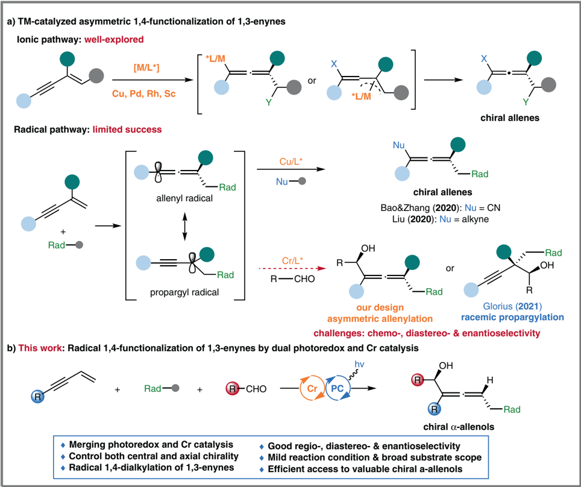
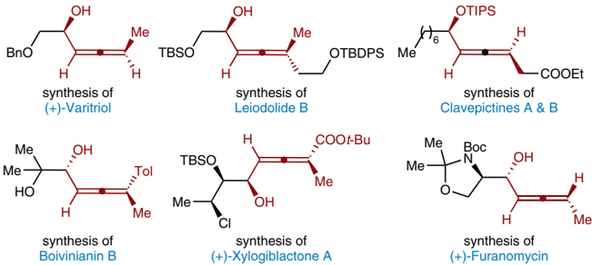
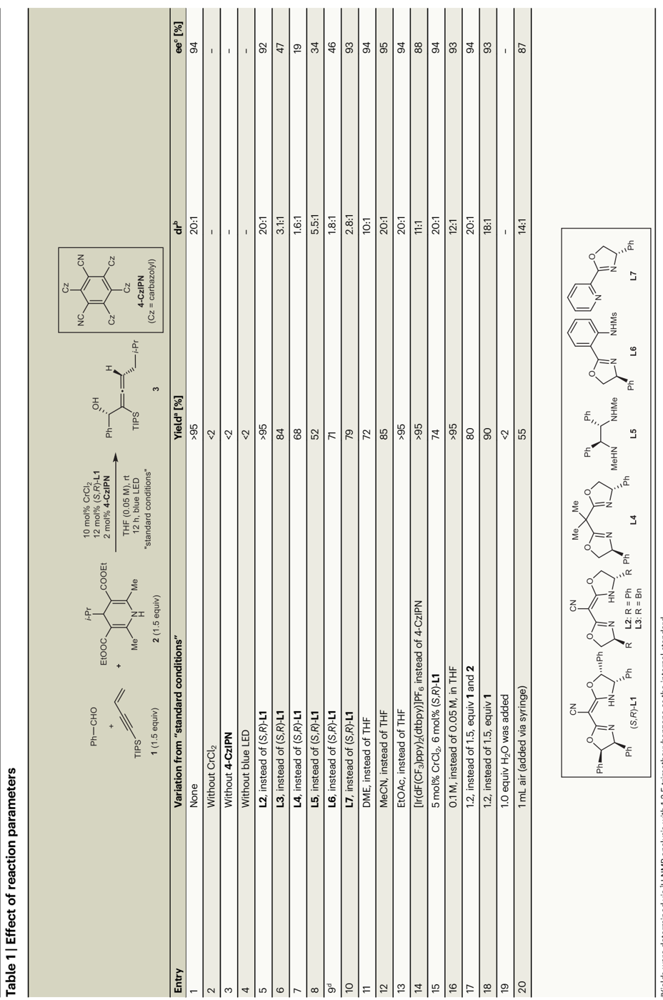
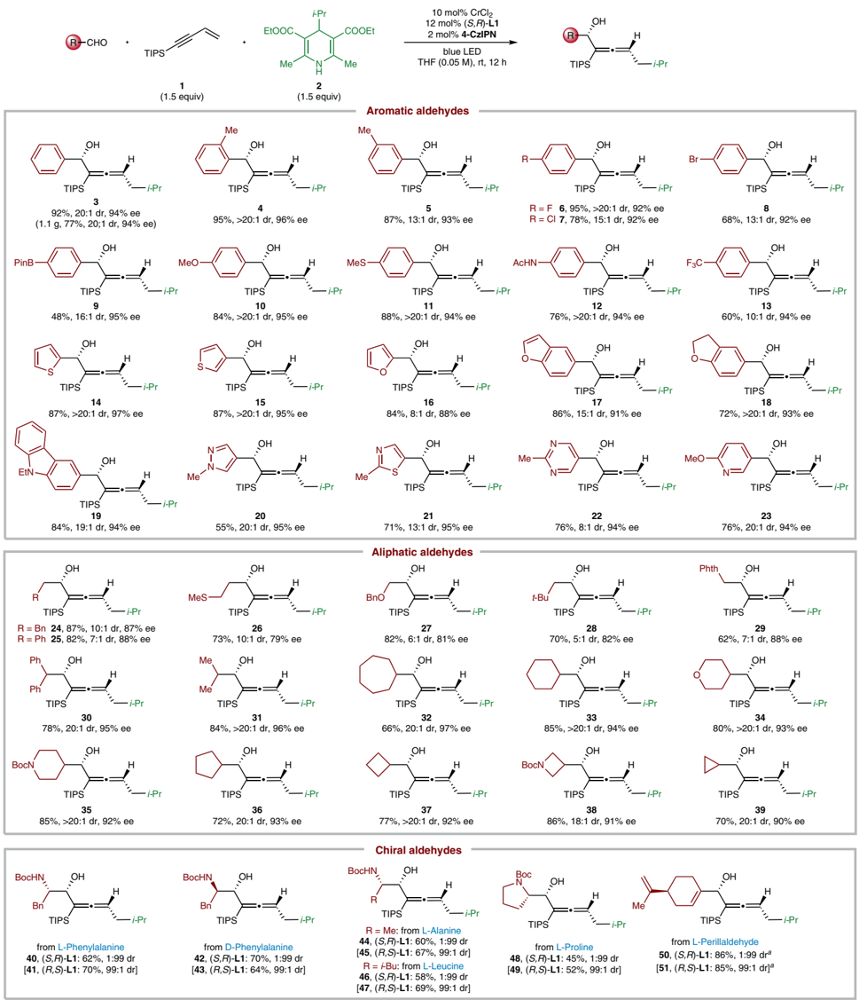
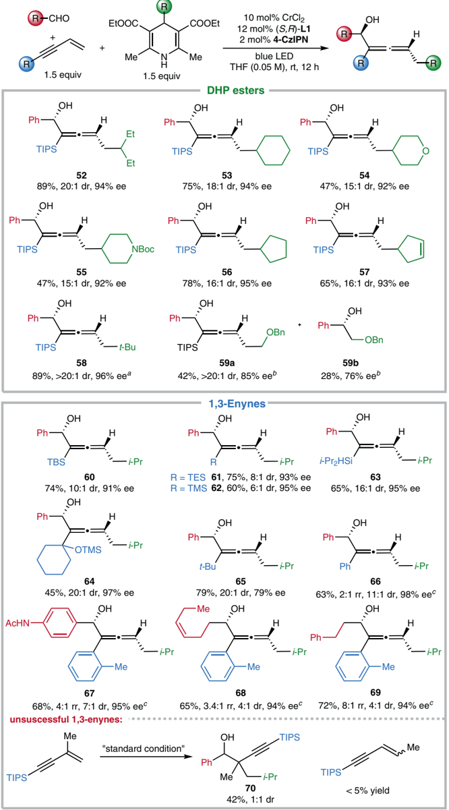
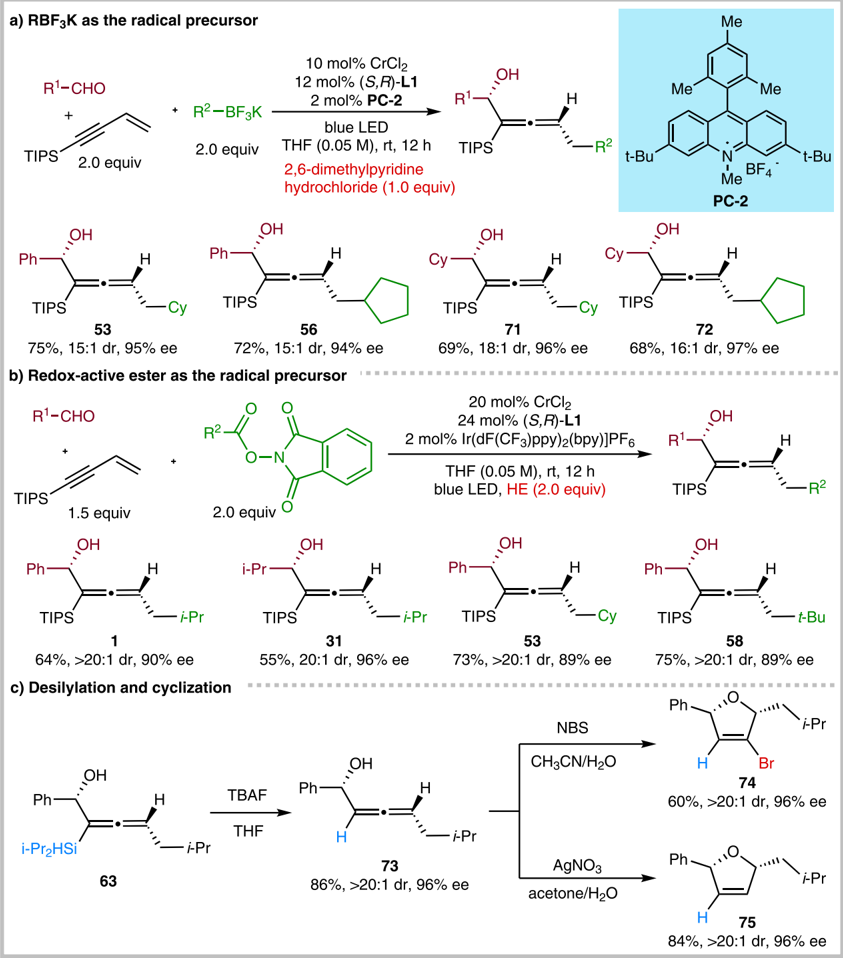
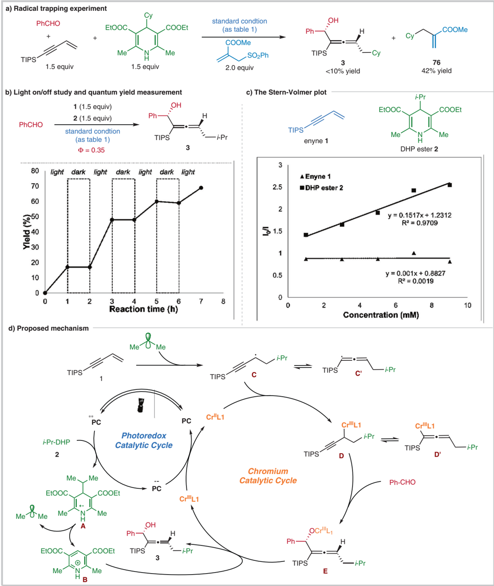

1234567890():,;

1234567890():,;

## Article

https://doi.org/10.1038/s41467-022-32614-4

## Asymmetric 1,4-functionalization of 1,3enynes via dual photoredox and chromium catalysis

Received: 8 April 2022

Accepted: 8 August 2022

Check for updates

## Feng-HuaZhang 1,2,3 , Xiaochong Guo 1,2,3 , Xianrong Zeng 1,2 &amp;ZhaobinWang 1,2

The merger of photoredox and transition-metal catalysis has evolved as a robust platform in organic synthesis over the past decade. The stereoselective 1,4-functionalization of 1,3-enynes, a prevalent synthon in synthetic chemistry, could afford valuable chiral allene derivatives. However, tremendous efforts have been focused on the ionic reaction pathway. The radical-involved asymmetric 1,4-functionalization of 1,3-enynes remains a prominent challenge. Herein, we describe the asymmetric three-component 1,4-dialkylation of 1,3enynes via dual photoredox and chromium catalysis to provide chiral allenols. This method features readily available starting materials, broad substrate scope, good functional group compatibility, high regioselectivity, and simultaneous control of axial and central chiralities. Mechanistic studies suggest that this reaction proceeds through a radical-involved redox-neutral pathway.

1,3-Enynes serve as a class of fundamental building blocks with diverse reactivity patterns, including 1,2-, 3,4-, and 1,4-functionalization 1 -4 . Particularly, the asymmetric 1,4-functionalization of 1,3-enynes provides quick access to chiral allenes, which not only widely occur in natural products and pharmaceuticals 5,6 but also represent one of the most versatile building blocks for the synthesis of complex molecules 7,8 . Various transition-metal complexes (TM = Pd, Cu, Rh, Sc, etc.) have proved to be able to achieve the asymmetric 1,4-functionalization of 1,3-enynes, involving hydrosilylation 9,10 , hydroborylation 11 , hydroamination 12 , hydrocarbonization 13 -15 , dicarbonization 16 , etc. 17 -19 . These transformations generally proceeded via an ionic pathway with allenyl or homoallenyl metal intermediates and mainly formed only one axial chirality (Fig. 1a) 3 . On the other hand, the radical 1,4-functionalization of 1,3-enynes via allenyl or propargylic radicals has attracted much attention recently 20 -29 , but only limited success has been achieved in their asymmetric versions. In 2020, the Bao and Zhang groups 30 , and Liu group 31 independently reported the elegant Cu-catalyzed enantioselective synthesis of chiral allenes via the radical 1,4-dicarbonization of 1,3-enynes. Compared to the ionic pathway, these radical reactions could proceed under mild conditions and afford densely functionalized complexes via a multicomponent manner, which expanded the chemical space for the functionalization of

1,3-enynes. Thus, further exploration of new reaction patterns involving radicals could facilitate ef fi cient access to valuable chiral allenes.

The Nozaki -Hiyama -Kishi reaction 32 is one of the most reliable C -C bond construction approaches with various applications in synthesis chemistry 33 -36 . However, conventional NHK reactions are generally limited to reductive processes, and stoichiometric amounts of metal reductants and strong Lewis acids (e.g., chlorosilanes and Schwartz ' s reagent) must be employed to turn over the chromium catalytic cycle 33 . Recent breakthroughs in dual photoredox and chromium catalysis 37 -42 have enabled redox-neutral NHK reactions 43 -46 . However, the photocatalytic transformations are limited to asymmetric allylations, reported by the Glorius group 47 , Kanai group 48,49 . To the best of our knowledge, the asymmetric radical 1,4-functionalization of 1,3-enynes via merging photoredox and Cr catalysis remains underdeveloped.

As our ongoing efforts in Cr-catalyzed radical-involved reactions 50 , we anticipate that the propargyl radical, which is in equilibrium with the allenyl radical, could be captured by a chiral chromium complex, and subsequent nucleophilic addition to the aldehyde affords the enantioenriched products (Fig. 1a, bottom). To achieve this goal, several challenges have to be addressed: (1) the regioselectivity control of 1,4-functionalization versus

1 Key Laboratory of Precise Synthesis of Functional Molecules of Zhejiang Province, Department of Chemistry, School of Science, Westlake University, Hangzhou 310024 Zhejiang Province, China. 2 Institute of Natural Sciences, Westlake Institute for Advanced Study, Hangzhou 310024 Zhejiang Province, China. 3 These authors contributed equally: Feng-Hua Zhang, Xiaochong Guo. e-mail: wangzhaobin@westlake.edu.cn

Fig. 1 | Catalytic asymmetric 1,4-functionalization of 1,3-enynes. a Transitionmetal catalyzed asymmetric 1,4-functionalization of 1,3-enynes. b This work: radical

1,2-functionalization; (2) the proper choice of radical precursors and photocatalysts to maintain the catalytic cycle; (3) the inhibition of quickly occurring side reactions from reactive radical intermediates or organochromium complexes.

Herein, we describe the three-component asymmetric radical 1,4functionalization of 1,3-enynes by merging photoredox and chromium catalysis (Fig. 1b). This reaction proceeds ef fi ciently in a redox-neutral manner without an external reductant. And two C -C bonds are simultaneously constructed to provide chiral α -allenols with both a stereogenic center and a stereogenic axis, which serve as essential building blocks in total synthesis (Fig. 2) 51 . Furthermore, the application of versatile and readily accessible materials, including 1,3-enyne, aldehyde, radical precursors, endow the reaction with signi fi cant advantages in practical utility.

## Results

## Reaction optimization

With the idea in mind, we initially explored the three-component reaction of benzaldehyde, 1,3-enyne 1 , and DHP ester 2 (Table 1). After detailed investigations of a series of reaction parameters, we determined that the merger of a chiral chromium/cyano-bisoxazoline (( S , R )-L1 ) and a photocatalyst 4-CzIPN could achieve the chemoselective allenylation reaction in good yield and high

1,4-functionalization of 1,3-enynes by dual photoredox and chromium catalysis. Rad alkyl radical precursors.

diastereoselectivity and enantioselectivity under visible-light irradiation (entry 1). Control experiments establish that CrCl2, 4-CzIPN, and light are critical for this allenylation reaction under these conditions (entries 2 -4). A slight decrease in enantioselectivity was detected when using a similar anionic ligand L2 (entry 5). Other chiral nitrogen-containing ligands are not effective for this reaction under similar conditions (entries 6 -10). In the case of L6 , the homopropargylic alcohol was isolated in 1:3 ratio vs the allenol (entry 9). The reaction also performed well in DME, CH3CN, or EtOAc, furnishing the desired chiral allenol only with a slight decrease in yield and dr (entries 11 -13). The photocatalyst [Ir(dF(CF3)ppy)2(dtbpy)]PF6 also led to the allenol but with a slight erosion in d.r. and ee (entry 14). Decreasing the catalyst loading to 5 mol% CrCl2 and 6 mol% ( S,R )-L1 led to a drop in yield (entry 15). When increasing the concentration from 0.05 M to 0.1 M, the d.r. decreased from 20:1 to 12:1 (entry 16). And the yield or dr of the allenylation product was only modestly diminished, if 1.2 equivalent of 1,3-enyne 1 and DHP ester 2 are used (entries 17&amp;18). However, adding 1.0 equivalent water to the reaction mixture inhibits the formation of α -allenol 3 (entry 19). The addition of 1.0 mL air to the reaction vessel has a deleterious effect (entry 20). These results indicated that the reaction was sensitive to moisture and air, probably due to the involvement of unstable alkyl chromium complexes.

Fig. 2 | The importance of chiral allenols. Bn benzyl, TBS tert -butyldimethylsilyl, Me methyl, TIPS triisopropylsilyl, Et ethyl, Tol p -methylphenyl, t -Bu tert -butyl, Boc tert -butoxylcarbonyl.

## Substrate scope

We next explored the aldehyde scope (Fig. 3). Gratifyingly, a broad array of aromatic and aliphatic aldehydes serve as effective reaction partners, affording the chiral α -allenols in high yields, good diastereoselectivities, and enantioselectivities (Fig. 3, 3 -51 ). On a gram scale (1.10 g product), the 1,4-functionalization of 1,3-enyne to product 3 proceeded in 77% yield and 94% ee. A variety of functional groups are compatible with this method, including an aryl halide (e.g., fl uoride, chloride, bromide), boronate, methoxy, thioether, amide, carboxylate ester, CF3, furan, thiophene, benzofuran and N -alkylated carbazole (Fig. 3, 6 -19 ). To our delight, heteroaromatic aldehydes, with N, O, or S in the aromatic ring, could react well with the 1,3-enyne and DHP ester under the optimal condition, affording the enantioenriched products ef fi ciently (Fig. 3, 14 -23 ). Notably, N -heteroaromatic rings are widespread in pharmaceuticals and natural products 52 . However, the reactivity of N -heteroaromatic aldehydes is rarely demonstrated in previous NHK reactions. As disclosed in recent studies, they generally led to poor yields, including our stereoconvergent allenylation reaction ( 20 -23 ) 50,53 -55 . Aliphatic aldehydes, substituted with diverse primary or secondary alkyl chains, participated ef fi ciently in this 1,4functionalization of 1,3-enynes ( 24 -39 ). However, moderate diastereoselectivities (5:1 dr to 10:1 dr) were generally observed in the cases of primary aliphatic aldehydes ( 24 -29 ), probably resulting from the reduced steric hindrance in comparison with secondary alkyl aldehydes ( 30 -39 ).

Naturally occurring α -amino acids are readily available and act as prevalent feedstocks in asymmetric synthesis 56 . We were delighted to fi nd that the chiral α -amino aldehydes, derived from natural amino acids, served as effective substrates under the standard condition for synthesizing chiral amino alcohols with continuous two stereogenic centers and one chiral axis (Fig. 3, 40 -49 ). As indicated by the singlecrystal structure for products 12 and 42 (see Supplementary Information), the chiral chromium catalyst, rather than existing stereocentres on the chiral aldehydes, predominantly determines the stereochemistry of the allenylation products 40 -49 . It is noteworthy that chiral amino alcohols are prevalent synthons in pharmaceuticals and asymmetric catalysis 57 . Finally, the reactivity of α , β -unsaturated aldehydes was tested, and the desired chiral α -allenols were obtained in high yields and diastereoselectivities after increasing the equivalents of 1,3-enyne 1 and DHP ester 2 (Fig. 3, 50 and 51 ).

With respect to the DHP esters and 1,3-enynes, the scope of this method is also fairly broad (Fig. 4, 52 -69 ). For example, moderate to good yields and high diastereo- and enantioselectivities are achieved for the alkyl radical precursors with various alkyl substituents, such as cyclohexyl, oxacyclohexyl, azacyclohexyl, cyclopentyl, cyclopentenyl, and tert -butyl ( 52 -58 ). However, using DHP ester with a primary alkyl substituent furnished the desired allenol 59a in moderate yield (42%, &gt;20:1 d.r., 85% ee), accompanied by 28% direct alkylation product 59b in 76% ee. These results indicate that the single electron reduction of the primary alkyl radical by Cr II /L could compete with its addition to 1,3-enynes. 1,3-Enynes, bearing different acetylenic substituents varying from silyl, alkyl to aryl groups, all reacted smoothly with aryl or alkyl aldehydes and DHP ester 1 to furnish the chiral products ef fi ciently ( 60 -69 ). We found that the use of TMS and TES substituted enynes slightly decreased diastereoselectivity ( 61 , 62 ), probably due to the variation of steric hindrance. And 1,3-enynes with an aryl group led to the allenols in high enantioselectivity, albeit with moderate regioand diastereoselectivity ( 66 -69 ). However, the current optimal condition does apply to 1,3-enynes bearing substituents on the C=C bond (Fig. 4, bottom). The use of triisopropyl(3-methylbut-3-en-1-yn-1-yl) silane gave the propargylation product 70 predominantly with poor diastereoselectivity.

Organotri fl uoroborates, featuring tetracoordinate boron with strong boron- fl uoride bonds, are generally stable toward numerous regents that are often problematic for other trivalent organoborons, and thus have been widely used in Suzuki-Miyaura couplings 58 . Moreover, organotri fl uoroborates also prove to be suitable radical precursors for C -Cbondconstruction via photoredox catalysis 59,60 . In this context, we applied them as radical precursors to our newly developed method. After further evaluation of different reaction parameters, we determined an optimal condition with the acridine tetra fl uoroborate (PC-2) as the photocatalyst and 2,6-dimethylpyridine hydrochloride as the dissociation reagent. Thus, the representative secondary organotri fl uoroborates engaged well in the 1,4-functionalization of enynes with aryl and aliphatic aldehydes to ef fi ciently afford the desired coupling products (Fig. 5a, 53 , 56 , 71 , and 72 ). N -(Acyloxy)phthalimides (NHPI esters) are widely available from carboxylic acids, and have proved to be priviliged alkyl radical precursors in decarboxylitive cross-couplings 61,62 . Gratifyingly, NHPI esters also work well under a slightly modi fi ed condition with Hantzsch ester as the reductant, furnishing the desired allenols in moderate to good yield and high stereoselectivity (Fig. 5b, 1 , 31 , 53 , and 58 ).

## Synthetic application

Product transformations were performed to demonstrate the synthetic utility of our newly developed method (Fig. 5c). Chiral α -allenols serve as suitable building blocks in the synthesis of enantioenriched dihydrofurans 63 . The desilylation reaction of 63 proceeded smoothly, affording the chiral α -allenol 73 without losing diastereomeric or enantiomeric excess. The stereoselective electrophilic cyclization of 73 furnished 2,5-dihydrofurans 74 and 75 with good ef fi ciency in axialto-central chirality transfer (Fig. 5c).

H NMR analysis with 1,3,5-trimethoxybenzene as the internal standard.

1

Yields were determined via

a

|                     | ee c [%]                               | 94   |                | -               | - -              | 92 47                                                       | 19                            | 34                            | 46                                                          | 93   |                                          | 94 95                 | 94 88                                                                                  | 94 93                          | 94                                 | 93                                                  | - 87                          |
|---------------------|----------------------------------------|------|----------------|-----------------|------------------|-------------------------------------------------------------|-------------------------------|-------------------------------|-------------------------------------------------------------|------|------------------------------------------|-----------------------|----------------------------------------------------------------------------------------|--------------------------------|------------------------------------|-----------------------------------------------------|-------------------------------|
|                     | dr b                                   | 20:1 | -              |                 | - -              | 20:1 3.1:1                                                  |                               | 1.6:1 5.5:1                   | 1.8:1                                                       |      | 2.8:1                                    | 10:1 20:1 20:1        | 11:1 20:1                                                                              |                                | 12:1                               | 20:1 18:1                                           | - 14:1                        |
|                     | Yield                                  | >95  |                | <2              | <2 <2            | >95 84                                                      |                               | 68 52                         | 71 79                                                       |      | 72                                       | >95                   | 74                                                                                     | >95                            |                                    | 80 90                                               | <2 55                         |
|                     |                                        |      |                |                 |                  |                                                             |                               |                               |                                                             |      |                                          | 85                    | >95                                                                                    |                                |                                    |                                                     |                               |
| reaction parameters | Variation from ' standard conditions ' | None | Without CrCl 2 | Without 4-CzIPN | Without blue LED | L2 , instead of ( S , R )- L1 L3 , instead of ( S , R )- L1 | L4 , instead of ( S , R )- L1 | L5 , instead of ( S , R )- L1 | L6 , instead of ( S , R )- L1 L7 , instead of ( S , R )- L1 |      | DME, instead of THF MeCN, instead of THF | EtOAc, instead of THF | [Ir(dF(CF 3 )ppy) 2 (dtbpy)]PF 6 instead of 4-CzIPN 5mol% CrCl 2 , 6mol% ( S , R )- L1 | 0.1M, instead of 0.05M, in THF | 1.2, instead of 1.5, equiv 1 and 2 | 1.2, instead of 1.5, equiv 1 1.0 equiv H Owas added | 2 1mL air (added via syringe) |

Ee was determined via HPLC analysis.

c

d Homopropargylic alcohol by-product was observed in 1:3 ratio vs the allenol 3 .

Fig. 3 | The scope of aldehydes in the 1,4-functionalization of 1,3-enynes. a 2.0 equiv of DHP ester and 2.0 equiv of 1,3-enyne were used. iPr isopropyl, Bpin boronic acid pinacol ester, Ac acetyl.

## Mechanistic observations

A series of conventional experiments were conducted to provide insights into the reaction mechanism (Fig. 6a -c). The addition of 2 equiv of an allyl sulfone under the standard condition led to an adduct 76 in 42% yield, with a trace amount of desired product 3 , which suggested that the reaction might involve the formation of cyclohexyl radical from the DHP ester (Fig. 6a). According to a reported method 64 , the quantum yield of this model reaction was determined to be 0.35. Moreover, the direct correlation between photolysis and product formation is demonstrated by an interval light-dark reaction (Fig. 6b). These results indicate that the radical 1,4-functionalization process undergoes a photoredox, instead of a radical-chain, pathway. As shown in Fig. 6c, the Stern -Volmer luminescence quenching studies proved that the DHP ester, rather than the 1,3-enyne, quenches the excited-state photocatalyst 4CzIPN, suggesting a reductive quenching pathway.

Fig. 4 | The scope of DHP esters and 1,3-enynes in the 1,4-functionalization of 1,3-enynes. a 4-( tert -butyl)-2,6-dimethyl-1,4-dihydropyridine-3,5-dicarbonitrile was used as radical precursor. b 3.0 equiv of corresponding 1,3-enyne were used. c The

According to our observations and previous reports 44,46,47 , a putative mechanism is proposed in Fig. 6d with the model reaction as an example. The excited-state photocatalyst PC* 4-CzIPN* (E1/2(*PC/ PC ˙ ˉ ) = 1.35 V vs. SCE in MeCN) 65 is reductively quenched by the DHP

yield is for allenol product, and the minor regioisomer refers to the propargylation product from the 1,2-functionalization. TMS trimethylsilyl, TES triethylsilyl.

ester 2 (E1/2 =1.10 V vs. SCE in MeCN) 66 , generating the reduced photocatalyst PC ˙ ˉ and the radical cation A . The rapid fragmentation of intermediate A affords the isopropyl radical and the pyridinium B . The isopropyl radical could either reversibly add to the low valent Cr II / L1 to

Fig. 5 | Exploration of other radical precursors and representative synthetic applications. a RBF3K as the radical precursor. b Redox-active ester as the radical precusor. c Desilylation and cyclization. NBS N -bromosuccinimide.

generate an off-cycle alkyl Cr III / L1 complex 67 , or add to the terminus of 1,3-enyne 1 to forge the propargyl radical C , which is in equilibrium with the allenyl radical C ' . The radical capture by Cr II / L1 leads to two equilibrated species, the propargyl chromium D and allenyl chromium D ' . Subsequent nucleophilic attack to benzaldehyde is proposed via a six-member cyclic manner 68 , affording intermediate E . We believe that the isomerization between intermediates D and D ' is faster than the subsequent nucleophilic addition to aldehydes. So the regioselectivity might be determined in the nucleophilic carbonyl addition step via a possible Zimmerman-Traxler transition state. As observed in the scope study, the steric hindrance of the acetylenic substituents of 1,3-enynes is critical for the high regioselectivity, which favors the allenylation product formation from the propargyl Cr D , instead of the allenyl D ' . The dissociation of the O -Cr bond in E by the pyridinium B , provides chiral allenol 3 . Finally, the Cr III / L1 is reduced to Cr II / L1 (E1/2 = -0.65 V

vs. SCE in H2O, E1/2 = -0.51 V vs. SCE in DMF) 47 by the reduced photocatalyst PC ˙ ˉ (E1/2 (PC/PC ˙ ˉ ) = -1.21 V vs. SCE in MeCN) 65 , which closes the catalytic cycle.

In conclusion, we described a three-component asymmetric radical 1,4-functionalization of 1,3-enynes via dual photoredox and chromium catalysis. The key to success is using DHP esters under photoredox conditions, thus obviating stoichiometric amounts of metal reductants and dissociation reagents in conventional catalytic NHK reactions. The present method exhibits broad substrate scope with good functional group compatibility, providing ef fi cient access to valuable chiral α -allenols from the readily available starting material. Given the importance of allenols and the growing interest in metallaphotoredox catalysis 37 , we anticipate that our protocol will fi nd broad utility in organic synthesis and facilitate the current endeavors to develop dual catalytic systems.

80

70

60

50

30

Yeld (%)

20

10

0

1

d) Proposed mechanism

3

2.5

4 Enyne 1

·DHP ester 2

Fig. 6 | Mechanistic investigations. a Radical trapping experiment. b Light on/off and quantum yield mearsurement. c TheStern -Volmer plot. d Proposedmechanismfor the 1,4-functionalizaton of 1,3-enynes.

## Methods

General procedure for radical 1,4-functionalization of 1,3-enynes with aldehydes and DHP esters

In a nitrogen- fi lled glovebox, an oven-dried 20 mL vial with a magnetic stir bar, were charged with the CrCl2 (5.0 mg, 0.04 mmol, 10 mol%) and ( S,R )-L1 (23.2 mg, 0.048 mmol, 12 mol %). Then 8.0 mL THF was added via syringe. The vial was closed with a PTFE septum cap and then stirred at room temperature for

2 hours. Next, to the prepared catalyst solution were added the 1,3-enynes (0.6 mmol, 1.5 equiv), the aldehydes (0.4 mmol, 1.0 equiv), the DHP esters (0.6 mmol, 1.5 equiv), and photocatalyst 4-CzIPN (6.4 mg, 0.008 mmol, 2 mol%) sequentially. Then the vial was closed with a PTFE septum cap and taken out of the glovebox. The reaction was irradiated with two 20 W 160-440 nm LED for 12 h (tube 5 cm away from lights, fans for cooling, 30 -35 °C). After that, the reaction mixture was concentrated and run through a

Ф = 0.35

dark

3

light dark light

DHP ester 2

short silica gel pad with hexanes/EtOAc (3:1) as the eluent. Then the solvent was removed under the reduced pressure. The diastereoselectivity was determined via 1 H NMR analysis of the crude reaction mixture. The residue was puri fi ed by fl ash chromatography to provide the desired product, and the ee was determined via HPLC/SFC analysis.

## Data availability

The data relating to the materials and methods, experimental procedures, HPLC/SFC spectra, mechanism research, and NMR spectra are available in the Supplementary Information. The crystallographic data for compounds 12 and 42 are available free of charge from the CCDC under reference numbers 2130059 and 2130062. All other data are available from the authors upon request.

## References

1. Aubert, C., Buisine, O. &amp; Malacria, M. The behavior of 1,n-enynes in the presence of transition metals. Chem. Rev. 102 , 813 -834 (2002).
2. Holmes, M., Schwartz, L. A. &amp; Krische, M. J. Intermolecular metalcatalyzed reductive coupling of dienes, allenes, and enynes with carbonyl compounds and imines. Chem. Rev. 118 , 6026 -6052 (2018).
3. Fu, L., Greßies, S., Chen, P. &amp; Liu, G. Recent advances and perspectives in transition metal -catalyzed 1,4 -functionalizations of unactivated 1,3 -enynes for the synthesis of allenes. Chin. J. Chem. 38 , 91 -100 (2019).
4. Dherbassy, Q. et al. Copper-catalyzed functionalization of enynes. Chem. Sci. 11 , 11380 -11393 (2020).
5. Hoffmann-Röder,A. &amp; Krause, N. Synthesis and properties of allenic natural products and pharmaceuticals. Angew. Chem. Int. Ed. 43 , 1196 -1216 (2004).
6. Yu, S. &amp; Ma, S. Allenes in catalytic asymmetric synthesis and natural product syntheses. Angew. Chem. Int. Ed. 51 , 3074 -3112 (2012).
7. Ma, S. Some typical advances in the synthetic applications of allenes. Chem. Rev. 105 , 2829 -2872 (2005).
8. Campolo, D., Gastaldi, S., Roussel, C., Bertrand, M. P. &amp; Nechab, M. Axial-to-central chirality transfer in cyclization processes. Chem. Soc. Rev. 42 , 8434 -8466 (2013).
9. Han, J. W., Tokunaga, N. &amp; Hayashi, T. Palladium-catalyzed asymmetric hydrosilylation of 4-substituted 1-buten-3-ynes. catalytic asymmetric synthesis of axially chiral allenylsilanes. J. Am. Chem. Soc. 123 , 12915 -12916 (2001).
10. Wang, M. et al. Synthesis of highly substituted racemic and enantioenriched allenylsilanes via copper-catalyzed hydrosilylation of (Z)-2-alken-4-ynoates with silylboronate. J. Am. Chem. Soc. 137 , 14830 -14833 (2015).
11. Huang, Y., Del Pozo, J., Torker, S. &amp; Hoveyda, A. H. Enantioselective synthesis of trisubstituted allenyl-B(pin) compounds by phosphineCu-catalyzed 1,3-enyne hydroboration. insights regarding stereochemical integrity of Cu-allenyl intermediates. J. Am. Chem. Soc. 140 , 2643 -2655 (2018).
12. Adamson, N. J., Jeddi, H. &amp; Malcolmson, S. J. Preparation of chiral allenes through Pd-catalyzed intermolecular hydroamination of conjugated enynes: enantioselective synthesis enabled by catalyst design. J. Am. Chem. Soc. 141 , 8574 -8583 (2019).
13. Yao, Q. et al. Ef fi cient synthesis of chiral trisubstituted 1,2-allenyl ketones by catalytic asymmetric conjugate addition of malonic esters to enynes. Angew. Chem. Int. Ed. 55 , 1859 -1863 (2016).
14. Yang, S. Q., Wang, Y. F., Zhao, W. C., Lin, G. Q. &amp; He, Z. T. Stereodivergent synthesis of tertiary fl uoride-tethered allenes via copper
15. and palladium dual catalysis. J. Am. Chem. Soc. 143 , 7285 -7291 (2021).
15. Nishimura, T., Makino, H., Nagaosa, M. &amp; Hayashi, T. Rhodiumcatalyzed enantioselective 1,6-addition of arylboronic acids to enynamides: asymmetric synthesis of axially chiral allenylsilanes. J. Am. Chem. Soc. 132 , 12865 -12867 (2010).
16. Law, C., Kativhu, E., Wang, J. &amp; Morken, J. P. Diastereo- and enantioselective 1,4-difunctionalization of borylenynes by catalytic conjunctive cross-coupling. Angew. Chem. Int. Ed. 59 , 10311 -10315 (2020).
17. Bayeh-Romero, L. &amp; Buchwald, S. L. Copper hydride catalyzed enantioselective synthesis of axially chiral 1,3-disubstituted allenes. J. Am. Chem. Soc. 141 , 13788 -13794 (2019).
18. Liao, Y. et al. Enantioselective synthesis of multisubstituted allenes by cooperative Cu/Pd-catalyzed 1,4-arylboration of 1,3-enynes. Angew. Chem. Int. Ed. 59 , 1176 -1180 (2020).
19. Qian, H., Yu, X., Zhang, J. &amp; Sun, J. Organocatalytic enantioselective synthesis of 2,3-allenoates by intermolecular addition of nitroalkanes to activated enynes. J. Am. Chem. Soc. 135 , 18020 -18023 (2013).
20. Wang,F.etal. Divergent synthesis of CF3-substituted allenyl nitriles by ligand-controlled radical 1,2- and 1,4-addition to 1,3-enynes. Angew. Chem. Int. Ed. 57 , 7140 -7145 (2018).
21. Zhang, K.-F. et al. Nickel-catalyzed carbo fl uoroalkylation of 1,3enynes to access structurally diverse fl uoroalkylated allenes. Angew. Chem. Int. Ed. 58 , 5069 -5074 (2019).
22. Zhu, X. et al. Copper-catalyzed radical 1,4-difunctionalization of 1,3enynes with alkyl diacyl peroxides and N- fl uorobenzenesulfonimide. J. Am. Chem. Soc. 141 , 548 -559 (2019).
23. Song, Y., Fu, C. &amp; Ma, S. Copper-catalyzed syntheses of multiple functionalizatized allenes via three-component reaction of enynes. ACS Catal. 11 , 10007 -10013 (2021).
24. Chen, Y., Wang, J. &amp; Lu, Y. Decarboxylative 1,4-carbocyanation of 1,3-enynes to access tetra-substituted allenes via copper/photoredox dual catalysis. Chem. Sci. 12 , 11316 -11321 (2021).
25. Wang, L., Ma, R., Sun, J., Zheng, G. &amp; Zhang, Q. NHC and visible light-mediated photoredox co-catalyzed 1,4-sulfonylacylation of 1,3-enynes for tetrasubstituted allenyl ketones. Chem. Sci. 13 , 3169 -3175 (2022).
26. Chen, L. et al. 1,4-Alkylcarbonylation of 1,3-enynes to access tetrasubstituted allenyl ketones via an NHC-catalyzed radical relay. ACS Catal. 11 , 13363 -13373 (2021).
27. Chen, Y., Zhu, K., Huang, Q. &amp; Lu, Y. Regiodivergent sulfonylarylation of 1,3-enynes via nickel/photoredox dual catalysis. Chem. Sci. 12 , 13564 -13571 (2021).
28. Liu, Y.-Q. et al. Radical acylalkylation of 1,3-enynes to access allenic ketones via N-heterocyclic carbene organocatalysis. J. Org. Chem. 87 , 5229 -5241 (2022).
29. Li, C. et al. Selective 1,4-arylsulfonation of 1,3-enynes via photoredox/nickel dual catalysis. Org. Chem. Front. 9 , 788 -794 (2022).
30. Zeng, Y. et al. Copper-catalyzed enantioselective radical 1,4difunctionalization of 1,3-enynes. J. Am. Chem. Soc. 142 , 18014 -18021 (2020).
31. Dong, X. Y. et al. Copper-catalyzed asymmetric coupling of allenyl radicals with terminal alkynes to access tetrasubstituted allenes. Angew. Chem. Int. Ed. 60 , 2160 -2164 (2021).
32. Okude, Y., Hirano, S., Hiyama, T. &amp; Nozaki, H. Grignard-type carbonyl addition of allyl halides by means of chromous salt. A chemospecifi c synthesis of homoallyl alcohols. J. Am. Chem. Soc. 99 , 3179 -3181 (1977).
33. Fürstner, A. Carbon -carbon bond formations involving organochromium(III) reagents. Chem. Rev. 99 , 991 -1046 (1999).

34. Hargaden, G. C. &amp; Guiry, P. J. The development of the asymmetric Nozaki -Hiyama -Kishi reaction. Adv. Synth. Catal. 349 , 2407 -2424 (2007).
35. Zhang, G. &amp; Tian, Q. Recent advances in the asymmetric Nozaki -Hiyama -Kishi reaction. Synthesis 48 , 4038 -4049 (2016).
36. Gil, A., Albericio, F. &amp; Alvarez, M. Role of the Nozaki-Hiyama-TakaiKishi reaction in the synthesis of natural products. Chem. Rev. 117 , 8420 -8446 (2017).
37. Chan, A. Y. et al. Metallaphotoredox: the merger of photoredox and transition metal catalysis. Chem. Rev. 122 , 1485 -1542 (2022).
38. Lu, F.-D. et al. Recent advances in transition-metal-catalysed asymmetric coupling reactions with light intervention. Chem. Soc. Rev. 50 , 12808 -12827 (2021).
39. Zhao, K. &amp; Knowles, R. R. Contra-thermodynamic positional isomerization of ole fi ns. J. Am. Chem. Soc. 144 , 137 -144 (2022).
40. Liu, J. et al. Photoredox-enabled chromium-catalyzed alkene diacylations. ACS Catal. 12 , 1879 -1885 (2022).
41. Huang, H.-M., Bellotti, P. &amp; Glorius, F. Merging carbonyl addition with photocatalysis. Acc. Chem. Res. 55 , 1135 -1147 (2022).
42. Zhang, H.-H., Chen, H., Zhu, C. &amp; Yu, S. A review of enantioselective dual transition metal/photoredox catalysis. Sci. China Chem. 63 , 637 -647 (2020).
43. Kanai, M., Mitsunuma, H. &amp; Katayama, Y. Recent progress in chromium-mediated carbonyl addition reactions. Synthesis 54 , 1684 -1694 (2021).
44. Schwarz, J. L., Schäfers, F., Tlahuext-Aca, A., Lückemeier, L. &amp; Glorius, F. Diastereoselective allylation of aldehydes by dual photoredox and chromium catalysis. J. Am. Chem. Soc. 140 , 12705 -12709 (2018).
45. Schwarz, J. L., Kleinmans, R., Paulisch, T. O. &amp; Glorius, F. 1,2-Amino alcohols via Cr/photoredox dual-catalyzed addition of α -amino carbanion equivalents to carbonyls. J. Am. Chem. Soc. 142 , 2168 -2174 (2020).
46. Huang, H. M., Bellotti, P., Daniliuc, C. G. &amp; Glorius, F. Radical carbonyl propargylation by dual catalysis. Angew. Chem. Int. Ed. 60 , 2464 -2471 (2021).
47. Schwarz, J. L., Huang, H.-M., Paulisch, T. O. &amp; Glorius, F. Dialkylation of 1,3-dienes by dual photoredox and chromium catalysis. ACS Catal. 10 , 1621 -1627 (2020).
48. Mitsunuma, H., Tanabe, S., Fuse, H., Ohkubo, K. &amp; Kanai, M. Catalytic asymmetric allylation of aldehydes with alkenes through allylic C(sp3) -H functionalization mediated by organophotoredox and chiral chromium hybrid catalysis. Chem.Sci. 10 , 3459 -3465(2019).
49. Tanabe, S., Mitsunuma, H. &amp; Kanai, M. Catalytic allylation of aldehydes using unactivated alkenes. J. Am. Chem. Soc. 142 , 12374 -12381 (2020).
50. Zhang, F.-H., Guo, X., Zeng, X. &amp; Wang, Z. Catalytic enantioconvergent allenylation of aldehydes with propargyl halides. Angew. Chem. Int. Ed. 61 , e202117114 (2022).
51. Alonso, J. M. &amp; Almendros, P. Deciphering the chameleonic chemistry of allenols: breaking the taboo of a onetime esoteric functionality. Chem. Rev. 121 , 4193 -4252 (2021).
52. Meanwell, N. A. in Advances in He teroc yclic Chemistry Vol. 123 (eds Scriven, E. F. V. &amp; Ramsden, C. A.) 245 -361 (Academic Press, 2017).
53. Ni, S. et al. A radical approach to anionic chemistry: synthesis of ketones, alcohols, and amines. J. Am. Chem. Soc. 141 , 6726 -6739 (2019).
54. Gao, Y. et al. Electrochemical Nozaki -Hiyama -Kishi coupling: scope, applications, and mechanism. J. Am. Chem. Soc. 143 , 9478 -9488 (2021).
55. Matos, J. L. M., Vasquez-Cespedes, S., Gu, J., Oguma, T. &amp; Shenvi, R. A. Branch-selective addition of unactivated ole fi ns into imines and aldehydes. J. Am. Chem. Soc. 140 , 16976 -16981 (2018).
56. Hughes, A. B. Amino Acids, Peptides and Proteins in Organic Chemistry, Analysis and Function of Amino Acids and Peptides (John Wiley &amp; Sons, 2013).
57. Ager, D. J., Prakash, I. &amp; Schaad, D. R. 1,2-Amino alcohols and their heterocyclic derivatives as chiral auxiliaries in asymmetric synthesis. Chem. Rev. 96 , 835 -876 (1996).
58. Molander, G. A. &amp; Ellis, N. Organotri fl uoroborates: protected boronic acids that expand the versatility of the suzuki coupling reaction. Acc. Chem. Res. 40 , 275 -286 (2007).
59. Tellis, J. C., Primer, D. N. &amp; Molander, G. A. Single-electron transmetalation in organoboron cross-coupling by photoredox/nickel dual catalysis. Science 345 , 433 -436 (2014).
60. Yasu, Y., Koike, T. &amp; Akita, M. Visible light-induced selective generation of radicals from organoborates by photoredox catalysis. Adv. Synth. Catal. 354 , 3414 -3420 (2012).
61. Qin, T. et al. A general alkyl-alkyl cross-coupling enabled by redox-active esters and alkylzinc reagents. Science 352 , 801 -805 (2016).
62. Parida, S. K. et al. Single electron transfer-induced redox processes involving N-(Acyloxy)phthalimides. ACS Catal. 11 , 1640 -1683 (2021).
63. Ma, S. Transition metal-catalyzed/mediated reaction of allenes with a nucleophilic functionality connected to the α -carbon atom. Acc. Chem. Res. 36 , 701 -712 (2003).
64. Cismesia, M. A. &amp; Yoon, T. P. Characterizing chain processes in visible light photoredox catalysis. Chem. Sci. 6 , 5426 -5434 (2015).
65. Luo, J. &amp; Zhang, J. Donor -acceptor fl uorophores for visible-lightpromoted organic synthesis: photoredox/Ni dual catalytic C(sp3) -C(sp2) cross-coupling. ACS Catal. 6 , 873 -877 (2016).
66. Cheng, J.-P. et al. Heterolytic and homolytic N -Hbonddissociation energies of 4-substituted hantzsch 2,6-dimethyl-1,4-dihydropyridines and the effect of one-electron transfer on the N -H bond activation. J. Org. Chem. 65 , 3853 -3857 (2000).
67. MacLeod, K. C., Conway, J. L., Patrick, B. O. &amp; Smith, K. M. Exploring chromium(III)-alkyl bond homolysis with CpCr[(ArNCMe)2CH](R) complexes. J. Am. Chem. Soc. 132 , 17325 -17334 (2010).
68. Inoue, M. &amp; Nakada, M. Studies into asymmetric catalysis of the Nozaki-Hiyama allenylation. Angew. Chem. Int. Ed. 45 , 252 -255 (2005).

## Acknowledgements

We are grateful for fi nancial support from the National Natural Science Foundation of China (22171231, Z.W.), the China Postdoctoral Science Foundation (2021M692879, F.-H.Z.), and Zhejiang Leading Innovative and Entrepreneur Team Introduction Program (2020R01004). We thank Instrumentation and Service Center for Molecular Science and Physical SciencesatWestlakeUniversityfor the assistance work in measurement/ data interpretation. We thank Dr. Xiaohuo Shi, Dr. Yinjuan Chen, Dr. ZhongChen,andDr.DanyuGufromInstrumentationandServiceCenter for Molecular Sciences at Westlake University for assistance in mechanistic study.

## Author contributions

F.-H.Z. and X.G. contributed equally to this work. F.-H.Z. and Z.W. conceived this work; F.-H.Z., X.G., and X.Z. designed and conducted all the experiments; F.-H.Z. and Z.W. wrote the manuscript.

## Competing interests

The authors declare no competing interest.

## Additional information

Supplementary information The online version contains supplementary material available at https://doi.org/10.1038/s41467-022-32614-4.

Correspondence and requests for materials should be addressed to Zhaobin Wang.

Peer review information Nature Communications thanks the anonymous reviewers for their contribution to the peer review of this work. Peer reviewer reports are available.

Reprints and permission information is available at http://www.nature.com/reprints

Publisher ' s note Springer Nature remains neutral with regard to jurisdictional claims in published maps and institutional af fi liations.

Open Access This article is licensed under a Creative Commons Attribution 4.0 International License, which permits use, sharing, adaptation, distribution and reproduction in any medium or format, as long as you give appropriate credit to the original author(s) and the source, provide a link to the Creative Commons license, and indicate if changes were made. The images or other third party material in this article are included in the article ' s Creative Commons license, unless indicated otherwise in a credit line to the material. If material is not included in the article ' s Creative Commons license and your intended use is not permitted by statutory regulation or exceeds the permitted use, you will need to obtain permission directly from the copyright holder. To view a copy of this license, visit http://creativecommons.org/ licenses/by/4.0/.

©The Author(s) 2022