Open Access Al

R-

+

Z*-O-

+

substrate

NaL (20)

Cr

(

3- AUT

## EDGE ARTICLE

Cite this: Chem. Sci. , 2015, 6 , 1265

Received 26th August 2014 Accepted 12th November 2014

DOI: 10.1039/c4sc02596b

www.rsc.org/chemicalscience

## Introduction

Catalytic transformations involving gold carbenes are arguably the most important aspect of homogeneous gold catalysis. 1 Recently, the possibility of forming an a -oxo gold carbenoid species via gold-catalyzed intramolecular or intermolecular alkyne oxidation by a N -O bond oxidant (initially a sulfoxide), pioneered by Toste and Zhang, 2 a , b represents a signi  cant advance in gold carbene chemistry, and various e ffi cient synthetic methods have been developed based on this strategy. 2 Compared with intramolecular alkyne oxidation, the intermolecular approach o ff ers much greater  exibility as no tethering of the oxidant is required, and therefore it is more synthetically useful. 3 However, this intermolecular approach is obviously not atom-economic as the reaction produces a stoichiometric amount of pyridines or quinolines, the reduced form of the

a State Key Laboratory for Physical Chemistry of Solid Surfaces, The Key Laboratory for Chemical Biology of Fujian Province and Department of Chemistry, College of Chemistry and Chemical Engineering, Xiamen University, Xiamen 361005, Fujian, P. R. China. E-mail: longwuye@xmu.edu.cn; Fax: +86-592-218-5833; Tel: +86-592-2185833

b State Key Laboratory of Physical Chemistry of Solid Surfaces, Key Laboratory for Theoretical and Computational Chemistry of Fujian Province and Department of Chemistry, College of Chemistry and Chemical Engineering, Xiamen University, Xiamen, 361005, Fujian, P. R. China. E-mail: xinlu@xmu.edu.cn; Fax: +86-592-2181600

† Electronic supplementary information (ESI) available. CCDC 1009902. For ESI and crystallographic data in CIF or other electronic format see DOI: 10.1039/c4sc02596b

substrate

[Au]

product

View Article Online View Journal  | View Issue

## Atom-economic generation of gold carbenes: gold-catalyzed formal [3+2] cycloaddition between ynamides and isoxazoles †

Ai-Hua Zhou, a Qiao He, b Chao Shu, a Yong-Fei Yu, a Shuang Liu, a Tian Zhao, a Wei Zhang, a Xin Lu* b and Long-Wu Ye* a

The generation of gold carbenes via the gold-catalyzed intermolecular reaction of nucleophiles containing relatively labile N -O or N -N bonds with alkynes has received considerable attention during recent years. However, this protocol is not atom-economic as the reaction produces a stoichiometric amount of pyridine or quinoline waste, the cleaved part of the N -O or N -N bonds. In this article, we disclose an unprecedented gold-catalyzed formal [3+2] cycloaddition between ynamides and isoxazoles, allowing rapid and practical access to a wide range of synthetically-useful 2-aminopyrroles. Most importantly, mechanistic studies and theoretical calculations revealed that this reaction presumably proceeds via an a -imino gold carbene pathway, thus providing a strategically novel, atom-economic route to the generation of gold carbenes. Other signi fi cant features of this approach include the use of readilyavailable starting materials, high fl exibility, simple procedure, mild reaction conditions, and in particular, no need to exclude moisture or air ( ' open fl ask ' ).

corresponding pyridine N -oxides or quinoline N -oxides, as waste (eqn (1)), 4 which may even deactivate the gold catalyst via coordination. 5

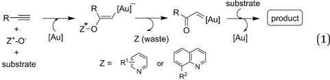

Access to the related a -imino gold carbenes via gold-catalyzed nitrene transfer to alkynes, however, remains a highly challenging task. Here, it should be noted that: (1) the nitrene moiety is delivered via an outer sphere attack and no gold nitrene complex 6 is involved in this case; this mode of nitrene transfer is distinctively di ff erent from many well-established nitrene transfer reactions; 7 (2) this protocol would present alkynes as equivalents of a -diazo imines, which are di ffi cult to access as a -diazo imines can readily cyclize into the corresponding 1,2,3-triazoles. To date, only limited success has been achieved in this type of gold-catalyzed nitrene transfer, mainly by the intramolecular reaction of alkyne and azide. 8 For example, Toste and co-workers used azide as an e ff ective nitrene equivalent and realized the  rst protocol for the generation of a -imino gold carbenes in 2005. 8 a Later, elegant studies on the synthesis of indoles from alkynyl azides were demonstrated by Gagosz 8 c and Zhang, 8 d independently. Recently, several studies have invoked the intermolecular transfer of nitrene to alkynes

Open Access Al

GP,

N

MS.N

R'

HN

1a

H

1

NaL (20)

O-N

H2N

R3

R':

OH

O

PG [Au]

RIN.

R2

HO,C

PG (Au])

- [Au]

но-

O.

- NH

DCE

//NH2

R4

reaction conditions

Ph.

R?

GP

N7

MS N

\_R4

-R3

R4

by the use of iminopyridinium ylides as nitrene-transfer reagents, as disclosed by the groups of Zhang, 9 a Davies, 9 b , c and Liu. 9 d However, similar to those of the above-mentioned goldcatalyzed intermolecular alkyne oxidations, a stoichiometric amount of pyridine was produced as the waste in these cases. Therefore, the exploration of intermolecular approaches to the generation of a -imino gold carbenes, especially in an atomeconomic way, is very attractive to researchers. We envisioned that the a -imino gold carbene intermediate B might be generated through the gold-catalyzed intermolecular reaction of ynamides 1 10 with isoxazoles 2 , which could be obtained in an e ffi cient and modular manner following the synthetic routes shown in eqn (3) and (4) in Scheme 1. 11 The carbene B , likely highly electrophilic, could then undergo an electrophilic cyclization to yield the  nal 2-aminopyrroles 3 , thus constituting a gold-catalyzed formal [3+2] cycloaddition (Scheme 1, eqn (2)). Herein, we report the successful implementation of this mechanistic design to a facile and practical synthesis of a wide range of polysubstituted 2-aminopyrroles, which are common structural motifs found in natural products and pharmacologically active molecules (Fig. 1) 12 and are di ffi cult to access via traditional methods for pyrrole synthesis. 13 Most importantly, an a -imino gold carbene is most likely generated as the key intermediate on the basis of both mechanistic studies and theoretical calculations, thereby providing a strategically-novel, atom-economic route to the generation of gold carbenes.

## Results and discussion

At the outset, ynamide 1a and 3,5-dimethylisoxazole 2a were used as the reacting species and a series of experiments were performed in order to validate our approach. To our delight, the expected product 3a was indeed formed in 70% 1 HNMRyield in the presence of 5 mol% IPrAuNTf2 (Table 1, entry 1). Then, various typical gold catalysts with a range of electronic and steric characteristics were screened (Table 1, entries 2 -7), and ( Ar O)3PAuNTf2 ( Ar ¼ 2,4-ditert -butylphenyl) gave the best yield of the desired product (Table 1, entry 7). Somewhat surprisingly, AgNTf2 could also catalyze this reaction in 50% yield (Table 1, entry 8). Notably, without a metal catalyst, the reaction failed to give even a trace of 3a , and PtCl2 and Zn(OTf)2 were not e ff ective in promoting this reaction (Table 1, entries 9 -10). 14 The reaction

Scheme 1 Synthetic design for the atom-economic generation of a -imino gold carbenes: formation of 2-aminopyrroles 3 through goldcatalyzed formal [3+2] cycloaddition between ynamides 1 and isoxazoles 2 .

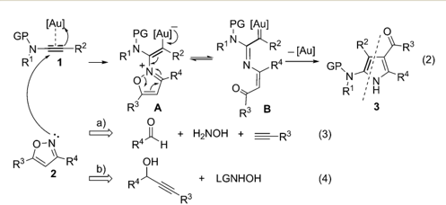

|

NH2

NH

(2)

Fig. 1 2-Aminopyrrole subunit in natural products and bioactive molecules.

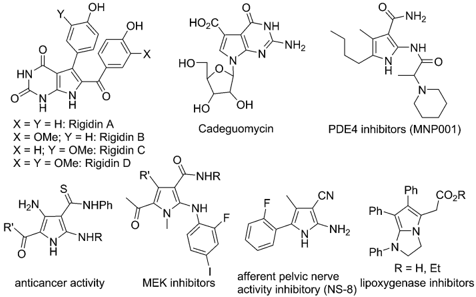

proved to be less e ffi cient when it was performed at a reduced temperature (Table 1, entry 11). In addition, the use of 2 equiv. of 2a also gave the desired pyrrole 3a in 90% yield (Table 1, entry 12).

With the optimized reaction conditions in hand, the scope of the transformation was explored. As seen from the results collected in Table 2, the reaction proceeded smoothly with various ynamide substrates 1 , and the yields ranged from 58% to 96%. For example, ynamides with di ff erent protecting groups, even the Ns group (Table 2, entries 4 -5), readily gave the desired 2-aminopyrroles 3a -f (Table 2, entries 1 -6). Of note, an excellent yield could be achieved in the case of an ynamide with an oxazolidinone moiety and no dimerization reaction was observed (Table 2, entry 6). 15 When R 1 is an allyl group, the

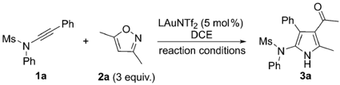

Table 1 Optimization of reaction conditions a

| Entry   | Metal catalyst       | Conditions   | Yield b (%)   |
|---------|----------------------|--------------|---------------|
| 1       | IPrAuNTf 2           | DCE, 80  C, 3 h              | 70            |
| 2       | Ph 3 PAuNTf 2        | DCE, 80  C, 3 h              | 69            |
| 3       | Et 3 PAuNTf 2        | DCE, 80  C, 3 h              | 54            |
| 4       | Cy-JohnPhosAuNTf 2   | DCE, 80  C, 3 h              | 71            |
| 5       | BrettPhosAuNTf 2     | DCE, 80  C, 12 h              | 27            |
| 6       | Au(III) c            | DCE, 80  C, 3 h              | 34            |
| 7       | ( Ar O) 3 PAuNTf 2 d | DCE, 80  C, 3 h              | 95            |
| 8       | AgNTf 2              | DCE, 80  C, 3 h              | 50            |
| 9 e     | PtCl 2               | toluene, 80  C, 3 h              | <5            |
| 10 e    | Zn(OTf) 2 (10 mol%)  | DCE, 80  C, 3 h              | <5            |
| 11      | ( Ar O) 3 PAuNTf 2 d | DCE, 60  C, 5 h              | 75            |
| 12 f    | ( Ar O) 3 PAuNTf 2 d | DCE, 80  C, 3 h              | 90            |

Open Access Al

PG.N

NaL (20)

R'

MS-N

1

1i

Ph

MS.N.

Ph

Ph

I

MS.N

(1) 3a, 89%

(1) 30,83%

Ph.

Ph

H

N

(4) 3r, 76%

Ph.

Ph

(7) 3u, 95%

(9) 3i, 95%

Ph.

(10) 3x, 90%

Bn

(12) 31, 95%

R2

(Aro)3PAuNT2 (5mol%)

R2

Ph.

DCE, 80 °C, 3 h

N

H

N

PG.

N

(ArO)3PAuNTf2 (5 mol%)

DCE, 80 °C, 3 h

MS.N-

Ac

·R'

R2

Table 2 Reaction scope for di ff erent ynamides 1 a

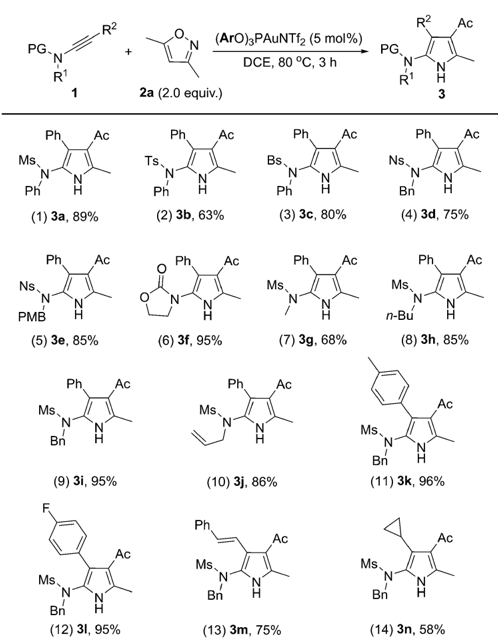

desired 3j could also be formed in 86% yield, and no cyclopropanation product was formed (Table 2, entry 10). 16,5 g Other aryl-substituted ynamides were also suitable substrates for this reaction, giving the corresponding functionalized pyrroles 3k -l in excellent yields (Table 2, entries 11 -12). Interestingly, for styryl or cyclopropyl-substituted ynamides, this reaction still led to 75% yield and 58% yield, respectively (Table 2, entries 13 -14). The molecular structure of 3a was further con  rmed by X-ray di ff raction (Fig. 2). 17

We next extended the reaction to di ff erent 3,5-disubstituted isoxazoles 2 . To our delight, the reaction of ynamide 1i with various isoxazole substrates 2 worked well under the above

Fig. 2 Crystal structure of compound 3a .

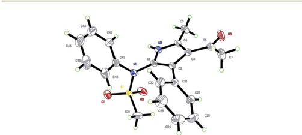

optimized reaction conditions, giving versatile polysubstituted 2-aminopyrroles 3o -z in generally good to excellent yields. As summarized in Table 3, a range of aryl-substituted isoxazoles 2c -g were successful (R 2 ¼ aryl), delivering the desired 3p -t in 72 -96% yield (Table 3, entries 2 -6). In addition, when R 1 is an aryl group, the reaction also worked well to a ff ord the corresponding pyrroles 3v -w in excellent yields (Table 3, entries 8 -9). Pleasingly, methyl 3-pyrrolecarboxylate 3x was formed in 90% yield from the corresponding isoxazole (Table 3, entry 10). It should be mentioned that 3-formylpyrroles 3y -z could also be prepared in serviceable yields (Table 3, entries 11 -12).

Interestingly, when the scope of the method was extended to fully-substituted isoxazoles 4 , the reaction also proceeded well, allowing the convenient synthesis of deacylated polysubstituted 2-aminopyrroles 5 . A series of readily-available substituted ynamides was  rst examined. The corresponding pyrroles 5a -d were obtained in 72 -85% yield (Table 4, entries 1 -4). Then, isoxazoles 4 with substituents at the 4-position were also investigated, giving the products 5e -m in mostly good to excellent yields (Table 4, entries 5 -13). Notably, methyl 3-pyrrolecarboxylate 5n could also be obtained in 77% yield from the corresponding 4-substituted isoxazole, which is complementary to the above protocol based on the 3,5-disubstituted isoxazoles 2 (Table 4, entry 14 vs. Table 3, entry 10). In particular, the 3,4diphenyl substituted isoxazole also reacted smoothly, delivering

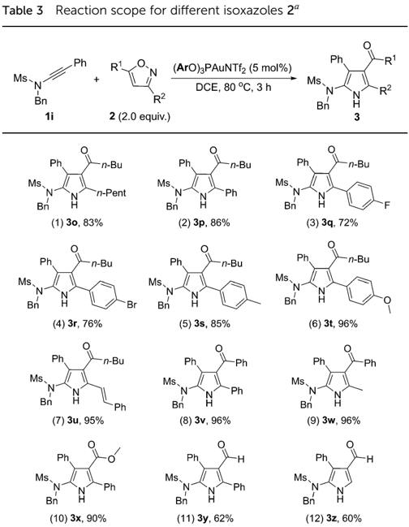

Open Access Al

Ph

MS.N

MS.N

Ph

MS-N

NaL (20)

Ph

Bn

1

1a

MS-N

1p

Ph

Ph

Ph

Ms.

N

pń

Ac

Ac

-n-Bu

H

H

MS N

NS. N

Pń

N

IZ

n-Bu

1)

R3

Ph.

Ph

(ArO)3PAuNTf½ (1 mol %)

(ArO)3PAuNTf2 (5 mol %)

-

R4

DCE, 80 °C, 3 h

Н20, 100 °C, 3 h

(ArO)3PAuNTf2 (5 mol %)

DCE, 80 °C, 5 h

DCE, 80 °C, 3 h

Ph

Table 4 Reaction scope for di ff erent ynamides 1 and 4-substituted isoxazoles 4 a

Ph

Bn

(1) 5a, 78%

Ph

H2N

N

H

Ph

(9) 5i, 95%

Ph

IZ

(12) 51, 83%

Ph

6

1) Mel (5 equiv), K2C03

Ph

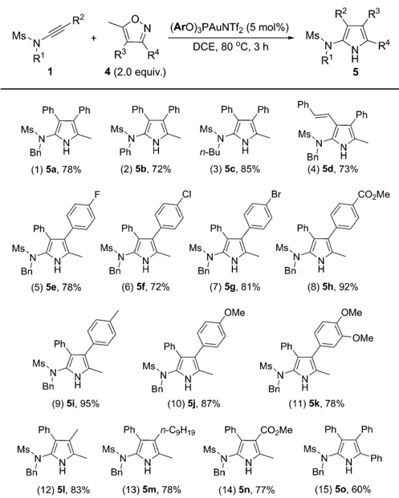

the 3,4,5-triphenyl substituted pyrrole 5o in a respectable 60% yield (Table 4, entry 15).

To further test the practicality of the current catalytic system, a gram-scale reaction of 1.36 g of 1a and 1.07 g of 2a was carried out with a much lower catalyst loading (1 mol%), and 1.72 g of the desired pyrrole 3a was formed in 85% yield, highlighting the synthetic utility of this chemistry (eqn (5)). Interestingly, the reaction could also be performed well even in water to a ff ord the desired product 3a in 80% yield and no hydration of the ynamide was observed (eqn (6)), 10 a -c thus making this protocol more practical and environmentally benign.

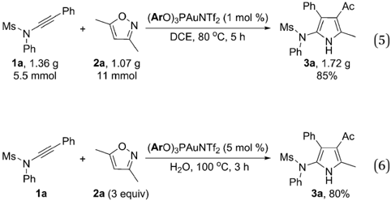

Ph

Ph

Ph

Ph acetone, 70 °C

Ph

NS N

Ph

Ph

R2

Ph

R4

This chemistry can also be used to construct N -heteropyrrolizines, which are present in a variety of bioactive molecules. 18,12 k For example, treatment of ynamide 1p with isoxazole 4a under the optimized reaction conditions gave the pyrrole 5p , which could be converted into fused 2-aminopyrrole 6 in basic conditions in a one-pot process (63% two-step overall yield, eqn (7)). Compound 6 might serve as a precursor for the synthesis of lipoxygenase inhibitors (Fig. 1). 12 k

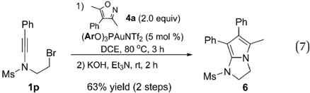

The sulfonamide could be readily transformed into a free amine (Scheme 2). For example, the reaction of ynamide 1d with isoxazole 2c under the optimized reaction conditions furnished pyrrole 7 in 81% yield. Nitrogen protection of 7 with a methyl group and subsequent removal of the Ns group using the standard conditions (PhSH, K2CO3) resulted in the formation of species 7a (53% two-step overall yield). Subsequent deprotection of the benzyl group in 7a could be realized by performing MnO2-mediated oxidation followed by hydrolysis to a ff ord 7b in 56% yield. 13 e

To probe the mechanism of this reaction, we  rst synthesized the alkyl-substituted ynamide 1q as the alkyl-substituted gold carbene is well-known in the gold-catalyzed cycloisomerizations of enynes; [1,2] hydride shi  followed by elimination of the gold catalyst was involved as the critical deauration step. 1 e ,19 Indeed, as depicted in eqn (8), when ynamide 1q reacted with 2a under the standard reaction conditions, none of the desired pyrrole was detected and a , b -unsaturated amide 8 was isolated in 25% yield. Amide 8 is supposed to be derived from [1,2] hydride shi  followed by elimination of the gold catalyst and subsequent hydrolysis. This result indicated that a gold carbene is most likely generated as the key intermediate in this process. On the other hand, the low chemoselectivity in the case of n -butyl substituted ynamide

Scheme 2 Transformation of a sulfonamide into an amine.

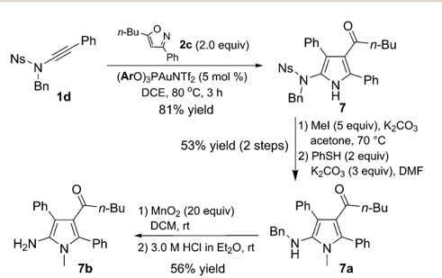

Open Access Al

5 min

GP N

Ms-N

Ph

(R= H)

10 min

1q

(R$H)

NaL (20)

GP.

1 h

N

5

Deacylation

Isomerization

R3

R4

5l'

XR3

-R D =52.0

R2

4 Gsol = 0.0

n-pri

[1-AuL]*

R3

GP

- NH

-R-

+

SUlL

IZ

R2

DCE, 80 °C, 3 h

(

5l'

shows the importance of aryl substituents on the ynamides to keep a high reactivity for the reactions in Tables 2 -4. 20 GP.

51

5l

R2

R4

5l

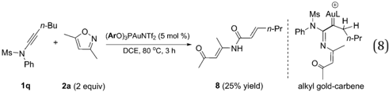

Stal™®

51

2.228

In addition, it was found that a key intermediate 3 H -pyrrole 5l 0 could be detected and isolated in the case of the reaction of ynamide 1i with fully-substituted isoxazole 4i (Table 4, entry 12). To further demonstrate this process, we monitored the reaction by 1 H NMR spectroscopy, as depicted in Fig. 3. Here, the reaction was performed in the presence of 2 mol% ( Ar O)3PAuNTf2 in CDCl3 in order to better track the reaction intermediates. At the early stage of the reaction, we could clearly observe the formation of the 3 H -pyrrole 5l 0 , which was gradually transformed into the  nal 1 H -pyrrole 5l .

A plausible mechanism to rationalize the formation of pyrrole 3 or 5 is illustrated in Scheme 3, in light of the above experimental observations and density functional theory (DFT) computations (see ESI † for details). 21 Initially, nucleophilic attack of isoxazole 2 or 4 to the Au(I)-ligated alkyne of ynamide 1 forms vinyl gold intermediate A by overcoming a moderate barrier (12.2 kcal mol  1 ). Intermediate A isomerizes into the gold carbene intermediate B upon breakage of the isoxalic N -O bond, 22 again requiring an activation energy around 12.0 kcal mol  1 . Subsequent 1,5-cyclization 23 within intermediate B readily occurs to a ff ord the Au(I)-ligated 3 H -pyrrole C , which upon ligand exchange with another ynamide 1 releases 3 H -pyrrole D . The whole process is highly exothermic with free energy release amounting to 52 kcal mol  1 . For 3,5-

Fig. 3 1 H NMR monitoring of the reaction of ynamide 1i with fullysubstituted isoxazole 4i .

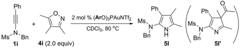

C -46.1

Cycloadditon

R

R° B -11.8

4 h

Bn

R3COOH

Ms AuL

O-N

H

2 or 4

-H

R4

n-Pr

Scheme 3 Plausible reaction mechanism. Theoretical investigations on the reaction pathways for the formation of product 3g (Table 2, entry 7): relative free energies ( D G sol, in kcal mol  1 ) of key intermediates and transition states were computed at the M06/6-31+G(d)/SDD level in 1,2-dichloroethane at 298 K.

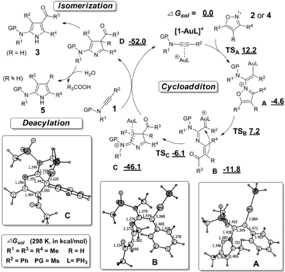

disubstituted isoxazoles 2 , 3 H -pyrrole D readily isomerizes into the  nal aromatic 1 H -pyrrole 3 by sigmatropic H-migrations. 24 In the case of fully-substituted isoxazole substrates 4 , D is ultimately transformed into the  nal 1 H -pyrrole 5 , presumably by a water-assisted deacylative aromatization. 25

## Conclusions

In summary, we have developed a novel gold-catalyzed formal [3+2] cycloaddition between ynamides and isoxazoles, leading to the concise and  exible synthesis of polysubstituted 2-aminopyrroles. This methodology makes it possible to introduce four substituents onto a pyrrole ring very freely with high e ffi ciency. Of particular interest, fully substituted isoxazoles also react under deacylation, closing a further gap in the reaction scope. Moreover, an a -imino gold carbene is the most likely intermediate based on both mechanistic studies and theoretical calculations, thus providing a new strategy for the generation of gold carbenes, especially in an atom-economic way. Studies to elucidate the detailed mechanism and further synthetic applications of the current protocol are in progress in our laboratory.

## Acknowledgements

We are grateful for the  nancial support from NSFC (no. 21102119, 21273177 and 21272191), RFDP (20130121110004), NFFTBS (no. J1310024), and the Program for Changjiang Scholars and Innovative Research Team in University.

## Notes and references

- 1 For reviews, see: ( a ) L. Fensterbank and M. Malacria, Acc. Chem. Res. , 2014, 47 , 953; ( b ) C. Obradors and A. M. Echavarren, Acc. Chem. Res. , 2014, 47 , 902; ( c ) C. Obradors and A. M. Echavarren, Chem. Commun. , 2014, 50 , 16; ( d ) A. S. K. Hashmi, Angew. Chem., Int. Ed. , 2010, 49 , 5232; ( e ) E. Jim´ enez-N´ u ˜ nez and A. M. Echavarren, Chem. Rev. , 2008, 108 , 3326; ( f ) A. S. K. Hashmi, Chem. Rev. , 2007, 107 , 3180; ( g ) A. F¨ urstner and P. W. Davies, Angew. Chem., Int. Ed. , 2007, 46 , 3410.
- 2 ( a ) N. D. Shapiro and F. D. Toste, J. Am. Chem. Soc. , 2007, 129 , 4160; ( b ) G. Li and L. Zhang, Angew. Chem., Int. Ed. , 2007, 46 , 5156; for reviews, see: ( c ) J. Xiao and X. Li, Angew. Chem., Int. Ed. , 2011, 50 , 7226; ( d ) L. Zhang, Acc. Chem. Res. , 2014, 47 , 877; ( e ) H.-S. Yeom and S. Shin, Acc. Chem. Res. , 2014, 47 , 966.
- 3 For recent representative examples on gold-catalyzed intermolecular alkyne oxidation, see: ( a ) J. Schulz, L. Ja ˇ s´ ı kov´ a, A. ˇ Skr´ ı ba and J. Roithov´ a, J. Am. Chem. Soc. , 2014, 136 , 11513; ( b ) L. Li, C. Shu, B. Zhou, Y.-F. Yu, X.-Y. Xiao and L.-W. Ye, Chem. Sci. , 2014, 5 , 4057; ( c ) F. Pan, S. Liu, C. Shu, R.-K. Lin, Y.-F. Yu, J.-M. Zhou and L.-W. Ye, Chem. Commun. , 2014, 50 , 10726; ( d ) S. N. Karad and R.-S. Liu, Angew. Chem., Int. Ed. , 2014, 53 , 5444; ( e ) T. Wang, S. Shi, M. M. Hansmann, E. Rettenmeier, M. Rudolph and A. S. K. Hashmi, Angew. Chem., Int. Ed. , 2014, 53 , 3715; ( f ) T. Wang, S. Shi, M. Rudolph and A. S. K. Hashmi, Adv. Synth. Catal. , 2014, 356 , 2337; ( g ) M. D. Santos and P. W. Davies, Chem. Commun. , 2014, 50 , 6001; ( h ) J. Li, K. Ji, R. Zheng, J. Nelson and L. Zhang, Chem. Commun. , 2014, 50 , 4130; ( i ) G. Wu, R. Zheng, J. Nelson and L. Zhang, Adv. Synth. Catal. , 2014, 356 , 1229; ( j ) P. N¨ osel, L. N. dos Santos Comprido, T. Lauterbach, M. Rudolph, F. Rominger and A. S. K. Hashmi, J. Am. Chem. Soc. , 2013, 135 , 15662; ( k ) L. Wang, X. Xie and Y. Liu, Angew. Chem., Int. Ed. , 2013, 52 , 13302; ( l ) S. K. Pawar, C.-D. Wang, S. Bhunia, A. M. Jadhav and R.-S. Liu, Angew. Chem., Int. Ed. , 2013, 52 , 7559; ( m ) K. Ji, Y. Zhao and L. Zhang, Angew. Chem., Int. Ed. , 2013, 52 , 6508; ( n ) G. Henrion, T. E. J. Chava, X. Le Go ff and F. Gagosz, Angew. Chem., Int. Ed. , 2013, 52 , 6277; ( o ) S. Ghorpade, M.-D. Su and R.-S. Liu, Angew. Chem., Int. Ed. , 2013, 52 , 4229.
- 4 For examples on the utilization of the side products, see: ( a ) E. P. A. Talbot, M. Richardson, J. M. McKenna and F. D. Toste, Adv. Synth. Catal. , 2014, 356 , 687; ( b ) D. B. Huple, S. Ghorpade and R.-S. Liu, Chem. -Eur. J. , 2013, 19 , 12965; ( c ) A. Mukherjee, R. B. Dateer, R. Chaudhuri, S. Bhunia, S. N. Karad and R.-S. Liu, J. Am. Chem. Soc. , 2011, 133 , 15372.
- 5 To avoid catalyst deactivation by the byproduct pyridine or quinoline, acid has to be used as the additive in some cases. See: ( a ) C. Shu, L. Li, X.-Y. Xiao, Y.-F. Yu, Y.-F. Ping, J.-M. Zhou and L.-W. Ye, Chem. Commun. , 2014, 50 , 8689; ( b ) C. Shu, L. Li, Y.-F. Yu, S. Jiang and L.-W. Ye, Chem. Commun. , 2014, 50 , 2522; ( c ) S. Shi, T. Wang, W. Yang,

|

- M. Rudolph and A. S. K. Hashmi, Chem. -Eur. J. , 2013, 19 , 6576; ( d ) A. S. K. Hashmi, T. Wang, S. Shi and M. Rudolph, J. Org. Chem. , 2012, 77 , 7761; ( e ) M. Xu, T.-T. Ren and C.-Y. Li, Org. Lett. , 2012, 14 , 4902; ( f ) W. He, L. Xie, Y. Xu, J. Xiang and L. Zhang, Org. Biomol. Chem. , 2012, 10 , 3168; ( g ) D. Qian and J. Zhang, Chem. Commun. , 2011, 47 , 11152; ( h ) Y. Luo, G. Zhang, E. S. Hwang, T. A. Wilcoxon and L. Zhang, Beilstein J. Org. Chem. , 2011, 7 , 596; ( i ) L. Ye, W. He and L. Zhang, J. Am. Chem. Soc. , 2010, 132 , 8550; ( j ) L. Ye, L. Cui, G. Zhang and L. Zhang, J. Am. Chem. Soc. , 2010, 132 , 3258.
2. 6 ( a ) Z. Li, D. A. Capretto, R. O. Rahaman and C. He, J. Am. Chem. Soc. , 2007, 129 , 12058; ( b ) Z. Li, X. Ding and C. He, J. Org. Chem. , 2006, 71 , 5876.
3. 7 For selected reviews, see: ( a ) S. Fantauzzi, A. Caselli and E. Gallo, Dalton Trans. , 2009, 5434; ( b ) M. M. Diaz-Requejo and P. J. Perez, Chem. Rev. , 2008, 108 , 3379; ( c ) P. Mueller and C. Fruit, Chem. Rev. , 2003, 103 , 2905.
4. 8 ( a ) D. J. Gorin, N. R. Davis and F. D. Toste, J. Am. Chem. Soc. , 2005, 127 , 11260; ( b ) N. D. Shapiro and F. D. Toste, J. Am. Chem. Soc. , 2007, 129 , 4160; ( c ) A. Wetzel and F. Gagosz, Angew. Chem., Int. Ed. , 2011, 50 , 7354; ( d ) B. Lu, Y. Luo, L. Liu, L. Ye, Y. Wang and L. Zhang, Angew. Chem., Int. Ed. , 2011, 50 , 8358; ( e ) Y. Xiao and L. Zhang, Org. Lett. , 2012, 14 , 4662; ( f ) Z.-Y. Yan, Y. Xiao and L. Zhang, Angew. Chem., Int. Ed. , 2012, 51 , 8624; ( g ) Y. Tokimizu, S. Oishi, N. Fujii and H. Ohno, Org. Lett. , 2014, 16 , 3138; ( h ) During the preparation of this manuscript, an intramolecular reaction between alkyne and 2 H -azirine groups was reported: A. Prechter, G. Henrion, P. F. dit Bel and F. Gagosz, Angew. Chem., Int. Ed. , 2014, 53 , 4959.
5. 9 ( a ) C. Li and L. Zhang, Org. Lett. , 2011, 13 , 1738; ( b ) P. W. Davies, A. Cremonesi and L. Dumitrescu, Angew. Chem., Int. Ed. , 2011, 50 , 8931; ( c ) E. Chatzopoulou and P. W. Davies, Chem. Commun. , 2013, 49 , 8617; ( d ) H.-H. Hung, Y.-C. Liao and R.-S. Liu, J. Org. Chem. , 2013, 78 , 7970.
6. 10 For recent reviews on ynamide reactivity, see: ( a ) X.-N. Wang, H.-S. Yeom, L.-C. Fang, S. He, Z.-X. Ma, B. L. Kedrowski and R. P. Hsung, Acc. Chem. Res. , 2014, 47 , 560; ( b ) K. A. DeKorver, H. Li, A. G. Lohse, R. Hayashi, Z. Lu, Y. Zhang and R. P. Hsung, Chem. Rev. , 2010, 110 , 5064; ( c ) G. Evano, A. Coste and K. Jouvin, Angew. Chem., Int. Ed. , 2010, 49 , 2840; for recent selected examples on the goldcatalyzed reactions of ynamides, see: ( d ) S. K. Pawar, D. Vasu and R.-S. Liu, Adv. Synth. Catal. , 2014, 356 , 2411; ( e ) E. Rettenmeier, A. M. Schuster, M. Rudolph, F. Rominger, C. A. Gade and A. S. K. Hashmi, Angew. Chem., Int. Ed. , 2013, 52 , 5880; ( f ) S. J. He ff ernan, J. M. Beddoes, M. F. Mahon, A. J. Hennessy and D. R. Carbery, Chem. Commun. , 2013, 49 , 2314; ( g ) S. N. Karad, S. Bhunia and R.-S. Liu, Angew. Chem., Int. Ed. , 2012, 51 , 8722; ( h ) R. B. Dateer, B. S. Shaibu and R.-S. Liu, Angew. Chem., Int. Ed. , 2012, 51 , 113; ( i ) R. B. Dateer, K. Pati and R.-S. Liu, Chem. Commun. , 2012, 48 , 7200.
7. 11 ( a ) T. M. V. D. Pinho e Melo, Curr. Org. Chem. , 2005, 9 , 925; ( b ) T. V. Hansen, P. Wu and V. V. Fokin, J. Org. Chem. , 2005,

- 70 , 7761; ( c ) S. Tang, J. He, Y. Sun, L. He and X. She, Org. Lett. , 2009, 11 , 3982; ( d ) O. Debleds, E. Gayon, E. Ostaszuk, E. Vrancken and J.-M. Campagne, Chem. -Eur. J. , 2010, 16 , 12207; ( e ) A. G. Griesbeck, M. Franke, J. Neud¨ or  and H. Kotaka, Beilstein J. Org. Chem. , 2011, 7 , 127.
- 12 For selected examples, see: ( a ) T. B. Kumar, C. Sumanth, S. Vaishaly, M. S. Rao, K. B. C. Sekhar, C. L. T. Meda, A. Kandale, D. Rambabu, G. R. Krishna, C. M. Reddy, K. S. Kumar, K. V. L. Parsa and M. Pal, Bioorg. Med. Chem. Lett. , 2012, 22 , 5639; ( b ) L. V. Frolova, N. M. Evdokimov, K. Hayden, I. Malik, S. Rogelj, A. Kornienko and I. V. Magedov, Org. Lett. , 2011, 13 , 1118; ( c ) H. B. Jalani, A. N. Pandya, A. B. Baraiya, J. C. Kaila, D. H. Pandya, J. A. Sharma, V. Sudarsanam and K. K. Vasu, Tetrahedron Lett. , 2011, 52 , 6331; ( d ) M. B. Wallace, M. E. Adams, T. Kanouni, C. D. Mol, D. R. Dougan, V. A. Feher, S. M. O'Connell, L. Shi, P. Halkowycz and Q. Dong, Bioorg. Med. Chem. Lett. , 2010, 20 , 4156; ( e ) V. Onnis, A. De Log, M. T. Cocco, R. Fadda, R. Meleddu and C. Congiu, Eur. J. Med. Chem. , 2009, 44 , 1288; ( f ) M. T. Migawa, J. C. Drach and L. B. Townsend, J. Med. Chem. , 2005, 48 , 3840; ( g ) A. Lauria, M. Bruno, P. Diana, P. Barraja, A. Montalbano, G. Cirrincione, G. Dattolo and A. M. Almerico, Bioorg. Med. Chem. , 2005, 13 , 1545; ( h ) M. T. Cocco, C. Congiu and V. Onnis, Bioorg. Med. Chem. , 2003, 11 , 495; ( i ) M. Tanaka, Y. Sasaki, Y. Kimura, T. Fukui and Y. Ukai, BJU Int. , 2003, 92 , 1031; ( j ) C. E. Stephens, T. M. Felder, J. W. Sowell Sr, G. Andrei, J. Balzarini, R. Snoeck and E. D. Clercq, Bioorg. Med. Chem. , 2001, 9 , 1123; ( k ) S. Laufer, H. G. Striegel and G. Dannhardt, Ger. Off en. DE 44 19 315A1, 1995; ( l ) S. M. Bennet, N. Nguyen-Ba and K. K. Ogilvie, J. Med. Chem. , 1990, 33 , 2162; ( m ) J. Kobayshi, J. Cheng, Y. Kikuchi, M. Ishibashi, S. Yamamura, Y. Ohizumi, T. Ohta and S. Nozoe, Tetrahedron Lett. , 1990, 31 , 4617.
- 13 For recent examples on 2-aminopyrrole synthesis, see: ( a ) X. Qi, H. Xiang, Q. He and C. Yang, Org. Lett. , 2014, 16 , 4186; ( b ) X. Wang, X.-P. Xu, S.-Y. Wang, W. Zhou and S.-J. Ji, Org. Lett. , 2013, 15 , 4246; ( c ) W. Yu, W. Chen, S. Liu, J. Shao, Z. Shao, H. Lin and Y. Yu, Tetrahedron , 2013, 69 , 1953; ( d ) L. V. Frolova, N. M. Evdokimov, K. Hayden, I. Malik, S. Rogelj, A. Kornienko and I. V. Magedov, Org. Lett. , 2011, 13 , 1118; ( e ) P. Fontaine, G. Masson and J. Zhu, Org. Lett. , 2009, 11 , 1555; ( f ) E. Barnea, S. Majumder, R. J. Staples and A. L. Odom, Organometallics , 2009, 28 , 3876; ( g ) T.-C. Chien, E. A. Meade, J. M. Hinkley and L. B. Townsend, Org. Lett. ,
- 2004, 6 , 2857; ( h ) V. Nair, A. U. Vinod and C. Rajesh, J. Org. Chem. , 2001, 66 , 4427.
- 14 For recent Zn(OTf)2-catalyzed metathesis reactions between 3en -1-ynamides and nitrosoarenes, see: S. A. Gawade, D. B. Huple and R.-S. Liu, J. Am. Chem. Soc. , 2014, 136 , 2978.
- 15 S. Kramer, Y. Odabachian, J. Overgaard, M. Rottl¨ ander, F. Gagosz and T. Skrydstrup, Angew. Chem., Int. Ed. , 2011, 50 , 5090.
- 16 For examples on gold-catalyzed oxidative-cyclopropanation, see: ( a ) K.-B. Wang, R.-Q. Ran, S.-D. Xiu and C.-Y. Li, Org. Lett. , 2013, 15 , 2374; ( b ) D. Vasu, H.-H. Hung, S. Bhunia, S. A. Gawade, A. Das and R.-S. Liu, Angew. Chem., Int. Ed. , 2011, 50 , 6911.

## 17 ESI. †

- 18 ( a ) Z. Li, X. Xu, Z. Ye, X. Qian, X. Shao, Z. Xu, B. Zeng and G. Song, PCT Int. Appl. WO 2013007168A1, 2013; ( b ) H. B. Lowman and S. Liu, PCT Int. Appl. WO 2013192546A1, 2013; ( c ) W. G. Kerr, PCT Int. Appl. WO 2010045199A2, 2010; ( d ) A. Lagrange, PCT Int. Appl. WO 2007071686A1, 2007; ( e ) J. Cotteret and A. Lagrange, Eur. Pat. Appl. EP 1428510A1, 2004; ( f ) T. D. Mckee and R. K. Suto, PCT Int. Appl. WO 2003073999A2, 2003; ( g ) G. Lang, PCT Int. Appl. WO 2001066071A1, 2001; ( h ) M. P. Audousset, Eur. Pat. Appl. EP 1002520A1, 2000; ( i ) L. Vidal and G. Malle, PCT Int. Appl. WO 9735554A1, 1997.
- 19 ( a ) L. Zhang, J. Sun and S. A. Kozmin, Adv. Synth. Catal. , 2006, 348 , 2271; ( b ) P. W. Davies, A. Cremonesi and N. Martin, Chem. Commun. , 2011, 47 , 379; ( c ) B. Lu, C. Li and L. Zhang, J. Am. Chem. Soc. , 2010, 132 , 14070.

20 The DFT studies on substituent e ff ects are given in the ESI.

†

- 21 For theoretical calculations involving a -oxo gold carbenes, see: ( a ) J. Schulz, L. Ja ˇ s´ ı kov´ a, A. ˇ Skr´ ı ba and J. Roithov´ a, J. Am. Chem. Soc. , 2014, 136 , 11513; ( b ) B. Lu, Y. Li, Y. Wang, D. H. Aue, Y. Luo and L. Zhang, J. Am. Chem. Soc. , 2013, 135 , 8512.
- 22 C. Kashima, N. Mukai, Y. Yamamoto, Y. Tsuda and Y. Omote, Heterocycles , 1977, 7 , 241.
- 23 J. R. Manning and H. M. L. Davies, J. Am. Chem. Soc. , 2008, 130 , 8602.
- 24 W. Friedrichsen, T. Traulsen, J. Elguero and A. R. Katritzky, Adv. Heterocycl. Chem. , 2000, 76 , 85.
- 25 For selected examples of acid-catalyzed deacylation of pyrroles, see: ( a ) A. E. Ondrus, H. ¨ U. Kaniskan and M. Movassaghi, Tetrahedron , 2010, 66 , 4784; ( b ) F. Barrero, J. F. S´ anchez, J. E. Oltra and D. J. Teva, J. Heterocycl. Chem. , 1991, 28 , 939; ( c ) K. M. Smith, M. Miura and H. D. Tabba, J. Org. Chem. , 1983, 48 , 4779.