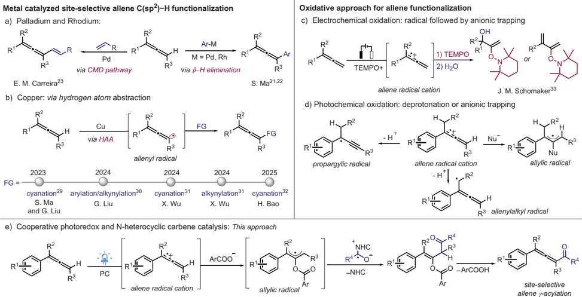
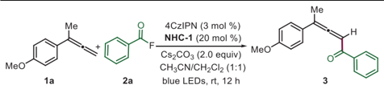
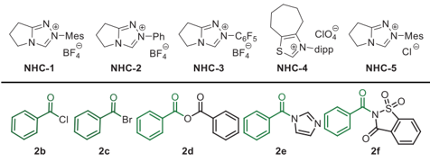
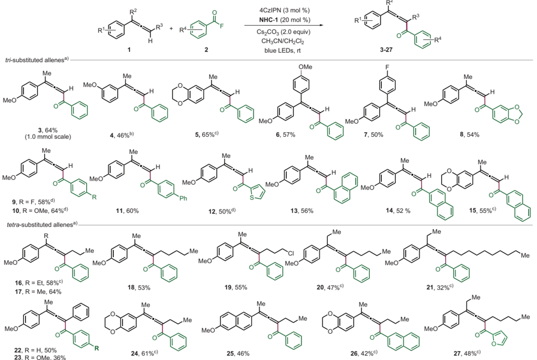
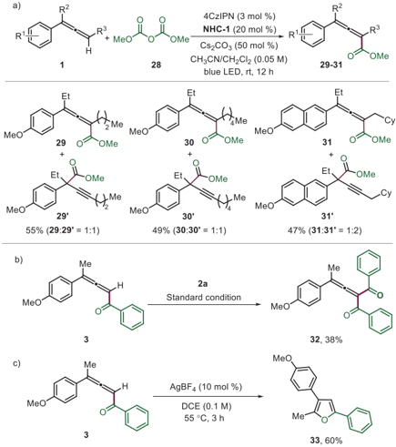
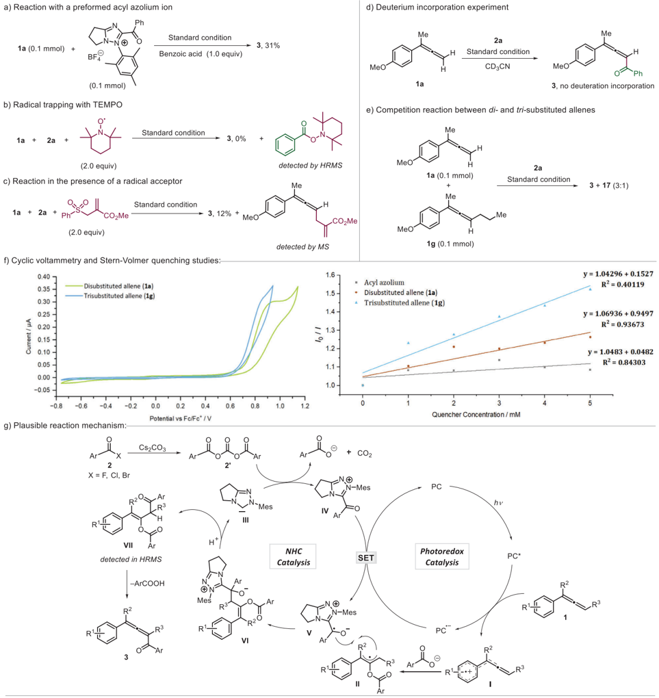

Photocatalysis

## Communication

How to cite: Angew. Chem. Int. Ed. 2025 , 64 , e202511689 doi.org/10.1002/anie.202511689

Hot Paper

## Radical C ─ H-Aroylation of Allenes via Cooperative Photoredox and N -Heterocyclic Carbene Catalysis

Shyam Kumar Banjare, Lena Lezius, and Armido Studer*

Abstract: This study demonstrates the use of cooperative photoredox and N -heterocyclic carbene (NHC) catalysis for sp 2 C ─ H acylation of allenes. The cascade comprises oxidative generation of an allene radical cation from an allene, its nucleophilic trapping to the corresponding allyl radical and highly regioselective cross coupling by a concomitantly reductively generated NHC-derived ketyl type radical. Ionic fragmentation of both the NHC and nucleophile ultimately yields the desired substituted allene. The organic photocatalyst, 4CzIPN, is highly effective in promoting both oxidative and reductive electron transfer steps. Tri- and tetra-substituted allenes can be obtained in good yields through such a cascade. Mechanistic studies-including radical trapping, acylazolium reactions, and Stern-Volmer quenching-support the proposed mechanism. Moreover, follow-up chemistry is conducted to demonstrate the synthetic value of the cascade products.

A llenes are highly valuable and versatile building blocks in organic synthesis. [1-5] Their unique structure features a central sp-hybridized carbon atom connected by two carbon ─ carbon double bonds ( π -bonds). Their reactivity is enhanced compared to other well-known π -systems, such as olefins and alkynes. [6-9] Notably, this structural motif is also present in various natural products and pharmaceutical compounds. [10-14] Furthermore, allenes can be easily converted to multisubstituted furans. [15,16] However, the selective functionalization of sp 2 C ─ H bonds in allenes remains an underdeveloped area. [17,18]

Metal-catalyzed activation of C ─ H bonds is a highly effective and versatile general strategy in organic synthesis for C ─ H functionalization. [19,20] Indeed, such an approach has also been applied to allenes, as shown by Ma who investigated the regioselective C ─ Harylation using palladium and rhodium catalysis through carbometalation/ β -hydride

[*] Dr. S. K. Banjare, L. Lezius, Prof. Dr. A. Studer Chemistry Department, Organisch-Chemisches Institut, Universität Münster, 48149 Münster, Germany E-mail: studer@uni-muenster.de

©2025 The Author(s). Angewandte Chemie International Edition published by Wiley-VCH GmbH. This is an open access article under the terms of the Creative Commons Attribution License, which permits use, distribution and reproduction in any medium, provided the original work is properly cited.

elimination pathways (Figure 1a). [21,22] Further advancements were achieved by Carreira who developed a method for direct γ -selective allene C ─ H olefination, employing a directing group strategy. [23] This approach operates through a concerted metalation-deprotonation (CMD) pathway (Figure 1a). Radical-based methods have also been explored. [24-26] In this context, copper-catalyzed oxidative amination of allene was developed using NFSI by Q. Zhang. [27] Further, copper-catalyzed hydrogen atom abstraction (HAA) processes with reactive heteroatom-centered radicals have been recognized as reliable for generating allenyl radicals. [28] This strategy was successfully employed for the γ -selective C ─ H cyanation of allenes by Lin, Ma, and Liu (Figure 1b). [29] As the cyanation step is mediated by the Cu-catalyst, a few enantioselective cyanations were also disclosed. Applying a similar strategy, γ -arylated allenes and alkynylated allenes can be obtained using aryl boronic acid and alkynes as the coupling partners. [30] Further, Bao and Wu also realized metal-catalyzed site-selective cyanation [31,32] and alkynylation [31] of allenes through radical intermediates.

Asanalternative strategy for allene activation, Schomaker recently investigated electrochemical oxidation, successfully capturing the intermediately generated allene radical cation with the stable TEMPO radical (Figure 1c). [33] Depending on the substituents, allenes possess relatively low oxidation potentials (e.g., 1.29 V vs. Fc/Fc + for buta-2,3-dien-2ylbenzene). [34,35] Unlike in the Schomaker case, the allene radical cations are generally trapped by nucleophiles to give allylic radicals (Figure 1d). This is the common reactivity mode as accumulation of allene radical cations and radicals in solution to achieve a selective radical-radical cross coupling is not likely, unless one radical species is longer lived (persistent radical effect). [24] A third reaction mode is the sp 2 C ─ H deprotonation of the intermediate allene radical cation to generate the corresponding propargylic radical. [36] Finally, if the allene radical cation carries an alkyl substituent, deprotonation at the α -position of the alkyl group might occur to give an allenylalkyl radical. The relatively low oxidation potential of allenes allows them to be oxidized into their radical cations also through photochemical oxidation. [37-40] Over the past decades, photoredox chemistry has emerged as a powerful tool for organic transformations. [41-43] However, the oxidation of allenes through photoredox catalysis is still not well developed. [38] A key challenge is exerting control over the diverse reaction pathways available to intermediate allene radical cations (see Figure 1d).

Herein, we report cooperative photoredox/ N -heterocyclic carbene (NHC) catalysis [44-46] for the formal direct C ─ H aroylation of 1,1-di and trisubstituted allenes with aroyl

## Communication

Figure 1. Different strategies for the functionalization of allenes.

fluorides (Figure 1e). These transformations proceed through regioselective cross-coupling of ketyl radicals [47] generated by single-electron reduction of acylazoliums [44-46] with allylic radicals that are derived from benzoate trapping of allene radical cations. The benzoate nucleophile is generated by the addition of the NHC to the in situ formed bisbenzoyl carbonate intermediate, which is derived from benzoyl fluoride, leading to the formation of an acyl azolium salt. Ionic NHC fragmentation followed by benzoate elimination eventually affords the C ─ Hfunctionalized allenes. Notably, the selective γ -acylation of allenes has not been accomplished to date, representing a significant advancement in synthetic chemistry. This process is of preparative value as acylated allenes are readily further transformed to multisubstituted furans.

Weinitiated our investigation using 1-(buta-2,3-dien-2-yl)4-methoxybenzene 1a as the model substrate, which reveals an oxidation potential of 0.9 V versus Fc/Fc + (refer to Scheme 3f for its cyclic voltammogram, CV). We employed benzoyl fluoride 2a as the coupling partner, applying the organic photocatalyst 4CzIPN (*E1/2red =+ 1.35 V vs. SCE) [48] along with the triazolium salt NHC-1 (20 mol%) as the NHC precatalyst. The cascade reaction was best conducted in a mixture of dichloromethane and acetonitrile (1:1) at room temperature under blue LED irradiation ( λ max = 420 nm) for 12 h using Cs2CO3 as the base (2.0 equivalents) to afford the desired product 3 in 69% yield (Table 1, entry 1). Of note, the allene product derived through benzoylation of the methyl substituent was not observed.

Additionally, we conducted control experiments, including reactions without a photocatalyst and the triazolium salt NHC-1 . In these cases, only trace amounts of the product were observed, showing the necessity of both the NHC and also the photoredox catalyst (Table 1, entries 2,3).

Replacing 4CzIPN by [Ir(dF(CF3)ppy)2(dtbbpy)]PF6 provided a significantly reduced yield (40%, Table 1, entry 4). However, other photocatalysts, such as Ir(ppy)3 and Ru(bpy)3, as well as an acridinium-based catalyst, did not work (Table 1, entries 5-7). We also screened various solvents [49] and noted for aprotic polar solvents such as DMF and DMSO, as well as for the less polar solvents benzene and hexane that C ─ Hbenzoylation of 1a did not proceed (Table 1, entry 8). However, in pure dichloromethane or pure acetonitrile a 49% and 53% yield of 3 was obtained (Table 1, entries 9,10). Additionally, different metal salts and organic bases, such as triethylamine and 1,8-diazabicyclo[5.4.0]undec-7-ene, were screened. However, all these alternatives proved ineffective (Table 1, entry 11). Various NHC precursors, including triazolium and thiazolium salts, were also tested in place of NHC-1 . Most of them were inefficient in providing the targeted product 3 (Table 1, entry 12). As expected, the triazolium chloride salt NHC -5 carrying a different counter anion as compared to NHC -1 delivered 3 in a good yield (64%, Table 1, entry 13). Next, we explored a range of NHC acylation reagents as replacements for benzoyl fluoride. Among these, benzoyl chloride ( 2b ), benzoyl bromide ( 2c ), and benzoic acid anhydride ( 2d ) afforded the desired product 3 in moderate to good yields (Table 1, entries 14-16). However, the N -benzoyl derivatives 2e and 2f turned out to be inefficient (Table 1, entries 17,18). We also observed a side product derived from targeted allene 3 , which, upon further oxidation and trapping, gives rise to the 1,1-diaroylated allene 32 in trace amounts (see Scheme 2b). Additionally, enol ester VII has been detected by HRMS as an additional side product in this and most of the following transformations (see Scheme 3).

Following optimization of the reaction conditions, the scope of the method was investigated (Scheme 1). The

Table 1: Variation of reaction conditions. a)

| Entry   | Deviation from the standard reaction conditions              | b) Yield of 3 (%)   |
|---------|--------------------------------------------------------------|---------------------|
| 1       | none                                                         | 69                  |
| 2       | no photocatalyst                                             | < 5                 |
| 3       | no N-heterocyclic carbene (NHC)                              | < 5                 |
| 4       | [Ir[dF(CF 3 )ppy] 2 (dtbbpy)]PF 6 catalyst instead of 4CzIPN | 40                  |
| 5       | [Ir(ppy) 3 ] catalyst instead of 4CzIPN                      | < 5                 |
| 6       | Ru(bpy) 3 (BF 4 ) 2 catalyst instead of 4CzIPN               | < 5                 |
| 7       | [Acr-Mes]CIO 4 catalyst instead of 4CzIPN                    | < 5                 |
| 8 c)    | other solvents instead of CH 3 CN                            | < 5                 |
| 9       | without CH 2 Cl 2 only CH 3 CN                               | 49                  |
| 10      | without CH 3 CN only CH 2 Cl 2                               | 53                  |
| 11 d)   | other bases instead of Cs 2 CO 3                             | < 5                 |
| 12      | other NHCs-2-4 instead of NHC-1                              | < 5                 |
| 13      | NHC-5 instead of NHC-1                                       | 64                  |
| 14      | with 2b instead of 2a                                        | 66                  |
| 15      | with 2c instead of 2a                                        | 43                  |
| 16      | with 2d instead of 2a                                        | 51                  |
| 17      | with 2e instead of 2a                                        | < 5                 |
| 18      | with 2f instead of 2a                                        | < 5                 |

## Communication

Next, we tested whether tetra-substituted allenes can be accessed through this novel approach. Pleasingly, under the optimized reaction conditions, we were able to obtain the tetra-substituted products 16 and 17 in 58% and 64% yields. Selectivity was excellent as the product derived from a C ─ H benzoylation at the methyl side chain was not observed. The impact of the aliphatic chain was evaluated by replacing the n-propyl by longer linear alkyl chains. Products were formed in all cases and we noted a decrease in the yield as a function of the alkyl chain length (see 18 , 19 , 20, and 21 ). The diarylalkyl substituted allene 1l reacted with 1a and 1i to provide the tetra-substituted allene 22 , 23 in moderate yield. Reaction was general for readily oxidizable trisubstituted allenes carrying electron-rich dimethoxyaryl and naphthyl substituents, yielding products 24 and 25 in 61% and 46%, respectively. Moreover, both 2-naphthoyl fluoride 2m and furan-2-carbonyl fluoride 2n were tolerated, affording the targeted allenes 26 and 27 in moderate yields with high selectivity with respect to the sp 2 C ─ Haroylation.

- a) Reaction conditions: 1a (0.1 mmol), 2a (0.25 mmol), PC (3 mol%), NHC (20 mol%), base (2.0 equivalents). CH3CN/CH2Cl2 (2 mL) under irradiation with blue LEDs. b) Isolated yield.
- c) N , N -dimethylformamide, dimethyl sulfoxide, toluene, hexane.

d) K2CO3, Na2CO3, CaCO3, K2HPO4, Et3N, DBU.

larger-scale synthesis of 3 was possible without compromising yield to a large extent. The meta-methoxyphenyl allene 1b reacted with lower efficiency (see 4 ), but the good yield was restored for the more readily oxidizable allene 3c to give 5 (65%). The protocol is also applicable to 1,1diaryl-substituted allenes as demonstrated by the successful syntheses of 6 and 7 .

We then varied the acylation reagent keeping allene 1a as reaction partner. Benzo[d][1,3]dioxole-5-carbonyl fluoride 2 g provided 8 in 54% yield. With para-methoxy and parafluoro-substituted benzoyl chloride as benzoyl precursors, the desired allenes 9 and 10 were obtained in 58% and 64% yields, respectively. Biphenyl-4-carbonyl fluoride 2j proved effective, providing 11 in 60% isolated yield. Thiophene-2-carbonyl chloride 2k was found to be an eligible acyl donor resulting in a 50% yield of allene 12 . Furthermore, we expanded the reaction scope to include various naphthyl derivatives, delivering the corresponding products in 52%-56% yields ( 13 , 14, and 15 ).

Studies were continued by addressing the allene sp 2 C ─ H alkoxycarbonylation using dimethyl dicarbonate ( 28 ) as C1carbon source (Scheme 2a). Under the conditions optimized for the aroylation, methoxy carbonylation of allene 1f to give 29 was achieved. However, the regioisomeric propargyl compound 29 ′ that could not be separated was formed in equal amounts (55% combined yield). A similar reaction outcome was noted for the methoxy carbonylation of allene 1j to give 30 along with its regioisomer 30 ′ . For allene 1o the propargylic regioisomer 31 ′ was obtained as the major product (1:2) in 47% combined yield. We assume that due to higher basicity of the methoxide that is formed as a byproduct in the reaction of the NHC with dimethyl dicarbonate, deprotonation of the intermediate allene radical cation to give the propargyl radical (see Figure 1d) becomes competitive with the trapping by the nucleophile.

Notably, 1,1-diaroylated allene 32 could be prepared in moderate 38% yield after subjecting the mono-benzoylated allene 3 to the reaction conditions (Scheme 2b). This further indicates that overaroylation can reduce the yield of the C ─ Hfunctionalization of 1,1-disubstituted allenes. To document the synthetic value of the aroylated product allenes, 3 was successfully converted to the trisubstituted furan 33 using a catalytic amount of silver tetrafluoroborate (Scheme 2c). This interesting cascade reaction comprises a 1,2-aryl migration prior to the cyclization step and the furan was formed with exclusive regioselectivity. [50] The limitation of this C ─ H aroylation method lies in its restriction to the functionalization of electron-rich allenes that can easily be oxidized to their radical cations. Thus, 1-aryl-substituted 1-methyl-allenes, such as those containing a 1-para-chlorophenyl ( 1p ), a paracyanophenyl- ( 1q ) or even the phenyl-substituted congener ( 1s ) were not eligible substrates and the starting allenes remained unreacted. Furthermore, sterically bulky tert -butyl trisubstituted allenes ( 1r ) did not react and also monosubstituted para-methoxyphenyl allene 1t failed to yield the desired product (see SI for all failed substrates, Note 4).

Finally, mechanistic studies were conducted. The reaction was performed using an isolated acylazolium ion intermediate under optimized conditions, resulting in trace product

## Communication

Scheme 1. Scope of di- and trisubstituted allenes also varying the aroyl fluoride component. a) The reaction was performed with 1 (0.10 mmol) and 2 (0.25 mmol) under an argon atmosphere for 12 h and isolated yields are provided. b) Reaction time was 24 h. c) Reaction time was 6 h. d) Conducted with the corresponding aroyl chloride.

Scheme 2. a) Scope for alkoxycarbonylation of trisubstituted allene. The reaction was performed with 1 (0.10 mmol) and 28 (0.25 mmol) under an argon atmosphere, and yields were isolated after 12 h. b) Reaction was performed with 3 (0.10 mmol) and 2a (0.25 mmol) under an argon atmosphere for 12 h. c) Synthesis of furan from benzoyl allene 3 (0.10 mmol) and AgBF4 (10 mol%), dichloroethane 1.0 mL at 55 °C.

formation. However, upon addition of 1.0 equivalent of benzoic acid reactivity could be restored and 3 was formed in 31% yield, showing that an acylazolium ion is a likely intermediate of the transformation (Scheme 3a). Furthermore, this experiment also revealed that benzoic acid is required in this cascade to trap the cation. To evaluate the efficiency of cation trapping, various deprotonated acids were tested in the reaction with 1a using the isolated acylazolium ion intermediate as the reaction partner. While the benzoate provided the targeted product allene, deprotonated phosphoric acid, acetic acid, and tosic acid did not work (traces). The reaction was completely suppressed in the presence of 2.0 equivalents of TEMPO (2,2,6,6-tetramethylpiperidineN -oxyl), and the formation of an acyl-TEMPO adduct was confirmed by high-resolution mass spectrometry (HRMS). This observation suggests that radicals are likely involved in the cascade process (Scheme 3b). [51] The reaction of 1a with 2a was repeated under the standard conditions in the presence of the radical acceptor methyl 2-((phenylsulfonyl)methyl)acrylate. Formation of product 3 was significantly suppressed, and the allenylation product was detected by mass spectrometry, suggesting the involvement of radical character at the allene C3-position during the transformation (Scheme 3c). Conducting the reaction in perdeuterated acetonitrile resulted in no deuterium incorporation, indicating that solvent-derived hydrogen atoms or protons do not participate in the reaction mechanism (Scheme 3d). To evaluate the relative reactivity of diand trisubstituted allenes, a competition experiment

Cyclic voltammetry and Stern-Volmer quenching studies:

SET

040 7

0.30 -

Current / uA

0.25

0.20 -

0.15 -

0.10 -

-0.05

-0.8

Plausible reaction mechanism:- y = 1.04296 + 0.1527

R2 = 0.40119

y = 1.06936 + 0.9497

R' = 0.93673

Scheme 3. Mechanistic studies and proposed mechanism.

between 1a and 1 g was performed. The results revealed that the 1,1-disubstituted allene reacts more efficiently, with a product ratio of 3:1 (Scheme 3e). Of note, the Stern-Volmer quenching studies showed preferable oxidation of 1 g over 1a (see Scheme 3f). Thus, the initial allene oxidation does likely not correspond to the rate-determining step of this sequence. Cyclic voltammetry studies suggest that the photocatalyst can oxidize tri-substituted allenes more easily than di-substituted allenes. Furthermore, Stern-Volmer fluorescence quenching experiments indicate that the photocatalytic cycle proceeds via a reductive quenching pathway, as the allenes quench

- Disubstituted allene (1a)

- Trisubstituted allene (1g)

1.6

1.5

1.4

1.3

## Communication

the excited-state photocatalyst more efficiently than the acylazolium salt (Scheme 3f).

Based on these studies and literature reports, [46,52-54] a plausible reaction mechanism is depicted in Scheme 3g. Under blue light irradiation, allene 1 gets oxidized to its radical cation I by the excited 4CzIPN photocatalyst [E1/2 (4CzIPN*/4CzIPN · -) = 1.35 V vs. SCE]. [48] This allene radical cation is then trapped by the carboxylic acid that is formed during acyl azolium salt formation from 2 , Cs2CO3 and the NHC III via 2 ′ to afford the transient allyl radical II . The acylazolium intermediate IV (E1/2 = -0.81 V vs. SCE for

## Communication

Ar = Ph) [55] can then be reduced by the radical anion of the photocatalyst (E1/2 (4CzIPN/4CzIPN · -) = -1.21 V vs. SCE) [48] to give the ketyl type radical V . Selective cross coupling of the ketyl V with the allyl radical II steered by the persistent radical effect [26] leads to intermediate VI . The regioselectivity is likely governed by steric effects. NHC fragmentation completes the NHC catalysis cycle to give the enol ester VII that could be detected by HRMS. Elimination of the aromatic carboxylic acid probably through an E1cBtype elimination process finally provides the isolated C ─ H aroylated allene 3 . [56]

In summary, we have developed a protocol for the selective acylation of allenes under photoredox conditions. The cascade process operates through cooperative NHC and photoredox catalysis. Di- and tri-substituted allenes can be C ─ H aroylated in moderate to good yields. Reactions proceed through allene radical cations that can express diverse reactivity. Despite several options, selectivity towards formation of the di- as well as a tetra-functionalized sp 2 C ─ H allene functionalization product was excellent in most cases. Aroyl fluorides and also aroyl chlorides serve as the acyl donors in these transformations. With dialkyl dicarbonates in place of the acid halides, allene C ─ H alkoxycarbonylation can be achieved. However, in this latter case, selectivity was not complete and α -alkynylated esters were formed as side products. Comprehensive mechanistic studies were conducted to support the proposed reaction pathway. The introduction of these reactions broadens the scope of photoredox and NHC cooperative catalysis, as well as allene functionalization. Incorporating these findings will advance both the understanding and application of radical NHC catalysis as researchers continue to explore new methodologies.

## Author Contributions

S.K.B. ran the experiments. L.L. performed the fluorescence and cyclic voltammetry measurements. S.K.B. and A.S. designed the experiments. All authors approved the final version of the manuscript.

## Acknowledgements

The authors thank the Deutsche Forschungsgemeinschaft (DFG) (STU 280/27-1 and GRK2678-437785492) for supporting this work.

Open access funding enabled and organized by Projekt DEAL.

## Conflict of Interests

The authors declare no conflict of interest.

## Data Availability Statement

The data that support the findings of this study are available in the Supporting Information of this article.

Keywords: Acylation · Allenes · N -heterocyclic carbene · Photocatalysis · Radical reactions

- [1] For selected book chapter and review, see: S. R. Landor, The Chemistry of the Allenes , Academic Press, London, 1982 .
- [2] H. F. Schuter, G. M. Coppola, Allenes in Organic Synthesis , Wiley, New York, 1984 .
- [3] B. Alcaide, P . Almendros, Chem. Soc. Rev. 2014 , 43 , 2886.
- [4] H. H. A. M. Hassan, Curr. Org. Synth. 2007 , 4 , 413-439.
- [5] T. Bai, S. Ma, G. Jia, Coord. Chem. Rev. 2009 , 253 , 423-448.
- [6] For selected book chapter and review, see: S. Patai, The Chemistry of Ketenes, Allenes and Related Compounds , Wiley, New York, 1980 .
- [7] N. Krause, A. S. K. Hashmi, Modern Allene Chemistry , WileyVCH, Weinheim, 2004 .
- [8] C. Bruneau, J. L. Renaud, Allenes and Cumulenes , Vol. 1 , Elsevier, Oxford, 2005 .
- [9] N. Krause, Science of Synthesis 2007 , 44 , Thieme, Stuttgart.
- [10] For selected reviews and papers, see: A. Hoffmann-Röder, N. Krause, Angew. Chem. Int. Ed. 2004 , 43 , 1196-1216; Angew. Chem. 2004 , 116 , 1216-1236.
- [11] S. Ma, Chem. Rev. 2005 , 105 , 2829-2872.
- [12] P. Rivera-Fuentes, F. Diederich, Angew. Chem. Int. Ed. 2012 , 51 , 2818-2828; Angew. Chem. 2012 , 124 , 2872-2882.
- [13] S. Yu, S. Ma, Angew.Chem. Int. Ed. 2012 , 51 , 3074-3112; Angew. Chem. 2012 , 124 ,3128-3167.
- [14] Y.-A. Zhang, N. Yaw, S. A. Snyder, J. Am. Chem. Soc. 2019 , 141 , 7776-7788.
- [15] J. Zemlicka, Nucleosides Nucleotides 1997 , 16 , 1003-1012.
- [16] A. S. Dudnik, V. Gevorgyan, Angew. Chem. 2007 , 119 , 52875289; Angew. Chem. Int. Ed. 2007 , 46 , 5195-5197.
- [17] J. Singh, A. Sharma, A. Sharma, Org. Chem. Front. 2021 , 8 , 5651-5667.
- [18] Y. Liang, J. Feng, H. Li, X. Wang, Y. Zhang, W. Fan, S. Zhang, M.-B.o Li, Angew. Chem. Int. Ed. 2024 , 63 , e202400938.
- [19] For selected review, see: J. H. Docherty, T. M. Lister, G. Mcarthur, M. T. Findlay, P. Domingo-Legarda, J. Kenyon, S. Choudhary, I. Larrosa, Chem. Rev. 2023 , 123 , 7692-7760.
- [20] S. K. Sinha, P . Ghosh, S. Jain, S. Maiti, S. A. Al-Thabati, A. A. Alshehri, M. Mokhtar, D. Maiti, Chem. Soc. Rev. 2023 , 52 , 74617503.
- [21] C. Fu, S. Ma, Org. Lett. 2005 , 7 , 1605-1607.
- [22] R. Zeng, S. Wu, C. Fu, S. Ma, J. Am. Chem. Soc. 2013 , 135 , 18284-18287.
- [23] B. S. Schreib, M. Son, F. A. Aouane, M.-H. Baik, E. M. Carreira, J. Am. Chem. Soc. 2021 , 143 , 21705-21712.
- [24] A. Studer, D. P . Curran, Angew. Chem. Int. Ed. 2016 , 55 , 58-102; Angew. Chem. 2016 , 128 , 58-106.
- [25] G. Qiu, J. Zhang, K. Zhou, J. Wu, Tetrahedron 2018 , 74 , 15781589.
- [26] D. Leifert, A. Studer, Angew. Chem. Int. Ed. 2020 , 59 , 74108.
- [27] G. Zhang, T. Xiong, Z. Wang, G. Xu, X. Wang, Q. Zhang, Angew. Chem. Int. Ed 2015 , 54 , 12649-12653; Angew. Chem. 2015 , 127 , 12840-12844.
- [28] Y. Yu, J. Zhang, Eur. J. Org. Chem. 2022 , 2022 , e202201017.
- [29] Z. Cheng, T. Yang, C. Li, Y. Deng, F. Zhang, P . Chen, Z. Lin, S. Ma, G. Liu, J. Am. Chem. Soc. 2023 , 145 , 25995-26002.
- [30] Z.-M. Cheng, J.-J. Zhang, C. Li, X. Li, P .-H. Chen, G.-S. Liu, J. Am. Chem. Soc. 2024 , 146 , 24689-24698.
- [31] X. Duan, Q. Jin, K. Wang, Y. Sun, Y. Wei, Z. Wang, J.-K. Qiu, K. Guo, X. Bao, X. Wu, ACS Catal. 2024 , 14 , 13219-13226.
- [32] D. Lv, X. Zhu, H. Bao, ACS Catal. 2025 , 15 , 7741-7748.
- [33] K. S. Lee, F. Barbieri, E. Casali, E. T. Marris, G. Zanoni, J. M. Schomaker, J. Am. Chem. Soc. 2025 , 147 , 318-330.

## Communication

- [34] Electrochemical allene oxidation: J. Y. Becker, B. Zinger, Tetrahedron 1982 , 38 , 1677-1682.
- [47] Á. Péter, S. Agasti, O. Knowles, E. Pye, D. J. Procter, Chem. Soc. Rev. 2021 , 50 , 5349-5365.
- [35] G. Schlegel, H. J. Schäfer, Chem. Ber. 1983 , 116 , 960-969.
- [36] Allenyl radicals that are resonance structures of propargylic radicals, see: R. Yi, Q. Li, L.-Y. Xie, W.-T. Wei, Chem. Commun. 2025 , 61 , 6426-6438.
- [37] K. Somekawa, K. Haddaway, P. S. Mariano, J. A. Tossell, J. Am. Chem. Soc. 1984 , 106 , 3060-3062.
- [38] M. W. Klett, R. P . Johnson, J. Am. Chem. Soc. 1985 , 107 , 66156620.
- [39] D. Mangion, D. R. Arnold, T. S. Cameron, K. N. Robertson, J. Chem. Soc., Perkin Trans. 2 2001 , 48-60.
- [40] L. A. Perego, P . Bonilla, P . Melchiorre, Adv. Synth. Catal. 2020 , 362 , 302-307.
- [41] For selected review, see: M. H. Shaw, J. Twilton, D. W. C. MacMillan, J. Org. Chem. 2016 , 81 , 6898-6926.
- [42] N. A. Romero, D. A. Nicewicz, Chem. Rev. 2016 , 116 , 1007510166.
- [43] J. D. Bell, J. A. Murphy, Chem. Soc. Rev. 2021 , 50 , 95409685.
- [44] H. Ohmiya, ACS Catal. 2020 , 10 , 6862-6869.
- [45] K. Liu, M. Schwenzer, A. Studer, ACS Catal. 2022 , 12 , 1198411999.
- [46] A. V. Bay, K. A. Scheidt, Trends Chem 2022 , 4 , 277-290.
- [48] T. Y. Shang, L. H. Lu, Z. Cao, Y. Liu, W. M. He, B. Yu, Chem. Commun. 2019 , 55 , 5408-5419.
- [49] M. A. Bryden, F. Millward, O. S. Lee, L. Cork, M. C. Gather, A. Steffen, E. Zysman-Colman, Chem. Sci. 2024 , 15 , 3741-3757.
- [50] A. S. Dudnik, A. W. Sromek, M. Rubina, J. T. Kim, A. V. Kel'i, V. Gevorgyan, J. Am. Chem. Soc. 2008 , 130 , 1440-1452.
- [51] Q.-Y. Meng, L. Lezius, A. Studer, Nat. Commun. 2021 , 12 , 2068.
- [52] X. Yu, Q.-Y. Meng, C. G. Daniliuc, A. Studer, J. Am. Chem. Soc. 2022 , 144 , 7072-7079.
- [53] N. Döben, J. Reimler, A. Studer, Adv. Synth. Catal. 2022 , 364 , 3348-3353.
- [54] T. Ishii, K. Nagao, H. Ohmiya, Chem. Sci. 2020 , 11 , 5630-5636.
- [55] L. Delfau, S. Nichilo,F. Molton, J. Broggi, E. Tomás-Mendivil, D. Martin, Angew.Chem. Int. Ed. 2021 , 60 , 26783-26789; Angew. Chem. 2021 , 133 ,26987-26993.
- [56] R. J. Armstrong, Curr. Org. Chem. 2019 , 23 , 3027-3039.

Manuscript received: May 28, 2025

Revised manuscript received: June 30, 2025 Accepted manuscript online: July 10, 2025

Version of record online: July 30, 2025