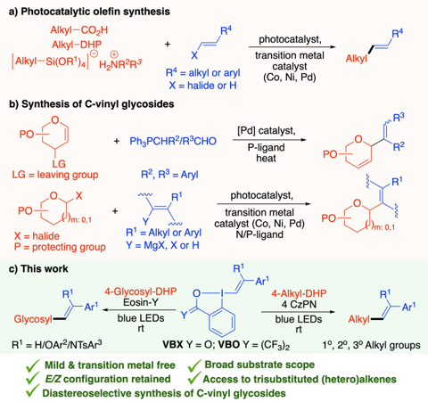
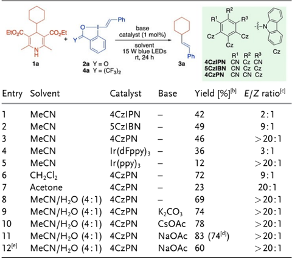
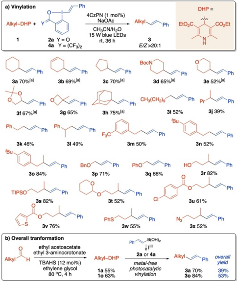
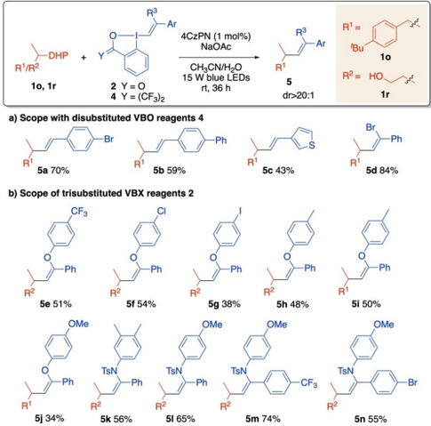
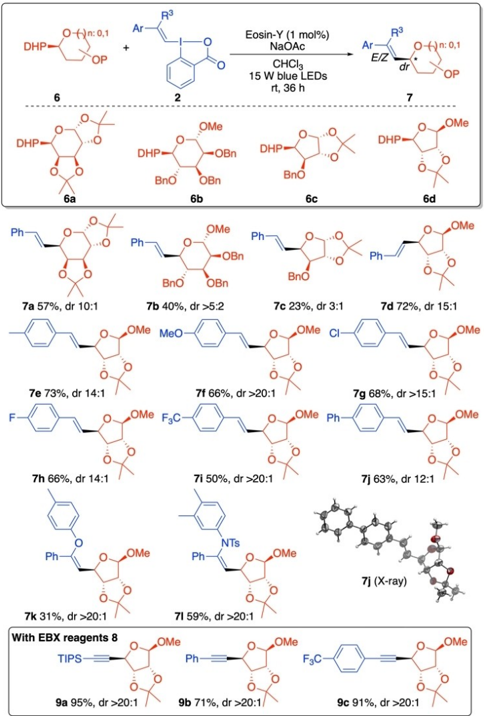
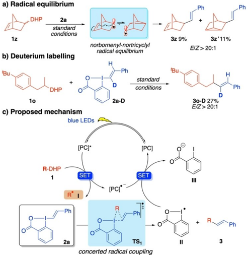
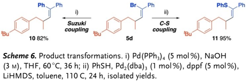

a) Photocatalytic olefin synthesis

GDCh

Alkyl-CO\_H

Alkyl-DHP

R4

+

R* = alkyl or aryl photocatalyst,

transition metal catalyst

X = halide or H

(Co, Ni, Pd)

[Pd] catalyst,

## Research Articles

How to cite: Angew. Chem. Int. Ed. 2023, 62, e202301368 International Edition: doi.org/10.1002/anie.202301368 German Edition: doi.org/10.1002/ange.202301368

R4

M. R3

## Stereospecific Photoredox-Catalyzed Vinylations to Functionalized Alkenes and C -Glycosides**

+

transition metal m: 0,1

Y

PO

Kumar Bhaskar Pal, Ester Maria Di Tommaso, A. Ken Inge, and Berit Olofsson*

R'

PO

LG

PO

X = halide c) This work

R

Glycosyl

4-Glycosyl-DHP

Art

4-Alkyl-DHP

Abstract: We report an efficient radical-mediated C C coupling through photoredox-catalyzed reactions of 4alkyl-dihydropyridines (DHPs) and vinylbenziodoxol(on)es (VBX, VBO). This transition-metal-free and mild photocatalytic method has excellent functional group tolerance and affords vinylated products in good yields, with complete retention of the alkene configuration. The utility of the methodology is demonstrated by the diastereoselective synthesis of C -vinyl glycosides. Preliminary mechanistic studies suggest that the C C bond formation is stereospecific and proceeds through a concerted radical coupling transition state.

## Introduction

Olefins are important substructures in synthetic organic chemistry, polymer chemistry and medicinal chemistry, and are omnipresent in natural products and pharmaceuticals. [1] Also C -vinyl glycosides, which are a central class of vinylated carbohydrates, are present in many natural products and pharmaceuticals. [2] While transition metal catalysis is ubiquitous in alkene synthesis, [3] the achievement of high regioand stereoselectivity, as well as broad functional group tolerance, constitute some of the main synthetic challenges. [4]

Visible-light mediated photocatalysis has in recent years become an impressive strategy for the synthesis of complex organic molecules, enabling novel reaction pathways and mild reaction conditions. [5] Indeed, photocatalytic synthetic

- [*] Dr. K. Bhaskar Pal, Dr. E. M. Di Tommaso, Prof. B. Olofsson Department of Organic Chemistry, Arrhenius Laboratory, Stockholm University

10691 Stockholm (Sweden)

E-mail: Berit.Olofsson@su.se

Dr. A. K. Inge

Department of Materials and Environmental Chemistry, Stockholm University

10691 Stockholm (Sweden)

[**]A previous version of this manuscript has been deposited on a preprint server (https://doi.org/10.26434/chemrxiv-2023-582t7).

- ©2023 The Authors. Angewandte Chemie International Edition published by Wiley-VCH GmbH. This is an open access article under the terms of the Creative Commons Attribution Non-Commercial License, which permits use, distribution and reproduction in any medium, provided the original work is properly cited and is not used for commercial purposes.

Angew. Chem. Int. Ed. 2023 , 62 , e202301368 (1 of 6)

Alkyl routes to olefins have been investigated extensively, [6] and commonly involve a transition-metal-catalyzed cross-coupling between alkyl/aryl halides or styrenes and alkylation radical precursors such as carboxylic acids, 4alkyl-dihydropyridines (4-alkyl-DHPs) or alkyl silicates (Scheme 1a). To achieve high yields, a dual catalytic system with ligands and external oxidants is generally required. [6c,d,7]

The synthesis of C -vinyl glycosides involves a significant number of protection and deprotection steps, elevated temperature, Grignard or dialkylzinc reagents and often employ ligands (Scheme 1b). [8] Photocatalytic methods have also been reported, relying on transition-metal-based dual catalytic systems. [9]

In recent years, vinylbenziodoxolones (VBX) have received significant attention as potent vinylating reagents. [10] VBX reagents are easily synthesized in one-pot from 2-iodobenzoic acid, [10b] and a broader scope of VBX reagents can be reached through step-wise routes. [10e,h] Heteroatom-substituted VBX reagents (X-VBX) have been utilized in highly diastereoselective synthesis of complex heteroalkenes. [10a,11] Yoshikai and co-workers introduced the corresponding vinylbenziodoxoles (VBO), which are of high utility especially in transition-metal-catalyzed vinylations. [10a,12]

Scheme 1. Photocatalytic vinylations.

nance by employing M as a co-solvent (entries -.

GDCh

Further improvements were achieved in presence of base

EtO\_C

1a

MeCN

MeCN

MeCN

MeCN

a) Vinylation

1

While the utility of VBX and VBO in photocatalytic reactions remains underexplored, [10f,g, 13] the corresponding alkynylations with ethynylbenziodoxolones (EBX) are well investigated. [10f,g, 13, 14] Thus, we set out to develop a general, photocatalytic synthesis of functionalized alkenes and C -vinyl glycosides under mild and transition metal-free conditions, using VBX and VBO reagents (Scheme 1c). We selected DHPs as radical precursors, as they are easily synthesized from the corresponding aldehydes and widely utilized as versatile alkylation reagents in photoredox reactions. [14e,15] Herein, we report the successful outcome of this study, giving access to functionalized ( E )-and ( Z )-alkenes with retention of the alkene configuration from VBX/VBO. -

Acetone

4CzPN

-

-

## Results and Discussion -

4CzPN

MeCN/H,O (4:1)

72

23

69

74

COAC 78

9:1

20:1

&gt; 20:1

&gt; 20:1

&gt; 20:1

The optimization study commenced by choosing 4cyclohexyl-1,4-dihydropyridine ( 1a ) as the alkyl radical precursor and Ph-VBX reagent 2a as the alkyl radical acceptor to give 3a in the presence of blue LED (Table 1). Several common photocatalysts were screened in MeCN, such as carbazole dyes 4CzIPN, 5CzIBN and 4CzPN (entries 1-3), [16] and iridium-based photocatalysts (entries 4,5). Organocatalyst 4CzPN was found to give the best results in terms of yield and ( E )-selectivity. A solvent screen revealed that the efficiency of the cross-coupling was enhanced by employing H2O as a co-solvent (entries 6-8). Further improvements were achieved in presence of base (entries 9-11), and reactions with NaOAc provided 3a in 74% isolated yield (entry 11). The related reagent VBO 4a

| Entry   | Solvent          | Catalyst    | Base     | Yield [%] [b]   | E / Z ratio [c]   |
|---------|------------------|-------------|----------|-----------------|-------------------|
| 1       | MeCN             | 4CzIPN      | -        | 42              | 2:1               |
| 2       | MeCN             | 5CzIBN      | -        | 49              | 9:1               |
| 3       | MeCN             | 4CzPN       | -        | 46              | > 20:1            |
| 4       | MeCN             | Ir(dFppy) 3 | -        | 36              | 3:1               |
| 5       | MeCN             | Ir(ppy) 3   | -        | 12              | > 20:1            |
| 6       | CH 2 Cl 2        | 4CzPN       | -        | 72              | 9:1               |
| 7       | Acetone          | 4CzPN       | -        | 23              | 20:1              |
| 8       | MeCN/H 2 O (4:1) | 4CzPN       | -        | 69              | > 20:1            |
| 9       | MeCN/H 2 O (4:1) | 4CzPN       | K 2 CO 3 | 74              | > 20:1            |
| 10      | MeCN/H 2 O (4:1) | 4CzPN       | CsOAc    | 78              | > 20:1            |
| 11      | MeCN/H 2 O (4:1) | 4CzPN       | NaOAc    | 83 (74 [d] )    | > 20:1            |
| 12 [e]  | MeCN/H 2 O (4:1) | 4CzPN       | NaOAc    | 60              | > 20:1            |

Table 1: Optimization of the reaction conditions. [a]

[a] Reaction conditions: 1a (0.05 mmol), 2a (0.10 mmol), catalyst (1 mol%), base (0.05 mmol), solvent (0.1 M). [b] Crude 1 H NMR yields using 1,3,5-trimethoxybenzene as an internal standard. [c] E / Z ratios were determined by crude 1 H NMR. [d] Isolated yield. [e] Reaction with 4a instead of 2a . [d] Fppy = 3,5-difluoro-2-(2-pyridinyl)phenyl; ppy = 2(2-pyridinyl)phenyl.

1

2

3

4

5

7

8

10

11

12le)

Ph

Ph

2a Y = 0

NaOAc

15 W blue LEDs rt, 36 h

3

could also be employed, but was found to be less efficient (entry 12). 4a BocN

With the optimized reaction conditions in hand, we evaluated the scope of alkyl DHPs that can participate in this new C C cross coupling approach. A wide array of alkyl groups could be successfully vinylated, leading to the corresponding alkenes with excellent ( E )-selectivity (Scheme 2a). [17] Cyclic alkyl groups were easily vinylated with VBX 2a ( 3a -3c ), including an alkenyl-substituted example ( 3b ). Heterocycles were well tolerated, as illustrated by piperidine 3d and oxygen-containing products 3e -3g . Steric hindrance was also tolerated well, as demonstrated by the synthesis of 3-methyl oxetane ( 3g ) and adamantane ( 3h ) products in good yields. 'Bu

Vinylations with acyclic alkyl-DHPs gave more variable results, and VBO 4a proved to give higher yields than 2a . [16] Primary and secondary alkyl groups were transferred in moderate yields ( 3i , 3j ), and a series of homobenzylic substrates gave products 3k -3n in similar yields irrespective of substitution pattern. Better results were observed in transfer of secondary homobenzylic radicals, cf 3n with 3o . Heteroatom-substituted alkyl groups were well tolerated, giving ethers 3p and 3q in 71 and 66% yield, respectively. Interestingly, a free hydroxyl group resulted in superior yield compared to the unsubstituted alkyl chain ( 3r 82% vs 3j 39%). Substrates with the hydroxyl group protected as the corresponding silyl ether ( 3s ), acetal ( 3t ) or functional-

Scheme 2. Scope of alkyl-DHPs. Reaction conditions: 1a (0.20 mmol), 4a (0.40 mmol), 4CzPN (1 mol%), NaOAc (0.20 mmol), MeCN/H2O (4:1, 0.1 M), 15 W blue LEDs with fan. Isolated yields, E / Z &gt; 20:1 in all cases. [a] With 2a instead of 4a .

~Ph

Alkyl

Ph

EtO\_C

Indeed, a variety of (Z)-O-VBX could be utilized to

GDCh

tron-deficient aryl groups on the ether motif gave slightly ized ester ( 3u , 3v ) reacted smoothly, and DHPs bearing aryl chloride, thioether and azido functionalities ( 3u , 3w , 3x ) were well accommodated. The overall transformation is illustrated in Scheme 2b, and constitutes a transition metalfree formal decarbonylative coupling of an aldehyde with a vinylboronic acid to selectively yield the ( E )-alkene. Ph

DHP

R'/R?

10, 1r

5a 70%

5e 51%

-Ph

5j 34%

6a

To extend the synthetic applicability of this method, we employed a set of substituted VBX and VBO reagents in vinylations of DHPs 1o and 1r (Scheme 3). As VBO reagents were superior coupling partners with acyclic alkylDHPs, we initiated the scope studies with disubstituted ( E )-VBO 4 . The reactions provided the desired olefins 5a -5c in moderate to good yields with complete E / Z stereoselectivity. X-ray diffraction analysis further confirmed the ( E )-configuration of 5a . [16] Notably, also a trisubstituted ( Z )-VBO underwent stereoselective C C coupling to give ( Z )-alkene 5d in 84% yield.

Eosin-y (1 mol%)

NaOAc

CHCl3

15 W blue LEDs rt, 36 h

in moderate yield. A range of ( Z )-N -VBX reagents were then reacted with 1r to give the corresponding trisubstituted enamides 5k -5n with retained ( Z )-configuration.

To further evaluate the scope of the vinylation, we investigated whether a glycosyl radical could engage in a hitherto unknown radical vinylation process through the use of 4-glycosyl-DHP derivatives. This would lead to an efficient complementary method to stereoselectively synthesize vinylC -glycosides as classical methods require several steps or transition metal catalysis, and stereoselectivity remains a concern. To our satisfaction, initial reactions with the model galactosyl DHP 6a and VBX 2a were successful, and delivered product 7a in 51% 1 H NMR yield and complete ( E )-selectivity, with 5.5:1 dr. Upon reoptimization of the reaction conditions for this substrate class, [16] it was found that reactions in chloroform with Eosin-Y as the photocatalyst gave the best results. Under these new conditions, 7a was isolated in 57% yield (66% 1 H NMR yield) with complete ( E )-selectivity and 10:1 dr (Scheme 4).

The vinylation of glycosyl-DHPs 6b -d was then examined, and low diastereoselectivity was observed with man-

71 59%, dr &gt;20:1

The reactivity of the more synthetically challenging ( Z )-configured N - and O -VBX 2 , introduced by Waser and coworkers, [18] were explored next. C C couplings with such reagents are attractive as they would allow direct access to trisubstituted enol ethers and enamides with high stereocontrol. 7k 31%, dr &gt;20:1

Indeed, a variety of ( Z )-O -VBX could be utilized to provide the corresponding products 5e -5j with the ( Z )-configuration completely retained (Scheme 3b). [17,19] Electron-deficient aryl groups on the ether motif gave slightly better yields than electron rich rings ( 5e vs 5j ), whereas the alkyl-DHP had negligible effect on the outcome ( 5h vs 5i ). C(sp 2 ) I bonds are prone to react under photocatalytic conditions, [20] and we were pleased that 5g could be isolated

Scheme 3. Scope of VBX and VBO reagents. Reaction conditions: 1 (0.10-0.20 mmol), 2 or 4 (2 equiv), 4CzPN (1 mol%), NaOAc (1 equiv), MeCN/H2O (4:1, 0.1 M, 15 W blue LEDs with fan. Isolated yields, dr &gt; 20:1 in all cases.

Scheme 4. Scope with glycosyl DHPs. Reaction conditions: 6 (0.100.20 mmol), 2 (2 equiv), Eosin-Y (1 mol%), NaOAc (1 equiv), CHCl 3 (0.1 M), 15 W blue LEDs with fan. Isolated yields, complete retention of alkene configuration in all cases.

R3

Ar

R3

a) Radical equilibrium

GDCh

DHP

1z

10

standard conditions

norbornenyl-nortricyclyl

Conclusion nosyl DHP 6b and xylosyl DHP 6c . Ribosyl DHP 6d proved to be a better substrate, delivering product 7d in good yield and 15:1 dr. The high stereoselectivity observed with substrate 6d is likely due to the steric interactions induced by the adjacent substituents, in agreement with Nakamura's and Molander's metal-catalyzed radical C -arylations of glycosyl donors. [21]

product, indicating that no rearrangement takes place during the vinylation (Scheme 5b).

Substrate 6d was employed in the VBX scope, and the desired products 7e -7j were obtained in 50-73% yield with good to excellent diastereoselectivities and complete ( E )-selectivity using both electron rich and electron poor ( E )-VBXs. The structure of 7j (major diastereomer) was confirmed by X-ray crystallographic analysis. [22] Trisubstituted heteroatom-VBX were next explored, and the desired C -vinyl glycosides 7k and 7l could indeed be synthesized with excellent diastereoselectivity and complete ( Z )-selectivity. The applicability of the methodology was briefly explored with EBX reagents 8 [13,23] and gratifyingly, the reaction conditions worked very well for alkynylations to afford 9a -9c in high yields and excellent dr (Scheme 4).

Subsequent mechanistic studies with substrate 1o and VBX 2a supported our hypothesis of a photocatalytic radical coupling. Control experiments in the absence of 4CzPN or LED light resulted in no product formation even upon increased temperature. Furthermore, reactions in the presence of TEMPO were inhibited, and the alkyl-TEMPO adduct was detected by HRMS. [16] Furthermore, vinylation of bridgehead-DHP 1z delivered a 1:1 mixture of norbornenyl and nortricyclyl products 3z and 3z ' , indicating a radical equilibrium during the coupling process (Scheme 5a). [24] A reaction of 1o with the deuterated VBX 2a-D delivered 3o-D as the only regio- and stereoisomeric

Scheme 5. Mechanistic studies.

Angew. Chem. Int. Ed. 2023 , 62 , e202301368 (4 of 6)

Based on the experimental results and well-established pathways for photoredox reactions with alkyl-DHPs, [25] we propose that the vinylation takes place through the mechanism depicted in Scheme 5c. The catalytic cycle begins by excitation of photocatalyst [PC] to [PC]*, followed by SET oxidation of alkyl-DHP 1 by [PC]* to generate the PC radical anion and radical intermediate I . [15c,25,26] This intermediate reacts with VBX 2a to form product 3 and benziodoxolone radical II , [10g] which is reduced by [PC] * to regenerate PC and give iodobenzoate III .

The key C C bond formation between radical I and 2a could take place in several ways. Based on previous mechanistic studies with VBX [27] and EBX, [28] the radical coupling could proceed via α -addition, β -addition or a concerted radical coupling pathway to deliver product 3 . The high stereoselectivity observed in the reaction, as well as formation of 3o-D as the only isomer indicate a concerted process.

Indeed, density functional theory (DFT) studies of the three pathways using DHP 1a and VBX 2a showed that the lowest energy profile was found for the concerted radical pathway, proceeding via the depicted transition state TS1 (12.7 kcalmol 1 ). [16] We hence propose that the photocatalytic C -vinylation proceeds stereospecifically, and that optimization results with incomplete E / Z selectivity in other solvents (Table 1) could be explained by completing mechanistic pathways or product isomerization under those conditions.

Finally, post-synthetic derivatizations of alkenyl bromide 5d were performed to demonstrate the product utility (Scheme 6). A Pd-catalyzed Suzuki coupling with phenylboronic acid pinacol ester [29] afforded trisubstituted alkene 10 . Likewise, thioenol ether 11 was easily obtained through a Pd-catalyzed C S cross-coupling [30] with thiophenol.

## Conclusion

In conclusion, we have reported a transition-metal-free photoredox-catalyzed cross-coupling reaction of VBX with alkyl-DHPs. The reaction conditions are mild and the method tolerates common functional groups, producing straightforward access to corresponding alkenes in good to high yields with retention of the alkene configuration. The method was also applied to 4-glycosyl-DHPs, resulting in a diastereoselective synthesis of vinyl C -glycosides with excellent E / Z ratios in good yields. The method opens up a novel synthetic strategy to synthesize trisubstituted enam-

© 2023 The Authors. Angewandte Chemie International Edition published by Wiley-VCH GmbH

3z 9%

Ph

+

3z'11%

Ph

10. Likewise, thioenol ether 11 was easily obtained through

ides and enol ethers with excellent stereoselectivity. Preliminary mechanistic studies support the involvement of a concerted radical coupling as the key step. Given the uncomplicated synthesis of the starting materials and simple reaction setup, we anticipate that the protocol will find broad applications in the synthesis of di- and trisubstituted alkenes and a variety of pharmaceutically important C -vinyl/ alkynyl glycosides.

## Acknowledgements

Financial support for this study was provided through Wenner-Gren Foundations (UPD 2020-0144, UPD 20210097) and the Swedish Research Council (2019-04232). The computations were enabled by resources provided by the Swedish National Infrastructure for Computing (SNIC), partially funded by the Swedish Research Council through grant agreement no. 2018-05973.

## Conflict of Interest

The authors declare no conflict of interest.

## Data Availability Statement

The data that support the findings of this study are available in the Supporting Information of this article.

Keywords: Alkenes · Glycosides · Hypervalent Iodine Compounds · Photoredox Catalysis · Vinylbenziodoxolones

- [1] a) P.-H. Nguyen, J.-L. Yang, M. N. Uddin, S.-L. Park, S.-I. Lim, D.-W. Jung, D. R. Williams, W.-K. Oh, J. Nat. Prod. 2013 , 76 , 2080-2087; b) P. E. Saw, S. Lee, S. Jon, Adv. Ther. 2019 , 2 , 1800146; c) J. Liu, X. Liu, J. Wu, C.-C. Li, Chem 2020 , 6 , 579615; d) A. C. Grimsdale, K. Leok Chan, R. E. Martin, P. G. Jokisz, A. B. Holmes, Chem. Rev. 2009 , 109 , 897-1091; e) J. Magano, J. R. Dunetz, Chem. Rev. 2011 , 111 , 2177-2250.
- [2] a) Y. Yang, B. Yu, Chem. Rev. 2017 , 117 , 12281-12356; b) H. Liao, J. Ma, H. Yao, X.-W. Liu, Org. Biomol. Chem. 2018 , 16 , 1791-1806; c) J. Malmstrøm, C. Christophersen, A. F. Barrero, J. E. Oltra, J. Justicia, A. Rosales, J. Nat. Prod. 2002 , 65 , 364367.
- [3] a) J. F. Hartwig, J. Am. Chem. Soc. 2016 , 138 , 2-24; b) B. M. Trost, J. T. Masters, Chem. Soc. Rev. 2016 , 45 , 2212-2238; c) B. Liu, L. Yang, P. Li, F. Wang, X. Li, Org. Chem. Front. 2021 , 8 , 1085-1101; d) E.-i. Negishi, Z. Huang, G. Wang, S. Mohan, C. Wang, H. Hattori, Acc. Chem. Res. 2008 , 41 , 1474-1485; e) L. Tian, I. J. Krauss, Org. Lett. 2018 , 20 , 6730-6735.
- [4] a) W. Ali, G. Prakash, D. Maiti, Chem. Sci. 2021 , 12 , 27352759; b) C. Morrill, R. H. Grubbs, J. Org. Chem. 2003 , 68 , 6031-6034; c) X.-F. Duan, Chem. Commun. 2020 , 56 , 1493714961; d) E. Richmond, J. Moran, J. Org. Chem. 2015 , 80 , 6922-6929; e) S. J. Connon, S. Blechert, Angew. Chem. Int. Ed. 2003 , 42 , 1900-1923.
- [5] a) D. Ravelli, S. Protti, M. Fagnoni, Chem. Rev. 2016 , 116 , 9850-9913; b) C. K. Prier, D. A. Rankic, D. W. C. MacMillan, Chem. Rev. 2013 , 113 , 5322-5363; c) J. Xuan, W.-J. Xiao,
6. Angew. Chem. Int. Ed. 2012 , 51 , 6828-6838; d) J. M. R. Narayanam, C. R. J. Stephenson, Chem. Soc. Rev. 2011 , 40 , 102-113; e) D. A. Nicewicz, T. M. Nguyen, ACS Catal. 2014 , 4 , 355-360.
- [6] a) A. Noble, D. W. C. MacMillan, J. Am. Chem. Soc. 2014 , 136 , 11602-11605; b) M. Koy, F. Sandfort, A. Tlahuext-Aca, L. Quach, C. G. Daniliuc, F. Glorius, Chem. Eur. J. 2018 , 24 , 4552-4555; c) C. Zheng, W.-M. Cheng, H.-L. Li, R.-S. Na, R. Shang, Org. Lett. 2018 , 20 , 2559-2563; d) H. Cao, H. Jiang, H. Feng, J. M. C. Kwan, X. Liu, J. Wu, J. Am. Chem. Soc. 2018 , 140 , 16360-16367.
- [7] a) N. R. Patel, C. B. Kelly, M. Jouffroy, G. A. Molander, Org. Lett. 2016 , 18 , 764-767; b) A. Noble, S. J. McCarver, D. W. C. MacMillan, J. Am. Chem. Soc. 2015 , 137 , 624-627; c) K. Nakajima, X. Guo, Y. Nishibayashi, Chem. Asian J. 2018 , 13 , 3653-3657; d) N. L. Reed, G. A. Lutovsky, T. P. Yoon, J. Am. Chem. Soc. 2021 , 143 , 6065-6070; e) P. Li, G.-W. Wang, Org. Biomol. Chem. 2019 , 17 , 5578-5585.
- [8] a) G. Stork, H. S. Suh, G. Kim, J. Am. Chem. Soc. 1991 , 113 , 7054-7056; b) L. Nicolas, P. Angibaud, I. Stansfield, P. Bonnet, L. Meerpoel, S. Reymond, J. Cossy, Angew. Chem. Int. Ed. 2012 , 51 , 11101-11104; c) J. Liu, H. Gong, Org. Lett. 2018 , 20 , 7991-7995; d) W.-L. Leng, H. Liao, H. Yao, Z.-E. Ang, S. Xiang, X.-W. Liu, Org. Lett. 2017 , 19 , 416-419; e) R. Caputo, P. Festa, A. Guaragna, G. Palumbo, S. Pedatella, Carbohydr. Res. 2003 , 338 , 1877-1880; f) Q. Sun, H. Zhang, Q. Wang, T. Qiao, G. He, G. Chen, Angew. Chem. Int. Ed. 2021 , 60 , 1962019625.
- [9] a) M. Li, Y.-F. Qiu, C.-T. Wang, X.-S. Li, W.-X. Wei, Y.-Z. Wang, Q.-F. Bao, Y.-N. Ding, W.-Y. Shi, Y.-M. Liang, Org. Lett. 2020 , 22 , 6288-6293; b) Y. Ma, S. Liu, Y. Xi, H. Li, K. Yang, Z. Cheng, W. Wang, Y. Zhang, Chem. Commun. 2019 , 55 , 14657-14660; c) I. C. S. Wan, M. D. Witte, A. J. Minnaard, Org. Lett. 2019 , 21 , 7669-7673.
- [10] a) N. Declas, G. Pisella, J. Waser, Helv. Chim. Acta 2020 , 103 , e2000191; b) E. Stridfeldt, A. Seemann, M. J. Bouma, C. Dey, A. Ertan, B. Olofsson, Chem. Eur. J. 2016 , 22 , 16066-16070; c) L. Castoldi, E. M. Di Tommaso, M. Reitti, B. Gräfen, B. Olofsson, Angew. Chem. Int. Ed. 2020 , 59 , 15512-15516; d) L. Castoldi, A. A. Rajkiewicz, B. Olofsson, Chem. Commun. 2020 , 56 , 14389-14392; e) A. Boelke, L. D. Caspers, B. J. Nachtsheim, Org. Lett. 2017 , 19 , 5344-5347; f) J. Davies, N. S. Sheikh, D. Leonori, Angew. Chem. Int. Ed. 2017 , 56 , 1336113365; g) H. Jiang, A. Studer, Chem. Eur. J. 2019 , 25 , 516-520; h) G. Pisella, A. Gagnebin, J. Waser, Org. Lett. 2020 , 22 , 38843889.
- [11] a) R. Tessier, J. Ceballos, N. Guidotti, R. Simonet-Davin, B. Fierz, J. Waser, Chem 2019 , 5 , 2243-2263; b) B. Liu, C.-H. Lim, G. M. Miyake, J. Am. Chem. Soc. 2018 , 140 , 12829-12835; c) D. Shimbo, A. Shibata, M. Yudasaka, T. Maruyama, N. Tada, B. Uno, A. Itoh, Org. Lett. 2019 , 21 , 9769-9773; d) J. Chai, W. Ding, J. Wu, N. Yoshikai, Chem. Asian J. 2020 , 15 , 2166-2169.
- [12] a) J. Wu, X. Deng, H. Hirao, N. Yoshikai, J. Am. Chem. Soc. 2016 , 138 , 9105-9108; b) J. Wu, K. Xu, H. Hirao, N. Yoshikai, Chem. Eur. J. 2017 , 23 , 1521-1525; c) W. Ding, J. Chai, C. Wang, J. Wu, N. Yoshikai, J. Am. Chem. Soc. 2020 , 142 , 86198624.
- [13] M. Garreau, F. Le Vaillant, J. Waser, Angew. Chem. Int. Ed. 2019 , 58 , 8182-8186.
- [14] a) K. Matsumoto, M. Nakajima, T. Nemoto, J. Org. Chem. 2020 , 85 , 11802-11811; b) Z. Liu, S. Wu, Y. Chen, ACS Catal. 2021 , 11 , 10565-10573; c) H. Huang, G. Zhang, L. Gong, S. Zhang, Y. Chen, J. Am. Chem. Soc. 2014 , 136 , 2280-2283; d) K. Jia, F. Zhang, H. Huang, Y. Chen, J. Am. Chem. Soc. 2016 , 138 , 1514-1517; e) S. Liang, R. A. Angnes, C. S. Potnis, G. B. Hammond, Tetrahedron Lett. 2019 , 60 , 151230.

## Research Articles

- [15] a) W. Chen, Z. Liu, J. Tian, J. Li, J. Ma, X. Cheng, G. Li, J. Am. Chem. Soc. 2016 , 138 , 12312-12315; b) K. Nakajima, S. Nojima, Y. Nishibayashi, Angew. Chem. Int. Ed. 2016 , 55 , 14106-14110; c) Á. Gutiérrez-Bonet, J. C. Tellis, J. K. Matsui, B. A. Vara, G. A. Molander, ACS Catal. 2016 , 6 , 8004-8008; d) L. Buzzetti, A. Prieto, S. R. Roy, P. Melchiorre, Angew. Chem. Int. Ed. 2017 , 56 , 15039-15043; e) W. Huang, X. Cheng, Synlett 2017 , 28 , 148-158; f) N. Tewari, N. Dwivedi, R. P. Tripathi, Tetrahedron Lett. 2004 , 45 , 9011-9014; g) X. Liu, R. Liu, J. Dai, X. Cheng, G. Li, Org. Lett. 2018 , 20 , 6906-6909.
- [16] See the Supporting Information for details.
- [17] Only one alkene isomer was detected by 1 H NMR. We have described this as E / Z &gt; 20:1 due to the detection limits of the analysis method.
- [18] P. Caramenti, N. Declas, R. Tessier, M. D. Wodrich, J. Waser, Chem. Sci. 2019 , 10 , 3223-3230.
- [19] The corresponding ( Z )-VBO reagents proved to be slightly less efficient, and VBX is also preferable due to the more efficient synthesis of benziodoxolones compared to the benziodxoles.
- [20] a) L. Gao, B. Chang, W. Qiu, L. Wang, X. Fu, R. Yuan, Adv. Synth. Catal. 2016 , 358 , 1202-1207; b) Z. Xu, L. Gao, L. Wang, M. Gong, W. Wang, R. Yuan, ACS Catal. 2015 , 5 , 45-50; c) G. P. da Silva, A. Ali, R. C. da Silva, H. Jiang, M. W. Paixão, Chem. Commun. 2015 , 51 , 15110-15113.
- [21] a) L. Adak, S. Kawamura, G. Toma, T. Takenaka, K. Isozaki, H. Takaya, A. Orita, H. C. Li, T. K. M. Shing, M. Nakamura, J. Am. Chem. Soc. 2017 , 139 , 10693-10701; b) A. Dumoulin, J. K. Matsui, Á. Gutiérrez-Bonet, G. A. Molander, Angew. Chem. Int. Ed. 2018 , 57 , 6614-6618.
- [22] Deposition Numbers 2208589 and 2223265 contain the supplementary crystallographic data for this paper. These data are provided free of charge by the joint Cambridge Crystallographic Data Centre and Fachinformationszentrum Karlsruhe Access Structures service.
- [23] a) E. Le Du, J. Borrel, J. Waser, Org. Lett. 2022 , 24 , 6614-6618; b) S. Nicolai, C. Piemontesi, J. Waser, Angew. Chem. Int. Ed. 2011 , 50 , 4680-4683; c) K. Lu, Y. Ma, S. Liu, S. Guo, Y. Zhang, Chin. J. Chem. 2022 , 40 , 681-686.
- [24] a) M. S. Alnajjar, H. G. Kuivila, J. Org. Chem. 1981 , 46 , 10531057; b) H. M. Walborsky, M. Topolski, J. Am. Chem. Soc. 1992 , 114 , 3455-3459; c) P. C. Wong, D. Griller, J. Org. Chem. 1981 , 46 , 2327-2329.
- [25] P.-Z. Wang, J.-R. Chen, W.-J. Xiao, Org. Biomol. Chem. 2019 , 17 , 6936-6951.
- [26] K. Nakajima, S. Nojima, K. Sakata, Y. Nishibayashi, ChemCatChem 2016 , 8 , 1028-1032.
- [27] E. M. Di Tommaso, P.-O. Norrby, B. Olofsson, Angew. Chem. Int. Ed. 2022 , 61 , e202206347.
- [28] a) X. Liu, Z. Wang, X. Cheng, C. Li, J. Am. Chem. Soc. 2012 , 134 , 14330-14333; b) R. Frei, T. Courant, M. D. Wodrich, J. Waser, Chem. Eur. J. 2015 , 21 , 2662-2668; c) F. Le Vaillant, M. D. Wodrich, J. Waser, Chem. Sci. 2017 , 8 , 1790-1800.
- [29] H. Le, A. Batten, J. P. Morken, Org. Lett. 2014 , 16 , 2096-2099.
- [30] N. Velasco, C. Virumbrales, R. Sanz, S. Suárez-Pantiga, M. A. Fernández-Rodríguez, Org. Lett. 2018 , 20 , 2848-2852.

Manuscript received: January 27, 2023 Accepted manuscript online: March 15, 2023 Version of record online: April 12, 2023