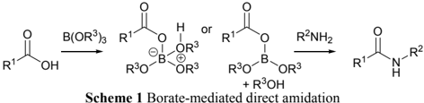
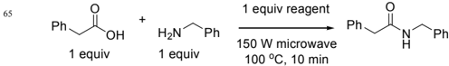
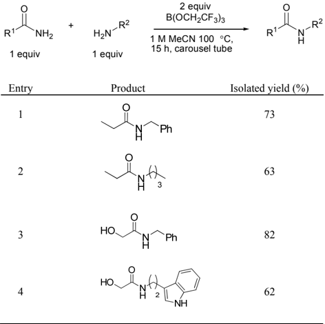

The final published version of this article can be found at http://dx.doi.org/10.1039/C0OB01069C.

## Borate Esters as Convenient Reagents for Direct Amidation of Carboxylic Acids and Transamidation of Primary Amides

Pavel Starkov a and Tom D. Sheppard *a

Received (in XXX, XXX) Xth XXXXXXXXX 200X, Accepted Xth XXXXXXXXX 200X

- First published on the web Xth XXXXXXXXX 200X 5

DOI: 10.1039/b000000x

Simple borates serve as effective promoters for amide bond formation with a variety of carboxylic acids and amines. With trimethyl or tris(2,2,2-trifluoroethyl) borate, amides are obtained in good to excellent yield and high purity after a simple work-up 10 procedure. Tris(2,2,2-trifluoroethyl) borate can also be used for the straightforward conversion of primary amides to secondary amides via transamidation.

The amide linkage 1 is prevalent in nature 2 and is extensively 15 used in synthetic chemistry. 3 A vast number of approaches for amide bond formation exist, 3-7 many of which are problematic with regard to cost and atom-efficiency, 8 as well as recyclability and functional group tolerance. 9 Recently, boric 20 acid and arylboronic acids were shown to be able to mediate direct amide coupling of carboxylic acids and amines. 10 Although they can be used in catalytic amounts (1-20 mol%), effective removal of water is essential, either by heating under azeotropic reflux in high-boiling point solvents (e.g., PhMe, xylene), 10b-f or by conducting the reaction at lower 25 temperatures (rt-50 °C), in the presence of molecular sieves. However, high dilution conditions and prolonged reaction times (24-48 h) are necessary in this latter case. 10g The use of stoichiometric boron reagents for amidation has also been reported (e.g. BF3·OEt2, 11a catecholborane, 11b BH3·NMe3 12a 30 and BH3·THF 12b ), but such reagents require strictly anhydrous reaction conditions and, in some cases, an excess of either the carboxylic acid or amine in order to obtain a good conversion. 12 Herein, we demonstrate the application of simple borate esters to direct carboxamidation under 35 convenient reaction conditions. Additionally, we show that tris(2,2,2,-trifluoroethyl) borate can be used to activate amides towards transamidation. 13 These reactions show good functional group tolerance and do not require anhydrous

- 40 reaction conditions.

45

50

During the course of our work on the development of new boron reagents for organic synthesis, 14 we examined a range of compounds as mediators for amidation reactions, and observed that B(OMe)3 15 can act as an effective reagent for direct carboxamidation. Activation of the carboxylic acid presumably occurs via in situ generation of a three or fourcoordinate boron species (Scheme 1). 10h Through subsequent

|

reaction optimization under microwave conditions (Table 1), we identified the best solvent: acetonitrile (entries 2-8); as well as the most effective reagent: tris(2,2,2-trifluoroethyl) 55 borate (entry 15). The background conversion to amide in the absence of any reagent was very low (entry 1). 10a The reaction was much more effective in polar aprotic solvents (entries 5, 6, 8) than when conducted neat (entry 7), 15 even though a smaller quantity of reagent was employed. The presence of ROH compounds, including the by-products of the reaction 60 (water, MeOH, etc), significantly reduces the conversion (entries 9-11), presumably via inhibition of the reagent.

Table 1 Optimization of Borate-Promoted Direct Carboxamidation under Microwave Conditions a

|   Entry | Reagent          | Solvent    | Conversion (%) b   |
|---------|------------------|------------|--------------------|
|       1 | none             | MeCN       | 2                  |
|       2 | B(OMe) 3         | MeOH       | 0                  |
|       3 | B(OMe) 3         | MTBE       | 4                  |
|       4 | B(OMe) 3         | PhMe       | 12                 |
|       5 | B(OMe) 3         | THF        | 20                 |
|       6 | B(OMe) 3         | DMSO       | 27                 |
|       7 | B(OMe) 3         | B(OMe) 3 c | 30                 |
|       8 | B(OMe) 3         | MeCN       | 35 (35) g          |
|       9 | B(OMe) 3         | MeCN       | 6 d                |
|      10 | B(OMe) 3         | MeCN       | 14 e               |
|      11 | B(OMe) 3         | MeCN       | 19 f               |
|      12 | B(O i Pr) 3      | MeCN       | 9                  |
|      13 | B(OSiMe 3 ) 3    | MeCN       | 9                  |
|      14 | Si(OMe) 4        | MeCN       | 22                 |
|      15 | B(OCH 2 CF 3 ) 3 | MeCN       | 63 (63) g          |

70

a Reaction conditions: acid (1 equiv), amine (1 equiv), reagent (1 equiv), solvent (0.5 M), MW (150 W), 100 °C, 10 min. b Determined by crude 1 H NMR (DMSOd 6 ). c 18 equiv B(OMe)3. d with MeOH (1 equiv). e with B(OH)3 (1 equiv). f with H2O (1 equiv). g Isolated yields in parenthases.

A brief study indicated that thermal conditions were more effective than microwave heating, so we then compared the reactivity of B(OMe)3 and B(OCH2CF3)3 with a range of 75 acids/amines in acetonitrile at 80 ºC. The reactions were conducted in the absence of any additional dehydrating agents or water removal apparatus (Table 2), and good to excellent conversions were obtained in all cases. Although thermally promoted carboxamidation was observed, 10a it remained at 80 background levels. In the case of unreactive systems such as pivalic and benzoic acids, yields improved significantly on raising the temperature to 100 ºC (entries 5 and 6).

5

Table 2 Borate-promoted direct amide formations

| Entry   | Isolated yield (%)   |                    |            |           |
|---------|----------------------|--------------------|------------|-----------|
| Entry   | Isolated yield (%)   | B(OCH 2 CF 3 ) 3 a | B(OMe) 3 a | Thermal b |
| 1       |                      | 91 (74) c          | 92 (66) c  | 18        |
| 2       |                      | 70                 | 73         | <1        |
| 3       |                      | 70                 | 51         | 7         |
| 4       |                      | 76                 | 44         | 5         |
| 5       |                      | 14 (50) d          | 2          | 0         |
| 6       |                      | 27 (71) d          | 12         | <1        |
| 7       |                      | 92                 | 45         | 9         |
| 8       |                      | 82                 | 51         | 6         |
| 9       |                      | 66                 | 66         | 6         |
| 10      |                      | 61                 | 36         | 3         |
| 11      |                      | 70                 | quant      | 9         |
| 12      |                      | 71                 | 17         | 8         |
| 13      |                      | 95                 | 11         | 6         |
| 14      |                      | 72                 | 4          | 0         |
| 15 e    |                      | 94                 | 60         | 5         |
| 16      |                      | 81 f               | 49 g       | 7         |

a Reaction conditions: acid (1 equiv), amine (1 equiv), borate (2 equiv), 0.5 M MeCN, 80 ºC, 15 h. b Reaction conditions: acid (1 equiv), amine (1 equiv), 0.5 M MeCN, 80 ºC, 15 h. c 1 equiv of borate used. d Carried out at 100 ºC in a carousel tube. e From amine-HCl salt, with i Pr2NEt (1 equiv). f 88% ee. g &gt;99% ee. 16

The amides were obtained in high purity after a simple aqueous work-up, and B(OCH2CF3)3 proved to be the optimal reagent in nearly all cases. Both α- and β-substituted acids, as well  as  α-substituted  amines,  gave  higher  yields  with  this 10 more electron-deficient reagent (entries 3-5, 8, 15-16). B(OCH2CF3)3 was particularly effective for unsaturated carboxylic acids (entries 12-14), and the acylation of an aniline could also be successfully achieved (entry 14). 17 However, it should be noted that B(OMe)3 was effective for 15 the formation of several amides (e.g. entries 1-2, 11), providing an extremely economical method for accessing these systems. In contrast to other boron reagents and catalysts, anhydrous reaction conditions (dry solvents, inert atmosphere) are not required. The use of acetonitrile as 20 solvent is also practically useful as it enables polar substrates to be coupled effectively (entries 7, 11, 15-16). Notably, highly polar amines such as ethanolamine (entry 7) and tryptamine (entry 11) can be acylated without protection. An 25 amine salt could be used directly in the coupling reactions in the presence of Hünig's base (entry 15), and a Boc-protected amino acid was coupled with only low levels of racemisation (entry 16). The acid-labile Boc group is not cleaved under the reaction conditions, despite the presence of the Lewis acidic boron reagent. A range of other functional groups including 30 alkenes, cyclopropanes, indoles, hydroxyl groups and esters were also well tolerated (entries 7, 9-11, 15).

Table 3 Tris(2,2,2-trifluoroethyl) borate-promoted 35 transamidation.

|   R 1 NH 2 O 1 equiv | H 2 N R 2 1 equiv   |   R 1 N H O R 2 |
|----------------------|---------------------|-----------------|
|                    1 |                     |              73 |
|                    2 |                     |              63 |
|                    3 |                     |              82 |
|                    4 |                     |              62 |

40

45

Given the fact that these borate ester reagents had proved highly effective for the activation of carboxylic acids, we were keen to expore their potential for activating other related systems. Although esters did not undergo amidation (Table 2, entry 15), 7 B(OCH2CF3)3 was observed to activate primary amides (Table 3). This boron-mediated transamidation reaction gave good yields of secondary amides, and shows

- very good functional group tolerance (entries 3-4). Although a number of different procedures for transamidation have been reported, 13 there are few methods available for the transamidation of primary amides without a separate pre-

13e-13f

- activation step. In contrast to these other reports, this 5 method is experimentally simple, 13f and requires only equimolar quantities of amine/amide. 13e No transamidation was observed in the absence of B(OCH2CF3)3, or in the presence of B(OMe)3.
- In summary, we have demonstrated that simple borates are 10 practical reagents for direct amide bond formation under both thermal and microwave conditions. Unlike many other coupling methods, this approach exhibits good functional group tolerance and purification is extremely straightforward.
- Tris(2,2,2-trifluoroethyl) borate was also shown to activate 15 amides toward transamidation, providing a convenient and practical method for the direct conversion of primary amides to secondary amides. Further work on the development and application of other boron-centered reagents is ongoing and 20 will be reported in due course.

## Acknowledgements

This work was supported by the EPSRC (EP/E052789/1: Advanced Research Fellowship to T.D.S. and PhD studentship to P.S.). P.S. thanks the Estonian Ministry of Education and 25 Research and the Archimedes Foundation.

## Notes and references

- a Department of Chemistry, University College London, Christopher Ingold Laboratories, 20 Gordon Street, London, WC1H 0AJ, U.K. Fax:

+44 (0) 20 7679 7463; Tel: +44 (0)207649 2467; E-mail: 30 tom.sheppard@ucl.ac.uk

- † Electronic Supplementary Information (ESI) available: Experimental procedures, spectral data and copies of 1 H and 13 C NMR spectra for all compounds. See DOI: 10.1039/b000000x/

35

40

45

- 1 (a) N. Sewald and H.-D. Jakubke. Peptides: Chemistry and Biology. Wiley-VCH Verlag GmbH: Weinheim, 2002. (b) A. Greenberg, C. M. Breneman and J. F. Liebman, The Amide Linkage: Selected Structural Aspects in Chemistry, Biochemistry, and Material Science. Wiley: New York, 2000.
- 2 (a) M. Funabashi, Z. Yang, K. Nonaka, M. Hosobuchi, Y. Fujita, T. Shibata, X. Chi, X and van Lanen, Nat. Chem. Biol., 2010, 6, 581586; (b) M. Simonovic and T. A. Steitz, Biochim. Biophys. Acta, 2009, 1789, 612-623; (c) M. A. Fischbach and C. T. Walsh, Chem. Rev., 2006, 106, 3468-3496.
- 3 For recent reviews and strategies for direct amide bond formation from carboxylic acids and amines, see: (a) E. Valeur and M. Bradley, Chem. Soc. Rev., 2009, 38, 606-631; (b) J. W. Bode, Curr. Opin. Drug. Disc. Dev., 2006, 9, 765-775; (c) C. A. G. N. Montalbetti and
- V. Falque, Tetrahedron, 2005, 61, 10827-10852; (d) P. D. Bailey, T. 50 J. Mills, R. Pettercrew and R. A. Price. In Comprehensive Organic Functional Group Transformations II; A. R. Katritzky and R. J. K. Taylor, Eds.; Elsevier: Oxford, 2005; Vol. 5; Chapter 7; (e) P. D. Bailey, I. D. Collier and K. M. Morgan, In Comprehensive Organic
- Functional Group Transformations ; A. R. Katritzky, O. Meth-Cohn 55 and C. W. Rees, Eds.; Pergamon: Cambridge, 1995; Vol. 5; Chapter 6.
- 4 For  a  recent  strategy  via  an  umpolung  approach  from  α-bromo nitroalkanes and amines, see: B. Shen, D. M. Makley, J. N. Johnston,
- Nature, 2010, 465, 1027-1032. 60

|

- 5 For leading references on Ru-catalyzed approaches from alcohols and amines, see: (a) C. Gunanathan, Y. Ben-David and D. Milstein, Science, 2007, 317, 790-792; (b) L. U. Nordstrøm, H. Vogt and R. Madsen, J. Am. Chem. Soc., 2008, 130, 17672-17673; (c) A. J. A. Watson, A. C. Maxwell and J. M. J. Williams, Org. Lett., 2009, 11,
- 65 2667-2670.
- 70
- 6 For alternative approaches from aldehydes and amines, see: (a) H. U. Vora and T. Rovis, J. Am. Chem. Soc., 2007, 129, 13796-13797; (b) P.-C. Chiang, Y. Kim and J. W. Bode, Chem. Commun., 2009, 45, 4566-4568. (c) W.-J. Yoo and C.-J. Li, J. Am. Chem. Soc., 2006, 128, 13064-13065.
- 7 For amidation of esters with group(IV) metal systems, see: C. Han, J. P. Lee, E. Lobkovsky and J. A. Porco, Jr., J. Am. Chem. Soc., 2005, 127, 10039-10044.
- 8 (a) B. M. Trost, Science, 1991, 254, 1471-1477; (b) N. Z: Burns, P. 75 S. Baran and R. W. Hoffmann, Angew. Chem. Int. Ed., 2009, 48, 2854-2867; (c) J. S. Carey, D. Laffan, C. Thomson and M. T. Williams, Org. Biomol. Chem., 2006, 4, 2337-2347; (d) K. Alfonsi, J. Colberg, P. J. Dunn, T. Fevig, S. Jennings, T. A. Johnson, H. P.
- Kleine, C. Knight, M. A. Nagy, D. A. Perry and M. Stefaniak, Green 80 Chem., 2008, 10, 31-36; (e) D. J. C. Constable, P. J. Dunn, J. D. Hayler, G. R. Humphrey, Z. L. Leazer, Jr., R. J. Linderman, K. Lorenz, J. Manley, B. A. Pearlman, A. Wells, A. Zaks and T. Y. Zhang, Green Chem., 2007, 9, 411-420.
- 9 (a) R. W. Hofmann, Synthesis, 2006, 3531-3541. (b) Green 85 Chemistry in the Pharmaceutical Industry; P. J. Dunn, A. S. Wells and M. T. Williams, Eds.; Wiley-VCH: Weinheim, 2010.
- 10 (a) H. Charville, D. Jackson, G. Hodges and A. Whiting, Chem. Commun., 2010, 46, 1813-1823; (b) T. Maki, K. Ishihara and H.
- Yamamoto, Tetrahedron, 2007, 63, 8645-8657; (c) K. Ishihara, S. 90 Ohara and H. Yamamoto, J. Org. Chem., 1996, 61, 4196-4197. (d) P. Tang, Org. Synth., 2005, 81, 262-272; (e) K. Arnold, B. Davies, R. L. Giles, C. Grosjean, G. E. Smith and A. Whiting, Adv. Synth. Catal., 2006, 348, 813-820; (f) K. Arnold, A. S. Batsanov, B. Davies
- and A. Whiting, Green Chem., 2008, 10, 124-134; (g) R. M. Al95 Zoubi, O. Marion and D. G. Hall, Angew. Chem. Int. Ed., 2008, 47, 2876-2879; (h) T. Marcelli, Angew. Chem. Int. Ed., 2010, 49, 68406843.
- 11 (a) J. Tani, T. Oine and I. Junichi, Synthesis, 1975, 714-715; (b) D. B. Collum, S.-C. Chen, and B. Ganem, J . Org. Chem ., 1978 , 43 , 100 4393-4394.
- 12 (a) G. Trapani, A. Reho and A. Latrofa, Synthesis, 1983, 1013-1014. (b) Z. Huang, J. E. Reilly and R. Buckle, Synlett, 2007, 1026-1030.
- 13 For examples of amide activation/transamidation, see: (a) N. S: Stephenson, J. Zhu, S. H. Gellman and S. S. Stahl, J. Am. Chem. 105 Soc., 2009, 131, 10003-10008; (b) J. M. Hoerter, K. M. Otte, S. H. Gellman, Q. Cui and S. S. Stahl, J. Am. Chem. Soc. , 2008, 130, 647654; (c) D. A. Kissounko, J. M. Hoerter, I. A. Guzei, Q. Cui, S. H. Gellman and S. S. Stahl, J. Am. Chem. Soc., 2007, 129, 1776-1783;
- (d) S. E. Eldred, D. A. Stone, S. H. Gellman and S. S. Stahl, J. Am. 110 Chem. Soc., 2003, 125, 3422-3423; (e) E. Bon, D. C. H. Bigg and G. Bertrand, J. Org. Chem., 1994, 59, 4035-4036; (f) F. J. Sowa and J. A. Nieuwland, J. Am. Chem. Soc., 1937, 59, 1202-1203. (h) Z. Mucsi, G. A. Chass and I. G. Csizmadia, J. Phys. Chem. B, 2008,
- 112, 7885-7893; (h) T. A. Dineen, M. A. Zajac and A. G. Myers, J. 115 Am. Chem. Soc., 2006, 128, 16406-16409.
- 14 C. Körner, P. Starkov and T. D. Sheppard, J. Am. Chem. Soc., 2010, 132, 5968-5969.
- 15 For an early mechanistic study that features one carboxamidation example using neat B(OMe)3 in the presence of TsOH, giving a 120 mixture of amide and methyl ester, see: A. Pelter, T. E. Levitt and P. Nelson. Tetrahedron, 1970, 26, 1539-1544.
- 16 Enantiomeric excesses were determined by comparison with an authentic racemic sample using a CHIRALCEL® OD-H column.
- 17 Preliminary experiments showed that a secondary amine could also 125 be acylated, but only low conversions were observed under the standard reaction conditions.