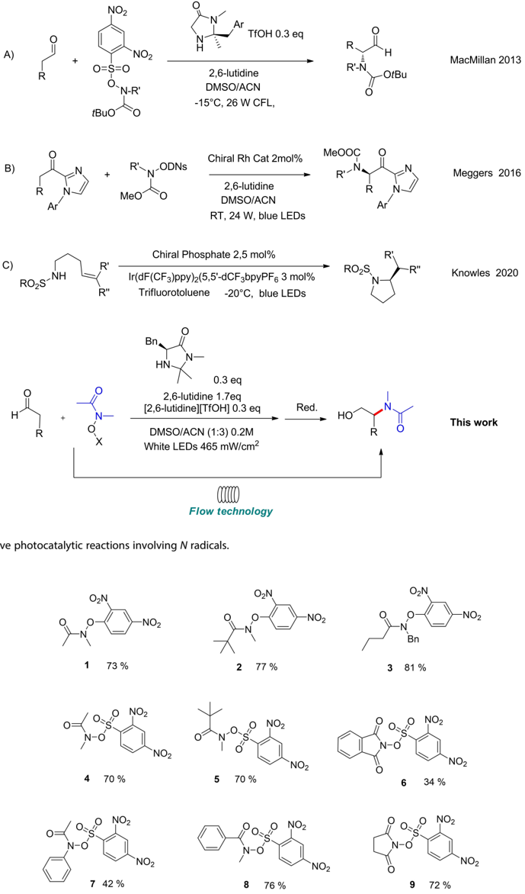
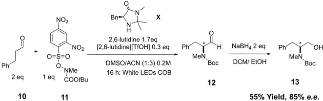
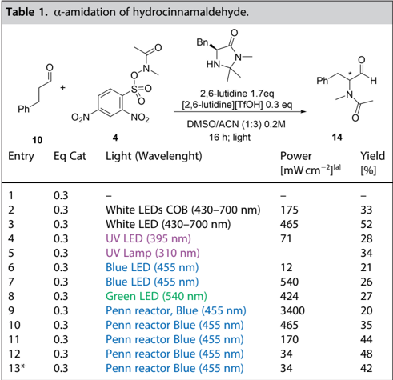
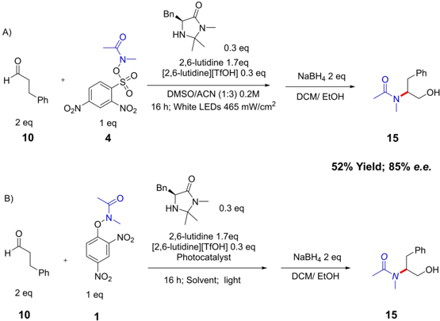
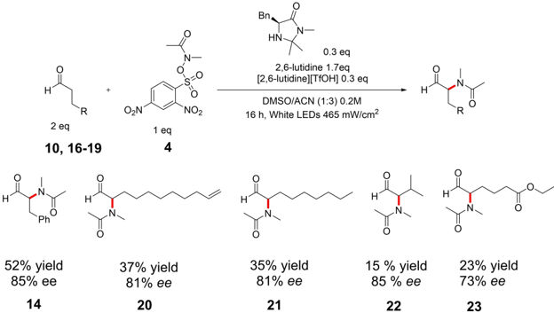
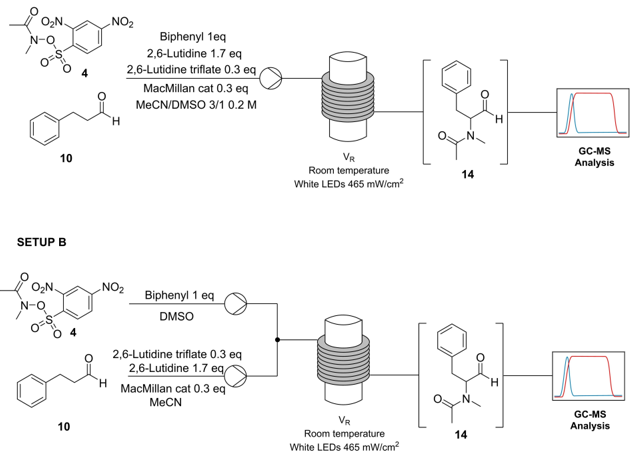
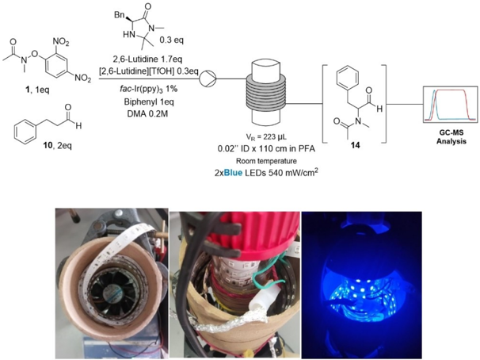

www.eurjoc.org

## Enantioselective Catalytic Addition of N-Acyl Radicals: In Batch and In Flow Organophotoredox α -Amination of Aldehydes

Monica Fiorenza Boselli, [a] Niccolò Intini, [a] Alessandra Puglisi, [a] Laura Raimondi, [a] Sergio Rossi, [a] and Maurizio Benaglia* [a]

Dedicated to Professor Cesare Gennari on the occasion of his 70th birthday

The organophotoredox catalytic enantioselective addition of N -acyl radicals to aldehydes, to afford enantioenriched N -acyl 1,2 aminoalcohols was studied. Under the best conditions, in batch, the product was isolated in up to 52% yield and 85% e.e. , using a low cost and commercially available chiral imidazolidinone as organocatalyst. The reaction was then studied in flow, exploring

## Introduction

Organic compounds bearing nitrogen atoms are widely spread into pharmaceutical and agrochemical products, therefore new and green synthetic strategies to build up new C N bonds under mild conditions are a central goal for chemists. In the last few decades, with the spread of visible light photochemistry [1] and photocatalytic processes, [2] radical chemistry and, in particular, nitrogen radicals, [3] became a powerful tool for the development of innovative synthetic strategies.

The best way to generate nitrogen radicals is the homolytic cleavage promoted by light and in particular, N H, N-halogens, N N, N S and N O are the most suitable bonds to be broken. [4] Although hydroxyamines are less accessible than other precursors, the N O bond is so weak (50 kcalmol 1 ) that they have been widely employed in N radical generation simply by irradiation with visible light. Three different classes of hydroxylamine derivatives, classified according to the fragmentation mechanism and the nature of the single electron transfer (SET) with the excited photocatalyst have found wide application. [5]

However, despite the wide variety of synthetic applications of N -centered radicals developed in the last decade, still a very few examples of enantioselective catalytic reactions have been

[a]

Dr. M. F. Boselli, Dr. N. Intini, Prof. Dr. A. Puglisi, Prof. Dr. L. Raimondi, Dr. S. Rossi, Prof. Dr. M. Benaglia Dipartimento di Chimica Università degli Studi di Milano Via Golgi, 19, 20133 - Milano (Italy) E-mail: maurizio.benaglia@unimi.it

[Part of the 'Cesare Gennari's 70th Birthday' Special Collection.](https://chemistry-europe.onlinelibrary.wiley.com/doi/toc/10.1002/(ISSN)1099-0690.Cesare-Gennari-70)

© 2023 The Authors. European Journal of Organic Chemistry published by Wiley-VCH GmbH. This is an open access article under the terms of the Creative Commons Attribution Non-Commercial License, which permits use, distribution and reproduction in any medium, provided the original work is properly cited and is not used for commercial purposes.

different experimental setups and photoreactors. Although modest yields were obtained, the in-flow process afforded the product in higher productivities (up to 60 times higher) and improved space time yields (increased up to 113 times) compared to the batch reaction, with no loss of stereoselectivity.

reported. In 2013, in a pioneering work, MacMillan published the first asymmetric addition of electrophilic nitrogen radicals to enamines, exploiting the imidazolidinones catalysis (Scheme 1A). [6] In 2016, Meggers and co-workers published an enantioselective α -amidation of 2-acyl imidazoles catalyzed by a rhodium(III) complex (Scheme 1B). In this reaction, the rhodium complex has the both function as photosensitizer and as chiral catalyst. [7] In 2020, Knowles developed an intramolecular enantioselective hydroamination of alkenes exploiting a chiral phosphonate Brønsted base (Scheme 1C). The sulfoamidyl radical is generated by a PCET (proton-coupled electron transfer) activation mediated by an excited state Ir III complex. [8]

In this framework, we have decided to investigate the use of a commercially available, low cost chiral imidazolidinone, in the organophotoredox catalytic addition of N -acyl radicals to aldehydes, to afford enantioenriched N -acyl 1,2 aminoalcohols. Rather than a fine tuning and the optimization of the organocatalyst, aim of the present work was to explore both in batch and in flow protocols, in order to establish viable conditions for a productive use in continuo of N amidyl radicals, taking advantage of the flow reactors technology. [9]

## Results and Discussion

Following Leonori's procedure, [10] three O -aryl hydroxylamides N -acyl precursors 1 -3 were synthesized; similarly, based on MacMillan protocol reported for hydroxylcarbamoyl reagents, [6] a small library of new N -(aryl-sulphonyl-oxy) reagents ( 4 -9 ), as N -acyl nitrogen radical precursors, were prepared (Figure 1, for experimental details see the Supporting Information). [6]

With the nitrogen radical precursors in our hands, we first reproduced a photoredox N -arylation reaction published by Leonori in 2016, [10] to test different setups and the performances of our homemade photoreactors. [11] Reproducible yields, com-

A)

B)

C)

R

+

NO2

NO2

O=S=0

73 %

ON-R

1

NO2

NO2

R'iN-ODNS

MeO

5

Chiral Phosphate 2,5 mol%

Ir(dF(CF3)ppy)2(5,5'-dCF 3bpyPF6 3 mol%

Trifluorotoluene -20°C, blue LEDs

Bn,

HN.

2,6-lutidine 1.7eq

[2,6-lutidine][TfOH] 0.3 eq

DMSO/ACN (1:3) 0.2M

White LEDs 465 mW/cm2

R'

NO2

N-

X

Scheme 1. Enantioselective photocatalytic reactions involving N radicals.

Ar

N

0-

-NO2

2,6-lutidine

DMSO/ACN

OJN

Bn

R'-N.

3 81 %

-OtBu

Figure 1. A small library of nitrogen radical precursors.

parable to the literature results, were obtained in the N -arylation of N -methylindole (for details see the Supporting Information).

2 77%

R

4 70 %

Ar

NO2

RO,S-NH

7 42%

+

R

→

MacMillan 2013

The enantioselective direct α -amination of aldehydes with N -Boc radical precursor, according to the MacMillan protocol [6] was then tested, using the commercially available and more stable imidazolidinone catalyst X (Scheme 2). We were pleased

Ph

+

+

Ph

10

Entre

2 ea

Carot

10

QN

NO2

O=Ş=0

NO2

x

Bn.

2,6-lutidine 1.7eq

2,6-lutidine 1.7eq

-

ONMe

(2,6-lutidine|[TfOH] 0.3 eg

[2,6-lutidine][TfOH] 0.3 eq

DMSO/ACN (1:3) 0.2M

DMSO/ACN (1:3) 0.2M

16 h; White LEDs COB

linht (Mlaudlanaht)

1 eq COOtBu

11

H

Ph

MeN Boc

NaBH4 2 eq ph

OH

MeN Boc

Scheme 2. Validation test of homemade photoreactor in the catalytic enantioselective α -amination of aldehydes with N -Boc radicals.

to see that, in our hands, the reaction of dihydrocinnamic aldehyde 10 with the reagent 11 afforded the desired product 12 in 55% yield and 85% e.e. , as evaluated on the corresponding alcohol 13 , to avoid possible racemization of the stereocenter in α -position in the aldehyde.

Based on those preliminary experiments, the direct organophotocatalytic addition of N -acetyl radicals to aldehydes was investigated. The asymmetric catalytic reaction of dihydrocinnamic aldehyde 10 with the N radical precursor 4 in the presence of 0.3 moleq of imidazolidinone X and lutidinium triflate, 1,7 moleq of 2,6-lutidine in DMSO/CH3CN for 16 h was selected as model reaction, to afford product 14 . Different light sources available in our laboratories such as Fluorescent Compact Light, white LEDs, UV LEDs and UV Lamps, Green and Blue LEDs were tested. The best results were obtained with the white LEDs with the highest milliwatt over surface ratio, and with the Blue LEDs with the less intensity (entries 3 and 12 in Table 1). [12]

Different reaction parameters were then considered, such as the addition of water, the reaction time, the stoichiometry and

* with 1 mol% fac -(ppy) 3 Ir; [a] the mWcm 2 ratios were empirically measured.

| Table 1. α -amidation of hydrocinnamaldehyde.   | Table 1. α -amidation of hydrocinnamaldehyde.   | Table 1. α -amidation of hydrocinnamaldehyde.   | Table 1. α -amidation of hydrocinnamaldehyde.   | Table 1. α -amidation of hydrocinnamaldehyde.   |
|-------------------------------------------------|-------------------------------------------------|-------------------------------------------------|-------------------------------------------------|-------------------------------------------------|
| Entry                                           | Eq Cat                                          | Light (Wavelenght)                              | Power [mWcm 2 ] [a]                             | Yield [%]                                       |
| 1                                               | 0.3                                             | -                                               | -                                               | -                                               |
| 2                                               | 0.3                                             | White LEDs COB (430-700 nm)                     | 175                                             | 33                                              |
| 3                                               | 0.3                                             | White LED (430-700 nm)                          | 465                                             | 52                                              |
| 4                                               | 0.3                                             | UV LED (395 nm)                                 | 71                                              | 28                                              |
| 5                                               | 0.3                                             | UV Lamp (310 nm)                                |                                                 | 34                                              |
| 6                                               | 0.3                                             | Blue LED (455 nm)                               | 12                                              | 21                                              |
| 7                                               | 0.3                                             | Blue LED (455 nm)                               | 540                                             | 26                                              |
| 8                                               | 0.3                                             | Green LED (540 nm)                              | 424                                             | 27                                              |
| 9                                               | 0.3                                             | Penn reactor, Blue (455 nm)                     | 3400                                            | 20                                              |
| 10                                              | 0.3                                             | Penn reactor Blue (455 nm)                      | 465                                             |                                                 |
|                                                 |                                                 | Penn reactor Blue (455 nm)                      |                                                 | 35                                              |
| 11                                              | 0.3 0.3                                         | Penn reactor Blue (455 nm)                      | 170 34                                          | 44 48                                           |
| 12 13*                                          | 0.3                                             | Penn reactor Blue (455 nm)                      | 34                                              | 42                                              |

the concentration of reagents, and the use of polar aprotic solvents, but none of these attempts improved the reaction yield (see the Supporting Information, Table S2).

In order to evaluate the enantiomeric excess of the reaction, aldehyde 14 was reduced to alcohol 15 and the e.e. was evaluated by HPLC on chiral stationary phase (Scheme 3, Reaction A).

Under the conditions of entry 5, Table 1, the alcohol was obtained in 52% and 85% e.e. with the relatively inexpensive and commercially available chiral imidazolidinone X . By running the reaction at lower temperature, lower yields with no improvement of the stereoselectivity were obtained.

Then, the asymmetric α -amination of the hydrocinammaldeyde 10 was performed also with the O -aryl hydroxylamide precursor 1 (reaction B Scheme 3). Different photocatalysts, solvents and concentrations were tested but moderate yields and lower enantioselectivities were generally observed, the best result being obtained using green LEDs and Eosin Y (Table 2, 40% yield and 74% e.e. ).

With 'optimal' condition in our hands, the scope of this enantioselective α -amination was briefly studied (Scheme 4). The reaction with aliphatic aldehydes 16 -19 afforded the corresponding α -functionalised aldehydes 20 -23 , in moderate yields but enantioselectivities typically higher than 80%. Unfortunately, all the attempts to perform the reaction with different amidyl radical precursors failed or afforded the products only in traces.

Since the beneficial effects of performing a light-driven transformation in flow are well known, [13] the organocatalytic enantioselective addition of the Nacetyl radical under continuous flow conditions was studied in homemade photoredox coil reactors (see the Supporting Information for details on the

| Table 2. α -amination of hydrocinnamaldehyde with radical precursor 1 (Scheme 3, reaction B).   | Table 2. α -amination of hydrocinnamaldehyde with radical precursor 1 (Scheme 3, reaction B).   | Table 2. α -amination of hydrocinnamaldehyde with radical precursor 1 (Scheme 3, reaction B).   | Table 2. α -amination of hydrocinnamaldehyde with radical precursor 1 (Scheme 3, reaction B).   | Table 2. α -amination of hydrocinnamaldehyde with radical precursor 1 (Scheme 3, reaction B).   | Table 2. α -amination of hydrocinnamaldehyde with radical precursor 1 (Scheme 3, reaction B).   |
|-------------------------------------------------------------------------------------------------|-------------------------------------------------------------------------------------------------|-------------------------------------------------------------------------------------------------|-------------------------------------------------------------------------------------------------|-------------------------------------------------------------------------------------------------|-------------------------------------------------------------------------------------------------|
| Entry                                                                                           | Light                                                                                           | Photocatalyst                                                                                   | Solvent [M]                                                                                     | Yield [%]                                                                                       | e.e.                                                                                            |
| 1                                                                                               | Green LEDs 424mWcm 2                                                                            | Eosin Y 2%                                                                                      | DMSO/ACN 0.2M                                                                                   | 40                                                                                              | 74%                                                                                             |
| 2                                                                                               | Blue LEDs                                                                                       | fac -Ir(ppy) 3 1%                                                                               | DMA 0.1M                                                                                        | 15                                                                                              | -                                                                                               |
| 3                                                                                               | Blue LEDs                                                                                       | fac -Ir(ppy) 3 1%                                                                               | DMA 1M                                                                                          | 30                                                                                              | -                                                                                               |
| 4                                                                                               | White LEDs 465 mW/cm 2                                                                          | fac -Ir(ppy) 3 1%                                                                               | Cyrene 0.2M                                                                                     | 0                                                                                               | -                                                                                               |

10990690, 2023, 9, Downloaded from https://chemistry-europe.onlinelibrary.wiley.com/doi/10.1002/ejoc.202201309, Wiley Online Library on [04/05/2026]. See the Terms and Conditions (https://onlinelibrary.wiley.com/terms-and-conditions) on Wiley Online Library for rules of use; OA articles are governed by the applicable Creative Commons License

A)

H

H

Ph

52% yield

85% ee

Ph

14

2 eq

10

+

Ph

2 eq

R

2 eq

10

OZN

10, 16-19

+

O.

+

NO2

1 eq

4

-NO2

81% ee

Bn.

HN

0.3 eq

2,6-lutidine 1.7eq

2,6-lutidine 1.7eq

[2,6-lutidine][TfOH] 0.3 eq

NaBH4 2 eq

[2,6-lutidine][TfOH] 0.3 eq

DMSO/ACN (1:3) 0.2M

-

NO2

16 h; White LEDs 465 mW/cm?

1 eq

4

H

Bne

0.3 eq

37% yield

2,6-lutidine 1.7ea

81% ee

(2,6-lutidine][TfOH] 0.3 eq

NO2

1 eq

Scheme 3. Catalytic enantioselective α -amination of aldehydes with N -acetyl radicals.

Scheme 4. Catalytic enantioselective α -amination of aldehydes 10 , 16 -19 with N -acetyl radical from precursor 4 .

device). The first tests were performed using the setups described in Scheme 5 (see Figure 2for a picture of the system).

In setup A all the reagents, with the addition of biphenyl as internal standard, are charged in a single syringe and pumped in a coil reactor rolled on a photoreactor. Two reactors have been tested: a) 0.01' HPFA reactor (160 cm, 81 μ L); with different residence times, the product has not been observed by GC-MS; b) 0.02' PFA reactor (110 cm, 223 μ L); only traces of product have been found (for further details see Tables in the Supporting Information). [14]

Due to the low yields, alternative setup B was investigated: two syringes were connected to a T-junction and then to the coil reactor. In the first syringe the Nradical precursor and the internal standard (biphenyl) in DMSO were charged (0.806 M), in the second syringe, all the other compounds were dissolved in acetonitrile (0.538 M for the aldehyde, 0.457 M for 2,6-lutidine and 0.0806 M for imidazolidinone and 2,6-lutidine triflate).

Figure 2. Figure 2Two different coil reactors were tested with the same photoreactor.

20

35% yield

Photocatalyst

16 h; Solvent; light

DMSO/ACN (1:3) 0.2M

Bn.

Ph

SETUP A

N-O

1, 1eq

O

4

10, 2eq

10

SETUP B

/ ON

-O

10

NO2

NO2

Bn.

Biphenyl 1eq

2,6-Lutidine 1.7eq

(2,6-Lutidine][TfOH] 0.3eq

2,6-Lutidine 1.7 eq

2,6-Lutidine triflate 0.3 eq

MacMillan cat 0.3 eq fac-Ir(ppy)з 1%

Biphenyl 1eq

DMA 0.2M

MeCN/DMSO 3/1 0.2 M

Biphenyl 1 eq

DMSO

2,6-Lutidine triflate 0.3 eq

2,6-Lutidine 1.7 ea

MacMillan cat 0.3 eq

MeCN

Scheme 5. Catalytic enantioselective α -amination of aldehydes in flow.

However, only minor amounts of product were observed. The light intensity of the LEDs was also tuned using a bench power supply; some better results were obtained operating with 22.5 W LED and 30 min residence time (21% Yield). It is possible that in the reactors a more efficient and uniform irradiation of the reaction mixture is responsible for an extensive degradation of the reagents rather than for a yield improvement. However, further studies on the reaction mechanism (e.g. to determine if

the reaction goes through radical chain propagation or not) are needed to rationalize the experimental observations.

Disappointed by the low chemical efficiency of the in-flow reaction, the photocatalytic amination with N -(2,4-dinitrophenoxy)N -methylacetamide 1 as N -radical precursor was considered. The studies were conducted using DMA as solvent and fac -[Ir(ppy) 3 ] as photocatalyst, that requires blue LEDs (450 nm LEDs have been used in these studies).

The experimental setups are shown in Figure 3.

Figure 3. Reaction setup using 3D printed photoreactor. A) LEDs off, B) LEDs on.

0.25

0.2

0.15

0.1

0.05

Productivity vs. residence time

· Scale Up

· 0.25M PC

A significant improvement of the yields has been observed when the light intensity and the reactants concentration were increased. By using 1 M solution and 30 min. residence time in a 'double' photoreactor (Figure 3, see the Supporting Information for experimental details), 35% yield was obtained (determined by GC-MS and confirmed as isolated yield) as shown in Table 3. [15]

A scale-up of the reactor was also realized, increasing the reactor volume from 223 μ L to 955 μ L. Under the same conditions, the overall yield decreased (19% yield at 30 min residence time), but the productivity was improved. Indeed, with radical precursor 4 , the productivity of the in-batch reaction under the best conditions is 0.0079 mmolh 1 (52% yield, 16h); using the same radical precursor, the in-flow reaction affords 0.0500 mmolh 1 of product, with a more than 6 times yield improvement.

With radical precursor 1 , that requires a photocatalystmediated activation, in-batch 30% yield was observed after 16 h (productivity: 0.0047 mmolh 1 ), meanwhile, in flow, the 223 μ L reactor gave a productivity of 0.0908 mmolh 1 after 30 min (19 times higher). The data are reported in Figure 4, where also the results with the larger reactor are included. The 914 μ L gave a productivity of 0.2776 mmolh 1 after 20 min (increased of a factor 60).

Also Space-Time Yields (STY) were evaluated, and confirmed the higher efficiency of the in-flow process. The reaction with radical precursor 1 gave in batch a STY of 3.6×10 6 mmol/ (h* μ L), compared to a STY of 41×10 6 mmol/(h* μ L) after 10 min (increased of a factor 113) with the 223 μ L reactor.

Figure 4. Productivity vs. residence time of in-flow reactions with radical precursor 1 ('scale up' refers to 955 μ L reactor).

| Table 3. In flow α -amination of hydrocinnamaldehyde with radical precursor 1 (Figure 2).   | Table 3. In flow α -amination of hydrocinnamaldehyde with radical precursor 1 (Figure 2).   | Table 3. In flow α -amination of hydrocinnamaldehyde with radical precursor 1 (Figure 2).   | Table 3. In flow α -amination of hydrocinnamaldehyde with radical precursor 1 (Figure 2).   |
|---------------------------------------------------------------------------------------------|---------------------------------------------------------------------------------------------|---------------------------------------------------------------------------------------------|---------------------------------------------------------------------------------------------|
| Entry                                                                                       | t R [min]                                                                                   | Q [ μ L/min]                                                                                | Yield [%]                                                                                   |
| 1                                                                                           | 10                                                                                          | 22.93                                                                                       | 11                                                                                          |
| 2                                                                                           | 20                                                                                          | 11.15                                                                                       | 15                                                                                          |
| 3                                                                                           | 30                                                                                          | 7.43                                                                                        | 35                                                                                          |
| 4                                                                                           | 45                                                                                          | 4.95                                                                                        | 12                                                                                          |
| 5                                                                                           | 60                                                                                          | 3.72                                                                                        | 24                                                                                          |
| 6                                                                                           | 90                                                                                          | 2.48                                                                                        | 25                                                                                          |
| 7                                                                                           | 120                                                                                         | 1.86                                                                                        | 24                                                                                          |

## Conclusion

In conclusion, the direct organophotocatalytic enantioselective addition of N -acetyl radicals to aldehydes was investigated. The reactivity of two different N -radical precursors has been studied and optimized in batch, leading to the product, under the best conditions, in up to 52% yield and 85% e.e. , with a low cost and commercially available chiral imidazolidinone as organocatalyst.

The reaction was then studied in flow, using different experimental setups and photoreactors. Although modest yields were obtained, the in-flow process afforded the product in higher productivities (up to 60 times higher) and improved space time yields (up to 113 times higher) compared to the inbatch reactions.

Although the level of enantioselectivity and the overall efficiency of the reaction could be improved, aim of the work was to demonstrate that even with a non-optimized catalyst, very good levels of enantioselectivity may be reached in the addition of Nacetyl radicals, and that the overall efficiency may be improved by exploiting continuous flow reactions, without any decrease in the stereoselectivity. Further studies on the enantioselective catalytic addition of N -acyl radicals and the extension of the methodology to N -lactam radicals are currently underway and will be reported in due course.

## Acknowledgements

MB thanks MUR for the project PRIN 2017 'NATURECHEM'. SR thanks Università degli Studi di Milano for PSR 2021-financed project. AP thanks MUR for the project PRIN 2017 'SURSUMCAT'. MFB thanks Università degli Studi di Milano for a PhD fellowship. NI thanks OLON S.p.A. for a PhD fellowship. Open Access funding provided by Università degli Studi di Milano within the CRUI-CARE Agreement.

## Conflict of Interest

The authors declare no conflict of interest.

## Data Availability Statement

The data that support the findings of this study are available in the supplementary material of this article.

Keywords: enantioselectivity · flow reactors · N radicals · photoredox catalysis · visible-light-driven reactions

- [1] Visible Light Photocatalysis in Organic Chemistry (Eds.: R. J. C. Stephenson,T. P. Yoon, D. W. C. MacMillan), Wiley, 2018 .
- [2] Selected reviews: a) L. Marzo, S. K. Pagire, O. Reiser, B. Konig, Angew. Chem. Int. Ed. 2018 , 57 , 10034-10072, Angew. Chem. 2018 , 130 , 1018810228; b) F. Strieth-Kalthoff, M. J. James, M. Teders, L. Pitzer, F. Glorius, Chem. Soc. Rev. 2018 , 47 , 7190-7202; c) M. Silvi, P. Melchiorre, Nature

10990690, 2023, 9, Downloaded from https://chemistry-europe.onlinelibrary.wiley.com/doi/10.1002/ejoc.202201309, Wiley Online Library on [04/05/2026]. See the Terms and Conditions (https://onlinelibrary.wiley.com/terms-and-conditions) on Wiley Online Library for rules of use; OA articles are governed by the applicable Creative Commons License

- 2018 , 554 , 41-49; d) M. D. Kärkäs, J. A. Porco, Jr., C. R. J. Stephenson, Chem. Rev. 2016 , 116 , 9683-9747; e) P. Natarajan, B. König, Eur. J. Org. Chem. 2021 , 2145-2161; review on enantioselective photocatalysis: f) C. Prentice, J. Morrisson, A. D. Smith, E. Zysman-Colman, Beilstein J. Org. Chem. 2020 , 16 , 2363-2441; Pioneer studies on enantioselective photocatalytic reactions: g) D. A. Nicewicz, D. W. C. MacMillan, Science 2008 , 322 , 77-80; h) A. Bauer, F. Westkämper, S. Grimme, T. Bach, Nature 2005 , 436 , 1139-1140.
- [3] For a very recent review on generation, reactivity, and applications in synthesis of nitrogen-centered radicals see: C. Pratley, S. Fenner, J. A. Murphy, Chem. Rev. 2022 , 122 , 8181-8260.
- [4] a) M. D. Karkas, ACS Catal. 2017 , 7 , 4999-5022; b) for a recent review on strategies to generate nitrogen-centered radicals through photoredox catalysis see: K. Kwon, R. T. Simons, M. Nandakumar, J. L. Roizen, Chem. Rev. 2022 , 122 , 2353-2428.
- [5] J. Davies, S. P. Morcillo, J. J. Douglas, D. Leonori, Chem. Eur. J. 2018 , 24 , 12154-12163.
- [6] G. Cecere, C. M. Konig, J. L. Alleva, D. C. MacMillan, J. Am. Chem. Soc. 2013 , 135 , 11521-11524.
- [7] X. Shen, K. Harms, M. Marsch, E. Meggers, Chem. Eur. J. 2016 , 22 , 91029105.
- [8] a) C. B. Roos, J. Demaerel, D. E. Graff, R. R. Knowles, J. Am. Chem. Soc. 2020 , 142 , 5974-5979; for a catalytic asymmetric radical diamination of alkenes, see: b) F.-L- Wang, X.-Y. Dong, J.-S. Lin, Y. Zeng, G.-Y. Jiao, Q.-S. Gu, X.-Q. Guo, C, -L. Ma, X.-Y. Liu, Chem. 2017 , 3 , 979-990.
- [9] Selected reviews: a) M. B. Plutschack, B. Pieber, K. Gilmore, P. H. Seeberger, Chem. Rev. 2017 , 117 , 11796-11893; b) T. Yu, Z. Ding, W. Nie, J. Jiao, H. Zhang, Q. Zhang, C. Xue, X. Duan, Y. M. A. Yamada, P. Li, Chem. Eur. J. 2020 , 26 , 5729-5747; c) W.-J. Yoo, H. Ishitani, B. Laroche, S. Kobayashi, J. Org. Chem. 2020 , 85 , 5132-5145; for recent reviews on telescoped process:; d) J. Britton, C. L. Raston, Chem. Soc. Rev. 2017 , 46 , 1250-1271; e) J. Jiao, W. Nie, T. Yu, F. Yang, Q. Zhang, F. Aihemaiti, T. Yang, X. Liu, J. Wang, P. Li, Chem. Eur. J. 2021 , 27 , 4817-4838; for in flow reactions applied to APIs synthesis see: f) B. Gutmann, D. Cantillo, C. O. Kappe Angew. Chem. Int. Ed. 2015 , 54 , 6688-6728; Angew. Chem. 2015 , 127 , 6788-6832; g) R. Porta, M. Benaglia, A. Puglisi, Org. Process Res. Dev.
- 2016 , 20 , 2-25; h) M. Baumann, T. S. Moody, M. Smyth, S. Wharry, Org. Process Res. Dev. 2020 , 24 , 1802-1813.
- [10] J. Davies, T. D. Svejstrup, D. Fernandez Reina, N. S. Sheikh, D. Leonori, J. Am. Chem. Soc. 2016 , 138 , 8092-8095.
- [11] a) F. Medici, S. Resta, P. Presenti, L. Caruso, A. Puglisi, L. Raimondi, S. Rossi, M. Benaglia, Eur. J. Org. Chem. 2021 , 4521-4524; b) F. Herbrik, S. Rossi, M. Sanz, A. Puglisi, M. Benaglia, Chem. Eur. J. 2022 , 28 , 10.1002/ chem.202200164; for 3D-printed device: c) S. Rossi, M. V. Dozzi, A. Puglisi, M. Pagani, C T I 2020 , 2 , 20190010.
- [12] A possible explanation is the following: our white LEDs are more shifted to green light rather than blue light, that is the more useful wavelength to promote the reaction; therefore, a higher power would increase the amount of blue light available for the reaction. On the other hand, with the blue LEDs, a higher power of the devices affords 'too much' light, thus causing an extensive degradation of the reagents, as demonstrated by the higher amounts of byproducts observed in the crude reaction mixture.
- [13] [C. Sambiagio, T. Noel, Trends Chem. 2020 , 2 , 92-106.](https://doi.org/10.1016/j.trechm.2019.09.003)
- [14] Different results obtained with different reactors might be related to different photon intensity in the reactor, due to the different materials of the two devices, being one reactor in HPFA that is less transparent than PFA, used in the other reactor.
- [15] For the the effect of light intensity for scale up, see: a) T. Wan, Z. Wen, G. Laudadio, L. Capaldo, R. Lammers, J. A. Rincón, P. García-Losada, C. Mateos, M. O. Frederick, R. Broersma, T. Noël ACS Cent. Sci. 2022 , 8 , 5156; for the scale up of photochemistry please see: b) K. Donnelly, M. Baumann, J. Flow Chem. 2021 , 11 , 223-241; c) L. Buglioni, F. Raymenants, A. Slattery, S. D. A. Zondag, T. Noel, Chem. Rev. 2022 , 122 , 27522906.

Manuscript received: November 6, 2022 Revised manuscript received: January 19, 2023 Accepted manuscript online: January 20, 2023