- b

## Synthesis of Indole-Fused 1,4-Diazepinones via PhotoredoxCatalyzed Cascade Cyclization Reaction

Elisa Brambilla, a, * Silvia Meraviglia, a Edoardo Moneta, a Donatella Nava, a Silvia Rizzato, b Giorgio Abbiati, a and Valentina Pirovano a, *

- a Dipartimento di Scienze Farmaceutiche, Sezione di Chimica Generale e Organica 'A. Marchesini' Università degli Studi di Milano

Via G. Venezian 21, 20133, Milano, Italy

- E-mail: elisa.brambilla@unimi.it; valentina.pirovano@unimi.it
- Dipartimento di Chimica

Università degli Studi di Milano

Via C. Golgi 19, 20133, Milano, Italy

Manuscript received: July 3, 2023; Revised manuscript received: September 20, 2023; Version of record online: October 5, 2023

- Supporting information for this article is available on the WWW under https://doi.org/10.1002/adsc.202300708
- © 2023 The Authors. Advanced Synthesis &amp; Catalysis published by Wiley-VCH GmbH. This is an open access article under the terms of the Creative Commons Attribution License, which permits use, distribution and reproduction in any medium, provided the original work is properly cited.

Abstract: A photoredox-promoted approach for the synthesis of [1,4]diazepino[1,7a ]indol-6(7 H )-ones starting from N -indolyl phenylacrylamides and aroyl chlorides as radical source is reported. This method, that involves a cascade radical addition on C C double bond followed by intramolecular cyclization at indole C2position, affords two diastereomeric indole-fused 1,4-diazepinones characterized by a N C(aryl) axial chirality in yields ranging from 51 to 99%.

Keywords: Nitrogen heterocycles; Homogeneous catalysis; Synthetic methods; Radical reactions; Cyclization

## Introduction

Polycyclic indoles have been recognized as privileged heterocyclic frameworks due to their presence in numerous bioactive natural alkaloids and synthetic pharmaceuticals. [1] In particular, the fusion of the indole core with a 1,4-diazepine ring has resulted in the discovery of new potential pharmacological activities. For example, [1,4]diazepino[1,7a ]indole derivatives display an high affinity for the serotonin 5-HT 2C receptors and possess anxiolytic activity in an in vivo model, [2] while an indole-benzodiazepinone has been proposed for the treatment of hepatitis C because of its ability to inhibit RNA-dependent RNA polymerase (NS5B). [3] Furthermore, related [1,4]diazepino[1,2a ]indol-1-ones have shown remarkable anti-cancer activity by inhibiting cyclin-dependent kinases (CDKs) [4] or antiapoptotic myeloid cell leukemia-1 (Mcl-1) protein [5] (Figure 1).

Nevertheless, despite the intriguing pharmaceutical potential of these scaffolds, efficient strategies for their synthesis have scarcely been investigated, especially if compared to related pyrroloand pyrido-[1,2a ]indoles. [6] Examples of metal-promoted transformations include palladium-catalyzed processes such as an intramolecular oxidative C H coupling of N -substituted indoles [7] and an insertion/cyclization reaction of o -indoloanilines with internal alkynes. [8] Indolo-fused 1,4-diazepines could also be prepared by a coppercatalyzed one-pot reaction of substituted ethynylanilines, paraformaldehyde and o -bromobenzylamines, [9] or by an intramolecular 7-endo-dig cyclization of N -propargyl-indoles bearing a pyrazole at C2-position under gold-catalysis. [10] Moreover, the synthesis of 5 H -benzo[2,3][1,4]diazepino[1,7a ]indol-6(7 H )-one core has recently been reported starting from o -indoloanilines under different reaction conditions. In particular, C.-M. Sun and coworkers reacted these substrates with diazocarbonyl compounds in a rhodium(III) catalyzed

Wiley Online Library

Synthesis &amp;

Advanced

NH

5-HTzc agonist

(anxiolitic activity)

R

R = H, MeO or OH

CDKs inhibitors

(anti-cancer activity)

pines.

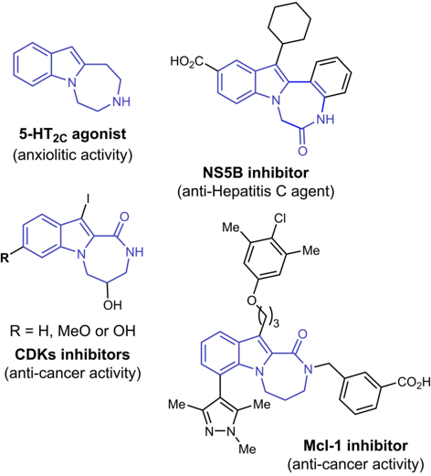

R

R

This work approach that proceeded through a selective C2-

Figure 1. Biological activities of some indole-fused 1,4-diazepines. R

in which fluorinated derivatives were prepared under photo-

R

approach that proceeded through a selective C2alkylation and intramolecular amidation (Scheme 1a). [11] C2-alkylation/amidation sequence was also invoked in the work of P. Sun, in which fluorinated derivatives were prepared under photoredox conditions from o -indoloanilines and ethyl-2bromo-2,2-difluoroacetate (Scheme 1b). [12] Considering this background and the continuous interest of our research group in the synthesis of polycyclic indoles, [13] we envisioned that complex [1,4]diazepino[1,7a ]indol-6(7 H )-ones could be prepared by a cascade radical addition on the C C double bond of N -indolyl phenylacrylamides, followed by cyclization at indole C2-position (Scheme 1c). Cascade cyclizations to afford benzazepine derivatives have been investigated for acrylamide-tethered alkylidenecyclopropanes and styrenes under transition metal [14] and photoredox catalysis, [15] respectively, but any report on indolebased substrates has never been described so far. To verify our hypothesis, we selected acyl radical generated via photoredox catalysis from readily available aroyl chlorides. [16] Photoredox catalysis represents in fact a well-established tool to generate radicals under exceeding mild and selective conditions, [17] and has been recently applied for the synthesis of heterocyclic structures via cascade cyclization that employed these abundant, economic and commercially available substrates as acyl radical precursor. [18]

also invoked in the work of P. Sun,

R

N

N-R

Benzo[2,3][1,4]diazepino

[1,7-a]indol-6(7H)-one

Annulations of o-indolo anilines

RO\_C

AgSbF6

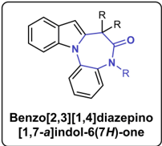

EtOH, 60 °C

R

=0

R

Scheme 1. Reported methodologies for the synthesis of [1,4]diazepino[1,7a ]indol-6(7 H )-ones and objective of this work.

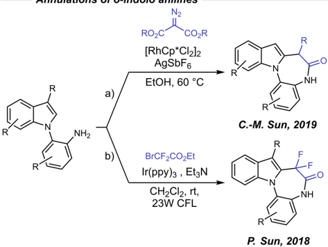

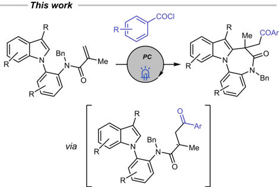

## Results and Discussion

At the beginning of our investigation, we selected N -benzylN -(2-(3-methyl-1 H -indol-1- yl)phenyl)methacrylamide ( 1a ) to verify the viability of the radical cascade cyclization reaction with 4methylbenzoyl chloride ( 2a ) as source of acyl radical. By comparing the oxy-reduction potential of benzoyl chloride [19] and a series of commercially available photocatalysts, [20] we identified Eosin Y, Ru(bpy) 3 (PF6 ) 2 and Ir(ppy) 3 as potential suitable promoters of our transformation. At first, the activity of Eosin Y and Ru(bpy)3(PF6) 2 was tested in the presence

- NH

Wiley Online Library

Synthesis &amp;

Advanced

Me

(a)

N1a

C2c

1a

C1c

COCI

Me

2a

C1d

Table 1. Optimization of reaction conditions. [a]

N1b

Me

N1a

-p-Tol

N

'Bn

Заа

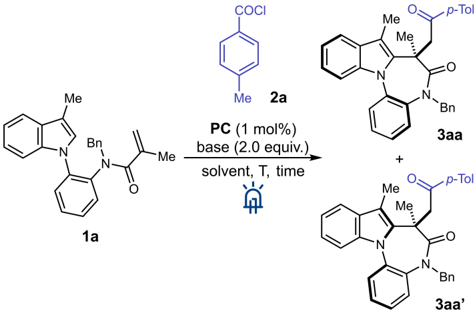

solvent, T, time

(b)

| Entry   | PC (mol%)               | Base         | Yield [%] [b]   | 3aa/3aa' [c]   |
|---------|-------------------------|--------------|-----------------|----------------|
| 1       | Ru(bpy) 3 (PF 6 ) 2 (1) | 2,6-lutidine | -               | n.d.           |
| 2       | Eosin Y (1)             | 2,6-lutidine | 25              | n.d.           |
| 3       | Ir(ppy) 3 (5)           | 2,6-lutidine | 91              | 1.3:1          |
| 4       | Ir(ppy) 3 (5)           | Et 3 N       | 78              | 1.3:1          |
| 5       | Ir(ppy) 3 (5)           | DIPEA        | -               | n.d.           |
| 6       | Ir(ppy) 3 (5)           | K 2 CO 3     | 44              | 1:1.3          |
| 7       | Ir(ppy) 3 (5)           | Na 2 HPO 4   | 29              | 1:1.2          |
| 8 [d]   | Ir(ppy) 3 (5)           | 2,6-lutidine | 61              | 4:1            |
| 9 [e]   | Ir(ppy) 3 (5)           | 2,6-lutidine | 33              | 3.2:1          |
| 10      | Ir(ppy) 3 (1)           | 2,6-lutidine | 88              | 1.3:1          |
| 11 [f]  | Ir(ppy) 3 (1)           | 2,6-lutidine | -               | n.d.           |

of 2 equivalents of 2a and of 2 equivalents of 2,6lutidine as a base, in acetonitrile as solvent. After 20 h of irradiation at rt, we didn't observe the formation of any product with ruthenium catalyst, while Eosin Y gave a 25% yield of two main compounds besides other unidentified by-products (Table 1, entries 1-2). We tested then Ir(ppy) 3 , using the same base and solvent. Remarkably, in this case, the reaction proceeded well, and we were able to isolate and identify the two main products as a couple of isomeric indolefused 1,4-diazepinones 3aa and 3aa' in overall 91% yield and with a ratio of 1.3:1 (Table 1, entry 3). The structure of these compounds characterized by the presence of a center of axial chirality on the indole N C(aryl) axis was confirmed by X-Ray analysis (Figure 2). We next evaluated the role of the base by changing 2,6-lutidine with a series of organic (Et 3N, DIPEA, Table 1, entries 4 and 5) and inorganic (K2CO3, Na2HPO4, Table 1, entries 6 and 7) bases. In any of these cases, we observed an improvement in

Me

Figure 2. The molecular structure of 3aa (a) and 3aa' (b) compounds. Thermal ellipsoids are drawn at the 30% probability level and H atoms are shown as small spheres.

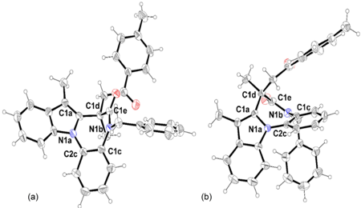

yields. Et3N gave a slightly worse yield than 2,6lutidine, while DIPEA inhibited the formation of the products; similarly inorganic bases led to lower yields.

Wiley Online Library

Synthesis &amp;

Advanced

R1.

R'= H

R°

Ir(ppy)з (1 mol%)

2,6-lutidine (2.0 equiv.)

CH3CN, N2, rt

We tested also different solvents, i. e., 1,2-DCE and DMF but, also in this case, we got worse results than in CH3CN (Table 1, entries 8 and 9). Finally, we reduced the iridium catalyst loading (from 5 mol% to 1 mol%) and we were satisfied to observe a comparable high yield in the formation of 3aa/3aa' (Table 1, entry 10), while in the absence of blue led irradiation any product could be isolated at the end of the reaction (Table 1, entry 11). 4-Br 3ae/ae' 63 1.7:1

'Bn

2-Me

2-CI

75

62

3af/af'

1:1

1:1.4

R'

Having optimized conditions in hands, we evaluated the scope of the reaction with different aroyl chlorides as radical sources and using two different indoles precursors, i. e., N -benzylN -(2-(3-methyl-1 H -indol-1-yl)phenyl)methacrylamide ( 1a ) and the corresponding C3 H derivative 1b (Scheme 2). At the outset, we verified the effect of a series of electronwithdrawing and electron-donating groups at the paraposition of the aroyl moiety. In general, we observed

"Bn

Bn

Scheme 2. Scope of the reaction using different aroyl chlorides or different indole derivatives. The red bold line highlights the N C(aryl) rotational axis.

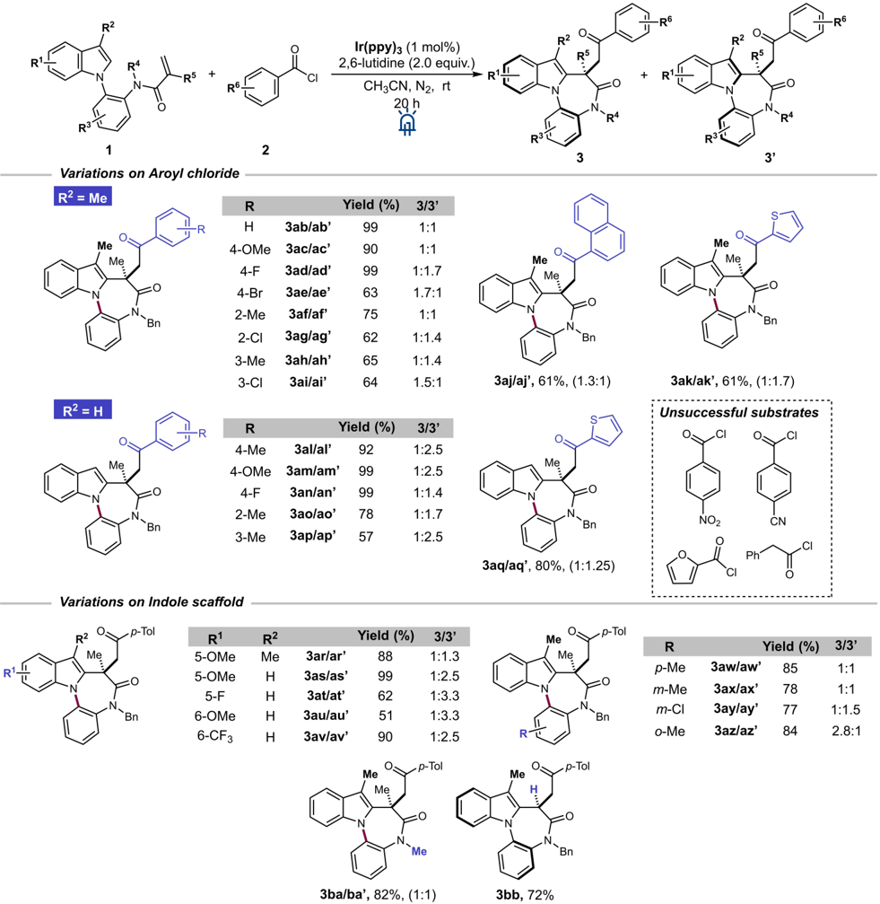

R'

R2

Wiley Online Library

Synthesis &amp;

Advanced

N

- COCI

Ir(ppy)з (1 mol%)

high yields in the formation of the products: simple benzoyl chloride ( 2b ) afforded 3ab/ab' quantitatively, while 4-methoxy ( 3ac/ac' ) and 4-fluoro derivatives ( 3ad/ad' ) were isolated in 90% and 99% yields, respectively. 4-Bromobenzoyl chloride ( 2e ), instead, led to a reduced 63% yield in the formation of 3ae / ae' . The introduction of a methyl or of a chloro substituent at the meta or ortho positions was also well tolerated. Meta -substituted products 3ah/ah' and 3ai/ai' were isolated in 65% and 64% yield, while 2-methyl and 2chlorobenzoyl chlorides afforded 3af/af' and 3ag/ag' in 75% and 62% yield. Finally, the reaction of bulky 1naphthoyl chloride ( 2j) gave the corresponding cyclization product 3aj/aj' in a satisfactory 61% yield, while 3ak/ak' bearing a thiophenyl group was synthesized in 61% yield by reacting 1a and thiophene-2carbonyl chloride ( 2k ). In general, the diastereomeric ratio was around 1:1. Not all the tested acyl chlorides gave good results: 4-nitro and 4-cyano substituted aroyl chlorides, furan-2-carbonyl chloride, and 2phenylacetyl chloride were not reactive under the optimized conditions or led to complex mixtures of side products. The reactions of C3 H indole 1b with the same set of aroyl chlorides gave the desired 1,4diazepinones ( 3al/al'-aq/aq') in comparable satisfactory yields. Noteworthy, in this series of products, the formation of the second isomer was generally favored with d.r. ratios up to 1:2.5.

Next, we focused on the effects of modifications on the indole scaffold, so differently substituted C3 Me or C3 H indoles were reacted with 2a . In particular, we observed that an electron-donating group in the C5 position of the indole promoted the reaction (88 and 99% yield for 5-MeO substituted products 3ar/ar' and 3as/as' ), while an electron-withdrawing substituent has an opposite effect (62% yield with 5-F, 3at/at' ). Conversely, substitutions in at C6 position gave opposite results: the 6-trifluoromethyl group led to a very a high yield ( 3av/av' , 90%) while the methoxy group afforded 3au/au' in a moderate 51% yield. Also in these cases, the formation of the second diastereoisomer was slightly favored. The behavior of C3methylated indoles having a methyl or a chloro group in different positions of Naryl ring was tested; the corresponding products 3aw/aw' , 3ax/ax' , 3ay/ay' and 3az/az' were obtained in good yields and with d.r. ranging from 1:1 up to 2.8:1 when a methyl was placed in the ortho position of phenyl group. This last result could be ascribed to the presence of a bulky substituent at the ortho position that reduced the rotation around the C N axis. The benzyl group on the amide nitrogen in starting compound 1 , could be replaced by a methyl group without loss of reactivity, as demonstrated by the isolation of product 3ba/ba' in 82% and d.r. = 1:1, while N -benzylN -(2-(3-methyl-1 H -indol-1yl)phenyl)acrylamide synthesized from acryloyl chloride and thus having a terminal double bond, p-Tol

yielded 3bb in 72% yield. Interestingly, in this case, 3bb was isolated as a single diastereoisomer revealing that the axial chirality around N C axis was lost due to the presence of the smaller hydrogen atom instead of the bulkier methyl group.

Finally, the indole scaffold could be also replaced by a pyrrole as demonstrated by the isolation of 5a/a' starting from the corresponding N -(2-(1 H -pyrrol-1yl)phenyl)N -benzylmethacrylamide ( 4 ) in satisfactory 57% yield and d.r. = 4:1, while the N -indolyl phenylacrylate derivative 6 was degraded under optimized reaction conditions with the formation of unidentified sub-products (Scheme 3).

As last part of the study of the scope and limitation of the approach, we focused on the C3 position of the indole to verify how the bulkiness of the substituents at this position could influence the formation of the two diastereomeric products (Scheme 4). As observed before for C3 H and C3 Me substituted indoles, smaller groups such an ethyl or an acetyl gave high yields of the corresponding products with a 1:1 diastereomeric ratio ( 3bc/bc' and 3bd/bd' , 89% and 71% respectively). Phenyl and p -tolyl rings on C3 were also well tolerated and led to the formation of 3be/be' and 3bf/bf' in 84% and 99% yield, respectively. Interestingly, these aromatic substituents, favored the formation of the first isomer, with diastereomeric ratios around 3:1. Finally, the sterically hindered 2,6-dimethylphenyl ring at C3 position of starting indole reacted with 2a to give 3bg in lower yield (65%) but as a single product. Similar results were also

Scheme 3. Extension of the methodology to other substrates.

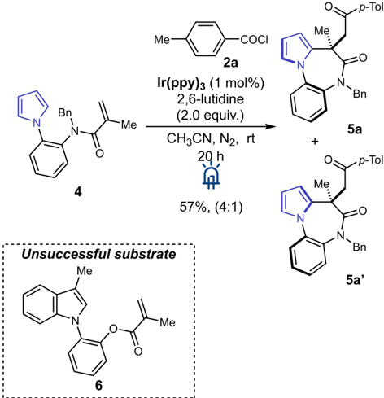

Wiley Online Library

Synthesis &amp;

Advanced

Me

R

N

Bn

Bn

- Me

1a

1

950 mg (2.5 mmol)

3bc/bc', 89%, (1:1)

3be/be', 84%, (2.7:1)

Me

3bg, 65%, (&gt;20:1)

precursor

Іг(рру)з (1 mol%)

Base

Solvent, N2, rt

20 h

'Bn

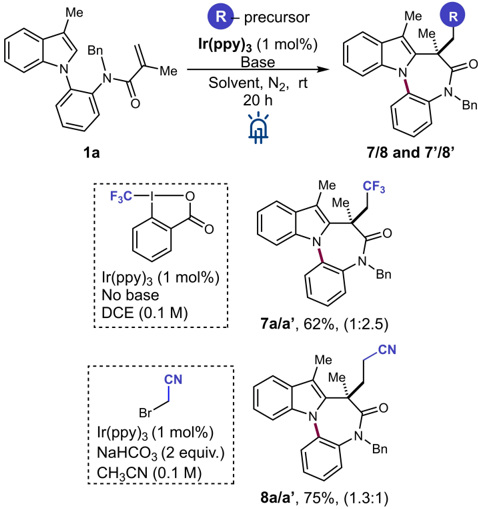

Me

Bn bromoacetonitrile.

Scheme 5. Reactions between 1a and Togni II reagent or bromoacetonitrile.

As observed during the study of the reaction scope, in almost all cases, the photoredox catalyzed reaction

reaction could be conducted with a catalyst loading of 0.5 mol% and led to 3a/a' in a slightly decreased 80% overall yield (Scheme 6).

COCI

- COCI

2

2a

2,6-lutidine

(2.0 equiv.)

(2.0 equiv.)

CH3CN, N2, rt

Scheme 4. Modifications of the indole scaffold at C3-position.

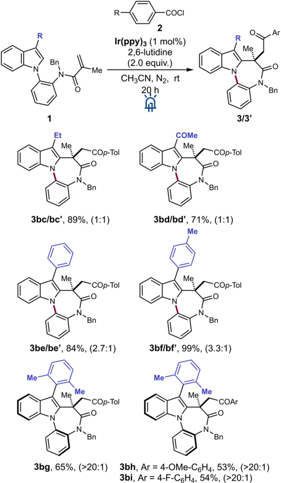

obtained using 4-methoxy and 4-fluorobenzoyl chlorides as reaction partners (products 3bh and 3bi ).

In order to expand the applicability of our methodology, we switched our attention to other radical precursors than acyl chlorides. In particular, we briefly evaluated the reactivity of Togni II reagent and bromoacetonitrile as trifluoromethyl and alkyl radicals sources, in the reaction with N -benzylN -(2-(3-methyl1 H -indol-1-yl)phenyl)methacrylamide ( 1a ). Initially, reactions were conducted under previously optimized conditions, but the corresponding products were isolated in low to modest yields. Nevertheless, simple modifications of the reaction conditions (use of a different solvent or base) allowed for the preparation of 7a/a' and 8a/a' in good yields (Scheme 5).

The robustness of the photoredox catalyzed cyclization was further demonstrated by increasing the scale of the reaction up to 2.5 mmol of 1a . In this case, the

As observed during the study of the reaction scope, in almost all cases, the photoredox catalyzed reaction yielded two different diastereomeric products, due to the formation of a new quaternary stereocenter and because of N C(aryl) axial chirality center. Moreover, we discovered that some pure isolated diastereoisomers, if left in solution, converted into a mixture of the two isomers. This phenomenon was particularly relevant for C3 H free products, while C3 substituted indoles resulted to be generally more stable. Therefore, to get insight into the relative stability of the two isomers we decided to verify how an increase of the

Scheme 6. Scale-up of the reaction.

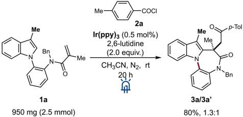

Me

Me-

R

Me p-Tol

Ar

Me

Advanced

Wiley Online Library

-COp-Tol

Synthesis &amp;

N

R

N

R

Me

H

Ph

'Bn

COCI

Me 2a

-p-Tol

" Bn reaction temperature could affect the reaction outcome (Scheme 7). +

Remarkably, when the reactions were performed at 80 ° C instead of at room temperature, the formation of the second isomer ( 3' ) was generally favored, and in the case of C3-aryl indole derivatives, the d.r. was significantly shifted. The ratio between products 3al/ al' , having the indole C3-position free, was less influenced by the temperature, probably because the thermodynamic equilibrium could be easily reached also without heating, while C3-methylated indole derivatives 3aa / 3aa' were formed in a 1:5 ratio, instead than 1.3:1. As previously mentioned, in the case of C3-phenyl substituted products 3be / 3be' the d.r. was shifted in favor of the second isomer (from 2.7:1 at rt to 1:1.3 at 80 ° C), but with a lower 56%

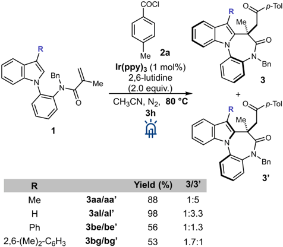

Scheme 7. Reactions performed at 80 ° C.

Table 2. Calculated rotational barriers for 3aa/aa' and 3be/be' .

| ΔG            | T              |
|---------------|----------------|
| 24.7 kcal/mol | 308 K (35 ° C) |
| 26.0 kcal/mol | 348 K (75 ° C) |
| 25.4 kcal/mol | 323 K (50 ° C) |
| 24.6 kcal/mol | 343 K (70 ° C) |

R

yield. Similarly, the reaction conducted with C3-2,6dimethylphenyl indole had a moderate yield (53%), but afforded two different diastereoisomers 3bg/bg' in similar amounts (1.2:1), instead of a single product.

We also performed a series of thermal diastereoisomerization experiments to better understand the conformational stability of the products. As reported in the literature, the rotational barriers of the two diastereoisomers can be evaluated by kinetic experiments followed by HPLC or NMR spectroscopy. [21] We performed NMR kinetic experiments on both isolated isomers 3aa/aa' and 3be/be' heating the sample at a prefixed temperature and checking the NMR spectrum at a fixed time. The growth of the signal of the other diastereoisomer was therefore monitored. The energy barriers for the interconversion of the two diastereoisomers are calculated from Eyring equation (see ESI). The results are summarized in Table 2. The range of the calculated rotational barriers presents moderate values in agreement with the class 2 in the classification proposed by LaPlante and Hucke, [22] meaning that the two different isomers can be separated and stored at room temperature. This is in agreement with the experimental evidence: the two couple of compounds were isolated and characterized completely as single isomers and interconversion occurred only in solution after a prolonged time at room temperature. The calculated values of energy barriers for both couples of isomers are comparable, ranging from 24.6 to 26.0 kcal/mol. Moreover, the energy difference between the two diastereoisomers is around 1 kcal/mol, thus confirming the formation of both isomers performing the reaction at room temperature.

Finally, considering the experimental results and previous literature reports on cascade cyclizations of acrylamide-tethered substrates, [14-15] including reactions with acyl radicals, [18c,e,19] the mechanism that we propose for the synthesis of indole-fused 1,4-benzodia-

Wiley Online Library

Synthesis &amp;

Advanced

Me

2a

-H* Заа'

Bn

Me

- COCI

2a

2,6-lutidine

(2.0 equiv.)

zepinones is showed in Scheme 8. Excitation of Ir(ppy) 3 , under blue led irradiation led to formation of excited *Ir III species that, through a single electron transfer, reduced 4-methylbenzoyl chloride ( 2a ) to form radical anion and Ir IV ; Ir(ppy) 3 : (E1/2 IV/III = 1.73 V vs SCE), [20] [benzoyl chloride: (E1/2 = 1.020 V vs SCE)]. [19] This anion underwent fragmentation and chlorine loss to generated aroyl radical I , which reacted with the double bond of the acryloyl group on indole 1a to give intermediate II . Cyclization on the indole C2-position afforded III , which gave cationic

Заа/Заа'

not detected

Scheme 8. Proposed reaction mechanism.

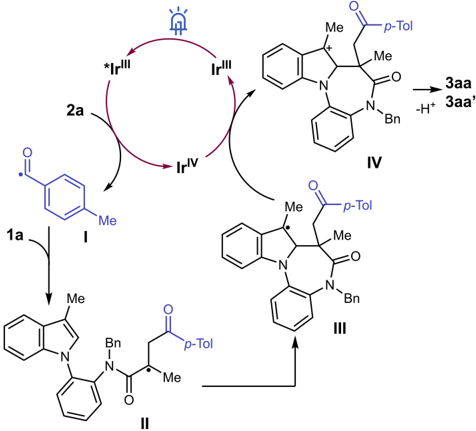

Scheme 9. Radical trapping experiment with TEMPO.

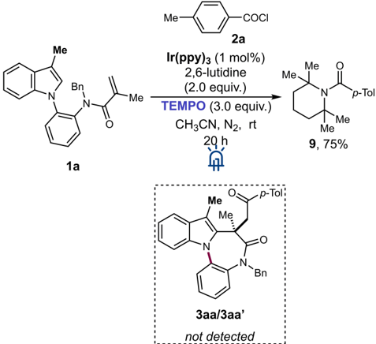

1a

Me

-p-Tol

Me

Me.

Me

→ Заа

intermediate IV by reduction of Ir IV . Final aromatization of IV led to final products 3aa/aa' (Scheme 8).

As support of the proposed mechanism that involves the initial formation of an acyl radical, we performed a radical trapping experiment in the presence of TEMPO (Scheme 9). In particular, when TEMPO was added under optimized conditions the formation of products 3aa/aa' was inhibited, while (2,2,6,6-tetramethylpiperidin-1-yl)( p -tolyl)methanone 9 could be isolated in 75% yield. This result confirmed that the reaction proceeds through an acyl radical pathway.

## Conclusion

In conclusion, we have developed the synthesis of [1,4]diazepino[1,7a ]indol-6(7 H )-one derivatives starting from N -indolyl phenylacrylamides and aroyl chlorides under visible-light photoredox-catalyzed conditions. Cascade radical addition to the alkene double bond and intramolecular cyclization at the C2 position of indole are involved in the formation of two diastereoisomeric indole-fused 1,4-diazepinones characterized by the presence of a N C(aryl) axial chirality center. The protocol could be also be extended to pyrrole derivatives as well to other radical precursors such as Togni II reagent and bromoacetonitrile. Therefore, we believe that our strategy provides an access to indole-based structures that could be of potential interest in pharmaceutical discovery.

## Experimental Section

## Crystallographic Data

CCDC 2277852, 2277853 and 2277854 contains the supplementary crystallographic data for this paper. These data can be obtained free of charge from The Cambridge Crystallographic Data Centre via www.ccdc.cam.ac.uk/structures.

## General Experimental Procedure for the Synthesis of Indole-Fused 1,4-Diazepinones 3/3'

Ir(ppy) 3 (1 mol%) and N -indolyl phenylacrylamide derivatives 1 (0.2 mmol) were charged into a dry vial equipped with a stirring bar. The vial was capped with an aluminum crimp seal with septum and was evacuated and refilled with N2 (3x). In the absence of light, CH3CN (2 mL, 0.1 M), previously degassed with three freeze-pump-thaw cycles was added, followed by 2,6-lutidine (2 equiv.) and aroyl chloride 2 (2 equiv.) Then, the blue LEDs (440 nm, 40 W) were switched on and the reaction mixture was stirred for 20 h at room temperature (fan cooling). After that time, the mixture was quenched with NaHCO3 and extracted with EtOAc. The combined organic layers were dried over Na2 SO4, filtered and concentrated under vacuum. Purification of the crude by flash column chromatography yielded progressively indole-fused 1,4-diazepinone derivatives 3 and 3' .

## Acknowledgements

The authors acknowledge MUR-Italy (PostDoc fellowship to E.B.) for financial support. Lucia Feni, and Stefano Pandini (Università degli Studi di Milano) are thanked for some mass analyses. Prof. Elisabetta Rossi is acknowledged for helpful discussions and suggestions.

## References

- [1] a) V. Sharma, P. Kumar, D. Pathak, J. Heterocycl. Chem. 2010 , 47 , 491-502; b) N. Chadha, O. Silakari, Eur. J. Med. Chem. 2017 , 134 , 159-184; c) V. M. Norwood IV, R. W. Huigens III, ChemBioChem 2019 , 20 , 2273-2297; d) B. Suliphuldevara Mathada, N. Gunavanthrao Yernale, J. N. Basha, ChemistrySelect 2023 , 8 , e202204181.
- [2] M. D. Ennis, R. L. Hoffman, N. B. Ghazal, R. M. Olson, C. S. Knauer, C. L. Chio, D. K. Hyslop, J. E. Campbell, L. W. Fitzgerald, N. F. Nichols, K. A. Svensson, R. B. McCall, C. L. Haber, M. L. Kagey, D. M. Dinh, Bioorg. Med. Chem. Lett. 2003 , 13 , 2369-2372.
- [3] X. Zheng, T. W. Hudyma, S. W. Martin, C. Bergstrom, M. Ding, F. He, J. Romine, M. A. Poss, J. F. Kadow, C.H. Chang, J. Wan, M. R. Witmer, P. Morin, D. M. Camac, S. Sheriff, B. R. Beno, K. L. Rigat, Y.-K. Wang, R. Fridell, J. Lemm, D. Qiu, M. Liu, S. Voss, L. Pelosi, S. B. Roberts, M. Gao, J. Knipe, R. G. Gentles, Bioorg. Med. Chem. Lett. 2011 , 21 , 2925-2929.
- [4] A. Putey, G. Fournet, O. Lozach, L. Perrin, L. Meijer, B. Joseph, Eur. J. Med. Chem. 2014 , 83 , 617-629.
- [5] T. Lee, P. P. Christov, S. Shaw, J. C. Tarr, B. Zhao, N. Veerasamy, K. O. Jeon, J. J. Mills, Z. Bian, J. L. Sensintaffar, A. L. Arnold, S. A. Fogarty, E. Perry, H. E. Ramsey, R. S. Cook, M. Hollingshead, M. Davis Millin, K.-M. Lee, B. Koss, A. Budhraja, J. T. Opferman, K. Kim, C. L. Arteaga, W. J. Moore, E. T. Olejniczak, M. R. Savona, S. W. Fesik, J. Med. Chem. 2019 , 62 , 39713988.
- [6] a) Y. G. Shelke, P. E. Hande, S. J. Gharpure, Org. Biomol. Chem. 2021 , 19 , 7544-7574; b) Y. Yao, M. Alami, A. Hamze, O. Provot, Org. Biomol. Chem. 2021 , 19 , 3509-3526.
- [7] D. G. Pintori, M. F. Greaney, J. Am. Chem. Soc. 2011 , 133 , 1209-1211.
- [8] T. U. Thikekar, C. M. Sun, Adv. Synth. Catal. 2017 , 359 , 3388-3396.
- [9] Y. Ohta, H. Chiba, S. Oishi, N. Fujii, H. Ohno, Org. Lett. 2008 , 10 , 3535-3538.
- [10] S. Basceken, S. Kaya, M. Balci, J. Org. Chem. 2015 , 80 , 12552-12561.
- [11] S. Dhole, W. J. Chiu, C. M. Sun, Adv. Synth. Catal. 2019 , 361 , 2916-2925.
- [12] G. Lian, J. Li, P. Liu, P. Sun, J. Org. Chem. 2019 , 84 , 9322-9329.
- [13] a) V. Pirovano, M. Dell ' Acqua, D. Facoetti, D. Nava, S. Rizzato, G. Abbiati, E. Rossi, Eur. J. Org. Chem. 2013 , 2013 , 6267-6279; b) V. Pirovano, L. Decataldo, E. Rossi, R. Vicente, Chem. Commun. 2013 , 49 , 35943596; c) V. Pirovano, E. Arpini, M. Dell ' Acqua, R. Vicente, G. Abbiati, E. Rossi, Adv. Synth. Catal. 2016 , 358 , 403-409; d) V. Pirovano, M. Borri, G. Abbiati, S. Rizzato, E. Rossi, Adv. Synth. Catal. 2017 , 359 , 19121918; e) V. Pirovano, E. Brambilla, A. Moretti, S. Rizzato, G. Abbiati, D. Nava, E. Rossi, J. Org. Chem. 2020 , 85 , 3265-3276; f) E. Brambilla, E. Moretti, M. Magni, G. Abbiati, V. Pirovano, Chem. Commun. 2023 , 59 , 3281-3284.
- [14] L.-Z. Yu, Q. Xu, X.-Y. Tang, M. Shi, ACS Catal. 2016 , 6 , 526-531.
- [15] Y. Zhao, J.-R. Chen, W.-J. Xiao, Org. Lett. 2018 , 20 , 224-227.
- [16] A. Banerjee, Z. Lei, M.-Y. Ngai, Synthesis 2019 , 51 , 303-333.
- [17] a) M. H. Shaw, J. Twilton, D. W. MacMillan, J. Org. Chem. 2016 , 81 , 6898-6926; b) J. R. Chen, X. Q. Hu, L. Q. Lu, W. J. Xiao, Acc. Chem. Res. 2016 , 49 , 19111923; c) L. Marzo, S. K. Pagire, O. Reiser, B. Konig, Angew. Chem. Int. Ed. Engl. 2018 , 57 , 10034-10072; d) G. Q. Xu, P. F. Xu, Chem. Commun. 2021 , 57 , 1291412935.
- [18] a) Y. Liu, Q.-L. Wang, C.-S. Zhou, B.-Q. Xiong, P.-L. Zhang, S.-J. Kang, C.-A. Yang, K.-W. Tang, Tetrahedron Lett. 2018 , 59 , 2038-2041; b) Y. Liu, Q.-L. Wang, C.-S. Zhou, B.-Q. Xiong, P.-L. Zhang, C.-A. Yang, K.-W. Tang, J. Org. Chem. 2018 , 83 , 2210-2218; c) Y.-L. Wei, J.-Q. Chen, B. Sun, P.-F. Xu, Chem. Commun. 2019 , 55 , 5922-5925; d) Y. Liu, Z. Chen, Q.-L. Wang, P. Chen, J. Xie, B.-Q. Xiong, P.-L. Zhang, K.-W. Tang, J. Org. Chem. 2020 , 85 , 2385-2394; e) C.-G. Li, G.-Q. Xu, P.-F. Xu, Org. Lett. 2017 , 19 , 512-515.
- [19] S.-M. Xu, J.-Q. Chen, D. Liu, Y. Bao, Y.-M. Liang, P.-F. Xu, Org. Chem. Front. 2017 , 4 , 1331-1335.
- [20] D. Nicewicz, H. Roth, N. Romero, Synlett 2016 , 27 , 714-723.
- [21] a) D. C. Patel, R. M. Woods, Z. S. Breitbach, A. Berthod, D. W. Armstrong, Tetrahedron: Asymmetry 2017 , 28 , 1557-1561; b) H. Tabata, K. Akiba, S. Lee, H. Takahashi, H. Natsugari, Org. Lett. 2008 , 10 , 4871-4874.
- [22] a) S. R. LaPlante, L. D. Fader, K. R. Fandrick, D. R. Fandrick, O. Hucke, R. Kemper, S. P. F. Miller, P. J. Edwards, J. Med. Chem. 2011 , 54 , 7005-7022; b) S. R. LaPlante, P. J. Edwards, L. D. Fader, A. Jakalian, O. Hucke, ChemMedChem 2011 , 6 , 505-513.

