Bull. Chem. Soc. Ethiop. 2019 , 33(1), 149-158.                                                             ISSN 1011-3924  2019 Chemical Society of Ethiopia and The Authors                                           Printed in Ethiopia DOI: https://dx.doi.org/10.4314/bcse.v33i1.15

## CAFFEINE AS A NATURALLY GREEN AND BIODEGRADABLE CATALYST PROMOTED CONVENIENT AND EXPEDIENT SYNTHETIC ROUTE FOR THE SYNTHESIS OF POLYSUBSTITUTED DIHYDRO-2-OXYPYRROLES

## Farzaneh Mohamadpour *

Young Researchers and Elite Club, Shiraz Branch, Islamic Azad University, Shiraz, Iran

(Received July 31, 2018; Revised January 10, 2019; Accepted January 16, 2019)

ABSTRACT . A  green,  convenient,  high  yielding  and  one-pot  procedure  for  synthesis  of  high  substituted dihydro-2-oxypyrroles  by  domino  four-component  condensation  reaction  between  aromatic/aliphatic  amines , dialkyl  acetylenedicarboxylate and  formaldehyde in  the  presence  of  a  catalytic  amount  of  caffeine  as  a  green, natural, expedient and biodegradable catalyst under ambient temperature was studied. The salient features of this green  approach  are  simplicity  of  operation  and  work-up  procedures  with  no  necessity  of  chromatographic purification steps, use of safe, non-volatile, non-corrosive and green catalyst, the availability and easy to handle of this solid catalyst, one-pot reaction, economical and clean synthesis.

KEY WORDS : Caffeine, Green catalyst, Polysubstituted dihydro-2-oxypyrroles, Ambient temperature, Simple work-up

## INTRODUCTION

Polyfunctionalized  heterocyclic  compounds  are  playing  important  roles  in  drug  discovery processes and  in the  analysis  of  drugs.  In  particular,  pyrroles  [1,  2]  and  their  analogues  have been receiving attention  owing to their biological and  pharmacological  properties [3]  such  as human cytomegalovirus (HCMV) protease [4], human cytosolic carbonic anhydrase isozymes [5],  they  have  been  used  as  PI-091  [6],  and  cardiac  cAMPphosphodiestrase  [7],  many  of  the alkaloids have pyrrole rings [8]. Also, these rings have been utilized as Oteromycin [9]. They exhibit  various  biological  activities,  for  example  (imidazolylphenyl)  pyrrol-2-one  [7]  and VEGF-R,  a  vascular  endothelial  growth  factor  receptor  [10].  Some  of  them  with  biological properties have been shown in Figure 1.

Figure 1. Biologically active compounds with dihydro-2-oxypyrrole rings.

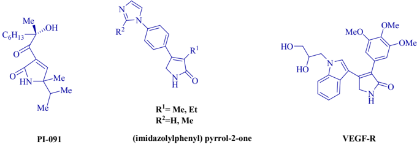

To  date,  methods  for  the  synthesis  of  high  substituted  dihydro-2-oxypyrroles  have  been reported  using  MCRs  in  the  presence  of  various  catalysts  such  as  I2 [11],  InCl3 [12],  [nBu4N][HSO4]  [13],  Al(H2PO4)3  [14],  AcOH  [15],  Cu(OAc)2.H2O  [16],  oxalic  acid  dihydrate [17],  ZrCl4  [18]  and  Fe3O4@nano-cellulose-OPO3H  [19].  Some  of  these  methods  have

\_\_\_\_\_\_\_\_\_\_

*Corresponding author. E-mail: mohamadpour.f.7@gmail.com

This work is licensed under the Creative Commons Attribution 4.0 International License

limitations such as long time reactions, low yields, the use of strongly acidic conditions, high temperature, difficulty work-up, toxic and expensive catalysts.

The detection and measurement of caffeine (CAF) (Figure 2) or trimethylxanthine alkaloid, as a central nervous system and metabolic stimulant [20], have attracted the attention of many researchers.  This  compound  is  chemically  related  to  the  adenine  and  guanine  bases  of deoxyribonucleic  acid  (DNA)  and  ribonucleic  acid  (RNA).  In  the  case  of  multifunctional molecules, such as caffeine, there may be several sites for protonation (Figure 3). Proton affinity (PA) is one  of the most important thermodynamic quantities that link the thermochemistry of ions to that of the neutral molecules [21].

Figure 2. Structure of Caffeine.

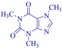

Figure 3. Protonation of caffeine.

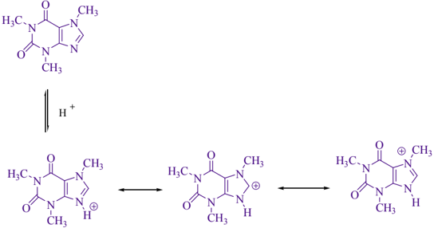

The design of multi-component reactions (MCRs) [22-32] has received great attention from research  groups  in  medicinal  chemistry,  drug  discovery  and  materials  science  due  to  their significant  advantages  over  conventional  linear-type  synthesis,  including  simple  procedures, environmental friendliness, atom economy, and the ability to generate architecturally complex molecules in one synthetic step.

Scheme 1. Synthesis of polysubstituted dihydro-2-oxypyrroles.

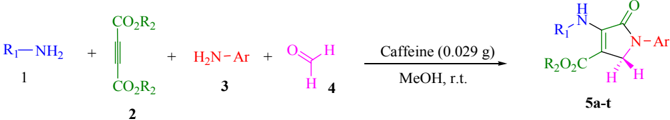

Finally, due to the above considerations and in continuation of our work on the development of useful and green synthetic methodology for the preparation of biologically active heterocyclic compounds  using  of  caffeine  as  catalyst  [33],  we  report  herein,  synthesis  of  polysubstituted dihydro-2-oxypyrroles via one-pot,  four  condensation  domino  reaction  between  aromatic/ aliphatic amines (1 and 3 ), dialkyl acetylenedicarboxylate 2 and formaldehyde 4 in the presence

Bull. Chem. Soc. Ethiop. 2019 , 33(1)

of caffeine as a cost effective, green, biodegradable and readily catalyst under mild conditions (Scheme 1).

## EXPERIMENTAL

Melting points all compounds were determined using an Electro thermal 9100 apparatus. Also, nuclear  magnetic  resonance, 1 H  NMR spectra  were  recorded  on  a  Bruker  DRX-400  Avance instrument with CDCl3 as solvent. All reagents and solvents were purchased from Merck, Fluka and Acros chemical companies were used without further purification.

General procedure for preparation of substituted dihydro-2-oxypyrroles ( 5a-t )

A mixture of amine 1 (1.0 mmol) and dialkyl acetylenedicarboxylate 2 (1.0 mmol) was stirred in MeOH (3  mL)  for  15  min.  Next,  amine 3 (1.0  mmol)  and  formaldehyde 4 (1.5  mmol)  and caffeine (15 mol %, 0.029 g) were added and the reaction was stirred for appropriate time. After completion of the reaction (by thin layer chromatography TLC), the mixture was separated by filtration  and  the  solid  washed  with  ethanol  (3×2  mL)  with  no  column  chromatographic separation to give pure compounds ( 5a-t ).  The  products  were  characterized  by comparison of spectroscopic data ( 1 HNMR). Spectra data some of known products are represented below.

Methyl4-(4-fluoroyphenylamino)-1-(4-fluorophenyl)-2,5-dihydro-5-oxo-1H-pyrrole-3-carboxylate ( 5c ) . Yield: 87%; m.p. 164-165 °C; 1 H NMR (400 MHz, CDCl3): 3.79 (3H, s, OCH3), 4.52 (2H, s, CH2-N), 7.04 (2H, t, J =8.4 Hz, ArH), 7.08-7.16 (4H, m, ArH), 7.73-7.76 (2H, m, ArH), 8.05 (1H, s, NH).

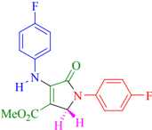

H

Methyl4-(4-methoxyphenylamino)-1-(4-methoxyphenyl)-2,5-dihydro-5-oxo-1H-pyrrole-3-carboxylate  ( 5g ) .  Yield:  85%;  m.p.  175-177  °C; 1 H NMR (400 MHz, CDCl3): 3.77 (3H, s, CH3), 3.83 (6H, s, 2OCH3), 4.50 (2H, s, CH2-N), 6.89 (4H, d, J =17.6 Hz,  ArH), 7.13 (1H, s, ArH) ,7.68 (1H, s, ArH), 8.03 (1H, s, NH).

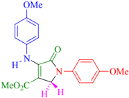

Ethyl4-(4-methoxyphenylamino)-1-(4-methoxyphenyl)-2,5-dihydro-5-oxo-1H-pyrrole-3-carboxylate ( 5h ) . Yield: 87%; m.p. 150-152 °C; 1 H NMR (400 MHz, CDCl3): 1.26 (3H, t, J = 7.2 Hz, CH2CH3), 3.83 (6H, s, 2OCH3), 4.23 (2H, q, J = 7.2 Hz, CH2CH3), 4.50 (2H, s, CH2-N), 6.87 (2H, d, J = 8.8 Hz, ArH), 6.93 (2H, d, J = 8.8 Hz, ArH), 7.12 (2H, d, J = 8.8 Hz, ArH), 7.69 (2H, d, J = 8.8 Hz, ArH), 8.02 (1H, s, NH).

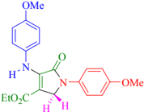

H

Methyl4-(4-methylphenylamino)-1-(4-methylphenyl)-2,5-dihydro-5-oxo-1H-pyrrole-3-carboxylate ( 5k ) . Yield: 89%; m.p. 176-178 °C; 1 H NMR (400 MHz, CDCl3): 2.36 (6H, s, 2CH3), 3.77 (3H, s, OCH3), 4.52( 2H, s, CH2-N), 7.06 (2H, d, J = 8.4 Hz, ArH), 7.14 (2H, d, J = 8.4 Hz, ArH), 7.21(2H, d, J = 8.4 Hz, ArH), 7.68 (2H, d, J = 8.8 Hz, ArH), 8.03 (1H, s, NH).

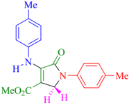

H

Ethyl4-(4-methylphenylamino)-1-(4-methylphenyl)-2,5-dihydro-5-oxo-1H-pyrrole-3-carboxylate ( 5l ): Yield:  86%;  m.p.  132-134  °C; 1 H  NMR  (400  MHz,  CDCl3):  1.25  (3H,  t, J =7.2  Hz, CH2CH3), 2.37 (6H, s, 2CH3), 4.23 (2H, q, J = 7.2  Hz,  2CH2CH3),  4.53  (2H,  s,  CH2-N),7.06 (2H, d, J = 8.4 Hz, ArH), 7.14 (2H, d, J = 8.4 Hz, ArH), 7.21 (2H, d, J = 8.4 Hz, ArH), 7.69 (2H, d, J = 8.4 Hz, ArH), 8.01 (1H, s, NH).

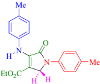

Methyl4-(4-ethylphenylamino)-1-(4-ethylphenyl)-2,5-dihydro-5-oxo-1H-pyrrole-3-carboxylate ( 5m ) . Yield:  82%;  m.p.  126-128  °C; 1 H  NMR  (400  MHz,  CDCl3):  1.26  (6H,  t, J =2.4  Hz, 2CH2CH3), 2.67 (4H, q, J = 7.2 Hz, 2CH2CH3), 3.76 (3H, s, 2OCH3), 4.53 (2H, s, CH2-N),7.09 (2H, d, J = 8.4 Hz, ArH), 7.17 (2H, d, J = 8.4 Hz, ArH), 7.24 (2H, d, J = 8.8 Hz, ArH), 7.70 (2H, d, J = 8.8 Hz, ArH), 8.05(1H, s, NH).

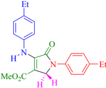

Ethyl4-(4-ethylphenylamino)-1-(4-ethylphenyl)-2,5-dihydro-5-oxo-1H-pyrrole-3carboxylate ( 5n ) . Yield: 84%; m.p. 102-104 °C; 1 H NMR (400 MHz, CDCl3): 1.24 (9H, m, 3 CH2CH3), 2.67 (4H, q, J = 7.2 Hz, 2CH2CH3), 4.22 (2H, q, J = 7.2 Hz, CH2CH3), 4.54 (2H, s, CH2-N), 7.09

Bull. Chem. Soc. Ethiop. 2019 , 33(1)

(2H, d, J = 8.4 Hz, ArH), 7.16 (2H, d, J = 8.4 Hz, ArH), 7.24 (2H, d, J =8.4 Hz, ArH), 7.71 (2H, d, J =8.8 Hz, ArH), 8.01 (1H, s, NH).

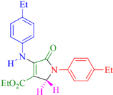

H

Ethyl 1-(4-bromophenyl)-3-(butylamino)-2,5-dihydro-2-oxo-1H-pyrrole-4-carboxylate ( 5q ) . Yield: 78%; m.p. 93-95 °C; 1 H NMR (400 MHz, CDCl3): 0.97 (3H, t, J = 7.2 Hz, CH3), 1.35 (3H, t, J = 7.2 Hz, OCH2CH3), 1.43 (2H, sextet, J = 7.6 Hz, CH2), 1.61 (2H, quintet, J = 7.6 Hz, CH2), 3.87 (2H, t, J = 7.2 Hz, CH2-NH), 4.28 (2H, q, J = 7.2 Hz, OCH2CH3), 4.40 (2H, s, CH2N), 6.72 (1H, br s, NH), 7.52 (2H, d, J = 8.8 Hz, ArH), 7.70 (2H, d, J = 8.8 Hz, ArH).

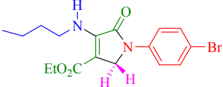

H

## RESULTS AND DISCUSSION

To generality of this transformation, we investigated caffeine catalyzed four-component reaction between aniline (2 mmol), dimethyl acetylenedicarboxylate (DMAD) (1 mmol) and formaldehyde  (1.5  mmol)  as  a  model  reaction  under  mild  conditions  for  the  synthesis  of dihydro-2-oxypyrroles. The amount of catalyst was studied with this method and in the absence of  caffeine:  a  trace  amount  of  this  product  was  generated  after 14  h  (Table 1,  entry  1).  Good yields were obtained in the presence of a catalyst. The best amount of catalyst was 15 mol % (Table 1, entry 4). The higher amount of catalyst did not increase the yields products (Table 1, entry  11)  and  the  results  are  summarized  in  Table  1.  The  effect  of  various  solvents  was investigated  for  this  protocol  H2O,  CH2Cl2,  CHCl3,  EtOH,  MeOH  and  CH3CN.  Herein,  the reaction occurred efficiently to afford the corresponding polysubstituted dihydro-2-oxypyrroles

Table 1. Optimization of the reaction condition in the presence of different amounts of caffeine a .

|   Entry | Caffeine (mol %)   | Solvent      |   Time (h) | Isolated yields (%)   |
|---------|--------------------|--------------|------------|-----------------------|
|       1 | Catalyst free      | MeOH         |         14 | Trace                 |
|       2 | 5                  | MeOH         |          6 | 45                    |
|       3 | 10                 | MeOH         |          4 | 73                    |
|       4 | 15                 | MeOH         |          3 | 88                    |
|       5 | 15                 | EtOH         |          4 | 68                    |
|       6 | 15                 | H 2 O        |          8 | 14                    |
|       7 | 15                 | Solvent free |          6 | 40                    |
|       8 | 15                 | CH 2 Cl 2    |          7 | 31                    |
|       9 | 15                 | CHCl 3       |          7 | 27                    |
|      10 | 15                 | CH 3 CN      |          6 | 35                    |
|      11 | 20                 | MeOH         |          3 | 89                    |
|      12 | 20                 | EtOH         |          4 | 77                    |

a Reaction conditions: aniline (2 mmol), dimethyl acetylenedicarboxylate (1 mmol) and formaldehyde (1.5 mmol) and caffeine in various solvents at room temperature.

in 88 % yield when 15 mol% caffeine was used in MeOH at room temperature (Table 1, entry 4).  The  efficiency  of  caffeine  was  demonstrated  by  synthesizing  polysubstituted  dihydro-2oxypyrroles via four-component condensation using a series aromatic/aliphatic amines ( 1 and 3 , 2  mmol),  dialkyl  acetylenedicarboxylate  ( 2 ,  1  mmol)  and  formaldehyde  ( 4 ,  1.5  mmol)  at ambient temperature which results are shown in Table 2.

Table 2. Caffeine catalyzed synthesis of polysubstituted dihydro-2-oxypyrroles.

|   Entry | R 1           | R 2   | Ar                | Product   |   Time (h) |   Yield (%) a | M.p. ° C   | Lit. M.p. ° C   |
|---------|---------------|-------|-------------------|-----------|------------|---------------|------------|-----------------|
|       1 | Ph            | Me    | Ph                | 5a        |          3 |            88 | 154-156    | 155-156 [11]    |
|       2 | Ph            | Et    | Ph                | 5b        |          3 |            86 | 140-141    | 138-140 [15]    |
|       3 | 4-F-C 6 H 4   | Me    | 4-F-C 6 H 4       | 5c        |        2.5 |            87 | 164-165    | 163-165 [12]    |
|       4 | 4-F-C 6 H 4   | Et    | 4-F-C 6 H 4       | 5d        |        2.5 |            88 | 173-174    | 172-174 [13]    |
|       5 | 4-Br-C 6 H 4  | Me    | 4-Br-C 6 H 4      | 5e        |          4 |            80 | 177-180    | 175-177 [13]    |
|       6 | 4-Br-C 6 H 4  | Et    | 4-Br-C 6 H 4      | 5f        |          5 |            78 | 168-170    | 169-171 [15]    |
|       7 | 4-OMe-C 6 H 4 | Me    | 4-OMe-C 6 H 4     | 5g        |        3.5 |            85 | 175-177    | 172-175 [13]    |
|       8 | 4-OMe-C 6 H 4 | Et    | 4-OMe-C 6 H 4     | 5h        |        4.5 |            87 | 150-152    | 152-154 [14]    |
|       9 | 4-Cl-C 6 H 4  | Me    | 4-Cl-C 6 H 4      | 5i        |          4 |            83 | 170-172    | 171-173 [13]    |
|      10 | 4-Cl-C 6 H 4  | Et    | 4-Cl-C 6 H 4      | 5j        |        4.5 |            85 | 166-168    | 168-170 [13]    |
|      11 | 4-Me-C 6 H 4  | Me    | 4-Me-C 6 H 4      | 5k        |          3 |            89 | 176-178    | 177-178 [14]    |
|      12 | 4-Me-C 6 H 4  | Et    | 4-Me-C 6 H 4      | 5l        |          3 |            86 | 132-134    | 131-132 [15]    |
|      13 | 4-Et-C 6 H 4  | Me    | 4-Et-C 6 H 4      | 5m        |        3.5 |            82 | 126-128    | 124-125 [19]    |
|      14 | 4-Et-C 6 H 4  | Et    | 4-Et-C 6 H 4      | 5n        |        3.5 |            84 | 102-104    | 102-104 [19]    |
|      15 | n-C 4 H 9     | Me    | Ph                | 5o        |          4 |            86 | 60-62      | 60 [11]         |
|      16 | n-C 4 H 9     | Me    | 3,4-Cl 2 -C 6 H 3 | 5p        |        4.5 |            80 | 96-98      | 97-99 [14]      |
|      17 | n-C 4 H 9     | Et    | 4-Br-C 6 H 4      | 5q        |          5 |            78 | 93-95      | 94-96 [14]      |
|      18 | PhCH 2        | Me    | Ph                | 5r        |        3.5 |            84 | 140-142    | 140-141 [15]    |
|      19 | PhCH 2        | Me    | 4-F-C 6 H 4       | 5s        |        3.5 |            85 | 166-167    | 166-168 [14]    |
|      20 | PhCH 2        | Et    | Ph                | 5t        |          4 |            82 | 130-132    | 130-132 [15]    |

a Isolated yield.

Table 3. Comparison  of  catalytic  ability  some  of  catalysts  reported  in  the  literature  for  synthesis  of polysubstituted dihydro-2-oxypyrroles a .

|   Entry | Product   | Catalyst           | Conditions   | Time/Yield (%)   | Reference   |
|---------|-----------|--------------------|--------------|------------------|-------------|
|       1 | 5a        | I 2                | MeOH, r.t.   | 1 h/82           | [11]        |
|       2 | 5a        | InCl 3             | MeOH, r.t.   | 3h/85            | [12]        |
|       3 | 5a        | [n-Bu 4 N][HSO 4 ] | MeOH, r.t.   | 4 h/88           | [13]        |
|       4 | 5a        | Al(H 2 PO 4 ) 3    | MeOH, r.t.   | 5 h/81           | [14]        |
|       5 | 5a        | Cu(OAc) 2 .H 2 O   | MeOH, r.t.   | 6 h/91           | [16]        |
|       6 | 5a        | ZrCl 4             | MeOH, r.t.   | 4 h/84           | [18]        |
|       7 | 5a        | Caffeine           | MeOH, r.t.   | 3h/88            | This work   |
|       8 | 5h        | I 2                | MeOH, r.t.   | 1 h/81           | [11]        |
|       9 | 5h        | InCl 3             | MeOH, r.t.   | 3h/85            | [12]        |
|      10 | 5h        | [n-Bu 4 N][HSO 4 ] | MeOH, r.t.   | 4 h/86           | [13]        |
|      11 | 5h        | Al(H 2 PO 4 ) 3    | MeOH, r.t.   | 5 h/80           | [14]        |
|      12 | 5h        | Cu(OAc) 2 .H 2 O   | MeOH, r.t.   | 5 h/85           | [16]        |
|      13 | 5h        | ZrCl 4             | MeOH, r.t.   | 3.5 h/83         | [18]        |
|      14 | 5h        | Caffeine           | MeOH, r.t.   | 3h/86            | This work   |

Proposed mechanism for the synthesis of polysubstituted dihydro-2-oxypyrroles is illustrated  in  Scheme  2.  Initially,  the  amine 3 reacts  with  formaldehyde 4 in  the  presence  of

caffeine to form imine A . Also, the Michael reaction between amine 1 and dialkylacetylenedicarboxylate 2 gives enamine B . Activated imine A undergoes a Mannich type reaction with enamine B to generate intermediate C ,  which converts to more stable tautomeric form D . The intramolecular cyclization in intermediate D that in the final step, it tautomerizes into the corresponding polysubstituted dihydro-2-oxypyrroles 5 .

Comparison of catalytic ability some of catalysts reported in the literature for synthesis of polysubstituted dihydro-2-oxypyrroles are shown in Table 3. This study reveals that caffeine has shown  its  extraordinary  potential  to  be  an  alternative  efficient,  green,  biodegradable  and  an inexpensive  catalyst  for  the  one-pot  clean  synthesis  of  these  biologically  active  heterocyclic compounds,  in  addition  to good  to high yields is the notable advantages  this present methodology.

Scheme 2. Proposed mechanistic route for the synthesis of polysubstituted dihydro-2oxypyrroles.

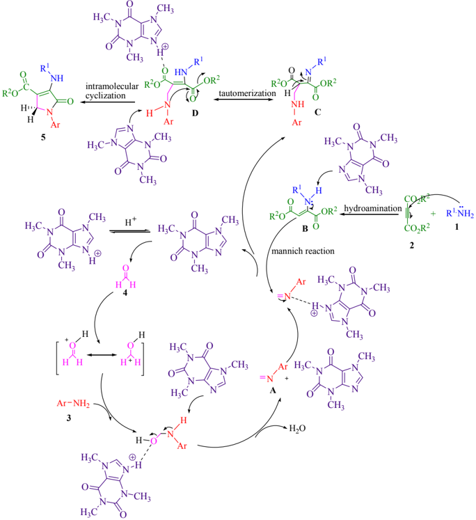

Bull. Chem. Soc. Ethiop. 2019 , 33(1)

## CONCLUSION

In summary,  a  mild, convenient and efficient procedure for the one-pot synthesis of polysubstituted  dihydro-2-oxypyrroles  by  using  of  a  catalytic  amount  of  caffeine  as  a  green catalyst  under  ambient  temperature  is  reported.  The  use  of  a  natural,  biodegradable  and inexpensive catalyst, along with simple work up, short reaction times and good to high yields, provides a compelling method to prepare these biologically active compounds.

## ACKNOWLEDGEMENT

We gratefully acknowledge financial support from Young Researchers and Elite Club, Shiraz Branch, Islamic Azad University of Shiraz.

## REFERENCES

1. Jones, R.A.; Bean, G.P. The Chemistry of Pyrroles , 1st ed., Academic Press: London; 1977

.

- , 4th ed., Hetarene I, Teil
2. Gossauer, A. In Methoden der Organichen Chemie (Houben-Weyl) 1 Pyrrole, Georg Thieme Verlag: New York; 1994 ; p 556-798.
3. Khajuria, R.; Dham, S.; Kapoor, K.K. Active methylenes in the synthesis of pyrrole motif: An  imperative  structural  unit  of  Pharmaceuticals,  Natural  Products  and  Optoelectronic materials. RSC Adv . 2016 , 6, 37039-37066.
4. Borthwick,  A.D.;  zzj.Crame,  A.;  Ertl,  P.F.;  Exall,  A.M.;  Haley,  T.M.;  Hart,  G.J.;  Mason, A.M.; Pennell, A.M.K.; Singh, O.M.P.; Weingarten, G.G.; Woolven, J. Design and synthesis of pyrrolidine-5,5-trans-lactams (5-oxohexahydropyrrolo[3,2-b]pyrroles) as novel mechanism-based inhibitors of human cytomegalovirus protease. 2. Potency and chirality. J. Med. Chem. 2002 , 45, 1-18.
5. Alp,  C.;  Ekinci,  D.;  Gultekin,  M.S.;  Senturk,  M.;  Sahin,  E.;  Kufrevioglu,  O.  A  novel  and one-pot synthesis of new 1-tosyl pyrrol-2-one derivatives and analysis of carbonic anhydrase inhibitory potencies. Bioorg. Med. Chem. 2010 , 18, 4468-4474.
6. Shiraki, R.; Sumino, A.; Tadano, K.; Ogawa, S. Total synthesis of PI-091. Tetrahedron Lett. 1995 , 36, 5551-5554.
7. Lampe,  Y.L.;  Chou,  R.G.;  Hanna,  R.G.;  DiMeo,  S.V.;  Erhardt,  P.W.;  Hagedorn,  A.A.; Ingebretsen, W.R.; Cantor, E. (Imidazolylphenyl) pyrrol- 2-one inhibitors of cardiac cAMP phosphodiesterase. J. Med. Chem. 1993 , 36, 1041-1047.
8. Chen, Y.; Zeng, D.X.; Xie, N.; Dang, Y.Z. Study on photochromism of diarylethenes with a 2, 5-dihydropyrrole bridging unit: a convenient preparation of 3, 4-diarylpyrroles from 3,4diaryl-2,5-dihydropyrroles. J. Org. Chem. 2005 , 70, 5001-5005.
9. Singh, S.B.; Goetz, M.A.; Jones, E.T.; Billes, G.F.; Giacobbe, R.A.; Herranz, L.; StevensMiles S.; Williams D.L. a novel antagonist of endothelin receptor. J. Org. Chem. 1995 , 60, 7040-7042.
10. Peifer,  C.;  Selig,  R.;  Kinkel,  K.;  Ott,  D.;  Totzke,  F.;  Scha  chtele,  C.;  Heidenreich,  R.;  Ro cken, M.; Schollmeyer, D.; Laufer, S. Design, synthesis, and biological evaluation of novel 3-aryl-4-(1H-indole-3yl)-1,5-dihydro-2H-pyrrole-2-ones as vascular endothelial growth factor receptor (VEGF-R) inhibitors. J. Med. Chem. 2008 , 51, 3814-3824.
11. Khan, A.T.; Ghosh, A.; Musawwer Khan, M. One-pot four-component domino reaction for the synthesis of substituted dihydro-2-oxypyrrole catalyzed by molecular iodine. Tetrahedron Lett . 2012 , 53, 2622-2626.
12. Sajadikhah, S.S.; Maghsoodlou, M.T.; Hazeri, N. A simple and efficient approach to one-pot synthesis  of  mono-  and  bis-N-aryl-3-aminodihidropyrrol-2-one-4-carboxylate  catalyzed  by InCl3. Chin. Chem. Lett. 2014 , 25, 58-60.

13. Sajadikhah,  S.S.;  Hazeri,  N.  Coupling  of  amines,  dialkyl  acetylenedicarboxylaes  and formaldehyde promoted by [n-Bu4N][HSO4]: An efficient synthesis of highly functionalized dihydro-2-oxopyrrols and bis-dihydro-2-oxopyrroles. Res.  Chem. Intermed. 2014 ,  40,  737748.
14. Sajadikhah,  S.S.;  Hazeri,  N.;  Maghsoodlou,  M.T.;  Habibi-Khorassani,  S.M.;    Beigbabaei, A.;  Willis,  A.C.  Al(H2PO4)3 as an  efficient  and reusable  catalyst  for  the  multi-component synthesis  of  highly  functionalized  piperidines  and  dihydro-2-oxypyrroles. 2013 , J.  Iran. Chem. Soc. 10, 863-871.
15. Zhu, Q.; Jiang, H.; Li, J.; Liu, S.; Xia, C.; Zhang, M. Concise and versatile multicomponent synthesis of multisubstituted polyfunctional dihydropyrroles. J. Comb. Chem. 2009 , 11, 685696.
16. Lv,  L.;  Zheng,  S.;  Cai,  X.;  Chen,  Z.;  Zhu,  Q.;  Liu,  S.  Development  of  four-component synthesis  of  tetra-  and  pentasubstituted  polyfunctional  dihydropyrroles:  Free  permutation and combination of aromatic and aliphatic amines. J. ACS Comb. Sci. 2013 , 15, 183-192.
17. Sajadikhah, S.S.; Hazeri, N.; Maghsoodlou, M.T. A one-pot multi-component synthesis of N-aryl-3-aminodihydropyrrol-2-one-4-carboxylates  catalysed  by  oxalic  acid  dihydrate. J. Chem. Res. 2013 , 37, 40-42.
18. Sajadikhah,  S.S.;  Maghsoodlou,  M.T.;  Hazeri,  N.;  Mohamadian-Souri,  S.  ZrCl4  as  an efficient catalyst for one-pot four-component synthesis of polysubstituted dihydropyrrol-2ones. Res. Chem. Intermed. 2016 , 42, 2805-2814.
19. Salehi,  N.;  Mirjalili,  B.B.F.  Synthesis  of  highly  substituted  dihydro-2-oxopyrroles  using Fe3O4@nano-cellulose-OPO3H as a novel bio-based magnetic nanocatalyst. RSC Adv. 2017 , 7, 30303-30309.
20. Nehlig, A.; Daval, J.L.; Debry, G. Caffeine and the central nervous system: mechanisms of action, biochemical, metabolic and psychostimulant effects. Brain Res. Rev . 1992 , 17, 139170.
21. Bahrami,  H.;  Tabrizchi,  M.;  Farrokhpour,  H.  Protonation  of  caffeine:  A  theoretical  and experimental study. Chem. Phys. 2013, 415, 222-227.
22. Mohamadpour,  F.  Green  and  convenient  one-pot  access  to  polyfunctionalized  piperidine scaffolds  via  glutamic  acid  catalyzed  Knoevenagel-intramolecular  [4+2]  aza-Diels-Alder imin-based multi-component reaction under ambient temperature. Polycycl. Aromat. Comp. 2018. DOI: 10.1080/10406638.2018.1472111.
23. Mohamadpour,  F.;  Maghsoodlou,  M.T.;  Heydari,  R.;  Lashkari,  M.  Copper(II)  acetate monohydrate:  An  efficient  and  eco-friendly  catalyst  for  the  one-pot  multi-component synthesis  of  biologically  active  spiropyrans  and  1H-pyrazolo[1,2-b]phthalazine-5,10-dione derivatives under solvent-free conditions. Res. Chem. Intermed. 2016 , 42, 7841-7853.
24. Zare Fekri, L.; Nikpassand, M.; Pourmirzajani, S.; Aghazadeh, B. Synthesis and characterization  of  amino  glucose-functionalized  silica-coated  NiFe2O4 nanoparticles:  A heterogeneous,  new  and  magnetically  separable  catalyst  for  the  solvent-free  synthesis  of pyrano[3,2c ]chromen-5(4 H )-ones. RSC Adv . 2018 , 8, 22313-22320.
25. Lashkari, M.; Heydari, R.; Mohamadpour, F. A facile approach for one-pot synthesis of 1Hpyrazolo[1,2-b]phthalazine-5,10-dione derivatives catalyzed by ZrCl4 as an efficient catalyst under solvent-free conditions. Iran. J. Sci. Technol. Trans. Sci . 2018 , 42, 1191-1197.
26. Maghsoodlou, M.T.; Heydari, R.; Mohamadpour, F.; Lashkari, M. Fe2O3 as an environmentally benign natural catalyst for one-pot and solvent-free synthesis of spiro-4Hpyran derivatives. Iran. J. Chem. Chem. Eng . 2017 , 36, 31-38.
27. Nikpassand, M.; Zare Fekri, L. One-pot synthesis of 9-arylxanthenediones and 9pyrazoloxanthenediones using [DBU] OAc, Russ. J. Gen. Chem . 2017 , 87, 816-820.
28. Zahedi, N.; Javid, A.; Mohammadi, M.K.; Tavakkoli, H. Microwave-promoted solvent free one-pot synthesis  of triazolo[1,2-a] indazole-triones catalyzed by silica-supported La0.5Ca

- 0.5CrO3 nanoparticles as a new and reausable provskitetype oxide. Bull. Chem. Soc. Ethiop. 2018 , 32, 239-248.
29. Zare Fekri, L.; Nikpassand, M.; Movaghari, M. Fe +3 -montmorillonite K10: As an effective and  reusable  catalyst  for  the  synthesis  of  3,  4-dihydropyrimidin-2  (1 H )-ones  and-thiones. Bull. Chem. Soc. Ethiop . 2017 , 31, 313-321.
30. Zekavati,  R.;  Doulah,  A.;  Mohammadi,  M.K.;  Shirali,  S.  Solvent  free  synthesis  of  Nalkylated imino indoline-2-ones derivatives under microwave irradiation. Bull. Chem. Soc. Ethiop . 2018 , 32, 393-398.
31. Bahrami,  F.;  Nikpassand,  M.  Potassium  2-oxoimidazolidine-1,  3-diide:  An  effective  and new catalyst for the grinding synthesis of (1 H -indol-3-yl) methyl-2 H -indan-1,3-diones. Bull. Chem. Soc. Ethiop . 2018 , 32, 399-405.
32. Maghsoodlou,  M.T.;  Heydari,  R.;  Lashkari,  M.;  Mohamadpour,  F.  Clean  and  one-pot synthesis  of  3,  4-dihydropyrimidin-2-(1 H )-ones/tiones  derivatives  using  maleic  acid  as  an efficient  and  environmentally  benign  nature  di-functional  Brønsted  acid  catalyst  under solvent-free conditions. Indian. J. Chem. 56B 2017 , 56B, 160-164.
33. Mohamadpour,  F.;  Lashkari,  M.  Three-component  reaction  of  β-keto  esters,  aromatic aldehydes  and  urea/thiourea  promoted  by  caffeine:  A  green  and  natural,  biodegradable catalyst for eco-safe Biginelli synthesis of 3,4-dihydropyrimidin-2-(1H)-ones/tiones derivatives under solvent-free conditions. J. Serb. Chem. Soc. 2018 , 83, 673-684.