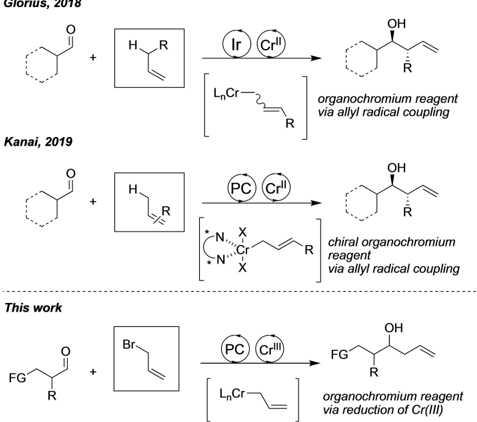
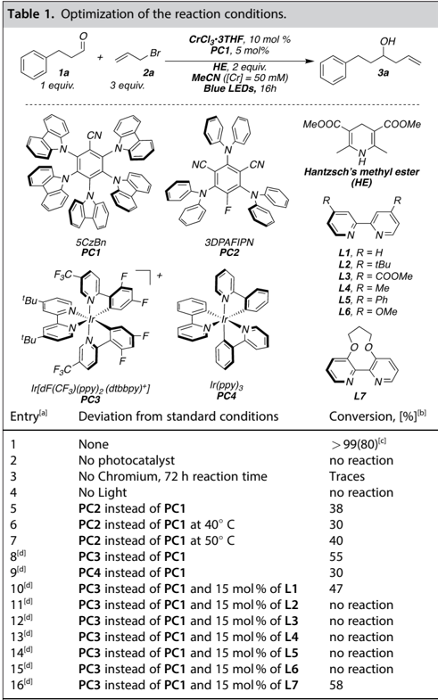
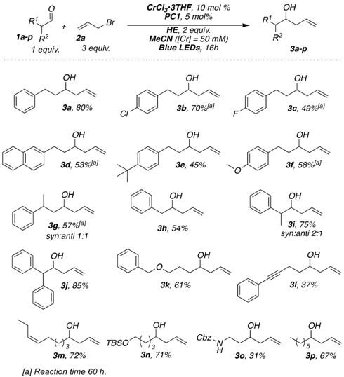
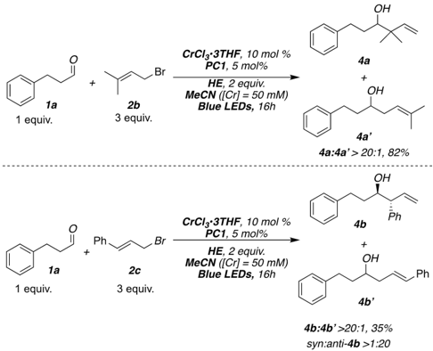
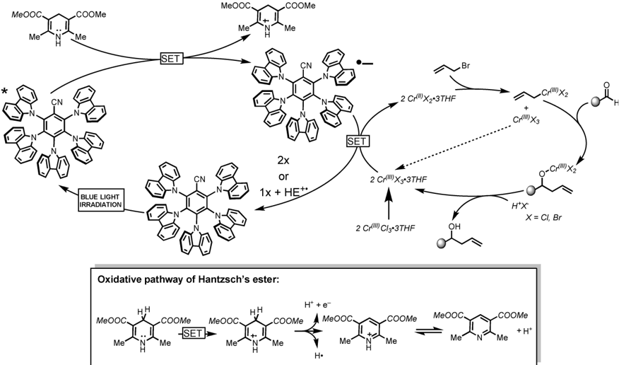

Very Important Paper

www.eurjoc.org

## A Photoredox Nozaki-Hiyama Reaction Catalytic in Chromium

Francesco Calogero, [a] Simone Potenti, [a, b] Giandomenico Magagnano, [a] Giampaolo Mosca, [a] Andrea Gualandi, [a, c] Marianna Marchini, [a] Paola Ceroni, [a, c] and Pier Giorgio Cozzi* [a, c]

Dedicated to Professor Cesare Gennari on the occasion of his 70th birthday

Organochromium(III) species are multipurpose nucleophiles used in the synthesis of complex organic molecules due to their high functional group tolerance and extraordinary chemoselectivity for aldehydes. The preparation of organochromium(III) species starting from organic halides requires the use of a stoichiometric amount of chromium(II) salts or a catalytic amount of chromium(III) salts in the presence of stoichiometric reductants (such as Mn(0)). Recently, radicals

## Introduction

The preparation of nucleophilic organometallic reagents and their designed and controlled addition to carbonyl groups still represent a key methodology in synthesis. [1] Total synthesis of complex organic molecules requires the use of reagents tolerant to different functional groups, and this issue have stimulated the development of practical and tolerant organometallic reagents. Among all the possible species, organochromium reagents constitute a formidable tool for the preparation of complex structures. [2] Chromium salts show low toxicity in the + 2 and + 3 oxidation states, [3] they are abundant, and inexpensive. The Nozaki-Hiyama reaction (NH reaction) is a remarkable named reaction, [4] in which organohalides are used in the presence stoichiometric amount of chromium(II) to

- [a] F. Calogero, S. Potenti, Dr. G. Magagnano, G. Mosca, Dr. A. Gualandi, Dr. M. Marchini, Prof. P. Ceroni, Prof. P. G. Cozzi Dipartimento di Chimica 'Giacomo Ciamician' Alma Mater Studiorum - Università di Bologna Via Selmi 2, 40126, Bologna, Italy E-mail: piergiorgio.cozzi@unibo.it

[b]

S. Potenti

Laboratorio SMART

Scuola Normale Superiore

Piazza dei Cavalieri 7, 56126, Pisa, Italy

- [c] Dr. A. Gualandi, Prof. P. Ceroni, Prof. P. G. Cozzi Center for Chemical Catalysis-C3, Alma Mater Studiorum - Università di Bologna, Via Selmi 2, 40126, Bologna, Italy

Supporting information for this article is available on the WWW under https://doi.org/10.1002/ejoc.202200350

[Part of the 'Cesare Gennari's 70th Birthday' Special Collection.](https://chemistry-europe.onlinelibrary.wiley.com/doi/toc/10.1002/(ISSN)1099-0690.Cesare-Gennari-70)

© 2022 The Authors. European Journal of Organic Chemistry published by Wiley-VCH GmbH. This is an open access article under the terms of the Creative Commons Attribution Non-Commercial NoDerivs License, which permits use and distribution in any medium, provided the original work is properly cited, the use is non-commercial and no modifications or adaptations are made.

formation from readily available alkenes, followed by their trapping with stoichiometric or catalytic amount of chromium(II) salts were reported in photoredox conditions for the generation of Cr(III) organometallic species. In this paper we disclose a real Nozaki-Hiyama reaction (NH) in which photoredox conditions enable the preparation of Cr(III) allyl reagents starting from available allyl halides and stable Cr(III) salts.

produce a variety of organometallic reagents. It is also well known that formation of allylor propargyl chromium compound does not require additives, while a catalytic amount of nickel(II) salts is an essential co-catalyst for the preparation of alkenylchromium species from the corresponding halides (Nozaki-Hiyama-Kishi reaction, NHK). [5] To further expand the repertoire to aryl and alkyl halides and to tosylates, the introduction of metal salts such as iron or cobalt is necessary. [6] The major disadvantage in the employment of stoichiometric amount of chromium salt was solved by Fürstner who developed a catalytic version of NH reactions. In the catalytic version, TMSCl (trimethylsilylchloride) acting as scavenger, favors the release of Cr(III) from the alkoxy intermediate and enabling further reduction by a stoichiometric amount of reductant (Mn(0)). [7] After the major breakthrough realized by Fürstner, the development of catalytic enantioselective variants of NH reaction was possible. [8] Formation of the organometallic chromium reagents is possible by reductive radical to polar cross over, [9] in which the radical formed by the reduction of halide is intercepted by Cr(II) salt, generating the organometallic Cr(III) species. As photoredox catalysis [10] allows the practical generation of radical species in mild conditions, [11] the NHKT reaction becomes a target for photoredox investigations. Glorius and Kanai have successfully developed (Figure 1) interesting photoredox variant of the reaction. [12]

In the reported methodologies a photocatalyst, which is a strong photooxidant, can generate a radical from a suitable alkene. The so formed radical cation obtained by photo mediated single electron oxidation, loses a proton, generating an allyl radical that is intercepted by the Cr(II) salts to form the reactive organometallic Cr(III) reagent. The photocatalyst, in its reduced form, can restore the Cr(II), closing both the transition metal and the photocatalytic cycle. The proton deriving from the alkene precursor is the scavenger able to liberate the Cr(III) from the intermediate alkoxide, allowing the use of chromium

Glorius, 2018

1 equiv.

## CN

Kanai, 2019

5CzBn

PC1

F3C

'Bu

This work

'Bu

FG

F3C

Ir[dF(CF3)(ppy)2 (dtbbpy)+]

PC3

tr[a]

CrClz'3THF, 10 mol %

PC1, 5 mol%

Blue LEDs, 16h

LnCr-

ОН

R

organochromium reagent via allyl radical coupling

MeOOC

COOMe

Figure 1. Photoredox version of Nozaki-Hiyama reactions reported in literature.

in catalytic amount. Stereoselective versions of the reaction were developed, affording the products of selective reactions with carbonyls in high enantiomeric excesses. [13] These reactions are certainly interesting as they have opened new perspectives in the generation of the reactive organometallic reagents by metallaphotoredox catalysis. [14] However, the possibility to use cheap, available, and unsubstituted allyl halides, in photoredox NH reactions, was not yet disclosed. In this paper we report a photoredox catalytic version of NH reaction that use air-stable Cr(III) salts, avoiding the use of glovebox for handling Cr(II) derivatives. Furthermore, allyl halides are suitable substrates for the reaction, as the standard NHK reaction and the use of a strong reducing organic dye is replacing the common [Ir(III)] complexes. Scope and limitation of this new photoredox NH reaction were investigated as well as photophysical analysis of the process.

## Results and Discussion

## Reaction optimization and substrate scope

Our laboratory is engaged in the development of new metallaphotoredox catalysis methodologies for C C bond formation, by generating nucleophilic organometallic reagents under photoredox conditions. [15] In our attempts to develop a photoredox version of NH reaction, we have chosen stable and available Cr(III) salts, to avoid the use of air sensitive Cr(II) derivatives, that require special care (glove box) for the reaction set-up. Although in some cases it is possible to use Cr(III) salts in photoredox reactions, generally the previous variant were described by the use of Cr(II) salts that gave better yields compared to Cr(III) counterpart in almost all cases reported. [12]

One of the first problem we had to face was the difficult reduction of the Cr(III) salts, (see mechanistic discussion) that required the use of a strong reductant. If a strong reducing agent was employed in the reaction, the concomitant pinacol coupling of aromatic aldehydes, used as substrates in the model reaction, was observed (see SI for examples). To optimize the reaction conditions, we therefore studied the allylation reaction of hydrocinnamaldehyde with allylbromide in the presence of different photocatalyst and sacrificial reductant. Due to previous studies, [15] we selected a series of TADF (Thermally Activated Delay Fluorescence) organic dyes. [16] This class of photocatalysts is commercially available, or simply prepared in few reactions from halogenated aromatics, and finds useful applications in metallaphotoredox catalysis. [17] In Table 1 are summarized the results that yielded us to establish a reproducible and high yielding protocol for the photoredox version of NH reaction in the presence of allylbromide (Table 1, entry 1). Among the TADF dyes investigated, 5CzBn is the most effective dyes. Other organic dyes or iridium complexes were giving inferior results

| 1      | None                                 | > 99(80) [c]   |
|--------|--------------------------------------|----------------|
| 2      | No photocatalyst                     | no reaction    |
| 3      | No Chromium, 72 h reaction time      | Traces         |
| 4      | No Light                             | no reaction    |
| 5      | PC2 instead of PC1                   | 38             |
| 6      | PC2 instead of PC1 at 40 ° C         | 30             |
| 7      | PC2 instead of PC1 at 50 ° C         | 40             |
| 8 [d]  | PC3 instead of PC1                   | 55             |
| 9 [d]  | PC4 instead of PC1                   | 30             |
| 10 [d] | PC3 instead of PC1 and 15 mol% of L1 | 47             |
| 11 [d] | PC3 instead of PC1 and 15 mol% of L2 | no reaction    |
| 12 [d] | PC3 instead of PC1 and 15 mol% of L3 | no reaction    |
| 13 [d] | PC3 instead of PC1 and 15 mol% of L4 | no reaction    |
| 14 [d] | PC3 instead of PC1 and 15 mol% of L5 | no reaction    |
| 15 [d] | PC3 instead of PC1 and 15 mol% of L6 | no reaction    |
| 16 [d] | PC3 instead of PC1 and 15 mol% of L7 | 58             |

[a] Reactions performed on 0.1 mmol scale. [b] Determined by 1 H-NMR analysis. [c] Reaction performed on 0.2 mmol scale; in parenthesis isolated yield after chromatographic purification. [d] 5 mol% of photocatalyst was used.

R'

1 equiv.

OH

CrClз·3THF, 10 mol %

PC1, 5 mol%

ОН

OH

ОН

To establish the photochemical mechanism, we need to

HE (see Sl for more details). Therefore, we can conclude that

1a

1a in the model reactions (Table 1, entries 5-9). The sacrificial organic compounds used to restore the photoredox cycles was the Hantzsch's ester, as other amines or different compounds were not promoting the reactions (See SI). The best reaction solvent for the reaction was acetonitrile (MeCN). The presence of different ligands is deleterious for the yields, and the reactivity is reduced, or even stopped (Table 1, entries 10-16). Unfortunately, aromatic aldehydes in the selected conditions gave principally the pinacol coupling product, and only 32% of the desired products was detected. The pinacol coupling reaction was determined by the strong reducing power of the selected dye (E(PC * + /*PC) = 1.42 V vs SCE (saturated calomel electrode); E(PC/PC * ) = 1.52 V vs SCE), [18] coupled with the activation of aldehydes (E red � 2.0 V vs SCE) [19] by electrophilic species generated in the photoredox conditions. [20] 1 equiv.

With the optimized conditions in our hand, we have evaluated the scope of the reaction selecting other aliphatic aldehydes for the NH reaction. The salient results obtained are depicted in Scheme 1. Linear aliphatic aldehydes showed a good reactivity with our protocol while hindered aliphatic aldehydes are not reactive. However, branched benzylic aldehydes were tolerant to the employed methodologies ( 1i ). Despite the presence of acidic proton, benzhydrylic aldehydes ( 3j ) were also tolerated. The presence of stereocenters in the benzylic aldehydes gave a modest diastereoselection ( 3i ), while stereocenters placed in β position is unable to exert an influence over the facial diastereoselection ( 3g ). The low isolated yields in the case of 3c were attributable to a scarce conversion.

Functional groups such as alkene, alkynes, protected alcohols, and amines are well tolerated in this methodology.

Scheme 1. Photoredox NHK reaction of aliphatic aldehydes.

We have observed a reduced reactivity of certain aliphatic aldehydes; in these cases, the reaction time was increased to 60 hours. As we previously mentioned, aromatic aldehydes suffered by the intrinsic limitation of the method, as due to the strong reducing conditions. They are showing principally the corresponding pinacol product obtained in all cases with no diastereoselection. We have briefly investigated the possibility to use substituted allylbromides in the NH reaction under photoredox conditions (Scheme 2). The reaction proceeded with good yields in the tested cases. With prenyl bromide ( 2b ) the result is in line with the previous cases reported by Glorius, [12a] as the γ -type of attack is favored. In the case of cinnamylbromide ( 2c ), we observed the formation of a single anti diastereoisomer similarly, as reported by Glorius [12a] with 4methoxy substituted allybenzene (Estragole). The enantioselective version of photoredox NH reaction reported by Kanai [12i] gave similar selectivity, and the desired anti product was obtained in 68% yield and 72% ee.

## Mechanistic photochemical studies

The photochemical mechanism of the reaction was investigated by analysis of the quenching of the photocatalyst luminescence by each of the components of the reaction. No change of the emission intensity decay of PC1 was observed upon addition of hydrocinnamaldehyde 0.05 M and allylbromide 0.15 M (same concentrations used to perform the reaction). On the other hand, both Hantzsch's ester ( HE ) and CrCl3 * 3THF quench the emission of the photocatalyst with quenching constants of 3.4× 10 9 M 1 s 1 and 3.5×10 8 M 1 s 1 , respectively, as determined by Stern-Volmer plots (Figures S3 and S4).

To establish the photochemical mechanism, we need to consider the concentrations of the two quenchers under the reaction conditions and to evaluate the corresponding quenching efficiency ( η q ), which is 0.6% for CrCl 3 * 3THF and 99.4% for HE (see SI for more details). Therefore, we can conclude that

Scheme 2. Reaction of hydrocinnamaldehyde with substituted allylbromides.

R

MeOOC

*

COOMe

SET

COOMe

CN

the first step of the photocatalytic cycle is the reductive quenching of the photocatalyst by Hantzsch ester. The reduced form of the photocatalyst is able to reduce the Cr(III) salt on the basis of the reported reduction potentials: Epc (Cr(III)/Cr(II)) = 0.61 V vs SCE, [12c,21] and E(PC * /PC) = 1.52 V vs SCE). [16a] Baran, Reisman, and Blackmond have recently carried out a deep electrochemical investigation of a NHK reaction [21] and they have observed that the reduction of CrCl 3 (THF) 3 is characterized by a large inner-sphere reorganization energy and slow electron transfer kinetics. This could be a reason why a direct oxidative quenching of the photocatalyst by the Cr(III) species is not effective. On the other hand, the relative stability of the photocatalyst radical anion PC * [22] under the reaction conditions favors the reduction of chromium(III) species.

The absorption spectrum of the reaction mixture collected after irradiation (Figure S5) confirms that the photocatalyst can be recovered (around 75% of the initial photocatalyst is present at the end of the reaction, see SI for more details).

Based on the photochemical studies we hypothesized the catalytic cycle depicted in Figure 2.

## Conclusion

In conclusion, we have presented a true photoredox version of the Nozaki-Hiyama reaction, catalytic in chromium. The methodology is limited to aliphatic aldehydes but tolerates a variety of functional groups and gives from moderate to good yields. We have clarified the mechanistic picture of the reaction through photophysical investigations, that shows the difficulties

Br in reducing the Cr(III) salts and explaining the employment of Cr(II) as starting material in other photoredox processes.

Further studies on chromium based photoredox processes are in progress with the aim to expand the use of different alkyl halides in direct photoredox reactions and develop related stereoselective variants.

H*X*

## Experimental Section

General procedure for photocatalytic NHK reaction : A dry 10 mL Schlenk tube, equipped with a Rotaflo stopcock, magnetic stirring bar and an argon supply tube, was first charged under argon with the organic photocatalyst 5CzBn (5 mol%, 0.01 mmol, 9.3 mg), CrCl 3 * 3THF catalyst (10 mol%, 0.02 mmol, 7.4 mg), Dimethyl 1,4dihydro-2,6-dimethyl-3,5-pyridinedicarboxylate Hantzsch's ester (2 equiv., 0.4 mmol, 90 mg). CH3CN (4 mL to obtain a 0.05 M substrate solution) was then added, and the reaction mixture was further subjected to a freeze-pump-thaw procedure (three cycles) and the vessel refilled with argon. Then, allyl bromide 2a (0.6 mmol, 3 equiv., 72 mg, 52 μ L) and the substrate 1a -p (0.2 mmol) were added. The reaction was irradiated under vigorous stirring for the desired time. After that the reaction mixture was quenched with water (ca. 5 mL) and extracted with AcOEt (4× 3 mL). The combined organic layers were dried over anhydrous Na2SO4 and the solvent was removed under reduced pressure. The crude was subject of flash column chromatography (SiO2 ) to afford the products 3 in the stated yields.

## Acknowledgements

P.G. C. acknowledges National project (PRIN 2017 ID: 20174SYJAF) SURSUMCAT 'Raising up Catalysis for Innovative Developments'

Figure 2. Proposed mechanism for the photoredox NHK reaction.

MeOOC

Me

for financial support of this research and A.G. and P.C. acknowledges the University of Bologna. Open Access funding provided by Università degli Studi di Bologna within the CRUI-CARE Agreement.

## Conflict of Interest

The authors declare no conflict of interest.

## Data Availability Statement

The data that support the findings of this study are available from the corresponding author upon reasonable request.

Keywords: Aldehydes · Allylbromide · Blue LED · NozakiHiyama Reaction Photoredox catalysis

- [1] a) M. Yus, J. C. Gonzalez-Gomez, F. Foubelo, Chem. Rev. 2013 , 111 , 5595-5698; b) K. Spielmann, G. Niel, R. M. de Figueiredo, J.-M. Campagne, Chem. Soc. Rev. 2018 , 47 , 1159-1173; c) L. Süsse, B. M. Stoltz, Chem. Rev. 2021 , 121 , 4084-4099; d) M. Holmes, L. A. Schwartz, M. J. Krische, Chem. Rev. 2018 , 118 , 6026-6052.
- [2] For reviews on reactivity of organochromium(III) species, see: a) A. Fürstner, Chem. Rev. 1999 , 99 , 991-1046; b) A. Gansäuer, H. Bluhm, Chem. Rev. 2000 , 100 , 2771-2788; c) K. Takai, Org. React. 2004 , 64 , 253612; d) G. C. Hargaden, P. J. Guiry, Adv. Synth. Catal. 2007 , 349 , 24072424; e) G. C. Hargaden, P. J. Guiry, In, V. Andrushko, N. Andrushko, Eds., John Wiley &amp; Sons, Inc.: Hoboken , NJ, 2013 ; pp 347-368; f) Q. Tian, G. Zhang, Synthesis 2016 , 48 , 4038-4049; g) A. Gil, F. Albericio, M. Álvarez, Chem. Rev. 2017 , 117 , 8420-8446.
- [3] [K. S. Egorova, V. P. Ananikov, Organometallics 2017 , 36 , 4071-4090.](https://doi.org/10.1021/acs.organomet.7b00605)
- [4] a) K. Namba, Y. Kishi, Org. Lett. 2004 , 6 , 5031-5033; b) H. Guo, C.-G. Dong, D.-S. Kim, D. Urabe, J. Wang, J. T. Kim, X. Liu, T. Sasaki, Y. Kishi, J. Am. Chem. Soc. 2009 , 131 , 15387-15393; c) D.-S. Kim, C.-G. Dong, J. T. Kim, H. Guo, J. Huang, P. S. Tiseni, J. Kishi, Am. Chem. 2009 , 131 , 1563615641.
- [5] a) H. Jin, J. Uenishi, J. W. Christ, J. Kishi, J. Am. Chem. Soc. 1986 , 108 , 5644-5646; b) K. Takai, M. Tagashira, T. Kuroda, K. Oshima, K. Utimoto, H. Nozaki, J. Am. Chem. Soc. 1986 , 108 , 6048-6050.
- [6] a) K. Takai, K. Nitta, O. Fujimura, K. Utimoto, J. Org. Chem. 1989 , 54 , 4732-4734; b) L. A. Wessjohann, H. S. Schrekker, Tetrahedron Lett. 2007 , 48 , 4323-4325; c) L. A. Wessjohann, G. Schmidt, H. S. Schrekker, Tetrahedron 2008 , 64 , 2134-2142.
- [7] W. Harnying, A. Kaiser, A. Klein, A. Berkessel, Chem. Eur. J. 2011 , 17 , 4765-4773.
- [8] For the first catalytic asymmetric NHTK reaction, see; M. Bandini, P. G. Cozzi, P. Melchiorre, A. Umani-Ronchi, Angew. Chem. Int. Ed. 1999 , 38 , 3357-3359; Angew. Chem. 1999 , 111 , 3558-3561.
- [9] a) L. Pitzer, J. L. Schwarz, F. Glorius, Chem. Sci. 2019 , 10 , 8285-8291; b) R. J. Wiles, G. A. Molander, Isr. J. Chem. 2020 , 60 , 281-293.
- [10] a) C. K. Prier, D. A. Rankic, D. W. C. MacMillan, Chem. Rev. 2013 , 113 , 5322; b) N. A. Romero, D. A. Nicewicz, Chem. Rev. 2016 , 116 , 1007510166; c) M. H. Shaw, J. Twilton, D. W. C. MacMillan, J. Org. Chem. 2016 , 81 , 6898-6926.
- [11] J. K. Matsui, S. B. Lang, D. R. Heitz, G. A. Molander, ACS Catal. 2017 , 7 , 2563-2575.
- [12] a) J. L. Schwarz, F. Schaf¨ers, A. Tlahuext-Aca, L. Lückemeier, F. Glorius, J. Am. Chem. Soc. 2018 , 140 , 12705-12709; b) J. L. Schwarz, H.-M. Huang, T. O. Paulisch, F. Glorius, ACS Catal. 2020 , 10 , 1621-1627; c) J. L. Schwarz, R. Kleinmans, T. O. Paulisch, F. Glorius, J. Am. Chem. Soc. 2020 , 142 , 2168-2174; d) F. Schaf¨ers, L. Quach, J. L. Schwarz, M. Saladrigas, C. G. Daniliuc, F. Glorius, ACS Catal. 2020 , 10 , 11841-11847; e) H.-M. Huang, P. Bellotti, C. Daniliuc, F. Glorius, Angew. Chem. Int. Ed. 2021 , 60 , 24642471; Angew. Chem. 2021 , 133 , 2494-2501; f) F. Schäfers, S. Dutta, R. Kleinmans, C. Mück-Lichtenfeld, F. Glorius, ChemRxiv Cambridge: Cambridge Open Engage; 2021; This content is a preprint and has not been peer-reviewed. https://doi.org/10.26434/chemrxiv-2021-dvnlb; g) H. Mitsunuma, S. Tanabe, H. Fuse, K. Ohkubo, M. Kanai, Chem. Sci. 2019 , 10 , 3459-3465; h) Y. Hirao, Y. Katayama, H. Mitsunuma, M. Kanai, Org. Lett. 2020 , 22 , 8584-8588; i) S. Tanabe, H. Mitsunuma, M. Kanai, J. Am. Chem. Soc. 2020 , 142 , 12374-12381; j) For other work, see: K. Yahata, S. Sakurai, S. Hori, S. Yoshioka, Y. Kaneko, K. Hasegawa, S. Akai, Org. Lett. 2020 , 22 , 1199-1203.
- [13] For representative reviews on enantioselective NHTK reactions, see; a) G. C. Hargaden, P. J. Guiry, Adv. Synth. Catal. 2007 , 349 , 2407-2424; b) Q. Tian, G. Zhang, Synthesis 2016 , 48 , 4038-4049.
- [14] A. Y. Chan, I. B. Perry, N. B. Bissonnette, B. F. Buksh, G. A. Edwards, L. I. Frye, O. L. Garry, M. N. Lavagnino, B. X. Li, Y. Liang, E. Mao, A. Millet, J. V. Oakley, N. L. Reed, H. A. Sakai, C. P. Seath, D. W. C. MacMillan, Chem. Rev. 2022 , 122 , 1485-1542.
- [15] a) A. Gualandi, F. Calogero, M. Mazzarini, S. Guazzi, A. Fermi, G. Bergamini, P. G. Cozzi, ACS Catal. 2020 , 10 , 3857-3863; b) F. Calogero, A. Gualandi, S. Potenti, M. Di Matteo, A. Fermi, G. Bergamini, P. G. Cozzi, J. Org. Chem. 2021 , 86 , 7002-7009; c) A. Gualandi, G. Rodeghiero, R. Perciaccante, T. P. Jansen, C. Moreno-Cabrerizo, C. Foucher, M. Marchini, P. Ceroni, P. G. Cozzi, Adv. Synth. Catal. 2021 , 363 , 1105-1111; d) A. Gualandi, G. Rodeghiero, A. Faraone, F. Patuzzo, M. Marchini, F. Calogero, R. Perciaccante, T. P. Jansen, P. Ceroni, P. G. Cozzi, Chem. Commun. 2019 , 55 , 6838-6841; e) S. Potenti, A. Gualandi, A. Puggioli, A. Fermi, G. Bergamini, P. G. Cozzi, Eur. J. Org. Chem. 2021 , 1624-1627; f) F. Calogero, S. Potenti, E. Bassan, A. Fermi, A. Gualandi, J. Monaldi, B. Dereli, B. Maity, L. Cavallo, P. Ceroni, P. G. Cozzi, Angew. Chem. Int. Ed. 2022 , 61 , e202114981.
- [16] a) E. Speckmeier, T. G. Fischer, K. Zeitler, J. Am. Chem. Soc. 2018 , 140 , 15353-15356; For pioneering studies of TADF dyes in photoredox catalysis: b) J. Luo, J. Zhang, ACS Catal. 2016 , 6 , 873-877. For recent reviews, see: c) T.-Y. Shang, L.-H. Lu, Z. Cao, Y. Liu, W.-M. He, B. Yu, Chem. Commun. 2019 , 55 , 5408-5419.
- [17] For the use of TADF in metallaphotoredox catalysis, see: A. Gualandi, M. Anselmi, F. Calogero, S. Potenti, E. Bassan, P. Ceroni, P. G. Cozzi, Org. Biomol. Chem. 2021 , 19 , 3527-3550.
- [18] Y. Wu, D. Kim, T. S. Teets, Synlett 2022 , DOI: 10.1055/a-1390-9065.
- [19] H. G. Roth, N. A. Romero, D. A. Nicewicz, Synlett 2016 , 27 , 714-723.
- [20] a) M. Nakajima, E. Fava, S. Loescher, Z. Jiang, M. Rueping, Angew. Chem. Int. Ed. 2015 , 54 , 8828-8832; Angew. Chem. 2015 , 127 , 3164-3168; b) A. Gualandi, A. Nenov, M. Marchini, G. Rodeghiero, I. Conti, E. Paltanin, A. Balletti, P. Ceroni, M. Garavelli, P. G. Cozzi, ChemCatChem 2021 , 13 , 981989; c) A. Gualandi, G. Rodeghiero, E. Della Rocca, F. Bertoni, M. Marchini, R. Perciaccante, T. P. Jansen, P. Ceroni, P. G. Cozzi, Chem. Commun. 2018 , 54 , 10044-10047.
- [21] The formal potential of CrCl 3 · 3THF in DMF was recently determined to be 1.06 V vs Fc + /Fe 0 ; see: Y. Gao, D. E. Hill, W. Hao, B. J. McNicholas, J. C. Vantourout, R. G. Hadt, S. E. Reisman, D. G. Blackmond, P. S. Baran, J. Am. Chem. Soc. 2021 , 143 , 9478-9488.
- [22] C. P. Chernowsky, A. F. Chmiel, Z. K. Wickens, Angew. Chem. Int. Ed. 2021 , 60 , 21418-21425.

Manuscript received: March 25, 2022 Revised manuscript received: April 8, 2022 Accepted manuscript online: April 11, 2022