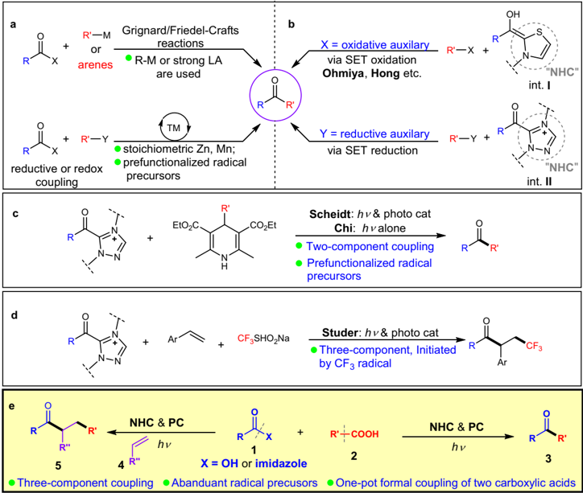
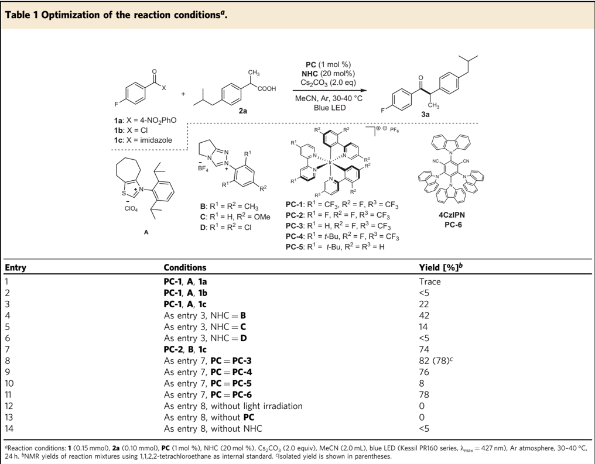
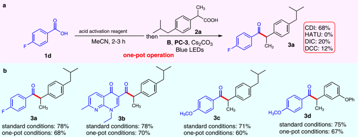
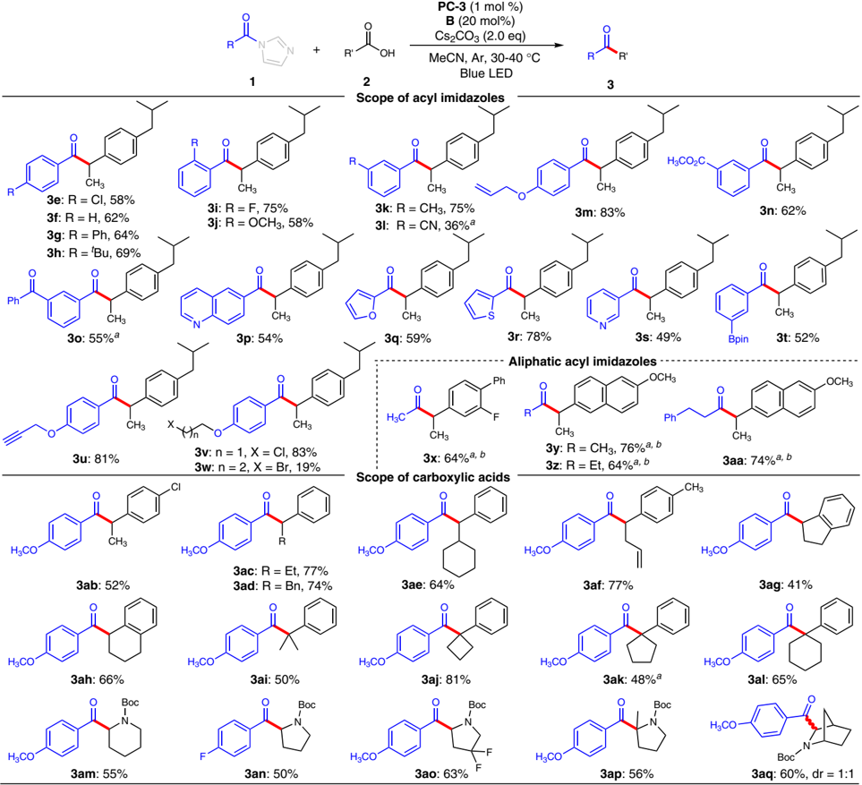
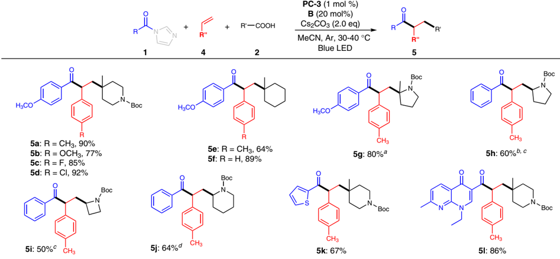
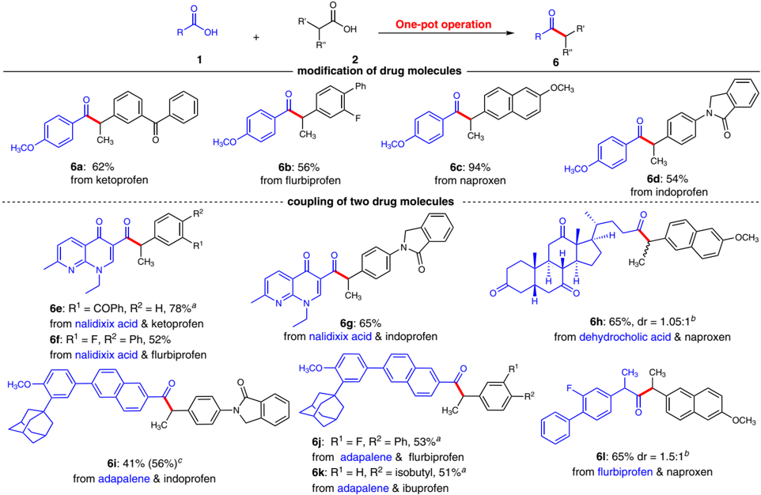
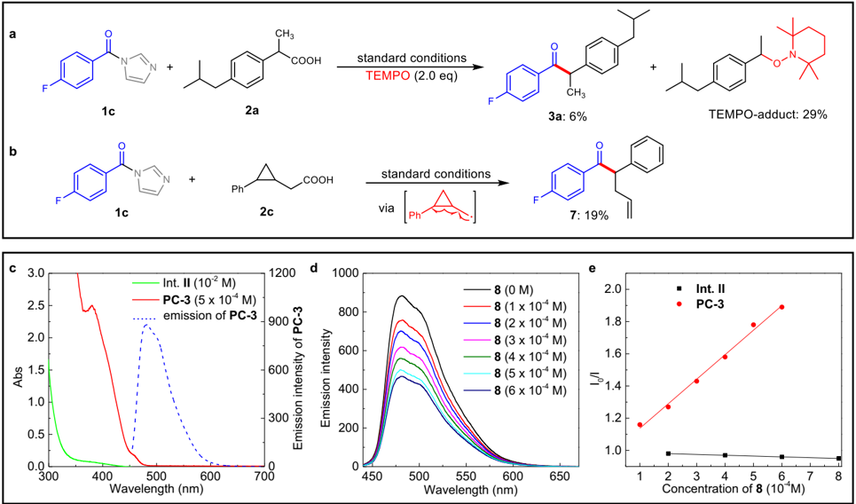
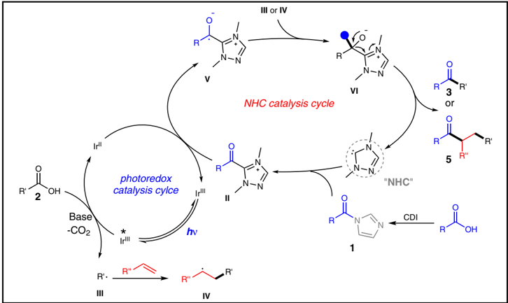

1234567890():,;

## ARTICLE

https://doi.org/10.1038/s41467-022-30583-2

OPEN

## Carbene and photocatalyst-catalyzed decarboxylative radical coupling of carboxylic acids and acyl imidazoles to form ketones

Shi-Chao Ren 1,2 , Xing Yang 2 , Bivas Mondal 2 , Chengli Mou 3 , Weiyi Tian 3 ✉ , Zhichao Jin 1 &amp; Yonggui Robin Chi 1,2 ✉

The carbene and photocatalyst co-catalyzed radical coupling of acyl electrophile and a radical precursor is emerging as attractive method for ketone synthesis. However, previous reports mainly limited to prefunctionalized radical precursors and two-component coupling. Herein, an N -heterocyclic carbene and photocatalyst catalyzed decarboxylative radical coupling of carboxylic acids and acyl imidazoles is disclosed, in which the carboxylic acids are directly used as radical precursors. The acyl imidazoles could also be generated in situ by reaction of a carboxylic acid with CDI thus furnishing a formally decarboxylative coupling of two carboxylic acids. In addition, the reaction is successfully extended to three-component coupling by using alkene as a third coupling partner via a radical relay process. The mild conditions, operational simplicity, and use of carboxylic acids as the reacting partners make our method a powerful strategy for construction of complex ketones from readily available starting materials, and late-stage modification of natural products and medicines.

1 Laboratory Breeding Base of Green Pesticide and Agricultural Bioengineering, Key Laboratory of Green Pesticide and Agricultural Bioengineering, Ministry of Education, Guizhou University, Huaxi District Guiyang, China. 2 Division of Chemistry &amp; Biological Chemistry, School of Physical &amp; Mathematical Sciences, Nanyang Technological University, Singapore 637371, Singapore. 3 Guizhou University of Traditional Chinese Medicine, Guiyang 550025, China.

d

e

R

EtO\_C.

CO\_Et

Scheidt: hv &amp; photo cat

Chi: hyalone

· Two-component coupling

· Prefunctionalized radical

K etones are basic structural motifs in natural and synthetic molecules with broad applications in nearly all areas involving chemicals, such as medicines, agrochemicals, and materials 1,2 . Searching for new synthetic strategies for ef fi cient access to ketones, in either small or complex molecules, remains as an active topic in modern chemistry. The ketones can be prepared via oxidation of hydrocarbons or alcohols, especially when the molecules are relatively simple and chemo-selectivity issues are minimal. Alternatively, ketones can be prepared from the corresponding carboxylic esters and their derivatives via an overall reductive process 3 . Traditional methods include reactions of acyl electrophiles with organometallic reagents (such as Grignard reagent) or electron-rich arenes (Friedel -Crafts reactions, under catalysis of Brønsted or Lewis acids) (Fig. 1a, top) 3 -6 . Metalcatalyzed couplings of acyl electrophiles with nucleophiles 7 -11 or electrophiles 12 have also been developed (Fig. 1a, bottom). In these traditional or metal-catalyzed methods, the key ketone formation step is either an electron-pair-transfer process or a reductive elimination process of a metal intermediate. In contrast, catalytic formation and direct coupling of two radical intermediates to form ketones are much less studied. The impressive relevant successes are either initiated by a single radical intermediate or mostly involve transition metal-catalyzed processes (with metal-carbon bond formed in the key intermediates). Examples include reactions of carboxylic acids and their derivatives with alkenes via radical processes 13 -18 or nickel-catalyzed coupling reactions 19 -22 to prepare ketones. N -heterocyclic carbenes (NHCs) as organic catalysts 23 -29 are proved effective in generating radical intermediates 30 -34 for various reactions, as earlier disclosed by Scheidt 35,36 , Studer 37,38 , Rovis 39,40 , our laboratories 41,42 , Sun 43 , and Ye 44 -48 . The NHCderived radical intermediates are typically persistent radicals, and

U

thus coupling with another transient radical become feasible 49 . As aforementioned 35 -48 , this NHC-derived radical intermediates can be generated by single-electron oxidation of Breslow intermediate (int. I , Fig. 1b, top). For example, Ohmiya showed that single-electronoxidation of the Breslow intermediate by redox active esters could lead to two radical intermediates that reacted with each other to eventually form ketones in 2019 50 -55 . Hong reported that Breslow intermediate can also be oxidized by Katritzky pyridinium salts followed by deaminative cross-coupling to forge ketones 56 . Very recently, studies from Scheidt 57 -59 , Studer 60 -63 , and our laboratories 64 found that NHC-derived azolium ester intermediates (int. II ) can undergo single-electron-reduction to generate radical intermediates for further couplings to form ketones (Fig. 1b, bottom). Scheidt 57,58 and our group 64 used Hantzsch esters as precursors of the other transient radical intermediates to furnish twocomponent radical coupling reactions (Fig. 1c). Studer reported a tri fl uoromethyl radical initiated three-component coupling for the synthesis of β -Tri fl uoromethylated ketones (Fig. 1d) 62 . Merits and clear limitations exist in these previous methods 65 -71 . For example, stoichiometric amount of metal reductants is needed in metalcatalyzed reductive cross coupling of acyl reagents with electrophiles such as alkyl halides and redox active esters. In metal-catalyzed redox coupling and recent NHC catalytic approaches, preparation and isolation of the reaction partners (such as redox active esters, Katritzky pyridinium salts, or Hantzsch esters, etc.) bring undesired operations and pose limitations on substrate scopes. In addition, despite the seminal work achieved in NHC and photocatalyst cocatalyzed ketone synthesis 57 -64 , three-component radical relay coupling that involves various carbon radicals is still limited 58,72 . R

Here we disclose an operationally simple strategy for coupling of acyl imidazoles and carboxylic acids to form ketones (Fig. 1e,

Fig. 1 Synthesis of ketones from carboxylic acid derivatives. a Conventional and metal-catalyzed methods for ketone synthesis. TM = transition metal. LA = Lewis Acid. b Earlier ketone synthesis involving NHC-catalyzed radical process. c Two-component coupling using prefunctionalized radical precursors via NHC/photo catalysis. d CF3 radical initiated three-component coupling. e This work: Two/three-component radical coupling for ketone synthesis using carboxylic acids as radical precursors. PC = photo catalyst.

right), in which the carboxylic acids were directly used as radical precursors. The acyl imidazoles could also be generated in situ via the reaction of a carboxylic acid with CDI (carbonyldiimidazole), thus provides a formally decarboxylative coupling of two carboxylic acids. Importantly, our NHC and photocatalyst cocatalyzed coupling reaction could be extended to threecomponent coupling reactions with alkenes as the third radical coupling partner via a radical relay process (Fig. 1e, left), providing a straightforward strategy to construct ketones with high levels of complexity from readily available materials. To demonstrate the utility of this method in synthetic chemistry, late-stage modi fi cation of marketed drugs and direct coupling of fragments of two medicinal molecules were performed.

## Results

Optimization of reaction conditions . To simplify our condition optimizations, we fi rst evaluated the coupling reactions between activated acyl electrophiles ( 1a , 1b , 1c ) and carboxylic acid ( 2a ) (Table 1). Built on our earlier studies on NHC-catalyzed reaction of carboxylic esters 73,74 , we fi rst used nitrophenyl carboxylic ester 1a as activated ester. A typical reaction mixture contained 1a (1.5 equivalent), carboxylic acid 2a (1.0 equivalent), an iridium complex ( PC-1 ) as a photocatalyst (1 mol%), an NHC precatalyst ( A , 20 mol%) 75 , and a base (Cs2CO3) in CH3CN as the solvent. The reaction was carried out under visible light (blue light LED, λ max = 427 nm) at 30 -40 °C. With 1a as precursor of the NHC-bound acyl azolium intermediate, the corresponding ketone product ( 3a ) could be detected but with very low yield (entry 1). Switching 1a to acyl chloride ( 1b ) under otherwise identical conditions led to slightly improved while still very low reaction yield (&lt;5% yield, entry 2). When acyl imidazole ( 1c ) was used, the ketone product ( 3a ) could be obtained in an appreciable 22% yield (entry 3). We then moved to search for better NHC catalysts (entries 4 -6) and found that with the use of triazolium B could give 3a in 42% yield (entry 4). The N -substituents on the triazolium pre-catalyst had a clear in fl uence on the reaction ef fi ciency, as replacing the N -mesityl substituent of B with a N -2,6-methoxyl ( C ) or N -2,6-chloro ( D ) substituents led to muchdropped yields (entries 5 -6). With B as an NHC pre-catalyst, we then evaluated several metal and organic photocatalysts (entries 7-11, for details see Supplementary Table 3). Electron-de fi cient iridium complex ( PC-3 ) turned to perform the best, giving 3a in 78% isolated yield (entry 8). It ' s worth to note that organic photocatalyst 4CzIPN can give comparable result (entry 11). The screen of solvent didn ' t give improved yield (for details see Supplementary Table 1). Notably, the light source has clear in fl uence on the reaction outcomes (for details see Supplementary Table 2). For example, when blue light LEDs ( λ max = 440 and 467 nm) were used under otherwise identical conditions, target 3a were obtained in slightly dropped yields (76 and 62%, respectively). At last, control experiments were conducted. No ketone

|   Entry | Conditions                            | Yield [%] b   |
|---------|---------------------------------------|---------------|
|       1 | PC-1 , A , 1a                         | Trace         |
|       2 | PC-1 , A , 1b                         | <5            |
|       3 | PC-1 , A , 1c                         | 22            |
|       4 | As entry 3, NHC = B                   | 42            |
|       5 | As entry 3, NHC = C                   | 14            |
|       6 | As entry 3, NHC = D                   | <5            |
|       7 | PC-2 , B , 1c                         | 74            |
|       8 | As entry 7, PC = PC-3                 | 82 (78) c     |
|       9 | As entry 7, PC = PC-4                 | 76            |
|      10 | As entry 7, PC = PC-5                 | 8             |
|      11 | As entry 7, PC = PC-6                 | 78            |
|      12 | As entry 8, without light irradiation | 0             |
|      13 | As entry 8, without PC                | 0             |
|      14 | As entry 8, without NHC               | <5            |

Fig. 2 Development of one-pot operation. a One-pot procedure for coupling of two carboxylic acids. b Comparision between one-pot operation and standard conditions. For synthesis of 3b , DMSO was used as solvent; HATU: 2-(7-Azabenzotriazol-1-yl)N , N , N ' , N ' -tetramethyluroniumhexafluorophosphate; DCC: N , N ' -Dicyclohexylcarbodiimide; DIC: N , N ' -Diisopropylcarbodiimide.

product could be detected when the reaction was performed in dark or in the absence of photocatalyst (entries 12 and 13). Little ketone product was observed when NHC pre-catalyst was not used (entry 14).

Development of one-pot operation . We next moved to identify conditions for coupling of two carboxylic acids instead of using pre-prepared acyl imidazole ( 1c ) as precursor of the NHC-bound acyl azolium intermediate (Fig. 2a). To our delight, we found that when carboxylic acid 1d and the carboxylic acid activation reagent CDI were mixed and stirred for 2 -3 h followed by the addition of the other reagents (as those used in the optimal condition in Table 1, entry 8), 3a could be afforded in 68% yield. Several other acid activation reagents (HATU, DIC, and DCC) evaluated here did not give satisfactory results under the standard condition. It turned out the one-pot operation approach worked well for different substrates including marketed drugs, such as nalidixic acid and fenoprofen, giving the corresponding ketone products ( 3b -3d ) with yields that were only slightly lower than those by using pre-prepared acyl imidazole substrates (Fig. 2b). This formally decarboxylative coupling of two carboxylic acids exhibits attractive applications in late-stage functionalization of marketed drugs and coupling of two drug molecules (Vide infra, Fig. 5).

Substrate scope . With optimized reaction condition in hands, we then moved to evaluate the scope of our reaction (Fig. 3). To have a precise estimation on the reaction ef fi ciency of this NHC and photocatalyst-catalyzed coupling process, we chose to use preprepared acyl imidazoles as precursors of the acyl azolium intermediates. As a technical note, the one-pot operation is recommended for practical synthetic applications, albeit with a slight loss on product yields.

We fi rst evaluated the scope of acyl imidazoles ( 1 ) by using 2a as model substrate (Fig. 3). Various substituents on para -position of aryl ring were tolerated to give the corresponding coupling ketone products with good to high yields, regardless of their electronic nature ( 3e -3h ). For example, electron withdrawing groups such as fl uorine and chlorine atom substituted acyl imidazoles gave 3a (Fig. 2b) and 3e in 78 and 58% yields respectively. Electron donating groups such as methoxyl and tertiary butyl substituted substrates gave desired 3c (Fig. 2b) and 3h in 71% and 69% yields. The position of substituents on aryl ring has little effect on the reaction outcomes. Meta - and ortho -substituted acyl imidazoles were all converted to the target ketone products with good yields ( 3i -3k ). Cyano group was also tolerated, albeit with lower yield ( 3l ). Acyl imidazole containing radical-sensitive C -C double bond was excellent substrate, leading to 3m in 83% yield. Notably, the ester and ketone moieties, which are typically incompatible in traditional methods for ketone synthesis such as Grignard reactions, can be tolerated in this mild coupling reactions ( 3n and 3o ). Acyl imidazoles bearing heteroaryls such as quinoline ( 3p ), furan ( 3q ), thiophene ( 3r ), and pyridine ( 3s ) proceeded smoothly in this reaction to give the target ketone products in moderate to good yields. Potentially reactive functional groups such as boronic ester ( 3t ), terminal alkynyl ( 3u ), and alkyl chloride ( 3v ) were all tolerated. To test the feasibility of our method for the synthesis of dialkyl ketones, a variety of aliphatic acyl imidazoles were investigated. Our method can be used to prepare methyl ketones by using acetic acid-derived acyl imidazole as an acetyl source. For example, fl urbiprofen and naproxen underwent decarboxylative acetylation smoothly to afford methyl ketone 3x and 3y in 64% and 76% yield, respectively. Other aliphatic acyl imidazoles also proceed smoothly to afford the dialkyl ketones in high yields ( 3z -3aa ). As a technical note, when aliphatic acyl imidazole substrates were used, a lower loading of Cs2CO3 and a longer wavelength were optimal in order to avoid side reactions likely caused by base-mediated α -carbon deprotonation (of the acyl imidazole substrates) 73,74 and high energy irradiation.

We next examined the scope of the carboxylic acids by using para -methoxyl substituted acyl imidazole 1e as a model precursor of NHC-bound acyl azolium intermediate. Chlorine atom on aryl ring was tolerated to give 52% yield of target ketone ( 3ab ). The methyl group at α position of carboxylic acids ( 2 ) could be replaced with ethyl ( 3ac ), benzyl ( 3ad ), cyclohexyl ( 3ae ), and allyl ( 3af ) groups without affecting the reaction outcomes dramatically. Cyclic alkyl units such as cyclopentyl ( 3ag ) and cyclohexyl ( 3ah ) could also be incorporated into the ketone product, albeit with a slight decrease in yield for the former one ( 3ag ). Besides, the α -tertiary alkyl substituted carboxylic acids were also competent in this coupling reaction, which thus render this method to be an ef fi cient tool to access sterically hindered ketones with an all-carbon quaternary center at α -position ( 3ai -3al , 3ap ). Notably, these congested ketone products are generally challenging to synthesis 76 -79 . To our delight, N -protected cyclic amino acids were excellent substrates for this coupling reaction, thus offering a straightforward method to access valuable α -amino ketones from readily available and abundant materials. For example, N -protected piperidine-2-carboxylic acid, proline, and their derivatives such as 4- fl uornated proline, 2-methylproline, and bridged-ring containing piperidine-2-carboxylicacid were all competent substrates to give the corresponding α -amino ketones in moderate yields ( 3am -3aq ).

Fig. 3 Scope of the reaction. Reaction conditions: 1 (1.5 equiv), 2 (0.1 -0.2 mmol), B (20 mol %), PC-3 (1 mol %) and Cs2CO3 (2.0 equiv) in MeCN (2.0 mL), blue LED (Kessil PR160 series, λ max = 427 nm), Ar atmosphere, 30 -40°C, 24 h. a Blue LEDs (Kessil PR160 series, λ max = 440 nm) were used. b 1.2 equiv Cs2CO3 was used.

Three-component radical relay reactions . Multi-component radical relay reactions provide a powerful tool for the synthesis of complex skeletons from simple and readily accessible starting materials 80 -82 . While signi fi cant progress has been achieved in NHC and photocatalyst co-catalyzed ketone synthesis 57 -64,83 , three-component radical relay coupling that allows various carbon radicals involved is still limited 72 .

To test the feasibility of our coupling reaction in muticomponent radical relay reactions, alkenes were incorporated into the system as third coupling partners. We began the investigation with N -protected-4-methyl-4-carboxylic acid ( 2b ), para -methoxyl substituted acyl imidazole 1 , and 4-methyl styrene ( 4a ) as model substrates (Fig. 4). To our delight, the three-component coupling ketone product ( 5a ) was obtained exclusively in up to 90% yield with complete regioselectivity under our optimal conditions. The exceptional regioselectivity comes from the preference in forming aryl ring stabilized benzyl radical. Further investigation revealed that various styrenes bearing different functional groups such as methoxyl, fl uorine, and chlorine atoms are tolerated to give desired ketones in high yields, regardless of their electronic nature ( 5b -5d ). Other radical precursors (including amino acids) and acyl imidazoles (including hetero cyclic ones) were also competent for this three-component radical relay coupling ( 5e -5l ). For example, tertiary and secondary radicals generated from cyclic amino acids were incorporated into a series of γ -amino ketones ( 5g -5j ) in high yields. Marketed drugs such as nalidixic acid was transformed into ketone product ( 5l ) with high level of complexity. These three-component radical relay coupling reaction further demonstrated the fl exibility and utility of our NHC and photocatalyst co-catalyzed coupling reactions.

Synthetic applications in late-stage functionalization of marked drugs . To test the synthetic potential of this mild coupling reaction, modi fi cation of marketed drug molecules was explored using the one-pot operation approach (Fig. 5). For example, α -aryl propionic acids (such as ketoprofen, fl urbiprofen, naproxen, and indoprofen), which are widely used as nonsteroidal anti-in fl ammatory drugs, were smoothly transformed

Fig. 4 Examples of three-component radical relay reactions. Reaction conditions: 1 (2.0 equiv), 2 (0.1 -0.3 mmol, 1.0 equiv), 4 (3.0 equiv), B (20 mol%), PC-3 (1 mol %) and Cs2CO3 (2.0 equiv) in MeCN, blue LED (Kessil PR160 series, λ max = 427 nm), Ar atmosphere, 30 -40°C, 24 h. a dr = 1.6/1. b The reaction was set up in 2 mmol scale. c dr = 1.4/1. d dr = 1.9/1.

Fig. 5 Application of the method in modification of drug molecules. Reaction conditions: 1 (1.5 equiv), 2 (0.05-0.1 mmol, 1.0 equiv), B (20 mol%), PC-3 (1 mol %) and Cs2CO3 (2.0 equiv) in MeCN, blue LED (Kessil PR160 series, λ max = 427 nm), Ar atmosphere, 30 -40°C, 24 h. a Pre-prepared acyl imidazoles were used. b Blue LEDs (Kessil PR160 series, λ max = 440nm) were used. c Yield in parentheses is obtained by using pre-prepared acyl imidazole as starting material.

into the corresponding ketone products ( 6a -6d ) in moderate to high yields under our one-pot operation approach. Besides, our method also allows direct decarboxylative coupling of two drug molecules that tethered to carboxylic acid group, affording ketone entities bearing two drug fragments. For example, nalidixic acid, a synthetic quinolone antibiotic, was coupled with fl urbiprofen, and indoprofen smoothly to deliver corresponding new ketone entities ( 6f -6g ) in good yields. In case of the coupling of nalidixic acid and ketoprofen, while the one-pot coupling gave poor yield, the target ketone product ( 6e ) was obtained in 78% yield when preprepared acyl imidazole was used as starting material. Aliphatic carboxylic acids could also undergo the one-pot coupling to construct dialkyl ketones. For example, dehydrocholic acid and fl urbiprofen were coupled with naproxen smoothly under the one-pot condition, giving the dialkyl ketones ( 6h, 6l ) in 65% yields. Our method was also applied in the modi fi cation of adapalene, a third-generation topical retinoid. Nevertheless, the onepot coupling of adapalene and indoprofen only gave 41% yield of desired ketone product ( 6i ). To our delight, the using of preprepared acyl imidazole could give moderate yield (56%). Under the same condition, adapalene coupled with ibuprofen, and fl urbiprofen successfully to give the target coupling products ( 6j -6k ) in moderate yields. These results revealed that our method exhibits remarkable potential application in rapid assembly of complex molecules.

Mechanistic studies . To gain insight into the mechanism, mechanistic studies were conducted next (Fig. 6). The model reaction was suppressed with 6% yield of the target product was observed in the presence of TEMPO (2,2,6,6-Tetramethylpiperidinooxy) under otherwise identical conditions. Meanwhile, TEMPO-adduct was isolated in 29% yield, suggesting a radical pathway (Fig. 6a). This was further supported by a radical clock reaction, in which a cyclopropyl group was installed in the carboxylic acid (Fig. 6b). The observation of the cyclopropane ring-opening product ( 7 ) strongly supports the presence of α -cyclopropyl carbon radical that generated from oxidative decarboxylative of carboxylic acid ( 2c ) (Fig. 6b). It is well known that excited state of photocatalyst can promote the oxidative decarboxylation of carboxylic acids 84,85 . Meanwhile, the acyl azolium intermediate II (Int. II ) were proved to be excited under visible light irradiation 64,86 and further act as strong oxidant 64 , which may also contribute to the decarboxylation process. Thus, photophysical behaviors of pre-prepared Int. II and PC-3 were investigated to identify these two possibilities. We fi rstly investigated the UV -Vis absorption spectra of Int. II and photocatalyst ( PC-3 ) under the above reaction concentration (Fig. 6c). While Int. II can absorb visible light until around 430 nm (Fig. 6c, green line), PC-3 shows much more strong absorption (Fig. 6c, red line). Besides, Stern -Volmer quenching experiments of Int. II and PC-3 were conducted by using sodium carboxylate ( 8 ) as a quenching reagent. The results revealed that sodium carboxylate 8 could not quench the emission of Int. II (Fig. 6e, black line), suggesting that the Int. II was not responsible for the oxidative decarboxylation of carboxylic acid. In contrast, the emission of PC-3 (Fig. 6c, blue dashed line) could be effectively quenched by sodium carboxylate 8 (Fig. 6d and the red line in Fig. 6e) with the quenching rate constant ( k q) calculated by using the reported lifetime (2280 ns) of PC-3 as 6.68 × 10 8 M -1 s -1 87 . This result is consistent with the crucial role of PC-3 in this decarboxylative coupling reaction (Table 1, entry 13), supporting the photocatalyst-initiated oxidative decarboxylation of carboxylic acid.

Upon the above mechanistic studies and previous reports 57 -64,88,89 , a catalytic cycle involving NHC and photo catalysis was proposed (Fig. 7). The acyl imidazoles ( 1 ) can be

Fig. 6 Mechanistic studies. a Reaction in the presence of TEMPO (2,2,6,6-Tetramethylpiperidinooxy). b Radical clock reaction. c UV -Vis absorption spectra of Int. II and PC-3 . d Stern -Volmer quenching experiments between PC-3 and sodium carboxylate 8 . e Stern -Volmer quenching experiments between Int. II and sodium carboxylate 8 (black line).

Fig. 7 Proposed catalytic cycle. NHC and photocatalyst co-catalyzed mechanism.

pre-prepared or in situ formed via the reaction of a carboxylic acid with CDI (Carbonyldiimidazole) as the condensation reagent. The resulting or pre-prepared acyl imidazole 1 can subsequently react with NHC catalyst to form an acyl azolium intermediate II . In the same solution, an iridium complex photocatalyst is excited by visible light to mediate oxidative decarboxylation of another carboxylic acid ( 2 ) to form a transient radical intermediate III 84,85,90 . The reduced iridium species from the above photo process then reduces the acyl azolium intermediate ( II ) to the corresponding persistent NHC-bound radical intermediate V with regeneration of the original iridium photocatalyst 57 -63 . Coupling of the two radical intermediates ( III and V ) eventually affords the ketone product 3 with regeneration of the NHC catalyst. In case of the three-component radical relay coupling, the carbonyl radical ( III ) generated from decarboxylation is trapped by the alkene to form another carbon radical ( IV ) which subsequently couples with V to deliver the target ketone 5 .

## Discussion

In conclusion, we have developed a convenient approach for coupling of carboxylic acids and acyl imidazoles by merging NHC and photo catalysis. The acyl imidazoles can be generated in situ via the reaction of another carboxylic acid with CDI, thus providing a straightforward strategy for the synthesis of ketone moieties from two carboxylic acids. The mild condition, operational simplicity, and use of readily available carboxylic acid as both acyl source and radical precursors make our method much more convenient (than previous approaches) for broad applications. Notably, the coupling process can also be intercepted by the addition of an alkene as the third coupling partner, leading to a three-component radical reaction with the formation of sophisticated products from simple starting materials. Natural products and medicinal molecules and their fragments can be directly coupled using our methods. Ongoing studies in our laboratories include the preparation and study of drug conjugates and derivatives, and concise synthesis of complex molecules by applying and further developing our carboxylic acid radical coupling reactions.

## Methods

General procedure for the decarboxylative coupling of carboxylic acids and acyl imidazoles . To a 10 mL Schlenk tube equipped with a stir bar was added acyl imidazole 1 (0.15 mmol), carboxylic acid 2 (0.10 mmol), NHC pre-catalyst B (0.02 mmol), photocatalyst PC-3 (0.001 mmol) and dry Cs2CO3 (0.20 mmol). The Schlenk tube was sealed and placed under argon before 2 mL of dry MeCN was added. The reaction was stirred and irradiated with one/two blue LED Kessil lamp ( λ max = 427 nm, 3 cm away from the Schlenk tube, with cooling fan to keep the reaction temperature at 30 -40 °C.) for 24 h. Then the reaction mixture was fi ltered through a pad of celite and washed with ethyl acetate. The fi ltrate was concentrated in vacuum to afford the crude material which was puri fi ed by column chromatography (silica gel, EtOAc/hexanes) to give product 3 .

General procedure for the one-pot decarboxylative coupling of two carboxylic acids . In gloves box, to a 4 mL vial equipped with a stir bar was added 4- fl urobenzoic acid 1d (0.2 mmol) and CDI (0.2 mmol). MeCN (2 mL) was added as solvent. The reaction mixture was stirred for 2.5 h in gloves box at room temperature until the solution become homogenous. The resulting reaction mixture was mixed with carboxylic acid 2a (0.10 mmol), NHC pre-catalyst B (0.02 mmol), photocatalyst PC-3 (0.001 mmol) and dry Cs2CO3 (0.20 mmol). The resulting mixture was sealed and take out from the gloves box. Then the reaction was stirred and irradiated with one blue LED Kessil lamp ( λ max = 427 nm, 3 cm away from the Schlenk tube, with cooling fan to keep the reaction temperature at 30 -40 °C.) for 12 -24 h. The reaction mixture was fi ltered through a pad of celite and washed with ethyl acetate. The fi ltrate was concentrated in vacuum to afford the crude material which was puri fi ed by column chromatography (silica gel, EtOAc/hexanes) to give product 3a .

## Data availability

All data generated in this study are provided in the Supplementary Information/Source Data fi le, and can be obtained from the authors upon request.

Received: 18 November 2021; Accepted: 5 April 2022;

## References

1. McDaniel, R. et al. Multiple genetic modi fi cations of the erythromycin polyketide synthase to produce a library of novel ' unnatural ' natural products. Proc. Natl Acad. Sci. USA 96 , 1846 -1851 (1999).
2. Walter, M. W. Structure-based design of agrochemicals. Nat. Prod. Rep. 19 , 278 -291 (2002).
3. Dieter, R. K. Reaction of acyl chlorides with organometallic reagents: A banquet table of metals for ketone synthesis. Tetrahedron 55 , 4177 -4236 (1999).
4. Rueping, M. &amp; Nachtsheim, B. J. A review of new developments in the Friedel -Crafts alkylation -from green chemistry to asymmetric catalysis. Beilstein J. Org. Chem. 6 , 6 (2010).
5. Sartori, G. &amp; Maggi, R. Use of solid catalysts in Friedel -Crafts acylation reactions. Chem. Rev. 106 , 1077 -1104 (2006).

6. Heravi, M. M., Zadsirjan, V., Saedi, P. &amp; Momeni, T. Applications of Friedel -Crafts reactions in total synthesis of natural products. RSC Adv. 8 , 40061 -40163 (2018).
7. Milligan, J. A., Phelan, J. P., Badir, S. O. &amp; Molander, G. A. Alkyl carbon -carbon bond formation by nickel/photoredox cross-coupling. Angew. Chem., Int. Ed. 58 , 6152 -6163 (2019).
8. Joe, C. &amp; Doyle, A. Direct acylation of C(sp 3 )-H bonds enabled by nickel and photoredox catalysis. Angew. Chem., Int. Ed. 55 , 4040 -4043 (2016).
9. Le, C. C. &amp; MacMillan, D. W. C. Fragment couplings via CO2 extrusionrecombination: Expansion of a classic bond-forming strategy via metallaphotoredox. J. Am. Chem. Soc. 137 , 11938 -11941 (2015).
10. Takise, R., Muto, K. &amp; Yamaguchi, J. Cross-coupling of aromatic esters and amides. Chem. Soc. Rev. 46 , 5864 -5888 (2017).
11. Buchspies, J. &amp; Szostak, M. Recent advances in acyl Suzuki cross-coupling. Catalysts 9 , 53 (2019).
12. Moragas, T., Correa, A. &amp; Martin, R. Metal-catalyzed reductive coupling reactions of organic halides with carbonyl-type compounds. Chem. Eur. J. 20 , 8242 (2014).
13. Zhang, M., Xie, J. &amp; Zhu, C. A general deoxygenation approach for synthesis of ketones from aromatic carboxylic acids and alkenes. Nat. Commun. 9 , 3517 (2018).
14. Stache, E. E., Ertel, A. B., Rovis, T. &amp; Doyle, A. G. Generation of phosphoranyl radicals via photoredox catalysis enables voltage-independent activation of strong C-O bonds. ACS Catal. 8 , 11134 (2018).
15. Martinez Alvarado, J. I., Ertel, A. B., Stegner, A., Stache, E. &amp; Doyle, A. G. Direct use of carboxylic acids in the photocatalytic hydroacylation of styrenes to generate dialkyl ketones. Org. Lett. 21 , 9940 (2019).
16. Zhang, H.-H. &amp; Yu, S. Visible-light-induced radical acylation of imines with α -ketoacids enabled by electron-donor -acceptor complexes. Org. Lett. 21 , 3711 (2019).
17. Zhao, X., Li, B. &amp; Xia, W. Visible-light-promoted photocatalyst-free hydroacylation and diacylation of alkenes tuned by NiCl2·DME. Org. Lett. 22 , 1056 (2020).
18. Fan, P. et al. Photocatalytic hydroacylation of tri fl uoromethyl alkenes. Chem. Commun. 55 , 12691 (2019).
19. Ruzi, R., Liu, K., Zhu, C. &amp; Xie, J. Upgrading ketone synthesis direct from carboxylic acids and organohalides. Nat. Commun. 11 , 3312 (2020).
20. Zhu, D.-L. et al. Acyl radicals from α -keto acids using a carbonyl photocatalyst: Photoredox-catalyzed synthesis of ketones. Org. Lett. 22 , 6832 (2020).
21. Schirmer, T. E., Wimmer, A., Weinzierl, F. W. C. &amp; König, B. Photo-nickel dual catalytic benzoylation of aryl bromides. Chem. Commun. 55 , 10796 (2019).
22. Fan, P., Zhang, C., Zhang, L. &amp; Wang, C. Acylation of aryl halides and α -bromo acetates with aldehydes enabled by nickel/TBADT cocatalysis. Org. Lett. 22 , 3875 (2020).
23. Flanigan, D. M., Romanov-Michailidis, F., White, N. A. &amp; Rovis, T. Organocatalytic reactions enabled by N -heterocyclic carbenes. Chem. Rev. 115 , 9307 -9387 (2015).
24. Hopkinson, M. N., Richter, C., Schedler, M. &amp; Glorius, F. An overview of N-heterocyclic carbenes. Nature 510 , 485 -496 (2014).
25. Murauski, K. J. R., Jaworski, A. A. &amp; Scheidt, K. A. A continuing challenge: N -heterocyclic carbene-catalyzed syntheses of γ -butyrolactones. Chem. Soc. Rev. 47 , 1773 -1782 (2018).
26. Zhang, C., Hooper, J. F. &amp; Lupton, D. W. N -heterocyclic carbene catalysis via the α , β -unsaturated acyl azolium. ACS Catal. 7 , 2583 -2596 (2017).
27. Bugaut, X. &amp; Glorius, F. Organocatalytic umpolung: N -heterocyclic carbenes and beyond. Chem. Soc. Rev. 41 , 3511 (2012).
28. Mahatthananchai, J. &amp; Bode, J. W. On the mechanism of N -heterocyclic carbene-catalyzed reactions involving acyl azoliums. Acc. Chem. Res. 47 , 696 -707 (2014).
29. Mondal, S., Yetra, S. R., Mukherjee, S. &amp; Biju, A. T. NHC-catalyzed generation of α , β -unsaturated acylazoliums for the enantioselective synthesis of heterocycles and Carbocycles. Acc. Chem. Res. 52 , 425 -436 (2019).
30. Chabrière, E. et al. Crystal structure of the free radical intermediate of pyruvate: Ferredoxin oxidoreductase. Science 294 , 2559 -2563 (2001).
31. Ragsdale, S. W. Pyruvate ferredoxin oxidoreductase and its radical intermediate. Chem. Rev. 103 , 2333 -2346 (2003).
32. Kluger, R. &amp; Tittmann, K. Thiamin diphosphate catalysis: Enzymic and nonenzymic covalent intermediates. Chem. Rev. 108 , 1797 -1833 (2008).
33. Ishii, T., Nagao, K. &amp; Ohmiya, H. Recent advances in N -heterocyclic carbinebased radical catalysis. Chem. Sci. 11 , 5630 (2020).
34. Dai, L. &amp; Ye, S. Recent advances in N -heterocyclic carbene-catalyzed radical reactions. Chin. Chem. Lett. 32 , 660 -667 (2020).
35. Maki, B. E., Chan, A., Phillips, E. M. &amp; Scheidt, K. A. Tandem oxidation of allylic and benzylic alcohols to esters catalyzed by N-heterocyclic carbenes. Org. Lett. 9 , 371 -374 (2007).
36. Maki, B. E. &amp; Scheidt, K. A. N -heterocyclic carbene-catalyzed oxidation of unactivated aldehydes to esters. Org. Lett. 10 , 4331 -4334 (2008).
37. Guin, J., Sarkar, S. D., Grimme, S. &amp; Studer, A. Biomimetic carbene-catalyzed oxidations of aldehydes using TEMPO. Angew. Chem. Int. Ed. 47 , 8727 -8730 (2008).
38. Sarkar, S. D., Grimme, S. &amp; Studer, A. NHC catalyzed oxidations of aldehydes to esters: Chemoselective acylation of alcohols in presence of amines. J. Am. Chem. Soc. 132 , 1190 (2010).
39. White, N. A. &amp; Rovis, T. Enantioselective N -heterocyclic carbene-catalyzed β -hydroxylation of enals using nitroarenes: An atom transfer reaction that proceeds via single electron transfer. J. Am. Chem. Soc. 136 , 14674 -14677 (2014).
40. White, N. A. &amp; Rovis, T. Oxidatively initiated NHC-catalyzed enantioselective synthesis of 3,4-disubstituted cyclopentanones from enals. J. Am. Chem. Soc. 137 , 10112 -10115 (2015).
41. Zhang, Y. et al. N -heterocyclic carbene-catalyzed radical reactions for highly enantioselective β -hydroxylation of enals. J. Am. Chem. Soc. 137 , 2416 -2419 (2015).
42. Wu, X. et al. Polyhalides as ef fi cient and mild oxidants for oxidative carbene organocatalysis by radical processes. Angew. Chem. Int. Ed. 56 , 2942 -2946 (2017).
43. Yang, W., Hu, W., Dong, X., Li, X. &amp; Sun, J. N -Heterocyclic carbene catalyzed γ -dihalomethylenation of enals by single-electron transfer. Angew. Chem. Int. Ed. 55 , 15783 -15786 (2016).
44. Chen, X.-Y., Chen, K.-Q., Sun, D.-Q. &amp; Ye, S. N -Heterocyclic carbenecatalyzed oxidative [3 + 2] annulation of dioxindoles and enals: Cross coupling of homoenolate and enolate. Chem. Sci. 8 , 1936 -1941 (2017).
45. Song, Z.-Y., Chen, K.-Q., Chen, X.-Y. &amp; Ye, S. Diastereo- and enantioselective synthesis of spirooxindoles with contiguous tetrasubstituted stereocenters via catalytic coupling of two tertiary radicals. J. Org. Chem. 83 , 2966 -2970 (2018).
46. Dai, L., Xia, Z.-H., Gao, Y.-Y., Gao, Z.-H. &amp; Ye, S. Visible-light-driven N-heterocyclic carbene catalyzed γ - and ε -alkylation with alkyl radicals. Angew. Chem. Int. Ed. 58 , 18124 -18130 (2019).
47. Dai, L. &amp; Ye, S. Photo/N-heterocyclic carbene co-catalyzed ring opening and γ -alkylation of cyclopropane enal. Org. Lett. 22 , 986 -990 (2020).
48. Dai, L., Xu, Y.-Y., Xia, Z.-H. &amp; Ye, S. γ -Di fl uoroalkylation: Synthesis of γ -di fl uoroalkylα , β -unsaturated esters via photoredox NHC-catalyzed radical reaction. Org. Lett. 22 , 8173 -8177 (2020).
49. Leifert, D. &amp; Studer, A. The persistent radical effect in organic synthesis. Angew. Chem., Int. Ed. 59 , 74 -108 (2020).
50. Ishii, T., Kakeno, Y., Nagao, K. &amp; Ohmiya, H. N -Heterocyclic carbenecatalyzed decarboxylative alkylation of aldehydes. J. Am. Chem. Soc. 141 , 3854 -3858 (2019).
51. Ishii, T., Ota, K., Nagao, K. &amp; Ohmiya, H. N -Heterocyclic carbene-catalyzed radical relay enabling vicinal alkylacylation of alkenes. J. Am. Chem. Soc. 141 , 14073 -14077 (2019).
52. Ota, K., Nagao, K. &amp; Ohmiya, H. N -Heterocyclic carbene-catalyzed radical relay enabling synthesis of delta-ketocarbonyls. Org. Lett. 22 , 3922 -3925 (2020).
53. Kakeno, Y., Kusakabe, M., Nagao, K. &amp; Ohmiya, H. Direct synthesis of dialkyl ketones from aliphatic aldehydes through radical N -heterocyclic carbene catalysis. ACS Catal. 10 , 8524 -8529 (2020).
54. Matsuki, Y. et al. Aryl radical-mediated N -heterocyclic carbene catalysis. Nat. Commun. 12 , 3848 (2021).
55. Kusakabe, M., Nagao, K. &amp; Ohmiya, H. Radical relay trichloromethylacylation of alkenes through N -heterocyclic carbene catalysis. Org. Lett. 23 , 7242 -7247 (2021).
56. Kim, I., Im, H., Lee, H. &amp; Hong, S. N -Heterocyclic carbene-catalyzed deaminative cross-coupling of aldehydes with Katritzky pyridinium salts. Chem. Sci. 11 , 3192 -3197 (2020).
57. Davies, A. V., Fitzpatrick, K. P., Betori, R. C. &amp; Scheidt, K. A. Combined photoredox and carbene catalysis for the synthesis of ketones from carboxylic acids. Angew. Chem. Int. Ed. 59 , 9143 -9148 (2020).
58. Bay, A. V. et al. Light-driven carbene catalysis for the synthesis of aliphatic and α -aminal ketones. Angew. Chem. Int. Ed. 60 , 17925 -17931 (2021).
59. Bayly, A. A., McDonald, B. R., Mrksich, M. &amp; Scheidt, K. A. High-throughput photocapture approach for reaction discovery. Proc. Natl Acad. Sci. USA 117 , 13261 -13266 (2020).
60. Liu, K. &amp; Studer, A. Direct α -acylation of alkenes via N -heterocyclic carbene, sul fi nate, and photoredox cooperative triple catalysis. J. Am. Chem. Soc. 143 , 4903 -4909 (2021).
61. Meng, Q. Y., Lezius, L. &amp; Studer, A. Benzylic C -H acylation by cooperative NHC and photoredox catalysis. Nat. Commun. 12 , 2068 (2021).
62. Meng, Q. Y., Döben, N. &amp; Studer, A. Cooperative NHC and photoredox catalysis for the synthesis of β -tri fl uoromethylated alkyl aryl ketones. Angew. Chem. Int. Ed. 59 , 19956 -19960 (2020).

63. Zuo, Z., Daniliuc, C. G. &amp; Studer, A. Cooperative NHC/photoredox catalyzed ring-opening of aryl cyclopropanes to 1-aroyloxylated-3-acylated alkanes. Angew. Chem. Int. Ed. 60 , 25252 -25257 (2021).
64. Ren, S.-C. et al. Carbene-catalyzed alkylation of carboxylic esters via direct photoexcitation of acyl azolium intermediates. ACSCatal. 11 , 2925 -2934 (2021).
65. Sato, Y. et al. Light-driven N -heterocyclic carbene catalysis using alkylborates. ACS Catal. 11 , 12886 -12892 (2021).
66. Li, Z., Huang, M., Zhang, X., Chen, J. &amp; Huang, Y. N -Heterocyclic carbenecatalyzed four-component reaction: Chemoselective Cradical -Cradical relay coupling involving the homoenolate intermediate. ACS Catal. 11 , 10123 -10130 (2021).
67. Li, J.-L. et al. Radical acyl fl uoroalkylation of ole fi ns through N -heterocyclic carbene organocatalysis. Angew. Chem., Int. Ed. 59 , 1863 -1870 (2020).
68. Liu, M.-S. &amp; Shu, W. Catalytic, metal-free amide synthesis from aldehydes and imines enabled by a dual-catalyzed umpolung strategy under redox-neutral conditions. ACS Catal. 10 , 12960 -12966 (2020).
69. Chen, L. et al. N -Heterocyclic carbene/magnesium cocatalyzed radical relay assembly of aliphatic keto nitriles. Org. Lett. 23 , 394 -399 (2021).
70. Harnying, W., Sudkaow, P., Biswas, A. &amp; Berkessel, A. N -Heterocyclic carbene/carboxylic acid co-catalysis enables oxidative esteri fi cation of demanding aldehydes/enals, at low catalyst loading. Angew. Chem. Int. Ed. 60 , 19631 -19636 (2021).
71. Zhang, B., Peng, Q., Guo, D. &amp; Wang, J. NHC-catalyzed radical tri fl uoromethylation enabled by Togni reagent. Org. Lett. 22 , 443 -447 (2020).
72. Wang, P., Fitzpatrick, K. P. &amp; Scheidt, K. A. Combined photoredox and carbene catalysis for the synthesis of γ -aryloxy ketones. Adv. Synth. Catal. 364 , 518 -524 (2022).
73. Hao, L. et al. Enantioselective activation of stable carboxylate esters as enolate equivalents via N-heterocyclic carbene catalysts. Org. Lett. 14 , 2154 -2157 (2012).
74. Fu, Z., Xu, J., Zhu, T., Leong, W. W. &amp; Chi, Y. R. β -Carbon activation of saturated carboxylic esters through N -heterocyclic carbene organocatalysis. Nat. Chem. 5 , 835 -839 (2013).
75. Lebeuf, R., Hirano, K. &amp; Glorius, F. Palladium-catalyzed C-allylation of benzoins and an NHC-catalyzed three component coupling derived thereof: Compatibility of NHC-and Pd-catalysts. Org. Lett. 10 , 4243 -4246 (2008).
76. Xue, W. et al. Nickel-catalyzed formation of quaternary carbon centers using tertiary alkyl electrophiles. Chem. Soc. Rev. 50 , 4162 -4184 (2021).
77. Lohre, C., Dröge, T., Wang, C. &amp; Glorius, F. Nickel-catalyzed cross-coupling of aryl bromides with tertiary Grignard reagents utilizing donorfunctionalized N -heterocyclic carbenes (NHCs). Chem. Eur. J. 17 , 6052 -6055 (2011).
78. Wang, X., Wang, S., Xue, W. &amp; Gong, H. Nickel-catalyzed reductive coupling of aryl bromides with tertiary alkyl halides. J. Am. Chem. Soc. 137 , 11562 -11565 (2015).
79. Zultanski, S. L. &amp; Fu, G. C. Nickel-catalyzed carbon -carbon bond-forming reactions of unactivated tertiary alkyl halides: Suzuki arylations. J. Am. Chem. Soc. 135 , 624 -627 (2013).
80. Jiang, H. &amp; Studer, A. Intermolecular radical carboamination of alkenes. Chem. Soc. Rev. 49 , 1790 -1811 (2020).
81. Li, Z.-L., Fang, G.-C., Gu, Q.-S. &amp; Liu, X.-Y. Recent advances in coppercatalysed radical-involved asymmetric 1,2- difunctionalization of alkenes. Chem. Soc. Rev. 49 , 32 -48 (2020).
82. Wang, F., Chen, P. &amp; Liu, G. Copper-catalyzed radical relay for asymmetric radical transformations. Acc. Chem. Res. 51 , 2036 -2046 (2018).
83. Liu, W. et al. Mesoionic carbene-Breslow intermediates as super electron donors: Application to the metal-free arylacylation of alkenes. Chem. Catal. 1 , 196 -206 (2021).
84. Xuan, J., Zhang, Z.-G. &amp; Xiao, W.-J. Visible-light-induced decarboxylative functionalization of carboxylic acids and their derivatives. Angew. Chem., Int. Ed. 54 , 15632 -15641 (2015).
85. Wu, X., Han, J., Li, W., Zhu, C. &amp; Xie, J. Decarboxylative acylation of carboxylic acids: Reaction investigation and mechanistiv study. CCS Chem. 3 , 2581 (2021).
86. Mavroskou fi s, A. et al. N -Heterocyclic carbene catalyzed photoenolization/ Diels -Alder reaction of acid fl uorides. Angew. Chem., Int. Ed. 59 , 3190 -3194 (2020).
87. Bryden, M. A. &amp; Zysman-Colman, E. Organic thermally activated delayed fl uorescence (TADF) compounds used in photocatalysis. Chem. Soc. Rev. 50 , 7587 -7680 (2021).
88. Regnier, V. et al. What are the radical intermediates in oxidative N -heterocyclic carbene organocatalysis? J. Am. Chem. Soc. 141 , 1109 -1117 (2019).
89. Delfau, L. et al. Critical assessment of the reducing ability of Breslow-type derivatives and implications for carbene-catalyzed radical reactions. Angew. Chem., Int. Ed. 60 , 26783 -26789 (2021).
90. Zuo, Z.-W. et al. Merging photoredox with nickel catalysis: Coupling of α -carboxyl sp 3 -carbons with aryl halides. Science 345 , 437 -440 (2014).

## Acknowledgements

We acknowledge fi nancial supports from Singapore National Research Foundation under its NRF Investigatorship (NRF-NRFI2016-06, Y.R.C.) and Competitive Research Program (NRF-CRP22-2019-0002, Y.R.C.); the Ministry of Education, Singapore, un-der its MOE AcRF Tier 1 Award (RG7/20, Y.R.C.), MOE AcRF Tier 2 Award (MOE2019-T2-2117, Y.R.C.), MOE AcRF Tier 3 Award (MOE2018-T3-1-003, Y.R.C.); Chair Professorship Grant, Nanyang Technological University; the National Natural Science Foundation of China (21772029, Y.R.C.; 21801051, Z.J.; 21961006, Z.J.; 22071036, Y.R.C.; 22061007, Y.R.C.; 81360589, W.T.;), Frontiers Science Center for Asymmetric Synthesis and Medicinal Molecules, Department of Education, Guizhou Province [Qianjiaohe KY number (2020)004, Y.R.C.]; The 10 Talent Plan (Shicengci) of Guizhou Province ([2016] 5649, Y.R.C.); the Science and Technology Department of Guizhou Province ([2019] 1020, Y.R.C.); the Program of Introducing Talents of Discipline to Universities of China (111 Program, D20023, Y.R.C. &amp; Z.J.) at Guizhou University; the Guizhou Province First-Class Disciplines Project [(Yiliu Xueke Jianshe Xiangmu)-GNYL(2017)008, W.T.], Research Center for precise catalytic construction and pharmacological activity of natural active molecules; Project of Qianfagai Gaoji ([2021]380, W.T.); Guizhou University of Traditional Chinese Medicine (China); and Guizhou University.

## Author contributions

S.-C.R. designed and conducted the main experimental protocols, analyzed the experimental results, and wrote the initial draft. B.M. and C.M. synthesized the substrates. X.Y. and Z.J. provided constructive advice. W.T. and Y.R.C. supervised the research and revised the manuscript with comments from all authors.

## Competing interests

The authors declare no competing interests.

## Additional information

Supplementary information The online version contains supplementary material available at https://doi.org/10.1038/s41467-022-30583-2.

Correspondence and requests for materials should be addressed to Weiyi Tian or Yonggui Robin Chi.

Peer review information Nature Communications thanks Akkattu T Biju and the anonymous reviewer(s) for their contribution to the peer review of this work.

Reprints and permission information is available at http://www.nature.com/reprints

Publisher ' s note Springer Nature remains neutral with regard to jurisdictional claims in published maps and institutional af fi liations.

Open Access This article is licensed under a Creative Commons Attribution 4.0 International License, which permits use, sharing, adaptation, distribution and reproduction in any medium or format, as long as you give appropriate credit to the original author(s) and the source, provide a link to the Creative Commons license, and indicate if changes were made. The images or other third party material in this article are included in the article ' s Creative Commons license, unless indicated otherwise in a credit line to the material. If material is not included in the article ' s Creative Commons license and your intended use is not permitted by statutory regulation or exceeds the permitted use, you will need to obtain permission directly from the copyright holder. To view a copy of this license, visit http://creativecommons.org/ licenses/by/4.0/.

© The Author(s) 2022