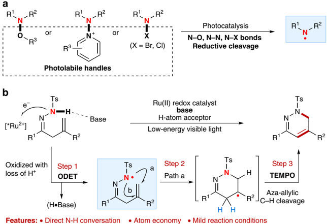
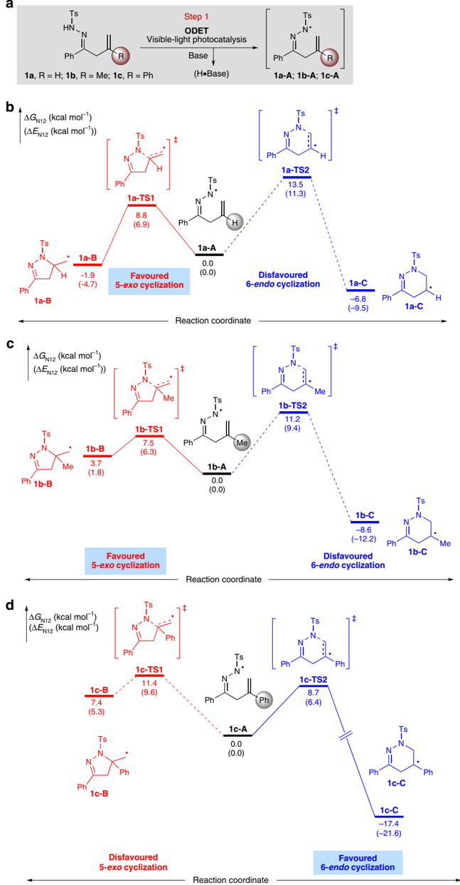
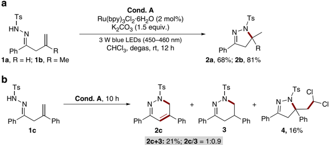
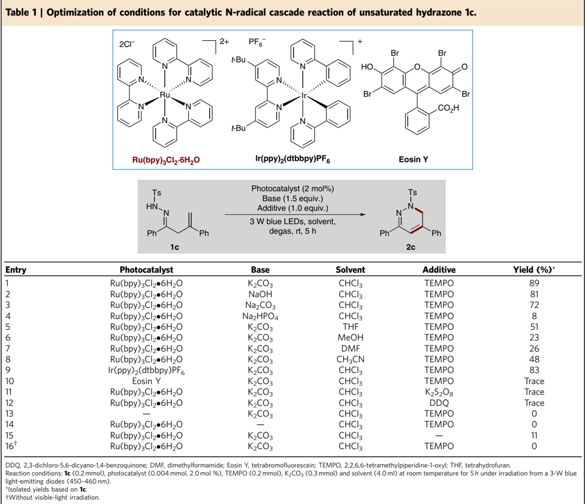
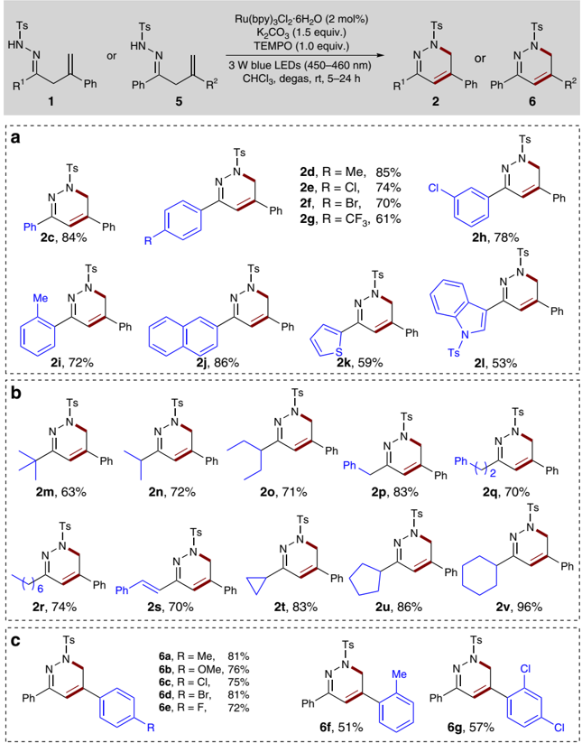
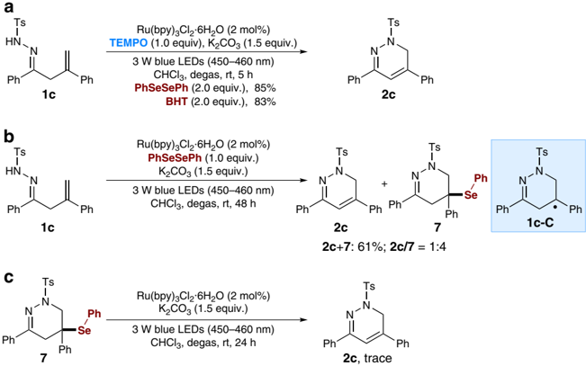
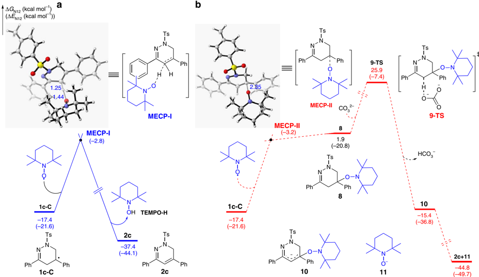
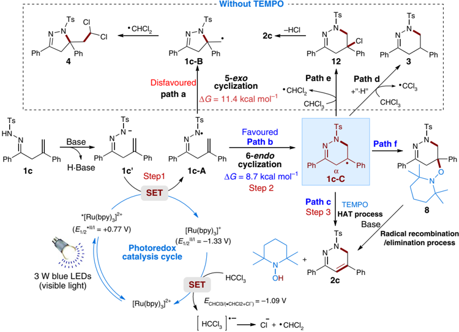
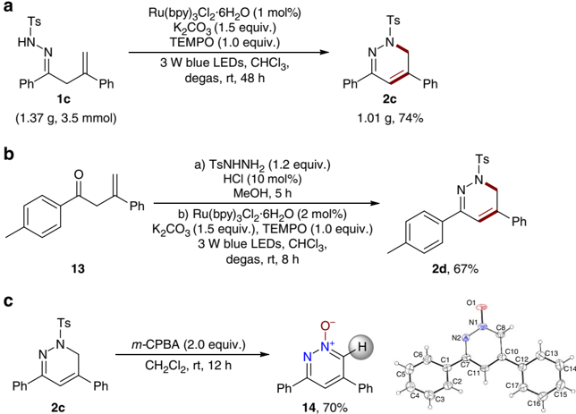
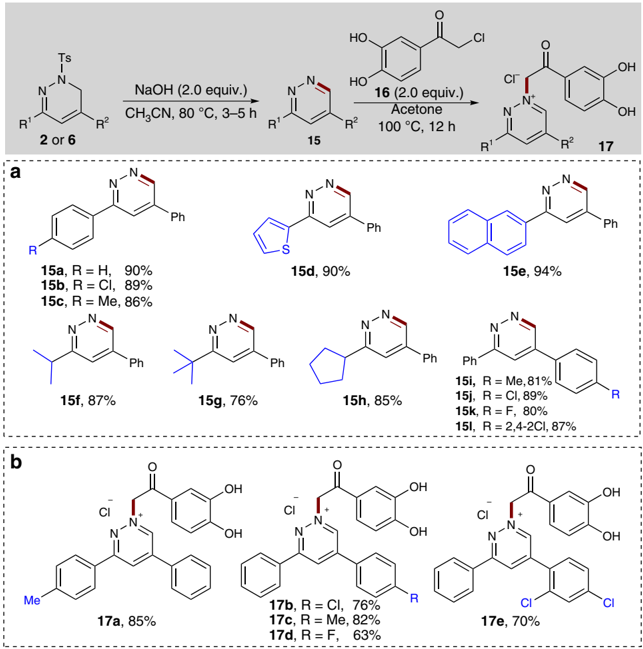

## ARTICLE

Received 1 Oct 2015 | Accepted 25 Feb 2016 | Published 6 Apr 2016

DOI: 10.1038/ncomms11188

OPEN

## Catalytic N-radical cascade reaction of hydrazones by oxidative deprotonation electron transfer and TEMPO mediation

Xiao-Qiang Hu 1 , Xiaotian Qi 2 , Jia-Rong Chen 1 , Quan-Qing Zhao 1 , Qiang Wei 1 , Yu Lan 2 &amp; Wen-Jing Xiao 1

Compared with the popularity of various C-centred radicals, the N-centred radicals remain largely unexplored in catalytic radical cascade reactions because of a lack of convenient methods for their generation. Known methods for their generation typically require the use of N-functionalized precursors or various toxic, potentially explosive or unstable radical initiators. Recently, visible-light photocatalysis has emerged as an attractive tool for the catalytic formation of N-centred radicals, but the pre-incorporation of a photolabile groups at the nitrogen atom largely limited the reaction scope. Here, we present a visible-light photocatalytic oxidative deprotonation electron transfer/2,2,6,6-tetramethylpiperidine-1-oxyl (TEMPO)-mediation strategy for catalytic N-radical cascade reaction of unsaturated hydrazones. This mild protocol provides a broadly applicable synthesis of 1,6-dihydropyradazines with complete regioselectivity and good yields. The 1,6-dihydropyradazines can be easily transformed into diazinium salts that showed promising in vitro antifungal activities against fungal pathogens. DFT calculations are conducted to explain the mechanism.

1 CCNU-uOttawa Joint Research Centre, Key Laboratory of Pesticide and Chemical Biology, Ministry of Education, College of Chemistry, Central China Normal University, 152 Luoyu Road, Wuhan 430079, China. 2 School of Chemistry and Chemical Engineering, Chongqing University, Chongqing 400030, China. Correspondence and requests for materials should be addressed to J.-R.C. (email: chenjiarong@mail.ccnu.edu.cn).

S ynthetic chemists continuously strive for fast, selective and high yielding reactions under mild conditions. Radical reactions, especially the radical cascades, provide a potential access to such ideal transformations and have attracted considerable attention of synthetic community because of their typically mild conditions, short reaction times and high efficiency 1,2 . Although various carbon radicals have been widely used in catalytic radical-based cascade reactions 3-5 , however, the chemistry of N-centred radicals in this regard remains largely unexplored because of a lack of convenient and general methods for their generation 6,7 . Known methods for their generation typically require the use of N-functionalized precursors or various toxic, potentially explosive or unstable radical initiators. Pioneered by Nicolaou's discovery of the o -iodoxybenzoic acidmediated conversion of N -aryl amides and carbamates into the corresponding nitrogen radicals 8 , the groups of Chiba 9 and Lei 10 , respectively, developed two efficient methods for the generation of 1,3-diazaallyl and amidyl radicals by Cu- and Ni-catalyzed oxidative cleavage of N-H bonds of amidines and N -alkoxyamides using O2 and di-tertiary butyl peroxide as terminal oxidants at high temperatures. Recently, Li 11 and Chemler 12 also independently reported the Cuand Ag-catalyzed oxidative formation of amidyl radicals in the presence of stoichiometric MnO2 and Selectfluor reagents as oxidants. Despite these impressive advancements, the search for new efficient protocols for direct catalytic conversion of the N-H bonds into the corresponding N-centred radicals under mild conditions has become an increasingly significant, yet challenging priority in the development of new N-radical cascade reactions.

In recent years, the visible-light photocatalysis has been established as a powerful technique that facilitates selectively activating organic molecules and chemical bonds to indentify new chemical reactions under mild conditions 13-16 . As the notable early studies by MacMillan 17 and Sanford 18 on neutral N-centred radical-mediated photocatalytic C-H amination of aldehydes and (hetero)arenes, several promising visible-light photocatalytic protocols have been developed by other groups for generating N-centred radicals and C-N bond formation (Fig. 1a) 19-23 . Despite their advantages, these methods require the introduction of a photolabile substituent at the nitrogen atom as a handle for photo-activation. The use of the visible-light photocatalysis in initiating strong N-H bond activation and application in neutral N-centred radical-mediated catalytic cascade reactions have been, until recently, very limited. The Knowles' group recently reported an elegant combination of iridium photocatalyst and phosphate base for a direct homolytic cleavage of strong N-H bonds of N -arylamides to access amidyl radicals by a concerted protoncoupled electron transfer, which allowed an efficient radical cascade reaction towards N-heterocycle synthesis 24 . Exploring new reactivity of N-containing compounds in the field of visiblelight photocatalysis is an integral part of our recent ongoing research endeavours 25-28 . For example, our group has recently developed a direct catalytic conversion of the N-H bonds of b , g -unsaturated hydrazones into N-centred hydrazonyl radicals by visible-light-induced photoredox catalysis, which enables an efficient and mild approach to intramolecular alkene hydroamination and oxyamination for synthesis of 4,5-dihydropyrazole derivatives 28 . In this reaction, a highly regioselective 5-exo radical cyclization of an N-centred radical was observed. It should be noted that the groups of Han 29,30 and Chiba 31 have also independently reported stoichiometric amounts of tetramethylpiperidine-1-oxyl (TEMPO)-mediated intramolecular cyclization of hydrazonyl radicals for pyrazoline synthesis. Inspired by these studies, we considered exploration of the reactivity of hydrazones in catalytic N-radical cascade reactions to assemble biologically and synthetically important dihydropyradazine scaffolds 32 , inaccessible using other thermal methods 29-31,33 or our own previous protocols.

To this end, herein, we report an oxidative deprotonation electron transfer (ODET)/TEMPO-mediation strategy for direct N-H bond activation and catalytic N-radical cascade reactions of unsaturated hydrazones (Fig. 1b). This mild protocol represents the first, to our knowledge, broadly applicable synthesis of 1,6-dihydropyradazines with good regioselectivity and yield, achieved by merge of visible-light photocatalysis and TEMPO mediation.

## Results

Reaction design . To realize the target catalytic N-radical cascade reaction of unsaturated hydrazones as shown in Fig. 1b, several

Figure 1 | Reaction design. ( a ) Visible-light-induced photocatalytic generation of N-centred radicals from N-functionalized precursors. ( b ) Our blueprint for catalytic N-radical cascade reaction of hydrazones: merge of oxidative deprotonation electron transfer (ODET) activation of N-H bond with TEMPO mediation.

major challenges would probably be encountered, such as the controlled formal homolysis of the recalcitrant N-H bond for the formation of the neutral N-centred hydrazonyl radical, regioselectivity of the N-radical cyclization step (for example, 6endo and 5exo , path a versus path b) 34,35 and selective homolytic activation of aza-allylic C-H bond in C-centred radical intermediate. Notably, it has been recently documented by MacMillan 36,37 , Knowles 24,38,39 and our group 28,40 that the addition of a suitable Brønsted acid, Lewis acid or base could facilitate some otherwise inaccessible photocatalytic event by weakening chemical bonds of reactants and co-catalysts or modulating their redox potential. It has also been demonstrated by Lo ´pez and Go ´mez that complete 6endo -selectivity over 5exo ring closure in radical cyclization of C-centred radicals can be controlled by the radical property, substitution pattern at C-5 or ring strain of substrate 34,35 . Quite recently, the MacMillan group also first integrated elementary hydrogen atom transfer (HAT) process into H-bond catalysis, and achieved a highly selective photoredox a -alkylation/lactonization cascade of alcohols 41 . Based on these inspiring studies, we hypothesized that the aforementioned regioselective N-radical cascade reaction could possibly be achieved by merging visible-light photoredox with TEMPO-mediated HAT process, wherein the N-H bond might be directly converted into the corresponding N-centred hydrazonyl radical through an ODET and the aza-allylic C-H bond can probably be homolytically cleavaged by a suitable H-atom acceptor such as TEMPO 42 .

To test the feasibility of this strategy, we initially conducted density functional theory (DFT) calculations on the cyclization step of N-centred radical intermediates 1a-A , 1b-A and 1c-A with sterically and electronically diverse substituents at the 2-position of the alkene (Fig. 2a; see Supplementary Notes 1-3 for details). The energies given in this work are N-12//6-311 þ G(d, p)//B3 LYP/6-31G(d) calculated Gibbs free energies in chloroform. See the Supplementary Information for more computational details.) 43 . As expected, both 5exo and 6endo N-radicalmediated radical cyclizations are possible pathways. For example, the study showed that the 5exo -trig radical cyclization of 1a-A with an activation free energy of only 8.8 kcal mol  1 via 1a-TS1 is much more favoured than its 6endo -trig variant (activation free energy of 13.5 kcal mol  1 ; Fig. 1b). It was also found that 1b-A would undergo 5 -exo cyclization through 1b-TS1 more feasibly than its 6endo cyclization via 1b-TS2 , as shown by their activation free energy (Fig. 1c, 7.5 versus 11.2 kcal mol  1 ). Interestingly, the 6endo cyclization of 1c-A with a phenyl group at the 2-position of the alkene moiety proved to be easier to accomplish through 1c-TS2 , with a relatively low activation free energy of 8.7 kcal mol  1 , to give the C-centred radical intermediate 1c-C (Fig. 1d). Encouraged by these computational results, we proceeded to perform experimental studies with these substrates to explore the feasibility of the desired 6endo radical cyclization.

Under our previously developed visible-light photocatalytic conditions for hydroamination of b , g -unsaturated hydrazones 28 , substrates 1a and 1b indeed underwent 5exo radical cyclization reactions smoothly to give the corresponding products 2a and 2b in 68% and 81% yields, respectively (Fig. 3a). These results also provided a solid support for the above computational investigations into these substrates. Interestingly, the reaction of 1c resulted in the formation of a complex mixture with a complete conversion (Fig. 3b). Careful analysis of the reaction mixture revealed that an inseparable mixture of products 2c and 3 can be obtained in 21% yield with a ratio of 1:0.9. Meanwhile, product 4 was also isolated in 16% yield, which might be formed through another radical cascade reaction between 1c and the reaction solvent CHCl3 via radical intermediate 1c-B . The structures of 2a-2c , 3 and 4 were fully characterized by their 1 H and 13 C NMR spectra and mass data, and compound 4 was further characterized by single-crystal X-ray analysis (see Supplementary Fig. 79 for details). Note that the biologically significant 1,6-dihydropyridazines of type 2c cannot be easily prepared using traditional methods 33 . These observations suggested that further optimization of reaction parameters might result in the exclusive formation of the desired 1,6-dihydropyridazines.

Optimization of reaction conditions . Encouraged by these initial results, we continued to optimize the reaction conditions with 1c as a model substrate to further improve the selectivity and yield (Table 1). Inspired by the recently demonstrated wide applicability of nitroxides in organic synthesis and their unique properties 44,45 , we initially focused on nitroxides as potential additives. Surprisingly, it was found that the addition of TEMPO (1.0 equiv.) did not quench the reaction; instead, it resulted in a clean reaction and gave the desired 1,6-dihydropyridazine 2c in 89% yield (entry 1). Based on our blueprint of the reaction, we postulated that TEMPO might serve as a H-atom acceptor to abstract aza-allylic H-atom by an HAT process 41 . Then, we simply screened inorganic bases such as NaOH, Na2CO3 and Na2HPO4, and established that the base also played an important role in the reaction, with K2CO3 identified as the best choice (entries 2-4). With K2CO3 as the base, we also briefly examined several other common solvents and CHCl3 proved to be the best reaction media with tetrahydrofuran, MeOH, dimethylformamide and CH3CN giving relatively low yields (entries 5-8). Then, we evaluated the effect of photocatalysts on the reaction under otherwise identical conditions. Interestingly, the use of Ir(ppy)2(dtbbpy)PF6 as a photocatalyst provided comparable results, whereas organic photocatalyst Eosin Y was ineffective for the reaction (entries 9-10). It has been well documented that TEMPO can serve not only as a radical scavenger but also as an oxidant in transition-metal catalysis 44,45 . Thus, we continued to test several other oxidants, such as K2S2O8 and 2,3-dichloro-5, 6-dicyano-1,4-benzoquinone (see Supplementary Table 1 for details). However, all the reactions with these oxidants resulted in a complex mixture without formation of any desired product, suggesting that TEMPO might act as a radical trap to abstract the a -hydrogen atom from intermediate 1c-C to facilitate the target N-radical cascade reaction pathway (entries 11-12). In the control experiments with CHCl3 or CH3CN as the solvent, only very little or no desired products were detected in the absence of photocatalyst, base, TEMPO or light; large amounts of starting materials remained intact, highlighting the critical role of all the parameters in the reaction (entries 13-16; see Supplementary Table 2 for details).

Substrate scope . Under the optimized conditions, we then evaluated the substrate scope of this transformation with a variety of b , g -unsaturated hydrazones (Fig. 4). First, we examined the effects of arene substitution using a wide range of b , g -unsaturated hydrazones 1c-1i . It was found that the reaction with various b , g -unsaturated hydrazones bearing electron-neutral, electronpoor (for example, Cl, Br, CF3) or electron-rich (for example, Me) substituents at the 2-, 3or 4-position of the aromatic ring proceeded well to deliver the corresponding products 2c -2i with yields ranging from 61 to 85%. Notably, those aryl bromides are amenable to further synthetic elaborations through transitionmetal-catalyzed C-C coupling reactions. Product 2f was also characterized by single-crystal X-ray analysis (see Supplementary Fig. 79 for details). Moreover, 2-naphthyl substituted hydrazone 1j reacted well to afford product 2j in 86% yield. Considering the

a

Figure 2 | Reaction development. ( a ) Generation of N-radicals by visible-light photocatalysis. ( b ) Free energy profiles for 5exo and 6endo radical cyclizations of 1a-A . ( c ) Free energy profiles for 5exo and 6endo radical cyclizations of 1b-A . ( d ) Free energy profiles for 5exo and 6endo radical cyclizations of 1c-A .

Figure 3 | Initial results. ( a ) Reaction of substrate 1a and 1b under condition A . ( b ) Reaction of substrate 1c under condition A . Unless otherwise noted, condition A : reaction were run with 1 (0.2 mmol), Ru(bpy)3Cl2  6H2O (2mol%), K2CO3 (0.3 mmol), 3 W blue light-emitting diodes (450-460 nm) irradiation and CHCl3 (4.0 mL) at rt for 10-12 h.

| Entry   | Photocatalyst          | Base       | Solvent   | Additive    | Yield (%) *   |
|---------|------------------------|------------|-----------|-------------|---------------|
| 1       | Ru(bpy) 3 Cl 2  6H 2 O                        | K 2 CO 3   | CHCl 3    | TEMPO       | 89            |
| 2       | Ru(bpy) 3 Cl 2  6H 2 O                        | NaOH       | CHCl 3    | TEMPO       | 81            |
| 3       | Ru(bpy) 3 Cl 2  6H 2 O                        | Na 2 CO 3  | CHCl 3    | TEMPO       | 72            |
| 4       | Ru(bpy) 3 Cl 2  6H 2 O                        | Na 2 HPO 4 | CHCl 3    | TEMPO       | 8             |
| 5       | Ru(bpy) 3 Cl 2  6H 2 O                        | K 2 CO 3   | THF       | TEMPO       | 51            |
| 6       | Ru(bpy) 3 Cl 2  6H 2 O                        | K 2 CO 3   | MeOH      | TEMPO       | 23            |
| 7       | Ru(bpy) 3 Cl 2  6H 2 O                        | K 2 CO 3   | DMF       | TEMPO       | 26            |
| 8       | Ru(bpy) 3 Cl 2  6H 2 O                        | K 2 CO 3   | CH 3 CN   | TEMPO       | 48            |
| 9       | Ir(ppy) 2 (dtbbpy)PF 6 | K 2 CO 3   | CHCl 3    | TEMPO       | 83            |
| 10      | Eosin Y                | K 2 CO 3   | CHCl 3    | TEMPO       | Trace         |
| 11      | Ru(bpy) 3 Cl 2  6H 2 O                        | K 2 CO 3   | CHCl 3    | K 2 S 2 O 8 | Trace         |
| 12      | Ru(bpy) 3 Cl 2  6H 2 O                        | K 2 CO 3   | CHCl 3    | DDQ         | Trace         |
| 13      | -                      | K 2 CO 3   | CHCl 3    | TEMPO       | 0             |
| 14      | Ru(bpy) 3 Cl 2  6H 2 O                        | -          | CHCl 3    | TEMPO       | 0             |
| 15      | Ru(bpy) 3 Cl 2  6H 2 O                        | K 2 CO 3   | CHCl 3    | -           | 11            |
| 16 w    | Ru(bpy) 3 Cl 2  6H 2 O                        | K 2 CO 3   | CHCl 3    | TEMPO       | 0             |

known medicinal chemistry, it is noteworthy that various heterocycles can be incorporated into the hydrazone substrates with no apparent deleterious effect on the reaction efficiency. For example, 2-thiophenyl and 3-indolyl substituted hydrazones were tolerated well to give the desired products 2k and 2l in 59% and 53% yields, respectively. More importantly, the substrate scope of

Figure 4 | Reaction scope of unsaturated hydrazones. ( a ) Investigation of the effects of arene substitution of hydrazones. ( b ) Substrate scope of aliphatic unsaturated hydrazones. ( c ) Substrate scope of alkene moieties. Unless otherwise noted, reactions were run with 1 or 5 (0.3 mmol), Ru(bpy)3Cl2  6H2O (0.006mmol, 2.0 mol%), K2CO3 (0.45 mmol), TEMPO (0.3 mmol) and CHCl3 (6.0 ml) at rt for 5-24 h under irradiation with 3 W blue light-emitting diodes (450-460 nm).

the current protocol can be successfully extended to aliphatic b , g -unsaturated hydrazones. Thus, the reaction with a series of linear and branched aliphatic b , g -unsaturated hydrazones 1m-1r can undergo the radical cascade reaction smoothly under standard conditions, although with prolonged reaction times, to afford the products 2m -2r in 63-83% yield. The b , g -unsaturated hydrazone 1s bearing a styryl group also appeared to be viable for the reaction, producing a 70% yield of 2s . Remarkably, cyclic substituents, such as cyclopropyl, cyclopentyl and cyclohexyl groups, could also be easily incorporated into the 1,6-dihydropyridazine scaffold with high yields ( 2t -2v , 83-96%).

Encouraged by these results, we proceeded to examine the scope of alkene moieties by incorporation of various substituents into the phenyl ring. As highlighted in Fig. 4c, the substitution patterns and electronic properties of the aromatic ring showed no apparent effect on the reaction efficiency either. For example, all the electron-releasing (for example, 4-Me, 2-Me and 4-MeO) and electron-withdrawing (for example, 4-F, 4-Cl, 4-Br, 2,4-2Cl) groups were well tolerated under the standard conditions, furnishing the expected products 6a-6g in 51-81% yield.

Interestingly, during our subsequent biological studies with 1,6-dihydropyridazines 2and 6 -derived diazinium salts, it was found that such aromatic substituents at the 2-position of the alkene are critical to their antifungal in vitro activities. It should be noted that we did not detect any 5exo cyclization products in all cases 29,30 .

Mechanistic investigations . To gain additional insights into the reaction mechanism, several control experiments were conducted with model substrate 1c (Fig. 5; see Supplementary Discussion for details). To further confirm the formation of C-centred intermediate of type 1c -C during the reaction, common radical trapping agents (PhSeSePh or 2,6-di-tert-butyl-4-methylphenol, BHT) were added to the reaction system to capture the radical intermediate (Fig. 5a). However, no trapping products were observed; instead, only the 1,6-dihydropyridazine 2c was produced and isolated in 85% and 83% yields, respectively. In contrast, without addition of TEMPO, the reaction with PhSeSePh as a radical trapping agent furnished a mixture of desired 2c and selenide-adduct 7 (61% yield, 1:4 ratio; see Supplementary Fig. 78

(AEN12 (kcal mor')

2.35

1.25

1.44

MEC

v MECP-I

1-3

Figure 5 | Mechanistic investigations. ( a ) Trapping the C-centred intermediate by addition of PhSeSePh or BHT under the standard conditions. ( b ) Trapping the C-centred intermediate by addition of PhSeSePh under the standard conditions in the absence of TEMPO. ( c ) Control experiment with selenide-adduct 7 under the standard conditions.

Figure 6 | Calculation studies. ( a ) Free energy profile for the transformation of C-centred radical 1c-C into product 2c through a TEMPO-mediated HATprocess. ( b ) Free energy profile for the transformation of C-centred radical 1c-C into product 2c through carbon radical trapping/elimination process.

for details), and compound 7 should be formed from radical intermediate 1c -C and PhSeSePh (Fig. 5b). Then, we obtained the pure selenide-adduct 7 by semi-preparative high-performance liquid chromatography purification and re-subjected it to the standard reaction conditions without TEMPO (Fig. 5c). However, we did not detect any desired product 2c even after 24 h and compound 7 remained intact, suggesting that selenide-adduct 7 should not be the possible intermediate for the formation of 1,6-dihydropyridazine 2c .

To further determine the role of TEMPO, we also calculated the free energy of the subsequent transformation of C-centred radical intermediate 1c -C into the final product 2c via the minimum energy crossing point (MECP; Fig. 6) 43 . As shown in Fig. 6a, the computational results showed that the TEMPO might facilitate the conversion of the intermediate 1c -C into the final product 2c through a TEMPO-mediated HAT process, because the calculated energy barrier ( D E ) for the aza-allylic hydrogen atom abstraction via MECP-I is only 18.8 kcal mol  1 . Moreover,

Figure 7 | Proposed catalytic cycle. The plausible mechanism involves oxidative deprotonation electron transfer (ODET) activation of N-H bond into N-centred radical by visible light photoredox catalysis and TEMPO-mediated N-radical cyclization.

the generation of product 2c is exergonic by 20.0 kcal mol  1 compared with the intermediate 1c -C . Recently, a similar trapping of carbon radical and elimination of TEMPO-H process in the presence of base has been identified by Chiba's group as the possible pathway in TEMPO-mediated C-H bond oxygenation of oximes and hydrazones 46 . Inspired by this work, another possible pathway involving carbon radical trapping/ elimination sequence of 1c -C in the presence of base was also considered in calculation. As shown in Fig. 6b, the combination of radical 1c -C with TEMPO occurs through MECP-II , and the energy barrier ( D E ) of which is 18.4 kcal mol  1 . Although this energy barrier is close to that of MECP-I formation (Fig. 6a), the formation of TEMPO-adduct 8 is endergonic by 19.3 kcal mol  1 compared with 1c -C . Moreover, the activation free energy of subsequent deprotonation, which occurs via transition state 9-TS , reaches as high as 43.3 kcal mol  1 . According to these results, the sequential combination of carbon radical 1c -C with TEMPO and elimination process appears to be thermodynamically unfavourable. Moreover, we also intended to isolate the possible intermediate 8 upon B 50% conversion of model substrate 1c . Unfortunately, all the attempts met failure, although a trace amount of intermediate 8 was detected by the high-resolution mass spectrometry analysis of the the reaction mixture (see Supplementary Information). Another possible pathway for base-free elimination of TEMPO-H from 8 by direct radical elimination with C-O bond homolysis is not considered as the stoichiometric base is necessary in our reaction system 47-49 . Taken together, although the calculation studies support the TEMPO-mediated HAT process as the likely mechanism for the transformation of C-centred radical intermediate 1c -C into the final product 2c , at present we cannot rule out the carbon radical recombination/elimination pathway (see Supplementary Figs 80 and 81 and Supplementary Notes 1-3 for details). More detailed mechanistic studies are curently underway in our laboratory.

According to our blueprint for ODET activation of N-H bond, the addition of K2CO3 proved be critical for the reaction as a base and this phenomenon was indeed observed during the optimization study (Table 1, entry 14). To further evaluate the role of base in these reactions, we continue to study the mechanism of N-centred hydrazonyl radical formation by luminescence quenching experiments, NMR and electrochemical analysis with 1c as a model substrate (see Supplementary Figs 82-86 for details). Stern-Volmer analysis demonstrated that hydrazone 1c alone is unable to quench the excited state of *[Ru(bpy)3] 2 þ in dimethylformamide at 25 ° C, implying that the excited state ruthenium complex does not oxidize the hydrazone 1c directly. However, upon addition of K2CO3 as a base, a significant decrease of luminescence emission intensity was observed. In addition, the 1 H NMR analysis of a solution containing both 1c and K2CO3 exhibited that the addition of K2CO3 resulted in complete disappearance of the signal of N-H, suggesting that K2CO3 serve to abstract the proton of N-H bond to generate nitrogen anion intermediate 1c' (Fig. 7 and Supplementary Information). Moreover, cyclic voltammetry data confirmed that the excited photocatalyst *Ru(bpy)3 2 þ ( E 1/2 *II/I ¼ þ 0.77 V versus SCE in CH3CN) is likely to be sufficiently oxidizing to oxidize the nitrogen anion 1c' ( E p red ¼ 0.56 V versus SCE) to generate the corresponding N-centred radical intermediate 1c-A (Fig. 7). Taken together, although we could not completely exclude the concerted proton-coupled electron transfer mechanism at the current stage 24,38,39 , the above results are more consisted with an ODET activation mechanism involving sequential deprotonation of hydrazone substrates by the K2CO3 and visible-light photocatalytic single-electron transfer (SET) oxidation.

Ultimately, a plausible mechanism is outlined in Fig. 7 using 1c as an example. Initially, the b , g -unsaturated hydrazone 1c is transformed into anionic intermediate 1c' upon deprotonation, which is then oxidized to the N-centred radical 1c -A by the excited photocatalyst *[Ru(bpy)3] 2 þ through a SET process. Then, the key intermediate 1c -A undergoes a 6endo radical cyclization to afford the C-centred benzylic radical intermediate 1c -C , which can be conveniently transformed into the final

Figure 8 | Synthetic application. ( a ) Gram-scale reaction. ( b ) One-pot process for synthesis of 1,6-dihydropyridazine 2d . ( c ) Synthesis of pyridazine N -oxide 14 .

Figure 9 | Application to the synthesis of pyridazines and diazinium salts. ( a ) Reactions were run with 2 or 6 (0.2 mmol), NaOH (0.6 mmol) and CH3CN (4.0ml) at 80 ° C for 3-5 h. ( b ) Reactions were run with 15 (0.3 mmol), 16 (0.6 mmol) and acetone (3.0 ml) at 100 ° C for 12 h.

product 2c by an HAT process in the presence of TEMPO (path c). However, as for the transformation of C-centred radical intermediate 1c-C into the final product 2c , at the current stage, we cannot rule out the carbon radical recombination/elimination pathway that involves TEMPO-adduct 8 as the key intermediate (path f, see Supplementary Information). In the absence of TEMPO, the intermediate 1c -C can abstract a hydrogen atom directly from CHCl3 to give 1,4,5,6-tetrahydropyridazine 3

(path d). Meanwhile, the intermediate 1c -C can also abstract a chlorine radical from chloroform to give rise to dichloromethyl radical and labile tertiary chloride adduct 12 intermediate 50 , which can undergo facile elimination to give the product 2c . Moreover, without addition of TEMPO, the intermediate N-centred radical 1c -A could also undergo a 5exo radical cyclization (path a) to furnish 1c -B , partly because of the relatively small activation free energy difference between 1c -B and 1c -C (Fig. 2d). In the photocatalytic cycle, chloroform can regenerate the photocatalyst [Ru(bpy)3] 2 þ by an SET oxidation process with the concomitant release of the chloroform radical anion, which rapidly dechlorinated to give chloride ion and the dichloromethyl radical 51-54 . The formation of a dichloromethyl radical in the reaction was also confirmed by the isolation of side product 4 , resulting from the radical cross coupling between the dichloromethyl radical and 1c -B intermediate.

Synthetic application . To further demonstrate the synthetic potential of this method, a gram-scale reaction of b , g -unsaturated hydrazone 1c was conducted in the presence of 1 mol% of photocatalyst under standard reaction conditions, and the desired product 2c was still successfully obtained in 74% yield after 48 h (Fig. 8a). A key benefit of this photocatalytic radical cyclization strategy is that the b , g -unsaturated hydrazone starting materials are easily accessed from the corresponding b , g -unsaturated ketones and tosyl hydrazine. Thus, we examined the photocatalytic radical cyclization with b , g -unsaturated ketone 13 and tosyl hydrazine in a two-step one-pot process (Fig. 8b). Pleasingly, the desired 1,6-dihydropyridazine 2d was obtained in 67% overall yield. Recently, heteroaromatic N -oxides have been widely employed in transition-metal-catalyzed aromatic C-H activation/functionalization reactions to access various valuable heterocyclic molecules 55 . We found that the present method could provide a new approach to the synthesis of pyridazine N -oxides. For example, treatment of 2c with m -CPBA as the oxidant resulted in the facile formation of pyridazine N -oxide 14 in a 70% yield that was also clearly determined by X-ray analysis (Fig. 8c; see Supplementary Fig. 79 for details).

Moreover, it was then established that the 1,6-dihydropyridazine products can also be easily transformed into the corresponding biologically important pyridazines under mild conditions (2.0 equiv. NaOH in CH3CN at 80 ° C). As highlighted in Fig. 9a, the electronic and steric properties of the substituents on both of the aromatic rings showed no significant effect on the reaction efficiency. A series of substrates with electron-rich or electron-poor substituents worked well to give the desired products in good yields ( 15a -15d , 86-90% yield; 15i -15l , 81-89% yield). In addition, 2-thiophenyl and 2-naphthylsubstituted 1,6-dihydropyridazines reacted well to give the corresponding pyridazine products 15d and 15e in 90% and 94% yield, respectively. Remarkably, the 1,6-dihydropyridazines bearing alkyl groups such as isopropyl, tert -butyl and cyclohexyl substituents, were well tolerated to deliver the desired products 15f-15h in high yields (76-87%).

It has recently been documented that the pyridazine derivatives, such as diazinium salts bearing a dihydroxyacetophenone core, showed promising biological activities against a variety of microorganisms (germs and fungi) 56 . Thus, we further attempted to transform a range of representative pyridazines 15 into the corresponding diazinium salts 17 and preliminarily explored their potential structure-activity relationships (Fig. 9b). By refluxing a mixture of pyridazines 15 and 2-chloro-3 0 , 4 0 -dihydroxyacetophenone 16 in acetone for 12 h, a series of diazinium salts 17a -17e were easily obtained in 63-85% yield after a simple filtration.

Over the past decades, the incidence of invasive fungal infections and the associated morbidity and mortality rates have risen remarkably due to the over-use of broad-spectrum antibiotics, serious medical interventions and immune deficiency disorders, such as AIDS 57,58 . Despite recent additions to the antifungal drug family, the limitations of the current antifungal drugs involve narrow activity spectra, detrimental drug-drug interactions and antifungal resistance, necessitating the development of new antifungal agents or leads. With diazinium salts 17a -17e in hand, we evaluated the in vitro antifungal activities of these compounds against eight human pathogenic fungi, compared with commercially available fluconazole. In contrast to the antibacterial activities reported for related diazinium salts 56 , our results demonstrated that some of these compounds showed promising activities against four common clinical pathogenic fungi ( Candida albicans , C. parapsilosis , C. neoformans and C. glabrata ; see Supplementary Tables 3 and 4 for details). These results also confirmed that the substitution patterns and electronic properties of the substituents at both of the phenyl rings are critical to their in vitro antifungal activities. Gratifyingly, the MIC80 values of most of the compounds ( 17b -17e ) against C. parapsilosis , C. neoformans and C. glabrata (0.5-4 m g ml  1 ) were comparable to those of fluconazole, which should be valuable for our future biological studies.

## Discussion

We have developed a novel ODET/HAT strategy, which we used to directly convert the N-H bond of b , g -unsaturated hydrazones to the N-centred radical, and developed an efficient catalytic N-radical cascade reaction. This mild protocol represents the first, to our knowledge, broadly applicable synthesis of 1,6-dihydropyradazines with good regioselectivity and yield, achieved by the merge of visible-light photocatalysis and TEMPO mediation. The 1,6-dihydropyridazines could also be conveniently transformed into biologically important diazinium salts bearing dihydroxyacetophenone core, which showed promising antifungal in vitro activities against various fungal pathogens. Control experiments and DFT calculations have been performed to help explain the mechanism. Owing to the wide occurrence of various N-H bonds, we believe that this strategy may find wide use for generation of other various N -centred radicals and new reaction developments with these reactive species 59 .

## Methods

Materials . Unless otherwise noted, materials were purchased from commercial suppliers and used without further purification. All the solvents were treated according to general methods. Flash column chromatography was performed using 200-300 mesh silica gel. The manipulations for photocatalytic N-radical cascade reactions were carried out with standard Schlenk techniques under Ar by visible-light irradiation. See Supplementary Methods for experimental details.

General methods . 1 H NMR spectra were recorded on 400 or 600 MHz spectrophotometers. Chemical shifts are reported in delta ( d ) units in parts per million (p.p.m.) relative to the singlet (0 p.p.m.) for tetramethylsilane. Data are reported as follows: chemical shift, multiplicity (s ¼ singlet, d ¼ doublet, t ¼ triplet, dd ¼ doublet of doublets, m ¼ multiplet), coupling constants (Hz) and integration. 13 C NMR spectra were recorded on 100 or 150 MHz with complete protondecoupling spectrophotometers (CDCl3: 77.0 p.p.m. or DMSO-d 6 : 39.5 p.p.m.). 19 F NMR spectra were recorded on 376 MHz with complete proton-decoupling spectrophotometers. Mass spectra were measured on MS spectrometer (EI) or liquid chromatography-mass spectrometry (LC/MS), or electrospray ionization mass spectrometry (ESI-MS). High-resolution mass spectrometry was recorded on Bruker ultrafleXtreme matrix-assisted laser desorption/ionization-time-of-flight (TOF)/TOF mass spectrometer. 1 H NMR, 13 C NMR and 19 F NMR spectra are supplied for all compounds: see Supplementary Figs 1-77.

General procedure for catalytic nitrogen radical cascade reaction of hydrazones

.

In a flame-dried Schlenk tube under Ar, 1c (117.0 mg, 0.3 mmol), Ru(bpy)3Cl2.6H2O

(0.006 mmol), TEMPO (46.9mg, 0.3 mmol) and K2CO3 (61.2 mg, 0.45 mmol) were dissolved in CHCl3 (6.0 ml). Then, the resulting mixture was degassed via 'freeze-pump-thaw' procedure (three times). After that, the solution was stirred at a distance of B 5cm from a 3-W blue light-emitting diodes (450-460 nm) at room temperature B 5 h until the reaction was completed as monitored by thin-layer chromatography analysis. The crude product was purified by flash chromatography on silica gel (petroleum ether/ethyl acetate 20:1 B 10:1) directly to give the desired product 2c in 84% yield as a white solid. Full experimental details and characterization of new compounds can be found in the Supplementary Methods.

## References

1. Chatgilialoglu, C. &amp; Studer, A. Encyclopedia of Radicals in Chemistry, Biology and Materials (John Wiley &amp; Sons, 2012).
2. Zard, S. Z. Radical Reactions in Organic Synthesis (Oxford Univ., 2003).
3. Sebren, L. J., Devery, III J. J. &amp; Stephenson, C. R. Catalytic radical domino reactions in organic synthesis. ACS Catal. 4, 703-716 (2014).
4. Wille, U. Radical cascades initiated by intermolecular radical addition to alkynes and related triple bond systems. Chem. Rev. 113, 813-853 (2013).
5. Chen, J.-R., Yu, X.-Y. &amp; Xiao, W.-J. Tandem radical cyclization of N-arylacrylamides: an emerging platform for the construction of 3,3-disubstituted oxindoles. Synthesis 47, 604-629 (2015).
6. Zard, S. Z. Recent progress in the generation and use of nitrogen-centred radicals. Chem. Soc. Rev. 37, 1603-1618 (2008).
7. Minozzi, M., Nanni, D. &amp; Spagnolo, P. From azides to nitrogen-centered radicals: applications of azide radical chemistry to organic synthesis. Chem. Eur. J 15, 7830-7840 (2009).
8. Nicolaou, K. C. et al. Iodine (V) reagents in organic synthesis. Part 3. New routes to heterocyclic compounds via o-iodoxybenzoic acid-mediated cyclizations: generality, scope, and mechanism. J. Am. Chem. Soc. 124, 2233-2244 (2002).
9. Wang, Y.-F., Chen, H., Zhu, X. &amp; Chiba, S. Copper-catalyzed aerobic aliphatic C-H oxygenation directed by an amidine moiety. J. Am. Chem. Soc. 134, 11980-11983 (2012).
10. Zhou, L.-L. et al. Transition-metal-assisted radical/Radical cross-coupling: a new strategy to the oxidative C(sp 3 )-H/N-H cross-coupling. Org. Lett. 16, 3404-3407 (2014).
11. Li, Z.-D., Song, L.-Y. &amp; Li, C.-Z. Silver-catalyzed radical aminofluorination of unactivated alkenes in aqueous media. J. Am. Chem. Soc. 135, 4640-4643 (2013).
12. Liwosz, T. W. &amp; Chemler, S. R. Copper-catalyzed oxidative amination and allylic amination of alkenes. Chem. Eur. J 19, 12771-12777 (2013).
13. Dai, C., Narayanam, J. M. R. &amp; Stephenson, C. R. J. Visible-light-mediated conversion of alcohols to halides. Nat. Chem. 3, 140-145 (2011).
14. Xuan, J. &amp; Xiao, W.-J. Visible-light photoredox catalysis. Angew. Chem. Int. Ed. 51, 6828-6838 (2012).
15. Prier, C. K., Rankic, D. A. &amp; Macmillan, D. W. Visible light photoredox catalysis with transition metal complexes: applications in organic synthesis. Chem. Rev. 113, 5322-5363 (2013).
16. Schultz, D. M. &amp; Yoon, T. P. Solar synthesis: prospects in visible light photocatalysis. Science 343, 985-994 (2014).
17. Cecere, G., Konig, C. M., Alleva, J. L. &amp; MacMillan, D. W. Enantioselective direct alpha-amination of aldehydes via a photoredox mechanism: a strategy for asymmetric amine fragment coupling. J. Am. Chem. Soc. 135, 11521-11524 (2013).
18. Allen, L. J., Cabrera, P. J., Lee, M. &amp; Sanford, M. S. N-Acyloxyphthalimides as nitrogen radical precursors in the visible light photocatalyzed room temperature C-H amination of arenes and heteroarenes. J. Am. Chem. Soc. 136, 5607-5610 (2014).
19. Qin, Q.-X. &amp; Yu, S.-Y. Visible-light-promoted redox neutral C-H amidation of heteroarenes with hydroxylamine derivatives. Org. Lett. 16, 3504-3507 (2014).
20. Kim, H., Kim, T., Lee, D. G., Roh, S. W. &amp; Lee, C. Nitrogen-centered radical-mediated C-H imidation of arenes and heteroarenes via visible light induced photocatalysis. Chem. Commun. 50, 9273-9276 (2014).
21. Greulich, T. W., Daniliuc, C. G. &amp; Studer, A. N-Aminopyridinium salts as precursors for N-centered radicals-direct amidation of arenes and heteroarenes. Org. Lett. 17, 254-257 (2015).
22. Miyazawa, K., Koike, T. &amp; Akita, M. Regiospecific intermolecular aminohydroxylation of olefins by photoredox catalysis. Chem. Eur. J 21, 11677-11680 (2015).
23. Jiang, H. et al. Visible-light-promoted iminyl-radical rormation from acyl oximes: A unified approach to pyridines, quinolines, and phenanthridines. Angew. Chem. Int. Ed. 54, 4055-4059 (2015).
24. Choi, G. J. &amp; Knowles, R. R. Catalytic alkene carboaminations enabled by oxidative proton-coupled electron transfer. J. Am. Chem. Soc. 137, 9226-9229 (2015).
25. Zou, Y.-Q. et al. Visible-light-induced oxidation/[3 þ 2] cycloaddition/oxidative aromatization sequence: a photocatalytic strategy to construct pyrrolo[2,1a ] isoquinolines. Angew. Chem. Int. Ed. 50, 7171-7175 (2011).
26. Xuan, J. et al. Visible-light-induced formal [3 þ 2] cycloaddition for pyrrole synthesis under metal-free conditions. Angew. Chem. Int. Ed. 53, 5653-5656 (2014).
27. Xuan, J. et al. Redox-neutral a -allylation of amines by combining palladium catalysis and visible-light photoredox catalysis. Angew. Chem. Int. Ed. 54, 1625-1628 (2015).
28. Hu, X.-Q. et al. Photocatalytic generation of N-centered hydrazonyl radicals: a strategy for hydroamination of b , g -unsaturated hydrazones. Angew. Chem. Int. Ed. 53, 12163-12167 (2014).
29. Duan, X.-Y. et al. Hydrazone radical promoted vicinal difunctionalization of alkenes and trifunctionalization of allyls: synthesis of pyrazolines and tetrahydropyridazines. J. Org. Chem. 78, 10692-10704 (2013).
30. Duan, X.-Y. et al. Transition from p radicals to s radicals: substituent-yuned cyclization of hydrazonyl radicals. Angew. Chem. Int. Ed. 53, 3158-3162 (2014).
31. Zhu, X. &amp; Chiba, S. TEMPO-mediated allylic C-H amination with hydrazones. Org. Biomol. Chem. 12, 4567-4570 (2014).
32. Maison, W. &amp; Ku ¨chenthal, C.-H. Synthesis of cyclic hydrazino a -carboxylic acids. Synthesis 2010, 719-740 (2010).
33. Potikha, L., Turelik, A. &amp; Kovtunenko, V. Synthesis and properties of z-1, 3-bis-(aryl)-4-bromo-2-buten-1-ones. Chem. Heterocycl. Compd 45, 1184-1189 (2009).
34. Go ´mez, A. M., Company, M. D., Uriel, C., Valverde, S. &amp; Lo ´pez, J. C. 6Endo versus 5exo radical cyclization: streamlined syntheses of carbahexopyranoses and derivatives by 6endo-trig radical cyclization. Tetrahedron Lett. 48, 1645-1649 (2007).
35. Go ´mez, A. M., Uriel, C., Company, M. D. &amp; Lo ´pez, J. C. Synthetic strategies directed towards 5a-carbahexopyranoses and derivatives based on 6-endo-trig radical cyclizations. Eur. J. Org. Chem. 2011, 7116-7132 (2011).
36. Cuthbertson, J. D. &amp; MacMillan, D. W. C. The direct arylation of allylic sp 3 C-H bonds via organic and photoredox catalysis. Nature 519, 74-77 (2015).
37. Jin, J. &amp; MacMillan, D. W. C. Alcohols as alkylating agents in heteroarene C-H functionalization. Nature 525, 87-90 (2015).
38. Miller, D. C., Choi, G. J., Orbe, H. S. &amp; Knowles, R. R. Catalytic olefin hydroamidation enabled by proton-coupled electron transfer. J. Am. Chem. Soc. 137, 13492-13495 (2015).
39. Tarantino, K. T., Miller, D. C., Callon, T. A. &amp; Knowles, R. R. Bond-weakening catalysis: conjugate aminations enabled by the soft homolysis of strong N-H bonds. J. Am. Chem. Soc. 137, 6440-6443 (2015).
40. Zhou, Q.-Q. et al. Decarboxylative alkynylation and carbonylative alkynylation of carboxylic acids enabled by visible-light photoredox catalysis. Angew. Chem. Int. Ed. 54, 11196-11199 (2015).
41. Jeffrey, J. L., Terrett, J. A. &amp; MacMillan, D. W. C. O-H hydrogen bonding promotes H-atom transfer from C-H bonds for C-alkylation of alcohols. Science 349, 1532-1536 (2015).
42. Mayer, J. M. Understanding hydrogen atom transfer: from bond strengths to marcus theory. Acc. Chem. Res. 44, 36-46 (2011).
43. The reference for Harvey's programHarvey, J. N., Aschi, M., Schwarz, H. &amp; Koch, W. The singlet and triplet states of phenyl cation. A hybrid approach for locating minimum energy crossing points between non-interacting potential energy surfaces. Theor. Chem. Acc. 99, 95-99 (1998).
44. Tebben, L. &amp; Studer, A. Nitroxides: applications in synthesis and in polymer chemistry. Angew. Chem. Int. Ed. 50, 5034-5068 (2011).
45. Bagryanskaya, E. G. &amp; Marque, S. R. A. Scavenging of organic C-centered radicals by nitroxides. Chem. Rev. 114, 5011-5056 (2014).
46. Zhu, X., Wang, Y.-F., Ren, W., Zhang, F.-L. &amp; Chiba, S. TEMPO-Mediated aliphatic C-H oxidation with oximes and hydrazones. Org. Lett. 15, 3214-3217 (2013).
47. Li, Y. &amp; Studer, A. Transition-metal-free trifluoromethylaminoxylation of alkenes. Angew. Chem. Int. Ed. 51, 8221-8224 (2012).
48. Hartmann, M., Li, Y. &amp; Studer, A. Transition-metal-free oxyarylation of alkenes with aryl diazonium salts and TEMPONa. J. Am. Chem. Soc. 134, 16516-16519 (2012).
49. Maity, S. et al. Efficient and stereoselective nitration of mono- and disubstituted olefins with AgNO2 and TEMPO. J. Am. Chem. Soc. 135, 3355-3358 (2013).
50. Recupero, F. et al. Enhanced nucleophilic character of the 1-adamantyl radical in chlorine atom abstraction and in addition to electron-poor alkenes and to protonated heteroaromatic bases. Absolute rate constants and relationship with the Gif reaction. J. Chem. Soc. Perkin Trans 2, 2399-2406 (1997).
51. Bertran, J., Gallardo, I., Moreno, M. &amp; Saveant, J. M. Dissociative electron transfer. Ab initio study of the carbon-halogen bond reductive cleavage in methyl and perfluoromethyl halides. Role of the solvent. J. Am. Chem. Soc. 114, 9576-9583 (1992).
52. Zhang, W., Yang, L., Wu, L.-M., Liu, Y.-C. &amp; Liu, Z.-L. Photoinduced electron transfer retropinacol reaction of 4-(N,N-dimethylamino)phenyl pinacols in chloroform. J. Chem. Soc. Perkin Trans 2, 1189-1194 (1998).
53. Costentin, C., Robert, M. &amp; Save ´ant, J.-M. Successive removal of chloride ions from organic polychloride pollutants. mechanisms of reductive electrochemical elimination in aliphatic gem-polychlorides, a , b -polychloroalkenes, and a , b -polychloroalkanes in mildly protic medium. J. Am. Chem. Soc. 125, 10729-10739 (2003).

54. Studer, A. &amp; Curran, D. P. The electron is a catalyst. Nat. Chem. 6, 765-773 (2014).
55. Seregin, I. V. &amp; Gevorgyan, V. Direct transition metal-catalyzed functionalization of heteroaromatic compounds. Chem. Soc. Rev. 36, 1173-1193 (2007).
56. Balan, A. M. et al. Diazinium salts with dihydroxyacetophenone skeleton: syntheses and antimicrobial activity. Eur. J. Med. Chem. 44, 2275-2279 (2009).
57. Ostrosky-Zeichner, L., Casadevall, A., Galgiani, J. N., Odds, F. C. &amp; Rex, J. H. An insight into the antifungal pipeline: selected new molecules and beyond. Nat. Rev. Drug Discov. 9, 719-727 (2010).
58. Brown, G. D., Denning, D. W. &amp; Levitz, S. M. Tackling human fungal infections. Science 336, 647-647 (2012).
59. Chen, J.-R., Hu, X.-Q., Lu, L.-Q. &amp; Xiao, W.-J. Visible light photoredoxcontrolled reactions of N-radicals and radical ions. Chem. Soc. Rev. http://dx.doi.org/10.1039/C5CS00655D (2016).

## Acknowledgements

We are grateful to the National Science Foundation of China (NO. 21272087, 21472058, 21472057 and 21232003), and the Youth Chen-Guang Project of Wuhan (No. 2015070404010180). This work was also financially supported by the selfdetermined research funds of CCNU from the colleges' basic research and operation of MOE (No. CCNU15A02009). X.Q. and Y.L. are grateful to the National Science Foundation of China (NO. 21372266 and 51302327) for financial support. We also thank the anonymous referees for helpful suggestions.

## Author contributions

X.-Q.H., J.-R.C., Q.-Q.Z. and Q.W. are responsible for the plan and implementation of the experimental work. X.Q. and Y.L. are responsible for the calculation study. J.-R.C.

and W.-J.X. designed and guided this project and co-wrote the manuscript. All authors discussed the results and commented on the manuscript.

## Additional information

Accession codes: The X-ray crystallographic coordinates for structures reported in this Article have been deposited at the Cambridge Crystallographic Data Centre (CCDC), under deposition numbers CCDC 1407651 (2 f), 1407652 (4), 1407653 (14). These data can be obtained free of charge from the Cambridge Crystallographic Data Centre via http://www.ccdc.cam.ac.uk/data\_request/cif.

Supplementary Information accompanies this paper at http://www.nature.com/ naturecommunications

Competing financial interests: The authors declare no competing financial interests.

Reprints and permission information is available online at http://npg.nature.com/ reprintsandpermissions/

How to cite this article: Hu, X.-Q. et al. Catalytic N-radical cascade reaction of hydrazones by oxidative deprotonation electron transfer and TEMPO mediation. Nat. Commun. 7:11188 doi: 10.1038/ncomms11188 (2016).

This work is licensed under a Creative Commons Attribution 4.0 International License. The images or other third party material in this article are included in the article's Creative Commons license, unless indicated otherwise in the credit line; if the material is not included under the Creative Commons license, users will need to obtain permission from the license holder to reproduce the material. To view a copy of this license, visit http://creativecommons.org/licenses/by/4.0/