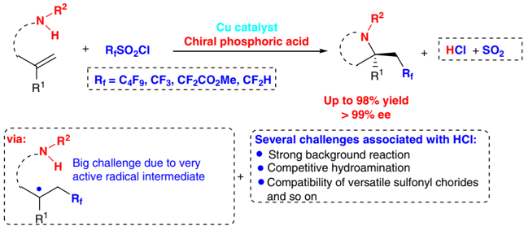
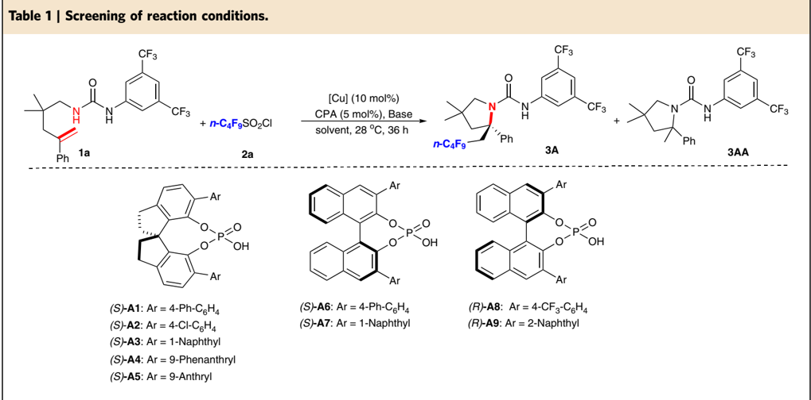
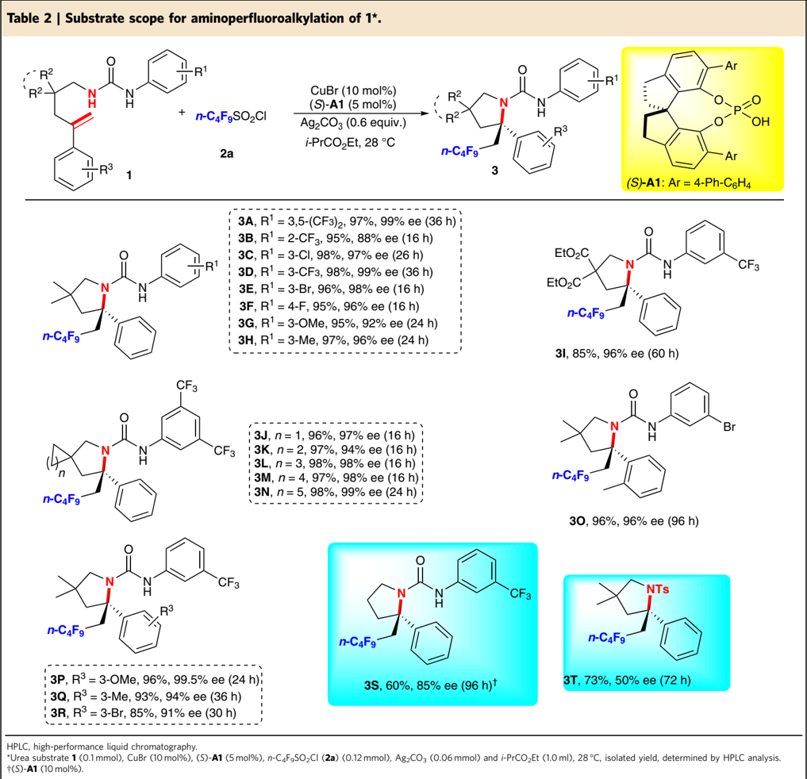
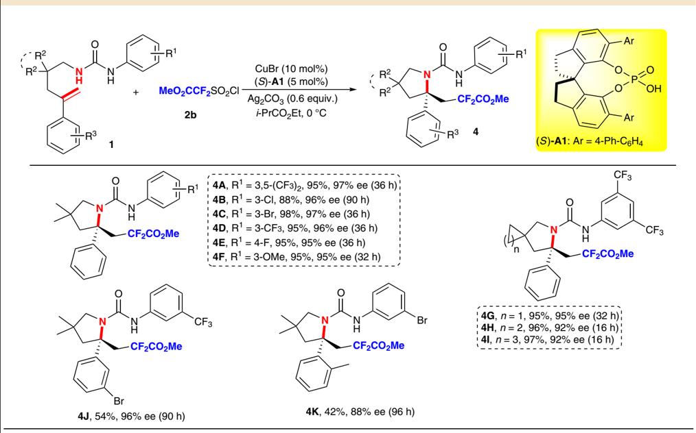
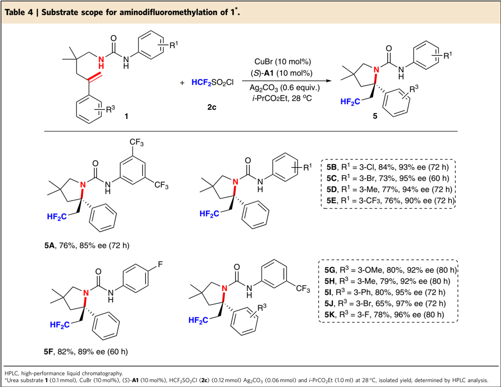
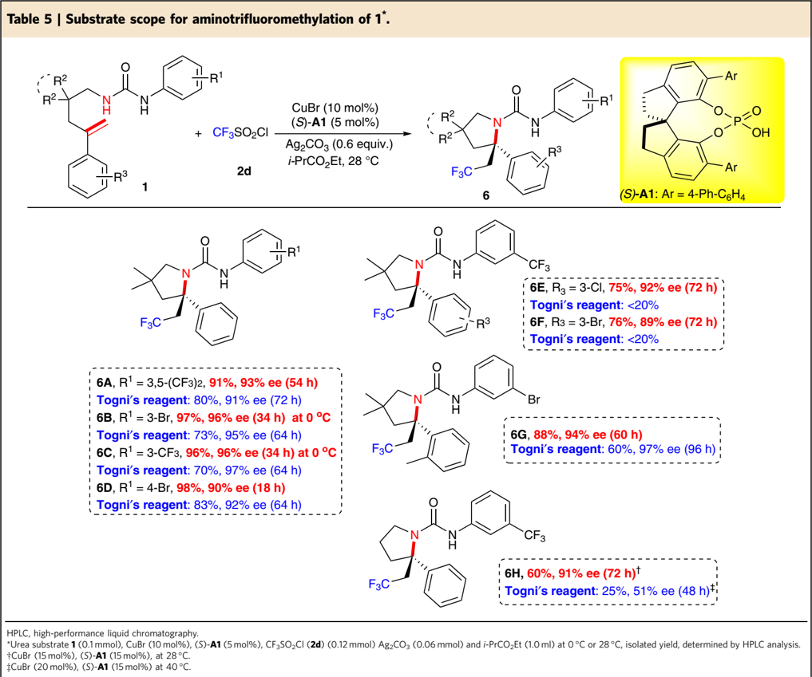
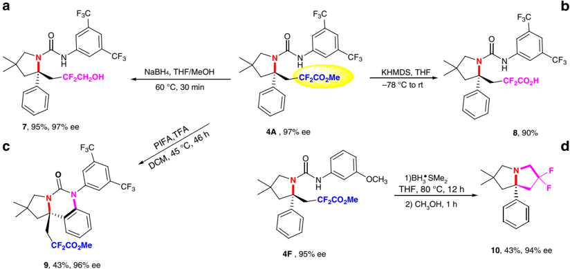
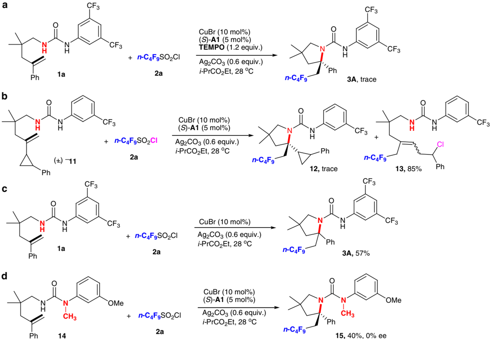
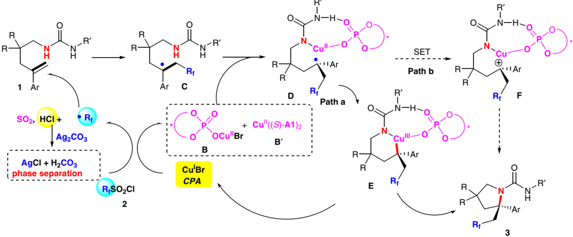

## ARTICLE

Received 24 Sep 2016 | Accepted 3 Feb 2017 | Published 23 Mar 2017

DOI: 10.1038/ncomms14841

OPEN

## Catalytic asymmetric radical aminoperfluoroalkylation and aminodifluoromethylation of alkenes to versatile enantioenriched-fluoroalkyl amines

Jin-Shun Lin 1, *, Fu-Li Wang 1, *, Xiao-Yang Dong 1, *, Wei-Wei He 1 , Yue Yuan 1 , Su Chen 1 &amp; Xin-Yuan Liu 1

Although great success has been achieved in asymmetric fluoroalkylation reactions via nucleophilic or electrophilic processes, the development of asymmetric radical versions of this type of reactions remains a formidable challenge because of the involvement of highly reactive radical species. Here we report a catalytic asymmetric radical aminoperfluoroalkylation and aminodifluoromethylation of alkenes with commercially available fluoroalkylsulfonyl chlorides as the radical sources, providing a versatile platform to access four types of enantioenriched a -tertiary pyrrolidines bearing b -perfluorobutanyl, trifluoromethyl, difluoroacetyl and even difluoromethyl groups in excellent yields and with excellent enantioselectivity. The key to success is not only the introduction of the CuBr/chiral phosphoric acid dual-catalytic system but also the use of silver carbonate to suppress strong background and side hydroamination reactions caused by a stoichiometric amount of the in situ generated HCl. Broad substrate scope, excellent functional group tolerance and versatile functionalization of the products make this approach very practical and attractive.

1 Department of Chemistry, South University of Science and Technology of China, Shenzhen 518055, China. * These authors contributed equally to this work. Correspondence and requests for materials should be addressed to X.-Y.L. (email: liuxy3@sustc.edu.cn).

C hiral fluorinated amines bearing fluoroalkyl groups, such as perfluoroalkyl, trifluoromethyl and difluoromethyl group, have been gaining increasing interest among medicinal chemists as important synthetic building blocks in the design of pharmaceuticals and agrochemicals because these moieties can favourably affect the physical and biological properties of compounds 1-3 . In particular, chiral amines containing a difluoromethyl group (CF2H), which could act as lipophilic hydrogen bond donors and as bio-isosteres of alcohols and thiols 4-6 , should be of great importance for medicinal chemistry. Thus, the synthesis of optically pure amines containing various fluoroalkyl groups has long been recognized as a preeminent goal for organic synthesis 7-9 . Although some progress has been achieved to access b -fluoroalkyl amines, these approaches often require prochiral substrates bearing pre-installed fluoroalkyl groups or stoichiometric chiral auxiliary-based strategy; thus, needing tedious multistep transformations from commerically available materials and rendering these methods less synthetically appealing 10-16 . Compared with the popularity for the preparation of a -fluoroalkyl amines via various state-of-the-art strategies 7-9 , the broadly efficient and general catalytic protocols for the construction of various types of enantioenriched b -fluoroalkyl amines, using a direct fluoroalkylation strategy from readily available starting materials and reagents in an asymmetric manner, are much less developed 10-16 .

In recent years, direct incorporation of fluoroalkyl groups using different types of fluoroalkylating agents in asymmetric catalytic ways has been established as a powerful technique for the sustainable preparation of chiral fluorinated molecules 7-9 . In contrast to the great success in developing nucleophilic and electrophilic fluoroalkylation reactions, the corresponding asymmetric radical fluoroalkylation versions remain scarce 17-19 , largely because of the intrinsic reactivity of the involved oddelectron species 20 . On the other hand, intermolecular addition of fluoroalkyl radicals to unactivated alkenes has emerged as one of the most attractive strategies for the direct 1,2-difunctionalization of alkenes to simultaneously construct two vicinal chemical bonds by using a variety of radical fluoroalkyl precursors in racemic form 21-27 . The development of asymmetric catalytic versions of such transformations, however, still remains a formidable challenge with few successful examples. Buchwald succeeded in utilizing copper/bis(oxazoline) catalysts for asymmetric intramolecular oxytrifluoromethylation of alkenes with carboxylic acids with Togni's reagent, giving rise to good enantioselectivities (74-83% ee) 28,29 . More recently, we discovered that a dual-catalytic system 30-33 of Cu(I) and chiral phosphoric acid (CPA) could catalyse the asymmetric radical aminotrifluoromethylation of alkenes with Togni's reagent as the CF3 radical source with excellent enantioselectivity 34 . Given these facts, it is still very desirable to design and develop new effective catalytic systems for efficient and general particularly challenging asymmetric radical fluoroalkylation reactions with versatile fluoroalkylating reagents.

Within the burgeoning field of radical fluoroalkyl reagents 21-27 , great progress has been made in the direct 1,2-difunctionalizationtype fluoroalkylation of alkenes by employing stable fluoroalkylsulfonyl chlorides as the radical sources to in situ generate the desired fluoroalkyl radicals 35-39 . For the efficient collection of fundamental yet synthetically formidable chiral b -fluoroalkyl amine-building blocks directly from readily available materials and particularly intrigued by our recent success in asymmetric radical aminotrifluoromethylation of alkenes using a dual-catalytic system of Cu(I) and CPA 34 , we envisaged the possibility of realizing an unprecedented asymmetric radical aminoperfluoroalkylation and aminodifluoromethylation of alkenes with various fluoroalkylsulfonyl chlorides through such a dual-catalytic system (Fig. 1). Several challenges are associated with the development of this reaction, such as (1) stoichiometric amount of strong achiral Brønsted acid HCl would be generated, which might not only result in strong background reactions against the chiral acid-catalysed process but also lead to competitive hydroamination of alkene as previous report 40 ; (2) it is not easy to search for a uniform catalytic system broadly applicable to a variety of electronically distinct fluoroalkylsulfonyl chlorides, such as perfluoroalkyl, trifluoromethyl, difluoroacetyl and even difluoromethyl radical precursors. Most notable is that difluoromethylsulfonyl chloride is only used as the suitable radical source for the intramolecular aminofluoroalkylation reaction in racemic form under photoredox catalysis 37 . Herein we describe our efforts toward the development of the dual Cu(I)/CPA-catalysed asymmetric radical intramolecular aminofluoroalkylation of alkenes with various fluoroalkylsulfonyl chlorides. This mild protocol represents the general and broadly applicable platform enabling efficient access to four types of enantioenriched functionalized a -tertiary pyrrolidines bearing various b -fluoroalkyl groups with excellent yields and enantioselectivity (Fig. 1).

## Results

Asymmetric radical aminoperfluoroalkylation of alkenes . To probe the feasibility of our proposed assumption, we started our investigation by reacting N -alkenyl urea 1a with perfluorobutanyl sulfonyl chloride 2a as the model reaction. In initial studies, however, treatment of 1a and 2a with the previously established asymmetric aminotrifluoromethylation conditions 34 provided the desired product 3A in a poor yield with essentially no

Figure 1 | Our proposal. Dual Cu(I)/CPA-catalysed asymmetric radical aminofluoroalkylation of alkenes.

| Entry   | [Cu]   | Base ( x equiv.)   | CPA       | Solvent      | Yield (%)   | Yield (%)   | ee (%) *   |
|---------|--------|--------------------|-----------|--------------|-------------|-------------|------------|
|         |        |                    |           |              | 3A w        | 3AA w       |            |
| 1       | CuBr   | -                  | ( S )- A1 | EtOAc        | 21          | 56          | 0          |
| 2       | CuBr   | NaHCO 3 (1.2)      | ( S )- A1 | EtOAc        | 91          | 0           | 82         |
| 3       | CuBr   | K 2 CO 3 (0.6)     | ( S )- A1 | EtOAc        | 10          | Trace       | 0          |
| 4       | CuBr   | AgOAc (1.2)        | ( S )- A1 | EtOAc        | 95          | 0           | 98         |
| 5       | CuBr   | Ag 3 PO 4 (0.4)    | ( S )- A1 | EtOAc        | 14          | 0           | 33         |
| 6       | CuBr   | Ag 2 CO 3 (0.6)    | ( S )-A1  | EtOAc        | 98          | 0           | 90         |
| 7       | CuBr   | AgOTs (1.2)        | ( S )- A1 | EtOAc        | 98          | 0           | 1          |
| 8       | CuBr   | Ag 2 CO 3 (0.6)    | ( S )- A2 | EtOAc        | 94          | 0           | 48         |
| 9       | CuBr   | Ag 2 CO 3 (0.6)    | ( S )- A3 | EtOAc        | 96          | 0           | 25         |
| 10      | CuBr   | Ag 2 CO 3 (0.6)    | ( S )- A4 | EtOAc        | 95          | 0           | 12         |
| 11      | CuBr   | Ag 2 CO 3 (0.6)    | ( S )- A5 | EtOAc        | 93          | 0           | 7          |
| 12      | CuBr   | Ag 2 CO 3 (0.6)    | ( S )- A6 | EtOAc        | 96          | 0           |  75        |
| 13      | CuBr   | Ag 2 CO 3 (0.6)    | ( S )- A7 | EtOAc        | 88          | 0           |  27        |
| 14      | CuBr   | Ag 2 CO 3 (0.6)    | ( R )- A8 | EtOAc        | 88          | 0           | 61         |
| 15      | CuBr   | Ag 2 CO 3 (0.6)    | ( R )- A9 | EtOAc        | 97          | 0           | 73         |
| 16      | CuCl   | Ag 2 CO 3 (0.6)    | ( S )- A1 | EtOAc        | 98          | 0           | 86         |
| 17      | CuI    | Ag 2 CO 3 (0.6)    | ( S )- A1 | EtOAc        | 97          | 0           | 89         |
| 18      | CuOAc  | Ag 2 CO 3 (0.6)    | ( S )- A1 | EtOAc        | 94          | 0           | 50         |
| 19      | CuBr   | Ag 2 CO 3 (0.6)    | ( S )- A1 | DCM          | 95          | 0           | 91         |
| 20      | CuBr   | Ag 2 CO 3 (0.6)    | ( S )- A1 | THF          | 50          | 0           | 13         |
| 21      | CuBr   | Ag 2 CO 3 (0.6)    | ( S )- A1 | n -hexane    | 15          | 0           | 95         |
| 22      | CuBr   | Ag 2 CO 3 (0.6)    | ( S )- A1 | i- PrOAc     | 96          | 0           | 93         |
| 23      | CuBr   | Ag 2 CO 3 (0.6)    | ( S )-A1  | i- PrCO 2 Et | 98          | 0           | 99         |
| 24 z    | CuBr   | Ag 2 CO 3 (0.6)    | ( S )- A1 | i- PrCO 2 Et | 90          | 0           | 95         |
| 25      | -      | Ag 2 CO 3 (0.6)    | ( S )- A1 | i- PrCO 2 Et | 0           | 0           | 0          |

Reaction conditions: 1a (0.05 mmol), 2a (0.06mmol), CuBr (10 mol%), Ag2CO3 (0.03 mmol), CPA (5 mol%) and solvent (0.5 ml) at 28 ° C for 36 h under argon. *Ee value on HPLC.

w Yield based on 1 H NMR analysis of the crude product using CH2Br2 as an internal standard.

(

z

S

)-

A1

(2.5 mol%) was used.

The bold entry 6 in Table 1 shows that the best base and the chiral phosphoric acid (CPA) were found. The bold entry 23 in Table 1 indicates that the best reaction condition was confirmed.

enantiocontrol, along with side hydroamination product 3AA in 56% yield (Table 1, entry 1). This might be attributed to the in situ generated stoichiometric amount of HCl, which may promote both the background and side reactions, which is in agreement with our initial assumption. Given this, we surmised that the use of a stoichiometric weak basic inorganic salt would neutralize the equivalent of strong acid HCl to generate not only the relatively weaker achiral acid such as carbonic acid but also insoluble metal chloride in organic solvents; therefore, establishing a phase separation between the catalytic system (bulk solution) and the stoichiometric metal salt (solid phase) 30-33,41,42 to allow for the radical aminofluoroalkylation of alkenes in an enantioselective manner. Subsequently, we chose 1.2 equiv. of NaHCO3 as a base to neutralize the equivalent of HCl generated during the reaction based on our initial hypothesis, and we were encouraged to observe a significant increase in product yield (up to 91%) and with good enantioselectivity (82% ee) and found that no hydroamination byproduct was observed (entry 2). A thorough evaluation of different inorganic salts indicated that they

have significant impact on the efficiency and enantioselectivity; and Ag2CO3 was found to be particularly effective (entries 2-7) 37 . Noteworthy is that Ag2CO3 was used to improve the product yield of the intramolecular aminofluoroalkylation reaction in racemic form under photoredox catalysis 37 . Its good performance compared with other inorganic bases might be due to the generation of the highly insoluble AgCl and weaker carbonic acid to ensure unselective background reactivity is minimal. Conversely, and as expected, addition of silver compounds such as AgOTs led to significantly lower ee due to competition from the racemic reaction catalysed by in situ generated strong acid (TsOH; entry 7). We next screened different combinations of various BINOL (1,1 0 -bi-2-naphthol)- and SPINOL (2,2 0 ,3,3 0 -tetrahydro-1,1 0 -spirobi[indene]-7,7 0 -diol) CPAs 43-47 and Cu salts (entries 6 and 8-18) and found that the dual catalyst composed of CuBr (10 mol%) and ( S )-1A (5 mol%) with 4-Ph-phenyl group at the 3,3 0 -positions was the best in terms of enantioselectivity (90%

ee; entry 6). Among the solvents screened (entries 19-23), ethyl isobutyrate was found to be the most efficient one (98% yield and 99% ee; entry 23). It should be noted that the catalyst loading could be reduced from 5 to 2.5 mol% without remarkably affecting the reaction efficiency and stereoselectivity (entry 24). Only a trace amount of the desired product was obtained in the absence of a copper(I) catalyst (entry 25), revealing that copper(I) is essential as a single-electron catalyst to activate n -C4F9SO2Cl to generate n -C4F9 radical.

With the optimal reaction conditions being established, we next investigated the substrate scope of the asymmetric radical aminoperfluoroalkylation and the results are summarized in Table 2. First, a series of substrates with N -aryl urea groups were investigated. The results revealed that both the position and electronic property of the substituents on the aromatic ring (R 1 ) have a negligible effect on the reaction efficiency and stereoselectivity of this radical reaction. For example, a range of

Table 3 | Substrate scope for aminodifluoro(methoxycarbonyl)methylation of 1*.

HPLC, high-performance liquid chromatography.

*Urea substrate 1 (0.1 mmol), CuBr (10 mol%), ( S )-A1 (5 mol%), MeO2CCF2SO2Cl ( 2b ) (0.12 mmol) Ag2CO3 (0.06 mmol) and i -PrCO2Et (1.0 ml) at 0 ° C, isolated yield, determined by HPLC analysis.

diversely functionalized alkenyl ureas 1 , including those having aryl groups with electron-withdrawing (CF3, F, Cl and Br) or electron-donating groups (OMe and Me) at different positions ( ortho , meta or para ) on the phenyl ring, as well as bistrifluoromethyl substituents, were found to be suitable substrates to afford the expected products 3A -3H in 95-98% yields with 88-99% ee. The absolute configuration of ( R )-3D was determined by X-ray crystallographic analysis (Supplementary Fig. 1), and those of other perfluoroalkyl-containing products were determined in reference to 3D . Next, under the almost identical reaction conditions, substrate 1i proceeded well to give 3I in 85% yield and 96% ee, revealing that the reaction was not significantly influenced by changing the tether group to a di-ester group. To our delight, substrates containing three- to seven-membered rings were all suitable for the reaction to produce the enantioenriched perfluoroalkylated spiro products 3J -3N in excellent yields with 94-99% ee. In addition, other gem -disubstituted alkenes bearing different substituents (R 3 ) on phenyl ring were tested as well. b -Perfluoroalkyl amines 3O -3R were obtained in 85-96% yields with excellent ee (91 to 4 99% ee), demonstrating the excellent tolerance of substituents bearing different electronic and steric nature. Unlike tethered substrates, the use of nonbranched substrates without the Thorpe-Ingold effects is generally far less studied in previous related process, probably due to the unfavourable entropy factor and proximity effects in the cyclic transition state of such processes 48 . It is more encouraging to note that the unbranched substrate 1s underwent the current aminoperfluoroalkylation reaction smoothly to deliver the desired product 3S in 60% yield with 85% ee under the same conditions, which was in sharp contrast to asymmetric radical aminotrifluoromethylation with Togni's reagent as the CF3 source to give low product yield and ee in case of such a substrate 34 . Thus, the scope of this new reaction is substantially expanded. Even more remarkably, other protected amines could also be employed in the reaction. Under the conditions identical to those of aminoperfluoroalkylation of alkenyl ureas, the reaction of N -alkenyl tosyl 1t also afforded the corresponding product 3T in 73% yield, albeit with 50% ee, which is currently under further optimization in our laboratory. Unfortunately, when substrates 1U without the aromatic substituent and 1V bearing the benzylic substituent were used as the substrate, a trace amount of the desired cyclization product was observed along with the chlorine addition products 3U and 3V in 86% and 85% yield, respectively (Supplementary Fig. 2).

Asymmetric aminodifluoro(methoxycarbonyl)methylation . Due to its membrane permeability, difluoromethyl group (CF2R) is routinely employed in search for lead structures in drug discovery in recent years 16 , and has thus inspired the development of new reagents and strategies for the synthesis of difluoromethylcontaining compounds 49-58 . However, there are very few catalytic asymmetric approaches to access such chiral building blocks containing difluoromethyl groups, using a direct fluoroalkylation strategy 58 . We were naturally eager to extend the methodology to other fluoroalkylsulfonyl chlorides as radical precursors for the synthesis of the potentially useful chiral b -difluoromethyl or difluoroacetyl amines. To our delight, the reaction of N -alkenyl urea substrate 1a with 2b under the otherwise identical reaction conditions delivered difluoroacetyl-containing product 4A in

97% yield with 85% ee, which containing an acetyl structure is especially appealing because further transformations of the acetyl group in the obtained product would give access to a more diverse class of structures 59-60 . Further improvement of the stereoselectivity indicated that lowering the reaction temperature was obviously beneficial for such a process, giving 4A in 95% yield with 97% ee at 0 ° C (Table 3). N -Aryl urea substrates with various substituents (R 1 ) on the phenyl ring were also explored. It was found that those bearing electron-withdrawing (F, Cl, Br and CF3) or electron-donating groups (OMe) at different positions ( para or meta ) on the aromatic ring all reacted smoothly to afford the corresponding products 4B -4F in excellent yields with 95-97% ee. Moreover, the expected spiro products 4G -4I were also obtained in excellent yields with 92-95% ee. Similarly, other substrates with substituents (R 3 ) were also applicable under the standard conditions, affording products 4J and 4K in moderate yields with 96% and 88% ee, respectively.

Asymmetric radical aminodifluoromethylation of alkenes . Inspired by the above success, we thus switched our synthetic targets to collect chiral b -difluoromethyl amines (Table 4). As expected, the reaction of N -alkenyl urea substrate 1a with difluoromethylsulfonyl chloride 2c under the almost identical reaction conditions furnished the desired b -difluoromethyl amine 5A in 76% yield with 85% ee. Further exploration of the substrate scope exemplified that mono-substituents on meta or para position of N -aryl ring offered products 5B -5F with a higher ee (89-95% ee) than 5A . Similarly, the substituent (R 3 ) on the meta position of phenyl ring was also investigated and the observed results indicated that the stereoselectivity was not significantly influenced by the electronic property to give b -difluoromethyl amines 5G -5K with excellent enantioselectivity (92-97% ee).

Asymmetric radical aminotrifluoromethylation of alkenes . We then expanded the scope to the catalytic asymmetric radical aminotrifluoromethylation of alkenes 34 in the presence of trifluoromethanesulfonyl chloride (CF3SO2Cl; 2d ) as the radical CF3 source, considering the fact that, as compared with Togni's reagent, 2d is a bench stable and inexpensive radical CF3 reagent and produces SO2 and inorganic chloride as the by-products that could be removed effectively from the reaction mixture during the work-up. To our delight, under the otherwise identical reaction conditions, the reaction of N -alkenyl urea substrate 1a with 2d afforded trifluoromethyl-containing product 6A in 91% yield with 93% ee in the presence of 5 mol% of chiral catalyst ( S )-A1 , which showed markedly enhanced reactivity as compared with that using Togni's reagent as the CF3 source (Table 5). For other N -alkenyl urea substrates, the reaction also proceeded smoothly, even at 0 ° C, to afford the corresponding products 6B -6D in 96-98% yields with 90-96% ee. Meanwhile, it is striking to note that substrates with substituents R 3 on the aromatic ring

were also applicable, giving products 6E -6G in good to excellent yields with 89-94% ee, most of which were difficult to access using our previous method 34 . It is more encouraging to note that the unbranched substrate 1s underwent the current aminotrifluoromethylation reaction smoothly to deliver the desired product 6H in 60% yield with 91% ee, which showed dramatically enhanced reactivity as compared with that using Togni's reagent as the CF3 source to give low product yield and ee in case of such a substrate 34 . These results indicated that trifluoromethanesulfonyl chloride as the CF3 source exhibited a number of clear advantages in terms of high reactivity, low-cost and simple work-up over its Togni's reagent-based counterpart and rendering the current reaction system a more appealing alternative to the previous approach 34 .

Synthetic application . An important synthetic application of the present strategy is that the obtained enantioenriched products can serve as pivotal intermediates for easy access to other medicinally intriguing fluoro-containing amines. For example, simple reduction or hydrolysis of ester group smoothly generated the corresponding fluoro-containing alcohol 7 and carboxylic acid 8 in excellent yields without diminishing the enantioselectivity (Fig. 2, equations a and b). Besides, the convenient transformation of 4A in the presence of [bis(trifluoroacetoxy)iodo]benzene provided tricyclic amine 9 bearing an a -tetrasubstituted carbon stereocenter in 43% yield with no loss in the enantioselectivity (equation c). Furthermore, treatment of difluoroacetyl amines 4F with BH3  SMe2 afforded an unexpected difluoro-containing pyrrolizidine 10 in 43% yield with the retention of enantioselectivity (equation d). It should be emphasized that the pyrrolizidine is a central structural motif in a variety of natural alkaloids and pharmaceutical compounds 61 .

Mechanistic investigations . To gain some insights into the reaction mechanism, a series of control experiments were conducted. First, a radical-trapping experiment using 2,2,6,6tetramethyl-1-piperidinyloxy as a radical scavenger was carried out and it is found that the present reaction was completely shut down (Fig. 3, equation 1). Next, when a standard radical clock cyclopropane moiety was treated with perfluorobutanyl sulfonyl chloride 2a under the standard conditions, the expected aminoperfluoroalkylation product 12 was hardly observed. Instead, n -C4F9-containing product 13 as a mixture of E/Z isomers was obtained in 85% yield via a radical addition/cyclopropane ring opening/chloride-trapping cascade process (Fig. 3, equation 2). These observations, together with previous studies on the radical

Figure 2 | Versatile transformations. ( a , b ) Reduction and hydrolysis reaction. ( c ) Cyclization reaction. ( d ) Reduction to a difluoro-containing pyrrolizidine. KHMDS, Potassium bis(trimethylsilyl)amide; PIFA, [Bis(trifluoroacetoxy)iodo]benzene.

Figure 3 | Mechanistic study. ( a ) Trapping with TEMPO. ( b ) Radical clock. ( c , d ) Control reactions. TEMPO, 2,2,6,6-tetramethyl-1-piperidinyloxy.

aminodifluoromethylation of alkene with 2a by Cu(I) catalyst 37 , suggest that the n -C4F9 radical is likely involved as the reactive species for further addition of alkene to generate a -Rf alkyl radical C under the current reaction conditions. To further confirm the dual roles of CuBr and CPA, treatment of 1a with 2a under otherwise identical conditions in the presence of either CuBr alone or ( S )-A1 alone (see Fig. 3, equation 3, and Table 1, entry 25) gave the corresponding product 3A in lower yields; thus, revealing that both the Cu(I) salt and the phosphoric acid are necessary for this reaction, and the phosphoric acid could play an important role in the activation of perfluorobutanyl sulfonyl chloride. In contrast, the control reaction of methyl-protected urea derivative 14 with 2a under the standard conditions furnished the desired product 15 in only 40% yield with no

′

carbonate to suppress background and side hydroamination reactions caused by a stoichiometric amount of the in situ generated HCl. This approach offers a sustainable and broadly applicable platform enabling efficient access to four types of enantioenriched functionalized a -tertiary pyrrolidines bearing versatile b -fluoroalkyl groups with excellent efficiency, remarkable enantioselectivity and excellent functional group tolerance. Noteworthy is that the newly developed asymmetric aminotrifluoromethylation of alkenes with trifluoromethanesulfonyl chloride as the CF3 source has obvious advantages in terms of high reactivity, low-cost and simple work-up as compared with that using Togni's reagent as the CF3 source, rendering the method to be a valuable alternative to the previous approach 34 . Furthermore, this transformation enables the efficient construction of other useful chiral fluoroalkyl-containing building blocks. Further studies including the expansion to more radical precursors and the development of a more challenging intermolecular catalytic asymmetric version are ongoing in our laboratory.

## Methods

Asymmetric radical aminoperfluoroalkylation of alkenes . Under argon, an oven-dried resealable Schlenk tube equipped with a magnetic stir bar was charged with urea substrate 1 (0.1 mmol, 1.0 equiv.), CuBr (1.43 mg, 0.01 mmol, 10 mol%), CPA ( S )-A1 (3.1 mg, 0.005 mmol, 5 mol%), Ag2CO3 (16.56 mg, 0.06 mmol, 0.6 equiv.), n -C4F9SO2Cl ( 2a ) (38.15 mg, 0.12 mmol, 1.2 equiv.) and ethyl isobutyrate (1.0 ml) at 28 ° C, and the sealed tube was then stirred at 28 ° C. Upon completion (monitored by thin-layer chromatography (TLC)), the reaction mixture was directly purified by a silica gel chromatography (eluent: petroleum ether/ EtOAc ¼ 100/0-5/1, using petroleum ether (100%) to remove the solvent (ethyl isobutyrate) at first) to afford the desired product 3 .

Asymmetric aminodifluoro(methoxycarbonyl)methylation . Under argon, an oven-dried resealable Schlenk tube equipped with a magnetic stir bar was charged with urea substrate 1 (0.1 mmol, 1.0 equiv.), CuBr (1.43 mg, 0.01 mmol, 10 mol%), CPA ( S )-A1 (3.1 mg, 0.005 mmol, 5 mol%), Ag2CO3 (16.56 mg, 0.06 mmol, 0.6 equiv.), MeO2CCF2SO2Cl ( 2b ) (25 mg, 0.12 mmol, 1.2 equiv.) and ethyl isobutyrate (1.0 ml) at 0 ° C, and the sealed tube was then stirred at 0 ° C. Upon completion (monitored by TLC), the reaction mixture was directly purified by a silica gel chromatography (eluent: petroleum ether/EtOAc ¼ 100/0-5/1, using petroleum ether (100%) to remove the solvent (ethyl isobutyrate) at first) to afford the desired product 4 .

Asymmetric radical aminodifluoromethylation of alkenes . Under argon, an oven-dried resealable Schlenk tube equipped with a magnetic stir bar was charged with urea substrate 1 (0.1 mmol, 1.0 equiv.), CuBr (1.43 mg, 0.01 mmol, 10 mol%),

Figure 4 | Mechanistic proposal. Two pathways were tentatively proposed.

enantioselectivity, clearly indicating that the urea with two acidic N-H at the appropriate position is critical for its activation to improve reaction efficiency and control asymmetric induction.

On the basis of above mechanistic investigations and previous studies 28,29,34,37,62 , a working mechanism for the dual Cu(I)/ CPA-catalysed asymmetric radical aminoperfluoroalkylation and aminodifluoromethylation is tentatively proposed in Fig. 4. Initially, the Rf radical and chiral monophosphate or bisphosphate Cu(II) B or B 0 are generated from the single-electron transfer reaction of the corresponding RfSO2Cl with CuBr and the phosphoric acid, along with the generation of a stoichiometric amount of sulfur dioxide and chloride anion. The chiral bisphosphate Cu(II) B 0 is possibly formed via halide abstraction from the monophosphate Cu(II) B with Ag2CO3 to help tight association of Cu with chiral couteranion 30 . Here Ag2CO3 acts as a chloride scavenger via the formation of insoluble AgCl in organic solution, thereby minimizing the strong acid HCl-associated unselective background reactions. The subsequent addition of Rf radical to alkene gives the a -Rf alkyl radical C , which could be trapped by Cu(II) phosphate B or B 0 to form a Cu(II) species D , in which alkyl radical intermediate could be trapped by Cu(II) phosphate to generate a Cu(III) species E (refs 28,29,34,63-68; path a). During this process, the chiral phosphate could control the facial selectivity of such reaction via both hydrogen-bonding interactions with the N-H bond adjacent to the aryl group and ion-pairing interactions in a concerted transition state. Then, reductive elimination of the resulting Cu(III) species E would afford the final product 3 along with the regeneration of the copper Cu(I) and the phosphoric acid. However, another pathway (path b) via single-electron oxidization of intermediate D to the corresponding carbocation intermediate F , which undergoes C-N bond formation to give final product 3 , could not be excluded at the present stage. Therefore, rigorous investigations are necessary to unambiguously elucidate the exact mechanism.

## Discussion

We have achieved the first catalytic asymmetric radical aminoperfluoroalkylation and aminodifluoromethylation of alkenes with commercially available fluoroalkylsulfonyl chlorides. Critical to the success of this process is not only the introduction of the CuBr/CPA dual-catalytic system but also the use of silver

CPA ( S )-A1 (6.2 mg, 0.01 mmol, 10 mol%), Ag2CO3 (16.56 mg, 0.06 mmol, 0.6 equiv.), HCF2SO2Cl ( 2c ) (18.0 mg, 0.12 mmol, 1.2 equiv.) and ethyl isobutyrate (1.0 ml) at 28 ° C, and the sealed tube was then stirred at 28 ° C. Upon completion (monitored by TLC), the reaction mixture was directly purified by a silica gel chromatography (eluent: petroleum ether/EtOAc ¼ 100/0-5/1, using petroleum ether (100%) to remove the solvent (ethyl isobutyrate) at first) to afford the desired product 5 .

Asymmetric radical aminotrifluoromethylation of alkenes . Under argon, an oven-dried resealable Schlenk tube equipped with a magnetic stir bar was charged with urea substrate 1 (0.1 mmol, 1.0 equiv.), CuBr (1.43 mg, 0.01 mmol, 10 mol%), CPA ( S )-A1 (3.1 mg, 0.005 mmol, 5 mol%), Ag2CO3 (16.56 mg, 0.06 mmol, 0.6 equiv.), CF3SO2Cl ( 2d ) (20.16 mg, 0.12 mmol, 1.2 equiv.) and ethyl isobutyrate (1.0 ml) at 0 ° C or 28 ° C, and the sealed tube was then stirred at 0 or 28 ° C. Upon completion (monitored by TLC), the reaction mixture was directly purified by a silica gel chromatography (eluent: petroleum ether/EtOAc ¼ 100/0-5/1, using petroleum ether (100%) to remove the solvent (ethyl isobutyrate) at first) to afford the desired product 6 .

For nuclear magnetic resonance and high-performance liquid chromatography spectra, see Supplementary Figs 3-214.

Data availability . The X-ray crystallographic coordinates for structures reported in this article have been deposited at the Cambridge Crystallographic Data Centre (CCDC), under deposition number CCDC 1505476 (( R )-3D ). The data can be obtained free of charge from The Cambridge Crystallographic Data Centre via http://www.ccdc.cam.ac.uk/data\_request/cif. Any further relevant data are available from the authors upon reasonable request.

## References

1. Mu ¨ller, K., Faeh, C. &amp; Diederich, F. Fluorine in pharmaceuticals: looking beyond intuition. Science 317, 1881-1886 (2007).
2. Purser, S., Moore, P. R., Swallow, S. &amp; Gouverneur, V. Fluorine in medicinal chemistry. Chem. Soc. Rev. 37, 320-330 (2008).
3. Wang, J. et al. Fluorine in pharmaceutical industry: fluorine-containing drugs introduced to the market in the last decade (2001-2011). Chem. Rev. 114, 2432-2506 (2014).
4. Li, Y. &amp; Hu, J. Facile synthesis of chiral a -difluoromethyl amines from N -( tert -butylsulfinyl)aldimines. Angew. Chem. Int. Ed. 44, 5882-5886 (2005).
5. Prakash, G. K. S., Weber, C., Chacko, S. &amp; Olah, G. A. New electrophilic difluoromethylating reagent. Org. Lett. 9, 1863-1866 (2007).
6. Meanwell, N. A. Synopsis of some recent tactical application of bioisosteres in drug design. J. Med. Chem. 54, 2529-2591 (2011).
7. Shibata, N., Mizuta, S. &amp; Kawai, H. Recent advances in enantioselective trifluoromethylation reactions. Tetrahedron Asymmetry 19, 2633-2644 (2008).
8. Nie, J., Guo, H.-C., Cahard, D. &amp; Ma, J.-A. Asymmetric construction of stereogenic carbon centers featuring a trifluoromethyl group from prochiral trifluoromethylated substrates. Chem. Rev. 111, 455-529 (2011).
9. Yang, X., Wu, T., Phipps, R. J. &amp; Toste, F. D. Advances in catalytic enantioselective fluorination, mono-, di-, and trifluoromethylation, and trifluoromethylthiolation reactions. Chem. Rev. 115, 826-870 (2015).
10. Nadano, R., Iwai, Y., Mori, T. &amp; Ichikawa, J. Divergent chemical synthesis of prolines bearing fluorinated one-carbon units at the 4-position via nucleophilic 5-endo-trig cyclizations. J. Org. Chem. 71, 8748-8754 (2006).
11. De Valle, J. R. &amp; Goodman, M. Stereoselective synthesis of Boc-protected cis and trans-4-trifluoromethylprolines by asymmetric hydrogenation reactions. Angew. Chem. Int. Ed. 41, 1600-1602 (2002).
12. Qiu, X.-L. &amp; Qing, F.-L. Practical synthesis of Boc-protected cis-4trifluoromethyl and cis-4-difluoromethyl-L-prolines. J. Org. Chem. 67, 7162-7164 (2002).
13. Qiu, X.-L. &amp; Qing, F.-L. Synthesis of cis-4-trifluoromethyl- and cis-4-difluoromethyl-L-pyroglutamic acids. J. Org. Chem. 68, 3614-3617 (2003).
14. Del Valle, J. R. &amp; Goodman, M. Asymmetric hydrogenations for the synthesis of Boc-protected 4-alkylprolinols and prolines. J. Org. Chem. 68, 3923-3931 (2003).
15. Liu, J., Ni, C., Wang, F. &amp; Hu, J. Stereoselective synthesis of a -difluoromethylb -amino alcohols via nucleophilic difluoromethylation with Me3SiCF2SO2Ph. Tetrahedron Lett. 49, 1605-1608 (2008).
16. Hoffmann-Ro ¨der, A. et al. Mapping the fluorophilicity of a hydrophobic pocket: synthesis and biological evaluation of tricyclic thrombin inhibitors directing fluorinated alkyl groups into the P pocket. ChemMedChem 1, 1205-1215 (2006).
17. Nagib, D. A., Scott, M. E. &amp; MacMillan, D. W. C. Enantioselective a -trifluoromethylation of aldehydes via photoredox organocatalysis. J. Am. Chem. Soc. 131, 10875-10877 (2009).
18. Wozniak, L., Murphy, J. J. &amp; Melchiorre, P. Photo-organocatalytic enantioselective perfluoroalkylation of b -ketoesters. J. Am. Chem. Soc. 137, 5678-5681 (2015).
19. Yoshioka, E. et al. Polarity-mismatched addition of electrophilic carbon radicals to an electron-deficient acceptor: cascade radical addition-cyclization-trapping reaction. J. Org. Chem. 77, 8588-8604 (2012).
20. Sibi, M. P., Manyem, S. &amp; Zimmerman, J. Enantioselective radical processes. Chem. Rev. 103, 3263-3295 (2003).
21. Studer, A. A ''renaissance'' in radical trifluoromethylation. Angew. Chem. Int. Ed. 51, 8950-8958 (2012).
22. Liang, T., Neumann, C. N. &amp; Ritter, T. Introduction of fluorine and fluorine-containing functional groups. Angew. Chem. Int. Ed. 52, 8214-8264 (2013).
23. Chu, L. &amp; Qing, F.-L. Oxidative trifluoromethylation and trifluoromethylthiolation reactions using (trifluoromethyl)trimethylsilane as a nucleophilic CF3 Source. Acc. Chem. Res. 47, 1513-1522 (2014).
24. Merino, E. &amp; Nevado, C. Addition of CF3 across unsaturated moieties: a powerful functionalization tool. Chem. Soc. Rev. 43, 6598-6608 (2014).
25. Egami, H. &amp; Sodeoka, M. Trifluoromethylation of alkenes with concomitant introduction of additional functional groups. Angew. Chem. Int. Ed. 53, 8294-8308 (2014).
26. Charpentier, J., Fruh, N. &amp; Togni, A. Electrophilic trifluoromethylation by use of hypervalent iodine reagents. Chem. Rev. 115, 650-682 (2015).
27. Alonso, C., De Marigorta, E. M., Rubiales, G. &amp; Palacios, F. Carbon trifluoromethylation reactions of hydrocarbon derivatives and heteroarenes. Chem. Rev. 115, 1847-1935 (2015).
28. Zhu, R. &amp; Buchwald, S. L. Enantioselective functionalization of radical intermediates in redox catalysis: copper-catalyzed asymmetric oxytrifluoromethylation of alkenes. Angew. Chem. Int. Ed. 52, 12655-12658 (2013).
29. Zhu, R. &amp; Buchwald, S. L. Versatile enantioselective synthesis of functionalized lactones via copper-catalyzed radical oxyfunctionalization of alkenes. J. Am. Chem. Soc. 137, 8069-8077 (2015).
30. Phipps, R. J., Hamilton, G. L. &amp; Toste, F. D. The progression of chiral anions from concepts to applications in asymmetric catalysis. Nat. Chem. 4, 603-614 (2012).
31. Mahlau, M. &amp; List, B. Asymmetric counteranion-directed catalysis: concept, definition, and applications. Angew. Chem. Int. Ed. 52, 518-533 (2013).
32. Brak, K. &amp; Jacobsen, E. N. Asymmetric ion-pairing catalysis. Angew. Chem. Int. Ed. 52, 534-561 (2013).
33. Chen, D.-F., Han, Z.-Y., Zhou, X.-L. &amp; Gong, L.-Z. Asymmetric organocatalysis combined with metal catalysis: concept, proof of concept, and beyond. Acc. Chem. Res. 47, 2365-2377 (2014).
34. Lin, J.-S. et al. A dual-catalytic strategy to direct asymmetric radical aminotrifluoromethylation of alkenes. J. Am. Chem. Soc. 138, 9357-9360 (2016).
35. Kamigata, N., Fukushima, T., Terakawa, Y., Yoshida, M. &amp; Sawada, H. Novel perfluoroalkylation of alkenes with perfluoroalkanesulphonyl chlorides catalysed by a ruthenium (II) complex. J. Chem. Soc. Perkin Trans. 1, 627-633 (1991).
36. Tang, X.-J., Thomoson, C. S. &amp; Dolbier, W. R. Photoredox-catalyzed tandem radical cyclization of N -arylacrylamides: general methods to construct fluorinated 3,3-disubstituted 2-oxindoles using fluoroalkylsulfonyl chlorides. Org. Lett. 16, 4594-4597 (2014).
37. Zhang, Z., Tang, X., Thomoson, C. S. &amp; Dolbier, W. R. Photoredox-catalyzed intramolecular aminodifluoromethylation of unactivated alkenes. Org. Lett. 17, 3528-3531 (2015).
38. Tang, X. &amp; Dolbier, W. R. Efficient Cu-catalyzed atom transfer radical addition reactions of fluoroalkylsulfonyl chlorides with electron-deficient alkenes induced by visible light. Angew. Chem. Int. Ed. 54, 4246-4249 (2015).
39. Zhang, Z., Tang, X.-J. &amp; Dolbier, W. R. Photoredox-catalyzed intramolecular difluoromethylation of N -benzylacrylamides coupled with a dearomatizing spirocyclization: access to CF2H-containing 2-azaspiro 4.5 deca-6,9-diene-3, 8-diones. Org. Lett. 18, 1048-1051 (2016).
40. Lin, J.-S. et al. Brønsted acid catalyzed asymmetric hydroamination of alkenes: synthesis of pyrrolidines bearing a tetrasubstituted carbon stereocenter. Angew. Chem. Int. Ed. 54, 7847-7851 (2015).
41. Hamilton, G. L., Kanai, T. &amp; Toste, F. D. Chiral anion-mediated asymmetric ring opening of meso-aziridinium and episulfonium ions. J. Am. Chem. Soc. 130, 14984-14986 (2008).
42. Rauniyar, V., Lackner, A. D., Hamilton, G. L. &amp; Toste, F. D. Asymmetric electrophilic fluorination using an anionic chiral phase-transfer catalyst. Science 334, 1681-1684 (2011).
43. You, S.-L., Cai, Q. &amp; Zeng, M. Chiral Brønsted acid catalyzed Friedel-Crafts alkylation reactions. Chem. Soc. Rev. 38, 2190-2201 (2009).
44. Terada, M. Enantioselective carbon-carbon bond forming reactions catalyzed by chiral phosphoric acid catalysts. Curr. Org. Chem. 15, 2227-2256 (2011).

45. Parmar, D., Sugiono, E., Raja, S. &amp; Rueping, M. Complete field guide to asymmetric BINOL-phosphate derived Brønsted acid and metal catalysis: history and classification by mode of activation; Brønsted acidity, hydrogen bonding, ion pairing, and metal phosphates. Chem. Rev. 114, 9047-9153 (2014).
46. Akiyama, T. &amp; Mori, K. Stronger Brønsted acids: recent progress. Chem. Rev. 115, 9277-9306 (2015).
47. James, T., Van Gemmeren, M. &amp; List, B. Development and applications of disulfonimides in enantioselective review organocatalysis. Chem. Rev. 115, 9388-9409 (2015).
48. Jung, M. E. &amp; Piizzi, G. Gem-disubstituent effect: theoretical basis and synthetic applications. Chem. Rev. 105, 1735-1766 (2005).
49. Fujiwara, Y. et al. A new reagent for direct difluoromethylation. J. Am. Chem. Soc. 134, 1494-1497 (2012).
50. Prakash, G. K. S. et al. Difluoro(sulfinato)methylation of N -sulfinyl imines facilitated by 2-pyridyl sulfone: stereoselective synthesis of difluorinated b -amino sulfonic acids and peptidosulfonamides. Angew. Chem. Int. Ed. 52, 10835-10839 (2013).
51. Ge, S., Arlow, S. I., Mormino, M. G. &amp; Hartwig, J. F. Pd-catalyzed a -arylation of trimethylsilyl enolates of a , a -difluoroacetamides. J. Am. Chem. Soc. 136, 14401-14404 (2014).
52. Feng, Z., Min, Q.-Q., Xiao, Y.-L., Zhang, B. &amp; Zhang, X. Palladium-catalyzed difluoroalkylation of aryl boronic acids: a new method for the synthesis of aryldifluoromethylated phosphonates and carboxylic acid derivatives. Angew. Chem. Int. Ed. 53, 1669-1673 (2014).
53. Gu, J. W., Min, Q. Q., Yu, L. C. &amp; Zhang, X. Tandem difluoroalkylationarylation of enamides catalyzed by nickel. Angew. Chem. Int. Ed. 55, 12270-12274 (2016).
54. Brusoe, A. T. &amp; Hartwig, J. F. Palladium-catalyzed arylation of fluoroalkylamines. J. Am. Chem. Soc. 137, 8460-8468 (2015).
55. Shi, S.-L. &amp; Buchwald, S. L. Palladium-catalyzed intramolecular C-H difluoroalkylation: synthesis of substituted 3,3-difluoro-2-oxindoles. Angew. Chem. Int. Ed. 54, 1646-1650 (2015).
56. Lin, Q.-Y., Xu, X.-H., Zhang, K. &amp; Qing, F.-L. Visible-light-induced hydrodifluoromethylation of alkenes with a bromodifluoromethylphosphonium bromide. Angew. Chem. Int. Ed. 55, 1479-1483 (2016).
57. Rong, J. et al. Radical fluoroalkylation of isocyanides with fluorinated sulfones by visible-light photoredox catalysis. Angew. Chem. Int. Ed. 55, 2743-2747 (2016).
58. Banik, S. M., Medley, J. W. &amp; Jacobsen, E. N. Catalytic, asymmetric difluorination of alkenes to generate difluoromethylated stereocenters. Science 353, 51-54 (2016).
59. Khotavivattana, T. et al. F-18-labeling of aryl-SCF3, -OCF3 and -OCHF2 with F-18 fluoride. Angew. Chem. Int. Ed. 54, 9991-9995 (2015).
60. Ke, M.-L. &amp; Song, Q. Copper-catalyzed C(sp 2 )-H difluoroalkylation of aldehyde derived hydrazones with diboron as reductant. J. Org. Chem. 81, 3654-3664 (2016).
61. Martinez, S. T., Belouezzane, C., Pinto, A. C. &amp; Glasnov, T. Synthetic strategies towards the azabicyclo 3.3.0-octane core of natural pyrrolizidine alkaloids. an overview. Org. Prep. Proced. Int. 48, 223-253 (2016).
62. Ling, L., Liu, K., Li, X. &amp; Li, Y. General reaction mode of hypervalent iodine trifluoromethylation reagent: A density functional theory study. ACS Catal. 5, 2458-2468 (2015).
63. Hickman, A. J. &amp; Sanford, M. S. High-valent organometallic copper and palladium in catalysis. Nature 484, 177-185 (2012).
64. Creutz, S. E., Lotito, K. J., Fu, G.-C. &amp; Peters, J. C. Photoinduced ullmann C-N coupling: demonstrating the viability of a radical pathway. Science 338, 647-651 (2012).
65. Kainz, Q. M. et al. Asymmetric copper-catalyzed C-N cross-couplings induced by visible light. Science 351, 681-684 (2016).
66. Zhang, H. et al. Direct synthesis of high-valent aryl-Cu(II) and aryl-Cu(III) compounds: mechanistic insight into arene C-H bond metalation. J. Am. Chem. Soc. 136, 6326-6332 (2014).
67. Cahard, E., Male, H. P. J., Tissot, M. &amp; Gaunt, M. J. Enantioselective and regiodivergent copper-catalyzed electrophilic arylation of allylic amides with diaryliodonium salts. J. Am. Chem. Soc. 137, 7986-7989 (2015).
68. Zhang, W. et al. Enantioselective cyanation of benzylic C-H bonds via copper-catalyzed radical relay. Science 353, 1014-1018 (2016).

## Acknowledgements

This paper is dedicated to Professor Chi-Ming Che on the occasion of his 60th birthday. This study is financially supported by the National Natural Science Foundation of China (nos 21572096, 21602098 and 21302088), Shenzhen overseas high level talents innovation plan of technical innovation project (KQCX20150331101823702), Shenzhen special funds for the development of biomedicine, Internet, new energy, and new material industries (JCYJ20150430160022517), and the National Key Basic Research Program of China (973 Program; 2013CB834802) is greatly appreciated.

## Author contributions

J.-S.L., F.-L.W. and X.-Y.D. performed the experiments. W.-W.H., S.C. and Y.Y. helped with characterizing all new compounds. X.-Y.L. conceived and directed the project and wrote the paper.

## Additional information

Supplementary Information accompanies this paper at http://www.nature.com/ naturecommunications

Competing interests: The authors declare no competing financial interests.

Reprints and permission information is available online at http://npg.nature.com/ reprintsandpermissions/

How to cite this article: Lin, J.-S. et al. Catalytic asymmetric radical aminoperfluoroalkylation and aminodifluoromethylation of alkenes to versatile enantioenrichedfluoroalkyl amines. Nat. Commun. 8, 14841 doi: 10.1038/ncomms14841 (2017).

Publisher's note : Springer Nature remains neutral with regard to jurisdictional claims in published maps and institutional affiliations.

This work is licensed under a Creative Commons Attribution 4.0 International License. The images or other third party material in this article are included in the article's Creative Commons license, unless indicated otherwise in the credit line; if the material is not included under the Creative Commons license, users will need to obtain permission from the license holder to reproduce the material. To view a copy of this license, visit http://creativecommons.org/licenses/by/4.0/

r The Author(s) 2017