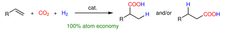
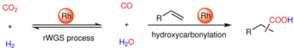
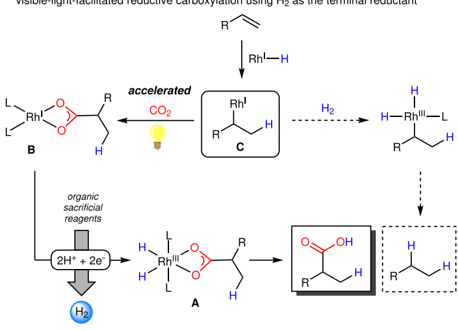
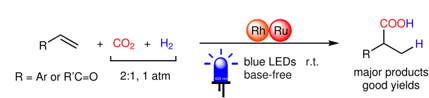
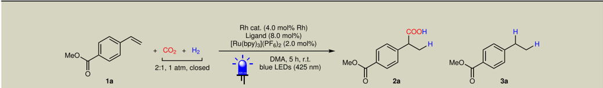
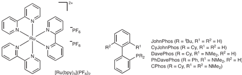
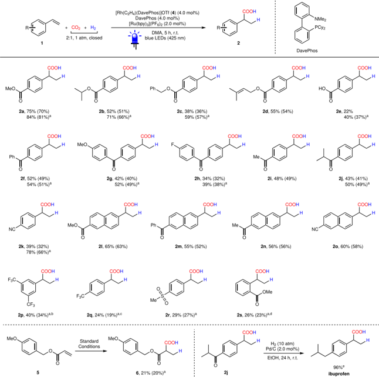
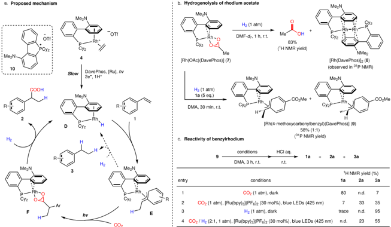
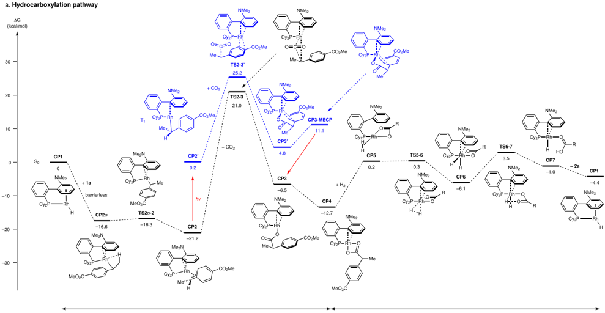
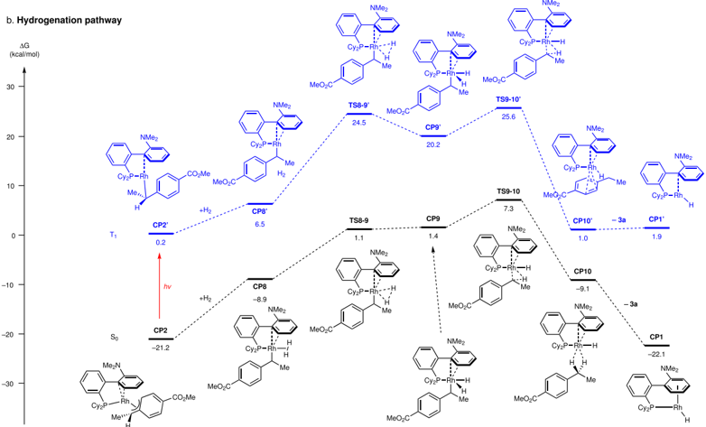

1234567890():,;

1234567890():,;

## Article

https://doi.org/10.1038/s41467-022-35293-3

## Catalytic direct hydrocarboxylation of styrenes with CO 2 and H2

Received: 22 October 2022

Accepted: 24 November 2022

Check for updates

Yushu Jin 1 , Joaquim Caner 1 , Shintaro Nishikawa 1 , Naoyuki Toriumi 1 &amp; Nobuharu Iwasawa 1

A three-component hydrocarboxylation of an ole fi n with CO2 and H2 could be regarded as a dream reaction, since it would provide a straightforward approach for the synthesis of aliphatic carboxylic acids in perfect atom economy. However, this transformation has not been realized in a direct manner under mild conditions, because boosting the carboxylation with thermodynamically stable CO2 while suppressing the rapid hydrogenation of ole fi n remains a challenging task. Here, we report a rhodium-catalysed reductive hydrocarboxylation of styrene derivatives with CO2 and H2 under mild conditions, in which H2 served as the terminal reductant. In this approach, the carboxylation process was largely accelerated by visible light irradiation, which was proved both experimentally and by computational studies. Hydrocarboxylation of various kinds of styrene derivatives was achieved in good yields without additional base under ambient pressure of CO2/H2 at room temperature. Mechanistic investigations revealed that use of a cationic rhodium complex was critical to achieve high hydrocarboxylation selectivity.

The increasing demands for environmental friendliness and sustainable development inspired scientists to search new applications of utilizing renewable resources to industrial chemical feedstock 1 . During the past decades, great efforts have been made on transforming carbon dioxide (CO2), which is the critical compound for the greenhouse effect, into useful chemicals in the fi eld of synthetic chemistry 2 -5 . Dihydrogen (H2), regarded as one of the best and cleanest energy sources, has long been expected to be a potential partner with CO2 in organic synthesis 6 , and extensive studies have been carried out for the reduction of CO2 with H2 to give formic acid, methanol, etc 7,8 . Catalytic production of carboxylic acids, alcohols, and alkanes with two or more carbons from CO2 and H2 has also been explored in recent years 9 . As a one-carbon (C1) source, another straightforward exit for CO2 is converting it into carboxylic acid derivatives by the reaction with organic substrates 10 -17 , however, the reaction of organic compounds in combination with CO2 and H2 has rarely been studied. Among these transformations, a three-component hydrocarboxylation, which is the addition of CO2 and H2 to an ole fi n, could be regarded as a dream reaction, because it would provide the corresponding aliphatic carboxylic acid with 100% atom economy (Fig. 1a), while the existing examples of ole fi n hydrocarboxylations with CO2 using Cu 18 -21 , Rh 22 -24 , Ti 25 , Ni 26 -28 , Ru 29 , Fe 30 , Co 31 , Zr 32 , and Pd 33,34 catalysts or light energy 35 -38 could hardly get rid of using a stoichiometric amount of base or metallic/organic reductants, which are out of the concept of green chemistry and sustainability. A pioneering work of Rh-catalysed formal hydrocarboxylation of ole fi ns with CO2 and H2 has been described by Leitner ' s group in 2013, but the reaction was proved to proceed through a hydroxycarbonylation pathway with in situ generation of carbon monoxide (CO) and H2O via reverse water-gas shift equilibrium (rWGS) under high temperature (180 ˚ C) and high pressure of CO2/H2 (6:1, 69 atm) in strongly acidic conditions (Fig. 1b) 39 . Although computational calculation indicated that catalytic direct hydrocarboxylation of ole fi ns with CO2 and H2 was thermodynamically feasible, the competing hydrogenation reaction, which usually proceeds rapidly, and complexity of the desired reaction pathway have made this dream reaction challenging 40 . To the best of our knowledge, hydrocarboxylation of ole fi ns with CO2 and H2 via direct insertion of CO2 has not yet been realized to date.

In our goal of developing novel and sustainable catalytic systems for the utilization of CO2, the potential of rhodium hydride as a catalyst

1 Department of Chemistry, Tokyo Institute of Technology, O-okayama, Meguro-ku, Tokyo 152-8551, Japan. e-mail: niwasawa@chem.titech.ac.jp

Fig. 1 | Carboxylation of ole fi nic compounds using CO2 and H2. a Target transformation: catalytic direct hydrocarboxylation of ole fi ns using CO2 and H2, a 100% atom economical reaction. b Previous strategy: rhodium-catalysed reverse watergas shift equilibrium (rWGS)/hydroxycarbonylation. c Our strategy: visible-lightfacilitated reductive carboxylation using H2 as the terminal reductant. d This work: visible-light-enabled direct hydrocarboxylation with CO2 and H2. LED, lightemitting diode.

for C -C bond formation 41 , as well as our recent studies on rhodiumcatalysed reductive hydrocarboxylation of activated ole fi ns 23,24 inspired us to tackle this reaction not only under mild conditions but also with high ef fi ciency. In our previous research, we have found that rhodium(III)-dihydride-carboxylate species A could be generated from rhodium(I) carboxylate B , which was formed by CO2 insertion into alkylrhodium(I) species C with the support of light energy, using organic sacri fi cial reagents (i.e. diisopropylethylamine 23 and BI(OH)H (1,3-dimethyl-2-( o -hydroxyphenyl)-2,3-dihydro-1 H -benzo[ d ]

imidazole) 24 ) as both proton and electron donors (Fig. 1c). From the mechanistic point of view, in principle, two protons and two electrons (2H + +2e -) can formally be replaced by molecular H2, thus providing the opportunity to employ H2 as the terminal reductant in our catalytic system. Furthermore, we also envisioned that selective hydrocarboxylation over the undesired hydrogenation may become possible, because the carboxylation process would be boosted under light irradiation.

Here we describe an example of base-free catalytic hydrocarboxylation of styrene derivatives with CO2 and H2 under mild conditions (Fig. 1d). Our catalytic system allowed the synthesis of aliphatic carboxylic acids under ambient pressure of a CO2/H2 gas at room temperature with visible light irradiation. Furthermore, it is worth mentioning that base is no longer required in our catalytic system, while conventional reductive carboxylations under base-free conditions have been elusive 42,43 .

## Results and discussion

## Optimization of reaction conditions

We started our investigation with modi fi ed conditions based on our previous research 23 . Methyl 4-vinylbenzoate ( 1a ) was selected as the model substrate, and our fi rst trial was conducted under an ambient pressure of CO2/H2 (2:1 ratio) at room temperature in DMA ( N , N -dimethylacetamide) solvent in the presence of 2.0 mol% of [Rh(OAc) (C2H4)2]2 (4.0 mol% of Rh atom) as the rhodium precursor, 8.0 mol% of P(4-CF3C6H4)3 as the ligand, and 2.0 mol% of [Ru(bpy)3](PF6)2 (tris(2,2 ' -bipyridine)ruthenium(II) hexa fl uorophosphate) as the photosensitizer with blue LEDs (425 nm) irradiation. After 5 h, the hydrocarboxylation product 2a was actually observed in 5% yield, although hydrogenation ( 3a , 74% yield) dominated the reaction (Table 1, entry 1).

After an intensive screening of various kinds of ligands (Supplementary Table 1), we turned our eyes on testing various kinds of Buchwald-type ligands for hydrocarboxylation (Table 1, entries 2 -6). It was found that when using DavePhos (2-dicyclohexylphosphino-2 ' -( N , N -dimethylamino)biphenyl) as the ligand, carboxylic acid 2a was obtained in 35% yield with reduced amount of hydrogenation product 3a (Table1, entry 4). The choice of rhodium precursor also appeared to play a pivotal role in the selectivity between carboxylation and hydrogenation (Table 1, entries 7 -10, see Supplementary Table 2 for details). Considering the fact that formation of rhodium-dihydride species from a Buchwald-type ligand coordinated cationic Rh-complex was very slow even under high pressure of H2 44 , consequently, a DavePhos ligated cationic rhodium complex, [Rh(C2H4)(DavePhos)] (OTf) (SupplementaryData 1), was found to be not only highly reactive, but also selective for the hydrocarboxylation, providing the desired branchedcarboxylic acid 2a in 75% yield, while only 23% yield of 3a was generated (Table 1, entry 10). Additional amount of DavePhos ligand was critical to achieve high yield (Table 1, entry 11). A slightly higher yield of 2a (84%) was achieved when the reaction was conducted in the presence of LiOTf (100 mol%, lithium tri fl uoromethanesulfonate) as an additive (Table 1, entry 12, see Supplementary Table 3 for details). We have con fi rmed that rhodium catalyst, light irradiation, photocatalyst, and H2 atmosphere were all essential to this transformation (Table 1, entries 13 -16). Finally, the reaction didn ' t proceed in the presence of H2O (500 mol%) under CO atmosphere (Table 1, entry 17), providing strong evidence that our reaction is not occurring through the rWGS pathway 39 . Although catalytic hydroxycarbonylations using CO/H2O are useful to obtain this type of carboxylic acids from vinyl arenes 45 -47 , use of non-toxic CO2 gas would make this type of reaction more sustainable and environmentally friendly.

## Scope of substrates

With the optimized conditions in hand (Table 1, entries 10 and 12), we nextinvestigated the substrate scope for the hydrocarboxylation using CO2 and H2 (Fig. 2). Generally speaking, although the hydrocarboxylation proceeded smoothly under standard conditions for most electron-de fi cient styrene derivatives (Fig. 2, 1a -o ), it was found that slightly higher yields could be obtained by employing LiOTf (100 mol%)astheadditive for many of the substrates. We assumed that either the carbonyl group in substrates or CO2 were activated by LiOTf due to its Lewis acidity 48 . Substrates bearing esters ( 1a -d , 1l ), ketones ( 1f -j , 1m , 1n ), methoxy ( 1g ), fl uoride ( 1h ), and nitrile ( 1k ) moieties provided the target aliphatic carboxylic acids in moderate to good yields. The benzylic ( 2c ) and prenylic ester ( 2d ) scaffolds tolerated from potential ester hydrogenolysis under both acidic and H2

## Table 1 | Optimization of reaction conditions and control experiments

| Entry   | Rh catalyst                         | Ligand                | Yield of 2a (%)   | Yield of 3a (%)   |
|---------|-------------------------------------|-----------------------|-------------------|-------------------|
| 1       | [Rh(OAc)(C 2 H 4 ) 2 ] 2            | P(4-CF 3 -C 6 H 4 ) 3 | 5                 | 74                |
| 2       | [Rh(OAc)(C 2 H 4 ) 2 ] 2            | JohnPhos              | 7                 | 6                 |
| 3       | [Rh(OAc)(C 2 H 4 ) 2 ] 2            | CyJohnPhos            | 16                | 61                |
| 4       | [Rh(OAc)(C 2 H 4 ) 2 ] 2            | DavePhos              | 35                | 48                |
| 5       | [Rh(OAc)(C 2 H 4 ) 2 ] 2            | PhDavePhos            | 3                 | 30                |
| 6       | [Rh(OAc)(C 2 H 4 ) 2 ] 2            | CPhos                 | 17                | 38                |
| 7       | [RhCl(C 2 H 4 ) 2 ] 2               | DavePhos              | 4                 | >95               |
| 8       | [Rh(cod) 2 ](OTf)                   | DavePhos              | 18                | 80                |
| 9       | [Rh(OAc)(DavePhos)]                 | DavePhos a            | 38                | 27                |
| 10      | [Rh(C 2 H 4 )(DavePhos)](OTf) ( 4 ) | DavePhos a            | 75 (70)           | 23                |
| 11      | [Rh(C 2 H 4 )(DavePhos)](OTf) ( 4 ) | -                     | 10                | 9                 |
| 12 b    | [Rh(C 2 H 4 )(DavePhos)](OTf) ( 4 ) | DavePhos a            | 84 (81)           | 16                |
| 13      | -                                   | DavePhos a            | n.d.              | n.d.              |
| 14 c    | [Rh(C 2 H 4 )(DavePhos)](OTf) ( 4 ) | DavePhos a            | n.d.              | 13                |
| 15 d    | [Rh(C 2 H 4 )(DavePhos)](OTf) ( 4 ) | DavePhos a            | n.d.              | 10                |
| 16 e    | [Rh(C 2 H 4 )(DavePhos)](OTf) ( 4 ) | DavePhos a            | n.d.              | n.d.              |
| 17 f    | [Rh(C 2 H 4 )(DavePhos)](OTf) ( 4 ) | DavePhos a            | n.d.              | n.d.              |

Reaction conditions: 1a (50 μ mol), CO2/H2 (2:1 mix gas, 1 atm, closed), Rh catalyst (2.0 μ mol of Rh), ligand (4.0 μ mol), [Ru(bpy)3](PF6)2 (1.0 μ mol), DMA (1.0 mL), blue LEDs (425 nm), room temperature, 5 h. Yields were determined by 1 H NMR spectroscopy with 1,1,2,2-tetrachloroethane as the internal standard; isolated yields in parenthesis.

Me methyl, bpy bipyridine, Ac acetyl, Cy cyclohexyl, cod 1,5-cyclooctadiene, OTf tri fl uoromethansulfonate.

a DavePhos (4.0mol%) was used.

b With LiOTf (100 mol%).

c Under dark.

d Without Ru(bpy)3(PF6)2.

e Under CO2 (1 atm, closed) atmosphere.

f Under CO (1 atm, closed) atmosphere with H2O (500 mol%).

conditions. Owing to the base-free feature of our method, dicarboxylic acid 2e could be prepared from 4-vinylbenzoic acid ( 1e ) under CO2/H2 in synthetically useful yield (37%, with LiOTf) without protection. The hydrocarboxylation proceeded smoothly with 4-vinylbenzonitrile ( 1k ) as the starting material, providing the benzylic carboxylic acid 2k in good yield (66%), while the cyano group remained intact. As expected, hydrogenation products 3 were found to be the major side products (see Supplementary Table 6 for details). On the other hand, we also observed polymerization competing with the hydrocarboxylation and hydrogenation for some of the styrene substrates. For example, the hydrocarboxylation of tri fl uoromethyl substituted styrenes ( 1p and 1q ) suffered from serious polymerization under light irradiation and only low yields were obtained even with the addition of polymerization inhibitors (see Supplementary Table 5 for details). An acrylate substrate 5 was also examined under standard conditions. Unfortunately, only 20% yield of product 6 was obtained due to undesired hydrogenation and polymerization. Considering the importance of 2-arylpropionic acids in pharmaceuticals 49 , product 2j wastreated with

Pd/C under a H2 atmosphere to provide the nonsteroidal antiin fl ammatory drug ibuprofen in 96% yield.

## Mechanistic investigations

Toget mechanistic insight for this reaction, some control experiments were fi rstly performed. Hydrocarboxylation product 2a was not observed at all when the reaction of styrene 1a was conducted at high temperature (110 °C) in dark in the absence of photocatalyst (see Supplementary Information, Section 6.1), proving that there is no thermal background reaction. Benzylic C -Hbondcarboxylation didn ' t proceed at all when ethylbenzene 3a was used as the substrate under the standard conditions (see Supplementary Information, Section 6.2), indicating that the hydrogenation-benzylic C -H bond photocarboxylation 42 pathway is not likely.

Then, the mechanism of this reaction is assumed based on our previous report on rhodium-catalysed hydrocarboxylation using amine as a reductant 23,24 . The postulated mechanism is shown in Fig. 3a, which consists of conversion of [Rh(C2H4)(DavePhos)](OTf)

Fig. 2 | Scope of substrates. Reaction conditions: 1 or 5 (50 μ mol), CO2/H2 (2:1, 1 atm, closed), [Rh(C2H4)(DavePhos)](OTf) (2.0 μ mol), DavePhos (4.0 μ mol), [Ru(bpy)3](PF6)2 (1.0 μ mol), DMA (1.0 mL), blue LEDs (425 nm), room temperature, 5 h. NMR yields were shown, which were estimated by 1 H NMR spectroscopy with

1,1,2,2-tetrachloroethane as the internal standard; isolated yields in parenthesis. a With LiOTf (100 mol%). b With TEMPO (10 mol%). c With phenothiazine (10 mol%). d 10 h. e Reaction conditions: 2j (49 μ mol), H2 (10 atm), Pd/C (10 wt% Pd, 5 wt% H2O) (1.0 μ mol), EtOH (1.0 mL), room temperature, 24 h.

Fig. 3 | Experimental mechanistic studies. a Proposed mechanism. b Hydrogenolysis of rhodium acetate 7 with H2. c Reactivity of benzylrhodium 9 .

( 4 ) to rhodium(I) hydride D , insertion of styrene to D to give benzylrhodium(I) E , carboxylation of E to yield rhodium(I) carboxylate F , and reduction of F to regenerate rhodium(I) hydride D . Under the catalytic reaction conditions, the initial generation of the active catalyst D from the cationic rhodium precursor 4 would involve the additional amount of DavePhos, since the hydrocarboxylation did not proceed ef fi ciently in the absence of DavePhos (Table 1, entry 11). The kinetic time course showed the presence of an induction period (~1 h) on the generation of carboxylic acid (see Supplementary Fig. 5), suggesting slow conversion of 4 to D . We have observed a phosphonium salt 10 generated from DavePhos in the reaction conditions, and diisopropylethylamine or BI(OH)H as a catalytic additive

instead of DavePhos was also effective for the hydrocarboxylation (see Supplementary Table 3, entries 5 and 6). These results indicated that the additional DavePhos may act as a sacri fi cial electron donor to reduce rhodium cation 4 to rhodium hydride D . On the other hand, D could also be generated by oxidative addition of H2 to Rh(I) species, followed by a base-induced deprotonation, in which DavePhos may serve as a base. To further con fi rm the function of DavePhos in this step, 4 and DavePhos were mixed in a H2 atmosphere under dark. As a result, both cationic rhodium complex 4 and DavePhos remained intact for long time (~9 h) (see Supplementary Information, Section 6.4 for details), suggesting that DavePhos is more likely to work as a sacri fi cial electron donor than as a base. Nevertheless, based on the facts that using a catalytic amount of Cs2CO3 instead of DavePhos also provided 2a in 38% yield (Supplementary Table 3, entry 2), the possibility that DavePhos works as a base could not be completely ruled out (see also Supplementary Information, Section 6.5).

Next, we investigated the reactivities of the possible rhodium intermediates D -F to clarify the catalytic cycle. To con fi rm hydrogenolysis of rhodium carboxylate F , which is one of the key steps in this reaction (Fig. 1c), [Rh(OAc)(DavePhos)] ( 7 ) was synthesized as a model complex (see Supplementary Information, Section 6.3 for details). Treatment of 7 with H2 gas gave AcOH in high yield, simultaneously generating [Rh(DavePhos)]2 ( 8 ) (Supplementary Data 2), which would be produced by dehydrogenative dimerization of unstable rhodium hydride D (Fig. 3b). The release of carboxylic acid from rhodium carboxylate with H2 in the absence of base is known for a rhodium(III) acetate complex 50 , but has not been reported for rhodium(I) carboxylate complexes to the best of our knowledge. The hydrogenolysis of 7 in the presence of styrene 1a afforded [Rh(4-methoxycarbonylbenzyl) (DavePhos)] 9 , which indicated rapid insertion of 1a to rhodium hydride D before the dimerization of D proceeded.

Thereactivity of benzylrhodium 9 towardsCO2 andH2 is critical to realize selective hydrocarboxylation over hydrogenation (Fig. 1c). Similarly to our previous report 24 , 9 reacted with CO2 in the presence of [Ru(bpy)3](PF6)2 under irradiation to give carboxylic acid 2a (Fig. 3c, entry 2), while 2a was not observed at all without irradiation (Fig. 3c, entry 1). We have found that 9 underwent complete hydrogenolysis under a H2 atmosphere without irradiation (Fig. 3c, entry 3), indicating one plausible pathway to yield hydrogenated byproduct 3 in this reaction system. On the other hand, carboxylation did proceed under a CO2/H2 atmosphere upon irradiation although hydrogenolysis was faster (Fig. 3c, entry 4), which clearly demonstrates the photoenhanced carboxylation reaction in the presence of H2. The modest selectivity towards carboxylation observed here seems to be contradictory to the result of the catalytic reactions, where hydrocarboxylation of styrenes was preferred compared with hydrogenation. This discrepancy could be ascribed to the difference in excitation ef fi ciency of benzylrhodium 9 . The relatively high concentration of 9 would hamper its excitation by [Ru(bpy)3](PF6)2 and cause hydrogenation in the investigation of the reactivity of 9 (Fig. 3c, entry 4). However, the existence of the induction period in the catalytic conditions would lower the concentration of active species 9 , making the photocarboxylation step much more selective.

In order to verify the existence of these possible intermediates in the hydrocarboxylation, we used rhodium acetate 7 or benzylrhodium 9 as a catalyst instead of cationic rhodium complex 4 (see Supplementary Information, Section 6.10 for details). Although the ratio of hydrogenation was somewhat increased, hydrocarboxylation proceeded smoothly without the addition of DavePhos, further supporting the role of these complexes as the reaction intermediates.

## Computational analysis

To investigate the energy pro fi le of this hydrocarboxylation, density functional theory (DFT) calculation of the proposed cycle was conducted starting from RhH(DavePhos) CP1 and styrene 1a (Fig. 4). The insertion of 1a to CP1 proceeds barrierlessly to afford σ -benzylrhodium CP2 σ ( -16.6 kcal/mol), which isomerize to give more stable π -benzylrhodium CP2 ( -21.2 kcal/mol) (Fig. 4a and Supplementary Fig. 6). The CO2 insertion to CP2 needs quite high activation energy in the ground state (S0) ( CP2 to TS2-3 : 42.2 kcal/mol) 51 , but proceeds smoothly in the lowest triplet excited state (T1) ( CP2 ' to TS23 ' : 25.0 kcal/mol) to yield rhodium carboxylate CP4 ( -12.7 kcal/mol) after deactivation to the ground state. CP4 undergoes hydrogenolysis via oxidative addition of H2 and reductive elimination of carboxylic acid 2a with the low activation barrier ( CP4 to TS6-7 : 16.2 kcal/mol) to regenerate CP1 ( -4.4 kcal/mol), which is endothermic by 8.3 kcal/mol. This increase of the energy is compensated in the presence of styrene 1a by the generation of highly stable benzylrhodium CP2 , realizing the base-free conditions. We also calculated on hydrogenation of 1a to give alkane 3a (Fig. 4b). CP2 undergoes hydrogenolysis via oxidative addition of H2 and reductive elimination of 3a with a slightly higher activation energy ( CP2 to TS9-10 : 28.5 kcal/mol) than that of hydrocarboxylation in T1 ( CP2 ' to TS2-3 ' : 25.0 kcal/mol). Notably, hydrogenation is not signi fi cantly accelerated in T1, where the activation barrier ( CP2 ' to TS9-10 ' : 25.4 kcal/mol) is slightly higher than that of hydrocarboxylation. Although the difference of the activation energy between hydrocarboxylation and hydrogenation in T1 is relatively small (0.4 kcal/mol), these computational results are consistent with the experimental results, supporting the validity of the proposed catalytic cycle. The energy of product 2a is 4.4 kcal/mol more stable than that of the starting materials ( 1a +H2 + CO2), which is consistent with the previous calculation 40 .

In summary, we have demonstrated an example of catalytic hydrocarboxylation of styrenes with CO2 and H2 under mild conditions using light energy. In the presence of rhodium/ruthenium dual catalysts and DavePhos, our catalytic system allowed the synthesis of various kinds of aliphatic carboxylic acids under ambient pressure of a CO2/H2 atmosphere at room temperature with visible light irradiation. Furthermore, we also discovered that base is no longer required under current reaction conditions. Mechanistic studies revealed that DavePhos has multiple functions in this reaction system. It not only played a role as a ligand, but also served as an electron donor, which supported the generation of Rh -H species for entering the catalytic cycle. The result of DFT calculations indicated that the activation barrier of the hydrogenation pathway is higher than that of the carboxylation, which rationalized the reason for the selectivity of hydrocarboxylation over hydrogenation under our catalytic system. We anticipate that our method would extend the toolbox for developing more sustainable catalytic methodologies in the future.

## Methods

## Procedure for the preparation of [Rh(C2H4)(DavePhos)](OTf) complex (4)

In an argon- fi lled glovebox, a THF solution (5 mL) of [RhCl(C2H4)2]2 (78 mg, 0.20 mmol) was stirred in a 30 mL Schlenk fl ask at room temperature. AgOTf (103 mg, 0.40 mmol) was added to the solution in small portions. White precipitate appeared immediately, and the mixture was kept stirring for 1 h. After all the volatiles were removed in vacuo, CH2Cl2 (5 mL) was added to the residue and the mixture was fi ltered with celite. The organic fi ltrate was evaporated again under reduced pressure to remove all the volatiles. DavePhos (157 mg, 0.40 mmol) was added to the residue and the fl ask was charged with CH2Cl2 (5 mL). The solution was kept stirring at room temperature for overnight to ensure complete complexation. The resulting mixture was fi ltered through celite again, and the fi ltrate was evaporated under reduced pressure. The product was recrystallized from slowly adding Et2O to CH2Cl2 solution to provide the target complex [Rh(C2H4) (DavePhos)](OTf) ( 4 , 177 mg, 0.26 mmol, 66%) as orange yellow crystals.

Fig. 4 | Computational studies. Free-energy diagram of a hydrocarboxylation and b hydrogenation of 1a with RhH(Davephos) 7 ( CP1 ) as a catalyst computed at the M06/SDD(Rh)&amp;6-311+ G(d,p)(C, H, N, O, P), SMD(DMA)//LANL2DZ(Rh)&amp;6-

## General procedure for the catalytic hydrocarboxylation of styrenes with CO2 and H2

In an argon- fi lled glove box, [Rh(C2H4)(DavePhos)](OTf) ( 4 , 1.4 mg, 2.0 μ mol), DavePhos (0.8 mg, 2.0 μ mol), [Ru(bpy)3](PF6)2 (0.9 mg, 1.0 μ mol), additive if any (0.05 mmol), and styrene substrate 1 (0.05 mmol) were placed in an oven-dried glass tube ( ϕ =1.7 cm, 18 cm). To the mixture was added anhydrous N , N -dimethylacetamide (DMA, 1.0 mL). The tube was sealed with a three-way cock and removed from the glove box. A mix gas of CO2/H2 (1 atm) was charged into the glass tube through the three-way cock. The mixture was then subjected to a blue LED (425 nm) irradiation (two sockets) with

31 G(d,p)(C, H, N, O, P) level. Potential energy values relative to CP1 (kcal/mol) are shown in the diagram.

vigorous stirring. After 5 h, 1 N HCl aq. (1.0 mL) was added to the mixture, and was extracted with Et2O for three times. The crude mixture was analysed by 1 H NMR to determine the yields of 2 and 3 using 1,1,2,2-tetrachloroethane as internal standard. Then the crude was diluted in Et2O and extracted with 1 N NaOH aq. (2.0 mL). The basic water phase was then acidi fi ed with 1 N HCl aq. until pH ≈ 1, and was extracted again with Et2O twice. The combined organic layer was dried over MgSO4. After removal of the solvent under reduced pressure, the residue was puri fi ed with preparative thin layer chromatography (PTLC) on silica gel (elution: hexane/EtOAc + 1% AcOH) to give the desired carboxylic acid product.

## Data availability

The data supporting the fi ndings of this study are available within the paper and its Supplementary Information. Crystallographic data for the structures reported in this Article have been deposited at the Cambridge Crystallographic Data Centre, under accession code CCDC 2160650( 4 ) and CCDC 2160651 ( 8 ). Copies of the data can be obtained free of charge on application to CCDC, 12 Union Road, Cambridge CB2 1EZ, UK; (fax: +44(0) 1223 336 033; or e-mail: deposit@ccdc.cam.ac.uk). Cartesian coordinates of the optimized structure are available in Supplementary Data 3.

## References

1. Aresta, M., Dibenedetto, A. &amp; Angelini, A. Catalysis for the valorization of exhaust carbon: from CO2 to chemicals, materials and fuels. Technological use of CO2. Chem. Rev. 114 , 1709 -1742 (2014).
2. Das S. CO2 as Building Block in Organic Synthesis (WILEY-VCH GmbH, Boschstr. 2020).
3. Dabral, S. &amp; Schaub, T. The use of carbon dioxide (CO2) as a building block in organic synthesis from an industrial perspective. Adv. Synth. Catal. 361 , 223 -246 (2019).
4. Seo, H., Nguyen, L. V. &amp; Jamison, T. F. Using carbon dioxide as a building block in continuous fl ow synthesis. Adv. Synth. Catal. 361 , 247 -264 (2019).
5. Liu, Q., Wu, L., Jackstell, R. &amp; Beller, M. Using carbon dioxide as a building block in organic synthesis. Nat. Commun. 6 , 5933 (2015).
6. Klankermayer, J. &amp; Leitner, W. Love at second sight for CO2 and H2 in organic synthesis. Science 350 , 626 -630 (2015).
7. Wang, W.-H., Himeda, Y., Muckerman, J. T., Mankeck, G. F. &amp; Fujita, E. CO2 hydrogenation to formate and methanol as an alternative to photo- and electrochemical CO2 reduction. Chem. Rev. 115 , 12936 -12973 (2015).
8. Wang, D., Xie, Z., Porosoff, M. D. &amp; Chen, J. G. Recent advances in carbon dioxide hydrogenation to produce ole fi ns and aromatics. Chem. 7 , 2277 -2311 (2021).
9. Bediako, B. B. A., Qian, Q. &amp; Han, B. Synthesis of C2+ chemicals from CO2 and H2 via C -C bond formation. Acc. Chem. Res. 54 , 2467 -2476 (2021).
10. Zhang, G., Cheng, Y., Beller, M. &amp; Chen, F. Direct carboxylation with carbon dioxide via cooperative photoredox and transition-metal dual catalysis. Adv. Synth. Catal. 363 , 1583 -1596 (2021).
11. Ran, C.-K., Liao, L.-L., Gao, T.-Y., Gui, Y.-Y. &amp; Yu, D.-G. Recent progress and challenges in carboxylation with CO2. Cur. Opin. Green. Sustain. Chem. 32 , 100525 (2021).
12. Ye, J.-H., Ju, T., Huang, H., Liao, L.-L. &amp; Yu, D.-G. Radical carboxylative cyclizations and carboxylations with CO2. Acc. Chem. Res. 54 , 2518 -2531 (2021).
13. Zhang,Z. et al. Visible-light-driven catalytic reductive carboxylation with CO2. ACS Catal. 10 , 10871 -10885 (2020).
14. Yeung, C. S. Photoredox catalysis as a strategy for CO2 incorporation: direct access to carboxylic acids from a renewable feedstock. Angew. Chem. Int. Ed. 58 , 5492 -5502 (2019).
15. Tortajada, A., Juliá-Hernández, F., Börjesson, M., Moragas, T. &amp; Martin, R. Transition-metal-catalyzed carboxylation reactions with carbon dioxide. Angew. Chem. Int. Ed. 57 , 15948 -15982 (2018).
16. Luo, J. &amp; Larrosa, I. C -H carboxylation of aromatic compounds through CO2 fi xation. ChemSusChem 10 , 3317 -3332 (2017).
17. Tommasi, I. Direct carboxylation of C(sp3) -H and C(sp2) -H bonds with CO2 by transition-metal-catalyzed and base-mediated reactions. Catalysts 7 , 380 (2017).
18. Ohmiya, H., Tanabe, M. &amp; Sawamura, M. Copper-catalyzed carboxylation of alkylboranes with carbon dioxide: formal reductive carboxylation of terminal alkenes. Org. Lett . 13 , 1086 -1088 (2011).
19. Ohishi, T., Zhang, L., Nishiura, M. &amp; Hou, Z. Carboxylation of alkylboranes by N-heterocyclic carbene copper catalysts: synthesis of
20. carboxylic acids from terminal alkenes and carbon dioxide. Angew. Chem. Int. Ed. 50 , 8114 -8117 (2011).
20. Juhl, M. et al. Copper-catalyzed carboxylation of hydroborated disubstituted alkenes and terminal alkynes with cesium fl uoride. ACS Catal. 7 , 1392 -1396 (2017).
21. Zhang, P., Zhou, Z., Zhang, R., Zhao, Q. &amp; Zhang, C. Cu-catalyzed highly regioselective 1,2-hydrocarboxylation of 1,3-dienes with CO2. Chem. Commun. 56 , 11469 -11472 (2020).
22. Kawashima, S., Aikawa, K. &amp; Mikami, K. Rhodium-catalyzed hydrocarboxylation of ole fi ns with carbon dioxide. Eur. J. Org. Chem . 3166 -3170 (2016).
23. Murata, K., Numasawa, N., Shimomaki, K., Takaya, J. &amp; Iwasawa, N. Construction of a visible light-driven hydrocarboxylation cycle of alkenes by the combined use of Rh(I) and pheotoredox catalysts. Chem. Commun. 53 , 3098 -3101 (2017).
24. Murata, K., Numasawa, N., Shimomaki, K., Takaya, J. &amp; Iwasawa, N. Improved conditions for the visible-light driven hydrocarboxylation by Rh(I) and photoredox dual catalysts based on the mechanistic analyses. Front. Chem. 7 , 371 (2019).
25. Shao, P., Wang, S., Chen, C. &amp; Xi, C. Cp2TiCl2-catalyzed regioselective hydrocarboxylation of alkenes with CO2. Org. Lett. 18 , 2050 -2053 (2016).
26. Williams, C. M., Johnson, J. B. &amp; Rovis, T. Nickel-catalyzed reductive carboxylation of styrenes using CO2. J. Am. Chem. Soc. 130 , 14956 -14937 (2008).
27. Gaydou, M., Moragas, T., Juliá-Hernández, F. &amp; Martin, R. Siteselective catalytic carboxylation of unsaturated hydrocarbons with CO2 and water. J. Am. Chem. Soc. 139 , 12161 -12164 (2017).
28. Meng, Q.-Y., Wang, S., Huff, G. S. &amp; König, B. Ligand-controlled regioselective hydrocarboxylation of styrenes with CO2 by combining visible light and nickel catalysis. J. Am. Chem. Soc. 140 , 3198 -3201 (2018).
29. Wu, L., Liu, Q., Fleischer, I., Jackstell, R. &amp; Beller, M. Rutheniumcatalyzed alkoxycarbonylation of alkenes with carbon dioxide. Nat. Commun. 5 , 3091 (2014).
30. Greenhalgh, M. D. &amp; Thomas, S. P. Iron-catalyzed, highly regioselective synthesis of α -aryl carboxylic acids from styrene derivatives and CO2. J. Am. Chem. Soc. 134 , 11900 -11903 (2012).
31. Hayashi, C., Hayashi, T., Kikuchi, S. &amp; Yamada, T. Cobalt-catalyzed reductive carboxylation on α , β -unsaturated nitriles with carbon dioxide. Chem. Lett. 43 , 565 -567 (2014).
32. Shao, P., Wang, S., Chen, C. &amp; Xi, C. Zirconocene-catalyzed sequential ethylcarboxylation of alkenes using ethylmagnesium chloride and carbon dioxide. Chem. Commun. 51 , 6640 -6642 (2015).
33. Takaya, J., Sasano, K. &amp; Iwasawa, N. Ef fi cient one-to-one coupling of easily available 1,3-dienes with carbon dioxide. Chem.Commun. 51 , 6640 -6642 (2015).
34. Takaya, J. &amp; Iwasawa, N. Hydrocarboxylation of allenes with CO2 catalyzed by silyl pincer-type palladium complex. J. Am. Chem. Soc. 130 , 15254 -15255 (2008).
35. Seo, H., Liu, A. &amp; Jamison, T. F. Direct β -selective hydrocarboxylation of styrenes with CO2 enabled by continuous fl ow photoredox catalysis. J. Am. Chem. Soc. 130 , 13969 -13972 (2017).
36. Ju, T. et al. Selective and catalytic hydrocarboxylation of enamides and imines with CO2 to generate α , α -disubstituted α -amino acids. Angew. Chem. Int. Ed. 57 , 13897 -13901 (2018).
37. Huang, H. et al. Visible-light-driven anti-markovnikov hydrocarboxylation of acylates and styrenes with CO2. CCS Chem. 2 , 1746 -1756 (2020).
38. Kang, G. &amp; Romo, D. Photocatalyzed, β -selective hydrocarboxylation of α , β -unsaturated esters with CO2 under fl ow for β -lactone synthesis. ACS Catal. 11 , 1309 -1315 (2021).
39. Ostapowicz, T. G., Schmitz, M., Krystof, M., Klankermayer, J. &amp; Leitner, W. Carbon dioxide as a C1 building block for the formation

- of carboxylic acids by formal catalytic hydrocarboxylation. Angew. Chem. Int. Ed. 52 , 12119 -12123 (2013).
40. Ostapowicz, T. G., Hölscher, M. &amp; Leitner, W. Catalytic hydrocarboxylation of ole fi ns with CO2 and H2 -a DFT computational analysis. Eur. J. Inorg. Chem . 5632 -5641 (2012).
41. Santana, G. C. &amp; Krische, M. J. From hydrogenation to transfer hydrogenation to hydrogen auto-transfer in enantioselective metalcatalyzed carbonyl reductive coupling: past, present and future. ACS Catal. 11 , 5572 -5585 (2021).
42. Meng, Q.-Y., Schirmer, T. E., Berger, A. L., Donabauer, K. &amp; König, B. Photocarboxylation of Benzylic C -H bonds. J. Am. Chem. Soc. 141 , 11393 -11397 (2019).
43. Matsumoto, T., Uchijo, D., Koike, T., Namiki, R. &amp; Chang, H.-C. Direct photochemical C -H carboxylation of aromatic diamines with CO2 under electron-donor- and base-free conditions. Sci. Rep. 8 , 14623 (2018).
44. O ' Connor, A. R., Kaminsky, W., Heinekey, D. M. &amp; Goldberg, K. I. Synthesis, characterization, and reactivity of arene-stabilized rhodium complexes. Organometallics 30 , 2105 -2166 (2011).
45. Seayad, A., Jayasree, S. &amp; Chaudhari, R. V. Carbonylation of vinyl aromatics: convenient regioselective synthesis of 2-arylpropanoic acids. Org. Lett. 1 , 459 -461 (1999).
46. Huang, Z. et al. Regioselectivity inversion tuned by iron(III) salts in palladium catalyzed carbonylations. Chem. Commun. 54 , 3967 -3970 (2018).
47. Yao, Y.-H. et al. Palladium-catalyzed asymmetric Markovnikov hydroxycarbonylation and hydroalkoxycarbonylation of vinyl arenes: synthesis of 2-arylpropanoic acids. Angew. Chem. Int. Ed. 60 , 23117 -23122 (2021).
48. Heimann, J. E., Bernskoetter, W. H. &amp; Hazari, N. Understanding the individual and combined effects of solvent and lewis acid on CO2 insertion into a metal hydride. J. Am. Chem. Soc. 141 , 10520 -10529 (2019).
49. Maag, H. Prodrugs of Carboxylic Acids (Springer, New York. 2007).
50. King, R. E. III, Busby, D. C. &amp; Hawthorne, M. F. Reactions at the rhodium vertex of isomeric closo-bis(triphenylphosphine)hydridorhodacarboranes, alkenyl acetate cleavage and subsequent reactions. J. Organomet. Chem. 279 , 103 -114 (1985).
51. Pavlovic, L., Vaitra, J. C., Bayer, A. &amp; Hopmann, K. H. Rhodiumcatalyzed hydrocarboxylation: mechanistic analysis reveals unusual transition state for carbon -carbon bond formation. Organometallics 37 , 941 -948 (2018).

## Acknowledgements

This research was supported by JSPS KAKENHI Grant Number 15H05800 and 17H06143. We thank Prof. Dr. Laurean Ilies (RIKEN) and

Prof. Dr. Masanobu Uchiyama (The University of Tokyo) for kindly providing technical support.

## Author contributions

Y.J. and N.I. conceived the work and designed the experiments. Y.J., J.C. and S.N. conducted the experiments and analysed the data. N.T. performed the computational calculations. N.I. supervised the research. Y.J., N.T. and N.I. co-wrote the manuscript. All authors contributed to discussion.

## Competing interests

The authors declare no competing interests.

## Additional information

Supplementary information The online version contains supplementary material available at https://doi.org/10.1038/s41467-022-35293-3.

Correspondence and requests for materials should be addressed to Nobuharu Iwasawa.

Peer review information Nature Communications thanks the anonymous reviewers for their contribution to the peer review of this work.

Reprints and permissions information is available at http://www.nature.com/reprints

Publisher ' s note Springer Nature remains neutral with regard to jurisdictional claims in published maps and institutional af fi liations.

Open Access This article is licensed under a Creative Commons Attribution 4.0 International License, which permits use, sharing, adaptation, distribution and reproduction in any medium or format, as long as you give appropriate credit to the original author(s) and the source, provide a link to the Creative Commons license, and indicate if changes were made. The images or other third party material in this article are included in the article ' s Creative Commons license, unless indicated otherwise in a credit line to the material. If material is not included in the article ' s Creative Commons license and your intended use is not permitted by statutory regulation or exceeds the permitted use, you will need to obtain permission directly from the copyright holder. To view a copy of this license, visit http://creativecommons.org/ licenses/by/4.0/.

- ©The Author(s) 2022