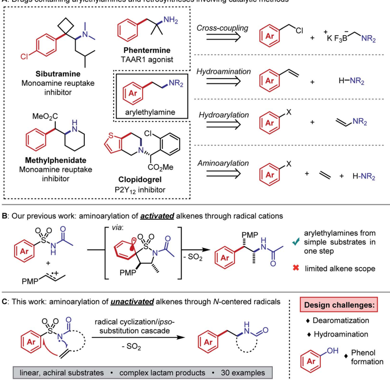
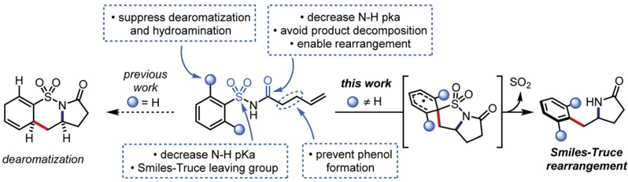
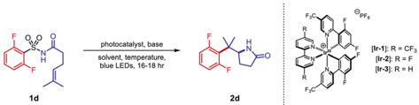
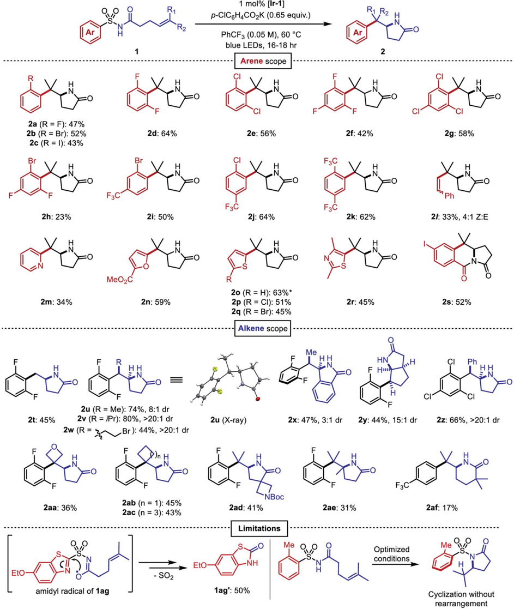
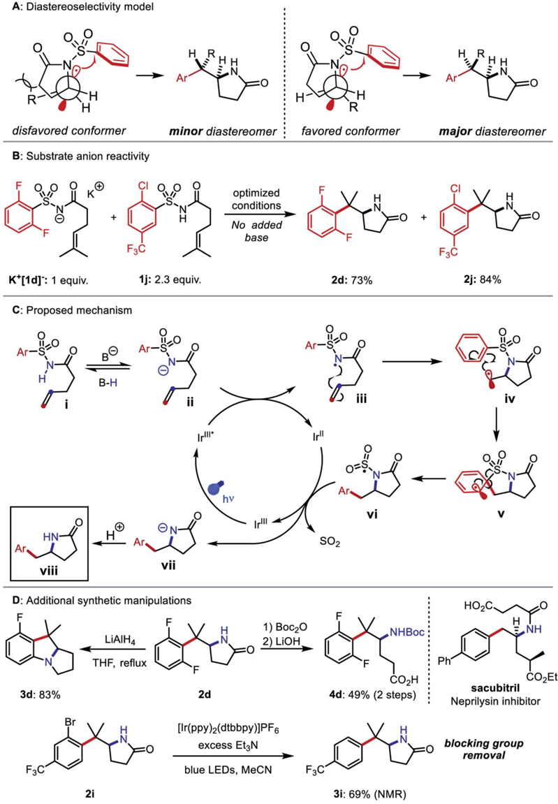

## Chemical Science

## EDGE ARTICLE

Cite this: Chem. Sci. , 2022, 13 , 6942

All publication charges for this article have been paid for by the Royal Society of Chemistry

Received 28th February 2022 Accepted 10th May 2022

DOI: 10.1039/d2sc01228f

rsc.li/chemical-science

## Introduction

The arylethylamine pharmacophore is conserved across a range of biologically active natural products and drugs, particularly in molecules that act on the central nervous system (Fig. 1A, le  ). 1 Conventional preparations of arylethylamines rely on linear, stoichiometric transformations to forge key C -C and C -N bonds. 2 Such routes lack the combinatorial  exibility favored in early-stage medicinal chemistry campaigns and they restrict the accessible substitution patterns of the ethylene linker fragment. Substituents on the linker can drastically alter the molecule's lipophilicity, conformation, and elimination half-life. 3,4 Modular preparations of complex arylethylamines from commercially available or easily synthesized substrates are therefore highly valuable, and considerable e ff orts have focused on this need (Fig. 1A, right).

Recently, Murphy, Barrett, and coworkers published a method for arylethylamine synthesis by palladium-catalyzed Csp 3 -Csp 3 cross-coupling of (chloromethyl)aryl electrophiles and aminomethyltri  uoroborate salts. 5 A diverse library of compounds could be quickly produced in this manner; however, no products bearing linker substituents were reported. An alternative and succinct disconnection of an arylethylamine could be the difunctionalization of an alkene to incorporate (1) the C -Nbond, (2) the aryl -Csp 3 bond, or (3) both bonds at once. The  rst case describes anti-Markovnikov hydroamination of a styrene, and many methods exist to accomplish this transformation e ff ectively with the aid of photoredox, lanthanide, or transition metal catalysts. 6 -9 The second case necessitates antiMarkovnikov hydroarylation of an enamine, which was only

University of Michigan, Department of Chemistry, Willard Henry Dow Laboratory, 930 North University Ave., Ann Arbor, MI 48109, USA. E-mail: crjsteph@umich.edu

† Electronic supplementary information (ESI) available. CCDC 2045499. For ESI and crystallographic data in CIF or other electronic format see https://doi.org/10.1039/d2sc01228f

|

View Article Online View Journal  | View Issue

## Catalytic intramolecular aminoarylation of unactivated alkenes with aryl sulfonamides †

Efrey A. Noten, Rory C. McAtee and Corey R. J. Stephenson *

Arylethylamines are abundant motifs in myriad natural products and pharmaceuticals, so e ffi cient methods to synthesize them are valuable in drug discovery. In this work, we disclose an intramolecular alkene aminoarylation cascade that exploits the electrophilicity of a nitrogen-centered radical to form a C -N bond, then repurposes the nitrogen atom's sulfonyl activating group as a traceless linker to form a subsequent C -C bond. This photoredox catalysis protocol enables the preparation of densely substituted arylethylamines from commercially abundant aryl sulfonamides and unactivated alkenes under mild conditions. Reaction optimization, scope, mechanism, and synthetic applications are discussed.

recently reported in good yields by Jui and coworkers. 10 The third case entails aminoarylation of an unactivated alkene and is, in principle, the most modular of the three difunctionalization strategies. Because the substrate is decoupled from both the arene and the nitrogen atom, simple alkenes can be converted to arylethylamines in one step. Our interests in complex molecule synthesis by radical methods led us to question whether aminoarylation could be achieved with nitrogencentered radicals. Such electrophilic intermediates can be accessed readily through photoredox catalysis. 11,12 We perceived the advances by Knowles and coworkers in catalytic N-centered radical generation as particularly enabling towards our goal. 13,14 Formal homolysis of N -H bonds via multiple-site concerted proton-electron transfer (MS-CPET) permits useful reactivity of N-centered radicals without the need for harsh oxidants or strong bases. 15 If the N -H bond is su ffi ciently acidic, stepwise deprotonation/oxidation sequences can also give N-centered radicals under mild conditions. 16

We  rst considered the state of the art in unactivated alkene aminoarylation to inform our reaction design. Palladiumcatalyzed alkene aminoarylation was explored extensively by Wolfe and coworkers in the preparation of saturated nitrogen heterocycles. 17,18 The Chemler and Antonchik groups have put forth copper-catalyzed 19 and metal-free 20 approaches to intramolecular carboamination. Engle and coworkers employed directing groups to orchestrate palladium- and nickel-catalyzed intermolecular aminoarylations of b , g -unsaturated enamides and of homoallylic alcohols, respectively. 21,22 The Molander and Leonori laboratories merged photoredox- and transition metal catalysis by trapping amidyl radical cyclization intermediates with nickel to accomplish C -C cross-coupling. 23,24 Gaunt and coworkers achieved a three-component copper-catalyzed alkene azidoarylation using diaryliodonium tri  ates as aryl radical precursors. 25 Weenvisioned a desulfonylative 1,4-aryl migration (Smiles -Truce rearrangement) as an unconventional

Open Access

A: Drugs containing arylethylamines and retrosyntheses involving catalytic methods

(oc) BY-NO

NH2

Cross-coupling

CI

+

C

Sibutramine

Monoamine reuptake inhibitor

MeO\_C

Methylphenidate

Monoamine reuptake inhibitor

Ar

+

PMP'

Ar linear, achiral substrates · complex lactam products · 30 examples

Fig. 1 (A) Selected biologically active molecules containing arylethylamines and recent catalytic disconnections. (B) Summary of our group's prior work on aminoarylation through alkene radical cations. (C) Abstract depiction of aminoarylation cascade in the present work and challenges that were overcome.

disconnection of the C -C bond that could be induced by an Ncentered sulfonamidyl radical addition to an alkene. Aryl migrations have become increasingly accessible to synthetic chemists as modern photochemical techniques have matured. 26 -28 In this case, the migration would grant entry to the arylethylamine sca ff old from inexpensive sulfonamides. 29,30 Mechanistically, this distinct cascade would not require a crosscoupling catalyst and may grant access to sterically congested products that are challenging to prepare through transition metal-mediated methods. Although Molander's approach to aminoarylation initiates by an N-centered radical cyclization from an N -H bond, the MS-CPET method chosen to generate the radical necessitates N -aryl amide precursors. Oxidative cleavage of the auxiliary arene in the product is therefore necessary to provide the free lactam. By contrast, the designed desulfonylative aryl migration in this work would function as an in situ deprotection of the nitrogen atom.

We previously reported an alkene aminoarylation that proceeded through alkene radical cation intermediates. 31 These electrophilic species successfully coupled with sulfonamides, leading to a Smiles -Truce rearrangement that delivered the desired arylethylamine (Fig. 1B). However, only electron-rich, 1,2-disubstituted styrenes gave good yields. This restriction was attributed to the low oxidation potentials of the activated alkenes (1.28 V vs. SCE in CH3CN for trans -anethole) and the higher propensity of monosubstituted styrene radical cations to oligomerize. 32,33 We expected our N-centered radical approach to circumvent this limitation as well, based on strong literature precedent describing anti-Markovnikov sulfonamidyl radical additions to unactivated alkenes. 19,34 -39 However, Smiles -Truce rearrangements following such radical additions have only been reported to occur by Deagostino and Liu in specially designed g , d -unsaturated arylsulfonyl hydrazones as applied to the synthesis of tetrahydropyridazines. 40,41

Ar + KF B NR2

Open Access

H

(oc) BY-NO

H

· suppress dearomatization

· decrease N-H pka avoid product decomposition:

· enable rearrangement

We hypothesized that a second electron-withdrawing group on the nitrogen atom could convert the sulfonamide into a better leaving group. This modi  cation would also prevent a reactive free amine from forming a  er N -desulfonylation, and it would further increase the acidity of the N -H bond (p K a z 5) such that stepwise N-centered radical generation could be feasible. 42 However, intermolecular addition of N -acylsulfonamidyl radicals to unactivated alkenes was not observed. 1,4-Aryl migration to the carbonyl oxygen instead gave desulfonylated phenols. 43,44 To avert this undesired Smiles rearrangement, we synthesized N -acylsulfonamides bearing tethered alkenes that would rapidly trap the N-centered radical in a 5exo -trig cyclization. Desulfonylative aryl migration to the incipient alkyl radical would then provide the desired arylethylamine (Fig. 2, right).

## Results and discussion

Our initial e ff orts to develop this reaction revealed that instances of the substrates with only meta or para substitution would selectively undergo dearomative addition of the alkyl radical ortho to the sulfonyl group, followed by radical-polar crossover and protonation to garner 1,4-cyclohexadiene-fused sultams (Fig. 2, le  ). 45 We reasoned that substituents in the ortho positions could inhibit the dearomative cyclization. Thus, when 2,6-di  uorobenzenesulfonyl enamide 1d was exposed to the dearomatization conditions from our previous work, the Smiles -Truce rearrangement occurred instead to give lactam 2d in 45% isolated yield. Notably, the new quaternary center in 2d is di ffi cult to assemble through comparable transition metalcatalyzed methods. 23,24,46 Compound 1d was therefore chosen as a model substrate for optimization, and key observations from this process are highlighted in Table 1.

Although t BuOH was bene  cial for the dearomative cyclization as part of a binary solvent mixture with PhCF3, yield of 2d improved when t BuOH was excluded (entry 2). The strong oxidizing properties of Ir-1 were crucial; less oxidizing iridium photocatalysts such Ir-2 and Ir-3 gave reduced yields. At ambient temperature, CH3CN was found to give the highest yield of 2d among all solvents evaluated (entry 4). However, at 60  C, the yield decreased in CH3CN but improved further in PhCF3 (entries 7 and 8). We initially deemed tetrabutylammonium dibutylphosphate (NBu4PO2(O n Bu)2) a suitable base, but it required several days to dry fully once prepared and was inconvenient to handle under ambient atmosphere due to its marked hygroscopicity. To allow a simpler reaction set-up, we sought alternative bases (entries 9 -13). Ultimately, we identi  ed potassium p -chlorobenzoate as a free- owing powder that gave satisfactory yields of 2d despite its low solubility in PhCF3. Although isolated yields were slightly lower in larger vials (entry 14), the increased volume was necessary to conduct the reaction on a scale greater than 0.1 mmol. In this work, we opted to report the substrate scope on a 0.2 mmol scale. Control experiments excluding photocatalyst or light failed to generate detectable quantities of 2d , while only trace product was observed in the absence of a base (entries 15 -17).

A  er identifying optimal conditions, the arene scope of the reaction was demonstrated on a variety of electron-neutral and electron-de  cient monoand bisortho -substituted benzene derivatives, as well as on a selection of heteroaromatic sulfonamides (Fig. 3). ortho -Halogenated arenes -many of which would be incompatible with palladium or nickel catalysts -and ortho -tri  uoromethylated arenes were generally well-tolerated ( 2a -2k ). ( E )-Styrenyl sulfonamide 1l underwent a vinylogous Smiles -Truce rearrangement and alkene isomerization to give the aminoalkenylation product 2l as a 4 : 1 mixture of Z / E isomers. Heterocycles including pyridine ( 2m ), furan ( 2n ), thiophene ( 2o -2q ), and thiazole ( 2r ) could all undergo migration as well in modest to good yields. 2-Substituted thiophene 1o gave a 9 : 1 mixture of lactam 2o with the 3-substituted thiophene regioisomer 2o 0 arising from a C3-addition/ b -elimination sequence (see ESI † ). 47 In the presence of an ortho ester substituent ( 1s ), the amidyl anion liberated upon desulfonylation displaced the alkoxide to produce the tricyclic imide 2s . Next, we surveyed the scope of amenable alkenes. Monosubstituted ( 2t ), disubstituted ( 2u -2z ), trisubstituted ( 2aa -2ad ), and tetrasubstituted ( 2ae ) alkenes were all successfully functionalized, producing lactams with diverse carbon skeletons. The more electron-de  cient trichlorophenyl ring in compound 1z was necessary to promote successful migration to the inherently less nucleophilic benzylic radical intermediate.

Seemingly minor manipulations of the alkene tether in 1ad could greatly alter the reaction: when the tether was homologated and gem -dimethyl substitution was incorporated alpha to the carbonyl, the ensuing 6exo trig cyclization triggered the migration of a 4-tri  uoromethylphenyl ring lacking ortho

Fig. 2 Structural features of the aminoarylation substrates that favor Smiles -Truce rearrangement and disfavor undesired side reactions.

Table 1 Selected optimization trials (see ESI for complete details). All reactions were conducted on 0.1 mmol scale. All reactions were irradiated in vials with 10 mm external diameter unless otherwise noted. Yields were determined by 19 F NMR integration relative to 1.0 equiv. 4- fl uorobromobenzene as an internal standard

| Entry   | Photocatalyst   | Base                  | Solvent                        |    Temp. (  C) | Yield (%)   |
|---------|-----------------|-----------------------|--------------------------------|----|-------------|
| 1       | Ir-1            | NBu 4 PO 2 (O n Bu) 2 | 1 : 1 PhCF 3 / t BuOH (0.05 M) | 35 | 45 a        |
| 2       | Ir-1            | NBu 4 PO 2 (O n Bu) 2 | PhCF 3 (0.05 M)                | 35 | 68          |
| 3       | Ir-1            | NBu 4 PO 2 (O n Bu) 2 | PhCF 3 (0.1 M)                 | 35 | 39          |
| 4       | Ir-1            | NBu 4 PO 2 (O n Bu) 2 | CH 3 CN (0.05 M)               | 35 | 70          |
| 5       | Ir-2            | NBu 4 PO 2 (O n Bu) 2 | CH 3 CN (0.05 M)               | 35 | 44          |
| 6       | Ir-3            | NBu 4 PO 2 (O n Bu) 2 | CH 3 CN (0.05 M)               | 35 | 43          |
| 7       | Ir-1            | NBu 4 PO 2 (O n Bu) 2 | CH 3 CN (0.05 M)               | 60 | 63          |
| 8       | Ir-1            | NBu 4 PO 2 (O n Bu) 2 | PhCF 3 (0.05 M)                | 60 | 74          |
| 9       | Ir-1            | NBu 4 OBz             | PhCF 3 (0.05 M)                | 60 | 67          |
| 10      | Ir-1            | KOBz                  | PhCF 3 (0.05 M)                | 60 | 71          |
| 11      | Ir-1            | p -OMeC 6 H 4 CO 2 Na | PhCF 3 (0.05 M)                | 60 | 45          |
| 12      | Ir-1            | p -OMeC 6 H 4 CO 2 K  | PhCF 3 (0.05 M)                | 60 | 77          |
| 13      | Ir-1            | p -ClC 6 H 4 CO 2 K   | PhCF 3 (0.05 M)                | 60 | 78 (72 a )  |
| 14 b    | Ir-1            | p -ClC 6 H 4 CO 2 K   | PhCF 3 (0.05 M)                | 60 | 70 (64 a )  |
| 15      | None            | p -ClC 6 H 4 CO 2 K   | PhCF 3 (0.05 M)                | 60 | 0           |
| 16      | Ir-1            | None                  | PhCF 3 (0.05 M)                | 60 | <5%         |
| 17      | Ir-1 (no light) | p -ClC 6 H 4 CO 2 K   | PhCF 3 (0.05 M)                | 60 | 0           |

substitution. This result was surprising because the same arene in our previous work on dearomative cyclization was not observed to undergo rearrangement. 45 We believe that the Thorpe -Ingold e ff ect in this substrate accelerates 6exo -trig ring closure, and that the resultant alkyl radical is oriented closer to the ipso carbon of the sulfonamide than to the ortho carbons. This intriguing divergence invites further study of the impact that conformational biases may exert on the course of the reaction.

Certain limitations also became clear as we interrogated the scope of the reaction. Benzothiazole substrate 1ag degraded to benzothiazolone 1ag 0 through the aforementioned desulfonylative arene oxygenation, which may be faster than sulfonamidyl radical cyclization in heterocycles with high migratory aptitudes. 48 Electron-donating ortho substituents on the sulfonamide prohibited the desired aryl transfer. Consequently, hydrogen atom transfer (HAT) or reduction of the alkyl radical following 5exo cyclization led to undesired hydroamination side products.

Compounds 1u -1z bearing 1,2-disubstituted ole  ns underwent aminoarylation with varying diastereoselectivities. The major diastereomer of product 2u (8 : 1 dr) was isolated and its relative con  guration was elucidated through X-ray crystallographic analysis. A possible model to rationalize the observed stereoselectivity is provided in Fig. 4A. Following 5exo cyclization, a bond rotation positions the larger alkene substituent to minimize steric interaction with the newly formed lactam. When the alkene was substituted with larger groups, compounds 2v , 2w , and 2z were isolated as single diastereomers. In the aminoarylation of N -aroyl sulfonamide 1x (1 : 1 E / Z ), the sp 2 -hybridized carbon atoms at the lactam/arene ring fusion possess an attenuated steric in  uence on the methyl group. Therefore, diminished diastereoselectivity (3 : 1 dr) was observed in the isomer distribution of 2x .

We then investigated the mechanism of N-centered radical generation. We considered three possibilities: (1) oxidation of benzoate by the photocatalyst, followed by HAT from the N -H bond of 1 to the resulting benzoyloxy radical; (2) oxidative MSCPET involving the photocatalyst and a hydrogen-bonded substrate -benzoate complex, or (3) deprotonation of 1 by benzoate and subsequent oxidation of the N -acylsulfonamidyl anion. The  rst proposal seemed unlikely based on observations from the reaction optimization. Speci  cally, use of potassium o -methylbenzoate as the base gave 55% yield of product 2d , even though the benzoyloxy radical derived from this compound undergoes 1,5 HAT that would likely outcompete intermolecular HAT in the dilute reaction conditions. 49 Use of pyridine, with an oxidation potential (2.2 V vs. SCE in CH3CN) well beyond that of the excited state of Ir-1 (1.68 V vs. SCE in CH3CN), still resulted in 12% yield of 2d . 50,51 The second proposal was evaluated and rejected in our previous work based on Stern -Volmer luminescence quenching experiments, which

Open Access

(oc) BY-NO

EtO

2a (R = F): 47%

2b (R = Br): 52%

2c (R = I): 43%

2h: 23%

2m: 34%

2t: 45%

Zaa: 36%

amidyl radical of 1ag

R2

1 mol% [Ir-1]

p-CICgH4CO\_K (0.65 equiv.)

PhCF 3 (0.05 M), 60 °C

blue LEDs, 16-18 hr

Ar

Fig. 3 Scope of the aminoarylation. All reactions performed on 0.2 mmol scale. All yields are from isolation. * Isolated as 9 : 1 mixture with regioisomeric product 2o 0 , see ESI. †

indicated that tetrabutylammonium dibutylphosphate and N -acylsulfonamides do not form more easily oxidizable complexes in CH2Cl2 solution. 45 The base and the solvent examined in the quenching studies di ff er from those employed in our optimized aminoarylation conditions, but both can be substituted successfully with only moderate yield reduction (see ESI † ). To assess the third proposal, a 3 : 7 mixture of K + [1d  ] and 1j was subjected to the optimized conditions without added base. In this case, full consumption of both compounds and good yields of their respective products 2d and 2j was observed (Fig. 4B).

R1

R2

Open Access

A: Diastereoselectivity model

(oc) BY-NO

H

HN- vili

D: Additional synthetic manipulations

LiAIHA

THF, reflux

2i

Fig. 4 (A) Newman projections depicting disfavored and favored conformers of the N -sulfonyl lactam and stereochemical outcomes of C -C bond formation. (B) Experiment establishing reactivity and catalytic turnover of deprotonated N -acylsulfonamides. Yields determined by 19 F NMR integration relative to 4- fl uorobromobenzene internal standard. (C) Mechanistic proposal of the aminoarylation. (D) Further reactions of aminoarylation products including reductive cyclization, lactam hydrolysis, and photochemical removal of an ortho substituent.

These data suggest a stepwise deprotonation-oxidation as the operative mechanism by which the N-centered radical forms. The data also imply that some reaction intermediate can deprotonate the starting material. Based on these  ndings, we posit a mechanism for the reaction detailed in Fig. 4C: The photoexcited iridium catalyst Ir III * oxidizes the deprotonated N -

3d: 83%

F3C

H

+

B-H

+

R

acylsulfonamide ii to the N-centered radical iii . The C -Nbondis then formed via 5exo -trig cyclization and the resultant alkyl radical iv adds to the arene to yield dearomatized spirocycle v . Elimination of the sulfonyl group from v restores the aromatic system and gives the N -sulfonyl radical vi . Desulfonylation from vi and reduction by Ir II restores the ground state of the photocatalyst and produces amidyl anion vii . The anion irreversibly deprotonates either the benzoic acid or another equivalent of i to furnish the product viii .

Finally, we performed additional diversi  cation of the aminoarylation products that either leveraged the ortho substituents as functional handles to build additional complexity or converted the structures to molecules resembling other biologically active compounds (Fig. 4D). Reaction of 2d with LiAlH4 gave benzopyrrolizidine 3d through a sequential lactam reduction and SNAr of  uoride. A Boc protection/hydrolysis sequence yielded 3-(arylmethyl)-3-aminobutyric acid 4d , which mimics the carbon skeleton of the neprilysin inhibitor sacubitril. Using a strongly reducing photocatalyst 52 and an amine reductant, we carried out the hydrodehalogenation of aryl bromide 2i , thus rendering the bromine atom a traceless blocking group in the synthesis of ortho -unsubstituted arylethylamine 3i .

## Conclusion

In summary, we have developed a unique alkene aminoarylation that a ff ords products containing privileged arylethylamine connectivity. The method is compatible with a broad selection of unactivated alkenes and is orthogonal to existing cross-coupling methods. We engineered the substrates to curb unproductive pathways en route to a Smiles -Truce rearrangement prompted by C -N bond construction from an N-centered radical. The substrates are easily synthesized from commercially abundant building blocks and the reaction set-up is performed under ambient atmosphere using conveniently handled reagents. The strategy disclosed herein will inform future e ff orts to revisit the recalcitrant intermolecular variant of this chemistry. This work is a testament to the complexity-building capabilities of N-centered radicals and the cascade reactivities that they can unleash when properly controlled.

## Data availability

The X-ray crystal structure of compound 2u is available free of charge from the Cambridge Crystallographic Data Centre under deposition number 2045499.

## Author contributions

EAN and RCM conceived the project with direction from CRJS. EAN and RCM performed the initial reaction discovery and optimization. EAN performed mechanistic studies as well as synthesis and characterization of all new compounds. EAN prepared the manuscript with input from RCM and CRJS.

|

## Confl icts of interest

There are no con  icts to declare.

## Acknowledgements

The authors acknowledge  nancial support for this research from the NIH (GM127774 and GM144286) and the University of Michigan. This material is based upon work supported by the National Science Foundation Graduate Research Fellowship for R. C. M (Grant No. DGE 1256260). We thank Dr Je ff W. Kampf for collecting and analyzing X-ray crystallography data.

## References

- 1 A. Zhang, J. L. Neumeyer and R. J. Baldessarini, Chem. Rev. , 2007, 107 , 274 -302.
- 2 O. I. Afanasyev, E. Kuchuk, D. L. Usanov and D. Chusov, Chem. Rev. , 2019, 119 , 11857 -11911.
- 3 J. S. Markowitz and K. S. Patrick, J. Child Adolesc. Psychopharmacol. , 2017, 27 , 678 -689.
- 4 W. T. Garvey, Expert Opin. Drug Saf. , 2013, 12 , 741 -756.
- 5 R. A. Lippa, D. J. Battersby, J. A. Murphy and T. N. Barrett, J. Org. Chem. , 2021, 86 , 3583 -3604.
- 6 T. M. Nguyen, N. Manohar and D. A. Nicewicz, Angew. Chem., Int. Ed. , 2014, 53 , 6198 -6201.
- 7 J.-S. Ryu, G. Y. Li and T. J. Marks, J. Am. Chem. Soc. , 2003, 125 , 12584 -12605.
- 8 M. Utsunomiya, R. Kuwano, M. Kawatsura and J. F. Hartwig, J. Am. Chem. Soc. , 2003, 125 , 5608 -5609.
- 9 M. Utsunomiya and J. F. Hartwig, J. Am. Chem. Soc. , 2004, 126 , 2702 -2703.
- 10 A. J. Boyington, C. P. Seath, A. M. Zearfoss, Z. Xu and N. T. Jui, J. Am. Chem. Soc. , 2019, 141 , 4147 -4153.
- 11 H. Jiang and A. Studer, CCS Chem. , 2019, 1 , 38 -49.
- 12 K. Kwon, R. T. Simons, M. Nandakumar and J. L. Roizen, Chem. Rev. , 2022, 122 , 2353 -2428.
- 13 G. J. Choi and R. R. Knowles, J. Am. Chem. Soc. , 2015, 137 , 9226 -9229.
- 14 D. C. Miller, G. J. Choi, H. S. Orbe and R. R. Knowles, J. Am. Chem. Soc. , 2015, 137 , 13492 -13495.
- 15 W. D. Morris and J. M. Mayer, J. Am. Chem. Soc. , 2017, 139 , 10312 -10319.
- 16 J. C. K. Chu and T. Rovis, Nature , 2016, 539 , 272 -275.
- 17 J. E. Ney and J. P. Wolfe, Angew. Chem., Int. Ed. , 2004, 43 , 3605 -3608.
- 18 J. E. Ney and J. P. Wolfe, J. Am. Chem. Soc. , 2005, 127 , 8644 -8651.
- 19 W. Zeng and S. R. Chemler, J. Am. Chem. Soc. , 2007, 129 , 12948 -12949.
- 20 K. Matcha, R. Narayan and A. P. Antonchick, Angew. Chem., Int. Ed. , 2013, 52 , 7985 -7989.
- 21 Z. Liu, Y. Wang, Z. Wang, T. Zeng, P. Liu and K. M. Engle, J. Am. Chem. Soc. , 2017, 139 , 11261 -11270.
- 22 T. Kang, N. Kim, P. T. Cheng, H. Zhang, K. Foo and K. M. Engle, J. Am. Chem. Soc. , 2021, 143 , 13962 -13970.

- 23 S. Zheng, A. Gutierrez-Bonet and G. A. Molander, Chem , 2019, 5 , 339 -352.
- 24 L. Angelini, J. Davies, M. Simonetti, L. Malet Sanz, N. S. Sheikh and D. Leonori, Angew. Chem., Int. Ed. , 2019, 58 , 5003 -5007.
- 25 A. Bunescu, Y. Abdelhamid and M. J. Gaunt, Nature , 2021, 598 , 597 -603.
- 26 A. R. Allen, E. A. Noten and C. R. J. Stephenson, Chem. Rev. , 2022, 122 , 2695 -2751.
- 27 X. Wu and C. Zhu, Acc. Chem. Res. , 2020, 53 , 1620 -1636.
- 28 D. M. Whalley and M. F. Greaney, Synthesis , 2022, 54 , 1908 -1918.
- 29 M. Tada, H. Shijima and M. Nakamura, Org. Biomol. Chem. , 2003, 1 , 2499 -2505.
- 30 D. M. Whalley, H. A. Duong and M. F. Greaney, Chem. Commun. , 2020, 56 , 11493.
- 31 T. M. Monos, R. C. McAtee and C. R. J. Stephenson, Science , 2018, 361 , 1369 -1373.
- 32 D. Nicewicz, H. Roth and N. Romero, Synlett , 2015, 27 , 714 -723.
- 33 L. Wang, F. Wu, J. Chen, D. A. Nicewicz and Y. Huang, Angew. Chem., Int. Ed. , 2017, 56 , 6896 -6900.
- 34 Q. Zhu, D. E. Gra ff and R. R. Knowles, J. Am. Chem. Soc. , 2018, 140 , 741 -747.
- 35 Y.-X. Ji, J. Li, C.-M. Li, S. Qu and B. Zhang, Org. Lett. , 2021, 23 , 207 -212.
- 36 K. Kaneko, T. Yoshino, S. Matsunaga and M. Kanai, Org. Lett. , 2013, 15 , 2502 -2505.
- 37 D. Wang, L. Wu, F. Wang, X. Wan, P. Chen, Z. Lin and G. Liu, J. Am. Chem. Soc. , 2017, 139 , 6811 -6814.
- 38 X. Wang, D. Xia, W. Qin, R. Zhou, X. Zhou, Q. Zhou, W. Liu, X. Dai, H. Wang, S. Wang, L. Tan, D. Zhang, H. Song, X.-Y. Liu and Y. Qin, Chem , 2017, 2 , 803 -816.
- 39 J. Chen, H. M. Guo, Q. Q. Zhao, J. R. Chen and W. J. Xiao, Chem. Commun. , 2018, 54 , 6780 -6783.
- 40 E. Azzi, G. Ghigo, S. Parisotto, F. Pellegrino, E. Priola, P. Renzi and A. Deagostino, J. Org. Chem. , 2021, 86 , 3300 -3323.
- 41 J.-L. Tu, W. Tang and F. Liu, Org. Chem. Front. , 2021, 8 , 3712 -3717.
- 42 P. Lassalas, B. Gay, C. Lasfargeas, M. J. James, V. Tran, K. G. Vijayendran, K. R. Brunden, M. C. Kozlowski, C. J. Thomas, A. B. Smith, D. M. Huryn and C. Ballatore, J. Med. Chem. , 2016, 59 , 3183 -3203.
- 43 K. K. Irikura and N. G. Todua, Rapid Commun. Mass Spectrom. , 2014, 28 , 829 -834.
- 44 Y. Liang, Y. Sim´ on-Manso, P. Neta, X. Yang and S. E. Stein, J. Am. Soc. Mass Spectrom. , 2021, 32 , 806 -814.
- 45 R. C. McAtee, E. A. Noten and C. R. J. Stephenson, Nat. Commun. , 2020, 11 , 2528.
- 46 H. Jiang, X. Yu, C. G. Daniliuc and A. Studer, Angew. Chem., Int. Ed. , 2021, 60 , 14399 -14404.
- 47 W. E. Truce, B. VanGemert and W. W. Brand, J. Org. Chem. , 1978, 43 , 101 -105.
- 48 H. Zhang, L. Kou, D. Chen, M. Ji, X. Bao, X. Wu and C. Zhu, Org. Lett. , 2020, 22 , 5947 -5952.
- 49 J. Wang, M. Tsuchiya, K. Tokumaru and H. Sakuragi, Bull. Chem. Soc. Jpn. , 1995, 68 , 1213 -1219.
- 50 Fundamentals and Applications of Organic Electrochemistry , ed. T. Fuchigami, S. Inagi and M. Atobe, 2014, pp. 217 -222, DOI: 10.1002/9781118670750.app2 .
- 51 G. J. Choi, Q. Zhu, D. C. Miller, C. J. Gu and R. R. Knowles, Nature , 2016, 539 , 268 -271.
- 52 T. U. Connell, C. L. Fraser, M. L. Czyz, Z. M. Smith, D. J. Hayne, E. H. Doeven, J. Agugiaro, D. J. D. Wilson, J. L. Adcock, A. D. Scully, D. E. G´ omez, N. W. Barnett, A. Polyzos and P. S. Francis, J. Am. Chem. Soc. , 2019, 141 ,
- 17646 -17658.