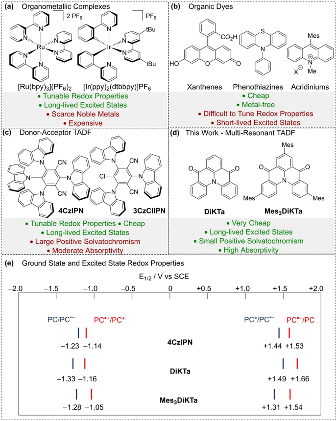
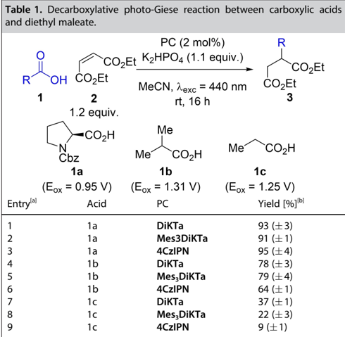
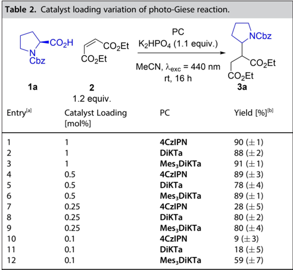
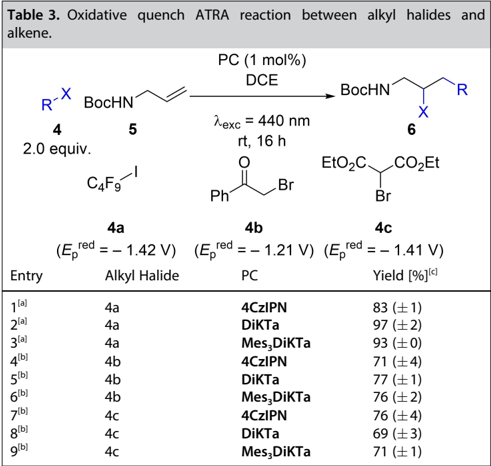
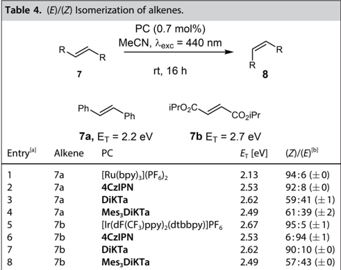
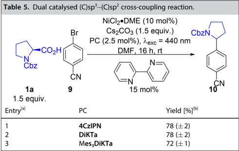
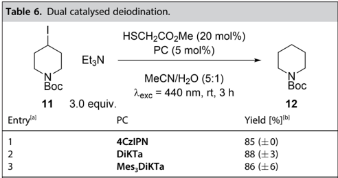
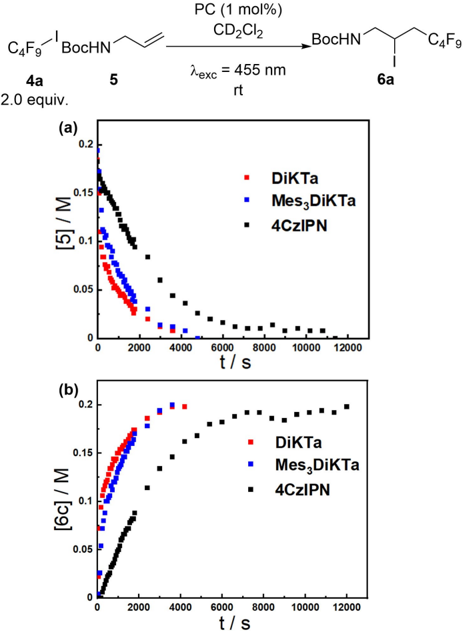

www.chemeurj.org

## Multi-Resonant Thermally Activated Delayed Fluorescent (MR-TADF) Compounds as Photocatalysts**

Callum Prentice, [a, b] James Morrison, [c] Andrew D. Smith,* [b] and Eli Zysman-Colman* [a]

Abstract: Donor-acceptor (D A) thermally activated delayed fluorescent (TADF) compounds, such as 4CzIPN , have become a widely used sub-class of organic photocatalysts for a plethora of photocatalytic reactions. Multi-resonant TADF (MR-TADF) compounds, a subclass of TADF emitters that are rigid nanographene derivatives, such as DiKTa and Mes3DiKTa , have to date not been explored as photocatalysts. In this study both DiKTa and Mes3DiKTa were found to give comparable or better product yield than 4CzIPN in a range of

## Introduction

Visible-light photocatalysis has become a widely used technique in synthetic organic chemistry. Photocatalysis functions by harnessing the electronic excited state of a photocatalyst (PC*), generated via the absorption of a photon, to interact with an organic substrate through either electron or energy transfer. Photocatalytic photoinduced single electron transfer (PET), commonly known as photoredox catalysis, proceeds either via a reductive or an oxidative quenching mechanism, dependent on whether the PC* gains or loses an electron, respectively, during the initial PET. [1] Alternatively, photoinduced energy transfer (PEnT) implicates the transfer of energy from the PC* to the substrate through either a Dexter or Förster energy transfer

- [a] C. Prentice, Prof. Dr. E. Zysman-Colman Organic Semiconductor Centre, EaStCHEM, School of Chemistry University of St Andrews St Andrews, Fife, KY169ST (UK) E-mail: eli.zysman-colman@st-andrews.ac.uk Homepage: http://www.zysman-colman.com/
- [b] C. Prentice, Prof. Dr. A. D. Smith EaStCHEM, School of Chemistry University of St Andrews St Andrews, Fife, KY169ST (UK) E-mail: ads10@st-andrews.ac.uk Homepage: https://ads-group.squarespace.com/
- [c] Dr. J. Morrison Pharmaceutical Sciences, IMED Biotech Unit AstraZeneca Macclesfield SK102NA (UK)
- [**] A previous version of this manuscript has been deposited on a preprint server (https://doi.org/10.26434/chemrxiv-2022-mm6pw).
- Supporting information for this article is available on the WWW under https://doi.org/10.1002/chem.202202998
- © 2022 The Authors. Chemistry - A European Journal published by Wiley-VCH GmbH. This is an open access article under the terms of the Creative Commons Attribution License, which permits use, distribution and reproduction in any medium, provided the original work is properly cited.

Chem. Eur. J. 2023 , 29 , e202202998 (1 of 7)

photocatalytic processes that rely upon reductive quenching, oxidative quenching, energy transfer and dual photocatalytic processes. In a model oxidative quench process, DiKTa and Mes3DiKTa gave increased reaction rates in comparison to 4CzIPN , with DiKTa being of particular interest due to the lower material cost (£0.94/mmol) compared to that of 4CzIPN (£3.26/mmol). These results suggest that DiKTa and Mes3DiKTa would be excellent additions to any chemist's collection of photocatalysts.

mechanism, regenerating the ground state photocatalyst (PC). [2] Organometallic complexes based on Ru(II) and Ir(III) are the most widely used PCs (Figure 1a). They possess an attractive suite of properties including suitably long-lived stable excited states, absorption that extends into the visible region where most organic substrates are transparent, plus (especially for Ir(III) complexes), the capacity to modulate both the ground and excited state redox properties through ligand variation. [3] However, the scarcity, toxicity and cost of the noble metals employed has spurred intense efforts to find alternative PCs. There are now many established examples of Earth-abundant metal complexes [4] and metal-free organic photocatalysts, [5] and numerous examples where these perform comparably to the noble metal PCs. While organic photocatalysts, such as xanthene dyes, phenothiazines, and acridinium-based compounds are commonplace (Figure 1b), [5-8] their ground and excited state redox potentials are difficult to tune. Donoracceptor (D A) thermally activated delayed fluorescent (TADF) PCs, most widely exemplified by the compound 4CzIPN , have rapidly been adopted in the field as their properties are readily tuneable through substituent variation (Figure 1c). [9,10] 4CzIPN , initially developed as an emitter for organic light-emitting diodes a decade ago, luminesces via a TADF mechanism. [11] As a result, 4CzIPN possesses microsecond-long emission lifetimes that, coupled with similar redox properties to that of the widely used [Ir(dF(CF 3 )ppy) 2 (dtbbpy)]PF6 , endows it with similar photochemical reactivity. 4CzIPN was first used as a photocatalyst by Luo and Zhang to achieve a dual catalysed (C)sp 3 (C)sp 2 crosscoupling reaction. [12] Subsequent work by Speckmeier et al. [13] demonstrated the versatility of this class of D A TADF photocatalyst and the tunability of their redox potentials by varying the nature and number of electron-donating and electronaccepting groups. A growing number of structurally related D A PCs have since been reported. [16] TADF operates when the energy gap between the lowest energy singlet and triplet excited states, Δ EST , is sufficiently small such that there is an

(a)

: (C)

Organometallic Complexes

2 PF6

N

[Ru(bpy)3](PF6)2

[Ir(ppy)2(dtbbpy)]PF6

· Tunable Redox Properties

· Long-lived Excited States

Scarce Noble Metals

· Expensive

Donor-Acceptor TADF

N

CN

N

CN

4CzIPN

· Tunable Redox Properties · Cheap

· Long-lived Excited States

· Large Positive Solvatochromism

· Moderate Absorptivity

(e)

Ground State and Excited State Redox Properties

-2.0

-1.5

-1.0

PC/PC*-

PC*+/PC*

-1.23 -1.14

-1.33 -1.16

-1.28 -1.05

N

Figure 1. (a) Examples of organometallic PCs. (b) Examples of organic PCs. (c) Examples of D A TADF PCs. (d) MR-TADF photocatalysts used in this work. (e) Excited state and ground state redox potentials of 4CzIPN in MeCN. [14] Ground state redox potentials of DiKTa and Mes3DiKTa in MeCN. [15] Excited state redox properties of DiKTa and Mes3DiKTa calculated from the experimentally determined E ox /E red and E0,0 values in MeCN, using E ox(PC * + /PC*) = Eox E0,0 and Ered(PC*/PC * ) = Ered + E0,0 . [15]

endothermic upconversion of triplet excitons into singlets by reverse intersystem crossing (RISC). This is possible when the exchange integral between the frontier orbitals involved in the emissive excited state is sufficiently small, which occurs in D A compounds where the donor and acceptor groups are poorly conjugated such as when they adopt a highly twisted conformation, as is the case for 4CzIPN and its derivatives. An alternative molecular design strategy to reduce the exchange integral is based on the exploitation of opposing resonance effects of p- and n-dopants in nanographenes that is embodied in multi-resonance TADF (MR-TADF) emitters. [17] Herein we present the use of two MR-TADF compounds as photocatalysts for the first time, using DiKTa and Mes3DiKTa, previously reported by us as emitters in OLEDs, [15] as typical examples

(Figure 1d). Owing to their rigid structure, MR-TADF compounds typically show much narrower emission profiles and smaller Stokes shifts while also exhibiting larger molar absorptivities for the low-energy short-range charge transfer (SRCT) absorption band (see Figure S2). The emissive excited state also shows SRCT character, which is identifiable due to the modest positive solvatochromism, in contrast to the large positive solvatochromism observed for D A TADF compounds (see Figures S3S4). [15] Enhanced molar absorptivity and reduced positive solvatochromism are expected to have positive implications for photocatalysis reactivity. The higher molar absorptivity of the band that is being targeted for photoexcitation could translate to faster reaction rates and lower required photocatalyst loadings. The attenuated positive solvatochromism of MR-TADF

PF6

CI

N

(b)

COzH

Mes

-/'3/2kV'q-3432q-3q-©ownloaded-from-httpsO99chemistry£europe0onlinelibrary0wiley0com9doi9/40/4439chem0343343öö1-by-×ational-Unstitute-of-Technologyq-Tiruchirappalliq-Wiley-&amp;nline-Yibrary-on-[/'9419343V]0-See-the-Terms-and-7onditions-ghttpsO99onlinelibrary0wiley0com9terms£and£conditionsR-on-Wiley-&amp;nline-Yibrary-for-rules-of-useH-&amp;L-articles-are-g

ale catalys avalan potese catte

PC (2 mol%)

PC

MeCN, 2exc = 440 nm rt, 16 h

3

МеС, Лехс = 440 nm rt, 16 h

COzEt

CO¿Et compounds implies that less energy is lost due to stabilization of the excited state by solvent, potentially leading to greater reactivity of the PC, particularly in commonly used polar aprotic solvents such as MeCN and DMF. DiKTa and its mesitylated analogue Mes3DiKTa were chosen for investigation as photocatalysts because of their similar redox potentials to those of 4CzIPN (Figure 1e). [13,15] An additional benefit is that the raw material cost per mmol is significantly lower for DiKTa (£0.94/ mmol) than for 4CzIPN (£3.26/mmol, see Supporting Information). These PCs were assessed across a diverse range of transformations including reductive quenching reactions, oxidative quenching reactions, energy transfer reactions, nickel dual catalysis and hydrogen atom transfer (HAT) dual catalysis. The result of this assessment shows that DiKTa and Mes3DiKTa are attractive alternatives to the widely used 4CzIPN.

## Results and Discussion

## Reductive quench

Our investigations began with a decarboxylative photo-Giese reaction. This process has previously been reported by Ji et al. [8] for their comparison of the effectiveness of different acridinium photocatalysts and also by Speckmeier et al. [13] for their comparison of the suitability of alternative D A photocatalysts. In the latter study Speckmeier et al. found that when 4CzIPN was used, a superior isolated yield of 80% is achieved compared to the previously reported best acridinium photocatalyst, which produced an isolated yield of 73%. Using N -Cbz protected proline 1a as the carboxylic acid substrate and diethyl maleate 2 as the electron deficient alkene, both DiKTa and Mes3DiKTa gave comparable NMR yields to that of 4CzIPN (Table 1, entries 1-3). N -protected prolines have relatively low oxidation potentials [E ox ([Boc-Pro-O][/Cs]) = 0.95 V vs. SCE in MeCN]; [18] therefore, the more challenging iso -butyric acid, 1b , and propanoic acid, 1c , ([E ox [ i PrCO2][/NBu4]) = 1.31 V and Eox([EtCO 2 ][/NBu 4 ]) = 1.25 V) [19] were also investigated in order to differentiate the photooxidation ability of the PCs. With isobutyric acid both DiKTa and Mes3DiKTa showed improved NMR yields of 78% and 79%, respectively (Table 1, entries 4 and 5), relative to the 64% achieved using 4CzIPN (Table 1, entry 6). Changing to the primary radical formed when using propanoic acid resulted in lower yields for all three PCs (Table 1, entries 79). This is likely due to the decreased nucleophilicity of primary radicals relative to secondary radicals, leading to alternative and undesired reaction pathways becoming competitive. Notwithstanding the lower yields, both DiKTa and Mes3DiKTa still outperformed 4CzIPN (Table 1, entries 7-9). 4CzIPN in the presence of similar carboxylic acids has been shown by König et al. [14] to undergo photosubstitution with the radical formed after decarboxylation. This prompted us to investigate the stability of DiKTa and Mes3DiKTa under similar conditions (see Supporting Information for details). Unfortunately, 4CzIPN , DiKTa , and Mes3DiKTa all show a blue-shift in their absorption spectra after irradiation in the presence of 1a , which suggests DiKTa and Mes3DiKTa are also unstable under these conditions;

Cbz

1a

Entryla]

trylal

[a] Carboxylic acid (1) (0.15 mmol), diethyl maleate (2) (0.18 mmol), K2HPO4 (0.17 mmol), PC (2 mol%), MeCN (3 mL), irradiation with 440 nm LEDs, rt. [b] Yield determined by 1 H NMR, using 1,3,5-trimethoxybenzene as internal standard, averaged over two separate experiments.

however, the products of this decomposition were not identified.

PC loading was next investigated as a discriminating parameter. The reaction using N -Cbz-proline 1a as starting material was therefore repeated at 1 mol%, 0.5 mol%, 0.25 mol% and 0.1 mol% (Table 2). Yields remained largely the

[a] Cbz-Pro-H ( 1a ) (0.15 mmol), diethyl maleate ( 2 ) (0.18 mmol), K2HPO4 (0.17 mmol), PC, MeCN (3 mL), irradiation with 440 nm LEDs, rt. [b] Yield determined by 1 H NMR, using 1,3,5-trimethoxybenzene as internal standard, averaged over three separate experiments.

anclic.

2.0 equiv.

(Ep

Entry

5

PC (1 mol%)

DCE

Nexc = 440 nm rt, 16 h

same for all three PCs down to 0.5 mol% (Table 2, entries 1-6). Contrastingly, differences in NMR yield were observed at 0.25 mol%, with 4CzIPN only achieving an average yield of 28% (Table 2, entry 7), while DiKTa and Mes3DiKTa maintained an average yield of 80% (Table 2, entries 8 and 9). When using 0.1 mol% PC loading, the use of both 4CzIPN and DiKTa produced poor average yields of 9% and 18%, respectively (Table 2, entries 10 and 11), while Mes3DiKTa achieved a significantly higher yield of 59% (Table 2, entry 12). The evidence suggests that DiKTa and Mes3DiKTa perform better than 4CzIPN at lower catalyst loadings, which is consistent with the higher molar absorptivity of DiKTa and Mes3DiKTa relative to 4CzIPN at the excitation wavelength used.

## Oxidative quench

Subsequent studies assessed these PCs in an oxidative quenching process based upon the atom transfer radical addition (ATRA) reaction developed by Pirtsch et al. [20] Using perfluorobutyl iodide 4a ( E p red = 1.42 V vs. SCE in MeCN) [21] and tert -butylN -allyl carbamate 5 as the substrates, 4CzIPN produced the desired ATRA product 6a in 83% yield (Table 3, entry 1). Interestingly, when using DiKTa and Mes3DiKTa , near quantitative yields of 97% and 93%, respectively, could be achieved (Table 3, entries 2-3). Phenacyl bromide 4b and diethyl bromomalonate 4c were then chosen as additional substrates with reduction potentials of E p red = 1.21 V vs. SCE and E p red of 1.41 V vs. SCE in DMF, respectively (Figures S5 and S7). When using phenacyl bromide 4b , 4CzIPN , DiKTa and Mes3DiKTa

[a] Alkyl halide ( 4 ) (0.60 mmol), tert -butyl N -allylcarbamate ( 5 ) (0.30 mmol), PC (1 mol%), DCE (1.5 mL), irradiation with 440 nm LEDs, rt, 24 h. [b] Alkyl halide ( 4) (0.50 mmol), tert -butyl N -allylcarbamate ( 5 ) (0.25 mmol), PC (1 mol%), DMF/H2O (1:2) (0.6 mL), irradiation with 440 nm LEDs, rt. [c] Yield determined by 1 H NMR, using 1,3,5-trimethoxybenzene as internal standard, averaged over two separate experiments.

performed similarly, generating 6b in 71%, 77% and 76% yields, respectively (Table 3, entry 4-6). However, when using 4c , 4CzIPN gave marginally improved product yields, affording 6c in 76% compared to 69% and 71% for DiKTa and Mes3DiKTa , respectively, although the difference between them is within the error observed for this reaction (Table 3, entries 79). The reduction potential stated for 4b by Pirtsch et al. of E p red = 0.49 V vs. SCE was originally reported by Tanner et al. [22] and is commonly used in the literature; however, this value is erroneous and occurs only as a result of electrochemical degradation (Figure S6). Indeed, a previous report by Bahamonde et al. [23] found that the peak reduction potential is significantly more negative Ep red = 1.39 vs. SCE in MeCN, and our own measurements have found it to be Ep red = 1.21 V vs. SCE in DMF from the peak of the differential pulse voltammogram (DPV). Similarly, literature values for the reduction potential of 4c vary significantly from E p red = 1.0 V vs. SCE [24] in DMF to Ep red = 1.74 vs. SCE [23] in MeCN; our own measurements indicate that E p red = 1.41 V vs. SCE in DMF from the peak of the DPV. Such a negative reduction potential would be predicted to be beyond the ability of any of these photocatalysts to reduce via oxidative quenching; however, quenching experiments with both 4CzIPN and DiKTa (see Figures S8-S11) show quenching to occur in the presence of 4c in DMF, showing that while endergonic, oxidative quenching does occur.

## Photoinduced energy transfer (PEnT)

Having shown that DiKTa and Mes3DiKTa are capable photoredox catalysts, attention turned to their application in PEnT. One of the simplest examples of PEnT processes is the ( E )/( Z ) isomerization of alkenes. The isomerization of ( E )-stilbene 7a was used effectively by Lu et al. to compare various D A TADF fluorophores and then correlate the results with their triplet energies (E T ) relative to that of ( E )-stilbene (E T = 2.2 eV) and ( Z )-stilbene (E T = 2.5 eV). [25,26] The crucial determinant for the efficiency of Dexter PEnT reactions is the degree of spectral overlap between the emission of the PC and the spin-forbidden absorption of the substrate. [2] A cross-comparison of the triplet energies of the reactant and PC are typically used as a crude handle to assess whether the reaction is likely to proceed. Thus, to maximize the yield for the isomerization of the substrate by limiting the reverse reaction, E T (Substrate) � E T (PC) &lt; E T (Product). Using similar reaction conditions to those of Lu et al. [Ru(bpy) 3 ](PF 6 ) 2 ( E T = 2.13 eV) [27] achieved a ( Z )/( E ) ratio of 94:6 and 4CzIPN ( E T = 2.53 eV) [25] performed comparably with a ( Z )/( E ) ratio of 92:8 (Table 4, entry 1 and 2). When using DiKTa ( E T = 2.61 eV) [15] as the photocatalyst a ( Z )/( E ) ratio of only 59:41 was observed (Table 4, entry 3), consistent with the high triplet energy of this PC, although a ( Z )/( E ) ratio of 61 : 39 was achieved with Mes3DiKTa ( E T = 2.49 eV), [15] despite having a similar triplet energy to that of 4CzIPN (Table 4, entry 4). Lu et al. observed similar off trend examples in their study, revealing the limitations of using E T alone to evaluate the efficiency of Dexter PEnT photocatalysts. While not as effective as 4CzIPN , these initial reactions did show that DiKTa and Mes3DiKTa can be

-/'3/2kV'q-3432q-3q-©ownloaded-from-httpsO99chemistry£europe0onlinelibrary0wiley0com9doi9/40/4439chem0343343öö1-by-×ational-Unstitute-of-Technologyq-Tiruchirappalliq-Wiley-&amp;nline-Yibrary-on-[/'9419343V]0-See-the-Terms-and-7onditions-ghttpsO99onlinelibrary0wiley0com9terms£and£conditionsR-on-Wiley-&amp;nline-Yibrary-for-rules-of-useH-&amp;L-articles-are-g

R

Dual catalysea acroamation.

PC (0.7 mol%)

MeCN, Лехс = 440 nm

HSCH2CO2Me (20 mol%)

MeCN/H2O (5:1)

Вос

11

Ph- el

7а, Ет = 2.2 eV

Allona

8

=N

Лехс = 440 nm, rt, 3 h

Boc

12

[a] Alkene ( 7 ) (0.60 mmol), PC (0.7 mol%), MeCN (3 mL), irradiation with 440 nm LEDs, rt. [b] Determined using 1 H NMR, averaged over two separate experiments.

used as PEnT photocatalysts. Di iso propyl fumarate 7b ( E T = 2.7 eV) [25] was used by Lu et al. as a more challenging substrate due to its higher E T . [Ir(dF(CF 3 )ppy) 2 (dtbbpy)]PF 6 ( E T = 2.67 eV) [27] was used as the reference PC for this reaction and achieved a ( Z )/( E ) ratio of 95:5 (Table 4, entry 5). Matching with previous reports, 4CzIPN only achieved trace amounts of isomerization, giving a ( Z )/( E ) ratio of 4:96 (Table 4, entry 6). Pleasingly, DiKTa gave a ( Z )/( E ) ratio of 90:10, which is comparable to that of the iridium PC (Table 4, entry 7). Mes3DiKTa afforded a lower ( Z )/( E ) ratio of 58:42 (Table 4, entry 8). Due to its higher E T , DiKTa should be considered as a complementary PC to 4CzIPN , capable of engaging in more energetically demanding PEnT reactions.

## Dual Photoredox Catalysis

Metallaphotoredox catalysis is a fast growing area of research as it often offers a mild alternative to existing transition metal catalytic reactions and give access to different redox couples of the co-catalyst, resulting in new reactivity. [28] Nickel in particular has been paired with photocatalysts for a wide range of different coupling reactions with Luo and Zhang [12] reporting the first use of 4CzIPN as a photocatalyst in a dual-mode catalysed (C)sp 3 (C)sp 2 cross-coupling. Employing a modified version of this reaction to assess the performance of DiKTa and Mes3DiKTa , using 4CzIPN , the coupling reaction between 1a and aryl bromide 9 gave the desired product 10 in 78% yield (Table 5, entry 1). Both DiKTa and Mes3DiKTa gave similar results of 78% and 72%, respectively (Table 5, entries 2 and 3), providing further evidence of the versatility of these two PCs.

Hydrogen atom transfer (HAT) catalysts are also commonly partnered with photocatalysts and have been used for dehalogenation reactions. A recent example, reported by Constantin et al., [29] used the alkyl radicals generated after the

[a] Cbz-Pro-H ( 1a ) (0.225 mmol), 4-bromobenzonitrile ( 9 ) (0.15 mmol), NiCl 2 * DME (10 mol%), Cs2CO3 (0.225 mmol), 2,2'-bipyridine (15 mol%) PC (2.5 mol%), DMF (3.5 mL), irradiation with 440 nm LEDs, rt. [b] Yield determined by 1 H NMR, using 1,3,5-trimethoxybenzene as internal standard, averaged over two separate experiments.

reductive quenching between PC* and triethylamine to abstract iodine atoms from alkyl iodides 11 to generate alkyl radicals that typically would require a far more potent reductant (E red (R I) &lt; 2 V). These alkyl radicals can then be trapped by a thiol HAT catalyst to generate the dehalogenation products 12 (Table 6). Under the literature conditions using 4CzIPN , an 85% yield of 12 was obtained (Table 6, entry 1). Both DiKTa and Mes3DiKTa were able to achieve comparable average yields of 88% and 86%, respectively (Table 6, entries 2 and 3).

## Reaction profile and rates analysis

Reactions in the previous sections have used the yield of the reaction after a given time to compare the efficiency of the PCs. While useful, this provides an incomplete picture of these reaction processes as it does not allow comparison of relative rates of product formation. This prompted an investigation into the reaction kinetics of the PCs for a model transformation, with the ATRA reaction between 4a and 5 shown in Table 3 chosen.

[a] Alkyl iodide ( 11 ) (0.15 mmol), triethylamine (0.45 mmol), methyl 2mercaptoacetate (20 mol%), PC (5 mol%), MeCN/H2O (5: 1) (1.5 mL), irradiation with 440 nm LEDs, rt. [b] Yield determined by 1 H NMR, using 1,3,5-trimethoxybenzene as internal standard, averaged over two separate experiments.

-/'3/2kV'q-3432q-3q-©ownloaded-from-httpsO99chemistry£europe0onlinelibrary0wiley0com9doi9/40/4439chem0343343öö1-by-×ational-Unstitute-of-Technologyq-Tiruchirappalliq-Wiley-&amp;nline-Yibrary-on-[/'9419343V]0-See-the-Terms-and-7onditions-ghttpsO99onlinelibrary0wiley0com9terms£and£conditionsR-on-Wiley-&amp;nline-Yibrary-for-rules-of-useH-&amp;L-articles-are-g

4a

5

PC (1 mol%)

Lexc = 455 nm rt

6a

Inspired by Yi et al. [30] in situ NMR was used to monitor the generation of product employing each of the PCs (Figure 2). Notably, using this experimental set-up, the reaction reached completion for all three PCs in less than 3 h, significantly faster than using a photoreactor, presumably due to more efficient irradiation within the in situ NMR set-up. Furthermore, when catalysed by Mes3DiKTa or DiKTa the rate of product formation is significantly enhanced than with 4CzIPN . To quantify these differences, initial rates of the reaction with each photocatalyst were calculated and compared, with the use of DiKTa giving a slightly larger initial rate (5×10 4 M s 1 ) than Mes3DiKTa (3.7× 10 4 M s 1 ), but with both an order of magnitude larger than that of 4CzIPN (0.6×10 4 M s 1 ) (Table 7).

While our original hypothesis was that increased molar absorptivity at the excitation wavelength for DiKTa and Mes3DiKTa compared to 4CzIPN would lead to increased

0.1

0.05

Figure 2. Reaction progress kinetics for the reaction in Table 3, replacing DCE with CD2Cl2 as solvent using 455 nm LED and 1,4-bis(trimethylsilyl)benzene as internal standard. (a) Concentration of 5 over time. (b) Concentration of 6a over time.

|   Entry | PC          | Initial Rates [10 4 M s 1 ]   |
|---------|-------------|-------------------------------|
|       1 | 4CzIPN      | 0.6 ( � 0.1)                  |
|       2 | DiKTa       | 5 ( � 1)                      |
|       3 | Mes 3 DiKTa | 3.7 ( � 0.3)                  |

reaction rates at 455 nm the molar absorptivity for DiKTa and 4CzIPN are similar (see Figure S2). It is not evident what is the cause for the divergence in reaction rates between the two photocatalysts.

## Conclusion

In summary this manuscript demonstrates the potential of MRTADF compounds as a new class of photocatalyst, using DiKTa and Mes3DiKTa as examples compared with 4CzIPN as a prototypical donor-acceptor TADF benchmark. Compared to other photocatalysts DiKTa stands out for its wide redox window, low molecular weight, and low cost. Multiple different classes of photocatalytic reaction were tested, including, oxidative and reductive quenching reactions, energy transfer reactions and dual catalytic reactions. Both DiKTa and Mes3DiKTa were shown to be comparable or superior in all examples of photoredox catalysis, particularly at low catalyst loadings, and complementary for energy transfer reactions compared to 4CzIPN due to their higher triplet energies. In situ NMR studies were used to probe reaction kinetics of the ATRA reaction between a perfluorinated alkyl halide and an unactivated alkene and showed a significant enhancement of the rate of reaction when using either DiKTa or Mes3DiKTa over 4CzIPN . To the best of our knowledge this work documents the first instance of MR-TADF compounds being used in photocatalysis and we expect further work to expand to other MRTADF compounds of different structural classes.

## Experimental Section

Decarboxylative photo-Giese reaction : Carboxylic acid (0.15 mmol, 1.0 equiv.), K2HPO4 (31.4 mg, 0.17 mmol, 1.1 equiv.), photocatalyst (3.0 μ mol, 0.02 equiv.) and diethyl maleate (27 μ l, 0.18 mmol, 1.2 equiv.) were added to a vial in the photoreactor then evacuated and backfilled with nitrogen three times. In a separate Schlenk flask acetonitrile was sparged for 10 minutes and then added to the reaction vial (3 mL). The reaction was then stirred under 440 nm irradiation at rt for 16 h. Water (5 mL) was added then the mixture was extracted with CH2Cl2 (3×5 mL). The organic phases were combined and dried (Na2SO4) then concentrated in vacuo. Purification by silica column chromatography EtOAc:Pet. Ether afforded the desired products.

Oxidative quench ATRA reaction for 4a/b : tert -Butyl allyl carbamate (39.3 mg, 0.25 mmol, 1.0 equiv.), alkyl halide (0.50 mmol, 2.0 equiv.) and the photocatalyst (2.5 μ mol, 0.01 equiv.) were added to a vial in the photoreactor then evacuated and backfilled with nitrogen three times. In a separate Schlenk flask a DMF/H 2 O (1:2) solution was sparged for 10 minutes and then added to the reaction vial (0.6 mL). The reaction was then stirred under 440 nm irradiation at rt for 16 h. Water (5 mL) and EtOAc (5 mL) were added, and the mixture was extracted with EtOAc (3×5 mL). The organic phases were combined and dried (Na2SO4) then concentrated in vacuo. Purification by silica column chromatography EtOAc:Pet. Ether afforded the desired products.

Oxidative quench ATRA reaction for 4c : tert -Butyl allyl carbamate (47.2 mg, 0.30 mmol, 1.0 equiv.), alkyl halide (0.60 mmol, 2.0 equiv.) and the photocatalyst (3.0 μ mol, 0.01 equiv.) were added to a vial

-/'3/2kV'q-3432q-3q-©ownloaded-from-httpsO99chemistry£europe0onlinelibrary0wiley0com9doi9/40/4439chem0343343öö1-by-×ational-Unstitute-of-Technologyq-Tiruchirappalliq-Wiley-&amp;nline-Yibrary-on-[/'9419343V]0-See-the-Terms-and-7onditions-ghttpsO99onlinelibrary0wiley0com9terms£and£conditionsR-on-Wiley-&amp;nline-Yibrary-for-rules-of-useH-&amp;L-articles-are-g

in the photoreactor then evacuated and backfilled with nitrogen three times. In a separate Schlenk flask DCE was sparged for 10 minutes and then added to the reaction vial (1.5 mL). The reaction was then stirred under 440 nm irradiation at rt for 16 h. The reaction was then transferred to a round-bottom flask and concentrated in vacuo. Purification by silica column chromatography EtOAc:Pet. Ether afforded the desired product.

( E )/( Z ) isomerization of alkenes : The alkene (0.40 mmol) and the photocatalyst (2.8 μ mol) were added to a vial in the photoreactor then evacuated and backfilled with nitrogen three times. In a separate Schlenk flask acetonitrile was sparged for 20 minutes and then added to the reaction vial (2 mL). The reaction was then stirred under 440 nm irradiation at rt for 16 h. The reaction mixture was then transferred to a round-bottom flask and concentrated in vacuo. Purification by silica column chromatography EtOAc:Pet. Ether afforded the desired products.

Dual catalysed (C) sp 3 (C) sp 2 Cross Coupling Reaction : 4-Bromobenzonitrile (27.3 mg, 0.15 mmol, 1.0 equiv.), N -Cbz-L-proline (56.1 mg, 0.225 mmol, 1.5 equiv.), Cs2CO3 (73.3 mg, 0.225 mmol, 1.5 equiv.), 2,2'-bipyridine (3.5 mg, 0.0225 mmol, 0.15 equiv.), NiCl 2 * DME (3.3 mg, 0.015 mmol, 0.10 equiv.) and the photocatalyst (3.75 μ mol, 0.01 equiv.) were all added to a vial in the photoreactor and evacuated then backfilled with nitrogen three times. In a separate Schlenk flask DMF was sparged for 10 minutes with nitrogen and then added to the reaction vial (3.5 mL). The reaction was then stirred under 440 nm irradiation at rt for 16 h. Water (5 mL) and EtOAc (5 mL) were added, and the mixture was extracted with EtOAc (3×5 mL). The organic phases were combined and dried (Na 2 SO4) then concentrated in vacuo. Purification by silica column chromatography EtOAc:Pet. Ether afforded the desired product.

Dual catalysed deiodination : 4-IodoN -boc -piperidine (46.7 mg, 0.15 mmol, 1.0 equiv.) and the photocatalyst (7.50 μ mol, 0.05 equiv.) were added to a vial in the photoreactor and evacuated then backfilled with nitrogen three times. In a separate Schlenk flask a solution of triethylamine (62.7 μ l, 0.45 mmol, 3.0 equiv.), acetonitrile (1.25 mL) and water (0.25 mL) was degassed via three freeze-pump-thaw cycles then transferred to the vial in the photoreactor. In a separate vial methyl thioglycolate (2.7 μ l, 30 μ mol. 0.2 equiv.) was sparged with nitrogen for 5 minutes before being added to the vial in the photoreactor. The reaction was then stirred under 440 nm irradiation at rt for 4 h. Then 0.5 mL of a stock solution of 1,3,5-trimethoxybenzene in acetonitrile (0.1 m ) was added and the solution stirred for 5 minutes. A sample was taken and concentrated in vacuo then dissolved in CDCl3 to obtain an NMR yield. A reference sample was prepared for comparison from piperidine using a known literature procedure. [31]

## Acknowledgements

We thank AstraZeneca for funding (C. P.). We thank Ettore Crovini for assistance with the emission quenching experiments.

## Conflict of Interest

The authors declare no conflict of interest.

## Data Availability Statement

The data that support the findings of this study are openly available in Pure at https://doi.org/10.17630/52579ba6-7023436f-8242-e89df725dca9, reference number 281110021.

Keywords: kinetics · multi-resonant thermally activated delayed fluorescence (MR-TADF) · photocatalysis · thermally activated delayed fluorescence (TADF)

- [1] L. Fensterbank, J.-P. Goddard, C. Ollivier, in Visible Light Photocatal. Org. Chem. , John Wiley &amp; Sons, Ltd, 2018 , pp. 25-71.
- [2] F. Strieth-Kalthoff, M. J. James, M. Teders, L. Pitzer, F. Glorius, Chem. Soc. Rev. 2018 , 47 , 7190-7202.
- [3] C. K. Prier, D. A. Rankic, D. W. C. MacMillan, Chem. Rev. 2013 , 113 , 53225363.
- [4] B. M. Hockin, C. Li, N. Robertson, E. Zysman-Colman, Catal. Sci. Technol. 2019 , 9 , 889-915.
- [5] [N. A. Romero, D. A. Nicewicz, Chem. Rev. 2016 , 116 , 10075-10166.](https://doi.org/10.1021/acs.chemrev.6b00057)
- [6] [S. Fukuzumi, K. Ohkubo, Org. Biomol. Chem. 2014 , 12 , 6059-6071.](https://doi.org/10.1039/C4OB00843J)
- [7] [V. Srivastava, P. P. Singh, RSC Adv. 2017 , 7 , 31377-31392.](https://doi.org/10.1039/C7RA05444K)
- [8] A. Joshi-Pangu, F. Lévesque, H. G. Roth, S. F. Oliver, L.-C. Campeau, D. Nicewicz, D. A. DiRocco, J. Org. Chem. 2016 , 81 , 7244-7249.
- [9] T.-Y. Shang, L.-H. Lu, Z. Cao, Y. Liu, W.-M. He, B. Yu, Chem. Commun. 2019 , 55 , 5408-5419.
- [10] M. A. Bryden, E. Zysman-Colman, Chem. Soc. Rev. 2021 , 50 , 7587-7680.
- [11] H. Uoyama, K. Goushi, K. Shizu, H. Nomura, C. Adachi, Nature 2012 , 492 , 234-238.
- [12] [J. Luo, J. Zhang, ACS Catal. 2016 , 6 , 873-877.](https://doi.org/10.1021/acscatal.5b02204)
- [13] E. Speckmeier, T. G. Fischer, K. Zeitler, J. Am. Chem. Soc. 2018 , 140 , 15353-15365.
- [14] [S. Grotjahn, B. König, Org. Lett. 2021 , 23 , 3146-3150.](https://doi.org/10.1021/acs.orglett.1c00836)
- [15] D. Hall, S. M. Suresh, P. L. dos Santos, E. Duda, S. Bagnich, A. Pershin, P. Rajamalli, D. B. Cordes, A. M. Z. Slawin, D. Beljonne, A. Köhler, I. D. W. Samuel, Y. Olivier, E. Zysman-Colman, Adv. Opt. Mater. 2020 , 8 , 1901627.
- [16] [A. Tlili, S. Lakhdar, Angew. Chem. Int. Ed. 2021 , 60 , 19526-19549.](https://doi.org/10.1002/anie.202102262)
- [17] S. Madayanad Suresh, D. Hall, D. Beljonne, Y. Olivier, E. Zysman-Colman, Adv. Funct. Mater. 2020 , 30 , 1908677.
- [18] [Z. Zuo, D. W. C. MacMillan, J. Am. Chem. Soc. 2014 , 136 , 5257-5260.](https://doi.org/10.1021/ja501621q)
- [19] J. D. Griffin, M. A. Zeller, D. A. Nicewicz, J. Am. Chem. Soc. 2015 , 137 , 11340-11348.
- [20] M. Pirtsch, S. Paria, T. Matsuno, H. Isobe, O. Reiser, Chem. Eur. J. 2012 , 18 , 7336-7340.
- [21] M. L. Czyz, G. K. Weragoda, T. H. Horngren, T. U. Connell, D. Gomez, R. A. J. O'Hair, A. Polyzos, Chem. Sci. 2020 , 11 , 2455-2463.
- [22] [D. D. Tanner, H. K. Singh, J. Org. Chem. 1986 , 51 , 5182-5186.](https://doi.org/10.1021/jo00376a024)
- [23] [A. Bahamonde, P. Melchiorre, J. Am. Chem. Soc. 2016 , 138 , 8019-8030.](https://doi.org/10.1021/jacs.6b04871)
- [24] L. Wang, I. Rörich, C. Ramanan, P. W. M. Blom, W. Huang, R. Li, K. A. I. Zhang, Catal. Sci. Technol. 2018 , 8 , 3539-3547.
- [25] J. Lu, B. Pattengale, Q. Liu, S. Yang, W. Shi, S. Li, J. Huang, J. Zhang, J. Am. Chem. Soc. 2018 , 140 , 13719-13725.
- [26] W. G. Herkstroeter, D. S. McClure, J. Am. Chem. Soc. 1968 , 90 , 45224527.
- [27] F. Strieth-Kalthoff, F. Glorius, Chem 2020 , 6 , 1888-1903.
- [28] J. Twilton, C. (Chip) Le, P. Zhang, M. H. Shaw, R. W. Evans, D. W. C. MacMillan, Nat. Chem. Rev. 2017 , 1 , 0052.
- [29] T. Constantin, M. Zanini, A. Regni, N. S. Sheikh, F. Juliá, D. Leonori, Science 2020 , 367 , 1021-1026.
- [30] Y. Ji, D. A. DiRocco, C. M. Hong, M. K. Wismer, M. Reibarkh, Org. Lett. 2018 , 20 , 2156-2159.
- [31] B. Abadie, D. Jardel, G. Pozzi, P. Toullec, J.-M. Vincent, Chem. Eur. J. 2019 , 25 , 16120-16127.

Manuscript received: September 26, 2022 Accepted manuscript online: October 8, 2022 Version of record online: November 14, 2022

-/'3/2kV'q-3432q-3q-©ownloaded-from-httpsO99chemistry£europe0onlinelibrary0wiley0com9doi9/40/4439chem0343343öö1-by-×ational-Unstitute-of-Technologyq-Tiruchirappalliq-Wiley-&amp;nline-Yibrary-on-[/'9419343V]0-See-the-Terms-and-7onditions-ghttpsO99onlinelibrary0wiley0com9terms£and£conditionsR-on-Wiley-&amp;nline-Yibrary-for-rules-of-useH-&amp;L-articles-are-g