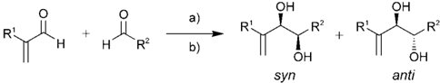
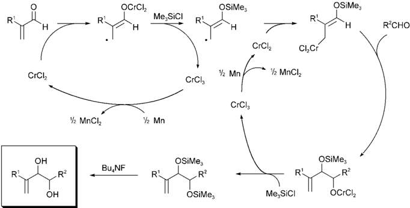
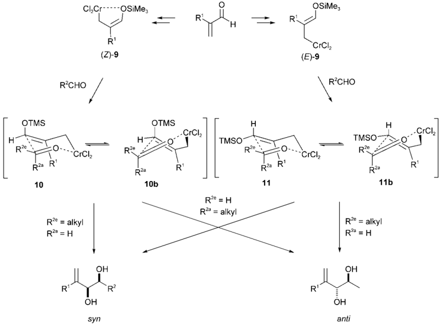
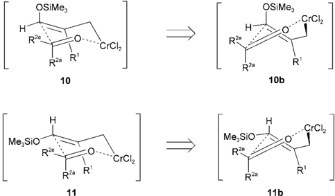
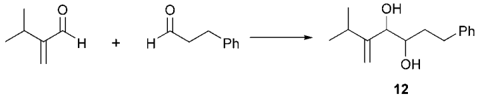
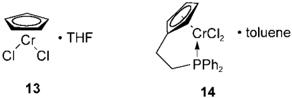
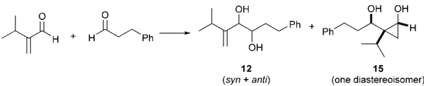
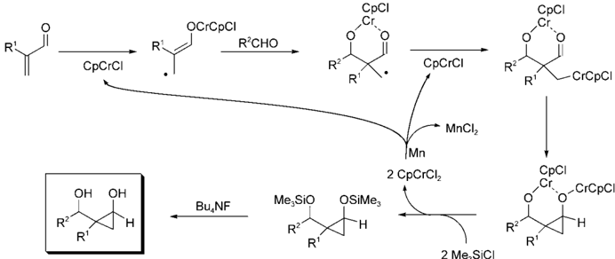
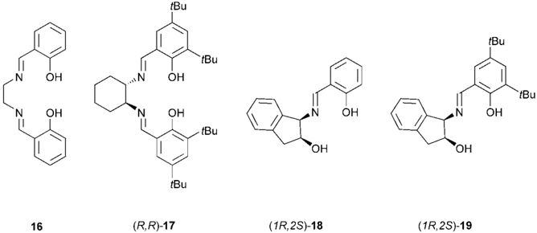

[First publ. in: Chemistry - A European Journal 11 (2005), 10, pp. 3127-3135](http://www3.interscience.wiley.com/cgi-bin/abstract/110431278/ABSTRACT?CRETRY=1&SRETRY=0)

## Chromium-Catalyzed Pinacol-Type Cross-Coupling: Studies on Stereoselectivity**

## Ulrich Groth,* Marc Jung, and Till Vogel [a]

Abstract: A chromium-catalyzed pinacol-type cross-coupling reaction between a , b -unsaturated carbonyl compounds and aldehydes is reported. Even sterically demanding substrates could be coupled to afford the corresponding pinacols in good yields. Systematic studies concerning the origin of the diastereoselectivities led to the pro-

## Introduction

The construction of 1,2-diols plays an important role in natural-product synthesis, with many pharmacologically active substances containing the pinacol structural motif. 1,2-Diols can be generated in general by bishydroxylation of olefinic double bonds [1] or by reductive coupling of carbonyl compounds. [2] The latter method plays an important role in the synthesis of HIV-protease inhibitors [3] and of natural products [4] such as taxol [5] and cotylenol [6] and their derivatives. For their synthesis this reaction has to be performed in a diastereoselective fashion.

For economic and ecological reasons, the pinacol coupling reaction should be performed in a catalytic fashion with use of low-valent metals. Many catalytic systems are known in the literature. [7] Hirao was the first to use zinc as reductive agent and chlorotrimethylsilane as scavenger in a low-valent vanadium-catalyzed pinacol coupling reaction, [7e] while Boland reported pinacol coupling reactions of aromatic carbonyl compounds through the use of chromium chloride, zinc or manganese, and chlorotrimethylsilane. [7f] Unfortu-

[a]

Prof. Dr. U. Groth, Dr. M. Jung, T. Vogel

Fachbereich Chemie der Universität Konstanz, Fach M-720

Universitätsstr.10, 78457 Konstanz (Germany)

Fax: (

+ 49)7531-884-155

E-mail: ulrich.groth@uni-konstanz.de

[**] Transition-Metal-Catalyzed Reactions in Organic Synthesis Part VIII. Part VII: see Ref. [16].

Konstanzer Online-Publikations-System (KOPS)

[URL: http://www.ub.uni-konstanz.de/kops/volltexte/2008/4634/](http://www.ub.uni-konstanz.de/kops/volltexte/2008/4634/)

[URN: http://nbn-resolving.de/urn:nbn:de:bsz:352-opus-46348](http://nbn-resolving.de/urn:nbn:de:bsz:352-opus-46348)

posal of a mechanism for this synthetically useful reaction. Acroleins with a -branched alkyl side chains were coupled to give the corresponding syn pi-

Keywords: chromium · cross- coupling · diastereoselectivity · homogeneous catalysis · pinacols

nacols, while on the other hand, acroleins with less bulky substituents furnished the anti derivatives. The effects of both the substrates and the reagents on the diastereo- and enantioselectivities were investigated. An unexpected catalytic formation of cyclopropanols was found.

nately both processes were limited to homocoupling reactions.

However, cross-coupling reactions are of greater interest than homocoupling reactions as a tool for convergent synthesis strategy. Only a few examples of pinacol cross-coupling reactions have so far been reported in the literature.

Boeckmann [8] reported coupling reactions between acetals of acrolein or methacrolein and aldehydes in the presence of chlorotrimethylsilane and sodium iodide. The reactions were catalyzed by chromium chloride with stoichiometric amounts of manganese as reducing agent, by a protocol originally developed by Fürstner for a catalytic NozakiHiyama reaction. [9, 10] In this catalytic version of a method reported by Takai, [11] only acrolein or methacrolein acetals could be coupled to provide the corresponding pinacol monoethers, so the scope of this reaction is limited. Recently Takai reported pinacol-type cross-coupling reactions between a number of vinyl ketones and aldehydes through the use of a large excess of chromium chloride and chlorotrimethylsilane as a scavenger. [12,13]

We recently reported a chromium-catalyzed pinacol crosscoupling reaction of a , b -unsaturated carbonyl compounds and aldehydes to form 1,2-diols diastereoselectively, [14] and were able to reduce the amount of chromium used to 10 mol%. Various vinyl ketones were coupled with aldehydes in good yields and with high diastereoselectivities. We extended the method to the chromium-catalyzed cross-coupling of sterically demanding acroleins and a variety of aldehydes to afford highly substituted pinacols with almost no steric limitations for R 1 and R 2 (cf. Scheme 1).

CHEMISTRY

R:

H

CrCl2

OCrCl2

a)

R'

OH

CI\_Cr

OSiMe,

CrCl2

+

\_R'

1. Mn

·½ MnC|½

Scheme 1. Chromium-catalyzed pinacol cross-coupling reaction: a) 2.0 equiv TMSCl, 2.0 equiv Mn, 0.1 equiv CrCl2, DMF; b) 2.0 equiv TBAF, THF. Bu,NF USIMe3 R'L

OH

Me, Sicl

OCrC|2

Trombini et al. reported an alternative procedure affording the same structural motif as our method by treatment of 3-halopropenyl carboxylates under conditions similar to those of Füstners procedure. [15] The products obtained by this method generally have an unsubstituted pattern at the resulting w -standing olefin (R 1 = H; cf. Scheme 1).

Here we report our work on the diastereoselectivity outcome of this cross-coupling reaction between substituted acroleins and aldehydes, which has led to a better understanding of the origin of the diastereoselectivities and of the reaction mechanism. We also report some studies geared towards an enantioselective reaction by use of chiral chromium complexes as catalysts, together with the unexpected catalytic formation of cyclopropanols. An intramolecular version of the described chromium-catalyzed pinacol

OSiMe,

H

R'CHO

## Results and Discussion

We found that the cross-coupling reaction of substituted acroleins with aliphatic aldehydes in the presence of 10 mol% of chromium( ii ) chloride led to pinacols in good yields and with diastereoselectivities of up to &gt; 95% de (Scheme 1). For successful coupling the acroleins were added slowly to the reaction mixture containing the catalyst, the aliphatic aldehyde, manganese powder, and chlorotrimethylsilane in DMF.

A postulated mechanism based on Fürstners and Takais work is shown in Scheme 2. It should be noted that this reaction does not proceed through ketyl radicals. Instead, a

Scheme 2. Postulated mechanism of the Cr II -catalyzed pinacol cross-coupling reaction. R 1 = R 2 = alkyl.

cross-coupling reaction serving as a method for the formation of small and mid-sized rings has been reported by us recently. [16]

Abstract in German: Eine Chrom-katalysierte Pinakol Kreuz-Kupplung zwischen a , b -ungesättigten Carbonylverbindungen und Aldehyden wird vorgestellt. Sogar sterisch anspruchsvolle Substrate kçnnen in hohen Ausbeuten zu den entsprechenden Pinakolen umgesetzt werden. Durch systematische Untersuchungen hinsichtlich der Diastereoselektivität konnte ein Mechanismus für diese synthetisch wertvolle Reaktion postuliert werden. Acroleine die in a -Position verzweigte Alkylketten tragen, ergaben bevorzugt syn -Pinakole, wohingegen sterisch weniger anspruchsvolle Substituenten bevorzugt anti -Derivate lieferten. Es wurden Substrat- und Reagenzeffekte im Hinblick auf die erhaltenen Diastereound Enantioselektivitäten untersucht. Dabei wurde überraschenderweise eine diastereoselektive Bildung von Cyclopropanolen gefunden.

nucleophilic attack of a chromium allyl species onto an aldehyde takes place, so this does not represent a 'classical' pinacol coupling reaction. The chromium allyl species is formed as a mixture of the E and Z forms, leading to a mixture of the corresponding syn and anti pinacols.

Instead of the hygroscopic Cr II chloride, the easier to handle and cheaper Cr III chloride could be used as catalyst without any significant changes in yields or diastereoselectivities.

As mentioned above, similar procedures so far described in the literature are limited to acrolein acetals or methacrolein acetals. Since we intended this method to be a tool for natural-product total synthesis, more bulky substituents should be tolerated. We therefore studied coupling reactions with 2tert -butylacrolein as a sterically demanding coupling component and then investigated coupling reactions between different acroleins and pivalaldehyde. Other combinations of acroleins and aldehydes led to a more detailed transition-state model. Some representative results of the coupling reactions are summarized in Table 1.

Of interest is the successful coupling of sterically demanding 2tert -butylacrolein and the bulky pivalaldehyde (Table 1, compound 1 ) in an acceptable yield of 61% and

Me, SiCI

OH

CI\_Cr-··--OSiMe:

(Z)-9

OSiMe,

CrClz

(E)-9

Table 1. Chromium-catalyzed coupling reactions of acroleins with aliphatic aldehydes.

OTMS

10

|   Compound | R 1   | R 2         |   Yield [%] | dr ( syn / anti )   | de [%]       |
|------------|-------|-------------|-------------|---------------------|--------------|
|          1 | t Bu  | t Bu        |          61 | > 97.5:2.5          | > 95 ( syn ) |
|          2 | t Bu  | Et          |          69 | 93:7                | 86 ( syn )   |
|          3 | t Bu  | Ph(CH 2 ) 2 |          73 | 86:14               | 72 ( syn )   |
|          4 | i Pr  | t Bu        |          68 | 92:8                | 84 ( syn )   |
|          5 | Et    | t Bu        |          75 | < 52.5:47.5         | < 5          |
|          6 | Me    | t Bu        |          54 | 28:72               | 44 ( anti )  |
|          7 | Et    | Et          |          58 | 24:76               | 52 ( anti )  |
|          8 | i Pr  | i Pr        |          81 | 65:35               | 30 ( syn )   |

R° = alkyl

R'= H

with an excellent diastereoselectivity of &gt; 95% de . As the steric demand of the aldehyde decreases, the yields increase (Table 1, compounds 2 and 3 ), but the diastereoselectivities deteriorate. The diastereoselectivity is dominated mainly by the influence of the acrolein substituent R 1 . A comparison of the coupling reaction results of pivalaldehyde with different acroleins shows that the syn diastereoselectivity increases as the substituent at the acrolein becomes bulkier. a -Branched alkyl side chains in the acroleins favor syn products (Table 1, compounds 1 -4 , 8 ), while unbranched alkyl chains lead predominantly to the anti pinacols (Table 1, compounds 6 , 7 ).

Two different chromium allyl species ( E and Z ) resulting from the initial two single-electron transfer (SET) steps are possible, leading to different transition states (Scheme 3). Similar transition states have been described by Takai for chromium-mediated coupling reactions of vinyl ketones with aldehydes [12] and by Nozaki and Hiyama for smaller R 2 residues. [17]

Compound ( Z )-9 should form transition state 10 , while ( E )-9 should lead to transition state 11 . Both diastereomeric pinacols ( syn and anti ) can be obtained from either transition state, depending on the orientation of the aldehyde. There most likely exists a selectivity for the alkyl chain of the aldehyde R 2 to be arranged in the equatorial position (R 2e = alkyl; R 2a = H), which results in a selectivity of transition state 10 (and ( Z )-9 ) to form mainly syn pinacols while transition state 11 (and ( E )-9 ) predominantly forms anti pinacols. This selectivity should be higher for larger R 2 residues.

If R 2 is sterically demanding, like tert -butyl, skew-boatlike transition states 10b and 11b could result instead of the chair-like transition states, similar to what is described in the literature for the Nozaki-Hiyama reaction (Scheme 4). [17]

The shape of the transition state, whether it is chair-like ( 10 or 11 ) or skew-boat/twist-boat-like ( 10b or 11b ), does not change the results qualitatively. In every case the energetically preferred position for the (large) alkyl residue, R 2 , of the aldehyde should be in the (pseudo)equatorial position (R 2e = alkyl; R 2a = H).

Takai described fast equilibration of ( Z )- and ( E )-9 under noncatalytic reaction conditions. [12] Our results are best interpreted by assuming that the equilibration is slow relative to the coupling reaction. As a good working model we assumed that the diastereomeric ratio obtained in coupling experiments with pivalaldehyde (Table 1, compounds 1 , 4 -6 ) represents the ratio of ( Z )- to ( E )-9 . The high steric demand

Scheme 3. Different transition states resulting from ( Z )- or ( E )-chromium allyl species. TMS = trimethylsilyl.

R2 = alkyl

H

OH

anti

aldehyde with CrCh, in different solvents.!a]

CHEMISTRY

OSiMe,

H

Me, Sio

OH

12

OSiMe

Scheme 4. Skew-boat-like transitions states with pivalaldehyde, analogous to Nozakis and Hiyamas, described in the literature. [17]

of the tert -butyl group R 2 (cf. Scheme 4, R 2e = t Bu; R 2a = H) should lead to highly selective formation of the syn pinacol from 10b and the anti pinacol from 11b .

In the case of tert -butylacrolein, ( Z )-9 is formed exclusively. With pivalaldehyde, compound 1 is formed with &gt; 95% de via 10b because of the bulky tert -butyl substituent R 2 . Compound 10b represents an analogue of the transition state proposed previously by Nozaki and Hiyama for pivalaldehyde. [17] When the steric demand of R 2 is decreased, 10 will possibly give rise to a slight decrease in diastereoselectivity (Table 1, compounds 1 -3 ).

In view of the above assumptions, an explanation of the increase in the anti diastereoselectivity with decreasing steric demand of the aldehyde R 2 group from tert -butyl to ethyl (Table 1, compounds 5 and 7 ) can be explained in terms of the transition states 10 or 10b giving diastereoselectivities different from those of 11 or 11b (Scheme 4). The main difference between the transition states 10 and 11 is the axially located OSiMe3 group in 10 , which is forced into its position by the stereochemistry of the chromium allyl compound ( Z )-9 . To explain the difference in the syn / anti ratios of compounds 5 and 7 by the above model it is necessary to assume a higher selectivity for the orientation of the aldehyde in transition state 11 than in transition state 10 .

Alternatively it could be assumed that only one chromium allyl species is formed exclusively. In this case the diastereoselectivities for the reactions with pivalaldehyde could still be easily explained in terms of the selectivity of orientation of the aldehyde in only one transition state, 10b or 11b , but an increase in diastereoselectivity with lower steric demand of the aldehyde-comparing 5 and 7 , for example-is not easy to understand in this way.

However, it should be noted that we so far have no evidence other than relative diastereoselectivities in different coupling experiments for our postulated transition-state model.

Unexpected formation of cyclopropanols : It is known that, in similar reactions, DMF disturbs the six-membered transition state by strong complexation of the metal cation. [17,18]

H

\_Ph

.CrCl2

We therefore tried to use solvents other than DMF in order to increase diastereoselectivities, which are generally highly substrate dependent.

As chromium chlorides show almost no solubility in nonpolar solvents, we focused on polar aprotic solvents (Table 2).

[a] Reaction conditions: 10 mol% CrCl2, Mn, TMSCl, solvent. [b] Not determined. [c] CrCl 3 as catalyst, in situ reduction by manganese.

Table 2. Coupling reactions of 2-isopropylacrolein and 3-phenylpropionaldehyde with CrCl2 in different solvents. [a]

|   Entry | Solvent              | Yield [%]   | dr ( syn / anti )   | de [%]     |
|---------|----------------------|-------------|---------------------|------------|
|       1 | DMF                  | 79          | 61.5:38.5           | 23 ( syn ) |
|       2 | THF                  | < 5         | 69.5:30.5           | 39 ( syn ) |
|       3 | THF/DMF              | < 10        | 62.5:37.5           | 25 ( syn ) |
|       4 | dioxane              | < 10        |                     | [b]        |
|       5 | N -methylpyrrolidone | 12          | 62.5:37.5           | 25 ( syn ) |
|       6 | glyme                | 0           |                     | -          |
|       7 | CH 3 CN              | 10 [c]      | 74:26               | 48 ( syn ) |

Coupling between isopropylacrolein and 3-phenylpropionaldehyde was chosen as the test system because of its relatively low diastereoselectivity in favor of the syn diastereoisomer in DMF (Table 2, entry 1).

As shown in Table 2, a change from DMF to less strongly donating solvents such as THF or acetonitrile (entries 2 and 7, respectively) results in a noticeable increase in diastereoselectivity, although the yields decrease dramatically because of the poor solubilities of chromium chlorides in these solvents. In order to compensate for this problem we tried mixtures of THF and DMF. Increasing amounts of DMF showed a positive effect on the yields, but the diastereoselectivities decreased (entry 3). N -Methylpyrrolidone (entry 5), being structurally related to DMF, also led to low diastereoselectivities. Although chromium dichloride readily dissolves in DMSO, the solvent reacted with chlorotrimethylsilane, leading to decomposition, and could not be used as solvent.

Since variation of the solvent did not improve the coupling reaction, we investigated different chromium complexes with higher solubility in THF or acetonitrile.

As reported by Fürstner, [10] chromocene and its derivatives serve as potent catalysts in the Nozaki-Hiyama reaction. We prepared CpCrCl2 · THF ( 13 ) from chromocene and used it as catalyst. As another half-sandwich derivative, dichloro-( h 5 -1-(ethylenediphenylphosphane)cyclopentadienyl)chrome · toluene ( 14 ) was used.

With use of THF as a solvent, not only was the desired pinacol 12 obtained but also, surprisingly, the formation of cyclopropanol 15 as one single diastereoisomer was observed (Table 3).

3. Chromocene derivatives as catalysts: formation of cyclopropanols.a

OH

OH

R'

12

(syn + anti)

OCrCpCl

14

Bu,NF

Me, Sio

OSiMe3

R'

Ph

CpCrCl

CpCl

OH OH

50.0

R°

15

R'

- CrCpCI

(one diastereoisomer)

- MnCl½

Mn have not yet been optimized; at present we are investigating the extendability of this reaction to develop a general method for the synthesis of substituted cyclopropanols. [20]

2 CpCrCl2

2 Me SiCI

As neither variation of the solvent nor the use of chromocenes had led to higher diastereoselectivities with acceptable yields of pinacols, we tried other ligands while keeping DMFas solvent. R'

· THF

Он ОН

R'

H

R'

Table 3. Chromocene derivatives as catalysts: formation of cyclopropanols. [a]

|       |          |         | Pinacol ( 12 )   | Pinacol ( 12 )     | Cyclopropanol ( 15 )   |
|-------|----------|---------|------------------|--------------------|------------------------|
| Entry | Catalyst | Solvent | Yield [%]        | de [%] [b] ( syn ) | Yield [%]              |
| 1     | CrCl 2   | DMF     | 79               | 23                 | 0                      |
| 2     | Cp 2 Cr  | DMF     | 83               | 22                 | 0                      |
| 3     | Cp 2 Cr  | THF     | 5                | 47                 | 25                     |
| 4     | 13       | DMF     | 87               | 22                 | 0                      |
| 5     | 13       | THF     | 5                | 55                 | 35                     |
| 6 [c] | 13       | THF     | 10               | 73                 | 47                     |
| 7     | 14       | DMF     | 82               | 23                 | 0                      |
| 8     | 14       | THF     | 6                | 80                 | 52                     |
| 9     | 14       | CH 3 CN | 12               | 60                 | 0                      |
| 10    | 14       | dioxane | 7                | 60                 | 0                      |
| 11    | 14       | glyme   | 7                | 50                 | 0                      |

[a] Reaction conditions: 10 mol% CrCl2, Mn, TMSCl, solvent. [b] Diastereoselectivities were determined by HPLC. [c] Both coupling components added at once.

While the pinacol coupling reaction proceeded in DMF in high yields but with low diastereoselectivity, in other solvents the desired product could be isolated only in low yields of &lt; 15%. In THF the reaction was dramatically changed, with the cyclopropanol 15 being formed diastereoselectively as the main product. The relative stereochemistry of 15 was elucidated by transformation of the diol into the corresponding acetonide, monitored by NOE spectroscopy. The cyclopropanol formation is even more surprising in view of the fact that Takai reported a stoichiometric variant that produced cyclopropanols exclusively when he did not use chlorotrimethylsilane and carried out the reaction in DMF as solvent. [19] Without addition of chlorotrimethylsilane, Fürstners catalytic cycle cannot be maintained, due to the formation of chromium alkoxides. We conclude that transmetallation from chromium to silicon in THF is relatively slow. This assumption leads to the following catalytic cycle, taking former studies by Takai into account (Scheme 5). [19]

The use of chiral ligands for enantioselective pinacol coupling reactions : It has been shown by Cozzi and UmaniRonchi et al. that chromium complexes of chiral Schiff bases can serve as catalysts in the asymmetric Nozaki-Hiyama reaction, forming allylation products of aromatic aldehydes in good yields and with reasonable enantioselectivities. [21] Only a few other examples of enantioselective catalytic NozakiHiyama reactions have been reported, [22-24] and so we tried different complexes of ligands 16 -19 , prepared either in situ or separately from the ligand, chromium( ii ) chloride, and triethylamine.

Some results of the coupling reaction of 2-isopropylacrolein and 2-methylpropionaldehyde to give pinacol 8 are given in Table 4.

In contrast with the catalytic Nozaki-Hiyama reaction, [21] in acetonitrile (Table 4, entry 1) we did not observe any pinacol formation with use of the chromium complex of ( R , R )-17 . It should be noted here that Trombini reported an enantioselective addition of 3-chloropropenyl pivaloate to different aldehydes when using the same catalyst in acetonitrile, obtaining 1,2-unsubstituted alk-1-ene-3,4-diols in good yields and with both good diastereoand enantioselectivities. [25] We did not observe any pinacol formation either with

Reaction conditions for the formation of cyclopropanols

Scheme 5. Postulated catalytic cycle for the formation of cyclopropanols.

[www.chemeurj.org](www.chemeurj.org)

CpCl

\_Ph

,Cr.

aí a

13

· toluene

CHEMISTRY

N

OH

OH

16

tBu

Table 4. Schiff-base chromium complexes as catalysts.

|   Entry | Ligand          | Solvent   | Yield of 8   | de [%] [a]   | ee [%] [b]   | ee [%] [b]   |
|---------|-----------------|-----------|--------------|--------------|--------------|--------------|
|         |                 |           | [%]          | ( syn )      | syn          | anti         |
|       1 | ( R , R )- 17   | CH 3 CN   | 0            | -            | -            | -            |
|       2 | ( R , R )- 17   | DMF       | 21           | 49           | 25           | 17           |
|       3 | 16              | DMF       | 88           | 23           |              | -            |
|       4 | (1 R ,2 S )- 18 | DMF       | 81           | 30           | 15           | 10           |
|       5 | (1 R ,2 S )- 19 | DMF       | 79           | 32           | 21           | 13           |
|       6 | (  )-sparteine  | DMF       | 80           | 30           | < 5          | < 5          |

[a] Diastereoselectivities were determined by HPLC. [b] Enantioselectivities were determined by chiral HPLC.

in situ formation of the catalyst or with a chromium( iii ) complex prepared by a procedure reported by Jacobsen. [26] As solid (SALEN)Cr III Cl contains water, addition of molecular sieves to the catalyst solution and stirring for at least one hour was necessary before chlorotrimethylsilane and the coupling components were added to the reaction mixture. In DMF (entry 2) the pinacol 15 was produced in low yield but with a significantly higher diastereoselectivity than observed with chromium chloride in DMF. Enantioselectivities were low for both diastereoisomers. The high steric demand of 17 is likely to be the reason for the low yield, so we tried the less bulky ligand 16 and isolated the pinacol in an 88% yield but with a diastereoselectivity of only 23% de (entry 3). The ligands 18 and 19 served as a mimic for the upper half of 17 . As expected, yields increased to about 80% while both diastereoand enantioselectivities decreased. There seems to be a sensitive balance between steric demand, yield, and diastereo- and enantioselectivities, which will have to be investigated in further studies.

(  )-Sparteine as a bidentate chiral ligand did not have any influence and is probably displaced by DMF under the reaction conditions (entry 6). In additional experiments we found that diamine and triamine ligands had only a weak effect on the outcome of the coupling reaction with regard to diastereoselectivity, but that the reaction could be inhibited completely if the amines were added in a greater than twofold excess relative to the amount of chromium chloride being used.

## Conclusion

Chromium-catalyzed pinacol cross-coupling reactions could prove to be a powerful tool for convergent natural-product syntheses. Studies on the origin of the diastereoselectivity have led to a transition-state model that describes the stereochemical outcome of the coupling reaction in an appropriate way. While a -branched acroleins lead predominantly to syn diols, anti diols are preferred with linear alkyl side chains. In attempts to improve the substrate-dependent diastereoselectivities we found a remarkable formation of cyclopropanols, which was originally thought to occur only in the absence of chlorotrimethylsilane, which would make a catalytic reaction impossible. We found that silylation of the intermediate chromium alkoxide in THF (as compared to DMF) was slow enough to allow catalytic cyclopropanol formation when THF-soluble chromocenes were used as catalysts. Finally, we showed that chiral induction in the chromium-catalyzed pinacol coupling reaction, through the use of chiral Schiff base ligands, is possible.

Improvements to the enantioselective chromium-catalyzed pinacol cross-coupling reactions, as well as to the chromium-catalyzed cyclopropanol formation, and their application to natural-product syntheses are currently under investigation.

## Experimental Section

General remarks : With the exception of the trimethylsilyl (TMS) ether cleavage with tetrabutyl ammonium fluoride (TBAF), all reactions were carried out under argon by use of Schlenk techniques. Chromium catalysts and the manganese powder were stored in a glove box under a nitrogen atmosphere.

NMR spectra were recorded with a JEOL 400 GX JNM spectrometer. Chemical shifts ( d ) are given in parts per million relative to tetramethylsilane for 1 H (0 ppm) and the CDCl3 triplet for 13 C NMR (77 ppm) as internal standards.

Typical procedure : DMF (8 mL) and TMSCl (0.51 mL, 4 mmol) were added to Mn powder (220 mg, 4 mmol) and CrCl2 (25 mg, 0.2 mmol) in a Schlenk tube. The resulting suspension was stirred at room temperature for 15 min, and the aldehyde (2 mmol) was added in one portion. The acrolein (2 mL of a 0.5 m DMF solution, 1 mmol) was added slowly by syringe pump over a period of 40 or 15 h. Ether (20 mL) and water (20 mL) were added. After separation of the organic layer, the aqueous layer was extracted with ether (3”20 mL), and the combined organic

layers were dried over MgSO4 and concentrated in vacuo. THF (10 mL) and TBAF (1.4 g, 4 mmol) were added to the residue, and the mixture was stirred for 45 min at room temperature. After addition of water (10 mL) and ether (20 mL), the aqueous layer was extracted with ether (4”20 mL), and the combined organic layers were dried over MgSO4 and concentrated in vacuo. The residue was purified by flash chromatography on 25 g of silica gel (petroleum ether/ethyl acetate 9:1).

Other catalysts or solvents were used as indicated above.

In situ formation of different chromium complexes : The ligand was added to chromium chloride and manganese powder in DMF (8 mL). In the case of Schiff base ligands, a stoichiometric amount of triethylamine (relative to the number of hydroxy groups) was added. The resulting mixture was kept in an ultrasonic bath for 15 min, TMSCl was added, and the reaction was carried out by using the typical procedure.

Determination of the relative stereochemistry : The pinacols were converted into the corresponding acetonides by treatment with 2,2-dimethoxypropane in acetone, with catalysis by pyridinium para -toluenesulfonate at room temperature and TLC monitoring, followed by column chromatography on silica gel. The relative stereochemistry of the resulting acetonide was determined by measurement of the difference in the chemical shifts of the introduced methyl groups, as well as by NOE spectroscopy. [27]

Preparation of ligands and chromium complexes : Chromocene, [28,29] and its derivatives CpCrCl 2 · THF ( 13 ) [30] and dichloro-( h 5 -1-(ethylenediphenylphosphane)cyclopentadienyl)chromium · toluene ( 14 ), [31] as well as the ligands 16 , [32] 17 , [26] 18, [33,34] and 19 , [33,34] and the chromium( iii ) complex [26] of 16 were prepared by procedures described in the literature.

Dry CrCl3 · 3THF, which is needed for the preparation of 14 , was prepared by dissolving CrCl 3 · 6H2O in THF and dropwise addition of thionyl chloride. CrCl 3 · 3THF precipitated as a purple powder, which was collected on a glass filter under a nitrogen atmosphere, washed several times with dry THF, and then dried in vacuo.

2,2,6,6-Tetramethyl-3-methyleneheptane-4,5-diol (1) and 2,2-dimethyl-3methyleneheptane-4,5-diol (2) : Spectroscopic data were as reported before. [14]

2,2-Dimethyl-3-methylene-7-phenylheptane-4,5-diol (3) : (Diastereoisomers not separable by column chromatography.)

Compound syn -3 : 1 H NMR (400 MHz, CDCl3): d = 7.27 (m, 5H; Ph), 5.14 and 5.05 (2”s, 2H; C = C H 2 ), 4.03 (d, J = 6.6 Hz, 1H; H2C = C H OH), 3.69 (m, 1H; BnCH2C H OH), 2.94 and 2.74 (2”m, 2H; PhC H 2 ), 2.63 (brs, 2H; 2”O H ), 1.77 (m, 2H; BnC H 2), 1.12 ppm (s, 9H; (C H 3 ) 3 ); 13 C NMR (100 MHz, CDCl3): d = 158.5 ( C = CH2), 141.8 (quart.; Ph), 128.4 and 128.3 ( o -, m -Ph), 125.7 ( p -Ph), 109.7 (C = C H 2 ), 73.7 (H2C = C H OH), 72.7 (BnCH2 C HOH), 35.7 ( C Me3), 34.4 (Bn C H2), 32.2 (Ph C H2), 29.0 ppm (( C H3)3); IR (film, NaCl; syn / anti mixture): n ˜ = 3387, 2954, 1636, 1454, 1374, 1040, 912, 747, 699 cm  1 ; MS (EI, 70 eV; syn / anti mixture): m / z (%): 230 (1) [ M  H2O] + , 215 (4) [ M  H2O  Me] + , 134 (30) [Ph(CH2)2CHO] + , 114 (25) [ M  Ph(CH2)2CHO] + , 99 (80) [ M  Ph(CH2)2CHO  Me] + , 91 (100) [C7H7] + ; elemental analysis calcd (%) for C16H24O2 (248.18; syn / anti mixture): C 77.38, H 9.74; found: C 77.40, H 9.81.

Compound anti -3 : 1 H NMR (400 MHz, CDCl3): d = 7.25 (m, 5H; Ph), 5.23 and 5.18 (2”s, 2H; C = C H 2 ), 4.15 (d, J = 5.8 Hz, 1H; H2C = C H OH), 3.70 (m, 1H; BnCH2C H OH), 2.91 and 2.70 (m, 2H; PhC H 2 ), 2.31 (brs, 2H; 2”OH), 2.08 (m, 2H; BnC H 2 ), 1.07 ppm (s, 9H; (C H 3 ) 3 ); 13 C NMR (100 MHz, CDCl3): d = 158.3 ( C = CH2), 142.2 (quart.; Ph), 128.4 and 128.3 ( o -, m -Ph), 125.7 ( p -Ph), 109.8 (C = C H 2 ), 73.2 (H2C = C H OH), 72.8 (BnCH2 C HOH), 35.6 ( C Me3), 33.0 (Bn C H2), 32.1 (Ph C H2), 29.0 ppm ((C H 3 ) 3 ).

2,2,6-Trimethyl-5-methyleneheptane-3,4-diol (4) : (Diastereoisomers not separable by column chromatography.)

Compound syn -4 : 1 H NMR (400 MHz, CDCl3): d = 5.35 and 5.11 (2”s, 2H; C = C H 2 ), 4.25 (s, 1H; H2C = C H OH), 3.15 (s, 1H; t BuC H OH), 2.42 (brs, 2H; 2”OH), 2.15 (sept, J = 7.0 Hz, 1H; Me2C H ), 1.11 and 1.07 (2” d, J = 6.6 Hz, 6H; CH(C H 3 ) 2 ), 0.99 ppm (s, 9H; (C H 3 ) 3 ); 13 C NMR (100 MHz, CDCl3): d = 158.2 ( C = CH2), 106.8 (C = C H 2 ), 80.2 ( t Bu C HOH), 70.7 (H2C = C C HOH), 35.0 ( C Me3), 30.6 ( C HMe2), 26.5 (( C H3)3), 23.2

and 21.9 ppm (CH( C H3)2); IR (KBr; syn / anti mixture): n ˜ = 3293, 2960, 1653, 1395, 1364, 1085, 1017, 899, 747 cm  1 ; MS (EI, 70 eV; syn / anti mixture): m / z (%): 168 (2) [ M  H2O] + , 151 (10) [ M  H2O  Me] + , 111 (37) [ M  H2O  t Bu] + , 85 (73) [ t BuCO] + , 69 (57) [C5H9] + , 57 (100) [C(CH3)3] + ; elemental analysis calcd (%) for C11H22O2 (186.16; syn / anti mixture): C 70.92, H 11.90; found: C 71.07, H 11.81.

Compound anti -4 : 1 H NMR (400 MHz, CDCl3): d = 5.15 and 5.09 (2”s, 2H; C = C H 2 ), 4.14 (d, J = 7.0 Hz, 1H; H2C = C H OH), 3.29 (d, J = 7.0 Hz, 1H; t BuC H OH), 2.42, (sept, J = 6.6 Hz, over brs, 3H; Me2C H and 2” OH), 1.10 (m, 6H; CH(C H 3 ) 2 ), 1.01 ppm (s, 9H; (C H 3 ) 3 ); 13 C NMR (100 MHz, CDCl3): d = 145.2 ( C = CH2), 110.4 (C = C H 2 ), 80.2 ( t Bu C HOH), 75.8 (H2C = C C HOH), 34.5 ( C Me3), 29.4 ( C HMe2), 26.5 (( C H3)3), 22.8 and 22.7 ppm (CH( C H3)2).

2,2-Dimethyl-5-methyleneheptane-3,4-diol (5) : (Diastereoisomers not separable by column chromatography.)

Mixture of syn -5 and anti -5 : 1 H NMR (400 MHz, CDCl3): d = 5.08 and 5.00/4.93 (2”s, 2H; C = C H 2 ), 4.20 (s, 1H)/4.16 (d, J = 6.6 Hz, 1H; H2C = CC H OH), 3.32 (d, J = 6.6 Hz, 1H)/3.19 (s, 1H; t BuC H OH), 2.16 (m, 4H; MeC H 2 and 2”OH), 1.08/1.09 (t, 3H; C H 3CH2), 0.99/0.98 ppm (s, 9H; (C H 3 ) 3 ); 13 C NMR (100 MHz, CDCl3): d = 153.0/152.8 ( C = CH2), 112.0/ 108.5 (C = C H2), 79.7, 77.9, 77.2, 71.9 (H2C = C C HOH and t Bu C HOH), 34.9/34.5 ( C Me3), 26.3/26.2 (( C H3)3 ), 25.0/23.9 (Me C H2), 12.0/11.9 ppm ( C H3CH2); IR (KBr; syn / anti mixture): n ˜ = 3314, 2961, 1652, 1457, 1363, 1098, 1017, 896, 743 cm  1 ; MS (EI, 70 eV; syn / anti mixture): m / z (%): 154 (2) [ M  H2O] + , 97 (29) [ M  H2O  t Bu] + , 86 (43) [ M  t BuCHO] + , 71 (36) [ M  t BuCHO  Me] + , 57 (100) [C(CH3)3] + ; elemental analysis calcd (%) for C10H20O2 (172.15): C 69.72, H 11.70; found: C 69.51, H 11.27.

Because of the low diastereomeric excess, the spectra of syn5 and anti5 were not divided.

2,5,5-Trimethylhex-1-ene-3,4-diol (6) : (Diastereoisomers not separable by column chromatography.)

Compound anti -6 : 1 H NMR (400 MHz, CDCl3): d = 4.99 and 4.97 (2”s, 2H; C = C H 2 ), 4.14 (d, J = 6.2 Hz, 1H; H2C = CC H OH), 3.34 (d, J = 6.2 Hz, 1H; t BuC H OH), 2.15 (brs, 2H; 2”OH), 1.83 (s, 3H; H 3CC = CH2), 1.00 ppm (s, 9H; (C H 3 ) 3 ); 13 C NMR (100 MHz, CDCl3): d = 146.7 ( C = CH2), 114.8 (C = C H2), 79.5 ( t Bu C HOH), 77.0 (H2C = C C HOH), 34.4 ( C Me3), 26.3 (( C H3)3), 17.9 ppm (H3 C C = CH2); IR (film, NaCl; syn / anti mixture): n ˜ = 3417, 2955, 1645, 1456, 1363, 1092, 1005, 900, 776 cm  1 ; MS (EI, 70 eV; syn / anti mixture): m / z (%): 140 (1) [ M  H2O] + , 83 (17) [ M  H2O  t Bu] + , 72 (49) [ M  t BuCHO] + , 57 (100) [C(CH3)3] + ; elemental analysis calcd (%) for C9H18O2 (158.13; syn / anti mixture): C 68.31, H 11.47; found: C 68.37, H 11.28.

Compound syn6 : 1 H NMR (400 MHz, CDCl3): d = 5.02 and 4.91 (2”s, 2H; C = C H 2 ), 4.16 (d, J = 2.0 Hz, 1H; H2C = CC H OH), 3.21 (d, J = 2.0 Hz, 1H; t BuC H OH), 2.15 (brs, 2H; 2”OH), 1.75 (s, 3H; H 3CC = CH2), 0.98 ppm (s, 9H; (C H 3 ) 3 ); 13 C NMR (100 MHz, CDCl3): d = 147.1 ( C = CH2), 111.1 (C = C H2), 77.8 ( t Bu C HOH), 72.7 (H2C = C C HOH), 34.9 ( C Me3), 26.2 (( C H3)3), 18.9 ppm (H3 C C = CH2).

5-Methyleneheptane-3,4-diol (7) : (Diastereoisomers not separable by column chromatography.)

Compound anti -7 : 1 H NMR (400 MHz, CDCl3): d = 5.11 and 4.97 (2”s, 2H; C = C H 2 ), 4.12 (d, J = 4.7 Hz, 1H; H2C = CC H OH), 3.60 (m, 1H; EtC H OH), 2.70 (brs, 2H; 2”OH), 2.07 (m, 2H; MeC H 2C = CH2), 1.54 and 1.40 (2”m, 2H; MeC H 2CHOH), 1.08 (t, J = 6.6 Hz, 3H; C H 3CH2C = CH2), 0.98 ppm (t, J = 7.4 Hz, 3H; C H 3CH2CHOH); 13 C NMR (100 MHz, CDCl3): d = 150.2 ( C = CH2), 110.1 (C = C H2), 77.7 (H2C = C C HOH), 74.2 (Et C HOH), 24.9 and 23.8 (both Me C H2), 12.0 and 10.3 ppm (both C H3); IR (film, NaCl; syn / anti mixture): n ˜ = 3387, 2965, 1643, 1453, 1310, 1238, 1104, 1037, 973, 902, 848 cm  1 ; MS (EI, 70 eV; syn / anti mixture): m / z (%): 126 (1) [ M  H2O] + , 97 (11) [ M  H2O  Et] + , 86 (73) [ M  EtCHO] + , 71 (100) [ M  EtCHO  Me] + , 59 (47) [C3H7O] + , 57 (46) [C3H5O] + , 55 (45) [C 4H7] + .

Compound syn -7 : 1 H NMR (400 MHz, CDCl3): d = 5.08 and 4.97 (2”s, 2H; C = C H 2 ), 3.90 (d, J = 5.5 Hz, 1H; H2C = CC H OH), 3.52 (m, 1H; EtC H OH), 2.70 (brs, 2H; 2”OH), 2.07 (m, 2H; MeC H 2C = CH2), 1.54 and 1.40 (2”m, 2H; MeC H 2CHOH), 1.08 (t, J = 6.6 Hz, 3H; C H 3CH2C = CH2), 0.98 ppm (t, J = 7.4 Hz, 3H; C H 3CH2CHOH); 13 C NMR (100 MHz,

CDCl3): d = 150.6 ( C = CH2), 110.8 (C = C H2), 78.0 (H2C = C C HOH), 73.9

(Et C HOH), 25.8 and 24.4 (both Me C H2), 12.0 and 10.0 ppm (both C H3).

2,6-Dimethyl-5-methyleneheptane-3,4-diol (8) : (Diastereoisomers not separable by column chromatography.)

Compound syn -8 : 1 H NMR (400 MHz, CDCl3): d = 5.13 and 5.06 (2”s, 2H; C = C H 2 ), 4.14 (d, J = 3.5 Hz, 1H; H2C = CC H OH), 3.26 (m, 1H; i PrC H OH), 2.45 (brs, 2H; 2”OH), 2.20 (m, 1H; (H3C)2C H C = CH2), 1.82 (m, 1H; (H3C)2C H CHOH), 1.10 and 1.07 (2”d, J = 6.2 Hz, 6H; ( H 3C)2CHCHOH), 1.05 and 0.97 ppm (2”d, J = 2.3 Hz, 6H; ( H 3C)2CHC = CH2); 13 C NMR (100 MHz, CDCl3): d = 156.6 ( C = CH2), 108.7 (C = C H2), 76.9 (H2C = C C HOH), 73.7 ( i Pr C HOH), 30.4 ((H3C)2 C HC = CH2), 29.8 ((H3C)2 C HCHOH), 23.2 and 22.2 ((H3 C )2CHCHOH), 19.6 and 17.9 ppm ((H3 C )2CHC = CH2); IR (film, NaCl; syn / anti mixture): n ˜ = 3624, 3577, 2963, 2930, 2872, 2359, 2335, 1710, 1467, 1386, 1366, 1025 cm  1 ; MS (EI, 70 eV; syn / anti mixture): m / z (%): 154 (2) [ M  H2O] + , 111 (9) [ M  H2O  i Pr] + , 85 (100) [C5H9O] + , 73 (19) [C4H9O] + , 55 (47) [C3H3O] + ; elemental analysis calcd (%) for C10H20O2 (172.26; syn / anti mixture): C 69.72, H 11.70; found: C 69.27, H 11.40.

Compound anti -8 : 1 H NMR (400 MHz, CDCl3): d = 5.16 and 5.09 (2”s, 2H; C = C H 2 ), 4.12 (d, J = 6.2 Hz, 1H; H2C = CC H OH), 3.48 (m, 1H; i PrC H OH), 2.37 (m, 1H; (H3C)2C H C = CH2), 2.30 (brs, 2H; 2”OH), 1.94 (m, 1H; (H3C)2C H CHOH), 1.11 and 1.08 (2”d, J = 4.7 Hz, 6H; ( H 3C)2CHCHOH), 1.00 and 0.95 ppm (2”d, J = 7.0 Hz, 6H; ( H 3C)2CHC = CH2); 13 C NMR (100 MHz, CDCl3): d = 157.0 ( C = CH2), 110.1 (C = C H2), 77.1 (H2C = C C HOH), 75.6 ( i Pr C HOH), 30.6 ((H3C)2 C HC = CH2), 28.8 ((H3C)2 C HCHOH), 23.2 and 22.7 ((H3 C )2CHCHOH), 20.3 and 15.9 ppm (H3 C )2CHC = CH2).

6-Methyl-5-methylene-1-phenylheptane-3,4-diol (12) : (Diastereoisomers not separable by column chromatography.)

Compound syn -12 : 1 H NMR (400 MHz, CDCl3): d = 7.25 (m, 5H; Ph), 5.05 and 5.01 (2”s, 2H; C = C H 2 ), 3.91 (d, J = 5.4 Hz, 1H; H2C = CC H OH), 3.65 (m, 1H; BnCH2C H OH), 2.86 and 2.71 (2”m, 2H; PhC H 2), 2.35 (brs, 2 H; 2”OH), 2.16 (m, 1H; Me2C H ), 1.88 and 1.81 (2” m, 2H; BnC H 2), 1.06 and 1.00 ppm (2”d, J = 6.6 and 7.0 Hz, 6H; CH(C H 3 ) 2 ); 13 C NMR (100 MHz, CDCl3): d = 156.0 ( C = CH2), 141.8 (quart.; Ph), 128.4 and 128.3 ( o -, m -Ph), 125.8 ( p -Ph), 109.6 (C = C H2), 77.3 (H2C = C C HOH), 72.2 (BnCH2 C HOH), 34.5 (Bn C H2), 32.0 (Ph C H2), 30.7 (Me2 C H), 23.0 and 22.3 ppm (CH( C H3)2 ); IR (film, NaCl; syn / anti mixture): n ˜ = 3373, 2959, 1644, 1603, 1496, 1454, 1043, 906, 748, 700 cm  1 ; MS (EI, 70 eV; syn / anti mixture): m / z (%): 216 (2) [ M  H2O] + , 117 (8) [PhC3H4] + , 100 (35) [ M  Ph(CH2)2CHO] + , 91 (100) [C7H7] + , 85 (65) [ M  Ph(CH2)2CHO  Me] + ; elemental analysis calcd (%) for C15H22O2 (234.16; syn / anti mixture): C 76.88, H 9.46; found: C 76.62, H 9.33.

Compound anti -12 : 1 H NMR (400 MHz, CDCl3): d = 7.25 (m, 5H; Ph), 5.14 and 5.02 (2”s, 2H; C = C H 2 ), 4.16 (d, J = 4.3 Hz, 1H; H2C = CC H OH), 3.60 (m, 1H; BnCH2C H OH), 2.86 and 2.71 (2”m, 2H; PhC H 2 ), 2.35 (brs, 2 H; 2”OH), 2.10 (m, 1H; Me2C H ), 1.87 and 1.80 (2” m, 2H; BnC H 2), 1.03 and 1.01 ppm (2”d, J = 6.6 and 5.8 Hz, 6H; CH(C H 3 ) 2 ); 13 C NMR (100 MHz, CDCl3): d = 155.5 ( C = CH2), 142.0 (quart.; Ph), 128.4 and 128.3 ( o -, m -Ph), 125.8 ( p -Ph), 108.8 (C = C H2), 77.1 (H2C = C C HOH), 72.1 (BnCH2 C HOH), 34.1 (Bn C H2), 32.3 (Ph C H2), 30.8 (Me2 C H), 23.2 and 21.9 ppm (CH( C H3)2 ).

2-(1-Hydroxy-3-phenylpropyl)-2-isopropylcyclopropanol (15) : 1 H NMR (400 MHz, CDCl3): d = 7.25 (m, 5H; Ph), 3.68 (dd, J = 4.5 and 8.6 Hz, 1H; BnCH2C H OH), 3.44 (dd, J = 3.3 and 6.7 Hz, 1H; cyclopropaneC H OH), 2.86 and 2.67 (2”m over brs, 4H; PhC H 2 and 2”OH), 1.99 (m, 2H; BnC H 2), 1.92 (m, 1H; Me2C H ), 0.86 and 0.73 (2”d, J = 6.9 Hz for both, 6H; CH(C H 3)), 0.63 and 0.54 ppm (2”m, 2H; cyclopropane-C H 2 ); 13 C NMR (100 MHz, CDCl3): d = 142.2 (quart.; Ph), 128.3 and 128.2 ( o -, m -Ph), 125.7 ( p -Ph), 74.8 (BnCH2 C HOH), 53.6 (cyclopropaneC HOH), 36.0 (Bn C H2), 33.4 ( C -i Pr), 33.2 (Ph C H2), 26.2 (Me2 C H), 20.6 and 20.4 (CH( C H3)2), 16.1 ppm (cyclopropaneC H2); IR (film, NaCl): n ˜ = 3383, 2870, 1456, 1153, 1046, 909, 819, 747, 699 cm  1 ; MS (EI, 70 eV): m / z (%): 216 (1) [ M  H2O] + , 198 (10) [ M  2H2O] + , 183 (3) [ M  2H2O  Me] + , 107 (24) [ M  2H2O  C7H7] + , 91 (100) [C7H7] + ; elemental analysis calcd (%) for C15H22O2 (234.16): C 76.88, H 9.46; found: C 76.53, H 9.29.

## Acknowledgements

The authors are grateful to the Fonds der Chemischen Industrie and the EU Commission, Directorate XII, for financial support. We are thankful to Merck KGaA, Wacker GmbH, and Crompton GmbH for generous gifts of reagents. M.J. thanks the Landesgraduiertenfçrderung BadenWürttemberg for a Ph.D. fellowship.

- [1] For reviews see: a) H. Kropf, J. Thiem, Houben-Weyl, Methoden der Organischen Chemie , Vol. 6/1a/1 (Ed.: E. Müller), Thieme, Stuttgart, 1984 , p. 592; b) H. C. Kolb, M. S. VanNieuwenhze, K. B. Sharpless, Chem. Rev. 1994 , 94 , 2483-2547; c) H. Becker, K. B. Sharpless, Angew. Chem. 1996 , 108 , 447-449; Angew. Chem. Int. Ed. Engl. 1996 , 35 , 448-451.
- [2] For reviews see: a) H. Kropf, J. Thiem, Houben-Weyl, Methoden der Organischen Chemie , Vol. 6/1a/1 (Ed.: E. Müller), Thieme, Stuttgart, 1984 , p. 1485; b) G. M. Robertson, Comprehensive Organic Synthesis , Vol. 3 (Eds.: B. M. Trost, I. Fleming, G. Pattenden), Pergamon, Oxford 1991 , p. 563; c) A. Fürstner, R. Csuk, C. Rohrer, H. Weidmann, Chem. Soc. Perkin Trans. 1 1988 , 1729-1734; d) A. Fürstner, B. Bogdanovic, Angew. Chem. 1996 , 108 , 2582-2609; Angew. Chem. Int. Ed. Engl. 1996 , 35 , 2443-2469; e) T. Wirth, Angew. Chem. 1996 , 108 , 65-67; Angew. Chem. Int. Ed. Engl. 1996 , 35 , 61-63; f) A. Gansäuer, H. Bluhm, Chem. Rev. 2000 , 100 , 2771-2788.
- [3] B. Kammermeier, G. Beck, D. Jacobi, H. Jendralla, Angew. Chem. 1994 , 106 , 719-721; Angew. Chem. Int. Ed. Engl. 1994 , 33 , 685-687.
- [4] See Ref. [5] and also: a) M. Nazare, H. Waldmann, Angew. Chem. 2000 , 112 , 1171-1174; Angew. Chem. Int. Ed. 2000 , 39 , 1125-1128; b) M. Nazare, H. Waldmann, Chem. Eur. J. 2001 , 7 , 3363-3376.
- [5] a) K. C. Nicolaou, Z. Yang, J. J. Liu, H. Ueno, P. G. Nantermet, R. K. Guy, C. F. Clairborn, J. Renaud, E. A. Couladouros, K. Paulvannan, E. J. Sorensen, J. Am. Chem. Soc. 1995 , 117 , 634-635; b) I. Shiina, T. Nishimura, N. Ohkawa, H. Sakoh, K. Nishimura, K. Saitoh, T. Mukaiyama, Chem. Lett. 1997 , 419-420.
- [6] a) T. Sassa, T. Tojyo, K. Munakata, Nature 1970 , 227 , 379; b) H. Takeshita, N. Kato, K. Nakanishi, H. Tagoshi, T. Hatsui, Chem. Lett. 1984 , 1495-1498; c) N. Kato, K. Nakanishi, H. Takeshita, Bull. Chem. Soc. Jpn. 1986 , 59 , 1109-1123; d) H. Okamoto, H. Arita, N. Kato, H. Takeshita, Chem. Lett. 1994 , 2335-2338; e) N. Kato, H. Okamato, H. Takeshita, Tetrahedron 1996 , 52 , 3921-3932; f) G. Mehta, V. Singh, Chem. Rev. 1999 , 99 , 881-930.
- [7] a) SmI2/Mg: R. Nomura, T. Matsuno, T. Endo, J. Am. Chem. Soc. 1996 , 118 , 11666-11667; b) (EBTHI)TiCl2/Zn: A. Gansäuer, Synlett 1997 , 363-364; c) Cp2 TiCl2/Zn: A. Gansäuer, Chem. Commun. 1997 , 457-458; d) Cp2TiCl2/Mn: A. Gansäuer, D. J. Bauer, Org. Chem. 1998 , 63 , 2070-2071; e) CpV(CO)4/Zn/Me3SiCl: T. Hirao, T. Hasegawa, Y. Muguruma, I. Ikeda, J. Org. Chem. 1996 , 61 , 366-367; f) CrCl2/Mn: A. Svato, W. Boland, Synlett 1998 , 549-551; g) Cp2Ti(Ph)Cl/Zn: Y. Yamamoto, R. Hattori, K. Itoh, Chem. Commun. 1999 , 825-826; h) Ce( i PrO)3/Et2Zn: U. Groth, M. Jeske, Angew. Chem. 2000 , 112 , 586-588; Angew. Chem. Int. Ed. 2000 , 39 , 574-576; i) Ce( t BuO)3/Mg, Zn, Mn: U. Groth, M. Jeske, Synlett 2001 , 129-131.
- [8] R. K. Boeckmann, Jr., R. A. Hudack, Jr., J. Org. Chem. 1998 , 63 , 3524-3525.
- [9] A. Fürstner, N. Shi, J. Am. Chem. Soc. 1996 , 118 , 2533-2534.
- [10] A. Fürstner, N. Shi, J. Am. Chem. Soc. 1996 , 118 , 12349-12357.
- [11] K. Takai, K. Nitta, K. Utimoto, Tetrahedron Lett. 1988 , 29 , 52635266.
- [12] K. Takai, R. Morita, C. Toratsu, Angew. Chem. 2001 , 113 , 11501153; Angew. Chem. Int. Ed. 2001 , 40 , 1116-1119.
- [13] K. Takai, R. Morita, C. Toratsu, Chirality 2003 , 15 , 17-23.
- [14] M. Jung, U. Groth, Synlett 2002 , 2015-2018.
- [15] M. Lombardo, S. Morganti, S. Licciulli, C. Trombini, Synlett 2003 , 43-46.
- [16] U. Groth, M. Jung, T. Vogel, Synlett 2004 , 1054-1059.
- [17] T. Hiyama, K. Kimura, H. Nozaki, Tetrahedron Lett. 1981 , 22 , 10371040.

- [18] N. A. Saccomano in Comprehensive Organic Synthesis , Vol. 1 (Eds.: B. M. Trost, I. Fleming, S. L. Schreiber), Pergamon, Oxford 1992 , pp. 173-209.
- [19] C. Toratsu, T. Fujii, T. Suzuki, K. Takai, Angew. Chem. 2000 , 112 , 2837-2839; Angew. Chem. Int. Ed. 2000 , 39 , 2725-2727.
- [20] For a review on cyclopropanol formation see: O. G. Kulinkovich, Chem. Rev. 2003 , 103 , 2597-2632.
- [21] M. Bandini, P. G. Cozzi, P. Melchiorre, A. Umani-Ronchi, Angew. Chem. 1999 , 111 , 3558-3561; Angew. Chem. Int. Ed. 1999 , 38 , 33573359.
- [22] A. Berkessel, D. Menche, C. A. Sklorz, M. Schrçder, I. Paterson, Angew. Chem. 2003 , 115 , 1062-1065; Angew. Chem. Int. Ed. 2003 , 42 , 1032-1035.
- [23] T. Suzuki, A. Kinoshita, H. Kawada, M. Nakada, Synlett 2003 , 570572.
- [24] M. Inoue, M. Nakada, Org. Lett. 2004 , 6 , 2977-2980.
- [25] M. Lombardo, S. Licciulli, S. Morganti, C. Trombini, Chem. Commun. 2003 , 1762-1763.
- [26] L. E. Martínez, J. L. Leighton, D. H. Carsten, E. N. Jacobsen, J. Am. Chem. Soc. 1995 , 117 , 5897-5898.
- [27] M. Lombardo, S. Morganti, F. dAmbrosio, C. Trombini, Tetrahedron Lett. 2003 , 44 , 2823-2826.
- [28] R. T. Taylor, M. W. Pelter, L. A. Paquette, Org. Synth. 1990 , 68 , 198-205.
- [29] G. Wilkinson, F. A. Cotton, J. M. Birmingham, J. Inorg. Nucl. Chem. 1956 , 2 , 95-113.
- [30] H. Klocke, Dissertation , Ruhr-Universität Bochum, 1984 .
- [31] A. Dçhring, V. R. Jensen, P. W. Jolly, W. Thiel, J. C. Weber, Organometallics 2001 , 20 , 2234-2245.
- [32] K. B. Pandeya, D. Khare, J. Indian Chem. Soc. 1992 , 69 , 522-529.
- [33] J. F. Larrow, E. Roberts, T. R. Verhoeven, K. M. Ryan, C. H. Senanayake, P. J. Reider, E. N. Jacobsen, Org. Synth. 1999 , 76 , 46-56.
- [34] B. Pelotier, M. S. Anson, I. B. Campbell, S. J. F. Macdonald, G. Priem, R. F. W. Jackson, Synlett 2002 , 1055-1060.

Received: March 29, 2004

Revised: December 7, 2004

Published online: March 17, 2005

