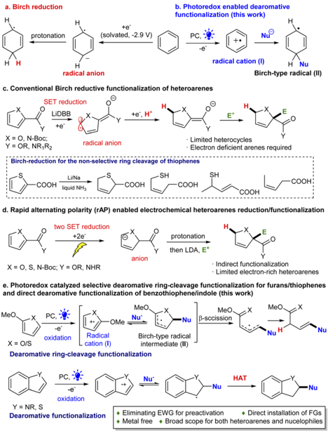
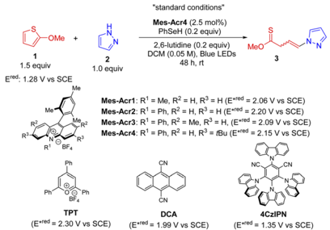
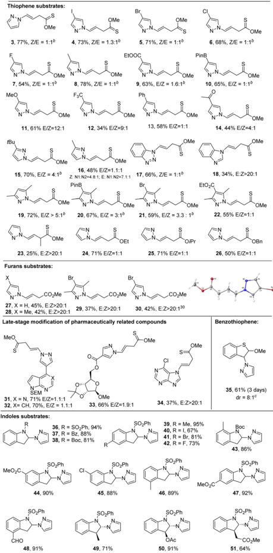
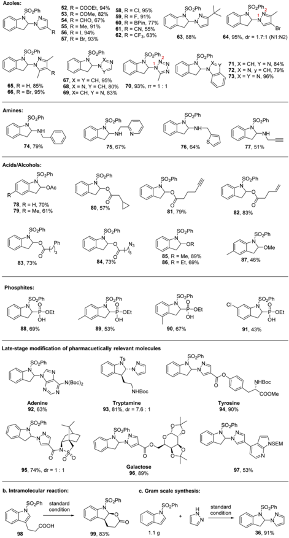
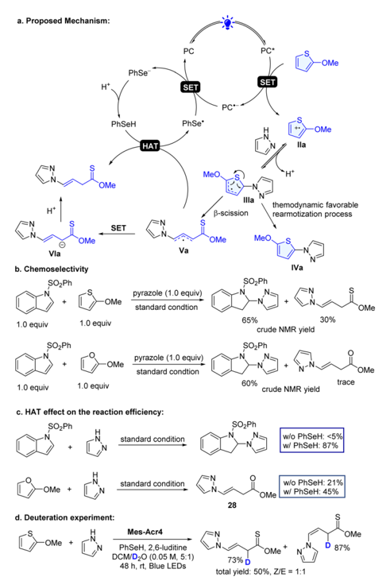

## Chemical Science

## EDGE ARTICLE

Cite this: Chem. Sci. , 2023, 14 , 3332

All publication charges for this article have been paid for by the Royal Society of Chemistry

Received 4th January 2023 Accepted 27th February 2023

DOI: 10.1039/d3sc00060e

rsc.li/chemical-science

## Introduction

Reductive dearomatization, a viable strategy for rapid generation of sp 3 complexity from simple arenes, 1 -3 has been broadly explored in organic synthesis. 4,5 Among them, Birch reduction is a well-established example of such transformations. 2 The process is o  en carried out under harsh reaction conditions since the electron rich nature of aromatic systems makes them di ffi cult to break reductively (Scheme 1a). Recent e ff orts have made the process more practical and safer. Koide developed an elegant scalable protocol employing lithium/ethylenediamine in THF. 6 Moreover, new reduction strategies have been developed using electrochemical and photochemical methods by Baran, 7 König, 8 and Miyake 9 under mild reaction conditions. However, the scope of these methods is still largely limited to non-heteroaromatic hydrocarbon substrates. Very limited success has been observed for dearomatizing heteroarenes

a Department of Pharmacology and Toxicology, R. Ken Coit College of Pharmacy, University of Arizona, USA

b Department of Chemistry and Biochemistry, University of Arizona, USA

c University of Arizona Cancer Centre, University of Arizona, 1703 E. Mabel Street, Tucson, AZ 85721-0207, USA. E-mail: wang@pharmacy.arizona.edu

† Electronic supplementary information (ESI) available. CCDC 2234192. For ESI and crystallographic data in CIF or other electronic format see DOI: https://doi.org/10.1039/d3sc00060e

|

View Article Online View Journal  | View Issue

## Combining photoredox catalysis and hydrogen atom transfer for dearomative functionalization of electron rich heteroarenes †

Peng Ji, Xiang Meng, a a Jing Chen, a Feng Gao, a Hang Xu a and Wei Wang

Reductive dearomatization has been a broadly explored means for rapid generation of sp 3 complexity from simple planar arenes. Breaking the electron rich, stable aromatic systems requires strong reduction conditions. It has been notoriously challenging to dearomatize electron even richer heteroarenes. Herein we report an umpolung strategy enabling dearomatization of such structures under mild conditions. The reversal of the reactivity of these electron rich aromatics via photoredox mediated single electron transfer (SET) oxidation generates electrophilic radical cations, which can react with nucleophiles and break the aromatic structure to form a Birch type radical species. A crucial hydrogen atom transfer (HAT) is successfully engineered into the process to e ffi ciently trap the dearomatic radical and minimize the formation of the overwhelmingly favorable, irreversible aromatization products. Particularly, a noncanonical dearomative ring-cleavage of thiophene/furan through selective C(sp 2 ) -S bond breaking was fi rst discovered. The preparing power of the protocol has been demonstrated for selective dearomatization and functionalization of various electron rich heteroarenes including thiophenes, furans, benzothiophenes and indoles. Furthermore, the process o ff ers an unrivaled capacity for simultaneously introducing C -N/O/P bonds on these structures as exempli fi ed by various ' N ' , ' O ' and ' P ' centered functional moieties with 96 examples.

particularly 5-membered ring systems because of the inherent electron richer nature, metal poisoning e ff ect and ring fragmentation. 10 -14 Donohoe and House reported the  rst example using LiDBB (lithium ditert -butylbiphenyl) to reduce the electron-de  cient furan/pyrroles (Scheme 1c). 15,16 However, for thiophene rings, the Birch-type reaction usually results in a non-selective, dearomative ring cleavage or direct dearomative reduction product (Scheme 1c). 16 Recently, Baran disclosed a rapid alternating polarity (rAP) method enabling the selective reduction of  ve membered ring heteroarenes (Scheme 1d). 17 It is recognized that electron-withdrawing groups (EWGs) ( e.g. , 2carbonyl derived structures) are required for the e ff ective reduction. Moreover, the dearomative functionalization using the Birch reduction has been particularly challenging. It mainly relies on trapping the in situ formed carbanions for alkylations. 6,7,17 Clearly, a strategy which can streamline the dearomatization and simultaneous functionalization of simple heteroarenes can be immediately appreciated by synthetic and medicinal chemists by o ff ering a rapid approach to medicinally valued, heavily functionalized 3-dimensional heterocyclics. 18

Recently we have achieved the selective dearomative functionalization of benzene in polycyclic arenes; 19 however, it is challenging to selectively dearomatize a single ring heteroarene, including thiophene/furan, which represents a long-standing issue. 1 In order to address this issue, we envisioned that integrating photoredox catalysis into hydrogen atom transfer (HAT)

Open Access A

a. Birch reduction

1.5 equiv

Ered. 1.28 V vs SCE

c. Conventional Birch reductive functionalization of heteroarenes

(cc) EY

SET reduction

LiDBB

X = O, N-Boc;

Y = OR, NR,R2

Birch-reduction for the non-selective ring cleavage of thiophenes

Ph

COOH

TPT

(E*red = 2.30 V vs SCE)

PC,

·e oxidation

2

b. Photoredox enabled dearomative

"standard conditions"

functionalization (this work)

PhSeH (0.2 equiv)

Mes-Acr4 (2.5 mol%)

PC, -Q:

Nu

DCM (0.05 M), Blue LEDs

2,6-lutidine (0.2 equiv)

48 h, rt

3

Scheme 1 Reductive dearomatization methods.

could create a new strategy for direct dearomative functionalization of electron-rich heteroarenes (Scheme 1b and e). In light of the electron rich nature of aromatic structures, we conceived that single electron transfer (SET) oxidation of the system by an excited photocatalyst (PC * ) could conveniently generate a radical cation ( I , Scheme 1b and e). 20 The reversed reactivity would make the nucleophilic addition more easy and generated an aromatic radical ( II ), a key species in Birch reduction, which then could undergo direct reduction by PC c -to give an anion. Subsequent protonation would give the functionalized dearomative product. Alternatively, engineering a new hydrogenation process [ e.g. , hydrogen atom transfer (HAT)] could trap the radical ( II ) to directly furnish the functionalized dearomatization product. However, the intrinsic thermodynamic and kinetic favorable aromatization ( e.g. , formation of V ) 21 -27 makes this unprecedented dearomatization particularly di ffi cult. Below, we describe the successful development of a general selective method for the dearomative functionalization of diverse heteroarenes. Moreover, unexpectedly, the dearomative ring-cleavage functionalization of thiophene/furan through selective C(sp 2 ) -S/O bond breaking was discovered for the  rst time. The HAT process is crucial for overcoming the overwhelmingly favourable, irreversible aromatization.

## Results and discussion

Our studies started with the investigation of thiophenes since it has been a challenging target for dearomatization and their

MeO

visible-light induced dearomatization has not been established, 1,28 probably due to the high resonance stabilization (29 kcal mol -1 ). 29 Given the easy oxidation of 2-methoxythiophene ( 1 ) ( E ox : 1.44 V vs. SCE, Fig. S3 † ), we assessed the viability of the proposed dearomative functionalization protocol by reacting it with pyrazole ( 2 ) as a nucleophile in the presence of a photocatalyst (PC, 2.5 mol%) and a HAT agent (20 mol%) under blue LED irradiation (Table 1). A series of organic photocatalysts (entries 1 -7) with oxidation potential larger than 1.44 V were selected for the investigation. Unexpectedly, the commercially available acridinium salts ( Mes-Acr1-4 ) delivered a noncanonical dearomative ring-cleavage product thionoester 3 with two isolable Z / E -isomers (1 : 1 ratio, entries 1 -4) through selective C(sp 2 ) -S/O bond breaking, which is rarely achieved using the traditional ionic method. 16 Mes-Acr4 turned out to be the optimal one. Among 13 di ff erent hydrogen atom donors probed, benzeneselenol was proved to be the best one (entries 1, 8, and 9, and Table S2 † ). The solvent played the vital role in the reaction (Table S3 † ). Importantly, low concentrations improved

Table 1 Reaction condition optimization

|   Entry | Variation from the ' standard conditions a '   | Yield b (%)   |
|---------|------------------------------------------------|---------------|
|       1 | None                                           | 81 (77) c     |
|       2 | Mes-Acr1 instead of Mes-Acr4                   | 50            |
|       3 | Mes-Acr2 instead of Mes-Acr4                   | 42            |
|       4 | Mes-Acr3 instead of Mes-Acr4                   | 58            |
|       5 | TPT instead of Mes-Acr4                        | Trace         |
|       6 | DCA instead of Mes-Acr4                        | Trace         |
|       7 | 4CzIPN instead of Mes-Acr4                     | Trace         |
|       8 | PhSH instead of PhSeH                          | 56            |
|       9 | 4-NO 2 PhSH instead of PhSeH                   | 38            |
|      10 | DCM (0.025 M)                                  | 82            |
|      11 | DCM (0.1 M)                                    | 60            |
|      12 | DCM (0.2 M)                                    | 30            |
|      13 | Without 2,6-lutidine                           | 68            |
|      14 | Without PhSeH                                  | 23            |
|      15 | Without Mes-Acr4                               | Trace         |
|      16 | No light                                       | Trace         |

Open Access A

Thiophene substrates:

3, 77%, Z/E = 1:1°

4, 73%, Z/E = 1.3:1°

5, 71%, Z/E = 1:1°

OMe

6, 68%, Z/E = 1:10

the chemical transformation dramatically (entries 1 and 10 -12). Finally, control experiments (entries 13 -16) indicated that the base, HAT catalyst, and PC are essential for the reactions. It is noted that without a HAT agent, the dearomatization product with 23% yield was obtained (entry 13). This suggests that both pathways (paths a and b, Scheme 1c) are in operation, but the HATpathway is kinetically favored presumably because the HAT can facilitate the process. Taken together, the optimal protocol has been established as follows: a mixture of 2-methoxythiophene (1.5 equiv.) and pyrazole (1.0 equiv.) in the presence of Mes-Acr4 (2.5 mol%), PhSeH (0.2 equiv.), and 2,6-lutidine (0.2 equiv.) in DCM (0.05 M) is under the irradiation of 40 W blue LEDs for 48 h giving the best reaction e ffi cacy (77% yield, entry 1). OBn

(cc) EY

Having established the optimal reactions conditions, we explored the scope of the process with various heteroarenes including thiophenes, furans, benzothiophenes, and indoles (Scheme 2). The dearomative ring-cleavage functionalization of thiophenes using diverse pyrazoles was  rst investigated. Both electron donating and withdrawing groups are tolerated under the mild reaction conditions with moderate to good yield. They include iodide ( 4 , 73%), bromide ( 5 , 71%), chloride ( 6 , 68%),  uoride ( 7 , 54%), methyl ( 8 , 78%; 16 , 48%), tert -butyl ( 15 , 70%), ester ( 9 , 63%), boronic acid ( 10 , 65%), methoxy ( 11 , 61%), tri- uoromethyl ( 12 , 34%), phenyl ( 13 , 58), ketone (14, 44%), disubstituted ( 19 , 72%), trisubstituted ( 20 , 67%; 21 , 59%; 22 , 55%), benzotriazole ( 17 , 66%) and benzimidazole ( 18 , 34%). Notably, boronic acid ( 10 ) can serve as a viable handle for cross coupling reactions in further synthetic elaboration. It appears that the Z/ E selectivity is a ff ected by the steric hindrance. A relatively high rr (&gt;3 : 1) is observed with congested pyrazoles ( 15 and 19 -21 ). In addition to monosubstituted thiophene, 2methoxy, 3-methylthiophene ( 23 , 25%) could also be dearomatized with reasonable yield. Notably exclusive E -con  guration was formed in 23 . Although low Z / E -selectivity was observed with thiophenes, 2-methoxyfuran ( 27 -30 ) worked smoothly and delivered single Z -conformation. 30 The simple 2-methoxythiophene could undergo the late-stage modi  cation of complex molecules including pharmaceutically related heteroarenes ( 31 , 71%; 32 , 70%), ribose ( 33 , 66%), and purine ( 34 , 37%). As to polycyclic heteroarenes, benzothiophene ( 35 ) could selectively undergo dearomative non-cleavage hydroamination in the  ve-member ring at the 3-position, yielding 61% product with trans : cis = 8 : 1. Similarly, the simple indoles could selectively be dearomatized in the 2-position of the  ve member ring. Among three protecting groups ( 36 -38 ), the sulfonamide delivered an excellent yield (94%). Diverse functional groups in the phenyl ring of indoles could be tolerated, such as methyl ( 39 , 95%; 43 , 86%; 46 , 89%), halogens ( 40 -42 , 67 -81%), ester ( 44 , 92%), and aldehyde ( 48 , 91%). Additionally, trans -products ( 49 , 71%, 50 , 91% and 51 , 64%) were produced with 3substituted indoles in high yields.

Visible light-mediated photochemical dearomatization of indoles has been reported recently. 31 These methods are limited to intramolecular and [4 + 2]/[2 + 2] cycloaddition processes. 32 -44 In contrast, intermolecular dearomative functionalization remains underexplored. 45 -47 Herein, we found that the

|

Scheme 2 Scope of heteroarenes. a Reaction conditions, unless speci fi ed, see Table 1, entry 1 and ESI. † Yields are isolated yields. b E / Z ratio was determined by crude 1 H NMR. c Diastereoselectivity (dr) was determined by 1 H NMR.

intermolecular photoredox catalyzed dearomatization strategy shows a broader scope with a wide array of nucleophiles including amines, various azoles, carboxylates, alcohols, and phosphites. As shown in Scheme 3, a number of functional groups tethered to pyrazoles can be tolerated including ester ( 52 , 94%), ketone ( 53 , 82%), aldehyde ( 54 , 67%), methyl ( 55 , 91%), halogen ( 56 -59 , 91 -95%), boronic acid ( 60 , 77%), nitrile ( 61 , 55%), tri  uoromethyl ( 62 , 63%), t -butyl ( 63 , 88%), disubstituted ( 64 , 95%; 65 , 85%), and trisubstituted ( 66 , 95%). Aside from pyrazoles, other common azoles, including imidazole ( 67 , 95%), 1,2,3-triazole ( 68 , 80%), 1,2,4-triazole ( 69 , 83%), tetrazole ( 70 , 93%), benzoimidazole ( 71 , 84%), indazole ( 72 , 79%), and

Open Access A

Azoles:

a. Proposed Mechanism:

52, R = COOEt, 94%

53, R = COMe, 82%

56, R = 1, 94%

57, R = Br, 93%

PhSe

SO\_Ph

(cc) EY

SO\_Ph

65, R = H, 85%

66, R = Br, 95%

Amines:

SO\_Ph

74, 79%

Acids/Alcohols:

Tomo

Vla

S02Ph

+

+

SO\_Ph

- N

&gt;P-OEt

OH

SO\_Ph

88, 69%

+

50,Ph

Adenine

92, 63%

-OMe

,SO\_Ph

95, 74%, dr = 1: 1

SO\_Ph standard

COOH

Scheme 3 Scope of nucleophiles. Reaction conditions, unless speci fi ed, see Table 1, entry 1 and ESI. † Yields are isolated yields.

benzotriazole ( 73 , 96%), are also amenable in good to excellent yield. Amines such as benzylamine ( 74 , 79%), 2-picolylamine ( 75 , 67%), 2-aminomethyl)thiophene ( 76 , 64%), and propargylamine ( 77 , 51%) are also viable nucleophiles for direct functional dearomatization. Furthermore, remarkably, the less nucleophilic O-nucleophiles including carboxylic acids ( 78 -84 ) and alcohols ( 85 -87 ) could also work smoothly. These transformations are compatible with a number of functional groups such as cyclopropyl ( 80 , 57%), alkyne ( 81 , 79%), alkene ( 82 , 83%), phenyl ( 83 , 73%), azide ( 84 , 73%), methanol ( 85 , 89%; 87 , 46%), and ethanol ( 86 , 69%). Moreover, triethyl phosphite ( 88 -91 ) was a validated nucleophilic agent, giving 2,3-dihydro-1 H -indol-2-ylphosphonic acid in good yields (75 -78%). The mild reaction conditions also enabled the late-stage modi  cation of pharmaceutically relevant molecules such as aldenine ( 92 ,

R

58, R = CI, 95%

59, R = F, 91%

60, R = BPin, 77%

61, R = CN, 55%

62, R = CF3, 63%

PC

SO\_Ph

PC

63, 88%

SO\_Ph

Br

64, 95%, dr = 1.7:1 (N1:N2)

-OMe

63%), tryptamine ( 93 , 81%), tyrosine ( 94 , 90%), Oppolzer's camphorsultam ( 95 , 74%), galactose ( 96 , 89%), and 4-(1 H -pyrazol-4-yl)-7 H -pyrrolo[2,3d ]pyrimidine ( 97 , 53%). In addition to intermolecular dearomatization, the intramolecular reaction could also work e ffi ciently under the standard conditions, delivering the cyclized product ( 99 , 83%, Scheme 3b). The reaction can be scaled up without loss of yield (Scheme 3c). These results clearly demonstrate the mildness, high regioselectivity, and broad generality of the newly developed synthetic manifold.

In the photoredox dearomative functionalization reaction, one of the important steps is the selective SET oxidation of heteroarenes. Although visible light mediated SET oxidation of arenes including indoles in organic transformations has been reported, 21 -27,31,48 -56 this study represents the  rst example of oxidation of thiophenes, furans and benzothiophenes. The excited state PC + * Mes-Acr4 * possesses strong oxidizing power ( E red * = 2.15 V) 57 and can oxidize these substrates (2-methoxythiophene: E ox = 1.44 V; 2-methoxyfuran: E ox = 1.28 V, and N -SO2Ph indole: E ox = 1.90 V vs. SCE, Fig. S1 -S3 † ) in principle (Scheme 4a using 2-methoxythiophene as an illustration example). We found that although the indole had high

Scheme 4 Proposed mechanism and designed experiments for mechanistic studies.

oxidation potential, the reaction occurred with it favorably in the mixture of indole and 2-methoxythiophene (Scheme 4b). A similar trend was observed with 2-methoxyfuran. Furans and thiophenes have higher resonance stabilization than indoles. 29

Additional energy is needed to cleave the heteroarene ring bond, which was usually achieved via transitional-metalcatalyzed C -S insertion. 58 These factors may pose a challenge for dearomative ring-opening functionalization of simple thiophenes and furans with photoredox catalysis. The electrophilic radical cation IIa reacts with pyrazole followed by subsequent deprotonation to form the radical IIIa (Scheme 4a), which readily undergoes the ring-opening b -scission and generate radical Va . The radical Va can abstract a hydrogen atom from PhSeH or undergoes the SET process, providing a non-classic dearomative ring-cleavage product. On the other hand, the radical IIIa can undergo thermodynamically favorable rearomatization 20 -27 to give functionalized aromatic product IVa . However, the application of the photoredox C -H functionalization of these heteroarenes has not been reported. In our e ff ort, we further challenged the chemistry by redirecting to an overwhelmingly unfavorable dearomatized product. We found that the incorporation of a new HAT process can significantly inhibit the aromatized process and facilitate the dearomative product (Table 1, entries 1 and 14). The HAT agents are crucial for the process. Without it, only a small amount of product was formed (entry 14 in Table 1). In addition, the choice of HAT agents is also important. Selenol with a higher H-atom transfer rate ( K 20 = 1.3 × 10 9 M -1 s -1 vs. PhSH: K 20 = 9.0 × 10 7 M -1 s -1 ) 59 -61 gives the desired product in a better yield (entries 8 and 14 in Table 1). Furthermore, control experiments further validated the vital role of the HAT agent. In the absence of PhSeH, the standard conditions failed to deliver the dearomatized indole product (Scheme 4c). The lack of the HAT agent also signi  cantly compromises the reaction e ffi cacy in the reaction of 2-methoxyfuran. Finally, the deuteration experiment consolidates the HAT process engaged in the reaction (Scheme 4d). Taken together, these studies showed that the HAT is an important factor contributing to the success of the new dearomatization process.

## Conclusions

In summary, we have developed a conceptually di ff erent approach for the dearomatization of challenging electron rich heteroarenes. Distinct from the widely used reductive dearomatization methods, we have combined photoredox catalysis and HAT chemistry for dearomatization and simultaneous functionalization of heteroarenes. Moreover, the success of the transformation relies on implementing a HAT, which directs towards dearomatization rather than the thermo-dynamically favorable aromatization. Especially, we  rst discovered the photoredox catalyzed dearomative ring-cleavage functionalization of thiophenes and furans. The mild protocol enables broad substrate scope of heteroarenes such as thiophenes, furans, benzothiophenes, and indoles and nucleophiles including pharmaceutically valued azoles, amines, carboxylic acids, alcohols, and phosphites amenable to the process and the late-stage

|

modi  cation of pharmaceutically valued molecules. It is expected that high e ffi ciency of this methodology will be appreciated by organic chemists and medicinal chemists to rapidly access a library of heavily functionalized, biologically valued heterocycles.

## Author contributions

P. J., X. M., J. C., F. G., and H. X. conducted and analyzed the synthetic experiments. W. W. planned, designed and directed the project. P. J. and W. W. wrote the manuscript.

## Confl icts of interest

There are no con  icts to declare.

## Acknowledgements

W. W. acknowledges the NIH (5R01GM125920) and University of Arizona for  nancial support and the NSF MRI for acquisition of the 500 MHz NMR spectrometer (1920234) and single-crystal X-ray di ff ractometer (CHE-2117516).

## Notes and references

- 1 C. J. Huck and D. Sarlah, Chem , 2020, 6 , 1589.
- 2 A. J. Birch, Pure Appl. Chem. , 1996, 68 , 553.
- 3 L. Shi and Y.-G. Zhou, Org. React. , 2018, 95 , 1.
- 4 S. P. Roche and J. A. Porco, Angew. Chem., Int. Ed. , 2011, 50 , 4068.
- 5 J. M. Hook and L. N. Mander, Nat. Prod. Rep. , 1986, 3 , 35.
- 6 J. Burrows, S. Kamo and K. Koide, Science , 2021, 374 , 741.
- 7 B. K. Peters, K. X. Rodriguez, S. H. Reisberg, S. B. Beil, D. P. Hickey, Y. Kawamata, M. Collins, J. Starr, L. Chen, S. Udyavara, K. Klunder, T. J. Gorey, S. L. Anderson,
- M. Neurock, S. D. Minteer and P. S. Baran, Science , 2019, 363 , 838.
- 8 A. Chatterjee and B. König, Angew. Chem., Int. Ed. , 2019, 58 , 14289.
- 9 J. P. Cole, D.-F. Chen, M. Kudisch, R. M. Pearson, C.-H. Lim and G. M. Miyake, J. Am. Chem. Soc. , 2020, 142 , 13573.
- 10 T. J. Donohoe and R. E. Thomas, Chem. Rec. , 2007, 7 , 180.
- 11 W. G. Blenderman, M. M. Joulli´ e and G. Preti, Tetrahedron Lett. , 1979, 20 , 4985.
- 12 H.-J. Altenbach, D. J. Brauer and G. F. Merhof, Tetrahedron , 1997, 53 , 6019.
- 13 T. Kumamoto, K. Hosoya, S. Kanzaki and K. Masuko, Bull. Chem. Soc. Jpn. , 1986, 59 , 3097.
- 14 P. Lei, Y. Ding, X. Zhang, A. Adijiang, H. Li, Y. Ling and J. An, Org. Lett. , 2018, 20 , 3439.
- 15 T. J. Donohoe and D. House, J. Org. Chem. , 2002, 67 , 5015.
- 16 W. G. Blenderman and M. M. Joullie, Tetrahedron Lett. , 1979, 52 , 4985 -4988.
- 17 K. Hayashi, J. Gri ffi n, K. C. Harper, Y. Kawamata and P. S. Baran, J. Am. Chem. Soc. , 2022, 144 , 5762.

- 18 An example of an organocatalyzed dearomatization of thiophenes:X. Li, M. Duan, P. Yu, K. N. Houk and J. Sun, Nat. Commun. , 2021, 12 , 4881.
- 19 P. Ji, C. C. Davies, F. Gao, J. Chen, X. Meng, K. N. Houk, S. Chen and W. Wang, Nat. Commun. , 2022, 13 , 4565.
- 20 N. A. Romero, K. A. Margrey, N. E. Tay and D. A. Nicewicz, Science , 2015, 349 , 1326.
- 21 K. Targos, O. P. Williams and Z. K. Wickens, J. Am. Chem. Soc. , 2021, 143 , 4125.
- 22 C. Song, H. Yi, B. Dou, Y. Li, A. K. Singh and A. Lei, Chem. Commun. , 2017, 53 , 3689.
- 23 K. A. Margrey, J. B. McManus, S. Bonazzi, F. Zecri and D. A. Nicewicz, J. Am. Chem. Soc. , 2017, 139 , 11288.
- 24 J. B. McManus and D. A. Nicewicz, J. Am. Chem. Soc. , 2017, 139 , 2880.
- 25 K. A. Margrey, A. Levens and D. A. Nicewicz, Angew. Chem., Int. Ed. , 2017, 56 , 15644.
- 26 H. Huang, Z. M. Strater, M. Rauch, J. Shee, T. J. Sisto, C. Nuckolls and T. H. Lambert, Angew. Chem., Int. Ed. , 2019, 58 , 13318.
- 27 L. Zhang, L. Liardet, J. Luo, D. Ren, M. Gr¨ atzel and X. Hu, Nat. Catal. , 2019, 2 , 366.
- 28 Y.-Z. Cheng, Z. Feng, X. Zhang and S.-L. You, Chem. Soc. Rev. , 2022, 51 , 2145.
- 29 W. C. Wertjes, E. H. Southgate and D. Sarlah, Chem. Soc. Rev. , 2018, 47 , 7996.
- 30 CCDC-2234192 contains the supplementary crystallographic data for this paper. These data can be obtained free of charge via https://www.ccdc.cam.ac.uk . † .
- 31 S. P. Roche, J.-J. Y. Tendoung and B. Tr´ eguier, Tetrahedron , 2015, 71 , 3549.
- 32 E. C. Gentry, L. J. Rono, M. E. Hale, R. Matsuura and R. R. Knowles, J. Am. Chem. Soc. , 2018, 140 , 3394.
- 33 J. An, Y.-Q. Zou, Q.-Q. Yang, Q. Wang and W.-J. Xiao, Adv. Synth. Catal. , 2013, 355 , 1483.
- 34 K. Wu, Y. Du and T. Wang, Org. Lett. , 2017, 19 , 5669.
- 35 S. Muhmel, D. Alpers, F. Ho ff mann and M. Brasholz, Chem. -Eur. J. , 2015, 21 , 12308.
- 36 M. Zhu, C. Zheng, X. Zhang and S.-L. You, J. Am. Chem. Soc. , 2019, 141 , 2636.
- 37 K. Wu, Y. Du, Z. Wei and T. Wang, Chem. Commun. , 2018, 54 , 7443.
- 38 D. Alpers, M. Gallhof, J. Witt, F. Ho ff mann and M. A. Brasholz, Angew. Chem., Int. Ed. , 2017, 56 , 1402.
- 39 J. Ma, F. Sch¨ afers, C. Daniliuc, K. Bergander, C. A. Strassert and F. Glorius, Angew. Chem., Int. Ed. , 2020, 59 , 9639.
- 40 E. C. Gentry, L. J. Rono, M. E. Hale, R. Matsuura and R. R. Knowles, J. Am. Chem. Soc. , 2018, 140 , 3394.
- 41 K. Liang, X. Tong, T. Li, B. Shi, H. Wang, P. Yan and C. Xia, J. Org. Chem. , 2018, 83 , 10948.
- 42 M. Zhang, Y. Duan, W. Li, Y. Cheng and C. Zhu, Chem. Commun. , 2016, 52 , 4761.
- 43 S. Muhmel, D. Alpers, F. Ho ff mann and M. Brasholz, Chem. -Eur. J. , 2015, 21 , 12308.
- 44 M. S. Oderinde, E. Mao, A. Ramirez, J. Pawluczyk, C. Jorge, L. A. M. Cornelius, J. Kempson, M. Vetrichelvan, M. Pitchai, A. Gupta, A. K. Gupta, N. A. Meanwell, A. Mathur and T. G. M. Dhar, J. Am. Chem. Soc. , 2020, 142 , 3094.
- 45 We developed intermolecular photoredox dearomative functionalization of indoles:Y. Zhang, P. Ji, F. Gao, H. Huang, F. Zeng and W. Wang, ACS Catal. , 2021, 11 , 998, and ref 42 .
- 46 Y. Zhang, P. Ji, F. Gao, Y. Dong, H. Huang, C. Wang, Z. Zhou and W. Wang, Commun. Chem. , 2021, 4 , 20.
- 47 T. Varlet, D. Bouchet, E. V. Elslande and G. Masson, Chem. -Eur. J. , 2022, 28 , e202201707.
- 48 L. Zheng, K. Tao and W. Gu, Adv. Synth. Catal. , 2021, 363 , 62.
- 49 A. A. Festa, L. G. Voskressensky and E. V. Van der Eycken, Chem. Soc. Rev. , 2019, 48 , 4401.
- 50 X. Liu, X. Yan, Y. Tang, C. S. Jiang, J. H. Yu, K. Wang and H. Zhang, Chem. Commun. , 2019, 55 , 6535.
- 51 Q. Wang, Y. Qu, Y. Liu, H. Song and Q. Wang, Adv. Synth. Catal. , 2019, 361 , 4739.
- 52 H. E. Ho, A. Pagano, J. A. Rossi-Ashton, J. R. Donald, R. G. Epton, J. C. Churchill, M. J. James, P. O'Brien, R. J. K. Taylor and W. P. Unsworth, Chem. Sci. , 2020, 11 , 1353.
- 53 L. Wu, Y. Hao, Y. Liu, H. Song and Q. Wang, Chem. Commun. , 2020, 56 , 8436 -8439.
- 54 C. L. Dong, X. Ding, L. Q. Huang, Y. H. He and Z. Guan, Org. Lett. , 2020, 22 , 1076.
- 55 D. Cao, P. Pan, C.-J. Li and H. Zeng, Green Synth. Catal. , 2021, 2 , 303.
- 56 M. Zhu, C. Zheng, X. Zhang and S.-L. You, J. Am. Chem. Soc. , 2019, 141 , 2636.
- 57 A. Joshi-Pangu, F. Levesque, H. G. Roth, S. F. Oliver, L.-C. Campeau, D. Nicewicz and D. A. DiRocco, J. Org. Chem. , 2016, 81 , 7244.
- 58 K. M. K. Dailey, T. B. Rauchfuss, A. L. Rheingold and G. P. A. Yap, J. Am. Chem. Soc. , 1995, 117 , 6396.
- 59 M. Newcomb, S.-Y. Choi and J. H. Horner, J. Org. Chem. , 1999, 64 , 1225.
- 60 M. Newcomb, T. R. Varick, C. Ha, M. B. Manek and X. Yue, J. Am. Chem. Soc. , 1992, 114 , 8158.
- 61 J. M. Mayer, Acc. Chem. Res. , 2011, 44 , 36.