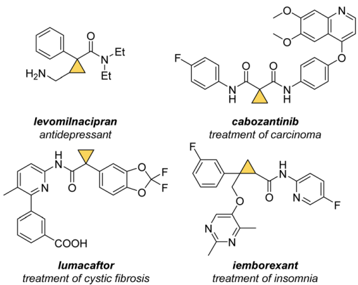
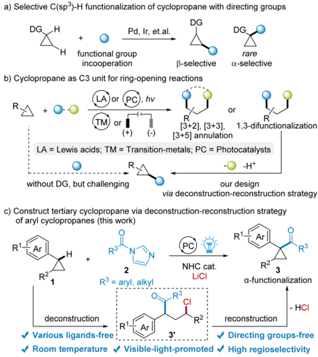
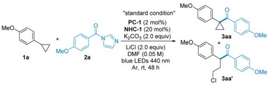
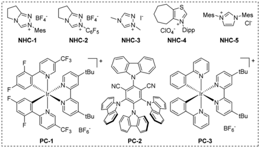
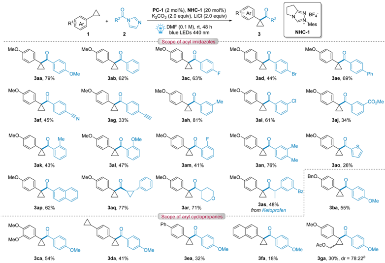
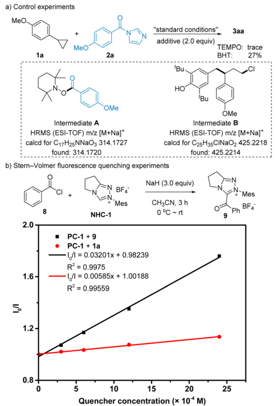
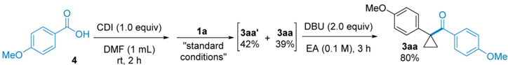
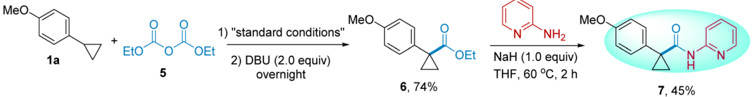
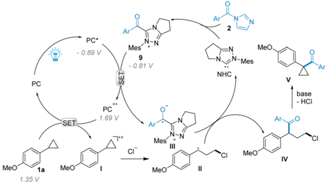

a) Selective C(sp)-H functionalization of cyclopropane with directing groups

DG.

DG

B-selective cabozantinib

## Chemical Science

LAJor (PC). hv

-

DG.

rare a-selective

or

## EDGE ARTICLE

1,3-difunctionalization

LA = Lewis acids; TM = Transition-metals; PC = Photocatalysts

COOH

R

iemborexant without DG, but challenging treatment of insomnia

Cite this: Chem. Sci. , 2025, 16 , 323

R3 = aryl, alkyl

All publication charges for this article have been paid for by the Royal Society of Chemistry 2 NHC cat. LiCI

R3

deconstruction

Received 19th September 2024 Accepted 21st November 2024

DOI: 10.1039/d4sc06355d

rsc.li/chemical-science

-H+

## Cooperative photoredox and N-heterocyclic carbene-catalyzed formal C -H acylation of cyclopropanes via a deconstruction -reconstruction strategy †

a-functionalization

Fan Gao,

Tian Wang and Xiaoyu Yan

*

- HCI

Cyclopropanes are ubiquitous and key structural motifs in commercially available drugs and bioactive molecules. Herein, we present regio-selective acylation of aryl cyclopropanes with cooperative photoredox and N-heterocyclic carbene catalysis. This approach involves a deconstruction -reconstruction strategy via g -chloro-ketones as intermediates and ful fi lls the formal C(sp 3 ) -H functionalization of cyclopropanes.

Cyclopropanes, as strained cycloalkanes, have gained signi  -cant attention due to their ubiquitous and key structural motif in commercially available pharmaceutical candidates and drugs as well as their promising bioactivities (Scheme 1). 1 Additionally, compared with gem -dimethyl, isopropyl and phenyl groups, cyclopropane derivatives exhibit enhanced metabolic stability and reduced lipophilicity because of their structural characteristics involving high coplanarity of the ring-carbon atoms, enhanced p -character, relatively shorter C -C bonds, and shorter and stronger C -H bonds. 2 However, the functionalization of strained cyclopropane frameworks represents an important challenge for chemical synthesis.

Scheme 1 Selected application examples of bioactive cyclopropane.

Key Laboratory of Advanced Light Conversion Materials and Biophotonics School of Chemistry and Life Resources, Renmin University of China, Beijing, 100872, China. E-mail: yanxy@ruc.edu.cn

† Electronic supplementary information (ESI) available. See DOI: https://doi.org/10.1039/d4sc06355d

Direct C(sp 3 ) -H functionalization of strain cyclopropane frameworks has been recognized as an economic and simple strategy to access various cyclopropane sca ff olds. Yu, Gaunt, Xu and others have reported powerful strategies to synthesize monofunctionalized cyclopropane derivatives 3 via the coordination interaction of transition-metals (Pd or Ir) and various directing groups (DGs) such as carboxylic acids, 3 f primary amines, 3 g N -aryl carboxamides, 3 i N -tri  amides, 3 e N -aryl-aminomethyl, 3 h carboxamide, 3 c , d and ether 3 j (Scheme 2a).

Scheme 2 Functionalization of strained cyclopropanes.

Open Access A

View Article Online View Journal  | View Issue

Instead OI DMF (0.05 M)

MeO

NHC-1

1a

(oc) BY-NO

F

+

MeO

"standard condition"

CIO4 Dipp

NHC-4

KaCO, (2.0 equiv). Meo

Mes-N

N-Mes

Заа

'OMe

NHC-2

NHC-3

NHC-5

Those available protocols show good regioselectivity, introducing various functional groups to the b -position of DGs, while few directed C(sp 3 ) -H functionalized examples at the a -position 3 l have been achieved. Besides requiring tedious processes to introduce appropriate directing groups (DGs) and costly transition-metals as catalysts, those aforesaid methodologies usually require harsh reaction conditions, like heating to keep high regio- and stereoselectivity.

Due to their high ring strain energies ( ca. 27.5 kcal mol -1 ), cyclopropane derivatives easily undergo deconstruction of the coplanarity ring, and have been identi  ed as versatile and powerful C3 units in synthesis. Diverse strategies catalyzed by Lewis acids, 4 transition-metals (Rh, Ni, Pd, Fe), 5 visible light 6 and electricity 7 have been developed to produce [3 + n ]

Table 1 Reaction optimization a

Open Access A

annulation products (Scheme 2b). Meanwhile, 1,3-difunctionalization of cyclopropanes has also been achieved, generating acyclic products with introduction of two distinct functional groups. 8 We envisioned that, with suitable functional groups as leaving groups, 1,3-elimination reactions are viable, which will reconstruct the cyclopropane skeleton. The two-step strategy of deconstructive 1,3-difunctionalization and 1,3-elimination would ful  ll the formal C(sp 3 ) -H functionalization of cyclopropanes and avoid the preinstallation of directing groups. With the rapid development of radical N-heterocyclic carbene (NHC) catalysis 9 and our contribution in this area, 9,10 herein, we disclose a cooperative NHC and photoredox 9 h ,11 catalyzed acylation of aryl cyclopropanes, which involves formal C -H functionalization that has been achieved via a deconstruction -

|   Entry | Variation from ' standard conditions '                 | Yield b 3aa [%]   |   Yield b 3aa 0 [%] |
|---------|--------------------------------------------------------|-------------------|---------------------|
|       1 | None                                                   | 78                |                   0 |
|       2 | K 2 CO 3 (0.2 equiv.) instead of K 2 CO 3 (2.0 equiv.) | 50                |                  26 |
|       3 | NHC-2 instead of NHC-1                                 | 11                |                  12 |
|       4 | NHC-3 instead of NHC-1                                 | 8                 |                  26 |
|       5 | NHC-4 instead of NHC-1                                 | 24                |                   0 |
|       6 | NHC-5 instead of NHC-1                                 | 0                 |                   0 |
|       7 | PC-2 (5 mol%) instead of PC-1                          | 32                |                   0 |
|       8 | PC-3 instead of PC-1                                   | 11                |                   0 |
|       9 | MeCN instead of DMF                                    | 21                |                  20 |
|      10 | DMSO instead of DMF                                    | 42                |                   0 |
|      11 | Cs 2 CO 3 instead of K 2 CO 3                          | 57                |                   0 |
|      12 | K 3 PO 4 instead of K 2 CO 3                           | 29                |                  22 |
|      13 | Na 2 CO 3 instead of K 2 CO 3                          | 37                |                   0 |
|      14 | Me 4 NCl instead of LiCl                               | 50                |                   0 |
|      15 | KCl instead of LiCl                                    | 15                |                   0 |
|      16 | Without NHC-1                                          | 0                 |                   0 |
|      17 | Without PC-1                                           | 0                 |                   0 |
|      18 | In the dark                                            | 0                 |                   0 |
|      19 | DMF (0.1 M) instead of DMF (0.05 M)                    | 85(79) c          |                   0 |

|

Open Access A

MeO

(oc) BY-NO

PC-1 (2 mol%), NHC-1 (20 mol%)

K2CO3 (2.0 equiv), LiCI (2.0 equiv)

: DMF (0.1 M), rt, 48 h blue LEDs 440 nm

3

reconstruction strategy with g -chloro-ketones as intermediates. Either aromatic or aliphatic acyl groups can be selectively introduced to the a -position of aryl groups. Meanwhile, this method could be extended to esteri  cation of cyclopropanes with carbonate esters. MeO Meo

Studer's group has achieved the 1,3-difunctionalization of aryl cyclopropanes catalyzed by a cooperative NHC and organophotoredox catalyst, generating various g -aroyloxy ketones. 11 d To facilitate reconstruction of cyclopropanes, we used acyl imidazole as the acyl source to avoid introducing the poorleaving ester group. Hence, we  rst started our investigation by using 1-anisoylcyclopropane ( 1a ) and N -anisoylimidazole ( 2a ) as the model substrates in the presence of the triazolium-type NHC-1 as the organo-catalyst, [Ir(dF(CF3)ppy)2(dtbbpy)]PF6 ( PC-1 ) as the photocatalyst, LiCl as an additive, K2CO3 as the base and anhydrous DMF as the solvent at room temperature under an Ar atmosphere and the irradiation of 20 W blue LEDs. A  er 48 h of reaction, the desired tertiary cyclopropane product 3aa was obtained in 78% yield (Table 1, entry 1). When we reduced 2.0 equivalents of K2CO3 to 0.2 equivalents, a 50% yield of 3aa was obtained, accompanied by the 1,3-difunctionalization product 3aa 0 in 26% yield (entry 2). This indicates that product 3aa 0 was transformed into product 3aa a  er increasing the equivalent of base and that product 3aa 0 was the key intermediate. Screening di ff erent organo-catalysts (entries 3 -6) showed that the yields of 3aa decreased with other NHCs. Other photocatalysts (entries 7 and 8) like 4CzIPN also showed

Table 2 Scope of substrates acyl imidazoles and aryl cyclopropanes a

R

R?

N BF4

=N Mes

NHC-1

decreased yields. Lower yields were obtained in CH3CN and DMSO (entries 9 and 10). Subsequently, several bases and additives were explored (entries 11 -15), and the results showed that LiCl and K2CO3 were the most suitable additive and base in this reaction system. Control experiments indicated that the NHC catalyst, photocatalyst and visible light were critical for this reaction (entries 16 -18). Finally, a higher concentration for substrates gave a better yield of 85% (entry 19).

With the optimized reaction conditions in hand, we explored a series of acyl imidazoles 2 (Table 2). Benzoyl imidazoles with di ff erent substituents bearing electron-donating or electronwithdrawing groups at the para -or meta -position proceeded smoothly to a ff ord the desired tertiary cyclopropanes 3aa -3aj in moderate to good yields (33 -81%). In general, higher yields were obtained for benzoyl imidazoles with electron-donating groups while lower yields were obtained for benzoyl imidazoles with strong electron-withdrawing groups. A low yield was obtained for 3ad , which is due to dehalogenation. For benzoyl imidazoles with ortho -substituents, corresponding products were obtained in 41 -47% yields due to the e ff ect of steric hindrance. Di ff erent aromatic substituted acyl imidazoles like 2-thienyl and 2-naphthyl were also found to be suitable in this reaction, a ff ording corresponding products 3ao and 3ap in 26% and 62% yields, respectively. We speculate that the oxidation of thienyl under reaction conditions results in the low yield for 3ao . NHC-catalyzed radical acylations were usually limited to aryl acyl substrates, while aliphatic substrates were

a) Control experiments

MeO

MeO

MeO

(oc) BY-NO

1a

1a

Open Access A

OEt

MeO

1a

"standard conditions",

Зaa'

"standard

+

Заа

Заа

42%

MeO.

DBU (2.0 equiv)

OEt challenged. 11 e Gratifyingly, we found that aliphatic acyl imidazoles could also react smoothly with cyclopropane 1a , leading to the formation of desired products 3aq -3ar in high yields (71 -77%). To demonstrate the high functional group tolerance and broad substrate scope of acyl imidazoles, late-stage functionalization of a bioactive molecule derived from ketoprofen was explored, generating the corresponding a -acylated cyclopropane derivative 3as in moderate yield (48%). MeO

additive (2.0 equiv)

TEMPO: trace

DMF (1 mL)

39%

MeO

NH2

EA (0.1 M), 3 h

2) DBU (2.0 equiv)

The scope of aryl cyclopropanes was also investigated (Table 2). For aryl cyclopropanes bearing various substituents at the para -positions of the aryl moiety such as benzyloxy, disubstituted methoxy, cyclopropyl and phenyl, the corresponding products 3ba -3ea were obtained in moderate yields (32 -55%). Notably, it could selectively a ff ord mono-acylated cyclopropane derivatives 3da from a substrate bearing two cyclopropyl groups at 1,4-positions of the benzene ring. A low yield was obtained for 3fa , which is due to acylation at the naphthalene ring. 12 Finally, to address the limitation of regioselectivity and diastereoselectivity, an unsymmetric cyclopropane, 1-ethoxy-2phenylcyclopropane was explored to produce 3ga in 30% yield, showing excellent regioselectivity albeit moderate diastereoselectivity (dr = 78 : 22).

To demonstrate the ease and practicality of this method, a ' one-pot, two-step ' process was performed starting from carboxylic acid 4 , generating 3aa in 80% yield (compared to 79% when starting from N -anisoylimidazole 2a ) (Scheme 3). NHCcatalyzed radical esteri  cation reactions have been developed recently. 11 g We also extended this deconstruction -reconstruction strategy for the formal esteri  cation of cyclopropanes. With diethyl dicarbonate 5 as the esteri  cation reagent, 1a was converted to a -esteri  ed cyclopropanes 6 in 74% yield. Furthermore, 6 can be easily converted to amide product 7 , which has the skeleton of lumaca  or (Scheme 4).

To gain a deep insight into the mechanism for this transformation, several control experiments were subsequently conducted. Initially, radical scavengers (2,2,6,6tetramethylpiperidin-1-yl)oxidanyl (TEMPO) and 2,6-ditert -butyl-4-methylphenol (BHT) were employed respectively, which clearly inhibited the reaction (Scheme 5a). These results indicated that a radical process might be involved. Moreover, the intermediates A and B were successfully detected by high-

Заа

NaH (1.0 equiv)

resolution mass spectrometry (HRMS), implying that the NHC-derived ketyl radical and alkyl radical were generated in this transformation. Subsequently, Stern -Volmer  uorescence quenching experiments were carried out (for details see ESI † ). As shown in Scheme 5b, the obvious linear relationships and di ff erent slopes between the  uorescence intensities and the concentrations of 1a and 9 suggested that the excited photocatalyst was more favorable to be quenched by acyl azolium 9 .

Scheme 5 Control experiments and linear relationship between I 0/ I and the concentration of 1a and 9 .

Scheme 3 ' One-pot, two-step ' acylation reaction from carboxylic acid.

Scheme 4 Esteri fi cation of cyclopropane 1a and further transformation.

Open Access A

(oc) BY-NO

PC

1a

PC*

- 0.89 V

Mes'

MeO

Scheme 6 Plausible reaction mechanism.

Based on these results of control experiments and previous investigations, we proposed the following mechanism (Scheme 6). The excited photocatalyst [Ir(dF(CF3)ppy)2(dtbbpy)]PF6 ( PC * ) ( E ox = -0.89 V vs. SCE) 13 was oxidatively quenched by acyl azolium 9 ( E 1/2 = -0.81 V vs. SCE) 14 to generate NHC-derived ketyl radical intermediate III and PC c + . Then, the substrate 1a ( E 1/2 = + 1.35 V vs. SCE) was oxidized by PC c + ( E PC c + /PC = + 1.69 V vs. SCE) to regenerate ground photocatalyst PC and intermediate I . Subsequently, chloride ions reacted with intermediate I to produce alkyl radical intermediate II , which coupled with the NHC-derived ketyl radical intermediate III to produce g -chloroketones as intermediates IV . Finally, the targeted product V was a ff orded via nucleophilic substitution in the presence of a base.

## Conclusions

Directed C(sp 3 ) -H functionalization of strained cyclopropanes usually requires the coordination of transition-metals (Pd or Ir), ligands and various directing groups (DGs) to obtain high regioand stereoselectivity cyclopropane sca ff olds. In this paper, we present a deconstruction -reconstruction strategy for the regioselective acylation of aryl cyclopropanes with cooperative photoredox and N-heterocyclic carbene catalysis, ful  lling the formal C(sp 3 ) -H acylation of cyclopropanes. Besides that aromatic and aliphatic acyl groups can be selectively introduced to the a -position of aryl groups, this method could be extended to esteri  cation of cyclopropanes with carbonate esters. a -Esteri  ed cyclopropanes subsequently transformed into amide products, undoubtedly providing a far superior alternative for the preparation of analogous derivatives of commercially available pharmaceutical candidates and available drugs. Further studies on the applications of this deconstruction -reconstruction strategy will be reported in due course.

## Data availability

The data supporting this article have been included as part of the ESI. †

## Author contributions

F. G. and X. Y. conceived and designed the study. F. G. and T. W. performed the synthetic experiments with input from X. Y. The mechanistic investigations were performed by F. G. The manuscript was prepared by F. G. and X. Y. All authors discussed the experimental results and commented on the manuscript.

## Confl icts of interest

There are no con  icts to declare.

## Acknowledgements

This work was supported by the National Natural Science Foundation of China (22171284 and 22471288), the Fundamental Research Funds for the Central Universities and the Research Funds of Renmin University of China (Program 20XNLG20), and Public Computing Cloud Platform, Renmin University of China.

## Notes and references

- 1 ( a ) T. T. Talele, J. Med. Chem. , 2016, 59 , 8712 -8756; ( b ) C. Ebner and E. M. Carreira, Chem. Rev. , 2017, 117 , 11651 -11679; ( c ) M. R. Bauer, P. Di Fruscia, S. C. C. Lucas, I. N. Michaelides, J. E. Nelson, R. I. Storer and B. C. Whitehurst, RSC Med. Chem. , 2021, 12 , 448 -471; ( d ) M. A. M. Subbaiah and N. A. Meanwell, J. Med. Chem. , 2021, 64 , 14046 -14128; ( e ) L. A. Wessjohann, W. Brandt and T. Thiemann, Chem. Rev. , 2003, 103 , 1625 -1648; ( f ) D. Y. K. Chen, R. H. Pouwer and J.-A. Richard, Chem. Soc. Rev. , 2012, 41 , 4631 -4642.
- 2 K. B. Wiberg, Angew. Chem., Int. Ed. , 1986, 25 , 312 -322.
- 3 ( a ) Y. Shi, Q. Gao and S. Xu, J. Am. Chem. Soc. , 2019, 141 , 10599 -10604; ( b ) M. Yasui, R. Ota, C. Tsukano and Y. Takemoto, Org. Lett. , 2018, 20 , 7656 -7660; ( c ) M. Wasa, K. M. Engle, D. W. Lin, E. J. Yoo and J.-Q. Yu, J. Am. Chem. Soc. , 2011, 133 , 19598 -19601; ( d ) S. Jerhaoui, J.-P. Djukic, J. Wencel-Delord and F. Colobert, ACS Catal. , 2019, 9 , 2532 -2542; ( e ) K. S. L. Chan, H.-Y. Fu and J.-Q. Yu, J. Am. Chem. Soc. , 2015, 137 , 2042 -2046; ( f ) P.-X. Shen, L. Hu, Q. Shao, K. Hong and J.-Q. Yu, J. Am. Chem. Soc. , 2018, 140 , 6545 -6549; ( g ) Z. Zhuang and J.-Q. Yu, J. Am. Chem. Soc. , 2020, 142 , 12015 -12019; ( h ) T. Saget and N. Cramer, Angew. Chem., Int. Ed. , 2012, 51 , 12842 -12845; ( i ) R. Parella, B. Gopalakrishnan and S. A. Babu, Org. Lett. , 2013, 15 , 3238 -3241; ( j ) T. Xie, L. Chen, Z. Shen and S. Xu, Angew. Chem., Int. Ed. , 2023, 62 , e202300199; ( k ) J. Rodrigalvarez, L. A. Reeve, J. Mir´ o and M. J. Gaunt, J. Am. Chem. Soc. , 2022, 144 , 3939 -3948; ( l ) Q. Gao and S. Xu, Angew. Chem., Int. Ed. , 2023, 62 , e202218025; ( m ) Y. Shi, Y. Yang and S. Xu, Angew. Chem., Int. Ed. , 2022, 61 , e202201463.
- 4 ( a ) H.-U. Reissig and R. Zimmer, Chem. Rev. , 2003, 103 , 1151 -1196; ( b ) T. F. Schneider, J. Kaschel and D. B. Werz, Angew. Chem., Int. Ed. , 2014, 53 , 5504 -5523; ( c ) M. A. Cavitt, L. H. Phun and S. France, Chem. Soc. Rev. , 2014, 43 , 804 -818; ( d ) A. U. Augustin and D. B. Werz, Acc. Chem. Res. , 2021, 54 , 1528 -1541; ( e ) Y. Xia, X. Liu and X. Feng, Angew. Chem., Int. Ed. , 2021, 60 , 9192 -9204.

- 5 ( a ) S. Lv, W.-F. Xu, T.-Y. Yang, M.-X. Lan, R.-X. Xiao, X.-Q. Mou, Y.-Z. Chen and B.-D. Cui, Org. Lett. , 2024, 26 , 3151 -3157; ( b ) L. Liu and J. Montgomery, J. Am. Chem. Soc. , 2006, 128 , 5348 -5349; ( c ) M. H. Shaw, E. Y. Melikhova, D. P. Kloer, W. G. Whittingham and J. F. Bower, J. Am. Chem. Soc. , 2013, 135 , 4992 -4995; ( d ) L. Jiao, S. Ye and Z.-X. Yu, J. Am. Chem. Soc. , 2008, 130 , 7178 -7179; ( e ) G. Bhargava, B. Trillo, M. Araya, F. L´ opez, L. Castedo and J. L. Mascareñas, Chem. Commun. , 2010, 46 , 270 -272.
- 6 ( a ) Y. Xu, H.-X. Gao, C. Pan, Y. Shi, C. Zhang, G. Huang and C. Feng, Angew. Chem., Int. Ed. , 2023, 62 , e202310671; ( b ) S. Li and L. Zhou, Org. Lett. , 2024, 26 , 3294 -3298; ( c ) M.-M. Wang, T. V. T. Nguyen and J. Waser, Chem. Soc. Rev. , 2022, 51 , 7344 -7357; ( d ) A. S. Harmata, B. J. Roldan and C. R. J. Stephenson, Angew. Chem., Int. Ed. , 2023, 62 , e202213003.
- 7 ( a ) Q. Wang, Q. Wang, Y. Zhang, Y. M. Mohamed, C. Pacheco, N. Zheng, R. N. Zare and H. Chen, Chem. Sci. , 2021, 12 , 969 -975; ( b ) D. Saha, I. M. Taily, N. Banerjee and P. Banerjee, Chem. Commun. , 2022, 58 , 5459 -5462.
- 8 ( a ) S. M. Banik, K. M. Mennie and E. N. Jacobsen, J. Am. Chem. Soc. , 2017, 139 , 9152 -9155; ( b ) L. Ge, D.-X. Wang, R. Xing, D. Ma, P. J. Walsh and C. Feng, Nat. Commun. , 2019, 10 , 4367; ( c ) D. Petzold, P. Singh, F. Almqvist and B. König, Angew. Chem., Int. Ed. , 2019, 58 , 8577 -8580; ( d ) S. Kolb, M. Petzold, F. Brandt, P. G. Jones, C. R. Jacob and D. B. Werz, Angew. Chem., Int. Ed. , 2021, 60 , 15928 -15934; ( e ) H. Zhang, H. Xiao, F. Jiang, Y. Fang, L. Zhu and C. Li, Org. Lett. , 2021, 23 , 2268 -2272; ( f ) W. Sheng, X. Huang, J. Cai, Y. Zheng, Y. Wen, C. Song and J. Li, Org. Lett. , 2023, 25 , 6178 -6183; ( g ) Y. Yue, Y. Song, S. Zhao, C. Zhang, C. Zhu and C. Feng, Org. Lett. , 2023, 25 , 7385 -7389; ( h ) H. Huang, X. Luan and Z. Zuo, Angew. Chem., Int. Ed. , 2024, 63 , e202401579; ( i ) M. Li, Y. Wu, X. Song, J. Sun, Z. Zhang, G. Zheng and Q. Zhang, Nat. Commun. , 2024, 15 , 8930.
- 9 ( a ) H. Ohmiya, ACS Catal. , 2020, 10 , 6862 -6869; ( b ) J. J. Chen, Y. Zhang and H. M. Huang, Catal. Sci. Technol. , 2022, 12 , 5241 -5251; ( c ) Q.-Z. Li, X.-X. Kou, T. Qi and J.-L. Li, ChemCatChem , 2022, 15 , e202201320; ( d ) K. Liu, M. Schwenzer and A. Studer, ACS Catal. , 2022, 12 , 11984 -11999; ( e ) K.-Q. Chen, H. Sheng, Q. Liu, P.-L. Shao and X.-Y. Chen, Sci. China:Chem. , 2021, 64 , 7 -16; ( f ) L. Dai and S. Ye, Chin. Chem. Lett. , 2021, 32 , 660 -667; ( g ) A. V. Bay and K. A. Scheidt, Trends Chem. , 2022, 4 , 277 -290; ( h ) X. Wang, S. Wu, R. Yang, H. Song, Y. Liu and Q. Wang, Chem. Sci. , 2023, 14 , 13367 -13383; ( i ) Z.-Z. Zhang, R. Zeng, Y.-Q. Liu and J.-L. Li, ChemCatChem , 2024, 16 , e202400063; ( j ) X.-Y. Ye, Y. Xie and Y. R. Chi, Trends Chem. , 2024, 6 , 504 -509; ( k ) T. Ishii, K. Nagao and H. Ohmiya, Chem. Sci. , 2020, 11 , 5630 -5636; ( l ) X. Chen, H. Wang, Z. Jin and Y. R. Chi, Chin. J. Chem. , 2020, 38 , 1167 -1202.
- 10 ( a ) F. Gao, Z. Zhang and X. Yan, ChemCatChem , 2024, 16 , e202301331; ( b ) C. Liu, Z. Zhang, L.-L. Zhao, G. Bertrand and X. Yan, Angew. Chem., Int. Ed. , 2023, 62 , e202303478;
- ( c ) Z. Zhang, S. Huang, C.-Y. Li, L.-L. Zhao, W. Liu, M. Melaimi, G. Bertrand and X. Yan, Chem Catal. , 2022, 2 , 3517 -3527; ( d ) W. Liu, A. Vianna, Z. Zhang, S. Huang, L. Huang, M. Melaimi, G. Bertrand and X. Yan, Chem Catal. , 2021, 1 , 196 -206; ( e ) T. Wang, Z. Zhang, F. Gao and X. Yan, Org. Lett. , 2024, 26 , 6915 -6920.
- 11 ( a ) Q. Liu and X.-Y. Chen, Org. Chem. Front. , 2020, 7 , 2082 -2087; ( b ) Q.-Z. Li, M.-H. He, R. Zeng, Y.-Y. Lei, Z.-Y. Yu, M. Jiang, X. Zhang and J.-L. Li, J. Am. Chem. Soc. , 2024, 146 , 22829 -22839; ( c ) H. Cai, X. Yang, S.-C. Ren and Y. R. Chi, ACS Catal. , 2024, 14 , 8270 -8293; ( d ) Z. Zuo, C. G. Daniliuc and A. Studer, Angew. Chem., Int. Ed. , 2021, 60 , 25252 -25257; ( e ) W.-C. Liu, X. Zhang, L. Chen, R. Zeng, Y.-H. Tian, E.-D. Ma, Y.-P. Wang, B. Zhang and J.-L. Li, ACS Catal. , 2024, 14 , 3181 -3190; ( f ) S. Li, C. Zhang, S. Wang, W. Yang, X. Fang, S. Fan, Q. Zhang, X.-X. Li and Y.-S. Feng, Org. Lett. , 2024, 26 , 1728 -1733; ( g ) N. Tanaka, J. L. Zhu, O. L. Valencia, C. R. Schull and K. A. Scheidt, J. Am. Chem. Soc. , 2023, 145 , 24486 -24492; ( h ) S. Byun, M. U. Hwang, H. R. Wise, A. V. Bay, P. H. Y. Cheong and K. A. Scheidt, Angew. Chem., Int. Ed. , 2023, 62 , e202312829; ( i ) A. V. Bay, K. P. Fitzpatrick, R. C. Betori and K. A. Scheidt, Angew. Chem., Int. Ed. , 2020, 59 , 9143 -9148; ( j ) A. V. Bay, K. P. Fitzpatrick, G. A. Gonz´ alez-Montiel, A. O. Farah, P. H.-Y. Cheong and K. A. Scheidt, Angew. Chem., Int. Ed. , 2021, 60 , 17925 -17931; ( k ) J. Liu, X.-N. Xing, J.-H. Huang, L.-Q. Lu and W.-J. Xiao, Chem. Sci. , 2020, 11 , 10605 -10613; ( l ) A. V. Bay, E. J. Farnam and K. A. Scheidt, J. Am. Chem. Soc. , 2022, 144 , 7030 -7037; ( m ) S.-C. Ren, X. Yang, B. Mondal, C. Mou, W. Tian, Z. Jin and Y. R. Chi, Nat. Commun. , 2022, 13 , 2846; ( n ) Y. Sato, Y. Goto, K. Nakamura, Y. Miyamoto, Y. Sumida and H. Ohmiya, ACS Catal. , 2021, 11 , 12886 -12892; ( o ) Q.-Y. Meng, N. Döben and A. Studer, Angew. Chem., Int. Ed. , 2020, 59 , 19956 -19960; ( p ) X. Yu, A. Maity and A. Studer, Angew. Chem., Int. Ed. , 2023, 62 , e202310288; ( q ) H. Huang, Q.-S. Dai, H.-J. Leng, Q.-Z. Li, S.-L. Yang, Y.-M. Tao, X. Zhang, T. Qi and J.-L. Li, Chem. Sci. , 2022, 13 , 2584 -2590; ( r ) K. Liu and A. Studer, J. Am. Chem. Soc. , 2021, 143 , 4903 -4909; ( s ) X. Yu, Q.-Y. Meng, C. G. Daniliuc and A. Studer, J. Am. Chem. Soc. , 2022, 144 , 7072 -7079; ( t ) Q.-Y. Meng, L. Lezius and A. Studer, Nat. Commun. , 2021, 12 , 2068; ( u ) X. Wang, R. Yang, B. Zhu, Y. Liu, H. Song, J. Dong and Q. Wang, Nat. Commun. , 2023, 14 , 2951.
- 12 ( a ) Y. Goto, M. Sano, Y. Sumida and H. Ohmiya, Nat. Synth. , 2023, 2 , 1037 -1045; ( b ) J. Reimler, X. Y. Yu, N. Spreckelmeyer, C. G. Daniliuc and A. Studer, Angew. Chem., Int. Ed. , 2023, 62 , e202303222.
- 13 K. Kwon, R. T. Simons, M. Nandakumar and J. L. Roizen, Chem. Rev. , 2022, 122 , 2353 -2428.
- 14 L. Delfau, S. Nichilo, F. Molton, J. Broggi, E. Tomas-Mendivil and D. Martin, Angew. Chem., Int. Ed. , 2021, 60 , 26783 -26789.