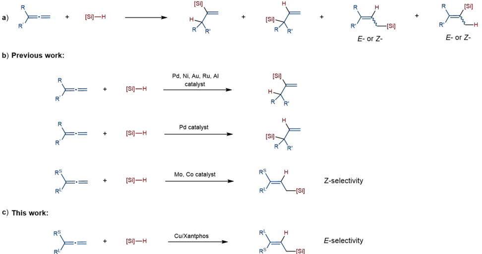
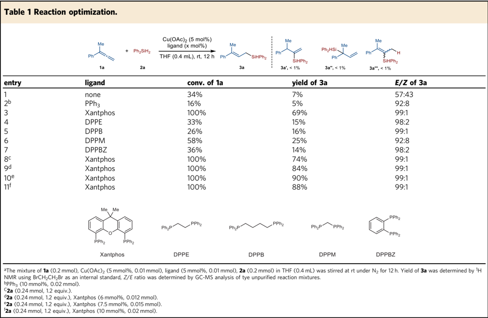
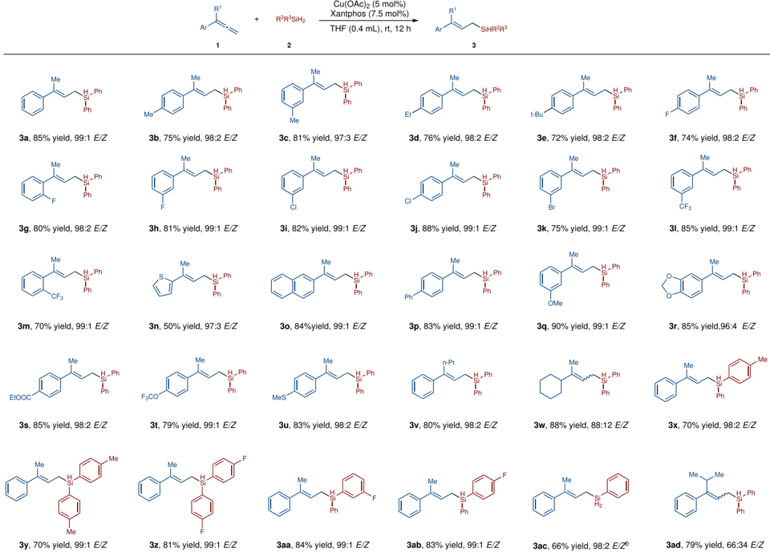
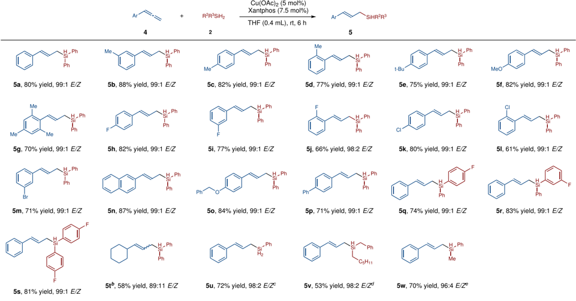
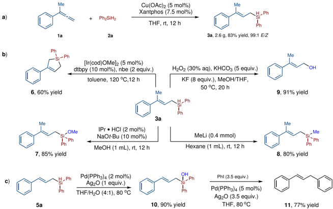
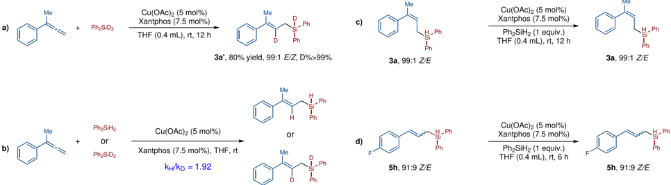
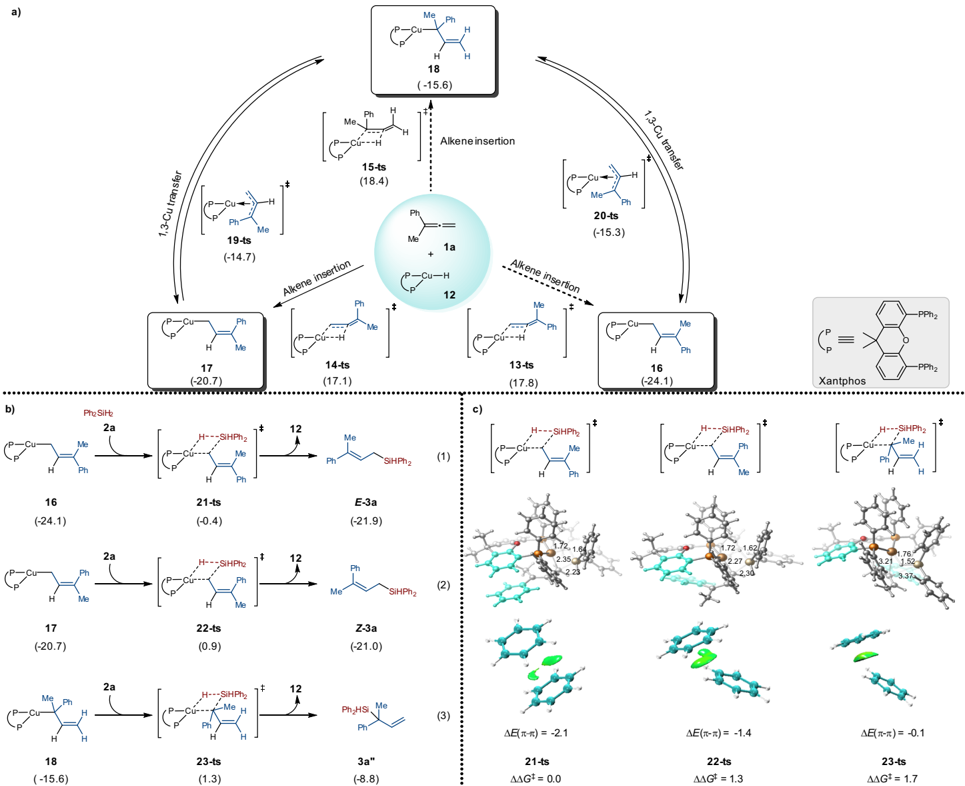

1234567890():,;

## ARTICLE

https://doi.org/10.1038/s41467-022-31458-2

OPEN

## Copper-catalyzed regio- and stereo-selective hydrosilylation of terminal allenes to access ( E )-allylsilanes

Shaowei Chen 1 , Xiaoqian He 2 , Yi Jin 1 , Yu Lan 2,3 ✉ &amp; Xiao Shen 1 ✉

Regioselectivity and stereoselectivity control in hydrosilylation of terminal allenes is challeging. Although the selective synthesis of vinylsilanes, branched allylsilanes or linear ( Z )-allylsilanes have been achieved, transition-metal catalyzed hydrosilylation of terminal allenes to access ( E )-allylsilane is difficult. Herein, we report a copper-catalyzed selective hydrosilylation reaction of terminal allenes to access ( E )-allylsilanes under mild reaction conditions. The reaction shows broad substrate scope, representing an efficient method to prepare trisubstituted ( E )-allylsilanes through hydrosilylation reaction of allenes and can also be applied in the synthesis of disubstituted ( E )-allylsilanes. The mechanism study reveals that the E -selectivity is kinetically controlled by the catalyst but not by the thermodynamically isomerization of the ( Z )-isomer.

1 The Institute for Advanced Studies, Engineering Research Center of Organosilicon Compounds &amp; Materials, Ministry of Education, Wuhan University, 430072 Wuhan, China. 2 School of Chemistry and Chemical Engineering, Chongqing Key Laboratory of Theoretical and Computational Chemistry, Chongqing University, 400030 Chongqing, PR China. 3 College of Chemistry and Molecular Engineering, Zhengzhou University, 450001 Zhengzhou, PR China.

a)

R

Ri

→

+

O rganosilicon compounds are widely used in synthetic chemistry and material science 1 . As a step- and atomeconomical approach to synthesize organosilicon compounds, transition-metal catalyzed hydrosilylation of unsaturated C -C bonds such as alkenes 2 -10 , alkynes 11 -17 and dienes 18 -24 , has been extensively studied. However, the study of the selective hydrosilylation of allenes lags behind, probably because of the challenges associated with regioselectivity and stereoselectivity control 25 . As for terminal allenes, six possible isomers could be potentially generated in transition-metal catalyzed hydrosilylation reaction, due to the presence of two continuous orthogonal π bonds (Fig. 1a). Previous hydrosilylation of terminal allenes with Pd, Ni, Au, Ru or Al catalysis mainly occurred at the nonterminal C = C bonds, affording vinylsilanes as the major products 26 -32 . The synthesis of branched allylsilanes with Pd or Ni catalysis have also been achieved, which also occurred at the non-terminal C = C bonds 27,28,31 . In 2016, Asako and Takai reported a molybdenum-catalyzed hydrosilylation at the terminal C = C bonds of allenes that yielded linear allylic silanes in moderate to good Z -selectivities 33 . Seminal work in the transitionmetal catalyzed synthesis of ( Z )-allylsilanes were then reported by Ma and Huang groups and Ge group with cobalt catalysis 34,35 . However, there is still one challenge remained in transition-metal catalyzed hydrosilylation of terminal allenes, that is, the regioand stereoselective generation of ( E )-allylsilanes. The only report to prepare ( E )-allylsilanes via hydrosilylation of allenes was Yao ' s radical-based approach, but the reaction is limited to super reactive (TMS)3SiH and monoalkyl substituted allenes 36 . There are several other methods to access di-substituted ( E )-allylsilanes 37 -39 , but no general catalytic hydrosilylation methods to prepare tri-substituted ( E )-allylsilanes is availabe. To the best of our knowledge, transition metal catalyzed hydrosilylation of terminal allenes to obtain both trisubstituted and disubstituted ( E )-allylsilanes has not been well studied.

It is worth to mention that copper is an earth abundant transition metal, which makes it an ideal candidate to develop

R

[Si]

R

E- or Z- transformations in sustainable chemistry. However, compared to relatively more extensively studied Ni, Co, Fe-catalyzed hydrosilylation reactions 2,40 -42 , copper catalysis has been rarely used in hydrosilylation of unsaturated carbon carbon bonds 24,43 -49 . Herein, we report a copper-catalyzed hydrosilylation of allenes which affords linear ( E )-allylsilanes with excellent regioand stereoselectivity. The reaction shows broad substrate scope and is amenable to synthesize both di-substituted and tri-substituted ( E )-allylsilanes. The mechanism study reveals that the E -selectivity is kinetically controlled by the catalyst but not by the thermodynamically isomerization of the ( Z )-isomer.

## Results

Evaluation of reaction conditions . We commenced the study of Cu-catalyzed hydrosilylation of terminal allenes by evaluating the reaction conditions with buta-2,3-dien-2-ylbenzene 1a and Ph2SiH2 2a as the model substrates. When 5 mol% of Cu(OAc)2 was as used as catalyst, the reaction in THF at room temperature afforded the desired allylsilane in 7% yield with 57:43 E/Z (Table 1, entry 1). We then screened various ligands to increase the ef fi ciency of the reaction (entries 2 -7). When monophosphine ligand PPh3 was used as a ligand, the E / Z ratio increased to 92:8, but only 5% yield was obtained (entry 2). Several bisphosphine ligands were then found to be better than PPh3. When Xantphos is used, the yield increased to 69%, and the E -selectivity increased to 99% (entry 3). Compared with Xantphos, other bisphosphine ligands, such as DPPE, DPPB, DPPM, DPPBZ, could only afford the product in 15 -25% yield (92 -99% E selectivity, entries 4 -7). Further study revealed that increasing the amount of 2a to 1.2 equivalent could improve the yield to 74% (entry 8). Then we screened the molecular ratio of Cu(OAc)2/Xantphos, and the best result was obtained when the amount of Xantphos was increased to 7.5%, while 5 mmol% Cu(OAc)2 was used, and the yield increased to 90% (entry 10). In all cases, less than 1% yield was observed for vinylsilane 3a ' , branched allylsilane 3a ' or

Fig. 1 Hydrosilylation of terminal allenes. a Challenges in the control of regio- and stereo-selectivity. b Previous work on the transition-metal-catalyzed hydrosilylation of terminal allenes mainly afforded vinyl silanes, branched allylsilanes and ( Z )-allylsilanes as the products. c This work: we report a coppercatalyzed selective hydrosilylation of terminal allenes to access exclusively ( E )-allylsilanes.

[Si]

R

-[Si]

vinylsilane 3a '' , indicating the excellent regioand stereoselectivity control under the copper catalyzed conditions.

Scope of the reaction between allene 1 and silane 2 . Using the optimized conditions, we fi rst examined the scope of 1,1-disubsitituted allenes. These results are summarized in Fig. 2. A wide range of 1,1-disubstituted allenes with various subsituents on the aromatic rings such as Me, Et, t -Bu, F, Cl, Br, CF3, OMe, OCF3, ester and MeS were suitable substrates, affording the desired ( E )-allylsilanes 3a -3v in 50 -90% yield with good to excellent E -selectivities (96:4 -99:1 E/Z ). Additionally, electron-rich thiophenyl group could be tolerated ( 3n , 50% yield, 97:3 E / Z ). ( E )-allylsilanes which contain naphthyl, biphenyl groups have also been successfully made ( 3o , 84% yield, 99:1 E / Z ; 3p , 83% yield, 99:1 E / Z ). If the aryl substituent in the disubstituted allene is replaced with cyclohexyl ( 3w ), a yield of 88% can be obtained, but the E / Z ratio will decrease to 88:12. Then we tested several diarylsilanes with 1a as the reaction partner, and the corresponding products were obtained in good yields and excellent selectivities ( 3x , 70% yield, 98:2 E / Z ; 3y , 70% yield, 99:1 E / Z ; 3z , 81% yield, 99:1 E / Z ; 3aa , 84% yield, 99:1 E / Z ; 3ab , 83% yield, 99:1 E / Z ). Phenylsilane was also suitable reagent for the selective hydrosilylation reaction, and compound 3ac was synthesized in 66% yield with 98:2 E/Z under slightly modi fi ed reaction conditions. However, reducing the steric difference between two subsituents of 1,1-disubstituted allenes decreased the E / Z selectivity of the hydrosilylation reaction between (4-methylpenta-1,2-dien3-yl)benzene and Ph2SiH2 ( 3ad , 79% yield, 66:34 E / Z ).

Monosubstituted allenes also reacted with 2a smoothly under the slightly modi fi ed reaction conditions (Fig. 3). Because of the higher reactivity of 1,2-disubstituted alkenes than the tri-substituted alkenes, the subsequent hydrosilylation of the

( E )-allylsilane product was observed, in the presence of excess amount of Ph2SiH2. Therefore, the amount of silane was reduced to 1.1 equivalent from 1.2 equivalent and the reaction time was shortened from 12 h to 6 h to get high yield of monohydrosilyaltion product. Allenes substituted with electrondonating groups such as Me, Et, t -Bu, OMe, reacted well with 2a to afford ( E )-allylsilanes 5a -5g in 70 -88% yield with excellent E -selectivity (99:1 E / Z ). Allenes substituted with halogen atoms (F, Cl, Br) were suitable substrates, affording the desired ( E )-allysilanes 5h -5i in 66 -82% yield with 98:2 -99:1 E / Z . ( E )-allylsilanes which contain naphthyl, biphenyl groups have also been successfully prepared ( 5m , 87% yield, 99:1 E / Z ; 5o , 71% yield, 99:1 E / Z ). The reaction of 2a with fl uorine-substituted silanes also performed well, affording ( E )-allylsilanes ef fi ciently ( 5p , 74% yield, 99:1 E / Z ; 5q , 83% yield, 99:1 E / Z ; 5r , 81% yield, 99:1 E / Z ). Alkyl allene afforded compound 5t in 58% yield with 89:11 E/Z . When phenylsilane was used as the reagent, allylsilane 5u was isolated in 72% yield with 98:2 E/Z . Benzyl(hexyl)silane and methyl(phenyl)silane were also tested in the hydrosilylation reactions with allene 1a , and compounds 5v and 5w were afforded in 53% yield, 98:2 E/Z and 70% yield, 96:4 E/Z , respectively.

Synthetic transformations of compound 3a . To test synthetic potential of this reaction, we scaled up the model reaction to 10 mmol scale, and allylsilane 3a was isolated in 83% yield (2.6 g) with 99:1 E : Z (Fig. 4a). Then we explored the conversion of Si-H bond of 3a with the retention of the carbon carbon double bond (Fig. 4b). Taking advantage of the E -con fi guration of compound 3a , we achieved the intramolecular dehydrogenative C-Si bond formation via Ir catalyzed C-H activation, affording the fi vemembered silicon-containing compound 6 in 60% yield. The

Fig. 2 Scope of 1,1-disubstituted allenes. Otherwise noted, the reaction was performed under the following conditions: a allene (0.20 mmol), R 2 R 3 SiH 2 (0.24 mmol), Cu(OAc)2 (0.01 mmol, 5 mol%), Xantphos (0.015 mmol, 7.5 mol%), THF (0.4 mL), rt, 12 h; the yield refers to isolated yield; E / Z ratio was determined with GC-MS analysis or HNMR of unpurified reaction mixture b . Allene (0.20 mmol), PhSiH3 (0.4 mmol), Cu(OAc)2 (0.01 mmol, 5 mol%), Xantphos (0.015 mmol, 7.5 mol%), THF (0.4 mL), 30 o C, 3 h.

reaction of compound 3a with MeOH in the presence of a N -heterocyclic carbene catalyst afforded siloxane 7 in 85% yield. Treatment of 3a with MeLi at room temperature gave allylsilane 8 in 80% yield. Allylic alcohols are synthetically valuable intermediates in various organic transformations 50,51 . Oxidation of the ( E )-allylsilanes with H2O2 under basic conditions afford allylic alcohol 9 in 91% yield. In all of these reactions, the confi gurations of the double bond did not change. Moreover, Allyl silanol 10 could be obtained in 90% yield under the Pd-catalyzed conditions (Fig. 4c). Compound 11 was then synthesized in 77% yield through the Hiyama-Denmark cross-coupling reaction between silanol 10 and PhI (Fig. 4c).

## Discussion

In order to understand the mechanism of the copper-catalyzed hydrosilylation of terminal allenes, we conducted a deuteriumlabeling reaction between 1a and Ph2SiD2. This reaction afforded the corresponding ( E )-allylsilane with &gt;99% D-incorporation, indicating that the hydrogen atom was from the silane, but not from the solvent (Fig. 5a). The KIE study indicated that Si-H bond might be involved in the rate-determining step (Fig. 5b). ( Z )-allylsilanes are thermodynamically less stable than ( E )-allylsilanes. We wonder whether the high E -selectivity of our reaction was resulted from catalyst control or the thermodynamically isomerization of the less stable ( Z )-isomer to the more stable ( E )-isomer? Firstly, we tested the reaction of ( Z )-3a under the standard conditions in the presence of 1 equivalent of Ph2SiH2, and we found that there was no Z / E -isomerization (Fig. 5c). Moreover, compound 5h (91:9 E/Z ) did not undergo Z / E -isomerization either (Fig. 5d). These experimental results strongly support that the E -stereoselectivity of our reaction is kinetically controlled. It is known that CuH intermediates could be generated from the reaction of copper salts and silanes and CuH could add to ole fi ns to generate organocopper intermediates 43 -49 . For the reaction of allenes with CuH, both terminal and internal double bonds of 1a could participate in the hydrocupration 47,48 . In order to further understand the origin of the stereoand regioselectivity of our reaction, density functional theory (DFT) calculations have been performed (Fig. 6, Supplementary Information and Supplementary Data 1) 52,53 . The calculation results showed that intermediate 16 is more stable than intermediates 17 and 18 . Although the energy barrier to generate 17 ( 14-ts , Δ G ‡ = 17.1 kcal/mol) is lower than those to generate 16 ( 13-ts , Δ G ‡ = 17.8 kcal/mol) and 18 ( 15-ts , Δ G ‡ = 18.4 kcal/mol), the 1,3-Cu transfer among these intermediates are rather easy with energy barriers of about 6 kcal/mol. The subsequent σ -bond metathesis step of the Ph2SiH2 2a and allylic copper intermediates 16 , 17 and 18 could proceed via the four-membered cyclic transition states. Among the three transition states, 21-ts ( Δ G ‡ = 23.7 kcal/mol) which leads to the formation of ( E )-3a , is found to be the most favorable one ( 22-ts , Δ G ‡ = 25.0 kcal/mol; 23-ts , Δ G ‡ = 25.4 kcal/mol). The DFT calculation results are consistent to our experimental data, that is, ( E )-allylsilanes were

Fig. 3 Scope of monosubstituted allenes. Otherwise noted, the reaction was performed under the following conditions: a allene (0.20 mmol), R 2 R 3 SiH2 (0.22 mmol), Cu(OAc)2 (0.01 mmol, 5 mol%), Xantphos (0.015 mmol, 7.5 mol%), THF (0.4 mL), rt, 6 h; the yield refers to the isolated yield; Z / E ratio was determined by GC-MS or HNMR analysis of the unpurified reaction mixtures b . Allene (0.40 mmol), Ph2SiH2 (0.2 mmol),The yield of 5t was determined by HNMR c . Allene (0.20 mmol), PhSiH3 (0.4 mmol), Cu(OAc)2 (0.005 mmol, 2.5 mol%), Xantphos (0.0075 mmol, 3.75 mol%), THF (0.4 mL), rt, 30 min d . Allene (0.20 mmol), silane (0.4 mmol), Cu(OAc)2 (0.02 mmol, 10 mol%), Xantphos (0.03 mmol, 15 mol%), THF (0.4 mL), 30 o C, 12 h e . Allene (0.20 mmol), PhMeSiH2 (0.4 mmol), Cu(OAc)2 (0.01 mmol, 5 mol%), Xantphos (0.015 mmol, 7.5 mol%), THF (0.4 mL), 30 o C, 3 h.

Fig. 4 Gram scale reaction and downstream transformations. a The reaction on 10 mmol performed well. b Synthetic transformations of compound 3a . c Synthetic transformations of compound 5a .

observed as the major products. According to DFT calculations, σ -bond metathesis step are the reaction rate-limiting step and the stereoselectivity determining step, which is consistent to result of the KIE study.

Independent gradient model (IGM) analysis of the transition states 21-ts , 22-ts and 23-ts was also performed 54,55 . As shown in Fig. 6c, 21-ts is 1.3 and 1.7 kcal/mol more favorable than 22-ts and 23-ts , which is consistent with the stereo- and regioselectivity observed in the experiment. The leading factor that differentiates the three competing transition states is likely to be π -π interaction between the phenyl group of Xantphos and the phenyl group of the allene. This favorable π -π interaction stabilizes 21-ts ( Δ E π -π = -2.1 kcal/mol) by 0.7 and 2.0 kcal/mol relative to 22-ts ( Δ E π -π = -1.4 kcal/mol) and 23-ts ( Δ E π -π = -0.1 kcal/mol) based on the calculations of interacting fragments. The green oval represents the presence of interactions between the highlighted fragments. Therefore, our calculations indicate noncovalent π -π interaction is the determinant of stereo- and regioselectivity.

In summary, we have developed a copper-catalyzed regio- and stereo-selective hydrosilylation of allenes to access ( E )-allylsilanes.

H

Ph

.72

2.35

Me

72 1.62

2.27

2,30

1.76

1.52

Fig. 5 Mechanism study. a A deuterium-labeling reaction indicate that the hydrogen comes from the silane. b KIE study suggested that the ratedetermining step might involve in the reaction of Si-H bond. c No isomerization of Z -3a to E -3a suggest that the selectivity is kinetically controlled. d No change of the Z/E ratio of 5 h suggest that our Cu-catalyzed reaction is kinetically controlled.

Fig. 6 Computational study. a DFT calculations for the Cu-catalyzed hydrocupration of allene 1a . b Gibbs free energies required for the σ -bond metathesis step of Ph2SiH2 2a and three allylic copper intermediates 16 , 17 and 18 . c DFT calculations on the π -π interaction between the phenyl group of Xantphos and the phenyl group of the allene. Calculations were performed using Gaussian 16 at the M06-L/SDD-6-311 + G(d,p)/SMD(THF)//B3LYP-D3(BJ)/ LANL2DZ-6-31G(d) level of theory and the values are shown in kcal/mol.

H

H

A wide range of 1,1-disubstituted and monosubstituted terminal allenes reacted to afford the corresponding ( E )-allylsilanes in good yields. The reaction conditions are simple and mild, and the product can be prepared in grams, which proves the practicability of this reaction. The mechanism study reveals that the E -selectivity is kinetically controlled by the catalyst but not by the thermodynamically isomerization of the ( Z )-isomer.

## Methods

General procedure for copper-catalyzed allene hydrosilylation . In a glovebox, to an oven-dried screw-capped 4 ml glass vial equipped with a magnetic stir bar was added Cu(OAc)2 (0.01 mmol, 5 mol%), Xantphos (0.015 mmol, 7.5 mol%), THF (0.4 mL). The mixture was stirred for 15 min. Then terminal allene (0.2 mmol, 1.0 equiv.) and silane (0.24 mmol, 1.2 equiv. or 0.22 mmol, 1.1 equiv.) were added and the mixture was stirred at room temperature for 12 h (Figs. 2) or 6h (Fig. 3). The solvent was removed under vacuum and the residue was puri fi ed by column chromatography to afford the corresponding product. See section 1.3 and 1.4 in the Supplementary Information for more details.

## Data availability

The authors declare that all other data supporting the fi ndings of this study are available within the article, Supplementary Information and Supplementary Data, and also are available from the corresponding authors on request. Supplementary Data File 1 contains the cartesian coordinates and energies of optimized structures.

Received: 27 January 2022; Accepted: 15 June 2022;

## References

1. Lee, V. Y. Organosilicon Compounds (Elsevier Ltd., 2017).
2. Obligacion, J. V. &amp; Chirik, P. J. Earth-abundant transition metal catalysts for alkene hydrosilylation and hydroboration. Nat. Rev. Chem. 2 , 15 -34 (2018). For a recent review, seeFor selected examples, see references 3 -9 .
3. Tondreau, A. M. et al. Iron catalysts for selective anti-markovnikov alkene hydrosilylation using tertiary silanes. Science 335 , 567 -570 (2012).
4. Buslov, I., Becouse, J., Mazza, S., Montandon-Clerc, M. &amp; Hu, X. Chemoselective alkene hydrosilylation catalyzed by nickel pincer complexes. Angew. Chem. Int. Ed. 54 , 14523 -14526 (2015).
5. Dong, J. et al. Manganese-catalysed divergent silylation of alkenes. Nat. Chem. 13 , 182 -190 (2021).
6. Simonneau, A. &amp; Oestreich, M. 3-Silylated cyclohexa-1,4-dienes as precursors for gaseous hydrosilanes: the B(C6F5)3-catalyzed transfer hydrosilylation of alkenes. Angew. Chem. Int. Ed. 52 , 11905 -11907 (2013).
7. Liu, Y. &amp; Deng, L. Mode of activation of cobalt(II) amides for catalytic hydrosilylation of alkenes with tertiary silanes. J. Am. Chem. Soc. 139 , 1798 -1801 (2017).
8. Wang, C., Teo, W. J. &amp; Ge, S. Cobalt-catalyzed regiodivergent hydrosilylation of vinylarenes and aliphatic alkenes: ligand- and silane-dependent regioselectivities. ACS Catal. 7 , 855 -863 (2016).
9. Zhan, G. et al. Enantioselective construction of silicon-stereogenic silanes by scandium-catalyzed intermolecular alkene hydrosilylation. Angew. Chem. Int. Ed. 57 , 12342 -12346 (2018).
10. Zhao, Z.-Y. et al. Enantioselective rhodium-catalyzed desymmetric hydrosilylation of cyclopropenes. ACS Catal. 9 , 9110 -9116 (2019).
11. Ball, Z. T. &amp; Trost, B. M. Alkyne hydrosilylation catalyzed by a cationic ruthenium complex: ef fi cient and general trans addition. J. Am. Chem. Soc. 127 , 17644 -17655 (2005). For selected examples, see references 10 -16 .
12. Rooke, D. A. &amp; Ferreira, E. M. Platinum-catalyzed hydrosilylations of internal alkynes: harnessing substituent effects to achieve high regioselectivity. Angew. Chem. Int. Ed. 51 , 3225 -3230 (2012).
13. Ding, S. et al. Highly regio- and stereoselective hydrosilylation of internal thioalkynes under mild conditions. Angew. Chem. Int. Ed. 54 , 5632 -5635 (2015).
14. Chen, W., Song, H., Li, J. &amp; Cui, C. Catalytic selective dihydrosilylation of internal alkynes enabled by rare-earth ate complex. Angew. Chem. Int. Ed. 59 , 2365 -2369 (2020).
15. Wang, D. et al. Markovnikov hydrosilylation of alkynes with tertiary silanes catalyzed by dinuclear cobalt carbonyl complexes with NHC ligation. J. Am. Chem. Soc. 143 , 12847 -12856 (2021).
16. Cheng, Z. et al. Regio-controllable cobalt-catalyzed sequential hydrosilylation/ hydroboration of arylacetylenes. Angew. Chem. Int. Ed. 60 , 22454 -22460 (2021).
17. You, Y. &amp; Ge, S. Cobalt-catalyzed one-pot asymmetric difunctionalization of alkynes to access chiral gem -(Borylsilyl)alkanes. Angew. Chem. Int. Ed. 60 , 20684 -20688 (2021).
18. Wu, J. Y., Stanzl, B. N. &amp; Ritter, T. A strategy for the synthesis of well-de fi ned iron catalysts and application to regioselective diene hydrosilylation. J. Am. Chem. Soc. 132 , 13214 -13216 (2010). For selected examples, see references 17 -23 .
19. Parker, S. E., Borgel, J. &amp; Ritter, T. 1,2-selective hydrosilylation of conjugated dienes. J. Am. Chem. Soc. 136 , 4857 -4860 (2014).
20. Raya, B., Jing, S. &amp; RajanBabu, T. V. Control of selectivity through synergy between catalysts, silanes and reaction conditions in cobalt-catalyzed hydrosilylation of dienes and terminal alkenes. ACS Catal. 7 , 2275 -2283 (2017).
21. Wen, H., Wang, K., Zhang, Y., Liu, G. &amp; Huang, Z. Cobalt-catalyzed regioand enantioselective Markovnikov 1,2-hydrosilylation of conjugated dienes. ACS Catal. 9 , 1612 -1618 (2019).
22. Sang, H. L., Yu, S. &amp; Ge, S. Cobalt-catalyzed regioselective stereoconvergent Markovnikov 1,2-hydrosilylation of conjugated dienes. Chem. Sci. 9 , 973 -978 (2018).
23. Komine, N., Mitsui, T., Kikuchi, S. &amp; Hirano, M. Ligand-controlled regiodivergent hydrosilylation of conjugated dienes catalyzed by mono(phosphine)palladium(0) complexes. Organometallics 39 , 4510 -4524 (2020).
24. Wang, Z. L. et al. Synthesis of structurally diverse allylsilanes via coppercatalyzed regiodivergent hydrosilylation of 1,3-dienes. Org. Lett. 23 , 4736 -4742 (2021).
25. Barbero, A., Walter, D. &amp; Fleming, I. Stereochemical control in organic synthesis using silicon-containing compounds. Chem. Rev. 97 , 2063 -2192 (1997).
26. Sudo, T., Asao, N., Gevorgyan, V. &amp; Yamamoto, Y. Lewis acid catalyzed highly regio- and stereocontrolled trans-hydrosilylation of alkynes and allenes. J. Org. Chem. 64 , 2494 -2499 (1999).
27. Miller, Z. D., Li, W., Belderrain, T. R. &amp; Montgomery, J. Regioselective allene hydrosilylation catalyzed by N-heterocyclic carbene complexes of nickel and palladium. J. Am. Chem. Soc. 135 , 15282 -15285 (2013).
28. Miller, Z. D. &amp; Montgomery, J. Regioselective allene hydroarylation via onepot allene hydrosilylation/Pd-catalyzed cross-coupling. Org. Lett. 16 , 5486 -5489 (2014).
29. Kidonakis, M. &amp; Stratakis, M. Ligandless regioselective hydrosilylation of allenes catalyzed by gold nanoparticles. Org. Lett. 17 , 4538 -4541 (2015).
30. Miller, Z. D., Dorel, R. &amp; Montgomery, J. Regiodivergent and stereoselective hydrosilylation of 1,3-disubstituted allenes. Angew. Chem. Int. Ed. 54 , 9088 -9091 (2015).
31. Tafazolian, H. &amp; Schmidt, J. A. Highly ef fi cient regioselective hydrosilylation of allenes using a [(3IP)Pd(allyl)]OTf catalyst; outstanding example of allene hydrosilylation with phenyl- and diphenylsilane. Chem. Commun. 51 , 5943 -5946 (2015).
32. Miura, H., Sasaki, S., Ogawa, R. &amp; Shishido, T. Hydrosilylation of allenes over palladium-gold alloy catalysts: enhancing activity and switching selectivity by the incorporation of palladium into gold nanoparticles. Eur. J. Org. Chem . 2018 , 1858 -1862 (2018).
33. Asako, S., Ishikawa, S. &amp; Takai, K. Synthesis of linear allylsilanes via molybdenum-catalyzed regioselective hydrosilylation of allenes. ACS Catal. 6 , 3387 -3395 (2016).
34. Yang, Z., Peng, D., Du, X., Huang, Z. &amp; Ma, S. Identifying a cobalt catalyst for highly selective hydrosilylation of allenes. Org. Chem. Front. 4 , 1829 -1832 (2017).
35. Wang, C., Teo, W. J. &amp; Ge, S. Access to stereode fi ned (Z)-allylsilanes and (Z)allylic alcohols via cobalt-catalyzed regioselective hydrosilylation of allenes. Nat. Commun. 8 , 2258 (2017).
36. Cai, Y., Zhao, W., Wang, S., Liang, Y. &amp; Yao, Z. J. Access to functionalized E -allylsilanes and E -alkenylsilanes through visible-light-driven radical hydrosilylation of mono- and disubstituted allenes. Org. Lett. 21 , 9836 -9840 (2019).
37. Suginome, M., Matsumoto, A. &amp; Ito, Y. New synthesis of (E)-allylsilanes with high enantiopurity via diastereoselective intramolecular bis-silylation of chiral allylic alcohols. J. Am. Chem. Soc. 118 , 3061 -3062 (1996). For selected examples, see references 36 -38 .
38. Suginome, M., Iwanami, T., Ohmori, Y., Matsumoto, A. &amp; Ito, Y. Stereoselective synthesis of highly enantioenriched ( E )-allylsilanes by palladium-catalyzed intramolecular Bis-silylation: 1,3-chirality transfer and enantioenrichment via dimer formation. Chem. Eur. J. 11 , 2954 -2965 (2005).
39. Kamachi, T., Kuno, A., Matsuno, C. &amp; Okamoto, S. Cobalt-catalyzed monocoupling of R3SiCH2MgCl with 1,2-dihalogenoethylene: a general route to γ -substituted ( E )-allylsilanes. Tetrahedron Lett. 45 , 4677 -4679 (2004).
40. de Almeida, L. D., Wang, H., Junge, K., Cui, X. &amp; Beller, M. Recent advances in catalytic hydrosilylations: developments beyond traditional platinum.

Catalysts. Angew. Chem. Int. Ed. 60 , 550 -565 (2021). For recent reviews, see references 2, 39 and 40 .

41. Du, X. &amp; Huang, Z. Advances in base-metal-catalyzed alkene hydrosilylation. ACS Catal. 7 , 1227 -1243 (2017).
42. Guo, J., Cheng, Z., Chen, J., Chen, X. &amp; Lu, Z. Iron- and cobalt-catalyzed asymmetric hydrofunctionalization of alkenes and alkynes. Acc. Chem. Res. 54 , 2701 -2716 (2021).
43. Gribble, M. W. Jr, Pirnot, M. T., Bandar, J. S., Liu, R. Y. &amp; Buchwald, S. L. Asymmetric copper hydride-catalyzed markovnikov hydrosilylation of vinylarenes and vinyl heterocycles. J. Am. Chem. Soc. 139 , 2192 -2195 (2017).
44. Nishino, S., Hirano, K. &amp; Miura, M. Cu-catalyzed reductive gemdifunctionalization of terminal alkynes via hydrosilylation/hydroamination cascade: concise synthesis of alpha-aminosilanes. Chem. Eur. J. 26 , 8725 -8728 (2020).
45. Xu, X.-Q.-F., Yang, P., Zhang, X. &amp; You, S.-L. Enantioselective synthesis of 4Silyl-1,2,3,4-tetrahydroquinolines via copper(I) hydride catalyzed asymmetric hydrosilylation of 1,2-dihydroquinolines. Synlett 32 , 505 -510 (2020).
46. Wang, Z. L. et al. Copper-catalyzed anti-markovnikov hydrosilylation of terminal alkynes. Org. Lett. 22 , 7735 -7742 (2020).
47. Liu, R. Y., Yang, Y. &amp; Buchwald, S. L. Regiodivergent and diastereoselective CuH-catalyzed allylation of imines with terminal allenes. Angew. Chem. Int. Ed. 55 , 14077 -14080 (2016).
48. Yuan, Y., Zhang, X., Qian, H. &amp; Ma, S. Catalytic enantioselective allene -anhydride approach to β , γ -unsaturated enones bearing an α -allcarbon-quarternary center. Chem. Sci. 11 , 9115 -9121 (2020).
49. Xu, J. L. et al. Copper-catalyzed regiodivergent and enantioselective hydrosilylation of allenes. J. Am. Chem. Soc. 144 , 5535 -5542 (2022). During revision of this manuscript, Xu, Fu and co-workers reported a Cu-catalyzed hydrosilylation of allenes to prepare E -allylsilanes under different conditions, but the reactions between 1-aryl-1-alkyl allenes and diarylsilanes were not disclosed .
50. Heravi, M. M., Lashaki, T. B. &amp; Poorahmad, N. Applications of Sharpless Asymmetric Epoxidation in Total Synthesis. Tetrahedron.: Asymmetry 26 , 405 -495 (2015).
51. Mhasni, O., Elleuch, H. &amp; Rezgui, F. Direct Nucleophilic Substitutions of Allylic Alcohols with 1,3-Dicarbonyl Compounds: Synthetic Design, Mechanistic Aspects and Applications. Tetrahedron 111 , 132732 (2022).
52. Lan, Y. Computational methods in organometallic catalysis (Wiley-VCH Press, 2021).
53. He, X. Q. et al. Is the metal involved or not? A computational study of Cu(I)Catalyzed [4 + 1] annulation of vinyl indole and carbene precursor. Chin. Chem. Lett. 4 , 2031 -2035 (2022).
54. Lin, J. S. et al. Cu/Chiral phosphoric acid-catalyzed asymmetric threecomponent radical-initiated 1,2-dicarbofunctionalization of alkenes. J. Am. Chem. Soc. 141 , 1074 -1083 (2019).
55. Cheng, Y. F. et al. Catalytic enantioselective desymmetrizing functionalization of alkyl radicals via Cu(i)/CPA cooperative catalysis. Nat. Catal. 3 , 401 -410 (2020).

## Acknowledgements

We are grateful to NSFC (21901191, XS; 21822303, YL), Fundamental Research Funds for the Central Universities (XS) and Wuhan University (XS) for fi nancial support. The numerical calculations in this paper have been done on the supercomputing system in the Supercomputing Center of Wuhan University.

## Author contributions

X.S. directed the project and composed the manuscript with revisions provided by the other authors. S.C. developed the catalytic method and performed the mechanism study and synthetic applications. S.C. and Y.J. investigated the substrate scope. X.H. performed the DFT calculations. Y.L. directed the calculation. All the authors were involved the analysis of results and discussions of the project.

## Competing interests

The authors declare no competing interests.

## Additional information

Supplementary information The online version contains supplementary material available at https://doi.org/10.1038/s41467-022-31458-2.

Correspondence and requests for materials should be addressed to Yu Lan or Xiao Shen.

Peer review information Nature Communications thanks the anonymous reviewer(s) for their contribution to the peer review of this work. Peer reviewer reports are available.

Reprints and permission information is available at http://www.nature.com/reprints

Publisher ' s note Springer Nature remains neutral with regard to jurisdictional claims in published maps and institutional af fi liations.

Open Access This article is licensed under a Creative Commons Attribution 4.0 International License, which permits use, sharing, adaptation, distribution and reproduction in any medium or format, as long as you give appropriate credit to the original author(s) and the source, provide a link to the Creative Commons license, and indicate if changes were made. The images or other third party material in this article are included in the article ' s Creative Commons license, unless indicated otherwise in a credit line to the material. If material is not included in the article ' s Creative Commons license and your intended use is not permitted by statutory regulation or exceeds the permitted use, you will need to obtain permission directly from the copyright holder. To view a copy of this license, visit http://creativecommons.org/ licenses/by/4.0/.

© The Author(s) 2022