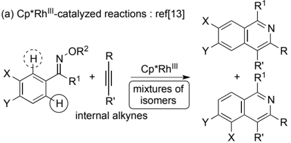
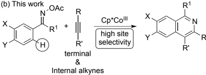
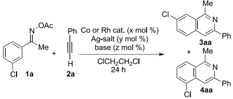
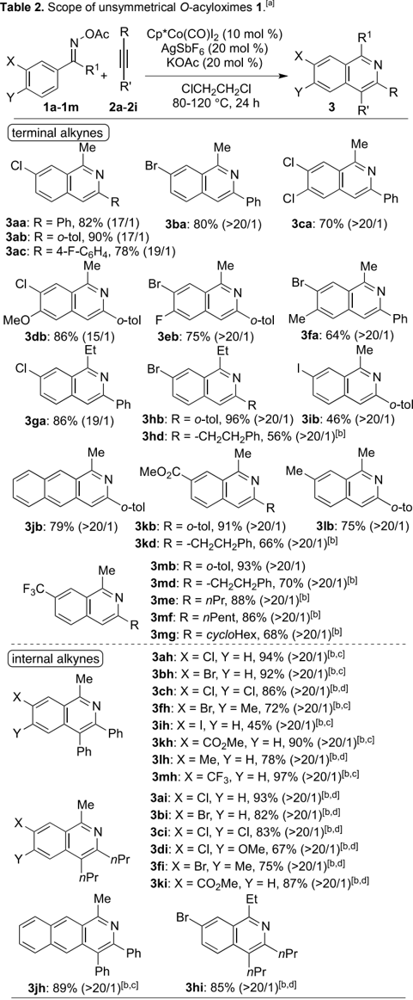
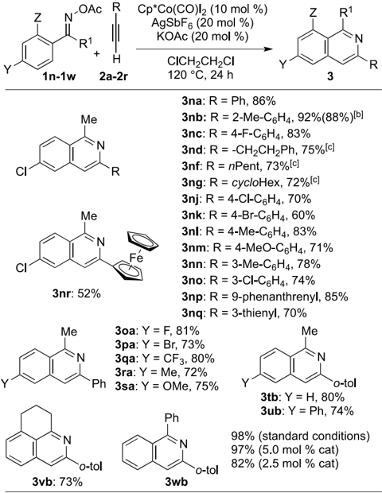
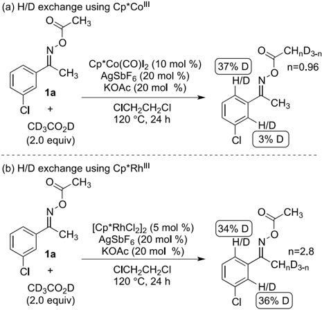
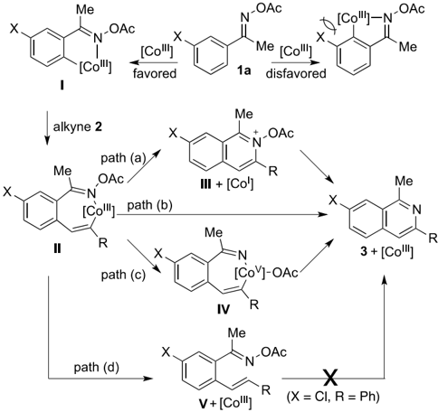
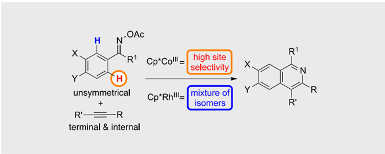

| Title            | Cp*Co-III Catalyzed Site-Selective C-H Activation of Unsymmetrical O-Acyl Oximes: Synthesis of Multisubstituted Isoquinolines from Terminal and Internal Alkynes                                                                                                                                                                                                                                                                                                                                                                            |
|------------------|---------------------------------------------------------------------------------------------------------------------------------------------------------------------------------------------------------------------------------------------------------------------------------------------------------------------------------------------------------------------------------------------------------------------------------------------------------------------------------------------------------------------------------------------|
| Author(s)        | Sun, Bo; Yoshino, Tatsuhiko; Kanai, Motomu et al.                                                                                                                                                                                                                                                                                                                                                                                                                                                                                           |
| Citation         | Angewandte chemie-international edition, 54(44), 12968-12972 https://doi.org/10.1002/anie.201507744                                                                                                                                                                                                                                                                                                                                                                                                                                         |
| Issue Date       | 2015-10-26                                                                                                                                                                                                                                                                                                                                                                                                                                                                                                                                  |
| Doc URL          | https://hdl.handle.net/2115/63311                                                                                                                                                                                                                                                                                                                                                                                                                                                                                                           |
| Rights           | This is the peer reviewed version of the following article: Sun, B., Yoshino, T., Kanai, M. and Matsunaga, S. (2015), Cp*CoIII Catalyzed Site-Selective C-H Activation of Unsymmetrical O- Acyl Oximes: Synthesis of Multisubstituted Isoquinolines from Terminal and Internal Alkynes. Angew. Chem. Int. Ed., 54: 12968-12972., which has been published in final form at http://dx.doi.org/10.1002/anie.201507744. This article may be used for non-commercial purposes in accordance with Wiley Terms and Conditions for Self-Archiving. |
| Type             | journal article                                                                                                                                                                                                                                                                                                                                                                                                                                                                                                                             |
| File Information | manuscript.pdf                                                                                                                                                                                                                                                                                                                                                                                                                                                                                                                              |

## Cp*Co III -Catalyzed Site-Selective C-H Activation of Unsymmetrical O -Acyloximes: Multi-substituted Isoquinoline Synthesis from Terminal and Internal Alkynes

Bo Sun, [a] Tatsuhiko Yoshino, [b,c] Motomu Kanai,* [a] and Shigeki Matsunaga* [b,c]

Abstract: Cp*Co III -catalyzed isoquinoline synthesis via site-selective C-H  activation  of  O-acyloximes  is  described.  C-H  activation  of various unsymmetrically substituted O-acyloximes selectively occurred  at  a  sterically  less  hindered  site  under  Cp*Co III catalysis, and  reactions  with  terminal  as  well  as  internal  alkynes  afforded products in up to 98% yield. The Cp*Co III catalyst exhibited high site selectivity  (15/1-&gt;20/1),  whereas  Cp*Rh III catalysts  exhibited  low selectivity and/or yield  when  unsymmetrical O-acyloximes and terminal alkynes were used. Deuterium labeling studies indicated a clear  difference  in  the  site  selectivity  of  the  C-H  activation  step between the Cp*Co III catalyst and the Cp*Rh III catalyst.

Transition  metal-catalyzed  C-H  bond  functionalization is  an atom[1] and  step-economical [2] organic  transformation  that  has emerged over the last two decades. [3] A directing group-assisted C-H bond activation process to form metallacyclic intermediates is frequently used to realize regioand chemoselective transformation  of  desired  C-H  bonds.  Among  the  numerous catalysts explored in this field, Cp*Rh III complexes are prominent catalysts for directing group-assisted functionalization of aromatic C-H bonds due to their high reactivity, generality, and functional group compatibility. [4] The high cost of Cp*Rh III complexes,  however,  can  be  an  obstacle  to  future  large  scale application  for  producing  valuable  materials  and  biologically active compounds.  In  this context, in  2013  we  began  to investigate  Cp*Co III catalysis  as  an  inexpensive  alternative  to Cp*Rh III catalysis. [5,6] Since then, we and other groups revealed that  several  Cp*Co III complexes  indeed  catalyze  various  C-H bond functionalization reactions [7] that have already been established  with  Cp*Rh III catalysts.  On  the  other  hand,  reports on  the  unique  catalytic  activity  of  Cp*Co III in  comparison  with Cp*Rh III catalysts  are  still  limited. [8] Our  group  utilized  the  high nucleophilicity of alkenyl-Co III species in a one-pot pyrroloindolone synthesis. [8a] Glorius et  al. also utilized  the  high Lewis  acidity of a cationic Co III to  produce  6 H -pyrido[2,1a ]isoquinolin-6-ones. [8b] More recently, our group [8c] and Glorius' group [8d] independently  utilized  the  oxophilic  property  of  Co III in dehydrative  C-H  allylation  with  free  allylic  alcohols.  Herein  we describe our efforts to further explore the unique catalytic activity

[a]

B. Sun, Prof. Dr. M. Kanai

Graduate School of Pharmaceutical Sciences

The University of Tokyo

Hongo, Bunkyo-ku, Tokyo 113-0033, Japan

E-mail: kanai@mol.f.u-tokyo.ac.jp

[a]

Dr. T. Yoshino, Prof. Dr. S. Matsunaga

Faculty of Pharmaceutical Sciences

Hokkaido University

Kita-ku, Sapporo 060-0812, Japan

E-mail: smatsuna@pharm.hokudai.ac.jp

- [c] Dr. T. Yoshino, Prof. Dr. S. Matsunaga ACT-C, Japan Science and Technology Agency

Supporting information for this article is given via a link at the end of the document.

of Cp*Co III over Cp*Rh III . Cp*Co III exhibited superior site selectivity  in  the  C-H  activation  of  unsymmetrically  substituted O -acyloximes,  producing  multi-substituted  isoquinolines  from terminal and internal alkynes.

Isoquinoline is an important structural motif found in a series of  biologically  active  natural  products  and  pharmaceuticals. [9] Cyclization  reactions  of  oxime  derivatives  and  alkynes  via  C-H activation to give isoquinolines without any external oxidants [10,11] have been developed under various transition metal catalyses. [12-14] Among  them,  Chiba  and  co-workers  reported  a Cp*Rh III -catalyzed annulation reaction of O -acyloximes with internal alkynes (Scheme 1a). [13a] Zhao, Jia, Li, and co-workers also reported the reaction with oximes under Cp*Rh III -catalysis. [13b] The substrate scope in both cases, however, was limited  to  internal  alkynes. [13,15] Moreover,  site  selectivity  of  the C-H activation step to form a metallacycle was also problematic when unsymmetrical m -substituted oxime derivatives were used as  substrates.  Only  very  limited  substrates  bearing  methyl  or alkoxy  groups  showed  sufficient  site  selectivity in  previous transition  metal-catalyzed  isoquinoline  syntheses  from  oxime derivatives. [13,14] We hypothesized that steric repulsion between the Cp* ligand and substrates would be larger with the Cp*Co III catalyst than with the Cp*Rh III catalyst, because the ionic radius of cobalt is smaller than that of rhodium. Thereby, Cp*Co III would efficiently differentiate the steric difference in unsymmetrical m -substituted oxime derivatives.

Scheme  1. Cp*Rh III -  and Cp*Co III -catalyzed isoquinoline synthesis; site selectivity with unsymmetrical oxime derivatives and alkynes.

We optimized the reaction conditions using m -Cl-substituted O -acyloxime 1a and  a  terminal  alkyne 2a as  model  substrates (Table  1).  A  cationic  benzene  complex,  [Cp*Co(C6H6)][PF6]2, combined with KOAc at 120 °C afforded the desired annulated product 3aa and its isomer 4aa in 46% yield and good selectivity

(entry  1, 3aa : 4aa =  14/1).  The  less  hindered  C-H  bond  was selectively functionalized under Cp*Co III catalysis. In situ generation of an active catalyst using Cp*Co(CO)I2 and cationic Ag  salts  showed  higher  reactivity  (entries  2-5),  and  AgSbF6 afforded  the  best  result  (82%  isolated  yield,  17/1  selectivity, entry 5). Other bases, shown in entries 6-8, were less effective. In  the  absence  of  KOAc,  the  yield  of 3aa decreased  (entry  9, 55% yield). We also  evaluated  the  catalytic  activity  of  Cp*Rh III catalysts  under  several  conditions  to  investigate  the  difference between  Co III and  Rh III .  The  reported  reaction  conditions  for internal alkynes using acetate bases in MeOH [13a,b] at 60-80 ° C resulted in no reaction (entries 10, 11). When using AgSbF6 and carboxylate/carbonate  bases  in  1,2-dichloroethane  at  120  °C, the annulated products were obtained in 9-28% yield, but poor site  selectivity  in  C-H  activation  was  observed  in  all  cases (entries 13-16).

The scope of unsymmetrically substituted O -acyloximes 1 is summarized in Table 2. O -acyloximes bearing halogen substituents  at  the m -position  generally  exhibited  high  siteselectivity,  and  the  less  hindered  C-H  bond  was  functionalized ( 3aa -3ib ).  Another substituent at the p -position (Y in 1 )  did  not affect the selectivity or reactivity ( 3ca , 3db , 3eb , 3fa ). Various

Table 1. Optimization studies and control experiments. [a]

| Entry   | Catalyst [mol %]                | Ag-salt [mol %]   | Base [mol %]   |   T [°C] | Yield [%] [b]   | Ratio of 3 / 4   |
|---------|---------------------------------|-------------------|----------------|----------|-----------------|------------------|
| 1       | [Cp*Co(C 6 H 6 )][PF 6 ] 2 (10) | None              | KOAc (20)      |      120 | 46              | 14/1             |
| 2       | Cp*Co(CO)I 2 (10)               | AgPF 6 (20)       | KOAc (20)      |      120 | 73              | 17/1             |
| 3       | Cp*Co(CO)I 2 (10)               | AgBF 4 (20)       | KOAc (20)      |      120 | 65              | 19/1             |
| 4       | Cp*Co(CO)I 2 (10)               | AgNTf 2 (20)      | KOAc (20)      |      120 | 70              | 16/1             |
| 5       | Cp*Co(CO)I 2 (10)               | AgSbF 6 (20)      | KOAc (20)      |      120 | 82 [c]          | 17/1             |
| 6       | Cp*Co(CO)I 2 (10)               | AgSbF 6 (20)      | K 2 CO 3 (20)  |      120 | 71              | 13/1             |
| 7       | Cp*Co(CO)I 2 (10)               | AgSbF 6 (20)      | CsOAc (20)     |      120 | 63              | 19/1             |
| 8       | Cp*Co(CO)I 2 (10)               | AgSbF 6 (20)      | CsOPiv (20)    |      120 | 64              | 17/1             |
| 9       | Cp*Co(CO)I 2 (10)               | AgSbF 6 (20)      | None           |      120 | 55              | 17/1             |
| 10 [d]  | [Cp*RhCl 2 ] 2 (2.5)            | None              | NaOAc (30)     |       60 | trace           | N.D.             |
| 11 [d]  | [Cp*RhCl 2 ] 2 (2.5)            | None              | CsOAc (30)     |       80 | trace           | N.D.             |
| 12      | [Cp*RhCl 2 ] 2 (5)              | AgSbF 6 (20)      | KOAc (20)      |       80 | trace           | N.D.             |
| 13      | [Cp*RhCl 2 ] 2 (5)              | AgSbF 6 (20)      | KOAc (20)      |      120 | 11              | 1/1.3            |
| 14      | [Cp*RhCl 2 ] 2 (5)              | AgSbF 6 (20)      | K 2 CO 3 (20)  |      120 | 9               | 1/1.6            |
| 15      | [Cp*RhCl 2 ] 2 (5)              | AgSbF 6 (20)      | CsOAc (20)     |      120 | 28              | 1/1.3            |
| 16      | [Cp*RhCl 2 ] 2 (5)              | AgSbF 6 (20)      | CsOPiv (20)    |      120 | 13              | 1/1.3            |

[a]  Reactions  were  run  using 1a (0.15  mmol)  and 2a (0.18  mmol)  in ClCH2CH2Cl  unless  otherwise  noted.  [b]  Combined  yield  of 3aa and 4aa determined by 1 H  NMR analysis  with  an  internal  standard.  [c]  Isolated  yield after  silica  gel  column  chromatography.  [d]  The  reaction  was  run  in  MeOH (conditions reported in ref [13a,13b] ).

[a] Reactions were run using 1 (0.15 mmol), 2 (0.18 mmol), Cp*Co(CO)I2 (10 mol %), AgSbF6 (20 mol %), and KOAc (20 mol %) in ClCH2CH2Cl at 120 °C for 24 h unless otherwise noted. Indicated yields are combined isolated yield of 3 and its regioisomer 4 . Number in parentheses is ratio of 3 / 4 determined by 1 H  NMR  analysis  of  the  crude  mixture.  [b]  CsOAc  (20  mol  %)  was  used instead  of  KOAc. 1 (0.10  mmol)  and 2 (0.15  mmol)  were  used. [c] Reaction was run at 80°C.  [d] Reaction was run at 100°C.

substituents at the m -position, such as an ester, methyl, and CF3 groups were compatible, and high site-selectivity was observed with  terminal  aryl  alkyne 2b .  By  slightly  modifying  the  reaction

conditions using CsOAc as a base, terminal alkyl alkynes 2d -2g also afforded products with high site-selectivity (&gt;20:1) and good to  moderate  yield  ( 3hd , 3kd , 3md -3mg ).  We  evaluated  the reactivity  of  the  Cp*Rh III catalyst  with  several  terminal  alkynes and  unsymmetrical O -acyloximes,  but the yield and/or  site selectivity  were  much  less  satisfactory  ( 3db / 4db :  38%,  1/1.7; 3eb / 4eb : 62%, 1/1.2; 3hb / 4hb : 18%, 1.1/1; 3kb / 4kb : 9%, &gt;20/1; 3lb / 4lb :  30%,  &gt;20/1; 3mb / 4mb :  trace,  n.d.; 3md / 4md :  6%, &gt;20:1). In the previous report, Cp*Rh III also resulted in low siteselectivity  when  using m -Br  substituted O -acyloxime 1b and internal  alkyne 2h ( 3bh : 4bh =  2.7/1). [13a] The  Cp*Co III catalyst exhibited much superior site-selectivity using either aryl or alkyl internal alkynes ( 2h and 2i ), and a broad range of unsymmetrically substituted O -acyloximes afforded products 3ah -3ki with &gt;20:1 site selectivity and 45-97% yield.

Table 3. Scope of terminal alkynes 2 . [a]

[a] Reactions were run using 1 (0.15 mmol), 2 (0.18 mmol), Cp*Co(CO)I2 (10 mol %), AgSbF6 (20 mol %), and KOAc (20 mol %) in ClCH2CH2Cl at 120 °C for  24  h  unless  otherwise  noted.  Isolated  yield  of 3 was  determined  after purification by silica gel column chromatography. [b] Yield in parenthesis was obtained  using 1n (5.0  mmol,  1.06  g)  and 2b (6.0  mmol).  [c]  CsOAc  (20 mol %)  was  used instead  of  KOAc. 1 (0.10  mmol)  and 2 (0.15  mmol)  were used.

Because  Cp*Rh III exhibited  only  modest  to  poor  reactivity with  terminal  alkynes, [15,16] we  further  examined  the  synthetic utility of the Cp*Co III with various terminal alkynes and symmetrical O -acyloximes. Aryl, alkyl, heteroaryl, and ferrocenyl terminal  alkynes  reacted  smoothly  with O -acyloxime 1n , giving products 3na -3nr in  52-92% yield (Table 3). The reaction also proceeded in gram-scale without difficulty, and 3nb was obtained in 88% yield.  Regarding the scope of symmetrical O -acyloximes, 1o -1u gave 3oa -3ub in  72-81%  yield.  An ortho -substituted bicyclic O -acyloxime 1v gave 3vb in 73% yield, and a  benzophenone-derived O -acyloxime 1w also  afforded  the product in excellent yield ( 3wb , 98%). With 1w and 2b as model substrates,  we  attempted  to  reduce  the  catalyst  loading.  The reaction  proceeded  smoothly  with  5.0  mol  %  of  the  cobalt catalyst,  and 3wb was  obtained  in  97%  yield.  Decreasing  the catalyst  loading  to  2.5  mol  %  resulted  in  diminished  reactivity, but an acceptable yield (82%) was obtained.

High site-selectivity in C-H  bond  activation step under Cp*Co III catalysis  in  comparison  with  Cp*Rh III catalysis  was confirmed by deuterium exchange experiments, shown in Scheme  2.  When O -acyloxime 1a was subjected to the optimized reaction conditions using Cp*Co III in  the  presence  of CD3CO2D,  selective  deuterium  incorporation  was  observed  at the less hindered position (Scheme 2a; 37%D vs 3%D). On the other  hand,  the  Cp*Rh III catalyst  promoted  non-selective  H/D exchange  under  the  same  conditions  (Scheme  2b;  34%D  vs 36%D). The results clearly indicated that Cp*Co III more efficiently differentiated the steric difference in unsymmetrical m -substituted O -acyloxime  than  did  Cp*Rh III .  We  assume  that steric repulsion between the Cp* ligand and substrates would be larger  with  the  Cp*Co III catalyst  than  that  with  the  Cp*Rh III catalyst, because the ionic radius of cobalt is smaller than that of rhodium. [17] Further  mechanistic  studies,  however,  are  required to clarify the precise origin of the high site-selectivity.

Scheme  2. H/D  exchange  experiments  under  (a)  Cp*Co III catalysis  and  (b) Cp*Rh III catalysis.

Possible  reaction  pathways  to  form  isoquinolines 3 are summarized in Figure 1. Coordination of O -acyloxime 1a to  the Co III center,  followed  by  acetate-assisted  C-H  activation [18] at sterically less hindered site, gives 5-membered metallacycle ( I ). Alkyne  insertion  leads  to  a  common  intermediate  ( II ).  Path  (a) consists of reductive elimination of the C-N bond to form the N -acetoxyisoquinolinium  cation  ( III )  and  subsequent  reduction  of the intermediate ( III )  by  the resulting Co I species. In path (b), a concerted C-N bond formation and N-O bond cleavage process would  provide  isoquinoline 3 and  regenerate  the  catalyst. [11a] Path (c) involves formal oxidative addition of the N-O bond to the Co III center to give Co V species ( IV ), [7o] which  undergoes reductive  elimination  leading  to 3 .  At  present,  it  is  difficult  to determine  which  pathway  is  more  plausible  under  Cp*Co III

catalysis. On the other hand, we ruled out the possibility of the reaction via 6  -electrocyclization of ortho -alkenylated intermediate V (path d) [14b,19] , because 3 was not obtained when separately  synthesized  intermediate V (X  =  Cl,  R  =  Ph)  was subjected to the reaction conditions.

Figure  1. Possible  reaction  pathways  to  form  isoquinolines  under  Cp*Co III catalysis

In summary, we demonstrated the unique catalytic activity of the Cp*Co III complex for multi-substituted isoquinoline synthesis from O -acyloximes 1 and terminal as well as internal alkynes 2 via  site-selective  C-H  bond  activation.  The  Cp*Co III catalyst exhibited  much  higher  site  selectivity  for  unsymmetrical O -acyloximes and higher reactivity towards terminal alkynes than Cp*Rh III catalysts.  An  oxidizing  directing  group  bearing an N-O bond was successfully utilized as an internal oxidant in Cp*Co III -catalyzed oxidative C-H bond functionalization reactions. Further mechanistic  studies  as  well  as  trials  to  broaden  the  unique catalytic activity of Cp*Co III catalysis are actively ongoing in our group.

## Acknowledgements

This work was supported in part by ACT-C program from JST, Grant-in-Aid  for  Scientific  Research  on  Innovative  Areas,  The Asahi Glass Foundation, and the Naito Foundation (S.M.).

Keywords: catalysis · C-H activation · cobalt · first-row transition metal· isoquinoline

- [1] B. M. Trost, Science 1991 , 254 , 1471.
- [2] P. A. Wender, B. L. Miller, Nature 2009 , 460 , 197.
- [3] Selected recent reviews on C-H bond functionalization: a) L. Ackermann, Org. Process Res. Dev. 2015 , 19 , 260. b) G. Rouquet, N. Chatani, Angew. Chem. 2013 , 125 , 11942; Angew. Chem. Int. Ed. 2013 , 52 , 11726; b) P. B. Arockiam, C. Bruneau, P. H. Dixneuf, Chem. Rev. 2012 , 112 , 5879; c) J. Wencel-Delord, F. Glorius, Nature Chem. 2013 , 5 , 369; d) K. M. Engle, T.-S. Mei, M. Wasa, J.-Q. Yu, Acc. Chem. Res. 2012 , 45 ,  788;  e)  J.  Yamaguchi,  A.  D.  Yamaguchi,  K.  Itami, Angew.

[4]

[5]

[6]

[7]

[8]

[9]

[10]

[11]

Chem. Int. Ed. 2012 , 51 , 8960; Angew. Chem. 2012 , 124 , 9092; f) B.-J. Li, Z.-J. Shi, Chem. Soc. Rev. 2012 , 41 , 5588; g) S. H. Cho, J. Y. Kim, J. Kwak, S. Chang, Chem. Soc. Rev. 2011 , 40 , 5068.

- Reviews  on  Cp*Rh III -catalyzed  C-H  functionalization:  a)  T.  Satoh,  M. Miura, Chem. Eur. J. 2010 , 16 ,  11212; b)  F. W. Patureau, J. WencelDelord, F. Glorius, Aldrichimica Acta 2012 , 45 , 31; c) G. Song, F. Wang, X. Li, Chem. Soc. Rev. 2012 , 41 , 3651; d) S. Chiba, Chem. Lett. 2012 , 41 , 1554; e) N. Kuhl, N. Schröder, F. Glorius, Adv. Synth. Catal. 2014 , 356 , 1443; f) G. Song, X. Li, Acc. Chem. Res. 2015 , 48 , 1007; g) B. Ye, N. Cramer, Acc. Chem. Res. 2015 , 48 , 1308.
- T. Yoshino, H. Ikemoto, S. Matsunaga, M. Kanai, Angew. Chem. Int. Ed. 2013 , 52 , 2207; Angew. Chem. 2013 , 125 , 2263.
- Reviews on cobalt-catalyzed C-H bond functionalization reactions: a) N. Yoshikai, Synlett 2011 , 1047; b) K. Gao, N. Yoshikai, Acc. Chem. Res. 2014 , 47 ,  1208;  a  review  on  first-row  transition  metal-catalyzed  C-H bond  functionalization reactions: c) A. A. Kulkarni, O. Daugulis, Synthesis 2009 , 4087.
- a) T. Yoshino, H. Ikemoto, S. Matsunaga, M. Kanai, Chem. Eur. J. 2013 , 19 , 9142; b) B. Sun, T. Yoshino, S. Matsunaga, M. Kanai, Adv. Synth. Catal. 2014 , 356 ,  1491;  c)  D.-G.  Yu,  T.  Gensch,  F.  de  Azambuja,  S. Vásquez-Céspedes, F. Glorius, J.  Am. Chem. Soc. 2014 , 136 ,  17722; d) T. M. Figg, S. Park, J. Park, S. Chang, D. G. Musaev, Organometallics 2014 , 33 , 4076; e) J. R. Hummel, J. A. Ellman, J. Am. Chem. Soc. 2015 , 137 , 490; f) P. Patel, S. Chang, ACS Catal. 2015 , 5 , 853;  g)  J.  Li,  L.  Ackermann, Angew.  Chem.  Int.  Ed. 2015 , 54 ,  3635; Angew. Chem. 2015 , 127 , 3706; h) B. Sun, T. Yoshino, S. Matsunaga, M. Kanai, Chem. Commun . 2015 , 51 ,  4659; i) A. B. Pawar, S. Chang, Org. Lett. 2015 , 17 , 660; j) J. Li, L. Ackermann, Angew. Chem. Int. Ed. 2015 , 54 , 8551; Angew. Chem. 2015 , 127 , 8671; k) J. R. Hummel, J. A. Ellman, Org. Lett. 2015 , 17 ,  2400; l) Y. Suzuki, B. Sun, T. Yoshino, S. Matsunaga, M. Kanai, Tetrahedron 2015 , 71 , 4552; m) M. Moselage, N. Sauermann, J. Koeller, W. Liu, D. Gelman, L. Ackermann, Synlett 2015 , 26 ,  1596;  n)  X.-G.  Liu,  S.-S.  Zhang,  J.-Q.  Wu,  Q.  Li,  H.  Wang, Tetrahedron Lett. 2015 , 56 ,  4093; o) Z.-Z. Zhang, B. Liu, C.-Y. Wang, B.-F. Shi, Org. Lett. 2015 , 17 , published online [DOI: 10.1021/acs.orglett.5b02038].

a) H. Ikemoto, T. Yoshino, K. Sakata, S. Matsunaga, M. Kanai, J. Am. Chem. Soc. 2014 , 136 , 5424; b) D. Zhao, J. H. Kim, L. Stegemann, C. A. Strassert, F. Glorius, Angew. Chem. Int. Ed. 2015 , 54 , 4508; Angew. Chem. 2015 , 127 , 4591; c) Y. Suzuki, B. Sun, K. Sakata, T. Yoshino, S. Matsunaga, M. Kanai, Angew. Chem. Int. Ed. 2015 , 54 ,  9944; Angew. Chem. 2015 , 127 ,  10082; d) T. Gensch, S. Vásquez-Céspedes, D.-G. Yu, F. Glorius, Org. Lett. 2015 , 17 , 3714.

Reviews:  a)  K.  W.  Bentley,  The  Isoquinoline  Alkaloids,  Hardwood Academic, Amsterdam, The Netherlands, 1998 , vol. 1; b) K. W. Bentley, Nat. Prod. Rep. 2004 , 21 , 395; c) K. W. Bentley, Nat. Prod. Rep. 2006 , 23 , 444.

Reviews  on  oxidative  C-H  bond  functionalization  reactions  without external oxidant: a) F. W. Patureau, F. Glorius, Angew. Chem. Int. Ed. 2011 , 50 , 1977; Angew. Chem. 2011 , 123 , 2021; b) J. Mo, L. Wang, Y. Liu,  X.  Cui, Synthesis 2015 , 47 ,  439;  c)  H.  Huang,  X.  Ji,  W.  Wu,  H. Jiang, Chem. Soc. Rev. 2015 , 44 , 1155.

- For  selected  examples  of  Cp*Rh III -catalyzed  redox-neutral  C-H  bond activation/annulation  reactions  with  internal  oxidizing  directing  groupassistance: a) N. Guimond, C. Gouliaras, K. Fagnou, J. Am. Chem. Soc. 2010 , 132 , 6908; b) S. Rakshit, C. Grohmann, T. Besset, F. Glorius, J. Am. Chem. Soc. 2011 , 133 ,  2350;  c)  N.  Guimond,  S.  I.  Gorelsky,  K. Fagnou, J. Am. Chem. Soc. 2011 , 133 , 6449; d) P.C. Too, T. Noji, Y. J. Lim, X. Li, S. Chiba, Synlett 2011 , 2789; e) T. K. Hyster, L. Knörr, T. R. Ward, T. Rovis, Science 2012 , 338 ,  500; f) B. Ye, N. Cramer, Science 2012 , 338 , 504; g) H. Wang, C. Grohmann, C. Nimphius, F. Glorius, J. Am. Chem. Soc. 2012 , 134 ,  19592;  h)  J.  M.  Neely,  T.  Rovis, J.  Am. Chem. Soc. 2013 , 135 , 66; i) D. Zhao, Z. Shi, F. Glorius, Angew. Chem. Int. Ed. 2013 , 52 , 12426; Angew. Chem. 2013 , 12 5 , 12652; j) B. Liu, C. Song, C. Sun, S. Zhou, J. Zhu, J. Am. Chem. Soc. 2013 , 135 , 16625; k) C.  Wang,  Y.  Huang, Org.  Lett. 2013 , 15 ,  5294;  l)  S.-C.  Chuang,  P. Gandeepan, C.-H. Cheng, Org. Lett. 2013 , 15 ,  5750; m) X. Huang, J. Huang, C. Du, X. Zhang, F. Song, J. You, Angew. Chem. Int. Ed. 2013 , 52 ,  12970; Angew.  Chem. 2013 ,  12 5 ,  13208;  n)  X.-C.  Huang,  X.-H. Yang, R.-J. Song, J.-H. Li, J. Org. Chem. 2014 , 79 , 1025; o) L. Zheng, R.  Hua, Chem.  Eur.  J. 2014 , 20 ,  2352;  p)  U.  Sharma,  Y.  Park,  S.

## COMMUNICATION

Chang, J.  Org.  Chem. 2014 , 79 ,  9899;  q)  Z.  Fan,  S.  Song,  W.  Li,  K. Geng, Y. Xu, Z.-H. Miao, A. Zhang, Org. Lett. 2015 , 17 , 310.

- [12] For examples of isoquinoline synthesis via C-H activation with stoichiometric amounts of external oxidants, see a review: a) R. He, Z.T.  Huang,  Q.-Y.  Zheng,  C.  Wang, Tetrahedron  Lett. 2014 , 55 ,  5705; For pioneering works, see also: b) T. Fukutani, N. Umeda, K. Hirano, T. Satoh,  M.  Miura, Chem.  Commun. 2009 ,  5141;  c)  N.  Guimond,  K. Fagnou, J. Am. Chem. Soc. 2009 , 131 , 12050.
- [13] Cp*Rh III -catalyzed Isoquinoline synthesis via redox-neutral C-H functionalization from oxime derivatives, see: a) P. C. Too, Y.-F. Wang, S. Chiba, Org. Lett. 2010 , 12 , 5688; b) X. Zhang, D. Chen, M. Zhao, J. Zhao, A. Jia, X. Li, Adv. Synth. Catal. 2011 , 353 , 719; c) P. C. Too, S. H. Chua, S. H. Wong, S. Chiba, J. Org. Chem. 2011 , 76 , 6159; d) T. K. Hyster, T. Rovis, Chem. Commun. 2011 , 47 , 11846; e) L. Zheng, J. Ju, Y. Bin, R. Hua, J. Org. Chem. 2012 , 77 ,  5794; f) D. Zhao, F. Lied, F. Glorius, Chem. Sci. 2014 , 5 , 2869; For related works, see also, g) Y.-F. Wang, K. K. Toh, J.-Y. Lee, S. Chiba, Angew. Chem. Int. Ed. 2011 , 50 , 5927; Angew. Chem. 2011 , 123 , 6049; h) S.-C. Chuang, P. Gandeepan, C.-H. Cheng, Org. Lett. 2013 , 15 , 5750; i) X.-C. Huang, X.-H. Yang, R.J. Song, J.-H. Li, J. Org. Chem. 2014 , 79 , 1025; j) S. Zhang, D. Huang, G. Xu, S. Cao, R. Wang, S. Peng, J. Sun, Org. Biomol. Chem. 2015 , 13 , 7920.
- [14] Isoquinoline  synthesis  from  oxime  derivatives  using  other  transition metal catalysts, see: a) T. Gerfaud, L. Neuville, J. Zhu, Angew. Chem. Int.  Ed. 2009 , 48 , 572; Angew.  Chem. 2009 , 121 , 580; b) K. Parthasarathy,  C.-H.  Cheng, J.  Org.  Chem. 2009 , 74 ,  9359;  c)  Y.
4. Yoshida, T. Kurahashi, S. Matsubara, Chem. Lett. 2011 , 40 , 1140; d) R. K.  Chinnagolla,  S.  Pimparkar,  M.  Jeganmohan, Org.  Lett. 2012 , 14 , 3032;  e)  C.  Kornhaaß,  J.  Li,  L.  Ackermann, J.  Org.  Chem. 2012 , 77 , 9190;  f)  R.  K.  Chinnagolla,  S.  Pimparkar,  M.  Jeganmohan, Chem. Commun. 2013 , 49 ,  3703;  g)  C.  Kornhaaß,  C.  Kuper,  L.  Ackermann, Adv. Synth. Catal. 2014 , 356 , 1619.
- [15] 1,3-Dienes  were  used  as  alternative  substrates  to  overcome  the difficulty in using terminal alkyl alkynes under Cp*Rh III catalysis, see ref [13f] .
- [16] A  few  terminal  alkynes  were  successfully  used  as  substrates  in  the reaction of benzophenone-derived oximes under Ru II -catalysis, see ref [14d] .  When we used less reactive meta -substituted oxime and terminal alkyne 2a , however, Ru II -catalyst, [RuCl2( p -cymene)]2, gave isoquinolines in less than 5% yield and low 3aa / 4aa ratio (1.2/1).
- [17] Steric factors of substituted cyclopentadienyl ligands affected site, regio, and diastereoselectivity of Rh III -catalyzed C-H activation. For systematic studies in dihydroisoquinolone synthesis and cyclopropanation, see: a) T.  K.  Hyster,  D.  M.  Dalton,  T.  Rovis, Chem. Sci. 2015 , 6 ,  254;  b)  T. Piou, T. Rovis J. Am. Chem. Soc. 2014 , 136 , 11292.
- [18] Reviews on concerted metalation-deprotonation mechanism: D. Lapointe,  K.  Fagnou, Chem.  Lett. 2010 , 39 ,  1118;  b)  L.  Ackermann, Chem. Rev. 2011 , 111 , 1315 and references therein.
- [19] 6  -Electrocyclization was proposed under Rh(I) catalysis, see: a) D. A. Colby,  R.  G.  Bergman,  J.  A.  Ellman, J.  Am.  Chem.  Soc. 2008 , 130 , 3645. See also ref [14b] .

## COMMUNICATION

Bo Sun, Tatsuhiko Yoshino, Motomu Kanai* and Shigeki Matsunaga*

Page No. - Page No.

Cp*Co III -Catalyzed  Site-Selective  C-H Activation of Unsymmetrical O -Acyloximes: Multi-substituted Isoquinoline Synthesis from Terminal and Internal Alkynes