Chemical

Science

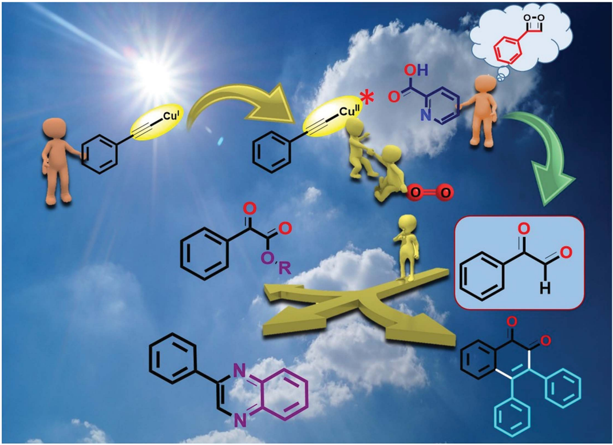

Showcasing research by D. K. Das, V. K. K. Pampana and K. C. Hwang, Department of Chemistry, National Tsing Hua University, Taiwan.

Copper catalyzed photoredox synthesis of α -keto esters, quinoxaline, and naphthoquinone: controlled oxidation of terminal alkynes to glyoxals

An unprecedented visible light-induced copper-catalyzed controlled aerobic oxidation of C ≡ C triple bond in terminal alkynes to glyoxals was reported using alcohols to produce α -ketoesters. Copper(I)-phenylacetylide is the key photocatalyst involved. The superoxide radical anion generated under visible light is responsible for the dioxygen insertion and aerobic oxidation in the presence of a picolinic acid ligand, which plays a crucial role in avoiding the over-oxidation and unwanted homocoupling byproducts from terminal C ≡ C triple bonds.

O-0

## EDGE ARTICLE

Cite this: Chem. Sci. , 2018, 9 , 7318

All publication charges for this article have been paid for by the Royal Society of Chemistry

Received 3rd August 2018 Accepted 28th August 2018

DOI: 10.1039/c8sc03447h

rsc.li/chemical-science

## Introduction

Photoredox catalysis has been proven to be a powerful tool for the construction of new chemical bonds, and has attracted attention from researchers all around the world. 1 Photoredox copper-based complexes have been shown to be an inexpensive, potent catalytic system for various organic transformations. 2 In recent years, the direct introduction of two vicinal functional groups into terminal alkynes via activation of the C ^ C triple bond has become a very attractive process to achieve valuable synthons, bioactive natural products, and their synthetic analogues. 3,4 In particular, catalyzed oxidation of C ^ C triple bonds by transition metal complexes in the presence of molecular O2 plays an important role in the chemical industry. 5 However, it remains very challenging to avoid over-oxidation of C ^ C triple bonds to generate over-oxidized products. 6 Our group has recently reported various visible light-mediated copper(I)-catalysed cross-coupling and C -H annulation reactions. 7 It has been demonstrated that copper(I) phenylacetylide is the key photocatalyst involved in these visible light induced coupling reactions. 7 It was shown that photo-irradiation of

Department of Chemistry, National Tsing Hua University, Hsinchu, Taiwan, Republic of China. E-mail: kchwang@mx.nthu.edu.tw; Fax: +886 35711082

† Electronic supplementary information (ESI) available. CCDC 1584501, 1584500 and 1847226. For ESI and crystallographic data in CIF or other electronic format see DOI: 10.1039/c8sc03447h

‡ D. K. D and V. K. K. P contributed equally to this work.

|

View Article Online View Journal  | View Issue

## Copper catalyzed photoredox synthesis of a -keto esters, quinoxaline, and naphthoquinone: controlled oxidation of terminal alkynes to glyoxals †

Deb Kumar Das, ‡ V. Kishore Kumar Pampana ‡ and Kuo Chu Hwang *

Herein, we report a facile visible light induced copper catalyzed controlled oxidation of terminal C ^ C alkynes to a -keto esters and quinoxalines via formation of phenylglyoxals as stable intermediates, under mild conditions by using molecular O2 as a sustainable oxidant. The current copper catalysed photoredox method is simple, highly functional group compatible with a broad range of electron rich and electron poor aromatic alkynes as well as aliphatic alcohols (1  , 2  and 3  alcohols), providing an e ffi cient route for the preparation of a -keto esters (43 examples), quinoxaline and naphthoquinone with higher yields than those in the literature reported thermal processes. Furthermore, the synthetic utility of the products has been demonstrated in the synthesis of two biologically active molecules, an E. coli DHPS inhibitor and CFTR activator, using the current photoredox process. In addition, we applied this methodology to the one-pot synthesis of a heterocyclic compound (quinoxaline, an FLT3 inhibitor) by trapping the intermediate phenylglyoxal with O -phenylenediamine. The intermediate phenylglyoxal can also be isolated and further reacted with an internal alkyne to form naphthoquinone. This process can be readily scaled up to the gram scale.

copper(I) phenylacetylide in the presence of molecular oxygen can generate Cu(II)-phenylacetylide and a superoxide radical anion via the single electron transfer (SET) process. 7 d The generated superoxide radical anion coordinates to a copper ligand complex, and is responsible for controlled oxidation of the C ^ C triple bond of a terminal alkyne. 7 d Similarly, we envisaged that a terminal alkyne can be transformed into valuable a -keto esters via controlled oxidation. a -Keto ester analogues are considered to be valuable precursors and intermediates for various pharmaceuticals and bioactive molecules. 8 Due to their vast potential, 8 many research groups have put signi  cant e ff orts into the synthesis of these compounds in recent years. 9 Recently, Jiao et al. reported the photoredox catalyzed synthesis of a -keto esters via oxidation of a -aryl halo derivatives using an expensive ruthenium catalyst under sunlight irradiation (Scheme 1a). 10 a Therea  er, the same group described the aerobic oxidative esteri  cation reaction of 1,3diones via C -C bond cleavage at high temperatures (Scheme 1b) 10 b that resulted in the formation of unwanted esters as byproducts. Later on, Song et al. demonstrated the oxidative esteri  cation of acetophenones at high temperatures. 11 Despite signi  cant progress, common major limitations of literature strategies include the use of expensive catalysts, 9 a , d , f ,11 pre-synthesized starting substrates, 9 b ,11 the need for additives or bases, 9 d -g ,10 a ,11 the requirement of stoichiometric amounts of oxidants, 9 a formation of ester byproducts, 10 b harsh reaction conditions, 9 b , c , e -g ,10 b ,11 and poor or no yield of products

Open Access A

Previous Work

(oc) BY

Br

Ph

CO\_R

Ru-photocat.

co-catalyst

LizCOz, sunlight b) Cu-catalyzed aerobic oxidative esterification reaction of 1,3-diones

CuBr/Py

- O2, Toluene, 90 °C byproduct

OR

## Ph

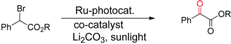

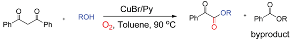

Cul (5mol%)

## \_O-R'

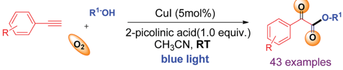

+

ROH

R'-OH

+

- 2-picolinic acid (1.0 equiv.) CH3CN, RT

Scheme 1 Di ff erent synthetic approaches toward a -keto esters.

when 2  or 3  alcohols were used. 9 a -e ,10 b ,11 Therefore, there is a strong need to develop an e ffi cient modality for the construction of a -keto esters that can conquer the above-mentioned limitations. In this communication, we report a visible-lightinduced copper catalyzed synthesis of a -keto esters from the reaction of a variety of alkynes and aliphatic alcohols under mild conditions using O2 as an oxidant (Scheme 1c).

The signi  cance of the present work includes the following: (a) this is the  rst example of oxidation of terminal alkynes to a -keto esters under visible light at room temperature under mild conditions; (b) low toxic, inexpensive CuI was used as a catalyst and abundant O2 as an oxidant, (c) controlled oxidation of the C ^ C triple bond to phenylglyoxals, and thus no formation of ester or homo-coupling byproducts, and (d) a broad substrate scope and compatibility with a wide range of aromatic alkynes and 1  , 2  , or 3  alcohols. To the best of our knowledge, the use of terminal alkynes as a key starting material for the synthesis of a -keto esters under visible light is yet to be reported.

## Results and discussion

When a mixture of phenyl acetylene ( 1a ) (0.5 mmol), MeOH ( 2a ) (2 mL), copper iodide (CuI, 5 mol%), and 2-picolinic acid (1.0 equiv.) as a ligand in CH3CN (4 mL) in the presence of molecular O2 was irradiated under blue LEDs at room temperature for 12 h, it furnished the desired a -keto ester ( 3a ) with a yield of 86% (Table 1, entry 1). When CuI was replaced by other CuX catalysts (X ¼ Cl, Br), the desired product, 3a , was not formed (Table 1, entry 2). The halide anion e ff ect was attributed to the larger size and polarizability and better leaving ability of iodide

Ph

Ph

2

ions in organic solvents as compared to other halide anions, which facilitates easy formation of copper complexes for this reaction. Removal of the copper catalyst or ligand failed to produce 3a (Table 1, entries 3 &amp; 4). When the amount of ligand loading was decreased to 5 or 10 mol%, the conversion of phenyl acetylene to the desired a -keto ester ( 3a ) was low and either the reaction failed or gave trace amounts of the desired product (Table 1, entries 5 &amp; 6). Reaction with 50 mol% of 2picolinic acid as a ligand provided product 3a in 71% yield (Table 1, entry 7), whereas increasing the amount of ligand to 2.0 equivalents gave an a -keto ester in 85% yield (Table 1, entry 8). The yield was similar when 1.0 equivalent of ligand was used (Table 1, entry 1). Increasing or decreasing the amount of ligand failed to increase the yield of the desired product; thus it can be concluded that the optimal amount of the 2-picolinic acid ligand is 1.0 equiv. Replacing the ligand with di-picolinic acid does not a ff ect the yield of 3a (Table 1, entry 9), whereas in the case of 2-amino pyridine as a ligand, we observed a complete inhibition of 3a (Table 1, entry 10). The yield of 3a remains the same in neat MeOH, but tends to decrease in THF and toluene (Table 1, entries 11 -13). Reactions under ambient white light irradiation produced 3a with 82% yield (Table 1, entry 15). Removal of either O2 or light leads to no product formation, indicating their crucial roles in the current protocol (Table 1, entries 16 &amp; 17).

Having established the optimal reaction conditions, we then investigated the scope and applicability of this reaction using di ff erent 1  , 2  and 3  alcohols as substrates for the synthesis of substituted a -keto esters (Table 2). The reactions were performed with various primary alcohols like ethanol ( 2b ), n -propanol ( 2c ), n -butanol ( 2d ) and 2-methylpropan-1-ol ( 2e ), and

a Reaction conditions: 1a (0.50 mmol), MeOH (2 mL), CH3CN (4 mL), ligand (0.5 mmol) and catalyst (0.05 mmol); the reaction mixture was irradiated with blue LEDs (40 mW cm  2 at 460 nm) at RT for 12 h under O2 (1 atm). b Isolated yields. c Other copper salts such as CuX (X ¼ Cl, Br). d 5 mol% of 2-picolinic acid was used. e 10 mol% of 2-picolinic acid was used. f 50 mol% of 2-picolinic acid was used. g 2.0 equiv. of 2-picolinic acid were used. h MeOH (4 mL) was used both as the reactant and solvent. i Under 1 atm. air. j Under ambient white light irradiation (12 h, 8 mW cm  2 at 460 nm). k At room temperature and in the dark. l Under a N2 atmosphere. n.r. ¼ no reaction.

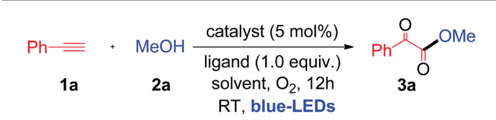

Table 1 Optimization of reaction conditions a

| Entry   | Cu [catalyst]      | Ligand           | Solvent   | Yield b %   |
|---------|--------------------|------------------|-----------|-------------|
| 1       | CuI                | 2-Picolinic acid | CH 3 CN   | 86          |
| 2 c     | Other copper salts | 2-Picolinic acid | CH 3 CN   | n.r         |
| 3       | None               | 2-Picolinic acid | CH 3 CN   | n.r         |
| 4       | CuI                | None             | CH 3 CN   | 0           |
| 5 d     | CuI                | 2-Picolinic acid | CH 3 CN   | 0           |
| 6 e     | CuI                | 2-Picolinic acid | CH 3 CN   | <5          |
| 7 f     | CuI                | 2-Picolinic acid | CH 3 CN   | 71          |
| 8 g     | CuI                | 2-Picolinic acid | CH 3 CN   | 85          |
| 9       | CuI                | Dipicolinic acid | CH 3 CN   | 82          |
| 10      | CuI                | 2-Aminopyridine  | CH 3 CN   | 0           |
| 11 h    | CuI                | 2-Picolinic acid | None      | 86          |
| 12      | CuI                | 2-Picolinic acid | THF       | 65          |
| 13      | CuI                | 2-Picolinic acid | Toluene   | 36          |
| 14 i    | CuI                | 2-Picolinic acid | MeOH      | 76          |
| 15 j    | CuI                | 2-Picolinic acid | MeOH      | 82          |
| 16 k    | CuI                | 2-Picolinic acid | MeOH      | n.r         |
| 17 l    | CuI                | 2-Picolinic acid | MeOH      | n.r         |

the desired product ( 3b -e ) was obtained in good yields at room temperature (Table 2). The current photochemical process also works well for primary alcohols like 2-methoxyethanol ( 2f ) and benzyl alcohol ( 2g ) providing a -keto esters ( 3f and 3g ) in good to excellent yields under similar reaction conditions (Table 2).

Interestingly, cyclopropanemethanol ( 2h ) and tetrahydrofurfuryl alcohol ( 2i ) reacted well with 1a to produce 3h and 3i in 84% and 68% yields, respectively, without cyclic ring opening. Next, 1a reacts with 2  alcohols ( 2j -2l ) smoothly to a ff ord the corresponding a -keto esters ( 3j -3l ) in good yields. Slightly strained or labile alcohols ( 2h , 2i , 2k , and 2l ) worked well in this protocol, without producing any cleavage products, which is not possible using the earlier thermal processes. Besides, 1a reacts with alicyclic 2  alcohols ( 2m -2o ) to a ff ord the desired products ( 3m -3o ) in good yields (Table 2). Unfortunately, this protocol does not work for aromatic alcohols, such as phenol, which was attributed to the fact that phenol is oxidized to p -benzoquinones in the presence of copper and O2. 7 a ,12 The reaction of 1a with tertiary butanol ( 2p ) provided a -keto ester 3p in 70% yield (Table 2). It is worth noting that the transformation of terminal alkynes to a -keto esters using tertiary alcohols has no precedent literature reports. Unfortunately, this protocol does not work for aliphatic amines. Both primary and secondary amines, such as n -propyl amine and piperidine, were used as nucleophiles for the present system, but no a -ketoamide product was observed. Next, a competitive reaction of phenyl acetylene ( 1a ) with equal moles of 1  , 2  and 3  alcohols, such as MeOH ( 2a ), isopropanol ( 2j ) and tertiary butanol ( 2p ), under standard conditions was surveyed, which a ff orded a -keto ester 3a as a major product in 73% yield derived from the 1  alcohol, i.e. , MeOH. Product 3j derived from the 2  alcohol was formed in trace quantities without any a -keto ester 3p resulting from tertiary butanol. For nucleophilic attack on the glyoxal aldehyde, the 3  alcohol is expected to be better than the 2  alcohol and 1  alcohol. This observed result clearly indicates that steric hindrance plays a more important role than the electronic factor, which leads to a predominance of the primary alcohol in the coupling reaction.

Next, the substrate scope of aryl alkynes was examined with di ff erent aliphatic alcohols under the standard conditions (Table 3). The electron neutral and halo-(Cl, F, and I) substituted phenyl acetylenes readily react with aliphatic alcohols to a ff ord the corresponding a -keto esters ( 4b -4j ) with good to excellent yields as depicted in Table 3. Aryl alkynes with strong electron withdrawing and donating (CF3, CN, nitro, acetyl, ester, sulfone, and methoxy) groups showed excellent tolerance in the current photoredox protocol to give the corresponding a -keto esters ( 4k -4t ) in good yields (Table 3). Coppercatalyzed aerobic oxidative coupling reactions involving electron rich substituted terminal alkynes su ff er from homocoupling byproducts. 7 d However, in the current process no homo-coupling product was observed. Notably, the present photoredox process works well for the reaction of 1,3-dialkynes to generate 1,3a -diketo ester products 4u and 4v in good yields when using methanol as the solvent. The synthesis of 1,3-diketo esters is either di ffi cult 8 b ,13 or not achievable by the previously reported thermal processes. However, in contrast, it was easily achieved with the current photoredox process.

Note that when tertiary butanol was coupled with 1,3-dialkyne, only mono a -keto ester 4w was obtained in 81% yield, where the absence of the di-substituted a -keto ester might be due to the steric hindrance e ff ect from the bulky tertiary butyl group in the SN2 reaction. Notably heterocyclic alkynes 2-ethynylthiophenes, 3-ethynylthiophenes and 3-ethynylpyridine, which are usually sensitive to oxidative conditions, also e ff ectively react with 1  , 2  and 3  alcohols to generate the desired a -keto esters ( 4x -4z and 4va ) in moderate to good yields. However, heterocyclic alkynes ethynyl indole and ethynyl pyrimidine failed to give the desired a -keto esters under the current protocol. This protocol was successful in producing a -keto ester 4wa in 83% yield when heteroaryl alkyne 5-ethynyl-1,3benzodioxole was used under similar conditions. Unfortunately, aliphatic terminal alkynes did not work for this protocol and failed to produce the corresponding a -keto esters as products. The reason for the failure of the aliphatic alkynes is most probably due to the lower acidity of aliphatic terminal alkynes as compared to aromatic ones, thus making the step of formation of copper phenylacetylide from aliphatic alkynes slower than that from aromatic alkynes.

Open Access A

(oc) BY

Phi

За, 86%

OMe

R-OH

Phi

3b, 85%

Ph

3f, 90%

Phi

3j, 90%

O

3п°

Ph

За-р

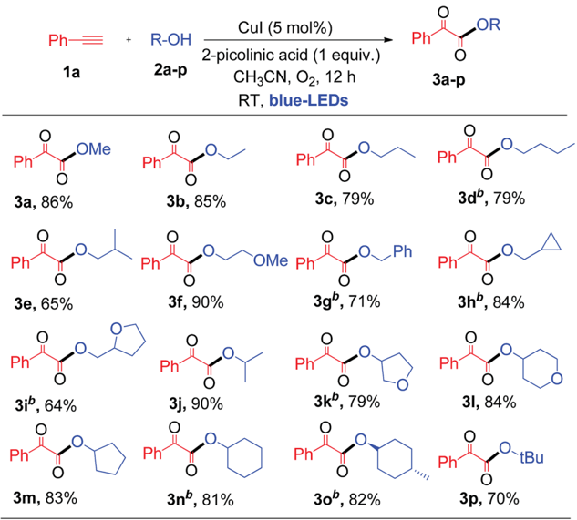

, 81%

a Standard conditions. b 2 mmol of ROH in 4 mL of CH3CN, isolated yields.

Finally, the application of the current visible light-initiated Cu(I)-catalyzed strategy was demonstrated for the expedient synthesis of compounds with biological activity, such as 1-benzyl-3-(3-nitrophenyl)quinoxalin-2(1 H )-one 6n (a CFTR activator) 8 a and bis oxime ester 5t (an E. coli DHPS inhibitor). 8 c Preparation of phenylquinoxalinone 6n could be carried out in 3 steps in 44% overall yield (Scheme 2), which is greener and better than the literature reported method (4 steps with an overall yield of 32%) (Schemes S1 and S2, ESI † ). 8 a

Next, the preparation of bis oxime ester 5t was carried out in 2 steps in 60% overall yield (Scheme 2), which is also better and greener than the literature reported process (4 steps, 25% overall yield) using pre-synthesized starting substrates. 8 c In addition, the current process can be readily scaled up to a gram scale (1.029 g of 3-nitro phenyl acetylene); 1.16 g of 4n was obtained (79% yield) a  er irradiation with blue LEDs for 12 h at room temperature (ESI) and we have further evaluated and compared the green chemistry metrics (Fig. S5 and S6, ESI † ). 7 d The structures of 4n and 6n were con  rmed by single-crystal X-ray di ff raction (Fig. S7 and S8, ESI † ). In addition, compounds 4u , 4v , and 4x can be used as precursors for synthesizing biologically active molecules (Scheme S7, ESI † ).

Synthesis of quinoxaline via double condensation of 1,2phenylenediamines with phenylglyoxals in the presence of a catalyst is a well-established concept in organic synthesis. 14 a Hashmi et al. reported gold and silver bi-metal co-catalyzed synthesis of quinoxaline derivatives from terminal alkynes which involved the oxidation of phenyl acetylene to phenylglyoxals using external oxidant pyridine N-oxide (4 equiv.) 14 b (Scheme S6, ESI † ). Recently, it was shown that quinoxaline derivatives can be synthesized by copper-catalyzed oxidative reaction of phenylglyoxal with o -phenylenediamines. 14 c Inspired by the above literature reports, we hypothesized that controlled oxidation of phenyl acetylene will generate phenylglyoxal as a possible intermediate in the present copper catalyzed photoredox process. Thus, trapping of the phenylglyoxal intermediate with 1,2-phenylenediamines may lead to one-pot synthesis of pharmacologically active 2-phenyl quinoxaline by using a cheaper Cu catalyst and abundant molecular O2 as an oxidant. So, under the same reaction conditions, we added 1.0 equiv. of 4,5-dimethylbenzene-1,2-diamine ( 7 ) to the reaction solution and irradiated it with visible light for 12 h at room temperature (Scheme 3). Not surprisingly, we obtained the corresponding 6,7-dimethyl-2-phenylquinoxaline ( 8 ), which is a biologically active FLT3 inhibitor, 15 in 65% yield as a product in this unprecedented photoredox copper catalyzed one-pot process (Scheme 3). We did not observe the formation of 3phenylquinoxalin-2-ol as a product in the current photoredox method, which was previously reported as a key product under strong basic conditions. 7 g The di ff erence in the formation of products was attributed to the di ff erences in the reaction conditions and thus di ff erent reaction mechanisms (mechanistic comparison, Scheme S7, ESI † ).

Ph

Cul (5 mol%)

2-picolinic acid (1 equiv.)

RT, blue-LEDs

OR

Open Access A

(oc) BY

Cul

2-picolinic acid

1b-v

2a-p

Cul (5 mol%)

2-picolinic acid (1 equiv.)

O OMe ref. 8a

CH3CN, 02

Table 3 Substrate scope of aryl terminal alkynes a

OEt

4b, 87%, 12h

Cul

2-picolinic acid

OMe

MeOH, RT

02

blue-LEDs

4h°, R'=4-CI, R2 = Cy, 78%, 12h

4i°, R'=4-F, R2 = Cy 72%, 12h

OMe

NC

41, 82%, 9h

OMe cO,Me

49, 78%, 12h

4u, 93%, 12h

-OMe

4x, 89%, 12h

6n

08

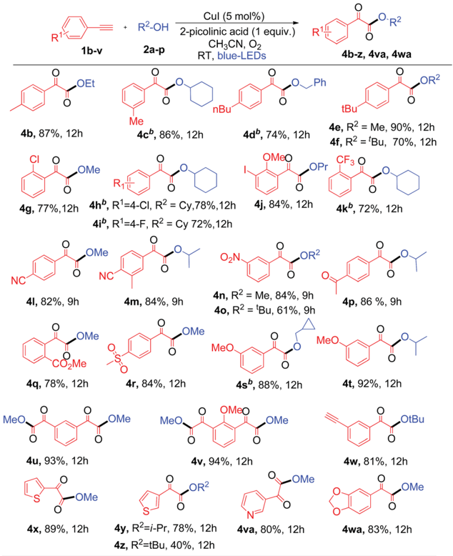

4m, 84%, 9h

‚OMe

4r, 84%, 12h

OMe

MeO.

4y, R'=i-Pr, 78%, 12h

4z, R'=tBu, 40%, 12h

a Standard conditions. b 2 mmol of R -OH in 4 mL of CH3CN.

Scheme 2 Synthesis of biologically active phenylquinoxalinone 6n (CFTR activator) and bis oxime ester 5t (DHPS inhibitor).

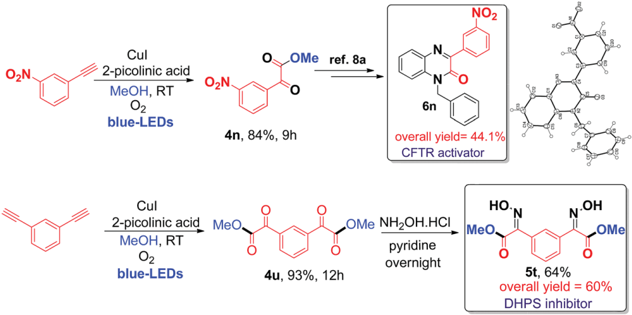

blue-LEDs

4n, 84%, 9h

Me

4c", 86%, 12h

MeO.

R'

\_Ph

NO2

OR2

4b-z, 4va, 4wa

OR2

Open Access A

1a

H2N.

Ph-=-Cu + MeOH

(oc) BY

H2N

Ph== + MeOH

7

(3) n.r.

(4) За

MeOH, 02

RT,

, 12h blue LEDs

Me

Cul (5 mol%)

O2. 2-picolinic acid

2-picolinic acid (1 equiv.).

RT, 12 h, blue-LEDs

За, 40%

Me

CH3CN:MeOH (1:1), O2, optimal condition

blue LEDs, 3 h

N

Me

(1)

Me

8, 65%

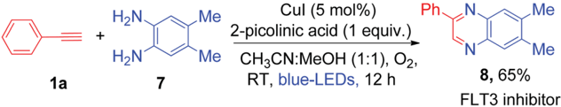

13, 62%

Cul (5 mol%)

Scheme 3 One-pot synthesis of 2-phenyl quinoxaline (an FLT3 inhibitor) by in situ trapping of phenylglyoxal using commercially available substrate 1,2-phenylenediamine.

RT, 12h, blue LEDs

13

RT, 12h, blue LEDs

To provide detailed insights regarding the reaction mechanism, we carried out several control experiments, as shown in Scheme 4. First, pre-synthesized copper(I)-phenylacetylide 1a 0 was reacted with MeOH, in the absence of CuI under similar reaction conditions, which produced the desired a -keto ester ( 3a ) with 40% yield a  er 12 h of irradiation (eqn (1), Scheme 4).

The reduced yield can be attributed to the fact that the isolated Cu(I)-phenylacetylide powder exists in highly aggregated forms. 7 d ,16 This result implies that the in situ -generated Cu(I)phenylacetylide is most probably the key light-absorbing photocatalyst involved in this oxidative coupling reaction. Next, we performed a short-time reaction of 3 h, under the optimal conditions, and we were delighted to isolate phenylglyoxal 13 as a stable intermediate in 62% yield (eqn (2), Scheme 4). Phenylglyoxals are important precursors in organic synthesis, and can be used to construct various biologically active heterocyclic compounds. 14 b ,17 In the literature, very few methods are available for the synthesis of glyoxal derivatives. 14 b The most commonmethodfor the synthesis of phenylgloxal involves SeO2 mediated oxidation of substituted methyl ketones under harsh reaction conditions. 18 Recently, photoredox oxidation of brominated acetophenones to phenylglyoxal was reported using an expensive ruthenium photocatalyst. 19 That method, however, cannot use commercially available phenylacetylene as the starting substrate. In contrast, the synthesis of phenylglyoxal was easily achieved in a short time in our current study under mild reaction conditions using inexpensive copper to catalyze the photoredox process and commercially available aryl alkynes as starting substrates. A  er the isolation of phenylglyoxal, we conducted some key control experiments with 13 for better understanding of the reaction mechanism. First, the reaction of phenylglyoxal with MeOH was carried out in the presence of light and O2, but in the absence of the CuI catalyst, which led to no formation of a -keto ester 3a (eqn (3), Scheme 4). When phenylglyoxal reacted with the solvent MeOH in the presence of 5 mol% CuI catalyst, light and O2, but in the absence of the 2-picolinic acid ligand, only a trace amount of 3a was formed (eqn (4), Scheme 4). When the control reaction was performed in the presence of the CuI catalyst, 2-picolinic acid, O2, and blue light irradiation, 3a was produced in 90% yield (eqn (5),

Scheme 4 Mechanistic control studies.

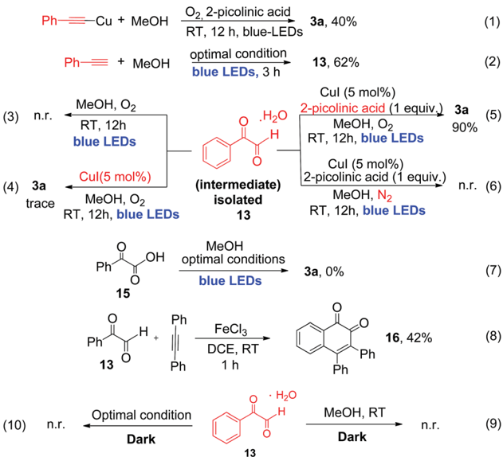

(2)

Ph.

Open Access A

1a

Ph=

+

(oc) BY

2f

1

180

Ph

Cul

180

160

10.

-Cu'

180160-3f

160

· + Ph

.0.

160

160160-3f

9

Scheme 4). If the same reaction was carried out in a N2 atmosphere, no formation of 3a was observed (eqn (6), Scheme 4). From the above control experiments (eqn (3) -(6), Scheme 4), it is very clear that the CuI catalyst, 2-picolinic acid ligand, O2, and blue light irradiation all are very crucial factors for the formation of the a -keto ester product 3a . :

total yield: 92%

A la

(Ph

02-

Selective oxidation of terminal alkynes to glyoxal, free from the subsequent over-oxidation to glyoxalic acid, is a very challenging reaction in synthetic chemistry. 6 In our current protocol, selective oxidation of phenyl acetylene to phenyl glyoxal was achieved successfully and no phenyl glyoxalic acid resulting from over-oxidation was observed. Thus, when phenyl glyoxalic acid 15 was reacted with MeOH under the same conditions, we did not observe product 3a , which clearly suggests that over-oxidation of glyoxal to glyoxalic acid 20 did not occur under the current reaction conditions (eqn (7), Scheme 4). 2-Picolinic acid plays a crucial role in avoiding the formation of the homocoupling product from copper phenylacetylide (which is a common side product in a reaction involving terminal alkynes in the presence of a copper catalyst) and it directs the system to activate terminal C ^ C bonds via controlled oxidation to phenylglyoxal. It is documented in the literature that

Scheme 5 Isotopic labelling experiment.

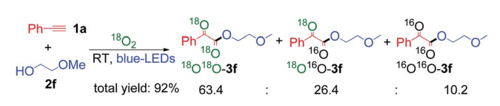

nitrogen containing ligands can reduce the formation of polymeric byproducts and Glaser alkyne -alkyne homocoupling products. 21 a Hence the optimal amount of ligand is found to be 1.0 equivalent due to the above-mentioned facts. Formation of the polymeric form of Cu(II) bis-picolinate (single crystal X-ray, Fig. S9, ESI † ) might be one of the reasons for the decrease in the yield when the reaction was carried out with 5 and 10 mol% of 2-picolinic acid as a ligand. Also due to the amphoteric nature of 2-picolinic acid, 21 b it can help maintain the acidic pH of the reaction mixture, thus avoiding the over-oxidation of phenyl glyoxal to glyoxalic acid. Therefore, an excess amount of 2picolinic acid ( i.e. , 1 equiv.) ligand, instead of a catalytic amount, is required to achieve the optimal product yield. Next, phenylglyoxal 13 , isolated from the current photoredox process, could readily react with an internal alkyne for the synthesis of 1,2-naphthoquinone 16 , via oxidative annulation reaction 22 (eqn (8), Scheme 4). Furthermore, reaction of phenylglyoxal 13 with MeOH was carried out under O2 in the absence of light, i.e. , under dark conditions, which leads to no formation of a -keto ester 3a (eqn (9) and (10), Scheme 4). This result clearly demonstrates that light irradiation is required for the transformation of phenyl glyoxal to the a -keto ester product. Most probably, the transformation of phenyl glyoxal to the a -keto ester product requires the help of the copper superoxide radical, which cannot be generated in the absence of light irradiation. The superoxide radical anion was generated under visible light irradiation of Cu(I)-phenylacetylide, and is responsible for controlled aerobic oxidation of phenyl glyoxal to a -ketoesters.

Scheme 6 Plausible mechanism for the formation of a -keto esters.

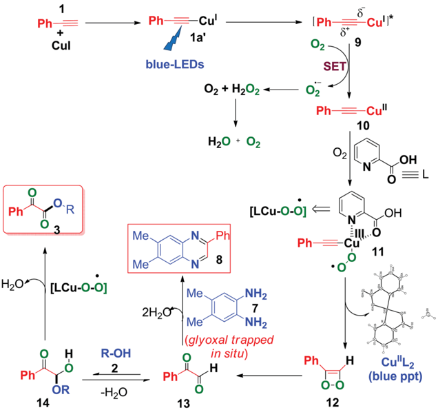

St

Cull*

Finally, an isotopic labeling experiment was carried out in the presence of 18 O2 (98%), instead of 16 O2 air, under the standard conditions (Scheme 5). 18 O labeled a -keto esters 3f were obtained, with a ratio of 18 O 18 O3f : 18 O 16 O3f : 16 O 16 O3f ¼ 63.4 : 26.4 : 10.2 (Scheme S9 ESI † ). These results unambiguously indicate that the oxygen atoms in the a -keto ester products mainly originate from molecular O2. The 18 O 16 O3f product was most probably formed via a partial exchange with the moisture in air or during the silica gel column puri  cation process. 19 It should be noted that the compounds containing 1,2-diketo groups are active, and the oxygen of carbonyl can be exchanged via hemiketal with the oxygen of water in air. 5 b ,23

Based on the above control experiments and our previous studies, 7 c , d a plausible mechanism was proposed and is shown in Scheme 6. Photoexcitation of in situ -generated Cu(I)-phenylacetylide ( 1a 0 ) (UV-visible spectrum, Fig. S6, ESI † ) generates a long lived ( s ¼ 15.9 m s) triplet excited state Cu(I)-phenylacetylide ( 9 ) 7 c , d with partial charge separation occurring via ligand to metal charge transfer (LMCT). 7 c , d Thus the photoexcited Cu(I)-phenylacetylide then donates an electron to molecular O2 ( i.e. , a SET process) to generate a superoxide radical anion (O2 c  ) and an electron de  cient Cu(II)-phenylacetylide ( 10 ), 7 c , d which was con  rmed by EPR measurements by using 5,5-dimethyl-1-pyrrolineN-oxide (DMPO) as a selective superoxide spin trapping reagent (Fig. S2, ESI † ). Next, coordination of 2-picolinic acid (L) to Cu(II)-phenylacetylide and subsequent reaction to molecular O2 results in the formation of copper(III)superoxo complex 11 . 7 c ,24 Isomerization rearrangement of the resulting Cu(III)-peroxo complex ( 11 )occurs with concurrent formation of a C -O bond to form the intermediate ( 12 ). 23 Subsequent O -O bond cleavage of the intermediate ( 12 ) produces 2-oxo-2-phenylacetaldehyde ( 13 ) and Cu II (pic)2 was eliminated as a blue ppt (Fig. S1 and S9, ESI † ). 25 Furthermore, a nucleophilic attack on 13 by alcohol 2 on the electron de  cient carbonyl group a ff ords hemiacetal intermediate 14 , 9 c ,11 which further undergoes copper catalysed aerobic oxidation 26 to produce a -keto esters ( 3 ). When 4,5-dimethylbenzene-1,2diamine ( 7 ) was present in the reaction mixture, it trapped the in situ -generated phenylglyoxal 13 via intermolecular double condensation reaction to produce 6,7-dimethyl-2phenylquinoxaline ( 8 ) in a one-pot manner, as shown in Scheme 6.

In the presence of 4,5-dimethylbenzene-1,2-diamine, the formation of a -keto esters was suppressed, due to the fact that o -phenylene diamine acts as a better nucleophile (N is less electronegative than O) to phenylglyoxal than alcohol ( 2 ), thus favouring the formation of 2-phenyl quinoxaline ( 8 ), instead of the formation of hemiacetal ( 14 ).

## Conclusion

In summary, we have developed an unprecedented visible light induced copper catalyzed process for the controlled aerobic oxidation of the terminal C ^ C triple bond to phenylglyoxal at room temperature, followed by esteri  cation, for the synthesis of a -keto esters that evades the need for a base, an expensive catalyst, strong oxidants, elevated temperatures and other harsh reaction conditions. The reaction proceeds easily with excellent functional group tolerance towards the electron donating and withdrawing terminal alkynes. Moreover, it is compatible with 1  , 2  , and 3  alcohols and slightly strained or labile alcohols, which is not possible or di ffi cult in thermal processes. The utility of this protocol has also been successfully applied for the synthesis of two biologically active molecules, i.e. , 1-benzyl-3-(3nitrophenyl) quinoxalin-2(1 H )-one (a CFTR activator) and bis oxime ester (an E. coli DHPS inhibitor) on a gram scale with fewer steps and higher total yields than those in the literature reported processes. We have also demonstrated the one-pot synthesis of a pharmacologically active heterocyclic compound, i.e. , 2-phenyl quinoxaline (an FLT3 inhibitor) via an unprecedented photoredox copper catalyzed process, as well as the synthesis of naphthoquinone using phenylglyoxal isolated from the current photoredox process.

## Confl icts of interest

There are no con  icts to declare.

## Acknowledgements

This work was supported by the Ministry of Science &amp; Technology, Taiwan.

## References

- 1 ( a ) M. H. Shaw, J. Twilton and D. W. C. MacMillan, J. Org. Chem. , 2016, 81 , 6898; ( b ) D. M. Schultz and T. P. Yoon, Science , 2014, 343 , 985; ( c ) C. K. Prier, D. A. Rankic and D. W. C. MacMillan, Chem. Rev. , 2013, 113 , 5322.
- 2 ( a ) O. Reiser, Acc. Chem. Res. , 2016, 49 , 1990; ( b ) Q. M. Kainz, C. D. Matier, A. Bartoszewicz, S. L. Zultanski, J. C. Peters and G. C. Fu, Science , 2016, 351 , 681.
- 3 ( a ) R. Dorel and A. M. Echavarren, Chem. Rev. , 2015, 115 , 9028; ( b ) G. Fanga and X. Bi, Chem. Soc. Rev. , 2015, 44 , 8124.
- 4 ( a ) Q. Lu, J. Zhang, G. Zhao, Y. Qi, H. Wang and A. Lei, J. Am. Chem. Soc. , 2013, 135 , 11481; ( b ) P. Pandit, K. S. Gayen, S. Khamarui, N. Chatterjee and D. K. Maiti, Chem. Commun. , 2011, 47 , 6933; ( c ) H.-T. Qin, X. Xu and F. Liu, ChemCatChem , 2017, 9 , 1409.
- 5 ( a ) X.-X. Peng, D. Wei, W.-J. Han, F. Chen, W. Yu and B. Han, ACS Catal. , 2017, 7 , 7830; ( b ) C. Zhang and N. Jiao, J. Am. Chem. Soc. , 2010, 132 , 28.
- 6 ( a ) S. Kolle and S. Batra, Org. Biomol. Chem. , 2016, 14 , 11048; ( b ) W. Pritzkow and T. S. S. Rao, J. Prakt. Chem. , 1985, 327 , 887.
- 7 ( a ) A. Sagadevan, V. P. Charpe, A. Ragupathi and K. C. Hwang, J. Am. Chem. Soc. , 2017, 139 , 2896; ( b ) A. Ragupathi, V. P. Charpe, A. Sagadevan and K. C. Hwang, Adv. Synth. Catal. , 2017, 359 , 1138; ( c ) A. Ragupathi, A. Sagadevan, C.-C. Lin, J. R. Hwu and K. C. Hwang, Chem. Commun. , 2016, 52 , 11756; ( d ) A. Sagadevan, P. C. Lyu and K. C. Hwang, Green Chem. , 2016, 18 , 4526; ( e ) A. Sagadevan, A. Ragupathi and K. C. Hwang, Angew. Chem., Int. Ed. , 2015, 54 , 13896; ( f ) A. Sagadevan,

- A. Ragupathi, C.-C. Lin, J. R. Hwu and K. C. Hwang, Green Chem. , 2015, 17 , 1113; ( g ) A. Sagadevan, A. Ragupathi and K. C. Hwang, Photochem. Photobiol. Sci. , 2013, 12 , 2110; ( h ) V. P. Charpe, A. A. Hande, A. Sagadevan and K. C. Hwang, Green Chem. , 2018, DOI: 10.1039/C8GC01180J.
2. 8 ( a ) J.-H. Son, J. S. Zhu, P.-W. Phuan, O. Cil, A. P. Teuthorn, C. K. Ku, S. Lee, A. S. Verkman and M. J. Kurth, J. Med. Chem. , 2017, 60 , 2401; ( b ) B. A. Boughton, L. Hor, J. A. Gerrard and C. A. Hutton, Bioorg. Med. Chem. , 2012, 20 , 2419; ( c ) B. A. Boughton, R. C. J. Dobson, J. A. Gerrard and C. A. Hutton, Bioorg. Med. Chem. Lett. , 2008, 18 , 460.
3. 9 ( a ) R. M. Laha, S. Khamarui, S. K. Manna and D. K. Maiti, Org. Lett. , 2016, 18 , 144; ( b ) Y. Kumar, Y. Jaiswal and A. Kumar, J. Org. Chem. , 2016, 81 , 12247; ( c ) C. Zhang and N. Jiao, Org. Chem. Front. , 2014, 1 , 109; ( d ) A. Sagar, S. Vidyacharan and D. S. Sharada, RSC Adv. , 2014, 4 , 37047; ( e ) Z. Zhang, J. Su, Z. Zha and Z. Wang, Chem. -Eur. J. , 2013, 19 , 17711; ( f ) A. Nagaki, D. Ichinari and J. Yoshida, Chem. Commun. , 2013, 49 , 3242; ( g ) H. Shimizu and M. Murakami, Chem. Commun. , 2007, 2855.
4. 10 ( a ) Y. Su, L. Zhang and N. Jiao, Org. Lett. , 2011, 13 , 2168; ( b ) C. Zhang, P. Feng and N. Jiao, J. Am. Chem. Soc. , 2013, 135 , 15257.
5. 11 X. Xu, W. Ding, Y. Lin and Q. Song, Org. Lett. , 2015, 17 , 516.
6. 12 S. E. Allen, R. R. Walvoord, R. Padilla-Salinas and M. C. Kozlowski, Chem. Rev. , 2013, 113 , 6234.
7. 13 ( a ) E. Girotto, M. Ferreira, P. Sarkar, A. Bentaleb, E. A. Hillard, H. Gallardo, F. Durola and H. Bock, Chem. -Eur. J. , 2015, 21 , 7603; ( b ) C. G. Screttas, B. R. Steele, M. M. Screttas and G. A. Heropoulos, Org. Lett. , 2012, 14 , 5680.
8. 14 ( a ) S. V. More, M. N. V. Sastry and C.-F. Yao, Green Chem. , 2006, 8 , 91; ( b ) S. Shi, T. Wang, W. Yang, M. Rudolph and A. S. K. Hashmi, Chem. -Eur. J. , 2013, 19 , 6576; ( c )
- K. Gopalaiah, A. Saini, S. N. Chandrudu, D. C. Rao, H. Yadav and B. Kumar, Org. Biomol. Chem. , 2017, 15 , 2259.
10. 15 S. G¨ oring, D. Bensinger, E. C. Naumann and B. Schmidt, ChemMedChem , 2015, 10 , 511.
11. 16 J. E. Heinand and V. V. Fokin, Chem. Soc. Rev. , 2010, 39 , 1302.
12. 17 ( a ) W.-J. Xue, Q. Li, Y.-P. Zhu, J.-G. Wang and A.-X. Wu, Chem. Commun. , 2012, 48 , 3485; ( b ) H. Jiang, H. Huang, H. Cao and C. Qi, Org. Lett. , 2010, 12 , 5561; ( c ) W. Hu, M. Li, G. Jiang, W. Wu and H. Jiang, Org. Lett. , 2018, 20 , 3500.
13. 18 ( a ) R. M. Young and M. T. Davies-Coleman, Tetrahedron Lett. , 2011, 52 , 4036; ( b ) B. Harikrishna and S. Batra, Eur. J. Org. Chem. , 2012, 2935.
14. 19 P. Natarajan, Manjeet, N. Kumar, S. Devi and K. Mer, Tetrahedron Lett. , 2017, 58 , 658.
15. 20 J. Zhuang, C. Wang, F. Xie and W. Zhang, Tetrahedron , 2009, 65 , 9797.
16. 21 ( a ) P. Leophairatana, S. Samanta, C. C. De Silva and J. T. Koberstein, J. Am. Chem. Soc. , 2017, 139 , 3756; ( b ) B. Garc´ ı a, A. Ibeas and J. M. Leal, J. Phys. Org. Chem. , 1996, 9 , 593.
17. 22 C.-H. Hung, P. Gandeepan, L.-C. Cheng, L.-Y. Chen, M.-J. Cheng and C.-H. Cheng, J. Am. Chem. Soc. , 2017, 139 , 17015.
18. 23 X. Zhu, P. Li, Q. Shi and L. Wang, Green Chem. , 2016, 18 , 6373.
19. 24 ( a ) L. Kussmaul and J. Hirst, Proc. Natl. Acad. Sci. U. S. A. , 2006, 103 , 7607; ( b ) K. K. Toh, Y.-F. Wang, E. P. J. Ng and S. Chiba, J. Am. Chem. Soc. , 2011, 133 , 13942.
20. 25 ( a ) I.-R. Jeon, R. Ababei, L. Lecren, Y.-G. Li, W. Wernsdorfer, O. Roubeau, C. Mathoniere and R. Clerac, Dalton Trans. , 2010, 39 , 4744; ( b ) N. Yasumatsu, Y. Yoshikawa, Y. Adachi and H. Sakurai, Bioorg. Med. Chem. , 2007, 15 , 4917.
21. 26 O. Das and T. K. Paine, Dalton Trans. , 2012, 41 , 11476.