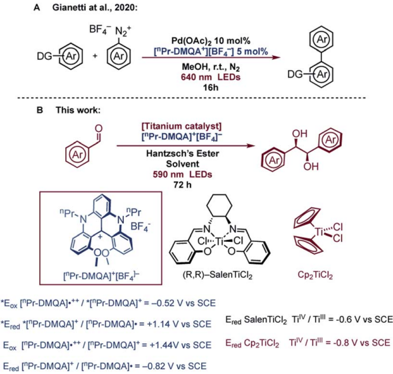
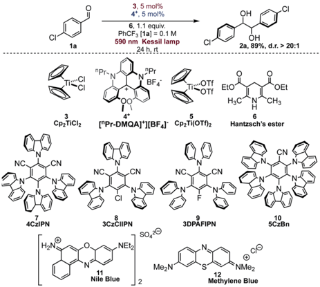
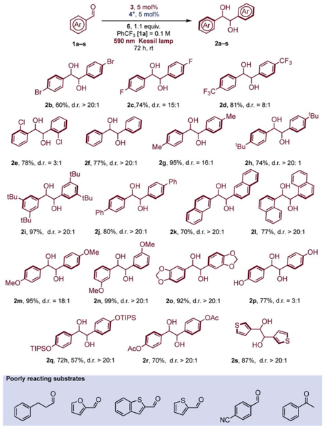
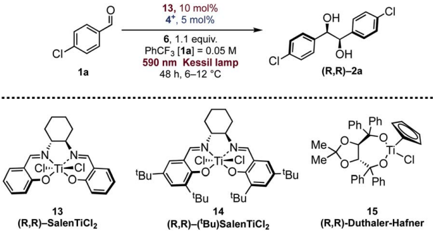
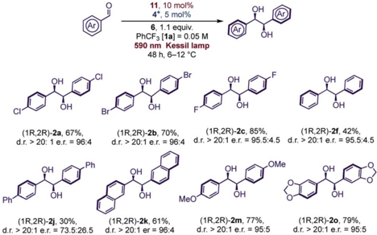
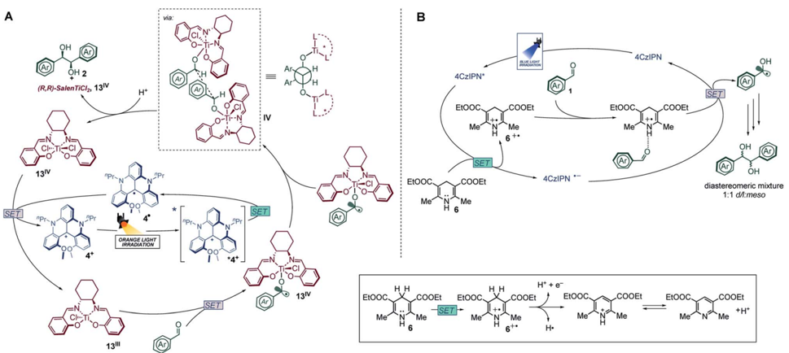

## Chemical Science

## EDGE ARTICLE

Cite this: Chem. Sci. , 2022, 13 , 5973

All publication charges for this article have been paid for by the Royal Society of Chemistry

Received 8th February 2022 Accepted 21st April 2022

DOI: 10.1039/d2sc00800a

rsc.li/chemical-science

## Introduction

Photoredox catalysis 1 has become a powerful methodology to access radical intermediates. 2 The ability to convert visible light into chemical energy, mainly by SET (single electron transfer) processes, enables the exploration of new challenging chemical transformations. 3 Thus, avoiding the use of classical radical initiators or stoichiometric metal reagents, visible lightmediated photoredox catalysis can serve as a simple method to generate ketyl radicals, allowing interesting transformations and providing alternative methods to the traditional approaches for the generation of these reactive intermediates. 4 The  rst example of generation of a ketyl radical by visible light

a Dipartimento di Chimica ' Giacomo Ciamician ' , Alma Mater Studiorum -Universit` a di Bologna, Via Selmi 2, 40126 Bologna, Italy. E-mail: andrea.fermi2@unibo.it; andrea.gualandi10@unibo.it; piergiorgio.cozzi@unibo.it

b Laboratorio SMART, Scuola Normale Superiore, Piazza dei Cavalieri 7, 56126, Pisa, Italy

c Center for Chemical Catalysis -C3, Alma Mater Studiorum -Universit` a di Bologna, Via Selmi 2, 40126 Bologna, Italy

† Electronic supplementary information (ESI) available: Screening tests, and further substrates studied. Photophysical measurements, and electrochemical and quenching studies. Detailed procedures, description and copies of NMR spectra for all compounds. See https://doi.org/10.1039/d2sc00800a

‡ These authors contributed equally to this work.

View Article Online View Journal  | View Issue

## Diastereoselective and enantioselective photoredox pinacol coupling promoted by titanium complexes with a red-absorbing organic dye †

Francesco Calogero, ‡ a Giandomenico Magagnano, ‡ a Simone Potenti, ‡ ab Francesco Pasca, a Andrea Fermi, * ac Andrea Gualandi, * ac Paola Ceroni, ac Giacomo Bergamini a and Pier Giorgio Cozzi * ac

The pinacol coupling reaction, a reductive coupling of carbonyl compounds that proceeds through the formation of ketyl radicals in the presence of an electron donor, a ff ords the corresponding 1,2-diols in one single step. The photoredox version of this transformation has been accomplished using di ff erent organic dyes or photoactive metal complexes in the presence of sacri fi cial donors such as tertiary amines or Hantzsch's ester. Normally, the homo-coupling of such reactive ketyl radicals is neither diastereo- nor enantio-selective. Herein, we report a highly diastereoselective pinacol coupling reaction of aromatic aldehydes promoted by 5 mol% of the non-toxic, inexpensive and available Cp2TiCl2 complex. The key feature that allows the complete control of diastereoselectivity is the employment of a red-absorbing organic dye in the presence of a redox-active titanium complex. Taking advantage of the well-tailored photoredox potential of this organic dye, the selective reduction of Ti(IV) to Ti(III) is achieved. These conditions enable the formation of the D,L ( syn ) diastereoisomer as the favored product of the pinacol coupling (d.r. &gt; 20 : 1 in most of the cases). Moreover, employing a simply prepared chiral SalenTi complex, the new photoredox reaction gave a complete diastereoselection for the D,L diastereoisomer, and high enantiocontrol (up to 92% of enantiomeric excess).

was described in 1979 by Kellogg and co-workers, exploiting the ability of [Ru(bpy)3]Cl2 to act as a photocatalyst for the SET reduction and fragmentation of phenacyl sulfonium salts. 5 A  er this report, di ff erent photoredox methodologies have been applied for the formation of new C -C bonds via the generation of ketyl radicals from aldehydes and ketones. 6 A photocatalytic pinacol coupling was described by Rueping and co-workers. 7 This simple and catalytic methodology provides access to symmetrical pinacol and diamine products with good functional group tolerance. This study attracted considerable interest in the chemistry community, and many di ff erent alternative procedures were reported. In particular, the use of [Ir(III)] and [Ru(II)] complexes, 8 organic dyes, 9 and semiconductors 10 has been described in photoredox -mediated pinacol coupling. However, the redox potential of the photocatalyst at the excited state is o  en not su ffi cient for the direct formation of aryl ketyl radicals. 11 Key studies reported by Rueping and other authors have clari  ed that tributylamine [( n -Bu)3N], the sacri  cial stoichiometric reductant, plays another important role. The amine radical cation -formed upon reductive quenching of the photocatalyst by amine -activates the carbonyl group lowering its reduction potential, thus leading to the formation of the ketyl radical. The ketyl radicals dimerize and, a  er protonation, the 1,2-diol products are obtained. In almost all the described catalytic processes, the

Open Access /

(oc) BY-NO

A Gianetti at al., 2020:

DG

MeOH, r.t., N2

640 nm LEDs

DG

promptness of the radical -radical dimerization step is responsible for the formation of a diastereoisomeric mixture of diols, generally in 1 : 1 ratio (D,L : meso ), and the observed diastereoselection is generally low (d.r. up to 1.4 : 1).

We have hypothesized that the generation of [Ti(III)] complexes under photoredox conditions could be a straightforward method to perform the pinacol coupling with high diastereocontrol, as was reported by Gans¨ auer more than 20 years ago, employing manganese as the stoichiometric reductant, and Me3SiCl as the scavenger. 12 Recently, Gans¨ auer, 13 our group, 14 and Shi 15 have reported the generation of [Ti(III)] under photoredox conditions for radical chemistry (allylation reactions, 14 a ,15 b opening of epoxides, 13,15 a propargylations 14 b ). 16 Unfortunately, any attempt to use organic dyes, 17 as well as [Ru(II)] or [Ir(III)] photocatalysts, with [Ti(IV)] complexes, in the presence of Hantzsch's ester or amine-based reductants, gave almost a 1 : 1 ratio of the diastereomeric diols in a model reaction with p -chlorobenzaldehyde. This was probably due to a fast and e ff ective reaction performed by the photoredox catalysts, with no participation of the titanium complex. In addition, Hantzsch's ester, used in stoichiometric amount in our attempts, displays a non-negligible absorption feature at 400 nm and it is a strong reductant in its excited state. 18 In order to avoid the direct formation of ketyl radicals due to the photocatalyst or Hantzsch's ester, a milder photochemical system is needed. This photocatalyst needs to show the capability of reducing titanium, either in its excited state ( via a direct oxidative quenching with titanium), or in its reduced form (upon reductive quenching in the presence of a sacri  cial reductant). In addition, titanium complexes used in photoredox reactions can absorb visible light themselves, acting as the active photocatalysts as illustrated by Gans¨ auer. 13 b

Based on all these limitations, we decided to use a redabsorbing dye, so that the photocatalyst can be selectively excited without concomitant absorption of light by titanium complexes and Hantzsch's ester. Excitation in the low-energy portion of the visible spectrum (orange and red) brings the advantages of decreased harmfulness and high penetration depth through various media, as evidenced by Rovis, who employed red-absorbing osmium complexes to perform metallaphotoredox catalysis. 19 However, due to the potential toxicity of osmium and the di ffi culties related to the preparation of the complexes, we investigated the use of an organic dye for this metallaphotoredox chemistry. 20 Among all organic dyes with the capability of absorbing red light, dimethoxyquinacridinium (DMQA + ), a helical carbenium ion, presents interesting photophysical 21 and electrochemical 22 properties. Lacour et al. used N , N 0 -dipropyl-1,13-dimethoxyquinacridinium tetra  uoroborate ([ n Pr-DMQA] + [BF4]  ) in aerobic photooxidation of benzylamine. 23 More recently, the use of [ n Pr-DMQA] + [BF4]  as a new organic photoredox catalyst for photoreduction and photooxidation upon excitation with red light ( l max ¼ 640 nm) with broader applications has been reported. 24 The use of this dye in metallaphotoredox catalysis, combining a photoredox catalytic cycle with metal catalysts such as gold and palladium complexes, has also been reported (Fig. 1A). 24 a The organic dye was prepared in a few steps, and it was robust, and could be isolated by simple

|

Fig. 1 (A) Use of organic red-absorbing dye [ n Pr-DMQA] + [BF4]  in palldium mediated metallaphotoredox catalysis; (B) this work: photoredox pinacol coupling promoted by titanium complexes with a redabsorbing organic dye.

recrystallization. In addition, the redox potential measured for the dye is potentially suitable for the reduction of [Ti(IV)] complexes (Fig. 1). 25 On these bases, we decided to use ([ n PrDMQA] + [BF4]  ) in photocatalytic titanium mediated processes, and herein, we illustrate the implementation of our idea in a highly diastereoselective (&gt;20 : 1 D,L : meso ) pinacol coupling promoted by 5 mol% of the available Cp2TiCl2. Moreover, the application of a simply prepared and available chiral titanium Salen complex gave, in the presence of several aromatic aldehydes, satisfactory yields of the desired pinacol product with a complete diastereoselection in favour of the D,L ( syn ) diastereoisomer, and high enantiomeric excess (up to 92%).

## Results and discussion

In order to study all the parameters for the reaction, we chose p -chlorobenzaldehyde ( 1a ) as the model substrate. The reaction was optimized by varying conditions and in Table 1 we report the salient features about the optimization process.

Hantzsch's ester 6 (HE), photocatalyst [ n Pr-DMQA] + [BF4]  4 + and Cp2TiCl2 3 gave the best results in tri  uorotoluene as solvent under orange light irradiation (Table 1, entry 1). The concurrent presence of the photocatalyst, the titanium complex, and light is mandatory for the successful outcome of the reaction (Table 1, entries 2 -4). As we have already mentioned, the reaction promoted by di ff erent organic dyes such as 7 -10 gave complete conversion but with complete lack of diastereocontrol, leading to a 1 : 1 diastereoisomeric mixture of products (Table 1, entries 5 -8). Other commercially available organic dyes ( 11 and 12 , Table 1, entries 9 and 10), absorbing in the red region of the visible spectrum, were tested under the reaction conditions and no conversion of aldehyde 1a was observed. The reaction with dye 7 under blue light irradiation proceeds smoothly both in the presence and in the absence of the

Open Access /

(oc) BY-NO

CN

4CZIPN

HỌN®

NC

CN

3CzCIIPN

NEL2

11

s0,0

MezN

Nile Blue

3, 5 mol%

4*, 5 mol%

6, 1.1 equiv.

590 nm Kessil lamp

24 h. rt

OH

OH

2a, 89%, d.r. &gt; 20:1

Table 1 Optimization of the pinacol coupling reaction mediated by Cp2TiCl2

CI

BF4

*OT

EtO

H3C

NC

CN

3DPAFIPN

12

Methylene Blue

| Entry a   | Deviation from standard conditions   | Yields b    | d.r. ( D , L : meso ) c   |
|-----------|--------------------------------------|-------------|---------------------------|
| 1         | None                                 | >99(89) d   | >20 : 1                   |
| 2         | No photocatalyst                     | No reaction | -                         |
| 3         | No 3                                 | Traces      | 1 : 1                     |
| 4         | No light                             | No reaction | -                         |
| 5 e       | 7 instead of 4 +                     | >99         | 1 : 1                     |
| 6 e       | 8 instead of 4 +                     | >99         | 1 : 1                     |
| 7 e       | 9 instead of 4 +                     | >99         | 1 : 1                     |
| 8 e       | 10 instead of 4 +                    | >99         | 1 : 1                     |
| 9 e       | 11 instead of 4 +                    | No reaction | -                         |
| 10 e      | 12 instead of 4 +                    | No reaction | -                         |
| 11 e      | 7 Instead of 4 + and No 3            | >99         | 1 : 1                     |
| 12 e , f  | No photocatalyst, No 3               | 50          | 1 : 1                     |
| 13        | Toluene instead of PhCF 3            | >99         | 7 : 1                     |
| 14        | Benzene instead of PhCF 3            | No reaction | -                         |
| 15        | DMF instead of PhCF 3                | 53          | 1 : 2                     |
| 16        | MeCN instead of PhCF 3               | Traces      | -                         |
| 17        | PhCN instead of PhCF 3               | Traces      | -                         |
| 18        | PhF instead of PhCF 3                | 23          | 3 : 1                     |
| 19        | THF instead of PhCF 3                | Traces      | -                         |
| 20        | 5 Instead of 3                       | No reaction | -                         |

a Reactions performed on a 0.1 mmol scale. b Determined by 1 H NMR analysis using the internal standard method. c Determined by 1 H NMR analysis of reaction crude. d Reaction performed on a 0.2 mmol scale; the value in parentheses is the isolated yield a  er chromatographic puri  cation; 4 + was recovered (&gt;90%) a  er chromatographic puri  cation. e Irradiation at 456 nm. f Reaction time 72 h.

titanium complex (Table 1, entries 5 and 11), likely due to the direct formation, via SET from the photocatalyst, of the ketyl radical on the activated carbonyl substrate (see a detailed discussion below). 26 Furthermore, Hantzsch's ester itself is capable of promoting the pinacol coupling reaction under blue light irradiation (Table 1, entry 12). The success of the reaction with dye 4 + and orange light irradiation is also highly dependent on the solvent (Table 1, entries 13 -19).

While THF or MeCN gave only traces of the desired product, the reaction proceeded with good diastereoselection in aromatic solvents (benzene excluded). Among all the aromatic solvents, yield and diastereoselectivity were optimal in tri  uorotoluene due to its documented inertness towards freeradical intermediates. 27 When these reactions were conducted in more conventional solvents, such as MeCN, benzene, or THF, yields are diminished, or no reaction is observed.

No formation of the pinacol product was observed for the titanium complex 5 , suggesting that the presence of stronger Obased ligands in place of weakly bound chloride is detrimental for the titanium complex reactivity (Table 1, entry 20).

The reaction conditions were found to be suitable with a variety of aromatic aldehydes (Scheme 1) but a prolonged reaction time of 72 h was necessary for full conversion of the substrates. Some limitations of the methodology were

Open Access /

(oc) BY-NO

1a-s

2b, 60%, d.r. &gt; 20:1

OH

OH CI

OH

OH

OH

TIPSO

3, 5 mol%

4*, 5 mol%

590 nm Kessil lamp

72 h, rt

OH

2a-s

Scheme 1 Scope of the diastereoselective pinacol coupling promoted by Cp2TiCl2.

observed with heterocyclic aldehydes, due to reaction conditions (formation of acidic oxidized Hantzsch's ester) or inherent reduced reactivity, while ketones or aliphatic aldehydes were found to be unreactive (see Scheme 1 and Fig. S6 † for details).

In general, aromatic aldehydes bearing alkoxy groups (R ¼ alkyl, Scheme 1) at the para position were found to be more reactive and the products were isolated in high yields. This behavior was also observed with moderate activating groups such as a methyl substituent. For aromatic aldehydes, the protection of the oxygen at the para position is not required since aldehyde 1p was found to be reactive under the reaction conditions. Introduction of hindered substituent ( 1q ) or electron withdrawing substituent ( 1r ) onto the para OH group was found to reduce the reactivity. In any case, the diastereoselective outcome with these substrates was always excellent. Naphthyl aldehydes ( a 1l and b 1k ) were both reactive substrates, and, as reported in various studies with titanium mediated pinacol coupling, 28 no hindrance was observed with these two substrates. Some aldehydes bearing electron withdrawing groups gave satisfactory yields but a slight drop of diastereoselectivity was observed. This was particularly evident with ortho -chlorobenzaldehyde ( 1e ), probably for a concomitant sterical hindrance. Limitations due to the presence of bulky groups close to carbonyl were also observed in Ti-mediated pinacol coupling with overstoichiometric Zn as sacri  cial reductant. 28 a

## Enantioselective variant

Di ff erent examples of enantioselective catalytic pinacol coupling of aldehydes were reported in the literature, based on the pioneering work developed by Gans¨ auer. 12 Although chiral titanium cyclopentadienyl complexes were employed in enantioselective pinacol couplings with moderate results, 29 titaniumSchi ff base complexes 30 were found to be quite suitable promoters for catalytic titanium-mediated pinacol coupling reactions, 31 and good scope and high enantioselectivity were obtained using di ff erent types of these complexes. 32

Riant 32 a and Joshi 28 a have reported interesting pinacol coupling protocols that gave high enantioselectivities using a titanium-Schi ff base complex. Joshi published a particularly noteworthy study, featuring the use of an unsubstituted chiral SalenTiCl2 complex ( 13 , Table 2), simply prepared from Ti(OiPr)4 and the bis-imine ligand by treatment with TMSCl. The titanium complex was converted in situ into the active Ti(III) species, through reduction with a stoichiometric amount of Zn. As well evidenced by Gans¨ auer, the presence of TMSCl in the reaction mixture was also crucial in order to close the catalytic cycle, upon pinacol silylation and concomitant liberation of Ti(IV) for a successive reduction. Recently, Ti(Salen) was found to be active in other radical mediated processes. 33

Since Schi ff bases are modular and simply prepared from commercially available diamines, and both complexation and isolation of titanium complexes are quite straightforward, we selected two chiral Salen complexes 13 and 14 for a detailed investigation of our photoredox pinacol coupling. We were pleased to  nd promising results with 13 , while 14 and 15 were found to be unreactive (Table 2, entries 1 -3). The conditions were optimized by varying the reaction parameters, as illustrated in Table 2. The presence of light, the titanium complex, and the photocatalyst is crucial for the reaction (Table 2, entries 4 -6). It is worth mentioning that the reaction proceeds smoothly in tri  uorotoluene, while other solvents are ine ff ective (Table 2, entries 8 -12). The stereoselectivity depends on the temperature, whose optimal value was found to be close to 10  C (Table 2, entry 13). With these indications, a series of aromatic aldehydes were subjected to our reaction, and we were pleased to observe good results, reported in Scheme 2. In general, the reaction was found to be e ff ective with unhindered aldehydes. Electronic e ff ects seem not to play a relevant role in the reactions, contrary to Ti(Salen)/Zn mediated reactions. 28 a Sterical e ff ects, in contrast, are detrimental for the enantioselectivity, as ortho substituted aromatic aldehydes were found to be less reactive. Hindrance in the para position lowers the stereoselectivity of the process. Compared to Cp2TiCl2, the SalenTiCl2 mediated protocol was found to feature a slightly reduced reactivity, probably due to the scarce solubility of the complex in the reaction solvent.

Open Access /

(oc) BY-NO

13

1a

13, 10 mol%

4*, 5 mol%

11, 10 mol%

4*, 5 mol%

6, 1.1 equiv.

590 nm Kessil lamp

48 h, 6-12 °C

590 nm Kessil lamp

OH

OH

(R,R)-2a

48 h, 6-12 °C

Table 2 Optimization of the pinacol coupling reaction mediated by chiral titanium complexes

OH

OH

(1R,2R)-2b, 70%,

'Bu d.r. &gt; 20:1 e.r. = 96:4

'Bu

Ph. Ph

OH

MeX

F

Me*

(1R,2R)-2c, 85%, d.r. &gt; 20:1 e.r. = 95.5:4.5 d.r. &gt; 20:1 e.r. = 95.5:4.5

'Bu

14

(R,R)-('Bu)SalenTiCl

- 'Bu

OH

Ph

OMe

(R,R)-Duthaler-Hafner

OH

MeO

(1R,2R)-2k, 61%, d.r. &gt; 20:1 er = 96:4

(1R,2R)-2m, 77%, d.r. &gt; 20:1 e.r. = 95:5

| Entry a   | Deviation from standard conditions   | Yields b   | d.r. ( D , L : meso ) c   | e.r. d ( R , R / S , S )   |
|-----------|--------------------------------------|------------|---------------------------|----------------------------|
| 1         | None                                 | 74(67) e   | >20 : 1                   | 96 : 4                     |
| 2 f       | 14 instead 13 , [ 1a ] 0.1 M         | Traces     | -                         | -                          |
| 3 f       | 15 instead 13 , [ 1a ] 0.1 M         | n.r.       | 1 : 1                     | -                          |
| 4         | No photocatalyst                     | n.r.       | -                         | -                          |
| 5         | No titanium                          | Traces     | 1 : 1                     | 50 : 50                    |
| 6         | No light                             | n.r.       | 1 : 1                     | -                          |
| 7 g       | 10 mol% of ( S , S ) 11              | 49         | 1 : 1                     | 3 : 97                     |
| 8         | Toluene instead of PhCF 3            | Traces     | 1 : 1                     | -                          |
| 9         | MeCN instead of PhCF 3               | n.r.       | 1 : 1                     | -                          |
| 10        | Benzene instead of PhCF 3            | n.r.       | 1 : 1                     | -                          |
| 11        | THF instead of PhCF 3                | Traces     | 7 : 1                     | -                          |
| 12        | DME instead of PhCF 3                | Traces     | -                         | -                          |
| 13        | 25  C instead 6 - 12  C                                      | 92         | 9 : 1                     | 64.5 : 35.5                |

a Reactions performed on a 0.1 mmol scale. b Determined by 1 H NMR analysis using the internal standard method. c Determined by 1 H NMR analysis of reaction crude. d Determined by HPLC analysis on a column with a chiral stationary phase. e Reaction performed on a 0.2 mmol scale. The value in parentheses is the isolated yield a  er chromatographic puri  cation. f 5 mol% of titanium catalyst was used in the reaction. g Reaction time 16 h.

Scheme 2 Scope of the enantioselective photoredox pinacol coupling with ( R , R )-SalenTiCl2.

## Photophysical and mechanistic analyses

To shed light on the reaction mechanism, as for the synthetic protocol, PhCF3 was chosen as the main solvent for the photophysical characterization of photocatalyst 4 + . In agreement with published results, 24 a compound 4 + shows a low energy-lying absorption band with the maximum at 614 nm ( 3 614 nm ¼ 10 300 M  1 cm  1 in CH2Cl2, l onset  680 nm; see Fig. 2A and S8 † ) allowing its excitation with orange light (LED source at l max ¼ 590 nm, see Fig. S1 † ). The emission band of 4 + is peaked at 648 nm -with a lifetime of 12.8 ns and a quantum yield of 0.26 in air-equilibrated PhCF3 solution -corresponding to a spectroscopic energy E 0 -0 of 1.96 eV. The emission decay is not dramatically a ff ected by the presence of molecular oxygen, as expected for  uorescent dyes: a lifetime of 13.8 ns is determined in oxygen-free solutions (Fig. 2B). No phosphorescence has been detected in the visible and NIR spectral regions from deoxygenated PhCF3 solutions at r.t. or in a rigid matrix at 77 K in diethylether : ethanol : PhCF3 mixtures (2 : 1 : 1 v/v/v). The compound shows excellent photostability in solution with no degradation upon prolonged irradiation at 570 nm and 590 nm (see ESI † ), making it a good candidate for an active initiator in photoredox processes. Since 4 + is isolated and used as a racemic mixture, no investigations on electronic circular dichroism nor circular polarized luminescence have been carried out.

With this in hand, the analysis of the luminescence quenching in the presence of the reaction components has been undertaken to draw a mechanistic picture of the chemical reaction occurring upon visible-light excitation of 4 + . The reduction potentials of 4 + have been reported as: E 0( 4 + / 4 c ) ¼

OH

Ph

Open Access /

A

1.0

0.8

0.6

(oc) BY-NO

0.4 1

13lV

300

103.

102

10'

10°

QH2

400

B

1.0

· 0.8

Fig. 2 (A) Absorption (blue line) and fl uorescence spectra (red line) of a PhCF3 solution of 4 + (31 m M) at r. t. ( l ex ¼ 575 nm). (B) Comparison between fl uorescence decays of air-equilibrated (blue dots) and N2saturated (red dots) PhCF3 solutions of 4 + ( ca. 30 m M) at r.t. The corresponding monoexponential fi tting functions are shown as solid lines. The instrument response function (IRF) is also reported (grey dots).

 0.82 V vs. SCE, and E 0( 4 2+ / 4 + ) ¼ +1.44 V vs. SCE in CH2Cl2, 24 a whose polarity is comparable to that of PhCF3. 34 It follows that the excited state of 4 + is able, on a thermodynamic basis, to oxidize substrates whose potential does not exceed +1.14 V vs. SCE and to reduce others whose potential is as low as  0.52 V

4CzIPN

OH

vs. SCE. No relevant quenching mechanism has been observed upon addition of p -chlorobenzaldehyde ( 1a , up to ca. 0.06 M, see Fig. S10 † ), as expected by its low reduction potential ( E pc ¼  1.82 V vs. SCE, irreversible electron transfer process). 11 On the other hand, quenching processes have been observed for the two [Ti(IV)] complexes ( 3 and 13 ) and Hantzsch's ester 6 in airequilibrated solutions, with compound 6 displaying the highest quenching constant ( k q ¼ 1.5 -10 9 M  1 s  1 ; see Fig. S11 -S13 † ). By taking into account the concentrations used for the photocatalytic reaction, comparison between contributions of all substrates to the quenching e ffi ciencies indicates that 6 is the most e ffi cient quencher with a quenching e ffi ciency of ca. 67% compared to ca. 3% in the case of the Ti(IV) complexes (see Fig. S14 † ). 6 can act as an e ffi cient reductant of the dye's excited state ( E 0( 6 c + / 6 ) ¼ 1.0 V vs. SCE), 18 leading to the formation of radical 4 c , which is able, in a second stage, to reduce the Ti(IV) complexes and ultimately triggering the redox activity of the titanium centre towards aldehydes (Fig. 3A). Indeed, Ti(IV) species are characterized by the following reduction potentials: ca.  0.8 V vs. SCE for 3 in CH2Cl2; 25 ca.  0.6 V vs. SCE for 11 in CH2Cl2, 28 a (see Fig. S16 † ), compatible with the reduction potential E 0( 4 + / 4 c ) ¼  0.82 V vs. SCE.

We can now compare the above-mentioned photochemical mechanism upon orange light excitation (Fig. 3A) with the one responsible for the photoreaction in the presence of photocatalysts 7 -12 upon blue light excitation (Fig. 3B and Table 1, entries 5 -9). In the latter case, the excited state of the photocatalyst is reductively quenched by Hantzsch's ester 6 and its reduced form can reduce the aldehyde activated by the oxidized species 6 c + , as previously reported in the literature. 26 Therefore, the titanium complex is not involved in the catalytic mechanism (Table 1, entry 9) and the reaction does not show any stereoselectivity.

Fig. 3 Mechanistic proposal for the photoredox pinacol coupling catalyzed by 4 + in the presence of titanium complexes ( A ) and by TADF dye 7 ( B ).

|

via:

B

EtOOC

Me

COOEt

EtOOC

Me

Me

6

Open Access /

100

90

80

70

60

(oc) BY-NO

50

40

0

10

·

Fig. 4 Enantiomeric excess of the product 2a vs. enantiomeric excess of 13 (see ESI † for the reaction setup and conditions).

In the case of the carbenium photocatalyst 4 + , the  rst photochemical event is again the reductive quenching by 6 , but the reduced photocatalyst 4 c can reduce only the titanium complex and not the aldehyde, giving a high stereocontrol (Fig. 3A). The stereoselective process involves the coupling of two ketyl radicals mediated by two molecules of Ti(Salen). In Fig. 3A we have depicted the diastereoselective/enantioselective step suggesting the encounter of two ketyl radicals. Based on sterical reasons, the approach in which the oxygen and phenyl substituent are in anti -positions is the most favourable, but it was not considered as it would lead to the meso product. Formation of D/L products could be rationalized by a transition state in which the two aryl groups are in a gauche relationship, and the titanium complexes are in the anti -position. 35

As pointed out in a recent calculation carried out by Streu ff 36 on the reaction of carbonyl compounds with nitrile, the radical -radical coupling is the favoured pathway and, as far as the relative position of the titanium complex (Cp2TiCl) coordinated fragment is concerned, the anti -coordination of the titanium is favoured from the energetic point of view. We assume that this coordination is favourable also in the case of pinacol coupling due to the positive non-linear e ff ect (two molecules of titanium are involved in the stereoselective process). This led to the depicted transition states with anti -titanium and gauche con  gurations for the phenyl.

Since many stereoselective protocols involving two M(Salen) complexes (where M is either Co, Cr or Ti) usually display nonlinear e ff ects, 37 due to cooperative bimetallic mechanisms, 38 we have conducted a non-linear e ff ect study by preparing the enantiomerically pure ( R , R )-and ( S , S )-SalenTiCl2 complexes, and using di ff erent ratios of the two complexes to promote the reaction. The result of the study is depicted in Fig. 4. Clearly, a non-linear e ff ect is registered in our reaction. Since Ti(III) complexes are involved in associative or dissociative equilibria (in the case of Cp2TiCl2, the loss of the chloride ligand with the formation of the corresponding cationic complex), 26,39 the e ff ective concentration of active titanium species can be hardly estimated. 40 Although it is di ffi cult to attribute the suitable model to  t the data reported in Fig. 4, the best  tting model to describe the observed curve is (ML)2, indicating a cooperative role played by two Ti(Salen) complexes in the enantiodetermining step. 41

## Conclusions

In conclusion, we have described an e ff ective photoredox diastereoand enantioselective pinacol coupling mediated by titanium complexes. The application of a red-absorbing organic dye, readily available and stable under the reaction conditions, is crucial to obtain excellent yields and avoid the use of stoichiometric amounts of metals as the reductants. The use of orange light in combination with this dimethoxyquinacridinium organic dye 4 + allows the stereoselective coupling of aldehydes mediated by titanium, avoiding undesired processes lacking stereocontrol. The enantioselective process is mediated by a simply prepared Ti(Salen) complex, and good enantiomeric excesses are obtained. These results open new directions and possibilities to many stereoselective photoredox reactions promoted by titanium or other metals with low reduction potentials. In addition, titanium complexed ketyl radicals generated under these conditions could be used in di ff erent types of couplings. These directions will be subjected to further investigations in our laboratory.

## Author contributions

P. G. C. and A. G. conceived the study. Photoredox reactions and preparation of chiral SalenTiCl2 were carried out by F. P., F. C., G. M., and S. P. The latter three authors contributed equally to the experimental studies. Photophysical analysis and interpretation of photophysical data were carried out by A. F., P. C. and G. B. The manuscript was written with the contributions of all authors. All authors have given approval to the  nal version of the manuscript.

## Confl icts of interest

There are no con  icts to declare.

## Acknowledgements

P. G. C. acknowledges the National Project (PRIN 2017 ID: 20174SYJAF) SURSUMCAT ' Raising up Catalysis for Innovative Developments ' for  nancial support of this research. Chiesi Farmaceutici S.p.A. is fully acknowledged for  nancial support of photoredox research in our group and for the supply of Kessil lamps used for these investigations. The University of Bologna is gratefully acknowledged for  nancial support.

## Notes and references

- 1 For key contribution: D. Nicewicz and D. W. C. MacMillan, Science , 2008, 322 , 77 -80. For selected reviews on photoredox catalysis, see: ( a ) T. P. Yoon, M. A. Du and J. Ischay, Nat. Chem. , 2010, 2 , 527 -532; ( b ) J. M. R. Narayanam and C. R. J. Stephenson, Chem. Soc.

Rev. , 2011, 40 , 102 -113; ( c ) J. Xuan and W.-J. Xiao, Angew. Chem., Int. Ed. , 2012, 51 , 6828 -6838; ( d ) K. L. Skubi, T. R. Blum and T. P. Yoon, Chem. Rev. , 2016, 116 , 10035 -10074; ( e ) X. Lang, J. Zhao and X. Chen, Chem. Soc. Rev. , 2016, 45 , 3026 -3038; ( f ) S. P. Pitre, C. D. McTiernan and J. C. Scaiano, Acc. Chem. Res. , 2016, 49 , 1320 -1330; ( g ) M. H. Shaw, J. Twilton and D. W. C. MacMillan, J. Org. Chem. , 2016, 81 , 6898 -6926; ( h ) M. Parasram and V. Gevorgyan, Chem. Soc. Rev. , 2017, 46 , 6227 -6240; ( i ) K. N. Lee and M.-Y. Ngai, Chem. Commun. , 2017, 53 , 13093 -13112; ( j ) Y. -Q. Zou, F. M. Hoermann and T. Bach, Chem. Soc. Rev. , 2018, 47 , 278 -290; ( k ) C. B. Larsen and O. S. Wenger, Chem. -Eur. J. , 2018, 24 , 2039 -2058.

- 2 A. Studer and D. P. Curran, Angew. Chem., Int. Ed. , 2016, 55 , 58 -102.
- 3 G. C. M. Crisenza and P. Melchiorre, Nat. Commun. , 2020, 11 , 803.
- 4 ´ A. P´ eter, S. Agasti, O. Knowles, E. Pyea and D. J. Procter, Chem. Soc. Rev. , 2021, 50 , 5349 -5365.
- 5 T. J. van Bergen, D. M. Hedstrand, W. H. Kruizinga and R. M. Kellogg, J. Org. Chem. , 1979, 26 , 4953 -4962.
- 6 Q. Xia, J. Dong, H. Song and Q. Wang, Chem. -Eur. J. , 2019, 25 , 2949 -2961.
- 7 M. Nakajima, E. Fava, S. Loescher, Z. Jiang and M. Rueping, Angew. Chem., Int. Ed. , 2015, 54 , 8828 -8832.
- 8 For the use of ruthenium complexes in pinacol coupling, see: R. Naumann and M. Goez and, Green Chem. , 2019, 21 , 4470 -4474.
- 9 ( a ) A. Gualandi, A. Nenov, M. Marchini, G. Rodeghiero, I. Conti, E. Paltanin, M. Balletti, P. Ceroni, M. Garavelli and P. G. Cozzi, ChemCatChem , 2021, 13 , 981 -989; ( b ) A. Gualandi, G. Rodeghiero, E. Della Rocca, F. Bertoni, M. Marchini, R. Perciaccante, T. P. Jansen, P. Ceroni and P. G. Cozzi, Chem. Commun. , 2018, 54 , 10044 -10047; ( c ) W. D. Rouch, M. Zhang and R. D. McCulla, Tetrahedron Lett. , 2012, 53 , 4942 -4945; ( d ) T. Shibata, A. Kabumoto, T. Shiragami, O. Ishitani, C. Pac and S. Yanagida, J. Phys. Chem. , 1990, 94 , 2068 -2076; ( e ) S. Okamoto, R. Ariki, H. Tsujioka and A. A. Sudo, J. Org. Chem. , 2017, 82 , 9731 -9736.
- 10 ( a ) G. Han, X. Liu, Z. Cao and Y. Sun, ACS Catal. , 2020, 10 , 9346 -9355; ( b ) M. Liu, L. Tan, R. T. Rashid, Y. Cen, S. Cheng, G. Botton, Z. Mi and C.-J. Li, Chem. Sci. , 2020, 11 , 7864 -7870.
- 11 H. G. Roth, N. A. Romero and D. A. Nicewicz, Synlett , 2016, 27 , 714 -723.
- 12 ( a ) A. Gans¨ auer, Chem. Commun. , 1997, 457 -458; ( b ) A. Gans¨ auer, Synlett , 1997, 363 -364; ( c ) A. Gans¨ aue and D. Bauer, J. Org. Chem. , 1998, 63 , 2070 -2071.
- 13 ( a ) Z. Zhang, R. B. Richrath and A. Gans¨ auer, ACS Catal. , 2019, 9 , 3208 -3212; ( b ) Z. Zhang, T. Hilche, D. Slak, N. Rietdijk, U. N. Oloyede, R. A. Flowers II and A. Gans¨ auer, Angew. Chem., Int. Ed. , 2020, 59 , 9355 -9359.
- 14 ( a ) A. Gualandi, F. Calogero, M. Mazzarini, S. Guazzi, A. Fermi, G. Bergamini and P. G. Cozzi, ACS Catal. , 2020, 10 , 3857 -3863; ( b ) F. Calogero, A. Gualandi, S. Potenti,
- M. Di Matteo, A. Fermi, G. Bergamini and P. G. Cozzi, J. Org. Chem. , 2021, 86 , 7002 -7009.
- 15 ( a ) S. Lin, Y. Chen, F. Li, C. Shia and L. Shi, Chem. Sci. , 2020, 11 , 839 -844; ( b ) F. Li, S. Lin, Y. Chen, C. Shi, H. Yan, C. Li, C. Wu, L. Lin, C. Duan and S. Shi, Angew. Chem., Int. Ed. , 2021, 60 , 1561 -1566.
- 16 For a review, see: A. Fermi, A. Gualandi, G. Bergamini and P. G. Cozzi, Eur. J. Org. Chem. , 2020, 6955 -6965.
- 17 N. A. Romero and D. A. Nicewicz, Chem. Rev. , 2016, 116 , 10075 -10166.
- 18 P.-Z. Wang, J.-R. Chen and W.-J. Xiao, Org. Biomol. Chem. , 2019, 17 , 6936 -6951.
- 19 B. D. Ravetz, N. E. S. Tay, C. L. Joe, M. Sezen-Edmonds, M. A. Schmidt, Y. Tan, J. M. Janey, M. D. Eastgate and T. Rovis, ACS Cent. Sci. , 2020, 6 , 2053 -2059.
- 20 For a review about application of organic dyes in metallaphotoredox catalysis, see: A. Gualandi, M. Anselmi, F. Calogero, S. P. E. Bassan, P. Ceroni and P. G. Cozzi, Org. Biomol. Chem. , 2021, 19 , 3527 -3550.
- 21 ( a ) B. W. Laursen and F. C. Krebs, Angew. Chem., Int. Ed. , 2000, 39 , 3432 -3434; ( b ) I. Hern´ andez Delgado, S. Pascal, A. Wallabregue, R. Duwald, C. Besnard, L. Gu´ en´ ee, C. Nançoz, E. Vauthey, R. C. Tovar, J. L. Lunkley, G. Muller and J. Lacour, Chem. Sci. , 2016, 7 , 4685 -4693.
- 22 T. J. Sørensen, M. F. Nielsen and B. W. Laursen, ChemPlusChem , 2014, 79 , 1030 -1035.
- 23 C. Nicolas, C. Herse and J. Lacour, Tetrahedron Lett. , 2005, 46 , 4605 -4608.
- 24 ( a ) L. Mei, J. M. Veleta and T. L. Gianetti, J. Am. Chem. Soc. , 2020, 142 , 12056 -12061; ( b ) S. M. Stull, L. Mei and T. L. Gianetti, Synlett , 2021, 32 , 337 -343; ( c ) L. Mei, J. Moutet, S. M. Stull and T. L. Gianetti, J. Org. Chem. , 2021, 86 , 10640 -10653.
- 25 T. Liedtke, T. Hilche, S. Klare and A. Gans¨ auer, ChemSusChem , 2019, 12 , 3166 -3171.
- 26 ( a ) G. S. Yedase, M. John and V. R. Yatham, Asian J. Org. Chem. , 2021, 10 , 2916 -2920; ( b ) L. Qi and Y. Chen, Angew. Chem., Int. Ed. , 2016, 55 , 13312 -13315.
- 27 J. J. Maul, P. J. Ostrowski, G. A. Ublacker, B. Linclau and D. P. Curran, in Modern Solvents in Organic Synthesis , ed. P. Knochel, Springer Berlin Heidelberg, Berlin, Heidelberg, 1999, vol. 206, pp. 79 -105.
- 28 ( a ) A. Chatterjee, T. H. Bennur and N. N. Joshi, J. Org. Chem. , 2003, 68 , 5668 -5671; ( b ) Y.-G. Li, Q.-S. Tian, J. Zhao, Y. Feng, M.-J. Li and T.-P. You, Tetrahedron: Asymmetry , 2004, 15 , 1707 -1710.
- 29 Nicholas reported a single example of the use of Brintzinger's [( R , R )-ethylenebis(tetrahydroindeny1)titanium dichloride] in the reaction with benzaldehyde (7 : 1 D,L : meso , 60% e.e.); M. S. Dunlap and K. M. Nicholas, Synth. Commun. , 1999, 29 , 1097 -1106.
- 30 For reviews on Schi ff base metal complexes in asymmetric catalysis, see: ( a ) S. Shaw and J. D. White, Chem. Rev. , 2019, 119 , 9381 -9426; ( b ) K. Matsumoto, B. Saitom and T. Katsuki, Chem. Commun. , 2007, 3619 -3627; ( c ) P. G. Cozzi, Chem. Soc. Rev. , 2004, 33 , 410 -421; ( d ) J. F. Larrow and E. N. Jacobsen, Top. Organomet. Chem. ,

- 2004, 6 , 123 -152; ( e ) L. Canali and D. C. Sherrington, Chem. Soc. Rev. , 1999, 28 , 85 -93.
- 31 M. Bandini, P. G. Cozzi, S. Morganti and A. Umani-Ronchi, Tetrahedron Lett. , 1999, 40 , 1997 -2000.
- 32 For a catalytic non-photoredox enantioselective pinacol coupling mediated by titanium Salen metal complexes, see ref. 28 a and b ; see also:( a ) A. Bensari, J. L. Renaud and O. Riant, Org. Lett. , 2001, 3 , 3863 -3965; ( b ) Y.-G. Li, C. Jiang, J. Zhao, Q.-S. Tian and T.-P. You, Chin. J. Chem. , 2004, 22 , 950 -952; ( c ) J. Wen, J. Zhao, X. Wang, J. Dong and T. You, J. Mol. Catal. A: Chem. , 2006, 245 , 242 -247. For other titanium(III) complexes:; ( d ) J. Wen, J. Zhao and T. You, J. Mol. Catal. A: Chem. , 2006, 245 , 278 -280; for catalytic pinacol coupling with other metals:( e ) J. Sun, Z. Dai, C. Li, X. Pan and C. Zhu, J. Organomet. Chem. , 2009, 694 , 3219 -3221; ( f ) H. Yamamoto and G. Xia, Chem. Lett. , 2007, 36 , 1082 -1087; ( g ) H. Yang, H. Wang and C. Zhu, J. Org. Chem. , 2007, 72 , 10029 -10034.
- 33 For radical reactions mediated by Ti(III) metal complexes, see: ( a ) J. Streu ff , M. Feurer, P. Bichovski, G. Frey and U. Gellrich, Angew. Chem., Int. Ed. , 2012, 51 , 8661 -8664; ( b ) S. G. Robinson, X. Wu, B. Jiang, M. S. Sigman and S. Lin, J. Am. Chem. Soc. , 2020, 142 , 18471 -18482; ( c ) T. McCallum, X. Wu and S. Lin, J. Org. Chem. , 2019, 84 , 14369 -14380; ( d ) X. Wu, W. Hao, K.-Y. Ye, B. Jiang, G. Pombar, Z. Song and S. Lin, J. Am. Chem. Soc. , 2018, 140 , 14836 -14843; ( e ) W. Hao, J. H. Harenberg, X. Wu, S. N. Macmillan and S. Lin, J. Am. Chem. Soc. , 2018, 140 , 3514 -3517.
- 34 B. K. Freed, J. Biesecker and W. J. Middleton, J. Fluorine Chem. , 1990, 48 , 63 -75.
- 35 ( a ) R. J. Enemærke, J. Larsen, G. H. Hjøllund, T. Skrydstrup and K. Daasbjerg, Organometallics , 2005, 24 , 1252 -1262. For further studies, see:( b ) K. Daasbjerg, H. Svith, S. Grimme, M. Gerenkamp, C. M¨ uck-Lichtenfeld, A. Gans¨ auer, A. Barchuk and F. Keller, Angew. Chem., Int. Ed. , 2006, 45 , 2041 -2044.
- 36 J. Streu ff , D. Himmel and S. R. Jounas, J. Chem. Soc., Dalton Trans. , 2018, 47 , 5072 -5082.
- 37 T. Satyanarayana, S. Abraham and H. B. Kagan, Angew. Chem., Int. Ed. , 2009, 48 , 456 -494.
- 38 ( a ) L. E. Martinez, J. L. Leighton, D. H. Carsten and E. N. Jacobsen, J. Am. Chem. Soc. , 1995, 117 , 5897 -5898; ( b ) J. F. Larrow, S. E. Schaus and E. N. Jacobsen, J. Am. Chem. Soc. , 1996, 118 , 7420 -7421; ( c ) K. B. Hansen, J. L. Leighton and E. N. Jacobsen, J. Am. Chem. Soc. , 1996, 118 (44), 10924 -10925; ( d ) R. G. Konsler, J. Karl and E. N. Jacobsen, J. Am. Chem. Soc. , 1998, 120 , 10780 -10781.
- 39 T. Hilche, P. H. Reinsberg, S. Klare, T. Liedtke, L. Sch¨ afer and A. Gans¨ auer, Chem. -Eur. J. , 2021, 27 , 4903 -4912.
- 40 Active titanium catalyst is also in equilibria with dimeric species. See ref. 34 and: ( a ) J. R. Enemærke, G. H. Hjøllund, K. Daasbjerg and T. Skrydstrup, C. R. Acad. Sci., Ser. IIc: Chim. , 2001, 4 , 435 -438; ( b ) J. R. Enemærke, J. Larsen, T. Skrydstrup and K. Daasbjerg, J. Am. Chem. Soc. , 2004, 126 , 7853 -7864.
- 41 Lin recently performed a non-linear e ff ect study to verify whether a Ti(III)(Salen) promoted catalytic reaction operates through a monomeric or multiple centre; see ESI of ref. 31 b. †