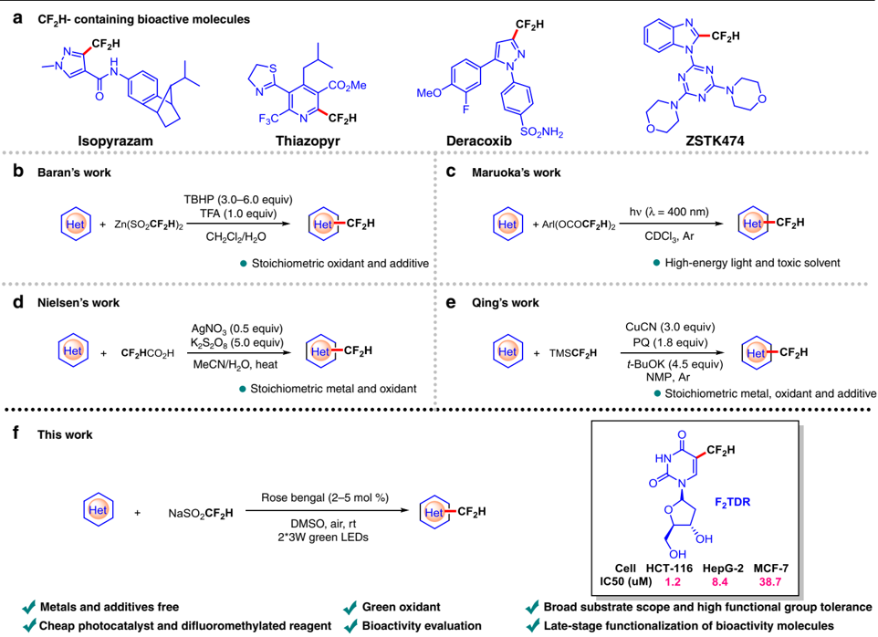
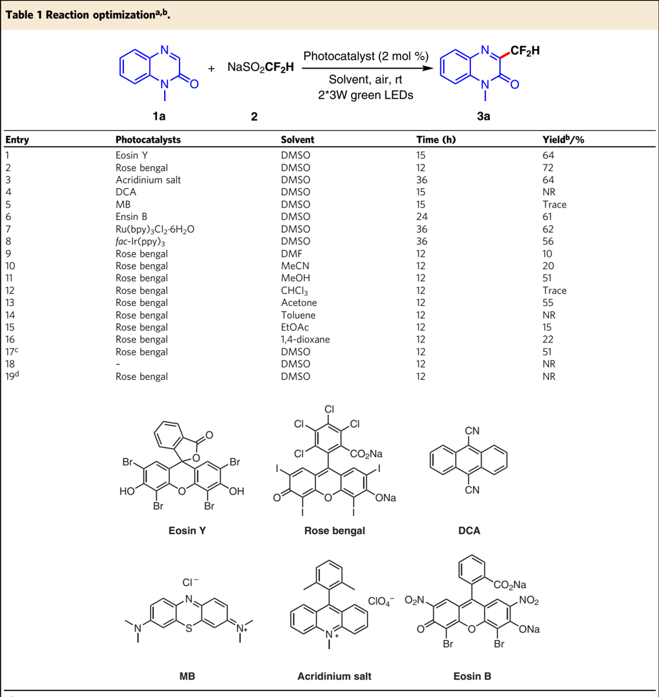
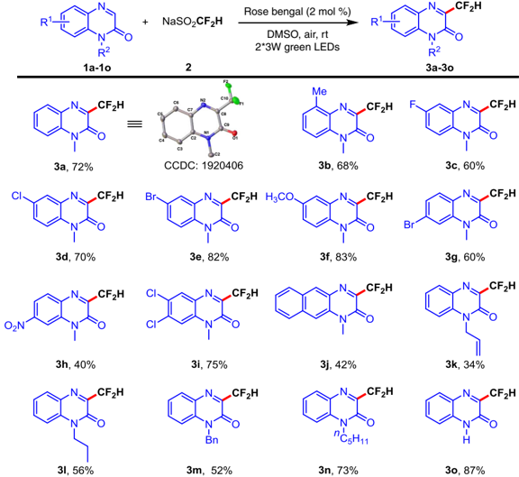
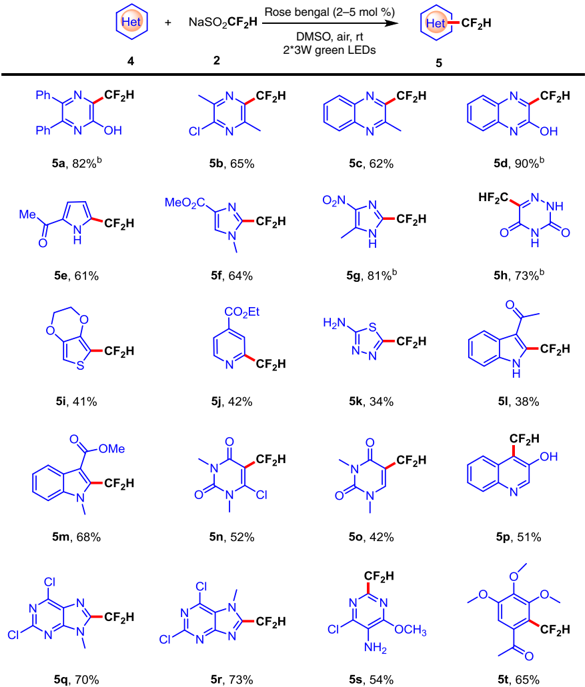
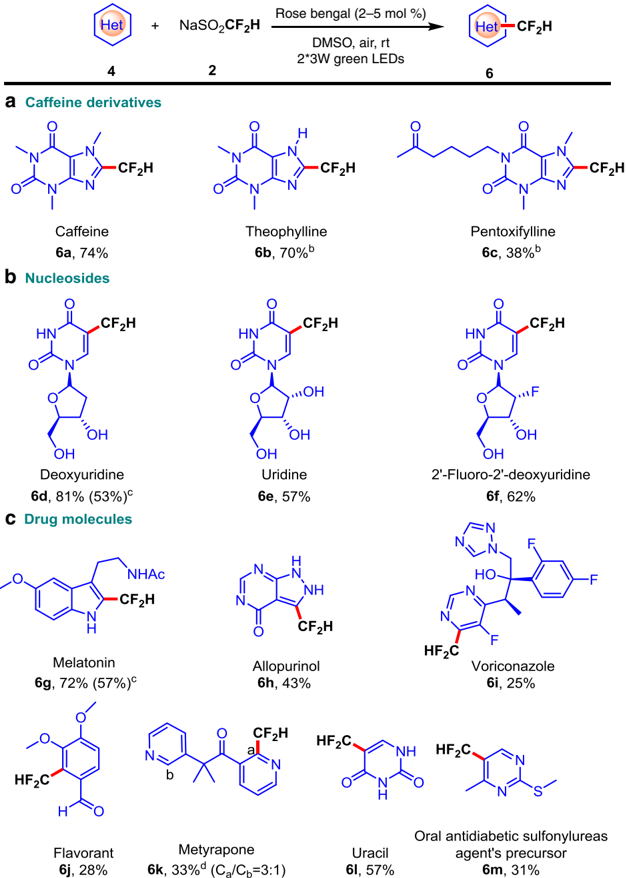
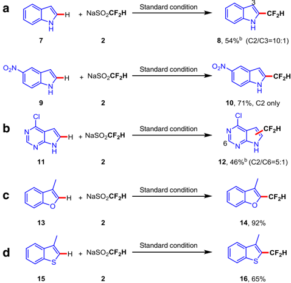
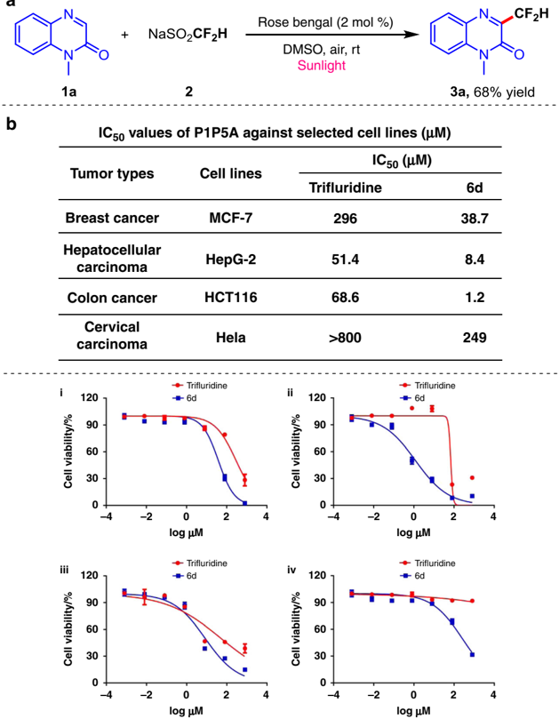
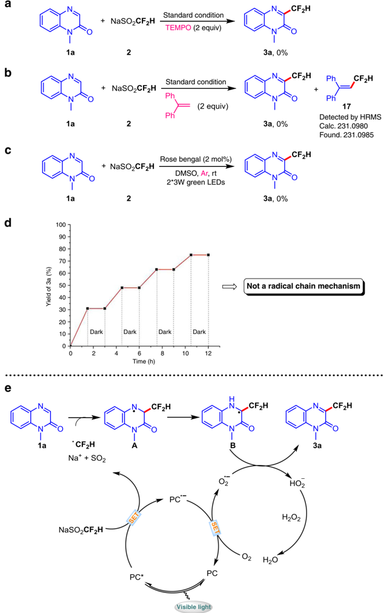

1234567890():,;

## ARTICLE

https://doi.org/10.1038/s41467-020-14494-8

OPEN

## Direct C -H difluoromethylation of heterocycles via organic photoredox catalysis

Wei Zhang 1 , Xin-Xin Xiang 1 , Junyi Chen 2 , Chen Yang 1 , Yu-Liang Pan 1 , Jin-Pei Cheng 1 , Qingbin Meng 2 * &amp; Xin Li 1 *

The discovery of modern medicine relies on the sustainable development of synthetic methodologies to meet the needs associated with drug molecular design. Heterocycles containing difluoromethyl groups are an emerging but scarcely investigated class of organofluoro molecules with potential applications in pharmaceutical, agricultural and material science. Herein, we developed an organophotocatalytic direct difluoromethylation of heterocycles using O2 as a green oxidant. The C -H oxidative difluoromethylation obviates the need for pre-functionalization of the substrates, metals and additives. The operationally straightforward method enriches the efficient synthesis of many difluoromethylated heterocycles in moderate to excellent yields. The direct difluoromethylation of pharmaceutical moleculars demonstrates the practicability of this methodology to late-stage drug development. Moreover, 2 ′ -deoxy-5-difluoromethyluridine (F2TDR) exhibits promising activity against some cancer cell lines, indicating that the difluoromethylation methodology might provide assistance for drug discovery.

1 State Key Laboratory of Elemento-Organic Chemistry, College of Chemistry, Nankai University, Tianjin 300071, China. 2 State Key Laboratory of Toxicology and Medical Countermeasures, Beijing Institute of Pharmacology and Toxicology, Beijing 100850, China. This work is dedicated to the 100th anniversary of Nankai University. *email: nankaimqb@sina.com; xin\_li@nankai.edu.cn

O rgano fl uoro compounds are widely used in the fi elds of pharmaceutical, agricultural, and material science 1 -3 . The introduction of fl uorine atoms or fl uorine-containing groups into the framework of organic molecules often changes the physicochemical properties or biological activities of compounds 4 -8 , and has become an essential topic for chemists. During the past few decades, much attention has been focused on the synthesis of fl uorinated 9 -12 and tri fl uoromethylated molecules 13 -19 . On the other hand, the di fl uoromethyl is also a critical fl uorinated functional group due to its use as a lipophilic hydrogen bond donor. In addition, CF2H group can be considered as the isostere of a thiol, a hydroxyl, and an amide, which brings out its potential value in drug development with novel scaffold 20,21 . However, unlike well-developed synthesis of fl uorinated and trifl uoromethylated compounds, the construction of di fl uoromethylated substances 22 -27 , especially for di fl uoromethylated heterocycles, which widely exist in bioactive molecules (Fig. 1a), has been less explored. The traditional strategies for the synthesis of di fl uoromethylated heterocycles include deoxy fl uorination of aldehydes 28 , di fl uorination of benzylic C -H bonds 29,30 , decarbonylation/decarboxylation di fl uoromethylation 31,32 , cycloaddition reactions 24,33,34 , and conversion of CF2R containing heterocycles precursors 35,36 . However, these above-mentioned methods need expensive and toxic fl uorinating agents, harsh reaction conditions, and are limited in functional group compatibility. Recently, di fl uoromethylation of heteroaromatic compounds catalyzed by transition metals 37 , such as copper, palladium, nickel, has been developed. However, most of these approaches depend on preactivation of substrates (i.e., aryl halides 38 -42 , aryl boronic acids 43 -45 , arylzincs 46 , arenediazonium salts 47 ).

The radical-based di fl uoromethylation method has been developed as an advantageous synthetic strategy for the construction of di fl uoromethylated heterocycles. The pioneering work was reported by Baran and co-workers (Fig. 1b), in which they developed a new di fl uoromethylated reagent Zn(SO2CF2H)2 (DFMS) that can effectively release CF2H radical in the presence of tert -butyl hydroperoxide (TBHP) as a stoichiometric oxidant 48 . Sakamoto et al. presented a photolytic direct C -H di fl uoromethylation of heterocycles using hypervalent iodine(III) reagents that contain di fl uoroacetoxy ligands (Fig. 1c) 49 . Shortly afterward, Tung et al. developed direct di fl uoromethylation of heterocycles using di fl uoroacetic acid as CF2H radical precursors via transition metal catalysis (Fig. 1d) 50 . In 2018, Zhu et al. reported a new strategy through the copper-mediated C -H oxidative di fl uoromethylation of heterocycles with TMSCF2H (Fig. 1e) 51 . It should be noted that these protocols of direct di fl uoromethylation of heterocycles need either expensive/toxic metal catalysts or external oxidants and strictly inert conditions, which narrow the functional group tolerance and limit the substrate scope. During the submission of this manuscript, Duan and Xia reported an ef fi cient photocatalytic strategy for C -H perfl uoroalkylation of quinoxalinones under aerobic oxidation conditions, however, the corresponding di fl uoromethylation has not been reported 52 . Therefore, it is highly desirable to develop new

Fig. 1 Construction of CF2H-containing heterocycles. a Examples of CF2H- bioactive molecules. b TBHP promoted direct difluoromethylation of heterocycles. c High-energy light promoted direct difluoromethylation of heterocycles. d Ag and K2S2O8 co-catalyzed direct difluoromethylation of heterocycles. e Cu and PQ co-catalyzed direct difluoromethylation of heterocycles. f Organic photoredox catalysis triggered direct difluoromethylation of heterocycles.

| Entry   | Photocatalysts         | Solvent     |   Time (h) | Yield b /%   |
|---------|------------------------|-------------|------------|--------------|
| 1       | Eosin Y                | DMSO        |         15 | 64           |
| 2       | Rose bengal            | DMSO        |         12 | 72           |
| 3       | Acridinium salt        | DMSO        |         36 | 64           |
| 4       | DCA                    | DMSO        |         15 | NR           |
| 5       | MB                     | DMSO        |         15 | Trace        |
| 6       | Ensin B                | DMSO        |         24 | 61           |
| 7       | Ru(bpy) 3 Cl 2 ·6H 2 O | DMSO        |         36 | 62           |
| 8       | fac -Ir(ppy) 3         | DMSO        |         36 | 56           |
| 9       | Rose bengal            | DMF         |         12 | 10           |
| 10      | Rose bengal            | MeCN        |         12 | 20           |
| 11      | Rose bengal            | MeOH        |         12 | 51           |
| 12      | Rose bengal            | CHCl 3      |         12 | Trace        |
| 13      | Rose bengal            | Acetone     |         12 | 55           |
| 14      | Rose bengal            | Toluene     |         12 | NR           |
| 15      | Rose bengal            | EtOAc       |         12 | 15           |
| 16      | Rose bengal            | 1,4-dioxane |         12 | 22           |
| 17 c    | Rose bengal            | DMSO        |         12 | 51           |
| 18      | -                      | DMSO        |         12 | NR           |
| 19 d    | Rose bengal            | DMSO        |         12 | NR           |

NR

no reaction.

a The reactions were carried out with 1a (0.2 mmol), CF2HSO2Na 2 (0.4 mmol), photocatalyst (2 mol%) in 1 mL solvent under two 3 W green LEDs irradiation at room temperature. b Isolated yield.

c The photocatalyst loading was decreased to 1 mol%. d In the dark.

approaches to achieve direct C -H di fl uoromethylation of heterocycles, which can overcome the above-mentioned defects and avoid the safety problems with stoichiometric oxidant at a larger scale.

In the past decade, visible-light catalysis has attracted extensive attention, by which highly active radical species generated under mild conditions can be involved in various chemical bond formation 53 -59 . Notably, organic dyes are cheaper and more reliable than expensive metal photoredox catalysts in many valuable reactions 55,56,59 . In this study, we focus our attention on developing an straightforward and practical method for di fl uoromethylation reactions using the inexpensive, commercially available, and user friendly Hu ' s reagent sodium di fl uoromethane sulfonate (CF2HSO2Na) as the di fl uoromethyl radical precursor 60 under mild conditions. This protocol combines organic photocatalysis with green air oxidant for the di fl uoromethylation of many categories of heterocycles. Notably, the di fl uoromethylation product 2 ′ -deoxy5-di fl uoromethyluridine (F2TDR) commendably inhibits the

Fig. 2 Substrate scope of quinoxalin-2(1 H )-ones. Reaction conditions: 1 (0.2 mmol), CF2HSO2Na 2 (0.4 mmol), rose bengal (2 mol%) in 1 mL DMSO under two 3 W green LEDs irradiation at room temperature. Isolated yields based on 1 .

Fig. 3 Substrate scope of heteroaromatics. Reaction conditions: 4 (0.1 mmol), CF2HSO2Na 2 (0.4 mmol), rose bengal (5 mol.%) in 1 mL DMSO under two 3 W green LEDs irradiation at room temperature. Isolated yields based on 4 . b With CF2HSO2Na 2 (0.4 mmol), rose bengal (2 mol%) in 1 mL DMSO.

proliferation of cancer cells, such as HCT116, HepG-2, and MCF-7 (Fig. 1f).

## Results

Investigation of the reaction conditions . We started our investigation by the model reaction of 1-methyl quinoxolin-2-one 1a with CF2HSO2Na 2 as a fl uorine source and eosin Y as a photocatalyst in DMSO at room temperature under green LEDs irradiation. To our delight, the di fl uoromethylation product 3a was obtained in 64% yield (Table 1, entry 1). Then, different photocatalysts were examined (Table 1, entries 2 -8), in which rose bengal (RB) was the best one, providing 3a in 72% yield in 12 h. After identifying the optimal photocatalyst, we found that DMSO was the best reaction media through solvent screening (Table 1, entries 2 and 9 -16). The yield of product reduced obviously when the loading of the photocatalyst was further decreased to 1 mol% (Table 1, entry 17). Control experiments indicated that photocatalyst and green light source were both essential for the reaction ef fi ciency (Table 1, entries 18 and 19).

Scope of quinoxalin-2( 1H )-ones on the phenyl ring . With the optimal reaction conditions in hand, the substrate scope of various quinoxalin-2(1 H )-ones was then investigated. As exhibited in Fig. 2, the reactions worked well with a range of substituted quinoxalin-2(1 H )-ones bearing either electron-donating or -withdrawing substituents (methyl, fl uoro, chloro, bromo, methoxy, nitro, and naphthyl), giving the desired di fl uoromethylation products 3a -3j in moderate to good yields. To highlight the utility of this transformation, a variety of N -substituted quinoxalin-2(1 H )-ones ( 1k -1n ) were also tested. As a result, all the N -substituted quinoxalin-2(1 H )-ones are compatible with the reaction, furnishing the expected products 3k -3n in 34 -73% yields. Notably, N -unsubstituted quinoxalin-2(1 H )-one also proceeded smoothly, delivering the desired product 3o in 87% yield.

Fig. 4 Substrate scope of bioactive molecules. Reaction conditions: 4 (0.1 mmol), CF2HSO2Na 2 (0.4 mmol), rose bengal (5 mol%) in 1 mL DMSO under two 3 W green LEDs irradiation at room temperature. Isolated yields based on 4 . b With CF2HSO2Na 2 (0.4 mmol), rose bengal (2 mol%) in 1 mL DMSO. c Large scale with 2 mmol heteroarenes. d The minor regioisomeric position is labeled with the respective carbon atom number.

Scope of heteroaromatics . To further extend the scope of this methodology, some other heteroaromatic substrates were investigated (Fig. 3). A wide range of fi veand six-membered di fl uoromethylated heteroarenes, such as pyrazines ( 5a and 5b ), quinoxalines ( 5c and 5d) , pyrrole ( 5e ), imidazoles ( 5f and 5g ), thiophene ( 5i ), pyridines ( 5j ), thiadiazole ( 5k ), indoles ( 5l and 5m ), RNA-based dimethyluracils ( 5n and 5o ), quinoline ( 5p ), purine derivatives ( 5q and 5r ), and pyrimidine ( 5 s ), provided fi nal products with good yields. Several heteroarenes with potentially sensitive functional groups (OH, NH2, or CHO) ( 5a , 5k , and 6j ) that are barely reported in the previous study 48 -51 are also compatible with this di fl uoromethylation strategy. Moreover, this direct C -H di fl uoromethylation method also suitable for some arenes ( 5t and 6j ).

Scope of bioactive molecules . The methodology can also be applied to late-stage functionalization of complex nitrogencontaining bioactive molecules (Fig. 4). For example, the modi fi cation of caffeine and its derivatives delivers the desired di fl uoromethylated products 6a -6c in 38 -74% yields. In addition, deoxyuridine, uridine, and 2 ′ - fl uoro-2 ′ -deoxyuridine, which have free OH group as well as amide group, could tolerate this di fl uoromethylation reaction, leading to 6d -6f in 57 -81% yields. Furthermore, melatonin, allopurinol, and uracil, which bear free secondary N -H groups, furnished the di fl uoromethylation reaction with moderate to good yields ( 6g , 6h , and 6l ). Moreover, some other bioactive heteroarene substrates, such as voriconazole, fl avorant, metyrapone, and sulfonylureas, can also proceed well with the reaction, giving the di fl uoromethylated products 6i , 6j , 6k , and 6m in acceptable yields.

Site-selectivity study . The substrate scope results of Figs. 2 -4 show that most of the di fl uoromethylation occurs on the C2 -H bond adjacent to the heteroatom. Some heterocycle substrates bearing more than one radical attacked carbon center were also examined (Fig. 5). As a result, the unsubstituted indole substrate 7 gave the major product at the C2 position in 54% yield with 10:1 regioselectivity. The 5-nitro-substituted indole substrate 9 can obtain a single regioselective di fl uoromethylation product 10 with 71% yield. When 4-chloro-7H-pyrrolo[2,3-d] pyrimidine was used as substrate, the reaction furnish the mixture of product 12 (C2/C6 = 5:1) in 46% yield. Notably, other electron-rich heteroarenes (benzofuran 13 and thianaphthene 15 ), which have not been investigated as substrates in previous reported radical di fl uoromethylation reactions 48 -50 , also exhibited good reaction ef fi ciency, producing the di fl uoromethylation products 14 and 16 in 92% and 65% yield, respectively. Unfortunately, other types of heteroarenes, including phenanthroline, 1,3,5-triazine, and thiazone, are not ideal substrates in this di fl uoromethylation reaction (Supplementary Fig. 2).

Synthetic applications . To evaluate the synthetic potential of this methodology, sunlight-driven experiment was performed. When the reaction was conducted under sunlight irradiation, the desired product 3a was obtained in 68% yield (Fig. 6a). Furthermore, a slight reduction of yields with large scale preparation of 6d and 6g also prove the practicability of this di fl uoromethylation strategy (Fig. 4, yields in parentheses for 6d and 6g ). We further explored the potential application of the synthesized di fl uoromethylated product in medicinal chemistry. The F2TDR 6d has a similar structure to the tri fl uridine, which has been approved by FDA for the treatment of adult patients with metastatic colorectal cancer (for details, see https://www.drugbank.ca/drugs/DB00432). Therefore, we selected four tumor cell lines to evaluate the inhibitory activities of 6d , and made the comparison of the result

Fig. 5 Site-selectivity study. a Regioselectivity for indoles. b Regioselectivity for 4-chloro-7H-pyrrolo[2,3-d] pyrimidine. c Regioselectivity for benzofuran. d Regioselectivity for thianaphthene. Reaction conditions: heterocycles (0.1 mmol), CF2HSO2Na 2 (0.4 mmol), rose bengal (5 mol%) in 1 mL DMSO under two 3 W green LEDs irradiation at room temperature. Isolated yields based on heterocycles. b The minor regioisomeric position is labeled with the respective carbon atom number.

with tri fl uridine. As shown in Fig. 6b, 6d higher tumor cell inhibitory capability than the tri fl uridine with relatively low IC 50 values. Notably, the IC50 values of 6d against HCT116 and HepG2 cells reach low micromolar level, which are about 57- and 6-fold lower than that of tri fl uridine, respectively. The improvement of antitumor activity indicates the practicality of this di fl uoromethylation methodology and the potential in the fi eld of discovery of active drug molecules.

Mechanistic investigations . To gain insights into the current studied reaction, control experiments were conducted. When a radical scavenger, 2,2,6,6-tetramethyl-1-piperidinyloxy (TEMPO) or 1,1-diphenylethylene (Fig. 7a, b) was existing in the mixture containing 1a and CF2HSO2Na, the reaction was completely suppressed, while the radical intermediate was detected by ESIHRMS (Supplementary Fig. 5), indicating the existence of CF2H radical. When the reaction was carried out under inert atmosphere (Fig. 7c), the formation of 3a was completely inhibited, revealing that oxygen is crucial for the reaction. In situ 1 H NMR experiment demonstrated that hydrogen peroxide (H2O2) does not form after irradiation of the reaction mixture in DMSOd 6 for 12 h under the optimized reaction condition. In addition, the observed water peak (H2O) growth indicating that the oxygen was eventually converted to H2O rather than H2O2 (Supplementary Figs. 6 and 7). The generated H2O2 could participate in the catalytic cycle and ultimately converted to H2O as the byproduct 61 . These experimental results illustrated an available radical pathway. Moreover, we also conducted the light/dark experiment. As shown in Fig. 7, the desired product 3a formed only under continuous irradiation, which ruled out the possibility of a radical chain propagation. On the basis of our experimental observations and previous studies 59 , a possible mechanism was proposed (Fig. 7e). Upon absorption of visible light, the

20

20

20

20

90·

90·

- 06

90 -

60

60·

60·

60 -

30

30

30-

30 -

0 +

+ 0

0 +

-4

-4

-4

-4

-2

-2

-2

-2

· Trifluridine

· Trifluridine

· Trifluridine

· Trifluridine

2

2

2

2

4

4

4

4

a

|                          |            | IC 50 ( µ M)   | IC 50 ( µ M)   |
|--------------------------|------------|----------------|----------------|
| Tumor types              | Cell lines | Trifluridine   | 6d             |
| Breast cancer            | MCF-7      | 296            | 38.7           |
| Hepatocellular carcinoma | HepG-2     | 51.4           | 8.4            |
| Colon cancer             | HCT116     | 68.6           | 1.2            |
| Cervical carcinoma       | Hela       | >800           | 249            |

Fig. 6 Synthetic applications. a The reactions were carried out with 4 (0.1 mmol), CF2HSO2Na 2 (0.2 mmol), rose bengal (2 mol%) in 1 mL DMSO under sunlight irradiation at room temperature. b Cytotoxicity of compounds. i MCF-7 (human breast adenocarcinoma cells), ii HepG-2 (human liver hepatocellular carcinoma cells), iii HCT116 (human colorectal cancer cells), and iv Hela (human cervical carcinoma cells) were treated with various concentrations of each compound for 72 h. Cell death was then measured by using a CCK-8 assays ( n = 5, mean ± SD).

photocatalyst RB is excited into RB* ( E red = 0.99 V vs SCE) and a single electron is transferred from CF2HSO2Na 62 ( E = 0.59 V vs SCE) to RB*, which affords CF2H radical and generates an RB · -radical anion. The photoredox cycle is completed by the molecular oxygen oxidation of RB · -, giving RB and O2 · -. After that, addition of CF2H radical to 1a occurs, leading to intermediate A , which undergoes a 1,2-H shift to generate carbon radical intermediate B . The intermediate B loses a hydrogen atom to O2 · -to furnish the desired product 3a .

## Discussion

In summary, we have achieved a visible-light triggered direct C -H di fl uoromethylation of heterocycles by using commercially available and inexpensive sodium di fl uoromethane sulfonate as CF2H radical source. The process is under mild conditions using O2 as a green oxidant and without using metal additive. Furthermore, we also use this highly ef fi cient methodology for direct di fl uoromethylation of some nitrogen-containing biological and pharmaceutical active molecules. In addition, the bioactivity evaluation of a representative di fl uoromethylation product 2 ′ -deoxy-5-di fl uoromethyluridine ( 6d ) exhibited promising activity against cancer cell lines. We expect this simple protocol to be of broad utility for the development of new drugs. Further synthetic applications and bioactivity tests are ongoing.

## Methods

Procedure for difluoromethylation of quinoxalin-2(1 H )-ones . To a 10 mL Schlenk tube equipped with a magnetic stir bar added quinoxalin-2(1 H )-ones 1 (0.2 mmol), CF2HSO2Na 2 (0.4 mmol), and RB (0.004 mmol, 2 mol.%) in DMSO (1.0 mL). Then the mixture was stirred and irradiated by two 3 W green LEDs at room temperature for 12 h. The residue was added water (10 mL) and extracted with ethyl acetate (5 mL × 3). The combined organic phase was dried over Na2SO4. The resulting crude residue was puri fi ed via column chromatography on silica gel to afford desired products.

Procedure for difluoromethylation of other heterocycles . To a 10 mL Schlenk tube equipped with a magnetic stir bar added heteroarenes 4 (0.1 mmol), CF2HSO2Na 2 (0.4 mmol), and RB (0.002 -0.005 mmol, 2 -5 mol.%) in DMSO (1.0 mL). Then the mixture was stirred and irradiated by two 3 W green LEDs at room temperature for 24 h. The residue was added water (10 mL) and extracted with ethyl acetate (5 mL × 3). The combined organic phase was dried over Na2SO4.

100

Received: 16 September 2019; Accepte

502

90

80

70-

60

50

40

30

2H

20

10-

A

Dark

PC*

2

4

PC

Dark

Dark

6

8

PC

Visible light

HO2

Fig. 7 Mechanistic investigations. a Investigation on the effect of TEMPO. b Radical trapping with 1,1-diphenylethylene. c Investigation on the effect of oxygen. d Light/dark experiment. e Proposed reaction mechanism.

The resulting crude residue was puri fi ed via column chromatography on silica gel to afford desired products.

## Data availability

The authors declare that the data supporting the fi ndings of this study are available within the article and its Supplementary Information fi les. Extra data are available from the author upon reasonable request. The X-ray crystallographic coordinates for structures of 3a reported in this article have been deposited at the Cambridge Crystallographic Data Center as CCDC 1920406. These data can be obtained free of charge from The Cambridge Crystallographic Data Centre via http://www.ccdc.cam.ac.uk/data\_request/cif.

Received: 16 September 2019; Accepted: 9 January 2020;

## References

1. Kirsch, P. Modern Fluoroorganic Chemistry: Synthesis Reactivity, Applications 2nd edn (Wiley-VCH, Weinheim, 2013).
2. Hagmann, W. K. The many roles for fl uorine in medicinal chemistry. J. Med. Chem. 51 , 4359 -4369 (2008).
3. Shimizu, M. &amp; Hiyama, T. Modern synthetic methods for fl uorine-substituted target molecules. Angew. Chem. Int. Ed. 44 , 214 -231 (2005).
4. Chambers, R. D. Fluorine in Organic Chemistry (Blackwell, Oxford, 2004).
5. Filler, R., Kobayashi, Y. &amp; Yagupolskii, L. M. Organofluorine Compounds in Medicinal Chemistry and Biomedical Applications . (Elsevier, New York, 1993).
6. Mgller, K., Faeh, C. &amp; Diederich, F. Fluorine in pharmaceuticals: looking beyond intuition. Science 317, 1881 -1886 (2007).
7. Purser, S., Moore, P. R., Swallow, S. &amp; Gouverneur, V. Fluorine in medicinal chemistry. Chem. Soc. Rev. 37 , 320 -330 (2008).

:Dark

10

12

3

8. Cametti, M., Crousse, B., Metrangolo, P., Milani, R. &amp; Resnati, G. The fl uorous effect in biomolecular applications. Chem. Soc. Rev. 41 , 31 -42 (2012).
9. Champagne, P. A., Desroches, J., Hamel, J.-D., Vandamme, M. &amp; Paquin, J. F. Mono fl uorination of organic compounds: 10 years of innovation. Chem. Rev. 115 , 9073 -9174 (2015).
10. Campbell, M. G. &amp; Ritter, T. Modern carbon - fl uorine bond forming reactions for aryl fl uoride synthesis. Chem. Rev. 115 , 612 -633 (2015).
11. Furuya, T., Kamlet, A. S. &amp; Ritter, T. Catalysis for fl uorination and tri fl uoromethylation. Nature 473 , 470 -477 (2011).
12. Liang, T., Neumann, C. N. &amp; Ritter, T. Introduction of fl uorine and fl uorine-containing functional groups. Angew. Chem. Int. Ed. 52 , 8214 -8264 (2013).
13. Charpentier, J., Frîh, N. &amp; Togni, A. Electrophilic tri fl uoromethylation by use of hypervalent iodine reagents. Chem. Rev. 115 , 650 -682 (2015).
14. Merino, E. &amp; Nevado, C. Addition of CF3 across unsaturated moieties: a powerful functionalization tool. Chem. Soc. Rev. 43 , 6598 -6608 (2014).
15. Egami, H. &amp; Sodeoka, M. Tri fl uoromethylation of alkenes with concomitant introduction of additional functional groups. Angew. Chem. Int. Ed. 53 , 8294 -8308 (2014).
16. Chu, L. &amp; Qing, F. L. Oxidative tri fl uoromethylation and tri fl uoromethylthiolation reactions using (tri fl uoromethyl) trimethylsilane as a nucleophilic CF3 source. Acc. Chem. Res. 47 , 1513 -1522 (2014).
17. Yang, X., Wu, T., Phipps, R. J. &amp; Toste, F. D. Advances in catalytic enantioselective fl uorination, mono-, di-, and tri fl uoromethylation, and tri fl uoromethylthiolation reactions. Chem. Rev. 115 , 826 -870 (2015).
18. Alonso, C., Mart.nez de Marigorta, E., Rubiales, G. &amp; Palacios, F. Carbon tri fl uoromethylation reactions of hydrocarbon derivatives and heteroarenes. Chem. Rev. 115 , 1847 -1935 (2015).
19. Ni, C., Hu, M. &amp; Hu, J. Good partnership between sulfur and fl uorine: sulfurbased fl uorination and fl uoroalkylation reagents for organic synthesis. Chem. Rev. 115 , 765 -825 (2015).
20. Studer, A. A. ' Renaissance ' in radical tri fl uoromethylation. Angew. Chem. Int. Ed. 51 , 8950 -8958 (2012).
21. Sessler, C. D. et al. CF2H, a hydrogen bond donor. J. Am. Chem. Soc. 139 , 9325 -9332 (2017).
22. Tang, X.-J. &amp; Dolbier, W. R. Ef fi cient Cu-catalyzed atom transfer radical addition reactions of fl uoroalkylsulfonyl chlorides with electron-de fi cient alkenes induced by visible light. Angew. Chem. Int. Ed. 54 , 4246 -4249 (2015).
23. Lin, Q.-Y., Xu, X.-H., Zhang, K. &amp; Qing, F.-L. Visible-light-induced hydrodi fl uoromethylation of alkenes with a bromodi fl uoromethylphosphonium bromide. Angew. Chem. Int. Ed. 55 , 1479 -1483 (2016).
24. Rong, J. et al. Radical fl uoroalkylation of isocyanides with fl uorinated sulfones by visible-light photoredox catalysis. Angew. Chem. Int. Ed. 55 , 2743 -2747 (2016).
25. Noto, N., Koike, T. &amp; Akita, M. Metal-free di- and tri- fl uoromethylation of alkenes realized by visible-light-induced perylene photoredox catalysis. Chem. Sci. 8 , 6375 -6379 (2017).
26. Xiong, P., Xu, H.-H., Song, J. &amp; Xu, H.-C. Electrochemical -
20. di fl uoromethylarylation of alkynes. J. Am. Chem. Soc. 140 , 2460 2464 (2018).
27. Meyer, C. F., Hell, S. M., Misale, A., Trabanco, A. A. &amp; Gouverneur, V. Hydrodi fl uoromethylation of alkenes with di fl uoroacetic acid. Angew. Chem. Int. Ed. 58 , 8829 -8833 (2019).
28. Dishington, A. et al. Synthesis of functionalized cyanopyrazoles via magnesium bases. Org. Lett. 16 , 6120 -6123 (2014).
29. Xia, J. B., Zhu, C. &amp; Chen, C. Visible light-promoted metal-free C -H activation: diarylketone-catalyzed selective benzylic mono- and di fl uorination. J. Am. Chem. Soc. 135 , 17494 -17500 (2013).
30. Xu, P., Guo, S., Wang, L. &amp; Tang, P. Silver-catalyzed oxidative activation of benzylic C-H bonds for the synthesis of di fl uoromethylated arenes. Angew. Chem. Int. Ed. 53 , 5955 -5958 (2014).
31. Pan, F., Boursalian &amp; G. B. Ritter, T. Palladium-catalyzed decarbonylative di fl uoromethylation of acid chlorides at room temperature. Angew. Chem. Int. Ed. 57 , 16871 -16876 (2018).
32. Zeng, X. J. et al. Copper-catalyzed decarboxylative di fl uoromethylation. J. Am. Chem. Soc. 141 , 11398 -11403 (2019).
33. Mykhailiuk, P. K. In situ generation of di fl uoromethyl diazomethane for [3 + 2] cycloadditions with alkynes. Angew. Chem. Int. Ed. 54 , 6558 -6561 (2015).
34. Wu, J., Xu, W., Yu, Z. X. &amp; Wang, J. Ruthenium-catalyzed formal dehydrative [4 + 2] cycloaddition of enamides and alkynes for the synthesis of highly substituted pyridines: reaction development and mechanistic study. J. Am. Chem. Soc. 137 , 9489 -9496 (2015).
35. Gui, J. H. et al. C -H methylation of heteroarenes inspired by radical SAM methyl transferase. J. Am. Chem. Soc. 136 , 4853 -4856 (2014).
36. Shi, H. et al. Synthesis of 18 F-di fl uoromethylarenes from aryl (pseudo) halides. Angew. Chem. Int. Ed. 55 , 10786 -10790 (2016).
37. Rong, J., Ni, C. &amp; Hu, J. Metal-catalyzed direct di fl uoromethylation reactions. Asian J. Org. Chem. 6 , 139 -152 (2017).
38. Fier, P. S. &amp; Hartwig, J. F. Copper-mediated di fl uoromethylation of aryl and vinyl iodides. J. Am. Chem. Soc. 134 , 5524 -5527 (2012).
39. Gu, Y., Leng, X. B. &amp; Shen, Q. Cooperative dual palladium/silver catalyst for direct di fl uoromethylation of aryl bromides and iodides. Nat. Commun. 5 , 5405 -5412 (2014).
40. Xu, L. D. &amp; Vicic, A. Direct di fl uoromethylation of aryl halides via base metal catalysis at room temperature. J. Am. Chem. Soc. 138 , 2536 -2539 (2016).
41. Xu, C. et al. Di fl uoromethylation of (hetero) aryl chlorides with chlorodi fl uoromethane catalyzed by nickel. Nat. Commun. 9 , 1170 -1180 (2018).
42. Bacauanu, V. et al. Metallaphotoredox di fl uoromethylation of aryl bromides. Angew. Chem. Int. Ed. 57 , 12543 -12548 (2018).
43. Feng, Z., Min, Q. Q. &amp; Zhang, X. Access to di fl uoromethylated arenes by Pdcatalyzed reaction of arylboronic acids with bromodi fl uoroacetate. Org. Lett. 18 , 44 -47 (2016).
44. Feng, Z., Min, Q.-Q., Fu, X. P., An, L. &amp; Zhang, X. Chlorodi fl uoromethanetriggered formation of di fl uoromethylated arenes catalysed by palladium. Nat. Chem. 9 , 918 -923 (2017).
45. Hori, K., Motohashi, H., Saito, D. &amp; Mikami, K. Precatalyst effects on Pdcatalyzed cross-coupling di fl uoromethylation of aryl boronic acids. ACS Catal. 9 , 417 -421 (2019).
46. Miao, W. et al. Iron-catalyzed di fl uoromethylation of arylzincs with di fl uoromethyl 2-pyridyl sulfone. J. Am. Chem. Soc. 140 , 880 -883 (2018).
47. Matheis, C., Jouvin, K. &amp; Goossen, L. Sandmeyer di fl uoromethylation of (hetero-) arenediazonium salts. Org. Lett. 16 , 5984 -5987 (2014).
48. Fujiwara, Y. et al. A new reagent for direct di fl uoromethylation. J. Am. Chem. Soc. 134 , 1494 -1497 (2012).
49. Sakamoto, R., Kashiwagi, H. &amp; Maruoka, K. The direct C -H di fl uoromethylation of heteroarenes based on the photolysis of hypervalent iodine(III) reagents that contain di fl uoroacetoxy ligands. Org. Lett. 19 , 5126 -5129 (2017).
50. Tung, T. T., Christensen, S. B. &amp; Nielsen, J. Di fl uoroacetic acid as a new reagent for direct C-H di fl uoromethylation of heteroaromatic compounds. Chemistry 23 , 18125 -18128 (2017).
51. Zhu, S., Liu, Y., Li, H., Xu, X. &amp; Qing, F. Direct and regioselective C-H oxidative di fl uoromethylation of heteroarenes. J. Am. Chem. Soc. 140 , 11613 -11617 (2018).
52. Wei, Z. et al. Visible light-induced photocatalytic C-H per fl uoroalkylation of quinoxalinones under aerobic oxidation condition. Adv. Synth. Catal. 361 , 5490 -5498 (2019).
53. Narayanam, J. M. R. &amp; Stephenson, C. R. J. Visible light photoredox catalysis: applications in organic synthesis. Chem. Soc. Rev. 40 , 102 -113 (2011).
54. Prier, C. K., Rankic, D. A. &amp; MacMillan, D. W. C. Visible light photoredox catalysis with transition metal complexes: applications in organic synthesis. Chem. Rev. 113 , 5322 -5363 (2013).
56. Ko ̈ nig, N. A. &amp; Nicewicz, D. A. Organic photoredox catalysis. Chem. Rev. 116 , 10075 -10166 (2016).
55. Hari, D. P. &amp; Ko ̈ nig, B. Synthetic applications of eosin Y in photoredox catalysis. Chem. Commun. 50 , 6688 -6699 (2014).
57. Skubi, K. L., Blum, T. R. &amp; Yoon, T. P. Dual catalysis strategies in photochemical synthesis. Chem. Rev. 116 , 10035 -10074 (2016).
58. Shaw, M. H., Twilton, J. &amp; MacMillan, D. W. C. Photoredox catalysis in organic chemistry. J. Org. Chem. 81 , 6898 -6926 (2016).
59. Sharma, S. &amp; Sharma, A. Recent advances in photocatalytic manipulations of Rose Bengal in organic synthesis. Org. Biomol. Chem. 17 , 4384 -4405 (2019).
60. He, Z., Tan, P., Ni, C. &amp; Hu, J. Fluoroalkylative aryl migration of conjugated N-arylsulfonylated amides using easily accessible sodium Di- and mono fl uoroalkanesul fi nates. Org. Lett. 17 , 1838 -1841 (2015).
61. Liu, W. Q. et al. Visible light promoted synthesis of indoles by single photosensitizer under aerobic conditions. Org. Lett. 19 , 3251 -3254 (2017).
62. Zou, Z. L. et al. Electrochemically promoted fl uoroalkylation-distal functionalization of unactivated alkenes. Org. Lett. 21 , 1857 -1862 (2019).

## Acknowledgements

The project was supported by NSFC (21971120, 21933008, and 81573354). We thanks Prof. Bin Chen and Dr Xu-Zhe Wang at the Technical Institute of Physics and Chemistry, Chinese Academy of Sciences, for helpful discussions.

## Author contributions

X.L. and W.Z. conceived and designed the experiments. W.Z. and X.-X.X. expanded the substrate scope, performed the synthetic application, and characterized all the products. J.Y.C performed the bioactive tests. C.Y. gave some helpful suggestions for the reaction. Y.-L.P. synthesized some substrates. Q.B.M. and X.L. directed the investigations. W.Z., Q.B.M., X.L. and J.-P.C. wrote the manuscript.

## Competing interests

The authors declare no competing interests.

## Additional information

Supplementary information is available for this paper at https://doi.org/10.1038/s41467020-14494-8.

Correspondence and requests for materials should be addressed to Q.M. or X.L.

Peer review information Nature Communications thanks the anonymous reviewers for their contribution to the peer review of this work.

Reprints and permission information is available at http://www.nature.com/reprints

Publisher ' s note Springer Nature remains neutral with regard to jurisdictional claims in published maps and institutional af fi liations.

Open Access This article is licensed under a Creative Commons Attribution 4.0 International License, which permits use, sharing, adaptation, distribution and reproduction in any medium or format, as long as you give appropriate credit to the original author(s) and the source, provide a link to the Creative Commons license, and indicate if changes were made. The images or other third party material in this article are included in the article ' s Creative Commons license, unless indicated otherwise in a credit line to the material. If material is not included in the article ' s Creative Commons license and your intended use is not permitted by statutory regulation or exceeds the permitted use, you will need to obtain permission directly from the copyright holder. To view a copy of this license, visit http://creativecommons.org/licenses/by/4.0/.

© The Author(s) 2020