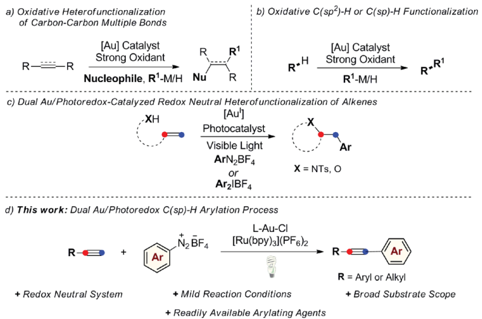
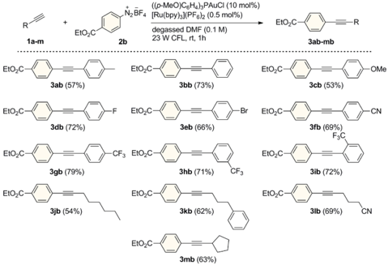
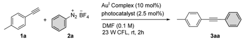
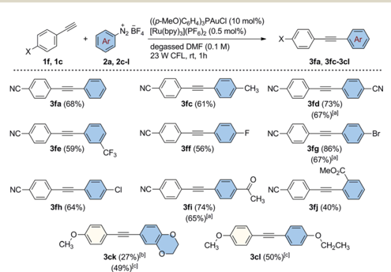
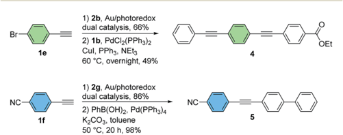
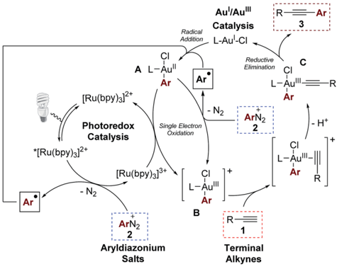

Open Access A

a) Oxidative Heterofunctionalization of Carbon-Carbon Multiple Bonds

Cr

[Au] Catalyst

R-*

(oc) BY

b) Oxidative C(sp?)-H or C(sp)-H Functionalization

R'

RoR'

Visible Light

ArN\_BF+

or

Strong Oxidant

R'-M/H

X = NTs, O

## EDGE ARTICLE

L-Au-Cl

[Ru(bpy)з((PF6)2

R-B

+ Mild Reaction Conditions

+ Readily Available Arylating Agents

Cite this: Chem. Sci. , 2016, 7 , 89

Received 16th July 2015 Accepted 7th October 2015

DOI: 10.1039/c5sc02583d

www.rsc.org/chemicalscience

## Introduction

Homogeneous gold catalysis has received signi  cant attention in the last two decades. Due to their carbophilic p -acidity, Au I and Au III complexes catalyze the addition of a variety of oxygen-, nitrogen-, carbon-, and sulfur-based nucleophiles to unsaturated molecules, such as alkynes, allenes and alkenes, giving rapid and e ffi cient access to complex molecular architectures. 1 A common feature regarding the nature of the catalytically active Au species is that it does not easily undergo changes in oxidation state during the course of these reactions. However, there has been signi  cant recent interest in developing Au I /Au III catalytic processes with the aim of expanding the repertoire of gold-mediated processes, mimicking conventional M n /M n +2 redox cycles of the type commonly invoked in catalysis by other late transition metals. 2 Nevertheless, in contrast to its isoelectronic counterpart Pd 0 , the oxidation of Au I generally requires the use of strong oxidative conditions due to the high redox potential of the Au I /Au III redox couple ( E 0 ¼ 1.41 V). 3 A common strategy to access catalytically active Au III species in situ from Au I complexes has been to use strong external oxidants, such as Select  uor®, t BuOOH, or hypervalent iodine reagents. Applying this concept, a range of oxidative homo- and heterocoupling reactions have been developed over the last few years where the oxidative coupling event follows a conventional gold-mediated

a Organisch-Chemisches Institut, Westf¨ alische Wilhelms-Universit¨ at M¨ unster, Corrensstraße 40, 48149 M¨ unster, Germany. E-mail: glorius@uni-muenster.de b NRW Graduate School of Chemistry, Westf¨ alische Wilhelms-Universit¨ at M¨ unster, Wilhelm-Klemm-Strasse 10, 48149 M¨ unster, Germany

† Electronic supplementary information (ESI) available: General experimental details, full optimization table, kinetic pro  le, experimental procedures and characterization data of products, copies of NMR spectra. See DOI: 10.1039/c5sc02583d

‡ These authors contributed equally.

+

[Au] Catalyst

·

View Article Online View Journal  | View Issue

## Dual gold/photoredox-catalyzed C(sp) -H arylation of terminal alkynes with diazonium salts †

Adrian Tlahuext-Aca, ‡ ab Matthew N. Hopkinson, ‡ a Basudev Sahoo ab and Frank Glorius* a

The arylation of alkyl and aromatic terminal alkynes by a dual gold/photoredox catalytic system is described. Using aryldiazonium salts as readily available aryl sources, a range of diversely-functionalized arylalkynes could be synthesized under mild, base-free reaction conditions using visible light from simple household sources or even sunlight. This process, which exhibits a broad scope and functional group tolerance, expands the range of transformations amenable to dual gold/photoredox catalysis to those involving C -H bond functionalization and demonstrates the potential of this concept to access Au I /Au III redox chemistry under mild, redox-neutral conditions.

nucleophilic addition reaction to a C -C multiple bond, circumventing protodeauration and giving e ffi cient access to difunctionalized products (Scheme 1a). This strategy has also been successfully applied in a selection of coupling reactions of unfunctionalized arenes and alkynes, exploiting the wellestablished ability of gold to activate C(sp 2 ) -HorC(sp) -Hbonds (Scheme 1b). 4

Despite the success of these approaches, the use of strong external oxidants, typically in super-stoichiometric amounts, inevitably reduces their attractiveness with regards to functional group tolerance and cost, while most examples are also conducted at high reaction temperatures. With the goal of developing milder gold-catalyzed coupling reactions that do not require external oxidants, our group recently described the use of a dual gold/photoredox catalysis strategy to access Au I /Au III redox cycles. 5,6 Using this concept, we have developed

Scheme 1 Gold-catalyzed C -C and C -X bond-forming coupling reactions proposed to proceed via Au I /Au III redox cycles.

Open Access A

R

1a-m

(oc) BY

EtO,O

EtO\_C

1a

2a

((o-MeO)CgHa)3PAuCI (10 mo1%)

[Ru(bpy)](PF 6)2 (0.5 mol%)

Au' Complex (10 mol%)

23 W CFL, rt, 2h

=R

3ab-mb

Заа

intramolecular aminoarylation and both intra5 a and intermolecular 5 b oxyarylation reactions of alkenes to a ff ord arylated heterocycles and b -aryl ethers employing aryldiazonium or diaryliodonium salts as general arylating agents (Scheme 1c). This dual catalytic system, which has since been further exploited by the Toste group in an impressive arylative ring expansion 7 a and C -P bond-forming cross-coupling, 7 b operates under mild and overall redox neutral conditions and uses abundant visible light as an energy source. Building on these studies, we sought to expand the scope of dual gold/photoredox catalysis onto new classes of transformations, exploiting di ff erent aspects of the rich chemistry of gold. In this regard, we turned our attention to the development of novel visible lightmediated cross-coupling reactions involving gold-catalyzed C -H bond activation and identi  ed the well-established ability of gold(I) to activate the C(sp) -H bond of terminal alkynes as a promising avenue of investigation. Arylation of the resulting alkynylgold complexes would deliver cross-coupled arylalkyne products in a dual gold and photoredox-catalyzed analogue of the widely-employed Sonogashira -Hagihara reaction. 8,9 As demonstrated below, this process bene  ts from mild conditions (room temperature, household light bulb) and broad functional group tolerance while making use of readily-available aryldiazonium salts as the arene coupling partner. Furthermore, by exploiting a non-conventional stepwise oxidation process of Au I complexes into active Au III species by means of organic radicals generated under photoredox catalysis, we have developed a very fast arylating system that proceeds under base-free conditions. 10

## Results and discussion

In a preliminary experiment, p -tolylacetylene ( 1a ) was reacted in the presence of benzenediazonium tetra  uoroborate ( 2a ) under visible light irradiation from a simple household desk lamp  tted with a 23 W  uorescent light bulb (CFL). Upon treatment with 10 and 2.5 mol% of Ph3PAuCl and [Ru(bpy)3](PF6)2, respectively, in degassed methanol for 2 h at room temperature, we were pleased to observe that the cross-coupled product 3aa was formed in 46% yield (entry 1). Following a short screen, (see the ESI † for details of additional experiments), DMF was identi  ed as the optimum solvent for this transformation (entry 2). A range of di ff erent Au I catalysts bearing various ligands were then evaluated (entries 3 -7). Interestingly, the gold(I) chloride complex possessing the comparatively electron-rich phosphine (( p -MeO)C6H4)3P led to the highest yield of 3aa (83%), while the trialkylphosphine Cy3P was also tolerated (entry 4). This trend might be related to the stabilization of the Au III center by these strongly donating ligands during the Au I /Au III redox cycle. The combination of the Au I complex (( p -MeO)C6H4)3PAuCl and the photoredox catalyst [Ru(bpy)3](PF6)2 turned out to be both a highly selective and active C(sp) -H arylating system, as 3aa could be isolated in 80% yield using very low loadings of [Ru(bpy)3](PF6)2 (0.5 mol%) a  er a reaction time of only 1 hour and without the formation of the diyne homocoupling product of 1a (entry 8). 11 Furthermore, this system does not require the addition of an external base and proceeds under acidic

|

Ń½BF.

EtO\_C

Scheme 2 Dual Au/photoredox-catalyzed arylation of di ff erent alkynes. General conditions: alkyne ( 1a -m , 0.30 mmol), 2b (1.2 mmol), [Ru(bpy)3](PF6)2 (0.5 mol%), (( p -MeO)C6H4)3PAuCl (10 mol%) and degassed DMF (3.0 mL). Isolated yields.

conditions. Interestingly, the reaction also operated e ffi ciently using visible light from a variety of di ff erent sources. Under both blue LED (5 W, l max ¼ 465 nm) and even sunlight irradiation, the formation of the cross coupled product 3aa was

Table 1 Reaction optimization a

| Entry   | Au( I ) complex             | Photocatalyst            | Yield b (%)   |
|---------|-----------------------------|--------------------------|---------------|
| 1 c     | Ph 3 PAuCl                  | [Ru(bpy) 3 ](PF 6 ) 2    | 46            |
| 2       | Ph 3 PAuCl                  | [Ru(bpy) 3 ](PF 6 ) 2    | 78            |
| 3       | (( p- MeO)C 6 H 4 ) 3 PAuCl | [Ru(bpy) 3 ](PF 6 ) 2    | 83            |
| 4       | Cy 3 PAuCl                  | [Ru(bpy) 3 ](PF 6 ) 2    | 72            |
| 5       | XPhosAuCl                   | [Ru(bpy) 3 ](PF 6 ) 2    | -             |
| 6       | (PhO) 3 PAuCl               | [Ru(bpy) 3 ](PF 6 ) 2    | -             |
| 7       | IPrAuCl                     | [Ru(bpy) 3 ](PF 6 ) 2    | -             |
| 8 d     | (( p- MeO)C 6 H 4 ) 3 PAuCl | [Ru(bpy) 3 ](PF 6 ) 2    | 83 (80)       |
| 9 e     | (( p- MeO)C 6 H 4 ) 3 PAuCl | [Ru(bpy) 3 ](PF 6 ) 2    | 80            |
| 10 f    | (( p- MeO)C 6 H 4 ) 3 PAuCl | [Ru(bpy) 3 ](PF 6 ) 2    | 71            |
| 11 g    | (( p- MeO)C 6 H 4 ) 3 PAuCl | [Ru(bpy) 3 ](PF 6 ) 2    | 60            |
| 12 h    | (( p- MeO)C 6 H 4 ) 3 PAuCl | [Ru(bpy) 3 ](PF 6 ) 2    | 82            |
| 13 i    | (( p- MeO)C 6 H 4 ) 3 PAuCl | [Ir(ppy) 2 (dtbbpy)]PF 6 | Trace         |
| 14      | (( p- MeO)C 6 H 4 ) 3 PAuCl | Eosin Y                  | -             |
| 15      | (( p- MeO)C 6 H 4 ) 3 PAuCl | Fluorescein              | -             |

a General conditions: 1a (0.10 mmol), 2a (0.40 mmol), photocatalyst (2.5 mol%), gold complex (10 mol%) and degassed DMF (1.0 mL). b NMR yields using CH2Br2 as internal standard. Isolated yield in parentheses. c Degassed methanol (1.0 mL). d [Ru(bpy)3](PF6)2 (0.5 mol%), 1 h. e [Ru(bpy)3](PF6)2 (0.5 mol%), 5 W blue LEDs, 1 h. f [Ru(bpy)3](PF6)2 (0.5 mol%), sunlight, 8 h. g [Ru(bpy)3](PF6)2 (0.5 mol%), air, 1 h. h [Ru(bpy)3](PF6)2 (2.5 mol%), air, 1 h. i With Ph2IBF4 (0.40 mmol), [Ir(ppy)2(dtbbpy)]PF6 (5 mol%). See the ESI for further details. ppy ¼ 2phenylpyridine, dtbbpy ¼ 4,4 0 -ditert -butyl-2,2 0 -bipyridine, XPhos ¼ 2dicyclohexylphosphino-2 0 ,4 0 ,6 0 -triisopropylbiphenyl, IPr ¼ 1,3-bis(2,6diisopropylphenyl)-imidazol-2-ylidene.

Open Access A

X

NC

(oc) BY

NC

NC

1f, 1c

1e

1f

N2 BF&amp; [Ru(bpy) ](PF6)≥ (0.5 mol%)

1) 2b, Au/photoredox

((p-MeO)CgH4)3PAuCI (10 mol%)

dual catalysis, 66%

degassed DMF (0.1 M)

Cul, PPh3, NEt3

2a, 2c-l

3fa, 3fc-3cl

23 W CFL, rt, 1h

60 °C, overnight, 49%

observed in good yields (entries 9 -10). In addition, the dual gold/photoredox C(sp) -H arylation process showed a remarkable robustness towards oxygen, with 3aa being obtained in 60% yield under the same conditions (10 mol% (( p -MeO)C6H4)3PAuCl and 0.5 mol% [Ru(bpy)3](PF6)2) under an atmosphere of air (entry 11). Upon increasing the loading of [Ru(bpy)3](PF6)2 to 2.5 mol%, the yield of 3aa recovered to 82% yield, indicating that careful exclusion of oxygen is not required to obtain high yields when a slightly increased loading of the photocatalyst is employed (entry 12). In contrast to our previous studies on alkene oxyarylation, attempts to switch the aryl coupling partner to diaryliodonium salts or use less expensive organic dyes were not successful for this transformation and the combination of aryldiazonium salts and [Ru(bpy)3](PF6)2 was employed for further experiments (entries 13 -15).

We next evaluated the reaction scope studying a variety of alkyl and aromatic terminal alkynes using 4-(ethoxycarbonyl) benzenediazonium tetra  uoroborate ( 2b ) as the arylating reagent (Scheme 2). With arylalkyne substrates, the reaction was found to tolerate electron-donating and withdrawing substituents on the aryl ring and the corresponding coupled products were isolated in good yields (53 -79%) a  er just 1 h of visible light irradiation. Moreover, as exempli  ed for the tri- uoromethyl-substituted compounds 3gb , 3hb and 3ib , the reaction proceeded with substituents at each of the para -meta -and ortho -positions with seemingly comparable e ffi ciency. Similar good results were obtained for a range of alkylsubstituted alkynes. Derivatives 3jb -mb were prepared in 54 -69% yields with both primary and secondary alkyl groups being tolerated. In all cases, no diyne compounds resulting from homocoupling of the aryl- or alkylalkynes were observed during the reactions.

Our attention turned next to an investigation of the scope of the reaction towards a range of substituted aryldiazonium salts

Scheme 3 Dual Au/photoredox-catalyzed arylation of 1f and 1c with substituted benzenediazonium salts. General conditions: alkyne (0.30 mmol), 2a , 2c -l (1.2 mmol), [Ru(bpy)3](PF6)2 (0.5 mol%), (( pMeO)C6H4)3PAuCl (10 mol%) and degassed DMF (3.0 mL). [a] Under air using 2.5 mol% of [Ru(bpy)3](PF6)2 in 1 h. [b] [Ru(bpy) 3](PF6)2 (2.5 mol%), 16 h of reaction. [c] [Ru(bpy)3](PF6)2 (2.5 mol%), 5 h under 5 W blue LEDs irradiation. Isolated yields.

Ar

OEt

( 2a , 2c -l ) using 4-ethynylbenzonitrile 1f as a standard alkyne coupling partner (Scheme 3). We were pleased to  nd that aryl sources bearing a variety of electronically diverse functional groups reacted successfully, delivering the corresponding crosscoupled products 3fa , 3fc - in good yields up to 86%. At this point, the e ffi ciency of the reaction when performed using electron rich groups at both the aromatic alkyne and the diazonium salt was tested by reacting 4-ethynylanisole ( 1c ) with 2,3-dihydrobenzo[ b ][1,4]dioxine-6-diazonium tetra  uoroborate ( 2k ) under the optimized reaction conditions (Scheme 3). We observed only poor conversions of 1c unless higher loadings of [Ru(bpy)3](PF6)2 (2.5 mol%) and longer irradiation times (16 h) were used. Under these conditions, the coupled product 3ck was isolated in 27% yield. Interestingly, the catalytic activity of this system was increased using blue LEDs (5 W, l max ¼ 465 nm) as the light source. A  er 5 h of irradiation, 3ck was formed in an improved 49% isolated yield. This new set of reaction conditions was also successfully applied for the synthesis of the coupled product 3cl (50% isolated yield). The e ffi ciency of the reaction was evaluated for some substrates under an atmosphere of air using a slightly higher loading of the photocatalyst [Ru(bpy)3](PF6)2 (2.5 mol%, conditions from Table 1, entry 12). Interestingly, under these conditions, the arylated products 3fd , 3fg and 3  were still obtained in good yields (65 -67%), demonstrating that e ffi cient catalytic activity can be maintained without rigorous extrusion of oxygen. Sterically-demanding aryldiazonium salts, however, are seemingly less well tolerated under these conditions with the ortho -substituted 2-(methoxycarbonyl)benzenediazonium tetra  uoroborate reacting sluggishly to a ff ord the coupled product 3  in a moderate yield of 40%.

In addition to its base-free and mild nature, an important feature of the dual gold/photoredox catalytic system is its compatibility with halogenated substrates. In contrast to palladium(0) or many other low-valent late transition metals, gold(I) does not generally undergo conventional oxidative addition to aryl halides under homogeneous conditions. 3,9 d , f , g As such, the brominated diarylalkynes 3eb and 3fg , obtained from a bromoarylalkyne and a bromo-substituted aryldiazonium salt respectively, could be isolated in good yields using this method without competitive cleavage of the C -Br bond. As demonstrated by representative Sonogashira -Hagihara and Suzuki -Miyaura coupling reactions in Scheme 4, these substrates can be readily functionalized further using palladium catalysis. 12

Scheme 4 Further manipulation of cross-coupled products (see the ESI † for experimental details).

Open Access A

(oc) BY

*[Ru(bpy)3}2+

·

Au'/Au'''

Catalysis

L-Au'-CI

Radical

Addition

Ar

Scheme 5 Mechanistic proposal.

Overall, this two-step protocol is complementary to stepwise palladium-catalyzed coupling sequences, making use of readilyavailable aryldiazonium salts rather than dihalogenated aryl iodide precursors (Scheme 4).

In accordance with previous studies on dual Au/photoredox catalysis, 5,7 we envisage a mechanism involving a photoredoxinduced homogeneous Au I /Au III redox cycle (Scheme 5). 13 Upon irradiation with visible light, photoexcitation of the [Ru(bpy)3] 2+ photocatalyst takes place to generate the excited form * [Ru(bpy)3] 2+ which then undergoes single electron transfer (SET) with one equivalent of the aryldiazonium salt to deliver an aryl radical and the oxidized species [Ru(bpy)3] 3+ . 14 The photogenerated aryl radical then adds to the Au I catalyst to give the Au II species A . 15 Interestingly, quantum yield measurements at 450 nm by chemical actinometry gave a value of 3.6, re  ecting the very important contribution of radical chain processes in this dual catalytic system. 16 Therefore, we propose that a second SET process between the open-shell species A with another equivalent of the aryldiazonium salt mainly contributes to the formation of the electrophilic cationic Au III intermediate B . Nevertheless, regeneration of the oxidized [Ru(bpy)3] 3+ to the [Ru(bpy)3] 2+ photoredox catalyst is still feasible by reaction with A . The cationic intermediate B is expected to be an excellent p -Lewis acid and coordinates the alkyne substrate, activating it towards the formation of the s -bonded alkynyl-Au III complex C upon deprotonation. Intermediate C  nally undergoes reductive elimination, 17 regenerating the Au I catalyst and delivering the cross-coupled product.

## Conclusions

In conclusion, we have developed an e ffi cient dual gold/photoredox catalysis methodology for the arylation of terminal alkynes using readily-available aryldiazonium salts. This overall redox neutral cross-coupling process shows broad functional group tolerance, operates at room temperature and is mediated by abundant visible light from a household light bulb or even

|

R

3

sunlight. In addition, the base-free nature of the reaction and tolerance of halogenated substrates may be bene  cial in the design of cross-coupling sequences. This reaction represents the  rst application of dual gold/photoredox catalysis for the activation of C -Hbonds and further demonstrates the potential of this methodology to access Au I /Au III redox cycles under mild conditions without the need for external oxidants.

## Acknowledgements

We thank T. Pillath for experimental assistance. Generous  nancial support by the NRW Graduate School of Chemistry (A. T. A. and B. S.), the Alexander von Humboldt Foundation (M. N. H.) and the Deutsche Forschungsgemeinscha  (Leibniz Award) are gratefully acknowledged.

## Notes and references

- 1 Selected reviews on homogeneous gold catalysis: ( a ) A. S. K. Hashmi, Angew. Chem., Int. Ed. , 2005, 44 , 6990; ( b ) A. F¨ urstner and P. W. Davies, Angew. Chem., Int. Ed. , 2007, 46 , 3410; ( c ) D. J. Gorin and F. D. Toste, Nature , 2007, 446 , 395; ( d ) A. F¨ urstner, Chem. Soc. Rev. , 2009, 38 , 3208; ( e ) N. D. Shapiro and F. D. Toste, Synlett , 2010, 675; ( f ) A. S. K. Hashmi, Angew. Chem., Int. Ed. , 2010, 49 , 5232; ( g ) N. Krause and C. Winter, Chem. Rev. , 2011, 111 , 1994; ( h ) M. Rudolph and A. S. K. Hashmi, Chem. Commun. , 2011, 47 , 6536; ( i ) M. Bandani, Chem. Soc. Rev. , 2011, 40 , 1358; ( j ) L.-P. Liu and G. B. Hammond, Chem. Soc. Rev. , 2012, 41 , 3129; ( k ) M. Rudolph and A. S. K. Hashmi, Chem. Soc. Rev. , 2012, 41 , 2448; ( l ) C. Obradors and A. M. Echavarren, Chem. Commun. , 2014, 50 , 16; ( m ) A. F¨ urstner, Acc. Chem. Res. , 2014, 47 , 925; ( n ) R. Dorel and A. M. Echavarren, Chem. Rev. , 2015, 115 , 9028.
- 2 Selected reviews: ( a ) M. N. Hopkinson, A. D. Gee and V. Gouverneur, Chem. -Eur. J. , 2011, 17 , 8248; ( b ) H. A. Wegner and M. Auzias, Angew. Chem., Int. Ed. , 2011, 50 , 8236; ( c ) K. M. Eagle, T.-S. Mei, X. Wang and J.-Q. Yu, Angew. Chem., Int. Ed. , 2011, 50 , 1478.
- 3 ( a ) S. G. Bratsch, J. Chem. Phys. Ref. Data , 1989, 18 , 1; Recently a few impressive examples of oxidative addition of C -Br/I and C -C bonds onto Au I have been reported:( b ) J. Guenther, S. Mallet-Ladeira, L. Estevez, K. Miqueu, A. Amgoune and D. Bourissou, J. Am. Chem. Soc. , 2014, 136 , 1778; ( c ) M. D. Levin and F. D. Toste, Angew. Chem., Int. Ed. , 2014, 53 , 6211; ( d ) M. Joost, A. Zeineddine, L. Est´ evez, S. Mallet-Ladeira, K. Miqueu, A. Amgoune and D. Bourissou, J. Am. Chem. Soc. , 2014, 136 , 14654; ( e ) C.-Y. Wu, T. Horibe, C. B. Jacobsen and F. D. Toste, Nature , 2015, 517 , 449; ( f ) M. Joost, L. Est´ evez, K. Miqueu, A. Amgoune and D. Bourissou, Angew. Chem., Int. Ed. , 2015, 54 , 5236.
- 4 T. C. Boorman and I. Larrosa, Chem. Soc. Rev. , 2011, 40 , 1910. 5 ( a ) B. Sahoo, M. N. Hopkinson and F. Glorius, J. Am. Chem. Soc. , 2013, 135 , 5505; ( b ) M. N. Hopkinson, B. Sahoo and F. Glorius, Adv. Synth. Catal. , 2014, 356 , 2794.

- 6 Selected reviews on visible light photoredox catalysis: ( a ) K. Zeitler, Angew. Chem., Int. Ed. , 2009, 48 , 9785; ( b ) T. P. Yoon, M. A. Ischay and J. Du, Nat. Chem. , 2010, 2 , 527; ( c ) F. Tepl´ y, Collect. Czech. Chem. Commun. , 2011, 76 , 859; ( d ) J. M. R. Narayanam and C. R. J. Stephenson, Chem. Soc. Rev. , 2011, 40 , 102; ( e ) J. Xuan and W.-J. Xiao, Angew. Chem., Int. Ed. , 2012, 51 , 6828; ( f ) L. Shi and W. Xia, Chem. Soc. Rev. , 2012, 41 , 7687; ( g ) S. Fukuzumi and K. Ohkubo, Chem. Sci. , 2013, 4 , 561; ( h ) Y. Xi, H. Yi and A. Lei, Org. Biomol. Chem. , 2013, 11 , 2387; ( i ) C. K. Prier, D. A. Rankic and D. W. C. MacMillan, Chem. Rev. , 2013, 113 , 5322; ( j ) J. Xuan, L.-Q. Lu, J.-R. Chen and W.-J. Xiao, Eur. J. Org. Chem. , 2013, 6755; ( k ) M. Reckenth¨ aler and A. G. Griesbeck, Adv. Synth. Catal. , 2013, 355 , 2727; ( l ) D. M. Schultz and T. P. Yoon, Science , 2014, 343 , 1239176; ( m ) T. Koike and M. Akita, Top. Catal. , 2014, 57 , 967; ( n ) D. A. Nicewicz and T. M. Nguyen, ACS Catal. , 2014, 4 , 355;
- ( o ) M. N. Hopkinson, B. Sahoo, J.-L. Li and F. Glorius, Chem. -Eur. J. , 2014, 20 , 3874; ( p ) E. Meggers, Chem. Commun. , 2015, 51 , 3290.
- 7 ( a ) X.-Z. Shu, M. Zhang, Y. He, H. Frei and F. D. Toste, J. Am. Chem. Soc. , 2014, 136 , 5844; ( b ) Y. He, H. Wu and F. D. Toste, Chem. Sci. , 2015, 6 , 1194.
- 8 Recent review on the Sonogashira -Hagihara reaction: ( a ) R. Chinchilla and C. N´ ajera, Chem. Soc. Rev. , 2011, 40 , 5084; examples of Pd-catalyzed alkyne arylation with aryldiazonium salts:( b ) G. Fabrizi, A. Goggiamani, A. Sferrazza and S. Cacchi, Angew. Chem., Int. Ed. , 2010, 49 , 4067; ( c ) B. Panda and T. K. Sarkar, Chem. Commun. , 2010, 46 , 3131; ( d ) X.-F. Fu, H. Neumann and M. Beller, Chem. Commun. , 2011, 47 , 7959; ( e ) M. Barbero, S. Cadamuro and S. Dughera, Eur. J. Org. Chem. , 2014, 598.
- 9 While a few examples of gold-catalyzed Sonogashira -Hagihara reactions with aryl halides have been reported, the mechanism of these processes has been the subject of debate. Trace palladium impurities and heterogeneous gold nanoparticles have both been implicated in these reactions: ( a ) C. Gonz´ alez-Arellano, A. Abad, A. Corma, H. Garc´ ı a, M. Iglesias and F. S´ anchez, Angew. Chem., Int. Ed. , 2007, 46 , 1536; ( b ) P. Li, L. Wang, M. Wang and F. You, Eur. J. Org. Chem. , 2008, 5946; ( c ) C. Gonz´ alezArellano, A. Corma, M. Iglesias and F. S´ anchez, Eur. J. Inorg. Chem. , 2008, 1107; ( d ) T. Lauterbach, M. Livendahl, A. Rosell´ on, P. Espinet and A. M. Echavarren, Org. Lett. , 2010, 12 , 3006; ( e ) G. Kyriakou, S. K. Beaumont, S. M. Humphrey, C. Antonetti and R. M. Lambert, ChemCatChem , 2010, 2 , 1444; ( f ) A. Corma, R. Ju´ arez, M. Boronat, F. S´ anchez, M. Iglesias and H. Garc´ ı a, Chem. Commun. , 2011, 47 , 1446; ( g ) M. Livendahl, P. Espinet and A. M. Echavarren, Platinum Met. Rev. , 2011, 55 , 212; ( h ) P. S. D. Robinson, G. N. Khairallah, G. da Silva, H. Lioe and R. A. J. O ' Hair, Angew. Chem., Int. Ed. , 2012, 51 , 3812; examples of gold-catalyzed alkynylation with external
- oxidants:( i ) T. de Haro and C. Nevado, J. Am. Chem. Soc. , 2010, 132 , 1512; ( j ) M. N. Hopkinson, J. E. Ross, G. T. Giu ff redi, A. D. Gee and V. Gouverneur, Org. Lett. , 2010, 12 , 4904; ( k ) D. Qian and J. Zhang, Beilstein J. Org. Chem. , 2011, 7 , 808; ( l ) Y. Ma, S. Zhang, S. Yang, F. Song and J. You, Angew. Chem., Int. Ed. , 2014, 53 , 7870; ( m ) H. Peng, Y. Xi, N. Ronaghi, B. Dong, N. G. Akhmedov and X. Shi, J. Am. Chem. Soc. , 2014, 136 , 13174; review on goldcatalyzed alkynylation including examples not involving C(sp) -H bond activation:( n ) J. P. Brand, Y. Li and J. Waser, Isr. J. Chem. , 2013, 53 , 901.
- 10 During the preparation of this manuscript, Shi and coworkers reported a ligand assisted gold-catalyzed coupling of terminal alkynes with aryldiazonium salts. This catalytic system does not involve photoredox activation and explores a ligand-assisted two electron oxidation process of the Au(I) complex under basic conditions, thus proceeding by a di ff erent mechanism: R. Cai, M. Lu, E. Y. Aguilera, Y. Xi, N. G. Akhmedov, J. L. Petersen, H. Chen and X. Shi, Angew. Chem., Int. Ed. , 2015, 54 , 8772.
- 11 Control experiments without the AuI catalyst, photocatalyst or visible light gave trace amounts or no product formation. Careful analysis of reaction mixtures by GC-MS showed no diyne homocoupling product formation (see the ESI † for further information).
- 12 ( a ) Y. Miao, A. Dup´ e, C. Bruneau and C. Fischmeister, Eur. J. Org. Chem. , 2014, 5071; ( b ) X. Shen, D. M. Ho and R. A. Pascal Jr, J. Am. Chem. Soc. , 2004, 126 , 5798.
- 13 The kinetic pro  le of the reaction did not exhibit an induction period, implying that heterogeneous gold nanoparticles are not responsible for the observed reactivity (see the ESI † for more details, see also ref. 9f -h for a discussion of heterogeneous gold-catalyzed coupling reactions).
- 14 Review on the photoredox activation of diazonium salts: D. P. Hari and B. K¨ onig, Angew. Chem., Int. Ed. , 2013, 52 , 4734.
- 15 Seminal study on the trapping of carbon-based radicals by gold complexes: ( a ) C. Aprile, M. Boronat, B. Ferrer, A. Corma and H. Garc´ ı a, J. Am. Chem. Soc. , 2006, 128 , 8388; recent report on the oxidation of gold(I) by the CF3 radical: ( b ) M. S. Winston, W. J. Wolf and F. D. Toste, J. Am. Chem. Soc. , 2014, 136 , 7777.
- 16 For interesting discussions on the prevalence of radical chain processes in photoredox catalysis see: ( a ) M. Majek, F. Filace and A. J. von Wangelin, Beilstein J. Org. Chem. , 2014, 10 , 981; ( b ) M. A. Cismesia and T. P. Yoon, Chem. Sci. , 2015, 6 , 5426. For quantum yield measurements see the ESI. †
- 17 Report on reductive elimination from these complexes: Y. Fuchita, Y. Utsunomiya and M. Yasutake, J. Chem. Soc., Dalton Trans. , 2001, 2330.