JOC.

CO\_H

[PC](https://pubs.acs.org/joc?ref=pdf)

[blue LEDs](https://pubs.acs.org/joc?ref=pdf)

X = O, NCbz via benzylic oxetane/azetidine radical

HN

[treatment of relapsing](https://pubs.acs.org/joc?ref=pdf)

[X](https://pubs.acs.org/joc?ref=pdf)

[multiple sclerosis](https://pubs.acs.org/joc?ref=pdf)

NHBoc

[Cbz](https://pubs.acs.org/joc?ref=pdf)

Lanraplenib pubs.acs.org/joc

membranous nephropathy

MeO

Me decreasing stability of

benzylic radical

→ increasing driving force

Crenolanib for Giese addition

Arog Pharmaceuticals - Phase I/

Treatment of diffuse intrinsic pontine glioma

## Visible Light Photoredox-Catalyzed Decarboxylative Alkylation of 3 -Aryl-Oxetanes and Azetidines via Benzylic Tertiary Radicals and Implications of Benzylic Radical Stability

Maryne A. J. Dubois, ∥ Juan J. Rojas, ∥ Alistair J. Sterling, ∥ Hannah C. Broderick, Milo A. Smith, Andrew J. P. White, Philip W. Miller, Chulho Choi, James J. Mousseau, Fernanda Duarte, * and James A. Bull *

[Cite This: J. Org. Chem. 2023, 88, 6476-6488](https://pubs.acs.org/action/showCitFormats?doi=10.1021/acs.joc.3c00083&ref=pdf)

## ACCESS

[Metrics &amp; More](https://pubs.acs.org/doi/10.1021/acs.joc.3c00083?goto=articleMetrics&ref=pdf)

[Article Recommendations](https://pubs.acs.org/doi/10.1021/acs.joc.3c00083?goto=recommendations&?ref=pdf)

ABSTRACT: Four-membered heterocycles offer exciting potential as small polar motifs in medicinal chemistry but require further methods for incorporation. Photoredox catalysis is a powerful method for the mild generation of alkyl radicals for C -C bond formation. The effect of ring strain on radical reactivity is not well understood, with no studies that address this question systematically. Examples of reactions that involve benzylic radicals are rare, and their reactivity is challenging to harness. This work develops a radical functionalization of benzylic oxetanes and azetidines using visible light photoredox catalysis to prepare 3-aryl-3-alkyl substituted derivatives and assesses the influence of ring strain and heterosubstitution on the reactivity of

*

sı

[Supporting Information](https://pubs.acs.org/doi/10.1021/acs.joc.3c00083?goto=supporting-info&ref=pdf)

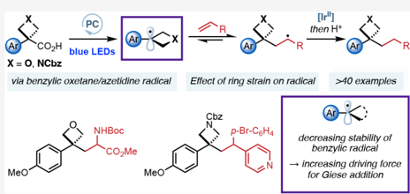

small-ring radicals. 3-Aryl-3-carboxylic acid oxetanes and azetidines are suitable precursors to tertiary benzylic oxetane/azetidine radicals which undergo conjugate addition into activated alkenes. We compare the reactivity of oxetane radicals to other benzylic systems. Computational studies indicate that Giese additions of unstrained benzylic radicals into acrylates are reversible and result in low yields and radical dimerization. Benzylic radicals as part of a strained ring, however, are less stable and more π -delocalized, decreasing dimer and increasing Giese product formation. Oxetanes show high product yields due to ring strain and Bent's rule rendering the Giese addition irreversible.

## ■ INTRODUCTION

Oxetanes and azetidines continue to attract interest as valuable motifs in medicinal chemistry. 1 These motifs have increasingly appeared in clinical candidates, including Lanraplenib, 2 Crenolanib, 3 and FDA-approved Siponimod 4 and Baricitinib (Figure 1). 5 The low molecular weight and high polarity of four-membered heterocycles can provide attractive molecular

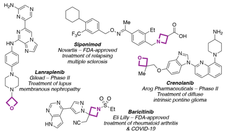

Figure 1. Oxetane- and azetidine-containing pharmaceuticals.

properties, as well as replacement groups for sensitive and metabolically exposed functionalities. 1,6 3,3-Disubstituted oxetanes, in particular, present interesting opportunities as bioisosteres, providing comparable features to carbonyl groups and advantages due to increased steric protection, which improves stability to nucleophiles and acidic conditions. The attractive features of four-membered rings have prompted the development of several new approaches for their synthesis and late-stage incorporation to overcome the challenges posed by their ring strain and potential instability. 7

Recent years have seen developments in the generation and reaction of oxetane and azetidine radicals as reactive intermediates. Radicals have been generated from oxetane itself and azetidine derivatives at the activated C2-position, where the radical is stabilized by the adjacent lone pair. 8

Special Issue:

Progress in Photocatalysis for Organic

Chemistry

Received:

January 12, 2023

Published:

March 3, 2023

N

MeO

Me p-Br-C6H4

[Ir'']

[then Ht](https://pubs.acs.org/joc?ref=pdf)

NH2

Article

a) Methyloxetane radicals

Ravelli 2014

CO\_Me

-

Radical generation at the 3-position must compete with possible HAT processes at the 2-position, which would generate a heteroatom-stabilized radical, and hence requires a group that can act as a radical precursor. 9 -17 Recently, oxetane functionalization has been achieved using visible light mediated photoredox catalysis, which has emerged as a powerful and general tool to generate radical species under mild conditions. 18 3-Iodo-oxetane and -azetidine are increasingly employed in coupling reactions, 9 -11 while there are only limited examples from oxetane-3-carboxylic acid. To date there have been very few and isolated examples of tertiary oxetane radicals at the 3-position (Scheme 1).

Scheme 1. Strategies for the Formation of 3,3-Disubstituted Oxetanes and Azetidines by Radical Functionalization

blue LED

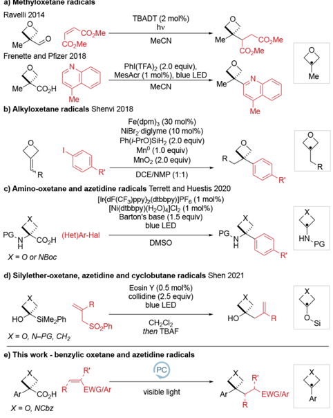

In 2014, Ravelli reported the generation of 3-methyloxetane radicals by decarbonylation using UV light and TBADT ([( n -Bu)4N]4[W10O32]), and their reaction with Michael acceptors. 8a In 2018, Frenette and Pfizer developed visible light conditions for Minisci reactions. 12 Also in 2018, Shenvi used HAT/Ni dual catalysis to hydroarylate oxetane alkylidenes with aryl halides via a 3-alkyloxetane radical. 14 In 2020, Terrett and Huestis reported the synthesis of 3-aryl-3-amino oxetanes and azetidines through the photocatalytic generation and coupling of 3-amino radical intermediates with aryl halides. 15 Very recently, 3-silyloxy azetidine and oxetane radicals were reported by Shen from 3-silyl azetidin-3-ols and oxetan-3-ols through a radical 1,2-silyl transfer which underwent C -C coupling with Michael acceptors. 16

Following our interest in 3-aryloxetane and azetidine derivatives involving carbocation intermediates, 19 we envisaged that benzylic oxetane radicals would broaden the range of options for oxetane incorporation and provide access to valuable, unexplored, and medicinally relevant chemical space

Me

CO\_H

R

PG.N

CO\_H

X= 0 or NBoc

HO

SiMe, Ph

X = O, N-PG, CH2

[e) This work - benzylic oxetane and azetidine radicals](https://pubs.acs.org/doi/10.1021/acs.joc.3c00083?fig=sch1&ref=pdf)

Ar

CO\_H

X = O, NCbz

TBADT (2 mol%)

under mild photoredox conditions. However, tertiary benzylic radicals remain underinvestigated in photoredox catalysis 20 and might be expected to display low reactivity in their addition reactions due to their relatively stabilized nature. 21 Further, benzylic radicals are prone to oxidation to form stabilized carbocations through radical-polar crossover pathways. 22 To date, there have been no reports of the reaction of 3aryloxetane or azetidine radicals, and the effect of the fourmembered ring on the reactivity and radical structure was unclear at the outset of this work.

Here, we report our studies on the formation and reactions of oxetane and azetidine radicals using visible light mediated photoredox catalysis starting from carboxylic acid derivatives. We also report a systematic comparison of reaction outcomes for related substituted benzylic radicals and highlight important structural features for the reactivity of benzylic radicals. Most notably, we draw correlations between radical stability, hybridization, and the equilibrium of the reversible Giese addition, which determines product yields and the extent of radical dimerization.

## ■ RESULTS AND DISCUSSION

Reaction Optimization and Scope. We first investigated several possible radical precursors, initially derived from oxetanols. Attempts to prepare 3-aryloxetane derivatives of typical radical precursors such as bromide and chloride were unsuccessful (Supporting Scheme S1), and similarly, borate or silicate derivatives are not readily available. Oxalates, as the acid or Cs-salt, 23 were prone to hydrolysis under reaction conditions, and parallel screening of conditions did not provide a productive reaction (Supporting Scheme S2 and Table S1). We hence examined oxetane carboxylic acids. Carboxylic acids have been extensively used in the formation of tertiary radical centers under photocatalytic conditions. 18b,24 -26 Aryloxetane carboxylic acids were not available and prompted our recent report on their short two-step synthesis from 3-aryl-oxetan-3ols involving catalytic Friedel -Crafts reaction followed by mild oxidative cleavage. 27,28 Initial investigations with acid 1 were based on a report by MacMillan in 2014, 29 which generated C(sp 3 ) radicals under decarboxylative photoredox conditions and trapped these with electron-deficient alkenes. 30 Electronrich oxetane acid 1 was used as the model substrate, and ethyl acrylate, as radical acceptor. The major product of this reaction was 3,3-disubstituted oxetane 2a , which was formed alongside dialkylated product 2a ′ , dimer 3 , and reduced product 4 . After an extensive survey of discrete and continuous reaction variables (e.g., further bases, solvents, photocatalysts; Supplementary Tables S2 -S5), desired 3,3-disubstituted oxetane 2a was obtained in 61% yield ( ± 5%, 95% confidence interval, n = 6, performed by three different chemists; Table 1, entry 1), with minimized formation of side products ( 3 , 4 ) and finally little deviation from the MacMillan conditions. The mass balance in the standard reaction between 1 and ethyl acrylate was variable depending on the purity of 1 used ( cf. Table 1 entry 1 and Supporting Table S6). Nonetheless, complete conversion of starting material 1 is always observed. Deviations from an overall conserved mass balance of 100% are ascribed to intractable degradation products from the oxetane radical.

The optimized conditions used two readily available 467 nm LED Kessil lamps, Cs2CO3 as base, and DMF as reaction solvent (see the Supporting Information page S13 for a detailed description of the reaction setup). Iridium photocatalyst [Ir{dF(CF3)ppy}2(dtbbpy)]PF6 ( [Ir] ; see Scheme 2)

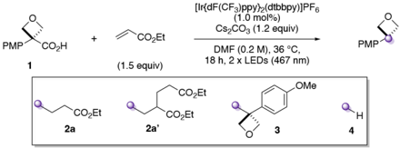

Table 1. Selected Optimization Studies for the Reaction of Oxetane Acid 1 with Ethyl Acrylate

|       |                                 | yield (%) a   | yield (%) a   |   yield (%) a |   yield (%) a |
|-------|---------------------------------|---------------|---------------|---------------|---------------|
| entry | change from standard conditions | 2a            | 2a ′          |             3 |             4 |
| 1 b   | none                            | 61 (58)       | 8 (8)         |             1 |             1 |
| 2     | cat. = Ru(bpy) 3 (PF 6 ) 2      | <5            | 0             |             2 |             0 |
| 3     | cat. = Mes-Acr +                | 0             | 0             |             0 |             0 |
| 4     | 0.5 mol % Ir cat.               | 46            | 11            |             2 |             0 |
| 5     | 28 ° C (fan cooling)            | 54            | 11            |             3 |             0 |
| 6     | solvent = MeCN                  | 41            | 7             |             2 |             1 |
| 7     | solvent = 1,4-dioxane           | 28            | 3             |             3 |             1 |
| 8     | [0.1 M]                         | 59            | 15            |             2 |             3 |
| 9     | 2.0 equiv of acrylate           | 59            | 7             |             1 |             1 |
| 10    | 0.7 equiv of acrylate           | 59 c          | 8 c           |             2 |             3 |
| 11    | DBU as base                     | 39            | 4 c           |             2 |             1 |
| 12    | no photocatalyst                | 0             | 0             |             0 |             0 |
| 13    | no light                        | 0             | 0             |             0 |             0 |
| 14    | no base                         | 0             | 0             |             0 |             0 |

a Reactions run on a 0.2 mmol scale under argon. Yield calculated by analysis of the 1 H NMR spectrum of the crude mixture of the reaction using 1,3,5-trimethoxybenzene as internal standard and a 30 s relaxation delay (d1). b Reported yields are the mean average of 6 experiments, isolated yields of a single run are in parentheses. c Yields vs ethyl acrylate.

provided appropriate redox potentials to oxidize the carboxylate and reduce the Giese adduct. Other photocatalysts such as [Ru(bpy)3](PF6)2 or (Mes-Acr)(ClO4) formed little (&lt;5%) or no product (entries 2 -3). Only slight reductions in yield were observed when reducing photocatalyst loading to 0.5 mol % (entry 4), performing the reaction at lower temperatures (28 ° C, fan controlled; entry 5), in different solvents (MeCN, 1,4dioxane; entries 6 -7), lower concentration (entry 8), with variable amounts of ethyl acrylate (entries 9 -10) or with an organic base (DBU; entry 11). Control experiments demonstrated the requirement for photocatalyst, light, and base (entries 12 -14).

We examined deviations in reaction conditions that are often encountered between laboratories by using a sensitivity screen as described by Glorius (Figure 2). 31 The reaction was shown to be broadly insensitive to small changes in the optimized conditions, thus facilitating implementation of the decarboxylative oxetane-functionalization protocol (see Supplementary Table S6 for details). Only high concentrations (0.25 M instead of 0.2 M) and high levels of oxygen (i.e., under air) were identified as potential pitfalls for the reaction, factors that can be readily controlled. Notably, given the known sensitivity of photochemical reactions to increased scale, 32 the input of 1 could be increased to 5 times the standard scale (0.2 to 1.0 mmol) by simply increasing the size of the reaction vial with no impact on yield (58% 2a , 153 mg). Repurification of 1 (to 99.9% pure instead of 98.9% by quantitative 1 H NMR) further increased the yield of 2a (67%).

With optimized and reliable conditions in hand, the scope of the reaction was probed (Scheme 2). A diverse set of novel 3,3-disubstituted oxetane products was obtained by varying both the radical acceptor and the oxetane acid precursor. Simple acrylates were successful coupling partners and generated the products in good yields ( 2a , 2b ). Vinyl ketones, sulfones, phosphonates, and nitriles could also be employed, albeit in lower yields ( 2c -2f ). Medicinally interesting amide derivatives were synthesized in moderate yields ( 2g -2i ).

Similarly, a radical acceptor with two stabilizing groups was well tolerated using protected dehydroalanine to generate unnatural amino acid 2j . Methacrolein was also successful, providing aldehyde 2k . Substitution at the β -position was less well tolerated, though successful reactions were achieved with cyclopentenone and dimethyl maleate, affording 2l and 2m in 25% and 54% yield, respectively. Styrenes were also successful coupling partners ( 2n -2t ). Unactivated, electron-neutral styrene yielded oxetane 2n in 35% yield. Reactivity increased with more electron-poor acceptors whereby p -bromophenyl (73%) and isobenzofuranone (60%) functionalities were incorporated efficiently ( 2o , 2p ). The tolerance of an aryl bromide group is noteworthy, especially since it serves as a synthetic handle for downstream diversifications. Importantly, pyridines, the most prevalent aromatic N-heterocycles in bioactive compounds, 33 could be readily introduced while tolerating functionalities such as a secondary amide ( 2q -2t ). Increasing the equivalents of vinylpyridine acetamide to 3.0 equiv or using oxetane acid 1 in excess did not improve the yield of 2s .

Next, variation in the oxetane acids was investigated ( 5 -12 ). A benzyl protecting group, which can be labile to photoredox conditions, 34 was well tolerated ( 5q ; 62%). An electronwithdrawing triflate group could also be incorporated in low yields ( 6q ; see the Supporting Information page S36 for further discussion). TIPS-protected phenol was deprotected under the reaction conditions to give free phenol 7a . Importantly, and in contrast to our previous strategies generating oxetane carbocations, 19 electron-neutral phenyl oxetane acid was a successful substrate and provided 3,3disubstituted oxetane 8a in 49% yield. A comparison of the reaction profiles for the formation of 2a and 8a indicated the rate of reaction was faster to form 2a , which could be correlated with the lower oxidation potential of the carboxylate from 1 (see Supporting Tables S14 -S15 and Figure S11). Electron-neutral oxetane analogs of ibuprofen and flurbiprofen gave oxetanes 9a and 10a , and unsubstituted biphenyl oxetane acid gave an oxetane-containing ester analog of fenbufen ( 11b ). The medicinally important indole group was also incorporated ( 12a ).

Pleasingly, 3-arylazetidine radicals could also be formed under the reaction conditions and a range of 3,3-disubstituted azetidines were synthesized in comparable yields to their oxetane analogs ( 13a , b , m , n , p , q , t ). Azetidine pyridines 13q and 13t showed a boost in yield compared to the oxetanes. Further information on the examples in Scheme 2 that showed significant amounts of side products and other radical acceptors that did not yield the desired Giese product can be found in Supporting Schemes S5 and S6, respectively.

The Cbz group could be readily removed from 13a by hydrogenolysis to generate a free N -H azetidine ( 14 ; 76% yield). Ester hydrolysis from the functionalized oxetane products under basic conditions using LiOH gave carboxylic acid 15 in 99% yield. 35 This is the formal bis-homologation

MeO

MeO

MeO

HO

Large Scale

High C

-100%

-75%

-50%

0%

EWG/Ar

Cs2COз (1.2 equiv)

DMF (0.2 M), 36 °C, 18 h

(1.5 equiv)

2 x blue LEDs (467 nm)

Scope of acceptors

## Scheme 2. Reaction Scope of Oxetane and Azetidine Acids and Alkenes a

Repurified 1

2j, 60%'

2p, 60%

7a, 22%!

[Cbz](https://pubs.acs.org/doi/10.1021/acs.joc.3c00083?fig=sch2&ref=pdf)

MeO

R = CO,Et

CO\_t-Bu 13b 49%

Azetidines

[Cbz](https://pubs.acs.org/doi/10.1021/acs.joc.3c00083?fig=sch2&ref=pdf)

MeO

13a t-Bu

t-Bu

a Reactions run on a 0.20 mmol scale unless otherwise stated. Isolated yields are reported. b Characterized by X-ray crystallography. c Using repurified 1 (Supporting Table S6). d Isolated in 70% purity. e Yield based on alkene (0.20 mmol scale). f Using TIPS-protected oxetane acid. g Using repurified Ph oxetane carboxylic acid, on a 0.10 mmol scale and run for 14 h (Supporting Table S14). h 0.10 mmol scale. i H2, Pd/C (10% w/w , 10 mol % Pd), EtOH, 25 ° C, 22 h. j LiOH (3.0 equiv), H2O:THF:MeOH (3:1:1), 25 ° C, 24 h. k Trifluoroacetic acid (10 equiv), CH 2 Cl2, 0 -25 ° C, 17 h.

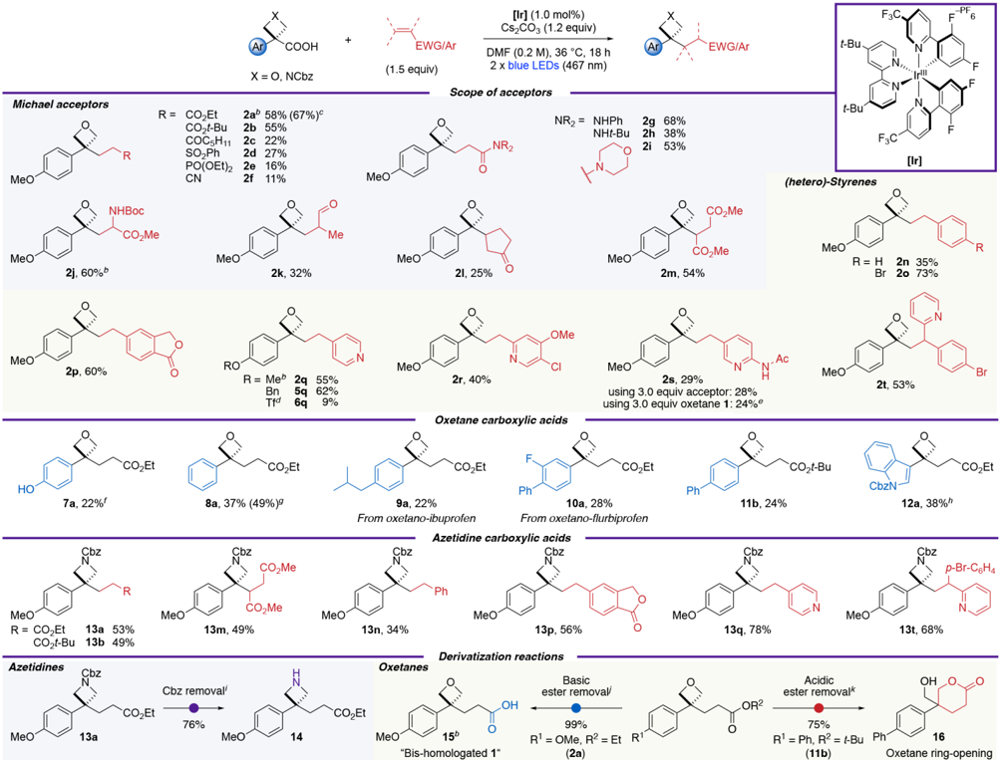

Figure 2. Assessment of sensitivity of the reaction of oxetane acid 1 with ethyl acrylate. Numbers indicate the deviation in percentage yield on alteration of selected reaction parameters.

product of oxetane 1 , which was further characterized by X-ray crystallography (see Supporting Figure S33). Interestingly, deprotection of the t -Bu ester 11b using trifluoroacetic acid prompted ring-opening of the oxetane ring to form tetrahydropyranone 16 in 75% yield due to the internal nucleophile.

3,3-Disubstitued oxetanes 2a , 2j , and 2q were further characterized by X-ray crystallography and compared to known analogous phenone structures, which displayed interesting differences in conformation (Figure 3; also see Supporting Information pp S75 -S81). The 3,3-disubstituted oxetane derivatives adopt a conformation with increased threedimensional nature. Most notably the aromatic ring on the oxetane is almost orthogonal to the pseudocarbonyl plane (dihedral angle between Ooxetane -Cqoxetane -Cqaromatic -CHaromatic ), while, in the ketone, the aromatic ring is aligned with the plane as to maximize favorable π -conjugation. Furthermore, the increased steric bulk of the oxetane group together with the decreased steric requirement of the 'twisted' aromatic ring induce a switch in the preferred conformation of the CH2CHRR ′ chain, which now lies on the side of the aromatic instead of the carbonyl (oxetane). The conformational preferences in the X-ray structures of 2a , 2j , and 2q did not seem to be influenced significantly by crystal packing effects, as revealed by analysis of intermolecular interactions in 2a , 2j , and 2q (Supporting Information pages S75 -S81).

CO\_t-Bu

Moderate Oz

NHt-Bu

2h 38%

Low C

COOH

+

EWG/Ar

F3C

N.....

F

-PF

6

Oxetanes

PMP-

COOH

1

Ethyl acrylate (1.5 equiv)

TEMPO (2.0 equiv)

[lr]a (1.0 mol%)

Cs2COз (1.2 equiv)

[2 x blue LEDs (467 nm)](https://pubs.acs.org/doi/10.1021/acs.joc.3c00083?fig=fig3&ref=pdf)

2a

[LOHZAK](https://pubs.acs.org/doi/10.1021/acs.joc.3c00083?fig=fig3&ref=pdf)

[H](https://pubs.acs.org/doi/10.1021/acs.joc.3c00083?fig=fig3&ref=pdf)

Figure 3. X-ray structures of 3-aryl-3-alkyl oxetanes. Interatomic distances and torsion (dihedral) angles are given as the mean average of the three X-ray structures displayed with the error corresponding to the 95% confidence interval (for the oxetanes and ketones respectively). For the atoms used in the measurement of dihedral angles, see Supporting Figures S27 -S32. The ketone structures were accessed under the CCDC identifiers 'LOHZAK', 36 'JOXGEI', 37 and 'MUFHAZ'. 38

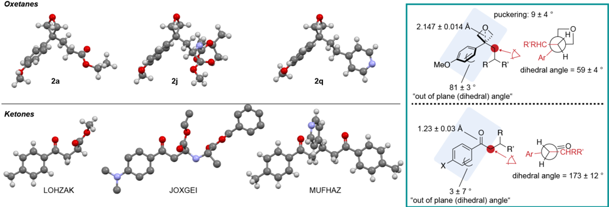

Mechanistic Studies: Structure and Reactivity of Benzylic Radicals. Based on the precedent of decarboxylative photoredox reactions, 26a -d,29 we propose an oxetane/azetidine radical intermediate formed by oxidation of the carboxylate anion with the excited form of the photocatalyst followed by decarboxylation (see Figure 5 for the full mechanistic picture). Reacting oxetane 1 with ethyl acrylate in the presence of TEMPO did not form the usual product 2a . Oxetane -TEMPO adduct 17 was instead isolated in 21% yield (after chromatography) and its structure confirmed by X-ray crystallography, supporting the proposed oxetane radical (Scheme 3).

## Scheme 3. Isolation of Oxetane -TEMPO Adduct as Evidence for Oxetane Radical

a [Ir] = [Ir{dF(CF3)ppy}2(dtbbpy)]PF6 (see Scheme 2).

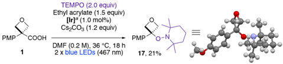

Intermolecular reactions that involve radicals at benzylic positions often lead to low yields of the desired product and increased side reactions such as homocoupling or reduction of the benzylic radical. 13,20c,21,39 The reasons behind this, and the effect of additional substituents at the benzylic position on reactivity, are not well understood. To provide insight into the key radical-addition step, we compared the behavior of a series of aryl acetic acids, with different substitution at the benzylic center, in the reaction with ethyl acrylate (Scheme 4). Only oxetane and azetidine undergo the desired Giese reaction pathway efficiently (&gt;50% 2a = III-A , and 13a = IV-A ). Very little or no dimer formation was observed for the three- and four-membered rings, in contrast to methylene, gem -dimethyl, and tetrahydropyran linkers. 40

Computational Studies: Comparison of Benzylic Radicals. The significant differences in reactivity of aryl acetic acids with different benzylic linkers were further investigated computationally to provide insights into the underlying features that lead to these disparities. Since maximizing the

a Isolated yields are reported. b [Ir] = [Ir{dF(CF3)ppy}2(dtbbpy)]PF6 (see Scheme 2).

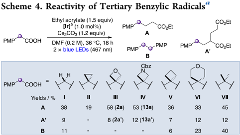

yield of Giese product requires minimization of undesired dimerization, we sought to identify the origins of dimer formation. The relative quantities of dimer observed vary significantly depending on the identity of the benzylic substituents (Scheme 4). We isolated two factors that minimize dimer formation: (1) decreasing the stability of the benzylic radical, and (2) enhancing π -delocalization of the benzylic radical into the aromatic system.

First, computational studies showed the Giese addition of benzylic radicals into methyl acrylate to range from moderately exergonic to slightly endergonic ( Δ G = -11.7 to +0.6 kcal mol -1 ), indicating the possibility of reversible radical additions for some substrates (Figure 4a; see Figure 4c and Supporting Table S9 for the computed Δ G data of the Giese equilibrium). The relative stability of the benzylic radicals was then calculated (stabilities determined through H atom exchange equilibria with cyclopropyl radical II ; Figure 4b and Supporting Figure S6) and found to directly influence the equilibrium position of the Giese addition, with a linear relationship ( R 2 = 0.87, Figure 4c). This Giese equilibrium determines the extent of dimerization: as the radical becomes less stable, the driving force for the Giese addition increases and dimerization is disfavored (Figure 4d). For example, the relative instability of cyclopropyl radical II causes an exergonic addition to the acrylate ( Δ G = -11.7 kcal mol -1 ), resulting in rapid Giese quenching of this radical and therefore dimer

Ketones

2.147 ‡ 0.014 A

puckering: 9+4°

R'RHC

a) Reversible Giese equilibrium

PMP-

+

OMe

AG.

I-VII

[c) Radical stability vs Giese equilibrium](https://pubs.acs.org/doi/10.1021/acs.joc.3c00083?fig=fig4&ref=pdf)

4.0

kcal mol-1

0.0

-4.0

AG /

-8.0

8-1201

-16.0

-12.0

[f) Spin densities on benzylic carbon](https://pubs.acs.org/doi/10.1021/acs.joc.3c00083?fig=fig4&ref=pdf)

0.75

@ 0.70

density

· 0.65

0.60

[h) Orbital-hybridization of benzylic carbon -](https://pubs.acs.org/doi/10.1021/acs.joc.3c00083?fig=fig4&ref=pdf)

PMP

sp3.52

Sp2.93

Sp2.67

b) Relative radical stabilities

PMP

Нан

PMP

[-5.8](https://pubs.acs.org/doi/10.1021/acs.joc.3c00083?fig=fig4&ref=pdf)

PMP

VI

[-8.3](https://pubs.acs.org/doi/10.1021/acs.joc.3c00083?fig=fig4&ref=pdf)

[-8.8](https://pubs.acs.org/doi/10.1021/acs.joc.3c00083?fig=fig4&ref=pdf)

[-10.2](https://pubs.acs.org/doi/10.1021/acs.joc.3c00083?fig=fig4&ref=pdf)

PMP

V

[-11.2](https://pubs.acs.org/doi/10.1021/acs.joc.3c00083?fig=fig4&ref=pdf)

[Increasing radical stability](https://pubs.acs.org/doi/10.1021/acs.joc.3c00083?fig=fig4&ref=pdf)

Figure 4. Analysis of the reactivity of benzylic radicals in a Giese-type reaction. All calculations at the CPCM 45 (DMF)ω B97X-D3 46 /def2TZVP 47 // ω B97X-D3 46 /def2-SVP 47 level. Free energies calculated at 298.15 K and 1 M standard state. Hybridizations calculated using Natural Bond Orbital (NBO) theory. 48 a Yields were experimentally determined and as depicted in Scheme 4. Δ G calculated using methyl acrylate (Supporting Figure S7). b Δ E (2) (p → π * ) calculated using NBO second order perturbation theory.

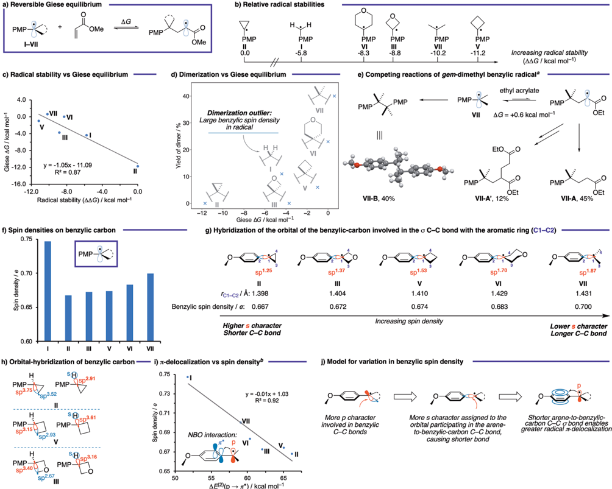

suppression. The cyclopropane radical, however, is known to be very unstable and more prone to ring opening than its larger-ring counterparts, presumably leading to its increased degradation and consequently, a low yield of Giese product IIA (19%) and no observable dimer II-B . 41 Conversely, the gem -dimethyl benzylic radical VII is stabilized to the extent that the addition to the acrylate becomes endergonic ( Δ G = +0.6 kcal mol -1 ) and is therefore reversible, allowing a buildup of this radical in the reaction and increasing the likelihood of dimerization (Figure 4e). The energy barriers for the Giese addition were calculated to be relatively low, Δ G ‡ = 15.3 -19.5 kcal mol -1 . For substrates with only a small, or nonexistent, driving force (e.g., cyclobutyl, THP, and gem -dimethyl), the reverse process will have similar forward and backward reaction barriers, leading to balanced concentrations of benzylicand Giese adduct radicals. However, for systems with a larger driving force (e.g., oxetane, methylene and cyclopropyl), the Giese process will be irreversible resulting in low concentrations of benzylic radicals.

The unsubstituted benzylic radical ( I ) is an outlier in this stability/dimerization trend in that dimer is observed (11%), despite the equilibrium lying toward the Giese adduct ( Δ G = -4.4 kcal mol -1 ). To explain this phenomenon, we noted that the spin density is much more localized at the benzylic position than that of the rest of the radicals under study ( ρ s = 0.75, Figure 4f). More localized benzylic radicals may incur a lower penalty to dimerization due to nonperfect synchronization, 42 making unsubstituted radical I the most susceptible to dimerization of the series. 43 On the other hand, the lower spin density of the cyclopropane radical II ( ρ s = 0.67) increases the barrier to dimerization relative to the Giese addition.

We propose that the extent of radical delocalization is controlled by the hybridization of the orbital of the benzylic carbon involved in the arene-to-benzylic-carbon σ bond (C1 -C2, Figure 4g), which in turn is determined by the hybridization of the orbitals involved in the C -C σ bonds of the additional benzylic substituents (C1 -C3 and C1 -C4, Figure 4g and h). Substrates in which the orbitals making these benzylic C -C bonds require enhanced p-character due to the small internal angles of small rings, e.g . cyclopropane II (sp 3.75 ; Figure 4h), must assign greater s-character to the orbital of C1

Sp 3.75

H

PMP -

Sp 3.15

H

PMP-

Sp 3.40

[·VII. VI](https://pubs.acs.org/doi/10.1021/acs.joc.3c00083?fig=fig4&ref=pdf)

PMP

[#](https://pubs.acs.org/doi/10.1021/acs.joc.3c00083?fig=fig4&ref=pdf)

[(AAG / kcal mol-1)](https://pubs.acs.org/doi/10.1021/acs.joc.3c00083?fig=fig4&ref=pdf)

a) Proposed mechanism

PMP

2a'

[then [Ir"]](https://pubs.acs.org/doi/10.1021/acs.joc.3c00083?fig=fig5&ref=pdf)

and Ht

[Giese Addition](https://pubs.acs.org/doi/10.1021/acs.joc.3c00083?fig=fig5&ref=pdf)

[(AG = -3.7 kcal mol-1)d](https://pubs.acs.org/doi/10.1021/acs.joc.3c00083?fig=fig5&ref=pdf)

[[AGt=+18.5 kcal mol-lld](https://pubs.acs.org/doi/10.1021/acs.joc.3c00083?fig=fig5&ref=pdf)

PMP

3

[c) Formation of di-addition product 2ae](https://pubs.acs.org/doi/10.1021/acs.joc.3c00083?fig=fig5&ref=pdf)

PMP

2a

[2á](https://pubs.acs.org/doi/10.1021/acs.joc.3c00083?fig=fig5&ref=pdf)

2a b) Deuterium labelling of enolate 2a ·

[COOH](https://pubs.acs.org/doi/10.1021/acs.joc.3c00083?fig=fig5&ref=pdf)

Figure 5. Mechanistic studies. a Literature values vs SCE in MeCN. 50 b Oxidation potentials measured by cyclic voltammetry in a 0.1 M solution of NBu4ClO4 in MeCN at 25 ° C with 100 mV s -1 scan rate and reported vs SCE. Anions generated in situ through the addition of 1 equiv NBu4OH (1 M in MeOH). Here, the anodic peak potentials ( E pa ) are reported. 51 See the Supporting Information, page S35 for further details. c Values calculated at the SMD 52 (DMF)-M06-2X 53 /ma-def2-TZVP 47 // ω B97X-D3 46 /def2-SVP 47 level (298.15 K, 1 M). Value for 2a · calculated using the methyl ester. d Values calculated using methyl acrylate at the CPCM 45 (DMF)ω B97X-D3 46 /def2-TZVP 47 // ω B97X-D3 46 /def2-SVP 47 level (298.15 K, 1 M). e Yields and percentage of deuteration (D-%) calculated by analysis of the 1 H NMR spectrum of the crude mixture of the reaction using 1,3,5-trimethoxybenzene as internal standard and a 30 s relaxation delay (d1). [Ir] = [Ir{dF(CF3)ppy}2(dtbbpy)]PF6 (see Scheme 2).

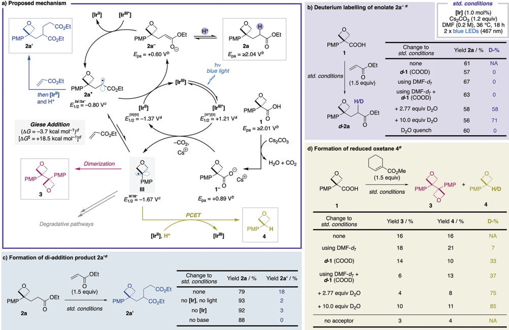

involved in the C -C σ bond with the arene (sp 1.25 ; Figure 4g). This is expressed in a shorter C1 -C2 bond, increased radical delocalization, and reduced benzylic spin density (Figure 4i; see Figure 4j for our proposed model for variation in spin density). We propose that delocalization is enhanced in oxetane III compared to cyclobutane V due to Bent's rule: 44 the electronegative oxetane oxygen atom withdraws electron density from the ring C -C bonds, forcing a greater pcontribution on the orbitals forming these bonds in III than V (sp 3.40 vs sp 3.15 , respectively, Figure 4h). As a result, the orbital of the benzylic-carbon (C1) involved in the C -C bond with the arene in III (C1 -C2) is richer in s-character (sp 1.37 ) and the bond is shorter (1.404 Å) than in V (sp 1.53 and 1.410 Å, respectively), thereby increasing π -delocalization and subsequently minimizing dimerization.

Overall, dimerization will be minimized for substrates with destabilized benzylic radicals that are able to efficiently delocalize into the arene π system. For example, the Giese addition for oxetane radical III is exergonic ( Δ G = -3.7 kcal mol -1 ), and the radical is sufficiently π -delocalized ( ρ s = 0.67) due to the high p-character demanded within the oxetane ring ( vide supra ), such that no dimer is observed and the yield of Giese product is high in the reaction with acrylates.

Based on literature precedent 26a -d,29 and focused experimental (Figure 5) and computational data (Figure 4), we propose the mechanism depicted in Figure 5a. The [Ir III ] catalyst is excited by visible light to [Ir III * ] . Oxetane acid 1 , which cannot be oxidized directly by [Ir III * ] , is deprotonated by Cs2CO3 to 1 -, which is now oxidizable at +0.89 V vs SCE. 1 -transfers an electron to [Ir III * ] and is thereby oxidized to a carboxylate radical (not shown) that rapidly ( k = 10 10 s -1 ) 49 decarboxylates to oxetane radical III .

Oxetane radical III then undergoes an essentially irreversible (forward reaction ca. 500 times faster than reverse reaction) and slightly exergonic Giese addition into ethyl acrylate to form adduct 2a · , which is reduced by [Ir II ] to enolate 2a -, thereby regenerating the catalyst, [Ir III ] . In a final step, 2a -is protonated to form the product 2a . Deuteration studies (Figure 5b) support the protonation step, with high deuterium incorporation α to the ester with D 2 O as additive. The source of protons under the standard reaction conditions remains unclear, with no deuterium incorporated with either d -1 (COOD) or DMFd 7 and no significant effect of water content on the reaction outcome (Supporting Tables S11 -S12).

Diaddition product 2a ′ was shown to form predominantly via the polarity mismatched radical conjugate addition of 2a · into a second molecule of ethyl acrylate (followed by reduction by [Ir II ] and protonation) and not by a more intuitive polar conjugate addition of 2a -into ethyl acrylate. 2a · can either directly add into ethyl acrylate after its formation or be

[Change to](https://pubs.acs.org/doi/10.1021/acs.joc.3c00083?fig=fig5&ref=pdf)

PMP

OEt std. conditions

[Ir] (1.0 mol%)

DMF (0.2 M), 36 °C, 18 h

Cs,CO3 (1.2 equiv)

2 x blue LEDs (467 nm)

[Yield 2a / %](https://pubs.acs.org/doi/10.1021/acs.joc.3c00083?fig=fig5&ref=pdf)

[D-%](https://pubs.acs.org/doi/10.1021/acs.joc.3c00083?fig=fig5&ref=pdf)

reformed at a later stage by oxidation of 2a -by the excited photocatalyst [Ir III * ] , as suggested by the oxidation potentials (Figure 5a). Importantly, it was shown that the final product 2a is converted into 2a ′ by resubmission to the reaction conditions (18%), but not in the absence of [Ir] , light, or base (&lt;3%; Figure 5c). Slow depletion of 2a with increased amounts of 2a ′ was observed at long reaction times (Supporting Table S14 and Figure S11).

Oxetane radical III can also embark on alternative reaction pathways such as dimerization to form 3 or reduction to generate 4 . The extent of these side reactions was intriguingly dictated by the choice of radical acceptor (see Supporting Schemes S5 and S6 for full overview). Particularly, less electrophilic and/or more sterically hindered alkenes led to increased amounts of 3 and 4 . This is presumably due to an increase in Δ G and Δ G ‡ (both more positive) of the Giese addition, shifting the equilibrium toward oxetane radical III . A higher concentration of oxetane radical significantly increases the rate of dimerization (directly proportional to the square of radical concentration), and the formation of reduced oxetane 4 .

Reduction of oxetane radical III to generate 4 was intriguing, with no explicit reductant or H atom transfer (HAT) reagent present in the reaction mixture. We investigated the formation of 4 through deuteration studies using cyclohexene methyl carboxylate as the acceptor, which had shown elevated amounts of 4 (Figure 5d). High deuterium incorporation with D2O as an additive suggests protons to be the source of 'H' in 4 . The low deuterium incorporation with DMFd 7 rules out HAT from DMF to the oxetane radical. 54 Reduction of the oxetane radical by [Ir II ] to an oxetane-3-anion followed by protonation is unlikely based on the calculated reduction potential of the oxetane radical ( E 1/2 III/III d -= -1.67 V vs SCE) which lies outside the reduction range of [Ir II ] (Figure 5a). We hence tentatively propose reduced oxetane 4 to be generated through a concerted multisite proton-coupled electron transfer (PCET) 55 with [Ir II ] as the source of electrons.

Interestingly, only minimal amounts of 3 and 4 were observed in the absence of acceptor (Figure 5d), hinting to its involvement in the oxidation of [Ir II ] back to [Ir III ] . However, direct oxidation of [Ir II ] by the alkene is unfeasible based on the alkenes' reduction potentials (e.g., for cyclohexene methyl carboxylate calculated to be E 1/2 M/M d ·-= -2.60 V vs SCE; Supporting Table S7). 56 Thus, speculatively, we propose that the high concentration of strained oxetane radical also increases the rate of irreversible oxetane degradation pathways to generate radicals that can more easily add into the acceptor and form unidentified Giese adducts capable of oxidizing [Ir II ] . 57

## ■ CONCLUSIONS

In summary, we report the generation of unusual tertiary benzylic strained oxetane and azetidine radicals under photoredox catalysis. We have developed a protocol for the use of 3-aryl-3-carboxylic acid oxetanes and azetidines as radical precursors which react with alkenes to form medicinally relevant alkylated 3,3-disubstituted oxetanes and azetidines with previously inaccessible substitution patterns. The reaction is reproducible, easy to set up, and insensitive to common deviations from the conditions. The products could be further transformed to reveal free NH azetidine functionality, as well as a free 'bis-homologated' oxetane carboxylic acid or a tetrahydropyranone heterocycle after oxetane ring-opening, depending on the conditions used for ester removal. An experimental comparison of the reactivity of different benzylic radicals revealed only oxetane and azetidine substrates to favor a productive Giese reaction pathway with the other benzylic linkers showing significantly lower yields and/or increased amounts of dimer side products. A computational investigation revealed the Giese addition of benzylic radicals into acrylate acceptors to be reversible in some cases, with less stable radicals shifting the equilibrium toward the coupled product. Furthermore, reduced spin density on the benzylic carbon was found to minimize formation of the dimer side product. Oxetane radicals, and by analogy azetidine radicals, are the only species that lie in the sweet spot of undergoing little degradation of the benzylic radical, while showing an exergonic Giese addition and minimal dimer formation.

Experimental and computational studies are presented to explain the differing reaction outcome with certain acceptors, and to suggest the mechanism for the formation of side products. We envisage this protocol will encourage the use of 3-aryl-3-carboxylic acid oxetanes and azetidines as convenient radical precursors in medicinal chemistry and expand the medicinal chemist's toolbox for the incorporation of fourmembered rings into drug-like compounds. The computational and experimental mechanistic investigations presented herein improve the general understanding of photoredox catalyzed reactions, particularly in Giese-type transformations and of strained ring and/or benzylic substrates. The insights from these fundamental studies will aid the development of further methodologies that involve such substrates and provide synthetic chemists with important factors to be considered during the optimization of such reactions.

## ■ ASSOCIATED CONTENT

## Data Availability Statement

The data underlying this study are available in the published article and its Supporting Information. Raw and processed characterization data for all novel compounds, raw and processed data of CV measurements and Cartesian coordinates from computed structures can be found at the Imperial College London Research Data Repository: 10.14469/hpc/10668.

## * sı Supporting Information

The Supporting Information is available free of charge at https://pubs.acs.org/doi/10.1021/acs.joc.3c00083.

X-ray crystallographic data; detailed optimization and sensitivity tables; further discussion of mechanism and scope; cyclic voltammetry (CV) measurements; experimental procedures, detailed description of setup, characterization data and copies of 1 H, 13 C, 19 F, and 31 P NMR spectra (PDF)

## Accession Codes

CCDC 2184087 -2184092 contain the supplementary crystallographic data for this paper. These data can be obtained free of charge via www.ccdc.cam.ac.uk/data\_request/cif, or by emailing data\_request@ccdc.cam.ac.uk, or by contacting The Cambridge Crystallographic Data Centre, 12 Union Road, Cambridge CB2 1EZ, UK; fax: +44 1223 336033.

## ■ AUTHOR INFORMATION

## Corresponding Authors

- James A. Bull -Department of Chemistry, Imperial College London, London W12 0BZ, U.K.; orcid.org/0000-00033993-5818; Email: j.bull@imperial.ac.uk
- Fernanda Duarte -Department of Chemistry, Chemistry Research Laboratory, University of Oxford, Oxford OX1 3TA, U.K.; orcid.org/0000-0002-6062-8209; Email: fernanda.duartegonzalez@chem.ox.ac.uk

## Authors

- Maryne A. J. Dubois -Department of Chemistry, Imperial College London, London W12 0BZ, U.K.
- Juan J. Rojas -Department of Chemistry, Imperial College London, London W12 0BZ, U.K.; orcid.org/0000-00029471-5888
- Alistair J. Sterling -Department of Chemistry, Chemistry Research Laboratory, University of Oxford, Oxford OX1 3TA, U.K.
- Hannah C. Broderick -Department of Chemistry, Imperial College London, London W12 0BZ, U.K.
- Milo A. Smith -Department of Chemistry, Imperial College London, London W12 0BZ, U.K.; orcid.org/0000-00028403-9636
- Andrew J. P. White -Department of Chemistry, Imperial College London, London W12 0BZ, U.K.
- Philip W. Miller -Department of Chemistry, Imperial College London, London W12 0BZ, U.K.; orcid.org/0000-00028394-2516
- Chulho Choi -Pfizer Global Research and Development, Groton, Connecticut 06340, United States; orcid.org/ 0000-0003-3459-3767

James J. Mousseau -Pfizer Global Research and Development, Groton, Connecticut 06340, United States; orcid.org/0000-0002-5712-9222

Complete contact information is available at: https://pubs.acs.org/10.1021/acs.joc.3c00083

## Author Contributions

∥ M.A.J.D., J.J.R., and A.J.S. contributed equally.

## Notes

The authors declare no competing financial interest. A version of this manuscript was deposited 58

on the preprint repository ChemRxiv.

## ■ ACKNOWLEDGMENTS

We gratefully acknowledge The Royal Society [University Research Fellowship, UF140161 and URF\R\201019 (to J.A.B.), URF Appointed Grant RG150444 and URF Enhancement Grant RGF\EA\180031], Pfizer and Imperial College London for studentship funding (M.D. and J.J.R.) and EPSRC Centre for Doctoral training in Next Generation Synthesis and Reaction Technology (EP/S023232/1) for a studentship to H.A.B]. We thank Richard P. Loach and Thomas Knauber (Pfizer) for valuable discussion and training. A. J. S. thanks the EPSRC Centre for Doctoral Training in Synthesis for Biology and Medicine for a studentship (EP/L015838/1), the OxfordRadcliffe Scholarship for a studentship, and the EPSRC Doctoral Prize (EP/T517811/1) for support. This work used the Cirrus UK National Tier-2 HPC Service at EPCC (http:// www.cirrus.ac.uk) funded by the University of Edinburgh and EPSRC (EP/P020267/1).

## ■ REFERENCES

- (1) (a) Burkhard, J. A.; Wuitschik, G.; Rogers-Evans, M.; Mu ller, K.; Carreira, E. M. Oxetanes as Versatile Elements in Drug Discovery and Synthesis. Angew. Chem., Int. Ed. 2010 , 49 , 9052 -9067. (b) Carreira, E. M.; Fessard, T. C. Four-Membered Ring-Containing Spirocycles: Synthetic Strategies and Opportunities. Chem. Rev. 2014 , 114 , 8257 -8322. (c) Bull, J. A.; Croft, R. A.; Davis, O. A.; Doran, R.; Morgan, K. F. Oxetanes: Recent Advances in Synthesis, Reactivity, and Medicinal Chemistry. Chem. Rev. 2016 , 116 , 12150 -12233. (d) Kirichok, A. A.; Shton, I.; Kliachyna, M.; Pishel, I.; Mykhailiuk, P. K. 1-Substituted 2Azaspiro[3.3]Heptanes: Overlooked Motifs for Drug Discovery. Angew. Chem., Int. Ed. 2017 , 56 , 8865 -8869. (e) Bott, T. M.; West, F. G. Preparation and Synthetic Applications of Azetidines. Heterocycles 2012 , 84 , 223 -264. (f) Rojas, J. J.; Bull, J. A. Oxetanes and Oxetenes-Monocyclic. In Comprehensive Heterocyclic Chemistry IV ; Black, D. S.; Cossy, J.; Stevens, C. V., Eds.; Elsevier, 2022; Vol. 2 , pp 212 -256. (g) Liang, J.; Jakalian, A.; Lambrecht, M. J.; LaroucheGauthier, R.; Huestis, M. P.; Ung, M. U.; Wang, X.; Yadav, A.; Zbieg, J. R.; Broccatelli, F. Lactams as CBL-B Inhibitors. PCT Int. Appl. WO 2022169997 A1, August 11, 2022.
- (2) ClinicalTrials.gov Identifier: NCT03285711.
- (3) ClinicalTrials.gov Identifier: NCT01229644.
- (4) Chen, Z.; Doyle, T. M.; Luongo, L.; Largent-Milnes, T. M.; Giancotti, L. A.; Kolar, G.; Squillace, S.; Boccella, S.; Walker, J. K.; Pendleton, A.; Spiegel, S.; Neumann, W. L.; Vanderah, T. W.; Salvemini, D. Sphingosine-1-Phosphate Receptor 1 Activation in Astrocytes Contributes to Neuropathic Pain. Proc. Natl. Acad. Sci. U. S. A. 2019 , 116 , 10557 -10562.

̃

- (5) FDA-approval against rheumatoid arthritis: Application Number: 207924. First global approval: (a) Markham, A. Baricitinib: First Global Approval. Drugs 2017 , 77 , 697 -704. As treatment against COVID-19: (b) Stebbing, J.; Sánchez Nievas, G.; Falcone, M.; Youhanna, S.; Richardson, P.; Ottaviani, S.; Shen, J. X.; Sommerauer, C.; Tiseo, G.; Ghiadoni, L.; Virdis, A.; Monzani, F.; Romero Rizos, L.; Forfori, F.; Avendan o Céspedes, A.; De Marco, S.; Carrozzi, L.; Lena, F.; Sánchez-Jurado, P. M.; Lacerenza, L. G.; Cesira, N.; Caldevilla Bernardo, D.; Perrella, A.; Niccoli, L.; Sáez Méndez, L.; Matarrese, D.; Goletti, D.; Tan, Y.-J.; Monteil, V.; Dranitsaris, G.; Cantini, F.; Farcomeni, A.; Dutta, S.; Burley, S. K.; Zhang, H.; Pistello, M.; Li, W.; Mas Romero, M.; Andrés Pretel, F.; Sánchez Simón-Talero, R.; García-Molina, R.; Kutter, C.; Felce, J. H.; Nizami, Z. F.; Miklosi, A. G.; Penninger, J. M.; Menichetti, F.; Mirazimi, A.; Abizanda, P.; Lauschke, V. M. JAK Inhibition Reduces SARS-CoV-2 Liver Infectivity and Modulates Inflammatory Responses to Reduce Morbidity and Mortality. Sci. Adv. 2021 , 7 , No. eabe4724.

̈

- (6) (a) Wuitschik, G.; Carreira, E. M.; Wagner, B.; Fischer, H.; Parrilla, I.; Schuler, F.; Rogers-Evans, M.; Mu ller, K. Oxetanes in Drug Discovery: Structural and Synthetic Insights. J. Med. Chem. 2010 , 53 , 3227 -3246. (b) Dubois, M. A. J.; Croft, R. A.; Ding, Y.; Choi, C.; Owen, D. R.; Bull, J. A.; Mousseau, J. J. Investigating 3,3Diaryloxetanes as Potential Bioisosteres through Matched Molecular Pair Analysis. RSC Med. Chem. 2021 , 12 , 2045 -2052.

̈

- (7) For selected examples, see: (a) Becker, M. R.; Wearing, E. R.; Schindler, C. S. Synthesis of Azetidines via Visible-Light-Mediated Intermolecular [2 + 2] Photocycloadditions. Nat. Chem. 2020 , 12 , 898 -905. (b) Rykaczewski, K. A.; Schindler, C. S. Visible-LightEnabled Paterno ̀-Bu chi Reaction via Triplet Energy Transfer for the Synthesis of Oxetanes. Org. Lett. 2020 , 22 , 6516 -6519. (c) Davis, O. A.; Bull, J. A. Synthesis of Di-, Tri-, and Tetrasubstituted Oxetanes by Rhodium-Catalyzed O -H Insertion and C -C Bond-Forming Cyclization. Angew. Chem., Int. Ed. 2014 , 53 , 14230 -14234. (d) Willand-Charnley, R.; Puffer, B. W.; Dussault, P. H. Oxacycle Synthesis via Intramolecular Reaction of Carbanions and Peroxides. J. Am. Chem. Soc. 2014 , 136 , 5821 -5823. (e) Butova, E. D.; Barabash, A. V.; Petrova, A. A.; Kleiner, C. M.; Schreiner, P. R.; Fokin, A. A. Stereospecific Consecutive Epoxide Ring Expansion with Dimethylsulfoxonium Methylide. J. Org. Chem. 2010 , 75 , 6229 -6235. (f) Rodina, L. L.; Malashikhin, S. A.; Galkina, O. S.; Nikolaev, V. A. Photochemical Reactions of Regioisomeric 2,2-Dimethyl-5,5-

̈

Diphenyl- and 5,5-Dimethyl-2,2-Diphenyl-Substituted Diazo Ketones of a Tetrahydrofuran Series. Helv. Chim. Acta 2009 , 92 , 1990 -1998. (g) Kovács, E.; Faigl, F.; Mucsi, Z. Regioand Diastereoselective Synthesis of 2-Arylazetidines: Quantum Chemical Explanation of Baldwin's Rules for the Ring-Formation Reactions of Oxiranes. J. Org. Chem. 2020 , 85 , 11226 -11239. (h) Gianatassio, R.; Lopchuk, J. M.; Wang, J.; Pan, C.-M.; Malins, L. R.; Prieto, L.; Brandt, T. A.; Collins, M. R.; Gallego, G. M.; Sach, N. W.; Spangler, J. E.; Zhu, H.; Zhu, J.; Baran, P. S. Strain-Release Amination. Science 2016 , 351 , 241 -246. Also see ref 19.

- (8) (a) Ravelli, D.; Zoccolillo, M.; Mella, M.; Fagnoni, M. Photocatalytic Synthesis of Oxetane Derivatives by Selective C -H Activation. Adv. Synth. Catal. 2014 , 356 , 2781 -2786. (b) Jin, J.; MacMillan, D. W. C. Direct α -Arylation of Ethers through the Combination of Photoredox-Mediated C -H Functionalization and the Minisci Reaction. Angew. Chem., Int. Ed. 2015 , 54 , 1565 -1569.
- (9) For selected examples, using iodooxetane in Minisci reactions, see: (a) Duncton, M. A. J.; Estiarte, M. A.; Johnson, R. J.; Cox, M.; O'Mahony, D. J. R.; Edwards, W. T.; Kelly, M. G. Preparation of Heteroaryloxetanes and Heteroarylazetidines by Use of a Minisci Reaction. J. Org. Chem. 2009 , 74 , 6354 -6357. (b) Nuhant, P.; Oderinde, M. S.; Genovino, J.; Juneau, A.; Gagné, Y.; Allais, C.; Chinigo, G. M.; Choi, C.; Sach, N. W.; Bernier, L.; Fobian, Y. M.; Bundesmann, M. W.; Khunte, B.; Frenette, M.; Fadeyi, O. O. VisibleLight-Initiated Manganese Catalysis for C -H Alkylation of Heteroarenes: Applications and Mechanistic Studies. Angew. Chem., Int. Ed. 2017 , 56 , 15309 -15313.
- (10) (a) Górski, B.; Barthelemy, A.-L.; Douglas, J. J.; Juliá, F.; Leonori, D. Copper-Catalysed Amination of Alkyl Iodides Enabled by Halogen-Atom Transfer. Nat. Catal. 2021 , 4 , 623 -630. (b) Constantin, T.; Zanini, M.; Regni, A.; Sheikh, N. S.; Juliá, F.; Leonori, D. Aminoalkyl Radicals as Halogen-Atom Transfer Agents for Activation of Alkyl and Aryl Halides. Science 2020 , 367 , 1021 -1026. (c) Kvasovs, N.; Iziumchenko, V.; Palchykov, V.; Gevorgyan, V. Visible LightInduced Pd-Catalyzed Alkyl-Heck Reaction of Oximes. ACS Catal. 2021 , 11 , 3749 -3754. (d) Bissonnette, N. B.; Boyd, M. J.; May, G. D.; Giroux, S.; Nuhant, P. C -H Functionalization of Heteroarenes Using Unactivated Alkyl Halides through Visible-Light Photoredox Catalysis under Basic Conditions. J. Org. Chem. 2018 , 83 , 10933 -10940. (e) Ye, S.; Zheng, D.; Wu, J.; Qiu, G. Photoredox-Catalyzed Sulfonylation of Alkyl Iodides, Sulfur Dioxide, and Electron-Deficient Alkenes. Chem. Commun. 2019 , 55 , 2214 -2217.
- (11) There are also reports with 3-bromo oxetane and azetidine (see below for examples). There have been no examples with 3-chloro oxetane or azetidine. (a) Smith, R. T.; Zhang, X.; Rincón, J. A.; Agejas, J.; Mateos, C.; Barberis, M.; García-Cerrada, S.; de Frutos, O.; MacMillan, D. W. C. Metallaphotoredox-Catalyzed Cross-Electrophile Csp 3 -Csp 3 Coupling of Aliphatic Bromides. J. Am. Chem. Soc. 2018 , 140 , 17433 -17438. (b) ElMarrouni, A.; Ritts, C. B.; Balsells, J. Silyl-Mediated Photoredox-Catalyzed Giese Reaction: Addition of Non-Activated Alkyl Bromides. Chem. Sci. 2018 , 9 , 6639 -6646. (c) Escobar, R. A.; Johannes, J. W. Reductive Radical Conjugate Addition of Alkyl Electrophiles Catalyzed by a Cobalt/Iridium Photoredox System. Org. Lett. 2021 , 23 , 6046 -6051. (d) Dow, N. W.; Cabré, A.; MacMillan, D. W. C. A General N -Alkylation Platform via Copper Metallaphotoredox and Silyl Radical Activation of Alkyl Halides. Chem. 2021 , 7 , 1827 -1842. (e) Liu, Y.; Zhou, C.; Jiang, M.; Arndtsen, B. A. Versatile Palladium-Catalyzed Approach to Acyl Fluorides and Carbonylations by Combining Visible Lightand Ligand-Driven Operations. J. Am. Chem. Soc. 2022 , 144 , 9413 -9420. (12) Genovino, J.; Lian, Y.; Zhang, Y.; Hope, T. O.; Juneau, A.; Gagné, Y.; Ingle, G.; Frenette, M. Metal-Free-Visible Light C -H Alkylation of Heteroaromatics via Hypervalent Iodine-Promoted Decarboxylation. Org. Lett. 2018 , 20 , 3229 -3232.
- (13) 3-Methyloxetane radicals have also been generated by deoxygenation of an NHC-activated alcohol and coupled to aryl halides: Dong, Z.; MacMillan, D. W. C. Metallaphotoredox-Enabled Deoxygenative Arylation of Alcohols. Nature 2021 , 598 , 451 -456.
- (14) Green, S. A.; Vásquez-Céspedes, S.; Shenvi, R. A. Iron -Nickel Dual-Catalysis: A New Engine for Olefin Functionalization and the Formation of Quaternary Centers. J. Am. Chem. Soc. 2018 , 140 , 11317 -11324.
- (15) Kolahdouzan, K.; Khalaf, R.; Grandner, J. M.; Chen, Y.; Terrett, J. A.; Huestis, M. P. Dual Photoredox/Nickel-Catalyzed Conversion of Aryl Halides to Aryl Aminooxetanes: Computational Evidence for a Substrate-Dependent Switch in Mechanism. ACS Catal. 2020 , 10 , 405 -411.
- (16) [Zhang, Y.; Zhang, Y.; Shen, X. Alkoxyl-Radical-Mediated Synthesis of Functionalized Allyl tert -(Hetero)Cyclobutanols and Their Ring-Opening and Ring-Expansion Functionalizations. Chem. Catal. 2021 , 1 , 423 -436.](https://doi.org/10.1016/j.checat.2021.03.014)
- (17) Murray, P. R. D.; Bussink, W. M. M.; Davies, G. H. M.; van der Mei, F. W.; Antropow, A. H.; Edwards, J. T.; D'Agostino, L. A.; Ellis, J. M.; Hamann, L. G.; Romanov-Michailidis, F.; Knowles, R. R. Intermolecular Crossed [2 + 2] Cycloaddition Promoted by VisibleLight Triplet Photosensitization: Expedient Access to Polysubstituted 2-Oxaspiro[3.3]Heptanes. J. Am. Chem. Soc. 2021 , 143 , 4055 -4063.
- (18) For selected reviews on photoredox catalysis, see: (a) Prier, C. K.; Rankic, D. A.; MacMillan, D. W. C. Visible Light Photoredox Catalysis with Transition Metal Complexes: Applications in Organic Synthesis. Chem. Rev. 2013 , 113 , 5322 -5363. (b) Roslin, S.; Odell, L. R. Visible-Light Photocatalysis as an Enabling Tool for the Functionalization of Unactivated C(sp 3 )-Substrates. Eur. J. Org. Chem. 2017 , 2017 , 1993 -2007. (c) Marzo, L.; Pagire, S. K.; Reiser, O.; König, B. Visible-Light Photocatalysis: Does It Make a Difference in Organic Synthesis? Angew. Chem., Int. Ed. 2018 , 57 , 10034 -10072. (d) McAtee, R. C.; McClain, E. J.; Stephenson, C. R. J. Illuminating Photoredox Catalysis. Trends Chem. 2019 , 1 , 111 -125. (e) Petzold, D.; Giedyk, M.; Chatterjee, A.; König, B. A Retrosynthetic Approach for Photocatalysis. Eur. J. Org. Chem. 2020 , 2020 , 1193 -1244. (f) Cannalire, R.; Pelliccia, S.; Sancineto, L.; Novellino, E.; Tron, G. C.; Giustiniano, M. Visible Light Photocatalysis in the Late-Stage Functionalization of Pharmaceutically Relevant Compounds. Chem. Soc. Rev. 2021 , 50 , 766 -897. (g) Li, P.; Terrett, J. A.; Zbieg, J. R. Visible-Light Photocatalysis as an Enabling Technology for Drug Discovery: A Paradigm Shift for Chemical Reactivity. ACS Med. Chem. Lett. 2020 , 11 , 2120 -2130.
- (19) (a) Croft, R. A.; Mousseau, J. J.; Choi, C.; Bull, J. A. Structurally Divergent Lithium Catalyzed Friedel -Crafts Reactions on Oxetan-3-ols: Synthesis of 3,3-Diaryloxetanes and 2,3-Dihydrobenzofurans. Chem.  Eur. J. 2016 , 22 , 16271 -16276. (b) Croft, R. A.; Mousseau, J. J.; Choi, C.; Bull, J. A. Lithium-Catalyzed Thiol Alkylation with Tertiary and Secondary Alcohols: Synthesis of 3Sulfanyl-Oxetanes as Bioisosteres. Chem.  Eur. J. 2018 , 24 , 818 -821. (c) Denis, C.; Dubois, M. A. J.; Voisin-Chiret, A. S.; Bureau, R.; Choi, C.; Mousseau, J. J.; Bull, J. A. Synthesis of 3,3-Diarylazetidines by Calcium(II)-Catalyzed Friedel -Crafts Reaction of Azetidinols with Unexpected Cbz Enhanced Reactivity. Org. Lett. 2019 , 21 , 300 -304. (d) Rojas, J. J.; Croft, R. A.; Sterling, A. J.; Briggs, E. L.; Antermite, D.; Schmitt, D. C.; Blagojevic, L.; Haycock, P.; White, A. J. P.; Duarte, F.; Choi, C.; Mousseau, J. J.; Bull, J. A. Amino-Oxetanes as Amide Isosteres by an Alternative Defluorosulfonylative Coupling of Sulfonyl Fluorides. Nat. Chem. 2022 , 14 , 160 -169. (e) Rojas, J. J.; Torrisi, E.; Dubois, M. A. J.; Hossain, R.; White, A. J. P.; Zappia, G.; Mousseau, J. J.; Choi, C.; Bull, J. A. Oxetan-3-ols as 1,2-Bis-Electrophiles in a Brønsted-Acid-Catalyzed Synthesis of 1,4-Dioxanes. Org. Lett. 2022 , 24 , 2365 -2370.

(20) For isolated examples of tertiary benzylic radicals, see: (a) Li, Z.; Wang, X.; Xia, S.; Jin, J. Ligand-Accelerated Iron Photocatalysis Enabling Decarboxylative Alkylation of Heteroarenes. Org. Lett. 2019 , 21 , 4259 -4265. (b) Dang, H. T.; Haug, G. C.; Nguyen, V. T.; Vuong, N. T. H.; Nguyen, V. D.; Arman, H. D.; Larionov, O. V. Acridine Photocatalysis: Insights into the Mechanism and Development of a Dual-Catalytic Direct Decarboxylative Conjugate Addition. ACS Catal. 2020 , 10 , 11448 -11457. (c) Shatskiy, A.; Axelsson, A.; Stepanova, E. V.; Liu, J.-Q.; Temerdashev, A. Z.; Kore, B. P.; Blomkvist, B.; Gardner, J. M.; Dinér, P.; Kärkäs, M. D. Stereoselective

Synthesis of Unnatural α -Amino Acid Derivatives through Photoredox Catalysis. Chem. Sci. 2021 , 12 , 5430 -5437. (d) Nguyen, V. T.; Haug, G. C.; Nguyen, V. D.; Vuong, N. T. H.; Arman, H. D.; Larionov, O. V. Photocatalytic Decarboxylative Amidosulfonation Enables Direct Transformation of Carboxylic Acids to Sulfonamides. Chem. Sci. 2021 , 12 , 6429 -6436. (e) Feng, G.; Wang, X.; Jin, J. Decarboxylative C -C and C -N Bond Formation by LigandAccelerated Iron Photocatalysis. Eur. J. Org. Chem. 2019 , 2019 , 6728 -6732. (f) Zhu, Q.; Nocera, D. G. Photocatalytic Hydromethylation and Hydroalkylation of Olefins Enabled by Titanium Dioxide Mediated Decarboxylation. J. Am. Chem. Soc. 2020 , 142 , 17913 -17918. (g) Kautzky, J. A.; Wang, T.; Evans, R. W.; MacMillan, D. W. C. Decarboxylative Trifluoromethylation of Aliphatic Carboxylic Acids. J. Am. Chem. Soc. 2018 , 140 , 6522 -6526. (h) Cao, H.; Jiang, H.; Feng, H.; Kwan, J. M. C.; Liu, X.; Wu, J. Photo-Induced Decarboxylative Heck-Type Coupling of Unactivated Aliphatic Acids and Terminal Alkenes in the Absence of Sacrificial Hydrogen Acceptors. J. Am. Chem. Soc. 2018 , 140 , 16360 -16367. (i) Kolusu, S. R. N.; Nappi, M. Metal-Free Deoxygenative Coupling of Alcohol-Derived Benzoates and Pyridines for Small Molecules and DNA-Encoded Libraries Synthesis. Chem. Sci. 2022 , 13 , 6982 -6989.

- (21) The increased stability of benzylic radicals, further increased for tertiary benzylic examples, often leads to homocoupling reactions. The increased steric crowding around the reactive center also makes intermolecular reaction pathways less favorable for tertiary benzylic radicals. (a) Capaldo, L.; Buzzetti, L.; Merli, D.; Fagnoni, M.; Ravelli, D. Smooth Photocatalyzed Benzylation of Electrophilic Olefins via Decarboxylation of Arylacetic Acids. J. Org. Chem. 2016 , 81 , 7102 -7109. (b) Manley, D. W.; Walton, J. C. A Clean and Selective Radical Homocoupling Employing Carboxylic Acids with Titania Photoredox Catalysis. Org. Lett. 2014 , 16 , 5394 -5397. (c) McLean, E. B.; Mooney, D. T.; Burns, D. J.; Lee, A.-L. Direct Hydrodecarboxylation of Aliphatic Carboxylic Acids: Metal- and Light-Free. Org. Lett. 2022 , 24 , 686 -691.

(22) (a) Li, P.; Zbieg, J. R.; Terrett, J. A. A Platform for Decarboxylative Couplings via Photoredox Catalysis: Direct Access to Carbocations from Carboxylic Acids for Carbon -Oxygen Bond Formation. ACS Catal. 2021 , 11 , 10997 -11004. (b) Li, P.; Zbieg, J. R.; Terrett, J. A. The Direct Decarboxylative N -Alkylation of Azoles, Sulfonamides, Ureas, and Carbamates with Carboxylic Acids via Photoredox Catalysis. Org. Lett. 2021 , 23 , 9563 -9568.

(23) (a) Nawrat, C. C.; Jamison, C. R.; Slutskyy, Y.; MacMillan, D. W. C.; Overman, L. E. Oxalates as Activating Groups for Alcohols in Visible Light Photoredox Catalysis: Formation of Quaternary Centers by Redox-Neutral Fragment Coupling. J. Am. Chem. Soc. 2015 , 137 , 11270 -11273. (b) Zhang, X.; MacMillan, D. W. C. Alcohols as Latent Coupling Fragments for Metallaphotoredox Catalysis: sp 3 -sp 2 Cross-Coupling of Oxalates with Aryl Halides. J. Am. Chem. Soc. 2016 , 138 , 13862 -13865.

- (24) For examples of the general use of carboxylic acids as radical precursors, see: (a) Zuo, Z.; MacMillan, D. W. C. Decarboxylative Arylation of α -Amino Acids via Photoredox Catalysis: A One-Step Conversion of Biomass to Drug Pharmacophore. J. Am. Chem. Soc. 2014 , 136 , 5257 -5260. (b) Noble, A.; McCarver, S. J.; MacMillan, D. W. C. Merging Photoredox and Nickel Catalysis: Decarboxylative Cross-Coupling of Carboxylic Acids with Vinyl Halides. J. Am. Chem. Soc. 2015 , 137 , 624 -627. (c) Zuo, Z.; Ahneman, D. T.; Chu, L.; Terrett, J. A.; Doyle, A. G.; MacMillan, D. W. C. Merging Photoredox with Nickel Catalysis: Coupling of α -Carboxyl sp 3 -Carbons with Aryl Halides. Science 2014 , 345 , 437 -440. (d) Karmakar, S.; Silamkoti, A.; Meanwell, N. A.; Mathur, A.; Gupta, A. K. Utilization of C(sp 3 )-Carboxylic Acids and Their Redox-Active Esters in Decarboxylative Carbon -Carbon Bond Formation. Adv. Synth. Catal. 2021 , 363 , 3693 -3736.

(25) For seminal examples on the use of carboxylic acid derivatives as radical precursors for radical conjugate additions, see: (a) Barton, D. H. R.; Crich, D.; Kretzschmar, G. Formation of Carbon-Carbon Bonds with Radicals Derived from the Esters of Thiohydroxamic Acids. Tetrahedron Lett. 1984 , 25 , 1055 -1058. (b) Barton, D. H. R.;

- [Crich, D.; Kretzschmar, G. The Invention of New Radical Chain Reactions. Part 9. Further Radical Chemistry of Thiohydroxamic Esters; Formation of Carbon-Carbon Bonds. J. Chem. Soc., Perkin Trans. 1 1986 , 39 -53.](https://doi.org/10.1039/P19860000039)
- (26) For examples on the use of carboxylic acids as radical precursors for radical conjugate additions using photocatalysis, see: (a) Yoshimi, Y.; Masuda, M.; Mizunashi, T.; Nishikawa, K.; Maeda, K.; Koshida, N.; Itou, T.; Morita, T.; Hatanaka, M. Interand Intramolecular Addition Reactions of Electron-Deficient Alkenes with Alkyl Radicals, Generated by SET-Photochemical Decarboxylation of Carboxylic Acids, Serve as a Mild and Efficient Method for the Preparation of γ -Amino Acids and Macrocyclic Lactones. Org. Lett. 2009 , 11 , 4652 -4655. (b) Miyake, Y.; Nakajima, K.; Nishibayashi, Y. Visible Light-Mediated Oxidative Decarboxylation of Arylacetic Acids into Benzyl Radicals: Addition to Electron-Deficient Alkenes by Using Photoredox Catalysts. Chem. Commun. 2013 , 49 , 7854 -7856. (c) Merkens, K.; Aguilar Troyano, F. J.; Djossou, J.; Gómez-Suárez, A. Synthesis of Unnatural α -Amino Acid Derivatives via LightMediated Radical Decarboxylative Processes. Adv. Synth. Catal. 2020 , 362 , 2354 -2359. (d) Fernandez-Rodriguez, P.; Legros, F.; Maier, T.; Weber, A.; Méndez, M.; Derdau, V.; Hessler, G.; Kurz, M.; VillarGarea, A.; Ruf, S. Photoinduced Decarboxylative Radical Addition Reactions for Late Stage Functionalization of Peptide Substrates. Eur. J. Org. Chem. 2021 , 2021 , 782 -787. (e) Zhang, O.; Schubert, J. W. Derivatization of Amino Acids and Peptides via Photoredox-Mediated Conjugate Addition. J. Org. Chem. 2020 , 85 , 6225 -6232.

(27) Dubois, M. A. J.; Smith, M. A.; White, A. J. P.; Lee Wei Jie, A.; Mousseau, J. J.; Choi, C.; Bull, J. A. Short Synthesis of Oxetane and Azetidine 3-Aryl-3-Carboxylic Acid Derivatives by Selective Furan Oxidative Cleavage. Org. Lett. 2020 , 22 , 5279 -5283.

(28) For other methods to synthesize aryloxetane carboxylic acids, see: (a) Buckman, B. O.; Nicholas, J. B.; Emayan, K.; Seiwert, S. D. Lysophosphatidic Acid Receptor Antagonists. PCT Int. Appl. WO 2013025733 A1, February 21, 2013. (b) Li, D.; Sloman, D. L.; Achab, A.; Zhou, H.; McGowan, M. A.; White, C.; Gibeau, C.; Zhang, H.; Pu, Q.; Bharathan, I.; Hopkins, B.; Liu, K.; Ferguson, H.; Fradera, X.; Lesburg, C. A.; Martinot, T. A.; Qi, J.; Song, Z. J.; Yin, J.; Zhang, H.; Song, L.; Wan, B.; DAddio, S.; Solban, N.; Miller, J. R.; Zamlynny, B.; Bass, A.; Freeland, E.; Ykoruk, B.; Hilliard, C.; Ferraro, J.; Zhai, J.; Knemeyer, I.; Otte, K. M.; Vincent, S.; Sciammetta, N.; Pasternak, A.; Bennett, D. J.; Han, Y. Oxetane Promise Delivered: Discovery of Long-Acting IDO1 Inhibitors Suitable for Q3W Oral or Parenteral Dosing. J. Med. Chem. 2022 , 65 , 6001 -6016.

- (29) Chu, L.; Ohta, C.; Zuo, Z.; MacMillan, D. W. C. Carboxylic Acids as A Traceless Activation Group for Conjugate Additions: A Three-Step Synthesis of ( ± )-Pregabalin. J. Am. Chem. Soc. 2014 , 136 , 10886 -10889.
- (30) For reviews on Giese reactions and decarboxylative alkylations, see: (a) Gant Kanegusuku, A. L.; Roizen, J. L. Recent Advances in Photoredox-Mediated Radical Conjugate Addition Reactions: An Expanding Toolkit for the Giese Reaction. Angew. Chem., Int. Ed. 2021 , 60 , 21116 -21149. (b) Kitcatt, D. M.; Nicolle, S.; Lee, A.-L. Direct Decarboxylative Giese Reactions. Chem. Soc. Rev. 2022 , 51 , 1415 -1453. (c) Li, Y.; Ge, L.; Muhammad, M. T.; Bao, H. Recent Progress on Radical Decarboxylative Alkylation for Csp 3 -C Bond Formation. Synthesis 2017 , 49 , 5263 -5284.
- (31) Pitzer, L.; Schäfers, F.; Glorius, F. Rapid Assessment of the Reaction-Condition-Based Sensitivity of Chemical Transformations. Angew. Chem., Int. Ed. 2019 , 58 , 8572 -8576.
- (32) (a) Bonfield, H. E.; Knauber, T.; Lévesque, F.; Moschetta, E. G.; Susanne, F.; Edwards, L. J. Photons as a 21st Century Reagent. Nat. Commun. 2020 , 11 , 804. (b) Corcoran, E. B.; McMullen, J. P.; Lévesque, F.; Wismer, M. K.; Naber, J. R. Photon Equivalents as a Parameter for Scaling Photoredox Reactions in Flow: Translation of Photocatalytic C -NCross-Coupling from Lab Scale to Multikilogram Scale. Angew. Chem., Int. Ed. 2020 , 59 , 11964 -11968.

[(33) Vitaku, E.; Smith, D. T.; Njardarson, J. T. Analysis of the Structural Diversity, Substitution Patterns, and Frequency of Nitrogen](https://doi.org/10.1021/jm501100b?urlappend=%3Fref%3DPDF&jav=VoR&rel=cite-as)

Heterocycles among U.S. FDA Approved Pharmaceuticals. J. Med. Chem. 2014 , 57 , 10257 -10274.

- (34) Cavedon, C.; Sletten, E. T.; Madani, A.; Niemeyer, O.; Seeberger, P. H.; Pieber, B. Visible-Light-Mediated Oxidative Debenzylation Enables the Use of Benzyl Ethers as Temporary Protecting Groups. Org. Lett. 2021 , 23 , 514 -518.
- (35) 15 was found to be stable under standard laboratory conditions (handling at room temperature, removal of solvent at 40 ° C, acidic aq. conditions {pH 1 with dilute HCl}, growing of crystals by slow evaporation of CDCl3 over several days) and required no special considerations. Aryl substituents in the 3-position of oxetane carboxylic acids have been shown to stabilize against ring opening of more labile oxetane-3-acetic acid derivatives. See: Chalyk, B.; Grynyova, A.; Filimonova, K.; Rudenko, T. V.; Dibchak, D.; Mykhailiuk, P. K. Unexpected Isomerization of Oxetane-Carboxylic Acids. Org. Lett. 2022 , 24 , 4722 -4728.

(36) Ali, S.; Qadeer, G.; Rama, N. H.; Wong, W.-Y. CCDC 712490: Experimental Crystal Structure Determination 2008 , DOI: 10.5517/ ccrxdkl.

- (37) Arcadi, A.; Marinelli, F.; Adovasio, V.; Nardelli, M. CCDC 1189583: Experimental Crystal Structure Determination . 1993 .
- (38) Senge, M. O.; Gibbons, D.; Emandi, G. CCDC 1992782: Experimental Crystal Structure Determination 2020 , DOI: 10.5517/ ccdc.csd.cc24wn90.
- (39) For examples of benzylic substrates showing decreased or alternative reactivity in radical reactions, see: (a) Suga, T.; Shimazu, S.; Ukaji, Y. Low-Valent Titanium-Mediated Radical Conjugate Addition Using Benzyl Alcohols as Benzyl Radical Sources. Org. Lett. 2018 , 20 , 5389 -5392. (b) Ryder, A. S. H.; Cunningham, W. B.; Ballantyne, G.; Mules, T.; Kinsella, A. G.; Turner-Dore, J.; Alder, C. M.; Edwards, L. J.; McKay, B. S. J.; Grayson, M. N.; Cresswell, A. J. Photocatalytic α -Tertiary Amine Synthesis via C -H Alkylation of Unmasked Primary Amines. Angew. Chem., Int. Ed. 2020 , 59 , 14986 -14991. (c) Ma, G.; Chen, C.; Talukdar, S.; Zhao, X.; Lei, C.; Gong, H. Metal Catalyst-Free Photo-Induced Alkyl C -O Bond Borylation. Chem. Commun. 2020 , 56 , 10219 -10222. (d) Askey, H. E.; Grayson, J. D.; Tibbetts, J. D.; Turner-Dore, J. C.; Holmes, J. M.; Kociok-Kohn, G.; Wrigley, G. L.; Cresswell, A. J. Photocatalytic Hydroaminoalkylation of Styrenes with Unprotected Primary Alkylamines. J. Am. Chem. Soc. 2021 , 143 , 15936 -15945. (e) Suga, T.; Takahashi, Y.; Miki, C.; Ukaji, Y. Direct and Unified Access to Carbon Radicals from Aliphatic Alcohols by Cost-Efficient Titanium-Mediated Homolytic C -OH Bond Cleavage. Angew. Chem., Int. Ed. 2022 , 61 , No. e202112533.
- (40) The amount of diaddition product A ′ , formed through the addition of the product radical and/or enolate ( A · or A -) into another equivalent of ethyl acrylate (Scheme 4), was broadly similar across linkers that gave significant product formation ( I , III -VII ).
- (41) Walsh, R. Cyclic Alkyl Radical Isomerization: A Correction to the Literature. Int. J. Chem. Kinet. 1970 , 2 , 71 -74.
- (42) Costentin, C.; Savéant, J. M. Origin of Activation Barriers in the Dimerization of Neutral Radicals: A 'Nonperfect Synchronization' Effect? J. Phys. Chem. A 2005 , 109 , 4125 -4132.
- (43) Primary benzylic radicals have been shown to have a propensity to dimerize (ref 21b).
- (44) Bent, H. A. An Appraisal of Valence-Bond Structures and Hybridization in Compounds of the First-Row Elements. Chem. Rev. 1961 , 61 , 275 -311. Here, the electron-withdrawing effect of the electronegative oxygen atom on oxetane propagates through the two σ -bonds and imposes more s-character to the hybrid orbital responsible for the arene-to-benzylic-carbon σ bond. This shortens this bond and increases π delocalization of the benzylic radical. Bent's rule implies that the increased s-character in this bond is due to the unsymmetrical assignment of s and p character to hybrid orbitals to enable the electrons of polarized bonds to occupy lower energy orbitals, hence overall stabilization. This effect can be observed in the hybridization values in Figure 4h and is shown schematically below:
- (45) [Truong, T. N.; Stefanovich, E. V. A New Method for Incorporating Solvent Effect into the Classical, Ab Initio Molecular Orbital and Density Functional Theory Frameworks for Arbitrary Shape Cavity. Chem. Phys. Lett. 1995 , 240 , 253 -260.](https://doi.org/10.1016/0009-2614(95)00541-B)
- (46) Lin, Y.-S.; Li, G.-D.; Mao, S.-P.; Chai, J.-D. Long-Range Corrected Hybrid Density Functionals with Improved Dispersion Corrections. J. Chem. Theory Comput. 2013 , 9 , 263 -272.
- (47) Weigend, F.; Ahlrichs, R. Balanced Basis Sets of Split Valence, Triple Zeta Valence and Quadruple Zeta Valence Quality for H to Rn: Design and Assessment of Accuracy. Phys. Chem. Chem. Phys. 2005 , 7 , 3297.
- (48) (a) Foster, J. P.; Weinhold, F. Natural Hybrid Orbitals. J. Am. Chem. Soc. 1980 , 102 , 7211 -7218. (b) Glendening, E. D.; Weinhold, F. Natural Resonance Theory: I. General Formalism. J. Comput. Chem. 1998 , 19 , 593 -609.
- (49) Abel, B.; Assmann, J.; Buback, M.; Grimm, C.; Kling, M.; Schmatz, S.; Schroeder, J.; Witte, T. Ultrafast Decarboxylation of Carbonyloxy Radicals: Influence of Molecular Structure. J. Phys. Chem. A 2003 , 107 , 9499 -9510.
- (50) Lowry, M. S.; Goldsmith, J. I.; Slinker, J. D.; Rohl, R.; Pascal, R. A.; Malliaras, G. G.; Bernhard, S. Single-Layer Electroluminescent Devices and Photoinduced Hydrogen Production from an Ionic Iridium(III) Complex. Chem. Mater. 2005 , 17 , 5712 -5719.
- (51) E pa values provide more reliable and reproducible means to report the potentials of chemically irreversible oxidations (instead of e.g. estimating E p/2 values), as suggested by Lam: Leech, M. C.; Lam, K. A Practical Guide to Electrosynthesis. Nat. Rev. Chem. 2022 , 6 , 275 -286.
- (52) [Marenich, A. V.; Cramer, C. J.; Truhlar, D. G. Universal Solvation Model Based on Solute Electron Density and on a Continuum Model of the Solvent Defined by the Bulk Dielectric Constant and Atomic Surface Tensions. J. Phys. Chem. B 2009 , 113 , 6378 -6396.](https://doi.org/10.1021/jp810292n?urlappend=%3Fref%3DPDF&jav=VoR&rel=cite-as)
- (53) Zhao, Y.; Truhlar, D. G. Density Functionals with Broad Applicability in Chemistry. Acc. Chem. Res. 2008 , 41 , 157 -167.
- (54) DMF has been previously shown to act as a hydrogen atom donor: (a) Salamone, M.; Milan, M.; DiLabio, G. A.; Bietti, M. Reactions of the Cumyloxyl and Benzyloxyl Radicals with Tertiary Amides. Hydrogen Abstraction Selectivity and the Role of Specific Substrate-Radical Hydrogen Bonding. J. Org. Chem. 2013 , 78 , 5909 -5917. (b) Tam, C. M.; To, C. T.; Chan, K. S. Carbon -Carbon σ -Bond Transfer Hydrogenation with DMF Catalyzed by Cobalt Porphyrins. Organometallics 2016 , 35 , 2174 -2177. (c) Samai, S.; Rouichi, S.; Ferhati, A.; Chakir, A. N,N-Dimethylformamide (DMF), and N,N-Dimethylacetamide (DMA) Reactions with NO3, OH and Cl: A Theoretical Study of the Kinetics and Mechanisms. Arab. J. Chem. 2019 , 12 , 4957 -4970.
- (55) PCET is known to enable 'out-of-range' electron transfer processes. For reviews of PCET and its use in synthetic chemistry, see: (a) Huynh, M. H. V; Meyer, T. J. Proton-Coupled Electron Transfer. Chem. Rev. 2007 , 107 , 5004 -5064. (b) Weinberg, D. R.; Gagliardi, C. J.; Hull, J. F.; Murphy, C. F.; Kent, C. A.; Westlake, B. C.; Paul, A.; Ess, D. H.; McCafferty, D. G.; Meyer, T. J. ProtonCoupled Electron Transfer. Chem. Rev. 2012 , 112 , 4016 -4093. (c) Miller, D. C.; Tarantino, K. T.; Knowles, R. R. Proton-Coupled Electron Transfer in Organic Synthesis: Fundamentals, Applications, and Opportunities. Top. Curr. Chem. 2016 , 374 , 30. (d) Gentry, E. C.; Knowles, R. R. Synthetic Applications of Proton-Coupled Electron Transfer. Acc. Chem. Res. 2016 , 49 , 1546 -1556. (e) Murray, P. R. D.; Cox, J. H.; Chiappini, N. D.; Roos, C. B.; McLoughlin, E. A.; Hejna, B. G.; Nguyen, S. T.; Ripberger, H. H.; Ganley, J. M.; Tsui, E.; Shin, N. Y.; Koronkiewicz, B.; Qiu, G.; Knowles, R. R. Photochemical and Electrochemical Applications of Proton-Coupled Electron Transfer in Organic Synthesis. Chem. Rev. 2022 , 122 , 2017 -2291.

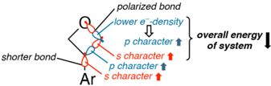

- (56) A measured cyclic voltammogram of cyclohexene methyl carboxylate showed an oxidation at 2.12 V vs SCE but no significant reduction waves up to -3.0 V. See Supporting Figure S24 and Supporting Table S15.

̧

- (57) Although possible side products were not observed, it has been recently shown that nucleophilic, C-centered, ring-opened oxetane radicals can efficiently react with electron-deficient alkenes in a Giesetype addition: Potrza saj, A.; Ociepa, M.; Chaładaj, W.; Gryko, D. Bioinspired Cobalt-Catalysis Enables Generation of Nucleophilic Radicals from Oxetanes. Org. Lett. 2022 , 24 , 2469 -2473.
- (58) Dubois, M. A. J.; Rojas, J. J.; Sterling, A. J.; Broderick, H. C.; Smith, M. A.; White, A. J. P.; Miller, P. W.; Choi, C.; Mousseau, J. J.; Duarte, F.; Bull, J. A. Visible Light Photoredox-Catalyzed Decarboxylative Alkylation of 3-Aryl-Oxetanes and Azetidines via Benzylic Tertiary Radicals and Implications of Benzylic Radical Stability [preprint]. ChemRxiv 2022 , DOI: 10.26434/chemrxiv-2022-n9d4zv2.

Explore the platform

CAS

A division of the

American Chemical Society

