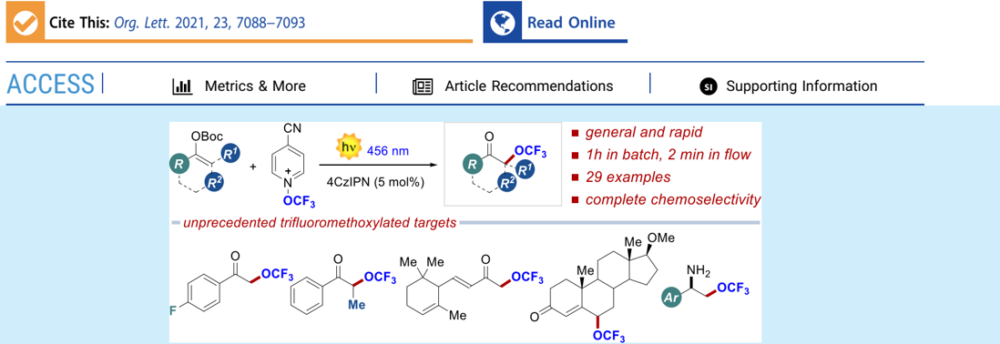
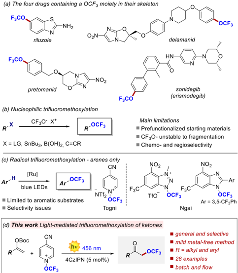
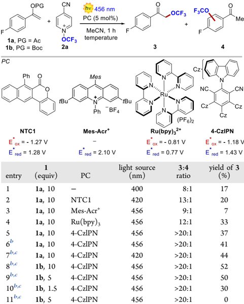
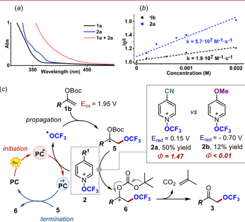
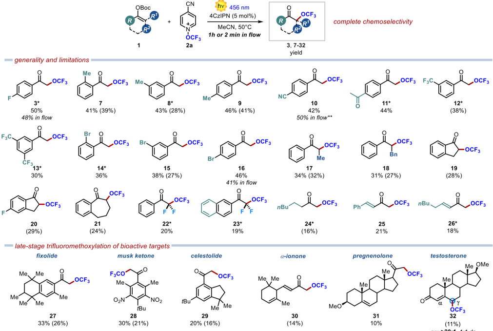
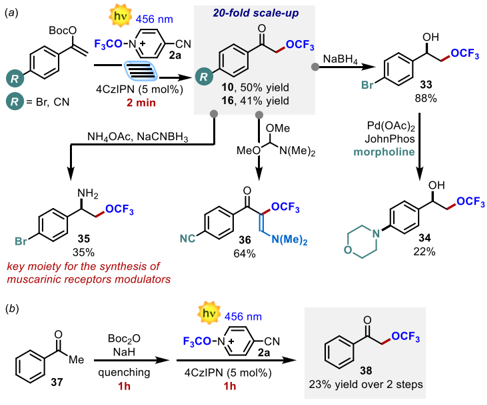

[pubs.acs.org/OrgLett](pubs.acs.org/OrgLett?ref=pdf)

## Radical α -Tri fl uoromethoxylation of Ketones under Batch and Flow Conditions by Means of Organic Photoredox Catalysis

Thibaut Duhail, ⊥ Tommaso Bortolato, ⊥ Javier Mateos, Elsa Anselmi, Benson Jelier, Antonio Togni, Emmanuel Magnier, * Guillaume Dagousset, * and Luca Dell ' Amico *

ABSTRACT: The fi rst light-driven method for the α -tri fl uoromethoxylation of ketones is reported. Enol carbonates react with N -tri fl uoromethoxy-4-cyano-pyridinium, using the photoredox catalyst 4-CzIPN under 456 nm irradiation, a ff ording the α -tri fl uoromethoxy ketones in ≤ 50% isolated yield and complete chemoselectivity. As shown by 29 examples, the reaction is general and proceeds very rapidly under batch (1 h) and fl ow conditions (2 min). Diverse product manipulations demonstrate the synthetic potential of the disclosed method in accessing elusive tri fl uoromethoxylated bioactive ingredients.

A mong the rapidly emerging per fl uorinated groups whose introduction into organic structures is of great interest, the OCF3 moiety occupies a very special place. 1 Electronic and steric properties are among the main reasons for the popularity of this group. It brings indeed a high lipophilicity (Hansch parameter π = +1.04) 2 to the molecules and possesses a high electronegativity (Pauling ' s electronegativity scale χ = 3.7) that has earned it the nickname of superhalogen. 3 These remarkable physicochemical properties associated with good metabolic stability and unique conformational properties make this group particularly attractive for the life sciences. 4 Despite this, the number of marketed pharmaceutical and agrochemical products containing OCF3 remains low. To date, only four of the 340 identi fi ed drugs containing at least one fl uorine atom bear a OCF3 group (Figure 1). 5 Among the 424 fl uoroagrochemicals, 10 with OCF3 are listed. 6 It should also be pointed out that for these 14 commercial molecules the OCF3 is always attached to an aromatic ring. This contrasting situation is mainly due to the small number of existing methods and/or the lack of reagents capable of delivering this functional target under selective conditions at the intermediate or late stage of a synthetic route. Pioneering works have focused on the construction of the O -CF3 bond from the already installed OH group, via (i) multistep processes, requiring harsh conditions and toxic reagents (e.g., HF and SF4), 7 or (ii) direct electrophilic tri fl uoromethylation of

alcohols, either with hypervalent iodine reagents that require large excesses of alcohol (5 -75 equiv) to achieve reasonable yields or with an unstable oxonium salt. 8

Despite recent improvements, 9 such approaches are still limited in practicality and scope. An elegant alternative for accessing tri fl uoromethoxylated compounds is the direct introduction of the OCF3 functionality (Figure 1a). To this end, nucleophilic routes have been proposed, with recent leading advances involving the description of new sources of the tri fl uoromethoxide anion or new methods for its in situ formation (Figure 1b). 10 However, the use of this approach is hampered by the need for a prefunctionalized starting material reagent, the innate instability of the OCF 3 anion, and the low chemo- and regioselectivity. Previously unknown, the radical approach emerged in 2018 and has seen rapid development, 11 in particular with the invention of three new reagents (Figure 1c). One of us designed a pyridine N -oxide reagent, 12 and the group of Ngai reported the use of azole-based compounds. 13

Received:

July 28, 2021

Published:

September 1, 2021

Figure 1. Drugs containing the OCF3 group and currently available tri fl uoromethoxylation processes.

Under photoredox conditions, these three reagents proved to be e ffi cient for the catalytic C -H tri fl uoromethoxylation of arenes and heteroarenes. 14 To date, their scope has not been extended beyond (hetero)aromatic substrates. This represents an unprecedented challenge, the success of which would provide access to new or hitherto poorly described molecules due to their cumbersome synthesis.

We herein report a mild metal-free visible-light-driven strategy for tackling this unsolved synthetic issue. We identi fi ed enol carbonates as substrates for their peculiar stereoelectronic properties, their ease of preparation, and the molecular diversity they o ff er in light of the tri fl uoromethoxylation of structurally diverse ketones (Figure 1d). 15

Our optimization began by studying the reaction between enol acetate 1a (10 equiv) and N -tri fl uoromethoxypyridinium 2a , commercially available as NTf 2 -salt (Table 1, entry 1). We initially evaluated the possibility of exploiting an electron -donor -acceptor (EDA) complex between the two reagents. 16 Indeed, by mixing 1a and 2a , we observed a clear chargetransfer (CT) band in the absorption spectra. Irradiation of the CT band at 400 nm delivered tri fl uoromethoxylated target 3 in 17% yield. Quite unexpectedly, product 3 was accompanied by undesired side product 4 , where the OCF3 group was introduced onto the aromatic ring. 12 We reasoned that the low chemoselectivity of the process could be overcome by channeling the process toward a purely photoredox manifold, possibly resulting in a chain-propagation process ( vide infra ). We thus screened various photocatalysts (PCs) characterized by diverse redox and photochemical properties. 17 Naphthochromenone [NTC1 (Table 1, entry 2)] resulted in only slight improvements (20% yield and 12:1 ratio). 18 We thus selected a red-shifted light source (456 nm) and evaluated the performance of Mes-Acr + , Ru(bpy)3 2+ , and 4-CzIPN. The low yield (7%) and chemoselectivity (9:1) obtained with the highly

## Table 1. Selected Optimization Results for the Light-Driven α -Tri fl uoromethoxylation of Ketones a

a Reaction conditions, unless otherwise stated: 1.5 mL of MeCN, [ 2a ] 0 = 0.033 M, at rt for irradiation for 1 h (see the Supporting Information). 19 F NMR yield using CF3-Ph as an internal standard. b The reaction was performed at [ 2a ] 0 = 0.01 M. c Performed at 50 ° C.

| entry    | 1 (equiv)   | PC        |   light source (nm) | 3 : 4 ratio   |   yield of 3 (%) |
|----------|-------------|-----------|---------------------|---------------|------------------|
| 1        | 1a , 10     | -         |                 400 | 8:1           |               17 |
| 2        | 1a , 10     | NTC1      |                 420 | 13:1          |               20 |
| 3        | 1a , 10     | Mes-Acr + |                 456 | 9:1           |                7 |
| 4        | 1a , 10     | Ru(bpy) 3 |                 456 | 12:1          |               33 |
| 5        | 1a , 10     | 4-CzlPN   |                 456 | >20:1         |               37 |
| 6 b      | 1a , 10     | 4-CzlPN   |                 456 | >20:1         |               41 |
| 7 b , c  | 1a , 10     | 4-CzlPN   |                 420 | >20:1         |               44 |
| 8 b , c  | 1b , 10     | 4-CzlPN   |                 456 | >20:1         |               52 |
| 9 b , c  | 1b , 5      | 4-CzlPN   |                 456 | >20:1         |               50 |
| 10 b , c | 1b , 1.5    | 4-CzlPN   |                 456 | >20:1         |               30 |
| 11 b , c | 1b , 5      | 4-CzlPN   |                 456 | >20:1         |                0 |

oxidizing Mes-Acr + are attributed to the oxidation of 1a . 19 On the contrary, Ru(bpy)3 2+ and 4-CzIPN delivered product 3 in promising yield and selectivity, ≤ 37% and &gt;20:1, respectively (entries 4 and 5, respectively). Remarkably, when using 4CzIPN, 4 was not detected. We observed additional improvements by increasing the temperature in a more diluted medium (entries 6 and 7). Finally, replacing the acetyl (Ac) with a tert -butyloxycarbonyl (Boc) group led to a 52% yield in only 1 h of reaction time (entry 8). Under these conditions, we were able to halve the substrate loading with minimal yield erosion (entry 9). Further decreasing the amount of 1b resulted in 30% yield (entry 10). It is worth noting that we were able to recover, after puri fi cation, &gt;80% of unreactive starting material 1 . Longer reaction times did not result in any improvements in yield, favoring the previously described degradation pathway of 2a , herein con fi rmed by experimental evidence. 12

As expected, the reaction did not proceed in the dark, con fi rming the light-driven nature of the process (entry 11). Before exploring the generality of the optimized conditions, we decided to decipher the operative mechanism to understand the impact of alternative reaction manifolds on the reaction outcome. As mentioned, the EDA-based pathway resulted in ine ffi ciency and poor chemoselectivity. The poor chemoselectivity was ascribed to the rapid in situ deprotection of 1a , promoted by its single-electron oxidation and the following tri fl uoromethoxylation of the resulting acetophenone. 12 This observation was supported by the fact that more diluted conditions disfavor the EDA complex formation supporting a

(a)

(c)

initiation

PC

PC

1.6-

1.4

1.2-

1.0

k = 5.7-107 M-1.g -1

K = 1.9-107 M-1.g-1

chain-propagation mechanism (Table 1 entry 5 vs entry 6). The reaction catalyzed by Mes-Acr + further corroborated this hypothesis, indicating that the initial oxidation of 1a is detrimental to the outcome of reaction. Hence, the available concentration of 1a in the reaction mixture is a key parameter to channel the reactivity toward the intended α -tri fl uoromethoxylation. Interestingly, the identi fi cation of enol carbonate 1b was the key to increase the overall reactivity of the system. We speculated that the use of the Boc group facilitates the formation of the fi nal product by exploiting the driving force for CO2 and isobutylene formation. The higher reactivity observed under the optimized reaction conditions, together with the Stern -Volmer analysis (Figure 2b), led us to depict termination

Figure 2. (a) Ultraviolet absorption spectra of 1a , 2a , and their mixture. (b) Stern -Volmer quenching experiment of 4-CzIPN with 1b or 2a . (c) Proposed reaction manifold.

the mechanistic scenario shown in Figure 2c. Upon excitation, the PC reaches an electronically excited state that reduces 2 by SET, with the generation of the OCF3 radical, and the formation of the PC · + radical cation. The OCF3 radical is readily intercepted by 1 , with the formation of the C -O bond within 5 . At this juncture, 5 can reduce a second molecule of 2 , in a radical chain process that delivers carbocation 6 . This rapidly evolves to fi nal product 3 with the formation of CO2 and isobutylene. Finally, the chain process is terminated by the oxidation of 5 by PC · + . This mechanistic hypothesis was supported by quantum yield measurements in the presence of di ff erent tri fl uoromethoxylating agents 2a and 2b . When using the easily reducible 2a ( E red = 0.15 V versus SCE), we measured a quantum yield of 1.47, indicating that a chain propagation is operative. 20 On the contrary, when using the more electron-rich 2b ( E red = -0.70 V), the quantum yield dropped drastically to &lt;0.01, indicating that intermediate 5 cannot reduce this pyridinium reagent and the mechanism switches to a classic photoredox cycle. Additionally, the reaction appeared to be much slower, a ff ording in 1 h product 3 in 12% yield instead of 50%.

Having deciphered the operative reaction manifold, we tested the generality of the developed tri fl uoromethoxylation method. We were pleased to see that substitutions at all of the positions of the aromatic ring were tolerated. Alkyl substituents

1a

- 2a

1a + 2a

(b)

·

1b

2a

( 7 -9 ) gave comparable results with yields of ≤ 46%. Interestingly, the OCF3 group was also readily installed on enol carbonates bearing electron-withdrawing functionalities (CN, Ac, CF3, and Br), a ff ording the corresponding products 10 -16 in ≤ 46% yield in 1 h. Remarkably, the reaction was easily transferred into a fl ow photoreactor without any signi fi cant yield erosion (48% for 3 , 50% for 10 , and 41% for 16 ), allowing a very short reaction time of only 2 min.

It is worth noting that this mild photoredox-catalyzed protocol is not limited to terminal enol carbonates and that tri fl uoromethoxylated ketones (Scheme 1, 17 and 18 ) bearing a methyl or benzyl group at the α position can also be prepared. We then turned our attention to cyclic ketones. Thus, 1-indanone-derived enol carbonates ( 19 and 20 ) and benzosuberone ( 21 ) were also tri fl uoromethoxylated under our conditions.

Synthetically appealing di fl uorinated enol carbonates were also investigated. Remarkably, unprecedented per fl uoroalkylated ketones 22 and 23 were easily obtained. We then evaluated the use of challenging enol carbonates derived from aliphatic ketones and enones. We were pleased to see that the intended tri fl uoromethoxylated ketones ( 24 -26 ) were still successfully produced, in spite of a less important stabilization of the corresponding radical intermediate. It is noteworthy that 25 and 26 were formed as single regioisomers despite the presence of two conjugated double bonds. We next tested the versatility of the developed method for the mild late stage tri fl uoromethoxylation of biorelevant targets. To our delight, α -OCF3 ketones 27 -29 derived from fi xolide, musk ketone, and celestolide were readily obtained. Remarkably, even the structurally complex bioactive natural products α -ionone and pregnenolone participated in the developed tri fl uoromethoxylation process, although with inferior results ( 30 and 31 ). Despite the presence of several double bonds, full chemoselectivity was observed in all of these reactions, while preserving the fragile nature of these complex natural sca ff olds. Encouraged by these results, we attempted the installation of the OCF3 fragment into the testosterone sca ff old. In this case, two conjugated double bonds are present in the starting material, possibly leading to the formation of two diverse regioisomers ( α - vs γ -OCF3). We were pleased to see that the tri fl uoromethoxylation occurred selectively at the vinylogous γ -position, furnishing 32 exclusively, in 11% isolated yield.

To further demonstrate the synthetic potential of the developed visible-light-driven method, we performed a largescale fl ow synthesis of tri fl uoromethoxylated ketones 10 and 16 (Scheme 2a). 21 By applying a fl ow rate of 5 mL min -1 and a residence time as short as 2 min, we were able to scale up the process by 20-fold. A routine reduction with NaBH 4 furnished the synthetically appealing monotri fl uoromethylated vicinal diol 33 . This molecule was subsequently subjected to a Buchwald -Hartwig amination with morpholine, resulting in the formation of derivative 34 . Simple treatment with ammonium acetate under reductive conditions of 16 delivered tri fl uoromethylated amino alcohol 35 , which is an essential ingredient for the synthesis of allosteric modulators of muscarinic receptors. 22 Additionally, ketone 10 was reacted with dimethylformamide/dimethylacetal exploiting its pronucleophilic nature giving tri fl uoromethoxylated enaminone 36 . These experiments demonstrate the synthetic versatility of the products as building blocks. Finally, we tested the robustness of the process in a one-pot two-step sequence starting from acetophenone 37 (Scheme 2b). The crude enol carbonate was

## Scheme 1. Scope of the Developed Visible-Light-Driven α -Tri fl uoromethoxylation of Ketones

* Volatile substrate. Batch reactions were performed in 10 mL of MeCN on a 0.1 mmol scale. Yields determined using the tri fl imide peak or PhCF 3 as the internal standard. Isolated yields are reported in parentheses. ** Isolated yield of the reaction performed with 6 equiv of starting material. A &gt;20:1 chemoselectivity was observed in all cases.

Scheme 2. (a) In-Flow Implementation and Product Manipulations and (b) One-Pot Two-Step Sequence to Access Biorelevant Synthetic Targets

directly subjected to the optimized reaction conditions. It is noteworthy that the reaction proceeded with the formation of biorelevant target 38 in 23% yield within an overall reaction time of only 2 h, while previous approaches required 92 h and prefunctionalized substrates. 23

In conclusion, a mild and selective visible-light method for the α -tri fl uoromethoxylation of ketones has been developed. The process uses a commercially available tri fl uoromethoxylating reagent, an organic photocatalyst, and a wide range of structurally diverse enol carbonates. Mechanistic investigations revealed that a radical chain mechanism is essential for accessing the desired tri fl uoromethoxylated products in useful synthetic yields. The easy in- fl ow upscaling and the straightforward manipulations of the products make of this methodology an unprecedented tool for the incorporation of the OCF3 fragment into synthetically and biologically relevant targets.

## ■ ASSOCIATED CONTENT

## * s ı Supporting Information

The Supporting Information is available free of charge at https://pubs.acs.org/doi/10.1021/acs.orglett.1c02494.

Experimental procedures and characterization data, cyclic voltammetry, and ultraviolet spectra (PDF)

## ■ AUTHOR INFORMATION

## Corresponding Authors

- Emmanuel Magnier -Universit é Paris-Saclay, UVSQ, CNRS, UMR 8180, Institut Lavoisier de Versailles, 78035 Versailles, France; orcid.org/0000-0003-3392-3971; Email: emmanuel.magnier@uvsq.fr

Luca Dell ' Amico -Department of Chemical Sciences, University of Padova, 35131 Padova, Italy; orcid.org/ 0000-0003-0423-9628; Email: luca.dellamico@unipd.it

- Guillaume Dagousset -Universit é Paris-Saclay, UVSQ, CNRS, UMR 8180, Institut Lavoisier de Versailles, 78035 Versailles, France; orcid.org/0000-0001-8720-3828; Email: guillaume.dagousset@uvsq.fr

## Authors

- Thibaut Duhail -Universit é Paris-Saclay, UVSQ, CNRS, UMR 8180, Institut Lavoisier de Versailles, 78035 Versailles, France
- Javier Mateos -Department of Chemical Sciences, University of Padova, 35131 Padova, Italy; orcid.org/0000-00022358-9183
- Tommaso Bortolato -Department of Chemical Sciences, University of Padova, 35131 Padova, Italy
- Elsa Anselmi -Universit é Paris-Saclay, UVSQ, CNRS, UMR 8180, Institut Lavoisier de Versailles, 78035 Versailles, France; Universit é de Tours, Facult é des Sciences et Techniques, 37200 Tours, France

Antonio Togni -Department of Chemistry and Applied Biosciences, Swiss Federal Institute of Technology, ETH Zurich, 8093 Zurich, Switzerland

- Benson Jelier -Department of Chemistry and Applied Biosciences, Swiss Federal Institute of Technology, ETH Zurich, 8093 Zurich, Switzerland; orcid.org/0000-00025531-0431

[Complete contact information is available at: https://pubs.acs.org/10.1021/acs.orglett.1c02494](https://pubs.acs.org/doi/10.1021/acs.orglett.1c02494?ref=pdf)

## Author Contributions

⊥ T.D. and T.B. contributed equally to this work.

## Notes

The authors declare no competing fi nancial interest.

## ■ ACKNOWLEDGMENTS

This work was supported by a grant from the Agence Nationale de la Recherche (ANR) with PRCI funding (ANR-17-CE07-0048-01) and by the University of Padova (P-DiSC # 11BIRD2020-UNIPD), the CariParo Foundation, and Synergy-Progetti di Eccellenza 2018 (L.D.). Giovanni Salvagno (Department of Chemical Sciences, University of Padova) is acknowledged for preliminary experiments. Prof. Tommaso Caro fi glio and Dr. Paolo Zardi (Department of Chemical Sciences, University of Padova) are acknowledged for technical assistance.

## ■ REFERENCES

- (1) (a) Tang, P.; Jiang, X. Oxygen-Linked Fluorine-Containing Motifs. Emerging Fluorinated Motifs: Synthesis, Properties, and Applications ; Cahard, D., Ma, J.-A., Eds.; Wiley-VCH: Weinheim, Germany, 2020; pp 195 -224. (b) Toulgouat, F.; Liger, F.; Billard, T. In Organofluorine Chemistry, Synthesis, Modeling, and Applications ; Szabó, K.-J., Selande, N., Eds.; Wiley-VCH: Weinheim, Germany, 2020; pp 49 -97.
- (2) Hansch, C.; Leo, A. Substituent Constants for Correlation Analysis in Chemistry and Biology ; Flynn, G. L., Ed.; Wiley: New York, 1979.
- (3) McClinton, M. A.; McClinton, D. A. Trifluoromethylations and Related Reactions in organic chemistry. Tetrahedron 1992 , 48 , 6555 -6666.
- (4) See, for example: (a) Klocker, J.; Karpfen, A.; Wolschann, P. On the Structure and Torsional Potential of Trifluoromethoxybenzene: an ab Initio and Density Functional Study. Chem. Phys. Lett. 2003 , 367 , 566 -575. (b) Klocker, J.; Karpfen, A.; Wolschann, P. Trends in the Torsional Potentials of Methoxy and Trifluoromethoxy Groups: An ab Initio and Density Functional Study on the Structure of paraSubstituted Pyridines and Pyridinium Cations. J. Phys. Chem. A 2003 , 107 , 2362 -2368. (c) Manteau, B.; Genix, P.; Brelot, L.; Vors, J.-P.; Pazenok, S.; Giornal, F.; Leuenberger, C.; Leroux, F. R. A General Approach to (Trifluoromethoxy)pyridines: First X-ray Structure Determinations and Quantum Chemistry Studies. Eur. J. Org. Chem. 2010 , 2010 , 6043 -6066.
- (5) Inoue, M.; Sumii, Y.; Shibata, N. Contribution of Organofluorine Compounds to Pharmaceuticals. ACS Omega 2020 , 5 , 10633 -10640.
- (6) Ogawa, Y.; Tokunaga, E.; Kobayashi, O.; Hirai, K.; Shibata, N. Current Contributions of Organofluorine Compounds to the Agrochemical Industry. iScience 2020 , 23 , 101467.
- (7) For reviews, see: (a) Tlili, A.; Toulgoat, F.; Billard, T. Synthetic Approaches to Trifluoromethoxy-Substituted Compounds. Angew. Chem., Int. Ed. 2016 , 55 , 11726 -11735. (b) Zhang, X.; Tang, P. Recent Advances in New Trifluoromethoxylation Reagents. Sci. China: Chem. 2019 , 62 , 525 -532.
- (8) (a) Umemoto, A.; Adachi, K.; Ishihara, S. CF3 Oxonium Salts, O-(Trifluoromethyl)dibenzofuranium Salts: In Situ Synthesis, Properties, and Application as a Real CF3 + Species Reagent. J. Org. Chem. 2007 , 72 , 6905 -6917. (b) Koller, R.; Stanek, K.; Stolz, D.; Aardoom, R.; Niedermann, K.; Togni, A. Zinc-Mediated Formation of Trifluoromethyl Ethers from Alcohols and Hypervalent Iodine Trifluoromethylation Reagents. Angew. Chem., Int. Ed. 2009 , 48 ,
9. 4332 -4336.
- (9) (a) Yoritate, M.; Londregan, A. T.; Lian, Y.; Hartwig, J. F. Sequential Xanthalation and O-Trifluoromethylation of Phenols: A Procedure for the Synthesis of Aryl Trifluoromethyl Ethers. J. Org. Chem. 2019 , 84 , 15767 -15776. (b) Kalim, J.; Duhail, T.; Pietrasiak, E.; Anselmi, E.; Magnier, E.; Togni, A. Direct Trifluoromethylation of Alcohols Using a Hypervalent Iodosulfoximine Reagent. Chem. - Eur. J. 2021 , 27 , 2638 -2642.
- (10) Selected recent examples: (a) Huang, C.; Liang, T.; Harada, S.; Lee, E.; Ritter, T. Silver-Mediated Trifluoromethoxylation of Aryl Stannanes and Arylboronic Acids. J. Am. Chem. Soc. 2011 , 133 , 13308 -13310. (b) Guo, S.; Cong, F.; Guo, R.; Wang, L.; Tang, P. Asymmetric Silver-Catalysed Intermolecular Bromotrifluoromethoxylation of Alkenes with a New Trifluoromethoxylation Reagent. Nat. Chem. 2017 , 9 , 546 -551. (c) Zhou, M.; Ni, C.; Zeng, Y.; Hu, J. Trifluoromethyl Benzoate: A Versatile Trifluoromethoxylation Reagent. J. Am. Chem. Soc. 2018 , 140 , 6801 -6805. (d) Turksoy, A.; Scattolin, T.; Bouayad-Gervais, S.; Schoenebeck, F. Facile Access to AgOCF3 and Its New Applications as a Reservoir for OCF2 for the Direct Synthesis of N -CF3, Aryl or Alkyl Carbamoyl Fluorides. Chem. - Eur. J. 2020 , 26 , 2183 -2186. (e) Li, Y.; Yang, Y.; Xin, J.; Tang, P. Nucleophilic Trifluoromethoxylation of Alkyl Halides without Silver. Nat. Commun. 2020 , 11 , 755 -762.
- (11) Reviews: (a) Ghiazza, C.; Billard, T.; Tlili, A. Merging VisibleLight Catalysis for the Direct Late-Stage Group-16 -Trifluoromethyl Bond Formation. Chem. - Eur. J. 2019 , 25 , 6482 -6495. (b) Lee, J. W.; Lee, K. N.; Ngai, M. Synthesis of Triand Difluoromethoxylated Compounds by Visible-Light Photoredox Catalysis. Angew. Chem., Int. Ed. 2019 , 58 , 11171 -11181.
- (12) Jelier, B. J.; Tripet, P. F.; Pietrasiak, E.; Franzoni, I.; Jeschke, G.; Togni, A. Radical Trifluoromethoxylation of Arenes Triggered by a Visible-Light-Mediated N-O Bond Redox Fragmentation. Angew. Chem., Int. Ed. 2018 , 57 , 13784 -13789. See also the section E of the Supporting Information for more details.

- (13) (a) Zheng, W.; Morales-Rivera, C.-A; Lee, J. W.; Liu, P.; Ngai, M.-Y. Catalytic C-H Trifluoromethoxylation of Arenes and Heteroarenes. Angew. Chem., Int. Ed. 2018 , 57 , 9645 -9649. (b) Zheng, W.; Lee, J. W.; Morales-Rivera, C. A.; Liu, P.; Ngai, M.-Y. Redox-Active Reagents for Photocatalytic Generation of the OCF3 Radical and (Hetero)Aryl C -H Trifluoromethoxylation. Angew. Chem., Int. Ed. 2018 , 57 , 13795 -13799.
- (14) For a radical tri fl uoromethoxylation of arenes and azoarenes, see: (a) Yang, S.; Chen, M.; Tang, P. Visible-Light PhotoredoxCatalyzed and Copper-Promoted Trifluoromethoxylation of Arenediazonium Tetrafluoroborates. Angew. Chem., Int. Ed. 2019 , 58 , 7840 -7844. (b) Dix, S.; Golz, P.; Schmid, J. R.; Riedel, S.; Hopkinson, M. N. Radical C -H Trifluoromethoxylation of (Hetero)arenes with Bis(trifluoromethyl)peroxide. Chem. -Eur. J. 2021 , DOI: 10.1002/chem.202101621.
- (15) Zriba, R.; Magnier, E.; Blazejewski, J.-C. Preparation and Reactivity of some New Keto and Styrene-Based Trifluoromethoxylated Synthons. Synlett 2009 , 7 , 1131 -1135.
- (16) (a) Crisenza, G. E. M.; Mazzarella, D.; Melchiorre, P. Synthetic Methods Driven by the Photoactivity of Electron Donor -Acceptor Complexes. J. Am. Chem. Soc. 2020 , 142 , 5461 -5476. (b) Arceo, E.; Jurberg, I. D.; Alvarez-Ferna ̀ ndez, A.; Melchiorre, P. Photochemical activity of a key donor-acceptor complex can drive stereoselective catalytic α -alkylation of aldehydes. Nat. Chem. 2013 , 5 , 750 -756.
- (17) (a) Prier, C. K.; Rankic, D. A.; MacMillan, D. W. C. Visible Light Photoredox Catalysis with Transition Metal Complexes: Applications in Organic Synthesis. Chem. Rev. 2013 , 113 , 5322 -5363. (b) Vega-Pen ̃ aloza, A.; Mateos, J.; Companyó, X.; EscuderoCasao, M.; Dell ' Amico, L. A Rational Approach to OrganoPhotocatalysis: Novel Designs and Structure-Property Relationships. Angew. Chem. 2021 , 133 , 1096 -1111.
- (18) Mateos, J.; Rigodanza, F.; Vega-Pen ̃ aloza, A.; Sartorel, A.; Natali, M.; Bortolato, T.; Pelosi, G.; Companyó, X.; Bonchio, M.; Dell ' Amico, L. Naphthochromenones: Organic Bimodal Photocatalysts Engaging in Both Oxidative and Reductive Quenching Processes. Angew. Chem., Int. Ed. 2020 , 59 , 1302 -1312.
- (19) Romero, N. A.; Nicewicz, D. A. Organic Photoredox Catalysis. Chem. Rev. 2016 , 116 , 10075 -100166.
- (20) Cismesia, M. A.; Yoon, T. P. Characterizing chain processes in visible light photoredox catalysis. Chem. Sci. 2015 , 6 , 5426 -5434.
- (21) (a) Cambié, D.; Bottecchia, C.; Straathof, N. J. W.; Hessel, V.; Noël, T. Applications of Continuous-Flow Photochemistry in Organic Synthesis, Material Science, and Water Treatment. Chem. Rev. 2016 , 116 , 10276 -10341. (b) Nyuchev, A. V.; Wan, T.; Cendón, B.; Sambiagio, C.; Struijs, J. J. C.; Ho, M.; Gulías, M.; Wang, Y.; Noël, T. Photocatalytic Trifluoromethoxylation of Arenes and Heteroarenes in Continuous-Flow. Beilstein J. Org. Chem. 2020 , 16 , 1305 -1312. (c) Franceschi, P.; Mateos, J.; Vega-Pen ̃ aloza, A.; Dell ' Amico, L. Microfluidic Visible-Light Paterno ̀ -Bu ̈ chi Reaction of OxindoleEnol
- (22) Teller, H.; Straub, A.; Brechmann, M.; Mu ̈ ller, T.; Meininghaus, M.; Nowak-Reppel, K.; Tinel, H.; Mu ̈ nter, K.; Fliegner, D.; Mondritzki, T.; Boutadakis Arapinis, M.; Marquardt, T.; Vakalopolous, A.; Rebstock, A. S.; Wittwer, M. B. (Bayer PA). U.S. Patent 0367516, 2019.
11. Ethers. Eur. J. Org. Chem. 2020 , 43 , 6718 -6722.
- (23) Barbion, J.; Billard, T.; Langlois, B.; Marrec, O.; Pazenok, S.; Vors, J.-P. (Bayer CropScience AG). EP2628722, 2013.