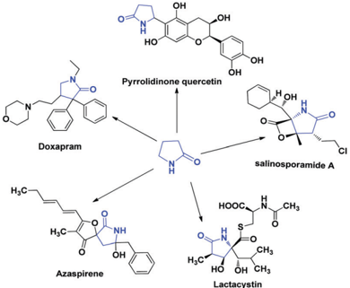
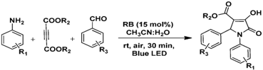
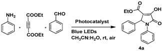
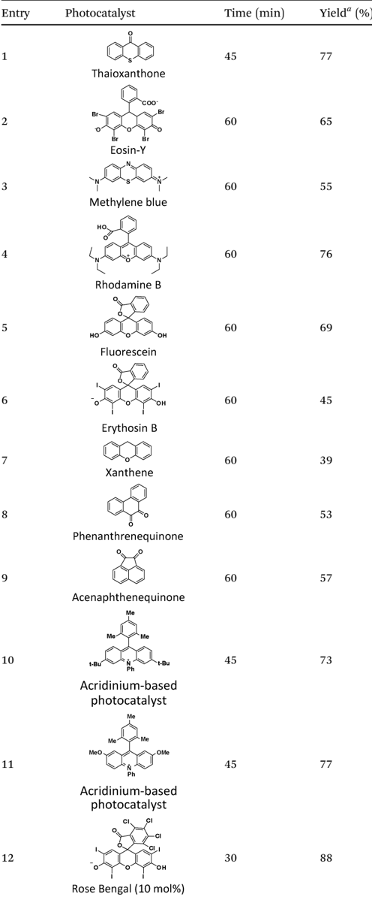
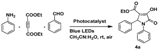
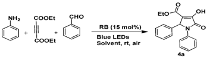
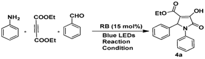
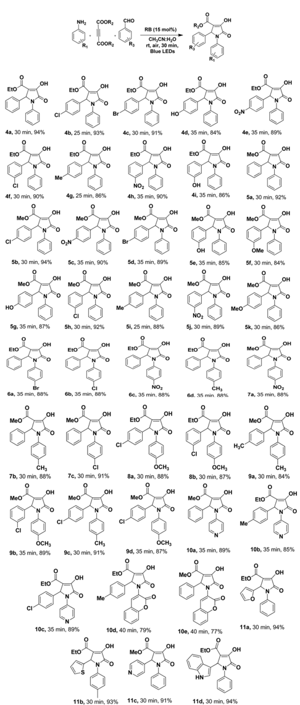
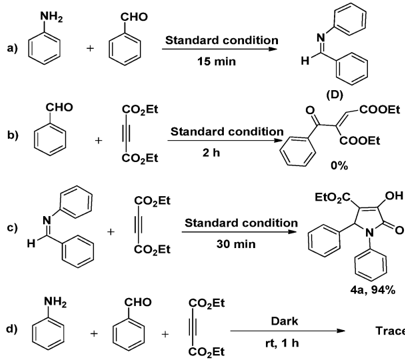
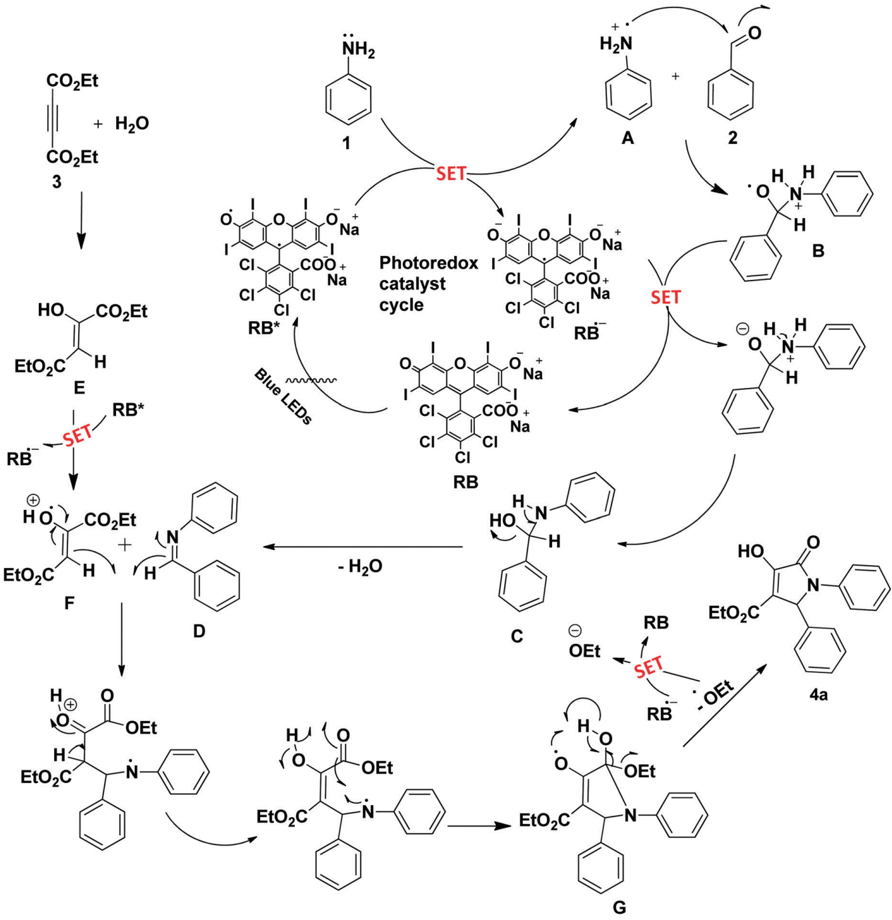

## NJC

## PAPER

Cite this: New J. Chem. , 2021, , 8136

4

5

Received 21st January 2021, Accepted 31st March 2021

DOI: 10.1039/d1nj00343g

[rsc.li/njc](http://rsc.li/njc)

## Introduction

Over the last decade, visible light-induced reactions have emerged as a powerful tool for initiating various organic transformations under mild conditions, and thus gained significance in the field of sustainable chemistry. 1-5 Photoredox catalysis has been considered a markable innovation that has provided an ideal way to generate radical cyclization 6 and path-breaking routes for the C-C/C-X bond formation in heterocyclic chemistry. 7,8 It has also found several noteworthy applications in green synthesis 9 and other areas such as

Photoredox catalysts utilize a renewable energy source to promote chemical reactions by absorbing visible light radiation and transferring it to low energy organic substrates through a single-electron transfer (SET) process. 10 Heterogeneous semiconductors such as mesoporous carbon nitride and various metal oxides have been widely used as photocatalysts in organic syntheses, which have been found to be complementary to iridium and ruthenium complexes as photoredox catalysts. 11 Recently, the application of organic molecules as photocatalysts has attracted attention from many synthetic chemists given that this approach offers several advantages over the transition metal-mediated catalysis in terms of catalyst removal and lower toxicity to various life forms. 12 This method has also been found to be energetically sustainable and beneficial in the long term.

a Centre for Advanced Studies in Chemistry, Department of Chemistry, North Eastern Hill University, Shillong 793022, India. E-mail: rlnongkhlaw@gmail.com b

Sankardev College, Bishnupur, Shillong, India

† Electronic supplementary information (ESI) available. See DOI: 10.1039/d1nj00343g

|

4

5

View Article Online View Journal | View Issue

## Visible light-promoted synthesis of pyrrolidinone derivatives via Rose Bengal as a photoredox catalyst and their photophysical studies †

Arup Dutta, a Mostofa A. Rohman, a Ridaphun Nongrum, b Aiborlang Thongni, a Sivaprasad Mitra a and Rishanlang Nongkhlaw * a

Herein, we report an intramolecular radical cyclization reaction towards the synthesis of pyrrolidinone derivatives via metal-free photoredox catalysis under irradiation from blue LEDs. Some of the remarkable features of this protocol include synthetic efficiency, green reaction profile, easy isolation of products and short reaction time. The photophysical properties of synthesized compounds were investigated via steady state and time-resolved fluorescence spectroscopy in the solid state. Results showed the promising opportunity for their spectral tuning together with large Stokes-shifted and highly active fluorescence emission, thus indicating that these molecular scaffolds can be effective probes for the biological applications and development of opto-electronic devices.

Five-membered nitrogen-containing heterocyclic compounds such as polysubstituted 3-hydroxy-2-pyrrolidinones are important frameworks in many biologically active compounds and have found wide applications in the pharmaceutical and agricultural sectors. 13 Several pyrazolone-based compounds have been successfully developed into commercial drugs such as pyrrolidinonequercetin 14 and pyrrolidinoneorhamnetin. 15 More specifically, pyrazolone, as a constituent of doxapram, 16 azaspirene, 17 salinosporamide A 18 and lactacystin, 19 has proven to be a useful intermediate in biomedical research and natural product synthesis (Fig. 1).

Furthermore, low molecular weight N-containing heterocycles are considered as promising candidates for developing optoelectronic devices due to their easy synthesis, functionalization, purification and characterization. Five-membered nitrogen heterocycles with substituted diketopyrrolopyrrole 20 and polypyrrole 21 derivatives have emerged as potential materials for optoelectronic devices in the recent literature. Also, a recent review portrays the application of several pyrazine-functionalized p -conjugated materials for optoelectronic applications. 22 Although there are a few reports citing the use of substituted pyrrolidinone compounds for the development of optoelectronic materials, 23,24 the detailed characterization of the fluorescence behaviour of a series of pyrrolidinone derivatives, particularly in the solid state, is relatively scarce (Scheme 1).

Considering the importance of substituted pyrrolidinones, various methods for their synthesis have been reported with enhanced procedures such as short reaction time, minimum side reactions and the hassle-free isolation of desired products. 25,26

A literature survey revealed that significant efforts have been made to synthesize pyrrolidinone derivatives by combining

NH2

R1

H3C

+

+

COORZ

=O

Doxapram

Azaspirene

CHO

R3

OH

OH

RB (15 mol%)

HO

C6300:60

rt, air, 30 min,

Fig. 1 Some biologically important structures containing pyrrolidinone motifs.

Scheme 1 Synthesis of pyrrolidinone derivatives under irradiation from a blue light-emitting diode (LED).

different structurally diverse motifs. 27,28 Various protocols have been reported for the multicomponent synthesis of these moieties using a range of catalysts such as [BBSI][HSO4], 29 [Fe3O4@SiO2@ Propyl-ANDSA], 30 [Cu(OAc)2], 31 UiO-66-SO3H, 32 and TiO2-np. 33 One commonly employed route for the synthesis of pyrrolidinones involves the condensation of anilines, aromatic aldehydes and dialkylacetylenedicarboxylates using PTSA 34 as a catalyst. However, a substantial amount of catalyst is required in this reaction because of the formation of a complex between the product and the acid catalyst, which results in the wastage of the catalyst. It also results in the production of acidic waste water during the posttreatment process. 35 Despite the advances in the synthesis of pyrrolidinone derivatives, these methods still suffer from drawbacks such as harsh reaction conditions, long reaction time, complex synthetic pathways and limited structural diversity and functional group tolerability. Accordingly, improved methods for the synthesis of pyrrolidinone derivatives with high selectivity are still in demand and of utmost interest to the synthetic community.

Rose Bengal (RB) is one of the most versatile organic photosensitizers (PS) in diverse biological and medical applications, which also shows potential value in cancer therapy and diagnosis. 36 In recent years, the use of RB as a photoredox catalyst has received considerable attention. Although it mostly works through SET processes, it is also known to function through energy transfer (EnT) processes, especially, as a singlet oxygen sensitizer. As a type II photosensitizer, RB converts triplet oxygen molecules into singlet oxygen upon irradiation with blue light (450 nm) via a photo-catalytic process. In addition, the singlet-triplet state energy gap ( D E ) of RB is small ( D E E 0.35 eV). 37

Blue LED

-

OH

R2O

R3

OH

Based on the above-mentioned reports, herein, we present a novel approach towards the synthesis of pyrrolidinone derivatives via the visible light-initiated one-pot multicomponent reaction of arylamines, aromatic aldehydes and acetylenedicarboxylate using Rose Bengal as a photoredox catalyst. The reaction was carried out in a CH3CN:H2O solvent mixture at room temperature, which is environmentally harmless and non-toxic. The formation of the products was confirmed using different characterization techniques including FT-IR, 1 H NMR, 13 C NMR spectroscopy, mass spectrometry and elementary analysis. Photophysical studies of the synthesized compounds were carried out and a detailed spectroscopic characterization of these compounds is presented with the intention to rationalize the bright solidstate photoluminescence behavior with the peripheral substituent pattern.

## Result and discussion

To test the feasibility of our protocol, aniline ( 1a ), diethyl acetylene dicarboxylate (DEAD) ( 2a ) and benzaldehyde ( 3a ) were selected as model substrates for the designed product. Initially, when we used thioxanthone as a catalyst under the irradiation of blue LED light in CH3CN : H2O (1 : 1), pyrrolidinone 4a was obtained in 77% yield (Table 1, entry 1). This result inspired us to investigate the reaction conditions with several other photoredox catalysts including Eosin Y, methylene blue, rhodamine B, fluorescein, erythrosin B, xanthene, phenanthrenequinone, acenaphthenequinone, and acridinium-based photocatalyst and the results are presented in Table 1. The model reaction was also carried out in the absence of catalyst, which gave only a trace amount of product 4a under the irradiation of blue LEDs (Table 1, entry 15). A satisfactory product yield of 94% was obtained when Rose Bengal (15 mol%) was used as the photoredox catalyst. Therefore, Rose Bengal (15 mol%) was chosen as the most suitable photocatalyst for our present study (Table 1, entry 13).

Encouraged by the aforementioned results, we screened suitable solvents, and the results are summarized in Table 2. Several polar and non-polar solvents such as toluene, DMF, DCM, MeOH, EtOH, CH3CN and H2O were studied, and respectable yields of products were obtained (entries 1-13). In addition, neat condition was also screened, but the desired product was not detected (Table 1, entry 1). Among the tested solvents, CH3CN : H2O (1 : 1) was found to be the best choice for the reaction (Table 2, entry 9).

The model reaction with Rose Bengal (15 mol%) could also be promoted by visible light of different intensities (LED 12 W, 18 W, 23 W and blue LEDs) (Table 3, entries 1-5), but blue LEDs (450 nm) were the most efficient (Table 3, entry 4). The control experiments disclosed that no product was observed when the reaction was performed in the dark (Table 3, entry 5).

After optimizing the reaction conditions, we investigated the substrate scope for the visible-light-mediated Rose Bengal-catalyzed synthesis of pyrrolidinone derivatives. A range of substituted anilines, substituted benzaldehydes and dialkylacetylenedicarboxylates (alkyl = CH3 and C2H5) were studied and it was

|

NH2

NH2

NH2

NH2

HO.

HO

t-Bu

Acridinium-based photocatalyst

Meo.

Acridinium-based photocatalyst

Rose Bengal (10 mol%)

COOET

COOET

COOEt

Eto

Eto-

Photocatalyst

Photocatalyst

RB (15 mol%).

Blue LEDs

EtO

RB (15 mol%) \_

Blue LEDs

Blue LEDs

COOEt

COOET

Blue LEDs

Solvent, rt, air

Reaction

Table 1 Estimation of the reaction conditions with various catalysts

|   Entry | Photocatalyst   |   Time (min) |   Yield a (%) |
|---------|-----------------|--------------|---------------|
|       1 |                 |           45 |            77 |
|       2 |                 |           60 |            65 |
|       3 |                 |           60 |            55 |
|       4 |                 |           60 |            76 |
|       5 |                 |           60 |            69 |
|       6 |                 |           60 |            45 |
|       7 |                 |           60 |            39 |
|       8 |                 |           60 |            53 |
|       9 |                 |           60 |            57 |
|      10 |                 |           45 |            73 |
|      11 |                 |           45 |            77 |
|      12 |                 |           30 |            88 |

CHO

CHO

CHO

CHO

OH

OH

Table 1 ( continued )

|   Entry | Photocatalyst         |   Time (min) | Yield a (%)   |
|---------|-----------------------|--------------|---------------|
|      13 | Rose Bengal (15 mol%) |           30 | 94            |
|      14 | Rose Bengal (20 mol%) |           30 | 94            |
|      15 | No catalyst           |           60 | Trace         |

Reaction conditions: aniline (1 mmol), DEAD (1.2 mmol), benzaldehyde (1 mmol), catalyst (10 mol%), CH3CN:H2O (3 mL), blue LED irradiation under air atmosphere at rt. a Isolated yield of product.

Table 2 Optimization of the solvent

|   Entry | Solvent               |   Time (min) | Yield a (%)   |
|---------|-----------------------|--------------|---------------|
|       1 | Neat                  |           60 | Trace         |
|       2 | Toluene               |           60 | 10            |
|       3 | DMF                   |           60 | 47            |
|       4 | DCM                   |           60 | 35            |
|       5 | MeOH                  |           45 | 60            |
|       6 | EtOH                  |           45 | 70            |
|       7 | CH 3 CN               |           30 | 88            |
|       8 | H 2 O                 |           30 | 55            |
|       9 | CH 3 CN/H 2 O (1 : 1) |           30 | 94            |
|      10 | CH 3 CN/H 2 O (2 : 1) |           30 | 94            |
|      11 | CH 3 CN/H 2 O (3 : 1) |           30 | 94            |
|      12 | CH 3 CN/H 2 O (9 : 1) |           30 | 91            |
|      13 | THF                   |           60 | 20            |

Reaction conditions: aniline (1 mmol), DEAD (1.2 mmol), benzaldehyde (1 mmol), Rose Bengal (15 mol%), solvent (3 mL), blue LED irradiation under air atmosphere at rt. a Isolated yield of product.

Table 3 Evaluation of visible light source

|   Entry | Visible light source   |   Time (min) | Yield a (%)   |
|---------|------------------------|--------------|---------------|
|       1 | White LEDs (12W)       |           60 | 83            |
|       2 | White LEDs (18 W)      |           45 | 81            |
|       3 | White LEDs (23 W)      |           45 | 88            |
|       4 | Blue LEDs (450 nm)     |           30 | 94            |
|       5 | Dark                   |           90 | Trace         |

Reaction conditions: aniline (1 mmol), DEAD (1.2 mmol), benzaldehyde (1 mmol), Rose Bengal (15 mol%), CH3CN:H2O (3 mL), irradiation under air atmosphere at rt in different reaction conditions. a Isolated yield of product.

found that both dimethylacetylenedicarboxylate (DMAD) and diethylacetylenedicarboxylate (DEAD) proceeded without much variation in the yield of the products (Table 4). The position and

a)

MeO

MeO

1H2

CI

NH2

CHO

COOR2

CHO

Standard condition

COOR,

RB (15 mol%)

CH,CN:H,0

N

rt, air, 30 min,

R3

Blue LEDs

15 min

H

Table 4 Substrate scope of the reaction

CHO

EtO

b)

4a, 30 min, 94%

OH

EtO

CI

MeO

5b, 30 min, 94%

MeO

5g, 35 min, 87%

OH

Br

OH

CH3

OCH3

EtO

10c, 35 min, 89%

Reaction conditions: substituted aniline (1 mmol), DEAD/DMAD (1.2 mmol), substituted benzaldehyde (1 mmol), Rose Bengal (15 mol%), CH3CN:H2O (3 mL), blue LED irradiation under an air atmosphere at rt.

type of substituents on the aromatic ring ( e.g. , -NO2, -Cl, -Br, -CH3, and -OMe) also did not have a significant effect on the reaction and provided satisfactory yields (84-97%). However, as

CO\_Et

OH

- COOEt expected, aromatic aldehydes with electron withdrawing groups acted as better substrates compared to that with electron donating groups. A comparative study between blue LEDs and white LEDs as the irradiation source was performed to further investigate the catalytic activity of Rose Bengal for the synthesis of 4a and the results are presented in Table S1 (ESI † ). The results indicate the superiority of blue LEDs, which gave higher product yields in shorter reaction times.

In addition, to demonstrate the scalability of this visible light-initiated multicomponent process, we carried out the model reaction on a large scale. When the reaction was conducted on a 10.0 mmol scale, the desired product 4a was obtained in 94% yield, which is equivalent with the performance of the 1.0 mmolscale reaction.

To gain insight into the reaction mechanism of this visible light-promoted three-component reaction, a series of control experiments was performed. As shown in Scheme 2, the condensation of aniline with benzaldehyde was performed under the standard conditions (Rose Bengal in water-acetonitrile under blue LED) with the elimination of water to give the corresponding imine D . When the reaction of diethyl acetylene dicarboxylate (DEAD) with benzaldehyde was carried out under the same reaction conditions, no product was detected.

However, the reaction of imine D and DEAD under standard conditions generated the desired product 4a in 94% yield. Furthermore, no corresponding product 4a was obtained when the reaction was carried out in the absence of light.

After considering the outcome of this experimental study, a plausible reaction pathway in the presence of Rose Bengal is proposed in Scheme 3.

According to the literature, 38 upon irradiation with visible light, Rose Bengal (RB) accepts a photon to generate the excited state RB* via intersystem crossing (ISC). This triplet state converts aniline into radical-cation ( A ) by single-electron transfer (SET). Then this radical cation ( A ) reacts with benzaldehyde to form ( B ). Moreover, ( B ) is converted to ( C ) (by SET), which further

Scheme 2 Control experiments relevant to the understanding of the mechanistic course of the reaction of 1a (1 mmol), 2a (1 mmol) and 3a (1 mmol).

|

CO\_Et

+ H2O

3

HO.

EtO\_C

E

/

SET-

Ho)

-COLEt

+

H

RB*

F

He

H-

EtO,C

NH2

·N·

Scheme 3 Plausible mechanism.

undergoes dehydration to give ( D ). DEAD undergoes nucleophilic addition reaction with water 25,39,40 to form 1,3 dipolar intermediate ( E ), which undergoes an SET reaction with RB* to give ( F ). The reaction between imine intermediate ( D ) and 1,3 dipolar radical ( F ) followed by cyclisation leads to the formation of intermediate ( G ), which subsequently eliminates EtOH to give the target molecule 4a .

Due to the limited solubility of the synthesized pyrrolidinone derivatives, the representative solution phase photophysical studies were performed in DMSO solvent. All the compounds show relatively broad absorption in the wavelength range of 290-350 nm with a peak position of 325  5 nm in different systems. Some of the representative spectra are shown in Fig. S2(a) (ESI † ). Interestingly, the absorption spectral shape and the peak position depend on the nature of the substituents

.

C

h

m

w

J

N

e

+

on the amine and aldehyde components used for synthesizing these derivatives (depicted as R1 and R3 in Table 4, respectively). For example, the absorption peak position of compounds 9c (R1 = 4-CH3 and R3 = 4-Cl), 6d (R1 = 4-CH3 and R3 = H) and 5k (R1 = H and R3 = 4-OCH3) appears at 320, 325 and 328 nm, respectively. Therefore, it is evident that the electron donation in the amine and aldehyde moieties shifts the UV-vis peak position to higher and lower energies in the spectrum, respectively. Conversely, electron withdrawing substituents in the aldehyde moiety make the absorption spectra very broad. For example, in compounds such as 4f (R1 = H and R3 = 3-Cl), 5f (R1 = H and R3 = 3-OCH3) and 8b (R1 = 4-OCH3 and R3 = 3-Cl), it is rather difficult to extract a definitive absorption peak position from the solution phase absorption profile [Fig. S2(a), ESI † ]. In this case, the absorption peak positions mentioned for the

(a) 10k

Counts

1k

100

10·

3

2-exp

(b) 104

103

Table 5 Solution phase spectral data of some of the synthesized pyrrolidinone derivatives in DMSO

IRF

5k

6a

6d

7b

| Steady-state measurements   | Steady-state measurements   | Steady-state measurements   | Steady-state measurements   | Time-resolved fluorescence decay   | Time-resolved fluorescence decay   | Time-resolved fluorescence decay   | Time-resolved fluorescence decay   |
|-----------------------------|-----------------------------|-----------------------------|-----------------------------|------------------------------------|------------------------------------|------------------------------------|------------------------------------|
| Compounds                   | max l abs /nm               | max l em                    | /nm Stokes                  | f f /10  2                         | t av /ns                           | k r /10 7 s  1                     | k nr /10 9 s  1                    |
| 5k                          | 326                         | 435                         | 7686                        | 0.26                               | 0.85                               | 0.31                               | 1.17                               |
| 6a                          | 334                         | 442                         | 7316                        | 0.39                               | 1.21                               | 0.32                               | 0.83                               |
| 6d                          | 325                         | 427                         | 7350                        | 0.31                               | 0.59                               | 0.53                               | 1.69                               |
| 7b                          | 301                         | 480                         | 12389                       | 0.27                               | 0.28                               | 0.96                               | 3.56                               |
| 8a                          | 325                         | 462                         | 9124                        | 0.29                               | 0.91                               | 0.31                               | 1.10                               |
| 9c                          | 321                         | 459                         | 9366                        | 0.25                               | 0.58                               | 0.44                               | 1.72                               |

different groups of compounds in Table 5 were obtained from the excitation spectra.

Representative steady state fluorescence emission spectra of some of the investigated compounds in DMSO solvent are shown in Fig. S2(b) (ESI † ) and the corresponding data is given in Table 5. In general, the fluorescence spectra are very broad and cover the spectral range of 400-500 nm. Similar to that in the absorption spectra, the fluorescence peak maxima also depend on the nature of R1 and R2. For example, the fluorescence peak for 9c (R1 = 4-CH3 and R3 = 4-Cl) with an electron-withdrawing substituent in the aldehyde component shows a bathochromic shift of B 27 nm in comparison with 6d (R1 = 4-CH3 and R3 = H). Therefore, both the absorption and photoluminescence behavior of the pyrrolidinone derivatives can be tuned over a broad spectral range with judicious choice of the substituents, giving a plethora of opportunities for synthetic manipulation towards the fabrication of suitable probes for biophysical studies or optoelectronic devices.

However, the major drawback of the synthesized systems for practical application is their extremely low fluorescence yield in solution. For example, the quantum yield of fluorescence varies in the range of (0.20-0.40) -10  2 for the studied compounds in DMSO. Thus, to understand more details about the dynamic behavior of the excited states, the fluorescence lifetime of the pyrrolidinone derivatives in DMSO solution was measured. Simulation of the time-resolved decay traces with eqn (1) revealed the necessity of two components (Fig. 2a) to reproduce the experimental data points with reliable statistical parameters. 41 However, as shown in Fig. 2b and Table S2 (ESI † ), the major component decay with a sub-nanosecond time constant was in the range of 0.14-0.36 ns with a very low contribution ( o 5%) of

2.5 ns component. This ensures very fast decay of the excited state and may contribute to the very low fluorescence yield, as discussed above. The radiative ( k r ) and total non-radiative ( P k nr ) decay rate constants were calculated using the known value of fluorescence yield ( f f) and average lifetime ( t av) (Table 5) using the following relations:

X

<!-- formula-not-decoded -->

It is evident from the calculated values that the non-radiative decay processes of all the investigated systems are about three orders of magnitude higher than the radiative part, justifying the proposition discussed above for the significantly low luminescence yield.

Interestingly, some of the synthesized compounds showed excellent bright light emission in the solid state (Fig. 4). Thus, to gain further insight into their PL behavior, both steady-state and time-resolved experiments were conducted for all the systems in the solid phase. Fig. 3a shows some of the representative spectral profiles, and all the corresponding data is included in Table 6. Typically, the fluorescence spectral peaks are distributed over three distinct regions, viz. , 440, 460 and 480 nm (within  5 nm, as shown by the shaded vertical lines) depending on the substitution pattern. Compounds 4g , 5a , 5f , and 5k having R1 = H and the electron-rich R3 component show a fluorescence peak at ca. 440 nm. However, with R1 = H or 4-CH3 and R3 = 3-Cl substitution, systems 4f , 5h , 8b , etc. show mid-range fluorescence at B 460 nm. Conversely, strong electron donation at the R1 position through 4-OCH3 and electron-withdrawing substitution through a 3- or 4-Cl group in 9b and 9d shifts the fluorescence peak in the extremely red end of the spectrum ( ca. 460 nm). The time-resolved

Fig. 2 (a) Time-resolved fluorescence decay trace of 6d in DMSO solution required a two-exponential fitting model, as confirmed from the distribution of weighted residuals and the magnitude of statistical parameters such as reduced chi-square ( w 2 ) values and Durbin-Watson (DW) parameter given in inset. (b) Time-resolved fluorescence decay profiles of some representative synthesized pyrrolidinone derivatives in DMSO solution.

|

(a)

Fl. intensity (arb .unit)

400

4f

4g

5a

5f

5h

4f

5f

5h

6a

450

Fig. 3 Photoluminescence spectral (a) and time-resolved decay (b) profiles of some of the synthesized pyrrolidinone derivatives in the solid state.

Fig. 4 Images of fluorescence-active compounds in the solid state.

fluorescence decay traces of all the studied systems in the solid state still needed two-exponential fitting (Fig. 3b). However, the component contribution of the fast decay component (found in the solution phase) decreases substantially with a concomitant increase in the contribution from the time constant of the long component. Thus, there is a substantial increase in the average excited state lifetime ( t av) in the range of 1.5-4.9 ns in comparison with the solution phase (0.3-1.2 ns). This increase in fluorescence lifetime is possibly due to the arrest of several active non-radiative decay channels in the solid state (which are relevant in solution), resulting quite strong PL intensity. Considering the inherent complexity of measuring the fluorescence yield of the solid samples, a qualitative measure of the PL intensity of the studied derivatives was determined relative to 6a in DMSO (which shows highest solution phase fluorescence yield of f f = 0.39 -10  2 ), as reported in the last column of Table 6. The results indicate systems 4f , 5h , 9b and 9d show high PL intensity. Interestingly, all these compounds are characterized by Cl substitution at either the 3- or 4-position of the aldehyde fragment (R3) in the synthesis of pyrrolidinone derivatives. Overall, the systematic pattern of the spectral response and PL brightness with the electronic properties of peripheral substitution in combination with the facile synthetic route discussed in this study opens a plethora of opportunities to design suitable pyrrolidinone systems with significant biophysical responses and new luminescent devices in the desired optical window.

## Experimental section

All chemicals were purchased from Alfa Aesar, Sigma-Aldrich and Merck and were used as received without further purification. The purity of the synthesized compounds was confirmed by

Table 6 Photoluminescence data in the solid state of some of the synthesized pyrrolidinone derivatives

| Steady state a   | Steady state a   | Steady state a   | Steady state a     | Time-resolved fluorescence decay   | Time-resolved fluorescence decay   | Time-resolved fluorescence decay   | Time-resolved fluorescence decay   | Time-resolved fluorescence decay   |    |
|------------------|------------------|------------------|--------------------|------------------------------------|------------------------------------|------------------------------------|------------------------------------|------------------------------------|----|
| System           | max l abs /nm    | max l em /nm     | Stokes shift/cm  1 | a 1 (%)                            | t 1 /ns                            | a 2 (%)                            | t 2 /ns                            | t av /ns                           | PL |
| 4f               | 375              | 462              | 5022               | 24.27                              | 2.80                               | 75.72                              | 5.19                               | 4.83                               | 40 |
| 4g               | 375              | 453              | 4592               | 27.08                              | 0.36                               | 72.92                              | 2.36                               | 2.25                               | 27 |
| 5a               | 357              | 439              | 5232               | 48.05                              | 0.24                               | 51.95                              | 1.63                               | 1.46                               | 11 |
| 5f               | 357              | 439              | 5232               | 67.00                              | 1.81                               | 33.01                              | 3.42                               | 2.59                               | 20 |
| 5h               | 380              | 466              | 4857               | 90.33                              | 4.04                               | 9.67                               | 7.69                               | 4.66                               | 50 |
| 5k               | 365              | 444              | 4875               | 22.99                              | 0.33                               | 77.01                              | 2.12                               | 2.04                               | 17 |
| 6a               | 368              | 449              | 4902               | 94.49                              | 0.31                               | 5.51                               | 1.47                               | 0.56                               | 8  |
| 6d               | 390              | 461              | 3949               | 19.41                              | 1.54                               | 80.59                              | 3.31                               | 3.14                               | 2  |
| 7c               | 352              | 460              | 6670               | 53.03                              | 0.76                               | 46.95                              | 2.53                               | 2.09                               | 2  |
| 8a               | 353              | 474              | 7232               | 17.79                              | 1.08                               | 82.21                              | 3.73                               | 3.57                               | 1  |
| 8b               | 362              | 465              | 6119               | 41.05                              | 0.53                               | 58.59                              | 2.35                               | 2.10                               | 14 |
| 9a               | 375              | 467              | 5253               | 56.34                              | 0.42                               | 43.66                              | 2.45                               | 2.08                               | 1  |
| 9b               | 409              | 489              | 4000               | 15.42                              | 1.49                               | 84.58                              | 3.37                               | 3.23                               | 52 |
| 9c               | 364              | 468              | 6105               | 69.57                              | 0.61                               | 30.43                              | 2.38                               | 1.73                               | 2  |
| 9d               | 397              | 478              | 4268               | 20.16                              | 0.44                               | 79.84                              | 3.89                               | 3.80                               | 38 |

(b) 104

103

FT-IR, 1 H-NMR, 13 C-NMR, mass spectrometry and Elementary analysis. An Aldrich blue LED micro photoreactor was purchased from Sigma-Aldrich. All reactions were monitored by thin-layer chromatography (TLC) using precoated aluminum sheets (silica gel 60 F 254 0.2 mm thickness) and developed in an iodine chamber. Melting points were recorded in capillary tubes using a Thermo Scientific 9300 apparatus. FT-IR spectra were recorded using KBr pellets on a Bruker Avance 400 (Model: ALPHA II) FT-IR instrument and the frequencies are expressed in cm  1 . 1 H-NMR and 13 C-NMR spectra were recorded on a Bruker Avance II-400 spectrometer in DMSO-d6 (chemical shifts in d ). Mass spectral data of the representative compounds was recorded with a Waters ZQ-4000 (ESI) mass spectrometer. For the UV-visible absorption and fluorescence study, we selected spectroscopic-grade DMSO (concentration ca. 50 m M), and the measurements were performed using a PerkinElmer model Lambda25 and Quanta Master (QM-40) steady-state fluorescence apparatus supplied by Photon Technology International (PTI), respectively. Spectra were calibrated by subtracting the solvent as the blank control measured under the same conditions. Photoluminescence spectra in the solidstate were measured using a special solid-state sample holder (Part no. 557820058) supplied by PTI in the same instrument. Fluorescence lifetime measurements of the samples were performed in a LED-based time-correlated single photon counting (TCSPC) system (PM-3) supplied by PTI. The fluorescence decay spectra of the samples were collected at magic angles to avoid any anisotropic contribution. Details of the procedures for the calculation of relative fluorescence yield and analysis of timedependent fluorescence decay data are given in the ESI. †

## General procedure for the synthesis pyrrolidinone derivatives

To a 5 mL test tube equipped with a magnetic bar, a mixture of aniline (1 mmol, 0.9 mL), dialkylacetylenedicarboxylate (1.2 mmol, 1.5 mL), benzaldehyde (1 mmol, 1 mL) and Rose Bengal (15 mol%) in 3 mL of acetonitrile-water (1 : 1) solvent was taken and stirred at room temperature under the irradiation of blue LEDs for 30-45 minutes. Upon completion of the reaction (monitored by TLC), the mixture was filtered and washed many times with de-ionized water and the solid product obtained was purified by recrystallization from hot ethanol.

## General procedure for the synthesis pyrrolidinone derivatives under irradiation from white LEDs (23 W)

In a 25 mL round-bottom flask, a mixture of aniline (1 mmol, 0.9 mL), dialkylacetylenedicarboxylate (1.2 mmol, 1.5 mL) and benzaldehyde (1 mmol, 1 mL) was added to Rose Bengal (15 mol%) in 5 mL of acetonitrile-water (3 : 1) solvent and stirred at room temperature for 40-50 minutes under the irradiation of white LEDs (23 W). On completion of the reaction (monitored by TLC), the mixture was filtered and washed many times with deionized water and the solid product obtained was then purified by recrystallization from hot ethanol.

## Analytical and spectroscopic data of the synthesized compounds

Ethyl 2,5-dihydro-4-hydroxy-5-oxo-1,2-diphenyl-1 H -pyrrole-3carboxylate (4a). White solid (yield: 94%); mp: 178-180 1 C. IR

(KBr): n 3309, 3072, 2980, 1716, 1497, 1096 cm  1 . 1 H NMR (DMSOd 6, 400 MHz): d 11.72 (s, 1H), 7.56 (d, 2H, J = 7.6 Hz), 7.29-7.19 (m, 6H), 7.17-7.13 (m, 1H), 7.07 (t, 1H, J = 7.6 Hz), 6.06 (s, 1H), 4.02 (q, 2H, J = 7.0 Hz), 1.07 (t, 3H, J = 7.0 Hz) ppm; 13 C NMR (DMSOd 6, 100 MHz): d 164.0, 161.9, 152.6, 136.5, 136.3, 128.7, 128.2, 127.9, 127.7, 125.3, 122.5, 112.2, 60.6. 59.7, 14.0 ppm. HRMS (ESI) m / z : [M + 1] + calcd, 324.1236; found, 324.1237. Anal. calcd for C19H17NO4: C, 70.58; H, 5.30; N, 4.33%; found: C, 70.12; H, 5.21; N, 4.13%.

Ethyl 2-(4-chlorophenyl)-4-hydroxy-5-oxo-1-phenyl-2,5-dihydro1 H -pyrrole-3-carboxylate (4b). White solid (yield: 93%); mp: 172174 1 C. IR (KBr): n 3307, 3068, 2982, 1718, 1495, 1092 cm  1 . 1 H NMR (DMSOd 6, 400 MHz): d 9.21 (s, 1H), 7.55 (d, 2H, J = 7.6 Hz), 7.30-7.25 (m, 6H), 7.09 (t, 1H, J = 7.2 Hz), 6.10 (s, 1H), 4.02 (q, 2H, J = 7.2 Hz), 1.08 (t, 3H, J = 7.0 Hz) ppm; 13 C NMR (DMSOd 6, 100 MHz): d 164.0, 162.3, 153.2, 136.5, 136.1, 132.8, 130.1, 129.1, 128.6, 125.8, 122.9, 112.1, 60.3, 60.2, 14.4 ppm. ESI-MS: m / z 358 [M + 1] + .

Ethyl 2-(4-bromophenyl)-2,5-dihydro-4-hydroxy-5-oxo-1-phenyl1 H -pyrrole-3-carboxylate (4c). White crystalline solid (yield: 91%); mp: 188-190 1 C. IR (KBr): n 3310, 3064, 2980, 1720, 1491, 1089 cm  1 . 1 H NMR (DMSOd 6, 400 MHz): d 11.83 (s, 1H), 7.56 (d, 2H, J = 7.6 Hz), 7.41 (d, 2H, J = 8.8 Hz), 7.29 (t, 2H, J = 7.8 Hz), 7.23 (d, 2H, J = 8.0 Hz), 7.10 (t, 1H, J = 7.2 Hz), 6.09 (s, 1H), 4.04 (q, 2H, J = 7.2 Hz), 1.10 (t, 3H, J = 7.0 Hz) ppm; 13 CNMR(DMSOd 6, 100 MHz): d 163.9, 161.9, 152.9, 136.2, 136.1, 131.2, 130.0, 128.7, 125.5, 122.5, 121.0, 111.7, 59.9, 59.8, 14.0 ppm. ESI-MS: m / z 401 [M] + , 403 [M + 2] + .

Ethyl 2,5-dihydro-4-hydroxy-2-(4-hydroxyphenyl)-5-oxo-1-phenyl1 H -pyrrole-3carboxylate (4d). White solid (yield: 84%); mp: 241243 1 C. IR (KBr): n 3313, 3029, 2993, 1686, 1453, 1023 cm  1 . 1 H NMR (DMSOd 6, 400 MHz): d 9.34 (s, 1H), 7.53 (d, 2H, J = 8.0 Hz), 7.27 (t, 2H, J = 7.8 Hz), 7.07 (t, 3H, J = 7.2 Hz), 7.01 (d, 2H, J = 8.4 Hz), 6.56 (d, 2H, J = 8.8 Hz), 5.91 (s, 1H), 4.01 (q, 2H, J = 7.2 Hz), 1.08 (t, 3H, J = 7.2 Hz) ppm; 13 C NMR (DMSOd 6, 100 MHz): d 164.2, 162.2, 156.9, 153.0, 136.5, 128.8, 128.6, 126.5, 125.2, 122.6, 115.0, 111.8, 60.3, 59.5, 14.1 ppm. ESI-MS: m / z 339 [M] + .

Ethyl 2,5-dihydro-4-hydroxy-2-(4-nitrophenyl)-5-oxo-1-phenyl1 H -pyrrole-3-carboxylate (4e). White solid (yield: 89%); mp: 181183 1 C. IR (KBr): n 3449, 3219, 2980, 1679, 1497, 1020 cm  1 . 1 H NMR (DMSOd 6, 400 MHz): d 12.05 (s, 1H), 8.07 (d, 2H, J = 8.8 Hz), 7.59 (t, 4H, J = 7.0 Hz), 7.29 (t, 2H, J = 7.8 Hz), 7.09 (t, 1H, J = 7.4 Hz), 6.28 (s, 1H), 4.02 (q, 2H, J = 6.8 Hz), 1.09 (t, 3H, J = 7.2 Hz) ppm; 13 C NMR (DMSOd 6, 100 MHz): d 164.0, 161.9, 153.4, 147.2, 144.7, 136.0, 129.3, 128.9, 125.7, 123.4, 122.5, 111.3, 59.9, 59.7, 14.0 ppm. ESI-MS: m / z 368 [M] + .

Ethyl 2-(3-chlorophenyl)-2,5-dihydro-4-hydroxy-5-oxo-1-phenyl1 H -pyrrole-3-carboxylate (4f). White solid (yield: 90%); mp: 184187 1 C. IR (KBr): n 3419, 3319, 2984, 1723, 1498, 1078 cm  1 . 1 H NMR (DMSOd 6, 400 MHz): d 11.87 (s, 1H), 7.58 (d, 2H, J = 7.6 Hz), 7.41 (s, 1H), 7.30 (t, 2H, J = 7.8 Hz), 7.26-7.19 (m, 3H), 7.10 (t, 1H, J = 7.4 Hz), 6.12 (s, 1H), 4.10-3.97 (m, 2H), 1.10 (t, 3H, J = 7.0 Hz) ppm; 13 C NMR (DMSOd 6, 100 MHz): d 163.9, 161.9, 153.0, 139.3, 136.0, 132.6, 130.1, 128.8, 128.2, 128.0, 126.1, 125.5, 122.4, 111.5, 59.8, 59.7, 14.0 ppm. ESI-MS: m / z 358 [M + 1] + .

.

C

h

m

w

J

N

e

|

Ethyl 2,5-dihydro-4-hydroxy-5-oxo-1-phenyl-2p -tolyl-1 H -pyrrole3-carboxylate (4g). White solid (yield: 86%); mp: 180-182 1 C. IR (KBr): n 3448, 3301, 2984, 1716, 1477, 1031 cm  1 . 1 H NMR (DMSOd 6, 400 MHz): d 11.60 (s, 1H), 7.56 (d, 2H, J = 7.6 Hz), 7.27 (t, 2H, J = 7.8 Hz), 7.12 (d, 2H, J = 7.6 Hz), 7.07 (t, 1H, J = 7.4 Hz), 7.01 (d, 2H, J = 8.0 Hz), 6.01 (s, 1H), 4.02 (q, 2H, J = 7.2 Hz), 2.17 (s, 3H), 1.09 (t, 3H, J = 7.2 Hz) ppm; 13 C NMR (DMSOd 6, 100 MHz): d 163.9, 162.0, 152.4, 137.1, 136.3, 133.4, 128.8, 128.6, 127.6, 125.3, 122.5, 112.2, 60.3, 59.7, 20.6, 14.0 ppm. ESI-MS: m / z 337 [M] + .

Ethyl 2,5-dihydro-4-hydroxy-2-(3-nitrophenyl)-5-oxo-1-phenyl1 H -pyrrole-3-carboxylate (4h). White solid (yield: 90%); mp: 225-227 1 C. IR (KBr): n 3323, 3088, 2985, 1723, 1499, 1023 cm  1 . 1 H NMR (DMSOd 6, 400 MHz): d 12.00 (s, 1H), 8.25 (s, 1H), 8.04 (d, 1H, J = 8.0 Hz), 7.71 (d, 1H, J = 7.6 Hz), 7.61 (d, 2H, J = 7.6 Hz), 7.51 (t, 1H, J = 8.0 Hz), 7.29 (t, 2H, J = 7.8 Hz), 7.09 (t, 1H, J = 7.2 Hz), 6.33 (s, 1H), 4.02 (q, 2H, J = 7.2 Hz), 1.08 (t, 3H, J = 7.2 Hz) ppm; 13 C NMR (DMSOd 6, 100 MHz): d 163.9, 161.8, 153.4, 147.5, 139.4, 135.9, 134.0, 130.0, 128.9, 125.6, 123.2, 123.1, 122.5, 111.2, 59.9, 59.6, 13.9 ppm. ESI-MS: m / z 369 [M + 1] + .

Ethyl 2,5-dihydro-4-hydroxy-2-(3-hydroxyphenyl)-5-oxo-1-phenyl1 H -pyrrole-3-carboxylate (4i). White sold (yield: 86%); mp: 198199 1 C. IR (KBr): n 3283, 2984, 1707, 1499, 1077 cm  1 . 1 H NMR (DMSOd 6, 400 MHz): d 11.69 (s, 1H), 9.32 (s, 1H), 7.56 (d, 2H, J = 7.6 Hz), 7.29 (t, 2H, J = 7.8 Hz), 7.09 (t, 1H, J = 8.0 Hz), 7.00 (t, 1H, J = 7.6 Hz), 6.68 (d, 1H, J = 7.6 Hz), 6.59 (s, 1H), 6.53 (d, 1H, J = 8.0 Hz), 5.97 (s, 1H), 4.04 (q, 2H, J = 7.0 Hz), 1.10 (t, 3H, J = 7.2 Hz) ppm; 13 C NMR (DMSOd 6, 100 MHz): d 164.0, 162.0, 157.1, 152.4, 137.9, 136.4, 129.2, 128.7, 125.3, 122.4, 118.6, 115.0, 114.1, 112.3, 60.5, 59.7, 14.0 ppm. ESI-MS: m / z 340 [M + 1] + .

Methyl 2,5-dihydro-4-hydroxy-5-oxo-1,2-diphenyl-1 H -pyrrole3-carboxylate (5a). White solid (yield: 92%); mp: 185-187 1 C. IR (KBr): n 3450, 3264, 2958, 1702, 1498, 1079 cm  1 . 1 H NMR (DMSOd 6, 400 MHz): d 11.67 (s, 1H), 7.56 (d, 2H, J = 7.6 Hz), 7.29-7.19 (m, 6H), 7.14 (t, 1H, J = 6.8 Hz), 7.07 (t, 1H, J = 7.4 Hz), 6.07 (s, 1H), 3.58 (s, 3H) ppm; 13 C NMR (DMSOd 6, 100 MHz): d 163.8, 162.4, 152.8, 136.0, 135.7, 132.4, 129.6, 128.7, 128.3, 125.5, 122.5, 111.5, 59.7, 51.1 ppm. ESI-MS: m / z 310 [M + 1] + .

Methyl 2-(4-chlorophenyl)-2,5-dihydro-4-hydroxy-5-oxo-1-phenyl1 H -pyrrole-3-carboxylate (5b). White solid (yield: 94%); mp: 150-152 1 C. IR (KBr): n 3450, 3219, 2957, 1684, 1498, 1095 cm  1 . 1 H NMR (DMSOd 6, 400 MHz): d 11.89 (s, 1H), 7.56 (d, 2H, J = 7.6 Hz), 7.31-7.25 (m, 6H), 7.09 (t, 1H, J = 7.4 Hz), 6.11 (s, 1H), 3.59 (s, 3H) ppm; 13 C NMR (DMSOd 6, 100 MHz): d 163.8, 162.4, 152.8, 136.0, 135.7, 132.4, 129.6, 128.7, 128.3, 125.5, 122.5, 111.5, 59.7, 51.1 ppm. ESI-MS: m / z 343 [M] + .

Methyl 2,5-dihydro-4-hydroxy-2-(4-nitrophenyl)-5-oxo-1-phenyl1 H -pyrrole-3-carboxylate (5c). White solid (yield: 90%); mp: 135-137 1 C. IR (KBr): n 3476, 2953, 1706, 1499, 1039 cm  1 . 1 H NMR (DMSOd 6, 400 MHz): d 12.10 (s, 1H), 8.07 (d, 2H, J = 8.8 Hz), 7.59 (t, 4H, J = 7.0 Hz), 7.29 (t, 2H, J = 8.0 Hz), 7.10 (t, 1H, J = 7.4 Hz), 6.30 (s, 1H), 3.59 (s, 3H) ppm; 13 C NMR (DMSOd 6, 100 MHz): d 163.9, 162.4, 153.2, 147.1, 144.6, 135.9, 129.2, 128.8, 125.7, 123.4, 122.4, 111.0, 59.6, 51.2 ppm. HRMS (ESI) m / z : [M + 1] + calcd, 355.0922; found, 355.0926. Anal. calcd

|

for C18H14N2O6: C, 61.02; H, 3.98; N, 7.91%; found: C, 60.88; H, 4.15; N, 7.60%.

Methyl 2-(4-bromophenyl)-2,5-dihydro-4-hydroxy-5-oxo-1-phenyl1 H -pyrrole-3-carboxylate (5d). White solid (yield: 89%); mp: 183-185 1 C. IR (KBr): n 3449, 3221, 2958, 1683, 1497, 1076 cm  1 . 1 H NMR (DMSOd 6, 400 MHz): d 11.87 (s, 1H), 7.55 (d, 2H, J = 8.4 Hz), 7.40 (d, 2H, J = 8.4 Hz), 7.29 (t, 2H, J = 7.4 Hz), 7.23 (d, 2H, J = 7.6 Hz), 7.10 (t, 1H, J = 7.4 Hz), 6.09 (s, 1H), 3.59 (s, 3H) ppm; 13 C NMR (DMSOd 6, 100 MHz): d 163.9, 162.5, 152.8, 136.2, 136.0, 131.2, 130.0, 128.8, 125.5, 122.5, 121.1, 111.5, 59.9, 51.2 ppm. ESI-MS: m / z 387 [M] + .

Methyl 2,5-dihydro-4-hydroxy-2-(3-hydroxyphenyl)-5-oxo-1phenyl-1 H -pyrrole-3-carboxylate (5e). White solid (yield: 85%); mp: 224-225 1 C. IR (KBr): n 3314, 2954, 1695, 1495, 1129 cm  1 . 1 H NMR (DMSOd 6, 400 MHz): d 9.31 (s, 1H), 7.54 (d, 2H, J = 7.6 Hz), 7.27 (t, 2H, J = 7.8 Hz), 7.07 (t, 1H, J = 7.6 Hz), 6.98 (t, 1H, J = 7.8 Hz), 6.66 (d, 1H, J = 7.6 Hz), 6.57 (s, 1H), 6.51(d, 1H, J = 8.0 Hz), 5.95 (s, 1H), 3.57 (s, 3H) ppm; 13 C NMR (DMSOd 6, 100 MHz): d 164.0, 162.5, 157.1, 152.4, 137.9, 136.3, 129.2, 128.7, 125.3, 122.4, 118.5, 115.0, 114.0, 112.0, 60.5, 51.1 ppm. ESI-MS: m / z 325 [M] + .

Methyl 2,5-dihydro-4-hydroxy-2-(3-methoxyphenyl)-5-oxo-1phenyl-1 H -pyrrole-3-carboxylate (5f). White solid (yield: 84%); mp: 168-170 1 C. IR (KBr): n 3451, 2954, 1715, 1495, 1034 cm  1 . 1 H NMR (DMSOd 6, 400 MHz): d 9.31 (s, 1H), 7.54 (d, 2H, J = 7.6 Hz), 7.27 (t, 2H, J = 7.8 Hz), 7.07 (t, 1H, J = 7.6 Hz), 6.98 (t, 1H, J = 7.8 Hz), 6.66 (d, 1H, J = 7.6 Hz), 6.57 (s, 1H), 6.51(d, 1H, J = 8.0 Hz), 5.95 (s, 1H), 3.57 (s, 3H) ppm; 13 C NMR (DMSOd 6, 100 MHz): d 164.0, 162.5, 157.1, 152.4, 137.9, 136.3, 129.2, 128.7, 125.3, 122.4, 118.5, 115.0, 114.0, 112.0, 60.5, 51.1 ppm. ESI-MS: m / z 340 [M + 1] + .

Methyl 2,5-dihydro-4-hydroxy-2-(4-hydroxyphenyl)-5-oxo-1phenyl-1 H -pyrrole-3-carboxylate (5g). White solid (yield: 87%); mp: 214-216 1 C. IR (KBr); n 3447, 3327, 2954, 1691, 1456, 1123, 1005 cm  1 . 1 H NMR (DMSOd 6, 400 MHz): d 11.65 (s, 1H), 9.35 (s, 1H), 7.54 (d, 2H, J = 8.0 Hz), 7.28 (t, 2H, J = 7.8 Hz), 7.09 (t, 1H, J = 7.2 Hz), 7.02 (d, 2H, J = 8.0 Hz), 6.57 (d, 2H, J = 8.8 Hz), 5.94 (s, 1H), 3.58 (s, 3H) ppm; 13 C NMR (DMSOd 6, 100 MHz): d 163.9, 162.5, 156.9, 152.2, 136.3, 128.8, 128.6, 126.2, 125.3, 122.6, 115.1, 112.1, 60.2, 51.1 ppm. ESI-MS: m / z 325 [M] + .

Methyl 2-(3-chlorophenyl)-2,5-dihydro-4-hydroxy-5-oxo-1-phenyl1 H -pyrrole-3-carboxylate (5h). White solid (yield: 92%); mp: 138139 1 C. IR (KBr): n 3447, 2953, 1723, 1498, 1078 cm  1 . 1 H NMR (DMSOd 6, 400 MHz): d 12.10 (s, 1H), 7.57 (d, 2H, J = 8.0 Hz), 7.38 (s, 1H), 7.30 (t, 2H, J = 7.8 Hz), 7.26-7.22 (m, 3H), 7.10 (t, 1H, J = 7.4 Hz), 6.12 (s, 1H), 3.60 (s, 3H) ppm; 13 C NMR (DMSOd 6, 100 MHz): d 164.1, 162.6, 153.1, 139.4, 136.2, 132.9, 130.4, 129.0, 128.2, 128.1, 126.4, 125.7, 122.7, 111.5, 60.0, 51.4 ppm. ESI-MS: m / z 343 [M] + .

Methyl 2,5-dihydro-4-hydroxy-5-oxo-1-phenyl-2p -tolyl-1 H -pyrrole3-carboxylate (5i). White solid (yield: 88%); mp: 164-166 1 C. IR (KBr): n 3449, 3224, 2958, 1684, 1499, 1028 cm  1 . 1 H NMR (DMSOd 6, 400 MHz): d 11.62 (s, 1H), 7.55 (d, 2H, J = 8.0 Hz), 7.27 (t, 2H, J = 7.8 Hz), 7.12 (d, 2H, J = 8.4 Hz), 7.07 (t, 1H, J = 7.4 Hz), 7.00 (d, 2H, J = 8.0 Hz), 6.02 (s, 1H), 3.57 (s, 3H), 2.16 (s, 3H) ppm; 13 CNMR(DMSOd 6, 100 MHz): d 163.9, 162.5, 152.4, 137.1, 136.2, 133.4, 128.9, 128.7, 127.5, 125.3, 122.5, 112.0, 60.3, 51.1, 20.6 ppm. ESI-MS: m / z 324 [M + 1] + .

Methyl 2,5-dihydro-4-hydroxy-2-(3-nitrophenyl)-5-oxo-1-phenyl1 H -pyrrole-3-carboxylate (5j). White solid (yield: 89%); mp: 202204 1 C. IR (KBr): n 3420, 3318, 2957, 1722, 1499, 1034 cm  1 . 1 H NMR (DMSOd 6, 400 MHz): d 12.07 (s, 1H), 8.22 (s, 1H), 8.02 (d, 1H, J = 7.6 Hz), 7.72 (d, 1H, J = 7.6 Hz), 7.59 (d, 2H, J = 8.0 Hz), 7.51 (t, 1H, J = 8.0 Hz), 7.29 (t, 2H, J = 8.0 Hz), 7.09 (t, 1H, J = 7.2 Hz), 6.32 (s, 1H), 3.58 (s, 3H) ppm; 13 C NMR (DMSOd 6, 100 MHz): d 163.8, 162.3, 153.1, 147.4, 139.2, 135.7, 133.9, 129.9, 128.8, 125.5, 123.0, 122.9, 122.4, 110.9, 59.4, 51.1 ppm. ESI-MS: m / z 354 [M] + .

Methyl 2,5-dihydro-4-hydroxy-2-(4-methoxyphenyl)-5-oxo-1phenyl-1 H -pyrrole-3-carboxylate (5k). White solid (yield: 86%); mp: 239-240 1 C. IR (KBr): n 3448, 3225, 2954, 1684, 1460, 1033 cm  1 . 1 H NMR (DMSOd 6, 400 MHz): d 11.68 (s, 1H), 7.55 (d, 2H, J = 8.0 Hz), 7.28 (t, 2H, J = 7.8 Hz), 7.16 (d, 2H, J = 8.8 Hz), 7.08 (t, 1H, J = 7.4 Hz), 6.75 (d, 2H, J = 8.8 Hz), 6.01 (s, 1H), 3.64 (s, 3H), 3.58 (s, 3H) ppm; 13 C NMR (DMSOd 6, 100 MHz): d 163.8, 162.5, 158.7, 152.3, 136.2, 128.8, 128.6, 128.0, 125.3, 122.5, 113.6, 112.0, 60.0, 54.9, 51.1 ppm. HRMS (ESI) m / z : [M + 1] + calcd, 340.1185; found, 340.1183. Anal. calcd for C19H17NO5: C, 67.25; H, 5.05; N, 4.13%; found: C, 66.97; H, 4.79; N, 4.00%.

Ethyl 1-(4-bromophenyl)-2,5-dihydro-4-hydroxy-5-oxo-2-phenyl1 H -pyrrole-3-carboxylate (6a). White solid (yield: 88%); mp: 134136 1 C. IR (KBr): n 3455, 3280, 2983, 1719, 1491, 1023 cm  1 . 1 H NMR (DMSOd 6, 400 MHz): d 11.80 (s, 1H), 7.55 (d, 2H, J = 8.8 Hz), 7.47 (d, 2H, J = 8.8 Hz), 7.26-7.17 (m, 5H), 6.07 (s, 1H), 4.01 (q, 2H, J = 7.0 Hz), 1.07 (t, 2H, J = 7.2 Hz) ppm; 13 CNMR(DMSOd 6, 100 MHz): d 164.0, 161.8, 152.4, 136.2, 135.6, 131.5, 128.3, 128.0, 127.7, 124.2, 117.6, 112.3, 60.4, 59.7, 13.9 ppm. ESI-MS: m / z 402 [M] + , 404 [M + 2] + .

Ethyl 1-(4-chlorophenyl)-2,5-dihydro-4-hydroxy-5-oxo-2-phenyl1 H -pyrrole-3-carboxylate (6b). White solid (yield: 90%); mp: 150152 1 C. IR (KBr): n 3449, 3209, 2975, 1681, 1497, 1092 cm  1 . 1 H NMR (DMSOd 6, 400 MHz): d 11.81 (s, 1H), 7.61 (d, 2H, J = 8.8 Hz), 7.34 (d, 2H, J = 8.8 Hz), 7.26-7.16 (m, 5H), 6.07 (s, 1H), 4.01 (q, 2H, J = 7.2 Hz), 1.07 (t, 3H, J = 7.2 Hz) ppm; 13 C NMR (DMSOd 6, 100 MHz): d 164.0, 161.9, 152.4, 136.3, 135.2, 129.4, 128.6, 128.3, 128.0, 127.7, 124.0, 112.3, 60.5, 59.7, 14.0 ppm. ESI-MS: m / z 358 [M + 1] + .

Ethyl 4-hydroxy-1-(4-nitrophenyl)-5-oxo-2-phenyl-2,5-dihydro1 H -pyrrole-3-carboxylate (6c). White solid (yield: 89%); mp: 128130 1 C. IR (KBr): n 3447, 3306, 2988, 1733, 1451, 1022 cm  1 . 1 H NMR (DMSOd 6, 400 MHz): d 9.80 (s, 1H), 8.16 (d, 2H, J = 9.2 Hz), 7.91 (d, 2H, J = 9.2 Hz), 7.32 (d, 2H, J = 7.6 Hz), 7.24 (t, 2H, J = 7.2 Hz), 7.18 (t, 1H, J = 7.2 Hz), 6.19 (s, 1H), 4.03 (q, 2H, J = 7.2 Hz), 1.08 (t, 3H, J = 7.0 Hz) ppm; 13 C NMR (DMSOd 6, 100 MHz): d 164.8, 161.8, 151.9, 143.5, 142.1, 136.0, 128.5, 128.3, 127.8, 124.4, 121.6, 113.2, 60.4, 60.0, 14.0 ppm. HRMS (ESI) m / z : [M + 1] + calcd, 369.1087; found, 369.1084. Anal. calcd for C19H16N2O6: C, 61.95; H, 4.38; N, 7.61%; Found: C, 61.60; H, 4.17; N, 7.38%.

Ethyl 2,5-dihydro-4-hydroxy-5-oxo-2-phenyl-1-p-tolyl-1 H -pyrrole3-carboxylate (6d). White solid (yield: 87%); mp: 185-187 1 C. IR (KBr): n 3306, 3106, 2981, 1689, 1495, 1091 cm  1 . 1 H NMR (DMSOd 6, 400 MHz): d 11.58 (s, 1H), 7.42 (d, 2H, J = 8.4 Hz), 7.22-7.20 (m, 4H), 7.16-7.13 (m, 1H), 7.07 (d, 2H, J = 8.0 Hz),

6.00 (s, 1H), 4.01 (q, 2H, J = 7.2 Hz), 2.18 (s, 3H), 1.06 (t, 3H, J = 7.0 Hz) ppm; 13 C NMR (DMSOd 6, 100 MHz): d 163.8, 162.0, 152.8, 138.6, 134.7, 133.8, 129.2, 128.2, 127.9, 127.7, 122.6, 112.1, 60.7, 59.7, 20.4, 14.0 ppm. ESI-MS: m / z 337 [M] + .

Methyl 2,5-dihydro-4-hydroxy-1-(4-nitrophenyl)-5-oxo-2-phenyl1 H -pyrrole-3-carboxylate (7a). White solid (yield: 88%); mp: 177178 1 C. IR (KBr): n 3444, 3210, 2965, 1677, 1491, 1095 cm  1 . 1 H NMR (DMSOd 6, 400 MHz): d 11.90 (s, 1H), 8.15 (d, 2H, J = 9.2 Hz), 7.90 (d, 2H, J = 9.2 Hz), 7.32 (d, 2H, J = 7.2 Hz), 7.23 (t, 2H, J = 7.4 Hz), 7.17 (t, 1H, J = 7.2 Hz), 6.19 (s, 1H), 3.59 (s, 3H) ppm; 13 C NMR (DMSOd 6, 100 MHz): d 164.7, 162.3, 151.8, 143.5, 142.0, 135.9, 128.5, 128.3, 127.7, 124.4, 121.7, 112.9, 60.3, 51.3 ppm. ESIMS: m / z 354 [M] + .

Methyl 2,5-dihydro-4-hydroxy-5-oxo-2-phenyl-1p -tolyl-1 H -pyrrole3-carboxylate (7b). White solid (yield: 88%); mp: 284-286 1 C. IR (KBr): n 3442, 3230, 2950, 1679, 1465, 1078 1095 cm  1 . 1 H NMR (DMSOd 6, 400 MHz): d 11.80 (s, 1H), 7.43 (d, 2H, J = 8.4 Hz), 7.24-7.14 (m, 5H), 7.07 (d, 2H, J = 8.4 Hz), 6.02 (s, 1H), 3.57 (s, 3H), 2.18 (s, 3H) ppm; 13 C NMR (DMSOd 6, 100 MHz): d 163.8, 162.5, 152.6, 136.5, 134.7, 133.7, 129.1, 128.2, 127.9, 127.6, 122.5, 111.7, 60.6, 51.1, 20.4 ppm. HRMS (ESI) m / z : [M + 1] + calcd, 324.1236; found, 324.1237. Anal. calcd for C19H17NO4: C, 70.58; H, 5.30; N, 4.33%; found: C, 69.91; H, 5.35; N, 4.13%.

Methyl 1-(4-chlorophenyl)-2,5-dihydro-4-hydroxy-5-oxo-2-phenyl1 H -pyrrole-3-carboxylate (7c). White solid (yield: 91%); mp: 144146 1 C. IR (KBr): n 3455, 2957, 1722, 1496, 1094 cm  1 . 1 H NMR (DMSOd 6, 400 MHz): d 11.85 (s, 1H), 7.60 (d, 2H, J = 8.4 Hz), 7.34 (d, 2H, J = 8.4 Hz), 7.26-7.16 (m, 5H), 6.08 (s, 1H), 3.57 (s, 3H) ppm; 13 C NMR(DMSOd 6, 100 MHz): d 164.0, 162.4, 152.3, 136.2, 135.1, 129.4, 128.6, 128.3, 128.0, 127.6, 124.0, 112.1, 60.5, 51.1 ppm. HRMS (ESI) m / z : [M + 1] + calcd, 344.0691; found, 344.0692. Anal. calcd for C18H14ClNO4: C, 62.89; H, 4.10; N, 4.07%; found: C, 62.56; H, 3.80; N, 3.93%.

Ethyl 2-(4-chlorophenyl)-4-hydroxy-1-(4-methoxyphenyl)-5-oxo2,5-dihydro-1 H -pyrrole-3-carboxylate (8a). White solid (yield: 88%); mp: 187-189 1 C. IR (KBr): n 3425, 3235, 2940, 1650, 1468, 997 cm  1 . 1 H NMR (DMSOd 6, 400 MHz): d 11.88 (s, 1H), 7.42 (d, 2H, J = 9.2 Hz), 7.29-7.24 (m, 4H), 6.84 (d, 2H, J = 8.8 Hz), 6.02 (s, 1H), 4.02 (q, 2H, J = 6.8 Hz), 3.67 (s, 3H) ppm; 13 C NMR (DMSOd 6, 100 MHz): d 163.7, 162.0, 156.8, 153.2, 135.9, 132.3, 129.7, 128.9, 128.2, 124.5, 113.9, 60.3, 59.7, 55.1, 14.0 ppm. ESI-MS: m / z 387 [M] + .

Ethyl 2-(3-chlorophenyl)-4-hydroxy-1-(4-methoxyphenyl)-5oxo-2,5-dihydro-1 H -pyrrole-3-carboxylate (8b). White solid (yield: 87%); mp: 125-127 1 C. IR (KBr): n 3438, 3179, 2987, 1681, 1463, 1031 cm  1 . 1 H NMR (DMSOd 6, 400 MHz): d 11.88 (s, 1H), 7.45 (d, 2H, J = 9.2 Hz), 7.36 (s, 1H), 7.24-7.23 (m, 2H), 7.17-7.15 (m, 1H), 6.85 (d, 2H, J = 8.8 Hz), 6.03 (s, 1H), 4.06-3.98 (m, 2H), 3.67 (s, 3H), 1.08 (t, 3H, J = 7.2 Hz) ppm; 13 C NMR (DMSOd 6, 100 MHz): d 163.6, 161.9, 156.9, 153.3, 139.4, 132.6, 130.1, 128.9, 128.1, 127.9, 126.1, 124.4, 113.9, 60.3, 59.7, 55.1, 14.0 ppm. HRMS (ESI) m / z : [M + 1] + calcd, 388.0953; found, 388.0954. Anal. calcd for C20H18ClNO5: C, 61.94; H, 4.68; N, 3.61%; found: C, 61.92; H, 4.75; N, 3.15%.

Methyl 4-hydroxy-5-oxo-1,2-dip -tolyl-2,5-dihydro-1 H -pyrrole3-carboxylate (9a). White solid (yield: 84%); mp: 131-132 1 C. IR (KBr): n 3437, 3229, 2932, 1667, 1461, 1087 cm  1 . 1 H NMR (DMSOd 6, 400 MHz): d 11.57 (s, 1H), 7.41 (d, 2H, J = 8.4 Hz),

7.10-7.05 (m, 4H), 6.99 (d, 2H, J = 8.0 Hz), 5.97 (s, 1H), 3.56 (s, 3H), 2.18 (s, 3H), 2.16 (s, 3H) ppm; 13 C NMR (DMSOd 6, 100 MHz): d 163.8, 162.5, 152.5, 137.1, 134.6, 133.7, 133.4, 129.1, 128.9, 127.5, 122.5, 111.8, 60.4, 51.1, 20.6, 20.4 ppm. HRMS (ESI) m / z : [M + 1] + calcd, 338.1392; found, 338.1389.

Methyl 2-(3-chlorophenyl)-4-hydroxy-1-(4-methoxyphenyl)-5oxo-2,5-dihydro-1 H -pyrrole-3-carboxylate (9b). White solid (yield: 89%); mp: 120-122 1 C. IR (KBr): n 3414, 3183, 2954, 1679, 1460, 1080 cm  1 . 1 H NMR (DMSOd 6, 400 MHz): d 11.93 (s, 1H), 7.44 (d, 2H, J = 9.2 Hz), 7.34 (s, 1H), 7.24-7.17 (m, 3H), 6.85 (d, 2H, J = 8.8 Hz), 6.04 (s, 1H), 3.68 (s, 3H), 3.59 (s, 3H) ppm; 13 C NMR (DMSOd 6, 100 MHz): d 163.6, 162.5, 153.2, 139.4, 132.7, 130.2, 128.9, 128.0, 127.8, 126.2, 124.4, 113.9, 60.2, 55.1, 51.1 ppm. ESI-MS: m / z 373 [M] + .

Methyl 2-(4-chlorophenyl)-4-hydroxy-5-oxo-1-( p -tolyl)-2,5-dihydro1 H -pyrrole-3-carboxylate (9c). White solid (yield: 91%); mp: 153155 1 C. IR (KBr): n 3444, 3226, 2922, 1674, 1469, 1093 cm  1 . 1 H NMR (DMSOd 6, 400 MHz): d 11.90 (s, 1H), 7.42 (d, 2H, J = 8.8 Hz), 7.27 (s, 4H), 7.08 (d, 2H, J = 8.4 Hz), 6.06 (s, 1H), 3.58 (s, 3H), 2.19 (s, 3H) ppm; 13 C NMR (DMSOd 6, 100 MHz): d 163.1, 161.8, 152.3, 135.1, 134.2, 132.9, 131.7, 129.0, 128.6, 127.7, 121.9, 110.6, 59.2, 50.5, 19.8 ppm. HRMS (ESI) m / z : [M + 1] + calcd, 358.0846; found, 358.0843. Anal. calcd for C19H16ClNO4: C, 63.78; H, 4.51; N, 3.91%; found: C, 63.15; H, 4.91; N, 3.71%.

Methyl 2-(4-chlorophenyl)-2,5-dihydro-4-hydroxy 1-(4-methoxyphenyl) 5-oxo-1 H -pyrrole-3-carboxylate (9d). White solid (yield: 87%); mp: 116-118 1 C. IR (KBr): n 3448, 2955, 1679, 1461, 1091 cm  1 . 1 HNMR(DMSOd 6, 400 MHz): d 11.89 (s, 1H), 7.42 (d, 2H, J = 8.8 Hz), 7.28-7.24 (m, 4H), 6.84 (d, 2H, J = 8.8 Hz), 6.02 (s, 1H), 3.67 (s, 3H), 3.58 (s, 3H) ppm; 13 CNMR(DMSOd 6, 100 MHz): d 163.6, 162.4, 156.8, 153.1, 135.8, 132.4, 129.6, 128.9, 128.3, 124.5, 113.9, 111.1, 60.2, 55.1, 51.1 ppm. HRMS (ESI) m / z : [M + 1] + calcd, 374.0795; found, 374.0797. Anal. calcd for C19H16ClNO5: C, 61.05; H, 4.31; N, 3.75%; found: C, 61.09; H, 4.41; N, 3.62%.

Methyl 4-hydroxy-5-oxo-2-phenyl-1-(pyridin-4-yl)-2,5-dihydro1 H -pyrrole-3-carboxylate (10a). White solid (yield: 89%); mp: 170-172 1 C. IR (KBr): n 3443, 2956, 1722, 1495, 1074 cm  1 . 1 H NMR (CDCl3, 400 MHz): d 8.93 (s, 1H), 7.36 (d, 2H, J = 8.0 Hz), 7.23 (t, 2H, J = 7.8 Hz), 7.19 (s, 1H), 7.13 (s, 1H), 7.087.03 (m, 3H), 5.63 (s, 1H), 3.70 (s, 3H) ppm; 13 C NMR (CDCl3, 100 MHz): d 164.8, 162.7, 156.0, 137.1, 135.7, 134.4, 129.9, 129.1, 128.8, 127.5, 126.1, 125.6, 122.3, 112.4, 60.9, 52.1 ppm. ESI-MS: m / z 310 [M] + .

Ethyl 4-hydroxy-5-oxo-1-(pyridin-4-yl)-2-( p -tolyl)-2,5-dihydro1 H -pyrrole-3-carboxylate (10b). White solid (yield: 85%); mp: 181-182 1 C. IR (KBr): n 3305, 3101, 2980, 1685, 1492, 1090 cm  1 . 1 H NMR (CDCl3, 400 MHz): d 9.07 (s, 1H), 7.33 (d, 2H, J = 8.4 Hz), 7.27-7.20 (m, 4H), 7.06 (d, 2H, J = 8.0 Hz), 5.69 (s, 1H), 4.18 (q, 2H, J = 7.2 Hz), 2.24 (s, 3H), 1.17 (t, 3H, J = 7.0 Hz) ppm; 13 C NMR (CDCl3, 100 MHz): d 165.1, 162.7, 156.7, 135.7, 135.1, 133.6, 129.5, 128.5, 128.4, 127.5, 122.3, 112.9, 61.6, 61.2, 30.9, 20.9, 13.9 ppm. ESI-MS: m / z 338 [M] + .

Ethyl 2-(4-chlorophenyl)-4-hydroxy-5-oxo-1-(pyridin-4-yl)-2,5dihydro-1 H -pyrrole-3-carboxylate (10c). White solid (yield: 89%); mp: 177-179 1 C. IR (KBr): n 3441, 3303, 2989, 1731, 1450, 1021 cm  1 . 1 H NMR (CDCl3, 400 MHz): d 9.09 (s, 1H),

|

8.06 (d, 2H, J = 8.4 Hz), 7.73 (d, 2H, J = 9.0 Hz), 7.23-7.17 (m, 5H), 5.73 (s, 1H), 4.14 (q, 2H, J = 7.2 Hz), 1.21 (t, 3H, J = 7.0 Hz) ppm; 13 C NMR (CDCl3, 100 MHz): d 164.8, 163.2, 155.6, 144.0, 142.0, 134.2, 129.0, 128.9, 127.2, 124.6, 120.5, 114.0, 61.6, 61.0, 13.8 ppm. ESI-MS: m / z 358 [M] + .

Ethyl 4-hydroxy-5-oxo-1-(2-oxo-2H-chromen-3-yl)-2-( p -tolyl)2,5-dihydro-1 H -pyrrole-3-carboxylate (10d). White solid (yield: 79%); mp: 197-199 1 C. IR (KBr): n 3235, 2942, 1709, 1679, 1493, 1239, 1091 cm  1 . 1 HNMR(CDCl3, 400 MHz): d 9.13 (s, 1H), 7.51 (d, 2H, J = 7.6 Hz), 7.32-7.23 (m, 7H), 7.13 (t, 1H, J = 7.6 Hz), 5.77 (s, 1H), 4.22 (q, 2H, J = 7.0 Hz), 2.21 (s, 3H), 1.22 (t, 3H, J = 7.0 Hz) ppm; 13 C NMR (CDCl3, 100 MHz): d 165.0, 162.8, 158.4, 136.1, 134.9, 128.9, 128.5, 128.4, 127.4, 125.7, 122.2, 113.1, 61.4, 61.2, 30.8, 13.8 ppm. ESI-MS: m / z 405 [M] + .

Methyl 4-hydroxy-5-oxo-1-(2-oxo-2 H -chromen-3-yl)-2-phenyl2,5-dihydro-1 H -pyrrole-3-carboxylate (10e). White solid (yield: 77%); mp: 195-196 1 C. IR (KBr): n 3227, 2949, 1718, 1675, 1498, 1249, 1094 cm  1 . 1 HNMR(CDCl3, 400 MHz): d 8.93 (s, 1H), 7.47 (d, 2H, J = 7.6 Hz), 7.29-7.21 (m, 7H), 7.10 (t, 1H, J = 7.6 Hz), 5.74 (s, 1H), 3.75 (s, 3Hz) ppm; 13 C NMR (CDCl3, 100 MHz): d 165.5, 163.1, 156.3, 136.3, 135.2, 129.2, 128.9, 128.8, 127.7, 126.2, 122.6, 113.1, 61.9, 52.3 ppm. ESI-MS: m / z 377 [M] + .

Ethyl 2-(furan-2-yl)-4-hydroxy-5-oxo-1-phenyl-2,5-dihydro-1 H -pyrrole-3-carboxylate (11a). White solid (yield: 94%); mp: 155156 1 C. IR (KBr): n 3347, 2950, 1719, 1671, 1488, 1239, 1091 cm  1 . 1 H NMR (CDCl3, 400 MHz): d 9.09 (s, 1H), 7.47 (d, 2H, J = 7.6 Hz), 7.32-7.25 (m, 3H), 7.22-7.19 (m, 2H), 7.15 (t, 1H, J = 7.4 Hz), 7.11-7.09 (m, 1H), 5.71 (s, 1H), 4.21 (q, 2H, J = 7.0 Hz), 1.22 (t, 3H, J = 7.0 Hz) ppm; 13 C NMR (CDCl3, 100 MHz): d 165.2, 162.9, 156.9, 137.6, 136.2, 134.6, 130.2, 129.4, 129.0, 128.1, 126.3, 125.7, 122.4, 112.9, 61.7, 61.1, 14.2 ppm. ESI-MS: m / z 313 [M] + .

Ethyl 4-hydroxy-5-oxo-2-(thiophen-2-yl)-1-( p -tolyl)-2,5-dihydro1 H -pyrrole-3-carboxylate (11b). White solid (yield: 93%); mp: 150-151 1 C. IR (KBr): n 3343, 2952, 1711, 1675, 1481, 1234, 1096 cm  1 . 1 H NMR (CDCl3, 400 MHz): d 9.03 (s, 1H), 7.48 (d, 2H, J = 7.6 Hz), 7.27 (t, 3H, J = 7.4 Hz), 7.10 (d, 3H, J = 7.6 Hz), 7.05 (d, 2H, J = 7.6 Hz), 5.71 (s, 1H), 4.19 (q, 2H, J = 7.0 Hz), 2.26 (s, 3H), 1.20 (t, 3H, J = 7.0 Hz) ppm; 13 C NMR (CDCl3, 100 MHz): d 164.6, 162.5, 156.9, 148.2, 137.7, 135.5, 132.9, 129.8, 129.3, 126.3, 123.7, 123.1, 122.1, 112.2, 61.6, 60.5, 13.9 ppm. ESI-MS: m / z 344 [M + 1] + .

Methyl 4-hydroxy-5-oxo-1-phenyl-2-(pyridin-4-yl)-2,5-dihydro1 H -pyrrole-3-carboxylate (11c). White solid (yield: 91%); mp: 165-166 1 C. IR (KBr): n 3353, 2972, 1721, 1676, 1489, 1238, 1092 cm  1 . 1 H NMR (CDCl3, 400 MHz): d 9.05 (s, 1H), 8.05 (d, 2H, J = 7.6 Hz), 7.35 (d, 3H, J = 7.4 Hz), 7.24-7.19 (m, 3H), 7.06 (t, 1H, J = 7.6 Hz), 5.80 (s, 1H), 3.69 (s, 3H) ppm; 13 C NMR (CDCl3, 100 MHz): d 164.4, 162.9, 155.9, 147.9, 142.6, 135.5, 129.3, 128.5, 126.5, 124.0, 122.2, 112.0, 60.8, 52.3 ppm. ESI-MS: m / z 311 [M + 1] + .

Ethyl 4-hydroxy-2-(1 H -indol-3-yl)-5-oxo-1-phenyl-2,5-dihydro1 H -pyrrole-3-carboxylate (11d). White solid (yield: 94%); mp:178-179 1 C. IR (KBr): n 3359, 2971, 1728, 1674, 1495, 1246, 1096, cm  1 . 1 H NMR (CDCl3, 400 MHz): d 9.05 (s, 1H), 7.44 (d, 2H, J = 7.6 Hz), 7.38 (d, 2H, J = 7.4 Hz), 7.29 (t, 3H, J = 7.6 Hz), 7.14-7.09 (m, 3H), 5.71 (s, 1H), 4.21 (q, 2H, J = 7.2 Hz),

1.21 (t, 3H, J = 7.0 Hz) ppm; 13 C NMR (CDCl3, 100 MHz): d 165.1, 162.9, 156.8, 136.2, 134.5, 132.1, 129.4, 129.3, 126.3, 122.7, 122.5, 113.0, 61.7, 61.1, 31.2, 14.2 ppm. ESI-MS: m / z 363 [M + 1] + .

## Conclusion

In conclusion, we developed a green, efficient and environmentally benign protocol for the synthesis of pyrrolidinone derivatives from aniline, dialkylacetylenedicarboxylate and benzaldehyde using Rose Bengal as a metal-free photoredox catalyst under visible light irradiation. The remarkable advantages of our present protocol are avoidance of the use of any toxic catalyst and use of renewable energy source together with mild reaction conditions, high yields and broad substrate scope. Employing the merits and novelty of this development including the reactivity and applicability of other heterocyclic structures in the photoredox-catalyzed process is ongoing in our laboratory. Furthermore, systematic variation in the photo-physical response of these groups of systems with peripheral substitution patterns may lead to the development of potential candidates for optoelectronic applications in the desired spectral window.

## Conflicts of interest

The authors declare no conflicts of interest.

## Acknowledgements

SAIF-NEHU, Department of Chemistry-NEHU, CSIR-NEIST Jorhat, IIT Bombay and CDRI Lucknow are highly acknowledged for providing various analytical assistances. We would like to thank DST for financial support (sanctioned no.: EEQ/2016/000646).

## References

- 1 X. Deng, Z. Li and H. Gar, Visible light induced organic transformations using metal-organic-frameworks (MOFs), Chem. - Eur. J. , 2017, 23 , 11189-11209.
- 2 X. Lang, X. Chen and J. Zhao, Heterogeneous visible light photocatalysis for selective organic transformations, Chem. Soc. Rev. , 2014, 43 , 473-486.
- 3 M. Zhang, M. N. Chen and Z. H. Zhang, Visible lightinitiated catalyst-free one-pot, multicomponent construction of 5-substituted indole chromeno[2,3b ]pyridines, Adv. Synth. Catal. , 2019, 361 , 5182-5190.
- 4 M. Zhang, M. N. Chen, J. M. Li, N. Liu and Z. H. Zhang, Visible-light-initiated one-pot, three-component synthesis of 2-amino-4h-pyran-3,5-dicarbonitrile derivatives, ACS Comb. Sci. , 2019, 21 , 685-691.
- 5 M. Zhang, Q. Y. Fu, G. Gao, H. Y. He, Y. Zhang, Y. S. Wu and Z. H. Zhang, Catalyst-Free, Visible-light promoted one-pot synthesis of spirooxindole-pyran derivatives in aqueous ethyl lactate, ACS Sustainable Chem. Eng. , 2017, 5 , 6175-6182.
- 6 J. K. Matsui, S. B. Lang, D. R. Heitz and G. A. Molander, Photoredox-mediated routes to radicals: the value of catalytic
- radical generation in synthetic methods development, ACS Catal. , 2017, 7 , 2563-2575.
- 7 J. Yu and C. Pan, Radical C-H functionalization to construct heterocyclic compounds, Chem. Commun. , 2016, 52 , 2220-2236.
- 8 R. Pawlowski, F. Stanek and M. Stodulski, Recent advances on metal-free, visible-light-induced catalysis for assembling nitrogenand oxygen-based heterocyclic scaffolds, Molecules , 2019, 24 , 1501-1533.
- 9 J. M. R. Narayanam and C. R. J. Stephenson, Visible light photoredox catalysis: applications in organic synthesis, Chem. Soc. Rev. , 2011, 40 , 102-113.
- 10 G. E. M. Crisenza and P. Melchiorre, Chemistry glows green with photoredox catalysis, Nat. Commun. , 2020, 11 , 803-806.
- 11 C. K. Prier, D. A. Rankic and D. W. C. MacMillan, Visible light Photoredox catalysis with transition metal complexes: applications in organic synthesis, Chem. Rev. , 2013, 113 , 5322-5363.
- 12 M. K. Bogdos, E. Pinard and J. A. Murphy, Applications of organocatalysed visible-light photoredox reactions for medicinal chemistry, Beilstein J. Org. Chem. , 2018, 14 , 2035-2064.
- 13 S. Tu and C. Zhang, Facile Preparation of N -Vinylisobutyramide and N -Vinyl-2-pyrrolidinone, Org. Process Res. Dev. , 2015, 19 , 2045-2049.
- 14 V. Ilkei, L. S. Hazai, S. Antus and H. Bolcskei, Flavonoid alkaloids: isolation, bioactivity, and synthesis, Stud. Nat. Prod. Chem. , 2018, 56 , 247-283.
- 15 S. Khadem and R. J. Marles, Chromone and flavonoid alkaloids: occurrence and bioactivity, Molecules , 2012, 17 , 191-206.
- 16 P. Singh, V. Dimitriou, R. P. Mahajan and A. W. A. Crossley, Double-blind comparison between doxapram and pethidine in the treatment of postanaesthetic shivering, Br. J. Anaesth. , 1993, 71 , 685-688.
- 17 Y. Asami, H. Kakeya, R. Onose, A. Yoshida, H. Matsuzaki and H. Osada, Azaspirene: A novel angiogenesis inhibitor containing a 1-Oxa-7-azaspiro[4.4]non-2-ene-4,6-dione skeleton produced by the fungus n eosartorya sp, Org. Lett. , 2002, 4 , 2845-2848.
- 18 R. H. Feling, G. O. Buchanan, T. J. Mincer, C. A. Kauffman, P. R. Jensen and W. Fenical, Salinosporamide A: A highly cytotoxic proteasome inhibitor from a novel microbial source, a marine bacterium of the new genus salinospora , Angew. Chem., Int. Ed. , 2003, 42 , 355-357.
- 19 S. Omura, T. Fujimoto, K. Moriguchi, H. Tanaka, Y. Sasaki, K. Moriguchi, H. Tanaka and Y. Sasaki, Lactacystin, A novel microbial metabolite, induces neuritogenesis of neuroblastoma cells, J. Antibiot. , 1991, 44 , 113-116.
- 20 S. Ghosh, S. Shankar, D. S. Philips and A. Ajayghosh, Diketopyrrolopyrrole-based functional supramolecular polymers: next-generation materials for optoelectronic applications, Mater. Today Chem. , 2020, 16 , 1-34.
- 21 A. P. Coleone, L. G. Lascane and A. Batagin-Neto, Polypyrrole derivatives for optoelectronic applications: a DFT study on the influence of side groups, Phys. Chem. Chem. Phys. , 2019, 21 , 17729-17739.
- 22 P. Meti, H. H. Park and Y. D. Gong, Recent developments in pyrazine functionalized p -conjugated materials for optoelectronic applications, J. Mater. Chem. C , 2020, 8 , 352-379.

|

- 23 A. D. T. Liyanage, PhD thesis, University of Kentucky, 2013.
- 24 Z. Jin, Z. Zhang, J. Xiu, H. Song, T. Gatti and Z. He, A critical review on bismuth and antimony halide based perovskites and their derivatives for photovoltaic applications: recent advances and challenges, J. Mater. Chem. A , 2020, 8 , 16166-16188.
- 25 H. Ahankar, A. Ramazani, K. S ´ lepokura, T. Lis and S. W. Joo, Synthesis of pyrrolidinone derivatives from aniline, an aldehyde and diethyl acetylenedicarboxylate in an ethanolic citric acid solution under ultrasound irradiation, Green Chem. , 2016, 18 , 3582-3593.
- 26 J. Yang, J. N. Tana and Y. Gu, Lactic acid as an invaluable bio-based solvent for organic reactions, Green Chem. , 2012, 14 , 3304-3317.
- 27 K. Sun, S. Wang, R. Feng, Y. Zhang, X. Wang, Z. Zhang and B. Zhang, Copper-catalyzed radical selenodifluoromethylation of alkenes: access to CF2-containing g -Lactams, Org. Lett. , 2019, 21 , 2052-2055.
- 28 X. Wang, J. Lei, G. Li, J. Meng, C. Li, J. Li and K. Sun, Synthetic methods for compounds containing fluoro-lactam units, Org. Biomol. Chem. , 2020, 18 , 9762-9774.
- 29 N. G. Khaligh, T. Mihankhah and M. R. Johan, Green onepot mullticomponent synthesis of pyrrolidinones using planetary ball milling process under solvent-free conditions, Synth. Commun. , 2019, 49 , 1334-1342.
- 30 R. G. Vaghei, N. Sarmast and J. Mahmoodi, One-pot synthesis of polysubstituted pyrrolidinones using novel magnetic nanoparticles as an efficient and reusable catalyst, Appl. Organomet. Chem. , 2017, 31 , 1-11.
- 31 L. Lv, S. Zheng, X. Cai, Z. Chen, Q. Zhu and S. Liu, Development of four-component synthesis of tetra- and pentasubstituted polyfunctional dihydropyrroles: free permutation

|

- and combination of aromatic and aliphatic amines, ACS Comb. Sci. , 2013, 15 , 183-192.
- 32 R. G. Vaghei, D. Azarifar, S. Dalirana and A. R. Oveisi, The UiO-66-SO3H metal-organic framework as a green catalyst for the facile synthesis of dihydro-2-oxypyrrole derivatives, RSC Adv. , 2016, 6 , 29182-29189.
- 33 R. Sarkar and C. Mukhopadhyay, Cu catalyzed cross-dehydrogenative coupling reaction for the synthesis of 3-hydroxy-2pyrrolidionones, Tetrahedron Lett. , 2018, 59 , 3069-3076.
- 34 J. Sun, Q. Wu, E. Y. Xia and C. H. G. Yan, A facile approach to the synthesis of structurally diverse 6,8a-dihydropyrido[2,3d ] pyrimidine derivatives via a three-component domino reaction, Eur. J. Org. Chem. , 2011, 2981-2986.
- 35 J. Levec and A. Pintar, Catalytic wet-air oxidation processes: A review, Catal. Today , 2007, 124 , 172-184.
- 36 J. Zhang, C. Jiang, J. P. F. Longo, R. B. Azevedo, H. Zhang and L. A. Muehlmann, Acta Pharm. Sin. B , 2018, 8 , 137-146.
- 37 M. C. DeRosa and R. J. Crutchley, Coord. Chem. Rev. , 2002, 233 , 351-371.
- 38 S. Sharma and A. Sharma, Recent advances in photocatalytic manipulations of Rose Bengal in organic synthesis, Org. Biomol. Chem. , 2019, 17 , 4384-4405.
- 39 M. Saha and A. R. Das, Access of diverse 2-pyrrolidinone, 3,4,5-substituted furanone and 2-oxo-dihydropyrroles applying graphene oxide nanosheet: unraveling of solvent selectivity, ChemistrySelect , 2017, 2 , 10249-10260.
- 40 R. Ghorbani-Vaghei, N. Sarmast and J. Mahmoodi, One-pot synthesis of polysubstituted pyrrolidinones using novel magnetic nanoparticles as an efficient and reusable catalyst, Appl. Organomet. Chem. , 2017, 31 , 1-11.
- 41 J. R. Lakowicz, Principles of Fluorescence Spectroscopy , Springer, New York, 2006.