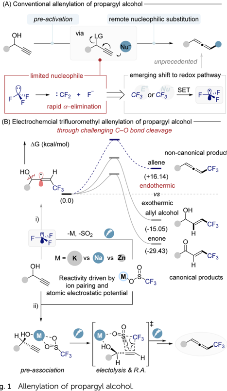
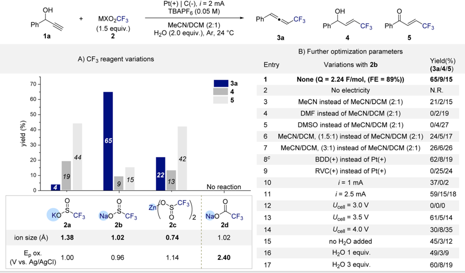
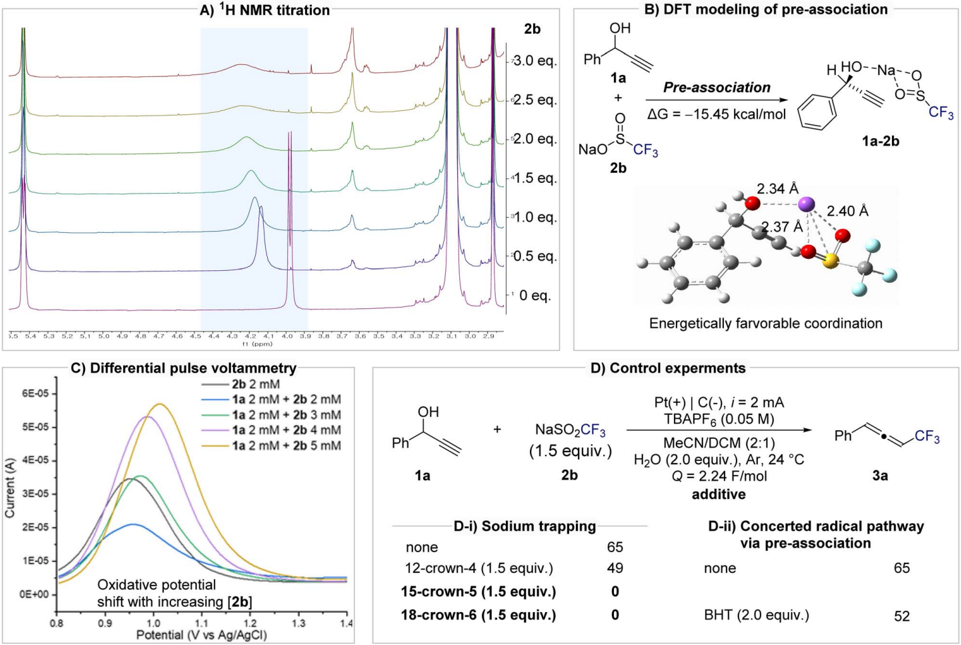
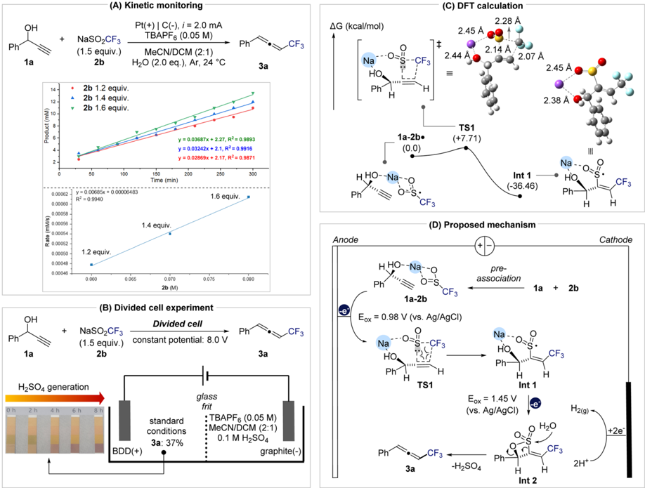
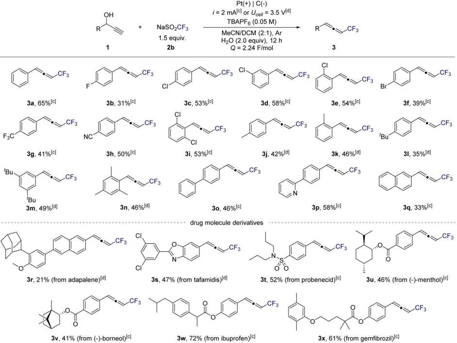
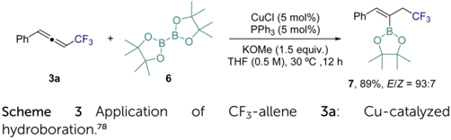

## EDGE ARTICLE

Cite this: DOI: 10.1039/d6sc02203k

All publication charges for this article have been paid for by the Royal Society of Chemistry

Received 17th March 2026 Accepted 27th April 2026

DOI: 10.1039/d6sc02203k

rsc.li/chemical-science

## Introduction

Allenes, cumulated dienes with a central sp-hybridized carbon and two orthogonal p -bonds, 1,2 exhibit unique electronic structures that enable unusual reactivity. 3 These features impart a polarized p -system and exceptional control of regio- and stereochemistry in various transformations. 4 -8 Consequently, allenes are not only common motifs in natural products but also versatile intermediates in the synthesis of complex pharmaceuticals and functional materials. 9 -11 Incorporating a tri  uoromethyl (CF3) group into an allene framework further enhances these attributes. The CF3 group is a strongly electron-withdrawing, privileged motif in medicinal chemistry, known to improve pharmacophysical properties including metabolic stability and binding selectivity of drug candidates. 12 -15 The synergy between the allene core and a CF3 substituent creates a polarized, highly reactive p -system, o ff ering a broadly useful platform for selective bond-forming reactions.

Propargylic alcohols with both an alcohol and an alkyne are valuable building blocks, enabling diverse bond constructions. A well-established two-electron approach is to convert propargylic alcohols into allenes via remote nucleophilic substitution a  er activating the hydroxyl into a leaving group. 16 -40 This strategy has furnished a variety of

a Department of Chemistry, Chung-Ang University, 84 Heukseok-ro, Dongjak-gu, Seoul 06974, Republic of Korea. E-mail: ejcho@cau.ac.kr

b Department of Chemistry, Pohang University of Science and Technology (POSETECH), Pohang 37673, Republic of Korea

View Article Online

View Journal

## Electrochemical deoxygenative tri fl uoromethylallenylation of propargylic alcohols via sodium-mediated pre-association

Jihoon Jang, a Hyunwoo Kim b and Eun Jin Cho * a

We report an electrochemical protocol that enables the direct conversion of free propargylic alcohols into tri fl uoromethylated allenes through sodium-mediated radical C -O bond activation. The transformation proceeds via a pre-association mechanism between the propargylic alcohol and a tri fl uoromethyl sul fi nate reagent, which organizes the reactive complex through Na + coordination. This interaction lowers the energetic barrier of the intrinsically endothermic C -O bond cleavage, allowing a concerted radical addition pathway under mild electrochemical conditions. Combined experimental and computational studies, including NMR titration, kinetic analysis, and DFT calculations, reveal that sodium acts as an ion bridge, enabling selective CF3 incorporation. The reaction exhibits broad substrate scope and high chemoselectivity, tolerating halogens, heteroarenes, and sensitive functional groups, and proving e ff ective for the late-stage tri fl uoromethylation of natural products and pharmaceuticals.

functionalized allenes (Fig. 1A). 41 -52 However, the scope of nucleophiles in these transformations remains limited. In particular, a tri  uoromethyl anion (CF3 -) cannot be employed in such substitutions because it is intrinsically unstable, undergoing rapid a -elimination to form di- uorocarbene and  uoride. 53,54

This decomposition precludes direct nucleophilic tri- uoromethylation of propargylic alcohols.

As a solution, chemists have turned to tri  uoromethyl radicals as surrogates for CF3 -, taking advantage of their greater stability and the abundance of reagents available to generate $ CF3. 55 -57 Indeed, radical tri  uoromethylation has been extensively explored in many contexts, from aromatic C -H functionalization to alkene difunctionalizations, using photochemical, electrochemical, and metal-catalyzed protocols. 58 -69 Surprisingly, however, radical tri- uoromethylation of propargylic alcohols to form allenes has not been reported to date. The lack of precedent for this transformation stems from fundamental challenges in radical C -O bond activation (Fig. 1B-i). Selective cleavage of a propargylic C -O bond by radical means is thermodynamically disfavored (endothermic) and must compete against more favorable pathways. For example, addition of a CF3 radical to a propargylic alkyne would generate a highly reactive vinyl radical intermediate. Vinyl radicals preferentially follow divergent pathways such as b -scission or hydrogen atom transfer, instead of the productive allene-forming route. 70 -75 Consequently, the intrinsic instability of vinyl radicals, combined with the endothermic nature of C -O bond scission, constitutes a formidable mechanistic barrier to

Open Access /

(A) Conventional allenylation of propargyl alcohol -

(cc) BY

F

(B) Electrochemcial trifluoromethyl allenylation of propargyl alcohol -

* AG (kcal/mol)

HO

ії)

y.,

M

pre-association via

achieving tri  uoromethylative allenylation under radical conditions. Herein, we report an electrochemical radical tri- uoromethylation of free propargylic alcohols that overcomes these challenges, enabling the  rst direct synthesis of CF3-substituted allenes (Fig. 1B-ii). Central to our design is the in situ pre-activation of the alcohol through coordination with a CF3 radical source. We envisioned that a reagent such as MSO2CF3 (metal tri  uoromethylsul  nate) could engage in hydrogen bonding or Lewis acid -base coordination with the -OHgroup, thereby weakening the C -Obond prior to cleavage. Upon electrochemical anodic oxidation, the CF3 source generates CF3 radicals that attack the alkyne and, crucially, induce C -O bond dissociation to form the allene.

Notably, the coordinated CF3 -alcohol complex lowers the energy barrier enough to drive what is an endothermic bond cleavage into a productive pathway. The reaction proceeds with high regio- and chemoselectivity, a ff ording tri  uoromethylated allenes in good yield. Combined experimental and DFT studies support the formation of the alcohol -CF3 complex and its role

LG

in guiding the reaction toward allene formation, a transformation that was previously consided infeasible.

## Results and discussion

To prove the critical role of substrate -reagent pre-association in the formation of CF3-substituted allenes, we began our investigation by screening various MXO2CF3 reagents using 1phenylprop-2-yn-1-ol ( 1a ) as a model substrate (Scheme 1A). Electrolysis was conducted under constant current (2 mA) conditions with n Bu4NPF6 as the electrolyte, a platinum anode, and a graphite cathode in MeCN/DCM (2 : 1) containing H2O (2.0 equiv.) as an additive. Gratifyingly, tri- uorosul  nate reagents (MSO2CF3) showed the desired reactivity, a ff ording the CF3-allene ( 3a ). The nature of the counter cation proved crucial.

Among Na + , K + , and Zn 2+ salts, NaSO2CF3 ( 2b ) delivered 3a in 65% yield, whereas KSO2CF3 ( 2a ) and Zn(SO2CF3)2 ( 2c ) primarily generated the competing allylic alcohol ( 4 ) or enone ( 5 ) byproducts. These results indicate that cation size signi  cantly in  uences the geometry and strength of the preassociation between the CF3 reagent and the alcohol. Notably, the oxidation potentials of 2a -2c di ff er only slightly, suggesting that the distinct product selectivities arise not from redox di ff erences but from di ff erences in their coordination environments. Taken together, these  ndings strongly support the formation of a substrate -reagent pre-association complex that governs the selective allene formation. In contrast, the carboxylate analogue NaCO2CF3 ( 2d ) was completely unreactive under identical conditions, with no detectable conversion of 1a . This inactivity is attributed to its considerably higher oxidation potential, which precludes electrochemical generation of CF3 radicals. The divergent reactivity between sul  nates and carboxylates highlights the delicate interplay between reagent redox properties and preassociation e ff ects in enabling endothermic C -O bond activation under electrochemical radical conditions. With NaSO2CF3 ( 2b ) identi  ed as the optimal CF3 source, we next examined the in  uence of reaction parameters (Scheme 1B). Control experiments con  rmed that no product formation occurred in the absence of electrical input, highlighting the essential role of electrolysis in the transformation (entry 2). Solvent e ff ects were pronounced that the use of MeCN, DMF, or DMSO as single solvents or deviation from the 2 : 1 MeCN/ DCM ratio led to markedly reduced yields or complete loss of reactivity (entries 3 -7). The nature of the anode also proved critical. Replacement of the platinum anode with borondoped diamond (BDD) maintained comparable e ffi ciency, a ff ording 3a in 61% yield (entry 8). In contrast, the use of a graphite anode completely suppressed allene formation, producing the allylic alcohol ( 4 ) and enone ( 5 ) byproducts (entry 9). Current intensity exerted a notable in  uence. Lowering the current to 1 mA resulted in incomplete conversion of 1a ( z 60%), while higher currents caused slight decreases in yield, likely due to overoxidation of intermediates (entries 10 -11). Constant-potential electrolysis further clari  ed the relationship between oxidation potential and

Open Access /

(cc) BY

OH

1a

то-

60-

50 -

40 -

30

20-

10 - ion size (A)

Ep ox.

Pt(+) | C(-), i = 2 mA

TBAPF6 (0.05 M)

MeCN/DCM (2:1)

H2O (2.0 equiv.), Ar, 24 °C

(1.5 equiv.)

Ph

CF3

Ph

CF3

Scheme 1 Optimization of reaction parameters. a,b a Reactions were conducted on 0.2 mmol scale. b Yields were determined by 19 F NMR spectroscopy using 2,2,2-tri fl uoroethanol as an internal standard.

e ffi ciency. At 3.0 V, no conversion of 1a was observed, consistent with an insu ffi cient anodic potential to initiate oxidation (entry 12). Increasing the potential to 3.5 V restored productive reactivity comparable to that under constantcurrent conditions (entry 13), whereas potentials above 3.5 V led to signi  cant yield erosion, attributed to oxidative degradation of 3a into overoxidized byproducts such as 5 (entry 14). 76 Finally, varying the water loading between 1.0 and 3.0 equiv. resulted in only marginal changes in yield (entries 15 -17), indicating a subtle yet reproducible in  uence of water on the overall e ffi ciency.

To elucidate the mechanism and validate the formation of a pre-association complex between 1a and 2b , a series of spectroscopic, electrochemical, and kinetic experiments were conducted (Fig. 2). NMR titration experiments revealed clear evidence of substrate -reagent interaction. Upon incremental addition of 2b to 1a , the O -H peak of 1a shi  ed progressively down  eld and broadened, consistent with coordination between the hydroxyl oxygen and the sodium cation of 2b (Fig. 2A). DFT calculations indicated that the pre-association of 1a and 2b via Na + coordination is energetically favorable ( D G = -15.45 kcal mol -1 ; Fig. 2B). Di ff erential pulse voltammetry (DPV) further supported complex formation. The oxidation potential of 2b increased systematically with [ 2b ], suggesting that the redox behavior of 2b is modulated by its associationwith 1a (Fig. 2C). Cyclic voltammetry provided further evidence while individual scans of 1a or 2b showed no signi  cant oxidation waves, their mixture exhibited new redox features. In particular, the oxidation signal of 1a diminished and disappeared, indicating that pre-association between 1a and 2b is mechanistically relevant (see Fig. S2 in the SI). The importance of sodium in mediating this pre-association was con  rmed by crown ether experiments (Fig. 2D-i). In the presence of the weak sodium chelator 12-crown-4, the yield of 3a decreased slightly (49%), whereas stronger complexants such as 15-crown-5 and 18-crown-6 completely inhibited product formation. These results clearly demonstrate that sodium acts as an ion-bridge, organizing the propargyl alcohol and CF3 source into a reactive complex. To investigate the reaction pathway during the radical addition step, we conducted control experiments using radical inhibitors BHT (butylated hydroxytoluene) and TEMPO (2,2,6,6-tetramethylpiperidine 1-oxyl). Notably, the addition of BHT did not signi  cantly suppress product formation (52% yield), suggesting that free CF3 radicals are not involved as discrete intermediates and that the transformation proceeds via a concerted radical addition pathway (Fig. 2D-ii). In contrast, in the presence of TEMPO, the reaction predominantly resulted in oxidation of 1a to the corresponding ketone (see Scheme S1 in the SI). This outcome is attributed to the well-established ability of TEMPO to undergo electrochemical oxidation to generate oxyl radical species, which can mediate alcohol oxidation. 77

Notably, the addition of the radical scavenger BHT did not suppress product formation (52% yield), indicating that free CF3 radicals are not really involved and that the transformation proceeds via a concerted radical addition pathway. Kinetic analysis further clari  ed the mechanistic relevance of this pre-

Ph

\_CF3

OH

4

O

5

Open Access /

(cc) BY

0.8

A) 'H NMR titration

2b

3.0 eq.

Ph

OH

1a

B) DFT modeling of pre-association

H HO--Na--o

Fig. 2 Evidence and implication of sodium cation assisted pre-association in electrochemical allenylation. (A) 1 H NMR titration experiment: 1a (1.0 equiv.), 2b ( x equiv.) TBAPF6 (1.0 equiv.) H2O (2.0 equiv.) in CD3CN solvent. (B) DFT calculations were performed at the M062X/def2TZVP/ PCM in MeCN level of theory. Free energy given in kcal mol -1 . (C) Di ff erential pulse voltammetry of 2b , and mixture of 1a with 2b . (D) Results of control experiments.

association (Fig. 3A). Monitoring product accumulation under varying concentrations of 2b while keeping [ 1a ] constant revealed a linear relationship between initial rate and [ 2b ] ( R 2 = 0.994), consistent with a  rst-order dependence on 2b . This result indicates that 2b participates directly in the ratedetermining step. A divided-cell experiment con  rmed that this transformation originates from anodic processes, as product formation was observed exclusively in the anodic compartment, thereby ruling out cathodic reduction pathways such as vinyl radical formation followed by E1cB-type elimination (Fig. 3B and the SI for further details). In addition, monitoring the pH of the anodic solution revealed a gradual acidi  cation over the course of the reaction, consistent with the generation of H2SO4. The generated acid does not appear to a ff ect the reactivity of the system. When the isolated product 3a was subjected to H2SO4 conditions, no decomposition or transformation was observed (Fig. S5 in the SI). Furthermore, under the undivided cell conditions employed in this study, the protons generated at the anode are expected to be reduced at the cathode, thereby completing the redox cycle and preventing the accumulation of acidic species.

To gain deeper insight into the C -O activation step, DFT calculations were performed on the oxidation and radical addition sequence (Fig. 3C). A  er anodic oxidation of the preassociated 1a -2b complex, radical addition of CF3 to the terminal carbon of the alkyne is facilitated by an ion-bridging interaction between the hydroxyl group and Na + , positioning the sulfonyl group for concerted CF3/SO2 coupling to form intermediate Int-1 . Based on these results, a mechanistic model is proposed (Fig. 3D).

The propargylic alcohol ( 1a ) and NaSO2CF3 ( 2b )  rst form a pre-associated complex that undergoes anodic oxidation at 0.98 V vs. Ag/AgCl to generate radical species ( 1a -2b $ ). This intermediate proceeds through transition state TS1 ( D G ‡ = +7.71 kcal mol -1 ) to yield Int-1 ( D G = -36.46 kcal mol -1 ) via a concerted radical addition. A subsequent anodic oxidation at 1.45 V produces Int-2 , which, upon nucleophilic attack of water at the sulfonyl group, releases H2SO4 and furnishes the tri- uoromethylated allene 3a . The H2SO4 generated in this step provides protons that undergo reduction at the cathode, thereby maintaining charge balance in the electrochemical cell and completing the overall redox cycle.

Open Access /

Ph

(cc) BY

OH

1a

1a

2 h

Product (mM)

14-

12

10 -

0.00062 -

0.00060

0.00058 -

22000052-

0.00050 -

0.00048 -

0.00046 1

+

4 h

(A) Kinetic monitoring

Pt (+) | C(-), i = 2.0 mA

NaSO\_CF3

TBAPF6 (0.05 M)

(1.5 equiv.)

R? = 0,9940

Ph

CF3

(C) DFT calculation

2.45 A

2.28 A

2.44 A

2.14 A

6 h

Fig. 3 Mechanistic investigations. (A) Variations of 2b 's equivalent with standard condition. Reaction monitoring was proceeded by 19 F NMR using 2,2,2-tr fl uoroethanol as an internal standard. (B) Result of the divided cell experiment. (C) Computed relative free energies of transition state for concerted radical addition step. DFT calculations were performed at the M062X/def2TZVP/PCM in MeCN level of theory. Free energy given in kcal mol -1 . (D) Proposed mechanism based on mechanistic investigations.

Next, to evaluate the generality of this electrochemical protocol, we examined a diverse range of propargylic alcohols (Scheme 2). Under standard conditions, substrates bearing electron-withdrawing or neutral substituents underwent smooth conversion to the corresponding CF3-substituted allenes. In contrast, electron-rich substrates were prone to overoxidation of the allene products under constant-current conditions. Switching to constant-potential electrolysis e ff ectively suppressed this undesired oxidation, ensuring high selectivity (also see Scheme 1B, entry 13). The methodology exhibited broad functional-group tolerance. Halogenated substrates, including  uoro ( 3b ), chloro ( 3c -3e , 3i ), and bromo ( 3f ) derivatives, a ff orded the desired products in excellent yields. Strongly electron-withdrawing substituents such as tri- uoromethyl ( 3g ) and cyano ( 3h ) groups were also well tolerated. For electron-donating substituents ( 3j -3n ), the corresponding allenes were obtained in high yields under the modi  ed constant-potential conditions. Substrates containing extended p -systems or heteroaromatic motifs, including biphenyl ( 3o ), pyridyl ( 3p ), and naphthyl ( 3q ), participated readily, highlighting the compatibility of this method with conjugated frameworks. To further demonstrate synthetic utility, late-stage tri  uoromethylation of complex molecules was explored. Natural-product-derived and drug-like sca ff olds such as adapalene ( 3r ), tafamidis ( 3s ), and a probenecid analogue ( 3t ) underwent smooth transformation to their corresponding CF3-allenes. Similarly, benzoateand acetoxyfunctionalized natural products including menthol ( 3u ) and (+)-borneol ( 3v ) reacted e ffi ciently. Widely used pharmaceuticals such as ibuprofen ( 3w ) and gem  brozil ( 3x ) also underwent selective conversion.

As highlighted in the introduction, CF3-allenes can serve as versatile building blocks for further transformations. To demonstrate this potential, we investigated the hydroboration of 3a using bis(pinacolato)diborane ( 6 ) under copper catalysis (Scheme 3). Notably, this transformation provides an alkenyl boronate bearing an allylic CF3 moiety ( 7 ), which di ff ers from products reported under related copper-catalyzed hydroboration conditions. 78 This result highlights the potentially unique reactivity of CF3-substituted allenes.

2.07 A

MeCN/DCM (2:1)

+

AG (kcal/mol)

Open Access /

(cc) BY

За

За, 65% (c)

3g, 41% (cl

'Bu

3m, 49% la)

3r, 21% (from adapalene)(d)

CuCI (5 mol%)

PPh3 (5 mol%)

+

NaSO\_CF3

KOMe (1.5 equiv.)

1.5 equiv.

Pt (+) | C(-)

i = 2 mAic) or Ucell = 3.5 vid

CF3

TBAPF6(0.05 M)

MeCN/DCM (2:1), Ar

R

CF3

THF (0.5 M), 30 °C ,12 h

Scheme 2 Substrate scope of electrochemical tri fl uoromethyl allenylation of propargyl alcohols. a,b a Reactions were conducted on 0.3 mmol scale. b Yields were determined by 19 F NMR using 2,2,2-tri fl uoroethanol as an internal standard. c Reactions were carried out under constant current condition. d Reactions were carried out under constant potential condition.

## Conclusions

In summary, we have developed an electrochemical strategy for the selective conversion of free propargylic alcohols into CF3substituted allenes through sodium-mediated radical C -Obond activation. This transformation achieves a formally endothermic C -O bond cleavage under mild electrochemical conditions by exploiting a pre-association mechanism between the substrate and the CF3 source. Systematic mechanistic investigations, combining NMR, electrochemical, kinetic, and DFT analyses, revealed that the Na + ion serves as an ion-bridge, preorganizing the propargyl alcohol and CF3 reagent into a reactive complex that undergoes concerted radical addition upon anodic oxidation. This method exhibits broad substrate scope, high chemoselectivity, and excellent functional-group tolerance, enabling late-stage tri  uoromethylation of complex molecules. Beyond providing a synthetically practical route to CF3-substituted allenes, this work establishes a general strategy for activating strong C -O bonds via reagent -substrate preorganization, expanding the conceptual landscape of electrochemical radical chemistry.

## Author contributions

J. J. performed synthetic and mechanistic studies. H. K. and E. J. C. coordinated the experiments and analyses. J. J. and E. J. C. analyzed the experimental data and wrote the manuscript.

## Confl icts of interest

There are no con  icts to declare.

H2O (2.0 equiv), 12 h

Ph

## Data availability

The data underlying this study are available in the published article and its supplementary information (SI). Supplementary information: experimental procedures, electroanalytical studies, computational studies, characterization of synthesized compounds, and spectroscopic data. See DOI: https://doi.org/ 10.1039/d6sc02203k.

## Acknowledgements

We gratefully acknowledge the National Research Foundation of Korea (RS-2024-00409659 and RS-2025-00559692) and the Ministry of Trade, Industry and Energy, Korea (Technology Innovation Program, RS-2023-00266039).

## Notes and references

- 1 C. H. Hendon, A. T. Murray, D. R. Carbery and A. R. Walsh, Chem. Sci. , 2013, 4 , 4278 -4284.
- 2 M. H. Palmer, Chem. Phys. , 2006, 326 , 631 -640.
- 3 E. Soriano and I. Fern´ andez, Chem. Soc. Rev. , 2014, 43 , 3041 -3105.
- 4 X.-L. Han, P.-P. Lin and Q. Li, Chin. Chem. Lett. , 2019, 30 , 1495 -1502.
- 5 B. Yang, Y. Qiu and J.-E. B¨ ackvall, Acc. Chem. Res. , 2018, 51 , 1520 -1531.
- 6 G. Qiu, J. Zhang, K. Zhou and J. Wu, Tetrahedron , 2018, 74 , 7290 -7301.
- 7 C. S. Adams, C. D. Weatherly, E. G. Burke and J. M. Schomaker, Chem. Soc. Rev. , 2014, 43 , 3136 -3163.
- 8 S. Ma, Chem. Rev. , 2005, 105 , 2829 -2872.
- 9 J. Singh, A. Sharma and A. Sharma, Org. Front. Chem. , 2021, 8 , 5651 -5667.
- 10 P. Rivera-Fuentes and F. Diederich, Angew. Chem., Int. Ed. , 2012, 51 , 2818 -2828.
- 11 A. Ho ff mann-Röder and N. Krause, Angew. Chem., Int. Ed. , 2004, 43 , 1196 -1216.
- 12 N. A. Meanwell, J. Med. Chem. , 2018, 61 , 5822 -5880.
- 13 J. Wang, M. S´ anchez-Rosell´ o, J. L. Aceña, C. Pozo, A. E. Sorochinsky, S. Fustero, V. A. Soloshonok and H. Liu, Chem. Rev. , 2014, 114 , 2432 -2506.
- 14 S. Purser, P. R. Moore, S. Swallow and V. Gouverner, Chem. Soc. Rev. , 2008, 37 , 320 -330.
- 15 L. Müller, C. Faeh and F. Diederich, Science , 2007, 317 , 1881 -1886.
- 16 J. Chao, R. Yang, J. Huang, X. Chen, X.-R. Song and Q. Xiao, Org. Biomol. Chem. , 2025, 23 , 8862 -8890.
- 17 K. Negesh, N. S. Reddy, S. Kareem, S. R. Vali and B. V. S. Reddy, Org. Biomol. Chem. , 2025, 23 , 6665 -6682.
- 18 S. Kim, D. S. Lee, N. Iqbal, J. Bae, H. S. Hwang, D. Baek, S. Hong and E. J. Cho, Chem Catal. , 2024, 4 , 101082.
- 19 S. Mishra, S. Raikwar and B. Baire, Chem. -Asian J. , 2023, 18 , e202300316.
- 20 F. Doraghi, A. M. Mahdavian, S. Karimian, B. Larijiani and M. Mahdavi, Adv. Synth. Catal. , 2023, 365 , 2991 -3019.
- 21 S. Jiang, H. Ma, R. Yang, X.-R. Song and Q. Xiao, Org. Chem. Front. , 2022, 9 , 5643 -5674.
- 22 Z. Xiaozheng, L. Qinqin, C. Guiyan, Z. Xiaolong and S. Yingpeng, Chin. J. Org. Chem. , 2022, 42 , 2605 -2629.
- 23 J. Wu, Q. Guo, H. Hong, R. Xie and N. Zhu, J. CO2 Util. , 2022, 65 , 102192.
- 24 X.-Y. Liu, Y.-L. Liu and L. Chen, Adv. Synth. Catal. , 2020, 362 , 5170 -5194.
- 25 Z. Wang, X. Lin, X. Chen, P. Li and W. Li, Org. Chem. Front. , 2021, 8 , 3469 -3474.
- 26 W.-R. Zhu, Q. Su, H.-J. Diao, E.-X. Wang, F. Wu, Y.-L. Zhao, J. Weng and G. Lu, Org. Lett. , 2020, 22 , 6873 -6878.
- 27 G. R. Kumar, M. Rajesh, S. Lin and S. Liu, Adv. Synth. Catal. , 2020, 362 , 5238 -5256.
- 28 H. Qian, D. Huang, Y. Bi and G. Yan, Adv. Synth. Catal. , 2019, 361 , 3240 -3280.
- 29 T. Khan and S. Yaragorla, Eur. J. Org Chem. , 2019, 3989 -4012.
- 30 F. No¨ el, V. D. Vukovi´ c, J. Yi, E. Richmond, P. Kravljanac and J. Moran, J. Org. Chem. , 2019, 84 , 15926 -15947.
- 31 A. Boreux, G. H. Lonca, O. Riant and F. Gagosz, Org. Lett. , 2016, 18 , 5162 -5165.
- 32 B. R. Ambler, S. Peddi and R. A. Altman, Org. Lett. , 2015, 17 , 2506 -2509.
- 33 Y.-L. Ji, J.-J. Kong, J.-H. Lin, J.-C. Xiao and Y. C Gu, Org. Biomol. Chem. , 2014, 12 , 2903 -2906.
- 34 T. S. N. Zhao and K. J. Szab´ o, Org. Lett. , 2012, 14 , 3966 -2969.
- 35 T. Yamazaki, Y. Watanabe, N. Yoshida and T. KawasakiTakasaka, Tetrahedron , 2012, 68 , 6665 -6673.
- 36 P. Li, Z.-J. Liu and J.-T. Liu, Tetrahedron , 2010, 66 , 9729 -9732.
- 37 Y. Watanabe and T. Yamazaki, Synlett , 2009, 20 , 3352 -3354.
- 38 M. Shimizu, M. Higashi, Y. Takeda, G. Jiang, M. Murai and T. Hiyama, Synlett , 2007, 7 , 1163 -1165.
- 39 T. Yamazaki, T. Yamamoto and R. Ichihara, J. Org. Chem. , 2006, 71 , 6251 -6253.
- 40 T. Sakamoto, K. Takahashi, T. Yamazaki and T. Kitazume, J. Org. Chem. , 1999, 64 , 9467 -9474.
- 41 C. Beluze, T. Hu, D. Bouyssi, N. Monteiro and A. Amgoune, Synthesis , 2025, 57 , 2935 -2945.
- 42 B.-Y. Xiao, W. Huang and F.-H. Zhang, Eur. J. Org Chem. , 2025, 28 , e202500302.
- 43 L. Gan, X. Wan, Y. Pang, Y. Zou, Y.-H. Deng and Z. Shao, Org. Chem. Front. , 2025, 12 , 1001 -1064.
- 44 R. Lin, Y. Zhang, T. Xiong, H. Huang, X. Peng, Y. Zhang, N. Huang, W. Hu and J. Jiang, ACS Catal. , 2025, 15 , 16236 -16246.
- 45 S. Yaragorla, A. Shaik and D. S. Latha, J. Org. Chem. , 2025, 90 , 4735 -4747.
- 46 Z. Chen and H. Qian, Org. Lett. , 2025, 27 , 522 -527.
- 47 H. Chang, R. Wang and Y.-M. Wang, Chem. -Asian J. , 2025, 20 , e00105.
- 48 Y. Xia, M. Liu, W. Li and P. Li, Asian J. Org. Chem. , 2024, 13 , e202400377.
- 49 C. Jarava-Barrera, A. Parra, S. Quesada, S. Orgaz-Gordillo, R. F. Pradilla, A. Viso, J. Teresa, I. Alonso and M. Tortosa, Adv. Synth. Catal. , 2024, 366 , 768 -773.
- 50 W. Xiao and J. Wu, Org. Chem. Front. , 2022, 9 , 5053 -5073.

- 51 S. Du, A.-X. Zhou, R. Yang, X.-R. Song and Q. Xiao, Org. Chem. Front. , 2021, 8 , 6760 -6782.
- 52 S. Wu, X. Huang, C. Fu and S. Ma, Org. Chem. Front. , 2017, 4 , 2002 -2007.
- 53 Y. Fujihira, Y. Liang, M. Ono, K. Hirano, T. Kagawa and N. Shibata, Beilstein J. Org. Chem. , 2021, 17 , 431 -438.
- 54 T. Saito, J. Wang, E. Tokunaga, S. Tsuzuki and N. Shibata, Sci. Rep. , 2018, 8 , 11501.
- 55 R. Giri, A. J. Fernandes and D. Katayev, Acc. Chem. Res. , 2025, 58 , 2046 -2060.
- 56 M. Duan, Q. Shao, Q. Zhou, P. S. Baran and K. N. Houk, Nat. Commun. , 2024, 15 , 4630.
- 57 H. Xiao, Z. Zhang, Y. Fang, L. Zhu and C. Li, Chem. Soc. Rev. , 2021, 50 , 6308 -6319.
- 58 S. Kim and H. Kim, ACS Catal. , 2025, 15 , 6826 -6851.
- 59 R. Shaw, N. Sihag, H. Bhartiya and M. R. Yadav, Org. Chem. Front. , 2024, 11 , 954 -1014.
- 60 S. Kim and H. Kim, J. Am. Chem. Soc. , 2024, 146 , 22498 -22508.
- 61 Y. Ouyang and F.-L. Qing, J. Org. Chem. , 2024, 89 , 2815 -2824.
- 62 C. H. Ka, S. Kim and E. J. Cho, Chem. Rec. , 2023, 23 , e202300036.
- 63 Z. Zou, W. Zhang, Y. Wang and Y. Pan, Org. Chem. Front. , 2021, 8 , 2786 -2798.
- 64 R. P. Bhaskaran and B. P. Babu, Adv. Synth. Catal. , 2020, 362 , 5219 -5237.
- 65 F. Ye, F. Berger, H. Jia, J. Ford, A. Wortman, J. Börgel, C. Genicot and T. Ritter, Angew. Chem., Int. Ed. , 2019, 58 , 14615 -14619.
- 66 E. H. Oh, H. J. Kim and S. B. Han, Synthesis , 2018, 50 , 3346 -3358.
- 67 T. Chatterjee, N. Iqbal, Y. You and E. J. Cho, Acc. Chem. Res. , 2016, 49 , 2284 -2294.
- 68 E. J. Cho, Chem. Rec. , 2016, 16 , 47 -63.
- 69 C. Ni, M. Hu and J. Hu, Chem. Rev. , 2015, 116 , 765 -825.
- 70 N. Tang, S. Chen, C. Li, P. Du, W. Yang and R. Qiu, ACS Catal. , 2025, 15 , 11062 -11073.
- 71 M. Liang, H. Ma, X.-R. Song and Q. Xiao, Adv. Synth. Catal. , 2024, 366 , 2659 -2677.
- 72 P. Bovonsombat, P. Sophanpanichkul and S. Losuwanakul, RSC Adv. , 2022, 12 , 22678 -22694.
- 73 B. Zhang and T. Wang, Asian J. Org. Chem. , 2018, 7 , 1758 -1783.
- 74 R. K. Kumar and X. Bi, Chem. Commun. , 2016, 52 , 853 -868. 75 S. Park, J. M. Joo and E. J. Cho, Eur. J. Org Chem. , 2015, 4093 -4097.
- 76 K. S. Lee, F. Barbieri, E. Casali, E. T. Marris, G. Zanoni and J. M. Schomaker, J. Am. Chem. Soc. , 2025, 147 , 318 -330.
- 77 T. Kawajiri, M. Hosoya, S. Goda, E. Sato and S. Suga, Org. Lett. , 2025, 27 , 4737 -4741.
- 78 S. Akiyama, S. Nomura, K. Kubota and H. Ito, J. Org. Chem. , 2020, 85 , 4172 -4181.