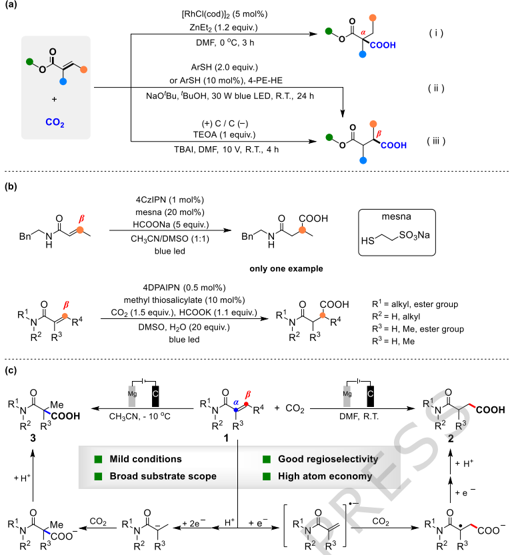
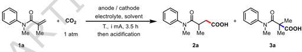
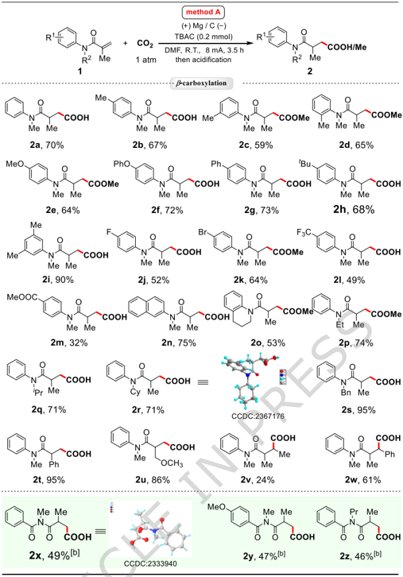
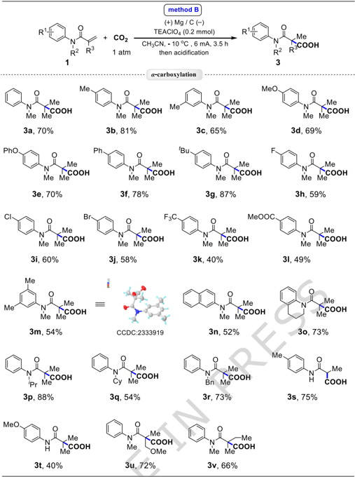
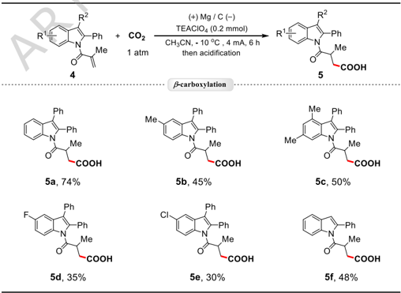
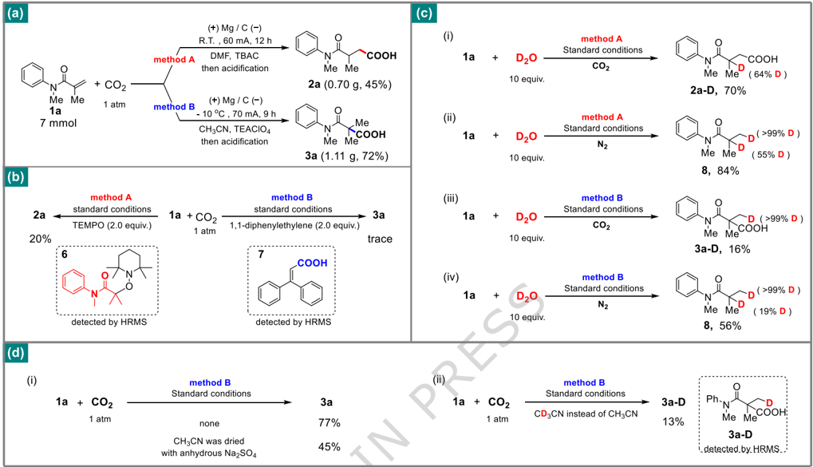
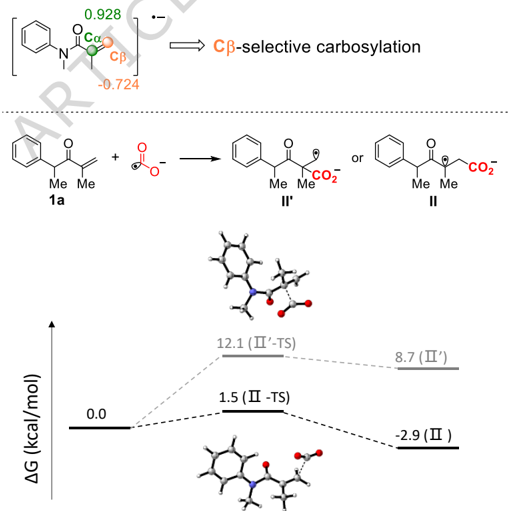
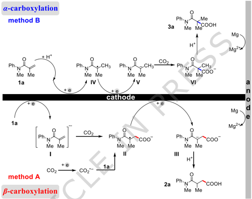

## Communications Chemistry

## Article in Press

## Electrochemical selective hydrocarboxylation of acrylamides with carbon dioxide for precise control of α- and β-carboxylation

Received: 22 May 2025

## Accepted: 24 November 2025

Cite this article as: Zhao, X., Chen, Z., Xue, F. et al. Electrochemical selective hydrocarboxylation of acrylamides with carbon dioxide for precise control of α- and β-carboxylation. Commun Chem (2025). https:// doi.org/10.1038/s42004-025-01828-0

Xiuli Zhao, Ziren Chen, Fei Xue, Haomin Chen, Lin Zhang, Bin Wang, Shaofeng Wu, Yu Xia, Shoucai Wang, Weiwei Jin, Yonghong Zhang &amp; Chenjiang Liu

We are providing an unedited version of this manuscript to give early access to its findings. Before final publication, the manuscript will undergo further editing. Please note there may be errors present which affect the content, and all legal disclaimers apply.

If this paper is publishing under a Transparent Peer Review model then Peer Review reports will publish with the final article.

ARTICLE IN PRESS

© The Author(s) 2025. Open Access This article is licensed under a Creative Commons Attribution-NonCommercial-NoDerivatives 4.0 International License, which permits any non-commercial use, sharing, distribution and reproduction in any medium or format, as long as you give appropriate credit to the original author(s) and the source, provide a link to the Creative Commons licence, and indicate if you modified the licensed material. You do not have permission under this licence to share adapted material derived from this article or parts of it. The images or other third party material in this article are included in the article's Creative Commons licence, unless indicated otherwise in a credit line to the material. If material is not included in the article's Creative Commons licence and your intended use is not permitted by statutory regulation or exceeds the permitted use, you will need to obtain permission directly from the copyright holder. To view a copy of this licence, visit http://creativecommons.org/licenses/by-nc-nd/4.0/.

## Electrochemical selective hydrocarboxylation of acrylamides with carbon dioxide for precise control of α - and β -carboxylation

Xiuli Zhao, 1,2 Ziren Chen, 1 Fei Xue, 1 Haomin Chen, 1 Lin Zhang, 1 Bin Wang, 1 Shaofeng Wu, 1 Yu Xia, 1 Shoucai Wang, 1 Weiwei Jin, 3 Yonghong Zhang, 1 and Chenjiang Liu *,1,4

1 State Key Laboratory of Chemistry and Utilization of Carbon Based Energy Resources, Key Laboratory of Oil and Gas Fine Chemicals, Ministry of Education &amp; Xinjiang Uygur Autonomous Region, Urumqi Key Laboratory of Green Catalysis and Synthesis Technology, College of Chemistry, Xinjiang University Xinjiang University, Urumqi 830017, P. R. China; E-mail: pxylcj@126.com

2 Medical College, Hexi University, Zhangye 734000, P. R. China.

3 Key Laboratory of Specialty Agri-Product Quality and Hazard Controlling Technology of Zhejiang Province, College of Life Sciences, China Jiliang University, Hangzhou 310018, P. R. China. 4 School of Chemistry and Chemical Engineering, Xinjiang Normal University, Urumqi 830054, P. R. China ABSTRACT The hydrocarboxylation of acrylate with carbon dioxide (CO2) have been achieved through metalcatalysis, photochemistry catalysis or electrochemistry catalysis in recent years. The hydrocarboxylation of acrylamide has rarely been studied so far, because of the electron cloud density of the carbon-carbon double bond in acrylamide molecules is lower than that of acrylates. Herein, we report an electrochemical selective hydrocarboxylation method of acrylamides with CO2. The α -carboxylation and β -carboxylation products can be obtained by adjusting the reaction conditions. The present protocol features mild conditions, good regioselectivity, broad substrare scope and high atom economy. Furthermore, detailed control experiments and DFT calculations results showed that the carboxylation at the α - and β - sites undergo different reaction processes. ARTICLE IN PRESS

## Introduction

CO2 is the main component of greenhouse gases and has an important impact on climate change. 1 However, CO2 is also an abundant, sustainable, and non-toxic one-carbon (C1) building block that could react with olefins, 2-14 alkynes, 15-18 imines, 19, 20 cyclic ethers, 21-23 halides, 24-31 arenes, 32-34 etc. to synthesize many types of compounds. 35, 36 Electron-deficient alkenes do not react easily with

CO2 due to the descend electron cloud density of carbon-carbon double bond. 37 To date, despite some hydrocarboxylation methods of electron-deficient alkenes with CO2 have been reported, the reaction substrates were mainly focus on acrylates. Mikami's group used expensive [RhCl(cod)]2 as catalyst and highly flammable ZnEt2 as reducing agent to achieve the hydrocarboxylation of acrylate with CO2 (Fig. 1a i). 38 In recent years, with the rise of green organic synthesis, organic photochemistry has developed rapidly. Yu's lab achieved β -carboxylation of acrylates with CO2 through an electron donor-acceptor (EDA) photochemical strategy (Fig. 1a ii). 39

Electrochemistry, as another synthesis strategy of green chemistry, has attracted the attention of organic chemists because it avoids the need of chemical oxidation-reduction agents. 40-48 Buckly's group successfully accomplished the hydrocarboxylation of acrylate with CO2  through electrochemistry, yielding β -carboxylation products (Fig. 1a iii). 49 Unlike acrylate, the conjugation of nitrogen atom and carbonyl group in acrylamide molecule results in a more dispersed electron cloud around the carbon-carbon double bond, which weaken the nucleophilicity of acrylamide. 50 Consequently,  the  hydrocarboxylation  of  acrylamide  with  CO2  presents  significant  challenge. Despite relevant research reports, these reactions could only be achieved through photocatalytic methods, and limited to the β -carboxylation of acrylamide (Fig.1b). 51, 52 ARTICLE IN PRESS

Based on our research foundations in electrochemical organic synthesis 53-59 and research interest in  CO2  conversion.  Herein,  we  report  an  electrochemical  approach  that  enables  the  selective hydrocarboxylation of acrylamide to obtain α - and β -carboxylation products by adjusting solvents and electrolytes under mild reaction conditions (Fig.1c).

## Results and Discussion

We commenced our study using N -methylN -phenylmethacrylamide ( 1a ) as the model substrate in an undivided cell under 1 atm of CO2 atmosphere (Table 1). Pleasantly, the βcarboxylation product 2a was obtained in a 70% isolated yield, when magnesium sheet was used as the anode and  TBAC  was  used  as  a  supporting  electrolyte  in  DMF  at  room  temperature  (entry  1).  By substituting Mg with Al or Zn as the anode (entries 2, 3), the reaction efficiency was significantly decreased. Surprisingly, the reaction still occurred when graphite carbon was used as the anode

(entry 4). This might be due to the oxidation of chloride ions at the anode. When TBAI (entry 5), TBABF4 (entry 6), TBAPF6 (entry 7), and TBAClO4 (entry 8) were employed as the supporting electrolyte, the yield of 2a was low. Several other solvents including DMAc, NMP, DMSO and CH3CN were evaluated, the results were not satisfactory (entries 9-12). However, interestingly, αcarboxylation product 3a was obtained when using DMSO and CH3CN as solvent. This indicates that the solvent was crucial in determining the reaction site. Subsequently, using CH3CN as the solvent,  we  examined  the  electrochemical  conditions  of  the αcarboxylation  reaction.  After replacing TBAC with other electrolytes, the yield of 3a did not increase significantly, whereas the formation  of 2a was  markedly  reduced  (entries  13-16).  Notably,  the  use  of  TBAClO4  as  the electrolyte  led  to  the  exclusive  formation  of  the α -carboxylation  product 3a (entry  17).  The synergistic  effect  of  TBAClO4  and  CH3CN  enables  the  selective  control  of  the  carboxylation reaction at the α position. Employing TEAClO4 as the electrolyte further improved the yield of 3a (entry 18). This might be because, during the initial stage of the reaction, the tetraethylammonium cation with lower steric hindrance is more conducive to stabilizing the carboxylate formed at the α position. 60 After reducing the concentration of 1a , the reaction efficiency has improved (entry 19).  We  speculate  that  the  structure  of  compound 3a may  be  thermodynamically  unstable compared to compound 2a . Therefore, the reaction for generating 3a might be a kinetic-controlled process, and low temperatures may be beneficial for the reaction. Based on this, we attempted to lower  the  reaction  temperature  (entries  20-22).  The  experimental  results  were  in  line  with expectations, and the target product 3a was obtained with a yield of 70% at -10 ℃ (entry 21). In contrast, reducing the temperature will not increase the yield of 2a (entry 23). ARTICLE IN PRESS

With the optimal reaction conditions for the selective hydrocarboxylation of acrylamide in hand, the substrate scope was further investigated under these conditions. We first tested the range of substrates for the β -carboxylation reaction (Fig. 2). N -methylN -phenylmethacrylamide bearing either electron-donating or electron-withdrawing groups on the benzene ring all reacted smoothly to afford the desired products 2a -2m in 32 to 90% yields. The substrate containing naphthalene ring or tetrahydroquinoline ring was gained products 2n and 2o with the yield of 75% and 53%, respectively. N -phenylmethacrylamide with different N -substituents showed very high reactivity to afford the corresponding products 2p -2s in good to excellent yields. The acrylamide substrates containing different substituents in the olefin could also undergo the reaction smoothly and yield

the corresponding target products ( 2t -2w ). When benzoyl group was substituted for phenyl group, the β -carboxylation  products 2x -2z were  still  obtained  with  moderate  yields.  The  structure  of products 2r and 2x were determined by X-ray crystallographic analysis.

Later, a diverse range of aryl-substituted substrates have been examined in the α -carboxylation reaction  of  acrylamide  with  CO2,  and  the  results  were  summarized  in  Fig.  3.  The  substrates containing  various  electron-donating  groups  on  the  phenyl  group  of  compounds 1 were  more suitable for this method ( 3a -3g ). The yields decreased modestly when the 4-position of the phenyl group  was  substituted  with  electron-withdrawing  groups  ( 3h -3l ).  Substrates  containing  3,4dimethyl-substituted benzene ring, naphthalene ring, or tetrahydroquinoline ring also exhibited moderate reactivity ( 3m -3o ). Altering the nitrogen protecting group to isopropyl, cyclohexyl or benzyl would also lead to the desired products in medium to high yields ( 3p -3r ). To our surprise, the unprotected NH substrates were also able to produce α -carboxylation products ( 3s -3t ), which may be used for further functionalization to synthesize other kinds of important complex molecules. When there are other substituents at the α - or β -position of the double bond, the target products could  be  obtained  with  a  moderate  yield  ( 3u , 3v ).  Unfortunately,  the α -phenyl  and β -phenyl substituted acrylamides have not yielded the target compounds due to the influence of electronic effects. Unexpectedly, replacing benzene ring with indole ring, the β -carboxylation products ( 5a5f ) were detected under the conditions of method B (Fig. 4). ARTICLE IN PRESS

To  demonstrate  the  practicability  of  this  electrocarboxylation  reaction,  large-scale  reactions between 1a and CO2 were conducted under the conditions of methods A and B, respectively, the results were shown in Fig. 5a. Next, various control experiments were tested in order to gain more insights into the reaction mechanism. The free radical scavengers were added into the reaction systems  of  the  conditions A  and  B  respectively,  the  hydrocarboxylation  reactions  were  almost inhibited,  which  suggested  that  the  reactions  presumably  adopted  a  radical  pathway  (Fig.  5b). Meanwhile, compounds 6 and 7 were observed by HRMS, which indicated the existence of α -carbon  radical  intermediate  in  method A  and  CO2  radical  anion  intermediate  in  method  B.  In addition, sodium formate was discovered in the absence of 1a through  1 H NMR and  13 C NMR under  the  reaction  conditions  of  method A  and  method  B  respectively,  the  experiment  results showed that CO2 could also be reduced in both method A and B (see Supporting Information S5

for more details). 39

Deuterium labeling experiments confirmed the presence of β -carboanion intermediates in the reaction  pathway  of  method A  (Fig.  5c,  i  and  ii). 8,  19 And  in  method  B,  the β -site  was  easily deuterated in both CO2 and N2 atmospheres (Fig. 5c, iii and iv), indicating that the proton may have undergone addition reaction with 1a prior to CO2, and water provided protons in the reaction. After  that,  we  conducted  the  following  experiments  to  investigate  the  source  of  water.  We conducted experiments using a solvent dried with anhydrous sodium sulfate and found a significant decrease in the yield of 3a (Fig. 5d, i). And 3a-D was detected when using CD3CN as a solvent (Fig. 5d, ii). The above experimental results indicate that protons mainly originate from the trace water present in acetonitrile and acetonitrile itself. 61 Perchlorate may have facilitated the proton dissociation process of acetonitrile (Fig. S9). At the same time, the results of DFT calculations (Fig. 6) showed that the β -carboxylation product 2a would be gained whether it is 1a reduction or CO2 reduction, 32 and the carboxylation of α -site was not initiated by single electron reduction, 62 which is consistent with the results of deuterium labeling experiments.

Cyclic voltammetry experiments were conducted to observe the changes of redox profile (Fig. 7). Compared with CO2, 62 1a is more difficult to reduce (Fig. 7a, red), and the reduction potential of 1a did not change significantly in different solvents (see Supporting Information Fig. S6 for more details). When the solution was saturated with CO2, the profile of the reduction wave changed significantly (Fig. 7a, green), because of the reaction between the radical anion and CO2. 6 The cyclic voltammetry test results indicate that 4a could not only be reduced (-1.73 V) but also easily oxidized (0.07 V) (Fig. 7b, blue). Therefore, indole-type compounds were detected in the reaction solution. 47, 63 However, under the reaction conditions of Method A, no carboxylation products were observed, which might be related to the presence of multiple reduction peaks in this condition (see Supporting Information S15 and Fig. S8 for more details). ARTICLE IN PRESS

On  the  basis  of  the  above  mechanistic  studies,  the  plausible  reaction  pathways  have  been proposed  (Fig.  8).  In  method  A, 1a was  reduced  to  a  radical  anion  ( Ⅰ ),  which  underwent nucleophilic attack to CO2 to give the carboxylic radical anion ( Ⅱ ), the radical intermediate ( Ⅱ ) was reduced through another one-electron reduction process to give the carboxylation product 2a after  work-up. 64 The α -carboxylation  process  proceeded  as  follows: 1a and  proton  undergo

Markovnikov's addition, then two single electron reductions occurred, resulting in the formation of a carbon anion intermediate ( Ⅴ ). Subsequently, the intermediate Ⅴ was attacked by CO2 to form VI , which was then protonated to yield 3a . 3, 65

## Conclusion

Although there have been reports on the hydrocarboxylation reaction of acrylamide with CO2, effective control over the reaction site has not yet been achieved. This study presents an effective electrochemical  selective  hydrocarboxylation  method  of  acrylamide  with  CO2  under  mild conditions. By selecting electrochemical conditions such as electrolytes and solvents, the selective carboxylation of the α -  and β -positions  can  be  easily  achieved.  Control  experiments  and  DFT calculations results show that the carboxylation of the α - and β - sites follows different reaction processes.  Specifically, β -carboxylation  is  initiated  by  the  reduction  of  1a  or  CO2,  while α -carboxylation is initiated by the hydrogenation reduction of 1a . Methods Synthesis of compounds 2a-2z (general procedure) ARTICLE IN PRESS

Acrylamide ( 1 ) (0.2 mmol) and TBAC (0.2 mmol, 1.0 equiv.) were added to a 10 mL reaction tube containing a stir bar. The reaction tube is then installed with a graphite carbon cathode and Mg plate anode and evacuated and backfilled with CO2 for at least 3 times. Then dry DMF (3.0 mL) were added to the reaction mixture by syringe. The reaction mixture was electrolyzed under a  constant  current  of  8  mA  for  3.5  h  at  room  temperature.  After  the  electrolytic  reaction,  the mixture was carefully quenched with HCl (2N, 2 mL) and extracted three times with ethyl acetate (3 × 20 mL). The combined extracts were washed with brine, and dried over anhydrous Na2SO4. The solvents were removed under reduced pressure and the crude residue was purified by flash column chromatography to give desired products 2a-2z .

## Synthesis of compounds 3a-3v and 5a-5f (general procedure)

Acrylamide ( 1 )  (0.1 mmol) and TEAClO4 (0.2 mmol, 2.0 equiv.) were added to a 10 mL reaction  tube  containing  a  stir  bar.  The  reaction  tube  is  then  installed  with  a  graphite  carbon cathode and Mg plate anode and evacuated and backfilled with CO2 for at least 3 times. Then dry CH3CN (3.0 mL) were added into the reaction  mixture by  syringe. The reaction mixture was electrolyzed under a constant current of 6 mA for 3.5 h at -10 ℃. After the electrolytic reaction, the mixture was carefully quenched with HCl (2N, 2 mL) and extracted three times with ethyl acetate (3 × 20 mL). The combined extracts were washed with brine, and dried over anhydrous Na2SO4. The solvents were removed under reduced pressure and the crude residue was purified by flash column chromatography to give desired products 3a-3v and 5a-5f .

Data availability The data generated in this study are provided in the Supplementary Information file. For the experimental  procedures,  data  of  NMR  and  HRMS  analysis  and  computational  details,  see Supplementary Information file. The X-ray crystallographic coordinates for structures reported in this  study  are  provided  Supplementary  Data  1  and  have  been  deposited  at  the  Cambridge Crystallographic Data Centre (CCDC) under deposition numbers 2333919, 2333940, and 2367176. These data can be obtained free of charge from The Cambridge Crystallographic Data Centre via www.ccdc.cam.ac.uk/data\_request/cif. ARTICLE IN PRESS

## ARTICLE IN PRESS

Fig.  1  Hydrocarboxylation  of  electron-deficient  alkenes  with  CO2. (a)  Hydrocarboxylation  reactions  of acrylates with CO2. (b) Previous hydrocarboxylation of acrylamides with CO2. (c) This work: Electrochemical selective hydrocarboxylation of acrylamides with CO2.

Table 1 Optimization of the reaction conditions. [a]

|   Entry |               |             | Solvent   | T.   | Yield (%) [d]   | Yield (%) [d]   |
|---------|---------------|-------------|-----------|------|-----------------|-----------------|
|         | Anode/Cathode | Electrolyte |           |      | 2a              | 3a              |
|       1 | Mg/C          | TBAC        | DMF       | R.T. | 80 (70) [e]     | -               |
|       2 | Al/C          | TBAC        | DMF       | R.T. | 51              | -               |
|       3 | Zn/C          | TBAC        | DMF       | R.T. | 26              | -               |
|       4 | C/C           | TBAC        | DMF       | R.T. | 39              | -               |
|       5 | Mg/C          | TBAI        | DMF       | R.T. | 45              | -               |
|       6 | Mg/C          | TBABF 4     | DMF       | R.T. | 63              | -               |
|       7 | Mg/C          | TBAPF 6     | DMF       | R.T. | 33              | -               |
|       8 | Mg/C          | TBAClO 4    | DMF       | R.T. | 55              | -               |
|       9 | Mg/C          | TBAC        | DMA C     | R.T. | 72              | -               |
|      10 | Mg/C          | TBAC        | NMP       | R.T. | 52              | -               |
|      11 | Mg/C          | TBAC        | DMSO      | R.T. | 47              | 6               |

ARTICLE IN PRESS

| 12        | Mg/C   | TBAC     | CH 3 CN   | R.T.   | 62   | 14          |
|-----------|--------|----------|-----------|--------|------|-------------|
| 13 [b]    | Mg/C   | TBAB     | CH 3 CN   | R.T.   | 20   | 13          |
| 14 [b]    | Mg/C   | TBAI     | CH 3 CN   | R.T.   | 11   | 7           |
| 15 [b]    | Mg/C   | TBABF 4  | CH 3 CN   | R.T.   | 13   | 16          |
| 16 [b]    | Mg/C   | TBAPF 6  | CH 3 CN   | R.T.   | 16   | 14          |
| 17 [b]    | Mg/C   | TBAClO 4 | CH 3 CN   | R.T.   | -    | 18          |
| 18 [b]    | Mg/C   | TEAClO 4 | CH 3 CN   | R.T.   | -    | 37          |
| 19 [b][c] | Mg/C   | TEAClO 4 | CH 3 CN   | R.T.   | -    | 46          |
| 20 [b][c] | Mg/C   | TEAClO 4 | CH 3 CN   | 0℃     | -    | 64          |
| 21 [b][c] | Mg/C   | TEAClO 4 | CH 3 CN   | -10℃   | -    | 77 (70) [e] |
| 22 [b][c] | Mg/C   | TEAClO 4 | CH 3 CN   | -20℃   | -    | 73          |
| 23        | Mg/C   | TBAC     | DMF       | -10℃   | 76   | -           |

[a] Reaction conditions: undivided cell, Mg plate anode (10 mm × 20 mm × 0.5 mm), C plate cathode (10 mm × 20 mm × 1.0 mm), 1a (0.2 mmol), electrolyte (0.2 mmol), CO2 (1 atm), solvent (3.0 mL), 8 mA, 3.5 h, room temperature (R.T.). [b] 6 mA. [c] 1a (0.1 mmol). [d] The yield was determined by  1 H NMR using maleic acid as the internal standard. [e] Isolated yield. DMF = N , N -dimethylformamide; DMSO = dimethyl sulfoxide; CH3CN = acetonitrile; NMP = N -methyl-2-pyrrolidone; DMAC = N , N -dimethylacetamide; TBAC = tetrabutylammonium chloride; TBAI = tetrabutylammonium iodide; TBAB = tetrabutylammonium bromide; TBAClO4 =  tetrabutylammonium  perchlorate; TBABF4 =  tetrabutylammonium  tetrafluoroborate; TBAPF6 = tetrabutylammonium hexafluorophosphate. ARTICLE IN PRESS

Fig. 2 Scope of the β -carboxylation reaction. [a] Reaction conditions: undivided cell, Mg plate anode (10 mm × 20 mm × 0.5 mm), C plate cathode (10 mm × 20 mm × 1.0 mm), 1 (0.2 mmol), TBAC (0.2 mmol), CO2 (1 atm), DMF (3.0 mL), 8 mA, 3.5-5 h. [b] 4 mA, 6 h.

ARTICLE IN PRESS

Fig. 3 Scope of the α -carboxylation reaction. Reaction conditions: undivided cell, Mg plate anode (10 mm × 20 mm × 0.5 mm), C plate cathode (10 mm × 20 mm × 1.0 mm), 1 (0.1 mmol), TEAClO4 (0.2 mmol), CO2 1 atm), CH3CN (3.0 mL), 6 mA, 3.5-5 h.

ARTICLE IN PRESS

Fig. 4 The other scope of the β -carboxylation reaction. Reaction conditions: undivided cell, Mg plate anode (10 mm × 20 mm × 0.5 mm), C plate cathode (10 mm × 20 mm × 1.0 mm), 4 (0.1 mmol), TEAClO4 (0.2

mmol), CO2 (1 atm), CH3CN (3.0 mL), 4 mA, 6 h.

Fig. 5 Control experiments. (a) Large-scale reactions. (b) Radical trap experiments. (c) Deuterium labeling experiments. (d) Proton source exploration experiments.

ARTICLE IN PRESS

Fig.6 Calculated reduction potentials and reaction diagrams for the carboxylation of 1a . 1a is reduced (top)

(a)

Carrent (mA)

0.0-

-0.4-

-3.0

-25 20

- is

Potential vs Ag/AgC1 (V)

(b)

Carrent (mA)

— blank

· la

· CO=

## and CO2 is reduced (bottom).

4a + CO.

-2.0 -1.5 -1.0

Fig. 7 Cyclic voltammetry studies . (a) Cyclic voltammograms of method A. (b) Cyclic voltammograms of 4a in CH3CN.

Fig. 8 Plausible mechanism. The reaction pathways of α -carboxylation (top) and β -carboxylation (bottom).

## References

1. Do,  T.  N.,  You,  C.,  Kim,  J.  A  co2  utilization  framework  for  liquid  fuels  and  chemical  production:  Techno-economic  and environmental analysis. Energy Environ. Sci. 15 , 169-184 (2021).
2. Meng, Q.-Y., Wang, S., Huff, G. S., König, B. Ligand-controlled regioselective hydrocarboxylation of styrenes with  CO2 by combining visible light and nickel catalysis. J. Am. Chem. Soc. 140 , 3198-3201 (2018).
3. Zhang,  W.,  Lin,  S.  Electroreductive  carbofunctionalization  of  alkenes  with  alkyl  bromides  via  a  radical-polar  crossover mechanism. J. Am. Chem. Soc. 142 , 20661-20670 (2020).
4. Qin, Y., Cauwenbergh, R., Pradhan, S., Maiti, R., Franck, P., Das, S. Straightforward synthesis of functionalized γ-lactams using impure CO2 stream as the carbon source. Nat. Commun. 14 , 7604-7612 (2023).
5. Mu, X., Wu, T., Wang, H.-Y., Guo, Y.-L., Liu, G. S. Palladium-catalyzed oxidative aryltrifluoromethylation of activated alkenes at room temperature. J. Am. Chem. Soc. 134 , 878-881 (2012).
6. Alkayal, A., Tabas, V., Montanaro, S., Wright, I. A., Malkov, A. V., Buckley, B. R. Harnessing applied potential: Selective βhydrocarboxylation of substituted olefins. J. Am. Chem. Soc. 142 , 1780-1785 (2020).

ARTICLE IN PRESS

-1.0

0.0-

-3.0

-1.73

0.07

## ARTICLE IN PRESS

## ARTICLE IN PRESS

7. Ye, J. H. , et al. Visible-light-driven iron-promoted thiocarboxylation of styrenes and acrylates with CO2. Angew. Chem. Int. Ed. 56 , 15416-15420 (2017).
8. Wang, H., Gao, Y., Zhou, C., Li, G. Visible-light-driven reductive carboarylation of styrenes with CO2 and arylhalides. J. Am. Chem. Soc. 142 , 8122-8129 (2020).
9. Chen, R. , et al. Carboxylation of α,β-unsaturated ketones by CO2 fixation through photoelectro-chemistry. ACS Appl. Energy Mater. 3 , 5813-5818 (2020).
10. Wang, H., Du, Y. F., Lin, M. Y., Zhang, K., Lu, J. X. Electrochemical reduction and carboxylation of ethyl cinnamate in mecn. Chin. J. Chem . 26 , 1745-1748 (2008).
11. Zhang,  W. ,  et  al. Electroreductive  dicarboxylation  of  unactivated  skipped  dienes  with  CO2. Angew.  Chem.  Int.  Ed. 62 , e202301892 (2023).
12. Xie, F., Han, F., Su, Q., Peng, Y., Jing, L., Han, P. Electroreductive arylcarboxylation of styrenes with CO2 and aryl halides via a radical-polar crossover mechanism. Org. Lett. 26 , 4427-4432 (2024).
13. Zhang, B., Yi, Y., Wu, Z.-Q., Chen, C., Xi, C. Photoredox-catalyzed dicarbofunctionalization of styrenes with amines and CO2: A convenient access to γ-amino acids. Green Chem. 22 , 5961-5965 (2020).
14. Yuan, P. F., Yang, Z., Zhang, S. S., Zhu, C. M., Yang, X. L., Meng, Q. Y. Deconstructive carboxylation of activated alkenes with carbon dioxide. Angew. Chem. Int. Ed. , e202313030 (2023).
15. Hou,  J.,  Ee,  A.,  Feng,  W.,  Xu,  J.-H.,  Zhao,  Y.,  Wu,  J.  Visible-light-driven  alkyne  hydro-/carbocarboxylation  using  CO2  via iridium/cobalt dual catalysis for divergent heterocycle synthesis. J. Am. Chem. Soc. 140 , 5257-5263 (2018).
16. Zhao, L., Xie, W.-J., Meng, Z.-Z., Li, H.-R., He, L.-N. Electrochemical E-selective semireductive dicarboxylation of aryl alkynes with CO2. Org. Lett. 26 , 3241-3246 (2024).
17. Li, C.-H., Yuan, G.-Q., Qi, C.-R., Jiang, H.-F. Copper-catalyzed electrochemical synthesis of alkylidene lactones from carbon dioxide and 1,4-diarylbuta-1,3-diynes. Tetrahedron 69 , 3135-3140 (2013).
18. Katayama, A., Senboku, H., Hara, S. Aryl radical cyclization with alkyne followed by tandem carboxylation in methyl 4-tertbutylbenzoate-mediated  electrochemical  reduction  of  2-(2-propynyloxy)bromobenzenes  in  the  presence  of  carbon  dioxide. Tetrahedron 72 , 4626-4636 (2016).
19. Zhang, K., Liu, X.-F., Zhang, W.-Z., Ren, W.-M., Lu, X.-B. Electrocarboxylation of N-acylimines with carbon dioxide: Access to substituted α-amino acids. Org. Lett. 24 , 3565-3569 (2022).
20. Ju, T. , et al. Selective and catalytic hydrocarboxylation of enamides and imines with CO2 to generate α,α-disubstituted α-amino acids. Angew. Chem. Int. Ed. 57 , 13897-13901 (2018).

ARTICLE IN PRESS

21. Wang, Y., Tang, S., Yang, G., Wang, S., Ma, D., Qiu, Y. Electrocarboxylation of aryl epoxides with  CO2 for the facile and selective synthesis of β-hydroxy acids. Angew. Chem. Int. Ed. 61 , e202207746 (2022).
22. Zhang, K. , et al. Direct and selective electrocarboxylation of styrene oxides with CO2 for accessing β-hydroxy acids. Angew. Chem. Int. Ed. 61 , e202207660 (2022).
23. Yang, D., Sun, Y., Feng, N., Zhong, Y., Zhou, J., Zhou, F. Electrochemical dicarboxylation of vinyl epoxide with CO2 for the facile and selective synthesis of diacids. Angew. Chem. Int. Ed. , e202419702 (2025).
24. Wang,  Y. ,  et  al. Metal-free  electrochemical  carboxylation  of  organic  halides  in  the  presence  of  catalytic  amounts  of  an organomediator. Angew. Chem. Int. Ed. 61 , e202210201 (2022).
25. Fan, Z., Yi, Y., Xi, C. Recent advances in light-induced carboxylation of organic (pseudo)halides with CO2. Asian J. Org. Chem. 11 , e202200207 (2022).
26. Ang,  N.  W.  J.,  Oliveira,  J.  C.  A.,  Ackermann,  L.  Electroreductive  cobalt-catalyzed  carboxylation:  Cross-electrophile electrocoupling with atmospheric CO2. Angew. Chem. Int. Ed. 59 , 12842-12847 (2020).

## ARTICLE IN PRESS

27. Bazzi, S., Le Duc, G., Schulz, E., Gosmini, C., Mellah, M. CO2 activation by electrogenerated divalent samarium for aryl halide carboxylation. Org. Biomol. Chem. 17 , 8546-8550 (2019).
28. Meng, Q.-Y., Wang, S., König, B. Carboxylation of aromatic and aliphatic bromides and triflates with CO2 by dual visible-lightnickel catalysis. Angew. Chem. Int. Ed. 56 , 13426-13430 (2017).
29. Shimomaki, K., Murata, K., Martin, R., Iwasawa, N. Visible-light-driven carboxylation of aryl halides by the combined use of palladium and photoredox catalysts. J. Am. Chem. Soc. 139 , 9467-9470 (2017).
30. Sun, G.-Q. , et al. Nickel-catalyzed electrochemical carboxylation of unactivated aryl and alkyl halides with CO2. Nat. Commun. 12 , 7086-7095 (2021).
31. Yamauchi, Y., Hara, S., Senboku, H. Synthesis of 2-aryl-3,3,3-trifluoropropanoic acids using electrochemical carboxylation of (1-bromo-2,2,2-trifluoroethyl)arenes and its application to the synthesis of β,β,β-trifluorinated non-steroidal anti-inflammatory drugs. Tetrahedron 66 , 473-479 (2010).
32. Sun, G.-Q. , et al. Electrochemical reactor dictates site selectivity in n-heteroarene carboxylations. Nature 615 , 67-72 (2023).
33. Zhao, Z. ,  et  al. Site-selective electrochemical C-H carboxylation of arenes with CO2. Angew. Chem. Int. Ed. ,  e202214710 (2022).
34. Fuchs, P., Hess, U., Holst, H. H., Lund, H. Electrochemical carboxylation of some heteroaromatic compounds. Acta Chem. Scand. B35 , 185-192 (1981).
35. Liu, Q., Wu, L., Jackstell, R., Beller, M. Using carbon dioxide as a building block in organic synthesis. Nat. Commun. 6 , 59335947 (2015).
36. Ye, J. H., Ju, T., Huang, H., Liao, L. L., Yu, D.-G. Radical carboxylative cyclizations and carboxylations with CO2. Acc. Chem. Res. 54 , 2518-2531 (2021).
37. Cai, L., Fu, L., Zhou, C., Gao, Y., Li, S., Li, G. Rh(I)-catalyzed regioselective arylcarboxylation of acrylamides with arylboronic acids and CO2. Green Chem. 22 , 7328-7332 (2020).
38. Kawashima, S., Aikawa, K., Mikami, K. Rhodium-catalyzed hydrocarboxylation of olefins with carbon dioxide. Eur. J. Org. Chem. , 3166-3170 (2016).
39. Huang, H. , et al. Visible-light-driven anti-markovnikov hydrocarboxylation of acrylates and styrenes with CO2. CCS Chem. 3 , 1746-1756 (2020).
40. Martins, G. M., Zimmer, G. C., Mendes, S. R., Ahmed, N. Electrifying green synthesis: Recent advances in electrochemical annulation reactions. Green Chem. 22 , 4849-4870 (2020).

ARTICLE IN PRESS

41. Bu, F. , et al. Electrocatalytic reductive deuteration of arenes and heteroarenes. Nature 634 , 592-599 (2024).
42. Chen, T. S., Long, H., Gao, Y., Xu, H. C. Continuous flow electrochemistry enables practical and site-selective C-H oxidation. Angew. Chem. Int. Ed. 62 , e202310138 (2023).
43. Jie, L.-H., Guo, B., Song, J., Xu, H.-C. Organoelectrocatalysis enables direct cyclopropanation of methylene compounds. J. Am. Chem. Soc. 144 , 2343-2350 (2022).
44. Nie, L. , et al. Linear paired electrolysis enables redox-neutral (3 + 2) annulation of benzofuran with vinyldiazo compounds. J. Am. Chem. Soc. 146 , 31330-31338 (2024).
45. Shi, S.-H., Liang, Y., Jiao, N. Electrochemical oxidation induced selective C-C bond cleavage. Chem. Rev. 121 ,  485-505 (2020).
46. Xu, S.-S. , et al. Cobalt-catalyzed electrochemical enantioselective reductive cross-coupling of organohalides. CCS Chem. 7 , 245-255 (2025).
47. Yuan,  Y. ,  et  al. Mn-catalyzed  electrochemical  radical  cascade  cyclization  toward  the  synthesis  of  benzo[4,5]imidazo[2,1a]isoquinolin-6(5H)-one derivatives. ACS Catal. 10 , 6676-6681 (2020).

## ARTICLE IN PRESS

48. Luo, M. J., Lv, G. F., Qin, J. H., Xu, C. H., Li, Y., Li, J. H. Rhodium-catalyzed electrochemical [2+2+2] cyclotrimerization of 1,3butadiynes toward hexasubstituted arenes. Green Chem. 25 , 8858-8862 (2023).
49. Sheta, A. M. , et al. Selective electrosynthetic hydrocarboxylation of α,β -unsaturated esters with carbon dioxide. Angew. Chem. Int. Ed. 60 , 21832-21837 (2021).
50. Brown, W. H., Poon, T. Introduction to organic chemistry , 6th edn. John Wiley &amp; Sons Inc (2017).
51. Hendy, C. M., Smith, G. C., Xu, Z., Lian, T., Jui, N. T. Radical chain reduction via carbon dioxide radical anion (CO22 ·-). J. Am. Chem. Soc. 143 , 8987-8992 (2021).
52. Malandain, A. , et al. Carbon dioxide radical anion by photoinduced equilibration between formate salts and [ 11 C, 13 C, 14 C]CO2: Application to carbon isotope radiolabeling. J. Am. Chem. Soc. 145 , 16760-16770 (2023).
53. Wei, Z. X. , et al. Electrochemical oxidative dehydrogenation of hydrosilanes to generate silyl radicals: An efficient method for the construction of Si-O/Si-Si bonds utilizing a recyclable ionic liquid catalyst. Green Chem. 26 , 10189-10195 (2024).
54. Wang, R. J. , et al. Versatile electrooxidative amino- and oxyselenation of alkenes. Green Chem. 25 , 3925-3930 (2023).
55. Yue, Y. C. , et al. Electrochemical synthesis of selenyl imidazo[2,1-b]thiazinones three-component reactions. Org. Chem. Front. 11 , 5813-5819 (2024).
56. Zhang, P. ,  et  al. Electrochemical synthesis of α-thiocyanated/methoxylated ketones using enol acetates. J. Org. Chem. 88 , 16122-16131 (2023).
57. Dong, X., Wang, R., Jin, W., Liu, C. Electrochemical oxidative dehydrogenative phosphorylation of N-heterocycles with P(O) H compounds in imidazolium-based ionic liquid. Org. Lett. 22 , 3062-3066 (2020).
58. Wang, J. ,  et  al. Electrooxidative  hofmann  rearrangement  of  phthalimides  to  access  anthranilate  derivatives. ACS Omega , 35167-35172 (2023).
59. Wang, R. G. , et al. Electrochemical oxidative phosphorylations of glycine derivatives with R2P(O)-H-containing compounds via C(sp 3 )-H functionalisation. Adv. Synth. Catal. 365 , 900-905 (2023).
60. Wang,  H.,  Xu,  X.-M.,  Lan,  Y.-C.,  Wang,  H.-M.,  Lu,  J.-X.  Electrocarboxylation  of  haloacetophenones  at  silver  electrode. Tetrahedron 70 , 1140-1143 (2014).
61. Zhang,  S. ,  et  al. Electrochemically  generated  carbanions  enable  isomerizing  allylation  and  allenylation  of  aldehydes  with alkenes and alkynes. J. Am. Chem. Soc. 145 , 14143-14154 (2023).
62. You, Y., Kanna, W., Takano, H., Hayashi, H., Maeda, S., Mita, T. Electrochemical dearomative dicarboxylation of heterocycles with highly negative reduction potentials. J. Am. Chem. Soc. 144 , 3685-3695 (2022).

ARTICLE IN PRESS

63. Gaydou, M., Moragas, T., Juliá-Hernández, F., Martin, R. Site-selective catalytic carboxylation of unsaturated hydrocarbons with co2 and water. J. Am. Chem. Soc. 139 , 12161-12164 (2017).
64. Sheta, A. M. , et al. Selective electrosynthetic hydrocarboxylationof α,β-unsaturated esters with carbon dioxide. Angew. Chem. Int. Ed. 60 , 21832-21837 (2021).
65. Liu, Z., Ji, X., Zhao, F., Deng, G., Huang, H. Metal-free photoredox intramolecular cyclization of N-aryl acrylamides. Catalysts 13 , 1007-1020 (2023).

## Acknowledgements

This research was supported by the Key Program of Natural Science Foundation of Xinjiang Uygur Autonomous Region (2022D01D06), the Xinjiang  University Excellent Doctoral Innovation Project (XJU2024BS059),  the  Shanghai  Cooperation  Organization  Science  and  Technology  Partnership

## ARTICLE IN PRESS

Program and International Science and Technology Cooperation Program (2022E01042), the Tianshan Talents Program for Leading Talents in Science and Technology Innovation (2022TSYCLJ0016), the National  Natural  Science  Foundation  of  China  (22361044,  and  22201241),  the  Tianchi  Talents Introduction Program (5105240151a), and the Hexi University President Fund Youth Research Project (QN2022005).

## Author contributions

X.L.  Zhao,  H.M.  Chen,  L.  Zhang,  S.  C.  Wang  and Y.  H.  Zhang  designed  and  performed  synthetic experiments, analyzed experimental data. F. Xue and B. Wang carried out the NMR analysis. Y. Xia, S. F. Wu and W. W. Jin analyzed Cyclic voltammetry test results. X.L. Zhao, Y. H. Zhang, Z. R. Chen and C.  J.  Liu  drafted  the  manuscript  with  contributions  from  all  authors. All  authors  participated  in  the discussions.

## Competing interests

The authors declare no competing interests.

## Supplementary information

Correspondence and requests for materials should be addressed to ChenJiang Liu.

## Editor's Summary

While hydrocarboxylation of acrylates with CO2 has been extensively explored, acrylamides remain under-investigated due to their lower electron cloud density. Here, the authors present an electrochemical method for selective hydrocarboxylation of acrylamides, achieving α - and β -carboxylation under mild conditions with high regioselectivity and broad substrate scope.

ARTICLE IN PRESS

## Peer review information :

Communications Chemistry thanks the anonymous reviewers for their contribution to the peer review of this work.