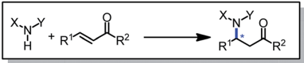
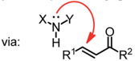
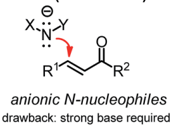
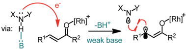
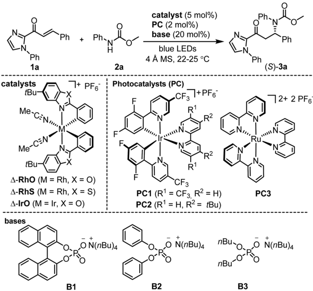
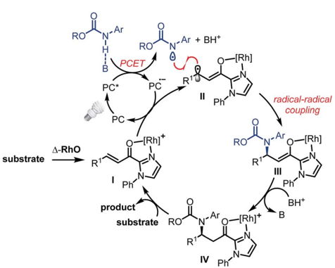
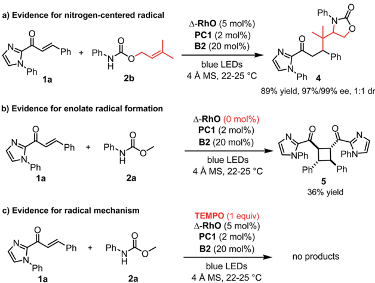
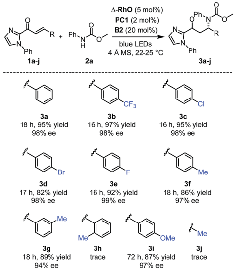
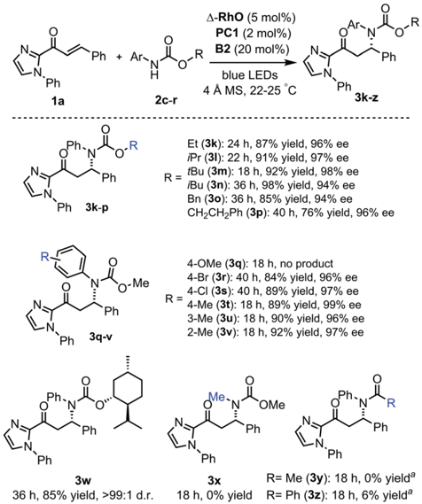
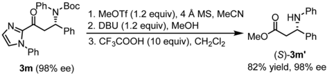

rS

Open Access /

*à

*à

(cc) EY

via:

## EDGE ARTICLE

R'

R2

R2

drawback: limited nucleophilicity drawback: strong base required

X.N Y

Cite this: Chem. Sci. , 2017, 8 , 5757

R'

R2

weak base

Received 5th May 2017 Accepted 15th June 2017

DOI: 10.1039/c7sc02031g

rsc.li/chemical-science

## Enantioselective catalytic b -amination through proton-coupled electron transfer followed by stereocontrolled radical -radical coupling †

Zijun Zhou, a Yanjun Li, a Bowen Han, a Lei Gong * a and Eric Meggers * ab

A new mechanistic approach for the catalytic, enantioselective conjugate addition of nitrogen-based nucleophiles to acceptor-substituted alkenes is reported, which is based on a visible light induced and phosphate base promoted transfer of a single electron from a nitrogen nucleophile to a catalyst-bound acceptor-substituted alkene, followed by a stereocontrolled C -N bond formation through stereocontrolled radical -radical coupling. Speci fi cally, N -aryl carbamates are added to the b -position of a , b -unsaturated 2acyl imidazoles using a visible light activated photoredox mediator in combination with a chiral-at-rhodium Lewis acid catalyst and a weak phosphate base, a ff ording new C -N bonds in a highly enantioselective fashion with enantioselectivities reaching up to 99% ee and &gt;99 : 1 dr for a menthol-derived carbamate. As an application, the straightforward synthesis of a chiral b -amino acid ester derivative is demonstrated.

Chiral amines featuring a stereogenic carbon connected to a nitrogen are important structural motifs in pharmaceuticals and natural products. 1 The development of methodology for the catalytic, asymmetric construction of C -N bonds is therefore of high relevance. 2 In this respect, the conjugate amination of readily available a , b -unsaturated carbonyl compounds is a principal strategy which provides useful b -amino carbonyl building blocks and exploits the intrinsic nucleophilicity of nitrogen lone pairs, with or without a prior deprotonation of the N -H group (Fig. 1). 3,4 However, the high nucleophilicity of such nitrogen reagents needs to be controlled carefully in order to prevent side reactions, catalyst deactivation, and uncatalyzed background reactions reducing the enantioselectivity. 1

Recently, Knowles introduced an elegant strategy making use of proton-coupled electron transfer (PCET) to convert N -H groups into nitrogen-centered radicals, whose high reactivities can then be exploited for radical additions to electron-rich double bonds or hydrogen atom transfer reactions. 5 -8 The activation of N -H containing compounds by PCET is attractive for its mild reaction conditions: it requires only a weak base, such as a phosphate, and the single electron transfer can be induced by visible light using a photoredox mediator. Unfortunately, the electron-de  cient nature of nitrogen-centered radicals renders their application to the direct radical b -amination of

a College of Chemistry and Chemical Engineering, Xiamen University, Xiamen 361005, P. R. China. E-mail: gongl@xmu.edu.cn

b Fachbereich Chemie, Philipps-Universit¨ at Marburg, Hans-Meerwein-Strasse 4, 35043 Marburg, Germany. E-mail: meggers@chemie.uni-marburg.de

† Electronic supplementary information (ESI) available. See DOI: 10.1039/c7sc02031g

unsaturated carbonyl compounds unfavorable, at least for intermolecular reactions. 9 -11

Herein, we introduce a novel strategy to interface photoinduced PCET with the catalytic, enantioselective conjugate amination of a , b -unsaturated carbonyl compounds. The mild and visible light induced enantioselective C -N bond formation is catalyzed by a previously developed chiral-at-rhodium Lewis acid 12 and couples N -aryl carbamates with a , b -unsaturated 2-acyl imidazoles with high yields and excellent enantioselectivities.

Fig. 1 Formation of C -N bonds by b -amination of readily available a , b -unsaturated carbonyl compounds. Scope limitations for the PCET-induced radical coupling reported in this study: X ¼ aryl, Y ¼ CO2R, R 1 ¼ aryl, R 2 ¼ 2-imidazolyl.

, 2017,

Chem. Sci.

8

R11

H

View Article Online View Journal  | View Issue

Open Access /

(cc) EY

Ph

Ph.

catalyst (5 mol%)

PC (2 mol%)

base (20 mol%)

Wecommencedourstudy by investigating the reaction of the a , b -unsaturated 2-acyl imidazole 1a with N -phenyl carbamic acid methyl ester 2a under PCET conditions 8 using the iridiumbased photoredox mediator PC1 13 and the weak phosphate base B1 , and combined this with the chiral-at-rhodium Lewis acid D -RhO 14 (Table 1). Encouragingly, upon irradiation with blue LEDs at room temperature for 16 hours we observed a conversion of 43% to the C -Nbond formation product ( S )-3a with 96% ee (entry 1). Changing the solvent from CHCl3 to CH2Cl2 and slightly elongating the reaction time provided full conversion while retaining the high enantioselectivity (entry 2). The

CF3

Table 1 Optimization of the reaction conditions a

ON(nBu)4

B1

|   Entry | Catalyst   | Base   | PC   | h n   | Solvent   | Yield b (%)   | ee c (%)   |
|---------|------------|--------|------|-------|-----------|---------------|------------|
|       1 | D - RhO    | B1     | PC1  | Light | CHCl 3    | 43            | 96         |
|       2 | D - RhO    | B1     | PC1  | Light | CH 2 Cl 2 | Quant.        | 96         |
|       3 | D - RhO    | B2     | PC1  | Light | CH 2 Cl 2 | Quant.        | 98         |
|       4 | D - RhO    | B3     | PC1  | Light | CH 2 Cl 2 | 24            | 74         |
|       5 | D - RhO    | B2     | PC2  | Light | CH 2 Cl 2 | 41            | 97         |
|       6 | D - RhO    | B2     | PC3  | Light | CH 2 Cl 2 | 34            | 98         |
|       7 | D - RhS    | B2     | PC1  | Light | CH 2 Cl 2 | <10           | n.d. d     |
|       8 | D - IrO    | B2     | PC1  | Light | CH 2 Cl 2 | Trace         | n.d. d     |
|       9 | None       | B2     | PC1  | Light | CH 2 Cl 2 | 0 e           | n.a. f     |
|      10 | D - RhO    | None   | PC1  | Light | CH 2 Cl 2 | 8             | 93         |
|      11 | D - RhO    | B2     | PC1  | Dark  | CH 2 Cl 2 | 0             | n.a. f     |
|      12 | D - RhO    | B2     | None | Light | CH 2 Cl 2 | 39            | 98         |

a Reaction conditions: a , b -unsaturated acyl imidazole 1a (0.10 mmol), carbamate 2a (0.12 mmol), metal catalyst (0.005 mmol), PC1-3 (0.002 mmol), B1-3 (0.02 mmol), 4 ˚ A molecular sieves (MS) (10 mg), and solvent (1.0 mL). The reactions were irradiated with blue LEDs (24 + 36 W), except for entry 11. b Yields determined by crude 1 H NMR analysis. c Ee values determined by HPLC analysis on a chiral stationary phase. d Not determined. e Cyclobutane side product formed. f Not applicable.

|

Ph-N

PC3

enantiomeric excess could be further improved to 98% ee upon optimization of the phosphate base ( B2 and B3 , entries 3 and 4). Examining other photoredox mediators provided inferior results (entries 5 and 6) and it is also worth noting that the related chiral-at-metal catalysts D -RhS 15 (entry 7) and D -IrO 16 (entry 8) are not suitable for this method. Meanwhile, control experiments veri  ed that D -RhO , a phosphate base ( B2 ), and blue light are all essential for product formation (entries 9 -11). Interestingly, product is formed with high enantioselectivity even in the absence of the photoredox mediator, but the

a) Evidence for nitrogen-centered radical

H

RO

N-Ar + BH+

A-RhO (5 mol%)

PC1 (2 mol%)

conversion is more sluggish and cannot be brought to full completion even a  er elongated reaction times (entry 12). PCET

(cc) EY

Open Access /

"Ph substrate

The proposed mechanism is shown in Fig. 2. The photoactivated photoredox mediator (PC * ) initiates a proton-coupled electron transfer (PCET) involving the Brønsted-base-activated carbamate to generate a nitrogen-centered radical and a reduced photoredox mediator (PC c  ), which in turn transfers an electron to the Rh-coordinated substrate ( I / II ). Thus, the photoredox mediator serves as a single electron shuttle from the carbamate to the Rh-bound a , b -unsaturated 2-acyl imidazole, providing an electron de  cient carbamoyl N -radical and the persistent electron rich rhodium enolate radical intermediate II , 17,18 which subsequently recombines to the rhodium enolate intermediate III . 19 A  er protonation by the protonated phosphate base ( III / IV ), product release, and coordination of new

Open Access Article. Published on 15 June 2017. Downloaded on 6/420 10:29 AM.

1a

2a

-[Rh]

blue LEDs

Fig. 2 Proposed mechanism.

substrate ( IV / I ), a new catalytic cycle can be initiated. The function of the rhodium catalyst in this mechanism is twofold. First, the established N , O -bidentate coordination 12 to the unsaturated 2-acyl imidazole facilitates the reduction of the Rhbound substrate. Secondly, the chiral Lewis acid controls the stereochemistry of the radical -radical coupling by providing a high asymmetric induction. Note that in this radical -radical coupling step the stereocontrol occurs through controlling the reaction of a catalyst-bound prochiral carbon-centered radical. 20

A number of control experiments back this mechanism. First, visible light, rhodium catalyst, and phosphate base are all required for product formation. Second, intermediate N -centered radical formation was veri  ed by trapping the nitrogen-centered radical by an intramolecular radical addition to an alkene ( 2b ) followed by reaction of the formed carboncentered radical with the unsaturated 2-acyl imidazole 1a , a ff ording the product 4 with 89% yield and 97% ee (Fig. 3a). Third, in the absence of any Rh-catalyst, the cyclobutane complex 5 is formed as the major product in 36% yield. This reaction is analogous to Yoon's reported photoredox-mediated [2 + 2] cycloaddition involving unsaturated 2-acyl imidazoles which was proposed to proceed through the single electron reduction of the unsaturated 2-acyl imidazoles and supports the involvement of the Rh-enolate radical intermediate II in our pathway. 18,21 Finally, when we added one equivalent of TEMPO to the reaction, no product was formed which is indicative of a radical mechanism.

Alternative mechanistic scenarios through the addition of N -carbamoyl radicals or carbamate anions to the rhodiumcoordinated a , b -unsaturated 2-acyl imidazoles are unlikely and are brie  y discussed. N -centered carbamoyl and amidyl radicals are classi  ed as electrophilic radicals which prefer to react with electron rich alkenes. 11,22,23 Rhodium coordination to

Fig. 3 Control experiments.

4Å MS, 22-25 °C

PhiN

Open Access /

(cc) EY

N

R.

N

Ph

Ph

Ph

+

Ar-

R

Ph- oR

Ph

R

the a , b -unsaturated 2-acyl imidazole substrates would further decrease the radical addition rate and is therefore not consistent with the observed high enantioselectivity under rhodium catalysis. On the other hand, a mechanism through the conjugate addition of carbamate anions is unlikely due to the requirement for light activation and the experimental evidence for the intermediate formation of a carbamoyl radical (Fig. 3a). As an additional control experiment we performed the standard reaction in the presence of the strong base sodium ethoxide instead of the weak phosphate base but no product was formed in the absence of light (see ESI for details † ). Furthermore, the reduction of an intermediate carbamoyl radical to the anion (by the reduced photoredox mediator) followed by a conjugate addition is unlikely because the reaction also proceeds in the absence of an additional photoredox mediator with reduced yields but identical enantioselectivity (Table 1, entry 12).

This proposed mechanism resembles some conceptional similarity with Melchiorre's recently reported visible-lightexcited enantioselective b -alkylation of a , b -unsaturated aldehydes catalyzed by a chiral secondary amine. 20 g A photoactivated conjugated iminium ion intermediate oxidizes the alkylsilane co-substrate by single electron transfer followed by a radical -radical recombination. The iminium ion in Melchiorre's system resembles our rhodium-coordinated a , b -unsaturated 2-acyl imidazole (intermediate I ), both of which serve as in situ assembled chiral single electron acceptors, accepting the single electron from a cosubstrate, followed by a stereocontrolled radical -radical recombination. Other photoactivated catalytic asymmetric reactions in which single electrons are transferred between a substrate-bound catalyst and a co-substrate have been reported. 20

Fig. 4 Reaction scope with regards to 2-acyl imidazoles.

A-RhO (5 mol%)

PC1 (2 mol%)

4-RhO (5 mol%)

PC1 (2 mol%)

B2 (20 mol%)

B2 (20 mol%)

N.

N

N

Ph.

Next, a  er having investigated the mechanism of this novel catalytic, enantioselective C -N bond formation, we evaluated the scope (Fig. 4). The visible-light-induced enantioselective b -amination of 2a to electron-de  cient alkenes provided the C -N bond formation products ( 3b -g ) with 82 -97% yields and 94 -99% ee. Di ff erent substituted aromatic moieties with respect to steric and electronic e ff ects are well tolerated. With an electrondonating methoxy substituted aromatic moiety (product 3i ), the reaction time needed to be extended to 72 hours in order to achieve a high yield (87%) and high enantioselectivity (97% ee). However, when we applied this b -amination to a substrate with an ortho -methylated phenyl group, only traces of the product 3h were detected. Apparently, the methyl group prevents a proper conjugation of the entire p -system, which suppresses the entire PCET mechanism. This also explains the requirement for an aromatic moiety in b -position of the a , b -unsaturated 2-acyl imidazole substrates as the formation of the product 3j failed.

The scope of this reaction with respect to substituted carbamates is outlined in Fig. 5. Di ff erent O-substituents such as ethyl, isopropyl, tert -butyl, and isobutyl (products 3k -n ) in the ester protected group are tolerated and provide high yields (87 -98%) with excellent enantioselectivities (94 -98% ee). Carbamates with O -benzyl or an O -phenethyl group (products 3o , p ) reacted more slowly. The N -para -methoxyphenyl (PMP) protection group was not tolerated and did not provide the b -amination product 3q but instead a dimer of the 2-acyl imidazole substrate. However, methyl and halogen substituents at the N -phenyl moiety (products 3r -v ) are well tolerated with b -

Fig. 5 Reaction scope with respect to carbamates. a No desired product formed but instead a cyclobutane side product.

Fig. 6 Follow-up chemistry with a cross-coupling reaction product 3m .

amination yields of 84 -92% and 96 -99% ee. Also, a mentholderived carbamate provided the b -amination product 3w in 85% yield with &gt;99 : 1 d.r. As a limitation, the carbamate relies on N -aryl substituents ( 3x ), and amides do not or almost not provide the desired products ( 3y , z ) but instead the cyclobutane complex 5 as a side product.

Finally, the conversion of the typical product 3m to a useful synthetic building block is illustrated in Fig. 6. Removal of the N -phenylimidazole moiety smoothly proceeded to provide the intermediate ester following an established procedure. 24 Then, it was dissolved in CH2Cl2 and tri  uoroacetic acid (10 equivalents) was added to cleave the Boc-protection group and subsequently form 1,2-aminoester derivative ( S )-3m 0 , which was also used to assign the absolute con  guration of the formed products in this study. 25

In conclusion, we have introduced a novel strategy to establish a C -N bond in b -position of an a , b -unsaturated carbonyl compound in a catalytic, enantioselective fashion via photoinduced proton-coupled electron transfer, followed by a highly stereoselective radical -radical recombination controlled by a chiral rhodium-enolate radical intermediate. This method permits the catalytic, enantioselective synthesis of chiral amines without the necessity for a strong base or a highly nucleophilic nitrogen reagent. Although there are clear restrictions with respect to the substrate scope, within these limitations the obtained yields and enantioselectivities are excellent. Future work will need to address the currently limited scope.

## Experimental section

Representative asymmetric catalysis: to a solution of a , b -unsaturated 2-acyl imidazole 1a (32.90 mg, 0.12 mmol) in fresh distilled anhydrous CH2Cl2 (1.0 mL) was added rhodium catalyst D -RhO (4.15 mg, 0.005 mmol), PC1 (2.29 mg, 0.002 mmol), B2 (9.83 mg, 0.02 mmol), 4 ˚ A MS (10.0 mg) in a 10 mL Schlenk tube and the resulting solution was stirred at room temperature for 15 min. Then, tert -butyl N -phenylcarbamate (19.30 mg, 0.10 mmol) was added and the resulting solution was purged for 15 min with argon. The reaction was stirred under argon in a thermostatic cabinet under irradiation with blue LEDs (24 + 36 W), providing a reaction temperature of 22 -25  C. The Schlenk tube was kept at a distance of approximately 3 cm from the light source. The reaction was monitored by TLC analysis. A  er 18 hours full conversion was reached and the mixture was diluted with CH2Cl2 and puri  ed by  ash chromatography on silica gel (EtOAc/ n -hexane ¼ 1/5 to 1/3) to a ff ord the product ( S )-3m (43 mg, yield: 92%) as a white solid. The enantiomeric excess of 98% ee was established by HPLC analysis using a Daicel

Chiralpak IC column (250 -4.6 mm) under the following conditions: UV-detection at 254 nm, mobile phase n -hexane/ isopropanol ¼ 90 : 10,  ow rate 1.0 mL min  1 , column temperature of 25  C. Retention times: t r(minor) ¼ 17.44 min, t r(major) ¼ 26.98 min. 1 H NMR (500 MHz, CD2Cl2): d (ppm) 7.47 -7.37 (m, 3H), 7.30 -7.14 (m, 12H), 6.89 -6.76 (m, 2H), 6.10 (t, J ¼ 7.5 Hz, 1H), 3.86 (dd, J ¼ 15.6, 6.7 Hz, 1H), 3.55 (dd, J ¼ 15.6, 8.3 Hz, 1H), 1.30 (s, 9H). 13 C NMR (126 MHz, CD2Cl2): d (ppm) 188.2, 154.5, 142.7, 140.2, 138.2, 129.7, 129.3, 128.6, 128.3, 128.0, 127.9, 127.8, 127.2, 127.0, 126.5, 125.8, 125.6, 79.8, 56.8, 41.6, 27.7. IR (  lm): n (cm  1 ) 2963, 2920, 2859, 1692, 1404, 1260, 1093, 1020, 829, 699, 559. HRMS (ESI, m / z ) calcd for C29H29N3NaO3 (M + Na) + : 490.2101, found: 490.2110.

## Acknowledgements

We are grateful for  nancial support from the National Natural Science Foundation of P. R. China (grant no. 21572184 and 21472154) and the Fundamental Research Funds for the Central Universities (grant no. 20720160027).

## References

- 1 For reviews on di ff erent aspects of bioactive chiral amines, see: ( a ) H.-J. Federsel, M. Hedberg, F. R. Qvarnstroam, M. P. T. Sjoegren and W. Tian, Acc. Chem. Res. , 2007, 40 , 1377 -1384; ( b ) H.-J. Federsel, Drug News Perspect. , 2008, 21 , 193 -199; ( c ) R. Edupuganti and F. A. Davis, Org. Biomol. Chem. , 2012, 10 , 5021 -5031; ( d ) S. Jones and C. J. A. Warner, Org. Biomol. Chem. , 2012, 10 , 2189 -2200; ( e ) M. A. T. Blaskovich, J. Med. Chem. , 2016, 59 , 10807 -10836; ( f ) A. K. Mailyan, J. A. Eickho ff , A. S. Minakova, Z.-H. Gu, P. Lu and A. Zakarian, Chem. Rev. , 2016, 116 , 4441 -4557.
- 2 Chiral Amine Synthesis: Methods, Developments and Applications , ed. T. C. Nugent, Wiley-VCH, Weinheim, 2010. 3 For reviews on catalytic asymmetric aza-Michael additions, see: ( a ) L.-W. Xu and C.-G. Xia, Eur. J. Org. Chem. , 2005, 633 -639; ( b ) P. R. Krishna, A. Sreeshailam and R. Srinivas, Tetrahedron , 2009, 65 , 9657 -9672; ( c ) D. Enders, C. Wang and J. X. Liebich, Chem. -Eur. J. , 2009, 15 , 11058 -11076; ( d ) S. Kobayashi, Y. Mori, J. S. Fossey and M. M. Salter, Chem. Rev. , 2011, 111 , 2626 -2704; ( e ) M. S´ anchez-Rosell´ o, J. L. Ace ˜ na, A. Sim´ on-Fuentes and C. del Pozo, Chem. Soc. Rev. , 2014, 43 , 7430 -7453; ( f ) J. Gmach, Ł . Joachimiak and K. M. B ł a ˙ zewska, Synthesis , 2016, 48 , 2681 -2704.
- 4 For selected reviews and examples of biologically active chiral b -amino carbonyl compounds, see: ( a ) G. Cardillo and C. Tomassini, Chem. Soc. Rev. , 1996, 25 , 117 -128; ( b ) E. Juaristi and H. Lopez-Ruiz, Curr. Med. Chem. , 1996, 6 , 983 -1004; ( c ) W. J. Drury, D. Ferraris, C. Cox, B. Young and T. Leckta, J. Am. Chem. Soc. , 1998, 120 , 11006 -11007; ( d ) D. L. Steer, R. A. Lew, P. Perlmutter, A. I. Smith and M.-I. Aguilar, Curr. Med. Chem. , 2002, 9 , 811 -822; ( e ) A. Kuhl, M. G. Hahn, M. Dumic and J. Mittendorf, Amino Acids , 2005, 29 , 89 -100; ( f ) V. Farina, J. T. Reeves, C. H. Senanayake and J. J. Song, Chem. Rev. , 2006, 106 ,

- 2734 -2793; ( g ) M. S. Taylor and E. N. Jacobsen, Angew. Chem., Int. Ed. , 2006, 45 , 1520 -1543; ( h ) D. H. Paull, C. J. Abraham, M. T. Scerba, E. A. Danforth and T. Lectka, Acc. Chem. Res. , 2008, 41 , 655 -663; ( i ) M. Bart´ ok, Chem. Rev. , 2010, 110 , 1663 -1705; ( j ) L. Kiss and F. Fulop, Chem. Rev. , 2014, 114 , 1116 -1169; ( k ) C. Cabrele, T. A. Martinek, O. Reiser and Ł . Berlicki, J. Med. Chem. , 2014, 57 , 9718 -9739; ( l ) B. Yu, D.-Q. Yu and H.-M. Liu, Eur. J. Med. Chem. , 2015, 97 , 673 -698; ( m ) M. Kaur, M. Singh, N. Chadha and O. Silakari, Eur. J. Med. Chem. , 2016, 123 , 858 -894.
- 5 ( a ) R. Knowles and H. Yayla, Synlett , 2014, 25 , 2819 -2826; ( b ) E. C. Gentry and R. R. Knowles, Acc. Chem. Res. , 2016, 49 , 1546 -1556; ( c ) L. Q. Nguyen and R. R. Knowles, ACS Catal. , 2016, 6 , 2894 -2903.
- 6 For recent reviews and accounts on PCET, see: ( a ) O. S. Wenger, Acc. Chem. Res. , 2013, 46 , 1517 -1526; ( b ) M. T. M. Koper, Chem. Sci. , 2013, 4 , 2710 -2723; ( c ) B. A. Barry, Nat. Chem. , 2014, 6 , 376 -377; ( d ) B. H. Solis and S. Hammes-Schi ff er, Inorg. Chem. , 2014, 53 , 6427 -6443; ( e ) A. Migliore, N. F. Polizzi, M. J. Therien and D. N. Beratan, Chem. Rev. , 2014, 114 , 3381 -3465; ( f ) B. H. Solis and S. Hammes-Schi ff er, Inorg. Chem. , 2014, 53 , 6427 -6443; ( g ) I. Siewert, Chem. -Eur. J. , 2015, 21 , 15078 -15091; ( h ) S. Hammes-Schi ff er, J. Am. Chem. Soc. , 2015, 137 , 8860 -8871; ( i ) H. Kisch, Acc. Chem. Res. , 2017, 50 , 1002 -1010; ( j ) N. Ho ff mann, Eur. J. Org. Chem. , 2017, 1982 -1992.
- 7 For the electrochemical generation of nitrogen-centered radicals, see: ( a ) H.-C. Xu and K. D. Moeller, J. Am. Chem. Soc. , 2008, 130 , 13542 -13543; ( b ) H.-C. Xu, J. M. Campbell and K. D. Moeller, J. Org. Chem. , 2014, 79 , 379 -391; ( c ) F. Xu, L. Zhu, S. B. Zhu, X. M. Yan and H.-C. Xu, Chem. -Eur. J. , 2014, 20 , 12740 -12744; ( d ) L. Zhu, P. Xiong, Z. Y. Mao, Y. H. Wang, X. Yan, X. Lu and H.-C. Xu, Angew. Chem., Int. Ed. , 2016, 55 , 2226 -2229; ( e ) H.-B. Zhao, Z.-W. Hou, Z.-J. Liu, Z.-F. Zhou, J. Song and H.-C. Xu, Angew. Chem., Int. Ed. , 2017, 56 , 587 -590; ( f ) P. Xiong, H.-H. Xu and H.-C. Xu, J. Am. Chem. Soc. , 2017, 139 , 2956 -2959.
- 8 For visible-light-induced PCET for the generation of nitrogen-centered radicals, see: ( a ) G. J. Choi and R. R. Knowles, J. Am. Chem. Soc. , 2015, 137 , 9226 -9229; ( b ) D. C. Miller, G. J. Choi, H. S. Orbe and R. R. Knowles, J. Am. Chem. Soc. , 2015, 137 , 13492 -13495; ( c ) G. J. Choi, Q. Zhu, D. C. Miller, C. J. Gu and R. R. Knowles, Nature , 2016, 539 , 268 -271; ( d ) J. C. K. Chu and T. Rovis, Nature , 2016, 539 , 272 -275.
- 9 For reviews on di ff erent aspects of nitrogen-centered radicals, see: ( a ) S. Z. Zard, Chem. Soc. Rev. , 2008, 37 , 1603 -1618; ( b ) M. Minozzi, D. Nanni and P. Spagnolo, Chem. -Eur. J. , 2009, 15 , 7830 -7840; ( c ) M. Heinrich and S. H¨ o  ing, Synthesis , 2010, 173 -189; ( d ) B. Quiclet-Sire and S. Z. Zard, Beilstein J. Org. Chem. , 2013, 9 , 557 -576; ( e ) J. C. Walton, Acc. Chem. Res. , 2014, 47 , 1406 -1416; ( f ) J. Hioe, D. ˇ Sakic, V. Vr ˇ cek and H. Zipse, Org. Biomol. Chem. , 2015, 13 , 157 -169; ( g ) J.-R. Chen, X.-Q. Hu, L.-Q. Lu and W.-J. Xiao, Chem.

|

- Soc. Rev. , 2016, 45 , 2044 -2056; ( h ) T. Xiong and Q. Zhang, Chem. Soc. Rev. , 2016, 45 , 3069 -3087.
- 10 For recent examples on using photoredox chemistry to generate nitrogen-centered radicals, see: ( a ) L. J. Allen, P. J. Cabrera, M. Lee and M. S. Sanford, J. Am. Chem. Soc. , 2014, 136 , 5607 -5610; ( b ) X.-Q. Hu, J.-R. Chen, Q. Wei, F.-L. Liu, Q.-H. Deng, A. M. Beauchemin and W.-J. Xiao, Angew. Chem., Int. Ed. , 2014, 53 , 12163 -12167; ( c ) T. W. Greulich, C. G. Daniliuc and A. Studer, Org. Lett. , 2015, 17 , 254 -257; ( d ) K. Miyazawa, T. Koike and M. Akita, Chem. -Eur. J. , 2015, 21 , 11677 -11680; ( e ) J. Davies, S. G. Booth, S. Essa  , R. A. W. Dryfe and D. Leonori, Angew. Chem., Int. Ed. , 2015, 54 , 14017 -14021; ( f ) Q.-Q. Zhao, X.-Q. Hu, M.-N. Yang, J.-R. Chen and W.-J. Xiao, Chem. Commun. , 2016, 52 , 12749 -12752; ( g ) J. Davies, T. D. Svejstrup, D. F. Reina, N. S. Sheikh and D. Leonori, J. Am. Chem. Soc. , 2016, 138 , 8092 -8095; ( h ) X.-Q. Hu, J. Chen, J.-R. Chen, D.-M. Yan and W.-J. Xiao, Chem. -Eur. J. , 2016, 22 , 14141 -14146; ( i ) K. Tong, X. Liu, Y. Zhang and S. Yu, Chem. -Eur. J. , 2016, 22 , 15669 -15673; ( j ) X.-Q. Hu, X. Qi, J.-R. Chen, Q.-Q. Zhao, Q. Wei, Y. Lan and W.-J. Xiao, Nat. Commun. , 2016, 7 , 11188; ( k ) Y. Zhao, B. Huang, C. Yang, B. Li, B. Gou and W. Xia, ACS Catal. , 2017, 7 , 2446 -2451; ( l ) D. F. Reina, E. M. Dauncey, S. P. Morcillo, T. D. Svejstrup, M. V. Popescu, J. J. Douglas, N. S. Sheikh and D. Leonori, Eur. J. Org. Chem. , 2017,
- 2108 -2111.
- 11 Nitrogen-centered radicals containing additional electronwithdrawing substituents prefer to react with electron-rich alkenes in intermolecular reactions. For recent examples, see: ( a ) G. Cecere, C. M. K¨ onig, J. L. Alleva and D. W. C. MacMillan, J. Am. Chem. Soc. , 2013, 135 , 11521 -11524; ( b ) X. Shen, K. Harms, M. Marsch and E. Meggers, Chem. -Eur. J. , 2016, 22 , 9102 -9105; ( c ) X. Huang, R. D. Webster, K. Harms and E. Meggers, J. Am. Chem. Soc. , 2016, 138 , 12636 -12642.
- 12 L. Zhang and E. Meggers, Acc. Chem. Res. , 2017, 50 , 320 -330. 13 For selected reviews and accounts on photoredox catalysis with transition metal based photoredox catalysts, see: ( a ) T. Koike and M. Akita, Inorg. Chem. Front. , 2014, 1 , 562 -576; ( b ) K. L. Skubi, T. R. Blum and T. P. Yoon, Chem. Rev. , 2016, 116 , 10035 -10074; ( c ) J. C. Tellis, C. B. Kelly, D. N. Primer, M. Jou ff roy, N. R. Patel and G. A. Molander, Acc. Chem. Res. , 2016, 49 , 1429 -1439; ( d ) D. Staveness, I. Bosque and C. R. J. Stephenson, Acc. Chem. Res. , 2016, 49 , 2295 -2306; ( e ) M. H. Shaw, J. Twilton and D. W. C. MacMillan, J. Org. Chem. , 2016, 81 , 6898 -6926.
- 14 C. Wang, L.-A. Chen, H. Huo, X. Shen, K. Harms, L. Gong and E. Meggers, Chem. Sci. , 2015, 6 , 1094 -1100.
- 15 J. Ma, X. Shen, K. Harms and E. Meggers, Dalton Trans. , 2016, 45 , 8320 -8323.
- 16 H. Huo, C. Fu, K. Harms and E. Meggers, J. Am. Chem. Soc. , 2014, 136 , 2990 -2993.
- 17 For the persistent radical e ff ect, see: A. Studer, Chem. -Eur. J. , 2001, 7 , 1159 -1164.
- 18 The stabilization of enolate radical anions derived from a , b -unsaturated 2-acyl imidazoles through Lewis acid

- coordination has been reported. See: E. L. Tyson, E. P. Farney and T. P. Yoon, Org. Lett. , 2012, 14 , 1110 -1113.
- 19 In the absence of a photoredox mediator, apparently the photoexcited Rh-substrate complex intermediate I is directly initiating the electron transfer, albeit less e ffi ciently (see Table 1, entry 12).
- 20 For the stereocontrolled chemistry of photochemically generated prochiral radicals, see: ( a ) M. T. Pirnot, D. A. Rankic, D. B. C. Martin and D. W. C. MacMillan, Science , 2013, 339 , 1593 -1596; ( b ) L. J. Rono, H. G. Yayla, D. Y. Wang, M. F. Armstrong and R. R. Knowles, J. Am. Chem. Soc. , 2013, 135 , 17735 -17738; ( c ) J. Du, K. L. Skubi, D. M. Schultz and T. P. Yoon, Science , 2014, 344 , 392 -396; ( d ) D. Uraguchi, N. Kinoshita, T. Kizu and T. Ooi, J. Am. Chem. Soc. , 2015, 137 , 13768 -13771; ( e ) C. Wang, J. Qin, X. Shen, R. Riedel, K. Harms and E. Meggers, Angew. Chem., Int. Ed. , 2016, 55 , 685 -688; ( f ) T. Kizu, D. Uraguchi and T. Ooi, J. Org. Chem. , 2016, 81 , 6953 -6958; ( g ) M. Silvi, C. Verrier, Y. P. Rey, L. Buzzetti and P. Melchiorre, Nat. Chem. , 2017, DOI: 10.1038/nchem.2748.
- 21 ( a ) M. A. Ischay, M. E. Anzovino, J. Du and T. P. Yoon, J. Am. Chem. Soc. , 2008, 130 , 12886 -12887; ( b ) J. Du and T. P. Yoon,
- J. Am. Chem. Soc. , 2009, 131 , 14604 -14605; ( c ) M. A. Ischay, M. S. Ament and T. P. Yoon, Chem. Sci. , 2012, 3 , 2807 -2811. See also ref. 18 and 20c.
- 22 J. H. Horner, O. M. Musa, A. Bouvier and M. Newcomb, J. Am. Chem. Soc. , 1998, 120 , 7738 -7748.
- 23 For a failed intramolecular addition of carbamoyl nitrogencentered radical to an acceptor-substituted alkene, see for example: K. C. Nicolaou, P. S. Baran, R. Kranich, Y.-L. Zhong, K. Sugita and N. Zou, Angew. Chem., Int. Ed. , 2001, 40 , 202 -206.
- 24 ( a ) D. A. Evans, K. R. Fandrick and H.-J. Song, J. Am. Chem. Soc. , 2005, 127 , 8942 -8945; ( b ) D. A. Evans and K. R. Fandrick, Org. Lett. , 2006, 8 , 2249 -2252; ( c ) D. A. Evans, H.-J. Song and K. R. Fandrick, Org. Lett. , 2006, 8 , 3351 -3354; ( d ) D. A. Evans, K. R. Fandrick, H.-J. Song, K. A. Scheidt and R. Xu, J. Am. Chem. Soc. , 2007, 129 , 10029 -10032.
- 25 H.-J. Zheng, W.-B. Chen, Z.-J. Wu, J.-G. Deng, W.-Q. Lin, W.-C. Yuan and X.-M. Zhang, Chem. -Eur. J. , 2008, 14 , 9864 -9867.