Contents lists available at ScienceDirect

## Tetrahedron Green Chem

journal homepage: www.journals.elsevier.com/tetrahedron-green-chem

## Photoredox/HAT dual-catalyzed carboxylation of benzyl chlorides with CO2 using thiophenolate and formate as reductants

Zhengning Fan a , Yaping Yi a , Chanjuan Xi

a,b,*

- a MOE Key Laboratory of Bioorganic Phosphorus Chemistry &amp; Chemical Biology, Department of Chemistry, Tsinghua University, Beijing 100084, China

b State Key Laboratory of Elemento-Organic Chemistry, Nankai University, Tianjin 300071, China

A R T I C L E  I N F O

Keywords:

Carbon dioxide: carboxylation: photoredox catalysis

## 1. Introduction

Carbon dioxide (CO2) is regarded as a cheap, atoxic, and abundant C1  synthon  [1]  when  compared  with  hazardous  CO  or  phosgene. Considerable efforts have been devoted to the chemical utilization of CO2, providing bulk chemicals at industrial level [2]. On the other hand, CO2 could also be evaluated as a source to construct new C -C bond with organic molecules, thus giving a route toward the synthesis of carboxylic acids [3]. Due to the chemical inertness of CO2, initial attempts used Grignard  or  organic  lithium  reagents  as  strong  nucleophiles,  which suffer from site-selectivity issues and poor functional group tolerance. Since these organometallic reagents have to be prepared from organic halides, it would be better to use halides directly as substrates. As both species are electrophilic, an external reductant is compulsory to reach this  cross-electrophile  coupling  reaction.  With  the  development  of transition-metal-catalysis,  reductive  carboxylation  of  various  organic (pseudo)halides have been well-developed in the past decades by using metal (Mg, Zn, Mn, etc.) as the reducing agent [4]. While the reaction conditions are generally milder, generation of stoichiometric metal salts as side products remains to be solved. To avoid this, development of new methods using greener reductants is desirable. In 2017, Iwasawa and co-workers reported a Pd-catalyzed hydrocarboxylation of styrenes with formate  as  the  reductant  [5].  Afterwards,  Hazari  and  co-workers managed  to  improve  the  Ni-catalyzed  carboxylation  condition  of phenyl chlorides  by  using  an  organic  reductant  [6].  During  the  past decade, photoredox catalysis [7] has been developed as a powerful tool in organic synthesis through consecutive single electron transfer (SET),

A B S T R A C T

Carboxylation of benzyl chlorides with CO2  has been developed with photoredox/HAT dual-catalysis. The reaction could be conducted at room temperature with blue LED light source. Potassium formate (HCO2K) is used as a green reductant and a catalytic amount of sodium thiophenolate (PhSNa) is applied as the HAT reagent. Strongly reductive carbon dioxide radical anion (CO2 ‧ -) is produced to promote the cleavage of C -Cl bond.

providing a milder and more sustainable way for carboxylation reactions [8], where the use of metallic reductants is replaced by organic amines. Recently, investigation of transition-metal-free photo-induced carboxylation of benzyl (pseudo)halides is accomplished by Yu and co-workers (Scheme 1, a) [9]. The synthesized phenylacetic acid derivatives are of much  interests  as  they  are  frequently  found  in  pharmaceutical  or bio-active molecules. Despite the efforts, imines are produced as side products instead of metal salts. Nevertheless, it might be  difficult to break stronger C -(pseudo)halide bonds by SET without the assistance of transition-metal [10]. Thus, exploring greener and stronger reductants in photo-induced carboxylation of organic halides is still at necessary.

CO2  radical anion, with a highly negative reduction potential (E1/ 2(CO2/CO2 · ) = 2.21 V vs SCE), is regarded as a strong reductant [11]. However,  it  is  rather  difficult  to  generate  the  radical  anion  with visible-light  irradiation  [12],  while  some  reports  realized  this  with UV-light [13]. In 2020, Li ' s group reported the generation of CO2 radical anion by the combination of 1,4-diazabicyclo [2.2.2]octane (DABCO) and  formate  through  hydrogen  atom  transfer  (HAT)  [14].  It  could facilitate the sp 2 C -halide bond cleavage through SET to form phenyl radicals. Then, Yu ' s  group has reported the carboxylation of sp 3 C -F bonds using triethylsilane as the reductant (Scheme 1, b) [15]. Formate is  in-situ generated from the silane and cesium carbonate as the real reductant.  Yu ' s group also reported the carboxylation of polyfluoroarenes [16]. Our group realized the carboxylation of benzyl bromides using the in-situ generated CO2  radical anion from formate and DABCO (Scheme 1, c) [17]. For these protocols, the use of at least 50 mol % DABCO is compulsory to guarantee a promising yield. However, we

* Corresponding author. MOE Key Laboratory of Bioorganic Phosphorus Chemistry &amp; Chemical Biology, Department of Chemistry, Tsinghua University, Beijing 100084, China.

E-mail address: cjxi@tsinghua.edu.cn (C. Xi).

## [https://doi.org/10.1016/j.tgchem.2023.100028](https://doi.org/10.1016/j.tgchem.2023.100028)

Z. Fan et al.

Scheme 1. Carboxylation of benzyl C -X bonds with non-metal reductants.

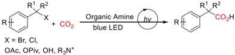

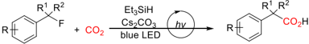

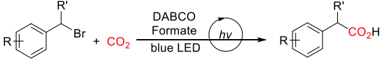

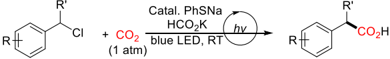

found that the benzyl halides and DABCO might form benzyl ammonium salts as potential reaction intermediates, and there is a sharp decrease in yield when using chlorides instead of bromides. In addition, substrates without  electron-withdrawing  groups  generally  give  unsatisfactory yields. Thus, we are looking forward to develop a protocol, which is applicable  to  more  inert C -Cl  bond  and  the  HAT  reagent  could  be reduced to catalytic amount. Herein, we report a carboxylation of benzyl chlorides by photoredox/HAT dual catalysis (Scheme 1, d). A catalytic loading  of  sodium  thiophenolate  [18]  is  adopted  as  the  reductive quencher and HAT reagent. A series of phenylacetic acids with different functional  groups,  including  some  drugs  are  synthesized  in  good  to moderate yields.

## 2. Experimental

## 2.1. Procedure for the carboxylation of benzyl chlorides

To a 25 mL sealed tube was added Ir (dtbbpy) (ppy2)PF6  (1 mol%, 0.002 mmol, 1.8 mg), PhSNa (5 mol%, 0.01 mmol, 1.3 mg), HCO2K (2 equiv., 0.4 mmol, 33.6 mg) and the corresponding benzyl chloride 1 if it was solid (0.2 mmol). The tube was degassed by vacuum evacuation and back-filled with CO2  for three times. Benzyl chloride 1 was added if it was liquid. Then anhydrous DMSO (2 mL) was added into the tube via syringe. The reaction tube was sealed and stirred at room temperature under blue LEDs (5 W) for 18 h with a cooler fan. After completion of the reaction, it was carefully quenched with 2 N HCl and the mixture was extracted 3 times with CH2Cl2. The combined organic layers were dried over anhydrous Na2SO4 and concentrated under reduced pressure. The residual was purified by flash chromatography on silica gel to afford the acids 2 .

## 3. Results and discussion

We began our study with 4-chloromethylbiphenyl ( 1a ) as the model substrate. After systematic reaction condition optimization, we found that when using Ir (dtbbpy) (ppy)2PF6  [E1/2(PC*/PC · ) = -1.51 V vs SCE] as the photocatalyst, sodium thiophenolate ( HAT1 ) as the reductive  quencher  and  HAT  reagent,  potassium  formate  as  the  terminal reducing agent, the corresponding phenylacetic acid 2a could be obtained in 80% NMR yield after blue LED irradiation for 18 h in dimethyl sulfoxide (DMSO) (Table 1, entry 1). Compared to the previous method, where sub-stoichiometric DABCO is needed, our protocol only requires 5% loading of sodium thiophenolate. Using Ir [dF(CF3) (ppy)]2 (dtbbpy)

PF6 [E1/2(PC*/PC · ) = -1.37 V vs SCE] or 2,4,5,6-tetra(9 H -carbazol-9yl)isophthalonitrile  (4CzIPN),  [E1/2(PC*/PC · ) = -1.24  V vs SCE] (entries 2 -3) as the photocatalyst would result in a significant decrease in yield, while 2,4,5,6-tetrakis (diphenylamino)isophthalonitrile (4DPAIPN) [ E1/2(PC*/PC · ) = -1.52 V vs SCE] gave comparable yield (entry 4). Other S -containing HAT catalysts (entries 5 -6) were not as good as sodium thiophenolate, indicating that sulfur anion might be beneficial to the reaction. If catalytic amount of DABCO was used (entry 7), the yield would drop to 8%, thus DABCO cannot be recycled in the reaction. Only trace amount of acids can be detected (entries 8 -9) if other formate salts were used. As previously reported, the use of polar aprotic solvents other than DMSO would deteriorate the reaction (entries  10 -11).  Carrying out the  reaction under a nitrogen atmosphere gave the product in 36% yield, suggesting that the CO2 generated from potassium formate could also serve as the carbon source (entry 12). Control experiments showed that the formate and light irradiation are both indispensable to the reaction (entries 13 -14). It is worth noting that the reaction could also proceed without the addition of HAT reagent (entry 15), which might be attributed to the trace amount of dimethyl sulfide in DMSO as the HAT catalyst [19]. In addition, instead of HCO2K by HCO2Cs and the corresponding product was obtained in 80% yield.

With the optimized condition in hand, we then evaluated the substrate scope. The representative examples are summarized in Scheme 2. Benzyl chlorides bearing an electron-withdrawing ester or cyano group at para -position participated well in the reaction ( 2b and 2c ). The steric effect of the reaction is not obvious that the benzyl chloride substituted with ortho -trifluoromethyl  generated  the  acid 2d in  82%  yield.  For benzyl chloride 1e , we found that replacement of the photocatalyst with 4DPAIPN would give better yield. Fluorine atom was well-tolerated ( 2f ) and substrates with electron-donating groups, including the phenoxyand some alkyl groups, also gave the corresponding products ( 2g -2i ) in moderate to good yields. Chlorine-substituted substrates such as 1j also reacted specifically at the benzyl position, albeit the yield was 34%. 2Chloromethylnaphthalene showed moderate reactivity ( 2k ),  while  1bromomethylnaphthalene  was  used  to  ensure  a  moderate  yield  (for 2l ). Secondary benzyl chlorides ( 2m -2p ) were also tested, which were all transformed to the corresponding acids. To prove the synthetic potential of this protocol, two common drug molecules, ibuprofen ( 2q ) and flurbiprofen ( 2r ), were successfully synthesized in 63% and 60% yields, respectively. In addition, we found that an estrone derivative was also compatible to the reaction and the desired product ( 2s ) was obtained in 73% yield. Unfortunately, substrates with a diaryl ketone moiety such as 2t gave lower yield, which might be explained by its photo-sensitivity. Besides,  triphenylmethyl chloride ( 1u )  was  also  intact  because  of  its large steric hindrance.

To prove the synthetic potential of this method, we carried out a scale-up experiment, and the reaction could be amplified to 5 mmol scale in 83% yield (Scheme 3).

During the optimization process, the  generation  of  4-phenyl  benzylformate 3a as a byproduct was often observed. Therefore, we prepared 3a and  it  was  treated  under  the  standard  condition.  The phenylacetic acid 2a was obtained with 92% NMR yield (Scheme 4, a). In the case, reducing the amount of potassium formate to one equivalent did not change the yield of 2a . This indicates that before the carboxylation, potassium formate may first undergo an SN2 reaction with the benzyl chloride 1a . In order to determine the roles of 1a and 3a in the reaction, we conducted kinetic studies (Fig. 1). The results showed that 1a was almost converted to 3a within the first 6 h, and then 3a was rapidly transformed into 2a within the next 3 h after accumulating to nearly 60% yield. The result suggests that 3a is likely to be an intermediate. By increasing the amount of PhSNa, we found that the yield would decrease gradually, accompanied by the accumulation of benzyl phenyl sulfide (Scheme 4, b). Thus, benzyl phenylsulfide is less likely to be an intermediate considering its 5% loading in this reaction. When stoichiometric amount of PhSNa is used without the addition of potassium formate, 2a could hardly be generated (Scheme 4, c). This result

Z. Fan et al.

## Table 1

Condition optimization a .

a Reaction conditions: 1 (0.2 mmol), Ir (dtbbpy) (ppy)2PF6 (1 mol%), PhSNa (5 mol%), HCO2K (2 equiv.), DMSO (2 mL), RT, blue LED, 18 h. Yields determined by crude 1 H NMR using CH2Br2 as internal standard, isolated yield in parentheses. ND = not detected.

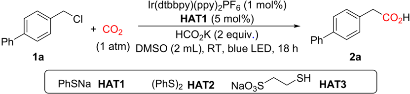

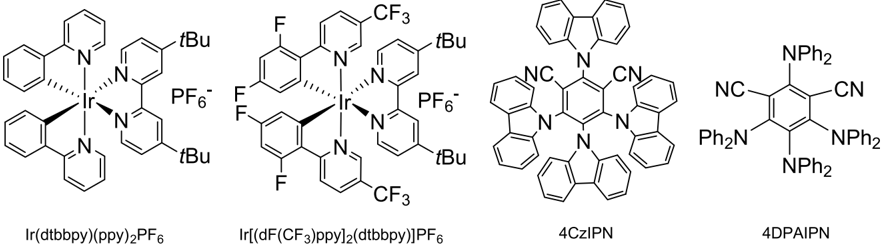

suggests that PhSNa cannot be used alone as a sacrificial reductant like organic amines.

Subsequently, we attempted to validate other possible intermediates present in this reaction. Treatment of the reaction with radical trapping agents  2,2,6,6-tetramethylpiperidine  oxide (TEMPO)  or diphenyl diselenide (PhSeSePh) would completely shut down the reaction. The existence of two radical adducts could be confirmed on the high-resolution mass spectrometry (Scheme 4, d). This indicates that benzyl radicals are likely to be formed in the reaction. If the reaction was added with 10 equivalents of D2O under a nitrogen atmosphere, the deuterated product

5a was isolated in 48% yield and 61% D incorporation (Scheme 4, e), supporting the presence of benzyl carbanions.

Stern-Volmer fluorescence quenching experiments (Fig. 2) revealed that the excited photocatalyst is reductively quenched by PhSNa rather than the substrate or potassium formate.

Based on literature reports 9c,14,18c and the above results, the reaction mechanism was postulated as shown in Scheme 5. Firstly, the benzyl chloride 1 is transformed to the benzyl formate 3 by nucleophilic substitution. Under light irradiation, the formed excited Ir III * undergoes SET with the thiophenyl anion to generate reductive Ir II and a thiyl

Concentration (%)

100 +

CI

Z. Fan et al.

Ph

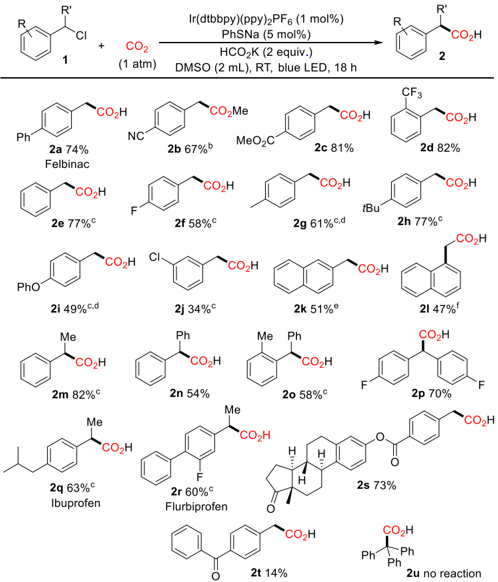

80

60 -

40 -

20 -

0

0

Scheme 2. Substrate scope a : a Reaction conditions: 1 (0.2  mmol), Ir (dtbbpy) (ppy)2PF6  (1 mol%), PhSNa (5 mol%), HCO2K (2 equiv.), DMSO (2 mL), RT, blue LED, 18 h. Isolated yield. b Methylated with TMSCHN2. c 4DPAIPN (1 mol %). d 36 h e DMSO (4 mL).  f Br instead of Cl.

Scheme 3. Scale -up synthesis.

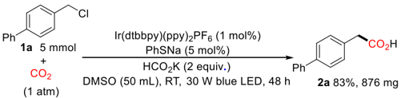

radical  (PhS ‧ ).  The  thiyl  radical  could  undergo  HAT  with  potassium formate, generating thiophenol and a CO2  radical anion (CO2 · ). This radical anion is reductive enough to go through SET with compound 3 , generating radical anion of the substrate ( I ). Then C -O bond cleavage forms the benzyl radical II . It undergoes SET with Ir II , generating benzyl carbanion III ,  which  could  react  with  CO2  by  nucleophilic  attack  to afford the target carboxylic acid 2 . At current stage, we cannot exclude a pathway involving radical coupling between II and CO2 radical anion.

## 4. Conclusion

In  conclusion,  we  developed  a  photoredox/HAT  dual-catalyzed carboxylation of benzyl chlorides. Combination  of sodium  thiophenolate and potassium formate as reductants produces CO2  radical anion  as  a  strong  reductant  under  mild  condition  to  promote  the cleavage  of C -X  bonds.  Compared  with  DABCO,  the  HAT  reagent  is expanded  to  thiols  and  reduced  to  a  catalytic  loading.  Mechanistic studies show that benzyl formate is formed from the benzyl chloride and HCO2K as a reaction intermediate. Applying this protocol to more inert benzylic C -F or C -OH bonds is currently ongoing in our group.

Tetrahedron Green Chem 2 (2023) 100028

Scheme 4. Control experiments.

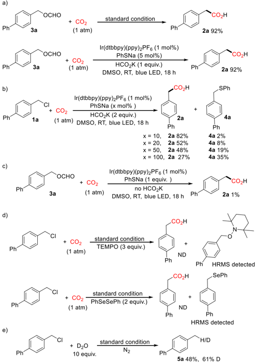

Fig. 1. Kinetic studies.

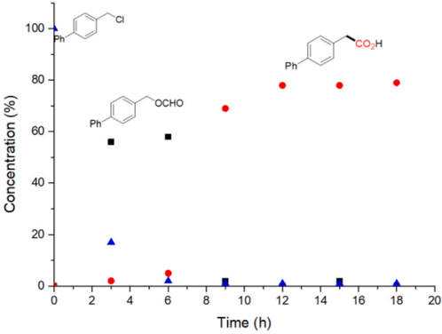

## Declaration of competing interest

The authors declare that they have no known competing financial interests or personal relationships that could have appeared to influence the work reported in this paper.

2.2

2.0

1.8

1.6

1.4

1.2

1.0

0.000

Z. Fan et al.

·

Fig. 2. Stern-Volmer fluorescence quenching experiments.

Scheme 5. Plausible mechanism.

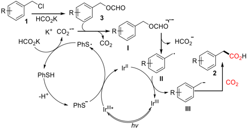

## Acknowledgements

This work was supported by the National Natural Science Foundation of China (22071134 and 21871163).

## Appendix A. Supplementary data

Supplementary data to this article can be found online at https://doi. org/10.1016/j.tgchem.2023.100028.

## References

- [1] (a) M. Aresta, Carbon Dioxide as Chemical Feedstock, Wiley-VCH, Weinheim, 2010;

[(b) M. Aresta, A. Dibenedetto, A. Angelini, Catalysis for the valorization of exhaust carbon: from CO2 to chemicals, materials, and fuels. technological use of CO2, Chem. Rev. 114 (2014) 1709 -1742;](http://refhub.elsevier.com/S2773-2231(23)00027-4/bib1b)

- [(c) N. von der Assen, L.J. Müller, A. Steingrube, P. Voll, A. Bardow, Selecting CO2 sources for CO2  utilization by environmental-merit-order curves, Environ. Sci. Technol. 50 (2016) 1093 -1101;](http://refhub.elsevier.com/S2773-2231(23)00027-4/bib1c)
- [(d) J. Artz, T.E. Müller, K. Thenert, J. Kleinekorte, R. Meys, A. Sternberg, A. Bardow, W. Leitner, Sustainable conversion of carbon dioxide: an integrated review of catalysis and life cycle assessment, Chem. Rev. 118 (2018) 434 -504.](http://refhub.elsevier.com/S2773-2231(23)00027-4/bib1d)
- [2] [(a) T. Sakakura, J.-C. Choi, H. Yasuda, Transformation of carbon dioxide, Chem. Rev. 107 (2007) 2365 -2387;](http://refhub.elsevier.com/S2773-2231(23)00027-4/bib2a)

[(b) M. Mikkelsen, M. J ø rgensen, F.C. Krebs, The teraton challenge. A review of fixation and transformation of carbon dioxide, Energy Environ. Sci. 3 (2010) 43 -81;](http://refhub.elsevier.com/S2773-2231(23)00027-4/bib2b)

[(c) A.M. Appel, J.E. Bercaw, A.B. Bocarsly, H. Dobbek, D.L. DuBois, M. Dupuis, J. G. Ferry, E. Fujita, R. Hille, P.J.A. Kenis, C.A. Kerfeld, R.H. Morris, C.H.F. Peden, A. R. Portis, S.W. Ragsdale, T.B. Rauchfuss, J.N.H. Reek, L.C. Seefeldt, R.K. Thauer, G. L. Waldrop, Frontiers, opportunities, and challenges in biochemical and chemical catalysis of CO2  fixation, Chem. Rev. 113 (2013) 6621 -6658;](http://refhub.elsevier.com/S2773-2231(23)00027-4/bib2c)

1a

(d) W.-H. Wang, Y. Himeda, J.T. Muckerman, G.F. Manbeck, E. Fujita, CO2 Hydrogenation to formate and methanol as an alternative to photo- and electrochemical CO2  reduction, Chem. Rev. 115 (2015) 12936 -12973; (e) S. Dabral, T. Schaub, The use of carbon dioxide (CO2) as a building block in organic synthesis from an industrial perspective, Adv. Synth. Catal. 361 (2019) 223 -246;

- [(f) M.D. Burkart, N. Hazari, C.L. Tway, E.L. Zeitler, Opportunities and challenges for catalysis in carbon dioxide utilization, ACS Catal. 9 (2019) 7937 -7956;](http://refhub.elsevier.com/S2773-2231(23)00027-4/bib2f)
- [(g) B. Grignard, S. Gennen, C. J ´ er ˆ ome, A.W. Kleij, C. Detrembleur, Advances in the use of CO2 as a renewable feedstock for the synthesis of polymers, Chem. Soc. Rev. 48 (2019) 4466 -4514;](http://refhub.elsevier.com/S2773-2231(23)00027-4/bib2g)
- [(h) S. Wang, C. Xi, Recent advances in nucleophile-triggered CO2-incorporated cyclization leading to heterocycles, Chem. Soc. Rev. 48 (2019) 382 -404.](http://refhub.elsevier.com/S2773-2231(23)00027-4/bib2h)
- [3] (a) K. Huang, C.-L. Sun, Z.-J. Shi, Transition-metal-catalyzed C -C bond formation through the fixation of carbon dioxide, Chem. Soc. Rev. 40 (2011) 2435 -2452; (b) M. Cokoja, C. Bruckmeier, B. Rieger, W.A. Herrmann, F.E. Kühn, Transformation of carbon dioxide with homogeneous transition-metal catalysts: a molecular solution to a global challenge? Angew. Chem. Int. Ed. 50 (2011) 8510 -8537;
- (c) R. Martín, A.W. Kleij, Myth or reality? fixation of carbon dioxide into complex organic matter under mild conditions, ChemSusChem 4 (2011) 1259 -1263; (d) Y. Tsuji, T. Fujihara, Carbon dioxide as a carbon source in organic transformation: carbon -carbon bond forming reactions by transition-metal catalysts, Chem. Commun. 48 (2012) 9956 -9964;
- [(e) L. Zhang, Z. Hou, N-Heterocyclic carbene (NHC) -copper-catalysed transformations of carbon dioxide, Chem. Sci. 4 (2013) 3395 -3403;](http://refhub.elsevier.com/S2773-2231(23)00027-4/bib3e)
- [(f) Q. Liu, L. Wu, R. Jackstell, M. Beller, Using carbon dioxide as a building block in organic synthesis, Nat. Commun. 6 (2015) 5933 -5947;](http://refhub.elsevier.com/S2773-2231(23)00027-4/bib3f)
- [(g) S. Wang, G. Du, C. Xi, Copper-catalyzed carboxylation reactions using carbon dioxide, Org. Biomol. Chem. 14 (2016) 3666 -3676;](http://refhub.elsevier.com/S2773-2231(23)00027-4/bib3g)
- [(h) J. Song, Q. Liu, H. Liu, X. Jiang, Recent advances in palladium-catalyzed carboxylation with CO2, Eur. J. Org. Chem. 2018 (2018) 696 -713;](http://refhub.elsevier.com/S2773-2231(23)00027-4/bib3h)
- [(i) S.-S. Yan, Q. Fu, L.-L. Liao, G.-Q. Sun, J.-H. Ye, L. Gong, Y.-Z. Bo-Xue, D.-G. Yu, Transition metal-catalyzed carboxylation of unsaturated substrates with CO2, Coord. Chem. Rev. 374 (2018) 439 -463;](http://refhub.elsevier.com/S2773-2231(23)00027-4/bib3i)
- [(j) C.-K. Ran, L.-L. Liao, T.-Y. Gao, Y.-Y. Gui, D.-G. Yu, Recent progress and challenges in carboxylation with CO2, Curr. Opin. Green Sustainable Chem. 32 (2021) 100525 -100534;](http://refhub.elsevier.com/S2773-2231(23)00027-4/bib3j)
- (k) B. Yu, Z.-F. Diao, C.-X. Guo, L.-N. He, Carboxylation of olefins/alkynes with CO2 to industrially relevant acrylic acid derivatives, J. CO2  Util. 1 (2013) 60 -68; (l) J. Hong, M. Li, J. Zhang, B. Sun, F. Mo, C H Bond carboxylation with carbon dioxide, ChemSusChem 12 (2019) 6 -39;

[(m) Y. Yang, J.-W. Lee, Toward ideal carbon dioxide functionalization, Chem. Sci. 10 (2019) 3905 -3926;](http://refhub.elsevier.com/S2773-2231(23)00027-4/bib3m)

- [(n) J. Davies, J.R. Lyonnet, D.P. Zimin, R. Martin, The road to industrialization of fine chemical carboxylation reactions, Chem 7 (2021) 2927 -2942.](http://refhub.elsevier.com/S2773-2231(23)00027-4/bib3n)
- [4] (a) M. B ¨ orjesson, T. Moragas, D. Gallego, R. Martin, Metal-catalyzed carboxylation of organic (pseudo)halides with CO2, ACS Catal. 6 (2016) 6739 -6749; (b) A. Tortajada, F. Juli ´ a-Hern ´ andez, M. B ¨ orjesson, T. Moragas, R. Martin, Transition-metal-catalyzed carboxylation reactions with carbon dioxide, Angew. Chem. Int. Ed. 57 (2018) 15948 -15982; (c) Y.-G. Chen, X.-T. Xu, K. Zhang, Y.-Q. Li, L.-P. Zhang, P. Fang, T.-S. Mei, Transition-metal-catalyzed carboxylation of organic halides and their surrogates with carbon dioxide, Synthesis 50 (2018) 35 -48.
- [5] [J. Takaya, K. Miyama, C. Zhu, N. Iwasawa, Metallic reductant-free synthesis of α -substituted propionic acid derivatives through hydrocarboxylation of alkenes with a formate salt, Chem. Commun. 53 (2017) 3982 -3985.](http://refhub.elsevier.com/S2773-2231(23)00027-4/sref1)
- [6] [D.J. Charboneau, G.W. Brudvig, N. Hazari, H.M.C. Lant, A.K. Saydjari, Development of an improved system for the carboxylation of aryl halides through mechanistic studies, ACS Catal. 9 (2019) 3228 -3241.](http://refhub.elsevier.com/S2773-2231(23)00027-4/sref2)
- [7] (a)
- M.H. Shaw, J. Twilton, D.W.C. MacMillan, Photoredox catalysis in organic chemistry, J. Org. Chem. 81 (2016) 6898 -6926; (b) N.A. Romero, D.A. Nicewicz, Organic photoredox catalysis, Chem. Rev. 116 (2016) 10075 -10166;
- [(c) D. Ravelli, S. Protti, M. Fagnoni, Carbon -carbon bond forming reactions via photogenerated intermediates, Chem. Rev. 116 (2016) 9850 -9913;](http://refhub.elsevier.com/S2773-2231(23)00027-4/bib7c)
- [(d) L. Marzo, S.K. Pagire, O. Reiser, B. K ¨ onig, Visible-light photocatalysis: does it make a difference in organic synthesis? Angew. Chem. Int. Ed. 57 (2018) 10034 -10072;](http://refhub.elsevier.com/S2773-2231(23)00027-4/bib7d)
- [(e) A.Y. Chan, I.B. Perry, N.B. Bissonnette, B.F. Buksh, G.A. Edwards, L.I. Frye, O. L. Garry, M.N. Lavagnino, B.X. Li, Y. Liang, E. Mao, A. Millet, J.V. Oakley, N. L. Reed, H.A. Sakai, C.P. Seath, D.W.C. MacMillan, Metallaphotoredox: the merger of photoredox and transition metal catalysis, Chem. Rev. 122 (2022) 1485 -1542.](http://refhub.elsevier.com/S2773-2231(23)00027-4/bib7e)
- [8] [(a) C.S. Yeung, Photoredox catalysis as a strategy for CO2  incorporation: direct access to carboxylic acids from a renewable feedstock, Angew. Chem. Int. Ed. 58 (2019) 5492 -5502;](http://refhub.elsevier.com/S2773-2231(23)00027-4/bib8a)

[(b) B. Cai, H.W. Cheo, T. Liu, J. Wu, Light-promoted organic transformations utilizing carbon-based gas molecules as feedstocks, Angew. Chem. Int. Ed. 60 (2021) 18950 -18980;](http://refhub.elsevier.com/S2773-2231(23)00027-4/bib8b)

- [(c) Z. Fan, Z. Zhang, C. Xi, Light-mediated carboxylation using carbon dioxide, ChemSusChem 13 (2020) 6201 -6218;](http://refhub.elsevier.com/S2773-2231(23)00027-4/bib8c)
- [(d) S. Pradhan, S. Roy, B. Sahoo, I. Chatterjee, Utilization of CO2  feedstock for organic synthesis by visible-light photoredox catalysis, Chem. Eur J. 27 (2021) 2254 -2269;](http://refhub.elsevier.com/S2773-2231(23)00027-4/bib8d)
- [(e) Z. Zhang, J.-H. Ye, T. Ju, L.-L. Liao, H. Huang, Y.-Y. Gui, W.-J. Zhou, D.-G. Yu, Visible-light-driven catalytic reductive carboxylation with CO2, ACS Catal. 10](http://refhub.elsevier.com/S2773-2231(23)00027-4/bib8e)

Z. Fan et al.

[(2020) 10871 -10885;](http://refhub.elsevier.com/S2773-2231(23)00027-4/bib8e)

- (f) J.-H. Ye, T. Ju, H. Huang, L.-L. Liao, D.-G. Yu, Radical carboxylative cyclizations and carboxylations with CO2, Acc. Chem. Res. 54 (2021) 2518 -2531; (g) Z. Fan, Y. Yi, C. Xi, Recent advances in light-induced carboxylation of organic (pseudo)halides with CO2, Asian J. Org. Chem. 11 (2022), e202200207.
- [9] [(a) L.-L. Liao, G.-M. Cao, J.-H. Ye, G.-Q. Sun, W.-J. Zhou, Y.-Y. Gui, S.-S. Yan, G. Shen, D.-G. Yu, Visible-light-driven external-reductant-free cross-electrophile couplings of tetraalkyl ammonium salts, J. Am. Chem. Soc. 140 (2018) 17338 -17342;](http://refhub.elsevier.com/S2773-2231(23)00027-4/bib9a)
- [(b) K. Jing, M.-K. Wei, S.-S. Yan, L.-L. Liao, Y.-N. Niu, S.-P. Luo, B. Yu, D.-G. Yu, Visible-light photoredox-catalyzed carboxylation of benzyl halides with CO2: mild and transition-metal-free, Chin. J. Catal. 43 (2022) 1667 -1673;](http://refhub.elsevier.com/S2773-2231(23)00027-4/bib9b)
- [(c) C.-K. Ran, Y.-N. Niu, L. Song, M.-K. Wei, Y.-F. Cao, S.-P. Luo, Y.-M. Yu, L.L. Liao, D.-G. Yu, Visible-light photoredox-catalyzed carboxylation of activated C (sp 3 ) O bonds with CO2, ACS Catal. 12 (2022) 18 -24.](http://refhub.elsevier.com/S2773-2231(23)00027-4/bib9c)
- [10] (a) K. Shimomaki, K. Murata, R. Martin, N. Iwasawa, Visible-light-driven carboxylation of aryl halides by the combined use of palladium and photoredox catalysts, J. Am. Chem. Soc. 139 (2017) 9467 -9470; (b) Q.-Y. Meng, S. Wang, B. K ¨ onig, Carboxylation of aromatic and aliphatic bromides and triflates with CO2  by dual visible-light -nickel catalysis, Angew. Chem. Int. Ed. 56 (2017) 13426 -13430; (c) K. Shimomaki, T. Nakajima, J. Caner, N. Toriumi, N. Iwasawa, Palladiumcatalyzed visible-light-driven carboxylation of aryl and alkenyl triflates by using photoredox catalysts, Org. Lett. 21 (2019) 4486 -4489; (d) alcohol derivatives with CO2  using a palladium/iridium dual catalyst,
- Y. [Jin, N. Toriumi, N. Iwasawa, Visible-light-enabled carboxylation of benzyl ChemSusChem 15 (2022), e202102095.](http://refhub.elsevier.com/S2773-2231(23)00027-4/bib10d)
- [11] [E. Lamy, L. Nadjo, J.M. Saveant, Standard potential and kinetic parameters of the electrochemical reduction of carbon dioxide in dimethylformamide, J. Electroanal. Chem. Interfacial Electrochem. 78 (1977) 403 -407.](http://refhub.elsevier.com/S2773-2231(23)00027-4/sref3)
- [12] [(a) J.-H. Ye, M. Miao, H. Huang, S.-S. Yan, Z.-B. Yin, W.-J. Zhou, D.-G. Yu, Visiblelight-driven iron-promoted thiocarboxylation of styrenes and acrylates with CO2, Angew. Chem. Int. Ed. 56 (2017) 15416 -15420;](http://refhub.elsevier.com/S2773-2231(23)00027-4/bib12a)
- (b) L. Song, W. Wang, J.-P. Yue, Y.-X. Jiang, M.-K. Wei, H.-P. Zhang, S.-S. Yan, L.L. Liao, D.-G. Yu, Visible-light photocatalytic di- and hydro-carboxylation of unactivated alkenes with CO2, Nat. Cat. 5 (2022) 832 -838; (c) W. Zhang, Z. Chen, Y.-X. Xu, L.-L. Liao, W. Wang, J.-H. Ye, D.-G. Yu, Arylcarboxylation of unactivated alkenes with CO2  via visible-light photoredox catalysis, Nat. Commun. 14 (2023) 3529 -3538.
- [13] (a) H. Seo, M.H. Katcher, T.F. Jamison, Photoredox activation of carbon dioxide for amino acid synthesis in continuous flow, Nat. Chem. 9 (2017) 453 -456; (b) H. Seo, A. Liu, T.F. Jamison, Direct β -selective hydrocarboxylation of styrenes with CO2 enabled by continuous flow photoredox catalysis, J. Am. Chem. Soc. 139 (2017) 13969 -13972.
- [14] [H. Wang, Y. Gao, C. Zhou, G. Li, Visible-light-driven reductive carboarylation of styrenes with CO2  and aryl halides, J. Am. Chem. Soc. 142 (2020) 8122 -8129.](http://refhub.elsevier.com/S2773-2231(23)00027-4/sref4)
- [15] [S.-S. Yan, S.-H. Liu, L. Chen, Z.-Y. Bo, K. Jing, T.-Y. Gao, B. Yu, Y. Lan, S.-P. Luo, D.G. Yu, Visible-light photoredox-catalyzed selective carboxylation of C(sp 3 ) F bonds with CO2, Chem 7 (2021) 3099 -3113.](http://refhub.elsevier.com/S2773-2231(23)00027-4/sref5)
- [16] [Z.-Y. Bo, S.-S. Yan, T.-Y. Gao, L. Song, C.-K. Ran, Y. He, W. Zhang, G.-M. Cao, D.G. Yu, Visible-light photoredox-catalyzed selective carboxylation of C(sp 2 ) F bonds in polyfluoroarenes with CO2, Chin. J. Catal. 43 (2022) 2388 -2394.](http://refhub.elsevier.com/S2773-2231(23)00027-4/sref6)
- [17] [W. Hang, D. Li, S. Zou, C. Xi, Visible-light-driven reductive carboxylation of benzyl bromides with carbon dioxide using formate as terminal reductant, J. Org. Chem. 88 (2023) 5007 -5014.](http://refhub.elsevier.com/S2773-2231(23)00027-4/sref7)
- [18] (a) H. Wang, N.T. Jui, Catalytic defluoroalkylation of trifluoromethylaromatics with unactivated alkenes, J. Am. Chem. Soc. 140 (2018) 163 -166; (b) A.J. Boyington, C.P. Seath, A.M. Zearfoss, Z. Xu, N.T. Jui, Catalytic strategy for regioselective arylethylamine synthesis, J. Am. Chem. Soc. 141 (2019) 4147 -4153; (c) C.M. Hendy, G.C. Smith, Z. Xu, T. Lian, N.T. Jui, Radical chain reduction via carbon dioxide radical anion (CO2 · -), J. Am. Chem. Soc. 143 (2021) 8987 -8992.
- [19] [G.S.P. Garusinghe, S.M. Bessey, C. Boyd, M. Aghamoosa, B.G. Frederick, M.R. M. Bruce, A.E. Bruce, Identification of dimethyl sulfide in dimethyl sulfoxide and implications for metal-thiolate disulfide exchange reactions, RSC Adv. 5 (2015) 40603 -40606.](http://refhub.elsevier.com/S2773-2231(23)00027-4/sref8)