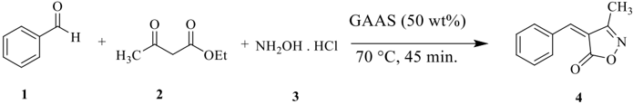
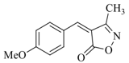
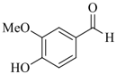
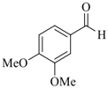
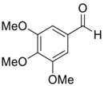

Org. Commun . 16:2 (2023) 87-97

## Green synthesis of 3,4-disubstituted isoxazol-5(4 H )-one using Gluconic acid aqueous solution as an efficient recyclable medium

Ganesh V. Shitre 1 , Anisha R. Patel 2  and Ramesh S. Ghogare 2* İD İD İD

1 Department of Chemistry, Vaishnavi Mahavidyalaya,Wadwani, Dist-Beed431144 , India 2 Department of Chemistry , B . N. N. College Bhiwandi, Dist-Thane-421305 , India

(Received April 11, 2023; Revised May 24, 2023; Accepted May 29, 2023)

Abstract: Green  synthesis  of  3,4-disubstituted  isoxazol-5( 4H )-ones  has  been  achieved  via  Knoevenagel condensation using three-component coupling reaction of aromatic aldehyde, ethyl acetoacetate and hydroxylamine hydrochloride in Gluconic acid aqueous solution (50 wt % GAAS). In this methodology, Gluconic acid aqueous solution used as reaction medium as well as catalyst and it can be recycled and reused several times without  loss  of  its  a  significant  efficacy.  All  compounds  have  been  confirmed  by 1 H  NMR,  13 C  NMR,  IR spectroscopy and mass spectrometry.

Keywords: Green synthesis; gluconic acid aqueous solution; bio-based green solvent; Knoevenagel condensation; 3,4-disubstituted isoxazol-5(4 H )-ones. © 2023 ACG Publications. All rights reserved.

## 1. Introduction

Nowdays,  environmental  benign  green  synthesis  is  important  perspective  in  chemical  and pharmaceutical  productions,  because  uses  of  conventional  organic  solvents  as  well  as  reagents  are harmful and toxic to environments 1-2 . In addition, some other organic solvents are also responsible to depletion of ozone layer. Therefore, use of secure and less toxic chemicals as the solvent is one of the most important criterions among the green chemistry principles. The purpose of using 'green reaction medium' is to reduce or eliminate the toxic and harmful effects of chemicals on the environment. Hence, emerging interest in the development of novel methodologies in organic synthesis, researchers have need to find out an alternative non-polluting as well as bio-degradable green reaction medium 3-10 for organic transformations. Recently, Gluconic acid aqueous solution (50 wt % GAAS) is used as biobased green solvent for the organic syntheses 11-16 . This solvent shows various characteristics like nonvolatility, bio-degradability, recyclability, eco-friendly and cost-effective organic acid solvent. Present work has performed using Gluconic acid aqueous solution as reaction medium, which has been recycled and reused several times.

Isoxazole and its derivatives are significant class of heterocyclic compounds containing a potent pharmacophore  and  these  pharmacophore  plays  important  role  in  medicinal  chemistry  for  building blocks  of  drugs 17-19 .  Several  substituted  isoxazoles  have  been  shown  a  broad  range  of  biological activities  such  as  anti-inflammatory 20 ,  immunosuppressive 21 ,  β-Adrenergic  receptor  antagonists 22 , Androgen antagonists 23 , anti-viral 24 , anti-HIV 25-26 , antiprotozoal 27 , HDAC inhibitors 28 , anti-tubercular 29 ,

*  Corresponding author: E-mail : rsghogare05@gmail.com

anti-bacterial 30 , anti-fungal 31 , anticancer 32-33 and antioxidant activity 34 . Some of isoxazoles are also used as fungicidal in agricultural field 35 . In addition to these, many 3,4-disubstituted isoxazol-5(4 H )-ones are used in development of optical storage devices, optical storage and nonlinear optical research 36-37 , filter dyes in photographic films 38 and light conversion in molecular devices 39 .

In view of the emerging importance of 3,4-disubstituted isoxazol-5(4 H )-ones,  various modified methods were developed for their synthesis using several reagents, catalysts and strategies. Amongst them, some methods were carried out using different catalysts like acidic catalyst 40-50 , basic catalyst 5168 ,  nano  materials 69-75 and  Synthetic  enzyme 76 .    Additionally,  various  bio-based  solvents 77-80 ,  deep eutectic solvents 81-82 , ion exchange resins 83-84 , ionic liquids 85-86 as well as metal and its complexes 87-89 were also used. In similar manner, some of the newest techniques such as microwave irradiation 90-92 ultrasound irradiation 93-94 and  visible  light 95 have  been reported. However, several of these reported methods suffer from one or two drawbacks such as harsh reaction conditions, expensive catalysts, toxic solvents,  prolonged  reaction  time,  poor  yields  and  tedious  workup  process.  Thus,  the  need  for  the development  of  an  alternate  route  to  synthesis  of  3,4-disubstituted  isoxazol-5(4 H )-ones  is  in  high demand.

During  our  recent  studies  directed  towards  the  development  of  novel  methodology  using alternative procedures 96-98 and by considering the significance of 3,4-disubstituted isoxazol-5(4 H )-ones, herein we wish to report, a green approach for the catalyst-free synthesis of 3,4-disubstituted isoxazol5(4 H )-one using Gluconic acid aqueous solution as an efficient recyclable medium.

## 2. Experimental

## 2.1. General Methods

Solvents  and  reagents  were  purchased  from  commercially  and  used  without  purification. Melting points were recorded on the Buchi R-535 apparatus and are uncorrected.  1 H NMR spectra were recorded on Gemini-300 spectrometer in CDCl3 using TMS as an internal standard. IR spectra were recorded on a Bruker FT-IR spectrophotometer using neat or KBr disk and mass spectra were recorded on a Finnigan MAT 1020 mass spectrometer with operating at 70 eV.

## 2.2. General Procedure

A mixture of benzaldehyde (1 mmol), ethyl acetoacetate (1 mmol) and hydroxylamine hydrochoride (1 mmol) were stirred in gluconic acid aqueous solution (GAAS) (5 mL) at 70 °C. The progress of the reaction was monitored by thin layer chromatography (TLC) and the reaction was completed within 45 minutes. Then, the reaction mixture was cooled and extracted with ethyl acetate. The extracted ethyl acetate was concentrated under reduced pressure to obtained crude solid product, which was purified by crystallization from ethanol. All the pure products were confirmed by comparing their physical and spectral data.

## 2.3. Spectral Data for Compounds

(Z)-4-benzylidene-3-methylisoxazol-5(4H)-one ( 4a ): Pale  yellow  solid (9 0 % ) . m.p.  143-145 o C. IR (KBr): νmax = 3225, 2370, 1740, 1635, 1215, cm -1 ; 1 H NMR  (300 MHz, CDCl3): δ 7.92 (d, J = 8.8 Hz,  2H),  7.49-7.61  (m,  3H),  7.36  (s,  1H),  2.40  (s,  3H) ppm;  13 C NMR (75 MHz, CDCl3) δ 175.7, 164.9, 152.1, 133.1, 127.8,  127.5,  127.4,  126.0,  17.4  ppm;   ESIMS: m/z 188 [M+1]  + .

(Z)-3-methyl-4-(4-methylbenzylidene)isoxazol-5(4H)-one ( 4b ): Pale yellow solid (90%). m.p. 128130 o C. IR (KBr): νmax = 3055, 2940, 2865, 1735, 1612, 1110 cm -1 ;  1 H NMR (300 MHz, CDCl3): δ 7.92 (d, J =8.2 Hz, 2H); 7.48 (s, 1H); 7.36 (d, J =8.1Hz, 2H);  2.48  (s,  3H);  2.30  (s,  3H)  ppm; 13 C NMR (75 MHz, CDCl3):   δ 172.4, 163.7,  150.3, 136.0, 130.5, 127.9, 126.0, 120.3, 22.8, 17.8 ppm; ESIMS: m/z 201 [M] + .

(Z)-4-(4-hydroxybenzylidene)-3-methylisoxazol-5(4H)-one ( 4c ): Yellow  Solid  (92%).  m.p.  214-216 o C. IR (KBr): νmax = 3460, 3080, 2940, 1745, 1615, 1220, cm-1;  1 H NMR (300 MHz, CDCl3): δ : 10.70 (s, 1H), 8.42 (d, J = 8.8 Hz, 2H), 7.60 (d, J = 8.2 Hz, 2H), 7.38 (s, 1H), 3.00 (s, 3H) ppm; 13 C NMR (75 MHz, CDCl3): δ 174.7, 164.5, 157.2, 149.7, 130.8, 125.4, 123.4, 115.5, 17.4 ppm; ESIMS: m/z 226 [M+23] + , 203 [M] + .

(Z)-4-(4-methoxybenzylidene)-3-methylisoxazol-5(4H)-one ( 4d ) : Yellow Solid (90%).  m.p. 180-182 o C. IR (KBr) νmax = 3080, 2980, 2815, 1736, 1605, 1270, 1025 cm -1 .  1 H NMR (300 MHz, CDCl3): δ 8.10 (d, J = 8.8 Hz, 2H); 7.42 (s, 1H), 6.98 (d, J = 8.1 Hz, 2H), 3.85  (s,  3H),  2.40 (s,  3H)  ppm; 13 C NMR (75 MHz, CDCl3): δ 174.4, 163.9, 160.6, 149.7, 130.8, 125.8, 114.1, 54.9, 17.3 ppm. ESIMS: m/z 218 [M+1]  + .

(Z)-4-(4-hydroxy-3-methoxybenzylidene)-3-methylisoxazol-5(4H)-one ( 4e ): Pale yellow solid (92%). m.p.  214-216 o C.  IR  (KBr): νmax = 3445, 3136, 2940, 1735, 1642, 1270 cm -1 ;  1 H NMR (300  MHz, CDCl3):  δ 10.72 (s, 1H), 7.50 (s, 1H), 7.24-7.16 (m, 2H),6.86  (d, J =8.1Hz 1H),  3.42  (s,  3H),  2.31 (s,  3H)  ppm; 13 C  NMR (75  MHz, CDCl3): δ 174.7, 163.9, 151.2, 149.7, 148.3, 129.3, 125.4, 122.8, 116.5, 111.6, 56.0, 17.3 ppm. ESIMS: m/z 251 [M+18] + .

(Z)-4-(3,4-dimethoxybenzylidene)-3-methylisoxazol-5(4H)-one ( 4f ):  Yellow  solid  (92%).  m.p.130132 o C. IR (KBr): νmax = 3092, 2935, 2830, 2355, 1730,  1565, 1266 cm -1 ;  1 H NMR (300 MHz, CDCl3): δ 7.50 (s, 1H),  7.320-7.28 (m, 2H), 6.90  (d, J =8.1Hz, 1H)  3.83  (s,  6H),  2.44  (s,  3H)  ppm; 13 C NMR  (75  MHz, CDCl3): δ 175.1, 167.6), 150.3, 149.4, 147.7, 127.9, 126.0, 122.6, 111.6, 111.1, 56.2, 17.4) ppm; ESIMS: m/z 248 [M+1] + .

(Z)-4-(3,4,5,-trimethoxybenzylidene)-3-methylisoxazol-5(4H)-one (4g): Yellow solid (94%). m.p.138140 o C. IR (KBr): νmax = 3130, 2945, 1740, 1560, 1278, 1042, cm -1 ;  1 H NMR (300 MHz, CDCl3):  δ 7.40 (s,  1H), 7.08  (d, J = 8.8, 2H), 3.78 (s,  9H), 2.43  (s,  3H) ppm;  13 C NMR (75 MHz, CDCl3): δ 174.4, 164.5, 153.0, 150.3, 138.0, 129.7, 125.1, 103.7, 60.5, 56.3, 17.5 ppm; ESIMS: m/z 278 [M+1] + , 277 [M] + .

(Z)-4-(4-(dimethylamino)benzylidene)-3-methylisoxazol-5(4H)-one ( 4h ): pale  red  solid (90%).  m.p. 212-214 o C. IR  (KBr): νmax = 1730,  1625,  1552,  1505, 1436 , 1312 1245, 1120 cm -1 ;  1 H NMR (300 MHz, CDCl3): δ 8.42 (d, J = 8.5 Hz, 2H), 7.34 (s, 1H), 6.71 (d, J =9.2 Hz, 2H), 3.10 (s, 6H), 2.26 (s, 3H) ppm,  13 C NMR (75 MHz, CDCl3): δ 172.2, 162.4, 153.5, 149.3, 138.1, 122.6, 120.2, 111.6, 41.7, 13.0 ppm; ESIMS: m/z 248 [M+18] + , 230 [M] + .

(Z)-3-methyl-4-(thiophen-2-ylmethylene)isoxazol-5(4H)-one ( 4i ): Pale yellow  solid (88%).  m.p.144146 o C. IR  (KBr): νmax = 2930, 1736, 1695, 1510, 1330, 1145 cm -1 ;  1 H NMR (300 MHz, CDCl3): δ 8.15 (d, J = 3.6 Hz, 1H), 7.92 (d, J = 4.8 Hz, 1H), 7.60 (s, 1H), 7.35 (t, J = 4.8 Hz, 1H), 2.26 (s, 3H); 13 C NMR  (75  MHz,  CDCl3)  δ 168.8, 160.6, 141.5, 140.7, 140.0, 136.8, 128.5, 114.9,  12.9  ppm; ESIMS: m/z 193 [M] + .

## 3. Results and Discussion

In continuation our research interest in the development of green synthetic methodologies, we decided to explore the use of Gluconic acid aqueous solution (50 wt% GAAS) as reaction medium for the synthesis of 3,4-disubstituted isoxazol-5(4 H )-one.

In viewpoint of green chemistry, the model reaction was carried out between benzaldehyde ( 1 ) (1.0 mmol), ethyl acetoacetate ( 2 ) (1.0 mmol) and hydroxylamine hydrochloride ( 3 ) (1.0 mmol) under various  solvents  conditions  using  different  reaction  temperature.  The  results  are  shown  in  Table  1. Initially, the reaction was carried out under solvent free condition at room temperature as well as higher temperature (100 o C) for prolonged reaction time (120 minutes) but formation of the desired product was not observed (Table 1, entry 1-2). After that, we chose water as a green solvent and reaction was carried  out  at  different  temperatures  for  120  minutes.  Amongst  them,  reflux  condition  progresses towards the desired product up to 30 % yield (Table 1, entry 3-4).

## Green synthesis of 3,4-disubstituted isoxazol-5(4 H )-one

Scheme 1. Gluconic acid aqueous solution catalyzed synthesis of 3,4-disubstituted isoxazol-5(4 H )-one

With  these  obtained  results  in  hand,  our  next  goal  was  to  improve  the  product  yield  with reducing the reaction time. It has needed to use an appropriate catalyst which acts green catalyst as well as recyclable reaction medium and increases the product yield with reducing the reaction time. Here, we decided to explore the use of Gluconic acid aqueous solution (50 wt % GAAS) system as bio-based reaction medium and catalyst for this reaction. Because, Gluconic acid aqueous solution (GAAS) has hydrophobic nature with organic substrate which induce favorable aggregation of organic substrates in water to leads the fast collisions of the reactants and formation of desired product in short reaction times.

Initially, the reaction was performed at room temperature using various concentrations of GAAS system from 3 mL to 6 mL for 120 minutes (Table 1, entry 5-8 ). The yield of product gradually increases with increasing the volume of solvent till 5 mL, and further increasing the volume of reaction medium, no improvement occurred in terms of product yield. Thus, the observation shows that a 5 mL volume of GAAS system was enough for obtaining moderate yield of product at the room temperature. After these results,  the  effects  of  temperature  were  studied,  by  carrying  out  the  model  reaction  at  different temperatures from 40 to 80 o C. In this optimization of reaction, increasing the reaction temperature from 40 to 70 o C, the product yield increases with gradually decreasing reaction time (Table 1, entry 9-12). Further increasing the reaction temperature up to 80 o C, but yield of the product was not improved (Table 1, entry 13). The observation shows that reaction condition at 70 °C is sufficient for the completion of reaction within 45 minutes with excellent yield.

Table 1. Optimization of reaction solvent and GAAS (50 wt%) at different conditions

|   Sr. No. | Solvent      | Quantity Solvent (mL)   | Temperature ( o C)   |   Time (min.) | Isolated Yields (%)   |
|-----------|--------------|-------------------------|----------------------|---------------|-----------------------|
|         1 | Solvent-free | --                      | RT a                 |           120 | NR b                  |
|         2 | Solvent-free | --                      | 100                  |           120 | NR b                  |
|         3 | H 2 O        | 5                       | RT a                 |           120 | Trace                 |
|         4 | H 2 O        | 5                       | Reflux               |           120 | 30                    |
|         5 | GAAS         | 3                       | RT a                 |           120 | 40                    |
|         6 | GAAS         | 4                       | RT a                 |           120 | 54                    |
|         7 | GAAS         | 5                       | RT a                 |           120 | 60                    |
|         8 | GAAS         | 6                       | RT a                 |           120 | 60                    |
|         9 | GAAS         | 5                       | 50                   |            70 | 72                    |
|        10 | GAAS         | 5                       | 60                   |            60 | 85                    |
|        11 | GAAS         | 5                       | 70                   |            45 | 92                    |
|        12 | GAAS         | 5                       | 80                   |            45 | 92                    |

RT a = Room Temperature, NR b = No Reaction (Product not formed).

Based on the optimized reaction conditions, various aromatic and heterocyclic aldehydes were reacted with ethyl acetoacetate and hydroxylamine hydrochloride for the synthesis of 3,4-disubstituted isoxazol-5(4 H )-ones (Table 2, 4a -4k ) to demonstrate the scope of GAAS as catalyst as well as reaction medium. All results are summarized in table 2.

Table 2. Synthesis of the 3-Methyl-4-arylmethylene isoxazol-5(4 H )-one

NR*= No Reaction

| Sr No   | Aldehyde   | Product   |   Reaction Time (min.) |   Isolated Yield (%) | M.P. ºC [Lit. M.P.] Ref   |
|---------|------------|-----------|------------------------|----------------------|---------------------------|
| a       |            |           |                     45 |                   92 | 143-145 [142-144] [50]    |
| b       |            |           |                     45 |                   90 | 128-130 [132-134] [50]    |
| c       |            |           |                     45 |                   92 | 214-216 [210-212] [50]    |
| d       |            |           |                     45 |                   90 | 180-182 [176-178] [50]    |
| e       |            |           |                     45 |                   92 | 214-216 [210-212] [50]    |
| f       |            |           |                     45 |                   92 | 130-132 [134-136] [50]    |
| g       |            |           |                     45 |                   94 | 138-140 [134-136] [50]    |
| h       |            |           |                     45 |                   90 | 212-214 [ 206-209] [50]   |
| i       |            |           |                     45 |                   90 | 144-146 [146-147] [66]    |
| j       |            |           |                    120 |                   00 | --                        |
| k       |            |           |                    120 |                   00 | --                        |

Various  effects  of  substituents  present  on  the  aromatic  aldehyde  were  examined  by  using different electron donating and withdrawing functional groups.  The aromatic aldehyde having electron donating groups reacted in appropriate time to achieve desired products with excellent yields, while electron  withdrawing groups failed to obtain the required product even increasing reaction time. In general, it observed that the nature of the functional group on aromatic aldehyde have a various effect on this reaction.

For the investigation of reusability of the reaction medium, reaction was carried out using model reaction (Scheme 1). After the completion of the reaction, the reaction mixture was cooled and  the formed product extracted with ethyl acetate from the GAAS phase.

Table 3. Recyclability study of the GAAS (50 wt %)

|   Sr. No. |   Cycle |   Reaction Time (min.) |   Isolated Yields (%) |
|-----------|---------|------------------------|-----------------------|
|         1 |       1 |                     45 |                    92 |
|         2 |       2 |                     45 |                    90 |
|         3 |       3 |                     50 |                    85 |
|         4 |       4 |                     60 |                    82 |

The immiscibility of Gluconic acid aqueous solution (GAAS) with ethyl acetate, it's easy to separate out and reused up to four times for further reactions without loss of its a significant efficacy (Table 3).

After  that,  GAAS  solvent  system  has  also  compared  with  some  previously  reported  green catalysts or reaction mediums used for synthesis of 3,4-disubstituted isoxazol-5(4 H )-ones (Table 4). The results  show that the present  method has more advantages from the viewpoint of product yield and reaction time.

Table 4. Comparison for different green catalysts or reaction mediums used for synthesis of 3,4-disubstituted isoxazol-5(4 H )-ones

|   Sr. No. | Catalyst                                     | Solvent    | Temperature (°C)   | Time (min)   | Yield (%)   | Ref          |
|-----------|----------------------------------------------|------------|--------------------|--------------|-------------|--------------|
|         1 | DL-Tartaric acid (10 mole %)                 | H 2 O      | RT                 | 100          | 88          | 41           |
|         2 | Citric acid (1 mmol)                         | H 2 O      | RT                 | 480          | 90          | 43           |
|         3 | Pyruvic acid                                 | H 2 O      | 100                | 60           | 85-92       | 49           |
|         4 | Succinic acid (15 mol %)                     | H 2 O      | RT                 | 90           | 92          | 50           |
|         5 | Lemon juice (1 mL)                           | H 2 O:EtOH | 90                 | 55-60        | 94          | 77           |
|         6 | Starch solution (4 mL)                       | --         | 90                 | 50-60        | 80-86       | 78           |
|         7 | Fruit juice (10 mL)                          | H 2 O:EtOH | RT                 | 240-420      | 90-95       | 80           |
|         8 | Gluconic acid aqueous solution (50 wt %GAAS) | --         | 70                 | 45           | 70-92       | Present work |

In  general,  all  the  reactions  were  very  neat  in  terms  of  conversion  as  well  as  isolation  of products. All the products were characterized by their spectroscopy analysis such as 1 H,  13 C NMR, IR spectroscopy and mass spectrometry.

## 4. Conclusion

In summary, we have represented a simple, inexpensive and novel one pot three-component methodology for the green synthesis of 3,4-disubstituted isoxazol-5(4 H )-ones derivatives using various aromatic  aldehydes,  ethyl  acetoacetate  and  hydroxylamine  hydrochloride  in  Gluconic  acid  aqueous solution.  Gluconic  acid  aqueous  solution  is  recycled  and  reused  several  times  without  loss  of  its effectiveness. The present method offers significant advantages such as economical, nontoxic, shorter reaction time, catalyst-free condition and use of green reaction medium.  All synthesized compounds were characterized by 1 H NMR,  13 C NMR, FT-IR spectroscopy, and mass spectrometry.

## Acknowledgements

The authors are grateful to department of chemistry, B. N. N. College, Bhiwandi and DST-FIST Delhi for providing laboratory and instrumentation facility.

## Supporting Information

Supporting  information  accompanies  this  paper  on  http://www.acgpubs.org/journal/organiccommunications

Ganesh V. Shitre 0009-0004-4882-7928

Anisha Patel: 0009-0006-6074-9146

Ramesh S. Ghogare: 0000-0003-0810-9636

## References

- [1] Tucker, J.L. Green Chemistry, a Pharmaceutical Perspective. Org. Process Res. Dev. , 2006 , 10 ( 2 ), 315319.
- [2] Gupta, P.; Mahajan, A. Green chemistry approaches as sustainable alternatives to conventional strategies in the pharmaceutical industry. RSC Adv. 2015 , 5 , 26686-26705.
- [3] Gu, Y. and Je´roˆme, F. Bio-based solvents: an emerging generation of fluids for the design of ecoefficient processes in catalysis and organic chemistry. Chem. Soc. Rev. 2013 , 42 , 9550-9570.
- [4] Narsaiah,  A.V.;  Ghogare,  R.S.;  Biradar,  D.O.  Glycerin  as  alternative  solvent  for  the  synthesis  of Thiazoles. Org. Commun. 2011 , 4 ( 3 ) 75-81.
- [5] Ghogare,  R.S.;  Rajeshwari,  K.  and  Narsaiah,  A.V.  Glycerol  mediated  strecker  reaction:  catalyst-free protocol for the synthesis of α-amino nitriles. Lett. Org. Chem, 2014 , 11 , 688-692.
- [6] Dandia, A.; Jain, A.K. and Laxkar, A.K. Ethyl lactate as a promising bio based green solvent for the synthesis of spiro-oxindole derivatives via 1,3-dipolar cycloaddition reaction. Tetrahedron Lett. 2013 , 54 , 3929-3932.
- [7] Yang, J.; Tana, J-N. and Gu, Y. Lactic acid as an invaluable bio-based solvent for organic reactions. Green Chem. 2012 , 14 , 3304-3317.
- [8] Hazeri, N.; Maghsoodlou, M.T.; Mir, F.; Kangani, M.; Saravani, H.; Molashahi, E. An efficient one-pot three-component synthesis of tetrahydrobenzo[ b ]pyran and 3,4-dihydropyrano[ c ]chromene derivatives using starch solution as catalyst. Chinese J. Catal. 2014 , 35 , 391-395.
- [9] Ma, J.; Zhong, L.; Peng, X.; Sun, R.; d-Xylonic acid: a solvent and an effective biocatalyst for a threecomponent reaction. Green Chem. 2016 , 18 , 1738-1750.
- [10] Campos, J. F.; Scherrmannb, M-C.; Berteina-Raboina, S. Eucalyptol: a new solvent for the synthesis of heterocycles containing oxygen, sulfur and nitrogen. Green Chem. 2019 , 21 , 1531-39.
- [11] Lim, H.Y.; Dolzhenko, A.V. Gluconic acid aqueous solution: A bio-based catalytic medium for organic synthesis. Sustain. Chem. Pharm. 2021 , 21 , 100443.
- [12] Li,  B-L.;  Li,  P-H.;  Fang,  X-N.;  Li,  C-X.;  Sun,  J-L.;  Mo, L-P.;  Zhang,  Z-H.  One-pot  four-component synthesis of highly substituted pyrroles in gluconic acid aqueous solution. Tetrahedron 2013 , 69 ( 34 ), 7011-7018.
- [13] Patel,  C.;  Thakur,  A.;  Pereira,  G.  and  Sharma,  A.    Gluconic  acid  promoted  cascade  reactions  of  2phenylimidazo[1,2-a] pyridine-3-carbaldehyde with cyclohexane-1,3-dione to create novel fused bisheterocycles. Syn. Commun. 2019 , 49 ( 14 ), 1836-1846.
- [14] Guo,  R-Y.;  Wang,  P.;  Wang,  G-D.;  Moa,  L-P.;  Zhang  Z-H.  One-pot  three-component  synthesis  of functionalized spirooxindoles in gluconic acid aqueous solution Tetrahedron 2013 , 69 ( 8 ) 2056-2061.
- [15] Xu, Z.; Zhou, P.; Tu, Y.; Liu, D.; Liao, W.; Liao, C. A Green and Highly Efficient Synthesis of 5,5 (Phenylmethylene)bis(1,3-dioxane-4,6-dione)  derivatives  in  biobased  gluconic  acid  aqueous  solution. Heterocycles 2017 , 94 ( 6 ) 1115-1122.

- [16] Diwan, F.; Shaikh, M.H.; Fatema, S.; Farooqui, M. Gluconic acid aqueous solution: A bio-compatible media for one pot multicomponent synthesis of dihydropyrano [2,3-c] pyrazoles. Org. Commun . 2019 , 12 ( 4 ), 188-201.
- [17] Chikkula, K.V.; Raja, S.; Isoxazole-a potent pharmacophore. Int. J. Pharm. Pharm. Sci, 2017 , 9 , 13-24.
- [18] Zhu, J;, Mo, J.; Lin, H-p.; Chenb, Y.; Sun, H-p. The recent progress of isoxazole in medicinal chemistry. Bioorg. Med. Chem. 2018 , 26 ( 12 ), 3065-3075.
- [19] Sysak, A.; Obminska-Mrukowicz, B. Isoxazole ring as a useful scaffold in a search for new therapeutic agents. Eur. J. Med. Chem, 2017 , 137 ( 8 ), 292-309.
- [20] Kwon, T.; Heiman, A.S.; Oriaku, E.T.; Yoon, K.; Lee, H.J. New steroidal antiinflammatory antedrugs: steroidal [16.alpha.,17.alpha.-d]-3'-carbethoxyisoxazolines. J. Med. Chem. 1995 , 38 ( 6 ), 1048-1051.
- [21] Gordaliza, M. Faircloth, G.T.; Castro, M.A.; Miguel del Corral, J.M., Lo´pez-Va´zquez M.L., Feliciano A.S. Immunosuppressive cyclolignans. J. Med. Chem. 1996, 39 ( 14 ), 2865-2868.
- [22] Conti,  P.;  Dallanoce,  C.;  Amici,  M.D.;  Micheli,  C.D.;  Klotz,  K-N.  Synthesis  of  new  Δ2-isoxazoline derivatives and their pharmacological characterization as β-adrenergic receptor antagonists. Bioorg. Med. Chem. 1998 , 6 ( 4 ), 401-408.
- [23] Ishioka, T.; Kubo, A.; Koiso, Y.; Nagasawa, K.; Itai, A.; Hashimotoa, Y. Novel non-steroidal/non-anilide type androgen antagonists with an isoxazolone moiety. Bioorg. Med. Chem. 2002 , 10 ( 5 ), 1555-1566.
- [24] Lee,Y-S.;  Kim,  B.H.  Heterocyclic  nucleoside  analogues:  design  and  synthesis  of  antiviral,  modified nucleosides containing isoxazole heterocycles. Bioorg. Med. Chem. Lett. 2002 , 12 ( 10 ), 1395-1397.
- [25] Deng, B-L.; Cullen, M.D.; Zhou, Z.; Hartman, T. L.; Buckheit, Jr R.W.; Pannecouque, C.; Clercq, E. D.; Fanwickd, P.E.; Cushman, M. Synthesis and anti-HIV activity of new alkenyldiarylmethane (ADAM) non-nucleoside reverse transcriptase inhibitors (NNRTIs) incorporating benzoxazolone and benzisoxazole rings. Bioorg. Med. Chem. 2006 , 14 ( 7 ), 2366-2374.
- [26] Loh, B.; Vozzolo, L.; Mok, B.J.; Lee, C.C.; Fitzmaurice, R.J.; Caddick, S.; Fassati, A. Inhibition of HIV1 replication by isoxazolidine and isoxazole sulfonamides. Chem. Biol. Drug. Des. 2010 , 75 ( 5 ) 461-474.
- [27] Patrick, D.A.; Bakunov, S.A.; Bakunova, S.M.; Suresh Kumar, E.V. K.; Lombardy, R.J.; Jones, S.K.; Bridges,  A.S.;  Zhirnov,  O.;  Hall,  J.E.;  Wenzler,  T.;  Brun,  R.;  Tidwell,  R.R.  Synthesis  and  in  Vitro Antiprotozoal activities of dicationic 3,5-diphenylisoxazoles. J. Med. Chem. 2007 , 50 ( 10 ), 2468-2485.
- [28] Kozikowski,  A.P.;  Tapadar,  S.;  Luchini,  D.N.;  Kim,  K.  H.;  Billadeau, D.D.  Use  of  the  nitrile  oxide cycloaddition (noc) reaction for molecular probe generation: a new class of enzyme selective histone deacetylase inhibitors (HDACIs) showing picomolar activity at HDAC6. J. Med. Chem. 2008 , 51 ( 15 ) 4370-4373.
- [29] Mao,  J.;  Yuan,  H.;  Wang,  Y.;  Wan,  B.;  Pieroni,  M.;  Huang,  Q.;  Breemen,  R.B.;  Kozikowski,  A.P.; Franzblau, S.G. From serendipity to rational antituberculosis drug discovery of mefloquine-isoxazole carboxylic acid esters. J. Med. Chem. 2009 , 52 ( 22 ) 6966-6978.
- [30] Lavanya, G.; Reddy, L.M.; Padmavathi, V.; Padmaja, A. Synthesis and antimicrobial activity of (1,4phenylene)bis(arylsulfonylpyrazoles and isoxazoles). Eur. J. Med. Chem. 2014 , 73 ( 12 ) 187-194.
- [31] Vicentini,  C.B.;  Romagnoli,  C.;  Manfredini,  S.;  Rossi,  D.;  Mares,  D.  Pyrazolo[3,4-c]isothiazole  and isothiazolo[4,3-d]isoxazole derivatives as antifungal agents. Pharmaceut. Biol. 2011 , 49 ( 5 ), 545-552.
- [32] Ghorab, M.M.; Bashandy,M.S.; Alsaid, M.S. Novel thiophene derivatives with sulfonamide, isoxazole, benzothiazole, quinoline and anthracene moieties as potential anticancer agents. Acta Pharm. 2014 , 64 ( 4 ), 419-431.
- [33] Reddy, K.R.; Rao, P.S.; Dev, G.J.; Poornachandra, Y.; Kumar C.G.; Rao P.S.; Narsaiah, B. Synthesis of novel  1,2,3-triazole/isoxazole  functionalized  2H-Chromene  derivatives  and  their  cytotoxic  activity. Bioorg. Med. Chem. Lett. 2014 , 24 ( 7 ), 1661-1663.
- [34] Padmaja, A.; Rajasekhar, C.; Muralikrishna, A.; Padmavathi, V. Synthesis and antioxidant activity of oxazolyl/thiazolylsulfonylmethyl  pyrazoles  and  isoxazoles. Eur. J. Med. Chem. 2011 , 46 ( 10 ),  50345038.
- [35] Hallenbach,  W.;  Guth,  O.;  Seitz,  T.;  Wroblowsky,  H.J.;  Desbordes,  P.;  Wachendorff-Neumann,  U.; Dahmen, P.; Voerste, A.; Lo¨sel, P.; Malsam, O.; Rama, R.; Hadano, H. 3-Aryl-4-(2,6Dimethylbenzylidene) Isoxazol-5(4 H )-Ones As Fungicides. US Patent, 2012 , Pub. No.: US2012/0065063A1

- [36] Zhang, X.H.; Wang, L.Y.; Zhan, Y.H.; Fu, Y.L.; Zhai, G.H.; Wen, Z.Y. Synthesis and structural studies of 4-[(5-methoxy-1H-indole-3-yl)-methylene]-3-methyl-isoxazole-5-one by X-ray crystallography, NMR spectroscopy, and DFT calculations. J . Mol . Struct ,. 2011 , 994 ( 1-3 ), 371-378.
- [37] Zhang, X-H.; Zhan, Y-H.; Chen, D.; Chen, D.; Wang, F.; Wang, L-Y. Merocyanine dyes containing an isoxazolone nucleus: Synthesis, X-ray crystal structures, spectroscopic properties and DFT studies. Dyes Pigment. 2012 , 93 ( 1-3 ), 1408-1415.
- [38] Aret, E.; Meekes, H.; Vlieg, E.; Deroover, G. Polymorphic behavior of a yellow isoxazolone dye. Dyes Pigment. 2007 , 72 ( 3 ), 339-344.
- [39] Biju, S.; Reddy, M.L.P.; Freire, R.O. 3-Phenyl-4-aroyl-5-isoxazolonate complexes of Tb 3+  as promising light-conversion molecular devices. Inorg . Chem . Commun . 2007 , 10 ( 4 ), 393-396.
- [40] Kiyani, H.; Darbandi, H.; Mosallanezhad.;A Ghorbani, F. 2-Hydroxy-5-sulfobenzoic acid: an efficient organocatalyst  for  the  three-component  synthesis  of  1-amidoalkyl-2-naphthols  and  3,4-disubstituted isoxazol-5(4H)-ones. Res. Chem. Intermed. 2015 , 41 , 7561-7579.
- [41] Khandebharad, A.U.; Sarda, S.R.;  Gill,  C.H.;  Agrawal,  B.R.  Synthesis  of  3-methyl-4-arylmethyleneisoxazol-5(4H)-ones catalyzed by Tartaric acid in aqueous media. Res. J. Chem. Sci . 2015 , 5 ( 5 ), 27-32.
- [42] Maddila, S.N.; Maddila, S.; van  Zyl, W E.; Jonnalagadda, S B. Ag/SiO2 as a recyclable catalyst for the facile green synthesis of 3-methyl-4-(phenyl)methylene-isoxazole-5(4H)-ones. Res. Chem. Intermed. 2016 , 42 , 2553-2566.
- [43] Rikani, A.B.; Setamdideh, D. One-pot and three-component synthesis of isoxazol-5(4 h )-one derivatives in the presence of citric acid. Orient. J. Chem. 2016 , 32 ( 3 ), 1433-1437.
- [44] Patil, M.S.; Mudaliar, C.; Chaturbhuj, G.U. Sulfated polyborate catalyzed expeditious and efficient threecomponent  synthesis  of  3-methyl-4-(hetero)arylmethylene  isoxazole-5(4 H )-ones. Tetrahedron  Lett. 2017 , 58 ( 33 ), 3256-3261.
- [45] Mosallanezhad, A.; Kiyani, H.; Green synthesis of 3-substituted-4-arylmethylideneisoxazol-5(4 h )-one derivatives catalyzed by salicylic acid. Curr. Organocatal. 2019 , 6 ( 1 ), 28-35.
- [46] Basak, P.; Dey, S.; Ghosh, P. Sulfonated graphene-oxide as metal-free efficient carbocatalyst for the synthesis of 3-methyl-4-(hetero)arylmethylene isoxazole-5(4h)-ones and substituted pyrazole. ChemistrySelect 2020 , 5 ( 2 ), 626-636.
- [47] Barkule,  A.B.;  Gadkari,  Y.U.;  Telvekar,  V.N.  One-Pot  multicomponent  synthesis  of  3-methyl-4(hetero)arylmethylene isoxazole-5(4 h )-ones using guanidine hydrochloride as the catalyst under aqueous conditions. Polycycl. Aromat. Compd. 2022 , 42 ( 9 ), 5870-5881.
- [48] Asadi,  S.K.;  Aleaba,  G.;  Daneshvar,  N.;  Shirini,  F.  Sustainable  and  green  synthesis  of  3-methyl-4arylmethylene-isoxazole-5(4 H )-one  derivatives  under  mild conditions  using  a  novel  phosphoric  acidbased molten salt as catalyst. Sustain. Chem. Pharm. 2021 , 21 , 100442.
- [49] Deshmukh, S.R.; Nalkar,  A.S.;  Thopate,  S.R.  Pyruvic  acid-catalyzed  one-pot  three-component  green synthesis of isoxazoles in aqueous medium: a comparable study of conventional heating versus ultrasonication. J. Chem. Sci. 2022 , 134 , 15.
- [50] Ghogare, R.S.; Patankar-Jain, K.; Momin, S.A.H. A Simple and efficient protocol for the synthesis of 3,4-disubstituted isoxazol-5(4 h )-ones catalyzed by succinic acid using water as green reaction medium. Lett. Org., Chem . 2021 , 18 , 83-87.
- [51] Liu, Q.; Zhang, Y-N. One-pot synthesis of 3-methyl-4-arylmethylene-isoxazol-5(4 h )-ones catalyzed by sodium benzoate in aqueous media: a green chemistry strategy. Bull. Korean Chem. Soc. 2011 , 32, 35593560.
- [52] Liu,  Q.;  Wu,  R-T.  Facile  synthesis  of  3-methyl-4-arylmethylene-isoxazol-5(4 H )-ones  catalysed  by sodium silicate in an aqueous medium. J. Chem. Res. 2011 , 35 , 598-599.
- [53] Mirzazadeh, M.;  Mahdavinia, G.H. Fast and efficient synthesis of 4-Arylidene-3-phenylisoxazol-5-ones. J. Chem. 2012 , 9 ( 1 ), 425-429.
- [54] Liu, Q.; Hou, X. One-pot three-component synthesis of 3-methyl-4-arylmethylene- isoxazol-5(4h)- ones catalyzed by sodium sulfide. Phosphor. Sulfur Sil. Rel. Element. 2012 , 187 ( 4 ), 448-453.
- [55] Kiyani, H.; Ghorbani, F. Synthesis of arylmethylidene-isoxazol-5(4 h )-ones in water catalyzed by sodium citrate. Heteroletters 2013 , 3 ( 2 ), 145-153.
- [56] Kiyani,  H.;  Ghorbani,  F.  Sodium  saccharin  as  a  clean  and  efficient  catalyst  for  the  synthesis  of  4arylidene-3-methylisoxazol-5(4 H )-ones  via  one-pot  three-component  reaction  in  aqueous  medium. Heteroletters 2013 , 3 ( 3 ), 359-369.
- [57] Kiyani, H.; Ghorbani, F. Efficient tandem synthesis of a variety of pyran-annulated heterocycles, 3,4disubstituted  isoxazol-5(4 H )-ones,  and  α,β-unsaturated  nitriles  catalyzed  by  potassium  hydrogen phthalate in water. Res. Chem. Intermed. 2015 , 41 , 7847-7882.

- [58] Ablajan, K.; Xiamuxi, H. Efficient one-pot synthesis of β-unsaturated isoxazol-5-ones and pyrazol-5ones under ultrasonic irradiation. Synth. Commun. 2012 , 42 ( 8 ), 1128.
- [59] Safari, J.; Ahmadzadeh, M.; Zarnegar, Z. Ultrasound-assisted method for the synthesis of 3-methyl-4arylmethylene isoxazole-5(4 h )-ones catalyzed by imidazole in aqueous media. Org. Chem. Res. 2016 , 2 ( 2 ), 134-139.
- [60] Khodja,  I.A.;  Boulcina,  R.;  Boumoud,  T.;  Boumoud,  B.;  Debache,  A.  NaH2PO4  catalyzed  a  threecomponent 4-arylidene-3-methylisoxazol-5(4 H )-ones synthesis in solvent-free conditions. Der Pharm. Chem. 2016 , 8 ( 8 ), 97-101.
- [61] Dekamin, M.G.; Peyman, S.Z. Phthalimide-N-oxyl salts: efficient organocatalysts for facile synthesis of (Z)-3-methyl-4-(arylmethylene)-isoxazole-5(4 H )-one  derivatives  in  water. Monatsh  Chem. 2016 , 147 , 445-450.
- [62] Kiyani, H.; Ghorban,i F. Potassium phthalimide as efficient basic organocatalyst for the synthesis of 3,4disubstituted isoxazol-5(4H)-ones in aqueous medium. J. Saudi Chem. Soc. 2017 , 21 , S112-S119.
- [63] Laroum, R.; Debache, A. New eco-friendly procedure for the synthesis of 4-arylmethylene-isoxazol5(4 H )-ones  catalyzed by pyridinium p-toluenesulfonate  (PPTS) in aqueous medium. Synth. Commun. 2018 , 48 ( 14 ), 1876-1882.
- [64] Laroum, R.; Boulcina, R.;, Bensouici, C.; Debache, A. Facile synthesis and antioxidant evaluation of 4arylmethylideneisoxazol-5(4 h )-ones. Org. Prep. Proced. Int. 2019 , 51 ( 6 ), 583-588.
- [65] Faramarzi,  Z.;  Kiyani,  H.  Organocatalyzed  three-component  synthesis  of  isoxazol-5(4h)-ones  under aqueous conditions. Heterocycles 2021 , 102 ( 9 ), 1779-1790.
- [66] Daroughezadeh, Z.;  Kiyani, H. Efficient and aqueous synthesis of 3,4-disubstituted isoxazol-5(4h)-one derivatives using piperazine under green conditions. Heterocycles 2022 , 104 ( 9 ), 1625-1640.
- [67] Gharehassanlou,  S.;  Kiyani,  H.  A  catalytic  three-component  synthesis  of  isoxazol-5(4 H )-ones  under green conditions. Ind. J. Chem. 2022 , 61 , 515-520.
- [68] Faramarzi,  Z.;  Kiyani,  H.  Steglich's  base  catalyzed  three-component  synthesis  of  isoxazol-5-ones. Polycycl Aromat. Compd. 2023 , 43 ( 4 ), 3099-3121.
- [69] Kiyani, H.; Ghorbani, F. Expeditious green synthesis of 3,4-disubstituted isoxazole-5(4H)-ones catalyzed by nano-MgO. Res. Chem. Intermed. 2016 , 42 , 6831-6844.
- [70] Mashhadinezhad, M.; Shirini, F.; Mamaghani, M. Nanoporous Na + -montmorillonite perchloric acid as an efficient heterogeneous catalyst for synthesis of merocyanine dyes based on isoxazolone and barbituric acid. Micropor. Mesopor. Material. 2018 , 262 , 269-282.
- [71] Maleki,  B.;  Chahkandi,  M.;  Tayebee,  R.;  Kahrobaei,  S.;  Alinezhad,  H.;  Hemmati,  S.  Synthesis  and characterization of nanocrystalline hydroxyapatite and its catalytic behavior towards synthesis of 3,4disubstituted isoxazole-5(4 H )-ones in water. Appl Organometal Chem. 2019 , 33 ( 10 ), e5118.
- [72] Ghorbani, F.; Kiyani, H.; Ali Pourmousavi, S. Facile and expedient synthesis of α,β-unsaturated isoxazol5(4 H )-ones under mild conditions. Res. Chem. Intermed. 2020 , 46 , 943-959.
- [73] Saadati-Moshtaghin, H.R.; Maleki, B.; Tayebee, R.; Kahrobaei, S.; Abbasinohoji, F. 6-methylguanaminesupported  cofe2o4:  an  efficient  catalyst  for  one-pot  three-component  synthesis  of  isoxazol-5(4 h )-one derivatives. Polycycl Aromat. Compd. 2020 , 42 ( 3 ), 885-896.
- [74] Kalhor,  M.;  Sajjadi,  S.M.;  Dadras,  A.  Cu/TCH-pr@SBA-15  nano-composite:  a  new  organometallic catalyst for facile three-component synthesis of 4-arylidene-isoxazolidinones. RSC Adv. 2020 , 10 , 2743927446.
- [75] Kalhor, M.; Samiei, S.; Mirshokraie, S.A. MnO2@Zeolite-Y nanoporous: preparation and application as a high efficient catalyst for multi-component synthesis of 4-arylidene-isoxazolidinones. Silicon 2021 , 13 , 201-210.
- [76] Neto, B.A.D.; Oliveira, G.; Machado Ramos, L.;, Paiva, R.; Passos, S.; Simões, M.; Machado, F.; Correa, J.R.  Synthetic  enzyme-catalyzed  multicomponent  reaction  for  Isoxazol-5(4H)-one  Syntheses,  their properties and biological application; why should one study mechanisms? Org. Biomol. Chem . 2021 , 19 ( 7 ), 1514-1531
- [77] Vekariya,  R.H.;  Patel,  K.D.;  Patel,  H.D. Fruit  juice  of  Citrus  limon  as  a  biodegradable  and  reusable catalyst  for  facile,  eco-friendly  and  green  synthesis  of  3,4-disubstituted  isoxazol-5(4 H )-ones  and dihydropyrano[2,3-c]-pyrazole derivatives. Res. Chem. Intermed. 2016 , 42 , 7559-7579.
- [78] Vekariya, R.H.; Patel, H.D. Facile, eco friendly and one pot synthesis of 3,4-disubstituted isoxazol-5(4 H )-ones using starch solution as a reaction media. Ind. J. Chem. 2017 , 56B , 890-896.
- [79] Patil,  B.M.;  Shinde,  S.K.;  Jagdale,  A.A.  Fruit  extract  of  averrhoa  bilimbi:  a  green  neoteric  micellar medium for isoxazole and biginelli-like synthesis. Res. Chem. Intermed. 2021 , 47 , 4369-4398.

- [80] Gulati,  S.;  Singh,  R.;  Sangwan,  S.  Fruit  juice  mediated  multicomponent reaction for the synthesis of substituted isoxazoles and their in vitro bio-evaluation. Fruit juice mediated multicomponent reaction for the synthesis of substituted isoxazoles and their in vitro bio-evaluation. Sci Rep. 2021 , 11 , 23563.
- [81] Atharifar, H.; Keivanloo, A.; Maleki, B. Greener synthesis of 3,4-disubstituted isoxazole-5(4 h )-ones in a deep eutectic solvent. Org. Prep. Proced. Int. 2020 , 52 , 517-523.
- [82] Damghani, F.K.; Kiyani, H.; Pourmousavi, S.A. Green three-component synthesis of merocyanin dyes based on 4-arylideneisoxazol-5(4 H )-ones. Curr. Green Chem. 2020 , 7 , 217-225.
- [83] Setamdideh, D. DOWEX(R)50WX4/H2O: A green system for a one-pot and three-component synthesis of isoxazol-5(4h)-one derivatives. J. Mex. Chem. Soc. 2015 , 59(3) , 191-197.
- [84] Setamdideh,  D.  One-pot  green  synthesis  of  isoxazol-5(4 H )-one  derivatives  using  Dowex1-x8OH  in water. J. Serb. Chem. Soc. 2016 , 81(9) , 971-978.
- [85] Ahad, A.; Farooqui, M. Choline chloride and urea based deep eutectic solvent  promoted synthesis of arylmethylidene-isoxazol-5(4 H )-one. Int. J. Chemtech. Res. 2017 , 10 ( 6 ), 269-273.
- [86] Farahi,  S.;  Nowrouzi,  N.;  Irajzadeh,  M.  three-component  synthesis  of  isoxazolone  derivatives  in  the presence of 4-(N,N-dimethylamino)pyridinium acetate as a protic ionic liquid. Iran J. Sci. Technol. Trans. Sci. 2018 , 42 , 1881-1887.
- [87] Pourmousavi, S.A.; Fattahi, H.R.; Ghorbani, F.; Kajaani, A.;  Ajloo, D. A green and efficient synthesis of isoxazol-5(4H)-one derivatives in water and a DFT study. J. Iran. Chem. Soc. 2018 , 15 , 455-469.
- [88] Kiyani,  H.;  Samimi,  H.A.  Nickel-catalyzed  one-pot,  three-component  synthesis  of  3,4-disubstituted isoxazole-5(4 h )-ones in aqueous medium. Chiang Mai J. Sci. 2017 , 44 ( 3 ), 1011-1121.
- [89] Hatvate,  N.T.;  Ghodse,  S.M.  One-pot  three-component  synthesis  of  isoxazole  using  ZSM-5  as  a heterogeneous catalyst. Synth. Commun. 2020 , 50 ( 23 ), 3676-3683.
- [90] Fozooni,  S.;  Hosseinzadeh,  N.G.;  Hamidianc,  H.;  Akhgar,  M.R.,  Nano  Fe2O3,  Clinoptilolite  and H3PW12O40  as  efficient  catalysts  for  solvent-free  synthesis  of  5(4h)-isoxazolone  under  microwave irradiation conditions. J. Braz. Chem. Soc . 2013 , 24 ( 10 ), 1649-1655.
- [91] Kolsepatil,  S.R.;  Pahade,  N.;  Lingampalle,  D.  An  Efficient  monosodium  glutamate  (msg)  catalyzed multicomponent synthesis of isoxazolone in water under microwave irradiation. Der Pharm. Chem. 2017 , 9 ( 15 ), 52-55.
- [92] Kulkarni,  P. An  efficient solvent-free synthesis of  3,4-disubstituted  isoxazole-5(4 H )-ones  using microwave irradiation. J. Ind. Chem. Soc. 2021 , 98 (1), 100013.
- [93] Safari,  J.;  Ahmadzadeh,  M.;  Zarnegar,  Z.  Sonochemical  synthesis  of  3-methyl-4-arylmethylene isoxazole-5(4H)-ones by amine-modified montmorillonite nanoclay. Catal. Commun. 2016 , 86 , 91-95.
- [94] Ahmadzadeh, M.; Zarnegar, Z.; Safari,  J.  Sonochemical  synthesis  of  methyl-4-(hetero)arylmethylene isoxazole-5(4H)-ones using SnII-montmorillonite. Green Chem. Lett. Rev. 2018 , 11 ( 2 ), 78-85.
- [95] Saikh, F.; Das, J;  Ghosh, S. Synthesis of 3-methyl-4-arylmethylene isoxazole-5(4H)-ones by visible light in aqueous ethanol. Tetrahedron Lett, 2013 , 54 ( 35 ), 4679-4682.
- [96] Wadavrao, S.B.; Ghogare, R.S.; Narsaiah, A.V., A Simple and efficient protocol for  the synthesis of quinoxalines catalyzed by pyridine. Org. Commun . 2013 , 6 ( 1 ) 23-30.
- [97] Ghogare, R.S. Succinic acid: a novel and efficient organo-catalyst for synthesis of α-amino nitriles under solvent free condition. Org. Commun. 2020 , 13 ( 3 ) 103-113.
- [98] Ghogare, R.S.; Narsaiah, A.V., Mandelic acid: an efficient and green organo-catalyst for synthesis of 2,4,5-trisubstituted imidazoles under solvent free condition. Org. Commun, 2022 , 15 ( 1 ) 44-58.

