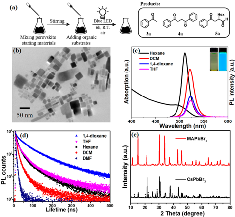
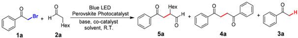
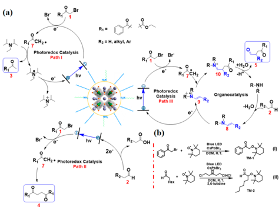
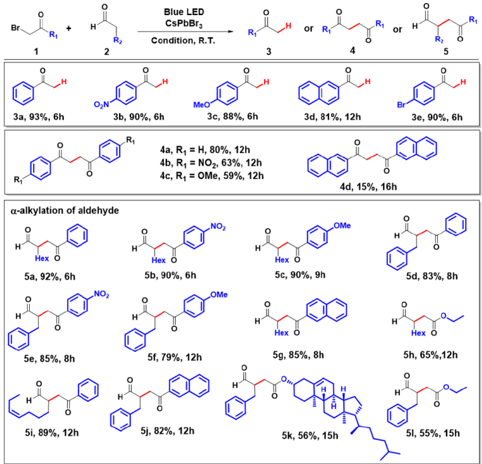

## Lead-Halide Perovskites for Photocatalytic α -Alkylation of Aldehydes

Xiaolin Zhu, † , ‡ Yixiong Lin, † , ‡ Yue Sun, † , ‡ Matthew C. Beard, § and Yong Yan * , † , ‡

ABSTRACT: Cost-e ff ective and e ffi cient photocatalysis are highly desirable in chemical synthesis. Here we demonstrate that readily prepared suspensions of APbBr3 (A = Cs or methylammonium (MA)) type perovskite colloids (ca. 2 -100 nm) can selectively photocatalyze carbon -carbon bond formation reactions, i.e., α -alkylations. Speci fi cally, we demonstrate α -alkylation of aldehydes with a turnover number (TON) of over 52,000 under visible light illumination. Hybrid organic/ inorganic perovskites are revolutionizing photovoltaic research and are now impacting other research fi elds, but their exploration in organic synthesis is rare. Our lowcost, easy-to-process, highly e ffi cient and bandedgetunable perovskite photocatalyst is expected to bring new insights in chemical synthesis.

C arbon -carbon (C -C) bond formation is one of the most fundamental transformations in organic synthesis. Nature is capable of storing solar energy in chemical bonds via photosynthesis. The photoconversion process, involves a series of C -C bond forming photoredox catalytic reactions starting from CO2 and light. 1,2 Tremendous advances in arti fi cial photoredox C -C bond formations have been made, including the development of robust and reliable protocols to merge photoredox catalysis with organocatalysis. 3 -5 A fundamental aim is the development of new modes of small molecule activation via cheap, e ff ective and easy-to-process catalytic systems. Many protocols, including Ru/Ir-based complexes, 3 -6 organic dyes, 7 semiconductors QDs 8,9 etc., can be employed under mild reaction conditions and have broad substrate scope. However, typically these systems either need noble metals or require complicated synthetic protocols, both of which are not desirable.

The recent renaissance in ABX3 hybrid perovskite semiconductors has revolutionized photovoltaics, enabling solutionprocessable solar cells that have now reached 23.3% power conversion e ffi ciency. 10 -13 In addition to the exceptional photovoltaic performance, hybrid perovskite systems have also demonstrated breakthroughs in piezoelectrics, 14 high-gain photodetectors, 15 light-emitting diodes, 16 lasers 17 and transistors. 18 The excellent photovoltaic and optoelectronic performance is attributed to bene fi cial optoelectronic properties, such as, strong light absorption, 19 long charge-carrier

A

[pubs.acs.org/JACS](pubs.acs.org/JACS)

lifetimes 20,21 and long charge-carrier di ff usion lengths. 22,23 Our previous work also reported low trap densities and small surface recombination velocities, leading to a noticeable enhancement of the photogenerated carrier lifetime and mobility. 19,24,25 Thus, given the bene fi cial properties for photovoltaic applications, they also should be of interest in photocatalytic applications. 26,27

Here we report a cost-e ff ective, highly e ffi cient and easy-toprocess photocatalytic system centering on ABX3 Pb-halide perovskite nanocrystals (NCs) for direct C -C bond formation reactions. To demonstrate their photocatalytic characteristics, we explore a model reaction, α -alkylation of aldehydes, a widely employed valuable chemical transformation. Particularly, we demonstrate that APbBr3 NCs can directly photocatalyze the α -alkylation reaction with high yield and without N2-sparging. By slight modi fi cation of the reaction conditions, we show that our photocatalytic system can selectively catalyze other important chemical reactions, such as, sp 3 C-couplings and alkyl-halide reductions. The perovskite photocatalyst studied here are a versatile material system easily prepared from earth-abundant elements and low-cost starting materials. 10 The as-prepared NCs are not only stable in common organic solvents (Figures S1 -5), but also are e ff ective in photocatalysis with a TON of over 52,000 for α -alkylation, 3 orders of magnitude higher than precious Ir or Ru catalysts. As a result, the perovskite photocatalyst are much more economical than Ir/Ru (2-order cost lower, Table S1), rendering them as new promising candidates for broad application in organic synthesis.

The exploration of the perovskites ' photocatalytic characteristics for organic synthesis was inspired by a simple one-pot reaction (Figure 1a). After mixing of the readily available starting materials in an open vial, a one-pot perovskite emissive suspension was formed due to the solvents ' emulsion/deemulsion e ff ect. 28 To the resulting suspension organic substrates 2-bromoacetophenone 1a , and octanal 2a are added at room temperature. Upon blue-LED illumination, several products are generated, including dehalogenated acetophenone 3a (yield 76%), sp 3 C-coupling product 4a (8%), and α -alkylation product 5a (7%). Next, we explore the photocatalytic selectivity toward the desired product.

Received:

August 23, 2018

Published:

January 2, 2019

(a)

Br + H

Stirring

Hex

2a

Mixing perovskite

1a

(b)

50 nm

10%

10°

PL counts

10°

(d)

100

Products:

За

5a

Hexane

DCM

Gram scale colloids of APbBr3 are readily prepared and are further isolated via centrifugation. We obtained perovskite colloids with sizes ranging from 2 to 100 nm (Figures 1b and S2). Perovskites ' photoluminescence (PL) is shown in a variety of solvents (Figures 1c and S3a). The PL lifetimes in various solvents are recorded from ∼ 10 to ∼ 100 ns which are longlived enough to induce charge transfer in these catalytic systems according to Nicewize 8 (Figures 1d and S3b). The lifetimes do not exhibit single exponential decay times likely resulting from a broad size distribution. 28 Overall, these NCs ' are signi fi cantly larger than the reported Bohr radius of APbBr3, and thus their optical properties resemble that of their thin fi lm versions. 29,30 The colloids display a major absorption peak at 500 nm and PL at 513 nm in hexane, indicating a band gap energy of 2.4 eV matching well with bulk APbBr3. X-ray di ff raction (Figure 1e) con fi rmed the perovskite structure. 10,11

Figure 1. (a) One-pot reaction demonstration; (b) TEM of CsPbBr3; (c) absorption and PL spectra of CsPbBr3 in di ff erent solvents. Inset: under ambient light (left) and 365 nm UV light (right); (d) PL lifetimes of CsPbBr3 in various solvents; (e) PXRD of CsPbBr3 and MAPbBr3, * indicates PbBr2 peaks.

Selectivity. A high yield of 3a, 4a and 5a can be selectively obtained under simple alterations of the reaction conditions. Apparently, 5a is of more synthetic signi fi cance toward C -C formations. Starting with 1a and 2a , in the presence of CsPbBr3 NCs, dicyclohexylamine and 2,6-lutidine without N 2 -sparging , the reaction vessel is illuminated with an LED and produces 5a in 75% yield in DCM (Table 1, entry 1). Importantly, freshly prepared solvents, removing water and stabilizer, suppresses dehalogenation but encourages 5a formation (entries 2 -7). 31 Furthermore, using N,N -diisopropyl-ethylamine (DIPEA) (entries 8 -9), produces 3a in a yield

## Table 1. Optimization of Reaction Condition for α -Alkylation of Aldehydes a

a Conditions: 1a (0.5 mmol), 2a (1.0 mmol), CsPbBr3 (1.0 mg), cocatalyst (20 mol %), 2,6-lutidine (1.0 mmol) and solvent (1 mL) under 455 nm LED illumination at R.T. (note: no N2 sparging). b Yield determined by 1 H NMR; c molecule sieves predried solvent; d freshly distilled THF; e freshly distilled THF adding 1% water; f DIPEA instead of 2,6-lutidine as base; g with N2-sparging; h MAPbBr3 instead of CsPbBr3; i without light; j without CsPbBr3; k without base.

|          |                           |           |                | Yield (%) b   | Yield (%) b   | Yield (%) b   |
|----------|---------------------------|-----------|----------------|---------------|---------------|---------------|
| Entry    | Cocatalyst                | Solvent   | Conversion (%) | 5a            | 4a            | 3a            |
| 1        | Cy 2 NH                   | DCM       | >99            | 75            | -             | 15            |
| 2        | Cy 2 NH                   | dioxane   | 90             | 45            | -             | 20            |
| 3        | Cy 2 NH                   | dioxane c | 90             | 55            | -             | 12            |
| 4        | Cy 2 NH                   | THF       | >99            | 15            | 18            | 55            |
| 5        | Cy 2 NH                   | THF c     | >99            | 55            | 6             | 18            |
| 6        | Cy 2 NH                   | THF d     | >99            | 69            | -             | 6             |
| 7        | Cy 2 NH                   | THF e     | >99            | 26            | 10            | 52            |
| 8 f      | -                         | THF d     | 97             | -             | -             | 92            |
| 9 f      | -                         | DCM       | >99            | -             | -             | 95            |
| 10       | (ClCH 2 CH 2 ) 2 NH HCl   | DCM       | >99            | 96            | -             | trace         |
| 11 g     | (ClCH 2 CH 2 ) 2 NH HCl   | DCM       | >99            | 96            | -             | trace         |
| 12       | Cy 2 NH HCl               | DCM       | >99            | 85            | -             | 10            |
| 13       | ( n -C 18 H 37 ) 2 NH HCl | DCM       | 92             | 65            | -             | 25            |
| 14       | n -C 18 H 37 NH 2 HCl     | DCM       | 82             | trace         | -             | 63            |
| 15       | n -C 18 H 37 NH 2         | DCM       | 77             | trace         | -             | 56            |
| 16       | 6                         | DCM       | >99            | 10            | 80            | trace         |
| 17 h     | (ClCH 2 CH 2 ) 2 NH HCl   | DCM       | >99            | 89            | -             | trace         |
| 18 g , h | (ClCH 2 CH 2 ) 2 NH HCl   | DCM       | >99            | 90            | -             | trace         |
| 19 i     | (ClCH 2 CH 2 ) 2 NH HCl   | DCM       | 0              | -             | -             | -             |
| 20 j     | (ClCH 2 CH 2 ) 2 NH HCl   | DCM       | <5             | -             | -             | trace         |
| 21       | -                         | DCM       | <5             | -             | -             | trace         |
| 22 k     | (ClCH 2 CH 2 ) 2 NH HCl   | DCM       | <5             | -             | -             | trace         |

B

-

Blue LED

Perovskite Photocatalyst

Blue LED

6h, R.T.

base, co-catalyst air

solvent, R.T.

Hex

4a

Hex

Sa

4a

За

XXX

(a)

Br

RI

CH2·

R,

За, 93%, 6h

Br

Hex

5a, 92%, 6h

Se, 85%, 8h

5i, 89%, 12h

Br

Blue LED

CsPbBra

Condition, R.T.

R1 =

Rz = H, alkyl, Ar

MeO

3c, 88%, 6h

+H2O, of 95%, demonstrating a highly selective alkyl-halide reduction. When the amine is replaced with 6 , (5S)-( -)-2,2,3-trimethyl5-benzyl-4-imidazolidinone, an expensive cocatalyst commonly used in photoredox catalysis, 3 surprisingly, the sp 3 -C coupling product 4a is obtained in 80% yield (entry 16). Hence, under slight changes in reaction conditions, we can selectively produce 3a , 4a or 5a . Next, we screened various amines as cocatalyst (entry 10 -18). Primary amines result in no alkylation products. (entries 14 -15) Our results corroborate previous fi ndings that secondary ammonium salts are superior to their respective amines for α -alkylation. 32 Overall, bis(2chloroethyl)amine hydrochloride, provides the highest selectivity and yield, up to 96% for 5a , (entry 10) with substrate ratio ( 1a / 2a ) 1/2 (ratio exploration details in Table S2). Anaerobic conditions are not required for 5a formation. (entries 10 -11; 17 -18) As expected, the control experiments revealed no product in the absence of perovskite, light, cocatalyst, or base. (entries 19 -22).

Stability and TON. One of major obstacles concerning the application of Pb-halide perovskites is their instability, particularly toward moisture. 33,34 The situation is quite distinct if Pb-halide perovskites are applied to organic synthesis. We fi nd a surprisingly strong stability of CsPbBr3 in organic solvents indicated by observing the PL spectrum of CsPbBr3 in di ff erent organic solvents for several weeks (MAPbBr3 is less stable, Figure S5). The good stability is also corroborated by a large TON. The CsPbBr3 remain emissive after a typical reaction (Figure S6) indicating they likely remain catalytically active. The colloids are isolated from the previous reaction mixture via centrifuging and then reused for a new reaction without any treatment under identical conditions. The photocatalyst remains active for at least four cycles (Figure S7) suggesting a lower limit of the TON to be at least 52,000 (SI and Table S1). A large aliquot of water will deactivate and completely dissolve the perovskites, rendering a desired opportunity to easily separate the photocatalyst from organic products. Note that the separation of photocatalyst from photoredox reactions remains an issue using Ru/Ir or organic dyes. 35

Mechanism. A proposed mechanism for these observations is outlined in Figure 2a. Photoexcited electrons reduce 1 to form a radical 7 , which is a key step for all three products. In

Figure 2. (a) Proposed mechanism for perovskite catalyzed dehalogenation, sp 3 C-coupling and α -alkylation. (b) TEMPO trapped experiment for radical intermediate validation.

R-N*

C

path I and II, 7 either extracts a hydrogen atom from a sacri fi cial donor (i.e., DIPEA) forming 3 or when a sacri fi cial donor is not present, self-couples producing 4 . Regeneration of the perovskite catalysts can be achieved via oxidation of the sacri fi cial donor in I or oxidation of an aldehyde in II. We also speculate that oxidative quenching by enamine 8 leads to radical 9 (pathway III). Iminium cation 10 is thus produced via a radical -radical reaction followed by hydrolysis to release the product 5 to regenerate the cocatalyst. Radical intermediates are the key components for photoredox catalysis. To further explore our proposed mechanism, radical trapping experiments were conducted with 1a and enamine 8 , respectively (SI and Figure 2b). Corroborating with perovskite quenching experiment (enamine, k q = 2.0 × 10 11 M -1 s -1 ; 1a , k q = 2.7 × 10 10 M -1 s -1 , SI and Figures S8 -10), the radical trapped product TM-1 and TM-2 were all isolated and con fi rmed by 1 H NMR from reaction I and II, while no trapped products were detected in control experiments without CsPbBr3 (Figures S11 -14). Note that TM-2 has been previously illustrated to form from radical 9 trapped by TEMPO. 36 The TEMPO trapped products prove the direct formation of radicals 7 and 9 as shown in our mechanism, supporting our proposed closedcycle mechanism. However, our observation cannot completely rule out the previous reported chain reaction mechanism using a molecular photocatalyst. 37

Reaction Scope. Electron-donating and withdrawing tolerances were observed on α -bromo carbonyls ( 5b , 5c , 5e , 5f ; 79 to 90% yield). The extended aromatic rings a ff orded the desired products 5g (85%) and 5j (82%). Simple α -bromo ester leads to a moderate alkylation yield ( 5h 65%, 5l 55%). Overall, aromatic aldehydes demonstrate slightly less yields, respectively. Product 5k , with 8 chiral centers was also produced with over 56% yield, exhibiting a general acceptance of our photocatalysis. Moreover, the library of product 3 and 4 was expanded. High yields of alkyl-halide reductions ( 3a -c , 3e above 90%, 3d 79%) with DIPEA are shown in Table 2. Selective reduction of alkyl-halide over aryl-halide is also

## Table 2. Scope of Photocatalytic Reductive Dehalogenation, sp 3 -C Couplings, and α -Alkylation of Aldehydes 38

[DOI: 10.1021/jacs.8b08720](http://dx.doi.org/10.1021/jacs.8b08720)

achieved. ( 3e , 90%) The sp 3 -C coupling products 4 were also explored ( 4a -c , 59 -80%, 4d 15%). The lower yield of 3d and 4d is likely due to the fi nite absorption and PL of naphthalene which interferes with the CsPbBr3 NCs absorption, resulting in less-e ffi cient photocatalysis.

Bandedge Tuning. One promising property of the Pbhalide perovskite photocatlysts is that their band structure can be easily tuned. 39 -41 The excited-state redox potentials, E * of a photocatalyst governs organic substrate activation. 5 E * can be de fi ned by E * ox = E ox -E 00 and E * red = E red + E 00 , where E is the potential of the ground-state redox couple and close to the redox level of the conduction and valence bands, E 00 is the energy gap between the zeroth vibrational levels of the ground and excited states and is roughly equal to the energy of the PL with error ca. 100 mV. 42 Thus, E * can be manipulated via perovskite bandedge-tuning. Halide composition of APbCl x Br y I 3 -x -y (0 ≤ x , y ≤ 3) with a ratio varying on x , and y , leads to bandgaps covering from 3.2 to 1.5 eV. 43 -45 Such large bandedge-tuning (1.7 eV) can be easily reached via simply mixing of di ff erent ratios of halides at the initial mixing, 10,46,47 or via anion-exchange after synthesis Other catalysts, . i.e., Ir/Ru complexes, require signi fi cant synthetic e ff orts to reach speci fi c E * values. Estimation E * of APbCl x Br y I 3 -x -y (Table S3) leads to perovskites covering almost all known noble-metal catalysts E * , implying potential for broader substrate photoactivations via perovskite.

With regards to cost-e ff ective, operational convenience and possible scale up, it is notable to consider that our perovskite protocol: (1) only requires readily available non-noble materials, with 2 orders of magnitude lower costs than Ru/Ir catalyst; (2) presents high catalytic TON evidenced by 3 orders of magnitude higher value than Ru/Ir catalysts; (3) only requires minimum synthetic e ff ort to produce the catalysts; (4) may activate a broader scope of organic substrates due to easy bandedge-tuning; (5) is easy-to-process since perovskites are water washable; (6) only requires visible light; (7) does not require anaerobic sparging; and (8) does not require heating or cooling.

In summary, we established a hybrid halide perovskite photocatalytic system for organic synthesis. APbBr3 NC colloids are directly employed in organic solvents to demonstrate highly e ffi cient α -alkylation of aldehydes, sp 3 -C couplings and alkyl-halide reductions. High TON and low-cost garners a signi fi cant progress of the current perovskite system. Easy and wide bandedge-tuning of perovskites NCs ripostes the key challenge to activate broader range of organic substrates requiring di ff erent energy level from enamine intermediates, alkenes, carbonyls, halides, acetic acids to amines etc. for C -C, C -O and C -N formations. The potential broad application of this cost-e ff ective, easily prepared, highly e ffi cient and band-tunable hybrid halide perovskites may bring in new insights in photocatalysis of organic reactions.

## ■ ASSOCIATED CONTENT

## * Supporting Information S

The Supporting Information is available free of charge on the ACS Publications website at DOI: 10.1021/jacs.8b08720.

Materials and methods, synthesis procedures, and 1 H and 13 C NMR spectra (PDF)

## ■ AUTHOR INFORMATION

## Corresponding Author

[* yong.yan@sdsu.edu](mailto:yong.yan@sdsu.edu)

## ORCID

Xiaolin Zhu:

0000-0001-6568-0308

Matthew C. Beard:

0000-0002-2711-1355

Yong Yan:

0000-0001-6361-0541

## Notes

The authors declare the following competing fi nancial interest(s): A provisional patent application has been fi led on the perovskite catalysts and their use in photocatalytic organic synthesis.

## ■ ACKNOWLEDGMENTS

This work is supported by NSF under Chemical Catalysis program, award 1764142, 1851747 to Y. Yan. M. Beard acknowledges support as part of the Center for Hybrid Organic Inorganic Semiconductors for Energy (CHOISE) an Energy Frontier Research Center funded by the Offi ce of Science, Offi ce of Basic Energy Sciences within the U.S. Department of Energy. Part of this work was authored by Alliance for Sustainable Energy, LLC, the manager and operator of the National Renewable Energy Laboratory under Contract No. DE-AC36-08GO28308. The views expressed in the article do not necessarily represent the views of the DOE or the U.S. Government. The U.S. Government retains and the publisher, by accepting the article for publication, acknowledges that the U.S. Government retains a nonexclusive, paid-up, irrevocable, worldwide license to publish or reproduce the published form of this work, or allow others to do so, for U.S. Government purposes. We also thank M. Uddin and W. Chen for help with XRD measurements.

## ■ REFERENCES

- (1) Ravelli, D.; Protti, S.; Fagnoni, M. Carbon-Carbon Bond Forming Reactions via Photogenerated Intermediates. Chem. Rev. 2016 , 116 , 9850 -9913.
- (2) White, J. L.; Baruch, M. F.; Pander, J. E., III; Hu, Y.; Fortmeyer, I. C.; Park, J. E.; Zhang, T.; Liao, K.; Gu, J.; Yan, Y.; Shaw, T. W.; Abelev, E.; Bocarsly, A. B. Light-Driven Heterogeneous Reduction of Carbon Dioxide: Photocatalysts and Photoelectrodes. Chem. Rev. 2015 , 115 , 12888 -12935.
- (3) Nicewicz, D. A.; MacMillan, D. W. C. Merging Photoredox Catalysis with Organocatalysis: The Direct Asymmetric Alkylation of Aldehydes. Science 2008 , 322 , 77 -80.
- (4) Pirnot, M. T.; Rankic, D. A.; Martin, D. B. C.; MacMillan, D. W. C. Photoredox Activation for the Direct β -Arylation of Ketones and Aldehydes. Science 2013 , 339 , 1593 -1596.
- (5) Prier, C. K.; Rankic, D. A.; MacMillan, D. W. C. Visible Light Photoredox Catalysis with Transition Metal Complexes: Applications in Organic Synthesis. Chem. Rev. 2013 , 113 , 5322 -5363.
- (6) Twilton, J.; Le, C.; Zhang, P.; Shaw, M. H.; Evans, R. W.; MacMillan, D. W. C. The Merger of Transition Metal and Photocatalysis. Nat. Rev. Chem. 2017 , 1 , 0052.
- (7) Romero, N. A.; Nicewicz, D. A. Organic Photoredox Catalysis. Chem. Rev. 2016 , 116 , 10075 -10166.
- (8) Caputo, J. A.; Frenette, L. C.; Zhao, N.; Sowers, K. L.; Krauss, T. D.; Weix, D. General and Efficient C -C Bond Forming Photoredox Catalysis with Semiconductor Quantum Dots. J. Am. Chem. Soc. 2017 , 139 , 4250 -4253.
- (9) Zhang, Z.; Edme, K.; Lian, S.; Weiss, E. A. Enhancing the Rate of Quantum-Dot-Photocatalyzed Carbon -Carbon Coupling by Tuning the Composition of the Dot ' s Ligand Shell. J. Am. Chem. Soc. 2017 , 139 , 4246 -4249.

- (10) Zhao, Y.; Zhu, K. Organic -Inorganic Hybrid Lead Halide Perovskites for Optoelectronic and Electronic Applications. Chem. Soc. Rev. 2016 , 45 , 655 -689.
- (12) Best Research-Cell E ffi ciencies Chart -NREL. https://www. nrel.gov/pv/assets/pdfs/pv-e ffi ciencies-07-17-2018.pdf (accessed July 17, 2018).
- (11) Saparov, B.; Mitzi, D. B. Organic -Inorganic Perovskites: Structural Versatility for Functional Materials Design. Chem. Rev. 2016 , 116 , 4558 -4596.
- (13) Manser, J. S.; Christians, J. A.; Kamat, P. V. Intriguing Optoelectronic Properties of Metal Halide Perovskites. Chem. Rev. 2016 , 116 , 12956 -13008.
- (14) You, Y.-M.; Liao, W.-Q.; Zhao, D.; Ye, H.-Y.; Zhang, Y.; Zhou, Q.; Niu, X.; Wang, J.; Li, P.-F.; Fu, D.-W.; Wang, Z.; Gao, S.; Yang, K.; Liu, J.-M.; Li, J.; Yan, Y.; Xiong, R.-G. An Organic-Inorganic Perovskite Ferroelectric with Large Piezoelectric Response. Science 2017 , 357 , 306 -309.
- (15) Dou, L.; Yang, Y.; You, J.; Hong, Z.; Chang, W.-H.; Li, G.; Yang, Y. Solution-Processed Hybrid Perovskite Photodetectors with High Detectivity. Nat. Commun. 2014 , 5 , 5404.
- (16) Cho, H.; Jeong, S.-H.; Park, M.-H.; Kim, Y.-H.; Wolf, C.; Lee, C.-L.; Heo, J. H.; Sadhanala, A.; Myoung, N.; Yoo, S.; Im, S. H.; Friend, R. H.; Lee, T.-W. Overcoming the Electroluminescence Efficiency Limitations of Perovskite Light-Emitting Diodes. Science 2015 , 350 , 1222 -1225.
- (17) Zhu, H.; Fu, Y.; Meng, F.; Wu, X.; Gong, Z.; Ding, Q.; Gustafsson, M. V.; Trinh, M. T.; Jin, S.; Zhu, X.-Y. Lead Halide Perovskite Nanowire Lasers with Low Lasing Thresholds and High Quality Factors. Nat. Mater. 2015 , 14 , 636 -642.
- (18) Senanayak, S. P.; Yang, B.; Thomas, T. H.; Giesbrecht, N.; Huang, W.; Gann, E.; Nair, B.; Goedel, K.; Guha, S.; Moya, X.; McNeill, C. R.; Docampo, P.; Sadhanala, A.; Friend, R. H.; Sirringhaus, H. Understanding Charge Transport in Lead Iodide Perovskite Thin-Film Field-Effect Transistors. Sci. Adv. 2017 , 3 , e1601935.
- (19) Yang, Y.; Yang, M.; Moore, D. T.; Yan, Y.; Miller, E. M.; Zhu, K.; Beard, M. C. Top and Bottom Surfaces Limit Carrier Lifetime in Lead Iodide Provskite Films. Nat. Energy 2017 , 2 , 16207.
- (20) Yang, Y.; Ostrowski, D. P.; France, R. M.; Zhu, K.; van de Lagemaat, J.; Luther, J. M.; Beard, M. C. Observation of a HotPhonon Bottleneck in Lead-Iodide Perovskites. Nat. Photonics 2016 , 10 , 53 -59.
- (21) Yang, Y.; Yang, M.; Li, Z.; Crisp, R.; Zhu, K.; Beard, M. C. Comparison of Recombination Dynamics in CH3NH3PbBr3 and CH3NH3PbI3 Perovskite Films: Influence of Exciton Binding Energy. J. Phys. Chem. Lett. 2015 , 6 , 4688 -4692.
- (22) Dong, Q.; Fang, Y.; Shao, Y.; Mulligan, P.; Qiu, J.; Cao, L.; Huang, J. Electron-Hole Diffusion Lengths &gt; 175 μ m in SolutionGrown CH3NH3PbI3 Single Crystals. Science 2015 , 347 , 967 -970.
- (23) Xing, G.; Mathews, N.; Sun, S.; Lim, S. S.; Lam, Y. M.; Gra ̈ tzel, M.; Mhaisalkar, S.; Sum, T. C. Long-Range Balanced Electron- and Hole-Transport Lengths in Organic-Inorganic CH3NH3PbI3. Science 2013 , 342 , 344 -347.
- (24) Yang, Y.; Yan, Y.; Yang, M.; Choi, S.; Zhu, K.; Luther, J. M.; Beard, M. C. Low Surface Recombination Velocity in Solution-Grown CH3NH3PbBr3 Perovskite Single Crystal. Nat. Commun. 2015 , 6 , 7961.
- (25) Wang, L.; Wang, H.; Wagner, M.; Yan, Y.; Jakob, D. S.; Xu, X. G. Nanoscale Simultaneous Chemical and Mechanical Imaging via Peak Force Infrared Microscopy. Sci. Adv. 2017 , 3 , e1700255.
- (26) Xu, Y.-F.; Yang, M.-Z.; Chen, B.-X.; Wang, X.-D.; Chen, H.-Y.; Kuang, D.-B.; Su, C.-Y. A CsPbBr3 Perovskite Quantum Dot/ Graphene Oxide Composite for Photocatalytic CO2 Reduction. J. Am. Chem. Soc. 2017 , 139 , 5660 -5663.
- (27) Chen, K.; Deng, X.; Dodekatos, G.; Tu ̈ ysu ̈ z, H. Photocatalytic Polymerization of 3,4-Ethylenedioxythiophene over Cesium Lead Iodide Perovskite Quantum Dots. J. Am. Chem. Soc. 2017 , 139 , 12267 -12273.
- (28) Zhang, F.; Zhong, H.; Chen, C.; Wu, X.; Hu, X.; Huang, H.; Han, J.; Zou, B.; Dong, Y. Brightly Luminescent and Color-Tunable Colloidal CH3NH3PbX3 (X = Br, I, Cl) Quantum Dots: Potential Alternatives for Display Technology. ACS Nano 2015 , 9 , 4533 -4542.
20. ́ ́ ́ (29) Schmidt, L. C.; Pertegas, A.; Gonzalez-Carrero, S.; Malinkiewicz, O.; Agouram, S.; Espallargas, G. M.; Bolink, H. J.; Galian, R. E.; Perez-Prieto, J. Nontemplate Synthesis of CH3NH3PbBr3 Perovskite Nanoparticles. J. Am. Chem. Soc. 2014 , 136 , 850 -853.
- (30) Sichert, J. A.; Tong, Y.; Mutz, N.; Vollmer, M.; Fischer, S.; Milowska, K. Z.; Garcia Cortadella, R.; Nickel, B.; Cardenas-Daw, C.; Stolarczyk, J. K.; Urban, A. S.; Feldmann, J. Quantum Size Effect in Organometal Halide Perovskite Nanoplatelets. Nano Lett. 2015 , 15 , 6521 -6527.
- (31) Commercial available THF may contain stabilizer and water, distillation improves 5a yield.
- (32) Terrett, J. A.; Clift, M. D.; MacMillan, D. W. C. Direct β -Alkylation of Aldehydes via Photoredox Organocatalysis. J. Am. Chem. Soc. 2014 , 136 , 6858 -6861.
- (33) You, J.; Meng, L.; Song, T. B.; Guo, T. F.; Chang, W. H.; Hong, Z.; Chen, H.; Zhou, H.; Chen, Q.; Liu, Y.; De Marco, N.; Yang, Y. M.; Yang, Y. Improved Air Stability of Perovskite Solar Cells via SolutionProcessed Metal Oxide Transport Layers. Nat. Nanotechnol. 2016 , 11 , 75 -81.
- (34) Huang, S.; Li, Z.; Kong, L.; Zhu, N.; Shan, A.; Li, L. Enhancing the Stability of CH3NH3PbBr3 Quantum Dots by Embedding in Silica Spheres Derived from Tetramethyl Orthosilicate in ' Waterless ' Toluene. J. Am. Chem. Soc. 2016 , 138 , 5749 -5752.
- (35) Choplin, A.; Quignard, F. From Supported Homogeneous Catalysts to Heterogeneous Molecular Catalysts. Coord. Chem. Rev. 1998 , 178 -180 , 1679 -1702.
- (36) Bui, N.-N.; Ho, X.-H.; Mho, S.-I.; Jang, H.-Y. Organocatalyzed α -Oxyamination of Aldehydes Using Anodic Oxidation. Eur. J. Org. Chem. 2009 , 2009 , 5309 -5312.
- (37) Cismesia, M. A.; Yoon, T. P. Characterizing Chain Processes in Visible Light Photoredox Catalysis. Chem. Sci. 2015 , 6 , 5426 -5434.
- (38) Reaction condition: Path I: 1 (0.5 mmol), CsPbBr3 (1.0 mg), DIPEA (1.0 mmol); Path II: 1 (0.5 mmol), 2 (1.0 mmol), 2,6-lutidine (1.0 mmol), 6 (20 mol%), CsPbBr3 (1.0 mg); Path III: 1 (0.5 mmol), 2 (1.0 mmol), 2,6-lutidine (1.0 mmol), bis(2-chloroethyl)amine (20 mol%), CsPbBr3 (1.0 mg).
- (39) Eperon, G. E.; Stranks, S. D.; Menelaou, C.; Johnston, M. B.; Herz, L. M.; Snaith, H. J. Formamidinium Lead Trihalide: A Broadly Tunable Perovskite for Efficient Planar Heterojunction Solar Cells. Energy Environ. Sci. 2014 , 7 , 982 -988.
- (40) Xing, G.; Mathews, N.; Lim, S. S.; Yantara, N.; Liu, X.; Sabba, D.; Gra ̈ tzel, M.; Mhaisalkar, S.; Sum, T. C. Low-Temperature Solution-Processed Wavelength-Tunable Perovskites for Lasing. Nat. Mater. 2014 , 13 , 476 -480.
- (41) Feng, H.-J.; Paudel, T. R.; Tsymbal, E. Y.; Zeng, X. C. Tunable Optical Properties and Charge Separation in CH3NH3SnxPb1 -x I 3/ TiO2-Based Planar Perovskites Cells. J. Am. Chem. Soc. 2015 , 137 , 8227 -8236.
- (42) Jones, W. E.; Fox, M. A. Determination of Excited-State Redox Potentials by Phase-Modulated Voltammetry. J. Phys. Chem. 1994 , 98 , 5095 -5099.
- (43) Jang, D. M.; Park, K.; Kim, D. H.; Park, J.; Shojaei, F.; Kang, H. S.; Ahn, J.-P.; Lee, J. W.; Song, J. K. Reversible Halide Exchange Reaction of Organometal Trihalide Perovskite Colloidal Nanocrystals for Full-Range Band Gap Tuning. Nano Lett. 2015 , 15 , 5191 -5199.
- (44) Akkerman, Q. A.; D ' Innocenzo, V.; Accornero, S.; Scarpellini, A.; Petrozza, A.; Prato, M.; Manna, L. Tuning the Optical Properties of Cesium Lead Halide Perovskite Nanocrystals by Anion Exchange Reactions. J. Am. Chem. Soc. 2015 , 137 , 10276 -10281.
- (45) Amat, A.; Mosconi, E.; Ronca, E.; Quarti, C.; Umari, P.; Nazeeruddin, M. K.; Gra ̈ tzel, M.; De Angelis, F. Cation-Induced Band-Gap Tuning in Organohalide Perovskites: Interplay of SpinOrbit Coupling and Octahedra Tilting. Nano Lett. 2014 , 14 , 3608 -3616.

- (46) Ravi, V. K.; Markad, G. B.; Nag, A. Band Edge Energies and Excitonic Transition Probabilities of Colloidal CsPbX3 (X = Cl, Br, I) Perovskite Nanocrystals. ACS Energy Lett. 2016 , 1 , 665 -671.
- (47) Nedelcu, G.; Protesescu, L.; Yakunin, S.; Bodnarchuk, M. I.; Grotevent, M. J.; Kovalenko, M. V. Fast Anion-Exchange in Highly Luminescent Nanocrystals of Cesium Lead Halide Perovskites (CsPbX3, X = Cl, Br, I). Nano Lett. 2015 , 15 , 5635 -5640.