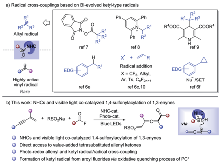
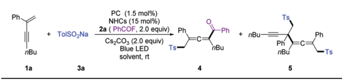
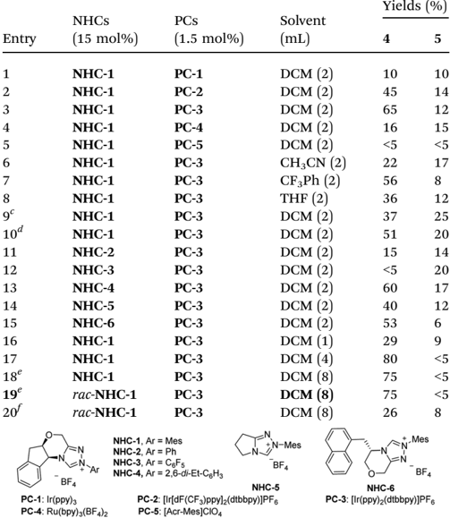
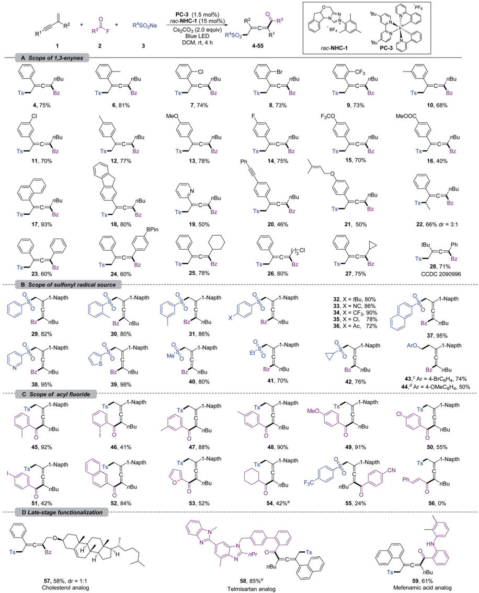
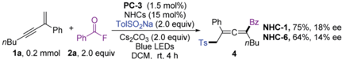
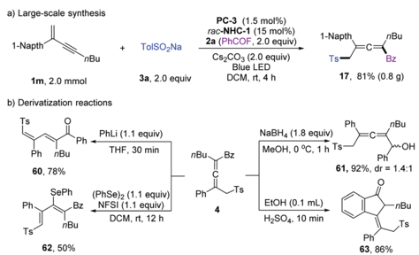
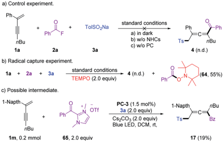
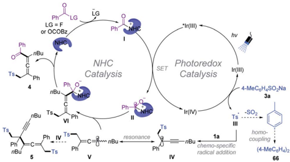

Open Access A

a) Radical cross-couplings based on Bl-evolved ketyl-type radicals

BY-NO

## Chemical Science

EDG

ref 8

Radical addition

X = CF3, Alkyl,

Ar, Ts, OnF2n+1

## EDGE ARTICLE

NHC-cat.

+ RSO¿Na +

RSO2

Photo-cat.

Blue LEDs

NHCs and visible light co-catalyzed 1,4-sulfonylacylation of 1,3-enynes

Direct access to value-added tetrasubstituted allenyl ketones

Cite this: Chem. Sci. , 2022, 13 , 3169

All publication charges for this article have been paid for by the Royal Society of Chemistry

Received 4th November 2021 Accepted 6th February 2022

DOI: 10.1039/d1sc06100c

rsc.li/chemical-science

## Introduction

Radical cross-coupling between two carbon radicals has emerged as a powerful platform for constructing C -Cbonds and has received increasing attention. 1 Since the radical -radical coupling reactions proceed in a di ff usion-controlled manner, selectivity modulation is the critical challenge. 1 b Through radical addition to the unsaturated bond to form a C -C bond, acyl radicals have been utilized in preparing diverse carbonyl compounds. 2 However, radical-coupling reactions between acyl and other carbon-centered radicals are rare. N-Heterocyclic carbene (NHC) catalysis has emerged as an attractive strategy in synthetic chemistry to access value-added organics via the formation of the key Breslow intermediate (BI). 3 Recently, the single-electron-transfer (SET) of BI was found to provide ketyltype radical species, which opens a new avenue for acyl radical chemistry. 4 -13 As a result, NHC catalyzed radicalcoupling has attracted great attention a  er the pioneering work of Ohmiya in 2019. 7 a Alkyl radical sources such as redoxactive esters, 7 Katritzky pyridinium salts, 8 Hantzsch ester, 9

a Jilin Province Key Laboratory of Organic Functional Molecular Design &amp; Synthesis, Department of ChemistryNortheast Normal University, Changchun 130024, China. E-mail: zhenggf265@nenu.edu.cn; zhangq651@nenu.edu.cn

b School of Environment, Northeast Normal University, Changchun 130117, China

c State Key Laboratory of Organometallic Chemistry, Shanghai Institute of Organic Chemistry, Chinese Academy of Sciences, 345 Lingling Lu, Shanghai 200032, China

† Electronic supplementary information (ESI) available. CCDC 2090996. For ESI and crystallographic data in CIF or other electronic format see DOI: 10.1039/d1sc06100c

Rare

R

R'OOC

EDG

‚COOR"

ref 9

Nu /SET

ref 6f via

## NHC and visible light-mediated photoredox cocatalyzed 1,4-sulfonylacylation of 1,3-enynes for tetrasubstituted allenyl ketones †

Lihong Wang, a Ruiyang Ma, a Jiaqiong Sun, b Guangfan Zheng * a and Qian Zhang * ac

The modulation of selectivity of highly reactive carbon radical cross-coupling for the construction of C -C bonds represents a challenging task in organic chemistry. N-Heterocyclic carbene (NHC) catalyzed radical transformations have opened a new avenue for acyl radical cross-coupling chemistry. With this method, highly selective cross-coupling of an acyl radical with an alkyl radical for e ffi cient construction of C -C bonds was successfully realized. However, the cross-coupling reaction of acyl radicals with vinyl radicals has been much less investigated. We herein describe NHC and visible light-mediated photoredox cocatalyzed radical 1,4-sulfonylacylation of 1,3-enynes, providing structurally diversi fi ed valuable tetrasubstituted allenyl ketones. Mechanistic studies indicated that ketyl radicals are formed from aroyl fl uorides via the oxidative quenching of the photocatalyst excited state, allenyl radicals are generated from chemo-speci fi c sulfonyl radical addition to the 1,3-enynes, and fi nally, the key allenyl and ketyl radical cross-coupling provides tetrasubstituted allenyl ketones.

benzylic C -H bonds, 6 e alkylborates, 10 g ole  ns 6 c ,10 and cyclopropanes 6 f could be used to perform cross-coupling reactions with ketyl radicals to form C -C bonds under thermal or photoredox conditions (Scheme 1a). Despite those innovative approaches, NHC catalyzed radical transformations have mainly been focused on coupling with alkyl radical species, while cross-coupling between highly active vinyl radicals and ketyl radicals though being extremely attractive is still largely underdeveloped. 11

On the other hand, radical 1,4-difunctionalization 14,15 of 1,3enynes provides an elegant and versatile strategy for

Scheme 1 Radical C -C bond formation based on BI-derived ketyltype radicals.

View Article Online View Journal  | View Issue

Open Access A

nBu

1a

BY-NO

cC)

rac-NHC-1

PC-3

PC (1.5 mol%)

NHCs (15 mol%)

NHC-1, Ar = Mes

BF4

Blue LED

NHC-4, Ar = 2,6-di-Et-C6H3

solvent, rt

Ph nBu

N-Mes

- BF 4

Ts

DOM (8)

N-Mes

-Ph

BF4

nBul

NHC-5

NHC-6

tetrasubstituted allenes from easily available feedstocks. In this regard, in situ generated allene radicals undergo cyanation, 15 a -d arylation, 15 e -i halogenation, 15 j alkynylation, 15 k tri- uoromethylation, 15 l or intramolecular cyclization 15 m to a ff ord functionalized allenes. Radical acylation of 1,3-enynes may provide straightforward access to value-added allenyl ketone units, 11 which are a crucial core in important nature products 16 and synthetic intermediates. 17 However, radical acylation of 1,3enynes has been much less developed and is limited to carboacylation, 11 mainly due to the lack of an e ffi cient acyl transfer approach. Recently, Studer et al. developed acylative difunctionalization of ole  ns 6 c /cyclopropanes 6 f and formal alkenyl 6 d / benzylic 6 e C -H acylation by employing aroyl  uorides as ketyltype radical precursors via photo-induced SET. Inspired by those elegant approaches, we speculated that an NHC and visible light co-catalyzed system 6 c -f ,9,12,13 might enable the generation of allenyl radicals and NHC stabilized ketyl radicals under extremely mild conditions, which may provide an opportunity for radical acylation of 1,3-enynes. Sulfonecontaining compounds found widespread applications in organic synthesis, medicinal chemistry, and materials science. 18 As part of our continued interest in radical chemistry 19 a -g and NHC catalysis, 19 h we now describe the development of NHC and photocatalysis co-catalyzed three-component radical 1,4-sulfonylacylation of 1,3-enynes, providing direct access to structurally diversi  ed tetrasubstituted allenyl ketones (Scheme 1b).

## Results and discussion

We commenced our investigation by employing a 1,3-enyne ( 1a ), benzoyl  uoride ( 2a ), and TolSO2Na ( 3a ) as the prototype substrates, and PC-1 (1.5 mol%) and NHC-1 (15 mol%) as catalysts. Pleasingly, in dichloromethane (DCM), under irradiation with a blue LED at room temperature for 4 h, the expected allenyl ketone 4 was obtained in 10% yield in combination with competitive byproduct 5 (10%). 20 Ir-based photocatalysts PC-2 and PC-3 improved the reactivity and selectivity (Table 1, entries 2 and 3), while PC-4 and PC-5 were ine ffi cient for this reaction (Table 1, entries 4 and 5). The employment of other solvents such as CH3CN, PhCF3, or THF provided 4 in relatively lower yields (entries 6 -8). The structure of NHCs was crucial for chemo-selectivity control (entries 11 -15). NHC-2 and NHC-3 were unsatisfactory (entries 11 and 12). The N -2,6-diethyl phenyl substituted catalyst NHC-4 a ff orded 4 with a slightly diminished yield compared to NHC-1 (entry 13). For NHC-5 or NHC-6 , decreased yield was observed (entries 14 and 15). Other bases, such as CsOAc and K2CO3, were applicable, with slightly lower yields (entries 9 and 10). To our delight, the yield could be further improved by running the reaction at lower concentration (Table 1, entries 16 and 17), a ff ording 4 in 80% isolated yield with negligible yield of 5 in 4 mL DCM (entry 17). The desired 1,4-sulfonylacylation product 3aa was isolated in 75% yield when the reaction was run at 0.2 mmol scales (entries 18 and 19) by employing chiral or racemic NHC-1 as the catalyst, and these conditions were thus de  ned as the standard reaction conditions for subsequent investigations. Finally, benzoic

|

nBu

Ph

2b

Table 1 Conditions optimization a , b

a Unless otherwise noted, all the reactions were carried out with 1a (0.1 mmol), 2a (0.2 mmol), 3a (0.2 mmol), NHCs (0.015 mmol), Cs2CO3 (0.2 mmol), and PCs (0.0015 mmol) in anhydrous solvent, and irradiation with a blue LED (453.5 nm, 10 W) at room temperature for 4 h. b Isolated yields. c CsOAc (0.2 mmol) was used as a base. d K2CO3 (0.2 mmol) was used as a base. e 0.2 mmol scale reaction was conducted. f Benzoic anhydride (0.4 mmol) was used instead of 2a .

|       | NHCs        | PCs        | Solvent (mL)   | Yields   | Yields   |
|-------|-------------|------------|----------------|----------|----------|
| Entry | (15 mol%)   | (1.5 mol%) |                | 4        | 5        |
| 1     | NHC-1       | PC-1       | DCM (2)        | 10       | 10       |
| 2     | NHC-1       | PC-2       | DCM (2)        | 45       | 14       |
| 3     | NHC-1       | PC-3       | DCM (2)        | 65       | 12       |
| 4     | NHC-1       | PC-4       | DCM (2)        | 16       | 15       |
| 5     | NHC-1       | PC-5       | DCM (2)        | <5       | <5       |
| 6     | NHC-1       | PC-3       | CH 3 CN (2)    | 22       | 17       |
| 7     | NHC-1       | PC-3       | CF 3 Ph (2)    | 56       | 8        |
| 8     | NHC-1       | PC-3       | THF (2)        | 36       | 12       |
| 9 c   | NHC-1       | PC-3       | DCM (2)        | 37       | 25       |
| 10 d  | NHC-1       | PC-3       | DCM (2)        | 51       | 20       |
| 11    | NHC-2       | PC-3       | DCM (2)        | 15       | 14       |
| 12    | NHC-3       | PC-3       | DCM (2)        | <5       | 20       |
| 13    | NHC-4       | PC-3       | DCM (2)        | 60       | 17       |
| 14    | NHC-5       | PC-3       | DCM (2)        | 40       | 12       |
| 15    | NHC-6       | PC-3       | DCM (2)        | 53       | 6        |
| 16    | NHC-1       | PC-3       | DCM (1)        | 29       | 9        |
| 17    | NHC-1       | PC-3       | DCM (4)        | 80       | <5       |
| 18 e  | NHC-1       | PC-3       | DCM (8)        | 75       | <5       |
| 19 e  | rac - NHC-1 | PC-3       | DCM (8)        | 75       | <5       |
| 20 f  | rac - NHC-1 | PC-3       | DCM (8)        | 26       | 8        |

anhydride was employed as an acyl radical precursor, and 3aa was obtained in 26% yield (entry 20).

With the optimized reaction conditions, the scope of 1,3enynes was explored. As shown in Scheme 2a, 1,3-enynes bearing various electron-donating or -withdrawing substituents at the ortho ( 6 -9 ), meta ( 10 and 11 ), or para ( 12 -16 ) positions of the 2-phenyl rings, such as alkyl, methoxyl, halogen, methoxycarbonyl, tri  uoromethyl, and tri  uoromethoxy groups, were fully tolerated a ff ording the corresponding products 6 -16 smoothly. 1,3-Enynes bearing naphthalene,  uorene, and pyridine were also compatible with the transformation, and corresponding products 17 -19 were formed in 50 -93% yields. The functional groups linked to the alkyne triple bond could also be diversi  ed. As shown in Scheme 2a, 1,3-enynes with n -hexyl ( 4 -21 ), cyclohexyl ( 25 ), cyclopropyl ( 27 ), and chloroalkyl ( 26 ) groups were tolerated for this transformation. Moreover, good coupling

Open Access A

BY-NO

cC)

Scope of 1,3-enynes

4, 75%

11, 70%

nBu

17, 93%

23, 60%

B Scope of sulfonyl radical source

Napth

29, 82%

-Napth

38, 95%

C Scope of acyl fluoride

-1-Napth nBu

45, 92%

1-Napth nBu

51, 42%

D Late-stage functionalization

57, 58%, dr = 1:1

Cholesterol analog

PC-3

(1.5 mol%)

rac-NHC-1 (15 mol%)

Cs2CO3 (2.0 equiv)

Blue LED

DCM, rt, 4 h

R^SO2

Scheme 2 Substrate scope for 1,4-sulfonylacylation of 1,3-enynes. a , b a Reaction conditions: unless otherwise noted, all the reactions were carried out with 1 (0.2 mmol), 2 (0.4 mmol), 3 (0.4 mmol), rac -NHC-1 (0.03 mmol), PC-3 (0.003 mmol) and Cs2CO3 (0.4 mmol) in DCM (8 mL) at rt under N2, and irradiation with a blue LED (453.5 nm, 10 W) for 4 h. b Isolated yield. c 4-BrC6H4OCH2BF4K was used as a radical source. d 4OMeC6H4OCH2BF4K was used as a radical source. e Reactions were carried out with in situ generated acyl fl uoride; see the ESI † for detailed reaction conditions.

e ffi ciencies were maintained for 2,4-diaryl substituted 1,3enynes ( 23 and 24 ). It should be noted that the vulnerable Bpin ( 24 ), insular alkyne ( 20 ), and ole  n ( 21 ) units have been preserved a  er transformation. Furthermore, internal 1,3enynes and 2-alkyl substituted 1,3-enynes were applicable, a ff ording 22 and 28 in 66% (3 : 1 dr) and 71% yields,

R'SO¿Na

'Bu

Open Access A

a) Large-scale synthesis a) Control experiment.

Ph

1-Napth nBu

nBui

1a, 0.2 mmol 2a, 2.0 equiv nBu

BY-NO

1m, 2.0 mmol cC)

1a b) Derivatization reactions

b) Radical capture experiment.

1a

TEMPO (2.0 equiv)

NHCs (15 mol%)

PC-3 (1.5 mol%)

PC-3 (1.5 mol%)

Phi

=C=

NHC-1, 75%, 18% ee rac-NHC-1 (15 mol%)

2a (PhCOF, 2.0 equiv)

TolSO¿Na

Blue LEDs

DCM, rt, 4 h standard conditions

Cs2CO3 (2.0 equiv)

Ts nBu

Blue LED

a) in čark

DCM, rt, 4 h

1-Napth nBu

NHC-6, 64%, 14% ee

Phl

-Ph b) w/o NHCs

Ts nBu

17, 81% (0.8 g)

Ph'

O-N

MeOH, 0 °C, 1 h TS

За

Ph nBu

THF, 30 min nBu-

~OH

Ph

Scheme 3 Attempts at asymmetric 1,4-sulfonylacylation of 1,3enynes. PC-3 (1.5 mol%) 1-Napth nBu Ph'1 IS

Bz nBu

3a (2.0 equiv)

EtOH (0.1 mL)

Cs2CO3 (2.0 equiv)

H2SO4, 10 min

Blue LED, DCM, rt, nBu

nBu

‚Ts respectively. The structure of 28 was con  rmed by X-ray singlecrystal di ff raction (CCDC 2090996). 21 Next, we turned our attention to the scope of the sulfonyl radical source; various b -sulfonated allenyl ketones 29 -40 could be obtained in good yields (Scheme 2b). Sodium arylsul  nates with methyl substituents in ortho - and meta -positions were well compatible under the reaction conditions, delivering 30 and 31 in 80 and 86% yields, respectively. The functional group tolerances and electronic e ff ects were next investigated based on para -substituted sodium arylsul  nates. An array of electron-donating ( t -Bu), -withdrawing (cyano, tri  uoromethyl, and carbonyl), and halogen groups were tolerated under the standard conditions, a ff ording 32 -36 in 72 -90% yields. Sodium arylsul  nates containing naphthalene ( 37 ), pyridine ( 38 ), and thiophene ( 39 ) proved to be viable substrates. Notably, methyl, ethyl and cyclopropyl substituted sodium sul  te could also deliver difunctionalization products 40 -42 in 70 -80% yield.

Ph

Very recently, the Du 11 a and Huang 11 b groups developed 1,4alkylacylation of 1,3-enynes under thermal conditions by employing an electrophilic alkyl radical precursor. It should be noted that our NHC and PC co-catalyzed system could be extended to alkyl tri  uoroborates. By employing Scheidt's aryloxymethyl tri  uoroborates, 10 h the desired 1,4-alkylacylation products 43 and 44 were obtained in 74 and 50% yields, respectively. These exciting results encouraged us to evaluate the scope of acyl  uorides (Scheme 2c). This sulfonylacylation reaction was insensitive to the steric hindrance of benzoyl  uoride ( 45 -53 ). The electron-donating aryl acyl  uorides showed excellent reactivities ( 45 and 48 -50 ), while the presence of strong electron-de  cient groups ( 55 ) led to low e ffi ciency. Remarkably, the iodine group, which is sensitive in most metalcatalyzed coupling reactions, did not inhibit the reaction ( 46 and 51 ), providing an opportunity for further transformations.

Scheme 4 Large-scale synthesis and derivatization reactions.

|

Ph

OTf

NFSI (1.1 equiv)

DCM, rt, 12 h

-CE

3a, 2.0 equiv

Scheme 5 Mechanism investigation.

The aryl groups have been extended to naphthalene and heterocycles, providing 52 and 53 in acceptable yields. Importantly, an alkyl acyl  uoride could be used as well in this transformation, a ff ording the corresponding allene 54 in 42% yield. Unfortunately, cinnamoyl  uoride ( 56 ) was not suitable for this conversion. Taking advantage of the mild reaction conditions as well as broad functional group tolerances, the 1,4sulfonylacylation of enynes could be applied at a late-stage functionalization. As shown in Scheme 2d, the 1,3-enynes derived from cholesterol could participate in this reaction, delivering 57 in 58% (1 : 1 dr) yield. Furthermore, the  uorides derived from natural products such as telmisartan and mefenamic acid were successfully converted into 58 and 59 in 85% and 61% yields, respectively.

Considering the mild reaction conditions as well as tolerance with chiral NHC catalysts, we attempted the challenging chiral allene synthesis. Unfortunately, unsatisfactory enantioselectivity was observed for both chiral NHC-1 and NHC-6 (Scheme 3).

Large-scale synthesis and derivatization reactions were performed to showcase the synthetic applications (Scheme 4). Scale-up synthesis of 17 has been achieved at a 2.0 mmol scale, and a comparable yield was obtained (Scheme 4a). When employing PhLi as a base, the tetrasubstituted allenyl ketone 4 could isomerize to diene product 60 in 78% yield. 4 could undergo reduction of the ketone unit with NaBH4. The allenyl ketone 4 could easily be transformed into conjugated viny selenyl ether 62 in 50% yield with excellent Z / E selectivity. When treated with concentrated H2SO4, Nazarov cyclization product 63 was isolated in 86% yield.

A series of control experiments were performed to unravel the reaction mechanism. Light, NHCs, and photoredox catalysis were indispensable for this 1,4-sulfonylacylation reaction (Scheme 5a). When the radical scavenger 2,2,6,6-tetramethylpiperidine 1-oxyl (TEMPO) was added, the reaction was suppressed, and TEMPO-trapped product 64 was separated in 55% yield (Scheme 5b), thus suggesting the formation of ketyl radicals. Furthermore, a trace amount of 4,4 0 -dimethyl-1,1 0 -biphenyl ( 66 ) was isolated under standard conditions, indicating the involvement of a sulfonyl radical. The intermediacy of acyl azoliums has been con  rmed by coupling of acyl azolium

Open Access A

BY-NO

cC)

4.5 -

4.0

3.5 -

3.0 -

0.00

nBuJ

- 1,3-Enynes 1a

- ToISO¿Na 3a

Scheme 6 Stern -Volmer quenching studies.

Scheme 7 Proposed catalytic cycle.

ion 65 with 1,3-enyne 1a and sodium benzenesul  nate 3a in the absence of NHCs (Scheme 5c). The radical chain process could be ruled out based on light/dark experiments (Fig. S4, see the ESI † ). Then Stern -Volmer quenching studies were conducted to clarify the plausible photoredox mechanism (Scheme 6). 1,3Enynes 1a and sodium benzenesul  nate 3a do not show a signi  cant luminescence quenching e ff ect on the excited state of Ir * (III). In contrast, the Ir * -complex was e ff ectively quenched by acyl azolium ion 65 , pointing to the oxidative quenching process.

Based on a series of experimental studies and previous reports, a plausible catalytic cycle for the 1,4-sulfonylacylation is proposed in Scheme 7. The acyl  uoride or in situ generated bisacyl carbonate intermediate 6 f could react with NHCs providing acylazolium intermediate I . Upon visible light irradiation, the excited state of [Ir(ppy)2(dtbbpy)]PF6 undergoes an oxidative quenching 22 by I to yield the Ir IV -complex and ketyl radical II . Single-electron transfer between the Ir IV -complex and aryl sul  nate provides an aryl sulfonyl radical III while regenerating the ground-state photocatalyst (Ir III ), closing the photoredox cycle. The sulfonyl radical then adds to the ole  n unit of the 1,3-enyne 1 delivering the propargyl radical IV , which could undergo reversible resonance to generate trisubstituted allenyl radical V . 15 Subsequently, chemo-speci  c radical/radical crosscoupling between the persistent ketyl radical II and transient allenyl radical V a ff ords NHC-bound intermediate VI . The exclusive coupling selectivity might be regulated by the persistent radical e ff ect 1 b as well as the steric exclusion of propargyl radical IV with ketyl radical II . VI disintegrates to give rise to the  nal product 4 , while the NHC is regenerated for the next NHC cycle. Meanwhile, SO2 fragments of the sulfonyl radical produced aryl radicals, which undergo homocoupling a ff ording biaryl 66 . Radical -radical cross-coupling of V and IV a ff ords the byproduct 5 . 1 b ,20 Meanwhile, direct homo-coupling of V or IV was not detected in our reaction system, which might be due to the persistent radical e ff ect. 1 b

## Conclusions

In summary, we have realized an e ffi cient 1,4-sulfonylacylation of 1,3-enynes by merging photocatalysis with NHCs. This transformation provided a facile and direct access to tetrasubstituted allenyl ketones under mild conditions with broad functional group tolerance and excellent chemo- and regioselectivity. Mechanistic studies indicated that the key step of the transformation is allenyl and ketyl radical cross-coupling, proving a new avenue for NHC catalyzed radical chemistry. The ketyl radical was formed from aroyl  uorides via the oxidative quenching of the photocatalyst excited state. Further extension of this cross-coupling system to other destabilized transient radicals is ongoing in our laboratory.

## Data availability

Data for all compounds in this manuscript are available in the ESI, † which includes experimental details, characterization and copies of 1 H and 13 C NMR spectra. Crystallographic data for compound 28 has been deposited at the CCDC under CCDC 2090996.

## Author contributions

L. W., R. M., and J. S. performed the experiments. G. Z. and Q. Z. conceived the concept, directed the project and wrote the paper.

## Confl icts of interest

There are no con  icts to declare.

## Acknowledgements

We acknowledge the NSFC (21831002, 22001157, and 22193012), Ten Thousand Talents Program, the Fundamental Research Funds for the Central Universities (2412021QD007), and the Natural Science Foundation of Shaanxi Province (2020JQ-404) for generous  nancial support.

## Notes and references

- 1 ( a ) J. Xie, H. Jin and A. S. K. Hashmi, Chem. Soc. Rev. , 2017, 46 , 5193 -5203; ( b ) D. Leifert and A. Studer, Angew. Chem., Int. Ed. , 2020, 59 , 74 -108; ( c ) A. Bhunia and A. Studer, Chem , 2021, 7 , 1 -41; ( d ) J. D. Bell and J. A. Murphy, Chem. Soc. Rev. , 2021, 50 , 9540 -9685; ( e ) Y. Sohtome, K. Kanomata and M. Sodeoka, Bull. Chem. Soc. Jpn. , 2021, 94 , 1066 -1079; ( f ) Y. Yuan, J. Yanga and A. Lei, Chem. Soc. Rev. , 2021, 50 , 10058 -10086.
- 2 ( a ) C. Chatgilialoglu, D. Crich, M. Komatsu and I. Ryu, Chem. Rev. , 1999, 99 , 1991 -2069; ( b ) A. Banerjee, Z. Lei and M. Ngai, Synthesis , 2019, 303 -333; ( c ) Y. Liu, Y. Ouyang, H. Zheng, H. Liu and W. Wei, Chem. Commun. , 2021, 57 , 6111 -6120.
- 3 ( a ) D. Enders, O. Niemeier and A. Henseler, Chem. Rev. , 2008, 107 , 5606 -5655; ( b ) X. Bugaut and F. Glorius, Chem. Soc. Rev. , 2012, 41 , 3511 -3522; ( c ) M. N. Hopkinson, C. Richter, M. Schedler and F. Glorius, Nature , 2014, 510 , 485 -496; ( d ) J. Mahatthananchai and J. W. Bode, Acc. Chem. Res. , 2014, 47 , 696 -707; ( e ) R. S. Menon, A. T. Biju and V. Nair, Chem. Soc. Rev. , 2015, 44 , 5040 -5052; ( f ) D. M. Flanigan, F. Romanov-Michailidis, N. A. White and T. Rovis, Chem. Rev. , 2015, 115 , 9307 -9387; ( g ) C. Zhang, J. F. Hooper and D. W. Lupton, ACS Catal. , 2017, 7 , 2583 -2596; ( h ) X.-Y. Chen, Q. Liu, P. Chauhan and D. Enders, Angew. Chem., Int. Ed. , 2018, 57 , 3862 -3873; ( i ) K. J. R. Murauski, A. A. Jaworski and K. A. Scheidt, Chem. Soc. Rev. , 2018, 47 , 1773 -1782; ( j ) S. Mondal, S. R. Yetra, S. Mukherjee and A. T. Biju, Acc. Chem. Res. , 2019, 52 , 425 -436; ( k ) X. Chen, Z. Gao and S. Ye, Acc. Chem. Res. , 2020, 53 , 690 -702; ( l ) P. Bellotti, M. Koy, M. N. Hopkinson and F. Glorius, Nat. Rev. Chem. , 2021, 5 , 711 -725.
- 4 ( a ) I. Nakanishi, S. Itoh, T. Suenobu and S. Fukuzumi, Chem. Commun. , 1997, 1927 -1928; ( b ) J. K. Mahoney, D. Martin, C. E. Moore, A. L. Rheingold and G. Bertrand, J. Am. Chem. Soc. , 2013, 135 , 18766 -18769; ( c ) V. Regnier, E. A. Romero, F. Molton, R. Jazzar, G. Bertrand and D. Martin, J. Am. Chem. Soc. , 2019, 141 , 1109 -1117.
- 5 ( a ) K. Zhao and D. Enders, Angew. Chem., Int. Ed. , 2017, 56 , 3754 -3756; ( b ) R. Song and Y. R. Chi, Angew. Chem., Int. Ed. , 2019, 58 , 8628 -8630; ( c ) T. Ishii, K. Nagao and H. Ohmiya, Chem. Sci. , 2020, 11 , 5630 -5636; ( d ) Q. Liu and X.-Y. Chen, Org. Chem. Front. , 2020, 7 , 2082 -2087; ( e ) H. Ohmiya, ACS Catal. , 2020, 10 , 6862 -6869; K.-Q. Chen, H. Sheng, Q. Liu, P.-L. Shao and X.-Y. Chen, Sci. China: Chem. , 2021, 64 , 7 -16. ( f ) Q.-Z. Li, R. Zeng, B. Han and J.-L. Li, Chem. -Eur. J. , 2021, 27 , 3238 -3250; ( g ) Y. Sumoda and H. Ohmiya, Chem. Soc. Rev. , 2021, 50 , 6320 -6332.
- 6 ( a ) J. Guin, S. D. Sarkar, S. Grimme and A. Studer, Angew. Chem., Int. Ed. , 2008, 47 , 8727 -8730; ( b ) J. Zhao, C. M¨ uckLichtenfeld and A. Studer, Adv. Synth. Catal. , 2013, 355 , 1098 -1106; ( c ) Q.-Y. Meng, N. D¨ oben and A. Studer, Angew. Chem., Int. Ed. , 2020, 59 , 19956 -19960; ( d ) K. Liu and A. Studer, J. Am. Chem. Soc. , 2021, 143 , 4903 -4909; ( e ) Q.-Y. Meng, L. Lezius and A. Studer, Nat. Commun. , 2021,
- 12 , 2068; ( f ) Z. Zuo, C. G. Daniliuc and A. Studer, Angew. Chem., Int. Ed. , 2021, 60 , 25252 -25257.
- 7 ( a ) T. Ishii, Y. Kakeno, K. Nagao and H. Ohmiya, J. Am. Chem. Soc. , 2019, 141 , 3854 -3858; ( b ) Y. Kakeno, M. Kusakabe, 10
- K. Nagao and H. Ohmiya, ACS Catal. , 2020, , 8524 -8529. 8 L. Kim, H. Im, H. Lee and S. Hong, Chem. Sci. , 2020, 11 , 3192 -3197.
- 9 ( a ) A. V. Davies, K. P. Fitzpatrick, R. C. Betori and K. A. Scheidt, Angew. Chem., Int. Ed. , 2020, 59 , 9143 -9148; ( b ) A. A. Bayly, B. R. McDonald, M. Mrksich and K. A. Scheidt, Proc. Natl. Acad. Sci. U. S. A. , 2020, 117 , 13261 -13266; ( c ) A. V. Bay, K. P. Fitzpatrick, G. A. Gonz´ alezMontiel, A. O. Farah, P. H. Cheong and K. A. Scheidt, Angew. Chem., Int. Ed. , 2021, 60 , 17925 -17931; ( d ) S.-C. Ren, W.-X. Lv, X. Yang, J.-L. Yan, J. Xu, F.-X. Wang, L. Hao, H. Chai, Z. Jin and Y. R. Chi, ACS Catal. , 2021, 11 , 2925 -2934.
- 10 ( a ) T. Ishii, K. Ota, K. Nagao and H. Ohmiya, J. Am. Chem. Soc. , 2019, 141 , 14073 -14077; ( b ) K. Ota, K. Nagao and H. Ohmiya, Org. Lett. , 2020, 22 , 3922 -3925; ( c ) Y. Matsuki, N. Ohnishi, Y. Kakeno, S. Takemoto, T. Ishii, K. Nagao and H. Ohmiya, Nat. Commun. , 2021, 12 , 3848; ( d ) H.-B. Yang, Z.-H. Wang, J.-M. Li and C. Wu, Chem. Commun. , 2020, 56 , 3801 -3804; ( e ) J.-L. Li, Y.-Q. Liu, W.-L. Zou, R. Zeng, X. Zhang, Y. Liu, B. Han, Y. He, H.-J. Leng and Q.-Z. Li, Angew. Chem., Int. Ed. , 2020, 59 , 1863 -1870; ( f ) B. Zhang, Q. Peng, D. Guo and J. Wang, Org. Lett. , 2020, 22 , 443 -447; ( g ) Y. Sato, Y. Goto, K. Nakamura, Y. Miyamoto, Y. Sumida and H. Ohmiya, ACS Catal. , 2021, 11 , 12886 -12892; ( h ) P. Wang, K. P. Fitzpatrick and K. A. Scheidt, Adv. Synth. Catal. , 2022, 364 , 518 -524.
- 11 ( a ) C. Lei, C. Lin, S. Zhang, X. Zhang, J. Zhang, L. Xing, Y. Guo, J. Feng, J. Gao and D. Du, ACS Catal. , 2021, 11 , 13363 -13373 (During our preparation of this manuscript, Feng, Du and co-workers reported 1,4-alkylacylation of 1,3enynes under thermal conditions); ( b ) Y. Cai, J. Chen and Y. Huang, Org. Lett , 2021, 23 , 9251 -9255 (During our submission, Chen, Huang and co-workers reported 1,4alkylacylation of 1,3-enynes under thermal conditions); ( c ) L. Wang, R. Ma, J. Sun, G. Zheng and Q. Zhang, ChemRxiv , 2021, DOI: 10.33774/chemrxiv-2021-5c17 (preprint).
- 12 ( a ) A. Mavroskou  s, M. Jakob and M. N. Hopkinson, ChemPhotoChem , 2020, 4 , 5147 -5153; ( b ) J. Liu, X.-N. Xing, J.-H. Huang, L.-Q. Lu and W.-J. Xiao, Chem. Sci. , 2020, 11 , 10605 -10613.
- 13 ( a ) D. A. DiRocco and T. Rovis, J. Am. Chem. Soc. , 2012, 134 , 8094 -8097; ( b ) L. Dai, Z.-H. Xia, Y.-Y. Gao, Z.-H. Gao and S. Ye, Angew. Chem., Int. Ed. , 2019, 58 , 18124 -18130; ( c ) A. Mavroskou  s, K. Rajes, P. Golz, A. Agrawal, V. Ruß, J. P. G¨ otze and M. N. Hopkinson, Angew. Chem., Int. Ed. , 2020, 59 , 3190 -3194.
- 14 L. Fu, S. Greßies, P. Chen and G. Liu, Chin. J. Chem. , 2020, 38 , 91 -100.
- 15 ( a ) F. Wang, D. Wang, Y. Zhou, L. Liang, R. Lu, P. Chen, Z. Lin and G. Liu, Angew. Chem., Int. Ed. , 2018, 57 , 7140 -7145; ( b ) X. Zhu, W. Deng, M.-F. Chiou, C. Ye, W. Jian, Y. Zeng, Y. Jiao, L. Ge, Y. Li, X. Zhang and H. Bao, J. Am.

- Chem. Soc. , 2019, 141 , 548 -559; ( c ) Y. Zeng, M.-F. Chiou, X. Zhu, J. Cao, D. Lv, W. Jian, Y. Li, X. Zhang and H. Bao, J. Am. Chem. Soc. , 2020, 142 , 18014 -18021; ( d ) Y. Chen, J. Wang and Y. Lu, Chem. Sci. , 2021, 12 , 11316 -11321; ( e ) J. Terao, F. Bando and N. Kambe, Chem. Commun. , 2009, 7336 -7338; ( f ) K.-F. Zhang, K.-J. Bian, C. Li, J. Sheng, Y. Li and X.-S. Wang, Angew. Chem., Int. Ed. , 2019, 58 , 5069 -5074; ( g ) C. Ye, Y. Li, X. Zhu, S. Hu, D. Yuan and H. Bao, Chem. Sci. , 2019, 10 , 3632 -3636; ( h ) Y. Chen, K. Zhu, Q. Huang and Y. Lu, Chem. Sci. , 2021, 12 , 13564 -13571; ( i ) T. Xu, S. Wu, Q.-N. Zhang, Y. Wu, M. Hu and J.-H. Li, Org. Lett. , 2021, 23 , 8455 -8459; ( j ) Y. Song, S. Song, X. Duan, X. Wu, F. Jiang, Y. Zhang, J. Fan, X. Huang, C. Fu and S. Ma, Chem. Commun. , 2019, 55 , 11774 -11777; ( k ) X.-Y. Dong, T.-Y. Zhan, S.-P. Jiang, X.-D. Liu, L. Ye, Z.-L. Li, Q.-S. Gu and X.-Y. Liu, Angew. Chem., Int. Ed. , 2021, 60 , 2160 -2164; ( l ) H. Shen, H. Xiao, L. Zhu and C. Li, Synlett , 2020, 31 , 41 -44; ( m ) C. Alameda-Angulo, B. Quiclet-Sire and S. Z. Zard, Tetrahedron Lett. , 2006, 47 , 913 -916; ( n ) H.-M. Huang, P. Bellotti, C. Daniliuc and F. Glorius, Angew. Chem., Int. Ed. , 2021, 60 , 2464 -2471.
- 16 ( a ) A. Ho ff mann-Roder and N. Krause, Angew. Chem., Int. Ed. , 2004, 43 , 1196 -1216; ( b ) L. U. Dzhemileva, V. A. D'Yakonov, A. A. Makarov, E. K. Makarova, E. N. Andreev and U. M. Dzhemilev, J. Nat. Prod. , 2020, 83 , 2399 -2409.
- 17 ( a ) A. S. Dudnik and V. Gevorgyan, Angew. Chem., Int. Ed. , 2007, 46 , 5195 -5197; ( b ) C. Xue, X. Huang, S. Wu, J. Zhou, J. Dai, C. Fu and S. Ma, Chem. Commun. , 2015, 51 , 17112 -17115; ( c ) M. Miao, Y. Luo, H. Xu, Z. Chen, J. Xu and H. Ren, Org. Lett. , 2016, 18 , 4292 -4295; ( d ) M. Miao, H. Xu, Y. Luo, M. Jin, Z. Chen, J. Xu and H. Ren, Org. Chem. Front. , 2017, 4 , 1824 -1828; ( e ) J. Teske and B. Plietker, Org. Lett. , 2018, 20 , 2257 -2260.
- 18 ( a ) G. H. Whitham, Organosulfur Chemistry , Oxford University Press, Oxford, 1995; ( b ) M. Feng, B. Tang, S. H. Liang and X. Jiang, Curr. Top. Med. Chem. , 2016, 16 , 1200; ( c ) X. Jiang, Sulfur Chemistry , Springer, Berlin, 2019; ( d ) X. Chu, D. Ge, Y. Cui, Z. Shen and C. Li, Chem. Rev. , 2021, 121 , 12548 -12680.
- 19 ( a ) H. Zhang, W. Pu, T. Xiong, Y. Li, X. Zhou, K. Sun, Q. Liu and Q. Zhang, Angew. Chem., Int. Ed. , 2013, 52 , 2529 -2533; ( b ) H. Zhang, Y. Song, J. Zhao, J. Zhang and Q. Zhang, Angew. Chem., Int. Ed. , 2014, 53 , 11079 -11083; ( c ) G. Zhang, T. Xiong, Z. Wang, G. Xu, X. Wang and Q. Zhang, Angew. Chem., Int. Ed. , 2015, 54 , 12649 -12653; ( d ) G. Zheng, Y. Li, J. Han, T. Xiong and Q. Zhang, Nat. Commun. , 2015, 6 , 7011; ( e ) J. Sun, G. Zheng, T. Xiong, Q. Zhang, J. Zhao, Y. Li and Q. Zhang, ACS Catal. , 2016, 6 , 3674 -3678; ( f ) S. Yang, L. Wang, H. Zhang, C. Liu, L. Zhang, X. Wang, G. Zhang, Y. Li and Q. Zhang, ACS Catal. , 2019, 9 , 716 -721; ( g ) T. Qin, G. Lv, Q. Meng, G. Zhang, T. Xiong and Q. Zhang, Angew. Chem., Int. Ed. , 2021, 60 , 25949 -25957; ( h ) Y. Wu, M. Li, J. Sun, G. Zheng and Q. Zhang, Angew. Chem., Int. Ed. , 2022, 61 , DOI: 10.1002/anie.202117340.
- 20 ( a ) F. Yang, G. Zhao, Y. Ding, Z. Zhao and Y. Zheng, Tetrahedron Lett , 2002, 43 , 1289 -1293; ( b ) G. V. Karunakar and M. Periasamy, Tetrahedron Lett. , 2006, 47 , 3549 -3552.
- 21 CCDC 2090996 ( 28 ) contains the supplementary crystallographic data for this paper. †
- 22 ( a ) J. Xuan and W. Xiao, Angew. Chem., Int. Ed. , 2012, 51 , 6828 -6838; ( b ) C. K. Prier, D. A. Rankic and D. W. C. MacMillan, Chem. Rev. , 2013, 113 , 5322 -5363; ( c ) J. D. Slinker, A. A. Gorodetsky, M. S. Lowry, J. Wang, S. Parker, R. Rohl, S. Bernhard and G. G. Malliaras, J. Am. Chem. Soc. , 2004, 126 , 2763 -2767.