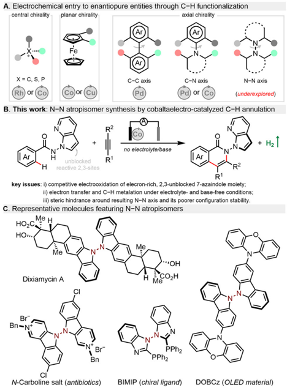
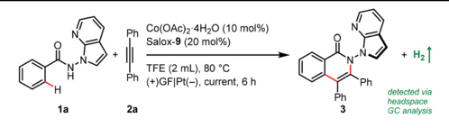
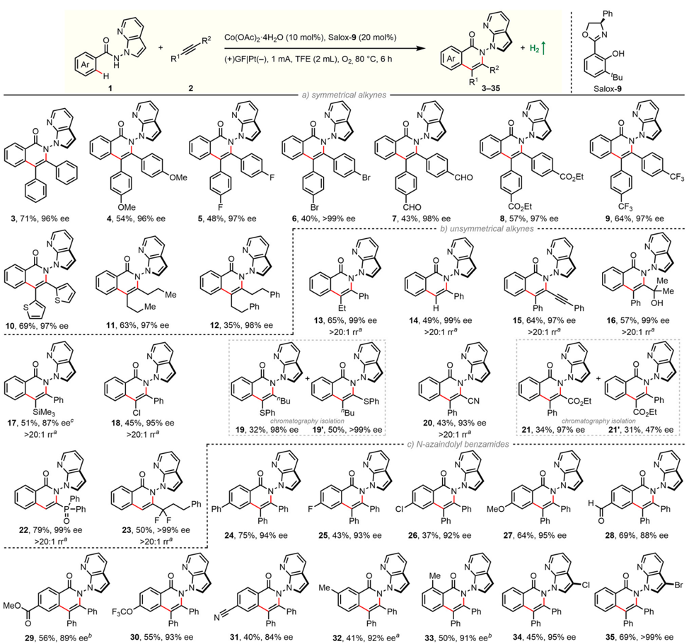
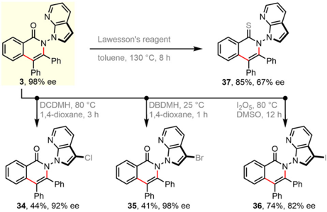
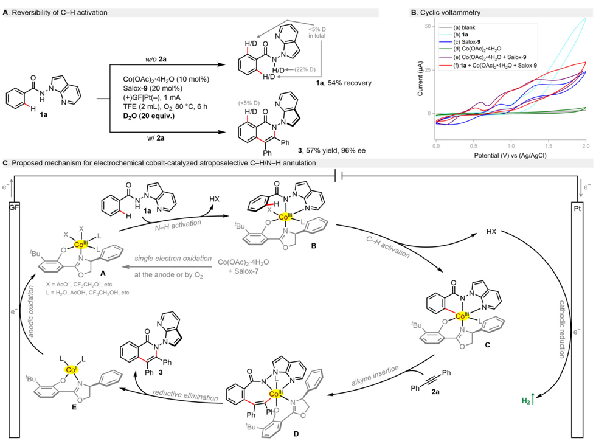

Shi Qir

Linzai Li,‡

-I, Si-Y

ao,

Yi D

Y

*

A. Electrochemical entry to enantiopure entities through C-H functionalization central chirality

Wang, u,

9.

1g

*

## Green Chemistry

X= C, S, P

C-C axis

Rh) or (

or

## COMMUNICATION

no electrolyte/base

unblocked

RI

reactive 2,3-sites

Cite this: Green Chem. , 2024, 26 , 11524

Received 2nd September 2024, Accepted 29th October 2024

DOI: 10.1039/d4gc04390a

**ОН

N-N axis

(underexplored)

+ H2 T

## N -N atropisomer synthesis via electrolyte- and base-free electrochemical cobalt-catalysed C -H annulation †

Jiating Cai, ‡ Linzai Li, ‡ Chuitian Wang, Shi Qin, Yuanyuan Li, Si-Yan Liao, Shengdong Wang, Hui Gao, Zhi Zhou, Yugang Huang, * Wei Yi * and Zhongyi Zeng *

[rsc.li/greenchem](http://rsc.li/greenchem)

Merging electrochemistry with asymmetric C -H activation has proven to be an advantageous alternative to build valuable enantiopure molecules. However, established methods require a stoichiometric use of supporting electrolytes to promote the electron transfer in solution and often additionally serve as a base to assist C -H bond cleavage, which are hazardous and would produce additional waste. Herein, we described an exogenous electrolyteand base-free electrocatalytic atroposelective C -H annulation, providing facile and sustainable access to N -N axially chiral isoquinolinones in excellent enantioselectivities and good yields. This protocol is enabled by a combination of simple Co(OAc)2·4H2O and readily available chiral salicyloxazoline (Salox), which proceeds well with 13 classes of alkynes, including highly challenging polarized either internal or terminal alkynes, and tolerates a wealth of functional groups for streamlined transformations.

In recent years, organic electrosynthesis has witnessed a remarkable renaissance as an e ffi cient and powerful method to construct valuable molecules. 1 -6 Electrochemistry is often considered as an environmentally benign technique for organic synthesis as it uses electric current as an inexpensive, wastefree, and prospectively renewable redox reagent. Therefore, diverse electrochemical reactions have been established, e.g. , alkene/alkyne functionalization, 7 cross-couplings, 8,9 radical cyclization, 10 and C -H functionalization. 11 -15 Despite impressive progress, it continues to be a challenge to realize precise selectivity control in terms of asymmetric electrochemical synthesis. Toward this goal, routine enantiocontrol approaches including metal catalysis, organocatalysis, and enzymatic cata-

† Electronic supplementary information (ESI) available: Experimental procedures, compound characterization, and copies of NMR spectra and HPLC traces. See DOI: https://doi.org/10.1039/d4gc04390a ‡ These authors contributed equally to this work. Guangzhou Municipal and Guangdong Provincial Key Laboratory of Molecular Target &amp; Clinical Pharmacology, the NMPA and State Key Laboratory of Respiratory Disease, School of Pharmaceutical Sciences and the Fifth Affiliated Hospital, Guangzhou Medical University, Guangzhou, Guangdong 511436, China. E-mail: hyug@gzhmu.edu.cn, yiwei@gzhmu.edu.cn, zzeng@gzhmu.edu.cn

|

lysis have been gradually merged with electrochemistry to boost the development of this burgeoning field. 16 -18 While some asymmetric electrocatalytic systems have been reported, 19 -35 their synthetic utilizations to construct axially chiral skeletons, 36 -48 especially with stereogenic N -N linkages, 49 lag far behind (Fig. 1A). This could be ascribed to several major issues concerning atroposelective manifolds: (a) shorter N -N bond distance posing steric hindrance during new

Fig. 1 Background and design blueprint.

C-N axis planar chirality

axial chirality

Check for updates

HOZC.

HO...

Bn-N*

View Article Online

View Journal | View Issue

15

1a

No electricity

TFE (2 mL), 80 °C

bond formation around this axis; (b) relatively poor configurational stability of N -N atropisomers; (c) electrochemical degradation of chiral ligands/catalysts or even related N-heterocyclic substrates/products; (d) unfavourable interactions of the supporting electrolyte within the enantio-determining transition state. Given the ubiquity of N -N atropisomers in natural bioactive molecules, 50,51 chiral ligands 52 as well as functional materials (Fig. 1C), 53 it is highly desirable to explore an e ffi cient catalytic system and novel asymmetric transformation to construct N -N axially chiral architectures.

In fact, enantioselective transition-metal-catalysed C -H activation provides facile and step-economical access to axially chiral motifs. 54 -64 Since the pioneering work by Ackermann, 36 asymmetric electrocatalytic C -H activation has proved to be an environmentally benign and sustainable alternative to prepare C -C 39,40 and C -N 41 -48 axially chiral compounds via dihydrogen evolution. By contrast, electrochemical manifolds toward stereogenic N -N counterparts remain elusive. Notable yet often overlooked is that all reported enantioselective electrocatalytic C -H activations require stoichiometric amounts of a hazardous supporting electrolyte.

Herein, we present an unprecedented electrolyte- and basefree electrocatalytic atroposelective C -H annulation, providing facile and sustainable access to N -N axially chiral isoquinolinones in excellent enantioselectivities (mostly &gt;90% ee) and good yields (Fig. 1B). 49 Salient features of this protocol comprise (a) electrocatalytic entry to N -N atropisomers enabled by simple and cost-e ff ective Co(II)/Salox catalytic system; (b) no need of any exogenous supporting electrolyte and base to e ff ectively reduce chemical waste production; (c) a broad range of benzamides and 13 classes of alkynes bearing diverse functionalities for streamlined diversifications.

Our proof-of-concept work was commenced with enantioselective electrocatalytic C -H/N -H annulation of N -(7-azaindole)benzamide 1a with diphenylacetylene ( 2a ) in an undivided cell equipped with a graphite felt (GF) anode and a platinum cathode (Table 1). Notably, benzamide 1a bearing a reactive and versatile 2,3-unsubstituted azaindolyl handle is a demanding reactant for electrochemical transformations in that it may be prone to oxidation. Pleasingly, the atroposelective N -N isoquinolinone 3 was obtained in 40% yield and 96% enantioselective excess (ee) when Co(OAc)2·4H2O and Salox9 were employed as the catalytic combination with NaOPiv·H2O as both an electrolyte and base in heated 2,2,2-trifluoroethanol (TFE) under a 2.0 mA galvanostatic electrolysis (entry 1). Catalytic performance was enhanced at a lower current density and further improved with one equivalent of NaOPiv·H2O (entries 2 and 3). Running the reaction under dioxygen atmosphere led to an increased yield of 71% (entries 4 and 5). Control experiments confirmed the indispensability of the cobalt salt and electricity to spur this net-oxidation reaction (entries 11 and 12). Surprisingly, the addition of NaOPiv·H2O was discovered to be unnecessary (entries 5 and 6). This is remarkable, to our knowledge, as there has been no precedent on electrocatalytic asymmetric C -H functionalization under electrolyte-free conditions. 17

OH

+ H2 T

Table 1 Reaction development a

3

a Conditions: 1a (0.08 mmol), 2a (0.16 mmol), Co(OAc)2·4H2O (10 mol%), Salox9 (20 mol%), TFE (2 mL), undivided cell with graphite felt (GF) anode (10 mm × 20 mm × 2 mm) and platinum plate (Pt) cathode (10 mm × 20 mm × 0.3 mm), constant current, 80 °C, 6 h; isolated yields and enantioselective excess (ee) determined by HPLC with a chiral stationary phase. b NaOPiv·H2O (1 equiv.).

| Entry                                              | Reaction condition                                 | Yield,%                                            | ee,%                                               |
|----------------------------------------------------|----------------------------------------------------|----------------------------------------------------|----------------------------------------------------|
| 1                                                  | NaOPiv·H 2 O (2 equiv.), 2.0 mA, air               | 40                                                 | 96                                                 |
| 2                                                  | NaOPiv·H 2 O (2 equiv.), 1.0 mA, air               | 49                                                 | 96                                                 |
| 3                                                  | NaOPiv·H 2 O (1 equiv.), 1.0 mA, air               | 63                                                 | 96                                                 |
| 4                                                  | NaOPiv·H 2 O (1 equiv.), 1.0 mA, N 2               | 65                                                 | 95                                                 |
| 5                                                  | NaOPiv·H 2 O (1 equiv.), 1.0 mA, O 2               | 71                                                 | 96                                                 |
| 6                                                  | 1.0 mA, O 2                                        | 71                                                 | 96                                                 |
| Further variation from optimal condition (entry 6) | Further variation from optimal condition (entry 6) | Further variation from optimal condition (entry 6) | Further variation from optimal condition (entry 6) |
| 7                                                  | C as anode                                         | 8                                                  | 96                                                 |
| 8                                                  | GF as cathode                                      | 25                                                 | 96                                                 |
| 9                                                  | Running at 60 °C                                   | 26                                                 | 96                                                 |
| 10                                                 | Salox- 1 - 10                                      | As below                                           | 96                                                 |
| 11 12                                              | 15 mol% Salox- 9 25 mol% Salox- 9                  | 25 70                                              | 96                                                 |
| 13                                                 | MeOH, HFIP, MeCN, DMSO                             | <1                                                 | -                                                  |
| 14                                                 | No Co(OAc) 2 ·4H 2 O                               | <1                                                 | -                                                  |
| 15                                                 | No electricity                                     | <1                                                 | -                                                  |

Switching the electrode to other materials gave unsatisfactory results (entries 7 and 8). It might be rationalized by (1) the large surface area of the GF anode for cobalt contact, and (2) favourable dihydrogen evolution on a Pt surface, which was detected via headspace gas chromatography (GC) analysis. Running the reaction at 60 °C led to much lower e ffi ciency (entry 9). Lower e ffi ciency was observed by decreasing the amount of Salox9 ligand while its increase led to no further improvement (entries 11 and 12). Nevertheless, excellent enantioselectivity was constantly observed during reaction optimization, suggesting the robust enantiocontrol of the Co(OAc)2·4H2O/Salox9 catalytic system. Fine-tuning

Ph

SiMe3

&gt;20:1 гра

22, 79%, 99% ee

&gt; 20:1 га

29, 56%, 89% eeb

.N.

Co(OAC)2 4H20 (10 mol%), Salox-9 (20 mol%)

(+)GF|Pt(-), 1 mA, TFE (2 mL), 02, 80 °C, 6 h of the ligand design revealed an extremely high sensitivity of the catalyst performance toward the substituents on both the phenol and oxazoline moieties, with only Salox9 and Salox10 uniformly bearing a bulky tert -butyl group at the ortho -position of the phenol ring being catalytically active (entry 10). 65 Cyclic voltammograms of three representative Salox ligands (including Salox3 , Salox8 , Salox9 ) and their combination with Co(OAc)2·4H2O indicates that compared to Salox3 and Salox8 , Salox9 is less likely to decompose under electrolyte-free electrolysis and facilitates the oxidation of Co II to Co III , speculatively owing to such steric congestion (Fig. S11 and S12 in ESI † ). To further validate this

"Me

Ph

+ H2 T

hypothesis, we conducted the ligand screenings again yet in the presence of a supporting electrolyte, NaOPiv·H2O. This way, all tested Salox ligands could leverage the reaction, albeit with varied yields and enantioselectivities. TFE seems to be the sole medium for this conversion (entry 13), speculatively owing to (1) improved solubility of Co(OAc)2·4H2O; (2) function as a proton shuttle; (3) the resulting ROH/RO -bu ff er system behaving like a supporting electrolyte to mediate electron transfer as well as a base to facilitate N -H and C -H bond cleavage. The electrooxidative process has a good current e ffi ciency of 51%, underlining the sustainability of the overall process.

Me

·Me

Scheme 1 Scope of electrocatalytic atroposelective C -H annulation. Conditions: 1 (0.08 mmol), 2 (0.16 mmol), Co(OAc)2·4H2O (10 mol%), Salox9 (20 mol%), TFE (2 mL), undivided cell with GF (10 mm × 20 mm × 2 mm) and Pt cathode (10 mm × 20 mm × 0.3 mm), constant current of 1 mA ( ca. 2.8 F mol -1 ), 80 °C, 6 h under O2 (balloon); isolated yields given, and enantioselective excess (ee) determined by HPLC with a chiral stationary phase. a Regioselective ratio (rr) determined by 1 H NMR. 15 h.

R2

*Ph

Ph

А. Reversibility of C-H activation

Ph toluene, 130 °C, 8 h

Ph

3, 98% ee

DCDMH, 80 °C

,1,4-dioxane, 3 h

1a

Ph

Ph

34, 44%, 92% ee

H/D O

Scheme 2 Synthetic utilizations.

X = AcO-, CF ,CH,O-, etc at the anode or by Oz

With optimized experimental protocols in hand, we sought to evaluate the generality of our electrocatalytic atroposelective C -H annulation (Scheme 1). First, scope with respect to alkyne partners was investigated by coupling with benzamide 2a (Scheme 1a/b). The electrochemical protocol was found to be robust and general: enantioselective C -H annulation could be reductive elimination

B. Cyclic voltammetry

50

(a) blank

(b) 1a

(c) Salox-9

(d) Co(OAc)2·4H,0

achieved with 13 classes of alkynes. A broad spectrum of unactivated and specially activated alkynes was engaged in the reaction. The newly established method is applicable to symmetrical diarylacetylenes bearing electron-donating and electronwithdrawing groups as well as dialkylacetylenes ( 11 , 12 ). A wealth of common functional groups, including methoxy ( 4 ), fluoro ( 5 ), bromo ( 6 ), ester ( 8 ), trifluoromethyl ( 9 ) as well as even oxidation-sensitive formyl ( 7 ) and thienyl ( 10 ), are tolerated. In addition, nonsymmetric aryl -alkyl alkynes ( 13 ), terminal alkynes ( 14 ) as well as 1,3-diynes ( 15 ) were coupled in a highly regioselective and enantioselective manner. Impressively, this electrochemical reaction also works well with diversly functionalized π -systems, ranging from electronneutral propargyl alcohols ( 16 ) and alkynyl silanes ( 17 ), electron-rich alkynyl sulfides ( 19 , 19 ′ ), to electron-deficient chloroalkynes ( 18 ), alkynyl nitriles ( 20 ), alkynyl esters ( 21 , 21 ′ ), alkynyl phosphine oxides ( 22 ), and α , α -difluoromethylene alkynes ( 23 ). The presence of these functionalities can not only guide the reaction regioselectivity, but also o ff er opportunities for follow-up modifications.

Next, substrate scope of benzamides was examined with diphenylacetylene (Scheme 1c). A set of electronically and steri-

Ph

2a

H½T

Scheme 3 Mechanistic insights and plausible pathway.

B

anodic oxidatior

CO(OAC)2 4H20

+ Salox-7

N

&lt;5% D

in total

cally varied benzamides proceeds C -H/N -H annulation with good e ffi ciency and excellent enantiocontrol. Again, it tolerates diverse functional groups including -F ( 25 ), -Cl ( 26 , 34 ), -Br ( 35 ), -OMe ( 27 ), -CHO ( 28 ), -CO2Me ( 29 ), -OCF3 ( 30 ), and -CN ( 31 ). It is worth noting that 3-substituted benzamide undergoes selective coupling in the less-hindered position ( 33 ). Benzamides bearing a C3-functionalized azaindole moiety were also applicable in our electrochemical protocol ( 34 , 35 ). It is worth mentioning that a significant amount of unconsumed benzamides remained for reactions with low yields. The product/conversion selectivities were rather high since almost no other new spots were observed on TLC traces. The yields might be improved when running the reaction longer ( 17 , 29 , 33 ) (Scheme 2).

Further derivatization experiments were performed to showcase the synthetic utility. Indeed, the unsubstituted azaindolyl unit allows for consecutive C -H bond functionalization. For instance, such handle in enantiopure product 3 could be selectively chlorinated ( 34 ), brominated ( 35 ), and iodinated ( 36 ) by choosing suitable electrophilic halogenating sources. These introduced halogen atoms would enable numerous subsequent bond-forming reactions, e.g. , via classical cross-couplings. Besides, the carbonyl group of skeletal isoquinolinone was facilely translated into a thiocarbonyl group in the presence of Lawesson ' s reagent ( 37 ). Due to the harsh reaction conditions, decayed enantiopurity was observed. This is consistent with the Li ' s result that racemization of such N -N axial chirality would occur at 120 °C. 66

Mechanistic studies were performed to shed light on this electrochemical process. H/D scrambling was not found in the presence of D2O, which points toward an irreversible C -H metalation step (Scheme 3A). In cyclic voltammetry (CV, Scheme 3B), benzamide 1a showed an oxidation peak at +1.14 V ( vs . Ag/AgCl, curve b), being supportive of its tendency to anodic oxidation. Although Salox9 exhibited two pairs of reversible redox peaks and Co(OAc)2·4H2O seemed redox inert (curve c/d), their combination led to a shift forward of the oxidation wave with a potential of 0.60 V ( vs . Ag/AgCl, curve e). This implies that the in situ coordination of Co II salt with Salox9 could not only prevent the ligand decomposition, but also facilitate the oxidation of Co II to Co III . Such facilitation e ff ect can be further observed in the presence of 1a (curve f). Based on our results and literature precedents, 28,47 a plausible catalytic cycle was proposed for this electrochemical enantioselective process (Scheme 3C). Initially, single electron oxidation of the cobalt(II) salt by the anode or dioxygen in the presence of Salox9 delivers a chiral octahedral Co(III) species A . Subsequent ligand exchange with benzamide 1a followed by a base-assisted C -H activation leads to a five-membered cabaltacycle C . Coordination and migratory insertion with the alkyne gives rise to cabaltacycle D , which reductively eliminate to furnish the final N -N axially chiral isoquinolinone 3 . The simultaneously resulting Co(I) species E undergoes an anodic oxidation for the regeneration of the active Co (III) catalyst. At the cathode, the dihydrogen byproduct is released.

## Conclusions

In conclusion, we disclosed an exogenous electrolyteand base-free electrochemical cobalt-catalysed atroposelective C -H annulation to construct N -N axially chiral isoquinolinones with excellent enantiocontrol. This transformation is amenable to a wide set of structurally diverse non-polar and polarized, internal and terminal alkynes with remarkable functional group compatibility. We believe that this work can inspire further development of electrolyte-free electrocatalytic asymmetric reactions and find their robust applications in synthetic and medicinal chemistry.

## Author contributions

Z. Zeng and W. Y. conceived the project and designed the experiments. J. C. and L. L. performed the experiments and interpreted the data with equal contributions with the assistance of C. W., S. Q., and Y. L. The manuscript was written by Z. Zeng, W. Y., and Y. H. with insightful discussion and proofreading of S. W., H. G., Z. Zhou. All authors have given approval to the final version of the manuscript.

## Data availability

The data supporting this article have been included as part of the ESI. †

## Con fl icts of interest

There are no conflicts to declare.

## Acknowledgements

We acknowledge the financial support from National Natural Science Foundation of China (no. 82273795, 22201051), Guangdong Basic and Applied Basic Research Foundation (no. 2024A1515030179, 2024A1515010260), Science and Technology Program of Guangzhou (no. 2023A04J0074), and Plan on Enhancing Scientific Research at GMU.

## References

- 1 M. Yan, Y. Kawamata and P. S. Baran, Chem. Rev. , 2017, 117 , 13230 -13319.
- 2 X. Cheng, A. Lei, T.-S. Mei, H.-C. Xu, K. Xu and C. Zeng, CCS Chem. , 2022, 4 , 1120 -1152.
- 3 S. B. Beil, D. Pollok and S. R. Waldvogel, Angew. Chem., Int. Ed. , 2021, 60 , 14750 -14759.
- 4 Y. Guo, W. An, X. Tian, L. Xie and Y.-L. Ren, Green Chem. , 2022, 24 , 9211 -9219.

- 5 X. Tian, Y. Guo, W. An, Y.-L. Ren, Y. Qin, C. Niu and X. Zheng, Nat. Commun. , 2022, 13 , 6186.
- 6 W.-K. An, X. Xu, S.-J. Zheng, Y.-N. Du, J. Ouyang, L.-X. Xie, Y.-L. Ren, M. He, C.-L. Fan, Z. Pan and Y.-H. Li, ACS Catal. , 2023, 13 , 9845 -9856.
- 7 J. C. Siu, Acc. Chem. Res. , 2020, 53 , 547 -560.
- 8 H. Wang, X. Gao, Z. Lv, T. Abdelilah and A. Lei, Chem. Rev , 2019, 119 , 6769 -6787.
- 9 C. A. Malapit, M. B. Prater, J. R. Cabrera-Pardo, M. Li, T. D. Pham, T. P. McFadden, S. Blank and S. D. Minteer, Chem. Rev. , 2022, 122 , 3180 -3218.
- 10 P. Xiong and H.-C. Xu, Acc. Chem. Res. , 2019, 53 , 3339 -3350.
- 11 K.-J. Jiao, Acc. Chem. Res. , 2020, 53 , 300 -310.
- 12 Z. Zeng, J. F. Goebel, X. Liu and L. J. Gooßen, ACS Catal. , 2021, 11 , 6626 -6632.
- 13 J. F. Goebel, Z. Zeng and L. J. Gooßen, Synthesis , 2022, 565 -569.
- 14 Y. Wang, S. Dana, H. Long, Y. Xu, Y. Li, N. Kaplaneris and L. Ackermann, Chem. Rev. , 2023, 123 , 11269 -11335.
- 15 S. Qin, M. Yang, M. Xu, Z.-H. Peng, J. Cai, S. Wang, H. Gao, Z. Zhou, A. S. K. Hashmi, W. Yi and Z. Zeng, Nat. Commun. , 2024, 15 , 7428.
- 16 X. Chang, Q. Zhang and C. Guo, Angew. Chem., Int. Ed. , 2020, 59 , 2 -13.
- 17 K.-J. Jiao, Chem. Catal. , 2022, 2 , 3019 -3047.
- 18 J. Rein, Chem. Soc. Rev. , 2023, 52 , 8106 -8125.
- 19 X. Huang, Q. Zhang, J. Lin, K. Harms and E. Meggers, Nat. Catal. , 2018, 2 , 34 -40.
- 20 Q. Zhang, X. Chang, L. Peng and C. Guo, Angew. Chem., Int. Ed. , 2019, 58 , 6999 -7003.
- 21 P.-S. Gao, X.-J. Weng, Z.-H. Wang, C. Zheng, B. Sun, Z.-H. Chen, S.-L. You and T.-S. Mei, Angew. Chem., Int. Ed. , 2020, 59 , 15254 -15259.
- 22 Y.-Q. Huang, Z.-J. Wu, L. Zhu, Q. Gu, X. Lu, S.-L. You and T.-S. Mei, CCS Chem. , 2021, 3 , 3501 -3509.
- 23 Z.-H. Wang, P.-S. Gao, X. Wang, J.-Q. Gao, X.-T. Xu, Z. He, C. Ma and T.-S. Mei, J. Am. Chem. Soc. , 2021, 143 , 15599 -15605.
- 24 W. Wei, Chem. Sci. , 2022, 13 , 2783 -2788.
- 25 Q. Zhang, K. Liang and C. Guo, Angew. Chem., Int. Ed. , 2022, 61 , e202210632.
- 26 K. Liang, Q. Zhang and C. Guo, Nat. Synth. , 2023, 2 , 1184 -1193.
- 27 T. Liu, W. Zhang, C. Xu, Z. Xu, D. Song, W. Qian, G. Lu, J. Zhang, W. Zhong and F. Ling, Green Chem. , 2023, 25 , 3606 -3614.
- 28 Q.-J. Yao, F.-R. Huang, J.-H. Chen, M.-Y. Zhong and B. Shi, Angew. Chem., Int. Ed. , 2023, 62 , e202218533.
- 29 G. Zhou, J.-H. Chen, Q.-J. Yao, F.-R. Huang, Z.-K. Wang and B.-F. Shi, Angew. Chem., Int. Ed. , 2023, 62 , e202302964.
- 30 P.-Y. Chen, C. Huang, L.-H. Jie, B. Guo, S. Zhu and H.-C. Xu, J. Am. Chem. Soc. , 2024, 146 , 7178 -7184.
- 31 Y. Li, J. Xu, J. C. A. Oliveira, A. Scheremetjew and L. Ackermann, ACS Catal. , 2024, 14 , 8160 -8167.
- 32 X. Xia, C. Zheng, Y. Hang, J. Guo, T. Liu, D. Song, Z. Chen, W. Zhong and F. Ling, Green Chem. , 2024, 26 , 8323 -8329.
- 33 G. Zhou, T. Zhou, A.-L. Jiang, P.-F. Qian, J.-Y. Li, B.-Y. Jiang, Z.-J. Chen and B.-F. Shi, Angew. Chem., Int. Ed. , 2024, 63 , e202319871.
- 34 F.-R. Huang, P. Zhang, Q.-J. Yao and B.-F. Shi, CCS Chem. , 2024, 1 -11.
- 35 Z.-Z. Zhang, G. Zhou, Q. Yue, Q.-J. Yao and B.-F. Shi, ACS Catal. , 2024, 14 , 4030 -4039.
- 36 U. Dhawa, C. Tian, T. Wdowik, J. C. A. Oliveira, J. Hao and L. Ackermann, Angew. Chem., Int. Ed. , 2020, 59 , 13451 -13457.
- 37 H. Qiu, B. Shuai, Y.-Z. Wang, D. Liu, Y.-G. Chen, P.-S. Gao, H.-X. Ma, S. Chen and T.-S. Mei, J. Am. Chem. Soc. , 2020, 142 , 9872 -9878.
- 38 L.-C. Xu, J. Frey, X. Hou, S.-Q. Zhang, Y.-Y. Li, J. C. A. Oliveira, S.-W. Li, L. Ackermann and X. Hong, Nat. Synth. , 2023, 2 , 321 -330.
- 39 X. Hou, S. Li, J. Frey, X. Hong and L. Ackermann, Chem , 2024, 10 , 2283 -2294.
- 40 S.-S. Xu, H. Qiu, P.-P. Xie, Z.-H. Wang, X. Wang, C. Zheng, S.-L. You and T.-S. Mei, CCS Chem. , 2024, DOI: 10.31635/ ccschem.024.202403939 .
- 41 U. Dhawa, T. Wdowik, X. Hou, B. Yuan, J. C. A. Oliveira and L. Ackermann, Chem. Sci. , 2021, 12 , 14182 -14188.
- 42 J. Frey, X. Hou and L. Ackermann, Chem. Sci. , 2022, 13 , 2729 -2734.
- 43 Y. Lin, T. Von Münchow and L. Ackermann, ACS Catal. , 2023, 13 , 9713 -9723.
- 44 T. Von Münchow, S. Dana, Y. Xu, B. Yuan and L. Ackermann, Science , 2023, 379 , 1036 -1042.
- 45 X. Wang, X.-J. Si, Y. Sun, Z. Wei, M. Xu, D. Yang, L. Shi, M.-P. Song and J.-L. Niu, Org. Lett. , 2023, 25 , 6240 -6245.
- 46 L. Zhang, D. Liang, Y. Wang, D. Li, J. Zhang, L. Wu, M. Feng, F. Yi, L. Xu, L. Lei, Q. Du and X. Tang, Chem. Sci. , 2023, 9 , 44 -51.
- 47 T. Von Münchow, Y. Liu, R. Parmar, S. E. Peters, S. Trienes and L. Ackermann, Angew. Chem., Int. Ed. , 2024, 63 , e202405423.
- 48 Y. Zhang, S.-L. Liu, T. Li, M. Xu, Q. Wang, D. Yang, M.-P. Song and J.-L. Niu, ACS Catal. , 2024, 14 , 1 -9.
- 49 Y. Sun, T. Yang, Q. Wang, L. Shi, M.-P. Song and J.-L. Niu, Org. Lett. , 2024, 26 , 5063 -5068.
- 50 Z. Xu, M. Baunach, L. Ding and C. Hertweck, Angew. Chem., Int. Ed. , 2012, 51 , 10293 -10297.
- 51 K. Suzuki, I. Nomura, M. Ninomiya, K. Tanaka and M. Koketsu, Bioorg. Med. Chem. Lett. , 2018, 28 , 2976 -2978.
- 52 T. Benincori, E. Brenna, F. Sannicolò, L. Trimarco, P. Antognazza, E. Cesarotti, F. Demartin, T. Pilati and G. Zotti, J. Organomet. Chem. , 1997, 529 , 445 -453.
- 53 X. Liu, Y. Zhang, X. Fei, L. Liao and J. Fan, Chem. -Eur. J. , 2019, 25 , 4501 -4508.
- 54 C.-X. Liu, W.-W. Zhang, S.-Y. Yin, Q. Gu and S.-L. You, J. Am. Chem. Soc. , 2021, 143 , 14025 -14040.
- 55 Z. Zeng, H. Gao, Z. Zhou and W. Yi, ACS Catal. , 2022, 12 , 14754 -14772.
- 56 J. Feng and R. Liu, Chem. -Eur. J. , 2024, 30 , e202303165.

- 57 Z. Zeng, H. Xu, H. Gao, Z. Zhou and W. Yi, Coord. Chem. Rev. , 2025, 522 , 216244.
- 58 X.-M. Wang, P. Zhang, Q. Xu, C.-Q. Guo, D.-B. Zhang, C.-J. Lu and R.-R. Liu, J. Am. Chem. Soc. , 2021, 143 , 15005 -15010.
- 59 Q. Xu, H. Zhang, F.-B. Ge, X.-M. Wang, P. Zhang, C.-J. Lu and R.-R. Liu, Org. Lett. , 2022, 24 , 3138 -3143.
- 60 X. Zhu, H. Wu, Y. Wang, G. Huang, F. Wang and X. Li, Chem. Sci. , 2023, 14 , 8564 -8569.
- 61 W. Yao, C. Lu, L. Zhan, Y. Wu, J. Feng and R. Liu, Angew. Chem., Int. Ed. , 2023, 62 , e202218871.

|

- 62 Y. Wang, X. Zhu, D. Pan, J. Jing, F. Wang, R. Mi, G. Huang and X. Li, Nat. Commun. , 2023, 14 , 4661.
- 63 T. Li, L. Shi, X. Wang, C. Yang, D. Yang, M.-P. Song and J.-L. Niu, Nat. Commun. , 2023, 14 , 5271.
- 64 S. Yin, Q. Zhou, C. Liu, Q. Gu and S. You, Angew. Chem., Int. Ed. , 2023, 62 , e202305067.
- 65 W. Chen, H. Xu, F. Liu, K. Chen, Z. Zhou and W. Yi, Angew. Chem., Int. Ed. , 2024, 63 , e202401498.
- 66 X. Zhu, H. Wu, Y. Wang, G. Huang, F. Wang and X. Li, Chem. Sci. , 2023, 14 , 8564 -8569.