## Ni/Photoredox-Catalyzed C(sp 3 ) -C(sp 3 ) Coupling between Aziridines and Acetals as Alcohol-Derived Alkyl Radical Precursors

Sun Dongbang 1 and Abigail G. Doyle* 1,2

- 1 Department of Chemistry, Princeton University, Princeton, New Jersey 08544, United States;
- 2 Department of Chemistry and Biochemistry, University of California, Los Angeles, California 90095, United States

ABSTRACT: Aziridines are readily available C(sp 3 ) precursors that afford valuable β-functionalized amines upon ring-opening. In this article, we report a Ni/photoredox methodology for C(sp 3 )-C(sp 3 ) cross-coupling between aziridines and methyl/1⁰/2⁰ aliphatic alcohols activated as benzaldehyde dialkyl acetals. Orthogonal activation modes of each alkyl coupling partner facilitate cross-selectivity in the C(sp 3 )-C(sp 3 ) bond-forming reaction: the benzaldehyde dialkyl acetal is activated via hydrogen atom abstraction and βscission via bromine radical (generated in situ from single-electron oxidation of bromide), whereas the aziridine is activated at the Ni center via reduction. We demonstrate that an Ni(II) azametallacycle, conventionally proposed in aziridine cross-coupling, is not an intermediate in the productive cross-coupling. Rather, stoichiometric organometallic and linear free energy relationship (LFER) studies indicate that aziridine activation proceeds via Ni(I) oxidative addition, a previously unexplored elementary step.

## INTRODUCTION

Selective  cross-coupling  of  two  different  carbon  electrophiles,  commonly  known  as  cross-electrophile  coupling,  has emerged  as  an  enabling  strategy  for  C-C  bond  formation. 1 These processes often operate on readily available and stable organic (pseudo)halides under mild conditions. Extensive progress has been made in developing C(sp 3 )-C(sp 2 ) cross-electrophile coupling reactions, with Ni catalysis offering a particularly general platform. 2 Mechanistic studies on select Ni-catalyzed  reactions  have  revealed  that  distinct,  hybridization-dependent activation mechanisms give rise to the cross-selectivity with C(sp 2 ) and C(sp 3 ) electrophiles. 3,4 In contrast, methods for selective coupling of two C(sp 3 ) electrophiles remain underdeveloped, owing to the more subtle differences in reactivity between  the  two  reaction  partners  (Figure  1A). 5 Nevertheless, there has been important recent progress made in this area using Ni 6 or Cu catalysis 7 with chemical reductants and electrochemical methods. 8 These approaches typically rely on substrate stoichiometry,  differences  in  (pseudo)halide  identities  or  differences in substitution at the carbon center to achieve selectivity. Alternatively,  redox-neutral  metallaphotoredox  catalysis 9 can provide  a  platform  for  the  development  of  chemoselective C(sp 3 )-C(sp 3 ) cross coupling in part by relying on orthogonal redox-dependent activation mechanisms of the two alkyl coupling partners. This approach offers the opportunity to use nontraditional reaction partners beyond alkyl (pseudo)halides while retaining many of the positive attributes of cross-electrophile coupling. For example, researchers have recently found success coupling two C(sp 3 )  fragments arising from carboxylic acids, activated alcohols, alkyl halides, and C-H bonds. 10 These examples highlight how the identification of strategies that engage distinct  classes  of  C(sp 3 )  coupling  partners  in  C(sp 3 )-C(sp 3 ) bond  formation  can  be  of  broad  value  from  a  synthetic  and mechanistic perspective.

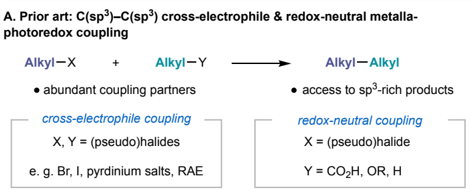

- numerous opportunities to expand scope &amp; address challenges in cross-selectivity

## B. Prior art: Cross-coupling reactions with aziridines

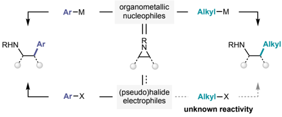

- C. This work: Ni/photoredox C(sp 3 )-C(sp 3 )   coupling with aziridines

Figure 1. Cross-electrophile and redox-neutral metallaphotoredox coupling with C(sp 3 ) precursors.

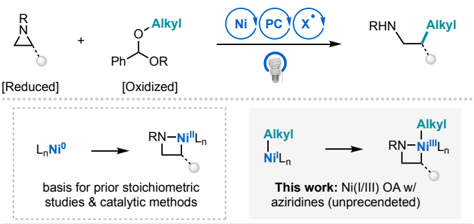

Aziridines have been employed  successfully as  C(sp 3 )

electrophiles  in  a  number  of  cross-coupling  reactions.  Work from our lab, 11 Michael, 12 Jamison, 13 Takeda/Minakata, 14 May 15 and Xiao 16 has demonstrated that coupling reactions with aziridines can afford access to substituted ethylamines, important nitrogen-containing motifs in medicinal chemistry (Figure1B). 17 Organometallic nucleophiles such as organozinc halides or organoboron reagents, have been employed as coupling partners to form both C(sp 3 )-C(sp 2 )  and C(sp 3 )-C(sp 3 )  bonds (Figure 1B, top). Recently, our lab demonstrated that aziridines can  also  participate  in  cross-electrophile  coupling  reactions with aryl iodides, using either a stoichiometric inorganic reductant 18 or a photo-assisted reductive coupling (PARC) strategy. 19 Like other C(sp 3 )-C(sp 2 ) cross-electrophile coupling reactions, these methods take advantage of the difference in hybridization of each coupling partner to impart selectivity (Figure 1A, bottom). 20 Unfortunately, direct extension of the methods for crossselective C(sp 3 )-C(sp 3 ) coupling with unactivated alkyl halides was not possible as both precursors undergo indiscriminate reduction at the Ni center. To address this challenge, we questioned  whether  we  could  design  a  selective  redox-neutral C(sp 3 )-C(sp 3 ) cross coupling with aziridines by using an alternative C(sp 3 )  partner where the activation mode is decoupled from that of aziridine oxidative addition.

Herein, we report progress toward this goal in the development of a redox-neutral Ni/photoredox-catalyzed alkylation of aziridines to generate 2°-Me, 2°-1°, 2°-2° alkyl bonds (Figure 1C). The method facilitates the synthesis of a range of b -substituted sulfonamides that were previously inaccessible by traditional  cross-coupling  methods  with  aziridines.  Benzaldehyde dialkyl acetals serve as the second C(sp 3 )  coupling partner in the method, functioning to activate unactivated alcohols toward homolytic C(sp 3 )-O cleavage in an oxidative process 21 that is orthogonal to aziridine activation via reduction. Differentiation of the activation modes affords an opportunity to independently tune the rate of reaction of the two partners to achieve crossselectivity using easy to manipulate variables like light intensity. Mechanistic studies suggest that aziridine activation does not occur via Ni(0) oxidative addition, but rather via Ni(I), an elementary  step  that  has  no  prior  stoichiometric  or  catalytic precedent. 22,23

## RESULTS AND DISCUSSION

## Reaction Optimization

We began reaction optimization using 2-(4-fluorophenyl)-1-( p -tolylsulfonyl)aziridine ( 1a ) and benzaldehyde dimethyl acetal ( 2a ) as a methyl radical precursor. On the basis of prior studies,  including our own recent work, 21 we explored the use of halide salts as precursors to halogen radicals for HAT. We were pleased to find that using 2.5 mol% Ni(cod) 2 , 5 mol% NH 4 Br (E 1/2 [Br -/Br∙]  =  +0.80  V  vs  SCE  in  DCE),  and  2  mol% Ir[dF(Me)ppy] 2 (dtbbpy)PF 6 (Ir II /Ir III * = +0.97V  vs SCE  in MeCN) 2g,24 with  a  427  nm  Kessil  lamp  at  25  ℃,  the  desired cross-coupled product 3a was formed in 22% yield (Table 1, entry 1). Because hydrolysis of the acetal 2a was also observed under these conditions, we next evaluated non-protic bromide salts, including LiBr, which led to the formation of 3a in 32% yield (Table 1, entry 2). In both these reactions, numerous undesired side products also accompanied product formation, including the dimerized aziridine ( 4 ), sulfonamide 5 , 25 and the direct product of cross-coupling with the 3 ° carbon of the acetal ( 6 ).  Since 4 and 5 both  presumably  arise  from  unproductive consumption of an azanickellacycle intermediate, we hypothesized  that  increasing  the  rate  of  methyl  radical  formation from 2a might lead to better selectivity for the crosscoupled product 3a . 26 Consistent with this hypothesis, we found that simply adding another lamp and increasing the lamp intensity, variables that should both differentially impact the HAT cycle, afforded 3a in 70% yield (Table 1, entry 3-4). Increasing the acetal equivalents from 1.8 to 2.4 also afforded a modest improvement in the yield of 3a (Table 1, entry 5).

Table 1. Optimization of aziridine alkylation with benzaldehyde dialkyl acetals.

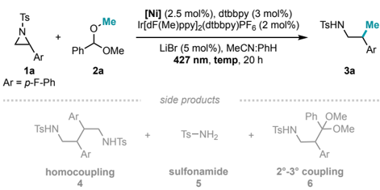

|   Entry | Acetal   | [Ni]          | Light intensity   | Temp   | Yield (%)   |   Yield (%) |   Yield (%) |   Yield (%) |
|---------|----------|---------------|-------------------|--------|-------------|-------------|-------------|-------------|
|         | equiv    |               | /no. of lamps     | (°C)   | 3 (rsm)     |           4 |           5 |           6 |
|       1 | 1.8      | Ni(COD) 2     | 25%/1             | 25 a,b | 22 (59)     |           3 |          12 |           7 |
|       2 | 1.8      | Ni(COD) 2     | 25%/1             | 25 b   | 32 (50)     |           2 |          10 |           7 |
|       3 | 1.8      | Ni(COD) 2     | 25%/2             | 28 b   | 68          |           4 |          10 |           6 |
|       4 | 1.8      | Ni(COD) 2     | 50%/2             | 31 b   | 70          |           4 |           5 |           6 |
|       5 | 2.4      | Ni(COD) 2     | 50%/2             | 31 b   | 79          |           4 |           7 |           5 |
|       6 | 2.4      | Ni(COD) 2     | 50%/1             | 26 b   | 34          |           3 |          22 |           5 |
|       7 | 2.4      | Ni(COD) 2     | 50%/1             | 38 c   | 72          |           5 |           7 |           5 |
|       8 | 2.4      | NiBr 2 •glyme | 50%/1             | 38 c   | 82          |           6 |           5 |           4 |
|       9 | 1.1      | NiBr 2 •glyme | 50%/1             | 38 c   | 58          |          10 |           8 |           7 |
|      10 | 1.8      | NiBr 2 •glyme | 50%/1             | 38 c   | 68          |           8 |          10 |           7 |
|      11 | 2.4      | NiBr 2 •glyme | 50%/1             | 38 c   | 47          |          11 |          12 |           3 |
|      12 | 2.4      | NiBr 2 •glyme | 50%/1             | 38 c,d | 65          |           7 |          14 |           5 |

Reactions performed on 0.1 mmol scale, with 1-fluoronaphthalene as the external standard ( 19 F NMR yield for 3 , 4 , 6 , 1 H NMR yield for 5 ). Entries 1-2 were performed at 0.04M, and entries 3-10 were performed at 0.057M. For reactions with 25% intensity, vials were placed 1.5 cm away from Kessil lamp and for 50% intensity, vials were placed 3cm away. Entries without (rsm) showed full conversion of the aziridine. a NH 4 Br was used instead of LiBr b Three fans were used to cool the reaction. c No fans were used to cool the reaction. d Reaction was setup on the benchtop under an inert atmosphere. Reaction with either no light, no photocatalyst, no nickel, or no nickel/ligand all gave 0% yield of the desired product.

Although the conditions in entry 5 afforded a high yield of the desired product, we sought to test the robustness of the reaction under a more simplified light set-up. Interestingly, while only  one  lamp  with  fan-cooling  afforded  34%  yield  of 3a , simply removing the fans to increase the reaction temperature gave a significant increase in the yield of 3a to 72% (Table 1, Entry 6,7), potentially because higher temperatures facilitate β -scission and increase the concentration of Me radical in solution. Finally,  evaluation  of  Ni  precatalyst  identity  showed  that NiBr 2 ∙glyme gave a 10% increase in yield over Ni(cod) 2 (Table

## 1, Entry 8).

With these optimized reaction conditions, we were pleased to find that 3a can be obtained in useful yield even with reduced equivalents of the acetal (Table 1, Entries 9 &amp; 10). Moreover, although NiBr 2 ∙glyme can serve as the sole source of bromide for HAT, control reactions omitting LiBr led to diminished reactivity, consistent with previous observations that the counter cation of the additive may facilitate stabilization of the anionic sulfonamide and product release (Table 1, Entry 11). 20c Because NiBr 2 ∙glyme is the optimal Ni source and is air- and moisture stable, the reaction can be setup and run on the benchtop, as opposed to the glovebox, and delivers 3a with only a small decrease in yield (Table 1, Entry 12).

## Substrate scope

Methylation of C(sp 3 ) carbons is a powerful strategy in medicinal chemistry that can lead to an increase in potency, higher selectivity among bioreceptors, alteration in solubility, and enhanced protection against enzyme metabolism. 27 Accordingly, amines and sulfonamides bearing β -methyl groups are a highly sought  structural  motif  in  pharmaceuticals. 28 Nevertheless, methylation  of  aziridines  has  only  been  accomplished  with highly nucleophilic organometallic reagents, such as Grignard reagents, organocuprates, and AlMe 3 , and often results in poor regioselectivity. 29 Moreover, there have been no reports of successful  Ni-  or  Pd-catalyzed  cross-coupling  of  aziridines  with methyl nucleophiles. 11-14 Therefore, with the optimized reaction conditions in hand, we investigated the scope of the reaction with various aziridines using benzaldehyde dimethyl acetal as a methylating reagent.

We were excited to find that a broad range of styrenyl aziridines were compatible with this Ni/photoredox methylation reaction (Table 2). Substrates bearing electron-deficient groups such as p -CF 3 ( 3b ) or p -CN ( 3c ) gave the b -methylated sulfonamide products in 77% and 50% yield, respectively. An unsubstituted styrenyl aziridine ( 3d ) as well as those baring electrondonating groups such as p -t -Bu ( 3e ) or p -OPh ( 3f ) also afforded the  methylated  products  in  good  yield.  The  reaction  showed minimal sensitivity  to  steric  hindrance  on  the  arene,  with 3g formed in 59% yield.

Table 2. Reaction substrate scope with aziridines and benzaldehyde dialkyl acetals.

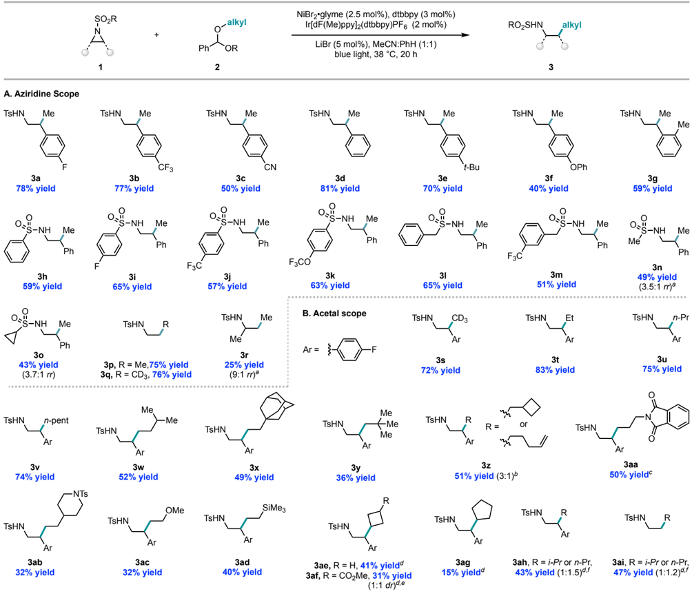

Reactions performed on 0.2 mmol scale. 0.48 mmol of the acetal coupling partner was used. a 48 h instead of 20 h b Ratio of ring-closed to ring-opened isomers. c Performed on 0.1 mmol scale using 1 mol% photocatalyst and 1.1 equivalent of acetal at 25 ℃ . d 5,5'-difluoro-2,2'bipyridine was used instead dtbbpy. e 1:1 dr at the benzylic stereogenic censer of the trans cyclobutane. f di iso propyl benzaldehyde acetal was used as the coupling partner.

As sulfonamides have been frequently employed in medicinal chemistry, we also investigated aziridines with sulfonyl substituents other than a tosyl group. Aryl ( 3h -3k ),  benzyl ( 3l , 3m ) and alkyl sulfonamides, 30 such as methanesulfonamide ( 3n ) 30c and cyclopropanesulfonamide ( 3o ) 30d,e were tolerated in the reaction, albeit the alkyl sulfonamides were formed as mixtures of  regioisomers  with  methylation  favoring  the  benzylic  position. Finally, an unsubstituted aziridine was also converted to the deuteromethyl- and methylated products 3p and 3q in 75% and 76% yield, respectively. A current limitation of the methodology is that aliphatic aziridines give poor conversion to the product,  even  with  prolonged  reaction  times  ( 3r ).  While styrenyl aziridines undergo preferential cleavage at the substituted site governed by the weak benzylic C-N bond strength, 22a aliphatic aziridine 1r undergoes methylation to give the linear product 3r in 9:1 selectivity, likely due to a change in mechanism favoring addition of Ni to the least sterically encumbered position. 11b

We next explored the scope of the acetal partner using 2-(4fluorophenyl)-1-( p -tolylsulfonyl)aziridine  ( 1a ).  Traditionally, β -aryl β -alkyl-substituted ethylamines have been accessed via hydride ring-opening of 1,2-disubstituted aziridines; 31 hydroaminomethylation of styrenes with anilines; 32 or  reduction of β -aryl β -alkyl nitriles, 33 nitro alkanes (or alkenes), 34 and enamides. 35 However, these methods require prior installation of the β -substituent whereas the Ni/photoredox aziridine alkylation  would enable introduction of the β -alkyl  group  late  in  a synthetic  sequence.  In  so  doing,  this  method  could  be  more amenable to SAR studies 36 and the preparation of a common motif in medicinal agents such as venlafaxine (antidepresent) 37 and baclofen (muscle relaxants). 38 Indeed, we found that deuteromethyl ( 3s ) as well as other unactivated linear alkyl groups such as ethyl ( 3t ), n -propyl ( 3u ), n -pentyl ( 3v ), isoamyl ( 3w ), and adamantly ethyl ( 3x )  all  afforded the desired products in 49-83% yield. Moreover, β -substituted alkyl coupling partners such as neopentyl ( 3v ) were effective in the reaction. As another example, a methylene cyclobutyl group could be transferred in 51% yield ( 3z ),  wherein  both  the  direct  cross-coupling  ( 3z1 ) and  the  radical  ring-opened  terminal  alkene  ( 3z2 )  were  observed  in  a  4:1  ratio.  Alkyl  groups  bearing  nitrogen-derived functional groups previously reported to be incompatible with Negishi  couplings  of  aziridines 11a were  tolerated,  such  as phthalimide 3aa and  piperidine 3ab .  Ether  ( 3ac )  and  silyl ( 3ad )-containing  alkyl  coupling  partners  also  afforded  the cross-coupled products in synthetically useful yields.

We were also excited to observe reactivity between 2⁰ alkyl coupling partners and aziridines, given that cross-coupling of 2⁰ alkyl  groups  with  aziridines  is  not  feasible  under  reported Negishi conditions. 11,13 Moreover, 2⁰-2⁰ C-C bond formation presents a particular challenge in cross-electrophile strategies, with only a few examples reported to date. 6d,e When testing the reactivity between 2⁰ alkyl coupling partners and aziridines, we found  that  application  of  5,5'-difluoro-2,2'-bipyridine  rather than dtbbpy as ligand enabled higher conversion to the desired product (See supporting information III-E for details). Both cyclic  and  acyclic  secondary  alkyl  groups  underwent  coupling. The reaction was most efficient with cyclobutane derivatives ( 3ae and 3af ). A decrease in yield was observed as the ring size was expanded to cyclopentylation ( 3ag ).  Interestingly, use of isopropyl acetal as the 2⁰ coupling partner afforded cross-coupled product with a 1:1.5 ratio of branched and linear propyl groups ( 3ah ). Isomerization was also observed when using an unsubstituted aziridine as coupling partner ( 3ai ), indicating that isomerization  is  not  restricted  to  only  congested  2⁰-2⁰  C-C bond formation ( vide infra ).

Scheme 1. Alkylation of aziridine via direct incorporation of C(sp 3 )-H substrates

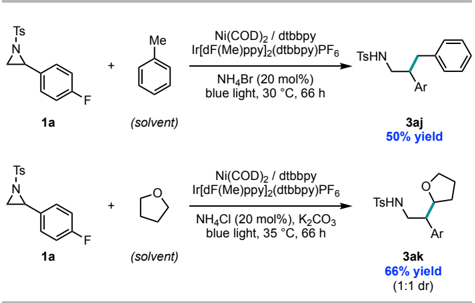

Reactions  were  performed  on  0.2  mmol  scale,  with  two  Kessil lamps and a fan for cooling.

Interestingly,  in  cases  where  the  alkyl  scaffolds  are  commonly  employed  laboratory  solvents,  we  found  that  direct C(sp 3 )-H alkylation can take place. For example, rather than employing benzyl alcohol or tetrahydrofuranol, we found that it is possible to directly employ toluene and THF as alkylating reagents to afford 3aj and 3ak in 50% and 66% yields, respectively (Scheme 1), with slight variation on the reaction conditions.

## Possible mechanistic pathways

Oxidative addition of aziridines to Ni(0) has been established in stoichiometric studies, 22 with the resulting Ni(II) azametallacycle proposed as a common catalytic intermediate in crosscoupling  reactions  with  aziridines. 11-13,15,16,23 Therefore,  at  the outset of our reaction design, we initially hypothesized that oxidative addition of Ni(0) I to generate an Ni(II) azametallacycle II would be operative; subsequent capture of the alkyl radical to generate Ni(III) III followed by reductive elimination would furnish  the  desired  product  (Scheme  1,  eq1). Alternatively, Ni(II) complex IV could instead arise via oxidative addition of Ni(0) to benzylbromide 7 generated in situ , given the catalytic presence of bromide in solution (Scheme 1, eq 2). 19,23b

Nevertheless, the generation of linear/branched isomers using acyclic secondary alkyl reaction partners appeared inconsistent with these pathways (Table 2, 3ah , 3ai ). In particular, β -hydride elimination and reinsertion should be more favorable at a low-valent Ni(I) VI center as opposed to the Ni(III) intermediate III in eqs 1 and 2 since isomerization necessitates a vacant coordination site and an intermediate with a relatively long lifetime. 39 Interestingly, the intermediacy of a Ni(I) alkyl VI would imply  that  aziridine  activation  takes  place  by  Ni(I)-Ni(III)

oxidative addition, an elementary step that does not have precedent in stoichiometric studies for aziridines (Scheme 1, eq3). Or an analogous Ni(I)-Ni(III) pathway could also be proposed with benzyl bromide 7 (Scheme 1, eq 4). The Ni(I) alkyl VI intermediate could either be accessed via radical addition to the Ni(0) I , or via radical addition to Ni(I)Br VII to first generate Ni(II)(alkyl)(Br) VIII , followed by SET.

Scheme 2. Possible mechanistic pathways for accessing Ni(III) to enable product formation.

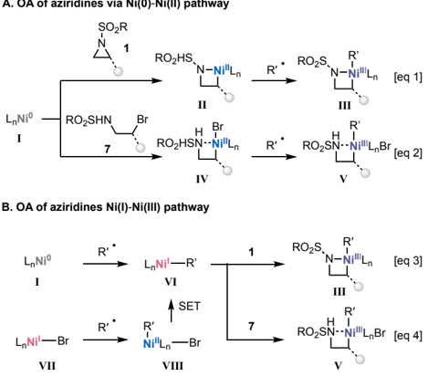

## Mechanistic Investigations

To interrogate the mechanism of aziridine activation, we first sought to synthesize the Ni(II) II oxidative adduct and test its intermediacy in the coupling reaction (Scheme 2, eq1). Complex IIa was  independently  synthesized  by  reacting  Ni(cod) 2 with 1a in the presence of dtbbpy (Scheme 3A). The stoichiometric reaction of IIa under the standard reaction conditions did not result in the formation of product. Instead, IIa underwent conversion (30%) to a mixture of aziridine dimer 4a , sulfonamide 5 and reduced aziridine (See supporting information V-A for details). To determine if IIa accesses a catalytically-relevant intermediate and if the attached aziridine in the Ni complex can be directly converted to the desired methylated product, a crossover experiment was designed using p -CF 3 styrenyl aziridine 1b as a substrate in the presence of 10 mol % azametallacycle IIa as the sole nickel catalyst source (Scheme 3B). However, less than 1% of the product originating from IIa ( 3a ) was obtained, whereas the product from 1b was formed in 32% yield. These results provide evidence against the pathway shown in Scheme 1, eq 1. Furthermore, when a time-course experiment was performed, IIa was never spectroscopically observed (see supporting information V-A for details).

## Scheme 3. Crossover experiment and stoichiometric studies with azametallacycle IIa .

## A. Stoichiometric reactivity of azametallacycle IIa

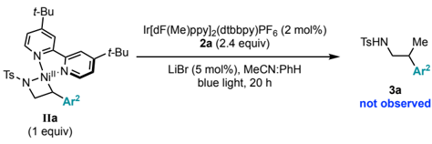

## B. Crossover experiment

1-fluoronaphthalene was used as the external standard for 19 F NMR yield.

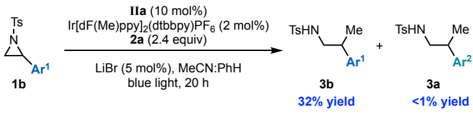

Next, we investigated the intermediacy of benzylbromide 7 , pertinent to Scheme 1, eq2 or eq4, which could be generated by the  7.5%  of  bromide  (2.5%  from  NiBr 2 ∙glyme and 5% from LiBr) in the reaction mixture. When benzyl bromide 7a was subjected to the reaction, only 1% of the product was generated. Instead, the majority of bromide 7a was converted to dimer 4a and reduced aziridine 8 (Scheme 4A).

## Scheme 4. Reactivity of benzyl bromide 7a .

## A. Reactivity of benzylbromide

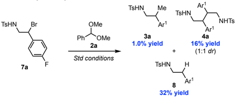

## B. Reactivity comparison of benzyl bromide and aziridine

(A)  Reaction  performed  0.1  mmol  scale  using  stoichiometric amount of benzylbromide 7a vs. (B) catalytic amount of benzylbromide 7a (0.01 mmol) and aziridine (0.09 mmol). Ar 1 = p -F-benzene Ar 2 = p -CF 3 -benzene. Yields are based on 0.1 mmol 1-fluoronaphthalene as the external standard by 19 F NMR.

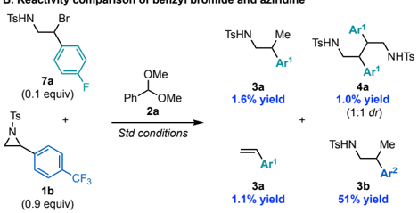

When 7a was  used  in  catalytic  quantities  in  the  presence  of aziridine 1b , as a way to simulate the catalytic formation of 7a under the standard condition, 1.6% of the product originating from 7a was observed, whereas the product derived from 1b was  formed  in  51%  yield  (Scheme  4B).  Based  on  these observations,  we  propose  that  any in situ generated 7 most likely leads to off-cycle byproducts, presumably via oxidative addition of the benzyl bromide or halogen abstraction to generate the benzylic radical, followed by free-radical recombination, a common off-cycle pathway in aryl benzylation with benzylic halides. 40

## Oxidative addition of aziridines via Ni(I)-N(III) pathway

Taken together, these data are most consistent with a pathway wherein Ni(I) undergoes oxidative addition to the aziridine (Scheme 2, eq 3). Since this step has not been previously observed, we sought direct experimental evidence for the stoichiometric  oxidative  addition  of  Ni(I)  to  aziridine 1a .  Unfortunately, an isolable dtbbpyNi(I)(alkyl) complex has not previously been prepared. However, in their investigation of the reactivity of CO 2 at Ni(I), the Martin group reported the synthesis of a (mesityl-phenanthroline)Ni(I)(CH 2 t -Bu) VII (Scheme 5). 41 Therefore, we sought to test this Ni(I) alkyl complex for oxidative  addition  reactivity  with 1a .  Prior  to  exploring  stoichiometric studies with VII , we established that mesityl-substituted phenanthroline (L 2 ) gives similar yield as dtbbpy (L 1 ) in the catalytic  reaction.  Indeed,  mesityl-substituted phenanthroline afforded 33% yield of 3v , in close agreement with the 36% yield of 3v seen with dtbbpy (Scheme 5A).

## Scheme 5. Stoichiometric studies with Ni(I) complex.

A. Catalytic competence comparison of L 1  and L 2

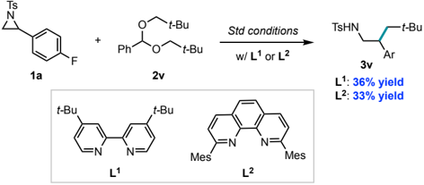

(A) Control experiments with L 1 (4,4'-ditert -butylbipyridine) and L 2 (2,9-dimesityl-1,10-phenanthroline) (B) Reactivity of L 2 Ni(CH 2 t -Bu) complex VII with aziridine 1a .

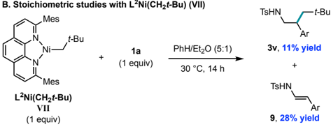

Having confirmed the catalytic competence of L 2 , we turned our attention to the stoichiometric reaction (Scheme 5B). VII was generated in situ , by adding a solution of neopentylMgBr to  L 2 Ni(I)Br, 32 with  the  resulting  complex  then  subjected  to aziridine 1a . This led to a full consumption of the aziridine, affording 11% of the cross-coupled product 3v and 28% of enamide 9 , which could result from oxidative addition at the Ni(I) center, followed by elimination. 42 It is possible that enamide 9 serves as a source for sulfonamide formation 5 ,  which is observed under the catalytic conditions with L 1 and L 2 . Taken together, these data support the catalytic relevance of a Ni(I) species for aziridine activation.

Scheme 6. Alkylation of enantioenriched aziridine.

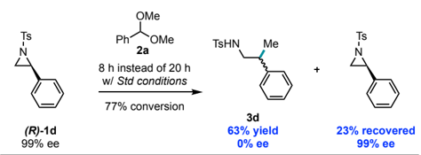

Reaction was performed on 0.2 mmol scale. Isolated yields are reported.

Having established the catalytic relevance of Ni(I), we sought to gain further insight into the mechanism of oxidative addition at Ni(I) by subjecting enantioenriched aziridine (R)-1d (99% ee) to the standard reaction conditions (Scheme 6). We found that the product 3d is  obtained in 0% ee, while the aziridine was recovered in 99% ee at an early time point (8h instead of 20h). This is consistent with either (a) an irreversible and stereoablative oxidative addition via single electron-transfer 11a or (b) a stereospecific  oxidative  addition  followed  by  racemization  at Ni(III) [Scheme 2, eq1]. 43

## Hammett analysis

To understand the mechanism of aziridine activation via Ni(I), we  evaluated  the  impact  of  aziridine  substitution  (Hammett analysis)  on  the  relative  rate  of  methylation  and  on  the branched/linear ratio of product arising from alkylation with i -Pr acetal 2aa .  If  isomerization of the Ni( i -Pr) occurs prior to oxidative addition, aziridines that undergo faster oxidative addition to Ni(I) should afford higher branched/linear ratios of the product according to the proposed mechanism (Scheme 7A). 44 Moreover, the ρ value measuring the impact of aziridine substitution on the b/l isomer ratio with i -Pr acetal 2aa should be the same as the ρ value measuring the impact of aziridine substitution on rate of methylation (k X /k H ) in this mechanistic scenario.

Two sites of the aziridine were independently evaluated: the benzene  sulfonamide  (Scheme  7B)  and  the  benzylic  arene (Scheme 7C). When the substituents on the benzene sulfonamide  were  varied,  we  observed  a  high  linear  correlation  between the log[(b/l ) k ]/[(b/l) H ]  ((b/l) k =  branched/linear  ratio  of various arene substituents, (b/l) H = branched/linear ratio of Ph) with a positive ρ value (R 2 = 0.98, ρ = 1.1) (Scheme 7B). The positive, but relatively low magnitude, slope indicates that electron-withdrawing  groups  on  the  sulfonamide  facilitate  faster oxidative addition. Notably, a similar ρ value was obtained for the Hammett analysis measuring relative initial rates of methylation (R 2 = 0.87, ρ = 1.0) using these same substituted aziridines, providing support for the proposed mechanism wherein the b/l ratio is influenced by relative oxidative addition rates (see Supporting Information V-E). 45 When the electronics of the benzylic aryl group were modified and plotted against HammettBrown constants σ + , 46 or with Jiang's spin-delocalization substituent  constants  σ JJ · (indicative  of  a  radical  stabilization  effect), 47 a slightly negative but near 0 value slope was observed with log [(b/l ) k ]/[(b/l) H ] (for σ + , R 2 = 0.76, ρ = -0.15; for σ JJ · R 2 = 0.87, ρ = -0.15) (Scheme 7C). This indicates that the identity of the benzylic arenes has negligible impact on oxidative addition rates.

The distinct ρ values obtained when varying the arene on the sulfonamide versus  the  arene  on  the  benzylic  site,  combined

Ph

Phi log[(b/)x]/[(b/)+]

p-OPh

1.0

y = 1.1x + 0.026

R2 = 0.98

branch linea

branch linear

with the results on the stereochemical course of the coupling reaction, are most consistent with a single electron transfer oxidative addition, where Ni(I) reduces the aziridine to generate a Ni(II)-sulfonamide  complex  and  a  benzylic  radical,  which  is followed by fast recombination of the tethered benzylic radical to afford Ni(III). 11a The observed LFERs are inconsistent with a concerted oxidative addition, which would be expected to have positive ρ values of similar magnitude for both experiments 48 or an oxidative addition via an S N 2-type process, which has been shown to result in negative ρ value of larger magnitude ( ρ &lt; -1) in  prior  examples  of  Ni-catalyzed  coupling  reactions  with styrenyl aziridines. 49

## Scheme 7. Hammett plot analysis .

A. Isomerization of branched to linear alkyl at Ni(I) center

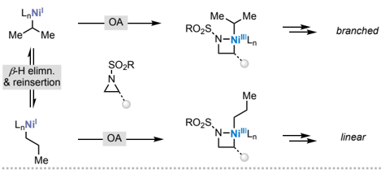

B. Hammett plot varying the electronics on the sulfonamide arene

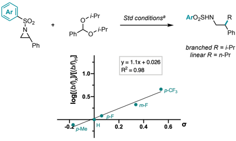

C. Hammett plot varying the electronics on the styrenyl arene

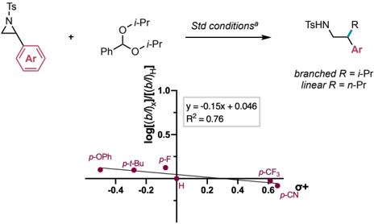

It  is  worth pointing out that the observed ρ values are also inconsistent with the participation of benzyl bromide 7a as  a productive intermediate in the catalytic cycle (Scheme 1, eq 2 or 4). Steeper slopes ( ρ &gt; ׀ 5 ׀ ) are found in Hammett studies for Ni(I) oxidative addition to substituted benzyl bromides. 50 Furthermore,  the  Hammett  analysis  precludes  the  possibility  of β -H elimination and reinsertion occurring at Ni(III), which has been  proposed  in  prior  studies, 51 as  more  electron-deficient arenes on the benzylic site would also be expected to lead to faster  reductive  elimination  and  reduced  isomerization  (i.e.. both ρ values &gt; 0).

## Proposed Catalytic Cycle

On the basis of our mechanistic investigations, we propose the following catalytic cycle (Scheme 8A, black). Upon irradiation with blue light, the excited Ir photocatalyst oxidizes bromide anion. The resulting bromine radical can abstract the 3⁰ benzylic C-H of the benzaldehyde dialkyl acetal, followed by β-scission to generate the alkyl radical and ester byproduct. 21b Concurrently,  the  NiBr 2 ∙ glyme  precatalyst  can  be  reduced  to Ni(0) I by Ir(II) to enter the Ni catalytic cycle, which can capture the alkyl radical generated from the β-scission event to afford Ni(I)(alkyl) I .  Alternatively, NiBr 2 ∙ glyme precatalyst can be reduced to generate Ni(I)Br, which in turn could intercept the alkyl radical to first generate Ni(II)(Br)(alkyl) followed by SET to generate the same Ni(I)(alkyl) I intermediate. 52,53 Based on our stoichiometric, catalytic and spectroscopic observations, we propose that Ni(I)(alkyl) I undergoes oxidative addition to the aziridine by a single electron transfer mechanism. Reductive elimination from the resulting Ni(III) III complex then affords the cross-coupled product with regeneration of Ni(I) VIII . Finally, VIII would be reduced by the Ir(II) species to turnover the catalytic reaction. 54

We also identified off-cycle pathways that lead to undesired byproducts (Scheme 8A, gray). For instance, if aliphatic radical generation by HAT/ b -scission or trapping by Ni is slow, Ni(0) I oxidative addition to the aziridine would afford Ni(II) azametallacycle II and resulting degradation products. Moreover, any generation of benzylbromide 7 could lead to undesired dimer 4 and reduced aziridine 8 . Sulfonamide 5 and styrene formation may arise from inefficient cross-coupling, on the grounds of observing enamide 9 formation using Ni(I) oxidative addition in the stoichiometric studies. This proposed competition of lightmediated cross-reactivity with off-cycle speciation pathways is further supported by comparing the relative product and dimer formation with varying light intensity (Scheme 8B, see supporting information V-F for details). For example, when performing a time-course study comparing the ratio of product 3a to dimer 4a at high versus low light intensity (64 kLux, vs 4.5 kLux), the lower light intensity conditions result in the formation of nearly 1:1 ratio of the desired product to the dimer. Suppression of offcycle speciation is therefore partially dependent on having sufficient light penetration to favor the productive catalytic pathway.

Scheme 8. Proposed mechanistic pathway and off-cycle pathways.

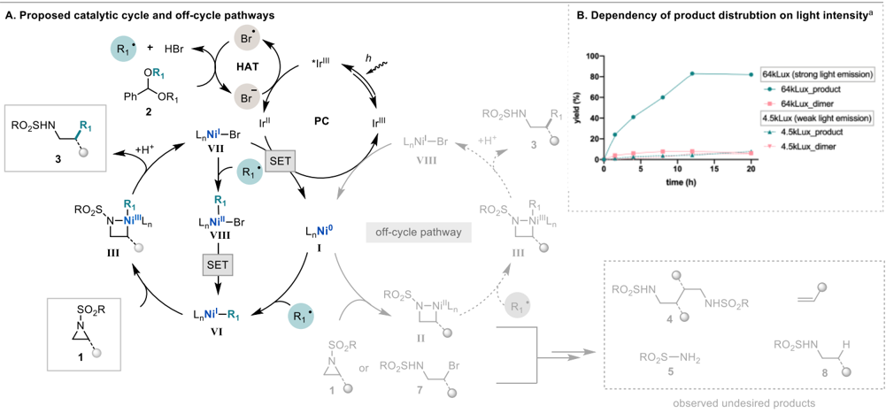

## CONCLUSION

In conclusion, we have developed a C(sp 3 ) -C(sp 3 ) cross-coupling methodology between aziridines and benzaldehyde dialkyl acetals as latent alkyl radical sources. The transformation employs a diverse set of styrenyl aziridines with varying substitution on the sulfonamide. Moreover, methyl, 1⁰ and 2⁰ unactivated  aliphatic  coupling  partners  can  be  installed  efficiently. The orthogonal activation of each coupling component and ligation at distinct Ni oxidation states imparts cross-selectivity between two C(sp 3 ) precursors. Specifically, mechanistic studies  support  a  pathway  for  activation  of  aziridines  via  Ni(I) -Ni(III)  oxidative  addition,  distinct  from  the  commonly  proposed oxidative addition of aziridines to Ni(0). These mechanistic studies shed light on the nature of the activation modes for unconventional C(sp 3 ) precursors, which we anticipate can lead to the expansion of C(sp 3 ) -C(sp 3 ) cross-coupling methodologies in future studies.

## ASSOCIATED CONTENT

Supporting Information . This material is available free of charge via the Internet at http://pubs.acs.org/

Experimental procedures, detailed optimization tables, characterization of newly synthesized compounds, spectroscopic data (PDF)

## AUTHOR INFORMATION

## Corresponding Author

Abigail G. Doyle - Department of Chemistry, Princeton University, Princeton, New Jersey 08544, United States; Department of Chemistry &amp; Biochemistry, University of California Los Angeles, Los Angeles, California 90095, United States;

Email: agdoyle@chem.ucla.edu

## Author

Sun Dongbang - Department of Chemistry, Princeton University, Princeton, New Jersey 08544, United States;

## Notes

The authors declare no competing financial interest.

## ACKNOWLEDGMENT

Financial support for the methodology development was supported by  NIGMS  (R35  GM126986).  The  stoichiometric  and  spectroscopic studies for the mechanistic analysis are based on work supported by BioLEC (an Energy Frontier Research Center funded by the U.S. Department of Energy, Office of Science, Office of Basic Energy Sciences under Award no. DESC0019370). We thank Dr. John Eng assistance with EPR measurements, and Ken Conover for assistance with photo NMR measurements. We thank Dr. Stavros K. Kariofillis and Dr. Will Sii Hong Lau for the helpful discussions.

## REFERENCES

(1) Selected reviews on Ni catalyzed cross-electrophile coupling: (a) Wang, X.; Dai, Y.; Gong, H. Nickel-Catalyzed Reductive Couplings. Top.  Curr.  Chem. 2016 , 374 ,  43.  (b)  Weix,  D.  J.  Methods  and Mechanisms  for  Cross-Electrophile  Coupling  of  Csp 2 Halides  with Alkyl Electrophiles. Acc. Chem. Res. 2015 , 48 , 1767-1775.

(2) For selected examples of C(sp 3 )-C(sp 2 ) cross-electrophile coupling reactions, see: (a) Durandetti, M.; Nédélec, J.-Y.; Périchon, J. NickelCatalyzed Direct Electrochemical Cross-Coupling between Aryl Halides and Activated Alkyl Halides. J. Org. Chem. 1996 , 61 , 17481755. (b)  Everson, D. A.; Shrestha, R.; Weix, D. J. Nickel-Catalyzed Reductive Cross-Coupling of Aryl Halides with Alkyl Halides. J. Am. Chem. Soc. 2010 , 132 , 920-921. (c) Amatore, M.; Gosmini, C. Direct Method for Carbon-Carbon Bond Formation: The Functional Group Tolerant Cobalt-Catalyzed Alkylation of Aryl Halides. Chem. - A Eur. J. 2010 , 16 ,  5848-5852. (d) Cherney, A. H.; Reisman, S. E. NickelCatalyzed Asymmetric Reductive Cross-Coupling Between Vinyl and Benzyl Electrophiles. J. Am. Chem. Soc. 2014 , 136 , 14365-14368. (e) Wang, X.; Wang, S.; Xue, W.; Gong, H. Nickel-Catalyzed Reductive Coupling of Aryl Bromides with Tertiary Alkyl Halides. J. Am. Chem. Soc. 2015 , 137 ,  11562-11565.  (f)  Kadunce,  N.  T.;  Reisman,  S.  E.

Nickel-Catalyzed  Asymmetric  Reductive  Cross-Coupling  between Heteroaryl Iodides and α-Chloronitriles. J. Am. Chem. Soc. 2015 , 137 , 10480-10483. (g) Zhang, P.; Le, C. 'Chip'; MacMillan, D. W. C. Silyl Radical Activation of Alkyl Halides in Metallaphotoredox Catalysis: A Unique Pathway for Cross-Electrophile Coupling. J. Am. Chem. Soc. 2016 , 138 , 8084-8087.

(3) Everson, D. A.; Weix, D. J. Cross-Electrophile Coupling: Principles of Reactivity and Selectivity. J. Org. Chem. 2014 , 79 , 4793-4798.

(4) Diccianni, J. B.; Diao, T. Mechanisms of Nickel-Catalyzed CrossCoupling Reactions. Trends Chem. 2019 , 1 , 830-844.

(5)  For  selected  reviews  on  Ni  catalyzed  C(Sp 3 )-C(Sp 3 ) crosscoupling, see: (a)Kranthikumar, R. Recent Advances in C(Sp 3 )-C(Sp 3 ) Cross-Coupling  Chemistry:  A  Dominant  Performance  of  Nickel Catalysts. Organometallics 2022 . 41, 667-679. (b) Gu, J.; Wang, X.; Xue,  W.;  Gong,  H.  Nickel-Catalyzed  Reductive  Coupling  of  Alkyl Halides with Other Electrophiles: Concept and Mechanistic Considerations. Org. Chem. Front. 2015 , 2 , 1411-1421.

(6)  For  examples  of  Ni  catalyzed  reductive  C(Sp 3 )-C(Sp 3 )  crosselectrophile coupling of (pseudo)alkyl halides (including alkyl halides, alkyl pyridinium salts, NHP esters), see : (a) Xu, H.; Zhao, C.; Qian, Q.; Deng, W.; Gong, H. Nickel-Catalyzed Cross-Coupling of Unactivated Alkyl Halides Using Bis(Pinacolato)Diboron as Reductant. Chem. Sci. 2013 , 4 , 4022-4029. (b) Liang, Z.; Xue, W.; Lin, K.;  Gong,  H.  Nickel-Catalyzed  Reductive  Methylation  of  Alkyl Halides and Acid Chlorides with Methyl p-Tosylate. Org. Lett. 2014 , 16 ,  5620-5623.  (c)  Yu,  X.;  Yang,  T.;  Wang,  S.;  Xu,  H.;  Gong,  H. Nickel-Catalyzed  Reductive  Cross-Coupling  of  Unactivated  Alkyl Halides. Org. Lett. 2011 , 13 , 2138-2141. (d) Li, Y.; Li, Y.; Peng, L.; Wu,  D.;  Zhu,  L.;  Yin,  G.  Nickel-Catalyzed  Migratory  Alkyl-Alkyl Cross-Coupling  Reaction. Chem.  Sci. 2020 , 11 ,  10461-10464.  (f) Kang, K.; Weix, D. J. Nickel-Catalyzed  C(Sp 3 )-C(Sp 3 ) CrossElectrophile Coupling of In Situ Generated NHP  Esters with Unactivated  Alkyl  Bromides. Org.  Lett. 2022, 24 ,  2853-2857.  (g) Cong, F.; Lv, X.-Y.; Day, C. S.; Martin, R. Dual Catalytic Strategy for Forging Sp2-Sp3  and  Sp3-Sp3  Architectures  via  β-Scission of Aliphatic Alcohol Derivatives. J. Am. Chem. Soc. 2020 , 142 , 2059420599.

(7) Liu, J.-H.; Yang, C.-T.; Lu, X.-Y.; Zhang, Z.-Q.; Xu, L.; Cui, M.; Lu, X.; Xiao, B.; Fu, Y.; Liu, L. Copper-Catalyzed Reductive CrossCoupling of Nonactivated Alkyl Tosylates and Mesylates with Alkyl and Aryl Bromides. Chem. - A Eur. J. 2014 , 20 , 15334-15338.

(8) For examples of electrochemical methods see; (a) Zhang, W.; Lu, L.;  Zhang,  W.;  Wang,  Y.;  Ware,  S.  D.;  Mondragon,  J.;  Rein,  J.; Strotman,  N.;  Lehnherr,  D.;  See,  K.  A.;  Lin,  S.  Electrochemically Driven  Cross-Electrophile  Coupling  of  Alkyl  Halides. Nature 2022 , 604 ,  292-297.  (b)  Zhang,  B.;  Gao,  Y.;  Hioki,  Y.;  Oderinde,  M.  S.; Qiao, J. X.; Rodriguez, K. X.; Zhang, H.-J.; Kawamata, Y.; Baran, P. S. Ni-Electrocatalytic C(Sp 3 )-C(Sp 3 ) Doubly Decarboxylative Coupling. Nature 2022 , 606 , 313-318.

(9) For reviews on Metallaphotoredox, see: (a) Chan, A. Y.; Perry, I. B.; Bissonnette, N. B.; Buksh, B. F.; Edwards, G. A.; Frye, L. I.; Garry, O. L.; Lavagnino, M. N.; Li, B. X.; Liang, Y.; Mao, E.; Millet, A.; Oakley, J. V; Reed, N. L.; Sakai, H. A.; Seath, C. P.; MacMillan, D. W. C. Metallaphotoredox: The Merger of Photoredox and Transition Metal Catalysis. Chem. Rev. 2022 , 122 , 1485-1542. (b) Zhu, C.; Yue, H.; Chu, L.; Rueping, M. Recent Advances in Photoredox and Nickel Dual-Catalyzed Cascade Reactions: Pushing the Boundaries of Complexity. Chem. Sci. 2020 , 11 , 4051-4064.

(10)  For  examples  of  Ni  catalyzed  C(sp 3 )-C(sp 3 )  cross-coupling  via redox-neutral photoredox methods, see: (a) Johnston, C. P.; Smith, R. T.;  Allmendinger,  S.;  MacMillan,  D.  W.  C.  MetallaphotoredoxCatalysed  Sp 3 -Sp 3 Cross-Coupling  of  Carboxylic  Acids  with  Alkyl Halides. Nature 2016 , 536 , 322-325. (b) Sakai, H. A.; MacMillan, D. W. C. Nontraditional Fragment Couplings of Alcohols and Carboxylic Acids:  C(Sp 3 )-C(Sp 3 )  Cross-Coupling  via  Radical  Sorting. J.  Am. Chem. Soc. 2022 , 144 , 6185-6192. (c) Wei, L.; N., L. M.; A., G. C.; Jesús, A.; C., M. D. W. A Biomimetic SH2 Cross-Coupling Mechanism for Quaternary Sp3-Carbon Formation. Science 2021 , 374 , 1258-1263.

(d) Le Saux, E.; Zanini, M.; Melchiorre, P. Photochemical Organocatalytic Benzylation of Allylic C-H Bonds. J. Am. Chem. Soc. 2022 , 144 , 1113-1118.

(11) (a) Huang, C.-Y. (Dennis); Doyle, A. G. Nickel-Catalyzed Negishi Alkylations  of  Styrenyl  Aziridines. J.  Am.  Chem.  Soc. 2012 , 134 , 9541-9544. (b) Nielsen, D. K.; Huang, C.-Y. (Dennis); Doyle, A. G. Directed Nickel-Catalyzed Negishi Cross Coupling of Alkyl Aziridines. J. Am. Chem. Soc. 2013 , 135 , 13605-13609. (c) Huang, C.Y. (Dennis); Doyle, A. G. Electron-Deficient Olefin Ligands Enable Generation of Quaternary Carbons by Ni-Catalyzed Cross-Coupling. J. Am. Chem. Soc. 2015 , 137 ,  5638-5641. (d) Estrada, J. G.; Williams, W.  L.;  Ting,  S.  I.;  Doyle,  A.  G.  Role  of  Electron-Deficient  Olefin Ligands  in  a  Ni-Catalyzed  Aziridine  Cross-Coupling  To  Generate Quaternary Carbons. J. Am. Chem. Soc. 2020 , 142 , 8928-8937.

(12)  (a)  Duda,  M.  L.;  Michael,  F.  E.  Palladium-Catalyzed  CrossCoupling of N-Sulfonylaziridines with Boronic Acids. J.  Am. Chem. Soc. 2013 , 135 ,  18347-18349.  (b)  Teh,  W.  P.;  Michael,  F.  E. Palladium-Catalyzed Cross-Coupling of N-Sulfonylaziridines and Alkenylboronic Acids: Stereospecific Synthesis of Homoallylic Amines  with  Di-  and  Trisubstituted  Alkenes. Org.  Lett. 2017 , 19 , 1738-1740.

(13) Jensen, K. L.; Standley, E. A.; Jamison, T. F. Highly Regioselective Nickel-Catalyzed Cross-Coupling of N-Tosylaziridines and Alkylzinc Reagents. J. Am. Chem. Soc. 2014 , 136 , 11145-11152.

(14) (a) Takeda, Y.; Ikeda, Y.; Kuroda, A.; Tanaka, S.; Minakata, S. Pd/NHC-Catalyzed Enantiospecific and Regioselective SuzukiMiyaura Arylation of 2-Arylaziridines: Synthesis of Enantioenriched 2-Arylphenethylamine  Derivatives. J.  Am.  Chem.  Soc. 2014 , 136 , 8544-8547.  (b)  Takeda,  Y.;  Shibuta,  K.;  Aoki,  S.;  Tohnai,  N.; Minakata, S. Catalyst-Controlled Regiodivergent Ring-Opening C(Sp 3 )-Si Bond-Forming Reactions of 2-Arylaziridines with Silylborane Enabled by Synergistic Palladium/Copper Dual Catalysis. Chem. Sci. 2019 , 10 , 8642-8647. (c) Takeda, Y.; Matsuno, T.; Sharma, A. K.; Sameera, W. M. C.; Minakata, S. Asymmetric Synthesis of Β2Aryl Amino Acids through Pd-Catalyzed Enantiospecific and Regioselective Ring-Opening Suzuki-Miyaura Arylation of Aziridine2-Carboxylates. Chem. - A Eur. J. 2019 , 25 , 10226-10231. (d) Kano, D.; Minakata, S.; Komatsu, M. Novel Organic-Solvent-Free Aziridination  of  Olefins:  Chloramine-T-I2  System  under  PhaseTransfer Catalysis Conditions. J. Chem. Soc. Perkin Trans. 1 2001 , 23, 3186-3188.

(15)  Nguyen,  T.  N.;  May,  J.  A.  Branched  Amine  Synthesis  via Aziridine or Azetidine Opening with Organotrifluoroborates by Cooperative  Brønsted/Lewis  Acid  Catalysis:  An  Acid-Dependent Divergent Mechanism. Org. Lett. 2018 , 20 , 3618-3621.

(16) Yu, X.-Y.; Zhou, Q.-Q.; Wang, P.-Z.; Liao, C.-M.; Chen, J.-R.; Xiao, W.-J. Dual Photoredox/Nickel-Catalyzed Regioselective CrossCoupling  of  2-Arylaziridines  and  Potassium  Benzyltrifluoroborates: Synthesis of β-Substitued Amines. Org. Lett. 2018 , 20 , 421-424.

(17)  Irsfeld,  M.;  Spadafore,  M.;  Prüß,  B.  M.  β-Phenylethylamine,  a Small Molecule with a Large Impact. Webmedcentral 2013 , 4 , 44094423.

(18) Woods, B. P.; Orlandi, M.; Huang, C.-Y.; Sigman, M. S.; Doyle, A. G. Nickel-Catalyzed Enantioselective Reductive Cross-Coupling of Styrenyl Aziridines. J. Am. Chem. Soc. 2017 , 139 , 5688-5691.

(19) Steiman, T. J.; Liu, J.; Mengiste, A.; Doyle, A. G. Synthesis of βPhenethylamines  via  Ni/Photoredox  Cross-Electrophile  Coupling  of Aliphatic Aziridines and Aryl Iodides. J. Am. Chem. Soc. 2020 , 142 , 7598-7605.

(20)  Advances  in  C-C  bond  formation  using  reductive  coupling approaches with aziridines has been extended to other non-aryl halide C(sp 2 ) coupling partners (e.g carboxylation). See: (a) Zhou, K.; Zhu, Y.;  Fan,  W.;  Chen,  Y.;  Xu,  X.;  Zhang,  J.;  Zhao,  Y.  Late-Stage Functionalization of Aromatic Acids with Aliphatic Aziridines: Direct Approach to Form β-Branched Arylethylamine Backbones. ACS Catal. 2019 , 9 , 6738-6743. (b) Xu, C.-H.; Li, J.-H.; Xiang, J.-N.; Deng, W. Merging Photoredox/Nickel Catalysis for Cross-Electrophile Coupling of Aziridines with Pyridin-1-Ium Salts via Dearomatization. Org. Lett.

2021 , 23 , 3696-3700. (c) Davies, J.; Janssen-Müller, D.; Zimin, D. P.; Day, C. S.; Yanagi, T.; Elfert, J.; Martin, R. Ni-Catalyzed Carboxylation of Aziridines En Route to β-Amino Acids. J. Am. Chem. Soc. 2021 , 143 ,  4949-4954.  (d)  Ravn,  A.  K.;  Vilstrup,  M.  B.  T.; Noerby,  P.;  Nielsen,  D.  U.;  Daasbjerg,  K.;  Skrydstrup,  T.  Carbon Isotope Labeling Strategy for β-Amino Acid Derivatives via Carbonylation  of  Azanickellacycles. J.  Am.  Chem.  Soc. 2019 , 141 , 11821-11826.  (e)  Fan,  P.;  Jin,  Y.;  Liu,  J.;  Wang,  R.;  Wang,  C. Nickel/Photo-Cocatalyzed  Regioselective  Ring  Opening  of  N-Tosyl Styrenyl Aziridines with Aldehydes. Org. Lett. 2021 , 23 , 7364-7369.

(21) (a) Kariofillis, S. K.; Shields, B. J.; Tekle-Smith, M. A.; Zacuto, M.  J.;  Doyle,  A.  G.  Nickel/Photoredox-Catalyzed  Methylation  of (Hetero)Aryl  Chlorides  Using  Trimethyl  Orthoformate  as  a  Methyl Radical  Source. J.  Am.  Chem.  Soc. 2020 , 142 ,  7683-7689.  (b) Kariofillis, S. K.; Jiang, S.; Żurański, A. M.; Gandhi, S. S.; Martinez Alvarado,  J.  I.;  Doyle,  A.  G.  Using  Data  Science  To  Guide  Aryl Bromide  Substrate  Scope  Analysis  in  a  Ni/Photoredox-Catalyzed Cross-Coupling with Acetals as Alcohol-Derived Radical Sources. J. Am. Chem. Soc. 2022 , 144 , 1045-1055.

(22)  Stoichiometric  studies  of  Ni(0)  with  aziridines:  (a)  Lin,  B.  L.; Clough, C. R.; Hillhouse, G. L. Interactions of Aziridines with Nickel Complexes:  Oxidative-Addition and Reductive-Elimination Reactions That Break and Make C-N Bonds. J. Am. Chem. Soc. 2002 , 124 , 28902891.  (b)  Davies,  J.;  Janssen-Müller,  D.;  Zimin,  D.  P.;  Day,  C.  S.; Yanagi,  T.;  Elfert,  J.;  Martin,  R.  Ni-Catalyzed  Carboxylation  of Aziridines En Route to β-Amino Acids. J. Am. Chem. Soc. 2021 , 143 , 4949-4954.

(23) For further examples of Ni(0/II) oxidative addition , see: (a) Xu, C.-H.; Li, J.-H.; Xiang, J.-N.; Deng, W. Merging Photoredox/Nickel Catalysis for Cross-Electrophile Coupling of Aziridines with Pyridin1-Ium Salts via Dearomatization. Org. Lett. 2021 , 23 , 3696-3700. (b) Fan, P.; Jin, Y.; Liu, J.; Wang, R.; Wang, C. Nickel/Photo-Cocatalyzed Regioselective  Ring  Opening  of  N-Tosyl  Styrenyl  Aziridines  with Aldehydes. Org. Lett. 2021 , 23 , 7364-7369.

(24) Ladouceur, S.; Fortin, D.; Zysman-Colman, E. Enhanced Luminescent Iridium(III) Complexes Bearing Aryltriazole Cyclometallated Ligands. Inorg. Chem. 2011 , 50 , 11514-11526.

- (25) The sulfonamide could arise from β-H elimination, retro [2+2], enamide formation.

(26)  Although  styrene  is  formed  as  a  byproduct,  due  to  the  volatile nature,  the  yield  is  not  reported  in  table  1.  The  mass  of  styrene formation is assumed to be accounted for in determining the yield of sulfonamide 5 .

(27) (a) Schönherr, H.; Cernak, T. Profound Methyl Effects in Drug Discovery and a Call for  New C-H Methylation Reactions. Angew. Chem., Int. Ed. 2013 , 52 , 12256-12267. (b) Barreiro, E. J.; Kümmerle, A. E.; Fraga, C. A. M. The Methylation Effect in Medicinal Chemistry. Chem. Rev. 2011 , 111 , 5215-5246.

(28) (a) Kier, L. B. Burger's Medicinal Chemistry and Drug Discovery. Fifth  Edition.  Volume 5:  Therapeutic Agents Edited by  Manfred E. Wolff. John Wiley and Sons, New York. 1997. Viii + 879 Pp. ISBN 04711-57560-7. J.  Med.  Chem. 1998 , 41 ,  772-773.  (b)  Moe,  S.  T.; Shimizu, S. M.; Smith, D. L.; Van Wagenen, B. C.; DelMar, E. G.; Balandrin, M. F.; Chien, Y. (Eric); Raszkiewicz, J. L.; Artman, L. D.; Mueller,  A.  L.;  Lobkovsky,  E.;  Clardy,  J.  Synthesis,  Biological Activity,  and  Absolute  Stereochemical  Assignment of NPS 1392: A Potent and Stereoselective NMDA Receptor Antagonist. Bioorg. Med. Chem. Lett. 1999 , 9 , 1915-1920. (c) Ornstein, P. L.; Zimmerman, D. M.; Arnold, M. B.; Bleisch, T. J.; Cantrell, B.; Simon, R.; Zarrinmayeh, H.; Baker, S. R.; Gates, M.; Tizzano, J. P.; Bleakman, D.; Mandelzys, A.; Jarvie, K. R.; Ho, K.; Deverill, M.; Kamboj, R. K. Biarylpropylsulfonamides as Novel, Potent Potentiators of 2-Amino-3(5-Methyl-3-Hydroxyisoxazol-4-Yl)Propanoic Acid (AMPA) Receptors. J.  Med.  Chem. 2000 , 43 ,  4354-4358.  (d)  Smith,  B.  M.; Smith, J. M.; Tsai, J. H.; Schultz, J. A.; Gilson, C. A.; Estrada, S. A.; Chen, R. R.; Park, D. M.; Prieto, E. B.; Gallardo, C. S.; Sengupta, D.; Dosa,  P.  I.;  Covel,  J.  A.;  Ren,  A.;  Webb,  R.  R.;  Beeley,  N.  R.  A.; Martin,  M.;  Morgan,  M.;  Espitia,  S.;  Saldana,  H.  R.;  Bjenning,  C.;

Whelan,  K.  T.;  Grottick,  A.  J.;  Menzaghi,  F.;  Thomsen,  W.  J. Discovery  and  Structure-Activity  Relationship  of  (1R)-8-Chloro2,3,4,5-Tetrahydro-1-Methyl-1H-3-Benzazepine (Lorcaserin), a Selective  Serotonin  5-HT2C  Receptor  Agonist  for  the  Treatment  of Obesity. J. Med. Chem. 2008 , 51 , 305-313.

(29) (a) Han, H.; Bae, I.; Yoo, E. J.; Lee, J.; Do, Y.; Chang, S. Notable Coordination Effects of 2-Pyridinesulfonamides Leading to Efficient Aziridination and Selective Aziridine Ring Opening. Org. Lett. 2004 , 6 , 4109-4112. (b) Medina, E.; Moyano, A.; Pericàs, M. A.; Riera, A. Synthesis of N-Boc-β-Aryl Alanines and of N-Boc-β-Methyl-β-Aryl Alanines by Regioselective Ring-Opening of Enantiomerically Pure NBoc-Aziridines. J. Org. Chem. 1998 , 63 , 8574-8578. (c) Atkinson, R. S.; Ayscough, A. P.; Gattrell, W. T.; Raynham, T. M. 1-(3,4-Dihydro4-Oxoquinazolin-3-Yl)Aziridines  (Q-Substituted  Aziridines):  RingOpening Reactions with C-N Bond Cleavage and Preparation of QFree Chirons. J. Chem. Soc. Perkin Trans. 1 2000 , No. 18, 3096-3106. (d)  Bertolini,  F.;  Woodward, S.; Crotti, S.; Pineschi, M. A Practical Regioselective Ring-Opening of Activated Aziridines with Organoalanes. Tetrahedron Lett. 2009 , 50 , 4515-4518. (e) Gajda, T.; Napieraj,  A.;  Osowska-Pacewicka,  K.;  Zawadzki,  S.;  Zwierzak,  A. Synthesis of Primary Sec-Alkylamines via Nucleophilic Ring-Opening of N -Phosphorylated Aziridines. Tetrahedron 1997 , 53 , 4935-4946.

(30) (a) Zhao, C.; Rakesh, K. P.; Ravidar, L.; Fang, W.-Y.; Qin, H.-L. Pharmaceutical and Medicinal Significance of Sulfur (SVI)-Containing Motifs  for  Drug  Discovery:  A  Critical  Review. Eur.  J.  Med.  Chem. 2019 , 162 , 679-734. (b) Apaydın,  S.;  Török,  M.  Sulfonamide Derivatives  as  Multi-Target  Agents  for  Complex  Diseases. Bioorg. Med. Chem. Lett. 2019 , 29 , 2042-2050. (c) Kwon, Y.; Song, J.; Lee, H.; Kim, E.-Y.; Lee, K.; Lee, S. K.; Kim, S. Design, Synthesis, and Biological Activity  of  Sulfonamide  Analogues  of  Antofine  and Cryptopleurine as Potent and Orally Active Antitumor Agents. J. Med. Chem. 2015 , 58 , 7749-7762. (d) McCauley, J. A.; McIntyre, C.  J.;  Rudd,  M.  T.;  Nguyen,  K.  T.;  Romano,  J.  J.;  Butcher,  J.  W.; Gilbert, K. F.; Bush, K. J.; Holloway, M. K.; Swestock, J.; Wan, B.-L.; Carroll, S. S.; DiMuzio, J. M.; Graham, D. J.; Ludmerer, S. W.; Mao, S.-S.;  Stahlhut,  M.  W.;  Fandozzi,  C.  M.;  Trainor,  N.;  Olsen,  D.  B.; Vacca, J.  P.;  Liverton,  N.  J.  Discovery  of  Vaniprevir  (MK-7009),  a Macrocyclic  Hepatitis  C  Virus  NS3/4a  Protease  Inhibitor. J.  Med. Chem. 2010 , 53 , 2443-2463. (e) Harper, S.; McCauley, J. A.; Rudd,  M.  T.;  Ferrara,  M.;  DiFilippo,  M.;  Crescenzi,  B.;  Koch,  U.; Petrocchi, A.; Holloway, M. K.; Butcher, J. W.; Romano, J. J.; Bush, K. J.; Gilbert, K. F.; McIntyre, C. J.; Nguyen, K. T.; Nizi, E.; Carroll, S. S.; Ludmerer, S. W.; Burlein, C.; DiMuzio, J. M.; Graham, D. J.; McHale,  C.  M.;  Stahlhut,  M.  W.;  Olsen,  D.  B.;  Monteagudo,  E.; Cianetti,  S.;  Giuliano,  C.;  Pucci,  V.;  Trainor,  N.;  Fandozzi,  C.  M.; Rowley, M.; Coleman, P. J.; Vacca, J. P.; Summa, V.; Liverton, N. J. Discovery  of  MK-5172,  a  Macrocyclic  Hepatitis  C  Virus  NS3/4a Protease Inhibitor. ACS Med. Chem. Lett. 2012 , 3 , 332-336.

(31) (a) Cabré, A.; Verdaguer, X.; Riera, A. Enantioselective Synthesis of β -Methyl Amines via Iridium-Catalyzed Asymmetric Hydrogenation of N -Sulfonyl Allyl Amines. Adv. Synth. Catal. 2019 , 361 ,  4196-4200.  (b)  de Ceglie,  M.C.;  Musio,  B.;  Affortunato,  F.; Moliterni, A.; Altomare,  A.;  Florio, S.; Luisi,  R.  Solvent-  and Temperature-Dependent Functionalisation of Enantioenriched Aziridines. Chem. Eur. J., 2021 , 17 ,: 286-296.

(32) Meng, J.; Li, X.-H.; Han, Z.-Y. Enantioselective Hydroaminomethylation  of  Olefins  Enabled  by  Rh/Brønsted  Acid Relay Catalysis. Org. Lett. 2017 , 19 , 1076-1079.

(33)  Kendall,  J.  D.;  Rewcastle,  G.  W.;  Frederick,  R.;  Mawson,  C.; Denny, W. A.; Marshall, E. S.; Baguley, B. C.; Chaussade, C.; Jackson, S. P.; Shepherd, P. R. Synthesis, Biological Evaluation and Molecular Modelling of Sulfonohydrazides as Selective PI3K P110α Inhibitors.

Crozet, D.; Urrutigoïty, M.; Kalck, P . Chem. Cat. Chem 2011 , 3 , 1102. (34) (a) Li, S.; Huang, K.; Zhang, J.; Wu, W.; Zhang, X. Rh-Catalyzed Highly  Enantioselective  Hydrogenation  of  Nitroalkenes  under  Basic Conditions. Chem.  -  A  Eur.  J. 2013 , 19 ,  10840-10844.  (b)  Li,  S.; Huang, K.; Cao, B.; Zhang, J.; Wu, W.; Zhang, X. Highly Enantioselective  Hydrogenation  of  β,β-Disubstituted  Nitroalkenes. Angew. Chemie Int. Ed. 2012 , 51 , 8573-8576.

(35)  Zhang,  J.;  Liu,  C.;  Wang,  X.;  Chen,  J.;  Zhang,  Z.;  Zhang,  W. Rhodium-Catalyzed Asymmetric Hydrogenation of β-Branched Enamides for the Synthesis of β-Stereogenic Amines. Chem. Commun. 2018 , 54 , 6024-6027.

(36) (a) Finke, P. E.; Meurer, L. C.; Oates, B.; Mills, S. G.; MacCoss, M.; Malkowitz, L.; Springer, M. S.; Daugherty, B. L.; Gould, S. L.; DeMartino, J. A.; Siciliano, S. J.; Carella, A.; Carver, G.; Holmes, K.; Danzeisen,  R.;  Hazuda,  D.;  Kessler,  J.;  Lineberger,  J.;  Miller,  M.; Schleif, W. A.; Emini, E. A. Antagonists of the Human CCR5 Receptor as  Anti-HIV-1  Agents.  Part  2:  Structure-Activity  Relationships  for Substituted 2-Aryl-1-[N-(Methyl)-N-(Phenylsulfonyl)Amino]-4(Piperidin-1-Yl)Butanes. Bioorg. Med. Chem. Lett. 2001 , 11 , 265-270. (b)  Dorn,  C.  P.;  Finke,  P.  E.;  Oates,  B.;  Budhu,  R.  J.;  Mills,  S.  G.; MacCoss, M.; Malkowitz, L.; Springer, M. S.; Daugherty, B. L.; Gould, S.  L.;  DeMartino,  J.  A.;  Siciliano,  S.  J.;  Carella,  A.;  Carver,  G.; Holmes,  K.;  Danzeisen,  R.;  Hazuda,  D.;  Kessler,  J.;  Lineberger,  J.; Miller,  M.;  Schleif,  W.  A.;  Emini,  E.  A.  Antagonists  of  the  Human CCR5 Receptor as Anti-HIV-1 Agents. Part 1: Discovery and Initial Structure-Activity Relationships for 1-Amino-2-Phenyl-4-(Piperidin1-Yl)Butanes. Bioorg. Med. Chem. Lett. 2001 , 11 , 259-264. (c) Shah, S.  K.;  Chen,  N.;  Guthikonda,  R.  N.;  Mills,  S.  G.;  Malkowitz,  L.; Springer, M. S.; Gould, S. L.; DeMartino, J. A.; Carella, A.; Carver, G.; Holmes, K.; Schleif, W. A.; Danzeisen, R.; Hazuda, D.; Kessler, J.; Lineberger, J.; Miller, M.; Emini, E. A.; MacCoss, M. Synthesis and Evaluation of CCR5 Antagonists Containing Modified 4-Piperidinyl2-Phenyl-1-(Phenylsulfonylamino)-Butane. Bioorg. Med. Chem. Lett. 2005 , 15 ,  977-982.  (d)  Tallant,  M.  D.;  Duan,  M.;  Freeman,  G.  A.; Ferris,  R.  G.;  Edelstein,  M.  P.;  Kazmierski,  W.  M.;  Wheelan,  P.  J. Synthesis and Evaluation of 2-Phenyl-1,4-Butanediamine-Based CCR5 Antagonists for the Treatment of HIV-1. Bioorg. Med. Chem. Lett. 2011 , 21 , 1394-1398.

(37) Vardanyan, R.; Hruby, V. Chapter 7 -Antidepressants; Vardanyan, R., Hruby, V. B. T.-S. of B.-S. D., Eds.; Academic Press: Boston, 2016; pp 111-143.

(38)  Kent,  C.  N.;  Park,  C.;  Lindsley,  C.  W.  Classics  in  Chemical Neuroscience: Baclofen. ACS Chem. Neurosci. 2020 , 11 , 1740-1755.

(39) For examples of isomerization at Ni(I) center, see: (a) Binder, J. T.; Cordier, C. J.; Fu, G. C. Catalytic Enantioselective Cross-Couplings of Secondary Alkyl Electrophiles with Secondary Alkylmetal Nucleophiles: Negishi Reactions of Racemic Benzylic Bromides with Achiral  Alkylzinc  Reagents. J.  Am.  Chem.  Soc. 2012 , 134 ,  1700317006. (b) Juliá-Hernández, F.; Moragas, T.; Cornella, J.; Martin, R. Remote  carboxylation  of  halogenated  aliphatic  hydrocarbons  with carbon dioxide. Nature 2017 , 545 , 84-88. (c) Zhou, F.; Zhu, J.; Zhang, Y.;  Zhu,  S.  NiH-Catalyzed  Reductive  Relay  Hydroalkylation:  A Strategy  for  the  Remote  C(sp 3 )-H  Alkylation  of  Alkenes. Angew. Chem., Int. Ed. 2018 , 57, 4058-4062.  (d) Zhou, L.; Zhu, C.; Bia, P.; Feng,  C.  Ni-catalyzed  migratory  fluoro-alkenylation  of  unactivated alkyl bromides with gem-difluoroalkenes. Chem. Sci. 2019 , 10 , 11441149. (e) Chen, F.; Chen, Ke.; Zhang, Y.; He, Y.; Wang, Y.; Zhu, S. Remote Migratory Cross-Electrophile Coupling and Olefin Hydroarylation Reactions Enabled by in Situ Generation of NiH. J. Am. Chem. Soc. 2017 , 139 , 13929-13935.

(40) For examples of reductive dimerization of alkyl halides, see: (a) Prinsell, M. R.; Everson, D. A.; Weix, D. J. Nickel-Catalyzed, Sodium Iodide-Promoted  Reductive  Dimerization  of  Alkyl  Halides,  Alkyl Pseudohalides, and Allylic Acetates. Chem. Commun. 2010 , 46 , 57435745. (b)  Peng, Y.; Luo, L.; Yan, C.-S.; Zhang, J.-J.; Wang, Y.-W. NiCatalyzed Reductive Homocoupling of Unactivated Alkyl Bromides at Room Temperature and Its Synthetic Application. J. Org. Chem. 2013 , 78 , 10960-10967.

(41) Somerville, R. J.; Odena, C.; Obst, M. F.; Hazari, N.; Hopmann, K.  H.;  Martin,  R.  Ni(I)-Alkyl  Complexes  Bearing  Phenanthroline Ligands: Experimental Evidence for CO 2 Insertion at Ni(I) Centers. J. Am. Chem. Soc. 2020 , 142 , 10936-10941.

(42) West, J. G.; Sorensen, E. J. Development of a Bio-Inspired Dual Catalytic System for Alkane Dehydrogenation. Isr. J. Chem. 2017 , 57 , 259-269.

(43) Lau, S. H.; Borden, M. A.; Steiman, T. J.; Parasram, M.; Wang, L. S.;  Doyle,  A.  G.  Ni/Photoredox-Catalyzed  Enantioselective  CrossElectrophile  Coupling  of  Styrene  Oxides  with  Aryl  Iodides J.  Am. Chem. Soc. 2021 , 143 , 15873-15881.

(44) The branched/linear ratio remains constant throughout the reaction course, suggesting that the rate of isomerization is significantly faster than the rate of oxidative addition (See SI Section V-E)'

(45) We do not expect the same ρ value because dtbbpy is used as a ligand for methylation whereas 5,5'-difluoro-2,2'-bipyridine is used as a ligand for the iso-propylation.

(46) Brown, H. C.; Okamoto, Y. Electrophilic Substituent Constants. J. Am. Chem. Soc. 1958 , 80 , 4979-4987.

(47) Jiang, X.; Ji, G. A Self-Consistent and Cross-Checked Scale of Spin-Delocalization Substituent Constants, the .Sigma.JJ.Bul. Scale. J. Org. Chem. 1992 , 57 , 6051-6056.

(48)  (a)  Pérez-García,  P.  M.;  Darù,  A.;  Scheerder,  A.R.;  Lutz,  M.; Harvey,  J.  N.;  Moret,  M.  Oxidative  Addition  of  Aryl  Halides  to  a Triphosphine  Ni(0)  Center  to  Form  Pentacoordinate  Ni(II)  Aryl Species. Organometallics 2020 , 39 , 1139-1144. (b) Foà, M.; Cassar, L. Oxidative addition of aryl halides to tris(triphenylphosphine)nickel(0) J. Chem. Soc., Dalton Trans. , 1975 , 2572-2576.

(49) Xu, S.; Hirano, K. Miura, M. Org. Lett. 2021 , 23 , 5471-5475.

(50) Lin, Q.; Fu, Y.; Liu, P.; Diao, T. Monovalent Nickel-Mediated Radical Formation: A Concerted Halogen-Atom Dissociation Pathway Determined by Electroanalytical Studies. J. Am. Chem. Soc. 2021 , 143 , 14196-14206.

(51) (a) Peng, L.; Li, Y.; Li, Y.; Wang, W.; Pang, H.; Yin, G. LigandControlled Nickel-Catalyzed Reductive  Relay  Cross-Coupling  of Alkyl Bromides and Aryl Bromides. ACS Catal. 2018 , 8 , 310-313. (b) Peng, L.; Li, Z.; Yin, G. Photochemical Nickel-Catalyzed Reductive Migratory  Cross-Coupling  of  Alkyl  Bromides  with  Aryl  Bromides. Org. Lett. 2018 , 20 , 1880-1883.

(52) We have also considered the possibility that Ni(I)Br undergoes direct  oxidative  addition  to  the  aziridine.  However,  previous  studies comparing the rate of reduction of alkyl halides with Ni(I)Br versus Ni(I)Ar, have shown that the Ni(I)Ar species, owing to their greater electron-density,  are  more  reactive.  For  related  studies,  see:  Lin  Q.; Diao, T. J. Am. Chem. Soc. 2019 , 141 , 17937-17948.

(53)  Although  isomerization  of  the  Ni(alkyl)  is  proposed  at  Ni(I), isomerization at Ni(II) could also occur, which would be pertinent to a Ni(I)-Ni(II)-Ni(I)-Ni(III) cycle. For examples of isomerization at Ni(I) and Ni(II), see ref (39) and D'Aniello, M. J.; Barefield, E.K. J.  Am. Chem. Soc. 1978 , 100 , 1474-1481.

(54) We have also considered the possibility of an S H 2 pathway, where the benzylic radical directly attacks an Ni(II)-ligated alkyl to generate the  C-C  bond.  However,  S H 2  pathways  are  most  common  for  fully coordinated Ni(IV), Fe(III) and Co(III) species where direct access to the  metal  center  is  precluded.  For  examples,  see:  (a)  Bour,  J.  R.; Ferguson,  D.  M.;  McClain,  E.  J.;  Kampf,  J.  W.;  Sanford,  M.  S. Connecting Organometallic Ni(III) and Ni(IV): Reactions of CarbonCentered Radicals with High-Valent Organonickel Complexes. J. Am. Chem. Soc. 2019 , 141 , 8914-8920. (b) Wei, L.; N., L. M.; A., G. C.; Jesús, A.; C., M. D. W. A Biomimetic SH2 Cross-Coupling Mechanism for Quaternary Sp3-Carbon Formation. Science 2021 , 374 , 1258-1263. (c) Wang, Y.; Wen, X.; Cui, X.; Zhang, X. P. Enantioselective Radical Cyclization  for  Construction  of  5-Membered  Ring  Structures  by Metalloradical C-H Alkylation. J. Am. Chem. Soc. 2018 , 140 , 47924796.

Authors are required to submit a graphic entry for the Table of Contents (TOC) that, in conjunction with the manuscript title, should give the reader a representative idea of one of the following: A key structure, reaction, equation, concept, or theorem, etc., that is discussed in the manuscript. Consult the journal's Instructions for Authors for TOC graphic specifications.

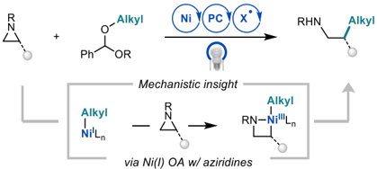