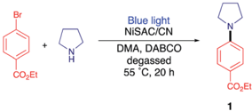
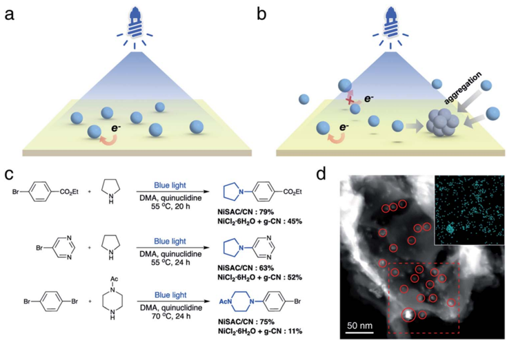
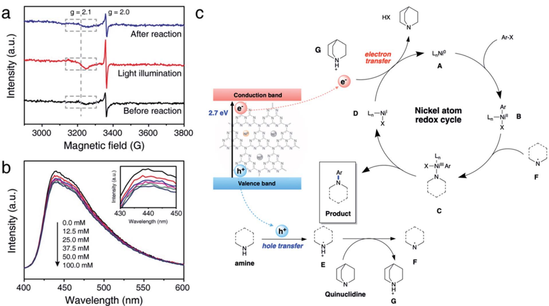
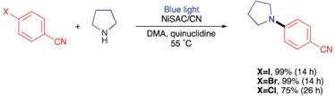
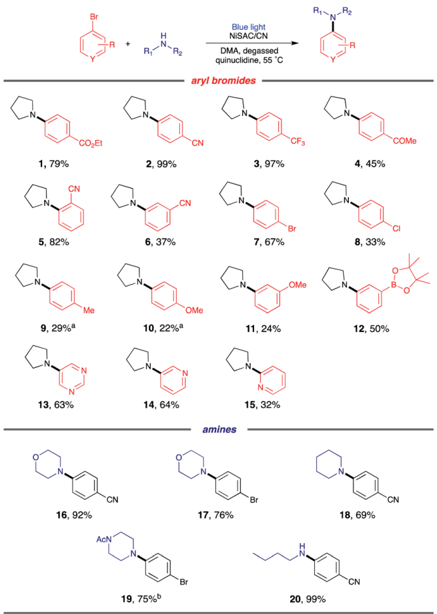

Chemical

Science

* ROYAL SOCIETY

Showcasing research from Professor Taeghwan Hyeon and Dong Won Yoo's laboratory, School of Chemical and Biological Engineering, Seoul National University, Seoul, South Korea.

Ni single atoms on carbon nitride for visible-light-promoted full heterogeneous dual catalysis

We introduce heterogeneous single Ni atoms supported on carbon nitride (NiSAC/CN) for visible-light-driven C-N functionalization with a broad substrate scope. Compared to a semi-heterogeneous system, high activity and stability were observed due to metal-support interactions. Furthermore, through systematic experimental mechanistic studies, we demonstrate that the stabilized single Ni atoms on CN eff  ectively change their redox states, leading to a complete photoredox cycle for C-N coupling.

## Chemical Science

## EDGE ARTICLE

Cite this: Chem. Sci. , 2022, 13 , 8536

All publication charges for this article have been paid for by the Royal Society of Chemistry

Received 18th April 2022 Accepted 20th June 2022

DOI: 10.1039/d2sc02174a

rsc.li/chemical-science

## Introduction

Heterogeneous photocatalytic reactions have received considerable attention for the greener synthesis of valuable  ne chemicals and fuels from solar energy. 1 -3 In addition to the sole use of heterogeneous photocatalysts, dual catalysis ( i.e. , the merger of transition metal catalysis and photocatalysis) enables novel organic transformations, which are elusive under traditional methods. 4 -7 Although recent studies on semi-heterogeneous systems, exploiting metal salts together with a heterogeneous photocatalyst, showed some promise, several drawbacks, including the non-recyclability of metal catalysts and photocatalyst deactivation problems due to metal aggregation, remain. 8,9

Single-atom catalysts (SAC) are representative alternatives to complement the drawbacks of semi-heterogeneous dual catalysis as a bridge between heterogeneous and homogeneous systems. 10 -12 In SAC systems, various materials can be used to support single metal atoms, including carbon-based materials, 13,14 oxides, 15,16 and metals. 17,18 Carbon nitride (CN),

a Department of Chemical and Biological Engineering, Institute of Chemical Processes, Seoul National University, Seoul 08826, Republic of Korea. E-mail: thyeon@snu.ac.kr; dwyoo@snu.ac.kr

b Center for Nanoparticle Research, Institute for Basic Science (IBS), Seoul 08826, Republic of Korea

c Pohang Accelerator Laboratory (PAL), Pohang University of Science and Technology (POSTECH), Pohang, Gyeongbuk 37673, Republic of Korea

† Electronic supplementary information (ESI) available. See https://doi.org/10.1039/d2sc02174a

‡ M. K., J. B., and B.-H. L. contributed equally to this work.

|

View Article Online View Journal  | View Issue

## Ni single atoms on carbon nitride for visible-lightpromoted full heterogeneous dual catalysis †

Minjoon Kwak, ‡ a Jinsol Bok, ‡ ab Byoung-Hoon Lee, ‡ ab Jongchan Kim, a Youngran Seo, a Sumin Kim, a Hyunwoo Choi, a Wonjae Ko, ab Wytse Hooch Antink, ab Chan Woo Lee, ab Guk Hee Yim, a Hyojin Seung, ab Chansul Park, ab Kug-Seung Lee, c Dae-Hyeong Kim, ab Taeghwan Hyeon * ab and Dongwon Yoo * ab

Visible-light-driven organic transformations are of great interest in synthesizing valuable fi ne chemicals under mild conditions. The merger of heterogeneous photocatalysts and transition metal catalysts has recently drawn much attention due to its versatility for organic transformations. However, these semiheterogenous systems su ff ered several drawbacks, such as transition metal agglomeration on the heterogeneous surface, hindering further applications. Here, we introduce heterogeneous single Ni atoms supported on carbon nitride (NiSAC/CN) for visible-light-driven C -N functionalization with a broad substrate scope. Compared to a semi-heterogeneous system, high activity and stability were observed due to metal -support interactions. Furthermore, through systematic experimental mechanistic studies, we demonstrate that the stabilized single Ni atoms on CN e ff ectively change their redox states, leading to a complete photoredox cycle for C -N coupling.

a metal-free 2D semiconductor, is one of the most promising supports for SACs because of its abundant anchoring sites for single metal atoms and low production cost. Moreover, CN has an appropriate band gap (about 2.7 eV) and band position to replace precious metal-based photocatalysts such as Ru and Ir complexes. 1,19 Also, the polymeric ring structure makes carbon nitride highly stable under reaction conditions compared to photoactive complexes and organic dyes. 20 -22 Albeit a few photocatalytic organic transformations of C -O bond formation by SAC supported on CN have been reported, 23 -27 the range of organic reactions needs to be expanded for a broad application.

Herein, we demonstrate Ni-catalyzed photoredox C -N bond formation, which is an important moiety in natural and pharmaceutical products, 28,29 using single Ni atoms supported on carbon nitride (NiSAC/CN). Notably, NiSAC/CN shows no aggregation of nickel species under blue light and a higher yield of the desired product compared to a semi-heterogeneous system. Intriguingly, we found that Ni single atoms on the heterogeneous surface of CN can dynamically change their oxidation state from the initial formation of Ni(0) to regulate the electron transfer process. We provide a picture of how the redox cycle of Ni atoms and photogenerated electrons and holes are interrelated to complete the heterogeneous photoredox process.

## Results and discussion

## Synthesis and characterization of catalysts

NiSAC/CN was synthesized by the wet impregnation method followed by calcination in an Ar/H2 atmosphere based on

a

BY-NO

COzEt cC)

Open Access

200 nm

5 nm

Ni 2p

Satellite

Ni(I)

Ni(O)

Blue light degassed

55 °C, 20 h

Fig. 1 (a) Representative TEM image, (b) EDS mapping image, (c) HAADF-STEM image, (d) Fourier transform of Ni K-edge EXAFS spectra (silver: Ni, grey: N, brown: C), and (e) Ni 2p XPS spectra of NiSAC/CN. (f) UV-vis spectra of CN and NiSAC/CN.

a previous report. 30 The X-ray di ff raction (XRD) pattern of NiSAC/CN showed no additional peak other than the characteristic peaks of the CN structure, which are from the stacking structure at 27.5  and the in-plane repeating unit at 13.1  , indicating that the structure of CN is well preserved a  er the deposition of single Ni atoms (Fig. S1 † ). For comparison, Ni nanoparticles supported on CN (NiNP/CN) were synthesized by a light-assisted deposition method (Fig. S2 † ), and the XRD pattern of NiNP/CN shows the presence of Ni nanoparticles (Fig. S1 † ). No aggregated Ni-based species were observed in the transmission electron microscopy (TEM) image of NiSAC/CN, consistent with the XRD analysis (Fig. 1a and S1 † ). Energy dispersive X-ray spectroscopy (EDS) elemental mapping in scanning transmission electron microscopy (STEM) mode shows the abundance of C and N signals from CN and that the Ni atoms are uniformly dispersed on the CN surface (Fig. 1b). To visualize the Ni atoms, high-angle annular dark- eld scanning transmission electron microscopy (HAADF-STEM) was performed (Fig. 1c). The homogeneous distribution of Ni atoms was observed throughout the CN surface (the bright spots correspond to Ni atoms). Extended X-ray absorption  ne structure spectroscopy (EXAFS) also con  rms the homogeneous distribution of Ni atoms without agglomeration (Fig. 1d and S3 † ). The peaks observed at 1.66  A correspond to nickel coordinated with nitrogen and the detailed local structure of NiSAC/

b

100 nm

CN was elucidated by curve- tting analysis. The Ni content in NiSAC/CN was measured by inductively coupled plasma optical emission spectroscopy (ICP-OES) and was determined to be 0.53 wt%.

To verify the chemical states of the single Ni atoms on CN, Xray absorption near edge structure (XANES) and X-ray photoelectron spectroscopy (XPS) studies were performed. In Ni Kedge XANES spectra (Fig. S4 † ), NiSAC/CN exhibited a higher edge position and white light intensity compared to Ni foil, implying the oxidized state of Ni species in NiSAC/CN. In the Ni 2p XPS spectra (Fig. 1e), three peaks were detected, attributed to Ni(0) species (853.2 eV), Ni(II) species (855.7 eV), and a satellite peak (861.8 eV), indicating that both oxidation states coexist. This implies that both oxidation states can be stabilized on the surface of CN, which provides the redox versatility necessary for photoredox coupling reactions. In the UV-vis spectra, CN and NiSAC/CN display similar spectra, implying that stabilization of the Ni atoms does not signi  cantly modify the absorption properties of CN (Fig. 1f and S5 † ).

## Photoredox C -N coupling

As a model reaction, the C -N coupling of ethyl 4-bromobenzoate with pyrrolidine was conducted using NiSAC/CN as a heterogeneous catalyst under a blue LED light. When the reaction mixture was irradiated in dimethylacetamide (DMA) in the presence of diazabicyclo[2,2,2]octane (DABCO) as a base, desired product 1 was obtained in 40% yield a  er 20 h (Table 1, entry 1). To verify that the reaction proceeded by dual catalysis, control experiments were performed in the absence of light, carbon nitride, and nickel (Table 1, entries 2 -4). No product was

Table 1 Control experiments on the model reaction a

| Entry   | Deviation       | Yield 1 b (%)   |
|---------|-----------------|-----------------|
| 1       | None            | 40              |
| 2       | No light        | n.d.            |
| 3       | NiCl 2 $ 6H 2 O | n.d.            |
| 4       | Carbon nitride  | n.d.            |
| 5       | No DABCO        | 40 (96 c )      |
| 6 d     | TEOA            | n.d.            |
| 7 e     | AgNO 3          | n.d.            |
| 8 f     | TEMPO           | n.d.            |
| 9       | NiNP/CN         | n.d.            |
| 10      | Quinuclidine    | 79              |

Open Access

a

BY-NO

cC)

Bri

b

detected a  er 20 h, demonstrating that light, single Ni atoms, and carbon nitride are pivotal components for C -N coupling. Notably, a yield of 40% was obtained in the absence of the base ( i.e. , DABCO), suggesting that pyrrolidine served as both the base and substrate due to its basic properties (Table 1, entry 5). When the amount of pyrrolidine was increased from 3 eq. to 5 eq., the desired product was delivered in 96% yield. Furthermore, to determine which reactive species are involved in the reaction cycle, triethanolamine (TEOA), AgNO3, and (2,2,6,6tetramethylpiperidin-1-yl)oxyl (TEMPO) were added to the reaction as hole, electron, and radical scavengers, respectively (Table 1, entries 6 -8). The addition of either scavenger led to no conversion of the starting material, implying that electrons, holes, and radicals are all engaged in the formation of the products. In addition, nickel nanoparticle/carbon nitride (NiNP/CN) was used instead of NiSAC/CN (Table 1, entry 9). Although NiNP/CN has a higher nickel content of 4.91 wt%, no desired product was detected. An even higher yield (79%) was obtained when DABCO was replaced with more basic quinuclidine (Table 1, entry 10). When a lower amount of catalyst was exploited, the yield decreased from 79% to 30%, suggesting that NiSAC/CN mediates the dual catalytic cycle in this reaction (Table S1 † ).

Next, we investigated whether the anchoring of nickel atoms to carbon nitride a ff ects photocatalytic activity. It was expected that the quick electron transfer from carbon nitride to nickel species on the heterogeneous surface contributes to the higher activity (Fig. 2a). In contrast, nickel complexes should di ff use near the carbon nitride surface to gain an electron from the photocatalyst in the semi-heterogeneous system (Fig. 2b). Thus, it was anticipated that ine ffi cient charge transfer from carbon nitrides to free nickel is an obstacle to the reaction e ffi ciency of the semi-heterogeneous system. 31 In line with our expectations, when carbon nitride and nickel species were separately introduced ( i.e. , semi-heterogeneous system), a lower yield of the desired product was observed compared to the reaction mediated by NiSAC/CN (Fig. 2c). Time-resolved PL spectra and steady-state photoluminescence (PL) spectra also corroborate the electron transfer from carbon nitride to single Ni atoms (Fig. S6 † ). When single Ni atoms were introduced, a decrease in PL intensity was observed due to the suppressed charge recombination. Moreover, a decrease in the PL lifetime (CN: 1.41 ns, NiSAC/CN: 1.07 ns) was observed due to the electron transfer from CN to single Ni atoms.

In addition, when g-CN and nickel precursors were separately introduced, the color of carbon nitride occasionally became gray (Fig. S7 † ). Material characterization studies, including TEM, STEM, and EDS elemental mapping, were conducted in the semi-heterogeneous system a  er reaction, and nickel agglomeration was observed on the surface (Fig. 2d). Severe aggregation of transition metal salts and subsequent deactivation of carbon nitride can reduce its versatility. Note that previous reports indicated that semi-heterogeneous systems for C -N coupling using NiCl2 salts and CN were not recyclable due to the formation of Ni particles under blue light. 8

NiSAC/CN was analyzed a  er conducting the C -N coupling reactions using various characterization tools. TEM, STEM, and EDS elemental mapping images (Fig. S8 † ) show that the single Ni atoms do not aggregate into nanoparticles in contrast to a semi-heterogeneous system. Furthermore, the HAADF-STEM

Fig. 2 The schematic picture of (a) NiSAC/CN and (b) semi-heterogeneous NiCl2 $ 6H2O and carbon nitride (blue, gray balls, and yellow sheets represent Ni atoms, Ni aggregates, and carbon nitride). (c) Comparison of yields under NiSAC/CN or semi-heterogeneous NiCl2 $ 6H2O and carbon nitride. (d) TEM image of carbon nitride after reaction under semi-heterogeneous system. * The indicated yields are the average of three replicate experiments.

|

a

a

BY-NO

cC)

Intensity (a.u.)

Open Access

3000

5 nm g = 2.1

3200

g = 2.0

b 5

After reaction

430

450

440

Fig. 3 (a) Representative HAADF-STEM image, (b) Ni K-edge EXAFS spectra, and (c) XPS spectra of NiSAC/CN after the model reaction.

12.5 mM

25.0 mM

37.5 mM

hole transfer image (Fig. 3a) and EXAFS data (Fig. 3b) con  rm that single Ni atoms maintain their single atomic form well a  er the reaction. The absence of metal aggregation, a major challenge of the single-atom catalyst due to high surface energy, can be attributed to the nitrogen-rich heterocycles of carbon nitride. Therefore, the surface free energy of a single atom can be minimized due to metal -support interactions. 32,33 Additionally, in Ni 2p spectra (Fig. 3c), peak shi  was negligible a  er the reaction, which was within about 0.1 eV, implying oxidation states of Ni atoms were well maintained. Also, the ratio of Ni(II)/ Ni(0) remains almost identical ( ca. 2.95). In this regard, NiSAC/ CN maintains its activity a  er the light-driven C -N coupling reaction, and the reaction could be repeated three times with excellent yields (Fig. S9 † ), although 17% of Ni leaching was observed a  er the reaction. To determine whether the leached

nickel participates in C -N coupling, a hot  ltration test was conducted, and it was supported that the reaction proceeds in a heterogeneous manner (Table S2 and Fig. S10 † ).

## Mechanism study

We further conducted comprehensive experiments for elucidating the mechanism of reaction on the surface of NiSAC/CN. To gain insight into how redox-active Ni atoms mediate heterogeneous photoredox C -N coupling, we performed a mechanistic study through further experiments such as electron paramagnetic resonance (EPR), photoluminescence (PL), and  uorescence quenching studies. A quasi in situ EPR experiment was carried out to investigate whether the Ni atom possesses dynamic redox activity under the reaction conditions (Fig. 4a and S11 † ). Compared to the reaction mixture before the

Fig. 4 (a) Quasi in situ EPR spectra of the reaction mixture at 150 K under various conditions. (b) Emission quenching experiment using PL spectroscopy with various concentrations of pyrrolidine (inset: magni fi ed spectra). (c) Proposed mechanism of photoredox C -N coupling on NiSAC/CN.

C

- Ni foil

After reaction

G

C

HX

After reaction

LNi°

reaction, an enhanced signal at g ¼ 2.0 originating from CN was observed a  er illuminating the reaction mixture. Additionally, another signal at g ¼ 2.1, ascribed to Ni(0) on carbon nitride, 30 was observed with increased intensity compared to that of the reaction mixture before the illumination. The results imply that photoexcited electrons are transferred to the single Ni atoms from CN. When the illumination stops a  er the reaction, the intensity of the signals originating from Ni(0) and CN returns to the original value, demonstrating the reversibility of the redox properties of the Ni atoms during the photoredox C -N coupling reaction.

Hence, it is concluded that Ni(0) species can play an essential role in mediating the reaction cycle. Recent reports on SACmediated photoredox organic reactions of C -O coupling proposed a catalytic cycle theoretically. For example, previous reports on C -O bond formation proposed a catalytic cycle via the Ni(I)/Ni(III) pathway, excluding Ni(0) formation. 23,24 Through the EPR experiment, we clarify the sequential electron transfer process, demonstrating Ni(0) complex formation.

To examine how Ni(0) complex engages in the catalytic cycle, kinetic studies were performed for  ve para -substituted substrates (CF3, Cl, H, Me, and OMe), and the corresponding result was plotted based on the Hammett equation (Fig. S12 and S13 † ). The linear correlation with a slope value of 4.18 was obtained, demonstrating that the para -substituents on aryl halide in  uence the reaction rate of C -N coupling signi  cantly. Furthermore, a positive correlation indicates that negative charge buildup occurs in the transition state of the catalytic cycle, and electron-withdrawing substituents accelerate the reactivity of aryl halides. Taken together with previous studies, 24,27,34,35 we hypothesized that the photogenerated Ni(0) complexes participate in the subsequent oxidative addition process, and the oxidative addition step in  uences the overall reaction rate.

Next, we sought to investigate how pyrrolidine participates in the catalytic cycle. We hypothesized that pyrrolidine radicals are formed through the reaction with the photogenerated holes of carbon nitride. 36 -38 Therefore, to verify that pyrrolidine accepts photogenerated holes from carbon nitride, a steady-state emission quenching experiment was conducted (Fig. 4b). As the concentration of pyrrolidine increased from 0.0 mM to 100.0 mM, the emission intensity of carbon nitride decreased (Fig. S14 † ). These results con  rm that pyrrolidine is capable of quenching photogenerated holes from carbon nitride. Through a control experiment in the presence of TEOA, it is corroborated that the photogenerated holes are involved in C -N bond functionalization (Table 1, entry 6). Furthermore, the pyrrolidine radical cation has a reduction potential of 0.85 V vs. SCE in acetonitrile, and the valence band of CN is located at 1.2 V vs. SCE. 5,39 Consequently, the photogenerated holes from CN are su ffi cient to oxidize pyrrolidine, which is in good agreement with our results.

Encouraged by the results, we postulated a plausible dual catalytic pathway with synergistic interactions between single nickel atoms and carbon nitride to enable C -N coupling (Fig. 4c). Based on EPR experiments, electron transfer from CN to the single Ni atoms is demonstrated to be a prerequisite for

|

C -N coupling. Correspondingly, Ni(0) species A is generated under light irradiation, and oxidative addition of aryl halides to Ni(0) results in the corresponding Ni(II) intermediate B . Based on kinetic studies, we postulated that an oxidative addition step in  uences the overall reaction rate, although complex mechanistic pathways cannot be ruled out. Simultaneously, CN quenches the photogenerated holes by pyrrolidine and forms pyrrolidine radical E , as demonstrated by the emission quenching experiment and redox properties. The resulting pyrrolidine radical E is relatively acidic and serves as a proton donor to quinuclidine, resulting in the formation of pyrrolidine radical F . Then, Ni(II) species B coordinates with the pyrrolidine radical to produce Ni(III) complex C . Reductive elimination of Ni(III) intermediate C leads to the formation of the desired product, and subsequent electron transfer from CN to Ni(I) complex D simultaneously regenerates Ni(0) species A and quinuclidine. In this cycle, quinuclidine is responsible for the generation of pyrrolidine radical F and the completion of the dual catalytic cycle. Therefore, the absence of a base or the use of another base can decelerate the conversion of the starting material.

## Substrate scope

With the optimized conditions, C -N coupling was mediated with p -halobenzonitriles (Table 2). Coupling of 4-iodobenzonitrile was completed within 14 h under standard conditions. In addition to aryl iodide, aryl bromide was also e ff ectively coupled. Furthermore, 4-chlorobenzonitrile, which is less reactive, produced the desired product in high yield at longer reaction times.

Then, we evaluated the scope of the C -N coupling reaction with aryl bromides containing an array of functional groups under standard conditions (Table 3). Aryl bromides with para -substituted electron-withdrawing groups, including an ester, nitrile, tri  uoromethyl, or acetyl group, were tested, and the desired product was delivered with excellent to moderate coupling e ffi ciency ( 1 -4 ). The presence of the ortho -substituted cyano group was compatible ( 5 ). A meta -substituted compound ( 6 ) also delivered a corresponding product with a moderate yield (96% based on the recovered starting material). C -N coupling of 1,4-dibromobenzene gave a monoaminated product 7 , providing sites for further functionalization. 1-Bromo-4chlorobenzene underwent selective C -N coupling with a bromo substituent to produce product 8 with moderate yield (84% based on the recovered starting material). Selective amination of 1-bromo-4-chlorobenzene presumably occurs due to the weaker bond strength of C -Br than of C -Cl.

## Table 2 Aryl halide coupling

Open Access

BY-NO

cC)

Me

9, 29%*

16, 92%

Blue light

NISAC/CN

DMA, degassed quinuclidine, 55 °C

Table 3 Scope of aryl bromides and amines in C -N coupling

1, 79%

5, 82%

- a LiCl (1 eq.) was added. b Reaction was heated to 70  C.

Then, C -N coupling with electron-rich aryl halides was conducted ( 9 -12 ). Our catalytic system can also mediate transformation with aryl halides containing electron-donating groups. The relatively low yields can be explained by the sluggish oxidative addition process due to the presence of electrondonating groups. For heteroaryl bromides, which are common building blocks of bioactive compounds, 29 the coupling product was also obtained, suggesting the possibility for pharmaceutical application ( 13 -15 ).

Next, we sought to explore the scope of amines. Secondary amines containing six-membered rings, including morpholine, piperidine, and 1-acetylpiperazine, were e ff ective coupling partners ( 16 -19 ). In addition to cyclic secondary amines, acyclic primary amine was investigated to produce product 20 . Although primary amines are generally less operative to cross coupling due to their relatively low nucleophilicity, 8 the desired product was delivered in 99% yield.

## Conclusions

We successfully developed a totally heterogeneous NiSAC/CN photocatalytic system for C -N coupling. Additionally, we provide a uni  ed picture of how the photogenerated electrons and holes on the CN surface control the redox cycle of single Ni atoms by regulating stepwise electron-transfer processes and radical generation to complete the heterogeneous photoredox reaction cycle. In light of mechanistic studies, including quasi in situ EPR and various spectroscopic experiments, we found that the sequential electron transfer process can be precisely controlled on the NiSAC/CN photocatalytic surface via the Ni(0)/ Ni(II)/Ni(III)/Ni(I) pathway from the initial formation of Ni(0). Our work provides an important step toward understanding the photoredox process of SACs, implying the possibility of e ff ective and sustainable synthesis of  ne chemicals using heterogeneous photocatalysts consisting of earth-abundant components.

## Data availability

We have provided experimental data in ESI † and there are no additional experimental or computational data.

## Author contributions

T. H. and D. Y. directed the research and planned the experiments. M. K., J. K., Y. S., S. K., H. C., and G. H. Y. performed the photocatalytic experiments. J. B., B.-H. L., W. K., W. H. A., and C. W. L. synthesized and characterized the catalysts. H. S. and C. P. performed EPR and PL experiments under the direction of D.-H. K. K.-S. L. conducted X-ray absorption measurements. M. K., J. B., and B.-H. L. wrote the initial manuscript. All authors discussed the results and contributed to the  nal manuscript.

## Confl icts of interest

There are no con  icts to declare.

## Acknowledgements

Synthesis and physicochemical property analysis of the nanomaterial samples were supported by the Research Center Program of the IBS (IBS-R006-D1) in Korea (T. H.). Photocatalytic experiments were supported by the National Research Foundation (NRF-2018M3A7B4071204 and NRF2021R1A4A1032515) in Korea (D. Y.), and Research Resettlement Fund for new faculty of Seoul National University (D. Y.). X-ray absorption experiment at the Pohang Accelerator Laboratory (PAL) 8C beamline was supported by a National Research Foundation of Korea (NRF) grant funded by the Korea Government (2018M1A2A2061998) (K. L.).

## References

- 1 A. Savateev, I. Ghosh, B. K¨ onig and M. Antonietti, Angew. Chem., Int. Ed. , 2018, 57 , 15936 -15947.
- 2 C. Bottecchia, N. Erdmann, P. M. Tijssen, L. G. Milroy, L. Brunsveld, V. Hessel and T. No¨ el, ChemSusChem , 2016,
- 9 , 1781 -1785.
- 3 Z. Chai, T.-T. Zeng, Q. Li, L.-Q. Lu, W.-J. Xiao and D. Xu, J. Am. Chem. Soc. , 2016, 138 , 10128 -10131.

- 4 Y.-Y. Liu, D. Liang, L.-Q. Lu and W.-J. Xiao, Chem. Commun. , 2019, 55 , 4853 -4856.
- 5 I. Ghosh, J. Khamrai, A. Savateev, N. Shlapakov, M. Antonietti and B. K¨ onig, Science , 2019, 365 , 360 -366.
- 6 Z. Zhang, Y. Xu, Q. Zhang, S. Fang, H. Sun, W. Ou and C. Su, Sci. Bull. , 2022, 67 , 71 -78.
- 7 B. Pieber, J. A. Malik, C. Cavedon, S. Gisbertz, A. Savateev, D. Cruz, T. Heil, G. Zhang and P. H. Seeberger, Angew. Chem., Int. Ed. , 2019, 58 , 9575 -9580.
- 8 S. Gisbertz, S. Reischauer and B. Pieber, Nat. Catal. , 2020, 3 , 611 -620.
- 9 S. Das, K. Murugesan, G. J. Villegas Rodr´ ı guez, J. Kaur, J. P. Barham, A. Savateev, M. Antonietti and B. K¨ onig, ACS Catal. , 2021, 11 , 1593 -1603.
- 10 A. Wang, J. Li and T. Zhang, Nat. Rev. Chem. , 2018, 2 , 65 -81.
- 11 S. Ji, Y. Chen, X. Wang, Z. Zhang, D. Wang and Y. Li, Chem. Rev. , 2020, 120 , 11900 -11955.
- 12 Y. Chen, S. Ji, C. Chen, Q. Peng, D. Wang and Y. Li, Joule , 2018, 2 , 1242 -1264.
- 13 J. Zhang, Y. Zhao, C. Chen, Y.-C. Huang, C.-L. Dong, C.-J. Chen, R.-S. Liu, C. Wang, K. Yan and Y. Li, J. Am. Chem. Soc. , 2019, 141 , 20118 -20126.
- 14 S. H. Lee, J. Kim, D. Y. Chung, J. M. Yoo, H. S. Lee, M. J. Kim, B. S. Mun, S. G. Kwon, Y.-E. Sung and T. Hyeon, J. Am. Chem. Soc. , 2019, 141 , 2035 -2045.
- 15 J. Lin, A. Wang, B. Qiao, X. Liu, X. Yang, X. Wang, J. Liang, J. Li, J. Liu and T. Zhang, J. Am. Chem. Soc. , 2013, 135 , 15314 -15317.
- 16 G. Ding, L. Hao, H. Xu, L. Wang, J. Chen, T. Li, X. Tu and Q. Zhang, Commun. Chem. , 2020, 3 , 1 -8.
- 17 C. J. Wrasman, A. R. Riscoe, H. Lee and M. Cargnello, ACS Catal. , 2020, 10 , 1716 -1720.
- 18 P. N. Duchesne, Z. Li, C. P. Deming, V. Fung, X. Zhao, J. Yuan, T. Regier, A. Aldalbahi, Z. Almarhoon and S. Chen, Nat. Mater. , 2018, 17 , 1033 -1039.
- 19 X. Wang, K. Maeda, A. Thomas, K. Takanabe, G. Xin, J. M. Carlsson, K. Domen and M. Antonietti, Nat. Mater. , 2009, 8 , 76 -80.
- 20 J. J. Devery III, J. J. Douglas, J. D. Nguyen, K. P. Cole, R. A. Flowers II and C. R. Stephenson, Chem. Sci. , 2015, 6 , 537 -541.
- 21 N. A. Romero and D. A. Nicewicz, Chem. Rev. , 2016, 116 , 10075 -10166.
- 22 C. J. O'Brien, D. G. Droege, A. Y. Jiu, S. S. Gandhi, N. A. Paras, S. H. Olson and J. Conrad, J. Org. Chem. , 2018, 83 , 8926 -8935.
- 23 X. Zhao, C. Deng, D. Meng, H. Ji, C. Chen, W. Song and J. Zhao, ACS Catal. , 2020, 10 , 15178 -15185.
- 24 A. Vijeta, C. Casadevall, S. Roy and E. Reisner, Angew. Chem., Int. Ed. , 2021, 60 , 8494 -8499.
- 25 J. Wen, X. Yang, Z. Sun, J. Yang, P. Han, Q. Liu, H. Dong, M. Gu, L. Huang and H. Wang, Green Chem. , 2020, 22 , 230 -237.
- 26 J. Ma, F. Zhang, Y. Tan, S. Wang, H. Chen, L. Zheng, H. Liu and R. Li, ACS Appl. Mater. Interfaces , 2022, 14 , 18383 -18392.
- 27 A. Vijeta, C. Casadevall and E. Reisner, Angew. Chem., Int. Ed. , 2022, 61 , e202203176.
- 28 J. Bariwal and E. Van der Eycken, Chem. Soc. Rev. , 2013, 42 , 9283 -9303.
- 29 P. Ruiz-Castillo and S. L. Buchwald, Chem. Rev. , 2016, 116 , 12564 -12649.
- 30 X. Jin, R. Wang, L. Zhang, R. Si, M. Shen, M. Wang, J. Tian and J. Shi, Angew. Chem. , 2020, 132 , 6894 -6898.
- 31 G. Neri, M. Forster, J. J. Walsh, C. Robertson, T. Whittles, P. Farr` as and A. J. Cowan, Chem. Commun. , 2016, 52 , 14200 -14203.
- 32 Z. Chen, E. Vorobyeva, S. Mitchell, E. Fako, N. L´ opez, S. M. Collins, R. K. Leary, P. A. Midgley, R. Hauert and J. P´ erez-Ram´ ı rez, Natl. Sci. Rev. , 2018, 5 , 642 -652.
- 33 X.-F. Yang, A. Wang, B. Qiao, J. Li, J. Liu and T. Zhang, Acc. Chem. Res. , 2013, 46 , 1740 -1748.
- 34 H. Ren, G.-F. Li, B. Zhu, X.-D. Lv, L.-S. Yao, X.-L. Wang, Z.-M. Su and W. Guan, ACS Catal. , 2019, 9 , 3858 -3865.
- 35 N. A. Till, L. Tian, Z. Dong, G. D. Scholes and D. W. MacMillan, J. Am. Chem. Soc. , 2020, 142 , 15830 -15841.
- 36 M. Kudisch, C.-H. Lim, P. Thordarson and G. M. Miyake, J. Am. Chem. Soc. , 2019, 141 , 19479 -19486.
- 37 T. Xiong and Q. Zhang, Chem. Soc. Rev. , 2016, 45 , 3069 -3087.
- 38 S. A. Morris, J. Wang and N. Zheng, Acc. Chem. Res. , 2016, 49 , 1957 -1968.
- 39 M. Jonsson, D. D. Wayner and J. Lusztyk, J. Phys. Chem. , 1996, 100 , 17539 -17543.