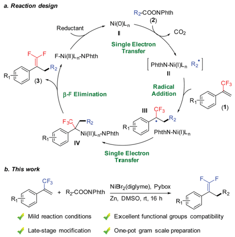
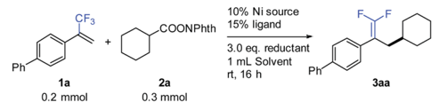
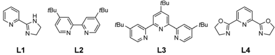
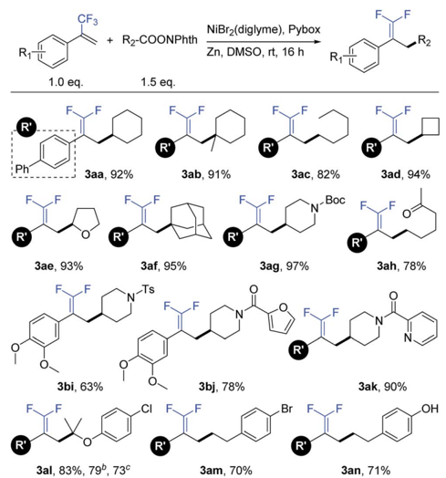
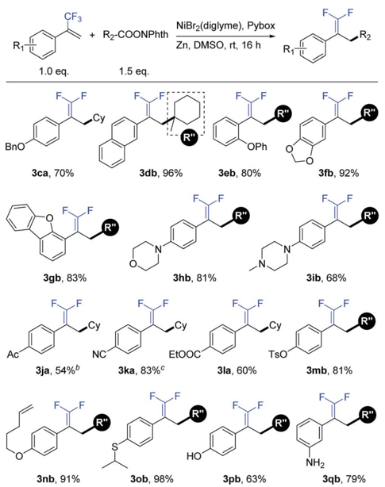
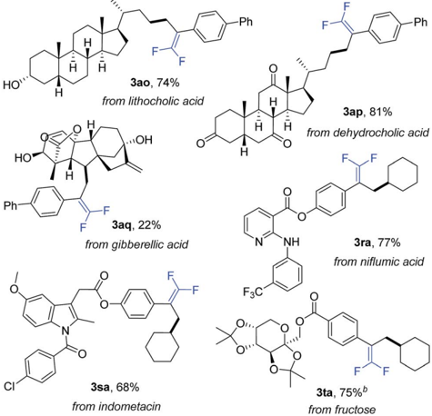
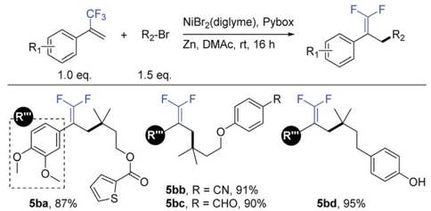
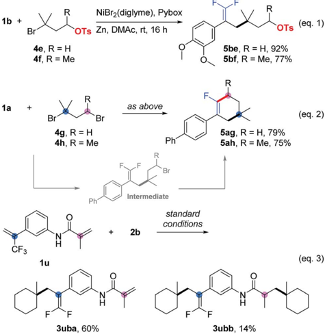
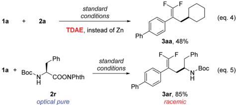

n-

Open Access Ai

*

a. Reaction design cc

(3)

## EDGE ARTICLE

R2-COONPhth

(2)

COz

PhthN-Ni(I)Ln R2

Radical

Addition

CFз

R2

## Nickel-catalyzed allylic de fl uorinative alkylation of tri fl uoromethyl alkenes with reductive decarboxylation of redox-active esters †

Xi Lu,

FзC

-R2

I

Cite this: Chem. Sci. , 2019, 10 , 809

All publication charges for this article have been paid for by the Royal Society of Chemistry

Zn, DMSO, rt, 16 h

Mild reaction conditions

Received 29th September 2018 Accepted 29th October 2018

DOI: 10.1039/c8sc04335c

rsc.li/chemical-science

R1

Herein, we report a nickel-catalyzed allylic de fl uorinative alkylation of tri fl uoromethyl alkenes through reductive decarboxylation of redox-active esters. The present reaction enables the preparation of functionalized gem -di fl uoroalkenes with the formation of sterically hindered C(sp 3 ) -C(sp 3 ) bonds under very mild reaction conditions, while tolerating many sensitive functional groups and requiring minimal substrate protection. Therefore, this method provides an e ffi cient and convenient approach for latestage modi fi cation of biologically interesting molecules.

## Introduction

E ffi cient strategies for introducing  uorine-containing fragments into organic compounds exert positive in  uences on biochemical sciences, because these  uorochemicals have superior bioactivity and physicochemical characteristics compared to their non- uorinated counterparts. 1 Among them, gem -di  uoroalkenes are a class of structurally superior  uorinecontaining compounds, and they have attracted substantial interest in agrochemistry and medicinal chemistry. For instance, the gem -di  uoroethylene moiety is widely used as an ideal carbonyl group bioisostere in drug design. 2 In addition, the gem -di  uoroethylene moiety can be easily transformed into other  uorine-containing structures such as mono  di  uoromethylenyl, and tri  uoromethyl groups. 3 To date, various strategies have been developed for the preparation of gem -di  uoroalkenes, including the conventional ones, such as direct di  uoroole  nation of carbonyl or diazo groups. 4 More recently, de  uorinative functionalization of tri  uoromethyl alkenes has been applied to the synthesis of gem -di  uoroalkenes. 5 For example, Hayashi reported a rhodium-catalyzed cross coupling of 1-(tri  uoromethyl)alkenes with arylboroxines to access 1,1-di  uoroalkenes with C(sp 2 ) -C(sp 3 ) bond construction. 6 Molander realized an example of de  uorinative alkylation of tri  uoromethyl alkenes using radical precursors (potassium organotri  uoroborates, alkylbis(catecholato)silicates and trimethylsilylamines) under photocatalysis conditions. 7

Hefei National Laboratory for Physical Sciences at the Microscale, CAS Key Laboratory of Urban Pollutant Conversion, Anhui Province Key Laboratory of Biomass Clean Energy, iChEM, University of Science and Technology of China, Hefei 230026, China. E-mail: luxi@mail.ustc.edu.cn; fuyao@ustc.edu.cn

† Electronic supplementary information (ESI) available: Experimental protocols and spectral data. See DOI: 10.1039/c8sc04335c

‡ These authors contributed equally.

Despite the great successes achieved, general methods to obtain gem -di  uoroalkenes with readily available reagents under mild conditions are still required.

Reductive cross-coupling reactions represent a versatile tool for accurate construction of C -C bonds from cheap, abundant, and stable electrophiles as compared with methods using the corresponding organometallic reagents. 8 Recently, reductive decarboxylative coupling has been exploited for generating alkyl radicals from alkanoic acids, complementing the use of alkyl halides bene  cially. 9 As part of our ongoing interest in alkene functionalization reactions 9 b ,10 and  uorinated ole  n

Fig. 1 Nickel-catalyzed allylic de fl uorinative alkylation. NPhth ¼ phthalimide.

‡

* Xiao-Xu Wang,

‡

Tian-Jun Gong, Jing-Jing Pi, Shi-Jiang He and Yao Fu

Transfer

ÇFз

(1)

View Article Online View Journal  | View Issue

20

Open Access Ai

Ph

NIBr2 (aig yme)

ÇFз

ťBu

L1

cc

tBu

DMSO

(BPIN)2/K3P04

ťBu

10% Ni source

15% ligand

￾ ťBu

3.0 eq. reductant

1 mL Solvent synthesis, 11 we set out to take advantage of allylic de  uorination and reductive decarboxylation for the radical alkylation of tri  uoromethyl alkenes (Fig. 1a). 7,12 -14 Herein, we report nickelcatalyzed de  uorinative reductive cross-coupling of tri- uoromethyl alkenes with redox-active esters to access functionalized gem -di  uoroalkenes (Fig. 1b). This reaction enabled C(sp 3 ) -C(sp 3 ) bond formation through tri  uoromethyl C -F bond cleavage and a decarboxylation process under mild reaction conditions. In terms of practicality and usability, this reaction shows a high degree of tolerance to many sensitive functional groups and requires minimal substrate protection. Therefore it can be a useful method for the synthesis of  uorinated compounds.

Ph

## Results and discussion

We commenced the study with the synthesis of gem -di  uoroalkene 3aa through de  uorinative reductive cross-coupling between 1a and 2a . Systematic screening of all the reaction parameters was carried out for optimizing the reaction performance (Table 1). A nickel-bipyridine-reductant system was tested  rst, a ff ording the desired product in low yields (entries 1 and 2). Use of tridentate N-ligands (entries 3 and 4) led to dramatic improvements: Pybox ( L4 ) increased the yield to 79% (entry 4). The selection of the nickel source was critical to this reaction: compared to NiBr2(diglyme), only NiCl2(Py)4 provided 75% yield, while other nickel catalysts were much less e ff ective (entries 5 -10). A number of solvents were also examined: ether solvents (entries 11 -13), acetonitrile (entry 14), NMP (entry 15), and DMF (entry 16) were inferior. Fortunately, the use of DMSO (entry 17) provided a nearly quantitative 95% GC yield with 92% isolated yield. Because of the formation of observable byproducts (see the ESI † for more details), Zn exhibited better e ffi ciency over other reductants such as Mn, silane, or a diboron reagent (entries 18 -20).

With the optimal reaction conditions in hand, we sought to examine the generality of this de  uorinative reductive crosscoupling by exploring a wide range of redox-active esters (Table 2). These substrates were successfully transformed into the corresponding products, obtaining in all cases good to excellent isolated yields (63 -97%). This reaction could be applied to secondary ( 3aa ), tertiary ( 3ab ), and primary ( 3ac ) aliphatic redox-active esters. Both cyclic and acyclic esters were good substrates in this transformation. With respect to cyclic esters, modi  cation of the ring size posed no problem. For example, cyclobutyl ( 3ad ), tetrahydrofuran ( 3ae ), and adamantyl ( 3af ) substrates provided the respective products with nearly quantitative yields. Under mild reaction conditions, this reaction exhibited good compatibility with many synthetically useful functional groups such as carbamate ( 3ag ), ketone ( 3ah ), and sulfonamide ( 3bi ). In addition, heterocycles including furan ( 3bj ) and pyridine ( 3ak ) were well tolerated. The compatibility to aryl chloride ( 3al ) and aryl bromide ( 3am ) provided opportunities for convenient transformations at the retained carbon -halogen bonds through the use of other crosscoupling reactions. Moreover, this reaction could even be conducted in the presence of an acidic phenolic hydroxyl group

|

22

Table 1 Optimization of the reaction conditions a

|   Entry | Nickel source     | Ligand   | Reductant          | Solvent   | Yield a /%   |
|---------|-------------------|----------|--------------------|-----------|--------------|
|       1 | NiBr 2 (diglyme)  | L1       | Zn                 | DMAc      | 23           |
|       2 | NiBr 2 (diglyme)  | L2       | Zn                 | DMAc      | 32           |
|       3 | NiBr 2 (diglyme)  | L3       | Zn                 | DMAc      | 47           |
|       4 | NiBr 2 (diglyme)  | L4       | Zn                 | DMAc      | 79           |
|       5 | NiCl 2            | L4       | Zn                 | DMAc      | 33           |
|       6 | Ni(NO 3 ) 2       | L4       | Zn                 | DMAc      | <5           |
|       7 | Ni(acac) 2        | L4       | Zn                 | DMAc      | 26           |
|       8 | NiCl 2 (Py) 4     | L4       | Zn                 | DMAc      | 75           |
|       9 | NiCl 2 (PPh 3 ) 2 | L4       | Zn                 | DMAc      | 23           |
|      10 | NiCl 2 (PCy 3 ) 2 | L4       | Zn                 | DMAc      | 17           |
|      11 | NiBr 2 (diglyme)  | L4       | Zn                 | Dioxane   | <5           |
|      12 | NiBr 2 (diglyme)  | L4       | Zn                 | DME       | 22           |
|      13 | NiBr 2 (diglyme)  | L4       | Zn                 | THF       | 43           |
|      14 | NiBr 2 (diglyme)  | L4       | Zn                 | MeCN      | <5           |
|      15 | NiBr 2 (diglyme)  | L4       | Zn                 | NMP       | 54           |
|      16 | NiBr 2 (diglyme)  | L4       | Zn                 | DMF       | 60           |
|      17 | NiBr 2 (diglyme)  | L4       | Zn                 | DMSO      | 95 (92 b )   |
|      18 | NiBr 2 (diglyme)  | L4       | Mn                 | DMSO      | 64           |
|      19 | NiBr 2 (diglyme)  | L4       | DEMS/Na 2 CO 3     | DMSO      | 18           |
|      20 | NiBr 2 (diglyme)  | L4       | (BPin) 2 /K 3 PO 4 | DMSO      | 22           |

a GC yield. Triphenylmethane was used as an internal standard. b Isolated yield. rt ¼ room temperature. Diglyme ¼ 2-methoxyethyl ether. acac ¼ Acetylacetone. Py ¼ pyridine. Cy ¼ cyclohexyl. DMAc ¼ N , N -dimethylacetamide. DME ¼ 1,2-dimethoxyethane. THF ¼ tetrahydrofuran. NMP ¼ 1-methyl-2-pyrrolidinone. DMF ¼ N , N -dimethylformamide. DMSO ¼ dimethyl sulfoxide. DEMS ¼ diethoxymethylsilane. (BPin)2 ¼ bis(pinacolato)diboron.

( 3an ). 15 It is worth mentioning that a number of products ( e.g. , 3ae , 3al , 3ao , 3ap , 3aq and 3ar ) were di ffi cult and even chemically infeasible to prepare through the use of a cross-coupling with the corresponding alkyl halides. 16 A one-pot synthesis at the gram scale further demonstrated the simplicity and usability of this new method. A representative substrate ( 3al ) was conveniently prepared without any prior preparation and isolation of the corresponding redox-active esters (see the ESI † for more details).

We further examined the applicability of this reaction by evaluating the substrate scope of tri  uoromethyl alkenes. As shown in Table 3, tri  uoromethyl alkenes with di ff erent functional groups could be converted to the desired products successfully. For instance, benzyl ether ( 3ca ), naphthalene ( 3db ), and diphenyl ether ( 3eb ) were well tolerated. Heterocycles such as dioxolane ( 3  ), dibenzofuran ( 3gb ), morpholine ( 3hb ), and piperazine ( 3ib ) could be used in this transformation. Moreover, some base-sensitive groups such as acetyl ( 3ja ), cyano

Open Access Ai

R1

R1

cc

R'

Ph

BnO®

ÇFз

NiBr2(diglyme), Pybox

NiBr2(diglyme), Pybox

Zn, DMSO, rt, 16 h

Zn, DMSO, rt, 16 h

R1

R1

Table 2 Substrate scope of redox-active esters a

3ca, 70%

3gb, 83%

3bi, 63%

3ja, 54%%

al, 83%, 79°, 73°

3nb, 91%

( 3ka ), and ethoxycarbonyl ( 3la ) also survived during the de  uorinative reductive cross-coupling process. The tolerance of aryl tosylate ( 3mb ) and intramolecular terminal alkene ( 3nb ) a ff orded further functionalization possibilities. Finally, more active groups that have been di ffi cult substrates in transitionmetal-catalyzed cross-coupling reactions, such as sulfoether ( 3ob ), unprotected phenolic hydroxyl ( 3pb ), and primary amine ( 3qb ), were compatible with this de  uorinative reductive crosscoupling. 17

To further demonstrate the high compatibility of this reaction with diverse functional groups, we exploited its application as an easy-to-use tool for the modi  cation of natural products and drug molecules (Table 4). As an illustration, lithocholic acid derivative 2o smoothly reacted with 1a to a ff ord the desired product 3ao with 74% isolated yield. Another example is of dehydrocholic acid ester 2p containing three base-sensitive ketone groups, which performed well during this modi  cation process. In the modi  cation of more complex gibberellic acid ester 2q , the desired product 3aq was obtained in 22% yield despite the presence of an ester group, internal and terminal alkenes, and unprotected secondary and tertiary alcohol groups in the reactant. Modi  cation of a ni  umic acid derivative 1r produced the corresponding product 3ra while tolerating the ester group, pyridine ring, and secondary amine. Indometacin derivative 1s could react with 2a to provide product 3sa in 68% yield, without a ff ecting either the indole ring or aryl chloride.

„R2

→R2

Table 3 Substrate scope of tri fl uoromethyl alkenes a

a Isolated yield for 0.2 mmol scale reaction. Reaction conditions are the same as those for Table 1, entry 17. Ratio of desired product/addition byproduct &gt;50 : 1 unless otherwise noted. b Ratio of desired product/ addition by-product ¼ 14 : 1. c Ratio of desired product/addition byproduct ¼ 35 : 1. Bn ¼ benzyl. Ac ¼ acetyl.

Finally, fructose derivative 1t was also a good substrate and a ff orded product 3ta with a satisfactory 75% isolated yield. Therefore, this de  uorinative reductive cross-coupling presents an attractive opportunity for late-stage protecting-group-free modi  cation of biologically interesting molecules.

Similar to our previous studies, 9 b ,10 a ,11 a we herein show that this allylic de  uorinative alkylation reaction could be applied to alkyl halides (Table 5), which perhaps less surprising is also practical. Several sensitive functional groups were examined, such as thiophene ( 5ba ), cyano ( 5bb ), aldehyde ( 5bc ), and phenolic hydroxyl ( 5bd ), and good to excellent yields were obtained in all cases.

In competition experiments, tertiary alkyl electrophiles exhibited better reactivity than both primary and secondary ones. For instance, we obtained 5be and 5bf as the sole products (Scheme 1, eqn (1)), in which carbon -carbon bonds were formed at the tertiary alkyl bromide sites, while the primary and secondary alkyl sulfonates survived. Interesting results were obtained for the substrates ( 5ag and 5ah ) containing tertiary and primary or secondary alkyl bromides (Scheme 1, eqn (2)). Cyclization products (as the sole product for 5ag and the main product for 5ah ) were generated  rstly through allylic

Open Access Ai

1b +

R1

1a cc

1a + BOC-,

1a

Br

+

+

NiBr2 (diglyme), Pybox

NiBr2(diglyme), Pybox standard

NiBr2(diglyme), Pybox

Zn, DMSO, rt, 16 h

(eq. 1)

→R2

(eq. 4)

→R2

RIT

Ph

.F

R1

TDAE, instead of Zn

Table 4 Modi fi cation of natural products and drug molecules a

\_ Ph

H

COONPhth

Br

H

HO'

standard conditions

as above

Br

2r

H

4g, R = H

Ph

Зао, 74%

4h, R = Me optical pure

5ba, 87%

1u

Ph

Ph

N-Boc

H

3ar, 85%

5ag, R = H, 79%

5ah, R = Me, 75%

racemic

5bb, R = CN, 91%

a Isolated yield for 0.2 mmol scale reaction. Reaction conditions are the same as those for Table 1, entry 17. Ratio of desired product/addition byproduct &gt;50 : 1 unless otherwise noted. b Ratio of desired product/ addition by-product ¼ 7 : 1.

de  uorinative alkylation of the tertiary alkyl bromide and then intramolecular cyclization at the primary or secondary sites. 18 Finally, using a tri  uoromethyl alkene containing an acrylamide ( 1u ) provided a mixture of mono-alkylation ( 3uba , de  uorinative alkylation) and di-alkylation ( 3ubb , de  uorinative alkylation and Giese addition) products (Scheme 1, eqn (3)). 19

To examine the reaction mechanism, the nonmetallic reducing agent TDAE was used to replace Zn(0), which provided

Table 5 Expansion to alkyl halides a

|

from lithocholic acid

R

H

·Ph

R

OTs

·Ph

(eq. 5)

(eq. 2)

Scheme 1 Competition experiments. Isolated yield for 0.2 mmol scale reaction. Reaction conditions for eqn (1) and eqn (2) are the same as those for Table 5. Reaction conditions for eqn (3) are the same as those for Table 1, entry 17. Ratio of desired product/addition by-product &gt;50 : 1 unless otherwise noted.

Scheme 2 Mechanistic probes. Isolated yield for 0.2 mmol scale reaction. Reaction conditions are the same as those for Table 1, entry 17. Ratio of desired product/addition by-product &gt;50 : 1 unless otherwise noted. TDAE ¼ 1,1,2,2-tetrakis(dimethylamino)ethylene.

an appreciable amount of product and revealed that the activation of redox-active esters might proceed through a singleelectron-transfer (SET) process rather than in situ formation of organozinc reagents (Scheme 2, eqn (4)). 20 An optically pure redox-active ester ( 1r ) was used to study the stereochemistry, which led to a racemic product ( 3ar ) in 85% isolated yield (Scheme 2, eqn (5)). Collectively, the above results supported a radical-type reaction mechanism for this de  uorinative reductive cross-coupling. 21

## Conclusions

We developed a nickel-catalyzed de  uorinative reductive crosscoupling of tri  uoromethyl alkenes with redox-active esters.

This reaction enables convenient and e ffi cient preparation of gem -di  uoroalkenes through C(sp 3 ) -F bond cleavage and C(sp 3 ) -C(sp 3 ) bond formation. Under mild reaction conditions, many sensitive functional groups were tolerated, therefore providing a robust approach for late-stage protecting-group-free modi  cation of natural products or drug molecules. A one-pot synthesis at the gram scale further demonstrated the usability and applicability of this new method. Preliminary mechanistic studies suggested a nickel-catalyzed radical-type process. Our next challenge is the extension of the reaction to an asymmetric version.

## Confl icts of interest

The authors declare no competing interests.

## Acknowledgements

We are grateful for the support from the National Natural Science Foundation of China (21572212, 21502184, 21732006, and 21702200), Strategic Priority Research Program of CAS (XDB20000000, XDA21060101), Major Program of Development Foundation of Hefei Center for Physical Science and Technology (2017FXZY001), Ministry of Science and Technology of China (2017YFA0303502).

## Notes and references

- 1 ( a ) P. Kirsch, Modern Fluoroorganic Chemistry: Synthesis, Reactivity, Applications , John Wiley &amp; Sons, 2013; ( b ) W. K. Hagmann, J. Med. Chem. , 2008, 51 , 4359; ( c ) P. Jeschke, ChemBioChem , 2004, 5 , 570; ( d ) I. Ojima, Fluorine in Medicinal Chemistry and Chemical Biology , John Wiley &amp; Sons, 2009; ( e ) K. M¨ uller, C. Faeh and F. Diederich, Science , 2007, 317 , 1881; ( f ) T. Liang, C. N. Neumann and T. Ritter, Angew. Chem., Int. Ed. , 2013, 52 , 8214; ( g ) S. Purser, P. R. Moore, S. Swallow and V. Gouverneur, Chem. Soc. Rev. , 2008, 37 , 320.
- 2 ( a ) N. A. Meanwell, J. Med. Chem. , 2011, 54 , 2529; ( b ) H. Yanai and T. Taguchi, Eur. J. Org. Chem. , 2011, 2011 , 5939; ( c ) G. Magueur, B. Crousse, M. Our´ evitch, D. Bonnet-Delpon and J.-P. B´ egu´ e, J. Fluorine Chem. , 2006, 127 , 637; ( d ) C. Leriche, X. He, C.-w. T. Chang and H.-w. Liu, J. Am. Chem. Soc. , 2003, 125 , 6348.
- 3 ( a ) X. Zhang and S. Cao, Tetrahedron Lett. , 2017, 58 , 375; ( b ) H. Amii and K. Uneyama, Chem. Rev. , 2009, 109 , 2119.
- 4 ( a ) J. Zheng, J. Cai, J.-H. Lin, Y. Guo and J.-C. Xiao, Chem. Commun. , 2013, 49 , 7513; ( b ) M. Hu, Z. He, B. Gao, L. Li, C. Ni and J. Hu, J. Am. Chem. Soc. , 2013, 135 , 17302; ( c ) Z. Zhang, W. Yu, C. Wu, C. Wang, Y. Zhang and J. Wang, Angew. Chem., Int. Ed. , 2016, 55 , 273; ( d ) M. Hu, C. Ni, L. Li, Y. Han and J. Hu, J. Am. Chem. Soc. , 2015, 137 , 14496; ( e ) Y. Zhao, W. Huang, L. Zhu and J. Hu, Org. Lett. , 2010, 12 , 1444; ( f ) S. Krishnamoorthy, J. Kothandaraman, J. Saldana and G. K. S. Prakash, Eur. J. Org. Chem. , 2016, 2016 , 4965; ( g ) K. Aikawa, W. Toya, Y. Nakamura and K. Mikami, Org. Lett. , 2015, 17 , 4996.
- 5 ( a ) T. Fujita, K. Fuchibe and J. Ichikawa, Angew. Chem., Int. Ed. , DOI: 10.1002/anie.201805292; ( b ) F. Jaroschik, Chem. -Eur. J. , 2018, 24 , 14572; ( c ) J.-P. B´ egu´ e, D. Bonnet-Delpon and M. H. Rock, J. Chem. Soc., Perkin Trans. 1 , 1996, 1409; ( d ) R. Corber´ an, N. W. Mszar and A. H. Hoveyda, Angew. Chem., Int. Ed. , 2011, 50 , 7079; ( e ) W. Dai, Y. Lin, Y. Wan and S. Cao, Org. Chem. Front. , 2018, 5 , 55; ( f ) P. Gao, C. Yuan, Y. Zhao and Z. Shi, Chem , 2018, 4 , 2201; ( g ) R. Kojima, S. Akiyama and H. Ito, Angew. Chem., Int. Ed. , 2018, 57 , 7196; ( h ) Y. Liu, Y. Zhou, Y. Zhao and J. Qu, Org. Lett. , 2017, 19 , 946; ( i ) K. Fuchibe, H. Hatta, K. Oh, R. Oki and J. Ichikawa, Angew. Chem., Int. Ed. , 2017, 56 , 5890; ( j ) X. Wu, F. Xie, I. D. Gridnev and W. Zhang, Org. Lett. , 2018, 20 , 1638; ( k ) K. Fuchibe, M. Takahashi and J. Ichikawa, Angew. Chem., Int. Ed. , 2012, 51 , 12059; ( l ) T. Xiao, L. Li and L. Zhou, J. Org. Chem. , 2016, 81 , 7908; ( m ) T. Ichitsuka, T. Fujita and J. Ichikawa, ACS Catal. , 2015, 5 , 5947; ( n ) M. Wang, X. Pu, Y. Zhao, P. Wang, Z. Li, C. Zhu and Z. Shi, J. Am. Chem. Soc. , 2018, 140 , 9061.
- 6 Y. Huang and T. Hayashi, J. Am. Chem. Soc. , 2016, 138 , 12340. 7 S. B. Lang, R. J. Wiles, C. B. Kelly and G. A. Molander, Angew. Chem., Int. Ed. , 2017, 56 , 15073.
- 8 ( a ) S. Z. Tasker, E. A. Standley and T. F. Jamison, Nature , 2014, 509 , 299; ( b ) X. Wang, Y. Dai and H. Gong, Top. Curr. Chem. , 2016, 374 , 43; ( c ) D. A. Everson and D. J. Weix, J. Org. Chem. , 2014, 79 , 4793; ( d ) C. E. I. Knappke, S. Grupe, D. G¨ artner, M. Corpet, C. Gosmini and A. Jacobi von Wangelin, Chem. -Eur. J. , 2014, 20 , 6828; ( e ) E. Richmond and J. Moran, Synthesis , 2018, 50 , 499; ( f ) J.-H. Liu, C.-T. Yang, X.-Y. Lu, Z.-Q. Zhang, L. Xu, M. Cui, X. Lu, B. Xiao, Y. Fu and L. Liu, Chem. -Eur. J. , 2014, 20 , 15334; ( g ) Z. Duan, W. Li and A. Lei, Org. Lett. , 2016, 18 , 4012; ( h ) L. K. G. Ackerman, M. M. Lovell and D. J. Weix, Nature , 2015, 524 , 454; ( i ) C. Xu, W.-H. Guo, X. He, Y.-L. Guo, X.-Y. Zhang and X. Zhang, Nat. Commun. , 2018, 9 , 1170; ( j ) V. Bacauanu, S. Cardinal, M. Yamauchi, M. Kondo, D. F. Fern´ andez, R. Remy and D. W. C. MacMillan, Angew. Chem., Int. Ed. , 2018, 57 , 12543; ( k ) K. M. Arendt and A. G. Doyle, Angew. Chem., Int. Ed. , 2015, 54 , 9876; ( l ) B. P. Woods, M. Orlandi, C.-Y. Huang, M. S. Sigman and A. G. Doyle, J. Am. Chem. Soc. , 2017, 139 , 5688; ( m ) M. O. Konev, L. E. Hanna and E. R. Jarvo, Angew. Chem., Int. Ed. , 2016, 55 , 6730; ( n ) X. Wang, S. Wang, W. Xue and H. Gong, J. Am. Chem. Soc. , 2015, 137 , 11562; ( o ) F. Juli´ aHern´ andez, T. Moragas, J. Cornella and R. Martin, Nature , 2017, 545 , 84; ( p ) A. Garc´ ı a-Dom´ ı nguez, Z. Li and C. Nevado, J. Am. Chem. Soc. , 2017, 139 , 6835; ( q ) X.-B. Yan, C.-L. Li, W.-J. Jin, P. Guo and X.-Z. Shu, Chem. Sci. , 2018, 9 , 4529; ( r ) J. Sheng, H.-Q. Ni, H.-R. Zhang, K.-F. Zhang, Y.-N. Wang and X.-S. Wang, Angew. Chem., Int. Ed. , 2018, 57 , 7634; ( s ) P. Zhang, C. C. Le and D. W. C. MacMillan, J. Am. Chem. Soc. , 2016, 138 , 8084; ( t ) F. Chen, K. Chen, Y. Zhang, Y. He, Y.-M. Wang and S. Zhu, J. Am. Chem. Soc. , 2017, 139 , 13929; ( u ) X. Zhao, H.-Y. Tu, L. Guo, S. Zhu, F.-L. Qing and L. Chu, Nat. Commun. , 2018, 9 , 3488.
- 9 ( a ) N. Suzuki, J. L. Hofstra, K. E. Poremba and S. E. Reisman, Org. Lett. , 2017, 19 , 2150; ( b ) X. Lu, B. Xiao, L. Liu and Y. Fu,

- Chem. -Eur. J. , 2016, 22 , 11161; ( c ) L. Huang, A. M. Olivares and D. J. Weix, Angew. Chem., Int. Ed. , 2017, 56 , 11901; ( d ) S. Ni, A. F. Garrido-Castro, R. R. Merchant, J. N. de Gruyter, D. C. Schmitt, J. J. Mousseau, G. M. Gallego, S. Yang, M. R. Collins, J. X. Qiao, K.-S. Yeung, D. R. Langley, M. A. Poss, P. M. Scola, T. Qin and P. S. Baran, Angew. Chem., Int. Ed. , 2018, 57 , 14560; ( e ) H. Li, C. P. Breen, H. Seo, T. F. Jamison, Y.-Q. Fang and M. M. Bio, Org. Lett. , 2018, 20 , 1338.
- 10 ( a ) X. Lu, B. Xiao, Z. Zhang, T. Gong, W. Su, J. Yi, Y. Fu and L. Liu, Nat. Commun. , 2016, 7 , 11129; ( b ) L. Li, T. Gong, X. Lu, B. Xiao and Y. Fu, Nat. Commun. , 2017, 8 , 345; ( c ) G.-Z. Wang, R. Shang, W.-M. Cheng and Y. Fu, J. Am. Chem. Soc. , 2017, 139 , 18307; ( d ) W. Su, T.-J. Gong, X. Lu, M.-Y. Xu, C.-G. Yu, Z.-Y. Xu, H.-Z. Yu, B. Xiao and Y. Fu, Angew. Chem., Int. Ed. , 2015, 54 , 12957.
- 11 ( a ) X. Lu, Y. Wang, B. Zhang, J.-J. Pi, X.-X. Wang, T.-J. Gong, B. Xiao and Y. Fu, J. Am. Chem. Soc. , 2017, 139 , 12632; ( b ) J. Xu, Y. Fu, D.-F. Luo, Y.-Y. Jiang, B. Xiao, Z.-J. Liu, T.-J. Gong and L. Liu, J. Am. Chem. Soc. , 2011, 133 , 15300; ( c ) J. Xu, E.-A. Ahmed, B. Xiao, Q.-Q. Lu, Y.-L. Wang, C.-G. Yu and Y. Fu, Angew. Chem., Int. Ed. , 2015, 54 , 8231.
- 12 ( a ) T. Qin, J. Cornella, C. Li, L. R. Malins, J. T. Edwards, S. Kawamura, B. D. Maxwell, M. D. Eastgate and P. S. Baran, Science , 2016, 352 , 801; ( b ) C. Li, J. Wang, L. M. Barton, S. Yu, M. Tian, D. S. Peters, M. Kumar, A. W. Yu, K. A. Johnson, A. K. Chatterjee, M. Yan and P. S. Baran, Science , 2017, 356 , eaam7355; ( c ) A. Fawcett, J. Pradeilles, Y. Wang, T. Mutsuga, E. L. Myers and V. K. Aggarwal, Science , 2017, 357 , 283; ( d ) X. G. Liu, C. J. Zhou, E. Lin, X. L. Han, S. S. Zhang, Q. Li and H. Wang, Angew. Chem., Int. Ed. , 2018, 57 , 13096; ( e ) W. Zhao, R. P. Wurz, J. C. Peters and G. C. Fu, J. Am. Chem. Soc. , 2017, 139 , 12153; ( f ) W.-M. Cheng, R. Shang and Y. Fu, ACS Catal. , 2017, 7 , 907.
- 13 ( a ) C. M. McMahon and E. J. Alexanian, Angew. Chem., Int. Ed. , 2014, 53 , 5974; ( b ) K. M. M. Huihui, J. A. Caputo, Z. Melchor, A. M. Olivares, A. M. Spiewak, K. A. Johnson, T. A. DiBenedetto, S. Kim, L. K. G. Ackerman and

|

- D. J. Weix, J. Am. Chem. Soc. , 2016, 138 , 5016; ( c ) H. Kim and C. Lee, Org. Lett. , 2011, 13 , 2050.
2. 14 ( a ) L. Gao, G. Wang, J. Cao, D. Yuan, C. Xu, X. Guo and S. Li, Chem. Commun. , 2018, 54 , 11534; ( b ) T. Qin, L. R. Malins, J. T. Edwards, R. R. Merchant, A. J. E. Novak, J. Z. Zhong, R. B. Mills, M. Yan, C. Yuan, M. D. Eastgate and P. S. Baran, Angew. Chem., Int. Ed. , 2016, 56 , 260; ( c ) C. R. Jamison and L. E. Overman, Acc. Chem. Res. , 2016, 49 , 1578; ( d ) K. Okada, K. Okamoto, N. Morita, K. Okubo and M. Oda, J. Am. Chem. Soc. , 1991, 113 , 9401; ( e ) L. Chu, C. Ohta, Z. Zuo and D. W. C. MacMillan, J. Am. Chem. Soc. , 2014, 136 , 10886; ( f ) C. C. Nawrat, C. R. Jamison, Y. Slutskyy, D. W. C. MacMillan and L. E. Overman, J. Am. Chem. Soc. , 2015, 137 , 11270; ( g ) L. Yu, M.-L. Tang, C.-M. Si, Z. Meng, Y. Liang, J. Han and X. Sun, Org. Lett. , 2018, 20 , 4579.
3. 15 ( a ) F. G. Bordwell, Acc. Chem. Res. , 1988, 21 , 456; ( b ) Y. Fu, L. Liu, R.-Q. Li, R. Liu and Q.-X. Guo, J. Am. Chem. Soc. , 2004, 126 , 814.
4. , 9245.
5. 16 Y. Lan, F. Yang and C. Wang, ACS Catal. , 2018, 8 17 I. S. Young and P. S. Baran, Nat. Chem. , 2009, 1 , 193.
6. 18 ( a ) H. Chen, T. Xiao, L. Li, D. Anand, Y. He and L. Zhou, Adv. Synth. Catal. , 2017, 359 , 3642; ( b ) L. Li, T. Xiao, H. Chen and L. Zhou, Chem. -Eur. J. , 2017, 23 , 2249.
7. 19 The reduction potentials of a -tri  uoromethyl benzylic radicals are unknown; however, they lie below the known potential of their corresponding alkyl congeners, indicating that a -tri  uoromethyl benzylic radicals might be reduced by either a Ni catalyst or Zn metal. ( a ) D. D. M. Wayner, D. J. McPhee and D. Griller, J. Am. Chem. Soc. , 1988, 110 , 132; ( b ) X.-M. Zhang, J. Org. Chem. , 1998, 63 , 3590. We thank a referee for suggesting an alternative mechanism involved in the reduction of benzylic radical (III) by Zn.
8. 20 D. A. Everson, R. Shrestha and D. J. Weix, J. Am. Chem. Soc. , 2010, 132 , 920.
9. 21 J. Wang, T. Qin, T.-G. Chen, L. Wimmer, J. T. Edwards, J. Cornella, B. Vokits, S. A. Shaw and P. S. Baran, Angew. Chem., Int. Ed. , 2016, 55 , 9676.