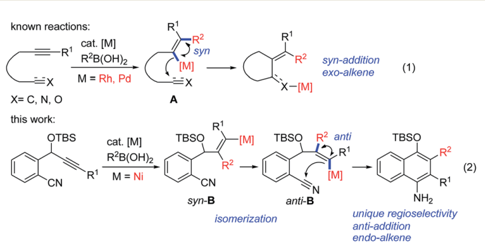
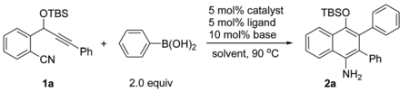
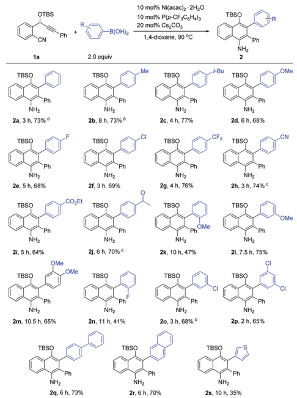
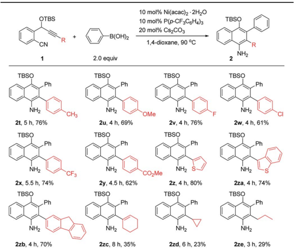
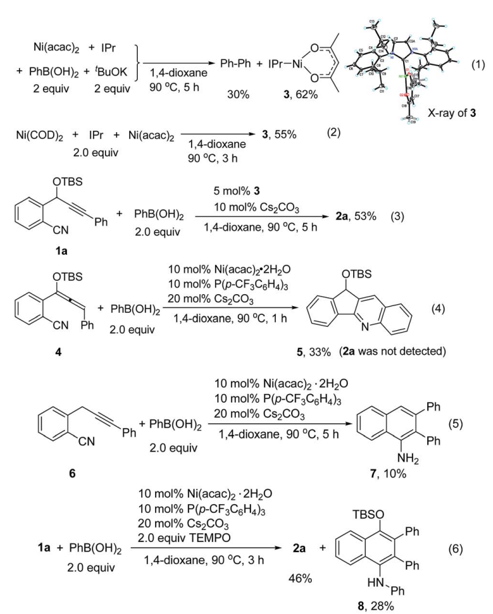
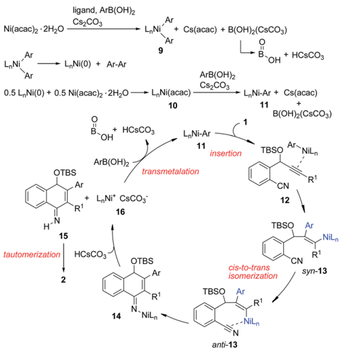

Open Access known reactions:

cat. [MJ

R2

R'B(OH)2

→ syn

- [M]|

R-B(OH)2

R'

R2

M = Ni

CN

## EDGE ARTICLE

Cite this: Chem. Sci. , 2016, 7 , 5815

Received 16th March 2016 Accepted 19th May 2016

DOI: 10.1039/c6sc01191h

www.rsc.org/chemicalscience

## Introduction

Transition-metal-catalyzed cascade reactions consisting of multiple carbometalation steps have attracted considerable attention in organic synthesis since these processes enable the rapid assembly of complex structures in an e ffi cient, atomeconomical and green manner. 1 Among these reactions, organoboron compounds are one of the most widely used reagents, not only due to their chemical stability and ready availability, but also because they can undergo a series of addition reactions to unsaturated compounds such as alkynes, dienes, enones, aldehydes/ketones, nitriles and isocyanates etc. in the presence of a transition metal catalyst, especially Rh, Pd or Ni complexes. 2 The development of cascade reactions by combining di ff erent types of these elemental reactions is undoubtedly important and attractive. In this regard, cascade reactions involving the addition of organoboron compounds to alkynes as the initial step have been realized mainly through Rh1 b , c ,3 or Pd-catalysis, 4 as reported by Murakami, Hayashi, Lu and other groups. These catalytic reactions generally proceed by syn -1,2-addition of the organometal species generated through transmetalation between the organoboron and the metal complex across the carbon -carbon triple bond, followed by nucleophilic attack of the resulting alkenylmetal on the remaining electrophile (Scheme 1, eqn (1)). So far most of the reported reactions proceed via formation of regioisomer A in which the R 2 group of R 2 B(OH)2 locates on a carbon adjacent to the alkyne terminus R 1 , leading

State Key Laboratory of Organometallic Chemistry, Shanghai Institute of Organic Chemistry, Chinese Academy of Sciences, 345 Lingling Road, Shanghai 200032, China. E-mail: yhliu@sioc.ac.cn

† Electronic supplementary information (ESI) available. CCDC 1440646 and 1440647. For ESI and crystallographic data in CIF or other electronic format see DOI: 10.1039/c6sc01191h

=x

X= C, N, O

this work:

CN

R2

- [M]|

TBSO

syn-addition exo-alkene

R° anti

R1

(1)

TBSO

R2

RI

NHz unique regioselectivity

anti-addition endo-alkene

## Nickel-catalyzed cyclization of alkyne-nitriles with organoboronic acids involving anti -carbometalation of alkynes †

Xingjie Zhang, Xin Xie and Yuanhong Liu*

A nickel-catalyzed regioselective addition/cyclization of o -(cyano)phenyl propargyl ethers with arylboronic acids has been developed, which provides an e ffi cient protocol for the synthesis of highly functionalized 1-naphthylamines with wide structural diversity. The reaction is characterized by a regioselective and anti -addition of the arylboronic acids to the alkyne and subsequent facile nucleophilic addition of the resulting alkenylmetal to the tethered cyano group. Mechanistic studies reveal that a Ni(I) species might be involved in the catalytic process.

to an exo -alkene upon cyclization 3,4 (Scheme 1, eqn (1)). Cyclizations involving the regioselective formation of the alkenylmetal with a metal a -to the R 1 substituent such as syn -B are quite rare 5 (Scheme 1, eqn (2)), possibly because the subsequent cyclization process will involve a highly strained transition state. Thus, the development of new cyclization systems with controlled regiochemistry towards B is highly challenging. During our studies on nickel-catalyzed reactions, we found that such a transformation could be achieved by the addition of organoboron compounds to benzene-tethered alkyne-nitriles utilizing nickel as the catalyst, possibly through the isomerization of syn -B to anti -B. Herein, we report the  rst example of a nickel-catalyzed carboarylative cyclization of alkyne-nitriles with organoboronic acids involving regioselective and anti -carbonickelation of alkynes, which provides an e ffi cient protocol for the synthesis of highly functionalized 1-naphthylamines. In addition, mechanistic studies revealed that Ni(I) species 6 rather than Ni(II) species were involved as the key intermediates, which has not been reported in Nicatalyzed boron addition reactions.

Scheme 1 Metal-catalyzed cascade addition/cyclization reactions.

(2)

View Article Online View Journal | View Isue

## Results and discussion

We chose the nickel-catalyzed reaction of o -(cyano)phenyl propargyl ether 7 1a and phenylboronic acid as a model reaction for the optimization of the reaction conditions. Initially, we examined the reactions in the presence of Ni(COD)2 and various phosphine ligands such as PPh3 in 1,4-dioxane at 90  C. However, only a trace of the desired cyclization product was observed, along with some byproducts (Table 1, entry 1). Replacing Ni(COD)2 with a Ni(II) complex, Ni(acac)2 $ 2H2O (acac ¼ acetylacetonate), a ff orded the cyclized product 4-OTBSsubstituted 1-naphthylamine 2a , albeit in only 17 -18% yields (entries 2 -3). To our delight, the addition of 10 mol% of t BuOK as a base improved the yield of 2a dramatically to 66% within a short reaction time (entry 4). The results suggest that a base is necessary for this reaction, possibly for promoting the transmetalation step by formation of a borate 8 with the organoboronic acid. The structure of 2a also revealed that arylation in the initial step occurred regioselectively on the alkyne carbon that is closer to the OTBS group. Subsequently, the e ff ects of bases, phosphine ligands and solvents were evaluated. Of the various bases, Cs2CO3 gave the best result (73%, entry 5). Increasing the catalytic loading of Cs2CO3 to 20 mol% had little

Table 1 Optimization studies for the formation of 1-naphthylamine 2a

| Entry   | Catalyst            | Ligand                   | Base        | Solvent     |   Time [h] | Yield a [%]   |
|---------|---------------------|--------------------------|-------------|-------------|------------|---------------|
| 1       | Ni(COD) 2           | PPh 3 b                  | -           | 1,4-Dioxane |          3 | Trace         |
| 2       | Ni(acac) 2 $ 2H 2 O | PPh 3                    | -           | 1,4-Dioxane |         24 | 18            |
| 3       | Ni(acac) 2 $ 2H 2 O | P( p -CF 3 C 6 H 4 ) 3   | -           | 1,4-Dioxane |         24 | 17            |
| 4       | Ni(acac) 2 $ 2H 2 O | P( p -CF 3 C 6 H 4 ) 3   | t BuOK      | 1,4-Dioxane |          4 | 66            |
| 5       | Ni(acac) 2 $ 2H 2 O | P( p -CF 3 C 6 H 4 ) 3   | Cs 2 CO 3   | 1,4-Dioxane |          3 | 73            |
| 6       | Ni(acac) 2 $ 2H 2 O | P( p -CF 3 C 6 H 4 ) 3   | CsF         | 1,4-Dioxane |          6 | 67            |
| 7       | Ni(acac) 2 $ 2H 2 O | P( p -CF 3 C 6 H 4 ) 3   | K 2 CO 3    | 1,4-Dioxane |         10 | 31            |
| 8       | Ni(acac) 2 $ 2H 2 O | P( p -CF 3 C 6 H 4 ) 3   | Cs 2 CO 3 c | 1,4-Dioxane |          3 | 68            |
| 9       | Ni(acac) 2 $ 2H 2 O | P( p -CF 3 C 6 H 4 ) 3   | Cs 2 CO 3 d | 1,4-Dioxane |         10 | 8 (59)        |
| 10 e    | Ni(acac) 2 $ 2H 2 O | P( p -CF 3 C 6 H 4 ) 3   | Cs 2 CO 3   | 1,4-Dioxane |          3 | 74            |
| 11      | Ni(acac) 2 $ 2H 2 O | PPh 3                    | Cs 2 CO 3   | 1,4-Dioxane |          5 | 69            |
| 12      | Ni(acac) 2 $ 2H 2 O | P( p -MeC 6 H 4 ) 3      | Cs 2 CO 3   | 1,4-Dioxane |          4 | 68            |
| 13      | Ni(acac) 2 $ 2H 2 O | P(C 6 F 5 ) 3            | Cs 2 CO 3   | 1,4-Dioxane |          5 | 63            |
| 14      | Ni(acac) 2 $ 2H 2 O | PPh 2 Me                 | Cs 2 CO 3   | 1,4-Dioxane |          7 | 45            |
| 15      | Ni(acac) 2 $ 2H 2 O | PCy 3                    | Cs 2 CO 3   | 1,4-Dioxane |         17 | 55            |
| 16      | Ni(acac) 2 $ 2H 2 O | IPr                      | Cs 2 CO 3   | 1,4-Dioxane |          6 | 64            |
| 17      | Ni(acac) 2 $ 2H 2 O | IPr                      | t BuOK      | 1,4-Dioxane |          7 | 62            |
| 18      | Ni(acac) 2 $ 2H 2 O | P( p -CF 3 C 6 H 4 ) 3   | Cs 2 CO 3   | THF         |          8 | 64            |
| 19      | Ni(acac) 2 $ 2H 2 O | P( p -CF 3 C 6 H 4 ) 3   | Cs 2 CO 3   | Toluene     |          3 | 68            |
| 20 f    | Ni(acac) 2 $ 2H 2 O | P( p -CF 3 C 6 H 4 ) 3   | Cs 2 CO 3   | 1,4-Dioxane |          6 | 57            |
| 21      | Ni(acac) 2          | P( p -CF 3 C 6 H 4 ) 3   | Cs 2 CO 3   | 1,4-Dioxane |          3 | 72            |
| 22      | Ni(COD) 2           | P( p -CF 3 C 6 H 4 ) 3 b | Cs 2 CO 3   | 1,4-Dioxane |          9 | Trace         |
| 23      | Ni(acac) 2 $ 2H 2 O | -                        | Cs 2 CO 3   | 1,4-Dioxane |          5 | 65            |
| 24      | -                   | P( p -CF 3 C 6 H 4 ) 3   | Cs 2 CO 3   | 1,4-Dioxane |         10 | (99)          |

|

e ff ect on the yield of 2a (entry 8). However, when a stoichiometric amount of Cs2CO3 was used, the yield was reduced rapidly (entry 9). It was remarkable that, unlike the use of more than one equivalent of base in most of the transition metalcatalyzed reactions involving organoborons, here only catalytic amounts of base were needed. Increasing the catalyst loading did not improve the yield of the product (entry 10). Triarylphosphine ligands and the N-heterocyclic carbene ligand IPr (IPr ¼ 1,3-bis(2,6-diisopropylphenyl)imidazole-2-ylidene) were also e ff ective, while ligands such as PPh2Me and PCy3 were less e ffi cient (entries 11 -17). Changing the solvent to THF or toluene a ff orded 2a in satisfactory yields of 64 -68% (entries 18 -19). Addition of one equivalent of H2O as a promoter or proton source did not a ff ord a better result (entry 20). Ni(acac)2 also catalyzed the reaction e ffi ciently (entry 21). When Ni(COD)2 was used as the catalyst, only trace amounts of 2a were obtained (entry 22). Without the phosphine ligand, the reaction also proceeded to a ff ord 2a in 65% yield, albeit with a longer reaction time (entry 23). Without a nickel catalyst, no reaction occurred (entry 24). On the basis of the above optimization studies, the reaction conditions shown in Table 1, entry 5 were chosen as the best conditions.

Open Access

OTBS

OTBS

CNI

CN

1a

TBSO

TBSO

NH2

NH2

TBSO

TBSO

NH2

NH2

NH2

NH2

NHг

10 mol% Ni(acac)2 - 2H20

10 mol% Ni(acac)2 · 2H20

10 mol% P(p-CF3C6H4)3

20 mol% CS2CO3

10 mol% P(p-CF3C6H4)3

20 mol% Cs2CO3

1,4-dioxane, 90 °C

Ph

Next, we proceeded to investigate the scope of this new cascade addition/cyclization reaction catalyzed by Ni(acac)2-$ 2H2O. The reactivity of various organoboronic acids was  rst examined using 1a as a reaction partner (Table 2). During this process, we found that the 5 mol% catalyst loading was not e ff ective in some cases and thus 10 mol% Ni(acac)2 $ 2H2O, 10 mol% P( p -CF3C6H4)3 and 20 mol% Cs2CO3 were used in most of the cases to achieve better product yields. As shown in Table 2, a wide range of diversely substituted aryl- or heteroaryl-boronic acids were suitable for this reaction, leading to the desired 1-naphthylamines 2a -2s in generally good to high yields. Arylboronic acids bearing electron-donating groups such as p -Me, p -t Bu and p -MeO or electron-withdrawing groups such as p -F, p -Cl, p -CF3, p -CN, p -CO2Et and p -Ac on the aryl ring underwent the cyclization smoothly to provide the corresponding 1-naphthylamines 2b -2j in 64 -77% yields, and these functional groups were well tolerated during the reaction. Of note is that the CN and Ac groups remained intact under the reaction conditions, and no nickel-catalyzed boron additions to these groups were observed. The results indicated that electron-poor or -rich aryl substituents on the arylboronic acid had little in  uence on the NH2

Ph

1,4-dioxane, 90 °C

Ph

Ph

NH2

NH2

NH2

Table 2 Scope of the reaction with respect to arylboronic acids a

B(OH)2

-B(OH)2

TBSO

TBSO

yields of products 2 . The sterically demanding o -MeO substituted arylboronic acid a ff orded 2k with a longer reaction time and a lower yield of 47%, indicating that the reaction is markedly in  uenced by steric e ff ects. Arylboronic acids with -MeO or -Cl substituents at the 3-, 3,4- or 3,5-positions of the phenyl ring, or with a biphenyl or 2-naphthyl ring transformed into products 2l -2m and 2o -2r e ffi ciently in good yields. The use of 2- uorophenylboronic acid gave 2n in 41% yield. 2Thienylboronic acid also participated in this cascade reaction, albeit with a lower yield of 2s . However, when alkylboronic acids such as n -butylboronic acid were employed, no desired product was obtained.

The scope of o -(cyano)phenyl propargyl ethers was then examined (Table 3). A variety of electron-donating and -withdrawing groups on the aryl rings at the alkyne terminus were found to be compatible, such as p -Me, p -OMe, p -F, p -Cl, p -CF3 and p -CO2Me substituents, and the corresponding products 2t -2y were formed in 61 -76% yields. Interestingly, in contrast to the results of the reaction of 1a with 2-thienylboronic acid, the presence of a 2-thienyl or 3-benzothienyl ring as the alkyne terminal did not have much in  uence on the reaction, and the corresponding products 2z and 2za were obtained in high yields of 80% and 74%, respectively. A 9 H - uorene substituent, which is a very useful unit in organofunctional materials, was also successfully incorporated into the product 2zb in 70% yield. Alkenyl or alkyl-substituted alkynes, such as cyclohexenyl, cyclopropyl and propyl-substituted ones, however, a ff orded the desired products 2zc -2ze in low yields of 23 -35%. The structure of the 1-naphthylamine product was unambiguously con  rmed by X-ray crystallographic analysis of 2o . 9 1-Naphthylamines are important structural motifs found in a variety of biologically active substances. They also act as useful building blocks in

Table 3 Scope of the o -(cyano)phenyl propargyl ethers a

Open Access ligand, ArB(OH)2

CS2CO3

+ PhB (OH)2 + 'BuOK

2 equiv

1,4-dioxane

(1)

synthetic chemistry and the dyestu ff s industry. However, e ffi cient methods for their synthesis are quite limited. 10 Our reaction provides a convenient route to 1-naphthylamines. 2 equiv 90 °C, 5 h

L„Ni

To understand the reaction mechanism, we tried to isolate the possible reaction intermediates. First, a stoichiometric reaction of Ni(acac)2 (1 equiv.), IPr (1 equiv.), PhB(OH)2 (2 equiv.) and t BuOK (2 equiv.) was carried out (Scheme 2, eqn (1)). It was found that in addition to a biphenyl product, a red crystalline compound IPrNi(acac) 3 was isolated in 62% yield. Complex 3 is paramagnetic as indicated by the appearance of broad signals in the 1 H NMR spectrum. The X-ray crystal analysis of 3 (ref. 9) clearly shows a rare, three-coordinate distorted T-shaped Ni(I) structure. 6 e , f When Cs2CO3 was used instead of t BuOK, the same Ni(I) complex was also observed, albeit in a low yield of 14%. In this case, a large amount of precipitate could be observed. The precipitate was assumed to be the PhB(OH)2 -Cs2CO3 adduct. Thus, the formation of this low-soluble adduct might prevent further reaction with the nickel complex. In fact, stirring a 1 : 1 mixture of PhB(OH)2 and Cs2CO3 in 1,4-dioxane at 90  C resulted in the formation of a large amount of white precipitate. This might also explain why the use of 1 equivalent of Cs2CO3 provided the cyclized product 2a in a low yield (Table 1, entry 9). Complex 3 might be formed by the comproportionation of Ni(0) and Ni(II) species. 6 c , d To con  rm this point, the stoichiometric reaction of Ni(COD)2 with Ni(acac)2 in the presence of IPr was carried out. To our delight, the same complex 3 was formed in moderate yield (Scheme 2, eqn (2)). This Ni(I) complex 3 was found to catalyze the cyclization of 1a OTBS CN 1a 4 6

Scheme 2 Mechanistic studies.

|

Ar

+ Cs(acac) + B(OH)2(CsCO3)

with PhB(OH)2 to a ff ord 2a (Scheme 2, eqn (3)), implying that the Ni(I) species was likely involved in the catalytic process. Recently, a Ni(I) species was proposed to be relevant in Nicatalyzed cross-coupling reactions. 6 Our results demonstrate that Ni(I) may also be involved in the Ni-catalyzed addition reactions of organoboron reagents to alkynes. In addition, the reaction of allene 4 with PhB(OH)2 under Ni-catalyzed conditions a ff orded indeno[1,2b ]quinoline 5 via base-promoted cyano-Schmittel cyclization, 7 while the desired 2a was not observed (Scheme 2, eqn (4)), indicating that the reaction does not involve the allene intermediate.

The origin of the regioselectivity in this reaction is not clear yet; it is possibly controlled by electronic factors in p -complex 12 (see Scheme 3). 11 To understand the role of the OTBS group, alkyne-nitrile 6 without the OTBS group was synthesized. The Ni-catalyzed reaction of 6 with PhB(OH)2 a ff orded only 10% of the desired naphthylamine 7 , along with small amounts of an unidenti  ed byproduct (Scheme 2, eqn (5)). The results indicate that the presence of the OTBS group is crucial for this reaction.

In addition, it was found that in the presence of a radical scavenger such as TEMPO, the desired 2a and an N -arylated product 8 were formed in 74% combined yield (Scheme 2, eqn (6)). 8 was possibly formed by the Ni-catalyzed oxidative amination of the arylboronic acid with amine 2a . 12,13 The results indicate that the reaction was not inhibited by TEMPO, and this suggests that a radical species is not involved in this system.

Based on the above results, we propose the following reaction mechanism (Scheme 3). Initially, transmetalation of the arylboronic acid with the Ni(II) complex, promoted by a base, provides diarylnickel(II) species 9 , together with HOBO, HCsCO3 and Cs(acac). 14 9 undergoes reductive elimination to form a Ni(0) species. The observation of biphenyl 15 in the catalytic reaction of 1a with PhB(OH)2 also indicates that Ni(II) was

Scheme 3 Possible reaction mechanism.

reduced in the reaction process. This Ni(0) species comproportionates with Ni(II) to a ff ord Ni(I) complex 10 , which undergoes transmetalation with the arylboronic acid to give arylnickel(I) species 11 . Regioselective 1,2-addition of arylnickel(I) species 11 to the alkyne moiety in a syn -fashion takes place to give an alkenylnickel(I) intermediate syn -13 . cis -totrans isomerization of 13 , 16 possibly through a carbene-like zwitterionic resonance species 17 yields alkenylnickel(I) intermediate anti -13 with a metal trans -to the Ar substituent. It was noted that most of the metal-catalyzed reactions of organoborons to alkynes gave the syn -addition product while few reactions produced the anti -addition product. 2 r ,17 The regio- and stereochemistry for the addition process here are consistent with those observed for the cobalt(II)-catalyzed hydroarylation of propargyl-alcohols or -carbamates with arylboronic acids. 18 The cyano group may play a role in facilitating the cis -trans isomerization by stabilizing the metal species and directing the subsequent addition reaction. Nucleophilic attack of the alkenylmetal in anti -13 to the cyano group forms a cyclized intermediate 14 . Subsequent protonation of 14 produces the N -H imine 15 and a nickel(I) species 16 . Tautomerization of 15 a ff ords the observed product 2 . 16 undergoes transmetalation with ArB(OH)2 to regenerate the arylnickel(I) catalyst 11 .

## Conclusions

In summary, we have developed a nickel-catalyzed regioselective addition/cyclization of o -(cyano)phenyl propargyl ethers with arylboronic acids, which provides an e ffi cient protocol for the synthesis of highly functionalized 1-naphthylamines with wide structural diversity. The reaction is characterized by a regioselective and anti -addition of the arylboronic acids to the alkyne and subsequent facile nucleophilic addition of the resulting alkenylmetal to the tethered cyano group. Mechanistic studies reveal that a Ni(I) species might be involved in the catalytic process. Further mechanistic studies and the extension to alkynes tethered with a wide variety of electrophiles are currently ongoing in our laboratory.

## Acknowledgements

We thank the National Natural Science Foundation of China (Grant No. 21125210, 21421091) for  nancial support.

## Notes and references

- 1 For reviews, see: ( a ) E. Negishi, C. Cop´ eret, S. Ma, S.-Y. Liou and F. Liu, Chem. Rev. , 1996, 96 , 365 -393; ( b ) T. Miura and M. Murakami, Chem. Commun. , 2007, 217 -224; ( c ) S. W. Youn, Eur. J. Org. Chem. , 2009, 2597 -2605.
- 2 For selected papers, see: for Rh: ( a ) M. Sakai, M. Ueda and N. Miyaura, Angew. Chem., Int. Ed. , 1998, 37 , 3279 -3281; ( b ) T. Hayashi, K. Inoue, N. Taniguchi and M. Ogasawara, J. Am. Chem. Soc. , 2001, 123 , 9918 -9919; ( c ) C. G. Frost and K. J. Wadsworth, Chem. Commun. , 2001, 2316 -2317; ( d ) M. Murakami and H. Igawa, Chem. Commun. , 2002, 390 -391; ( e ) T. Matsuda, M. Makino and M. Murakami, Org.
- Lett. , 2004, 6 , 1257 -1259; ( f ) H. Shimizu and M. Murakami, Chem. Commun. , 2007, 2855 -2857; ( g ) T. Miura, Y. Takahashi and M. Murakami, Chem. Commun. , 2007, 3577 -3579; ( h ) T. Matsuda, Y. Suda and A. Takahashi, Chem. Commun. , 2012, 48 , 2988 -2990. For Pd: ( i ) T. Nishikata, Y. Yamamoto and N. Miyaura, Angew. Chem., Int. Ed. , 2003, 42 , 2768 -2770; ( j ) C. H. Oh, T. W. Ahn and R. Reddy, Chem. Commun. , 2003, 2622 -2623; ( k ) Y. Bai, J. Yin, W. Kong, M. Mao and G. Zhu, Chem. Commun. , 2013, 49 , 7650 -7652. For Ni: ( l ) E. Shirakawa, G. Takahashi, T. Tsuchimoto and Y. Kawakami, Chem. Commun. , 2001, 2688 -2689; ( m ) E. Shirakawa, G. Takahashi, T. Tsuchimoto and Y. Kawakami, Chem. Commun. , 2002, 2210 -2211; ( n ) K. Hirano, H. Yorimitsu and K. Oshima, Adv. Synth. Catal. , 2006, 348 , 1543 -1546; ( o ) J. D. Sieber, S. Liu and J. P. Morken, J. Am. Chem. Soc. , 2007, 129 , 2214 -2215; ( p ) K. Hirano, H. Yorimitsu and K. Oshima, Org. Lett. , 2007, 9 , 5031 -5033; ( q ) Y.-C. Wong, K. Parthasarathy and C.-H. Cheng, Org. Lett. , 2010, 12 , 1736 -1739; ( r ) D. W. Robbins and J. F. Hartwig, Science , 2011, 333 , 1423 -1427. So far only two reports involving Ni-catalyzed hydroarylation of alkynes with arylboronic acids have been published, see ref. 2l and r.
- 3 ( a ) R. Shintani, K. Okamoto, Y. Otomaru, K. Ueyama and T. Hayashi, J. Am. Chem. Soc. , 2005, 127 , 54 -55; ( b ) T. Miura, M. Shimada and M. Murakami, J. Am. Chem. Soc. , 2005, 127 , 1094 -1095; ( c ) T. Matsuda, M. Makino and M. Murakami, Angew. Chem., Int. Ed. , 2005, 44 , 4608 -4611; ( d ) T. Miura, M. Shimada and M. Murakami, Synlett , 2005, 667 -669; ( e ) T. Miura, H. Nakazawa and M. Murakami, Chem. Commun. , 2005, 2855 -2856; ( f ) T. Miura, T. Sasaki, T. Harumashi and M. Murakami, J. Am. Chem. Soc. , 2006, 128 , 2516 -2517; ( g ) T. Miura, Y. Takahashi and M. Murakami, Org. Lett. , 2007, 9 , 5075 -5077; for Rhcatalyzed reaction of arylboronic acids with alkyne-nitriles to exo -alkenes, see ref. 3e.
- 4 ( a ) J. Song, Q. Shen, F. Xu and X. Lu, Org. Lett. , 2007, 9 , 2947 -2950; ( b ) T. Miura, T. Toyoshima, Y. Takahashi and M. Murakami, Org. Lett. , 2008, 10 , 4887 -4889; ( c ) H. Tsukamoto, T. Suzuki, T. Uchiyama and Y. Kondo, Tetrahedron Lett. , 2008, 49 , 4174 -4177; ( d ) X. Han and X. Lu, Org. Lett. , 2010, 12 , 108 -111; ( e ) K. Shen, X. Han and X. Lu, Org. Lett. , 2012, 14 , 1756 -1759.
- 5 For a Pd(0)-catalyzed cyclization of alkynals or alkynones involving formal anti-addition of organoboronic reagents via a di ff erent reaction mechanism, see: H. Tsukamoto, T. Ueno and Y. Kondo, J. Am. Chem. Soc. , 2006, 128 , 1406 -1407.
- 6 ( a ) T. J. Anderson, G. D. Jones and D. A. Vicic, J. Am. Chem. Soc. , 2004, 126 , 8100 -8101; ( b ) G. D. Jones, C. McFarland, T. J. Anderson and D. A. Vicic, Chem. Commun. , 2005, 4211 -4213; ( c ) G. Yin, I. Kalvet, U. Englert and F. Schoenebeck, J. Am. Chem. Soc. , 2015, 137 , 4164 -4172; ( d ) L. M. Guard, M. Mohadjer Beromi, G. W. Brudvig, N. Hazari and D. J. Vinyard, Angew. Chem., Int. Ed. , 2015, 54 , 13352 -13356. For Ni(I) complexes containing NHC ligands, see: Ni(IPr)2Cl: ( e ) S. Miyazaki, Y. Koga,

- T. Matsumoto and K. Matsubara, Chem. Commun. , 2010, 46 , 1932 -1934; Ni(IMes)2X: ( f ) K. Zhang, M. Conda-Sheridan, S. R. Cooke and J. Louie, Organometallics , 2011, 30 , 2546 -2552.
2. 7 For our recent results on cyano-Schmittel cyclization of ( o -cyano)phenylpropargyl ethers, see: X. You, X. Xie, H. Chen, Y. Li and Y. Liu, Chem. -Eur. J. , 2015, 21 , 18699 -18705.
3. 8 Y. Makida, E. Marelli, A. M. Z. Slawin and S. P. Nolan, Chem. Commun. , 2014, 50 , 8010 -8013.
4. 9 CCDC 1440646 ( 2o ) and 1440647( 3 ) contain the supplementary crystallographic data for this paper. †
5. 10 ( a ) P. Sagar, R. Fr¨ ohlich and E.-U. W¨ urthwein, Angew. Chem., Int. Ed. , 2004, 43 , 5694 -5697; ( b ) Q. Shen and J. F. Hartwig, J. Am. Chem. Soc. , 2006, 128 , 10028 -10029; ( c ) S.-C. Zhao, X.-Z. Shu, K.-G. Ji, A.-X. Zhou, T. He, X.-Y. Liu and Y.-M. Liang, J. Org. Chem. , 2011, 76 , 1941 -1944; ( d ) R. S. Reddy, P. K Prasad, B. B. Ahuja and A. Sudalai, J. Org. Chem. , 2013, 78 , 5045 -5050; ( e ) P. Gao, J. Liu and Y. Wei, Org. Lett. , 2013, 15 , 2872 -2875; ( f ) W. P. Hong, A. V. Iosub and S. S. Stahl, J. Am. Chem. Soc. , 2013, 135 , 13664 -13667.
6. 11 A. Arcadi, M. Aschi, M. Chiarini, G. Ferrara and F. Marinelli, Adv. Synth. Catal. , 2010, 352 , 493 -498.
7. 12 D. S. Raghuvanshi, A. K. Gupta and K. N. Singh, Org. Lett. , 2012, 14 , 4326 -4329.
8. 13 The reaction of amine 2a with phenylboronic acid under the reaction conditions shown in Scheme 2, eqn (6) gave 8 in 43% yield.
9. 14 P.-S. Lin, M. Jeganmohan and C.-H. Cheng, Chem. -Asian J. , 2007, 2 , 1409 -1416.
10. 15 Without ligand, only biphenyl was observed. With 10 mol% of P( p -CF3C6H4)3 as the ligand, in addition to biphenyl, 4,4 0 -bis(tri  uoromethyl)biphenyl and 4-(tri  uoromethyl) biphenyl were also observed, possibly due to aryl transfer from the phosphine ligand. See: I. Colon and D. R. Kelsey, J. Org. Chem. , 1986, 51 , 2627 -2637.
11. 16 A. Yamamoto and M. Suginome, J. Am. Chem. Soc. , 2005, 127 , 15706 -15707.
12. 17 M. Murakami, T. Yoshida, S. Kawanami and Y. Ito, J. Am. Chem. Soc. , 1995, 117 , 6408 -6409.
13. 18 P.-S. Lin, M. Jeganmohan and C.-H. Cheng, Chem. -Eur. J. , 2008, 14 , 11296 -11299.