rg

Open Access /

Open Access Article. Published on 10 July 2017. Downloaded on 6/420 10:82 AM.

*

Secondary amide transamidation

R"

2° or 3° amide

Solutions

· Activate amide C-N bond

· High kinetic barrier

· Unfavorable thermodynamics/thermoneutrality

· Perturb thermodynamics

## EDGE ARTICLE

Activation

N-R

5

Cite this: Chem. Sci. , 2017, 8 , 6433

HN - RI

2

Received 3rd May 2017 Accepted 8th July 2017

DOI: 10.1039/c7sc01980g rsc.li/chemical-science

## Introduction

The ability to convert one amide to another, known as the transamidation reaction, represents a long-standing synthetic challenge. 1,2 Although signi  cant progress has been made with regard to the transamidation of 1  amides, 3 the corresponding reaction involving secondary amides ( 1 + 2 / 3 + 4 ) has remained largely underdeveloped (Fig. 1). Two factors are primarily responsible for the di ffi culty of this transformation. First, the kinetic barrier to break the amide C -N bond is considered high because of well-known resonance e ff ects. 4 The second complication stems from thermodynamics, as the energetics of starting materials and products in transamidation reactions are o  en comparable, resulting in thermoneutral rections. 1 a ,5

Despite these challenges, several breakthroughs have been reported with regard to secondary amide transamidation. Gellman and Stahl utilized a dimeric aluminum complex to a ff ect secondary amide transamidation, albeit with equilibrium mixtures resulting, thus highlighting the di ffi culty regarding thermodynamics. 6 Bertrand has reported a means to achieve secondary amide transamidation of simple substrates using excess AlCl3. 7 In both of these cases, the transamidation is made

Department of Chemistry and Biochemistry, University of California, 607 Charles Young Drive East, Box 951569, Los Angeles, CA 90095, USA. E-mail: neilgarg@ chem.ucla.edu

† Electronic supplementary information (ESI) available. See DOI: 10.1039/c7sc01980g

‡ These authors contributed equally to this work.

R

HN -R

View Article Online View Journal  | View Issue

## Nickel-catalyzed transamidation of aliphatic amide derivatives †

6

Jacob E. Dander, ‡ Emma L. Baker ‡ and Neil K. Garg

Transamidation, or the conversion of one amide to another, is a long-standing challenge in organic synthesis. Although notable progress has been made in the transamidation of primary amides, the transamidation of secondary amides has remained underdeveloped, especially when considering aliphatic substrates. Herein, we report a two-step approach to achieve the transamidation of secondary aliphatic amides, which relies on non-precious metal catalysis. The method involves initial Bocfunctionalization of secondary amide substrates to weaken the amide C -N bond. Subsequent treatment with a nickel catalyst, in the presence of an appropriate amine coupling partner, then delivers the net transamidated products. The transformation proceeds in synthetically useful yields across a range of substrates. A series of competition experiments delineate selectivity patterns that should in fl uence future synthetic design. Moreover, the transamidation of Boc-activated secondary amide derivatives bearing epimerizable stereocenters underscores the mildness and synthetic utility of this methodology. This study provides the most general solution to the classic problem of secondary amide transamidation reported to date.

possible by Lewis acid activation of the amide carbonyl. Most recently, Szostak reported two simple protocols for achieving the transamidation of secondary amide derivatives, each with a focus on benzamide-derived substrates. The  rst uses Lewis base catalysis, 8 while the other utilizes Pd -NHC complexes. 9 Despite these discoveries, a general solution to the transamidation of aliphatic 2  amides has remained elusive.

In considering the challenges noted earlier, we sought to develop an alternative strategy to achieve the transamidation of

Fig. 1 Challenges associated with secondary amide transamidation and the two step-approach to realize this challenging synthetic transformation.

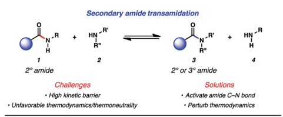

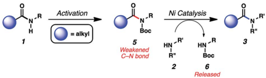

12 (10 mo10)

Boc

Pr pr

1.0

Ni(cod) 2, ligand

NaOfBu toluene, time, 60 °C

1.5 M

~Cy secondary amides. As summarized in Fig. 1, it was envisioned that N-functionalization of secondary amide substrates 1 could lead to weakening of the acyl amide C -N bond, 10 if the appropriate activating group was utilized. Electron-withdrawing groups, such as the Boc group, were viewed as ideal for this purpose, 11 given the ease by which Boc groups can be introduced. From the resulting Boc-activated secondary amide 5 , it was believed that oxidative addition with an appropriate nickel catalyst could occur through a reasonable kinetic process. In situ interception of this species with an amine nucleophile 2 would furnish transamidated product 3 . The process would be driven thermodynamically by the favorable release of carbamate 6 . 12

Encouraged by the successful activation of amide C -Nbonds using transition metal catalysis, as demonstrated by studies from Szostak, Shi, and our laboratory, 13 -17 we explored the sequence described above. In 2016, we validated this approach to achieve a two-step transamidation of N -Bn,Boc benzamide derivatives. 18 However, the corresponding reaction sequence using substrates derived from aliphatic secondary amides was unsuccessful. In this manuscript, we describe our e ff orts to overcome this hurdle, which have led to the nickel-catalyzed transamidation of aliphatic amide derivatives. The methodology presented herein o ff ers a robust solution to the classic problem of secondary aliphatic amide transamidation, and is expected to inform future e ff orts toward natural product synthesis and derivatization.

## Results and discussion

## Reaction discovery and optimization

To initiate our studies, we selected imide 7 , obtained by Bocactivation of the corresponding aliphatic amide, and cyclohexylamine ( 8 ) as the reaction partners (Table 1). As both coupling partners possess a -branching and are sterically hindered, they

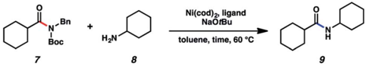

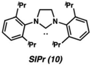

Table 1 Optimization of the reaction conditions

|   Entry |   Mol% of Ni(cod) 2 | Ligand (mol%)   | Mol% of NaO t Bu   |   Equiv. of 8 | Conc.   | Time   | Yield of 9 a   |
|---------|---------------------|-----------------|--------------------|---------------|---------|--------|----------------|
|       1 |                  10 | 10 (20 mol%)    | -                  |           2.0 | 1.0 M   | 24 h   | 15%            |
|       2 |                  10 | 11 (20 mol%)    | -                  |           2.0 | 1.0 M   | 24 h   | 0%             |
|       3 |                  10 | 12 (20 mol%)    | 22                 |           2.0 | 1.0 M   | 24 h   | 100%           |
|       4 |                   5 | 12 (10 mol%)    | 11                 |           2.0 | 1.0 M   | 24 h   | 100%           |
|       5 |                   5 | 12 (10 mol%)    | 11                 |           1.5 | 1.5 M   | 18 h   | 90%            |

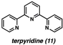

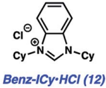

Open Access /

were considered excellent challenges for methodology development. We  rst tested the amidation using 10 mol% Ni(cod)2 and 20 mol% SIPr ( 10 ), to parallel the conditions we employed in our original disclosure involving benzamide substrates (entry 1). 18 As anticipated, only a low yield of amide 9 was obtained. We also tested terpyridine ( 11 ) as the ligand (entry 2), as this was shown to be e ff ective in promoting the Ni-catalyzed esteri  cation of aliphatic amide derivatives. 14e To our surprise, no reaction occurred, which prompted us to evaluate additional NHC ligands. We were delighted to  nd that use of ligand precursor 12 , in combination with NaO t Bu for in situ free-basing, a ff orded the desired amide product 9 in quantitative yield (entry 3). We attribute the improved competency of 12 (compared to 10 ) to its more electron-rich nature, which ultimately renders oxidative addition more facile. 19,20 Of note, the reaction also took place using lower amounts of catalyst, ligand, and base (entry 4). Finally, we found that by increasing the concentration, the equivalents of amine could be reduced from 2.0 to 1.5, while also allowing for shorter reaction times (entry 5). These conditions (entry 5) were found to be su ffi ciently general and were used to explore the reaction scope. Of note, in the absence of Ni(cod)2, no reaction occurs, thus demonstrating that the conversion of 7 to 9 is indeed catalyzed by nickel. 21 Likewise, Lewis base-promoted transamidation conditions were also deemed ine ff ective. 22

## Scope of methodology

Having arrived at suitable reaction conditions to achieve the transamidation of aliphatic amide derivative 7 , we explored the generality of our methodology by  rst varying the aliphatic amide partner (Fig. 2). Using cyclohexylamine ( 8 ), a variety of amide derivatives underwent the desired transamidation reaction. Beginning with the parent example, the desired amide product 9 was obtained in 82% isolated yield. Similarly, the corresponding cyclopentyl substrate could be utilized in the

Open Access /

R

Boc

13

21

(1.5 equiv)

(1.5 equiv)

8

IZ

14

2

Ni(cod) 2 (5 mol%)

Ni(cod)2 (10 mol%)

12 (10 mol%)

12 (20 mol%)

Ni(cod)2 (10 mol%)

NaOfBu (22 mol%)

NaOtBu (11 mol%)

12 (20 mol%)

NaOtBu (22 mol%)

toluene (1.5 M)

toluene (1.5 M)

60 °C, 18 h

60 °C, 18 h toluene (1.5 M)

60 °C, 18 h

25

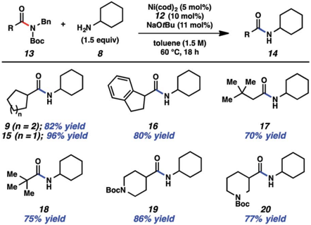

8

Boc

26

22

15 (n = 1); 96% yield

94% yield

9 (n = 2); 82% yield

91% yield of 9

Me

{Mo

Me

18

75% yield

29

Fig. 2 Variation of the amide substrate. Yields shown re fl ect the average of two isolation experiments.

transamidation reaction to furnish 15 in excellent yield. As a further test of the methodology, an indane substrate was evaluated and found to undergo smooth coupling to give amide 16 . Additionally, two substrates bearing sterically encumbered t -butyl groups were tested. When the t -butyl group was positioned on the alpha carbon, neopentylic amide 17 was obtained in 70% yield. Direct linkage of the t -butyl group to the amide carbonyl carbon also did not hinder the reaction, as judged by the formation of pivalamide 18 . Lastly, we evaluated two piperidinecontaining substrates, given the prevalence and importance of piperidines in medicinal chemistry. 23,24 In both cases, the desired secondary amides were obtained in synthetically useful yields, as shown by the formation of 19 and 20 .

As shown in Fig. 3, the scope of this methodology was not limited to N -benzylamide derivatives. For example, N -n -Bucontaining substrate 22 could be employed, thus demonstrating that the aromatic benzyl substituent was not critical for success. Additionally, a -branching was tolerated, as judged by the successful coupling of the isopropylamine-derived substrate 23 . The methodology also displayed notable tolerance to sterics, given that t -butylamine substrate 24 could be coupled with cyclohexylamine ( 8 ) to furnish 9 in 59% yield.

The scope of this methodology with respect to the amine nucleophile was also evaluated (Fig. 4). Several a -branched primary amines were tested, such as cyclopentyl amine, iso-

Fig. 3 Scope of the amide substrate N -substituent. Yields shown re fl ect the average of two isolation experiments.

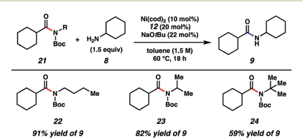

Boc

→R

R"

Fig. 4 Scope of the amine nucleophile. Yields shown re fl ect the average of two isolation experiments. a Yield determined by 1 H NMR analysis using 1,3,5-trimethoxybenzene as an internal standard.

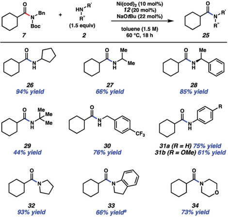

propylamine, and sec -phenethylamine. These experiments led to the desired amides, 26 -28 , respectively, in good to excellent yields. Even t -butylamine, which bears considerable steric hindrance, could be coupled as shown by the formation of 29 , albeit in somewhat diminished yield. p -Tri  uoromethylbenzylamine was also utilized and gave rise to amide 30 in 76% yield. This result showcases an unbranched primary amine nucleophile, while also incorporating the medicinally relevant -CF3 group. 25 The formation of 31a and 31b demonstrate that aniline and aniline derivatives can be utilized in this methodology. It should also be emphasized that secondary amines can be employed in the transamidation reaction to give tertiary amide products. The formation of 32 -34 , which relied on the use of pyrrolidine, indoline, and morpholine, respectively, are representative of this notion.

## Amine competition studies

With the aim of identifying selectivity patterns that may aid in synthetic design, a series of competition experiments were performed using substrate 7 and various amine nucleophiles (Fig. 5). First, we compared p -tri  uoromethylbenzylamine ( 35 ) and cyclohexylamine ( 8 ). The major product obtained was benzylamide 30 in 82% yield, with 9 being formed as the minor product. We attribute this selectivity to steric factors. Next, we compared p -tri  uoromethylbenzylamine ( 35 ) and pyrrolidine ( 36 ). This reaction gave nearly a 1 : 1 ratio of products 30 and 32 , suggesting a  ne balance between steric and electronic factors about the nucleophilic nitrogen in this case. In another comparison, pyrrolidine ( 36 ) and cyclohexylamine ( 8 ) were treated with amide 7 . Pyrrolidine-derived tertiary amide 32 was formed as the major product, rather than secondary amide 9 , consistent with the relative nucleophilicity of the amines being

Open Access /

7

Unbranched vs a-Branched Primary Amine

Ni(cod) 2 (3 mol%)

NaOtBu (6.6 mol%)

Boc

38

98% ee

N-Bn +

Boc

N-Bn

Boc

Boc

40

H2N

(1.5 equiv)

CFa

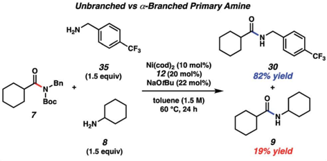

35

CF3

## Ni(cod)2 (10 mol%) 30

N- 8n

Boc

Boc

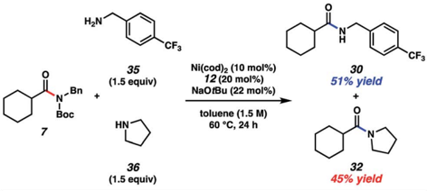

36

(1.5 equiv)

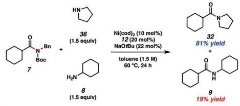

N-Bn

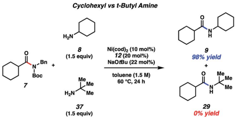

Boc

Fig. 5 A series of amine competition experiments. Yields determined by 1 H NMR analysis using hexamethylbenzene as an internal standard.

utilized. 26 Lastly, we performed a competition experiment between cyclohexylamine ( 8 ) and t -butylamine ( 37 ), which led to the exclusive formation of cyclohexylamide 9 , presumably as a result of steric factors.

As a  nal test of our methodology, we evaluated two substrates that each bear an epimerizable stereocenter (Fig. 6). Treatment of cyclohexenamide 38 with cyclohexylamine ( 8 ) under typical reaction conditions, notably using only 3 mol% Ni(cod)2, delivered amide 39 in 78% yield on gram-scale. Of note, product 39 was obtained in 90% ee, indicative of minimal racemization occurring. Attempts to couple proline-derived amide 40 using our standard reaction protocol, on the other

## Ni(cod)z (10 mol%) 12 (20 mol%)

12 (6 mol%)

toluene (1.5 M)

60 °C, 18 h

## Edge Article

Fig. 6 Transamidation of enantioenriched amide substrate 38 on gram-scale and transamidation of enantioenriched N -Boc proline substrate 40 using a modi fi ed protocol.

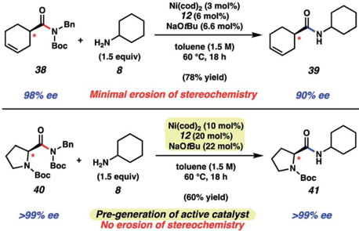

hand, led to substantial epimerization. We attribute this to the increased acidity of the substrate's a -proton relative to 38 . As a workaround, we developed a modi  ed protocol that involves free-basing of ligand 12 in the presence of Ni(cod)2 in toluene to access the active catalyst in solution. Addition of the catalyst solution and amine 8 to substrate 40 a ff orded amide 41 a  er 18 h at 60  C. Amide 41 was obtained in 60% yield and high optical purity. The mild and scalable nature of the reaction conditions bodes well for future synthetic applications.

## Conclusions

We have developed a facile approach to achieve the transamidation of secondary aliphatic amides, an unmet challenge in organic synthesis. Our strategy involves  rst preparing Bocactivated secondary amide derivatives and subsequently treating them with appropriate amine coupling partners under Nimediated reaction conditions. The methodology delivers secondary and tertiary amide products in synthetically useful yields across a range of substrates and amine nucleophiles. A variety of competition experiments were undertaken to reveal selectivity patterns, the results of which are expected to in  uence future synthetic design. Moreover, the transamidation of N-functionalized secondary amide derivatives bearing epimerizable stereocenters highlights the mildness and synthetic utility of this transformation. This study addresses the longstanding problem of secondary amide transamidation through the use of a general and mild nickel catalysis platform.

## Acknowledgements

The authors are grateful to the NIH (T32-GM067555 and R01GM117016), the NSF (DGE-1144087 for E. L. B.), the Foote Family (J. E. D. and E. L. B.), and the University of California, Los Angeles, for  nancial support. These studies were supported by shared instrumentation grants from the NSF (CHE1048804) and the NIH NCRR (S10RR025631).

## Notes and references

- 1 ( a ) M. E. Gonz´ alez-Rosende, E. Castillo, J. Lasri and J. Sep´ ulveda-Arques, Prog. React. Kinet. Mech. , 2004, 29 , 311 -332; ( b ) V. R. Pattabiraman and J. W. Bode, Nature , 2011, 480 , 471 -479; ( c ) A. Ojeda-Porras and D. J. GambaSanchez, J. Org. Chem. , 2016, 81 , 11548 -11555.
- 2 For a recent review on amide bond formation, see: R. M. Figueiredo, J.-S. Suppo and J.-M. Campagne, Chem. Rev. , 2016, 116 , 12029 -12122.
- 3 For primary amide transamidations, see: ( a ) T. A. Dineen, M. A. Zajac and A. G. Myers, J. Am. Chem. Soc. , 2006, 128 , 1419 -1422; ( b ) C. L. Allen, B. N. Atkinson and J. M. J. Williams, Angew. Chem., Int. Ed. , 2012, 51 , 1383 -1386; ( c ) L. Becerra-Figueroa, A. Ojeda-Porras and D. Gamba-S´ anchez, J. Org. Chem. , 2014, 79 , 4544 -4552; ( d ) S. N. Rao, D. C. Mohan and S. Adimurthy, Green Chem. , 2014, 16 , 4122 -4126; ( e ) S. N. Rao, D. C. Mohan and S. Adimurthy, Org. Lett. , 2013, 15 , 1496 -1499; ( f ) S. N. Rao, D. C. Mohan and S. Adimurthy, RSC Adv. , 2015, 5 , 95313 -95317.
- 4 ( a ) The Amide Linkage: Structural Signi  cance in Chemistry, Biochemistry, and Materials Science , ed. A. Greenberg, C. M. Breneman, and J. F. Liebman, John Wiley &amp; Sons, Inc., Hoboken, N.J., 2003; ( b ) L. Pauling, R. B. Corey and H. R. Branson, Proc. Natl. Acad. Sci. U. S. A. , 1951, 37 , 205 -211.
- 5 Z. Mucsi, G. A. Chass and I. G. Csizmadia, J. Phys. Chem. B , 2008, 112 , 7885 -7893.
- 6 S. E. Eldred, D. A. Stone, S. H. Gellman and S. S. Stahl, J. Am. Chem. Soc. , 2003, 125 , 3422 -4036.
- 7 E. Bon, D. C. H. Bigg and G. Bertrand, J. Org. Chem. , 1994, 59 , 4035 -4036.
- 8 Y. Liu, S. Shi, M. Achtenhagen, R. Liu and M. Szostak, Org. Lett. , 2017, 19 , 1614 -1617.
- 9 G. Meng, P. Lei and M. Szostak, Org. Lett. , 2017, 19 , 2158 -2161.
- 10 For studies on amide bond destabilization/activation, see: ( a ) A. Greenberg and C. A. Venanzi, J. Am. Chem. Soc. , 1993, 115 , 6951 -6957; ( b ) A. Greenberg, D. T. Moore and T. D. DuBois, J. Am. Chem. Soc. , 1996, 118 , 8658 -8668; ( c ) K. Tani and B. M. Stoltz, Nature , 2006, 441 , 731 -734; ( d ) A. J. Kirby, I. V. Komarov, P. D. Wothers and N. Feeder, Angew. Chem., Int. Ed. , 1998, 37 , 785 -786; ( e ) R. Szostak, S. Shi, G. Meng, R. Lalancette and M. Szostak, J. Org. Chem. , 2016, 81 , 8091 -8094; ( f ) V. Pace, W. Holzer, G. Meng, S. Shi, R. Lalancette, R. Szostak and M. Szostak, Chem. -Eur. J. , 2016, 22 , 14494 -14498; ( g ) R. Szostak, J. Aub´ e and M. Szostak, Chem. Commun. , 2015, 51 , 6395 -6398; ( h ) R. Szostak, G. Meng and M. Szostak, J. Org. Chem. , 2017, 82 , 6373 -6378.
- 11 S. K. Davidsen, P. D. May and J. B. Summers, J. Org. Chem. , 1991, 56 , 5482 -5485.
- 12 Z. Mucsi, G. A. Chass and I. G. Csizmadia, J. Phys. Chem. B , 2008, 112 , 7885 -7893.
- 13 For reviews on amide cross-couplings, see: ( a ) J. E. Dander and N. K. Garg, ACS Catal. , 2017, 7 , 1413 -1423; ( b ) G. Meng, S. Shi and M. Szostak, Synlett , 2016, 27 , 2530 -2540; ( c ) C. Liu and M. Szostak, Chem. -Eur. J. , 2017, 23 , 7157 -7173.
- 14 For nickel-catalyzed amide C -N bond activations from our laboratory, see: ( a ) L. Hie, N. F. Fine Nathel, T. K. Shah, E. L. Baker, X. Hong, Y.-F. Yang, P. Liu, K. N. Houk and N. K. Garg, Nature , 2015, 524 , 79 -83; ( b ) N. A. Weires, E. L. Baker and N. K. Garg, Nat. Chem. , 2016, 8 , 75 -79; ( c ) B. J. Simmons, N. A. Weires, J. E. Dander and N. K. Garg, ACS Catal. , 2016, 6 , 3176 -3179; ( d ) J. E. Dander, N. A. Weires and N. K. Garg, Org. Lett. , 2016, 18 , 3934 -3936; ( e ) L. Hie, E. L. Baker, S. M. Anthony, J.-N. Desrosiers, C. Senanayake and N. K. Garg, Angew. Chem., Int. Ed. , 2016, 55 , 15129 -15132.
- 15 For nickel-catalyzed amide C -N bond activations from other laboratories, see: ( a ) J. Hu, Y. Zhao, Y. Zhang and Z. Shi, Angew. Chem., Int. Ed. , 2016, 55 , 8718 -8722; ( b ) S. Shi, G. Meng and M. Szostak, Angew. Chem., Int. Ed. , 2016, 55 , 6959 -6963; ( c ) S. Shi and M. Szostak, Chem. -Eur. J. , 2016, 22 , 10420 -10424; ( d ) S. Shi and M. Szostak, Org. Lett. , 2016, 18 , 5872 -5875; ( e ) A. Dey, S. Sasmal, K. Seth, G. K. Lahiri and D. Maiti, ACS Catal. , 2017, 7 , 433 -437; ( f ) S. Shi and M. Szostak, Synthesis , 2017, 49 , DOI: 10.105/s-0036-1588845.
- 16 For Pd-catalyzed and Rh-catalyzed amide C -N bond activation studies, see: ( a ) G. Meng and M. Szostak, Org. Lett. , 2015, 17 , 4364 -4367; ( b ) G. Meng and M. Szostak, Org. Biomol. Chem. , 2016, 14 , 5690 -5705; ( c ) C. Liu, G. Meng, Y. Liu, R. Liu, R. Lalancette, R. Szostak and M. Szostak, Org. Lett. , 2016, 18 , 4194 -4197; ( d ) G. Meng and M. Szostak, Angew. Chem., Int. Ed. , 2015, 54 , 14518 -14522; ( e ) G. Meng, S. Shi and M. Szostak, ACS Catal. , 2016, 6 , 7335 -7339; ( f ) X. Li and G. Zou, Chem. Commun. , 2015, 51 , 5089 -5092; ( g ) G. Meng and M. Szostak, Org. Lett. , 2016, 18 , 796 -799; ( h ) C. Liu, G. Meng and M. Szostak, J. Org. Chem. , 2016, 81 , 12023 -12030; ( i ) P. Lei, G. Meng and M. Szostak, ACS Catal. , 2017, 7 , 1960 -1965;

(

j

) M. Cui, H. Wu, J. Jian, H. Wang, C. Liu, S. Daniel and

- Z. Zeng, Chem. Commun. , 2016, 52 , 12076 -12079; ( k ) H. Wu, Y. Li, M. Cui, J. Jian and Z. Zeng, Adv. Synth. Catal. , 2016, 358 , 3876 -3880.
2. 17 For reviews concerning Ni catalysis, see: ( a ) S. Z. Tasker, E. A. Standley and T. F. Jamison, Nature , 2014, 509 , 299 -309; ( b ) T. Mesganaw and N. K. Garg, Org. Process Res. Dev. , 2013, 17 , 29 -39; ( c ) B. M. Rosen, K. W. Quasdorf, D. A. Wilson, N. Zhang, A.-M. Resmerita, N. K. Garg and V. Percec, Chem. Rev. , 2011, 111 , 1346 -1416.
3. 18 E. L. Baker, M. M. Yamano, Y. Zhou, S. M. Anthony and N. K. Garg, Nat. Commun. , 2016, 7 , 11554.
4. 19 M. N. Hopkins, C. Richter, M. Schedler and F. Glorius, Nature , 2014, 510 , 485 -496.
5. 20 The corresponding coupling of 7 and 8 under standard reaction conditions ( e.g. , entry 5, Table 1 conditions) using the related 1,3-dicyclohexylimidazolium (ICy) chloride ligand salt gave 9 in 82% yield via 1 H NMR analysis using hexamethylbenzene as an external standard.

- 21 Control experiments using standard reaction conditions absent Ni(cod)2, as well as experiments performed without Ni(cod)2, 12 , and NaO t Bu led to minimal conversion to the desired transamidated product. See Section B of the ESI † for details.
- 22 The Lewis base-promoted transamidation of an unbranched N -Ph,Boc aliphatic amide derivative using benzylamine as nucleophile was recently demonstrated (see ref. 7). Attempts to utilize these conditions for the transamidation of less activated N -Bn,Boc aliphatic amide derivatives have thus far been unsuccessful. See Section I of the ESI † for details.
- 23 E. Vitaku, D. T. Smith and J. T. Njardarson, J. Med. Chem. , 2014, 57 , 10257 -10274.
- 24 A. Gomtsyan, Chem. Heterocycl. Compd. , 2012, 48 , 7 -10.
- 25 ( a ) S. Purser, P. R. Moore, S. Swallow and V. Gouverneur, Chem. Soc. Rev. , 2008, 37 , 320 -330; ( b ) W. K. Hagmann, J. Med. Chem. , 2008, 51 , 4359 -4369; ( c ) K. L. Kirk, Org. Process Res. Dev. , 2008, 12 , 305 -321; ( d ) C. Isanbor and D. O'Hagan, J. Fluorine Chem. , 2006, 127 , 303 -319.
- 26 According to ' Mayr's Database of Reactivity ' , the nucleophilicity parameter ( N ) of pyrrolidine is 17.21 and 12.00 for comparable i-PrNH2 in H2O (a nucleophilicity parameter is not reported for cyclohexylamine ( 8 )), http:// www.cup.lmu.de/oc/mayr/reaktionsdatenbank/fe/showclass/ 41.